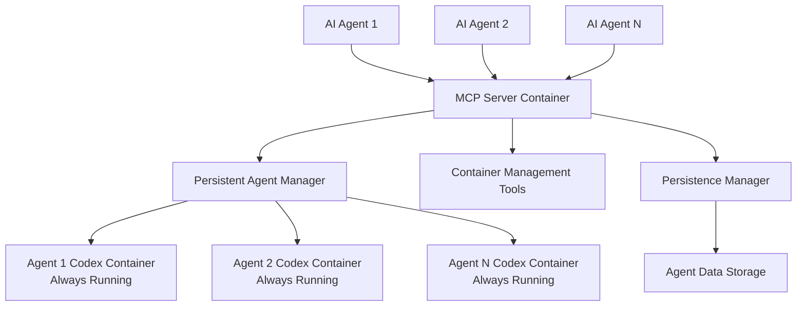

<div align="center">


# Codex CLI MCP Server

> **A streamlined Model Context Protocol server that provides AI agents with high-value code generation tools powered by OpenAI's Codex CLI. Focused on the software development workflow with just 4 essential tools.**

</div>

[](https://www.python.org/downloads/)
[](https://github.com/jlowin/fastmcp)
[](https://www.docker.com/)
[](LICENSE)

## Overview

This MCP server provides AI agents with **4 focused tools** that map directly to the software development workflow: **plan**, **implement**, **review**, and **fix**. Each tool is designed to maximize Codex CLI's code generation capabilities with rich context and structured responses.

**Perfect for agents that need:**
- Strategic implementation planning with context awareness
- Precise code generation with architectural guidance
- Quality code review with actionable feedback
- Intelligent debugging with root cause analysis

### Key Features

- **Persistent Agent Containers**: Each agent gets its own long-running Codex CLI environment
- **Context Preservation**: Full conversation history and workspace state maintained
- **Container Management**: Complete lifecycle management with monitoring tools
- **Real-time Collaboration**: Direct communication with always-running Codex instances
- **Production Ready**: Docker Compose orchestration with persistent storage
- **Easy Integration**: Standard MCP protocol for seamless agent connectivity

## Architecture



## Quick Start

### Prerequisites

- **Docker Engine 20.10+** with Docker Compose
- **Authentication Method** (choose one):
  - **ChatGPT Subscription** (recommended) - uses your existing ChatGPT quota
  - **OpenAI API Key** - separate billing per request
- **Git** for cloning the repository

### Installation

1. **Clone the repository**
   ```bash
   git clone https://github.com/your-org/codex-mcp-server.git
   cd codex-mcp-server
   ```

2. **Configure authentication** (choose one method)

   **Method A: ChatGPT Subscription OAuth (Recommended)**
   ```bash
   # No configuration needed - authenticate after starting the server
   # This uses your ChatGPT subscription quota
   ```

   **Method B: OpenAI API Key**
   ```bash
   # Create .env file with your OpenAI API key
   echo "OPENAI_API_KEY=your-openai-api-key-here" > .env
   ```

3. **Deploy the persistent agent architecture**
   ```bash
   # Start the MCP server and persistent infrastructure
   docker-compose --profile codex-mcp up -d
   ```

4. **Verify deployment**
   ```bash
   # Check services are running
   docker-compose ps

   # Check server health
   curl http://localhost:8210/health
   ```

## MCP Client Connections

With the persistent agent architecture, agents connect to the containerized MCP server instead of running local processes.

### Claude Code Configuration

```
claude mcp add --transport sse codex-mcp http://localhost:8210/sse --scope user
```

### Claude Desktop Configuration

Add this to your Claude Desktop MCP settings:

```json
{
  "mcpServers": {
    "codex-mcp": {
      "type": "sse",
      "url": "http://localhost:8210/sse"
    }
  }
}
```

### MCP Inspector

```bash
npx @modelcontextprotocol/inspector http://localhost:8210
```

### Manual Testing

```bash
# Test health endpoint
curl http://localhost:8210/health

# Test agent creation
curl -X POST http://localhost:8210/tools/codex_chat \
  -H "Content-Type: application/json" \
  -d '{"message": "Hello Codex", "agent_id": "test_agent"}'
```

## OAuth Authentication Setup

**Recommended: Use your ChatGPT Plus subscription instead of separate OpenAI API billing!**

**ZERO-CONFIG OAUTH**: The server automatically detects and uses existing OAuth tokens from your system - no manual configuration required!

### Quick OAuth Setup (Most Efficient)

**Step 1: Authenticate with Codex CLI on your host system**
```bash
# Install Codex CLI globally (if not already installed)
npm install -g @openai/codex

# Authenticate with your ChatGPT account
codex auth login
```

**Step 2: Start the MCP server**
```bash
# The server automatically detects and uses your OAuth tokens
docker-compose --profile codex-mcp up -d
```

**Step 3: Verify OAuth is working**
```bash
# Check that containers are using OAuth (not API key)
docker logs codex-mcp-server | grep -i oauth

# You should see: "Injecting OAuth tokens for ChatGPT subscription authentication"
```

That's it! **Automatic OAuth Detection works by:**
- **Auto-detecting** OAuth tokens in `~/.codex/auth.json`
- **Auto-mounting** tokens from Windows host to Linux containers
- **Auto-injecting** tokens into each agent container
- **Auto-switching** to your ChatGPT Plus subscription

**No configuration files needed! No environment variables to set!** The system detects your existing Codex CLI authentication and "just works".

### Verify OAuth Integration

**Check your subscription details:**
```bash
# See what authentication method is active
docker exec [container-name] cat ~/.codex/auth.json | head -5

# Should show: "OPENAI_API_KEY": null and "tokens": {...}
```

**Monitor agent containers:**
```bash
# Watch agent startup to confirm OAuth injection
docker logs -f [agent-container-name]

# Look for: "OAuth tokens injected successfully"
```

### Alternative Setup Methods

**If you don't have Codex CLI installed locally:**

1. **Use the integrated auth script**
   ```bash
   # Clone the repository first
   git clone https://github.com/your-org/codex-mcp-server.git
   cd codex-mcp-server

   # Run OAuth authentication
   python auth.py login
   ```

2. **Manual token setup**
   ```bash
   # Create OAuth directory
   mkdir -p ~/.codex

   # Add your ChatGPT tokens (get from browser dev tools)
   echo '{"tokens": {"access_token": "your-token"}}' > ~/.codex/auth.json
   ```

### How Automatic OAuth Detection Works

The server uses intelligent auto-detection with zero configuration:

```bash
# 1. Server starts and checks for OAuth tokens automatically
docker-compose --profile codex-mcp up -d

# 2. Detection happens in this order:
#    ~/.codex/auth.json (Windows/Linux/Mac)
#    $USERPROFILE/.codex/auth.json (Windows)
#    $HOME/.codex/auth.json (Linux/Mac)
#    Environment variables (fallback)

# 3. If OAuth found: Uses ChatGPT subscription
# 4. If no OAuth: Falls back to API key
```

**Smart path detection:**
- **Windows**: `C:\Users\YourName\.codex\auth.json`
- **Linux/Mac**: `~/.codex/auth.json`
- **Docker**: Automatically mounts from host to `/app/.codex`

### OAuth Configuration Options (Optional)

**Override automatic detection if needed:**
```bash
# Authentication preferences (usually not needed)
CODEX_AUTH_METHOD=auto                       # auto (default), api_key, or oauth
CODEX_PREFER_OAUTH=true                      # Prefer OAuth over API key (default)

# Custom OAuth directory (if tokens are elsewhere)
CODEX_AUTH_DIR=/custom/path/to/codex/dir

# OAuth client settings (for manual auth script only)
OAUTH_CLIENT_ID=codex-cli                    # OAuth client identifier
OAUTH_CALLBACK_PORT=8765                     # Local callback server port
OAUTH_AUTO_OPEN_BROWSER=true                 # Auto-open browser for auth
```

### OAuth Benefits

**Why choose OAuth over API keys:**
- **Use existing ChatGPT Plus subscription** (no separate billing)
- **Higher rate limits** compared to API keys
- **More secure** (tokens auto-refresh)
- **Better quota management** through ChatGPT interface
- **Simplified billing** (one subscription for everything)

### Troubleshooting OAuth

**OAuth not working? Check these:**

1. **Verify OAuth tokens exist:**
   ```bash
   # Check host system has OAuth tokens
   ls -la ~/.codex/auth.json
   cat ~/.codex/auth.json | grep -i "access_token"
   ```

2. **Confirm container mounting:**
   ```bash
   # Check if tokens are mounted in main container
   docker exec codex-mcp-server ls -la /app/.codex/
   docker exec codex-mcp-server cat /app/.codex/auth.json | head -5
   ```

3. **Verify agent injection:**
   ```bash
   # Check agent containers have injected tokens
   docker exec [agent-container] cat ~/.codex/auth.json | head -5

   # Should show OAuth tokens, not API key
   ```

**Common issues and fixes:**

- **"No OAuth tokens found"**: Run `codex auth login` on host system first
- **"Read-only file system"**: Normal - tokens are injected, not mounted in agents
- **"Still using API key"**: Check logs for OAuth injection success messages
- **"ChatGPT quota exceeded"**: Your subscription hit limits, wait for reset

**Switch back to API key if needed:**
```bash
# Set API key in .env file
echo "OPENAI_API_KEY=your-api-key" > .env
echo "CODEX_PREFER_OAUTH=false" >> .env

# Restart server
docker-compose --profile codex-mcp restart
```

## Configuration

### Environment Variables

Configure the server behavior through environment variables in your `.env` file:

| Variable | Description | Required | Default |
|----------|-------------|----------|---------|
| **Authentication** | | | |
| `OPENAI_API_KEY` | OpenAI API key for Codex CLI | Conditional* | - |
| `CHATGPT_OAUTH_TOKEN` | ChatGPT OAuth token (if provided) | No | - |
| `CODEX_AUTH_METHOD` | Authentication method (auto/api_key/oauth) | No | `auto` |
| `CODEX_PREFER_OAUTH` | Prefer OAuth over API key | No | `true` |
| **OAuth Configuration** | | | |
| `OAUTH_CLIENT_ID` | OAuth client identifier | No | `codex-cli` |
| `OAUTH_CALLBACK_PORT` | OAuth callback server port | No | `8765` |
| `OAUTH_CALLBACK_TIMEOUT` | OAuth timeout in seconds | No | `300` |
| `OAUTH_AUTO_OPEN_BROWSER` | Auto-open browser for OAuth | No | `true` |
| `OAUTH_TOKEN_STORAGE_PATH` | Custom token storage path | No | `~/.codex/auth.json` |
| **Codex Configuration** | | | |
| `CODEX_MODEL` | Codex model to use | No | `gpt-5` |
| `CODEX_PROVIDER` | AI provider | No | `openai` |
| `CODEX_APPROVAL_MODE` | Approval mode (suggest/auto/manual) | No | `suggest` |
| **Server Configuration** | | | |
| `MAX_CONCURRENT_SESSIONS` | Maximum agent sessions | No | `20` |
| `SESSION_TIMEOUT` | Session timeout in seconds | No | `3600` |
| `CONTAINER_CPU_LIMIT` | CPU limit per agent container | No | `4.0` |
| `CONTAINER_MEMORY_LIMIT` | Memory limit per agent container | No | `2048m` |
| `LOG_LEVEL` | Logging level | No | `INFO` |
| `PERSISTENT_MODE` | Enable persistent agent containers | No | `true` |

*Required if not using OAuth authentication

### Persistent Storage

The system creates persistent volumes for:
- **Agent Data**: `/data/agents/` - Individual agent workspaces
- **Server Config**: `/config/` - Server configuration files
- **Session Data**: `/data/sessions/` - Session metadata

## MCP Tools

The server provides **7 focused MCP tools** for AI agents:

### 🎯 Core Development Workflow (4 tools)
- **`plan`** `(task, repo_context?, constraints?)` → `PlanResponse`
  Create structured implementation plans with file targets and architectural decisions

- **`implement`** `(task, target_files, context_files?, requirements?)` → `ImplementResponse`
  Generate precise code changes with diffs, explanations, and integration notes

- **`review`** `(content, rubric?, focus_areas?)` → `ReviewResponse`
  Analyze code quality with inline comments, scores, and actionable recommendations

- **`fix`** `(failing_tests?, error_output?, context_files?, symptoms?)` → `FixResponse`
  Debug issues with targeted fixes, root cause analysis, and prevention strategies

### 📊 Session Management (2 tools)
- **`list_sessions`** `(agent_id?)` → `Dict`
  List active Codex CLI sessions with status and metadata

- **`get_my_session_info`** `()` → `Dict`
  Get current session details including container ID and activity status

### ⚡ System Monitoring (1 tool)
- **`health_check`** `()` → `HealthCheckResponse`
  Server health status, uptime, active sessions, and system information

## Security Features

### Container Isolation
- **Container-per-agent**: Complete isolation between agent containers
- **Non-root execution**: All containers run as unprivileged users
- **Resource limits**: CPU and memory quotas prevent resource exhaustion
- **Network isolation**: Containers communicate only through MCP server

### Data Security
- **Runtime injection**: No secrets baked into container images
- **Read-only mounts**: Configuration files mounted as read-only
- **Workspace isolation**: Separate working directories per agent
- **Persistent storage**: Secure volume mounting with proper permissions

### Access Control
- **Agent boundaries**: Agents cannot access other agent containers
- **File system isolation**: Separate persistent workspaces per agent
- **Authentication**: OpenAI API key required for all operations

## Development

### Running Tests

```bash
# Test persistent architecture
python test_persistent_simple.py

# Check container status
docker-compose ps

# View logs
docker-compose logs codex-mcp-server
```

### Local Development

```bash
# Install development dependencies (if modifying source)
pip install -r requirements-dev.txt

# Rebuild containers after changes
docker-compose --profile codex-mcp build --no-cache

# Restart services
docker-compose --profile codex-mcp restart
```

## Monitoring

### Health Checks
- **Server health**: `http://localhost:8210/health` - Server status
- **Agent status**: Use `get_agent_status` tool for individual agents
- **Container metrics**: Real-time CPU and memory tracking per agent

### Logging
- **Container logs**: `docker-compose logs codex-mcp-server`
- **Agent logs**: Individual agent container logs available
- **Structured logging**: JSON-formatted logs with correlation IDs

### Management Tools
- **Active agents**: `list_active_agents` - Show all running agents
- **Resource usage**: Agent-specific CPU and memory metrics
- **Cleanup**: `cleanup_inactive_agents` - Remove stale agents

## Contributing

1. Fork the repository
2. Create a feature branch: `git checkout -b feature/amazing-feature`
3. Follow the development workflow in the attached guide
4. Ensure tests pass and coverage is maintained
5. Submit a pull request

### Development Guidelines
- Keep files under 500 lines (split into modules as needed)
- Write tests for all new features
- Follow PEP8 style guidelines
- Use type hints throughout
- Document all functions with Google-style docstrings

## Troubleshooting

### Common Issues

**Container startup fails**
```bash
# Check Docker daemon
docker info

# Verify services
docker-compose ps

# Check logs
docker-compose logs codex-mcp-server
```

**Authentication errors**
```bash
# Verify API key in .env file
cat .env

# Test server health
curl http://localhost:8210/health
```

**Agent container issues**
```bash
# List active agents
curl http://localhost:8210/tools/list_active_agents

# Check specific agent
curl http://localhost:8210/tools/get_agent_status \
  -d '{"agent_id": "your_agent_id"}'

# Manual cleanup
curl http://localhost:8210/tools/cleanup_inactive_agents
```

**Port conflicts**
```bash
# Check what's using port 8210
netstat -ano | findstr :8210

# Change port in docker-compose.yml if needed
# Then restart: docker-compose --profile codex-mcp up -d
```

## License

This project is licensed under the MIT License - see the [LICENSE](LICENSE) file for details.

## Acknowledgments

- [OpenAI Codex CLI](https://github.com/openai/codex) - The underlying CLI tool
- [FastMCP](https://github.com/jlowin/fastmcp) - MCP server framework
- [Model Context Protocol](https://modelcontextprotocol.io/) - The protocol specification

## Related Projects

- [Codex CLI](https://github.com/openai/codex) - Official OpenAI Codex CLI
- [MCP Servers](https://github.com/modelcontextprotocol/servers) - Collection of MCP servers
- [FastMCP Examples](https://github.com/jlowin/fastmcp/tree/main/examples) - Additional MCP server examples

---

**Built for the AI agent ecosystem**