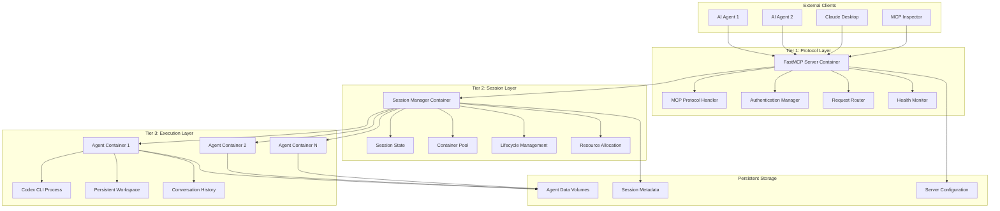
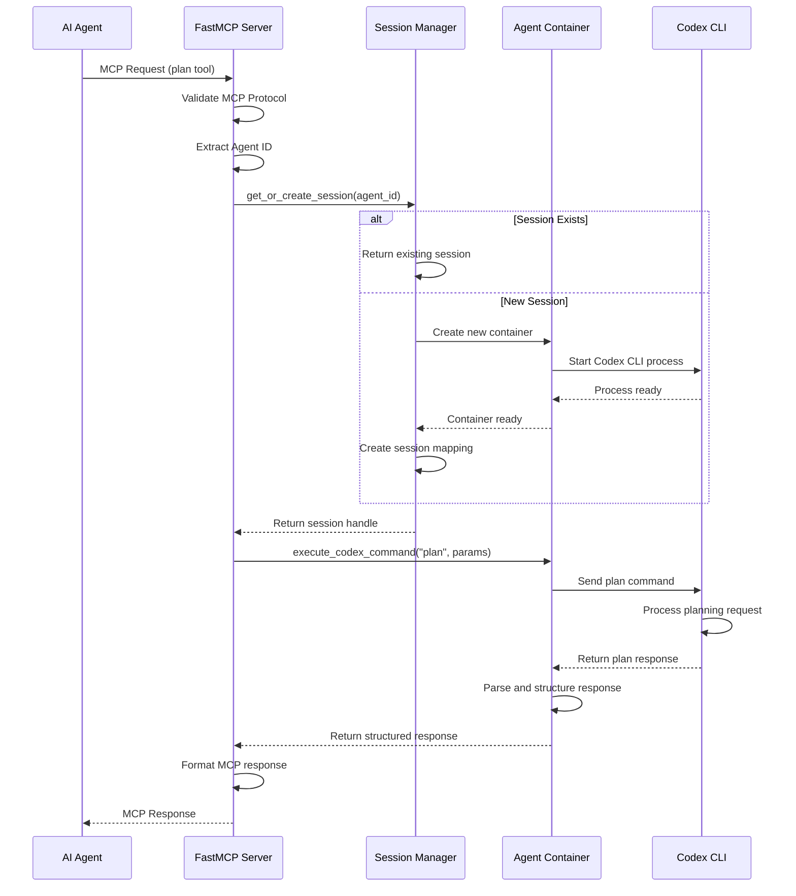
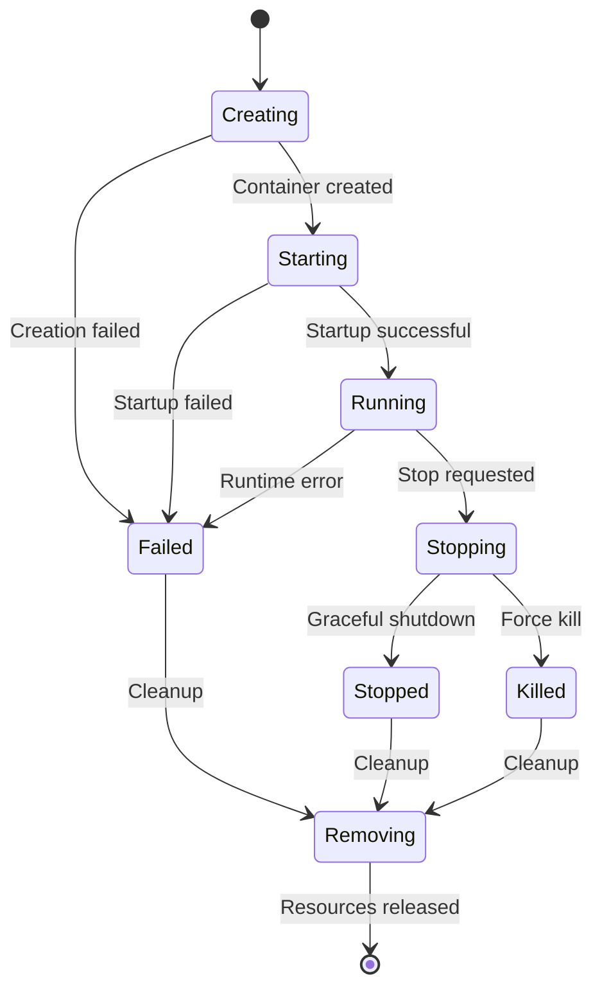

# Codex CLI MCP Server Architecture

This document provides a comprehensive overview of the three-tier container architecture that powers the Codex CLI MCP Server. This architecture is specifically designed for AI agent workloads that require persistent state, complete isolation, and high reliability.

## Table of Contents

- [Architecture Overview](#architecture-overview)
- [Container Tiers Explained](#container-tiers-explained)
- [Communication Flow](#communication-flow)
- [Design Principles](#design-principles)
- [Security Model](#security-model)
- [Scalability & Performance](#scalability--performance)
- [Persistence & State Management](#persistence--state-management)
- [Fault Tolerance](#fault-tolerance)
- [Monitoring & Debugging](#monitoring--debugging)
- [Container Lifecycle](#container-lifecycle)
- [Network Architecture](#network-architecture)
- [Resource Management](#resource-management)

## Architecture Overview

The Codex CLI MCP Server implements a sophisticated three-tier container architecture that separates concerns between protocol handling, session management, and agent execution. This design provides isolation, scalability, and persistence for AI agent workloads.



## Container Tiers Explained

### Tier 1: FastMCP Server Container (Protocol Layer)

**Container Name**: `codex-mcp-server`
**Purpose**: Central orchestrator and MCP protocol handler
**Instance Count**: 1 (singleton)

#### Responsibilities

1. **MCP Protocol Termination**
   - Handles all incoming MCP requests from AI agents
   - Validates MCP protocol compliance
   - Serializes/deserializes MCP messages
   - Maintains MCP client connections (SSE, WebSocket)

2. **Authentication & Authorization**
   - Manages OpenAI API keys and OAuth tokens
   - Validates client authentication
   - Injects credentials into agent containers
   - Handles token refresh and expiration

3. **Request Routing & Load Balancing**
   - Routes requests to appropriate agent containers
   - Implements session affinity (agent ID → container mapping)
   - Handles request queuing and throttling
   - Manages concurrent request limits

4. **System Health & Monitoring**
   - Provides health check endpoints
   - Monitors system resource usage
   - Tracks active sessions and containers
   - Exposes metrics for observability

5. **Container Lifecycle Orchestration**
   - Creates and destroys agent containers
   - Manages container networking and volumes
   - Enforces resource limits and security policies
   - Handles container failure recovery

#### Implementation Details

```python
# FastMCP Server Container Entry Point
class FastMCPServer:
    def __init__(self):
        self.session_manager = SessionManager()
        self.container_manager = ContainerManager()
        self.auth_manager = AuthManager()

    @mcp.tool()
    async def plan(self, task: str, repo_context: Dict) -> PlanResponse:
        # 1. Extract agent ID from MCP session
        agent_id = await self.get_session_agent_id()

        # 2. Route to session manager
        session = await self.session_manager.get_or_create_session(agent_id)

        # 3. Execute in agent container
        result = await session.execute_codex_command("plan", {
            "task": task,
            "repo_context": repo_context
        })

        # 4. Return structured MCP response
        return self.parse_plan_response(result)
```

#### Why Separate?

- **Protocol Isolation**: MCP protocol complexity is contained in one place
- **Security Boundary**: Acts as a firewall between external clients and execution environments
- **High Availability**: Can restart without affecting running agent sessions
- **Resource Control**: Central enforcement point for system-wide limits
- **Scalability**: Single point for implementing load balancing strategies

### Tier 2: Session Manager Container (Session Layer)

**Container Name**: `session-manager` (embedded in FastMCP for now)
**Purpose**: Manages lifecycle and state of individual AI agent sessions
**Instance Count**: 1 (can be scaled horizontally)

#### Responsibilities

1. **Session State Management**
   - Tracks active sessions with metadata (creation time, last activity, status)
   - Maintains session-to-container mappings
   - Handles session timeouts and cleanup
   - Persists session state across restarts

2. **Container Pool Management**
   - Maintains pool of ready-to-use agent containers
   - Implements container allocation algorithms
   - Handles container warming and pre-provisioning
   - Manages container lifecycle (create, start, stop, destroy)

3. **Resource Allocation & Optimization**
   - Allocates containers to agents based on resource availability
   - Implements resource quotas per agent/tenant
   - Optimizes container placement and resource utilization
   - Handles resource contention and prioritization

4. **Inter-Container Communication**
   - Manages communication channels between FastMCP and agent containers
   - Handles message routing and delivery
   - Implements request/response correlation
   - Manages connection pooling and reuse

#### Implementation Details

```python
# Session Manager Implementation
class SessionManager:
    def __init__(self):
        self.active_sessions: Dict[str, ContainerSession] = {}
        self.session_metadata: Dict[str, SessionMetadata] = {}
        self.container_pool: ContainerPool = ContainerPool()
        self.resource_manager = ResourceManager()

    async def get_or_create_session(self, agent_id: str) -> ContainerSession:
        # Check for existing session
        if agent_id in self.active_sessions:
            session = self.active_sessions[agent_id]
            if session.is_healthy():
                return session
            else:
                await self.cleanup_session(agent_id)

        # Allocate new container from pool
        container = await self.container_pool.allocate_container(agent_id)

        # Create session wrapper
        session = ContainerSession(
            agent_id=agent_id,
            container=container,
            created_at=time.time(),
            last_activity=time.time()
        )

        # Track session
        self.active_sessions[agent_id] = session
        self.session_metadata[agent_id] = SessionMetadata(
            agent_id=agent_id,
            container_id=container.id,
            status="active",
            resource_allocation=self.resource_manager.get_allocation(agent_id)
        )

        return session

    async def cleanup_inactive_sessions(self):
        """Background task to clean up inactive sessions."""
        current_time = time.time()
        for agent_id, session in list(self.active_sessions.items()):
            if current_time - session.last_activity > SESSION_TIMEOUT:
                await self.cleanup_session(agent_id)
```

#### Why Separate?

- **State Isolation**: Session state is decoupled from protocol handling and execution
- **Session Persistence**: Can survive FastMCP restarts and maintain agent continuity
- **Concurrency Management**: Safely handles multiple concurrent agent sessions
- **Resource Optimization**: Efficient container pooling and resource allocation
- **Monitoring**: Centralized session monitoring and debugging capabilities

### Tier 3: Persistent Agent Containers (Execution Layer)

**Container Name Pattern**: `agent-{agent_id}`
**Purpose**: Isolated, long-running environments for individual Codex CLI instances
**Instance Count**: N (one per active agent, up to configured limits)

#### Responsibilities

1. **Codex CLI Execution Environment**
   - Runs dedicated Codex CLI process for each agent
   - Maintains persistent Codex CLI session state
   - Handles Codex CLI command execution and response parsing
   - Manages Codex CLI configuration and authentication

2. **Workspace Persistence**
   - Maintains dedicated file system workspace for each agent
   - Preserves files, project state, and working directories
   - Handles file uploads, downloads, and modifications
   - Implements workspace backup and recovery

3. **Conversation Memory & Context**
   - Preserves Codex CLI conversation history across requests
   - Maintains conversation context and thread continuity
   - Handles conversation branching and merging
   - Implements conversation persistence and replay

4. **Agent Isolation & Security**
   - Complete process and network isolation between agents
   - Dedicated user space and file system namespace
   - Individual resource limits (CPU, memory, disk)
   - Isolated environment variables and configuration

#### Implementation Details

```python
# Agent Container Runtime
class AgentContainer:
    def __init__(self, agent_id: str, container_id: str):
        self.agent_id = agent_id
        self.container_id = container_id
        self.codex_process: Optional[subprocess.Popen] = None
        self.workspace_path = f"/app/workspace/{agent_id}"
        self.conversation_history: List[Dict] = []
        self.tool_cache: Dict[str, Any] = {}
        self.last_activity = time.time()

    async def start_codex_process(self):
        """Start persistent Codex CLI process."""
        env = os.environ.copy()
        env.update({
            "CODEX_WORKSPACE": self.workspace_path,
            "CODEX_AGENT_ID": self.agent_id,
            "CODEX_SESSION_MODE": "persistent"
        })

        self.codex_process = await asyncio.create_subprocess_exec(
            "codex", "--interactive", "--no-exit-on-error",
            stdin=asyncio.subprocess.PIPE,
            stdout=asyncio.subprocess.PIPE,
            stderr=asyncio.subprocess.PIPE,
            env=env,
            cwd=self.workspace_path
        )

        # Start background tasks for I/O handling
        asyncio.create_task(self._handle_codex_output())
        asyncio.create_task(self._handle_codex_errors())

    async def execute_codex_command(self, tool: str, params: Dict) -> str:
        """Execute Codex CLI command and return response."""
        # Update activity timestamp
        self.last_activity = time.time()

        # Build command based on tool and parameters
        command = self._build_codex_command(tool, params)

        # Add to conversation history
        self.conversation_history.append({
            "type": "command",
            "tool": tool,
            "command": command,
            "timestamp": time.time()
        })

        # Send command to Codex CLI process
        self.codex_process.stdin.write(f"{command}\n".encode())
        await self.codex_process.stdin.drain()

        # Wait for response with timeout
        response = await asyncio.wait_for(
            self._read_codex_response(),
            timeout=CODEX_COMMAND_TIMEOUT
        )

        # Add response to conversation history
        self.conversation_history.append({
            "type": "response",
            "response": response,
            "timestamp": time.time()
        })

        return response

    async def _read_codex_response(self) -> str:
        """Read complete response from Codex CLI."""
        response_parts = []

        while True:
            line = await self.codex_process.stdout.readline()
            if not line:
                break

            line_str = line.decode().strip()
            response_parts.append(line_str)

            # Check for response completion markers
            if self._is_response_complete(response_parts):
                break

        return "\n".join(response_parts)
```

#### Container Configuration

```dockerfile
# Agent Container Dockerfile
FROM python:3.12-slim

# Create non-root user for agent execution
RUN useradd -m -u 1000 -s /bin/bash codex

# Install Codex CLI and dependencies
RUN npm install -g @openai/codex

# Set up workspace directory
RUN mkdir -p /app/workspace && chown -R codex:codex /app/workspace

# Security hardening
RUN apt-get update && apt-get install -y --no-install-recommends \
    git \
    && rm -rf /var/lib/apt/lists/*

# Switch to non-root user
USER codex
WORKDIR /app/workspace

# Set up Codex CLI environment
ENV CODEX_CONFIG_DIR=/app/.codex
ENV CODEX_WORKSPACE=/app/workspace

# Health check
HEALTHCHECK --interval=30s --timeout=10s --start-period=5s --retries=3 \
    CMD pgrep -f "codex.*interactive" || exit 1

# Default command
CMD ["/bin/bash", "-c", "while true; do sleep 30; done"]
```

#### Why Separate?

- **Complete Isolation**: Each agent gets its own Linux environment and namespace
- **Persistent State**: Agent work persists across MCP requests and server restarts
- **Resource Containment**: Individual resource limits prevent one agent from affecting others
- **Security**: Agent code execution is completely sandboxed
- **Debugging**: Each container can be inspected and debugged independently
- **Scalability**: Can scale agent containers independently based on demand

## Communication Flow

Here's how a typical MCP request flows through the three-tier architecture:



### Request Processing Steps

1. **Protocol Reception** (FastMCP Container)
   ```python
   # Receive and validate MCP request
   @mcp.tool()
   async def plan(task: str, repo_context: Dict) -> PlanResponse:
       agent_id = await get_session_agent_id()
   ```

2. **Session Resolution** (Session Manager)
   ```python
   # Find or create agent session
   session = await session_manager.get_or_create_session(agent_id)
   ```

3. **Container Allocation** (Session Manager)
   ```python
   # Allocate container if needed
   if not session.container.is_healthy():
       container = await container_pool.allocate_container(agent_id)
   ```

4. **Command Execution** (Agent Container)
   ```python
   # Execute in isolated environment
   result = await container.execute_codex_command("plan", {
       "task": task,
       "repo_context": repo_context
   })
   ```

5. **Response Processing** (All Tiers)
   ```python
   # Parse and return through layers
   structured_response = parse_plan_response(result)
   return structured_response
   ```

## Design Principles

### 1. Separation of Concerns

Each tier has a single, well-defined responsibility:

- **Protocol Tier**: Handles MCP protocol and client communication
- **Session Tier**: Manages state and resource allocation
- **Execution Tier**: Runs agent workloads in isolation

### 2. Fail-Safe Architecture

```
Failure Isolation:
┌─────────────────┐    ┌─────────────────┐    ┌─────────────────┐
│ FastMCP Fails   │    │ Session Fails   │    │ Agent Fails     │
│                 │    │                 │    │                 │
│ • Restart       │    │ • Restart       │    │ • Restart only  │
│ • Sessions      │    │ • Reload state  │    │   that agent    │
│   preserved     │    │ • Containers    │    │ • Other agents  │
│ • Agents keep   │    │   unaffected    │    │   unaffected    │
│   running       │    │                 │    │                 │
└─────────────────┘    └─────────────────┘    └─────────────────┘
```

### 3. Stateless Protocol Layer

The FastMCP container is stateless and can be restarted without data loss:
- All session state stored in Session Manager
- All agent state stored in persistent containers
- Configuration loaded from environment/volumes

### 4. Persistent Execution Layer

Agent containers maintain state across requests:
- Conversation history preserved
- Workspace files persist
- Tool cache maintained
- Environment variables retained

### 5. Resource Isolation

Each layer has independent resource management:
- **FastMCP**: Lightweight, minimal resources
- **Session Manager**: Memory for session tracking
- **Agent Containers**: Configurable CPU/memory per agent

## Security Model

### Network Security

```
Network Topology:
┌─────────────────┐
│   Internet      │
└─────────┬───────┘
          │ :8210 (HTTPS)
┌─────────▼───────┐
│  FastMCP Server │
│  (Public)       │
└─────────┬───────┘
          │ Internal Network Only
┌─────────▼───────┐
│ Session Manager │
│ (Internal)      │
└─────────┬───────┘
          │ Container Network Only
┌─────────▼───────┐
│ Agent Container │
│ (Isolated)      │
└─────────────────┘
```

### Container Security

Each tier implements progressive security hardening:

#### FastMCP Container Security
```yaml
security_opt:
  - no-new-privileges:true
cap_drop:
  - ALL
cap_add:
  - NET_BIND_SERVICE
read_only: false  # Needs write for temporary files
user: "1000:1000"
```

#### Session Manager Security
```yaml
security_opt:
  - no-new-privileges:true
cap_drop:
  - ALL
read_only: true
tmpfs:
  - /tmp:noexec,nosuid,size=100m
user: "1001:1001"
```

#### Agent Container Security
```yaml
security_opt:
  - no-new-privileges:true
  - seccomp:unconfined  # Needed for Codex CLI
cap_drop:
  - ALL
cap_add:
  - SETUID  # For user switching in Codex
  - SETGID
read_only: false  # Needs write for workspace
user: "1000:1000"
tmpfs:
  - /tmp:noexec,nosuid,size=500m
ulimits:
  nproc: 1024
  nofile: 65536
```

### Credential Management

```python
# Credential injection flow
class AuthManager:
    async def inject_credentials(self, container: AgentContainer, agent_id: str):
        """Inject credentials into agent container at runtime."""

        # 1. Generate agent-specific credentials
        creds = await self.generate_agent_credentials(agent_id)

        # 2. Create temporary credential file
        cred_file = f"/tmp/agent_{agent_id}_creds.json"

        # 3. Copy credentials to container
        await container.copy_file(cred_file, "/app/.codex/auth.json")

        # 4. Set proper permissions
        await container.exec_run("chmod 600 /app/.codex/auth.json")

        # 5. Clean up temporary file
        os.unlink(cred_file)
```

## Scalability & Performance

### Horizontal Scaling Options

1. **FastMCP Server Scaling**
   ```yaml
   # Multiple FastMCP instances with load balancer
   services:
     fastmcp-1:
       image: codex-mcp:latest
       ports: ["8210:8210"]
     fastmcp-2:
       image: codex-mcp:latest
       ports: ["8211:8210"]
     load-balancer:
       image: nginx:alpine
       ports: ["80:80"]
   ```

2. **Session Manager Scaling**
   ```python
   # Distributed session management
   class DistributedSessionManager:
       def __init__(self):
           self.session_shards = {
               "shard_1": SessionManager(redis_host="redis-1"),
               "shard_2": SessionManager(redis_host="redis-2")
           }

       def get_shard(self, agent_id: str) -> str:
           # Hash-based sharding
           return f"shard_{hash(agent_id) % len(self.session_shards) + 1}"
   ```

3. **Agent Container Scaling**
   ```python
   # Dynamic container scaling
   class ContainerPool:
       async def scale_containers(self, target_count: int):
           current_count = len(self.available_containers)

           if target_count > current_count:
               # Scale up
               for _ in range(target_count - current_count):
                   container = await self.create_container()
                   self.available_containers.append(container)

           elif target_count < current_count:
               # Scale down
               excess = current_count - target_count
               for _ in range(excess):
                   container = self.available_containers.pop()
                   await self.destroy_container(container)
   ```

### Performance Optimizations

1. **Container Warming**
   ```python
   # Pre-warm containers for faster allocation
   class ContainerPool:
       async def maintain_warm_pool(self):
           """Background task to maintain ready containers."""
           while True:
               available = len(self.available_containers)
               if available < MIN_WARM_CONTAINERS:
                   for _ in range(MIN_WARM_CONTAINERS - available):
                       container = await self.create_warm_container()
                       self.available_containers.append(container)
               await asyncio.sleep(30)
   ```

2. **Connection Pooling**
   ```python
   # Reuse connections to agent containers
   class SessionManager:
       def __init__(self):
           self.connection_pool = ConnectionPool(
               max_connections=MAX_CONNECTIONS_PER_CONTAINER,
               connection_timeout=30
           )
   ```

3. **Response Caching**
   ```python
   # Cache Codex responses for common requests
   class AgentContainer:
       def __init__(self):
           self.response_cache = TTLCache(
               maxsize=1000,
               ttl=300  # 5 minute cache
           )

       async def execute_codex_command(self, command: str):
           cache_key = hashlib.md5(command.encode()).hexdigest()
           if cache_key in self.response_cache:
               return self.response_cache[cache_key]

           result = await self._execute_command(command)
           self.response_cache[cache_key] = result
           return result
   ```

## Persistence & State Management

### Data Persistence Strategy

```
Persistence Layers:
┌─────────────────────────────────────────────────────────┐
│                    Volume Mounts                        │
├─────────────────┬─────────────────┬─────────────────────┤
│ Agent Data      │ Session State   │ Server Config       │
│                 │                 │                     │
│ • Workspaces    │ • Active        │ • Environment       │
│ • Conversation  │   sessions      │   variables         │
│   history       │ • Container     │ • Authentication    │
│ • Tool cache    │   mappings      │   configuration     │
│ • File uploads  │ • Resource      │ • Logging config    │
│                 │   allocation    │                     │
├─────────────────┼─────────────────┼─────────────────────┤
│ /data/agents/   │ /data/sessions/ │ /app/config/        │
│ {agent_id}/     │ metadata.json   │ server.yaml         │
│ ├─workspace/    │ active.json     │ auth.json           │
│ ├─history.json  │ resources.json  │ logging.yaml        │
│ └─cache/        │                 │                     │
└─────────────────┴─────────────────┴─────────────────────┘
```

### State Recovery

```python
# Session recovery after restart
class SessionManager:
    async def recover_sessions(self):
        """Recover sessions from persistent storage."""

        # 1. Load session metadata
        metadata_file = "/data/sessions/metadata.json"
        if os.path.exists(metadata_file):
            with open(metadata_file) as f:
                session_data = json.load(f)

        # 2. Restore active sessions
        for agent_id, session_info in session_data.get("active", {}).items():
            try:
                # Check if container still exists
                container = await self.container_manager.get_container(
                    session_info["container_id"]
                )

                if container and container.status == "running":
                    # Restore session
                    session = ContainerSession(
                        agent_id=agent_id,
                        container=container,
                        created_at=session_info["created_at"],
                        last_activity=time.time()
                    )
                    self.active_sessions[agent_id] = session

                else:
                    # Container missing, create new one
                    await self.create_new_session(agent_id)

            except Exception as e:
                logger.warning(f"Failed to recover session {agent_id}: {e}")
                # Clean up corrupted session data
                await self.cleanup_session_data(agent_id)
```

### Backup and Recovery

```python
# Automated backup system
class BackupManager:
    async def backup_agent_data(self, agent_id: str):
        """Create backup of agent workspace and state."""

        backup_dir = f"/backups/{agent_id}/{int(time.time())}"
        os.makedirs(backup_dir, exist_ok=True)

        # Backup workspace
        workspace_src = f"/data/agents/{agent_id}/workspace"
        workspace_dst = f"{backup_dir}/workspace"
        await self.copy_directory(workspace_src, workspace_dst)

        # Backup conversation history
        history_src = f"/data/agents/{agent_id}/history.json"
        history_dst = f"{backup_dir}/history.json"
        shutil.copy2(history_src, history_dst)

        # Create manifest
        manifest = {
            "agent_id": agent_id,
            "backup_time": time.time(),
            "files_count": await self.count_files(workspace_dst),
            "backup_size": await self.get_directory_size(backup_dir)
        }

        with open(f"{backup_dir}/manifest.json", "w") as f:
            json.dump(manifest, f, indent=2)

    async def restore_agent_data(self, agent_id: str, backup_timestamp: int):
        """Restore agent data from backup."""

        backup_dir = f"/backups/{agent_id}/{backup_timestamp}"
        if not os.path.exists(backup_dir):
            raise ValueError(f"Backup not found: {backup_dir}")

        # Stop agent container if running
        await self.stop_agent_container(agent_id)

        # Restore workspace
        workspace_src = f"{backup_dir}/workspace"
        workspace_dst = f"/data/agents/{agent_id}/workspace"
        await self.copy_directory(workspace_src, workspace_dst)

        # Restore conversation history
        history_src = f"{backup_dir}/history.json"
        history_dst = f"/data/agents/{agent_id}/history.json"
        shutil.copy2(history_src, history_dst)

        # Restart agent container
        await self.start_agent_container(agent_id)
```

## Fault Tolerance

### Container Health Monitoring

```python
# Health monitoring system
class HealthMonitor:
    def __init__(self):
        self.health_checks = {
            "fastmcp": self.check_fastmcp_health,
            "session_manager": self.check_session_manager_health,
            "agent_containers": self.check_agent_containers_health
        }

    async def monitor_health(self):
        """Continuous health monitoring loop."""
        while True:
            try:
                health_status = {}

                for component, check_func in self.health_checks.items():
                    try:
                        status = await check_func()
                        health_status[component] = status
                    except Exception as e:
                        health_status[component] = {
                            "status": "unhealthy",
                            "error": str(e),
                            "timestamp": time.time()
                        }

                # Take corrective actions for unhealthy components
                await self.handle_health_issues(health_status)

                # Store health status for reporting
                await self.store_health_status(health_status)

            except Exception as e:
                logger.error(f"Health monitoring error: {e}")

            await asyncio.sleep(30)  # Check every 30 seconds

    async def check_agent_containers_health(self):
        """Check health of all agent containers."""
        containers = await self.container_manager.list_containers(
            filters={"label": "component=agent"}
        )

        healthy_count = 0
        unhealthy_containers = []

        for container in containers:
            try:
                # Check if container is running
                if container.status != "running":
                    unhealthy_containers.append({
                        "id": container.id,
                        "status": container.status,
                        "issue": "not_running"
                    })
                    continue

                # Check container health endpoint
                result = await container.exec_run(
                    "curl -f http://localhost:8080/health",
                    timeout=10
                )

                if result.exit_code == 0:
                    healthy_count += 1
                else:
                    unhealthy_containers.append({
                        "id": container.id,
                        "status": "running",
                        "issue": "health_check_failed"
                    })

            except Exception as e:
                unhealthy_containers.append({
                    "id": container.id,
                    "status": "unknown",
                    "issue": str(e)
                })

        return {
            "status": "healthy" if len(unhealthy_containers) == 0 else "degraded",
            "healthy_containers": healthy_count,
            "unhealthy_containers": unhealthy_containers,
            "total_containers": len(containers)
        }
```

### Automatic Recovery

```python
# Automatic recovery system
class RecoveryManager:
    async def handle_container_failure(self, agent_id: str, container_id: str):
        """Handle agent container failure with automatic recovery."""

        logger.warning(f"Container failure detected: {container_id} for agent {agent_id}")

        try:
            # 1. Stop failed container
            await self.container_manager.stop_container(container_id, force=True)

            # 2. Save any recoverable state
            await self.backup_container_state(container_id)

            # 3. Remove failed container
            await self.container_manager.remove_container(container_id)

            # 4. Create new container for agent
            new_container = await self.container_manager.create_agent_container(agent_id)

            # 5. Restore state to new container
            await self.restore_container_state(agent_id, new_container.id)

            # 6. Update session mapping
            await self.session_manager.update_container_mapping(agent_id, new_container.id)

            # 7. Verify new container is healthy
            if await self.verify_container_health(new_container.id):
                logger.info(f"Successfully recovered container for agent {agent_id}")
            else:
                raise Exception("New container failed health check")

        except Exception as e:
            logger.error(f"Failed to recover container for agent {agent_id}: {e}")
            # Escalate to manual intervention
            await self.escalate_recovery_failure(agent_id, str(e))

    async def handle_session_manager_failure(self):
        """Handle session manager failure with state recovery."""

        logger.error("Session manager failure detected")

        try:
            # 1. Load persistent session state
            session_state = await self.load_session_state()

            # 2. Verify agent containers are still running
            active_containers = await self.verify_agent_containers(session_state)

            # 3. Rebuild session mappings
            await self.rebuild_session_mappings(active_containers)

            # 4. Resume session monitoring
            await self.resume_session_monitoring()

            logger.info("Session manager recovery completed")

        except Exception as e:
            logger.error(f"Session manager recovery failed: {e}")
            # May need to restart all agent containers
            await self.emergency_restart_all_agents()
```

## Monitoring & Debugging

### Logging Architecture

```python
# Structured logging across all tiers
import structlog

# Configure structured logging
structlog.configure(
    processors=[
        structlog.contextvars.merge_contextvars,
        structlog.processors.add_log_level,
        structlog.processors.StackInfoRenderer(),
        structlog.dev.set_exc_info,
        structlog.processors.JSONRenderer()
    ],
    wrapper_class=structlog.make_filtering_bound_logger(20),  # INFO level
    context_class=dict,
    logger_factory=structlog.PrintLoggerFactory(),
    cache_logger_on_first_use=True,
)

# Usage across tiers
class FastMCPServer:
    def __init__(self):
        self.logger = structlog.get_logger("fastmcp")

    async def handle_request(self, request):
        with structlog.contextvars.bound_contextvars(
            agent_id=request.agent_id,
            request_id=request.id,
            tool=request.tool
        ):
            self.logger.info("Processing MCP request")
            # ... request processing
            self.logger.info("MCP request completed", duration=elapsed_time)

class AgentContainer:
    def __init__(self, agent_id):
        self.logger = structlog.get_logger("agent", agent_id=agent_id)

    async def execute_command(self, command):
        self.logger.info("Executing Codex command", command=command[:100])
        # ... command execution
        self.logger.info("Command completed", exit_code=result.exit_code)
```

### Metrics Collection

```python
# Metrics collection system
from prometheus_client import Counter, Histogram, Gauge

# Define metrics
REQUEST_COUNT = Counter(
    'mcp_requests_total',
    'Total MCP requests',
    ['tool', 'agent_id', 'status']
)

REQUEST_DURATION = Histogram(
    'mcp_request_duration_seconds',
    'MCP request duration',
    ['tool']
)

ACTIVE_SESSIONS = Gauge(
    'mcp_active_sessions',
    'Number of active agent sessions'
)

CONTAINER_RESOURCE_USAGE = Gauge(
    'container_resource_usage',
    'Container resource usage',
    ['container_id', 'resource_type']
)

# Metrics collection
class MetricsCollector:
    async def collect_container_metrics(self):
        """Collect resource usage metrics from containers."""
        containers = await self.container_manager.list_containers()

        for container in containers:
            stats = await container.stats(stream=False)

            # CPU usage
            cpu_percent = self.calculate_cpu_percent(stats)
            CONTAINER_RESOURCE_USAGE.labels(
                container_id=container.id[:12],
                resource_type='cpu'
            ).set(cpu_percent)

            # Memory usage
            memory_usage = stats['memory_stats']['usage']
            memory_limit = stats['memory_stats']['limit']
            memory_percent = (memory_usage / memory_limit) * 100

            CONTAINER_RESOURCE_USAGE.labels(
                container_id=container.id[:12],
                resource_type='memory'
            ).set(memory_percent)
```

### Debugging Tools

```python
# Debugging utilities
class DebugManager:
    async def debug_agent_session(self, agent_id: str):
        """Comprehensive debugging for agent session."""

        debug_info = {
            "agent_id": agent_id,
            "timestamp": time.time()
        }

        # Session information
        session = self.session_manager.active_sessions.get(agent_id)
        if session:
            debug_info["session"] = {
                "container_id": session.container.id,
                "created_at": session.created_at,
                "last_activity": session.last_activity,
                "status": session.status
            }

        # Container information
        if session and session.container:
            container = session.container
            debug_info["container"] = {
                "id": container.id,
                "status": container.status,
                "image": container.image.tags,
                "ports": container.ports,
                "labels": container.labels
            }

            # Container logs
            logs = container.logs(tail=100).decode()
            debug_info["container_logs"] = logs.split('\n')

            # Container stats
            stats = await container.stats(stream=False)
            debug_info["container_stats"] = {
                "cpu_usage": self.calculate_cpu_percent(stats),
                "memory_usage": stats['memory_stats']['usage'],
                "memory_limit": stats['memory_stats']['limit'],
                "network_rx": stats['networks']['eth0']['rx_bytes'],
                "network_tx": stats['networks']['eth0']['tx_bytes']
            }

        # Workspace information
        workspace_path = f"/data/agents/{agent_id}/workspace"
        if os.path.exists(workspace_path):
            debug_info["workspace"] = {
                "path": workspace_path,
                "size": await self.get_directory_size(workspace_path),
                "file_count": await self.count_files(workspace_path),
                "recent_files": await self.get_recent_files(workspace_path, limit=10)
            }

        return debug_info

    async def debug_system_health(self):
        """System-wide debugging information."""

        debug_info = {
            "timestamp": time.time(),
            "system": {
                "cpu_count": os.cpu_count(),
                "memory_total": psutil.virtual_memory().total,
                "memory_available": psutil.virtual_memory().available,
                "disk_usage": psutil.disk_usage('/').percent
            }
        }

        # Docker system information
        docker_info = self.container_manager.docker_client.info()
        debug_info["docker"] = {
            "containers_running": docker_info['ContainersRunning'],
            "containers_total": docker_info['Containers'],
            "images_count": docker_info['Images'],
            "memory_limit": docker_info.get('MemTotal', 0),
            "cpu_count": docker_info.get('NCPU', 0)
        }

        # Active sessions
        debug_info["sessions"] = {
            "active_count": len(self.session_manager.active_sessions),
            "session_details": [
                {
                    "agent_id": agent_id,
                    "container_id": session.container.id[:12],
                    "uptime": time.time() - session.created_at,
                    "last_activity_ago": time.time() - session.last_activity
                }
                for agent_id, session in self.session_manager.active_sessions.items()
            ]
        }

        return debug_info
```

## Container Lifecycle

### Container States and Transitions



### Lifecycle Management

```python
# Container lifecycle management
class ContainerLifecycleManager:
    async def create_agent_container(self, agent_id: str) -> AgentContainer:
        """Create new agent container with full lifecycle management."""

        container_name = f"agent-{agent_id}"

        try:
            # 1. Pre-creation setup
            await self.prepare_agent_workspace(agent_id)
            await self.prepare_agent_credentials(agent_id)

            # 2. Container creation
            container_config = self.build_container_config(agent_id)
            container = await self.async_docker.create_container(
                image="codex-agent:latest",
                name=container_name,
                **container_config
            )

            # 3. Start container
            await self.async_docker.start_container(container)

            # 4. Wait for container to be ready
            ready = await self.wait_for_container_ready(
                container,
                timeout=CONTAINER_STARTUP_TIMEOUT
            )

            if not ready:
                raise ContainerStartupError("Container failed to become ready")

            # 5. Initialize agent environment
            await self.initialize_agent_environment(container, agent_id)

            # 6. Start Codex CLI process
            await self.start_codex_process(container, agent_id)

            # 7. Register container
            agent_container = AgentContainer(agent_id, container)
            await self.register_container(agent_container)

            return agent_container

        except Exception as e:
            # Cleanup on failure
            await self.cleanup_failed_container(container_name, agent_id)
            raise ContainerCreationError(f"Failed to create container for {agent_id}: {e}")

    async def destroy_agent_container(self, agent_id: str):
        """Gracefully destroy agent container with state preservation."""

        container = self.active_containers.get(agent_id)
        if not container:
            return

        try:
            # 1. Save container state
            await self.backup_container_state(container)

            # 2. Stop Codex CLI process gracefully
            await self.stop_codex_process(container)

            # 3. Stop container with grace period
            await self.async_docker.stop_container(
                container.docker_container,
                timeout=CONTAINER_STOP_TIMEOUT
            )

            # 4. Wait for graceful shutdown
            await self.wait_for_container_stopped(container.docker_container)

            # 5. Remove container
            await self.async_docker.remove_container(container.docker_container)

            # 6. Unregister container
            await self.unregister_container(agent_id)

        except Exception as e:
            logger.error(f"Error destroying container for {agent_id}: {e}")
            # Force cleanup if graceful shutdown fails
            await self.force_cleanup_container(agent_id)
```

This three-tier architecture provides a robust, scalable, and secure foundation for AI agent workloads while maintaining clear separation of concerns and operational excellence. Each tier can be developed, tested, deployed, and scaled independently while working together to provide a seamless MCP experience.