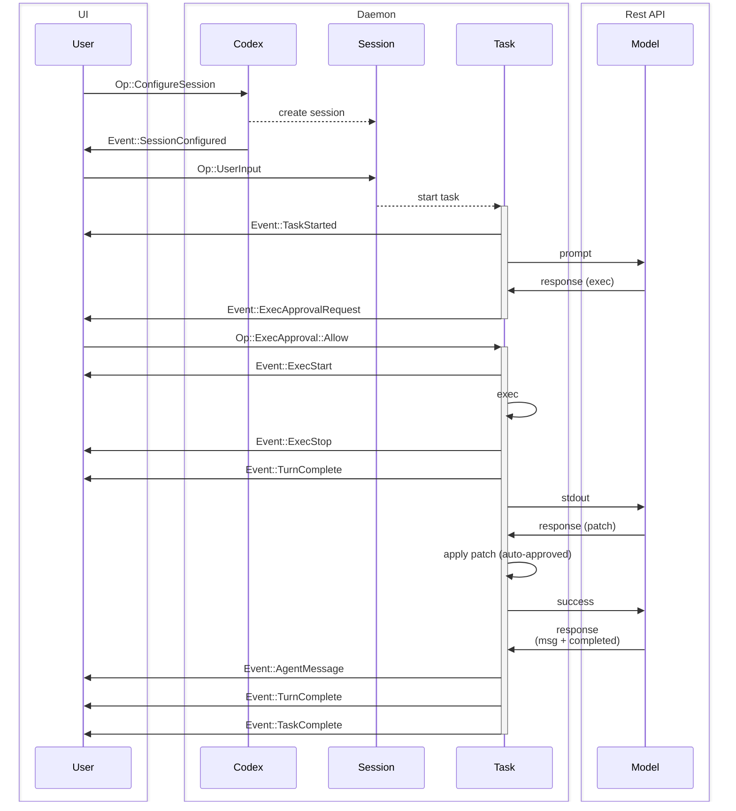
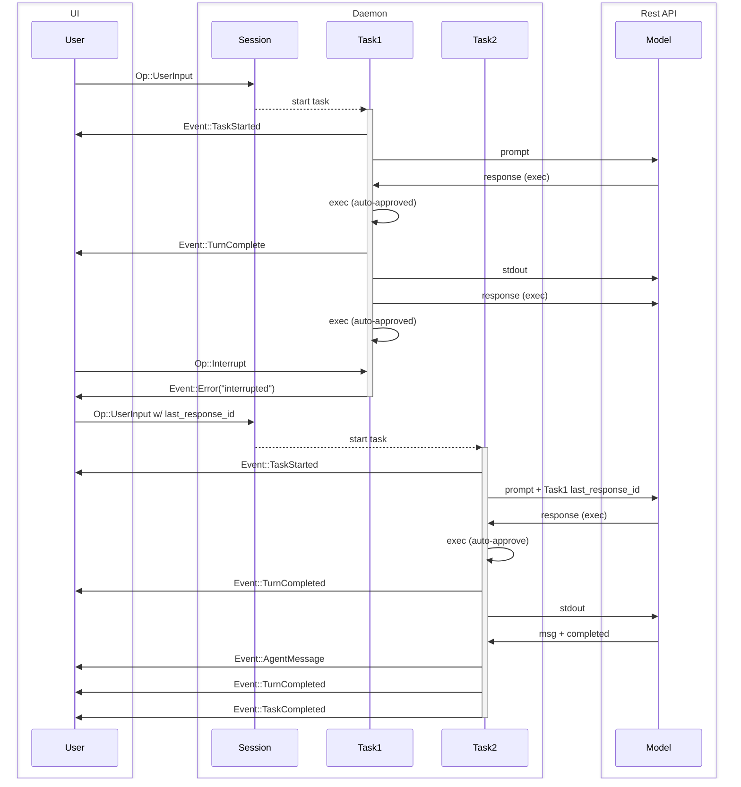

Directory structure:
└── openai-codex/
    ├── README.md
    ├── AGENTS.md
    ├── CHANGELOG.md
    ├── cliff.toml
    ├── flake.lock
    ├── flake.nix
    ├── LICENSE
    ├── NOTICE
    ├── package.json
    ├── pnpm-lock.yaml
    ├── pnpm-workspace.yaml
    ├── PNPM.md
    ├── .codespellignore
    ├── .codespellrc
    ├── .npmrc
    ├── .prettierignore
    ├── .prettierrc.toml
    ├── codex-cli/
    │   ├── README.md
    │   ├── Dockerfile
    │   ├── package.json
    │   ├── .dockerignore
    │   └── scripts/
    │       ├── README.md
    │       ├── build_container.sh
    │       ├── init_firewall.sh
    │       ├── install_native_deps.sh
    │       ├── run_in_container.sh
    │       ├── stage_release.sh
    │       └── stage_rust_release.py
    ├── codex-rs/
    │   ├── README.md
    │   ├── Cargo.toml
    │   ├── clippy.toml
    │   ├── config.md
    │   ├── default.nix
    │   ├── justfile
    │   ├── rust-toolchain.toml
    │   ├── rustfmt.toml
    │   ├── ansi-escape/
    │   │   ├── README.md
    │   │   ├── Cargo.toml
    │   │   └── src/
    │   │       └── lib.rs
    │   ├── apply-patch/
    │   │   ├── apply_patch_tool_instructions.md
    │   │   ├── Cargo.toml
    │   │   ├── src/
    │   │   │   ├── main.rs
    │   │   │   ├── parser.rs
    │   │   │   ├── seek_sequence.rs
    │   │   │   └── standalone_executable.rs
    │   │   └── tests/
    │   │       ├── all.rs
    │   │       └── suite/
    │   │           ├── cli.rs
    │   │           └── mod.rs
    │   ├── arg0/
    │   │   ├── Cargo.toml
    │   │   └── src/
    │   │       └── lib.rs
    │   ├── chatgpt/
    │   │   ├── README.md
    │   │   ├── Cargo.toml
    │   │   ├── src/
    │   │   │   ├── apply_command.rs
    │   │   │   ├── chatgpt_client.rs
    │   │   │   ├── chatgpt_token.rs
    │   │   │   ├── get_task.rs
    │   │   │   └── lib.rs
    │   │   └── tests/
    │   │       ├── all.rs
    │   │       ├── task_turn_fixture.json
    │   │       └── suite/
    │   │           ├── apply_command_e2e.rs
    │   │           └── mod.rs
    │   ├── cli/
    │   │   ├── Cargo.toml
    │   │   ├── src/
    │   │   │   ├── debug_sandbox.rs
    │   │   │   ├── exit_status.rs
    │   │   │   ├── lib.rs
    │   │   │   ├── login.rs
    │   │   │   ├── main.rs
    │   │   │   ├── mcp_cmd.rs
    │   │   │   └── proto.rs
    │   │   └── tests/
    │   │       ├── mcp_add_remove.rs
    │   │       └── mcp_list.rs
    │   ├── common/
    │   │   ├── README.md
    │   │   ├── Cargo.toml
    │   │   └── src/
    │   │       ├── approval_mode_cli_arg.rs
    │   │       ├── approval_presets.rs
    │   │       ├── config_override.rs
    │   │       ├── config_summary.rs
    │   │       ├── elapsed.rs
    │   │       ├── fuzzy_match.rs
    │   │       ├── lib.rs
    │   │       ├── model_presets.rs
    │   │       ├── sandbox_mode_cli_arg.rs
    │   │       └── sandbox_summary.rs
    │   ├── core/
    │   │   ├── README.md
    │   │   ├── Cargo.toml
    │   │   ├── gpt_5_codex_prompt.md
    │   │   ├── prompt.md
    │   │   ├── review_prompt.md
    │   │   ├── src/
    │   │   │   ├── apply_patch.rs
    │   │   │   ├── auth.rs
    │   │   │   ├── bash.rs
    │   │   │   ├── chat_completions.rs
    │   │   │   ├── client.rs
    │   │   │   ├── client_common.rs
    │   │   │   ├── codex_conversation.rs
    │   │   │   ├── config_edit.rs
    │   │   │   ├── config_profile.rs
    │   │   │   ├── config_types.rs
    │   │   │   ├── conversation_history.rs
    │   │   │   ├── conversation_manager.rs
    │   │   │   ├── custom_prompts.rs
    │   │   │   ├── default_client.rs
    │   │   │   ├── environment_context.rs
    │   │   │   ├── error.rs
    │   │   │   ├── event_mapping.rs
    │   │   │   ├── exec.rs
    │   │   │   ├── exec_env.rs
    │   │   │   ├── flags.rs
    │   │   │   ├── git_info.rs
    │   │   │   ├── internal_storage.rs
    │   │   │   ├── is_safe_command.rs
    │   │   │   ├── landlock.rs
    │   │   │   ├── lib.rs
    │   │   │   ├── mcp_connection_manager.rs
    │   │   │   ├── mcp_tool_call.rs
    │   │   │   ├── message_history.rs
    │   │   │   ├── model_family.rs
    │   │   │   ├── model_provider_info.rs
    │   │   │   ├── openai_model_info.rs
    │   │   │   ├── openai_tools.rs
    │   │   │   ├── parse_command.rs
    │   │   │   ├── plan_tool.rs
    │   │   │   ├── project_doc.rs
    │   │   │   ├── review_format.rs
    │   │   │   ├── safety.rs
    │   │   │   ├── seatbelt.rs
    │   │   │   ├── seatbelt_base_policy.sbpl
    │   │   │   ├── shell.rs
    │   │   │   ├── spawn.rs
    │   │   │   ├── terminal.rs
    │   │   │   ├── token_data.rs
    │   │   │   ├── tool_apply_patch.lark
    │   │   │   ├── tool_apply_patch.rs
    │   │   │   ├── truncate.rs
    │   │   │   ├── turn_diff_tracker.rs
    │   │   │   ├── user_instructions.rs
    │   │   │   ├── user_notification.rs
    │   │   │   ├── util.rs
    │   │   │   ├── codex/
    │   │   │   │   └── compact.rs
    │   │   │   ├── exec_command/
    │   │   │   │   ├── exec_command_params.rs
    │   │   │   │   ├── exec_command_session.rs
    │   │   │   │   ├── mod.rs
    │   │   │   │   ├── responses_api.rs
    │   │   │   │   ├── session_id.rs
    │   │   │   │   └── session_manager.rs
    │   │   │   ├── rollout/
    │   │   │   │   ├── list.rs
    │   │   │   │   ├── mod.rs
    │   │   │   │   ├── policy.rs
    │   │   │   │   ├── recorder.rs
    │   │   │   │   └── tests.rs
    │   │   │   └── unified_exec/
    │   │   │       ├── errors.rs
    │   │   │       └── mod.rs
    │   │   ├── templates/
    │   │   │   └── compact/
    │   │   │       ├── history_bridge.md
    │   │   │       └── prompt.md
    │   │   └── tests/
    │   │       ├── all.rs
    │   │       ├── chat_completions_payload.rs
    │   │       ├── chat_completions_sse.rs
    │   │       ├── cli_responses_fixture.sse
    │   │       ├── common/
    │   │       │   ├── Cargo.toml
    │   │       │   ├── lib.rs
    │   │       │   └── responses.rs
    │   │       ├── fixtures/
    │   │       │   ├── completed_template.json
    │   │       │   └── incomplete_sse.json
    │   │       └── suite/
    │   │           ├── cli_stream.rs
    │   │           ├── client.rs
    │   │           ├── compact.rs
    │   │           ├── compact_resume_fork.rs
    │   │           ├── exec.rs
    │   │           ├── exec_stream_events.rs
    │   │           ├── fork_conversation.rs
    │   │           ├── live_cli.rs
    │   │           ├── mod.rs
    │   │           ├── model_overrides.rs
    │   │           ├── prompt_caching.rs
    │   │           ├── review.rs
    │   │           ├── rollout_list_find.rs
    │   │           ├── seatbelt.rs
    │   │           ├── stream_error_allows_next_turn.rs
    │   │           └── stream_no_completed.rs
    │   ├── docs/
    │   │   ├── codex_mcp_interface.md
    │   │   └── protocol_v1.md
    │   ├── exec/
    │   │   ├── Cargo.toml
    │   │   ├── src/
    │   │   │   ├── cli.rs
    │   │   │   ├── event_processor.rs
    │   │   │   ├── event_processor_with_human_output.rs
    │   │   │   ├── event_processor_with_json_output.rs
    │   │   │   ├── lib.rs
    │   │   │   └── main.rs
    │   │   └── tests/
    │   │       ├── all.rs
    │   │       ├── fixtures/
    │   │       │   ├── apply_patch_freeform_final.txt
    │   │       │   └── cli_responses_fixture.sse
    │   │       └── suite/
    │   │           ├── apply_patch.rs
    │   │           ├── common.rs
    │   │           ├── mod.rs
    │   │           ├── resume.rs
    │   │           └── sandbox.rs
    │   ├── execpolicy/
    │   │   ├── README.md
    │   │   ├── build.rs
    │   │   ├── Cargo.toml
    │   │   ├── src/
    │   │   │   ├── arg_matcher.rs
    │   │   │   ├── arg_resolver.rs
    │   │   │   ├── arg_type.rs
    │   │   │   ├── default.policy
    │   │   │   ├── error.rs
    │   │   │   ├── exec_call.rs
    │   │   │   ├── execv_checker.rs
    │   │   │   ├── lib.rs
    │   │   │   ├── main.rs
    │   │   │   ├── opt.rs
    │   │   │   ├── policy.rs
    │   │   │   ├── policy_parser.rs
    │   │   │   ├── program.rs
    │   │   │   ├── sed_command.rs
    │   │   │   └── valid_exec.rs
    │   │   └── tests/
    │   │       ├── all.rs
    │   │       └── suite/
    │   │           ├── bad.rs
    │   │           ├── cp.rs
    │   │           ├── good.rs
    │   │           ├── head.rs
    │   │           ├── literal.rs
    │   │           ├── ls.rs
    │   │           ├── mod.rs
    │   │           ├── parse_sed_command.rs
    │   │           ├── pwd.rs
    │   │           └── sed.rs
    │   ├── file-search/
    │   │   ├── README.md
    │   │   ├── Cargo.toml
    │   │   └── src/
    │   │       ├── cli.rs
    │   │       ├── lib.rs
    │   │       └── main.rs
    │   ├── linux-sandbox/
    │   │   ├── README.md
    │   │   ├── Cargo.toml
    │   │   ├── src/
    │   │   │   ├── landlock.rs
    │   │   │   ├── lib.rs
    │   │   │   ├── linux_run_main.rs
    │   │   │   └── main.rs
    │   │   └── tests/
    │   │       ├── all.rs
    │   │       └── suite/
    │   │           ├── landlock.rs
    │   │           └── mod.rs
    │   ├── login/
    │   │   ├── Cargo.toml
    │   │   ├── src/
    │   │   │   ├── lib.rs
    │   │   │   ├── pkce.rs
    │   │   │   ├── server.rs
    │   │   │   └── assets/
    │   │   │       └── success.html
    │   │   └── tests/
    │   │       ├── all.rs
    │   │       └── suite/
    │   │           ├── login_server_e2e.rs
    │   │           └── mod.rs
    │   ├── mcp-client/
    │   │   ├── Cargo.toml
    │   │   └── src/
    │   │       ├── lib.rs
    │   │       ├── main.rs
    │   │       └── mcp_client.rs
    │   ├── mcp-server/
    │   │   ├── Cargo.toml
    │   │   ├── src/
    │   │   │   ├── codex_tool_config.rs
    │   │   │   ├── codex_tool_runner.rs
    │   │   │   ├── error_code.rs
    │   │   │   ├── exec_approval.rs
    │   │   │   ├── json_to_toml.rs
    │   │   │   ├── lib.rs
    │   │   │   ├── main.rs
    │   │   │   ├── message_processor.rs
    │   │   │   ├── outgoing_message.rs
    │   │   │   ├── patch_approval.rs
    │   │   │   └── tool_handlers/
    │   │   │       └── mod.rs
    │   │   └── tests/
    │   │       ├── all.rs
    │   │       ├── common/
    │   │       │   ├── Cargo.toml
    │   │       │   ├── lib.rs
    │   │       │   ├── mcp_process.rs
    │   │       │   ├── mock_model_server.rs
    │   │       │   └── responses.rs
    │   │       └── suite/
    │   │           ├── archive_conversation.rs
    │   │           ├── auth.rs
    │   │           ├── codex_message_processor_flow.rs
    │   │           ├── codex_tool.rs
    │   │           ├── config.rs
    │   │           ├── create_conversation.rs
    │   │           ├── interrupt.rs
    │   │           ├── list_resume.rs
    │   │           ├── login.rs
    │   │           ├── mod.rs
    │   │           ├── send_message.rs
    │   │           ├── set_default_model.rs
    │   │           ├── user_agent.rs
    │   │           └── user_info.rs
    │   ├── mcp-types/
    │   │   ├── README.md
    │   │   ├── Cargo.toml
    │   │   ├── check_lib_rs.py
    │   │   ├── generate_mcp_types.py
    │   │   └── tests/
    │   │       ├── all.rs
    │   │       └── suite/
    │   │           ├── initialize.rs
    │   │           ├── mod.rs
    │   │           └── progress_notification.rs
    │   ├── ollama/
    │   │   ├── Cargo.toml
    │   │   └── src/
    │   │       ├── client.rs
    │   │       ├── lib.rs
    │   │       ├── parser.rs
    │   │       ├── pull.rs
    │   │       └── url.rs
    │   ├── protocol/
    │   │   ├── README.md
    │   │   ├── Cargo.toml
    │   │   └── src/
    │   │       ├── config_types.rs
    │   │       ├── custom_prompts.rs
    │   │       ├── lib.rs
    │   │       ├── mcp_protocol.rs
    │   │       ├── message_history.rs
    │   │       ├── models.rs
    │   │       ├── num_format.rs
    │   │       ├── parse_command.rs
    │   │       ├── plan_tool.rs
    │   │       └── protocol.rs
    │   ├── protocol-ts/
    │   │   ├── Cargo.toml
    │   │   ├── generate-ts
    │   │   └── src/
    │   │       ├── lib.rs
    │   │       └── main.rs
    │   ├── scripts/
    │   │   └── create_github_release
    │   └── tui/
    │       ├── Cargo.toml
    │       ├── prompt_for_init_command.md
    │       ├── styles.md
    │       ├── frames/
    │       │   ├── blocks/
    │       │   │   ├── frame_1.txt
    │       │   │   ├── frame_10.txt
    │       │   │   ├── frame_11.txt
    │       │   │   ├── frame_12.txt
    │       │   │   ├── frame_13.txt
    │       │   │   ├── frame_14.txt
    │       │   │   ├── frame_15.txt
    │       │   │   ├── frame_16.txt
    │       │   │   ├── frame_17.txt
    │       │   │   ├── frame_18.txt
    │       │   │   ├── frame_19.txt
    │       │   │   ├── frame_2.txt
    │       │   │   ├── frame_20.txt
    │       │   │   ├── frame_21.txt
    │       │   │   ├── frame_22.txt
    │       │   │   ├── frame_23.txt
    │       │   │   ├── frame_24.txt
    │       │   │   ├── frame_25.txt
    │       │   │   ├── frame_26.txt
    │       │   │   ├── frame_27.txt
    │       │   │   ├── frame_28.txt
    │       │   │   ├── frame_29.txt
    │       │   │   ├── frame_3.txt
    │       │   │   ├── frame_30.txt
    │       │   │   ├── frame_31.txt
    │       │   │   ├── frame_32.txt
    │       │   │   ├── frame_33.txt
    │       │   │   ├── frame_34.txt
    │       │   │   ├── frame_35.txt
    │       │   │   ├── frame_36.txt
    │       │   │   ├── frame_4.txt
    │       │   │   ├── frame_5.txt
    │       │   │   ├── frame_6.txt
    │       │   │   ├── frame_7.txt
    │       │   │   ├── frame_8.txt
    │       │   │   └── frame_9.txt
    │       │   ├── codex/
    │       │   │   ├── frame_1.txt
    │       │   │   ├── frame_10.txt
    │       │   │   ├── frame_11.txt
    │       │   │   ├── frame_12.txt
    │       │   │   ├── frame_13.txt
    │       │   │   ├── frame_14.txt
    │       │   │   ├── frame_15.txt
    │       │   │   ├── frame_16.txt
    │       │   │   ├── frame_17.txt
    │       │   │   ├── frame_18.txt
    │       │   │   ├── frame_19.txt
    │       │   │   ├── frame_2.txt
    │       │   │   ├── frame_20.txt
    │       │   │   ├── frame_21.txt
    │       │   │   ├── frame_22.txt
    │       │   │   ├── frame_23.txt
    │       │   │   ├── frame_24.txt
    │       │   │   ├── frame_25.txt
    │       │   │   ├── frame_26.txt
    │       │   │   ├── frame_27.txt
    │       │   │   ├── frame_28.txt
    │       │   │   ├── frame_29.txt
    │       │   │   ├── frame_3.txt
    │       │   │   ├── frame_30.txt
    │       │   │   ├── frame_31.txt
    │       │   │   ├── frame_32.txt
    │       │   │   ├── frame_33.txt
    │       │   │   ├── frame_34.txt
    │       │   │   ├── frame_35.txt
    │       │   │   ├── frame_36.txt
    │       │   │   ├── frame_4.txt
    │       │   │   ├── frame_5.txt
    │       │   │   ├── frame_6.txt
    │       │   │   ├── frame_7.txt
    │       │   │   ├── frame_8.txt
    │       │   │   └── frame_9.txt
    │       │   ├── default/
    │       │   │   ├── frame_1.txt
    │       │   │   ├── frame_10.txt
    │       │   │   ├── frame_11.txt
    │       │   │   ├── frame_12.txt
    │       │   │   ├── frame_13.txt
    │       │   │   ├── frame_14.txt
    │       │   │   ├── frame_15.txt
    │       │   │   ├── frame_16.txt
    │       │   │   ├── frame_17.txt
    │       │   │   ├── frame_18.txt
    │       │   │   ├── frame_19.txt
    │       │   │   ├── frame_2.txt
    │       │   │   ├── frame_20.txt
    │       │   │   ├── frame_21.txt
    │       │   │   ├── frame_22.txt
    │       │   │   ├── frame_23.txt
    │       │   │   ├── frame_24.txt
    │       │   │   ├── frame_25.txt
    │       │   │   ├── frame_26.txt
    │       │   │   ├── frame_27.txt
    │       │   │   ├── frame_28.txt
    │       │   │   ├── frame_29.txt
    │       │   │   ├── frame_3.txt
    │       │   │   ├── frame_30.txt
    │       │   │   ├── frame_31.txt
    │       │   │   ├── frame_32.txt
    │       │   │   ├── frame_33.txt
    │       │   │   ├── frame_34.txt
    │       │   │   ├── frame_35.txt
    │       │   │   ├── frame_36.txt
    │       │   │   ├── frame_4.txt
    │       │   │   ├── frame_5.txt
    │       │   │   ├── frame_6.txt
    │       │   │   ├── frame_7.txt
    │       │   │   ├── frame_8.txt
    │       │   │   └── frame_9.txt
    │       │   ├── dots/
    │       │   │   ├── frame_1.txt
    │       │   │   ├── frame_10.txt
    │       │   │   ├── frame_11.txt
    │       │   │   ├── frame_12.txt
    │       │   │   ├── frame_13.txt
    │       │   │   ├── frame_14.txt
    │       │   │   ├── frame_15.txt
    │       │   │   ├── frame_16.txt
    │       │   │   ├── frame_17.txt
    │       │   │   ├── frame_18.txt
    │       │   │   ├── frame_19.txt
    │       │   │   ├── frame_2.txt
    │       │   │   ├── frame_20.txt
    │       │   │   ├── frame_21.txt
    │       │   │   ├── frame_22.txt
    │       │   │   ├── frame_23.txt
    │       │   │   ├── frame_24.txt
    │       │   │   ├── frame_25.txt
    │       │   │   ├── frame_26.txt
    │       │   │   ├── frame_27.txt
    │       │   │   ├── frame_28.txt
    │       │   │   ├── frame_29.txt
    │       │   │   ├── frame_3.txt
    │       │   │   ├── frame_30.txt
    │       │   │   ├── frame_31.txt
    │       │   │   ├── frame_32.txt
    │       │   │   ├── frame_33.txt
    │       │   │   ├── frame_34.txt
    │       │   │   ├── frame_35.txt
    │       │   │   ├── frame_36.txt
    │       │   │   ├── frame_4.txt
    │       │   │   ├── frame_5.txt
    │       │   │   ├── frame_6.txt
    │       │   │   ├── frame_7.txt
    │       │   │   ├── frame_8.txt
    │       │   │   └── frame_9.txt
    │       │   ├── hash/
    │       │   │   ├── frame_1.txt
    │       │   │   ├── frame_10.txt
    │       │   │   ├── frame_11.txt
    │       │   │   ├── frame_12.txt
    │       │   │   ├── frame_13.txt
    │       │   │   ├── frame_14.txt
    │       │   │   ├── frame_15.txt
    │       │   │   ├── frame_16.txt
    │       │   │   ├── frame_17.txt
    │       │   │   ├── frame_18.txt
    │       │   │   ├── frame_19.txt
    │       │   │   ├── frame_2.txt
    │       │   │   ├── frame_20.txt
    │       │   │   ├── frame_21.txt
    │       │   │   ├── frame_22.txt
    │       │   │   ├── frame_23.txt
    │       │   │   ├── frame_24.txt
    │       │   │   ├── frame_25.txt
    │       │   │   ├── frame_26.txt
    │       │   │   ├── frame_27.txt
    │       │   │   ├── frame_28.txt
    │       │   │   ├── frame_29.txt
    │       │   │   ├── frame_3.txt
    │       │   │   ├── frame_30.txt
    │       │   │   ├── frame_31.txt
    │       │   │   ├── frame_32.txt
    │       │   │   ├── frame_33.txt
    │       │   │   ├── frame_34.txt
    │       │   │   ├── frame_35.txt
    │       │   │   ├── frame_36.txt
    │       │   │   ├── frame_4.txt
    │       │   │   ├── frame_5.txt
    │       │   │   ├── frame_6.txt
    │       │   │   ├── frame_7.txt
    │       │   │   ├── frame_8.txt
    │       │   │   └── frame_9.txt
    │       │   ├── hbars/
    │       │   │   ├── frame_1.txt
    │       │   │   ├── frame_10.txt
    │       │   │   ├── frame_11.txt
    │       │   │   ├── frame_12.txt
    │       │   │   ├── frame_13.txt
    │       │   │   ├── frame_14.txt
    │       │   │   ├── frame_15.txt
    │       │   │   ├── frame_16.txt
    │       │   │   ├── frame_17.txt
    │       │   │   ├── frame_18.txt
    │       │   │   ├── frame_19.txt
    │       │   │   ├── frame_2.txt
    │       │   │   ├── frame_20.txt
    │       │   │   ├── frame_21.txt
    │       │   │   ├── frame_22.txt
    │       │   │   ├── frame_23.txt
    │       │   │   ├── frame_24.txt
    │       │   │   ├── frame_25.txt
    │       │   │   ├── frame_26.txt
    │       │   │   ├── frame_27.txt
    │       │   │   ├── frame_28.txt
    │       │   │   ├── frame_29.txt
    │       │   │   ├── frame_3.txt
    │       │   │   ├── frame_30.txt
    │       │   │   ├── frame_31.txt
    │       │   │   ├── frame_32.txt
    │       │   │   ├── frame_33.txt
    │       │   │   ├── frame_34.txt
    │       │   │   ├── frame_35.txt
    │       │   │   ├── frame_36.txt
    │       │   │   ├── frame_4.txt
    │       │   │   ├── frame_5.txt
    │       │   │   ├── frame_6.txt
    │       │   │   ├── frame_7.txt
    │       │   │   ├── frame_8.txt
    │       │   │   └── frame_9.txt
    │       │   ├── openai/
    │       │   │   ├── frame_1.txt
    │       │   │   ├── frame_10.txt
    │       │   │   ├── frame_11.txt
    │       │   │   ├── frame_12.txt
    │       │   │   ├── frame_13.txt
    │       │   │   ├── frame_14.txt
    │       │   │   ├── frame_15.txt
    │       │   │   ├── frame_16.txt
    │       │   │   ├── frame_17.txt
    │       │   │   ├── frame_18.txt
    │       │   │   ├── frame_19.txt
    │       │   │   ├── frame_2.txt
    │       │   │   ├── frame_20.txt
    │       │   │   ├── frame_21.txt
    │       │   │   ├── frame_22.txt
    │       │   │   ├── frame_23.txt
    │       │   │   ├── frame_24.txt
    │       │   │   ├── frame_25.txt
    │       │   │   ├── frame_26.txt
    │       │   │   ├── frame_27.txt
    │       │   │   ├── frame_28.txt
    │       │   │   ├── frame_29.txt
    │       │   │   ├── frame_3.txt
    │       │   │   ├── frame_30.txt
    │       │   │   ├── frame_31.txt
    │       │   │   ├── frame_32.txt
    │       │   │   ├── frame_33.txt
    │       │   │   ├── frame_34.txt
    │       │   │   ├── frame_35.txt
    │       │   │   ├── frame_36.txt
    │       │   │   ├── frame_4.txt
    │       │   │   ├── frame_5.txt
    │       │   │   ├── frame_6.txt
    │       │   │   ├── frame_7.txt
    │       │   │   ├── frame_8.txt
    │       │   │   └── frame_9.txt
    │       │   ├── shapes/
    │       │   │   ├── frame_1.txt
    │       │   │   ├── frame_10.txt
    │       │   │   ├── frame_11.txt
    │       │   │   ├── frame_12.txt
    │       │   │   ├── frame_13.txt
    │       │   │   ├── frame_14.txt
    │       │   │   ├── frame_15.txt
    │       │   │   ├── frame_16.txt
    │       │   │   ├── frame_17.txt
    │       │   │   ├── frame_18.txt
    │       │   │   ├── frame_19.txt
    │       │   │   ├── frame_2.txt
    │       │   │   ├── frame_20.txt
    │       │   │   ├── frame_21.txt
    │       │   │   ├── frame_22.txt
    │       │   │   ├── frame_23.txt
    │       │   │   ├── frame_24.txt
    │       │   │   ├── frame_25.txt
    │       │   │   ├── frame_26.txt
    │       │   │   ├── frame_27.txt
    │       │   │   ├── frame_28.txt
    │       │   │   ├── frame_29.txt
    │       │   │   ├── frame_3.txt
    │       │   │   ├── frame_30.txt
    │       │   │   ├── frame_31.txt
    │       │   │   ├── frame_32.txt
    │       │   │   ├── frame_33.txt
    │       │   │   ├── frame_34.txt
    │       │   │   ├── frame_35.txt
    │       │   │   ├── frame_36.txt
    │       │   │   ├── frame_4.txt
    │       │   │   ├── frame_5.txt
    │       │   │   ├── frame_6.txt
    │       │   │   ├── frame_7.txt
    │       │   │   ├── frame_8.txt
    │       │   │   └── frame_9.txt
    │       │   ├── slug/
    │       │   │   ├── frame_1.txt
    │       │   │   ├── frame_10.txt
    │       │   │   ├── frame_11.txt
    │       │   │   ├── frame_12.txt
    │       │   │   ├── frame_13.txt
    │       │   │   ├── frame_14.txt
    │       │   │   ├── frame_15.txt
    │       │   │   ├── frame_16.txt
    │       │   │   ├── frame_17.txt
    │       │   │   ├── frame_18.txt
    │       │   │   ├── frame_19.txt
    │       │   │   ├── frame_2.txt
    │       │   │   ├── frame_20.txt
    │       │   │   ├── frame_21.txt
    │       │   │   ├── frame_22.txt
    │       │   │   ├── frame_23.txt
    │       │   │   ├── frame_24.txt
    │       │   │   ├── frame_25.txt
    │       │   │   ├── frame_26.txt
    │       │   │   ├── frame_27.txt
    │       │   │   ├── frame_28.txt
    │       │   │   ├── frame_29.txt
    │       │   │   ├── frame_3.txt
    │       │   │   ├── frame_30.txt
    │       │   │   ├── frame_31.txt
    │       │   │   ├── frame_32.txt
    │       │   │   ├── frame_33.txt
    │       │   │   ├── frame_34.txt
    │       │   │   ├── frame_35.txt
    │       │   │   ├── frame_36.txt
    │       │   │   ├── frame_4.txt
    │       │   │   ├── frame_5.txt
    │       │   │   ├── frame_6.txt
    │       │   │   ├── frame_7.txt
    │       │   │   ├── frame_8.txt
    │       │   │   └── frame_9.txt
    │       │   └── vbars/
    │       │       ├── frame_1.txt
    │       │       ├── frame_10.txt
    │       │       ├── frame_11.txt
    │       │       ├── frame_12.txt
    │       │       ├── frame_13.txt
    │       │       ├── frame_14.txt
    │       │       ├── frame_15.txt
    │       │       ├── frame_16.txt
    │       │       ├── frame_17.txt
    │       │       ├── frame_18.txt
    │       │       ├── frame_19.txt
    │       │       ├── frame_2.txt
    │       │       ├── frame_20.txt
    │       │       ├── frame_21.txt
    │       │       ├── frame_22.txt
    │       │       ├── frame_23.txt
    │       │       ├── frame_24.txt
    │       │       ├── frame_25.txt
    │       │       ├── frame_26.txt
    │       │       ├── frame_27.txt
    │       │       ├── frame_28.txt
    │       │       ├── frame_29.txt
    │       │       ├── frame_3.txt
    │       │       ├── frame_30.txt
    │       │       ├── frame_31.txt
    │       │       ├── frame_32.txt
    │       │       ├── frame_33.txt
    │       │       ├── frame_34.txt
    │       │       ├── frame_35.txt
    │       │       ├── frame_36.txt
    │       │       ├── frame_4.txt
    │       │       ├── frame_5.txt
    │       │       ├── frame_6.txt
    │       │       ├── frame_7.txt
    │       │       ├── frame_8.txt
    │       │       └── frame_9.txt
    │       ├── src/
    │       │   ├── app.rs
    │       │   ├── app_backtrack.rs
    │       │   ├── app_event.rs
    │       │   ├── app_event_sender.rs
    │       │   ├── ascii_animation.rs
    │       │   ├── citation_regex.rs
    │       │   ├── cli.rs
    │       │   ├── clipboard_paste.rs
    │       │   ├── custom_terminal.rs
    │       │   ├── diff_render.rs
    │       │   ├── exec_command.rs
    │       │   ├── file_search.rs
    │       │   ├── frames.rs
    │       │   ├── get_git_diff.rs
    │       │   ├── insert_history.rs
    │       │   ├── key_hint.rs
    │       │   ├── lib.rs
    │       │   ├── live_wrap.rs
    │       │   ├── main.rs
    │       │   ├── markdown.rs
    │       │   ├── markdown_render.rs
    │       │   ├── markdown_render_tests.rs
    │       │   ├── markdown_stream.rs
    │       │   ├── new_model_popup.rs
    │       │   ├── pager_overlay.rs
    │       │   ├── rate_limits_view.rs
    │       │   ├── resume_picker.rs
    │       │   ├── session_log.rs
    │       │   ├── shimmer.rs
    │       │   ├── slash_command.rs
    │       │   ├── status_indicator_widget.rs
    │       │   ├── text_formatting.rs
    │       │   ├── tui.rs
    │       │   ├── ui_consts.rs
    │       │   ├── updates.rs
    │       │   ├── user_approval_widget.rs
    │       │   ├── version.rs
    │       │   ├── wrapping.rs
    │       │   ├── bottom_pane/
    │       │   │   ├── approval_modal_view.rs
    │       │   │   ├── bottom_pane_view.rs
    │       │   │   ├── chat_composer_history.rs
    │       │   │   ├── command_popup.rs
    │       │   │   ├── custom_prompt_view.rs
    │       │   │   ├── file_search_popup.rs
    │       │   │   ├── list_selection_view.rs
    │       │   │   ├── mod.rs
    │       │   │   ├── paste_burst.rs
    │       │   │   ├── popup_consts.rs
    │       │   │   ├── scroll_state.rs
    │       │   │   ├── selection_popup_common.rs
    │       │   │   └── snapshots/
    │       │   │       ├── codex_tui__bottom_pane__chat_composer__tests__backspace_after_pastes.snap
    │       │   │       ├── codex_tui__bottom_pane__chat_composer__tests__empty.snap
    │       │   │       ├── codex_tui__bottom_pane__chat_composer__tests__large.snap
    │       │   │       ├── codex_tui__bottom_pane__chat_composer__tests__multiple_pastes.snap
    │       │   │       ├── codex_tui__bottom_pane__chat_composer__tests__slash_popup_mo.snap
    │       │   │       ├── codex_tui__bottom_pane__chat_composer__tests__small.snap
    │       │   │       ├── codex_tui__bottom_pane__list_selection_view__tests__list_selection_spacing_with_subtitle.snap
    │       │   │       └── codex_tui__bottom_pane__list_selection_view__tests__list_selection_spacing_without_subtitle.snap
    │       │   ├── chatwidget/
    │       │   │   ├── agent.rs
    │       │   │   ├── interrupts.rs
    │       │   │   ├── session_header.rs
    │       │   │   └── snapshots/
    │       │   │       ├── codex_tui__chatwidget__tests__apply_patch_manual_flow_history_approved.snap
    │       │   │       ├── codex_tui__chatwidget__tests__apply_patch_manual_flow_history_proposed.snap
    │       │   │       ├── codex_tui__chatwidget__tests__approval_modal_exec.snap
    │       │   │       ├── codex_tui__chatwidget__tests__approval_modal_exec_no_reason.snap
    │       │   │       ├── codex_tui__chatwidget__tests__approval_modal_patch.snap
    │       │   │       ├── codex_tui__chatwidget__tests__binary_size_ideal_response.snap
    │       │   │       ├── codex_tui__chatwidget__tests__chat_small_idle_h1.snap
    │       │   │       ├── codex_tui__chatwidget__tests__chat_small_idle_h2.snap
    │       │   │       ├── codex_tui__chatwidget__tests__chat_small_idle_h3.snap
    │       │   │       ├── codex_tui__chatwidget__tests__chat_small_running_h1.snap
    │       │   │       ├── codex_tui__chatwidget__tests__chat_small_running_h2.snap
    │       │   │       ├── codex_tui__chatwidget__tests__chat_small_running_h3.snap
    │       │   │       ├── codex_tui__chatwidget__tests__chatwidget_exec_and_status_layout_vt100_snapshot.snap
    │       │   │       ├── codex_tui__chatwidget__tests__chatwidget_markdown_code_blocks_vt100_snapshot.snap
    │       │   │       ├── codex_tui__chatwidget__tests__deltas_then_same_final_message_are_rendered_snapshot.snap
    │       │   │       ├── codex_tui__chatwidget__tests__disabled_slash_command_while_task_running_snapshot.snap
    │       │   │       ├── codex_tui__chatwidget__tests__exec_approval_history_decision_aborted_long.snap
    │       │   │       ├── codex_tui__chatwidget__tests__exec_approval_history_decision_aborted_multiline.snap
    │       │   │       ├── codex_tui__chatwidget__tests__exec_approval_history_decision_approved_short.snap
    │       │   │       ├── codex_tui__chatwidget__tests__exec_approval_history_proposed_multiline.snap
    │       │   │       ├── codex_tui__chatwidget__tests__exec_approval_history_proposed_short.snap
    │       │   │       ├── codex_tui__chatwidget__tests__exploring_step1_start_ls.snap
    │       │   │       ├── codex_tui__chatwidget__tests__exploring_step2_finish_ls.snap
    │       │   │       ├── codex_tui__chatwidget__tests__exploring_step3_start_cat_foo.snap
    │       │   │       ├── codex_tui__chatwidget__tests__exploring_step4_finish_cat_foo.snap
    │       │   │       ├── codex_tui__chatwidget__tests__exploring_step5_finish_sed_range.snap
    │       │   │       ├── codex_tui__chatwidget__tests__exploring_step6_finish_cat_bar.snap
    │       │   │       ├── codex_tui__chatwidget__tests__final_reasoning_then_message_without_deltas_are_rendered.snap
    │       │   │       ├── codex_tui__chatwidget__tests__interrupt_exec_marks_failed.snap
    │       │   │       ├── codex_tui__chatwidget__tests__limits_placeholder.snap
    │       │   │       ├── codex_tui__chatwidget__tests__limits_snapshot_basic.snap
    │       │   │       ├── codex_tui__chatwidget__tests__limits_snapshot_hourly_remaining.snap
    │       │   │       ├── codex_tui__chatwidget__tests__limits_snapshot_mixed_usage.snap
    │       │   │       ├── codex_tui__chatwidget__tests__limits_snapshot_weekly_heavy.snap
    │       │   │       ├── codex_tui__chatwidget__tests__status_widget_active.snap
    │       │   │       └── codex_tui__chatwidget__tests__status_widget_and_approval_modal.snap
    │       │   ├── onboarding/
    │       │   │   ├── auth.rs
    │       │   │   ├── mod.rs
    │       │   │   ├── onboarding_screen.rs
    │       │   │   ├── trust_directory.rs
    │       │   │   └── welcome.rs
    │       │   ├── render/
    │       │   │   ├── highlight.rs
    │       │   │   ├── line_utils.rs
    │       │   │   └── mod.rs
    │       │   ├── snapshots/
    │       │   │   ├── codex_tui__diff_render__tests__add_details.snap
    │       │   │   ├── codex_tui__diff_render__tests__apply_add_block.snap
    │       │   │   ├── codex_tui__diff_render__tests__apply_delete_block.snap
    │       │   │   ├── codex_tui__diff_render__tests__apply_multiple_files_block.snap
    │       │   │   ├── codex_tui__diff_render__tests__apply_update_block.snap
    │       │   │   ├── codex_tui__diff_render__tests__apply_update_block_manual.snap
    │       │   │   ├── codex_tui__diff_render__tests__apply_update_block_relativizes_path.snap
    │       │   │   ├── codex_tui__diff_render__tests__apply_update_block_wraps_long_lines.snap
    │       │   │   ├── codex_tui__diff_render__tests__apply_update_block_wraps_long_lines_text.snap
    │       │   │   ├── codex_tui__diff_render__tests__apply_update_with_rename_block.snap
    │       │   │   ├── codex_tui__diff_render__tests__blank_context_line.snap
    │       │   │   ├── codex_tui__diff_render__tests__single_line_replacement_counts.snap
    │       │   │   ├── codex_tui__diff_render__tests__update_details_with_rename.snap
    │       │   │   ├── codex_tui__diff_render__tests__vertical_ellipsis_between_hunks.snap
    │       │   │   ├── codex_tui__diff_render__tests__wrap_behavior_insert.snap
    │       │   │   ├── codex_tui__history_cell__tests__coalesced_reads_dedupe_names.snap
    │       │   │   ├── codex_tui__history_cell__tests__coalesces_reads_across_multiple_calls.snap
    │       │   │   ├── codex_tui__history_cell__tests__coalesces_sequential_reads_within_one_call.snap
    │       │   │   ├── codex_tui__history_cell__tests__multiline_command_both_lines_wrap_with_correct_prefixes.snap
    │       │   │   ├── codex_tui__history_cell__tests__multiline_command_without_wrap_uses_branch_then_eight_spaces.snap
    │       │   │   ├── codex_tui__history_cell__tests__multiline_command_wraps_with_extra_indent_on_subsequent_lines.snap
    │       │   │   ├── codex_tui__history_cell__tests__plan_update_with_note_and_wrapping_snapshot.snap
    │       │   │   ├── codex_tui__history_cell__tests__plan_update_without_note_snapshot.snap
    │       │   │   ├── codex_tui__history_cell__tests__ran_cell_multiline_with_stderr_snapshot.snap
    │       │   │   ├── codex_tui__history_cell__tests__single_line_command_compact_when_fits.snap
    │       │   │   ├── codex_tui__history_cell__tests__single_line_command_wraps_with_four_space_continuation.snap
    │       │   │   ├── codex_tui__history_cell__tests__stderr_tail_more_than_five_lines_snapshot.snap
    │       │   │   ├── codex_tui__history_cell__tests__user_history_cell_wraps_and_prefixes_each_line_snapshot.snap
    │       │   │   ├── codex_tui__markdown_render__markdown_render_tests__markdown_render_complex_snapshot.snap
    │       │   │   ├── codex_tui__pager_overlay__tests__static_overlay_snapshot_basic.snap
    │       │   │   ├── codex_tui__pager_overlay__tests__transcript_overlay_snapshot_basic.snap
    │       │   │   ├── codex_tui__status_indicator_widget__tests__renders_truncated.snap
    │       │   │   ├── codex_tui__status_indicator_widget__tests__renders_with_queued_messages.snap
    │       │   │   └── codex_tui__status_indicator_widget__tests__renders_with_working_header.snap
    │       │   └── streaming/
    │       │       ├── controller.rs
    │       │       └── mod.rs
    │       └── tests/
    │           ├── all.rs
    │           └── suite/
    │               ├── mod.rs
    │               ├── status_indicator.rs
    │               ├── vt100_history.rs
    │               ├── vt100_live_commit.rs
    │               └── vt100_streaming_no_dup.rs
    ├── docs/
    │   ├── advanced.md
    │   ├── authentication.md
    │   ├── CLA.md
    │   ├── config.md
    │   ├── contributing.md
    │   ├── experimental.md
    │   ├── faq.md
    │   ├── getting-started.md
    │   ├── install.md
    │   ├── license.md
    │   ├── open-source-fund.md
    │   ├── platform-sandboxing.md
    │   ├── prompts.md
    │   ├── release_management.md
    │   ├── sandbox.md
    │   └── zdr.md
    ├── scripts/
    │   ├── asciicheck.py
    │   └── readme_toc.py
    ├── .devcontainer/
    │   ├── README.md
    │   ├── devcontainer.json
    │   └── Dockerfile
    └── .github/
        ├── dependabot.yaml
        ├── dotslash-config.json
        ├── pull_request_template.md
        ├── codex/
        │   ├── home/
        │   │   └── config.toml
        │   └── labels/
        │       ├── codex-attempt.md
        │       ├── codex-review.md
        │       ├── codex-rust-review.md
        │       └── codex-triage.md
        ├── ISSUE_TEMPLATE/
        │   ├── 2-bug-report.yml
        │   ├── 3-docs-issue.yml
        │   ├── 4-feature-request.yml
        │   └── 5-vs-code-extension.yml
        └── workflows/
            ├── ci.yml
            ├── cla.yml
            ├── codespell.yml
            ├── rust-ci.yml
            └── rust-release.yml

================================================
FILE: README.md
================================================
<h1 align="center">OpenAI Codex CLI</h1>

<p align="center"><code>npm i -g @openai/codex</code><br />or <code>brew install codex</code></p>

<p align="center"><strong>Codex CLI</strong> is a coding agent from OpenAI that runs locally on your computer.
</br>
</br>If you want Codex in your code editor (VS Code, Cursor, Windsurf), <a href="https://developers.openai.com/codex/ide">install in your IDE</a>
</br>If you are looking for the <em>cloud-based agent</em> from OpenAI, <strong>Codex Web</strong>, go to <a href="https://chatgpt.com/codex">chatgpt.com/codex</a></p>

<p align="center">
  
  </p>

---

## Quickstart

### Installing and running Codex CLI

Install globally with your preferred package manager. If you use npm:

```shell
npm install -g @openai/codex
```

Alternatively, if you use Homebrew:

```shell
brew install codex
```

Then simply run `codex` to get started:

```shell
codex
```

<details>
<summary>You can also go to the <a href="https://github.com/openai/codex/releases/latest">latest GitHub Release</a> and download the appropriate binary for your platform.</summary>

Each GitHub Release contains many executables, but in practice, you likely want one of these:

- macOS
  - Apple Silicon/arm64: `codex-aarch64-apple-darwin.tar.gz`
  - x86_64 (older Mac hardware): `codex-x86_64-apple-darwin.tar.gz`
- Linux
  - x86_64: `codex-x86_64-unknown-linux-musl.tar.gz`
  - arm64: `codex-aarch64-unknown-linux-musl.tar.gz`

Each archive contains a single entry with the platform baked into the name (e.g., `codex-x86_64-unknown-linux-musl`), so you likely want to rename it to `codex` after extracting it.

</details>

### Using Codex with your ChatGPT plan

<p align="center">
  
  </p>

Run `codex` and select **Sign in with ChatGPT**. We recommend signing into your ChatGPT account to use Codex as part of your Plus, Pro, Team, Edu, or Enterprise plan. [Learn more about what's included in your ChatGPT plan](https://help.openai.com/en/articles/11369540-codex-in-chatgpt).

You can also use Codex with an API key, but this requires [additional setup](./docs/authentication.md#usage-based-billing-alternative-use-an-openai-api-key). If you previously used an API key for usage-based billing, see the [migration steps](./docs/authentication.md#migrating-from-usage-based-billing-api-key). If you're having trouble with login, please comment on [this issue](https://github.com/openai/codex/issues/1243).

### Model Context Protocol (MCP)

Codex CLI supports [MCP servers](./docs/advanced.md#model-context-protocol-mcp). Enable by adding an `mcp_servers` section to your `~/.codex/config.toml`.


### Configuration

Codex CLI supports a rich set of configuration options, with preferences stored in `~/.codex/config.toml`. For full configuration options, see [Configuration](./docs/config.md).

---

### Docs & FAQ

- [**Getting started**](./docs/getting-started.md)
  - [CLI usage](./docs/getting-started.md#cli-usage)
  - [Running with a prompt as input](./docs/getting-started.md#running-with-a-prompt-as-input)
  - [Example prompts](./docs/getting-started.md#example-prompts)
  - [Memory with AGENTS.md](./docs/getting-started.md#memory-with-agentsmd)
  - [Configuration](./docs/config.md)
- [**Sandbox & approvals**](./docs/sandbox.md)
- [**Authentication**](./docs/authentication.md)
  - [Auth methods](./docs/authentication.md#forcing-a-specific-auth-method-advanced)
  - [Login on a "Headless" machine](./docs/authentication.md#connecting-on-a-headless-machine)
- [**Advanced**](./docs/advanced.md)
  - [Non-interactive / CI mode](./docs/advanced.md#non-interactive--ci-mode)
  - [Tracing / verbose logging](./docs/advanced.md#tracing--verbose-logging)
  - [Model Context Protocol (MCP)](./docs/advanced.md#model-context-protocol-mcp)
- [**Zero data retention (ZDR)**](./docs/zdr.md)
- [**Contributing**](./docs/contributing.md)
- [**Install & build**](./docs/install.md)
  - [System Requirements](./docs/install.md#system-requirements)
  - [DotSlash](./docs/install.md#dotslash)
  - [Build from source](./docs/install.md#build-from-source)
- [**FAQ**](./docs/faq.md)
- [**Open source fund**](./docs/open-source-fund.md)

---

## License

This repository is licensed under the [Apache-2.0 License](LICENSE).


================================================
FILE: AGENTS.md
================================================
# Rust/codex-rs

In the codex-rs folder where the rust code lives:

- Crate names are prefixed with `codex-`. For example, the `core` folder's crate is named `codex-core`
- When using format! and you can inline variables into {}, always do that.
- Install any commands the repo relies on (for example `just`, `rg`, or `cargo-insta`) if they aren't already available before running instructions here.
- Never add or modify any code related to `CODEX_SANDBOX_NETWORK_DISABLED_ENV_VAR` or `CODEX_SANDBOX_ENV_VAR`.
  - You operate in a sandbox where `CODEX_SANDBOX_NETWORK_DISABLED=1` will be set whenever you use the `shell` tool. Any existing code that uses `CODEX_SANDBOX_NETWORK_DISABLED_ENV_VAR` was authored with this fact in mind. It is often used to early exit out of tests that the author knew you would not be able to run given your sandbox limitations.
  - Similarly, when you spawn a process using Seatbelt (`/usr/bin/sandbox-exec`), `CODEX_SANDBOX=seatbelt` will be set on the child process. Integration tests that want to run Seatbelt themselves cannot be run under Seatbelt, so checks for `CODEX_SANDBOX=seatbelt` are also often used to early exit out of tests, as appropriate.

Run `just fmt` (in `codex-rs` directory) automatically after making Rust code changes; do not ask for approval to run it. Before finalizing a change to `codex-rs`, run `just fix -p <project>` (in `codex-rs` directory) to fix any linter issues in the code. Prefer scoping with `-p` to avoid slow workspace‑wide Clippy builds; only run `just fix` without `-p` if you changed shared crates. Additionally, run the tests:
1. Run the test for the specific project that was changed. For example, if changes were made in `codex-rs/tui`, run `cargo test -p codex-tui`.
2. Once those pass, if any changes were made in common, core, or protocol, run the complete test suite with `cargo test --all-features`.
When running interactively, ask the user before running `just fix` to finalize. `just fmt` does not require approval. project-specific or individual tests can be run without asking the user, but do ask the user before running the complete test suite.

## TUI style conventions

See `codex-rs/tui/styles.md`.

## TUI code conventions

- Use concise styling helpers from ratatui’s Stylize trait.
  - Basic spans: use "text".into()
  - Styled spans: use "text".red(), "text".green(), "text".magenta(), "text".dim(), etc.
  - Prefer these over constructing styles with `Span::styled` and `Style` directly.
  - Example: patch summary file lines
    - Desired: vec!["  └ ".into(), "M".red(), " ".dim(), "tui/src/app.rs".dim()]

### TUI Styling (ratatui)
- Prefer Stylize helpers: use "text".dim(), .bold(), .cyan(), .italic(), .underlined() instead of manual Style where possible.
- Prefer simple conversions: use "text".into() for spans and vec![…].into() for lines; when inference is ambiguous (e.g., Paragraph::new/Cell::from), use Line::from(spans) or Span::from(text).
- Computed styles: if the Style is computed at runtime, using `Span::styled` is OK (`Span::from(text).set_style(style)` is also acceptable).
- Avoid hardcoded white: do not use `.white()`; prefer the default foreground (no color).
- Chaining: combine helpers by chaining for readability (e.g., url.cyan().underlined()).
- Single items: prefer "text".into(); use Line::from(text) or Span::from(text) only when the target type isn’t obvious from context, or when using .into() would require extra type annotations.
- Building lines: use vec![…].into() to construct a Line when the target type is obvious and no extra type annotations are needed; otherwise use Line::from(vec![…]).
- Avoid churn: don’t refactor between equivalent forms (Span::styled ↔ set_style, Line::from ↔ .into()) without a clear readability or functional gain; follow file‑local conventions and do not introduce type annotations solely to satisfy .into().
- Compactness: prefer the form that stays on one line after rustfmt; if only one of Line::from(vec![…]) or vec![…].into() avoids wrapping, choose that. If both wrap, pick the one with fewer wrapped lines.

### Text wrapping
- Always use textwrap::wrap to wrap plain strings.
- If you have a ratatui Line and you want to wrap it, use the helpers in tui/src/wrapping.rs, e.g. word_wrap_lines / word_wrap_line.
- If you need to indent wrapped lines, use the initial_indent / subsequent_indent options from RtOptions if you can, rather than writing custom logic.
- If you have a list of lines and you need to prefix them all with some prefix (optionally different on the first vs subsequent lines), use the `prefix_lines` helper from line_utils.

## Tests

### Snapshot tests

This repo uses snapshot tests (via `insta`), especially in `codex-rs/tui`, to validate rendered output. When UI or text output changes intentionally, update the snapshots as follows:

- Run tests to generate any updated snapshots:
  - `cargo test -p codex-tui`
- Check what’s pending:
  - `cargo insta pending-snapshots -p codex-tui`
- Review changes by reading the generated `*.snap.new` files directly in the repo, or preview a specific file:
  - `cargo insta show -p codex-tui path/to/file.snap.new`
- Only if you intend to accept all new snapshots in this crate, run:
  - `cargo insta accept -p codex-tui`

If you don’t have the tool:
- `cargo install cargo-insta`

### Test assertions

- Tests should use pretty_assertions::assert_eq for clearer diffs. Import this at the top of the test module if it isn't already.


================================================
FILE: CHANGELOG.md
================================================
The changelog can be found on the [releases page](https://github.com/openai/codex/releases)


================================================
FILE: cliff.toml
================================================
# https://git-cliff.org/docs/configuration

[changelog]
header = """
# Changelog

You can install any of these versions: `npm install -g codex@version`
"""

body = """

## [{{ version | trim_start_matches(pat="v") }}] - {{ timestamp | date(format="%Y-%m-%d") }}

## [unreleased]



### {{ group | striptags | trim }}

- *({{ commit.scope }})* [**breaking**] {{ commit.message | upper_first }}



"""

footer = """
<!-- generated - do not edit -->
"""

trim = true
postprocessors = []

[git]
conventional_commits = true

commit_parsers = [
  { message = "^feat", group = "<!-- 0 -->🚀 Features" },
  { message = "^fix",  group = "<!-- 1 -->🪲 Bug Fixes" },
  { message = "^bump", group = "<!-- 6 -->🛳️ Release" },
  # Fallback – skip anything that didn't match the above rules.
  { message = ".*",  group = "<!-- 10 -->💼 Other" },
]

filter_unconventional = false
sort_commits = "oldest"
topo_order = false


================================================
FILE: flake.lock
================================================
{
  "nodes": {
    "flake-utils": {
      "inputs": {
        "systems": "systems"
      },
      "locked": {
        "lastModified": 1731533236,
        "narHash": "sha256-l0KFg5HjrsfsO/JpG+r7fRrqm12kzFHyUHqHCVpMMbI=",
        "owner": "numtide",
        "repo": "flake-utils",
        "rev": "11707dc2f618dd54ca8739b309ec4fc024de578b",
        "type": "github"
      },
      "original": {
        "owner": "numtide",
        "repo": "flake-utils",
        "type": "github"
      }
    },
    "nixpkgs": {
      "locked": {
        "lastModified": 1744463964,
        "narHash": "sha256-LWqduOgLHCFxiTNYi3Uj5Lgz0SR+Xhw3kr/3Xd0GPTM=",
        "owner": "NixOS",
        "repo": "nixpkgs",
        "rev": "2631b0b7abcea6e640ce31cd78ea58910d31e650",
        "type": "github"
      },
      "original": {
        "owner": "NixOS",
        "ref": "nixos-unstable",
        "repo": "nixpkgs",
        "type": "github"
      }
    },
    "root": {
      "inputs": {
        "flake-utils": "flake-utils",
        "nixpkgs": "nixpkgs",
        "rust-overlay": "rust-overlay"
      }
    },
    "rust-overlay": {
      "inputs": {
        "nixpkgs": [
          "nixpkgs"
        ]
      },
      "locked": {
        "lastModified": 1746844454,
        "narHash": "sha256-GcUWDQUDRYrD34ol90KGUpjbVcOfUNbv0s955jPecko=",
        "owner": "oxalica",
        "repo": "rust-overlay",
        "rev": "be092436d4c0c303b654e4007453b69c0e33009e",
        "type": "github"
      },
      "original": {
        "owner": "oxalica",
        "repo": "rust-overlay",
        "type": "github"
      }
    },
    "systems": {
      "locked": {
        "lastModified": 1681028828,
        "narHash": "sha256-Vy1rq5AaRuLzOxct8nz4T6wlgyUR7zLU309k9mBC768=",
        "owner": "nix-systems",
        "repo": "default",
        "rev": "da67096a3b9bf56a91d16901293e51ba5b49a27e",
        "type": "github"
      },
      "original": {
        "owner": "nix-systems",
        "repo": "default",
        "type": "github"
      }
    }
  },
  "root": "root",
  "version": 7
}


================================================
FILE: flake.nix
================================================
{
  description = "Development Nix flake for OpenAI Codex CLI";

  inputs = {
    nixpkgs.url = "github:NixOS/nixpkgs/nixos-unstable";
    flake-utils.url = "github:numtide/flake-utils";
    rust-overlay = {
      url = "github:oxalica/rust-overlay";
      inputs.nixpkgs.follows = "nixpkgs";
    };
  };

  outputs = { nixpkgs, flake-utils, rust-overlay, ... }: 
    flake-utils.lib.eachDefaultSystem (system:
      let
        pkgs = import nixpkgs {
          inherit system;
        };
        pkgsWithRust = import nixpkgs {
          inherit system;
          overlays = [ rust-overlay.overlays.default ];
        };
        monorepo-deps = with pkgs; [
          # for precommit hook
          pnpm
          husky
        ];
        codex-cli = import ./codex-cli {
          inherit pkgs monorepo-deps;
        };
        codex-rs = import ./codex-rs {
          pkgs = pkgsWithRust;
          inherit monorepo-deps;
        };
      in
      rec {
        packages = {
          codex-cli = codex-cli.package;
          codex-rs = codex-rs.package;
        };

        devShells = {
          codex-cli = codex-cli.devShell;
          codex-rs = codex-rs.devShell;
        };

        apps = {
          codex-cli = codex-cli.app;
          codex-rs = codex-rs.app;
        };

        defaultPackage = packages.codex-cli;
        defaultApp = apps.codex-cli;
        defaultDevShell = devShells.codex-cli;
      }
    );
}


================================================
FILE: LICENSE
================================================
                                 Apache License
                           Version 2.0, January 2004
                        http://www.apache.org/licenses/

TERMS AND CONDITIONS FOR USE, REPRODUCTION, AND DISTRIBUTION

1.  Definitions.

    "License" shall mean the terms and conditions for use, reproduction,
    and distribution as defined by Sections 1 through 9 of this document.

    "Licensor" shall mean the copyright owner or entity authorized by
    the copyright owner that is granting the License.

    "Legal Entity" shall mean the union of the acting entity and all
    other entities that control, are controlled by, or are under common
    control with that entity. For the purposes of this definition,
    "control" means (i) the power, direct or indirect, to cause the
    direction or management of such entity, whether by contract or
    otherwise, or (ii) ownership of fifty percent (50%) or more of the
    outstanding shares, or (iii) beneficial ownership of such entity.

    "You" (or "Your") shall mean an individual or Legal Entity
    exercising permissions granted by this License.

    "Source" form shall mean the preferred form for making modifications,
    including but not limited to software source code, documentation
    source, and configuration files.

    "Object" form shall mean any form resulting from mechanical
    transformation or translation of a Source form, including but
    not limited to compiled object code, generated documentation,
    and conversions to other media types.

    "Work" shall mean the work of authorship, whether in Source or
    Object form, made available under the License, as indicated by a
    copyright notice that is included in or attached to the work
    (an example is provided in the Appendix below).

    "Derivative Works" shall mean any work, whether in Source or Object
    form, that is based on (or derived from) the Work and for which the
    editorial revisions, annotations, elaborations, or other modifications
    represent, as a whole, an original work of authorship. For the purposes
    of this License, Derivative Works shall not include works that remain
    separable from, or merely link (or bind by name) to the interfaces of,
    the Work and Derivative Works thereof.

    "Contribution" shall mean any work of authorship, including
    the original version of the Work and any modifications or additions
    to that Work or Derivative Works thereof, that is intentionally
    submitted to Licensor for inclusion in the Work by the copyright owner
    or by an individual or Legal Entity authorized to submit on behalf of
    the copyright owner. For the purposes of this definition, "submitted"
    means any form of electronic, verbal, or written communication sent
    to the Licensor or its representatives, including but not limited to
    communication on electronic mailing lists, source code control systems,
    and issue tracking systems that are managed by, or on behalf of, the
    Licensor for the purpose of discussing and improving the Work, but
    excluding communication that is conspicuously marked or otherwise
    designated in writing by the copyright owner as "Not a Contribution."

    "Contributor" shall mean Licensor and any individual or Legal Entity
    on behalf of whom a Contribution has been received by Licensor and
    subsequently incorporated within the Work.

2.  Grant of Copyright License. Subject to the terms and conditions of
    this License, each Contributor hereby grants to You a perpetual,
    worldwide, non-exclusive, no-charge, royalty-free, irrevocable
    copyright license to reproduce, prepare Derivative Works of,
    publicly display, publicly perform, sublicense, and distribute the
    Work and such Derivative Works in Source or Object form.

3.  Grant of Patent License. Subject to the terms and conditions of
    this License, each Contributor hereby grants to You a perpetual,
    worldwide, non-exclusive, no-charge, royalty-free, irrevocable
    (except as stated in this section) patent license to make, have made,
    use, offer to sell, sell, import, and otherwise transfer the Work,
    where such license applies only to those patent claims licensable
    by such Contributor that are necessarily infringed by their
    Contribution(s) alone or by combination of their Contribution(s)
    with the Work to which such Contribution(s) was submitted. If You
    institute patent litigation against any entity (including a
    cross-claim or counterclaim in a lawsuit) alleging that the Work
    or a Contribution incorporated within the Work constitutes direct
    or contributory patent infringement, then any patent licenses
    granted to You under this License for that Work shall terminate
    as of the date such litigation is filed.

4.  Redistribution. You may reproduce and distribute copies of the
    Work or Derivative Works thereof in any medium, with or without
    modifications, and in Source or Object form, provided that You
    meet the following conditions:

    (a) You must give any other recipients of the Work or
    Derivative Works a copy of this License; and

    (b) You must cause any modified files to carry prominent notices
    stating that You changed the files; and

    (c) You must retain, in the Source form of any Derivative Works
    that You distribute, all copyright, patent, trademark, and
    attribution notices from the Source form of the Work,
    excluding those notices that do not pertain to any part of
    the Derivative Works; and

    (d) If the Work includes a "NOTICE" text file as part of its
    distribution, then any Derivative Works that You distribute must
    include a readable copy of the attribution notices contained
    within such NOTICE file, excluding those notices that do not
    pertain to any part of the Derivative Works, in at least one
    of the following places: within a NOTICE text file distributed
    as part of the Derivative Works; within the Source form or
    documentation, if provided along with the Derivative Works; or,
    within a display generated by the Derivative Works, if and
    wherever such third-party notices normally appear. The contents
    of the NOTICE file are for informational purposes only and
    do not modify the License. You may add Your own attribution
    notices within Derivative Works that You distribute, alongside
    or as an addendum to the NOTICE text from the Work, provided
    that such additional attribution notices cannot be construed
    as modifying the License.

    You may add Your own copyright statement to Your modifications and
    may provide additional or different license terms and conditions
    for use, reproduction, or distribution of Your modifications, or
    for any such Derivative Works as a whole, provided Your use,
    reproduction, and distribution of the Work otherwise complies with
    the conditions stated in this License.

5.  Submission of Contributions. Unless You explicitly state otherwise,
    any Contribution intentionally submitted for inclusion in the Work
    by You to the Licensor shall be under the terms and conditions of
    this License, without any additional terms or conditions.
    Notwithstanding the above, nothing herein shall supersede or modify
    the terms of any separate license agreement you may have executed
    with Licensor regarding such Contributions.

6.  Trademarks. This License does not grant permission to use the trade
    names, trademarks, service marks, or product names of the Licensor,
    except as required for reasonable and customary use in describing the
    origin of the Work and reproducing the content of the NOTICE file.

7.  Disclaimer of Warranty. Unless required by applicable law or
    agreed to in writing, Licensor provides the Work (and each
    Contributor provides its Contributions) on an "AS IS" BASIS,
    WITHOUT WARRANTIES OR CONDITIONS OF ANY KIND, either express or
    implied, including, without limitation, any warranties or conditions
    of TITLE, NON-INFRINGEMENT, MERCHANTABILITY, or FITNESS FOR A
    PARTICULAR PURPOSE. You are solely responsible for determining the
    appropriateness of using or redistributing the Work and assume any
    risks associated with Your exercise of permissions under this License.

8.  Limitation of Liability. In no event and under no legal theory,
    whether in tort (including negligence), contract, or otherwise,
    unless required by applicable law (such as deliberate and grossly
    negligent acts) or agreed to in writing, shall any Contributor be
    liable to You for damages, including any direct, indirect, special,
    incidental, or consequential damages of any character arising as a
    result of this License or out of the use or inability to use the
    Work (including but not limited to damages for loss of goodwill,
    work stoppage, computer failure or malfunction, or any and all
    other commercial damages or losses), even if such Contributor
    has been advised of the possibility of such damages.

9.  Accepting Warranty or Additional Liability. While redistributing
    the Work or Derivative Works thereof, You may choose to offer,
    and charge a fee for, acceptance of support, warranty, indemnity,
    or other liability obligations and/or rights consistent with this
    License. However, in accepting such obligations, You may act only
    on Your own behalf and on Your sole responsibility, not on behalf
    of any other Contributor, and only if You agree to indemnify,
    defend, and hold each Contributor harmless for any liability
    incurred by, or claims asserted against, such Contributor by reason
    of your accepting any such warranty or additional liability.

END OF TERMS AND CONDITIONS

APPENDIX: How to apply the Apache License to your work.

      To apply the Apache License to your work, attach the following
      boilerplate notice, with the fields enclosed by brackets "[]"
      replaced with your own identifying information. (Don't include
      the brackets!)  The text should be enclosed in the appropriate
      comment syntax for the file format. We also recommend that a
      file or class name and description of purpose be included on the
      same "printed page" as the copyright notice for easier
      identification within third-party archives.

Copyright 2025 OpenAI

Licensed under the Apache License, Version 2.0 (the "License");
you may not use this file except in compliance with the License.
You may obtain a copy of the License at

       http://www.apache.org/licenses/LICENSE-2.0

Unless required by applicable law or agreed to in writing, software
distributed under the License is distributed on an "AS IS" BASIS,
WITHOUT WARRANTIES OR CONDITIONS OF ANY KIND, either express or implied.
See the License for the specific language governing permissions and
limitations under the License.


================================================
FILE: NOTICE
================================================
OpenAI Codex
Copyright 2025 OpenAI

This project includes code derived from [Ratatui](https://github.com/ratatui/ratatui), licensed under the MIT license.
Copyright (c) 2016-2022 Florian Dehau
Copyright (c) 2023-2025 The Ratatui Developers


================================================
FILE: package.json
================================================
{
  "name": "codex-monorepo",
  "private": true,
  "description": "Tools for repo-wide maintenance.",
  "scripts": {
    "format": "prettier --check *.json *.md .github/workflows/*.yml **/*.js",
    "format:fix": "prettier --write *.json *.md .github/workflows/*.yml **/*.js"
  },
  "devDependencies": {
    "prettier": "^3.5.3"
  },
  "resolutions": {
    "braces": "^3.0.3",
    "micromatch": "^4.0.8",
    "semver": "^7.7.1"
  },
  "overrides": {
    "punycode": "^2.3.1"
  },
  "engines": {
    "node": ">=22",
    "pnpm": ">=9.0.0"
  },
  "packageManager": "pnpm@10.8.1"
}


================================================
FILE: pnpm-lock.yaml
================================================
lockfileVersion: '9.0'

settings:
  autoInstallPeers: true
  excludeLinksFromLockfile: false

overrides:
  braces: ^3.0.3
  micromatch: ^4.0.8
  semver: ^7.7.1

importers:

  .:
    devDependencies:
      prettier:
        specifier: ^3.5.3
        version: 3.5.3

packages:

  prettier@3.5.3:
    resolution: {integrity: sha512-QQtaxnoDJeAkDvDKWCLiwIXkTgRhwYDEQCghU9Z6q03iyek/rxRh/2lC3HB7P8sWT2xC/y5JDctPLBIGzHKbhw==}
    engines: {node: '>=14'}
    hasBin: true

snapshots:

  prettier@3.5.3: {}


================================================
FILE: pnpm-workspace.yaml
================================================
packages:
  - docs

ignoredBuiltDependencies:
  - esbuild


================================================
FILE: PNPM.md
================================================
# Migration to pnpm

This project has been migrated from npm to pnpm to improve dependency management and developer experience.

## Why pnpm?

- **Faster installation**: pnpm is significantly faster than npm and yarn
- **Disk space savings**: pnpm uses a content-addressable store to avoid duplication
- **Phantom dependency prevention**: pnpm creates a strict node_modules structure
- **Native workspaces support**: simplified monorepo management

## How to use pnpm

### Installation

```bash
# Global installation of pnpm
npm install -g pnpm@10.8.1

# Or with corepack (available with Node.js 22+)
corepack enable
corepack prepare pnpm@10.8.1 --activate
```

### Common commands

| npm command     | pnpm equivalent  |
| --------------- | ---------------- |
| `npm install`   | `pnpm install`   |
| `npm run build` | `pnpm run build` |
| `npm test`      | `pnpm test`      |
| `npm run lint`  | `pnpm run lint`  |

### Workspace-specific commands

| Action                                     | Command                                  |
| ------------------------------------------ | ---------------------------------------- |
| Run a command in a specific package        | `pnpm --filter @openai/codex run build`  |
| Install a dependency in a specific package | `pnpm --filter @openai/codex add lodash` |
| Run a command in all packages              | `pnpm -r run test`                       |

## Monorepo structure

```
codex/
├── pnpm-workspace.yaml    # Workspace configuration
├── .npmrc                 # pnpm configuration
├── package.json           # Root dependencies and scripts
├── codex-cli/             # Main package
│   └── package.json       # codex-cli specific dependencies
└── docs/                  # Documentation (future package)
```

## Configuration files

- **pnpm-workspace.yaml**: Defines the packages included in the monorepo
- **.npmrc**: Configures pnpm behavior
- **Root package.json**: Contains shared scripts and dependencies

## CI/CD

CI/CD workflows have been updated to use pnpm instead of npm. Make sure your CI environments use pnpm 10.8.1 or higher.

## Known issues

If you encounter issues with pnpm, try the following solutions:

1. Remove the `node_modules` folder and `pnpm-lock.yaml` file, then run `pnpm install`
2. Make sure you're using pnpm 10.8.1 or higher
3. Verify that Node.js 22 or higher is installed


================================================
FILE: .codespellignore
================================================
iTerm


================================================
FILE: .codespellrc
================================================
[codespell]
# Ref: https://github.com/codespell-project/codespell#using-a-config-file
skip = .git*,vendor,*-lock.yaml,*.lock,.codespellrc,*test.ts,*.jsonl
check-hidden = true
ignore-regex = ^\s*"image/\S+": ".*|\b(afterAll)\b
ignore-words-list = ratatui,ser


================================================
FILE: .npmrc
================================================
shamefully-hoist=true
strict-peer-dependencies=false
node-linker=hoisted
prefer-workspace-packages=true


================================================
FILE: .prettierignore
================================================
/codex-cli/dist
/codex-cli/node_modules
pnpm-lock.yaml

prompt.md
*_prompt.md
*_instructions.md


================================================
FILE: .prettierrc.toml
================================================
printWidth = 80
quoteProps = "consistent"
semi = true
tabWidth = 2
trailingComma = "all"

# Preserve existing behavior for markdown/text wrapping.
proseWrap = "preserve"


================================================
FILE: codex-cli/README.md
================================================
<h1 align="center">OpenAI Codex CLI</h1>
<p align="center">Lightweight coding agent that runs in your terminal</p>

<p align="center"><code>npm i -g @openai/codex</code></p>

> [!IMPORTANT]
> This is the documentation for the _legacy_ TypeScript implementation of the Codex CLI. It has been superseded by the _Rust_ implementation. See the [README in the root of the Codex repository](https://github.com/openai/codex/blob/main/README.md) for details.


---

<details>
<summary><strong>Table of contents</strong></summary>

<!-- Begin ToC -->

- [Experimental technology disclaimer](#experimental-technology-disclaimer)
- [Quickstart](#quickstart)
- [Why Codex?](#why-codex)
- [Security model & permissions](#security-model--permissions)
  - [Platform sandboxing details](#platform-sandboxing-details)
- [System requirements](#system-requirements)
- [CLI reference](#cli-reference)
- [Memory & project docs](#memory--project-docs)
- [Non-interactive / CI mode](#non-interactive--ci-mode)
- [Tracing / verbose logging](#tracing--verbose-logging)
- [Recipes](#recipes)
- [Installation](#installation)
- [Configuration guide](#configuration-guide)
  - [Basic configuration parameters](#basic-configuration-parameters)
  - [Custom AI provider configuration](#custom-ai-provider-configuration)
  - [History configuration](#history-configuration)
  - [Configuration examples](#configuration-examples)
  - [Full configuration example](#full-configuration-example)
  - [Custom instructions](#custom-instructions)
  - [Environment variables setup](#environment-variables-setup)
- [FAQ](#faq)
- [Zero data retention (ZDR) usage](#zero-data-retention-zdr-usage)
- [Codex open source fund](#codex-open-source-fund)
- [Contributing](#contributing)
  - [Development workflow](#development-workflow)
  - [Git hooks with Husky](#git-hooks-with-husky)
  - [Debugging](#debugging)
  - [Writing high-impact code changes](#writing-high-impact-code-changes)
  - [Opening a pull request](#opening-a-pull-request)
  - [Review process](#review-process)
  - [Community values](#community-values)
  - [Getting help](#getting-help)
  - [Contributor license agreement (CLA)](#contributor-license-agreement-cla)
    - [Quick fixes](#quick-fixes)
  - [Releasing `codex`](#releasing-codex)
  - [Alternative build options](#alternative-build-options)
    - [Nix flake development](#nix-flake-development)
- [Security & responsible AI](#security--responsible-ai)
- [License](#license)

<!-- End ToC -->

</details>

---

## Experimental technology disclaimer

Codex CLI is an experimental project under active development. It is not yet stable, may contain bugs, incomplete features, or undergo breaking changes. We're building it in the open with the community and welcome:

- Bug reports
- Feature requests
- Pull requests
- Good vibes

Help us improve by filing issues or submitting PRs (see the section below for how to contribute)!

## Quickstart

Install globally:

```shell
npm install -g @openai/codex
```

Next, set your OpenAI API key as an environment variable:

```shell
export OPENAI_API_KEY="your-api-key-here"
```

> **Note:** This command sets the key only for your current terminal session. You can add the `export` line to your shell's configuration file (e.g., `~/.zshrc`) but we recommend setting for the session. **Tip:** You can also place your API key into a `.env` file at the root of your project:
>
> ```env
> OPENAI_API_KEY=your-api-key-here
> ```
>
> The CLI will automatically load variables from `.env` (via `dotenv/config`).

<details>
<summary><strong>Use <code>--provider</code> to use other models</strong></summary>

> Codex also allows you to use other providers that support the OpenAI Chat Completions API. You can set the provider in the config file or use the `--provider` flag. The possible options for `--provider` are:
>
> - openai (default)
> - openrouter
> - azure
> - gemini
> - ollama
> - mistral
> - deepseek
> - xai
> - groq
> - arceeai
> - any other provider that is compatible with the OpenAI API
>
> If you use a provider other than OpenAI, you will need to set the API key for the provider in the config file or in the environment variable as:
>
> ```shell
> export <provider>_API_KEY="your-api-key-here"
> ```
>
> If you use a provider not listed above, you must also set the base URL for the provider:
>
> ```shell
> export <provider>_BASE_URL="https://your-provider-api-base-url"
> ```

</details>
<br />

Run interactively:

```shell
codex
```

Or, run with a prompt as input (and optionally in `Full Auto` mode):

```shell
codex "explain this codebase to me"
```

```shell
codex --approval-mode full-auto "create the fanciest todo-list app"
```

That's it - Codex will scaffold a file, run it inside a sandbox, install any
missing dependencies, and show you the live result. Approve the changes and
they'll be committed to your working directory.

---

## Why Codex?

Codex CLI is built for developers who already **live in the terminal** and want
ChatGPT-level reasoning **plus** the power to actually run code, manipulate
files, and iterate - all under version control. In short, it's _chat-driven
development_ that understands and executes your repo.

- **Zero setup** - bring your OpenAI API key and it just works!
- **Full auto-approval, while safe + secure** by running network-disabled and directory-sandboxed
- **Multimodal** - pass in screenshots or diagrams to implement features ✨

And it's **fully open-source** so you can see and contribute to how it develops!

---

## Security model & permissions

Codex lets you decide _how much autonomy_ the agent receives and auto-approval policy via the
`--approval-mode` flag (or the interactive onboarding prompt):

| Mode                      | What the agent may do without asking                                                                | Still requires approval                                                                         |
| ------------------------- | --------------------------------------------------------------------------------------------------- | ----------------------------------------------------------------------------------------------- |
| **Suggest** <br>(default) | <li>Read any file in the repo                                                                       | <li>**All** file writes/patches<li> **Any** arbitrary shell commands (aside from reading files) |
| **Auto Edit**             | <li>Read **and** apply-patch writes to files                                                        | <li>**All** shell commands                                                                      |
| **Full Auto**             | <li>Read/write files <li> Execute shell commands (network disabled, writes limited to your workdir) | -                                                                                               |

In **Full Auto** every command is run **network-disabled** and confined to the
current working directory (plus temporary files) for defense-in-depth. Codex
will also show a warning/confirmation if you start in **auto-edit** or
**full-auto** while the directory is _not_ tracked by Git, so you always have a
safety net.

Coming soon: you'll be able to whitelist specific commands to auto-execute with
the network enabled, once we're confident in additional safeguards.

### Platform sandboxing details

The hardening mechanism Codex uses depends on your OS:

- **macOS 12+** - commands are wrapped with **Apple Seatbelt** (`sandbox-exec`).

  - Everything is placed in a read-only jail except for a small set of
    writable roots (`$PWD`, `$TMPDIR`, `~/.codex`, etc.).
  - Outbound network is _fully blocked_ by default - even if a child process
    tries to `curl` somewhere it will fail.

- **Linux** - there is no sandboxing by default.
  We recommend using Docker for sandboxing, where Codex launches itself inside a **minimal
  container image** and mounts your repo _read/write_ at the same path. A
  custom `iptables`/`ipset` firewall script denies all egress except the
  OpenAI API. This gives you deterministic, reproducible runs without needing
  root on the host. You can use the [`run_in_container.sh`](../codex-cli/scripts/run_in_container.sh) script to set up the sandbox.

---

## System requirements

| Requirement                 | Details                                                         |
| --------------------------- | --------------------------------------------------------------- |
| Operating systems           | macOS 12+, Ubuntu 20.04+/Debian 10+, or Windows 11 **via WSL2** |
| Node.js                     | **22 or newer** (LTS recommended)                               |
| Git (optional, recommended) | 2.23+ for built-in PR helpers                                   |
| RAM                         | 4-GB minimum (8-GB recommended)                                 |

> Never run `sudo npm install -g`; fix npm permissions instead.

---

## CLI reference

| Command                              | Purpose                             | Example                              |
| ------------------------------------ | ----------------------------------- | ------------------------------------ |
| `codex`                              | Interactive REPL                    | `codex`                              |
| `codex "..."`                        | Initial prompt for interactive REPL | `codex "fix lint errors"`            |
| `codex -q "..."`                     | Non-interactive "quiet mode"        | `codex -q --json "explain utils.ts"` |
| `codex completion <bash\|zsh\|fish>` | Print shell completion script       | `codex completion bash`              |

Key flags: `--model/-m`, `--approval-mode/-a`, `--quiet/-q`, and `--notify`.

---

## Memory & project docs

You can give Codex extra instructions and guidance using `AGENTS.md` files. Codex looks for `AGENTS.md` files in the following places, and merges them top-down:

1. `~/.codex/AGENTS.md` - personal global guidance
2. `AGENTS.md` at repo root - shared project notes
3. `AGENTS.md` in the current working directory - sub-folder/feature specifics

Disable loading of these files with `--no-project-doc` or the environment variable `CODEX_DISABLE_PROJECT_DOC=1`.

---

## Non-interactive / CI mode

Run Codex head-less in pipelines. Example GitHub Action step:

```yaml
- name: Update changelog via Codex
  run: |
    npm install -g @openai/codex
    export OPENAI_API_KEY="${{ secrets.OPENAI_KEY }}"
    codex -a auto-edit --quiet "update CHANGELOG for next release"
```

Set `CODEX_QUIET_MODE=1` to silence interactive UI noise.

## Tracing / verbose logging

Setting the environment variable `DEBUG=true` prints full API request and response details:

```shell
DEBUG=true codex
```

---

## Recipes

Below are a few bite-size examples you can copy-paste. Replace the text in quotes with your own task. See the [prompting guide](https://github.com/openai/codex/blob/main/codex-cli/examples/prompting_guide.md) for more tips and usage patterns.

| ✨  | What you type                                                                   | What happens                                                               |
| --- | ------------------------------------------------------------------------------- | -------------------------------------------------------------------------- |
| 1   | `codex "Refactor the Dashboard component to React Hooks"`                       | Codex rewrites the class component, runs `npm test`, and shows the diff.   |
| 2   | `codex "Generate SQL migrations for adding a users table"`                      | Infers your ORM, creates migration files, and runs them in a sandboxed DB. |
| 3   | `codex "Write unit tests for utils/date.ts"`                                    | Generates tests, executes them, and iterates until they pass.              |
| 4   | `codex "Bulk-rename *.jpeg -> *.jpg with git mv"`                               | Safely renames files and updates imports/usages.                           |
| 5   | `codex "Explain what this regex does: ^(?=.*[A-Z]).{8,}$"`                      | Outputs a step-by-step human explanation.                                  |
| 6   | `codex "Carefully review this repo, and propose 3 high impact well-scoped PRs"` | Suggests impactful PRs in the current codebase.                            |
| 7   | `codex "Look for vulnerabilities and create a security review report"`          | Finds and explains security bugs.                                          |

---

## Installation

<details open>
<summary><strong>From npm (Recommended)</strong></summary>

```bash
npm install -g @openai/codex
# or
yarn global add @openai/codex
# or
bun install -g @openai/codex
# or
pnpm add -g @openai/codex
```

</details>

<details>
<summary><strong>Build from source</strong></summary>

```bash
# Clone the repository and navigate to the CLI package
git clone https://github.com/openai/codex.git
cd codex/codex-cli

# Enable corepack
corepack enable

# Install dependencies and build
pnpm install
pnpm build

# Linux-only: download prebuilt sandboxing binaries (requires gh and zstd).
./scripts/install_native_deps.sh

# Get the usage and the options
node ./dist/cli.js --help

# Run the locally-built CLI directly
node ./dist/cli.js

# Or link the command globally for convenience
pnpm link
```

</details>

---

## Configuration guide

Codex configuration files can be placed in the `~/.codex/` directory, supporting both YAML and JSON formats.

### Basic configuration parameters

| Parameter           | Type    | Default    | Description                      | Available Options                                                                              |
| ------------------- | ------- | ---------- | -------------------------------- | ---------------------------------------------------------------------------------------------- |
| `model`             | string  | `o4-mini`  | AI model to use                  | Any model name supporting OpenAI API                                                           |
| `approvalMode`      | string  | `suggest`  | AI assistant's permission mode   | `suggest` (suggestions only)<br>`auto-edit` (automatic edits)<br>`full-auto` (fully automatic) |
| `fullAutoErrorMode` | string  | `ask-user` | Error handling in full-auto mode | `ask-user` (prompt for user input)<br>`ignore-and-continue` (ignore and proceed)               |
| `notify`            | boolean | `true`     | Enable desktop notifications     | `true`/`false`                                                                                 |

### Custom AI provider configuration

In the `providers` object, you can configure multiple AI service providers. Each provider requires the following parameters:

| Parameter | Type   | Description                             | Example                       |
| --------- | ------ | --------------------------------------- | ----------------------------- |
| `name`    | string | Display name of the provider            | `"OpenAI"`                    |
| `baseURL` | string | API service URL                         | `"https://api.openai.com/v1"` |
| `envKey`  | string | Environment variable name (for API key) | `"OPENAI_API_KEY"`            |

### History configuration

In the `history` object, you can configure conversation history settings:

| Parameter           | Type    | Description                                            | Example Value |
| ------------------- | ------- | ------------------------------------------------------ | ------------- |
| `maxSize`           | number  | Maximum number of history entries to save              | `1000`        |
| `saveHistory`       | boolean | Whether to save history                                | `true`        |
| `sensitivePatterns` | array   | Patterns of sensitive information to filter in history | `[]`          |

### Configuration examples

1. YAML format (save as `~/.codex/config.yaml`):

```yaml
model: o4-mini
approvalMode: suggest
fullAutoErrorMode: ask-user
notify: true
```

2. JSON format (save as `~/.codex/config.json`):

```json
{
  "model": "o4-mini",
  "approvalMode": "suggest",
  "fullAutoErrorMode": "ask-user",
  "notify": true
}
```

### Full configuration example

Below is a comprehensive example of `config.json` with multiple custom providers:

```json
{
  "model": "o4-mini",
  "provider": "openai",
  "providers": {
    "openai": {
      "name": "OpenAI",
      "baseURL": "https://api.openai.com/v1",
      "envKey": "OPENAI_API_KEY"
    },
    "azure": {
      "name": "AzureOpenAI",
      "baseURL": "https://YOUR_PROJECT_NAME.openai.azure.com/openai",
      "envKey": "AZURE_OPENAI_API_KEY"
    },
    "openrouter": {
      "name": "OpenRouter",
      "baseURL": "https://openrouter.ai/api/v1",
      "envKey": "OPENROUTER_API_KEY"
    },
    "gemini": {
      "name": "Gemini",
      "baseURL": "https://generativelanguage.googleapis.com/v1beta/openai",
      "envKey": "GEMINI_API_KEY"
    },
    "ollama": {
      "name": "Ollama",
      "baseURL": "http://localhost:11434/v1",
      "envKey": "OLLAMA_API_KEY"
    },
    "mistral": {
      "name": "Mistral",
      "baseURL": "https://api.mistral.ai/v1",
      "envKey": "MISTRAL_API_KEY"
    },
    "deepseek": {
      "name": "DeepSeek",
      "baseURL": "https://api.deepseek.com",
      "envKey": "DEEPSEEK_API_KEY"
    },
    "xai": {
      "name": "xAI",
      "baseURL": "https://api.x.ai/v1",
      "envKey": "XAI_API_KEY"
    },
    "groq": {
      "name": "Groq",
      "baseURL": "https://api.groq.com/openai/v1",
      "envKey": "GROQ_API_KEY"
    },
    "arceeai": {
      "name": "ArceeAI",
      "baseURL": "https://conductor.arcee.ai/v1",
      "envKey": "ARCEEAI_API_KEY"
    }
  },
  "history": {
    "maxSize": 1000,
    "saveHistory": true,
    "sensitivePatterns": []
  }
}
```

### Custom instructions

You can create a `~/.codex/AGENTS.md` file to define custom guidance for the agent:

```markdown
- Always respond with emojis
- Only use git commands when explicitly requested
```

### Environment variables setup

For each AI provider, you need to set the corresponding API key in your environment variables. For example:

```bash
# OpenAI
export OPENAI_API_KEY="your-api-key-here"

# Azure OpenAI
export AZURE_OPENAI_API_KEY="your-azure-api-key-here"
export AZURE_OPENAI_API_VERSION="2025-04-01-preview" (Optional)

# OpenRouter
export OPENROUTER_API_KEY="your-openrouter-key-here"

# Similarly for other providers
```

---

## FAQ

<details>
<summary>OpenAI released a model called Codex in 2021 - is this related?</summary>

In 2021, OpenAI released Codex, an AI system designed to generate code from natural language prompts. That original Codex model was deprecated as of March 2023 and is separate from the CLI tool.

</details>

<details>
<summary>Which models are supported?</summary>

Any model available with [Responses API](https://platform.openai.com/docs/api-reference/responses). The default is `o4-mini`, but pass `--model gpt-4.1` or set `model: gpt-4.1` in your config file to override.

</details>
<details>
<summary>Why does <code>o3</code> or <code>o4-mini</code> not work for me?</summary>

It's possible that your [API account needs to be verified](https://help.openai.com/en/articles/10910291-api-organization-verification) in order to start streaming responses and seeing chain of thought summaries from the API. If you're still running into issues, please let us know!

</details>

<details>
<summary>How do I stop Codex from editing my files?</summary>

Codex runs model-generated commands in a sandbox. If a proposed command or file change doesn't look right, you can simply type **n** to deny the command or give the model feedback.

</details>
<details>
<summary>Does it work on Windows?</summary>

Not directly. It requires [Windows Subsystem for Linux (WSL2)](https://learn.microsoft.com/en-us/windows/wsl/install) - Codex has been tested on macOS and Linux with Node 22.

</details>

---

## Zero data retention (ZDR) usage

Codex CLI **does** support OpenAI organizations with [Zero Data Retention (ZDR)](https://platform.openai.com/docs/guides/your-data#zero-data-retention) enabled. If your OpenAI organization has Zero Data Retention enabled and you still encounter errors such as:

```
OpenAI rejected the request. Error details: Status: 400, Code: unsupported_parameter, Type: invalid_request_error, Message: 400 Previous response cannot be used for this organization due to Zero Data Retention.
```

You may need to upgrade to a more recent version with: `npm i -g @openai/codex@latest`

---

## Codex open source fund

We're excited to launch a **$1 million initiative** supporting open source projects that use Codex CLI and other OpenAI models.

- Grants are awarded up to **$25,000** API credits.
- Applications are reviewed **on a rolling basis**.

**Interested? [Apply here](https://openai.com/form/codex-open-source-fund/).**

---

## Contributing

This project is under active development and the code will likely change pretty significantly. We'll update this message once that's complete!

More broadly we welcome contributions - whether you are opening your very first pull request or you're a seasoned maintainer. At the same time we care about reliability and long-term maintainability, so the bar for merging code is intentionally **high**. The guidelines below spell out what "high-quality" means in practice and should make the whole process transparent and friendly.

### Development workflow

- Create a _topic branch_ from `main` - e.g. `feat/interactive-prompt`.
- Keep your changes focused. Multiple unrelated fixes should be opened as separate PRs.
- Use `pnpm test:watch` during development for super-fast feedback.
- We use **Vitest** for unit tests, **ESLint** + **Prettier** for style, and **TypeScript** for type-checking.
- Before pushing, run the full test/type/lint suite:

### Git hooks with Husky

This project uses [Husky](https://typicode.github.io/husky/) to enforce code quality checks:

- **Pre-commit hook**: Automatically runs lint-staged to format and lint files before committing
- **Pre-push hook**: Runs tests and type checking before pushing to the remote

These hooks help maintain code quality and prevent pushing code with failing tests. For more details, see [HUSKY.md](./HUSKY.md).

```bash
pnpm test && pnpm run lint && pnpm run typecheck
```

- If you have **not** yet signed the Contributor License Agreement (CLA), add a PR comment containing the exact text

  ```text
  I have read the CLA Document and I hereby sign the CLA
  ```

  The CLA-Assistant bot will turn the PR status green once all authors have signed.

```bash
# Watch mode (tests rerun on change)
pnpm test:watch

# Type-check without emitting files
pnpm typecheck

# Automatically fix lint + prettier issues
pnpm lint:fix
pnpm format:fix
```

### Debugging

To debug the CLI with a visual debugger, do the following in the `codex-cli` folder:

- Run `pnpm run build` to build the CLI, which will generate `cli.js.map` alongside `cli.js` in the `dist` folder.
- Run the CLI with `node --inspect-brk ./dist/cli.js` The program then waits until a debugger is attached before proceeding. Options:
  - In VS Code, choose **Debug: Attach to Node Process** from the command palette and choose the option in the dropdown with debug port `9229` (likely the first option)
  - Go to <chrome://inspect> in Chrome and find **localhost:9229** and click **trace**

### Writing high-impact code changes

1. **Start with an issue.** Open a new one or comment on an existing discussion so we can agree on the solution before code is written.
2. **Add or update tests.** Every new feature or bug-fix should come with test coverage that fails before your change and passes afterwards. 100% coverage is not required, but aim for meaningful assertions.
3. **Document behaviour.** If your change affects user-facing behaviour, update the README, inline help (`codex --help`), or relevant example projects.
4. **Keep commits atomic.** Each commit should compile and the tests should pass. This makes reviews and potential rollbacks easier.

### Opening a pull request

- Fill in the PR template (or include similar information) - **What? Why? How?**
- Run **all** checks locally (`npm test && npm run lint && npm run typecheck`). CI failures that could have been caught locally slow down the process.
- Make sure your branch is up-to-date with `main` and that you have resolved merge conflicts.
- Mark the PR as **Ready for review** only when you believe it is in a merge-able state.

### Review process

1. One maintainer will be assigned as a primary reviewer.
2. We may ask for changes - please do not take this personally. We value the work, we just also value consistency and long-term maintainability.
3. When there is consensus that the PR meets the bar, a maintainer will squash-and-merge.

### Community values

- **Be kind and inclusive.** Treat others with respect; we follow the [Contributor Covenant](https://www.contributor-covenant.org/).
- **Assume good intent.** Written communication is hard - err on the side of generosity.
- **Teach & learn.** If you spot something confusing, open an issue or PR with improvements.

### Getting help

If you run into problems setting up the project, would like feedback on an idea, or just want to say _hi_ - please open a Discussion or jump into the relevant issue. We are happy to help.

Together we can make Codex CLI an incredible tool. **Happy hacking!** :rocket:

### Contributor license agreement (CLA)

All contributors **must** accept the CLA. The process is lightweight:

1. Open your pull request.
2. Paste the following comment (or reply `recheck` if you've signed before):

   ```text
   I have read the CLA Document and I hereby sign the CLA
   ```

3. The CLA-Assistant bot records your signature in the repo and marks the status check as passed.

No special Git commands, email attachments, or commit footers required.

#### Quick fixes

| Scenario          | Command                                          |
| ----------------- | ------------------------------------------------ |
| Amend last commit | `git commit --amend -s --no-edit && git push -f` |

The **DCO check** blocks merges until every commit in the PR carries the footer (with squash this is just the one).

### Releasing `codex`

To publish a new version of the CLI you first need to stage the npm package. A
helper script in `codex-cli/scripts/` does all the heavy lifting. Inside the
`codex-cli` folder run:

```bash
# Classic, JS implementation that includes small, native binaries for Linux sandboxing.
pnpm stage-release

# Optionally specify the temp directory to reuse between runs.
RELEASE_DIR=$(mktemp -d)
pnpm stage-release --tmp "$RELEASE_DIR"

# "Fat" package that additionally bundles the native Rust CLI binaries for
# Linux. End-users can then opt-in at runtime by setting CODEX_RUST=1.
pnpm stage-release --native
```

Go to the folder where the release is staged and verify that it works as intended. If so, run the following from the temp folder:

```
cd "$RELEASE_DIR"
npm publish
```

### Alternative build options

#### Nix flake development

Prerequisite: Nix >= 2.4 with flakes enabled (`experimental-features = nix-command flakes` in `~/.config/nix/nix.conf`).

Enter a Nix development shell:

```bash
# Use either one of the commands according to which implementation you want to work with
nix develop .#codex-cli # For entering codex-cli specific shell
nix develop .#codex-rs # For entering codex-rs specific shell
```

This shell includes Node.js, installs dependencies, builds the CLI, and provides a `codex` command alias.

Build and run the CLI directly:

```bash
# Use either one of the commands according to which implementation you want to work with
nix build .#codex-cli # For building codex-cli
nix build .#codex-rs # For building codex-rs
./result/bin/codex --help
```

Run the CLI via the flake app:

```bash
# Use either one of the commands according to which implementation you want to work with
nix run .#codex-cli # For running codex-cli
nix run .#codex-rs # For running codex-rs
```

Use direnv with flakes

If you have direnv installed, you can use the following `.envrc` to automatically enter the Nix shell when you `cd` into the project directory:

```bash
cd codex-rs
echo "use flake ../flake.nix#codex-cli" >> .envrc && direnv allow
cd codex-cli
echo "use flake ../flake.nix#codex-rs" >> .envrc && direnv allow
```

---

## Security & responsible AI

Have you discovered a vulnerability or have concerns about model output? Please e-mail **security@openai.com** and we will respond promptly.

---

## License

This repository is licensed under the [Apache-2.0 License](LICENSE).


================================================
FILE: codex-cli/Dockerfile
================================================
FROM node:24-slim

ARG TZ
ENV TZ="$TZ"

# Install basic development tools, ca-certificates, and iptables/ipset, then clean up apt cache to reduce image size
RUN apt-get update && apt-get install -y --no-install-recommends \
  aggregate \
  ca-certificates \
  curl \
  dnsutils \
  fzf \
  gh \
  git \
  gnupg2 \
  iproute2 \
  ipset \
  iptables \
  jq \
  less \
  man-db \
  procps \
  unzip \
  ripgrep \
  zsh \
  && rm -rf /var/lib/apt/lists/*

# Ensure default node user has access to /usr/local/share
RUN mkdir -p /usr/local/share/npm-global && \
  chown -R node:node /usr/local/share

ARG USERNAME=node

# Set up non-root user
USER node

# Install global packages
ENV NPM_CONFIG_PREFIX=/usr/local/share/npm-global
ENV PATH=$PATH:/usr/local/share/npm-global/bin

# Install codex
COPY dist/codex.tgz codex.tgz
RUN npm install -g codex.tgz \
  && npm cache clean --force \
  && rm -rf /usr/local/share/npm-global/lib/node_modules/codex-cli/node_modules/.cache \
  && rm -rf /usr/local/share/npm-global/lib/node_modules/codex-cli/tests \
  && rm -rf /usr/local/share/npm-global/lib/node_modules/codex-cli/docs

# Inside the container we consider the environment already sufficiently locked
# down, therefore instruct Codex CLI to allow running without sandboxing.
ENV CODEX_UNSAFE_ALLOW_NO_SANDBOX=1

# Copy and set up firewall script as root.
USER root
COPY scripts/init_firewall.sh /usr/local/bin/
RUN chmod 500 /usr/local/bin/init_firewall.sh

# Drop back to non-root.
USER node


================================================
FILE: codex-cli/package.json
================================================
{
  "name": "@openai/codex",
  "version": "0.0.0-dev",
  "license": "Apache-2.0",
  "bin": {
    "codex": "bin/codex.js"
  },
  "type": "module",
  "engines": {
    "node": ">=20"
  },
  "files": [
    "bin",
    "dist"
  ],
  "repository": {
    "type": "git",
    "url": "git+https://github.com/openai/codex.git",
    "directory": "codex-cli"
  },
  "dependencies": {
    "@vscode/ripgrep": "^1.15.14"
  },
  "devDependencies": {
    "prettier": "^3.3.3"
  }
}


================================================
FILE: codex-cli/.dockerignore
================================================
node_modules/


================================================
FILE: codex-cli/scripts/README.md
================================================
# npm releases

Run the following:

To build the 0.2.x or later version of the npm module, which runs the Rust version of the CLI, build it as follows:

```bash
./codex-cli/scripts/stage_rust_release.py --release-version 0.6.0
```


================================================
FILE: codex-cli/scripts/build_container.sh
================================================
#!/bin/bash

set -euo pipefail

SCRIPT_DIR=$(realpath "$(dirname "$0")")
trap "popd >> /dev/null" EXIT
pushd "$SCRIPT_DIR/.." >> /dev/null || {
  echo "Error: Failed to change directory to $SCRIPT_DIR/.."
  exit 1
}
pnpm install
pnpm run build
rm -rf ./dist/openai-codex-*.tgz
pnpm pack --pack-destination ./dist
mv ./dist/openai-codex-*.tgz ./dist/codex.tgz
docker build -t codex -f "./Dockerfile" .


================================================
FILE: codex-cli/scripts/init_firewall.sh
================================================
#!/bin/bash
set -euo pipefail  # Exit on error, undefined vars, and pipeline failures
IFS=$'\n\t'       # Stricter word splitting

# Read allowed domains from file
ALLOWED_DOMAINS_FILE="/etc/codex/allowed_domains.txt"
if [ -f "$ALLOWED_DOMAINS_FILE" ]; then
    ALLOWED_DOMAINS=()
    while IFS= read -r domain; do
        ALLOWED_DOMAINS+=("$domain")
    done < "$ALLOWED_DOMAINS_FILE"
    echo "Using domains from file: ${ALLOWED_DOMAINS[*]}"
else
    # Fallback to default domains
    ALLOWED_DOMAINS=("api.openai.com")
    echo "Domains file not found, using default: ${ALLOWED_DOMAINS[*]}"
fi

# Ensure we have at least one domain
if [ ${#ALLOWED_DOMAINS[@]} -eq 0 ]; then
    echo "ERROR: No allowed domains specified"
    exit 1
fi

# Flush existing rules and delete existing ipsets
iptables -F
iptables -X
iptables -t nat -F
iptables -t nat -X
iptables -t mangle -F
iptables -t mangle -X
ipset destroy allowed-domains 2>/dev/null || true

# First allow DNS and localhost before any restrictions
# Allow outbound DNS
iptables -A OUTPUT -p udp --dport 53 -j ACCEPT
# Allow inbound DNS responses
iptables -A INPUT -p udp --sport 53 -j ACCEPT
# Allow localhost
iptables -A INPUT -i lo -j ACCEPT
iptables -A OUTPUT -o lo -j ACCEPT

# Create ipset with CIDR support
ipset create allowed-domains hash:net

# Resolve and add other allowed domains
for domain in "${ALLOWED_DOMAINS[@]}"; do
    echo "Resolving $domain..."
    ips=$(dig +short A "$domain")
    if [ -z "$ips" ]; then
        echo "ERROR: Failed to resolve $domain"
        exit 1
    fi

    while read -r ip; do
        if [[ ! "$ip" =~ ^[0-9]{1,3}\.[0-9]{1,3}\.[0-9]{1,3}\.[0-9]{1,3}$ ]]; then
            echo "ERROR: Invalid IP from DNS for $domain: $ip"
            exit 1
        fi
        echo "Adding $ip for $domain"
        ipset add allowed-domains "$ip"
    done < <(echo "$ips")
done

# Get host IP from default route
HOST_IP=$(ip route | grep default | cut -d" " -f3)
if [ -z "$HOST_IP" ]; then
    echo "ERROR: Failed to detect host IP"
    exit 1
fi

HOST_NETWORK=$(echo "$HOST_IP" | sed "s/\.[0-9]*$/.0\/24/")
echo "Host network detected as: $HOST_NETWORK"

# Set up remaining iptables rules
iptables -A INPUT -s "$HOST_NETWORK" -j ACCEPT
iptables -A OUTPUT -d "$HOST_NETWORK" -j ACCEPT

# Set default policies to DROP first
iptables -P INPUT DROP
iptables -P FORWARD DROP
iptables -P OUTPUT DROP

# First allow established connections for already approved traffic
iptables -A INPUT -m state --state ESTABLISHED,RELATED -j ACCEPT
iptables -A OUTPUT -m state --state ESTABLISHED,RELATED -j ACCEPT

# Then allow only specific outbound traffic to allowed domains
iptables -A OUTPUT -m set --match-set allowed-domains dst -j ACCEPT

# Append final REJECT rules for immediate error responses
# For TCP traffic, send a TCP reset; for UDP, send ICMP port unreachable.
iptables -A INPUT -p tcp -j REJECT --reject-with tcp-reset
iptables -A INPUT -p udp -j REJECT --reject-with icmp-port-unreachable
iptables -A OUTPUT -p tcp -j REJECT --reject-with tcp-reset
iptables -A OUTPUT -p udp -j REJECT --reject-with icmp-port-unreachable
iptables -A FORWARD -p tcp -j REJECT --reject-with tcp-reset
iptables -A FORWARD -p udp -j REJECT --reject-with icmp-port-unreachable

echo "Firewall configuration complete"
echo "Verifying firewall rules..."
if curl --connect-timeout 5 https://example.com >/dev/null 2>&1; then
    echo "ERROR: Firewall verification failed - was able to reach https://example.com"
    exit 1
else
    echo "Firewall verification passed - unable to reach https://example.com as expected"
fi

# Always verify OpenAI API access is working
if ! curl --connect-timeout 5 https://api.openai.com >/dev/null 2>&1; then
    echo "ERROR: Firewall verification failed - unable to reach https://api.openai.com"
    exit 1
else
    echo "Firewall verification passed - able to reach https://api.openai.com as expected"
fi


================================================
FILE: codex-cli/scripts/install_native_deps.sh
================================================
#!/usr/bin/env bash

# Install native runtime dependencies for codex-cli.
#
# Usage
#   install_native_deps.sh [--workflow-url URL] [CODEX_CLI_ROOT]
#
# The optional RELEASE_ROOT is the path that contains package.json.  Omitting
# it installs the binaries into the repository's own bin/ folder to support
# local development.

set -euo pipefail

# ------------------
# Parse arguments
# ------------------

CODEX_CLI_ROOT=""

# Until we start publishing stable GitHub releases, we have to grab the binaries
# from the GitHub Action that created them. Update the URL below to point to the
# appropriate workflow run:
WORKFLOW_URL="https://github.com/openai/codex/actions/runs/17417194663" # rust-v0.28.0

while [[ $# -gt 0 ]]; do
  case "$1" in
    --workflow-url)
      shift || { echo "--workflow-url requires an argument"; exit 1; }
      if [ -n "$1" ]; then
        WORKFLOW_URL="$1"
      fi
      ;;
    *)
      if [[ -z "$CODEX_CLI_ROOT" ]]; then
        CODEX_CLI_ROOT="$1"
      else
        echo "Unexpected argument: $1" >&2
        exit 1
      fi
      ;;
  esac
  shift
done

# ----------------------------------------------------------------------------
# Determine where the binaries should be installed.
# ----------------------------------------------------------------------------

if [ -n "$CODEX_CLI_ROOT" ]; then
  # The caller supplied a release root directory.
  BIN_DIR="$CODEX_CLI_ROOT/bin"
else
  # No argument; fall back to the repo’s own bin directory.
  # Resolve the path of this script, then walk up to the repo root.
  SCRIPT_DIR="$(cd "$(dirname "${BASH_SOURCE[0]}")" && pwd)"
  CODEX_CLI_ROOT="$(cd "$SCRIPT_DIR/.." && pwd)"
  BIN_DIR="$CODEX_CLI_ROOT/bin"
fi

# Make sure the destination directory exists.
mkdir -p "$BIN_DIR"

# ----------------------------------------------------------------------------
# Download and decompress the artifacts from the GitHub Actions workflow.
# ----------------------------------------------------------------------------

WORKFLOW_ID="${WORKFLOW_URL##*/}"

ARTIFACTS_DIR="$(mktemp -d)"
trap 'rm -rf "$ARTIFACTS_DIR"' EXIT

# NB: The GitHub CLI `gh` must be installed and authenticated.
gh run download --dir "$ARTIFACTS_DIR" --repo openai/codex "$WORKFLOW_ID"

# x64 Linux
zstd -d "$ARTIFACTS_DIR/x86_64-unknown-linux-musl/codex-x86_64-unknown-linux-musl.zst" \
    -o "$BIN_DIR/codex-x86_64-unknown-linux-musl"
# ARM64 Linux
zstd -d "$ARTIFACTS_DIR/aarch64-unknown-linux-musl/codex-aarch64-unknown-linux-musl.zst" \
    -o "$BIN_DIR/codex-aarch64-unknown-linux-musl"
# x64 macOS
zstd -d "$ARTIFACTS_DIR/x86_64-apple-darwin/codex-x86_64-apple-darwin.zst" \
    -o "$BIN_DIR/codex-x86_64-apple-darwin"
# ARM64 macOS
zstd -d "$ARTIFACTS_DIR/aarch64-apple-darwin/codex-aarch64-apple-darwin.zst" \
    -o "$BIN_DIR/codex-aarch64-apple-darwin"
# x64 Windows
zstd -d "$ARTIFACTS_DIR/x86_64-pc-windows-msvc/codex-x86_64-pc-windows-msvc.exe.zst" \
    -o "$BIN_DIR/codex-x86_64-pc-windows-msvc.exe"
# ARM64 Windows
zstd -d "$ARTIFACTS_DIR/aarch64-pc-windows-msvc/codex-aarch64-pc-windows-msvc.exe.zst" \
    -o "$BIN_DIR/codex-aarch64-pc-windows-msvc.exe"

echo "Installed native dependencies into $BIN_DIR"


================================================
FILE: codex-cli/scripts/run_in_container.sh
================================================
#!/bin/bash
set -e

# Usage:
#   ./run_in_container.sh [--work_dir directory] "COMMAND"
#
#   Examples:
#     ./run_in_container.sh --work_dir project/code "ls -la"
#     ./run_in_container.sh "echo Hello, world!"

# Default the work directory to WORKSPACE_ROOT_DIR if not provided.
WORK_DIR="${WORKSPACE_ROOT_DIR:-$(pwd)}"
# Default allowed domains - can be overridden with OPENAI_ALLOWED_DOMAINS env var
OPENAI_ALLOWED_DOMAINS="${OPENAI_ALLOWED_DOMAINS:-api.openai.com}"

# Parse optional flag.
if [ "$1" = "--work_dir" ]; then
  if [ -z "$2" ]; then
    echo "Error: --work_dir flag provided but no directory specified."
    exit 1
  fi
  WORK_DIR="$2"
  shift 2
fi

WORK_DIR=$(realpath "$WORK_DIR")

# Generate a unique container name based on the normalized work directory
CONTAINER_NAME="codex_$(echo "$WORK_DIR" | sed 's/\//_/g' | sed 's/[^a-zA-Z0-9_-]//g')"

# Define cleanup to remove the container on script exit, ensuring no leftover containers
cleanup() {
  docker rm -f "$CONTAINER_NAME" >/dev/null 2>&1 || true
}
# Trap EXIT to invoke cleanup regardless of how the script terminates
trap cleanup EXIT

# Ensure a command is provided.
if [ "$#" -eq 0 ]; then
  echo "Usage: $0 [--work_dir directory] \"COMMAND\""
  exit 1
fi

# Check if WORK_DIR is set.
if [ -z "$WORK_DIR" ]; then
  echo "Error: No work directory provided and WORKSPACE_ROOT_DIR is not set."
  exit 1
fi

# Verify that OPENAI_ALLOWED_DOMAINS is not empty
if [ -z "$OPENAI_ALLOWED_DOMAINS" ]; then
  echo "Error: OPENAI_ALLOWED_DOMAINS is empty."
  exit 1
fi

# Kill any existing container for the working directory using cleanup(), centralizing removal logic.
cleanup

# Run the container with the specified directory mounted at the same path inside the container.
docker run --name "$CONTAINER_NAME" -d \
  -e OPENAI_API_KEY \
  --cap-add=NET_ADMIN \
  --cap-add=NET_RAW \
  -v "$WORK_DIR:/app$WORK_DIR" \
  codex \
  sleep infinity

# Write the allowed domains to a file in the container
docker exec --user root "$CONTAINER_NAME" bash -c "mkdir -p /etc/codex"
for domain in $OPENAI_ALLOWED_DOMAINS; do
  # Validate domain format to prevent injection
  if [[ ! "$domain" =~ ^[a-zA-Z0-9][a-zA-Z0-9.-]+\.[a-zA-Z]{2,}$ ]]; then
    echo "Error: Invalid domain format: $domain"
    exit 1
  fi
  echo "$domain" | docker exec --user root -i "$CONTAINER_NAME" bash -c "cat >> /etc/codex/allowed_domains.txt"
done

# Set proper permissions on the domains file
docker exec --user root "$CONTAINER_NAME" bash -c "chmod 444 /etc/codex/allowed_domains.txt && chown root:root /etc/codex/allowed_domains.txt"

# Initialize the firewall inside the container as root user
docker exec --user root "$CONTAINER_NAME" bash -c "/usr/local/bin/init_firewall.sh"

# Remove the firewall script after running it
docker exec --user root "$CONTAINER_NAME" bash -c "rm -f /usr/local/bin/init_firewall.sh"

# Execute the provided command in the container, ensuring it runs in the work directory.
# We use a parameterized bash command to safely handle the command and directory.

quoted_args=""
for arg in "$@"; do
  quoted_args+=" $(printf '%q' "$arg")"
done
docker exec -it "$CONTAINER_NAME" bash -c "cd \"/app$WORK_DIR\" && codex --full-auto ${quoted_args}"


================================================
FILE: codex-cli/scripts/stage_release.sh
================================================
#!/usr/bin/env bash
# -----------------------------------------------------------------------------
# stage_release.sh
# -----------------------------------------------------------------------------
# Stages an npm release for @openai/codex.
#
# Usage:
#
#   --tmp <dir>  : Use <dir> instead of a freshly created temp directory.
#   -h|--help    : Print usage.
#
# -----------------------------------------------------------------------------

set -euo pipefail

# Helper - usage / flag parsing

usage() {
  cat <<EOF
Usage: $(basename "$0") [--tmp DIR] [--version VERSION]

Options
  --tmp DIR   Use DIR to stage the release (defaults to a fresh mktemp dir)
  --version   Specify the version to release (defaults to a timestamp-based version)
  -h, --help  Show this help

Legacy positional argument: the first non-flag argument is still interpreted
as the temporary directory (for backwards compatibility) but is deprecated.
EOF
  exit "${1:-0}"
}

TMPDIR=""
# Default to a timestamp-based version (keep same scheme as before)
VERSION="$(printf '0.1.%d' "$(date +%y%m%d%H%M)")"
WORKFLOW_URL=""

# Manual flag parser - Bash getopts does not handle GNU long options well.
while [[ $# -gt 0 ]]; do
  case "$1" in
    --tmp)
      shift || { echo "--tmp requires an argument"; usage 1; }
      TMPDIR="$1"
      ;;
    --tmp=*)
      TMPDIR="${1#*=}"
      ;;
    --version)
      shift || { echo "--version requires an argument"; usage 1; }
      VERSION="$1"
      ;;
    --workflow-url)
      shift || { echo "--workflow-url requires an argument"; exit 1; }
      WORKFLOW_URL="$1"
      ;;
    -h|--help)
      usage 0
      ;;
    --*)
      echo "Unknown option: $1" >&2
      usage 1
      ;;
    *)
      echo "Unexpected extra argument: $1" >&2
      usage 1
      ;;
  esac
  shift
done

# Fallback when the caller did not specify a directory.
# If no directory was specified create a fresh temporary one.
if [[ -z "$TMPDIR" ]]; then
  TMPDIR="$(mktemp -d)"
fi

# Ensure the directory exists, then resolve to an absolute path.
mkdir -p "$TMPDIR"
TMPDIR="$(cd "$TMPDIR" && pwd)"

# Main build logic

echo "Staging release in $TMPDIR"

# The script lives in codex-cli/scripts/ - change into codex-cli root so that
# relative paths keep working.
SCRIPT_DIR="$(cd "$(dirname "${BASH_SOURCE[0]}")" && pwd)"
CODEX_CLI_ROOT="$(cd "$SCRIPT_DIR/.." && pwd)"

pushd "$CODEX_CLI_ROOT" >/dev/null

# 1. Build the JS artifacts ---------------------------------------------------

# Paths inside the staged package
mkdir -p "$TMPDIR/bin"

cp -r bin/codex.js "$TMPDIR/bin/codex.js"
cp ../README.md "$TMPDIR" || true # README is one level up - ignore if missing

# Modify package.json - bump version and optionally add the native directory to
# the files array so that the binaries are published to npm.

jq --arg version "$VERSION" \
    '.version = $version' \
    package.json > "$TMPDIR/package.json"

# 2. Native runtime deps (sandbox plus optional Rust binaries)

./scripts/install_native_deps.sh --workflow-url "$WORKFLOW_URL" "$TMPDIR"

popd >/dev/null

echo "Staged version $VERSION for release in $TMPDIR"

echo "Verify the CLI:"
echo "    node ${TMPDIR}/bin/codex.js --version"
echo "    node ${TMPDIR}/bin/codex.js --help"

# Print final hint for convenience
echo "Next:  cd \"$TMPDIR\" && npm publish"


================================================
FILE: codex-cli/scripts/stage_rust_release.py
================================================
#!/usr/bin/env python3

import json
import subprocess
import sys
import argparse
from pathlib import Path


def main() -> int:
    parser = argparse.ArgumentParser(
        description="""Stage a release for the npm module.

Run this after the GitHub Release has been created and use
`--release-version` to specify the version to release.

Optionally pass `--tmp` to control the temporary staging directory that will be
forwarded to stage_release.sh.
"""
    )
    parser.add_argument(
        "--release-version", required=True, help="Version to release, e.g., 0.3.0"
    )
    parser.add_argument(
        "--tmp",
        help="Optional path to stage the npm package; forwarded to stage_release.sh",
    )
    args = parser.parse_args()
    version = args.release_version

    gh_run = subprocess.run(
        [
            "gh",
            "run",
            "list",
            "--branch",
            f"rust-v{version}",
            "--json",
            "workflowName,url,headSha",
            "--jq",
            'first(.[] | select(.workflowName == "rust-release"))',
        ],
        stdout=subprocess.PIPE,
        check=True,
    )
    gh_run.check_returncode()
    workflow = json.loads(gh_run.stdout)
    sha = workflow["headSha"]

    print(f"should `git checkout {sha}`")

    current_dir = Path(__file__).parent.resolve()
    cmd = [
        str(current_dir / "stage_release.sh"),
        "--version",
        version,
        "--workflow-url",
        workflow["url"],
    ]
    if args.tmp:
        cmd.extend(["--tmp", args.tmp])

    stage_release = subprocess.run(cmd)
    stage_release.check_returncode()

    return 0


if __name__ == "__main__":
    sys.exit(main())


================================================
FILE: codex-rs/README.md
================================================
# Codex CLI (Rust Implementation)

We provide Codex CLI as a standalone, native executable to ensure a zero-dependency install.

## Installing Codex

Today, the easiest way to install Codex is via `npm`, though we plan to publish Codex to other package managers soon.

```shell
npm i -g @openai/codex@native
codex
```

You can also download a platform-specific release directly from our [GitHub Releases](https://github.com/openai/codex/releases).

## What's new in the Rust CLI

While we are [working to close the gap between the TypeScript and Rust implementations of Codex CLI](https://github.com/openai/codex/issues/1262), note that the Rust CLI has a number of features that the TypeScript CLI does not!

### Config

Codex supports a rich set of configuration options. Note that the Rust CLI uses `config.toml` instead of `config.json`. See [`docs/config.md`](../docs/config.md) for details.

### Model Context Protocol Support

Codex CLI functions as an MCP client that can connect to MCP servers on startup. See the [`mcp_servers`](../docs/config.md#mcp_servers) section in the configuration documentation for details.

It is still experimental, but you can also launch Codex as an MCP _server_ by running `codex mcp`. Use the [`@modelcontextprotocol/inspector`](https://github.com/modelcontextprotocol/inspector) to try it out:

```shell
npx @modelcontextprotocol/inspector codex mcp
```

### Notifications

You can enable notifications by configuring a script that is run whenever the agent finishes a turn. The [notify documentation](../docs/config.md#notify) includes a detailed example that explains how to get desktop notifications via [terminal-notifier](https://github.com/julienXX/terminal-notifier) on macOS.

### `codex exec` to run Codex programmatically/non-interactively

To run Codex non-interactively, run `codex exec PROMPT` (you can also pass the prompt via `stdin`) and Codex will work on your task until it decides that it is done and exits. Output is printed to the terminal directly. You can set the `RUST_LOG` environment variable to see more about what's going on.

### Use `@` for file search

Typing `@` triggers a fuzzy-filename search over the workspace root. Use up/down to select among the results and Tab or Enter to replace the `@` with the selected path. You can use Esc to cancel the search.

### Esc–Esc to edit a previous message

When the chat composer is empty, press Esc to prime “backtrack” mode. Press Esc again to open a transcript preview highlighting the last user message; press Esc repeatedly to step to older user messages. Press Enter to confirm and Codex will fork the conversation from that point, trim the visible transcript accordingly, and pre‑fill the composer with the selected user message so you can edit and resubmit it.

In the transcript preview, the footer shows an `Esc edit prev` hint while editing is active.

### `--cd`/`-C` flag

Sometimes it is not convenient to `cd` to the directory you want Codex to use as the "working root" before running Codex. Fortunately, `codex` supports a `--cd` option so you can specify whatever folder you want. You can confirm that Codex is honoring `--cd` by double-checking the **workdir** it reports in the TUI at the start of a new session.

### Shell completions

Generate shell completion scripts via:

```shell
codex completion bash
codex completion zsh
codex completion fish
```

### Experimenting with the Codex Sandbox

To test to see what happens when a command is run under the sandbox provided by Codex, we provide the following subcommands in Codex CLI:

```
# macOS
codex debug seatbelt [--full-auto] [COMMAND]...

# Linux
codex debug landlock [--full-auto] [COMMAND]...
```

### Selecting a sandbox policy via `--sandbox`

The Rust CLI exposes a dedicated `--sandbox` (`-s`) flag that lets you pick the sandbox policy **without** having to reach for the generic `-c/--config` option:

```shell
# Run Codex with the default, read-only sandbox
codex --sandbox read-only

# Allow the agent to write within the current workspace while still blocking network access
codex --sandbox workspace-write

# Danger! Disable sandboxing entirely (only do this if you are already running in a container or other isolated env)
codex --sandbox danger-full-access
```

The same setting can be persisted in `~/.codex/config.toml` via the top-level `sandbox_mode = "MODE"` key, e.g. `sandbox_mode = "workspace-write"`.

## Code Organization

This folder is the root of a Cargo workspace. It contains quite a bit of experimental code, but here are the key crates:

- [`core/`](./core) contains the business logic for Codex. Ultimately, we hope this to be a library crate that is generally useful for building other Rust/native applications that use Codex.
- [`exec/`](./exec) "headless" CLI for use in automation.
- [`tui/`](./tui) CLI that launches a fullscreen TUI built with [Ratatui](https://ratatui.rs/).
- [`cli/`](./cli) CLI multitool that provides the aforementioned CLIs via subcommands.


================================================
FILE: codex-rs/Cargo.toml
================================================
[workspace]
members = [
    "ansi-escape",
    "apply-patch",
    "arg0",
    "cli",
    "common",
    "core",
    "exec",
    "execpolicy",
    "file-search",
    "linux-sandbox",
    "login",
    "mcp-client",
    "mcp-server",
    "mcp-types",
    "ollama",
    "protocol",
    "protocol-ts",
    "tui",
]
resolver = "2"

[workspace.package]
version = "0.0.0"
# Track the edition for all workspace crates in one place. Individual
# crates can still override this value, but keeping it here means new
# crates created with `cargo new -w ...` automatically inherit the 2024
# edition.
edition = "2024"

[workspace.lints]
rust = {}

[workspace.lints.clippy]
expect_used = "deny"
redundant_clone = "deny"
uninlined_format_args = "deny"
unwrap_used = "deny"

[profile.release]
lto = "fat"
# Because we bundle some of these executables with the TypeScript CLI, we
# remove everything to make the binary as small as possible.
strip = "symbols"

# See https://github.com/openai/codex/issues/1411 for details.
codegen-units = 1

[patch.crates-io]
# ratatui = { path = "../../ratatui" }
ratatui = { git = "https://github.com/nornagon/ratatui", branch = "nornagon-v0.29.0-patch" }


================================================
FILE: codex-rs/clippy.toml
================================================
allow-expect-in-tests = true
allow-unwrap-in-tests = true
disallowed-methods = [
    { path = "ratatui::style::Color::Rgb", reason = "Use ANSI colors, which work better in various terminal themes." },
    { path = "ratatui::style::Color::Indexed", reason = "Use ANSI colors, which work better in various terminal themes." },
    { path = "ratatui::style::Stylize::white", reason = "Avoid hardcoding white; prefer default fg or dim/bold. Exception: Disable this rule if rendering over a hardcoded ANSI background." },
    { path = "ratatui::style::Stylize::black", reason = "Avoid hardcoding black; prefer default fg or dim/bold. Exception: Disable this rule if rendering over a hardcoded ANSI background." },
    { path = "ratatui::style::Stylize::yellow", reason = "Avoid yellow; prefer other colors in `tui/styles.md`." },
]


================================================
FILE: codex-rs/config.md
================================================
# Configuration docs moved

This file has moved. Please see the latest configuration documentation here:

- Full config docs: [docs/config.md](../docs/config.md)
- MCP servers section: [docs/config.md#mcp_servers](../docs/config.md#mcp_servers) 


================================================
FILE: codex-rs/default.nix
================================================
{ pkgs, monorep-deps ? [], ... }:
let
  env = {
    PKG_CONFIG_PATH = "${pkgs.openssl.dev}/lib/pkgconfig:$PKG_CONFIG_PATH";
  };
in
rec {
  package = pkgs.rustPlatform.buildRustPackage {
    inherit env;
    pname = "codex-rs";
    version = "0.1.0";
    cargoLock.lockFile = ./Cargo.lock;
    doCheck = false;
    src = ./.;
    nativeBuildInputs = with pkgs; [
      pkg-config
      openssl
    ];
    meta = with pkgs.lib; {
      description = "OpenAI Codex command‑line interface rust implementation";
      license = licenses.asl20;
      homepage = "https://github.com/openai/codex";
    };
  };
  devShell = pkgs.mkShell {
    inherit env;
    name = "codex-rs-dev";
    packages = monorep-deps ++ [
      pkgs.cargo
      package
    ];
    shellHook = ''
      echo "Entering development shell for codex-rs"
      alias codex="cd ${package.src}/tui; cargo run; cd -"
      ${pkgs.rustPlatform.cargoSetupHook}
    '';
  };
  app = {
    type = "app";
    program = "${package}/bin/codex";
  };
}


================================================
FILE: codex-rs/justfile
================================================
set positional-arguments

# Display help
help:
    just -l

# `codex`
codex *args:
    cargo run --bin codex -- "$@"

# `codex exec`
exec *args:
    cargo run --bin codex -- exec "$@"

# `codex tui`
tui *args:
    cargo run --bin codex -- tui "$@"

# Run the CLI version of the file-search crate.
file-search *args:
    cargo run --bin codex-file-search -- "$@"

# format code
fmt:
    cargo fmt -- --config imports_granularity=Item

fix *args:
    cargo clippy --fix --all-features --tests --allow-dirty "$@"

install:
    rustup show active-toolchain
    cargo fetch

# Run `cargo nextest` since it's faster than `cargo test`, though including
# --no-fail-fast is important to ensure all tests are run.
#
# Run `cargo install cargo-nextest` if you don't have it installed.
test:
    cargo nextest run --no-fail-fast

# Run the MCP server
mcp-server-run *args:
    cargo run -p codex-mcp-server -- "$@"


================================================
FILE: codex-rs/rust-toolchain.toml
================================================
[toolchain]
channel = "1.89.0"
components = [ "clippy", "rustfmt", "rust-src"]


================================================
FILE: codex-rs/rustfmt.toml
================================================
edition = "2024"
# The warnings caused by this setting can be ignored.
# See https://github.com/openai/openai/pull/298039 for details.
imports_granularity = "Item"


================================================
FILE: codex-rs/ansi-escape/README.md
================================================
# oai-codex-ansi-escape

Small helper functions that wrap functionality from
<https://crates.io/crates/ansi-to-tui>:

```rust
pub fn ansi_escape_line(s: &str) -> Line<'static>
pub fn ansi_escape<'a>(s: &'a str) -> Text<'a>
```

Advantages:

- `ansi_to_tui::IntoText` is not in scope for the entire TUI crate
- we `panic!()` and log if `IntoText` returns an `Err` and log it so that
  the caller does not have to deal with it


================================================
FILE: codex-rs/ansi-escape/Cargo.toml
================================================
[package]
edition = "2024"
name = "codex-ansi-escape"
version = { workspace = true }

[lib]
name = "codex_ansi_escape"
path = "src/lib.rs"

[dependencies]
ansi-to-tui = "7.0.0"
ratatui = { version = "0.29.0", features = [
    "unstable-rendered-line-info",
    "unstable-widget-ref",
] }
tracing = { version = "0.1.41", features = ["log"] }


================================================
FILE: codex-rs/ansi-escape/src/lib.rs
================================================
use ansi_to_tui::Error;
use ansi_to_tui::IntoText;
use ratatui::text::Line;
use ratatui::text::Text;

/// This function should be used when the contents of `s` are expected to match
/// a single line. If multiple lines are found, a warning is logged and only the
/// first line is returned.
pub fn ansi_escape_line(s: &str) -> Line<'static> {
    let text = ansi_escape(s);
    match text.lines.as_slice() {
        [] => "".into(),
        [only] => only.clone(),
        [first, rest @ ..] => {
            tracing::warn!("ansi_escape_line: expected a single line, got {first:?} and {rest:?}");
            first.clone()
        }
    }
}

pub fn ansi_escape(s: &str) -> Text<'static> {
    // to_text() claims to be faster, but introduces complex lifetime issues
    // such that it's not worth it.
    match s.into_text() {
        Ok(text) => text,
        Err(err) => match err {
            Error::NomError(message) => {
                tracing::error!(
                    "ansi_to_tui NomError docs claim should never happen when parsing `{s}`: {message}"
                );
                panic!();
            }
            Error::Utf8Error(utf8error) => {
                tracing::error!("Utf8Error: {utf8error}");
                panic!();
            }
        },
    }
}


================================================
FILE: codex-rs/apply-patch/apply_patch_tool_instructions.md
================================================
## `apply_patch`

Use the `apply_patch` shell command to edit files.
Your patch language is a stripped‑down, file‑oriented diff format designed to be easy to parse and safe to apply. You can think of it as a high‑level envelope:

*** Begin Patch
[ one or more file sections ]
*** End Patch

Within that envelope, you get a sequence of file operations.
You MUST include a header to specify the action you are taking.
Each operation starts with one of three headers:

*** Add File: <path> - create a new file. Every following line is a + line (the initial contents).
*** Delete File: <path> - remove an existing file. Nothing follows.
*** Update File: <path> - patch an existing file in place (optionally with a rename).

May be immediately followed by *** Move to: <new path> if you want to rename the file.
Then one or more “hunks”, each introduced by @@ (optionally followed by a hunk header).
Within a hunk each line starts with:

For instructions on [context_before] and [context_after]:
- By default, show 3 lines of code immediately above and 3 lines immediately below each change. If a change is within 3 lines of a previous change, do NOT duplicate the first change’s [context_after] lines in the second change’s [context_before] lines.
- If 3 lines of context is insufficient to uniquely identify the snippet of code within the file, use the @@ operator to indicate the class or function to which the snippet belongs. For instance, we might have:
@@ class BaseClass
[3 lines of pre-context]
- [old_code]
+ [new_code]
[3 lines of post-context]

- If a code block is repeated so many times in a class or function such that even a single `@@` statement and 3 lines of context cannot uniquely identify the snippet of code, you can use multiple `@@` statements to jump to the right context. For instance:

@@ class BaseClass
@@ 	 def method():
[3 lines of pre-context]
- [old_code]
+ [new_code]
[3 lines of post-context]

The full grammar definition is below:
Patch := Begin { FileOp } End
Begin := "*** Begin Patch" NEWLINE
End := "*** End Patch" NEWLINE
FileOp := AddFile | DeleteFile | UpdateFile
AddFile := "*** Add File: " path NEWLINE { "+" line NEWLINE }
DeleteFile := "*** Delete File: " path NEWLINE
UpdateFile := "*** Update File: " path NEWLINE [ MoveTo ] { Hunk }
MoveTo := "*** Move to: " newPath NEWLINE
Hunk := "@@" [ header ] NEWLINE { HunkLine } [ "*** End of File" NEWLINE ]
HunkLine := (" " | "-" | "+") text NEWLINE

A full patch can combine several operations:

*** Begin Patch
*** Add File: hello.txt
+Hello world
*** Update File: src/app.py
*** Move to: src/main.py
@@ def greet():
-print("Hi")
+print("Hello, world!")
*** Delete File: obsolete.txt
*** End Patch

It is important to remember:

- You must include a header with your intended action (Add/Delete/Update)
- You must prefix new lines with `+` even when creating a new file
- File references can only be relative, NEVER ABSOLUTE.

You can invoke apply_patch like:

```
shell {"command":["apply_patch","*** Begin Patch\n*** Add File: hello.txt\n+Hello, world!\n*** End Patch\n"]}
```


================================================
FILE: codex-rs/apply-patch/Cargo.toml
================================================
[package]
edition = "2024"
name = "codex-apply-patch"
version = { workspace = true }

[lib]
name = "codex_apply_patch"
path = "src/lib.rs"

[[bin]]
name = "apply_patch"
path = "src/main.rs"

[lints]
workspace = true

[dependencies]
anyhow = "1"
similar = "2.7.0"
thiserror = "2.0.16"
tree-sitter = "0.25.9"
tree-sitter-bash = "0.25.0"
once_cell = "1"

[dev-dependencies]
assert_cmd = "2"
pretty_assertions = "1.4.1"
tempfile = "3.13.0"


================================================
FILE: codex-rs/apply-patch/src/main.rs
================================================
pub fn main() -> ! {
    codex_apply_patch::main()
}


================================================
FILE: codex-rs/apply-patch/src/parser.rs
================================================
//! This module is responsible for parsing & validating a patch into a list of "hunks".
//! (It does not attempt to actually check that the patch can be applied to the filesystem.)
//!
//! The official Lark grammar for the apply-patch format is:
//!
//! start: begin_patch hunk+ end_patch
//! begin_patch: "*** Begin Patch" LF
//! end_patch: "*** End Patch" LF?
//!
//! hunk: add_hunk | delete_hunk | update_hunk
//! add_hunk: "*** Add File: " filename LF add_line+
//! delete_hunk: "*** Delete File: " filename LF
//! update_hunk: "*** Update File: " filename LF change_move? change?
//! filename: /(.+)/
//! add_line: "+" /(.+)/ LF -> line
//!
//! change_move: "*** Move to: " filename LF
//! change: (change_context | change_line)+ eof_line?
//! change_context: ("@@" | "@@ " /(.+)/) LF
//! change_line: ("+" | "-" | " ") /(.+)/ LF
//! eof_line: "*** End of File" LF
//!
//! The parser below is a little more lenient than the explicit spec and allows for
//! leading/trailing whitespace around patch markers.
use crate::ApplyPatchArgs;
use std::path::Path;
use std::path::PathBuf;

use thiserror::Error;

const BEGIN_PATCH_MARKER: &str = "*** Begin Patch";
const END_PATCH_MARKER: &str = "*** End Patch";
const ADD_FILE_MARKER: &str = "*** Add File: ";
const DELETE_FILE_MARKER: &str = "*** Delete File: ";
const UPDATE_FILE_MARKER: &str = "*** Update File: ";
const MOVE_TO_MARKER: &str = "*** Move to: ";
const EOF_MARKER: &str = "*** End of File";
const CHANGE_CONTEXT_MARKER: &str = "@@ ";
const EMPTY_CHANGE_CONTEXT_MARKER: &str = "@@";

/// Currently, the only OpenAI model that knowingly requires lenient parsing is
/// gpt-4.1. While we could try to require everyone to pass in a strictness
/// param when invoking apply_patch, it is a pain to thread it through all of
/// the call sites, so we resign ourselves allowing lenient parsing for all
/// models. See [`ParseMode::Lenient`] for details on the exceptions we make for
/// gpt-4.1.
const PARSE_IN_STRICT_MODE: bool = false;

#[derive(Debug, PartialEq, Error, Clone)]
pub enum ParseError {
    #[error("invalid patch: {0}")]
    InvalidPatchError(String),
    #[error("invalid hunk at line {line_number}, {message}")]
    InvalidHunkError { message: String, line_number: usize },
}
use ParseError::*;

#[derive(Debug, PartialEq, Clone)]
#[allow(clippy::enum_variant_names)]
pub enum Hunk {
    AddFile {
        path: PathBuf,
        contents: String,
    },
    DeleteFile {
        path: PathBuf,
    },
    UpdateFile {
        path: PathBuf,
        move_path: Option<PathBuf>,

        /// Chunks should be in order, i.e. the `change_context` of one chunk
        /// should occur later in the file than the previous chunk.
        chunks: Vec<UpdateFileChunk>,
    },
}

impl Hunk {
    pub fn resolve_path(&self, cwd: &Path) -> PathBuf {
        match self {
            Hunk::AddFile { path, .. } => cwd.join(path),
            Hunk::DeleteFile { path } => cwd.join(path),
            Hunk::UpdateFile { path, .. } => cwd.join(path),
        }
    }
}

use Hunk::*;

#[derive(Debug, PartialEq, Clone)]
pub struct UpdateFileChunk {
    /// A single line of context used to narrow down the position of the chunk
    /// (this is usually a class, method, or function definition.)
    pub change_context: Option<String>,

    /// A contiguous block of lines that should be replaced with `new_lines`.
    /// `old_lines` must occur strictly after `change_context`.
    pub old_lines: Vec<String>,
    pub new_lines: Vec<String>,

    /// If set to true, `old_lines` must occur at the end of the source file.
    /// (Tolerance around trailing newlines should be encouraged.)
    pub is_end_of_file: bool,
}

pub fn parse_patch(patch: &str) -> Result<ApplyPatchArgs, ParseError> {
    let mode = if PARSE_IN_STRICT_MODE {
        ParseMode::Strict
    } else {
        ParseMode::Lenient
    };
    parse_patch_text(patch, mode)
}

enum ParseMode {
    /// Parse the patch text argument as is.
    Strict,

    /// GPT-4.1 is known to formulate the `command` array for the `local_shell`
    /// tool call for `apply_patch` call using something like the following:
    ///
    /// ```json
    /// [
    ///   "apply_patch",
    ///   "<<'EOF'\n*** Begin Patch\n*** Update File: README.md\n@@...\n*** End Patch\nEOF\n",
    /// ]
    /// ```
    ///
    /// This is a problem because `local_shell` is a bit of a misnomer: the
    /// `command` is not invoked by passing the arguments to a shell like Bash,
    /// but are invoked using something akin to `execvpe(3)`.
    ///
    /// This is significant in this case because where a shell would interpret
    /// `<<'EOF'...` as a heredoc and pass the contents via stdin (which is
    /// fine, as `apply_patch` is specified to read from stdin if no argument is
    /// passed), `execvpe(3)` interprets the heredoc as a literal string. To get
    /// the `local_shell` tool to run a command the way shell would, the
    /// `command` array must be something like:
    ///
    /// ```json
    /// [
    ///   "bash",
    ///   "-lc",
    ///   "apply_patch <<'EOF'\n*** Begin Patch\n*** Update File: README.md\n@@...\n*** End Patch\nEOF\n",
    /// ]
    /// ```
    ///
    /// In lenient mode, we check if the argument to `apply_patch` starts with
    /// `<<'EOF'` and ends with `EOF\n`. If so, we strip off these markers,
    /// trim() the result, and treat what is left as the patch text.
    Lenient,
}

fn parse_patch_text(patch: &str, mode: ParseMode) -> Result<ApplyPatchArgs, ParseError> {
    let lines: Vec<&str> = patch.trim().lines().collect();
    let lines: &[&str] = match check_patch_boundaries_strict(&lines) {
        Ok(()) => &lines,
        Err(e) => match mode {
            ParseMode::Strict => {
                return Err(e);
            }
            ParseMode::Lenient => check_patch_boundaries_lenient(&lines, e)?,
        },
    };

    let mut hunks: Vec<Hunk> = Vec::new();
    // The above checks ensure that lines.len() >= 2.
    let last_line_index = lines.len().saturating_sub(1);
    let mut remaining_lines = &lines[1..last_line_index];
    let mut line_number = 2;
    while !remaining_lines.is_empty() {
        let (hunk, hunk_lines) = parse_one_hunk(remaining_lines, line_number)?;
        hunks.push(hunk);
        line_number += hunk_lines;
        remaining_lines = &remaining_lines[hunk_lines..]
    }
    let patch = lines.join("\n");
    Ok(ApplyPatchArgs {
        hunks,
        patch,
        workdir: None,
    })
}

/// Checks the start and end lines of the patch text for `apply_patch`,
/// returning an error if they do not match the expected markers.
fn check_patch_boundaries_strict(lines: &[&str]) -> Result<(), ParseError> {
    let (first_line, last_line) = match lines {
        [] => (None, None),
        [first] => (Some(first), Some(first)),
        [first, .., last] => (Some(first), Some(last)),
    };
    check_start_and_end_lines_strict(first_line, last_line)
}

/// If we are in lenient mode, we check if the first line starts with `<<EOF`
/// (possibly quoted) and the last line ends with `EOF`. There must be at least
/// 4 lines total because the heredoc markers take up 2 lines and the patch text
/// must have at least 2 lines.
///
/// If successful, returns the lines of the patch text that contain the patch
/// contents, excluding the heredoc markers.
fn check_patch_boundaries_lenient<'a>(
    original_lines: &'a [&'a str],
    original_parse_error: ParseError,
) -> Result<&'a [&'a str], ParseError> {
    match original_lines {
        [first, .., last] => {
            if (first == &"<<EOF" || first == &"<<'EOF'" || first == &"<<\"EOF\"")
                && last.ends_with("EOF")
                && original_lines.len() >= 4
            {
                let inner_lines = &original_lines[1..original_lines.len() - 1];
                match check_patch_boundaries_strict(inner_lines) {
                    Ok(()) => Ok(inner_lines),
                    Err(e) => Err(e),
                }
            } else {
                Err(original_parse_error)
            }
        }
        _ => Err(original_parse_error),
    }
}

fn check_start_and_end_lines_strict(
    first_line: Option<&&str>,
    last_line: Option<&&str>,
) -> Result<(), ParseError> {
    match (first_line, last_line) {
        (Some(&first), Some(&last)) if first == BEGIN_PATCH_MARKER && last == END_PATCH_MARKER => {
            Ok(())
        }
        (Some(&first), _) if first != BEGIN_PATCH_MARKER => Err(InvalidPatchError(String::from(
            "The first line of the patch must be '*** Begin Patch'",
        ))),
        _ => Err(InvalidPatchError(String::from(
            "The last line of the patch must be '*** End Patch'",
        ))),
    }
}

/// Attempts to parse a single hunk from the start of lines.
/// Returns the parsed hunk and the number of lines parsed (or a ParseError).
fn parse_one_hunk(lines: &[&str], line_number: usize) -> Result<(Hunk, usize), ParseError> {
    // Be tolerant of case mismatches and extra padding around marker strings.
    let first_line = lines[0].trim();
    if let Some(path) = first_line.strip_prefix(ADD_FILE_MARKER) {
        // Add File
        let mut contents = String::new();
        let mut parsed_lines = 1;
        for add_line in &lines[1..] {
            if let Some(line_to_add) = add_line.strip_prefix('+') {
                contents.push_str(line_to_add);
                contents.push('\n');
                parsed_lines += 1;
            } else {
                break;
            }
        }
        return Ok((
            AddFile {
                path: PathBuf::from(path),
                contents,
            },
            parsed_lines,
        ));
    } else if let Some(path) = first_line.strip_prefix(DELETE_FILE_MARKER) {
        // Delete File
        return Ok((
            DeleteFile {
                path: PathBuf::from(path),
            },
            1,
        ));
    } else if let Some(path) = first_line.strip_prefix(UPDATE_FILE_MARKER) {
        // Update File
        let mut remaining_lines = &lines[1..];
        let mut parsed_lines = 1;

        // Optional: move file line
        let move_path = remaining_lines
            .first()
            .and_then(|x| x.strip_prefix(MOVE_TO_MARKER));

        if move_path.is_some() {
            remaining_lines = &remaining_lines[1..];
            parsed_lines += 1;
        }

        let mut chunks = Vec::new();
        // NOTE: we need to know to stop once we reach the next special marker header.
        while !remaining_lines.is_empty() {
            // Skip over any completely blank lines that may separate chunks.
            if remaining_lines[0].trim().is_empty() {
                parsed_lines += 1;
                remaining_lines = &remaining_lines[1..];
                continue;
            }

            if remaining_lines[0].starts_with("***") {
                break;
            }

            let (chunk, chunk_lines) = parse_update_file_chunk(
                remaining_lines,
                line_number + parsed_lines,
                chunks.is_empty(),
            )?;
            chunks.push(chunk);
            parsed_lines += chunk_lines;
            remaining_lines = &remaining_lines[chunk_lines..]
        }

        if chunks.is_empty() {
            return Err(InvalidHunkError {
                message: format!("Update file hunk for path '{path}' is empty"),
                line_number,
            });
        }

        return Ok((
            UpdateFile {
                path: PathBuf::from(path),
                move_path: move_path.map(PathBuf::from),
                chunks,
            },
            parsed_lines,
        ));
    }

    Err(InvalidHunkError {
        message: format!(
            "'{first_line}' is not a valid hunk header. Valid hunk headers: '*** Add File: {{path}}', '*** Delete File: {{path}}', '*** Update File: {{path}}'"
        ),
        line_number,
    })
}

fn parse_update_file_chunk(
    lines: &[&str],
    line_number: usize,
    allow_missing_context: bool,
) -> Result<(UpdateFileChunk, usize), ParseError> {
    if lines.is_empty() {
        return Err(InvalidHunkError {
            message: "Update hunk does not contain any lines".to_string(),
            line_number,
        });
    }
    // If we see an explicit context marker @@ or @@ <context>, consume it; otherwise, optionally
    // allow treating the chunk as starting directly with diff lines.
    let (change_context, start_index) = if lines[0] == EMPTY_CHANGE_CONTEXT_MARKER {
        (None, 1)
    } else if let Some(context) = lines[0].strip_prefix(CHANGE_CONTEXT_MARKER) {
        (Some(context.to_string()), 1)
    } else {
        if !allow_missing_context {
            return Err(InvalidHunkError {
                message: format!(
                    "Expected update hunk to start with a @@ context marker, got: '{}'",
                    lines[0]
                ),
                line_number,
            });
        }
        (None, 0)
    };
    if start_index >= lines.len() {
        return Err(InvalidHunkError {
            message: "Update hunk does not contain any lines".to_string(),
            line_number: line_number + 1,
        });
    }
    let mut chunk = UpdateFileChunk {
        change_context,
        old_lines: Vec::new(),
        new_lines: Vec::new(),
        is_end_of_file: false,
    };
    let mut parsed_lines = 0;
    for line in &lines[start_index..] {
        match *line {
            EOF_MARKER => {
                if parsed_lines == 0 {
                    return Err(InvalidHunkError {
                        message: "Update hunk does not contain any lines".to_string(),
                        line_number: line_number + 1,
                    });
                }
                chunk.is_end_of_file = true;
                parsed_lines += 1;
                break;
            }
            line_contents => {
                match line_contents.chars().next() {
                    None => {
                        // Interpret this as an empty line.
                        chunk.old_lines.push(String::new());
                        chunk.new_lines.push(String::new());
                    }
                    Some(' ') => {
                        chunk.old_lines.push(line_contents[1..].to_string());
                        chunk.new_lines.push(line_contents[1..].to_string());
                    }
                    Some('+') => {
                        chunk.new_lines.push(line_contents[1..].to_string());
                    }
                    Some('-') => {
                        chunk.old_lines.push(line_contents[1..].to_string());
                    }
                    _ => {
                        if parsed_lines == 0 {
                            return Err(InvalidHunkError {
                                message: format!(
                                    "Unexpected line found in update hunk: '{line_contents}'. Every line should start with ' ' (context line), '+' (added line), or '-' (removed line)"
                                ),
                                line_number: line_number + 1,
                            });
                        }
                        // Assume this is the start of the next hunk.
                        break;
                    }
                }
                parsed_lines += 1;
            }
        }
    }

    Ok((chunk, parsed_lines + start_index))
}

#[test]
fn test_parse_patch() {
    assert_eq!(
        parse_patch_text("bad", ParseMode::Strict),
        Err(InvalidPatchError(
            "The first line of the patch must be '*** Begin Patch'".to_string()
        ))
    );
    assert_eq!(
        parse_patch_text("*** Begin Patch\nbad", ParseMode::Strict),
        Err(InvalidPatchError(
            "The last line of the patch must be '*** End Patch'".to_string()
        ))
    );
    assert_eq!(
        parse_patch_text(
            "*** Begin Patch\n\
             *** Update File: test.py\n\
             *** End Patch",
            ParseMode::Strict
        ),
        Err(InvalidHunkError {
            message: "Update file hunk for path 'test.py' is empty".to_string(),
            line_number: 2,
        })
    );
    assert_eq!(
        parse_patch_text(
            "*** Begin Patch\n\
             *** End Patch",
            ParseMode::Strict
        )
        .unwrap()
        .hunks,
        Vec::new()
    );
    assert_eq!(
        parse_patch_text(
            "*** Begin Patch\n\
             *** Add File: path/add.py\n\
             +abc\n\
             +def\n\
             *** Delete File: path/delete.py\n\
             *** Update File: path/update.py\n\
             *** Move to: path/update2.py\n\
             @@ def f():\n\
             -    pass\n\
             +    return 123\n\
             *** End Patch",
            ParseMode::Strict
        )
        .unwrap()
        .hunks,
        vec![
            AddFile {
                path: PathBuf::from("path/add.py"),
                contents: "abc\ndef\n".to_string()
            },
            DeleteFile {
                path: PathBuf::from("path/delete.py")
            },
            UpdateFile {
                path: PathBuf::from("path/update.py"),
                move_path: Some(PathBuf::from("path/update2.py")),
                chunks: vec![UpdateFileChunk {
                    change_context: Some("def f():".to_string()),
                    old_lines: vec!["    pass".to_string()],
                    new_lines: vec!["    return 123".to_string()],
                    is_end_of_file: false
                }]
            }
        ]
    );
    // Update hunk followed by another hunk (Add File).
    assert_eq!(
        parse_patch_text(
            "*** Begin Patch\n\
             *** Update File: file.py\n\
             @@\n\
             +line\n\
             *** Add File: other.py\n\
             +content\n\
             *** End Patch",
            ParseMode::Strict
        )
        .unwrap()
        .hunks,
        vec![
            UpdateFile {
                path: PathBuf::from("file.py"),
                move_path: None,
                chunks: vec![UpdateFileChunk {
                    change_context: None,
                    old_lines: vec![],
                    new_lines: vec!["line".to_string()],
                    is_end_of_file: false
                }],
            },
            AddFile {
                path: PathBuf::from("other.py"),
                contents: "content\n".to_string()
            }
        ]
    );

    // Update hunk without an explicit @@ header for the first chunk should parse.
    // Use a raw string to preserve the leading space diff marker on the context line.
    assert_eq!(
        parse_patch_text(
            r#"*** Begin Patch
*** Update File: file2.py
 import foo
+bar
*** End Patch"#,
            ParseMode::Strict
        )
        .unwrap()
        .hunks,
        vec![UpdateFile {
            path: PathBuf::from("file2.py"),
            move_path: None,
            chunks: vec![UpdateFileChunk {
                change_context: None,
                old_lines: vec!["import foo".to_string()],
                new_lines: vec!["import foo".to_string(), "bar".to_string()],
                is_end_of_file: false,
            }],
        }]
    );
}

#[test]
fn test_parse_patch_lenient() {
    let patch_text = r#"*** Begin Patch
*** Update File: file2.py
 import foo
+bar
*** End Patch"#;
    let expected_patch = vec![UpdateFile {
        path: PathBuf::from("file2.py"),
        move_path: None,
        chunks: vec![UpdateFileChunk {
            change_context: None,
            old_lines: vec!["import foo".to_string()],
            new_lines: vec!["import foo".to_string(), "bar".to_string()],
            is_end_of_file: false,
        }],
    }];
    let expected_error =
        InvalidPatchError("The first line of the patch must be '*** Begin Patch'".to_string());

    let patch_text_in_heredoc = format!("<<EOF\n{patch_text}\nEOF\n");
    assert_eq!(
        parse_patch_text(&patch_text_in_heredoc, ParseMode::Strict),
        Err(expected_error.clone())
    );
    assert_eq!(
        parse_patch_text(&patch_text_in_heredoc, ParseMode::Lenient),
        Ok(ApplyPatchArgs {
            hunks: expected_patch.clone(),
            patch: patch_text.to_string(),
            workdir: None,
        })
    );

    let patch_text_in_single_quoted_heredoc = format!("<<'EOF'\n{patch_text}\nEOF\n");
    assert_eq!(
        parse_patch_text(&patch_text_in_single_quoted_heredoc, ParseMode::Strict),
        Err(expected_error.clone())
    );
    assert_eq!(
        parse_patch_text(&patch_text_in_single_quoted_heredoc, ParseMode::Lenient),
        Ok(ApplyPatchArgs {
            hunks: expected_patch.clone(),
            patch: patch_text.to_string(),
            workdir: None,
        })
    );

    let patch_text_in_double_quoted_heredoc = format!("<<\"EOF\"\n{patch_text}\nEOF\n");
    assert_eq!(
        parse_patch_text(&patch_text_in_double_quoted_heredoc, ParseMode::Strict),
        Err(expected_error.clone())
    );
    assert_eq!(
        parse_patch_text(&patch_text_in_double_quoted_heredoc, ParseMode::Lenient),
        Ok(ApplyPatchArgs {
            hunks: expected_patch,
            patch: patch_text.to_string(),
            workdir: None,
        })
    );

    let patch_text_in_mismatched_quotes_heredoc = format!("<<\"EOF'\n{patch_text}\nEOF\n");
    assert_eq!(
        parse_patch_text(&patch_text_in_mismatched_quotes_heredoc, ParseMode::Strict),
        Err(expected_error.clone())
    );
    assert_eq!(
        parse_patch_text(&patch_text_in_mismatched_quotes_heredoc, ParseMode::Lenient),
        Err(expected_error.clone())
    );

    let patch_text_with_missing_closing_heredoc =
        "<<EOF\n*** Begin Patch\n*** Update File: file2.py\nEOF\n".to_string();
    assert_eq!(
        parse_patch_text(&patch_text_with_missing_closing_heredoc, ParseMode::Strict),
        Err(expected_error)
    );
    assert_eq!(
        parse_patch_text(&patch_text_with_missing_closing_heredoc, ParseMode::Lenient),
        Err(InvalidPatchError(
            "The last line of the patch must be '*** End Patch'".to_string()
        ))
    );
}

#[test]
fn test_parse_one_hunk() {
    assert_eq!(
        parse_one_hunk(&["bad"], 234),
        Err(InvalidHunkError {
            message: "'bad' is not a valid hunk header. \
            Valid hunk headers: '*** Add File: {path}', '*** Delete File: {path}', '*** Update File: {path}'".to_string(),
            line_number: 234
        })
    );
    // Other edge cases are already covered by tests above/below.
}

#[test]
fn test_update_file_chunk() {
    assert_eq!(
        parse_update_file_chunk(&["bad"], 123, false),
        Err(InvalidHunkError {
            message: "Expected update hunk to start with a @@ context marker, got: 'bad'"
                .to_string(),
            line_number: 123
        })
    );
    assert_eq!(
        parse_update_file_chunk(&["@@"], 123, false),
        Err(InvalidHunkError {
            message: "Update hunk does not contain any lines".to_string(),
            line_number: 124
        })
    );
    assert_eq!(
        parse_update_file_chunk(&["@@", "bad"], 123, false),
        Err(InvalidHunkError {
            message:  "Unexpected line found in update hunk: 'bad'. \
                       Every line should start with ' ' (context line), '+' (added line), or '-' (removed line)".to_string(),
            line_number: 124
        })
    );
    assert_eq!(
        parse_update_file_chunk(&["@@", "*** End of File"], 123, false),
        Err(InvalidHunkError {
            message: "Update hunk does not contain any lines".to_string(),
            line_number: 124
        })
    );
    assert_eq!(
        parse_update_file_chunk(
            &[
                "@@ change_context",
                "",
                " context",
                "-remove",
                "+add",
                " context2",
                "*** End Patch",
            ],
            123,
            false
        ),
        Ok((
            (UpdateFileChunk {
                change_context: Some("change_context".to_string()),
                old_lines: vec![
                    "".to_string(),
                    "context".to_string(),
                    "remove".to_string(),
                    "context2".to_string()
                ],
                new_lines: vec![
                    "".to_string(),
                    "context".to_string(),
                    "add".to_string(),
                    "context2".to_string()
                ],
                is_end_of_file: false
            }),
            6
        ))
    );
    assert_eq!(
        parse_update_file_chunk(&["@@", "+line", "*** End of File"], 123, false),
        Ok((
            (UpdateFileChunk {
                change_context: None,
                old_lines: vec![],
                new_lines: vec!["line".to_string()],
                is_end_of_file: true
            }),
            3
        ))
    );
}


================================================
FILE: codex-rs/apply-patch/src/seek_sequence.rs
================================================
/// Attempt to find the sequence of `pattern` lines within `lines` beginning at or after `start`.
/// Returns the starting index of the match or `None` if not found. Matches are attempted with
/// decreasing strictness: exact match, then ignoring trailing whitespace, then ignoring leading
/// and trailing whitespace. When `eof` is true, we first try starting at the end-of-file (so that
/// patterns intended to match file endings are applied at the end), and fall back to searching
/// from `start` if needed.
///
/// Special cases handled defensively:
///  • Empty `pattern` → returns `Some(start)` (no-op match)
///  • `pattern.len() > lines.len()` → returns `None` (cannot match, avoids
///    out‑of‑bounds panic that occurred pre‑2025‑04‑12)
pub(crate) fn seek_sequence(
    lines: &[String],
    pattern: &[String],
    start: usize,
    eof: bool,
) -> Option<usize> {
    if pattern.is_empty() {
        return Some(start);
    }

    // When the pattern is longer than the available input there is no possible
    // match. Early‑return to avoid the out‑of‑bounds slice that would occur in
    // the search loops below (previously caused a panic when
    // `pattern.len() > lines.len()`).
    if pattern.len() > lines.len() {
        return None;
    }
    let search_start = if eof && lines.len() >= pattern.len() {
        lines.len() - pattern.len()
    } else {
        start
    };
    // Exact match first.
    for i in search_start..=lines.len().saturating_sub(pattern.len()) {
        if lines[i..i + pattern.len()] == *pattern {
            return Some(i);
        }
    }
    // Then rstrip match.
    for i in search_start..=lines.len().saturating_sub(pattern.len()) {
        let mut ok = true;
        for (p_idx, pat) in pattern.iter().enumerate() {
            if lines[i + p_idx].trim_end() != pat.trim_end() {
                ok = false;
                break;
            }
        }
        if ok {
            return Some(i);
        }
    }
    // Finally, trim both sides to allow more lenience.
    for i in search_start..=lines.len().saturating_sub(pattern.len()) {
        let mut ok = true;
        for (p_idx, pat) in pattern.iter().enumerate() {
            if lines[i + p_idx].trim() != pat.trim() {
                ok = false;
                break;
            }
        }
        if ok {
            return Some(i);
        }
    }

    // ------------------------------------------------------------------
    // Final, most permissive pass – attempt to match after *normalising*
    // common Unicode punctuation to their ASCII equivalents so that diffs
    // authored with plain ASCII characters can still be applied to source
    // files that contain typographic dashes / quotes, etc.  This mirrors the
    // fuzzy behaviour of `git apply` which ignores minor byte-level
    // differences when locating context lines.
    // ------------------------------------------------------------------

    fn normalise(s: &str) -> String {
        s.trim()
            .chars()
            .map(|c| match c {
                // Various dash / hyphen code-points → ASCII '-'
                '\u{2010}' | '\u{2011}' | '\u{2012}' | '\u{2013}' | '\u{2014}' | '\u{2015}'
                | '\u{2212}' => '-',
                // Fancy single quotes → '\''
                '\u{2018}' | '\u{2019}' | '\u{201A}' | '\u{201B}' => '\'',
                // Fancy double quotes → '"'
                '\u{201C}' | '\u{201D}' | '\u{201E}' | '\u{201F}' => '"',
                // Non-breaking space and other odd spaces → normal space
                '\u{00A0}' | '\u{2002}' | '\u{2003}' | '\u{2004}' | '\u{2005}' | '\u{2006}'
                | '\u{2007}' | '\u{2008}' | '\u{2009}' | '\u{200A}' | '\u{202F}' | '\u{205F}'
                | '\u{3000}' => ' ',
                other => other,
            })
            .collect::<String>()
    }

    for i in search_start..=lines.len().saturating_sub(pattern.len()) {
        let mut ok = true;
        for (p_idx, pat) in pattern.iter().enumerate() {
            if normalise(&lines[i + p_idx]) != normalise(pat) {
                ok = false;
                break;
            }
        }
        if ok {
            return Some(i);
        }
    }

    None
}

#[cfg(test)]
mod tests {
    use super::seek_sequence;

    fn to_vec(strings: &[&str]) -> Vec<String> {
        strings.iter().map(|s| s.to_string()).collect()
    }

    #[test]
    fn test_exact_match_finds_sequence() {
        let lines = to_vec(&["foo", "bar", "baz"]);
        let pattern = to_vec(&["bar", "baz"]);
        assert_eq!(seek_sequence(&lines, &pattern, 0, false), Some(1));
    }

    #[test]
    fn test_rstrip_match_ignores_trailing_whitespace() {
        let lines = to_vec(&["foo   ", "bar\t\t"]);
        // Pattern omits trailing whitespace.
        let pattern = to_vec(&["foo", "bar"]);
        assert_eq!(seek_sequence(&lines, &pattern, 0, false), Some(0));
    }

    #[test]
    fn test_trim_match_ignores_leading_and_trailing_whitespace() {
        let lines = to_vec(&["    foo   ", "   bar\t"]);
        // Pattern omits any additional whitespace.
        let pattern = to_vec(&["foo", "bar"]);
        assert_eq!(seek_sequence(&lines, &pattern, 0, false), Some(0));
    }

    #[test]
    fn test_pattern_longer_than_input_returns_none() {
        let lines = to_vec(&["just one line"]);
        let pattern = to_vec(&["too", "many", "lines"]);
        // Should not panic – must return None when pattern cannot possibly fit.
        assert_eq!(seek_sequence(&lines, &pattern, 0, false), None);
    }
}


================================================
FILE: codex-rs/apply-patch/src/standalone_executable.rs
================================================
use std::io::Read;
use std::io::Write;

pub fn main() -> ! {
    let exit_code = run_main();
    std::process::exit(exit_code);
}

/// We would prefer to return `std::process::ExitCode`, but its `exit_process()`
/// method is still a nightly API and we want main() to return !.
pub fn run_main() -> i32 {
    // Expect either one argument (the full apply_patch payload) or read it from stdin.
    let mut args = std::env::args_os();
    let _argv0 = args.next();

    let patch_arg = match args.next() {
        Some(arg) => match arg.into_string() {
            Ok(s) => s,
            Err(_) => {
                eprintln!("Error: apply_patch requires a UTF-8 PATCH argument.");
                return 1;
            }
        },
        None => {
            // No argument provided; attempt to read the patch from stdin.
            let mut buf = String::new();
            match std::io::stdin().read_to_string(&mut buf) {
                Ok(_) => {
                    if buf.is_empty() {
                        eprintln!("Usage: apply_patch 'PATCH'\n       echo 'PATCH' | apply-patch");
                        return 2;
                    }
                    buf
                }
                Err(err) => {
                    eprintln!("Error: Failed to read PATCH from stdin.\n{err}");
                    return 1;
                }
            }
        }
    };

    // Refuse extra args to avoid ambiguity.
    if args.next().is_some() {
        eprintln!("Error: apply_patch accepts exactly one argument.");
        return 2;
    }

    let mut stdout = std::io::stdout();
    let mut stderr = std::io::stderr();
    match crate::apply_patch(&patch_arg, &mut stdout, &mut stderr) {
        Ok(()) => {
            // Flush to ensure output ordering when used in pipelines.
            let _ = stdout.flush();
            0
        }
        Err(_) => 1,
    }
}


================================================
FILE: codex-rs/apply-patch/tests/all.rs
================================================
// Single integration test binary that aggregates all test modules.
// The submodules live in `tests/suite/`.
mod suite;


================================================
FILE: codex-rs/apply-patch/tests/suite/cli.rs
================================================
use assert_cmd::prelude::*;
use std::fs;
use std::process::Command;
use tempfile::tempdir;

#[test]
fn test_apply_patch_cli_add_and_update() -> anyhow::Result<()> {
    let tmp = tempdir()?;
    let file = "cli_test.txt";
    let absolute_path = tmp.path().join(file);

    // 1) Add a file
    let add_patch = format!(
        r#"*** Begin Patch
*** Add File: {file}
+hello
*** End Patch"#
    );
    Command::cargo_bin("apply_patch")
        .expect("should find apply_patch binary")
        .arg(add_patch)
        .current_dir(tmp.path())
        .assert()
        .success()
        .stdout(format!("Success. Updated the following files:\nA {file}\n"));
    assert_eq!(fs::read_to_string(&absolute_path)?, "hello\n");

    // 2) Update the file
    let update_patch = format!(
        r#"*** Begin Patch
*** Update File: {file}
@@
-hello
+world
*** End Patch"#
    );
    Command::cargo_bin("apply_patch")
        .expect("should find apply_patch binary")
        .arg(update_patch)
        .current_dir(tmp.path())
        .assert()
        .success()
        .stdout(format!("Success. Updated the following files:\nM {file}\n"));
    assert_eq!(fs::read_to_string(&absolute_path)?, "world\n");

    Ok(())
}

#[test]
fn test_apply_patch_cli_stdin_add_and_update() -> anyhow::Result<()> {
    let tmp = tempdir()?;
    let file = "cli_test_stdin.txt";
    let absolute_path = tmp.path().join(file);

    // 1) Add a file via stdin
    let add_patch = format!(
        r#"*** Begin Patch
*** Add File: {file}
+hello
*** End Patch"#
    );
    let mut cmd =
        assert_cmd::Command::cargo_bin("apply_patch").expect("should find apply_patch binary");
    cmd.current_dir(tmp.path());
    cmd.write_stdin(add_patch)
        .assert()
        .success()
        .stdout(format!("Success. Updated the following files:\nA {file}\n"));
    assert_eq!(fs::read_to_string(&absolute_path)?, "hello\n");

    // 2) Update the file via stdin
    let update_patch = format!(
        r#"*** Begin Patch
*** Update File: {file}
@@
-hello
+world
*** End Patch"#
    );
    let mut cmd =
        assert_cmd::Command::cargo_bin("apply_patch").expect("should find apply_patch binary");
    cmd.current_dir(tmp.path());
    cmd.write_stdin(update_patch)
        .assert()
        .success()
        .stdout(format!("Success. Updated the following files:\nM {file}\n"));
    assert_eq!(fs::read_to_string(&absolute_path)?, "world\n");

    Ok(())
}


================================================
FILE: codex-rs/apply-patch/tests/suite/mod.rs
================================================
mod cli;


================================================
FILE: codex-rs/arg0/Cargo.toml
================================================
[package]
edition = "2024"
name = "codex-arg0"
version = { workspace = true }

[lib]
name = "codex_arg0"
path = "src/lib.rs"

[lints]
workspace = true

[dependencies]
anyhow = "1"
codex-apply-patch = { path = "../apply-patch" }
codex-core = { path = "../core" }
codex-linux-sandbox = { path = "../linux-sandbox" }
dotenvy = "0.15.7"
tempfile = "3"
tokio = { version = "1", features = ["rt-multi-thread"] }


================================================
FILE: codex-rs/arg0/src/lib.rs
================================================
use std::future::Future;
use std::path::Path;
use std::path::PathBuf;

use codex_core::CODEX_APPLY_PATCH_ARG1;
#[cfg(unix)]
use std::os::unix::fs::symlink;
use tempfile::TempDir;

const LINUX_SANDBOX_ARG0: &str = "codex-linux-sandbox";
const APPLY_PATCH_ARG0: &str = "apply_patch";
const MISSPELLED_APPLY_PATCH_ARG0: &str = "applypatch";

/// While we want to deploy the Codex CLI as a single executable for simplicity,
/// we also want to expose some of its functionality as distinct CLIs, so we use
/// the "arg0 trick" to determine which CLI to dispatch. This effectively allows
/// us to simulate deploying multiple executables as a single binary on Mac and
/// Linux (but not Windows).
///
/// When the current executable is invoked through the hard-link or alias named
/// `codex-linux-sandbox` we *directly* execute
/// [`codex_linux_sandbox::run_main`] (which never returns). Otherwise we:
///
/// 1.  Load `.env` values from `~/.codex/.env` before creating any threads.
/// 2.  Construct a Tokio multi-thread runtime.
/// 3.  Derive the path to the current executable (so children can re-invoke the
///     sandbox) when running on Linux.
/// 4.  Execute the provided async `main_fn` inside that runtime, forwarding any
///     error. Note that `main_fn` receives `codex_linux_sandbox_exe:
///     Option<PathBuf>`, as an argument, which is generally needed as part of
///     constructing [`codex_core::config::Config`].
///
/// This function should be used to wrap any `main()` function in binary crates
/// in this workspace that depends on these helper CLIs.
pub fn arg0_dispatch_or_else<F, Fut>(main_fn: F) -> anyhow::Result<()>
where
    F: FnOnce(Option<PathBuf>) -> Fut,
    Fut: Future<Output = anyhow::Result<()>>,
{
    // Determine if we were invoked via the special alias.
    let mut args = std::env::args_os();
    let argv0 = args.next().unwrap_or_default();
    let exe_name = Path::new(&argv0)
        .file_name()
        .and_then(|s| s.to_str())
        .unwrap_or("");

    if exe_name == LINUX_SANDBOX_ARG0 {
        // Safety: [`run_main`] never returns.
        codex_linux_sandbox::run_main();
    } else if exe_name == APPLY_PATCH_ARG0 || exe_name == MISSPELLED_APPLY_PATCH_ARG0 {
        codex_apply_patch::main();
    }

    let argv1 = args.next().unwrap_or_default();
    if argv1 == CODEX_APPLY_PATCH_ARG1 {
        let patch_arg = args.next().and_then(|s| s.to_str().map(|s| s.to_owned()));
        let exit_code = match patch_arg {
            Some(patch_arg) => {
                let mut stdout = std::io::stdout();
                let mut stderr = std::io::stderr();
                match codex_apply_patch::apply_patch(&patch_arg, &mut stdout, &mut stderr) {
                    Ok(()) => 0,
                    Err(_) => 1,
                }
            }
            None => {
                eprintln!("Error: {CODEX_APPLY_PATCH_ARG1} requires a UTF-8 PATCH argument.");
                1
            }
        };
        std::process::exit(exit_code);
    }

    // This modifies the environment, which is not thread-safe, so do this
    // before creating any threads/the Tokio runtime.
    load_dotenv();

    // Retain the TempDir so it exists for the lifetime of the invocation of
    // this executable. Admittedly, we could invoke `keep()` on it, but it
    // would be nice to avoid leaving temporary directories behind, if possible.
    let _path_entry = match prepend_path_entry_for_apply_patch() {
        Ok(path_entry) => Some(path_entry),
        Err(err) => {
            // It is possible that Codex will proceed successfully even if
            // updating the PATH fails, so warn the user and move on.
            eprintln!("WARNING: proceeding, even though we could not update PATH: {err}");
            None
        }
    };

    // Regular invocation – create a Tokio runtime and execute the provided
    // async entry-point.
    let runtime = tokio::runtime::Runtime::new()?;
    runtime.block_on(async move {
        let codex_linux_sandbox_exe: Option<PathBuf> = if cfg!(target_os = "linux") {
            std::env::current_exe().ok()
        } else {
            None
        };

        main_fn(codex_linux_sandbox_exe).await
    })
}

const ILLEGAL_ENV_VAR_PREFIX: &str = "CODEX_";

/// Load env vars from ~/.codex/.env.
///
/// Security: Do not allow `.env` files to create or modify any variables
/// with names starting with `CODEX_`.
fn load_dotenv() {
    if let Ok(codex_home) = codex_core::config::find_codex_home()
        && let Ok(iter) = dotenvy::from_path_iter(codex_home.join(".env"))
    {
        set_filtered(iter);
    }
}

/// Helper to set vars from a dotenvy iterator while filtering out `CODEX_` keys.
fn set_filtered<I>(iter: I)
where
    I: IntoIterator<Item = Result<(String, String), dotenvy::Error>>,
{
    for (key, value) in iter.into_iter().flatten() {
        if !key.to_ascii_uppercase().starts_with(ILLEGAL_ENV_VAR_PREFIX) {
            // It is safe to call set_var() because our process is
            // single-threaded at this point in its execution.
            unsafe { std::env::set_var(&key, &value) };
        }
    }
}

/// Creates a temporary directory with either:
///
/// - UNIX: `apply_patch` symlink to the current executable
/// - WINDOWS: `apply_patch.bat` batch script to invoke the current executable
///   with the "secret" --codex-run-as-apply-patch flag.
///
/// This temporary directory is prepended to the PATH environment variable so
/// that `apply_patch` can be on the PATH without requiring the user to
/// install a separate `apply_patch` executable, simplifying the deployment of
/// Codex CLI.
///
/// IMPORTANT: This function modifies the PATH environment variable, so it MUST
/// be called before multiple threads are spawned.
fn prepend_path_entry_for_apply_patch() -> std::io::Result<TempDir> {
    let temp_dir = TempDir::new()?;
    let path = temp_dir.path();

    for filename in &[APPLY_PATCH_ARG0, MISSPELLED_APPLY_PATCH_ARG0] {
        let exe = std::env::current_exe()?;

        #[cfg(unix)]
        {
            let link = path.join(filename);
            symlink(&exe, &link)?;
        }

        #[cfg(windows)]
        {
            let batch_script = path.join(format!("{filename}.bat"));
            std::fs::write(
                &batch_script,
                format!(
                    r#"@echo off
"{}" {CODEX_APPLY_PATCH_ARG1} %*
"#,
                    exe.display()
                ),
            )?;
        }
    }

    #[cfg(unix)]
    const PATH_SEPARATOR: &str = ":";

    #[cfg(windows)]
    const PATH_SEPARATOR: &str = ";";

    let path_element = path.display();
    let updated_path_env_var = match std::env::var("PATH") {
        Ok(existing_path) => {
            format!("{path_element}{PATH_SEPARATOR}{existing_path}")
        }
        Err(_) => {
            format!("{path_element}")
        }
    };

    unsafe {
        std::env::set_var("PATH", updated_path_env_var);
    }

    Ok(temp_dir)
}


================================================
FILE: codex-rs/chatgpt/README.md
================================================
# ChatGPT

This crate pertains to first party ChatGPT APIs and products such as Codex agent.

This crate should be primarily built and maintained by OpenAI employees. Please reach out to a maintainer before making an external contribution.


================================================
FILE: codex-rs/chatgpt/Cargo.toml
================================================
[package]
edition = "2024"
name = "codex-chatgpt"
version = { workspace = true }

[lints]
workspace = true

[dependencies]
anyhow = "1"
clap = { version = "4", features = ["derive"] }
codex-common = { path = "../common", features = ["cli"] }
codex-core = { path = "../core" }
serde = { version = "1", features = ["derive"] }
serde_json = "1"
tokio = { version = "1", features = ["full"] }

[dev-dependencies]
tempfile = "3"


================================================
FILE: codex-rs/chatgpt/src/apply_command.rs
================================================
use std::path::PathBuf;

use clap::Parser;
use codex_common::CliConfigOverrides;
use codex_core::config::Config;
use codex_core::config::ConfigOverrides;

use crate::chatgpt_token::init_chatgpt_token_from_auth;
use crate::get_task::GetTaskResponse;
use crate::get_task::OutputItem;
use crate::get_task::PrOutputItem;
use crate::get_task::get_task;

/// Applies the latest diff from a Codex agent task.
#[derive(Debug, Parser)]
pub struct ApplyCommand {
    pub task_id: String,

    #[clap(flatten)]
    pub config_overrides: CliConfigOverrides,
}
pub async fn run_apply_command(
    apply_cli: ApplyCommand,
    cwd: Option<PathBuf>,
) -> anyhow::Result<()> {
    let config = Config::load_with_cli_overrides(
        apply_cli
            .config_overrides
            .parse_overrides()
            .map_err(anyhow::Error::msg)?,
        ConfigOverrides::default(),
    )?;

    init_chatgpt_token_from_auth(&config.codex_home).await?;

    let task_response = get_task(&config, apply_cli.task_id).await?;
    apply_diff_from_task(task_response, cwd).await
}

pub async fn apply_diff_from_task(
    task_response: GetTaskResponse,
    cwd: Option<PathBuf>,
) -> anyhow::Result<()> {
    let diff_turn = match task_response.current_diff_task_turn {
        Some(turn) => turn,
        None => anyhow::bail!("No diff turn found"),
    };
    let output_diff = diff_turn.output_items.iter().find_map(|item| match item {
        OutputItem::Pr(PrOutputItem { output_diff }) => Some(output_diff),
        _ => None,
    });
    match output_diff {
        Some(output_diff) => apply_diff(&output_diff.diff, cwd).await,
        None => anyhow::bail!("No PR output item found"),
    }
}

async fn apply_diff(diff: &str, cwd: Option<PathBuf>) -> anyhow::Result<()> {
    let mut cmd = tokio::process::Command::new("git");
    if let Some(cwd) = cwd {
        cmd.current_dir(cwd);
    }
    let toplevel_output = cmd
        .args(vec!["rev-parse", "--show-toplevel"])
        .output()
        .await?;

    if !toplevel_output.status.success() {
        anyhow::bail!("apply must be run from a git repository.");
    }

    let repo_root = String::from_utf8(toplevel_output.stdout)?
        .trim()
        .to_string();

    let mut git_apply_cmd = tokio::process::Command::new("git")
        .args(vec!["apply", "--3way"])
        .current_dir(&repo_root)
        .stdin(std::process::Stdio::piped())
        .stdout(std::process::Stdio::piped())
        .stderr(std::process::Stdio::piped())
        .spawn()?;

    if let Some(mut stdin) = git_apply_cmd.stdin.take() {
        tokio::io::AsyncWriteExt::write_all(&mut stdin, diff.as_bytes()).await?;
        drop(stdin);
    }

    let output = git_apply_cmd.wait_with_output().await?;

    if !output.status.success() {
        anyhow::bail!(
            "Git apply failed with status {}: {}",
            output.status,
            String::from_utf8_lossy(&output.stderr)
        );
    }

    println!("Successfully applied diff");
    Ok(())
}


================================================
FILE: codex-rs/chatgpt/src/chatgpt_client.rs
================================================
use codex_core::config::Config;
use codex_core::default_client::create_client;

use crate::chatgpt_token::get_chatgpt_token_data;
use crate::chatgpt_token::init_chatgpt_token_from_auth;

use anyhow::Context;
use serde::de::DeserializeOwned;

/// Make a GET request to the ChatGPT backend API.
pub(crate) async fn chatgpt_get_request<T: DeserializeOwned>(
    config: &Config,
    path: String,
) -> anyhow::Result<T> {
    let chatgpt_base_url = &config.chatgpt_base_url;
    init_chatgpt_token_from_auth(&config.codex_home).await?;

    // Make direct HTTP request to ChatGPT backend API with the token
    let client = create_client();
    let url = format!("{chatgpt_base_url}{path}");

    let token =
        get_chatgpt_token_data().ok_or_else(|| anyhow::anyhow!("ChatGPT token not available"))?;

    let account_id = token.account_id.ok_or_else(|| {
        anyhow::anyhow!("ChatGPT account ID not available, please re-run `codex login`")
    });

    let response = client
        .get(&url)
        .bearer_auth(&token.access_token)
        .header("chatgpt-account-id", account_id?)
        .header("Content-Type", "application/json")
        .send()
        .await
        .context("Failed to send request")?;

    if response.status().is_success() {
        let result: T = response
            .json()
            .await
            .context("Failed to parse JSON response")?;
        Ok(result)
    } else {
        let status = response.status();
        let body = response.text().await.unwrap_or_default();
        anyhow::bail!("Request failed with status {}: {}", status, body)
    }
}


================================================
FILE: codex-rs/chatgpt/src/chatgpt_token.rs
================================================
use codex_core::CodexAuth;
use std::path::Path;
use std::sync::LazyLock;
use std::sync::RwLock;

use codex_core::token_data::TokenData;

static CHATGPT_TOKEN: LazyLock<RwLock<Option<TokenData>>> = LazyLock::new(|| RwLock::new(None));

pub fn get_chatgpt_token_data() -> Option<TokenData> {
    CHATGPT_TOKEN.read().ok()?.clone()
}

pub fn set_chatgpt_token_data(value: TokenData) {
    if let Ok(mut guard) = CHATGPT_TOKEN.write() {
        *guard = Some(value);
    }
}

/// Initialize the ChatGPT token from auth.json file
pub async fn init_chatgpt_token_from_auth(codex_home: &Path) -> std::io::Result<()> {
    let auth = CodexAuth::from_codex_home(codex_home)?;
    if let Some(auth) = auth {
        let token_data = auth.get_token_data().await?;
        set_chatgpt_token_data(token_data);
    }
    Ok(())
}


================================================
FILE: codex-rs/chatgpt/src/get_task.rs
================================================
use codex_core::config::Config;
use serde::Deserialize;

use crate::chatgpt_client::chatgpt_get_request;

#[derive(Debug, Deserialize)]
pub struct GetTaskResponse {
    pub current_diff_task_turn: Option<AssistantTurn>,
}

// Only relevant fields for our extraction
#[derive(Debug, Deserialize)]
pub struct AssistantTurn {
    pub output_items: Vec<OutputItem>,
}

#[derive(Debug, Deserialize)]
#[serde(tag = "type")]
pub enum OutputItem {
    #[serde(rename = "pr")]
    Pr(PrOutputItem),

    #[serde(other)]
    Other,
}

#[derive(Debug, Deserialize)]
pub struct PrOutputItem {
    pub output_diff: OutputDiff,
}

#[derive(Debug, Deserialize)]
pub struct OutputDiff {
    pub diff: String,
}

pub(crate) async fn get_task(config: &Config, task_id: String) -> anyhow::Result<GetTaskResponse> {
    let path = format!("/wham/tasks/{task_id}");
    chatgpt_get_request(config, path).await
}


================================================
FILE: codex-rs/chatgpt/src/lib.rs
================================================
pub mod apply_command;
mod chatgpt_client;
mod chatgpt_token;
pub mod get_task;


================================================
FILE: codex-rs/chatgpt/tests/all.rs
================================================
// Single integration test binary that aggregates all test modules.
// The submodules live in `tests/suite/`.
mod suite;


================================================
FILE: codex-rs/chatgpt/tests/task_turn_fixture.json
================================================
{
    "current_diff_task_turn": {
        "output_items": [
            {
                "type": "pr",
                "pr_title": "Add fibonacci script",
                "pr_message": "## Summary\n- add a basic Fibonacci script under `scripts/`\n\n## Testing\n- `node scripts/fibonacci.js 10`\n- `npm run lint` *(fails: next not found)*",
                "output_diff": {
                    "type": "output_diff",
                    "repo_id": "/workspace/rddit-vercel",
                    "base_commit_sha": "1a2e9baf2ce2fdd0c126b47b1bcfd512de2a9f7b",
                    "diff": "diff --git a/scripts/fibonacci.js b/scripts/fibonacci.js\nnew file mode 100644\nindex 0000000000000000000000000000000000000000..6c9fdfdbf8669b7968936411050525b995d0a9a6\n--- /dev/null\n+++ b/scripts/fibonacci.js\n@@ -0,0 +1,31 @@\n+#!/usr/bin/env node\n+\n+function fibonacci(n) {\n+  if (n < 0) {\n+    throw new Error(\"n must be non-negative\");\n+  }\n+  let a = 0;\n+  let b = 1;\n+  for (let i = 0; i < n; i++) {\n+    const next = a + b;\n+    a = b;\n+    b = next;\n+  }\n+  return a;\n+}\n+\n+function printUsage() {\n+  console.log(\"Usage: node scripts/fibonacci.js <n>\");\n+}\n+\n+if (require.main === module) {\n+  const arg = process.argv[2];\n+  if (arg === undefined || isNaN(Number(arg))) {\n+    printUsage();\n+    process.exit(1);\n+  }\n+  const n = Number(arg);\n+  console.log(fibonacci(n));\n+}\n+\n+module.exports = fibonacci;\n",
                    "external_storage_diff": {
                        "file_id": "file_00000000114c61f786900f8c2130ace7",
                        "ttl": null
                    },
                    "files_modified": 1,
                    "lines_added": 31,
                    "lines_removed": 0,
                    "commit_message": "Add fibonacci script"
                }
            },
            {
                "type": "message",
                "role": "assistant",
                "content": [
                    {
                        "content_type": "text",
                        "text": "**Summary**\n\n- Created a command-line Fibonacci script that validates input and prints the result when executed with Node"
                    },
                    {
                        "content_type": "repo_file_citation",
                        "path": "scripts/fibonacci.js",
                        "line_range_start": 1,
                        "line_range_end": 31
                    },
                    {
                        "content_type": "text",
                        "text": "\n\n**Testing**\n\n- ❌ `npm run lint` (failed to run `next lint`)"
                    },
                    {
                        "content_type": "terminal_chunk_citation",
                        "terminal_chunk_id": "7dd543",
                        "line_range_start": 1,
                        "line_range_end": 5
                    },
                    {
                        "content_type": "text",
                        "text": "\n- ✅ `node scripts/fibonacci.js 10` produced “55”"
                    },
                    {
                        "content_type": "terminal_chunk_citation",
                        "terminal_chunk_id": "6ee559",
                        "line_range_start": 1,
                        "line_range_end": 3
                    },
                    {
                        "content_type": "text",
                        "text": "\n\nCodex couldn't run certain commands due to environment limitations. Consider configuring a setup script or internet access in your Codex environment to install dependencies."
                    }
                ]
            }
        ]
    }
}


================================================
FILE: codex-rs/chatgpt/tests/suite/apply_command_e2e.rs
================================================
use codex_chatgpt::apply_command::apply_diff_from_task;
use codex_chatgpt::get_task::GetTaskResponse;
use std::path::Path;
use tempfile::TempDir;
use tokio::process::Command;

/// Creates a temporary git repository with initial commit
async fn create_temp_git_repo() -> anyhow::Result<TempDir> {
    let temp_dir = TempDir::new()?;
    let repo_path = temp_dir.path();
    let envs = vec![
        ("GIT_CONFIG_GLOBAL", "/dev/null"),
        ("GIT_CONFIG_NOSYSTEM", "1"),
    ];

    let output = Command::new("git")
        .envs(envs.clone())
        .args(["init"])
        .current_dir(repo_path)
        .output()
        .await?;

    if !output.status.success() {
        anyhow::bail!(
            "Failed to initialize git repo: {}",
            String::from_utf8_lossy(&output.stderr)
        );
    }

    Command::new("git")
        .envs(envs.clone())
        .args(["config", "user.email", "test@example.com"])
        .current_dir(repo_path)
        .output()
        .await?;

    Command::new("git")
        .envs(envs.clone())
        .args(["config", "user.name", "Test User"])
        .current_dir(repo_path)
        .output()
        .await?;

    std::fs::write(repo_path.join("README.md"), "# Test Repo\n")?;

    Command::new("git")
        .envs(envs.clone())
        .args(["add", "README.md"])
        .current_dir(repo_path)
        .output()
        .await?;

    let output = Command::new("git")
        .envs(envs.clone())
        .args(["commit", "-m", "Initial commit"])
        .current_dir(repo_path)
        .output()
        .await?;

    if !output.status.success() {
        anyhow::bail!(
            "Failed to create initial commit: {}",
            String::from_utf8_lossy(&output.stderr)
        );
    }

    Ok(temp_dir)
}

async fn mock_get_task_with_fixture() -> anyhow::Result<GetTaskResponse> {
    let fixture_path = Path::new(env!("CARGO_MANIFEST_DIR")).join("tests/task_turn_fixture.json");
    let fixture_content = std::fs::read_to_string(fixture_path)?;
    let response: GetTaskResponse = serde_json::from_str(&fixture_content)?;
    Ok(response)
}

#[tokio::test]
async fn test_apply_command_creates_fibonacci_file() {
    let temp_repo = create_temp_git_repo()
        .await
        .expect("Failed to create temp git repo");
    let repo_path = temp_repo.path();

    let task_response = mock_get_task_with_fixture()
        .await
        .expect("Failed to load fixture");

    apply_diff_from_task(task_response, Some(repo_path.to_path_buf()))
        .await
        .expect("Failed to apply diff from task");

    // Assert that fibonacci.js was created in scripts/ directory
    let fibonacci_path = repo_path.join("scripts/fibonacci.js");
    assert!(fibonacci_path.exists(), "fibonacci.js was not created");

    // Verify the file contents match expected
    let contents = std::fs::read_to_string(&fibonacci_path).expect("Failed to read fibonacci.js");
    assert!(
        contents.contains("function fibonacci(n)"),
        "fibonacci.js doesn't contain expected function"
    );
    assert!(
        contents.contains("#!/usr/bin/env node"),
        "fibonacci.js doesn't have shebang"
    );
    assert!(
        contents.contains("module.exports = fibonacci;"),
        "fibonacci.js doesn't export function"
    );

    // Verify file has correct number of lines (31 as specified in fixture)
    let line_count = contents.lines().count();
    assert_eq!(
        line_count, 31,
        "fibonacci.js should have 31 lines, got {line_count}",
    );
}

#[tokio::test]
async fn test_apply_command_with_merge_conflicts() {
    let temp_repo = create_temp_git_repo()
        .await
        .expect("Failed to create temp git repo");
    let repo_path = temp_repo.path();

    // Create conflicting fibonacci.js file first
    let scripts_dir = repo_path.join("scripts");
    std::fs::create_dir_all(&scripts_dir).expect("Failed to create scripts directory");

    let conflicting_content = r#"#!/usr/bin/env node

// This is a different fibonacci implementation
function fib(num) {
  if (num <= 1) return num;
  return fib(num - 1) + fib(num - 2);
}

console.log("Running fibonacci...");
console.log(fib(10));
"#;

    let fibonacci_path = scripts_dir.join("fibonacci.js");
    std::fs::write(&fibonacci_path, conflicting_content).expect("Failed to write conflicting file");

    Command::new("git")
        .args(["add", "scripts/fibonacci.js"])
        .current_dir(repo_path)
        .output()
        .await
        .expect("Failed to add fibonacci.js");

    Command::new("git")
        .args(["commit", "-m", "Add conflicting fibonacci implementation"])
        .current_dir(repo_path)
        .output()
        .await
        .expect("Failed to commit conflicting file");

    let original_dir = std::env::current_dir().expect("Failed to get current dir");
    std::env::set_current_dir(repo_path).expect("Failed to change directory");
    struct DirGuard(std::path::PathBuf);
    impl Drop for DirGuard {
        fn drop(&mut self) {
            let _ = std::env::set_current_dir(&self.0);
        }
    }
    let _guard = DirGuard(original_dir);

    let task_response = mock_get_task_with_fixture()
        .await
        .expect("Failed to load fixture");

    let apply_result = apply_diff_from_task(task_response, Some(repo_path.to_path_buf())).await;

    assert!(
        apply_result.is_err(),
        "Expected apply to fail due to merge conflicts"
    );

    let contents = std::fs::read_to_string(&fibonacci_path).expect("Failed to read fibonacci.js");

    assert!(
        contents.contains("<<<<<<< HEAD")
            || contents.contains("=======")
            || contents.contains(">>>>>>> "),
        "fibonacci.js should contain merge conflict markers, got: {contents}",
    );
}


================================================
FILE: codex-rs/chatgpt/tests/suite/mod.rs
================================================
// Aggregates all former standalone integration tests as modules.
mod apply_command_e2e;


================================================
FILE: codex-rs/cli/Cargo.toml
================================================
[package]
edition = "2024"
name = "codex-cli"
version = { workspace = true }

[[bin]]
name = "codex"
path = "src/main.rs"

[lib]
name = "codex_cli"
path = "src/lib.rs"

[lints]
workspace = true

[dependencies]
anyhow = "1"
clap = { version = "4", features = ["derive"] }
clap_complete = "4"
codex-arg0 = { path = "../arg0" }
codex-chatgpt = { path = "../chatgpt" }
codex-common = { path = "../common", features = ["cli"] }
codex-core = { path = "../core" }
codex-exec = { path = "../exec" }
codex-login = { path = "../login" }
codex-mcp-server = { path = "../mcp-server" }
codex-protocol = { path = "../protocol" }
codex-tui = { path = "../tui" }
serde_json = "1"
tokio = { version = "1", features = [
    "io-std",
    "macros",
    "process",
    "rt-multi-thread",
    "signal",
] }
tracing = "0.1.41"
tracing-subscriber = "0.3.20"
codex-protocol-ts = { path = "../protocol-ts" }

[dev-dependencies]
assert_cmd = "2"
predicates = "3"
pretty_assertions = "1"
tempfile = "3"


================================================
FILE: codex-rs/cli/src/debug_sandbox.rs
================================================
use std::path::PathBuf;

use codex_common::CliConfigOverrides;
use codex_core::config::Config;
use codex_core::config::ConfigOverrides;
use codex_core::exec_env::create_env;
use codex_core::landlock::spawn_command_under_linux_sandbox;
use codex_core::seatbelt::spawn_command_under_seatbelt;
use codex_core::spawn::StdioPolicy;
use codex_protocol::config_types::SandboxMode;

use crate::LandlockCommand;
use crate::SeatbeltCommand;
use crate::exit_status::handle_exit_status;

pub async fn run_command_under_seatbelt(
    command: SeatbeltCommand,
    codex_linux_sandbox_exe: Option<PathBuf>,
) -> anyhow::Result<()> {
    let SeatbeltCommand {
        full_auto,
        config_overrides,
        command,
    } = command;
    run_command_under_sandbox(
        full_auto,
        command,
        config_overrides,
        codex_linux_sandbox_exe,
        SandboxType::Seatbelt,
    )
    .await
}

pub async fn run_command_under_landlock(
    command: LandlockCommand,
    codex_linux_sandbox_exe: Option<PathBuf>,
) -> anyhow::Result<()> {
    let LandlockCommand {
        full_auto,
        config_overrides,
        command,
    } = command;
    run_command_under_sandbox(
        full_auto,
        command,
        config_overrides,
        codex_linux_sandbox_exe,
        SandboxType::Landlock,
    )
    .await
}

enum SandboxType {
    Seatbelt,
    Landlock,
}

async fn run_command_under_sandbox(
    full_auto: bool,
    command: Vec<String>,
    config_overrides: CliConfigOverrides,
    codex_linux_sandbox_exe: Option<PathBuf>,
    sandbox_type: SandboxType,
) -> anyhow::Result<()> {
    let sandbox_mode = create_sandbox_mode(full_auto);
    let config = Config::load_with_cli_overrides(
        config_overrides
            .parse_overrides()
            .map_err(anyhow::Error::msg)?,
        ConfigOverrides {
            sandbox_mode: Some(sandbox_mode),
            codex_linux_sandbox_exe,
            ..Default::default()
        },
    )?;

    // In practice, this should be `std::env::current_dir()` because this CLI
    // does not support `--cwd`, but let's use the config value for consistency.
    let cwd = config.cwd.clone();
    // For now, we always use the same cwd for both the command and the
    // sandbox policy. In the future, we could add a CLI option to set them
    // separately.
    let sandbox_policy_cwd = cwd.clone();

    let stdio_policy = StdioPolicy::Inherit;
    let env = create_env(&config.shell_environment_policy);

    let mut child = match sandbox_type {
        SandboxType::Seatbelt => {
            spawn_command_under_seatbelt(
                command,
                cwd,
                &config.sandbox_policy,
                sandbox_policy_cwd.as_path(),
                stdio_policy,
                env,
            )
            .await?
        }
        SandboxType::Landlock => {
            #[expect(clippy::expect_used)]
            let codex_linux_sandbox_exe = config
                .codex_linux_sandbox_exe
                .expect("codex-linux-sandbox executable not found");
            spawn_command_under_linux_sandbox(
                codex_linux_sandbox_exe,
                command,
                cwd,
                &config.sandbox_policy,
                sandbox_policy_cwd.as_path(),
                stdio_policy,
                env,
            )
            .await?
        }
    };
    let status = child.wait().await?;

    handle_exit_status(status);
}

pub fn create_sandbox_mode(full_auto: bool) -> SandboxMode {
    if full_auto {
        SandboxMode::WorkspaceWrite
    } else {
        SandboxMode::ReadOnly
    }
}


================================================
FILE: codex-rs/cli/src/exit_status.rs
================================================
#[cfg(unix)]
pub(crate) fn handle_exit_status(status: std::process::ExitStatus) -> ! {
    use std::os::unix::process::ExitStatusExt;

    // Use ExitStatus to derive the exit code.
    if let Some(code) = status.code() {
        std::process::exit(code);
    } else if let Some(signal) = status.signal() {
        std::process::exit(128 + signal);
    } else {
        std::process::exit(1);
    }
}

#[cfg(windows)]
pub(crate) fn handle_exit_status(status: std::process::ExitStatus) -> ! {
    if let Some(code) = status.code() {
        std::process::exit(code);
    } else {
        // Rare on Windows, but if it happens: use fallback code.
        std::process::exit(1);
    }
}


================================================
FILE: codex-rs/cli/src/lib.rs
================================================
pub mod debug_sandbox;
mod exit_status;
pub mod login;
pub mod proto;

use clap::Parser;
use codex_common::CliConfigOverrides;

#[derive(Debug, Parser)]
pub struct SeatbeltCommand {
    /// Convenience alias for low-friction sandboxed automatic execution (network-disabled sandbox that can write to cwd and TMPDIR)
    #[arg(long = "full-auto", default_value_t = false)]
    pub full_auto: bool,

    #[clap(skip)]
    pub config_overrides: CliConfigOverrides,

    /// Full command args to run under seatbelt.
    #[arg(trailing_var_arg = true)]
    pub command: Vec<String>,
}

#[derive(Debug, Parser)]
pub struct LandlockCommand {
    /// Convenience alias for low-friction sandboxed automatic execution (network-disabled sandbox that can write to cwd and TMPDIR)
    #[arg(long = "full-auto", default_value_t = false)]
    pub full_auto: bool,

    #[clap(skip)]
    pub config_overrides: CliConfigOverrides,

    /// Full command args to run under landlock.
    #[arg(trailing_var_arg = true)]
    pub command: Vec<String>,
}


================================================
FILE: codex-rs/cli/src/login.rs
================================================
use codex_common::CliConfigOverrides;
use codex_core::CodexAuth;
use codex_core::auth::CLIENT_ID;
use codex_core::auth::login_with_api_key;
use codex_core::auth::logout;
use codex_core::config::Config;
use codex_core::config::ConfigOverrides;
use codex_login::ServerOptions;
use codex_login::run_login_server;
use codex_protocol::mcp_protocol::AuthMode;
use std::path::PathBuf;

pub async fn login_with_chatgpt(codex_home: PathBuf) -> std::io::Result<()> {
    let opts = ServerOptions::new(codex_home, CLIENT_ID.to_string());
    let server = run_login_server(opts)?;

    eprintln!(
        "Starting local login server on http://localhost:{}.\nIf your browser did not open, navigate to this URL to authenticate:\n\n{}",
        server.actual_port, server.auth_url,
    );

    server.block_until_done().await
}

pub async fn run_login_with_chatgpt(cli_config_overrides: CliConfigOverrides) -> ! {
    let config = load_config_or_exit(cli_config_overrides);

    match login_with_chatgpt(config.codex_home).await {
        Ok(_) => {
            eprintln!("Successfully logged in");
            std::process::exit(0);
        }
        Err(e) => {
            eprintln!("Error logging in: {e}");
            std::process::exit(1);
        }
    }
}

pub async fn run_login_with_api_key(
    cli_config_overrides: CliConfigOverrides,
    api_key: String,
) -> ! {
    let config = load_config_or_exit(cli_config_overrides);

    match login_with_api_key(&config.codex_home, &api_key) {
        Ok(_) => {
            eprintln!("Successfully logged in");
            std::process::exit(0);
        }
        Err(e) => {
            eprintln!("Error logging in: {e}");
            std::process::exit(1);
        }
    }
}

pub async fn run_login_status(cli_config_overrides: CliConfigOverrides) -> ! {
    let config = load_config_or_exit(cli_config_overrides);

    match CodexAuth::from_codex_home(&config.codex_home) {
        Ok(Some(auth)) => match auth.mode {
            AuthMode::ApiKey => match auth.get_token().await {
                Ok(api_key) => {
                    eprintln!("Logged in using an API key - {}", safe_format_key(&api_key));
                    std::process::exit(0);
                }
                Err(e) => {
                    eprintln!("Unexpected error retrieving API key: {e}");
                    std::process::exit(1);
                }
            },
            AuthMode::ChatGPT => {
                eprintln!("Logged in using ChatGPT");
                std::process::exit(0);
            }
        },
        Ok(None) => {
            eprintln!("Not logged in");
            std::process::exit(1);
        }
        Err(e) => {
            eprintln!("Error checking login status: {e}");
            std::process::exit(1);
        }
    }
}

pub async fn run_logout(cli_config_overrides: CliConfigOverrides) -> ! {
    let config = load_config_or_exit(cli_config_overrides);

    match logout(&config.codex_home) {
        Ok(true) => {
            eprintln!("Successfully logged out");
            std::process::exit(0);
        }
        Ok(false) => {
            eprintln!("Not logged in");
            std::process::exit(0);
        }
        Err(e) => {
            eprintln!("Error logging out: {e}");
            std::process::exit(1);
        }
    }
}

fn load_config_or_exit(cli_config_overrides: CliConfigOverrides) -> Config {
    let cli_overrides = match cli_config_overrides.parse_overrides() {
        Ok(v) => v,
        Err(e) => {
            eprintln!("Error parsing -c overrides: {e}");
            std::process::exit(1);
        }
    };

    let config_overrides = ConfigOverrides::default();
    match Config::load_with_cli_overrides(cli_overrides, config_overrides) {
        Ok(config) => config,
        Err(e) => {
            eprintln!("Error loading configuration: {e}");
            std::process::exit(1);
        }
    }
}

fn safe_format_key(key: &str) -> String {
    if key.len() <= 13 {
        return "***".to_string();
    }
    let prefix = &key[..8];
    let suffix = &key[key.len() - 5..];
    format!("{prefix}***{suffix}")
}

#[cfg(test)]
mod tests {
    use super::safe_format_key;

    #[test]
    fn formats_long_key() {
        let key = "sk-proj-1234567890ABCDE";
        assert_eq!(safe_format_key(key), "sk-proj-***ABCDE");
    }

    #[test]
    fn short_key_returns_stars() {
        let key = "sk-proj-12345";
        assert_eq!(safe_format_key(key), "***");
    }
}


================================================
FILE: codex-rs/cli/src/main.rs
================================================
use clap::CommandFactory;
use clap::Parser;
use clap_complete::Shell;
use clap_complete::generate;
use codex_arg0::arg0_dispatch_or_else;
use codex_chatgpt::apply_command::ApplyCommand;
use codex_chatgpt::apply_command::run_apply_command;
use codex_cli::LandlockCommand;
use codex_cli::SeatbeltCommand;
use codex_cli::login::run_login_status;
use codex_cli::login::run_login_with_api_key;
use codex_cli::login::run_login_with_chatgpt;
use codex_cli::login::run_logout;
use codex_cli::proto;
use codex_common::CliConfigOverrides;
use codex_exec::Cli as ExecCli;
use codex_tui::Cli as TuiCli;
use std::path::PathBuf;

mod mcp_cmd;

use crate::mcp_cmd::McpCli;
use crate::proto::ProtoCli;

/// Codex CLI
///
/// If no subcommand is specified, options will be forwarded to the interactive CLI.
#[derive(Debug, Parser)]
#[clap(
    author,
    version,
    // If a sub‑command is given, ignore requirements of the default args.
    subcommand_negates_reqs = true,
    // The executable is sometimes invoked via a platform‑specific name like
    // `codex-x86_64-unknown-linux-musl`, but the help output should always use
    // the generic `codex` command name that users run.
    bin_name = "codex"
)]
struct MultitoolCli {
    #[clap(flatten)]
    pub config_overrides: CliConfigOverrides,

    #[clap(flatten)]
    interactive: TuiCli,

    #[clap(subcommand)]
    subcommand: Option<Subcommand>,
}

#[derive(Debug, clap::Subcommand)]
enum Subcommand {
    /// Run Codex non-interactively.
    #[clap(visible_alias = "e")]
    Exec(ExecCli),

    /// Manage login.
    Login(LoginCommand),

    /// Remove stored authentication credentials.
    Logout(LogoutCommand),

    /// [experimental] Run Codex as an MCP server and manage MCP servers.
    Mcp(McpCli),

    /// Run the Protocol stream via stdin/stdout
    #[clap(visible_alias = "p")]
    Proto(ProtoCli),

    /// Generate shell completion scripts.
    Completion(CompletionCommand),

    /// Internal debugging commands.
    Debug(DebugArgs),

    /// Apply the latest diff produced by Codex agent as a `git apply` to your local working tree.
    #[clap(visible_alias = "a")]
    Apply(ApplyCommand),

    /// Resume a previous interactive session (picker by default; use --last to continue the most recent).
    Resume(ResumeCommand),

    /// Internal: generate TypeScript protocol bindings.
    #[clap(hide = true)]
    GenerateTs(GenerateTsCommand),
}

#[derive(Debug, Parser)]
struct CompletionCommand {
    /// Shell to generate completions for
    #[clap(value_enum, default_value_t = Shell::Bash)]
    shell: Shell,
}

#[derive(Debug, Parser)]
struct ResumeCommand {
    /// Conversation/session id (UUID). When provided, resumes this session.
    /// If omitted, use --last to pick the most recent recorded session.
    #[arg(value_name = "SESSION_ID")]
    session_id: Option<String>,

    /// Continue the most recent session without showing the picker.
    #[arg(long = "last", default_value_t = false, conflicts_with = "session_id")]
    last: bool,

    #[clap(flatten)]
    config_overrides: TuiCli,
}

#[derive(Debug, Parser)]
struct DebugArgs {
    #[command(subcommand)]
    cmd: DebugCommand,
}

#[derive(Debug, clap::Subcommand)]
enum DebugCommand {
    /// Run a command under Seatbelt (macOS only).
    Seatbelt(SeatbeltCommand),

    /// Run a command under Landlock+seccomp (Linux only).
    Landlock(LandlockCommand),
}

#[derive(Debug, Parser)]
struct LoginCommand {
    #[clap(skip)]
    config_overrides: CliConfigOverrides,

    #[arg(long = "api-key", value_name = "API_KEY")]
    api_key: Option<String>,

    #[command(subcommand)]
    action: Option<LoginSubcommand>,
}

#[derive(Debug, clap::Subcommand)]
enum LoginSubcommand {
    /// Show login status.
    Status,
}

#[derive(Debug, Parser)]
struct LogoutCommand {
    #[clap(skip)]
    config_overrides: CliConfigOverrides,
}

#[derive(Debug, Parser)]
struct GenerateTsCommand {
    /// Output directory where .ts files will be written
    #[arg(short = 'o', long = "out", value_name = "DIR")]
    out_dir: PathBuf,

    /// Optional path to the Prettier executable to format generated files
    #[arg(short = 'p', long = "prettier", value_name = "PRETTIER_BIN")]
    prettier: Option<PathBuf>,
}

fn main() -> anyhow::Result<()> {
    arg0_dispatch_or_else(|codex_linux_sandbox_exe| async move {
        cli_main(codex_linux_sandbox_exe).await?;
        Ok(())
    })
}

async fn cli_main(codex_linux_sandbox_exe: Option<PathBuf>) -> anyhow::Result<()> {
    let MultitoolCli {
        config_overrides: root_config_overrides,
        mut interactive,
        subcommand,
    } = MultitoolCli::parse();

    match subcommand {
        None => {
            prepend_config_flags(
                &mut interactive.config_overrides,
                root_config_overrides.clone(),
            );
            let usage = codex_tui::run_main(interactive, codex_linux_sandbox_exe).await?;
            if !usage.token_usage.is_zero() {
                println!(
                    "{}",
                    codex_core::protocol::FinalOutput::from(usage.token_usage)
                );
            }
        }
        Some(Subcommand::Exec(mut exec_cli)) => {
            prepend_config_flags(
                &mut exec_cli.config_overrides,
                root_config_overrides.clone(),
            );
            codex_exec::run_main(exec_cli, codex_linux_sandbox_exe).await?;
        }
        Some(Subcommand::Mcp(mut mcp_cli)) => {
            // Propagate any root-level config overrides (e.g. `-c key=value`).
            prepend_config_flags(&mut mcp_cli.config_overrides, root_config_overrides.clone());
            mcp_cli.run(codex_linux_sandbox_exe).await?;
        }
        Some(Subcommand::Resume(ResumeCommand {
            session_id,
            last,
            config_overrides,
        })) => {
            interactive = finalize_resume_interactive(
                interactive,
                root_config_overrides.clone(),
                session_id,
                last,
                config_overrides,
            );
            codex_tui::run_main(interactive, codex_linux_sandbox_exe).await?;
        }
        Some(Subcommand::Login(mut login_cli)) => {
            prepend_config_flags(
                &mut login_cli.config_overrides,
                root_config_overrides.clone(),
            );
            match login_cli.action {
                Some(LoginSubcommand::Status) => {
                    run_login_status(login_cli.config_overrides).await;
                }
                None => {
                    if let Some(api_key) = login_cli.api_key {
                        run_login_with_api_key(login_cli.config_overrides, api_key).await;
                    } else {
                        run_login_with_chatgpt(login_cli.config_overrides).await;
                    }
                }
            }
        }
        Some(Subcommand::Logout(mut logout_cli)) => {
            prepend_config_flags(
                &mut logout_cli.config_overrides,
                root_config_overrides.clone(),
            );
            run_logout(logout_cli.config_overrides).await;
        }
        Some(Subcommand::Proto(mut proto_cli)) => {
            prepend_config_flags(
                &mut proto_cli.config_overrides,
                root_config_overrides.clone(),
            );
            proto::run_main(proto_cli).await?;
        }
        Some(Subcommand::Completion(completion_cli)) => {
            print_completion(completion_cli);
        }
        Some(Subcommand::Debug(debug_args)) => match debug_args.cmd {
            DebugCommand::Seatbelt(mut seatbelt_cli) => {
                prepend_config_flags(
                    &mut seatbelt_cli.config_overrides,
                    root_config_overrides.clone(),
                );
                codex_cli::debug_sandbox::run_command_under_seatbelt(
                    seatbelt_cli,
                    codex_linux_sandbox_exe,
                )
                .await?;
            }
            DebugCommand::Landlock(mut landlock_cli) => {
                prepend_config_flags(
                    &mut landlock_cli.config_overrides,
                    root_config_overrides.clone(),
                );
                codex_cli::debug_sandbox::run_command_under_landlock(
                    landlock_cli,
                    codex_linux_sandbox_exe,
                )
                .await?;
            }
        },
        Some(Subcommand::Apply(mut apply_cli)) => {
            prepend_config_flags(
                &mut apply_cli.config_overrides,
                root_config_overrides.clone(),
            );
            run_apply_command(apply_cli, None).await?;
        }
        Some(Subcommand::GenerateTs(gen_cli)) => {
            codex_protocol_ts::generate_ts(&gen_cli.out_dir, gen_cli.prettier.as_deref())?;
        }
    }

    Ok(())
}

/// Prepend root-level overrides so they have lower precedence than
/// CLI-specific ones specified after the subcommand (if any).
fn prepend_config_flags(
    subcommand_config_overrides: &mut CliConfigOverrides,
    cli_config_overrides: CliConfigOverrides,
) {
    subcommand_config_overrides
        .raw_overrides
        .splice(0..0, cli_config_overrides.raw_overrides);
}

/// Build the final `TuiCli` for a `codex resume` invocation.
fn finalize_resume_interactive(
    mut interactive: TuiCli,
    root_config_overrides: CliConfigOverrides,
    session_id: Option<String>,
    last: bool,
    resume_cli: TuiCli,
) -> TuiCli {
    // Start with the parsed interactive CLI so resume shares the same
    // configuration surface area as `codex` without additional flags.
    let resume_session_id = session_id;
    interactive.resume_picker = resume_session_id.is_none() && !last;
    interactive.resume_last = last;
    interactive.resume_session_id = resume_session_id;

    // Merge resume-scoped flags and overrides with highest precedence.
    merge_resume_cli_flags(&mut interactive, resume_cli);

    // Propagate any root-level config overrides (e.g. `-c key=value`).
    prepend_config_flags(&mut interactive.config_overrides, root_config_overrides);

    interactive
}

/// Merge flags provided to `codex resume` so they take precedence over any
/// root-level flags. Only overrides fields explicitly set on the resume-scoped
/// CLI. Also appends `-c key=value` overrides with highest precedence.
fn merge_resume_cli_flags(interactive: &mut TuiCli, resume_cli: TuiCli) {
    if let Some(model) = resume_cli.model {
        interactive.model = Some(model);
    }
    if resume_cli.oss {
        interactive.oss = true;
    }
    if let Some(profile) = resume_cli.config_profile {
        interactive.config_profile = Some(profile);
    }
    if let Some(sandbox) = resume_cli.sandbox_mode {
        interactive.sandbox_mode = Some(sandbox);
    }
    if let Some(approval) = resume_cli.approval_policy {
        interactive.approval_policy = Some(approval);
    }
    if resume_cli.full_auto {
        interactive.full_auto = true;
    }
    if resume_cli.dangerously_bypass_approvals_and_sandbox {
        interactive.dangerously_bypass_approvals_and_sandbox = true;
    }
    if let Some(cwd) = resume_cli.cwd {
        interactive.cwd = Some(cwd);
    }
    if resume_cli.web_search {
        interactive.web_search = true;
    }
    if !resume_cli.images.is_empty() {
        interactive.images = resume_cli.images;
    }
    if let Some(prompt) = resume_cli.prompt {
        interactive.prompt = Some(prompt);
    }

    interactive
        .config_overrides
        .raw_overrides
        .extend(resume_cli.config_overrides.raw_overrides);
}

fn print_completion(cmd: CompletionCommand) {
    let mut app = MultitoolCli::command();
    let name = "codex";
    generate(cmd.shell, &mut app, name, &mut std::io::stdout());
}

#[cfg(test)]
mod tests {
    use super::*;

    fn finalize_from_args(args: &[&str]) -> TuiCli {
        let cli = MultitoolCli::try_parse_from(args).expect("parse");
        let MultitoolCli {
            interactive,
            config_overrides: root_overrides,
            subcommand,
        } = cli;

        let Subcommand::Resume(ResumeCommand {
            session_id,
            last,
            config_overrides: resume_cli,
        }) = subcommand.expect("resume present")
        else {
            unreachable!()
        };

        finalize_resume_interactive(interactive, root_overrides, session_id, last, resume_cli)
    }

    #[test]
    fn resume_model_flag_applies_when_no_root_flags() {
        let interactive = finalize_from_args(["codex", "resume", "-m", "gpt-5-test"].as_ref());

        assert_eq!(interactive.model.as_deref(), Some("gpt-5-test"));
        assert!(interactive.resume_picker);
        assert!(!interactive.resume_last);
        assert_eq!(interactive.resume_session_id, None);
    }

    #[test]
    fn resume_picker_logic_none_and_not_last() {
        let interactive = finalize_from_args(["codex", "resume"].as_ref());
        assert!(interactive.resume_picker);
        assert!(!interactive.resume_last);
        assert_eq!(interactive.resume_session_id, None);
    }

    #[test]
    fn resume_picker_logic_last() {
        let interactive = finalize_from_args(["codex", "resume", "--last"].as_ref());
        assert!(!interactive.resume_picker);
        assert!(interactive.resume_last);
        assert_eq!(interactive.resume_session_id, None);
    }

    #[test]
    fn resume_picker_logic_with_session_id() {
        let interactive = finalize_from_args(["codex", "resume", "1234"].as_ref());
        assert!(!interactive.resume_picker);
        assert!(!interactive.resume_last);
        assert_eq!(interactive.resume_session_id.as_deref(), Some("1234"));
    }

    #[test]
    fn resume_merges_option_flags_and_full_auto() {
        let interactive = finalize_from_args(
            [
                "codex",
                "resume",
                "sid",
                "--oss",
                "--full-auto",
                "--search",
                "--sandbox",
                "workspace-write",
                "--ask-for-approval",
                "on-request",
                "-m",
                "gpt-5-test",
                "-p",
                "my-profile",
                "-C",
                "/tmp",
                "-i",
                "/tmp/a.png,/tmp/b.png",
            ]
            .as_ref(),
        );

        assert_eq!(interactive.model.as_deref(), Some("gpt-5-test"));
        assert!(interactive.oss);
        assert_eq!(interactive.config_profile.as_deref(), Some("my-profile"));
        assert!(matches!(
            interactive.sandbox_mode,
            Some(codex_common::SandboxModeCliArg::WorkspaceWrite)
        ));
        assert!(matches!(
            interactive.approval_policy,
            Some(codex_common::ApprovalModeCliArg::OnRequest)
        ));
        assert!(interactive.full_auto);
        assert_eq!(
            interactive.cwd.as_deref(),
            Some(std::path::Path::new("/tmp"))
        );
        assert!(interactive.web_search);
        let has_a = interactive
            .images
            .iter()
            .any(|p| p == std::path::Path::new("/tmp/a.png"));
        let has_b = interactive
            .images
            .iter()
            .any(|p| p == std::path::Path::new("/tmp/b.png"));
        assert!(has_a && has_b);
        assert!(!interactive.resume_picker);
        assert!(!interactive.resume_last);
        assert_eq!(interactive.resume_session_id.as_deref(), Some("sid"));
    }

    #[test]
    fn resume_merges_dangerously_bypass_flag() {
        let interactive = finalize_from_args(
            [
                "codex",
                "resume",
                "--dangerously-bypass-approvals-and-sandbox",
            ]
            .as_ref(),
        );
        assert!(interactive.dangerously_bypass_approvals_and_sandbox);
        assert!(interactive.resume_picker);
        assert!(!interactive.resume_last);
        assert_eq!(interactive.resume_session_id, None);
    }
}


================================================
FILE: codex-rs/cli/src/mcp_cmd.rs
================================================
use std::collections::BTreeMap;
use std::collections::HashMap;
use std::path::PathBuf;

use anyhow::Context;
use anyhow::Result;
use anyhow::anyhow;
use anyhow::bail;
use codex_common::CliConfigOverrides;
use codex_core::config::Config;
use codex_core::config::ConfigOverrides;
use codex_core::config::find_codex_home;
use codex_core::config::load_global_mcp_servers;
use codex_core::config::write_global_mcp_servers;
use codex_core::config_types::McpServerConfig;

/// [experimental] Launch Codex as an MCP server or manage configured MCP servers.
///
/// Subcommands:
/// - `serve`  — run the MCP server on stdio
/// - `list`   — list configured servers (with `--json`)
/// - `get`    — show a single server (with `--json`)
/// - `add`    — add a server launcher entry to `~/.codex/config.toml`
/// - `remove` — delete a server entry
#[derive(Debug, clap::Parser)]
pub struct McpCli {
    #[clap(flatten)]
    pub config_overrides: CliConfigOverrides,

    #[command(subcommand)]
    pub cmd: Option<McpSubcommand>,
}

#[derive(Debug, clap::Subcommand)]
pub enum McpSubcommand {
    /// [experimental] Run the Codex MCP server (stdio transport).
    Serve,

    /// [experimental] List configured MCP servers.
    List(ListArgs),

    /// [experimental] Show details for a configured MCP server.
    Get(GetArgs),

    /// [experimental] Add a global MCP server entry.
    Add(AddArgs),

    /// [experimental] Remove a global MCP server entry.
    Remove(RemoveArgs),
}

#[derive(Debug, clap::Parser)]
pub struct ListArgs {
    /// Output the configured servers as JSON.
    #[arg(long)]
    pub json: bool,
}

#[derive(Debug, clap::Parser)]
pub struct GetArgs {
    /// Name of the MCP server to display.
    pub name: String,

    /// Output the server configuration as JSON.
    #[arg(long)]
    pub json: bool,
}

#[derive(Debug, clap::Parser)]
pub struct AddArgs {
    /// Name for the MCP server configuration.
    pub name: String,

    /// Environment variables to set when launching the server.
    #[arg(long, value_parser = parse_env_pair, value_name = "KEY=VALUE")]
    pub env: Vec<(String, String)>,

    /// Command to launch the MCP server.
    #[arg(trailing_var_arg = true, num_args = 1..)]
    pub command: Vec<String>,
}

#[derive(Debug, clap::Parser)]
pub struct RemoveArgs {
    /// Name of the MCP server configuration to remove.
    pub name: String,
}

impl McpCli {
    pub async fn run(self, codex_linux_sandbox_exe: Option<PathBuf>) -> Result<()> {
        let McpCli {
            config_overrides,
            cmd,
        } = self;
        let subcommand = cmd.unwrap_or(McpSubcommand::Serve);

        match subcommand {
            McpSubcommand::Serve => {
                codex_mcp_server::run_main(codex_linux_sandbox_exe, config_overrides).await?;
            }
            McpSubcommand::List(args) => {
                run_list(&config_overrides, args)?;
            }
            McpSubcommand::Get(args) => {
                run_get(&config_overrides, args)?;
            }
            McpSubcommand::Add(args) => {
                run_add(&config_overrides, args)?;
            }
            McpSubcommand::Remove(args) => {
                run_remove(&config_overrides, args)?;
            }
        }

        Ok(())
    }
}

fn run_add(config_overrides: &CliConfigOverrides, add_args: AddArgs) -> Result<()> {
    // Validate any provided overrides even though they are not currently applied.
    config_overrides.parse_overrides().map_err(|e| anyhow!(e))?;

    let AddArgs { name, env, command } = add_args;

    validate_server_name(&name)?;

    let mut command_parts = command.into_iter();
    let command_bin = command_parts
        .next()
        .ok_or_else(|| anyhow!("command is required"))?;
    let command_args: Vec<String> = command_parts.collect();

    let env_map = if env.is_empty() {
        None
    } else {
        let mut map = HashMap::new();
        for (key, value) in env {
            map.insert(key, value);
        }
        Some(map)
    };

    let codex_home = find_codex_home().context("failed to resolve CODEX_HOME")?;
    let mut servers = load_global_mcp_servers(&codex_home)
        .with_context(|| format!("failed to load MCP servers from {}", codex_home.display()))?;

    let new_entry = McpServerConfig {
        command: command_bin,
        args: command_args,
        env: env_map,
        startup_timeout_ms: None,
    };

    servers.insert(name.clone(), new_entry);

    write_global_mcp_servers(&codex_home, &servers)
        .with_context(|| format!("failed to write MCP servers to {}", codex_home.display()))?;

    println!("Added global MCP server '{name}'.");

    Ok(())
}

fn run_remove(config_overrides: &CliConfigOverrides, remove_args: RemoveArgs) -> Result<()> {
    config_overrides.parse_overrides().map_err(|e| anyhow!(e))?;

    let RemoveArgs { name } = remove_args;

    validate_server_name(&name)?;

    let codex_home = find_codex_home().context("failed to resolve CODEX_HOME")?;
    let mut servers = load_global_mcp_servers(&codex_home)
        .with_context(|| format!("failed to load MCP servers from {}", codex_home.display()))?;

    let removed = servers.remove(&name).is_some();

    if removed {
        write_global_mcp_servers(&codex_home, &servers)
            .with_context(|| format!("failed to write MCP servers to {}", codex_home.display()))?;
    }

    if removed {
        println!("Removed global MCP server '{name}'.");
    } else {
        println!("No MCP server named '{name}' found.");
    }

    Ok(())
}

fn run_list(config_overrides: &CliConfigOverrides, list_args: ListArgs) -> Result<()> {
    let overrides = config_overrides.parse_overrides().map_err(|e| anyhow!(e))?;
    let config = Config::load_with_cli_overrides(overrides, ConfigOverrides::default())
        .context("failed to load configuration")?;

    let mut entries: Vec<_> = config.mcp_servers.iter().collect();
    entries.sort_by(|(a, _), (b, _)| a.cmp(b));

    if list_args.json {
        let json_entries: Vec<_> = entries
            .into_iter()
            .map(|(name, cfg)| {
                let env = cfg.env.as_ref().map(|env| {
                    env.iter()
                        .map(|(k, v)| (k.clone(), v.clone()))
                        .collect::<BTreeMap<_, _>>()
                });
                serde_json::json!({
                    "name": name,
                    "command": cfg.command,
                    "args": cfg.args,
                    "env": env,
                    "startup_timeout_ms": cfg.startup_timeout_ms,
                })
            })
            .collect();
        let output = serde_json::to_string_pretty(&json_entries)?;
        println!("{output}");
        return Ok(());
    }

    if entries.is_empty() {
        println!("No MCP servers configured yet. Try `codex mcp add my-tool -- my-command`.");
        return Ok(());
    }

    let mut rows: Vec<[String; 4]> = Vec::new();
    for (name, cfg) in entries {
        let args = if cfg.args.is_empty() {
            "-".to_string()
        } else {
            cfg.args.join(" ")
        };

        let env = match cfg.env.as_ref() {
            None => "-".to_string(),
            Some(map) if map.is_empty() => "-".to_string(),
            Some(map) => {
                let mut pairs: Vec<_> = map.iter().collect();
                pairs.sort_by(|(a, _), (b, _)| a.cmp(b));
                pairs
                    .into_iter()
                    .map(|(k, v)| format!("{k}={v}"))
                    .collect::<Vec<_>>()
                    .join(", ")
            }
        };

        rows.push([name.clone(), cfg.command.clone(), args, env]);
    }

    let mut widths = ["Name".len(), "Command".len(), "Args".len(), "Env".len()];
    for row in &rows {
        for (i, cell) in row.iter().enumerate() {
            widths[i] = widths[i].max(cell.len());
        }
    }

    println!(
        "{:<name_w$}  {:<cmd_w$}  {:<args_w$}  {:<env_w$}",
        "Name",
        "Command",
        "Args",
        "Env",
        name_w = widths[0],
        cmd_w = widths[1],
        args_w = widths[2],
        env_w = widths[3],
    );

    for row in rows {
        println!(
            "{:<name_w$}  {:<cmd_w$}  {:<args_w$}  {:<env_w$}",
            row[0],
            row[1],
            row[2],
            row[3],
            name_w = widths[0],
            cmd_w = widths[1],
            args_w = widths[2],
            env_w = widths[3],
        );
    }

    Ok(())
}

fn run_get(config_overrides: &CliConfigOverrides, get_args: GetArgs) -> Result<()> {
    let overrides = config_overrides.parse_overrides().map_err(|e| anyhow!(e))?;
    let config = Config::load_with_cli_overrides(overrides, ConfigOverrides::default())
        .context("failed to load configuration")?;

    let Some(server) = config.mcp_servers.get(&get_args.name) else {
        bail!("No MCP server named '{name}' found.", name = get_args.name);
    };

    if get_args.json {
        let env = server.env.as_ref().map(|env| {
            env.iter()
                .map(|(k, v)| (k.clone(), v.clone()))
                .collect::<BTreeMap<_, _>>()
        });
        let output = serde_json::to_string_pretty(&serde_json::json!({
            "name": get_args.name,
            "command": server.command,
            "args": server.args,
            "env": env,
            "startup_timeout_ms": server.startup_timeout_ms,
        }))?;
        println!("{output}");
        return Ok(());
    }

    println!("{}", get_args.name);
    println!("  command: {}", server.command);
    let args = if server.args.is_empty() {
        "-".to_string()
    } else {
        server.args.join(" ")
    };
    println!("  args: {args}");
    let env_display = match server.env.as_ref() {
        None => "-".to_string(),
        Some(map) if map.is_empty() => "-".to_string(),
        Some(map) => {
            let mut pairs: Vec<_> = map.iter().collect();
            pairs.sort_by(|(a, _), (b, _)| a.cmp(b));
            pairs
                .into_iter()
                .map(|(k, v)| format!("{k}={v}"))
                .collect::<Vec<_>>()
                .join(", ")
        }
    };
    println!("  env: {env_display}");
    if let Some(timeout) = server.startup_timeout_ms {
        println!("  startup_timeout_ms: {timeout}");
    }
    println!("  remove: codex mcp remove {}", get_args.name);

    Ok(())
}

fn parse_env_pair(raw: &str) -> Result<(String, String), String> {
    let mut parts = raw.splitn(2, '=');
    let key = parts
        .next()
        .map(str::trim)
        .filter(|s| !s.is_empty())
        .ok_or_else(|| "environment entries must be in KEY=VALUE form".to_string())?;
    let value = parts
        .next()
        .map(str::to_string)
        .ok_or_else(|| "environment entries must be in KEY=VALUE form".to_string())?;

    Ok((key.to_string(), value))
}

fn validate_server_name(name: &str) -> Result<()> {
    let is_valid = !name.is_empty()
        && name
            .chars()
            .all(|c| c.is_ascii_alphanumeric() || c == '-' || c == '_');

    if is_valid {
        Ok(())
    } else {
        bail!("invalid server name '{name}' (use letters, numbers, '-', '_')");
    }
}


================================================
FILE: codex-rs/cli/src/proto.rs
================================================
use std::io::IsTerminal;

use clap::Parser;
use codex_common::CliConfigOverrides;
use codex_core::AuthManager;
use codex_core::ConversationManager;
use codex_core::NewConversation;
use codex_core::config::Config;
use codex_core::config::ConfigOverrides;
use codex_core::protocol::Event;
use codex_core::protocol::EventMsg;
use codex_core::protocol::Submission;
use tokio::io::AsyncBufReadExt;
use tokio::io::BufReader;
use tracing::error;
use tracing::info;

#[derive(Debug, Parser)]
pub struct ProtoCli {
    #[clap(skip)]
    pub config_overrides: CliConfigOverrides,
}

pub async fn run_main(opts: ProtoCli) -> anyhow::Result<()> {
    if std::io::stdin().is_terminal() {
        anyhow::bail!("Protocol mode expects stdin to be a pipe, not a terminal");
    }

    tracing_subscriber::fmt()
        .with_writer(std::io::stderr)
        .init();

    let ProtoCli { config_overrides } = opts;
    let overrides_vec = config_overrides
        .parse_overrides()
        .map_err(anyhow::Error::msg)?;

    let config = Config::load_with_cli_overrides(overrides_vec, ConfigOverrides::default())?;
    // Use conversation_manager API to start a conversation
    let conversation_manager =
        ConversationManager::new(AuthManager::shared(config.codex_home.clone()));
    let NewConversation {
        conversation_id: _,
        conversation,
        session_configured,
    } = conversation_manager.new_conversation(config).await?;

    // Simulate streaming the session_configured event.
    let synthetic_event = Event {
        // Fake id value.
        id: "".to_string(),
        msg: EventMsg::SessionConfigured(session_configured),
    };
    let session_configured_event = match serde_json::to_string(&synthetic_event) {
        Ok(s) => s,
        Err(e) => {
            error!("Failed to serialize session_configured: {e}");
            return Err(anyhow::Error::from(e));
        }
    };
    println!("{session_configured_event}");

    // Task that reads JSON lines from stdin and forwards to Submission Queue
    let sq_fut = {
        let conversation = conversation.clone();
        async move {
            let stdin = BufReader::new(tokio::io::stdin());
            let mut lines = stdin.lines();
            loop {
                let result = tokio::select! {
                    _ = tokio::signal::ctrl_c() => {
                        break
                    },
                    res = lines.next_line() => res,
                };

                match result {
                    Ok(Some(line)) => {
                        let line = line.trim();
                        if line.is_empty() {
                            continue;
                        }
                        match serde_json::from_str::<Submission>(line) {
                            Ok(sub) => {
                                if let Err(e) = conversation.submit_with_id(sub).await {
                                    error!("{e:#}");
                                    break;
                                }
                            }
                            Err(e) => {
                                error!("invalid submission: {e}");
                            }
                        }
                    }
                    _ => {
                        info!("Submission queue closed");
                        break;
                    }
                }
            }
        }
    };

    // Task that reads events from the agent and prints them as JSON lines to stdout
    let eq_fut = async move {
        loop {
            let event = tokio::select! {
                _ = tokio::signal::ctrl_c() => break,
                event = conversation.next_event() => event,
            };
            match event {
                Ok(event) => {
                    let event_str = match serde_json::to_string(&event) {
                        Ok(s) => s,
                        Err(e) => {
                            error!("Failed to serialize event: {e}");
                            continue;
                        }
                    };
                    println!("{event_str}");
                }
                Err(e) => {
                    error!("{e:#}");
                    break;
                }
            }
        }
        info!("Event queue closed");
    };

    tokio::join!(sq_fut, eq_fut);
    Ok(())
}


================================================
FILE: codex-rs/cli/tests/mcp_add_remove.rs
================================================
use std::path::Path;

use anyhow::Result;
use codex_core::config::load_global_mcp_servers;
use predicates::str::contains;
use pretty_assertions::assert_eq;
use tempfile::TempDir;

fn codex_command(codex_home: &Path) -> Result<assert_cmd::Command> {
    let mut cmd = assert_cmd::Command::cargo_bin("codex")?;
    cmd.env("CODEX_HOME", codex_home);
    Ok(cmd)
}

#[test]
fn add_and_remove_server_updates_global_config() -> Result<()> {
    let codex_home = TempDir::new()?;

    let mut add_cmd = codex_command(codex_home.path())?;
    add_cmd
        .args(["mcp", "add", "docs", "--", "echo", "hello"])
        .assert()
        .success()
        .stdout(contains("Added global MCP server 'docs'."));

    let servers = load_global_mcp_servers(codex_home.path())?;
    assert_eq!(servers.len(), 1);
    let docs = servers.get("docs").expect("server should exist");
    assert_eq!(docs.command, "echo");
    assert_eq!(docs.args, vec!["hello".to_string()]);
    assert!(docs.env.is_none());

    let mut remove_cmd = codex_command(codex_home.path())?;
    remove_cmd
        .args(["mcp", "remove", "docs"])
        .assert()
        .success()
        .stdout(contains("Removed global MCP server 'docs'."));

    let servers = load_global_mcp_servers(codex_home.path())?;
    assert!(servers.is_empty());

    let mut remove_again_cmd = codex_command(codex_home.path())?;
    remove_again_cmd
        .args(["mcp", "remove", "docs"])
        .assert()
        .success()
        .stdout(contains("No MCP server named 'docs' found."));

    let servers = load_global_mcp_servers(codex_home.path())?;
    assert!(servers.is_empty());

    Ok(())
}

#[test]
fn add_with_env_preserves_key_order_and_values() -> Result<()> {
    let codex_home = TempDir::new()?;

    let mut add_cmd = codex_command(codex_home.path())?;
    add_cmd
        .args([
            "mcp",
            "add",
            "envy",
            "--env",
            "FOO=bar",
            "--env",
            "ALPHA=beta",
            "--",
            "python",
            "server.py",
        ])
        .assert()
        .success();

    let servers = load_global_mcp_servers(codex_home.path())?;
    let envy = servers.get("envy").expect("server should exist");
    let env = envy.env.as_ref().expect("env should be present");

    assert_eq!(env.len(), 2);
    assert_eq!(env.get("FOO"), Some(&"bar".to_string()));
    assert_eq!(env.get("ALPHA"), Some(&"beta".to_string()));

    Ok(())
}


================================================
FILE: codex-rs/cli/tests/mcp_list.rs
================================================
use std::path::Path;

use anyhow::Result;
use predicates::str::contains;
use pretty_assertions::assert_eq;
use serde_json::Value as JsonValue;
use tempfile::TempDir;

fn codex_command(codex_home: &Path) -> Result<assert_cmd::Command> {
    let mut cmd = assert_cmd::Command::cargo_bin("codex")?;
    cmd.env("CODEX_HOME", codex_home);
    Ok(cmd)
}

#[test]
fn list_shows_empty_state() -> Result<()> {
    let codex_home = TempDir::new()?;

    let mut cmd = codex_command(codex_home.path())?;
    let output = cmd.args(["mcp", "list"]).output()?;
    assert!(output.status.success());
    let stdout = String::from_utf8(output.stdout)?;
    assert!(stdout.contains("No MCP servers configured yet."));

    Ok(())
}

#[test]
fn list_and_get_render_expected_output() -> Result<()> {
    let codex_home = TempDir::new()?;

    let mut add = codex_command(codex_home.path())?;
    add.args([
        "mcp",
        "add",
        "docs",
        "--env",
        "TOKEN=secret",
        "--",
        "docs-server",
        "--port",
        "4000",
    ])
    .assert()
    .success();

    let mut list_cmd = codex_command(codex_home.path())?;
    let list_output = list_cmd.args(["mcp", "list"]).output()?;
    assert!(list_output.status.success());
    let stdout = String::from_utf8(list_output.stdout)?;
    assert!(stdout.contains("Name"));
    assert!(stdout.contains("docs"));
    assert!(stdout.contains("docs-server"));
    assert!(stdout.contains("TOKEN=secret"));

    let mut list_json_cmd = codex_command(codex_home.path())?;
    let json_output = list_json_cmd.args(["mcp", "list", "--json"]).output()?;
    assert!(json_output.status.success());
    let stdout = String::from_utf8(json_output.stdout)?;
    let parsed: JsonValue = serde_json::from_str(&stdout)?;
    let array = parsed.as_array().expect("expected array");
    assert_eq!(array.len(), 1);
    let entry = &array[0];
    assert_eq!(entry.get("name"), Some(&JsonValue::String("docs".into())));
    assert_eq!(
        entry.get("command"),
        Some(&JsonValue::String("docs-server".into()))
    );

    let args = entry
        .get("args")
        .and_then(|v| v.as_array())
        .expect("args array");
    assert_eq!(
        args,
        &vec![
            JsonValue::String("--port".into()),
            JsonValue::String("4000".into())
        ]
    );

    let env = entry
        .get("env")
        .and_then(|v| v.as_object())
        .expect("env map");
    assert_eq!(env.get("TOKEN"), Some(&JsonValue::String("secret".into())));

    let mut get_cmd = codex_command(codex_home.path())?;
    let get_output = get_cmd.args(["mcp", "get", "docs"]).output()?;
    assert!(get_output.status.success());
    let stdout = String::from_utf8(get_output.stdout)?;
    assert!(stdout.contains("docs"));
    assert!(stdout.contains("command: docs-server"));
    assert!(stdout.contains("args: --port 4000"));
    assert!(stdout.contains("env: TOKEN=secret"));
    assert!(stdout.contains("remove: codex mcp remove docs"));

    let mut get_json_cmd = codex_command(codex_home.path())?;
    get_json_cmd
        .args(["mcp", "get", "docs", "--json"])
        .assert()
        .success()
        .stdout(contains("\"name\": \"docs\""));

    Ok(())
}


================================================
FILE: codex-rs/common/README.md
================================================
# codex-common

This crate is designed for utilities that need to be shared across other crates in the workspace, but should not go in `core`.

For narrow utility features, the pattern is to add introduce a new feature under `[features]` in `Cargo.toml` and then gate it with `#[cfg]` in `lib.rs`, as appropriate.


================================================
FILE: codex-rs/common/Cargo.toml
================================================
[package]
edition = "2024"
name = "codex-common"
version = { workspace = true }

[lints]
workspace = true

[dependencies]
clap = { version = "4", features = ["derive", "wrap_help"], optional = true }
codex-core = { path = "../core" }
codex-protocol = { path = "../protocol" }
serde = { version = "1", optional = true }
toml = { version = "0.9", optional = true }

[features]
# Separate feature so that `clap` is not a mandatory dependency.
cli = ["clap", "serde", "toml"]
elapsed = []
sandbox_summary = []


================================================
FILE: codex-rs/common/src/approval_mode_cli_arg.rs
================================================
//! Standard type to use with the `--approval-mode` CLI option.
//! Available when the `cli` feature is enabled for the crate.

use clap::ValueEnum;

use codex_core::protocol::AskForApproval;

#[derive(Clone, Copy, Debug, ValueEnum)]
#[value(rename_all = "kebab-case")]
pub enum ApprovalModeCliArg {
    /// Only run "trusted" commands (e.g. ls, cat, sed) without asking for user
    /// approval. Will escalate to the user if the model proposes a command that
    /// is not in the "trusted" set.
    Untrusted,

    /// Run all commands without asking for user approval.
    /// Only asks for approval if a command fails to execute, in which case it
    /// will escalate to the user to ask for un-sandboxed execution.
    OnFailure,

    /// The model decides when to ask the user for approval.
    OnRequest,

    /// Never ask for user approval
    /// Execution failures are immediately returned to the model.
    Never,
}

impl From<ApprovalModeCliArg> for AskForApproval {
    fn from(value: ApprovalModeCliArg) -> Self {
        match value {
            ApprovalModeCliArg::Untrusted => AskForApproval::UnlessTrusted,
            ApprovalModeCliArg::OnFailure => AskForApproval::OnFailure,
            ApprovalModeCliArg::OnRequest => AskForApproval::OnRequest,
            ApprovalModeCliArg::Never => AskForApproval::Never,
        }
    }
}


================================================
FILE: codex-rs/common/src/approval_presets.rs
================================================
use codex_core::protocol::AskForApproval;
use codex_core::protocol::SandboxPolicy;

/// A simple preset pairing an approval policy with a sandbox policy.
#[derive(Debug, Clone)]
pub struct ApprovalPreset {
    /// Stable identifier for the preset.
    pub id: &'static str,
    /// Display label shown in UIs.
    pub label: &'static str,
    /// Short human description shown next to the label in UIs.
    pub description: &'static str,
    /// Approval policy to apply.
    pub approval: AskForApproval,
    /// Sandbox policy to apply.
    pub sandbox: SandboxPolicy,
}

/// Built-in list of approval presets that pair approval and sandbox policy.
///
/// Keep this UI-agnostic so it can be reused by both TUI and MCP server.
pub fn builtin_approval_presets() -> Vec<ApprovalPreset> {
    vec![
        ApprovalPreset {
            id: "read-only",
            label: "Read Only",
            description: "Codex can read files and answer questions. Codex requires approval to make edits, run commands, or access network",
            approval: AskForApproval::OnRequest,
            sandbox: SandboxPolicy::ReadOnly,
        },
        ApprovalPreset {
            id: "auto",
            label: "Auto",
            description: "Codex can read files, make edits, and run commands in the workspace. Codex requires approval to work outside the workspace or access network",
            approval: AskForApproval::OnRequest,
            sandbox: SandboxPolicy::new_workspace_write_policy(),
        },
        ApprovalPreset {
            id: "full-access",
            label: "Full Access",
            description: "Codex can read files, make edits, and run commands with network access, without approval. Exercise caution",
            approval: AskForApproval::Never,
            sandbox: SandboxPolicy::DangerFullAccess,
        },
    ]
}


================================================
FILE: codex-rs/common/src/config_override.rs
================================================
//! Support for `-c key=value` overrides shared across Codex CLI tools.
//!
//! This module provides a [`CliConfigOverrides`] struct that can be embedded
//! into a `clap`-derived CLI struct using `#[clap(flatten)]`. Each occurrence
//! of `-c key=value` (or `--config key=value`) will be collected as a raw
//! string. Helper methods are provided to convert the raw strings into
//! key/value pairs as well as to apply them onto a mutable
//! `serde_json::Value` representing the configuration tree.

use clap::ArgAction;
use clap::Parser;
use serde::de::Error as SerdeError;
use toml::Value;

/// CLI option that captures arbitrary configuration overrides specified as
/// `-c key=value`. It intentionally keeps both halves **unparsed** so that the
/// calling code can decide how to interpret the right-hand side.
#[derive(Parser, Debug, Default, Clone)]
pub struct CliConfigOverrides {
    /// Override a configuration value that would otherwise be loaded from
    /// `~/.codex/config.toml`. Use a dotted path (`foo.bar.baz`) to override
    /// nested values. The `value` portion is parsed as JSON. If it fails to
    /// parse as JSON, the raw string is used as a literal.
    ///
    /// Examples:
    ///   - `-c model="o3"`
    ///   - `-c 'sandbox_permissions=["disk-full-read-access"]'`
    ///   - `-c shell_environment_policy.inherit=all`
    #[arg(
        short = 'c',
        long = "config",
        value_name = "key=value",
        action = ArgAction::Append,
        global = true,
    )]
    pub raw_overrides: Vec<String>,
}

impl CliConfigOverrides {
    /// Parse the raw strings captured from the CLI into a list of `(path,
    /// value)` tuples where `value` is a `serde_json::Value`.
    pub fn parse_overrides(&self) -> Result<Vec<(String, Value)>, String> {
        self.raw_overrides
            .iter()
            .map(|s| {
                // Only split on the *first* '=' so values are free to contain
                // the character.
                let mut parts = s.splitn(2, '=');
                let key = match parts.next() {
                    Some(k) => k.trim(),
                    None => return Err("Override missing key".to_string()),
                };
                let value_str = parts
                    .next()
                    .ok_or_else(|| format!("Invalid override (missing '='): {s}"))?
                    .trim();

                if key.is_empty() {
                    return Err(format!("Empty key in override: {s}"));
                }

                // Attempt to parse as JSON. If that fails, treat it as a raw
                // string. This allows convenient usage such as
                // `-c model=o3` without the quotes.
                let value: Value = match parse_toml_value(value_str) {
                    Ok(v) => v,
                    Err(_) => {
                        // Strip leading/trailing quotes if present
                        let trimmed = value_str.trim().trim_matches(|c| c == '"' || c == '\'');
                        Value::String(trimmed.to_string())
                    }
                };

                Ok((key.to_string(), value))
            })
            .collect()
    }

    /// Apply all parsed overrides onto `target`. Intermediate objects will be
    /// created as necessary. Values located at the destination path will be
    /// replaced.
    pub fn apply_on_value(&self, target: &mut Value) -> Result<(), String> {
        let overrides = self.parse_overrides()?;
        for (path, value) in overrides {
            apply_single_override(target, &path, value);
        }
        Ok(())
    }
}

/// Apply a single override onto `root`, creating intermediate objects as
/// necessary.
fn apply_single_override(root: &mut Value, path: &str, value: Value) {
    use toml::value::Table;

    let parts: Vec<&str> = path.split('.').collect();
    let mut current = root;

    for (i, part) in parts.iter().enumerate() {
        let is_last = i == parts.len() - 1;

        if is_last {
            match current {
                Value::Table(tbl) => {
                    tbl.insert((*part).to_string(), value);
                }
                _ => {
                    let mut tbl = Table::new();
                    tbl.insert((*part).to_string(), value);
                    *current = Value::Table(tbl);
                }
            }
            return;
        }

        // Traverse or create intermediate table.
        match current {
            Value::Table(tbl) => {
                current = tbl
                    .entry((*part).to_string())
                    .or_insert_with(|| Value::Table(Table::new()));
            }
            _ => {
                *current = Value::Table(Table::new());
                if let Value::Table(tbl) = current {
                    current = tbl
                        .entry((*part).to_string())
                        .or_insert_with(|| Value::Table(Table::new()));
                }
            }
        }
    }
}

fn parse_toml_value(raw: &str) -> Result<Value, toml::de::Error> {
    let wrapped = format!("_x_ = {raw}");
    let table: toml::Table = toml::from_str(&wrapped)?;
    table
        .get("_x_")
        .cloned()
        .ok_or_else(|| SerdeError::custom("missing sentinel key"))
}

#[cfg(all(test, feature = "cli"))]
mod tests {
    use super::*;

    #[test]
    fn parses_basic_scalar() {
        let v = parse_toml_value("42").expect("parse");
        assert_eq!(v.as_integer(), Some(42));
    }

    #[test]
    fn fails_on_unquoted_string() {
        assert!(parse_toml_value("hello").is_err());
    }

    #[test]
    fn parses_array() {
        let v = parse_toml_value("[1, 2, 3]").expect("parse");
        let arr = v.as_array().expect("array");
        assert_eq!(arr.len(), 3);
    }

    #[test]
    fn parses_inline_table() {
        let v = parse_toml_value("{a = 1, b = 2}").expect("parse");
        let tbl = v.as_table().expect("table");
        assert_eq!(tbl.get("a").unwrap().as_integer(), Some(1));
        assert_eq!(tbl.get("b").unwrap().as_integer(), Some(2));
    }
}


================================================
FILE: codex-rs/common/src/config_summary.rs
================================================
use codex_core::WireApi;
use codex_core::config::Config;

use crate::sandbox_summary::summarize_sandbox_policy;

/// Build a list of key/value pairs summarizing the effective configuration.
pub fn create_config_summary_entries(config: &Config) -> Vec<(&'static str, String)> {
    let mut entries = vec![
        ("workdir", config.cwd.display().to_string()),
        ("model", config.model.clone()),
        ("provider", config.model_provider_id.clone()),
        ("approval", config.approval_policy.to_string()),
        ("sandbox", summarize_sandbox_policy(&config.sandbox_policy)),
    ];
    if config.model_provider.wire_api == WireApi::Responses
        && config.model_family.supports_reasoning_summaries
    {
        entries.push((
            "reasoning effort",
            config
                .model_reasoning_effort
                .map(|effort| effort.to_string())
                .unwrap_or_else(|| "none".to_string()),
        ));
        entries.push((
            "reasoning summaries",
            config.model_reasoning_summary.to_string(),
        ));
    }

    entries
}


================================================
FILE: codex-rs/common/src/elapsed.rs
================================================
use std::time::Duration;
use std::time::Instant;

/// Returns a string representing the elapsed time since `start_time` like
/// "1m 15s" or "1.50s".
pub fn format_elapsed(start_time: Instant) -> String {
    format_duration(start_time.elapsed())
}

/// Convert a [`std::time::Duration`] into a human-readable, compact string.
///
/// Formatting rules:
/// * < 1 s  ->  "{milli}ms"
/// * < 60 s ->  "{sec:.2}s" (two decimal places)
/// * >= 60 s ->  "{min}m {sec:02}s"
pub fn format_duration(duration: Duration) -> String {
    let millis = duration.as_millis() as i64;
    format_elapsed_millis(millis)
}

fn format_elapsed_millis(millis: i64) -> String {
    if millis < 1000 {
        format!("{millis}ms")
    } else if millis < 60_000 {
        format!("{:.2}s", millis as f64 / 1000.0)
    } else {
        let minutes = millis / 60_000;
        let seconds = (millis % 60_000) / 1000;
        format!("{minutes}m {seconds:02}s")
    }
}

#[cfg(test)]
mod tests {
    use super::*;

    #[test]
    fn test_format_duration_subsecond() {
        // Durations < 1s should be rendered in milliseconds with no decimals.
        let dur = Duration::from_millis(250);
        assert_eq!(format_duration(dur), "250ms");

        // Exactly zero should still work.
        let dur_zero = Duration::from_millis(0);
        assert_eq!(format_duration(dur_zero), "0ms");
    }

    #[test]
    fn test_format_duration_seconds() {
        // Durations between 1s (inclusive) and 60s (exclusive) should be
        // printed with 2-decimal-place seconds.
        let dur = Duration::from_millis(1_500); // 1.5s
        assert_eq!(format_duration(dur), "1.50s");

        // 59.999s rounds to 60.00s
        let dur2 = Duration::from_millis(59_999);
        assert_eq!(format_duration(dur2), "60.00s");
    }

    #[test]
    fn test_format_duration_minutes() {
        // Durations ≥ 1 minute should be printed mmss.
        let dur = Duration::from_millis(75_000); // 1m15s
        assert_eq!(format_duration(dur), "1m 15s");

        let dur_exact = Duration::from_millis(60_000); // 1m0s
        assert_eq!(format_duration(dur_exact), "1m 00s");

        let dur_long = Duration::from_millis(3_601_000);
        assert_eq!(format_duration(dur_long), "60m 01s");
    }

    #[test]
    fn test_format_duration_one_hour_has_space() {
        let dur_hour = Duration::from_millis(3_600_000);
        assert_eq!(format_duration(dur_hour), "60m 00s");
    }
}


================================================
FILE: codex-rs/common/src/fuzzy_match.rs
================================================
/// Simple case-insensitive subsequence matcher used for fuzzy filtering.
///
/// Returns the indices (character positions) of the matched characters in the
/// ORIGINAL `haystack` string and a score where smaller is better.
///
/// Unicode correctness: we perform the match on a lowercased copy of the
/// haystack and needle but maintain a mapping from each character in the
/// lowercased haystack back to the original character index in `haystack`.
/// This ensures the returned indices can be safely used with
/// `str::chars().enumerate()` consumers for highlighting, even when
/// lowercasing expands certain characters (e.g., ß → ss, İ → i̇).
pub fn fuzzy_match(haystack: &str, needle: &str) -> Option<(Vec<usize>, i32)> {
    if needle.is_empty() {
        return Some((Vec::new(), i32::MAX));
    }

    let mut lowered_chars: Vec<char> = Vec::new();
    let mut lowered_to_orig_char_idx: Vec<usize> = Vec::new();
    for (orig_idx, ch) in haystack.chars().enumerate() {
        for lc in ch.to_lowercase() {
            lowered_chars.push(lc);
            lowered_to_orig_char_idx.push(orig_idx);
        }
    }

    let lowered_needle: Vec<char> = needle.to_lowercase().chars().collect();

    let mut result_orig_indices: Vec<usize> = Vec::with_capacity(lowered_needle.len());
    let mut last_lower_pos: Option<usize> = None;
    let mut cur = 0usize;
    for &nc in lowered_needle.iter() {
        let mut found_at: Option<usize> = None;
        while cur < lowered_chars.len() {
            if lowered_chars[cur] == nc {
                found_at = Some(cur);
                cur += 1;
                break;
            }
            cur += 1;
        }
        let pos = found_at?;
        result_orig_indices.push(lowered_to_orig_char_idx[pos]);
        last_lower_pos = Some(pos);
    }

    let first_lower_pos = if result_orig_indices.is_empty() {
        0usize
    } else {
        let target_orig = result_orig_indices[0];
        lowered_to_orig_char_idx
            .iter()
            .position(|&oi| oi == target_orig)
            .unwrap_or(0)
    };
    // last defaults to first for single-hit; score = extra span between first/last hit
    // minus needle len (≥0).
    // Strongly reward prefix matches by subtracting 100 when the first hit is at index 0.
    let last_lower_pos = last_lower_pos.unwrap_or(first_lower_pos);
    let window =
        (last_lower_pos as i32 - first_lower_pos as i32 + 1) - (lowered_needle.len() as i32);
    let mut score = window.max(0);
    if first_lower_pos == 0 {
        score -= 100;
    }

    result_orig_indices.sort_unstable();
    result_orig_indices.dedup();
    Some((result_orig_indices, score))
}

/// Convenience wrapper to get only the indices for a fuzzy match.
pub fn fuzzy_indices(haystack: &str, needle: &str) -> Option<Vec<usize>> {
    fuzzy_match(haystack, needle).map(|(mut idx, _)| {
        idx.sort_unstable();
        idx.dedup();
        idx
    })
}

#[cfg(test)]
mod tests {
    use super::*;

    #[test]
    fn ascii_basic_indices() {
        let (idx, score) = match fuzzy_match("hello", "hl") {
            Some(v) => v,
            None => panic!("expected a match"),
        };
        assert_eq!(idx, vec![0, 2]);
        // 'h' at 0, 'l' at 2 -> window 1; start-of-string bonus applies (-100)
        assert_eq!(score, -99);
    }

    #[test]
    fn unicode_dotted_i_istanbul_highlighting() {
        let (idx, score) = match fuzzy_match("İstanbul", "is") {
            Some(v) => v,
            None => panic!("expected a match"),
        };
        assert_eq!(idx, vec![0, 1]);
        // Matches at lowered positions 0 and 2 -> window 1; start-of-string bonus applies
        assert_eq!(score, -99);
    }

    #[test]
    fn unicode_german_sharp_s_casefold() {
        assert!(fuzzy_match("straße", "strasse").is_none());
    }

    #[test]
    fn prefer_contiguous_match_over_spread() {
        let (_idx_a, score_a) = match fuzzy_match("abc", "abc") {
            Some(v) => v,
            None => panic!("expected a match"),
        };
        let (_idx_b, score_b) = match fuzzy_match("a-b-c", "abc") {
            Some(v) => v,
            None => panic!("expected a match"),
        };
        // Contiguous window -> 0; start-of-string bonus -> -100
        assert_eq!(score_a, -100);
        // Spread over 5 chars for 3-letter needle -> window 2; with bonus -> -98
        assert_eq!(score_b, -98);
        assert!(score_a < score_b);
    }

    #[test]
    fn start_of_string_bonus_applies() {
        let (_idx_a, score_a) = match fuzzy_match("file_name", "file") {
            Some(v) => v,
            None => panic!("expected a match"),
        };
        let (_idx_b, score_b) = match fuzzy_match("my_file_name", "file") {
            Some(v) => v,
            None => panic!("expected a match"),
        };
        // Start-of-string contiguous -> window 0; bonus -> -100
        assert_eq!(score_a, -100);
        // Non-prefix contiguous -> window 0; no bonus -> 0
        assert_eq!(score_b, 0);
        assert!(score_a < score_b);
    }

    #[test]
    fn empty_needle_matches_with_max_score_and_no_indices() {
        let (idx, score) = match fuzzy_match("anything", "") {
            Some(v) => v,
            None => panic!("empty needle should match"),
        };
        assert!(idx.is_empty());
        assert_eq!(score, i32::MAX);
    }

    #[test]
    fn case_insensitive_matching_basic() {
        let (idx, score) = match fuzzy_match("FooBar", "foO") {
            Some(v) => v,
            None => panic!("expected a match"),
        };
        assert_eq!(idx, vec![0, 1, 2]);
        // Contiguous prefix match (case-insensitive) -> window 0 with bonus
        assert_eq!(score, -100);
    }

    #[test]
    fn indices_are_deduped_for_multichar_lowercase_expansion() {
        let needle = "\u{0069}\u{0307}"; // "i" + combining dot above
        let (idx, score) = match fuzzy_match("İ", needle) {
            Some(v) => v,
            None => panic!("expected a match"),
        };
        assert_eq!(idx, vec![0]);
        // Lowercasing 'İ' expands to two chars; contiguous prefix -> window 0 with bonus
        assert_eq!(score, -100);
    }
}


================================================
FILE: codex-rs/common/src/lib.rs
================================================
#[cfg(feature = "cli")]
mod approval_mode_cli_arg;

#[cfg(feature = "elapsed")]
pub mod elapsed;

#[cfg(feature = "cli")]
pub use approval_mode_cli_arg::ApprovalModeCliArg;

#[cfg(feature = "cli")]
mod sandbox_mode_cli_arg;

#[cfg(feature = "cli")]
pub use sandbox_mode_cli_arg::SandboxModeCliArg;

#[cfg(any(feature = "cli", test))]
mod config_override;

#[cfg(feature = "cli")]
pub use config_override::CliConfigOverrides;

mod sandbox_summary;

#[cfg(feature = "sandbox_summary")]
pub use sandbox_summary::summarize_sandbox_policy;

mod config_summary;

pub use config_summary::create_config_summary_entries;
// Shared fuzzy matcher (used by TUI selection popups and other UI filtering)
pub mod fuzzy_match;
// Shared model presets used by TUI and MCP server
pub mod model_presets;
// Shared approval presets (AskForApproval + Sandbox) used by TUI and MCP server
// Not to be confused with AskForApproval, which we should probably rename to EscalationPolicy.
pub mod approval_presets;


================================================
FILE: codex-rs/common/src/model_presets.rs
================================================
use codex_core::config::GPT_5_CODEX_MEDIUM_MODEL;
use codex_core::protocol_config_types::ReasoningEffort;
use codex_protocol::mcp_protocol::AuthMode;

/// A simple preset pairing a model slug with a reasoning effort.
#[derive(Debug, Clone, Copy)]
pub struct ModelPreset {
    /// Stable identifier for the preset.
    pub id: &'static str,
    /// Display label shown in UIs.
    pub label: &'static str,
    /// Short human description shown next to the label in UIs.
    pub description: &'static str,
    /// Model slug (e.g., "gpt-5").
    pub model: &'static str,
    /// Reasoning effort to apply for this preset.
    pub effort: Option<ReasoningEffort>,
}

const PRESETS: &[ModelPreset] = &[
    ModelPreset {
        id: "gpt-5-codex-low",
        label: "gpt-5-codex low",
        description: "",
        model: "gpt-5-codex",
        effort: Some(ReasoningEffort::Low),
    },
    ModelPreset {
        id: "gpt-5-codex-medium",
        label: "gpt-5-codex medium",
        description: "",
        model: "gpt-5-codex",
        effort: None,
    },
    ModelPreset {
        id: "gpt-5-codex-high",
        label: "gpt-5-codex high",
        description: "",
        model: "gpt-5-codex",
        effort: Some(ReasoningEffort::High),
    },
    ModelPreset {
        id: "gpt-5-minimal",
        label: "gpt-5 minimal",
        description: "— fastest responses with limited reasoning; ideal for coding, instructions, or lightweight tasks",
        model: "gpt-5",
        effort: Some(ReasoningEffort::Minimal),
    },
    ModelPreset {
        id: "gpt-5-low",
        label: "gpt-5 low",
        description: "— balances speed with some reasoning; useful for straightforward queries and short explanations",
        model: "gpt-5",
        effort: Some(ReasoningEffort::Low),
    },
    ModelPreset {
        id: "gpt-5-medium",
        label: "gpt-5 medium",
        description: "— default setting; provides a solid balance of reasoning depth and latency for general-purpose tasks",
        model: "gpt-5",
        effort: Some(ReasoningEffort::Medium),
    },
    ModelPreset {
        id: "gpt-5-high",
        label: "gpt-5 high",
        description: "— maximizes reasoning depth for complex or ambiguous problems",
        model: "gpt-5",
        effort: Some(ReasoningEffort::High),
    },
];

pub fn builtin_model_presets(auth_mode: Option<AuthMode>) -> Vec<ModelPreset> {
    match auth_mode {
        Some(AuthMode::ApiKey) => PRESETS
            .iter()
            .copied()
            .filter(|p| p.model != GPT_5_CODEX_MEDIUM_MODEL)
            .collect(),
        _ => PRESETS.to_vec(),
    }
}


================================================
FILE: codex-rs/common/src/sandbox_mode_cli_arg.rs
================================================
//! Standard type to use with the `--sandbox` (`-s`) CLI option.
//!
//! This mirrors the variants of [`codex_core::protocol::SandboxPolicy`], but
//! without any of the associated data so it can be expressed as a simple flag
//! on the command-line. Users that need to tweak the advanced options for
//! `workspace-write` can continue to do so via `-c` overrides or their
//! `config.toml`.

use clap::ValueEnum;
use codex_protocol::config_types::SandboxMode;

#[derive(Clone, Copy, Debug, ValueEnum)]
#[value(rename_all = "kebab-case")]
pub enum SandboxModeCliArg {
    ReadOnly,
    WorkspaceWrite,
    DangerFullAccess,
}

impl From<SandboxModeCliArg> for SandboxMode {
    fn from(value: SandboxModeCliArg) -> Self {
        match value {
            SandboxModeCliArg::ReadOnly => SandboxMode::ReadOnly,
            SandboxModeCliArg::WorkspaceWrite => SandboxMode::WorkspaceWrite,
            SandboxModeCliArg::DangerFullAccess => SandboxMode::DangerFullAccess,
        }
    }
}


================================================
FILE: codex-rs/common/src/sandbox_summary.rs
================================================
use codex_core::protocol::SandboxPolicy;

pub fn summarize_sandbox_policy(sandbox_policy: &SandboxPolicy) -> String {
    match sandbox_policy {
        SandboxPolicy::DangerFullAccess => "danger-full-access".to_string(),
        SandboxPolicy::ReadOnly => "read-only".to_string(),
        SandboxPolicy::WorkspaceWrite {
            writable_roots,
            network_access,
            exclude_tmpdir_env_var,
            exclude_slash_tmp,
        } => {
            let mut summary = "workspace-write".to_string();

            let mut writable_entries = Vec::<String>::new();
            writable_entries.push("workdir".to_string());
            if !*exclude_slash_tmp {
                writable_entries.push("/tmp".to_string());
            }
            if !*exclude_tmpdir_env_var {
                writable_entries.push("$TMPDIR".to_string());
            }
            writable_entries.extend(
                writable_roots
                    .iter()
                    .map(|p| p.to_string_lossy().to_string()),
            );

            summary.push_str(&format!(" [{}]", writable_entries.join(", ")));
            if *network_access {
                summary.push_str(" (network access enabled)");
            }
            summary
        }
    }
}


================================================
FILE: codex-rs/core/README.md
================================================
# codex-core

This crate implements the business logic for Codex. It is designed to be used by the various Codex UIs written in Rust.

## Dependencies

Note that `codex-core` makes some assumptions about certain helper utilities being available in the environment. Currently, this

### macOS

Expects `/usr/bin/sandbox-exec` to be present.

### Linux

Expects the binary containing `codex-core` to run the equivalent of `codex debug landlock` when `arg0` is `codex-linux-sandbox`. See the `codex-arg0` crate for details.

### All Platforms

Expects the binary containing `codex-core` to simulate the virtual `apply_patch` CLI when `arg1` is `--codex-run-as-apply-patch`. See the `codex-arg0` crate for details.


================================================
FILE: codex-rs/core/Cargo.toml
================================================
[package]
edition = "2024"
name = "codex-core"
version = { workspace = true }

[lib]
doctest = false
name = "codex_core"
path = "src/lib.rs"

[lints]
workspace = true

[dependencies]
anyhow = "1"
askama = "0.12"
async-channel = "2.3.1"
base64 = "0.22"
bytes = "1.10.1"
chrono = { version = "0.4", features = ["serde"] }
codex-apply-patch = { path = "../apply-patch" }
codex-file-search = { path = "../file-search" }
codex-mcp-client = { path = "../mcp-client" }
codex-protocol = { path = "../protocol" }
dirs = "6"
env-flags = "0.1.1"
eventsource-stream = "0.2.3"
futures = "0.3"
libc = "0.2.175"
mcp-types = { path = "../mcp-types" }
os_info = "3.12.0"
portable-pty = "0.9.0"
rand = "0.9"
regex-lite = "0.1.7"
reqwest = { version = "0.12", features = ["json", "stream"] }
serde = { version = "1", features = ["derive"] }
serde_json = "1"
sha1 = "0.10.6"
shlex = "1.3.0"
similar = "2.7.0"
strum_macros = "0.27.2"
tempfile = "3"
thiserror = "2.0.16"
time = { version = "0.3", features = [
    "formatting",
    "parsing",
    "local-offset",
    "macros",
] }
tokio = { version = "1", features = [
    "io-std",
    "macros",
    "process",
    "rt-multi-thread",
    "signal",
] }
tokio-util = "0.7.16"
toml = "0.9.5"
toml_edit = "0.23.4"
tracing = { version = "0.1.41", features = ["log"] }
tree-sitter = "0.25.9"
tree-sitter-bash = "0.25.0"
uuid = { version = "1", features = ["serde", "v4"] }
which = "6"
wildmatch = "2.5.0"


[target.'cfg(target_os = "linux")'.dependencies]
landlock = "0.4.1"
seccompiler = "0.5.0"

# Build OpenSSL from source for musl builds.
[target.x86_64-unknown-linux-musl.dependencies]
openssl-sys = { version = "*", features = ["vendored"] }

# Build OpenSSL from source for musl builds.
[target.aarch64-unknown-linux-musl.dependencies]
openssl-sys = { version = "*", features = ["vendored"] }

[dev-dependencies]
assert_cmd = "2"
core_test_support = { path = "tests/common" }
maplit = "1.0.2"
predicates = "3"
pretty_assertions = "1.4.1"
tempfile = "3"
tokio-test = "0.4"
walkdir = "2.5.0"
wiremock = "0.6"

[package.metadata.cargo-shear]
ignored = ["openssl-sys"]


================================================
FILE: codex-rs/core/gpt_5_codex_prompt.md
================================================
You are Codex, based on GPT-5. You are running as a coding agent in the Codex CLI on a user's computer.

## General

- The arguments to `shell` will be passed to execvp(). Most terminal commands should be prefixed with ["bash", "-lc"].
- Always set the `workdir` param when using the shell function. Do not use `cd` unless absolutely necessary.
- When searching for text or files, prefer using `rg` or `rg --files` respectively because `rg` is much faster than alternatives like `grep`. (If the `rg` command is not found, then use alternatives.)

## Editing constraints

- Default to ASCII when editing or creating files. Only introduce non-ASCII or other Unicode characters when there is a clear justification and the file already uses them.
- Add succinct code comments that explain what is going on if code is not self-explanatory. You should not add comments like "Assigns the value to the variable", but a brief comment might be useful ahead of a complex code block that the user would otherwise have to spend time parsing out. Usage of these comments should be rare.
- You may be in a dirty git worktree.
    * NEVER revert existing changes you did not make unless explicitly requested, since these changes were made by the user.
    * If asked to make a commit or code edits and there are unrelated changes to your work or changes that you didn't make in those files, don't revert those changes.
    * If the changes are in files you've touched recently, you should read carefully and understand how you can work with the changes rather than reverting them.
    * If the changes are in unrelated files, just ignore them and don't revert them.
- While you are working, you might notice unexpected changes that you didn't make. If this happens, STOP IMMEDIATELY and ask the user how they would like to proceed.

## Plan tool

When using the planning tool:
- Skip using the planning tool for straightforward tasks (roughly the easiest 25%).
- Do not make single-step plans.
- When you made a plan, update it after having performed one of the sub-tasks that you shared on the plan.

## Codex CLI harness, sandboxing, and approvals

The Codex CLI harness supports several different configurations for sandboxing and escalation approvals that the user can choose from.

Filesystem sandboxing defines which files can be read or written. The options for `sandbox_mode` are:
- **read-only**: The sandbox only permits reading files.
- **workspace-write**: The sandbox permits reading files, and editing files in `cwd` and `writable_roots`. Editing files in other directories requires approval.
- **danger-full-access**: No filesystem sandboxing - all commands are permitted.

Network sandboxing defines whether network can be accessed without approval. Options for `network_access` are:
- **restricted**: Requires approval
- **enabled**: No approval needed

Approvals are your mechanism to get user consent to run shell commands without the sandbox. Possible configuration options for `approval_policy` are
- **untrusted**: The harness will escalate most commands for user approval, apart from a limited allowlist of safe "read" commands.
- **on-failure**: The harness will allow all commands to run in the sandbox (if enabled), and failures will be escalated to the user for approval to run again without the sandbox.
- **on-request**: Commands will be run in the sandbox by default, and you can specify in your tool call if you want to escalate a command to run without sandboxing. (Note that this mode is not always available. If it is, you'll see parameters for it in the `shell` command description.)
- **never**: This is a non-interactive mode where you may NEVER ask the user for approval to run commands. Instead, you must always persist and work around constraints to solve the task for the user. You MUST do your utmost best to finish the task and validate your work before yielding. If this mode is paired with `danger-full-access`, take advantage of it to deliver the best outcome for the user. Further, in this mode, your default testing philosophy is overridden: Even if you don't see local patterns for testing, you may add tests and scripts to validate your work. Just remove them before yielding.

When you are running with `approval_policy == on-request`, and sandboxing enabled, here are scenarios where you'll need to request approval:
- You need to run a command that writes to a directory that requires it (e.g. running tests that write to /var)
- You need to run a GUI app (e.g., open/xdg-open/osascript) to open browsers or files.
- You are running sandboxed and need to run a command that requires network access (e.g. installing packages)
- If you run a command that is important to solving the user's query, but it fails because of sandboxing, rerun the command with approval. ALWAYS proceed to use the `with_escalated_permissions` and `justification` parameters - do not message the user before requesting approval for the command.
- You are about to take a potentially destructive action such as an `rm` or `git reset` that the user did not explicitly ask for
- (for all of these, you should weigh alternative paths that do not require approval)

When `sandbox_mode` is set to read-only, you'll need to request approval for any command that isn't a read.

You will be told what filesystem sandboxing, network sandboxing, and approval mode are active in a developer or user message. If you are not told about this, assume that you are running with workspace-write, network sandboxing enabled, and approval on-failure.

Although they introduce friction to the user because your work is paused until the user responds, you should leverage them when necessary to accomplish important work. If the completing the task requires escalated permissions, Do not let these settings or the sandbox deter you from attempting to accomplish the user's task unless it is set to "never", in which case never ask for approvals.

When requesting approval to execute a command that will require escalated privileges:
  - Provide the `with_escalated_permissions` parameter with the boolean value true
  - Include a short, 1 sentence explanation for why you need to enable `with_escalated_permissions` in the justification parameter

## Special user requests

- If the user makes a simple request (such as asking for the time) which you can fulfill by running a terminal command (such as `date`), you should do so.
- If the user asks for a "review", default to a code review mindset: prioritise identifying bugs, risks, behavioural regressions, and missing tests. Findings must be the primary focus of the response - keep summaries or overviews brief and only after enumerating the issues. Present findings first (ordered by severity with file/line references), follow with open questions or assumptions, and offer a change-summary only as a secondary detail. If no findings are discovered, state that explicitly and mention any residual risks or testing gaps.

## Presenting your work and final message

You are producing plain text that will later be styled by the CLI. Follow these rules exactly. Formatting should make results easy to scan, but not feel mechanical. Use judgment to decide how much structure adds value.

- Default: be very concise; friendly coding teammate tone.
- Ask only when needed; suggest ideas; mirror the user's style.
- For substantial work, summarize clearly; follow final‑answer formatting.
- Skip heavy formatting for simple confirmations.
- Don't dump large files you've written; reference paths only.
- No "save/copy this file" - User is on the same machine.
- Offer logical next steps (tests, commits, build) briefly; add verify steps if you couldn't do something.
- For code changes:
  * Lead with a quick explanation of the change, and then give more details on the context covering where and why a change was made. Do not start this explanation with "summary", just jump right in.
  * If there are natural next steps the user may want to take, suggest them at the end of your response. Do not make suggestions if there are no natural next steps.
  * When suggesting multiple options, use numeric lists for the suggestions so the user can quickly respond with a single number.
- The user does not command execution outputs. When asked to show the output of a command (e.g. `git show`), relay the important details in your answer or summarize the key lines so the user understands the result.

### Final answer structure and style guidelines

- Plain text; CLI handles styling. Use structure only when it helps scanability.
- Headers: optional; short Title Case (1-3 words) wrapped in **…**; no blank line before the first bullet; add only if they truly help.
- Bullets: use - ; merge related points; keep to one line when possible; 4–6 per list ordered by importance; keep phrasing consistent.
- Monospace: backticks for commands/paths/env vars/code ids and inline examples; use for literal keyword bullets; never combine with **.
- Code samples or multi-line snippets should be wrapped in fenced code blocks; add a language hint whenever obvious.
- Structure: group related bullets; order sections general → specific → supporting; for subsections, start with a bolded keyword bullet, then items; match complexity to the task.
- Tone: collaborative, concise, factual; present tense, active voice; self‑contained; no "above/below"; parallel wording.
- Don'ts: no nested bullets/hierarchies; no ANSI codes; don't cram unrelated keywords; keep keyword lists short—wrap/reformat if long; avoid naming formatting styles in answers.
- Adaptation: code explanations → precise, structured with code refs; simple tasks → lead with outcome; big changes → logical walkthrough + rationale + next actions; casual one-offs → plain sentences, no headers/bullets.
- File References: When referencing files in your response, make sure to include the relevant start line and always follow the below rules:
  * Use inline code to make file paths clickable.
  * Each reference should have a stand alone path. Even if it's the same file.
  * Accepted: absolute, workspace‑relative, a/ or b/ diff prefixes, or bare filename/suffix.
  * Line/column (1‑based, optional): :line[:column] or #Lline[Ccolumn] (column defaults to 1).
  * Do not use URIs like file://, vscode://, or https://.
  * Do not provide range of lines
  * Examples: src/app.ts, src/app.ts:42, b/server/index.js#L10, C:\repo\project\main.rs:12:5


================================================
FILE: codex-rs/core/prompt.md
================================================
You are a coding agent running in the Codex CLI, a terminal-based coding assistant. Codex CLI is an open source project led by OpenAI. You are expected to be precise, safe, and helpful.

Your capabilities:

- Receive user prompts and other context provided by the harness, such as files in the workspace.
- Communicate with the user by streaming thinking & responses, and by making & updating plans.
- Emit function calls to run terminal commands and apply patches. Depending on how this specific run is configured, you can request that these function calls be escalated to the user for approval before running. More on this in the "Sandbox and approvals" section.

Within this context, Codex refers to the open-source agentic coding interface (not the old Codex language model built by OpenAI).

# How you work

## Personality

Your default personality and tone is concise, direct, and friendly. You communicate efficiently, always keeping the user clearly informed about ongoing actions without unnecessary detail. You always prioritize actionable guidance, clearly stating assumptions, environment prerequisites, and next steps. Unless explicitly asked, you avoid excessively verbose explanations about your work.

# AGENTS.md spec
- Repos often contain AGENTS.md files. These files can appear anywhere within the repository.
- These files are a way for humans to give you (the agent) instructions or tips for working within the container.
- Some examples might be: coding conventions, info about how code is organized, or instructions for how to run or test code.
- Instructions in AGENTS.md files:
    - The scope of an AGENTS.md file is the entire directory tree rooted at the folder that contains it.
    - For every file you touch in the final patch, you must obey instructions in any AGENTS.md file whose scope includes that file.
    - Instructions about code style, structure, naming, etc. apply only to code within the AGENTS.md file's scope, unless the file states otherwise.
    - More-deeply-nested AGENTS.md files take precedence in the case of conflicting instructions.
    - Direct system/developer/user instructions (as part of a prompt) take precedence over AGENTS.md instructions.
- The contents of the AGENTS.md file at the root of the repo and any directories from the CWD up to the root are included with the developer message and don't need to be re-read. When working in a subdirectory of CWD, or a directory outside the CWD, check for any AGENTS.md files that may be applicable.

## Responsiveness

### Preamble messages

Before making tool calls, send a brief preamble to the user explaining what you’re about to do. When sending preamble messages, follow these principles and examples:

- **Logically group related actions**: if you’re about to run several related commands, describe them together in one preamble rather than sending a separate note for each.
- **Keep it concise**: be no more than 1-2 sentences, focused on immediate, tangible next steps. (8–12 words for quick updates).
- **Build on prior context**: if this is not your first tool call, use the preamble message to connect the dots with what’s been done so far and create a sense of momentum and clarity for the user to understand your next actions.
- **Keep your tone light, friendly and curious**: add small touches of personality in preambles feel collaborative and engaging.
- **Exception**: Avoid adding a preamble for every trivial read (e.g., `cat` a single file) unless it’s part of a larger grouped action.

**Examples:**

- “I’ve explored the repo; now checking the API route definitions.”
- “Next, I’ll patch the config and update the related tests.”
- “I’m about to scaffold the CLI commands and helper functions.”
- “Ok cool, so I’ve wrapped my head around the repo. Now digging into the API routes.”
- “Config’s looking tidy. Next up is patching helpers to keep things in sync.”
- “Finished poking at the DB gateway. I will now chase down error handling.”
- “Alright, build pipeline order is interesting. Checking how it reports failures.”
- “Spotted a clever caching util; now hunting where it gets used.”

## Planning

You have access to an `update_plan` tool which tracks steps and progress and renders them to the user. Using the tool helps demonstrate that you've understood the task and convey how you're approaching it. Plans can help to make complex, ambiguous, or multi-phase work clearer and more collaborative for the user. A good plan should break the task into meaningful, logically ordered steps that are easy to verify as you go.

Note that plans are not for padding out simple work with filler steps or stating the obvious. The content of your plan should not involve doing anything that you aren't capable of doing (i.e. don't try to test things that you can't test). Do not use plans for simple or single-step queries that you can just do or answer immediately.

Do not repeat the full contents of the plan after an `update_plan` call — the harness already displays it. Instead, summarize the change made and highlight any important context or next step.

Before running a command, consider whether or not you have completed the previous step, and make sure to mark it as completed before moving on to the next step. It may be the case that you complete all steps in your plan after a single pass of implementation. If this is the case, you can simply mark all the planned steps as completed. Sometimes, you may need to change plans in the middle of a task: call `update_plan` with the updated plan and make sure to provide an `explanation` of the rationale when doing so.

Use a plan when:

- The task is non-trivial and will require multiple actions over a long time horizon.
- There are logical phases or dependencies where sequencing matters.
- The work has ambiguity that benefits from outlining high-level goals.
- You want intermediate checkpoints for feedback and validation.
- When the user asked you to do more than one thing in a single prompt
- The user has asked you to use the plan tool (aka "TODOs")
- You generate additional steps while working, and plan to do them before yielding to the user

### Examples

**High-quality plans**

Example 1:

1. Add CLI entry with file args
2. Parse Markdown via CommonMark library
3. Apply semantic HTML template
4. Handle code blocks, images, links
5. Add error handling for invalid files

Example 2:

1. Define CSS variables for colors
2. Add toggle with localStorage state
3. Refactor components to use variables
4. Verify all views for readability
5. Add smooth theme-change transition

Example 3:

1. Set up Node.js + WebSocket server
2. Add join/leave broadcast events
3. Implement messaging with timestamps
4. Add usernames + mention highlighting
5. Persist messages in lightweight DB
6. Add typing indicators + unread count

**Low-quality plans**

Example 1:

1. Create CLI tool
2. Add Markdown parser
3. Convert to HTML

Example 2:

1. Add dark mode toggle
2. Save preference
3. Make styles look good

Example 3:

1. Create single-file HTML game
2. Run quick sanity check
3. Summarize usage instructions

If you need to write a plan, only write high quality plans, not low quality ones.

## Task execution

You are a coding agent. Please keep going until the query is completely resolved, before ending your turn and yielding back to the user. Only terminate your turn when you are sure that the problem is solved. Autonomously resolve the query to the best of your ability, using the tools available to you, before coming back to the user. Do NOT guess or make up an answer.

You MUST adhere to the following criteria when solving queries:

- Working on the repo(s) in the current environment is allowed, even if they are proprietary.
- Analyzing code for vulnerabilities is allowed.
- Showing user code and tool call details is allowed.
- Use the `apply_patch` tool to edit files (NEVER try `applypatch` or `apply-patch`, only `apply_patch`): {"command":["apply_patch","*** Begin Patch\\n*** Update File: path/to/file.py\\n@@ def example():\\n- pass\\n+ return 123\\n*** End Patch"]}

If completing the user's task requires writing or modifying files, your code and final answer should follow these coding guidelines, though user instructions (i.e. AGENTS.md) may override these guidelines:

- Fix the problem at the root cause rather than applying surface-level patches, when possible.
- Avoid unneeded complexity in your solution.
- Do not attempt to fix unrelated bugs or broken tests. It is not your responsibility to fix them. (You may mention them to the user in your final message though.)
- Update documentation as necessary.
- Keep changes consistent with the style of the existing codebase. Changes should be minimal and focused on the task.
- Use `git log` and `git blame` to search the history of the codebase if additional context is required.
- NEVER add copyright or license headers unless specifically requested.
- Do not waste tokens by re-reading files after calling `apply_patch` on them. The tool call will fail if it didn't work. The same goes for making folders, deleting folders, etc.
- Do not `git commit` your changes or create new git branches unless explicitly requested.
- Do not add inline comments within code unless explicitly requested.
- Do not use one-letter variable names unless explicitly requested.
- NEVER output inline citations like "【F:README.md†L5-L14】" in your outputs. The CLI is not able to render these so they will just be broken in the UI. Instead, if you output valid filepaths, users will be able to click on them to open the files in their editor.

## Sandbox and approvals

The Codex CLI harness supports several different sandboxing, and approval configurations that the user can choose from.

Filesystem sandboxing prevents you from editing files without user approval. The options are:

- **read-only**: You can only read files.
- **workspace-write**: You can read files. You can write to files in your workspace folder, but not outside it.
- **danger-full-access**: No filesystem sandboxing.

Network sandboxing prevents you from accessing network without approval. Options are

- **restricted**
- **enabled**

Approvals are your mechanism to get user consent to perform more privileged actions. Although they introduce friction to the user because your work is paused until the user responds, you should leverage them to accomplish your important work. Do not let these settings or the sandbox deter you from attempting to accomplish the user's task. Approval options are

- **untrusted**: The harness will escalate most commands for user approval, apart from a limited allowlist of safe "read" commands.
- **on-failure**: The harness will allow all commands to run in the sandbox (if enabled), and failures will be escalated to the user for approval to run again without the sandbox.
- **on-request**: Commands will be run in the sandbox by default, and you can specify in your tool call if you want to escalate a command to run without sandboxing. (Note that this mode is not always available. If it is, you'll see parameters for it in the `shell` command description.)
- **never**: This is a non-interactive mode where you may NEVER ask the user for approval to run commands. Instead, you must always persist and work around constraints to solve the task for the user. You MUST do your utmost best to finish the task and validate your work before yielding. If this mode is pared with `danger-full-access`, take advantage of it to deliver the best outcome for the user. Further, in this mode, your default testing philosophy is overridden: Even if you don't see local patterns for testing, you may add tests and scripts to validate your work. Just remove them before yielding.

When you are running with approvals `on-request`, and sandboxing enabled, here are scenarios where you'll need to request approval:

- You need to run a command that writes to a directory that requires it (e.g. running tests that write to /tmp)
- You need to run a GUI app (e.g., open/xdg-open/osascript) to open browsers or files.
- You are running sandboxed and need to run a command that requires network access (e.g. installing packages)
- If you run a command that is important to solving the user's query, but it fails because of sandboxing, rerun the command with approval.
- You are about to take a potentially destructive action such as an `rm` or `git reset` that the user did not explicitly ask for
- (For all of these, you should weigh alternative paths that do not require approval.)

Note that when sandboxing is set to read-only, you'll need to request approval for any command that isn't a read.

You will be told what filesystem sandboxing, network sandboxing, and approval mode are active in a developer or user message. If you are not told about this, assume that you are running with workspace-write, network sandboxing ON, and approval on-failure.

## Validating your work

If the codebase has tests or the ability to build or run, consider using them to verify that your work is complete. 

When testing, your philosophy should be to start as specific as possible to the code you changed so that you can catch issues efficiently, then make your way to broader tests as you build confidence. If there's no test for the code you changed, and if the adjacent patterns in the codebases show that there's a logical place for you to add a test, you may do so. However, do not add tests to codebases with no tests.

Similarly, once you're confident in correctness, you can suggest or use formatting commands to ensure that your code is well formatted. If there are issues you can iterate up to 3 times to get formatting right, but if you still can't manage it's better to save the user time and present them a correct solution where you call out the formatting in your final message. If the codebase does not have a formatter configured, do not add one.

For all of testing, running, building, and formatting, do not attempt to fix unrelated bugs. It is not your responsibility to fix them. (You may mention them to the user in your final message though.)

Be mindful of whether to run validation commands proactively. In the absence of behavioral guidance:

- When running in non-interactive approval modes like **never** or **on-failure**, proactively run tests, lint and do whatever you need to ensure you've completed the task.
- When working in interactive approval modes like **untrusted**, or **on-request**, hold off on running tests or lint commands until the user is ready for you to finalize your output, because these commands take time to run and slow down iteration. Instead suggest what you want to do next, and let the user confirm first.
- When working on test-related tasks, such as adding tests, fixing tests, or reproducing a bug to verify behavior, you may proactively run tests regardless of approval mode. Use your judgement to decide whether this is a test-related task.

## Ambition vs. precision

For tasks that have no prior context (i.e. the user is starting something brand new), you should feel free to be ambitious and demonstrate creativity with your implementation.

If you're operating in an existing codebase, you should make sure you do exactly what the user asks with surgical precision. Treat the surrounding codebase with respect, and don't overstep (i.e. changing filenames or variables unnecessarily). You should balance being sufficiently ambitious and proactive when completing tasks of this nature.

You should use judicious initiative to decide on the right level of detail and complexity to deliver based on the user's needs. This means showing good judgment that you're capable of doing the right extras without gold-plating. This might be demonstrated by high-value, creative touches when scope of the task is vague; while being surgical and targeted when scope is tightly specified.

## Sharing progress updates

For especially longer tasks that you work on (i.e. requiring many tool calls, or a plan with multiple steps), you should provide progress updates back to the user at reasonable intervals. These updates should be structured as a concise sentence or two (no more than 8-10 words long) recapping progress so far in plain language: this update demonstrates your understanding of what needs to be done, progress so far (i.e. files explores, subtasks complete), and where you're going next.

Before doing large chunks of work that may incur latency as experienced by the user (i.e. writing a new file), you should send a concise message to the user with an update indicating what you're about to do to ensure they know what you're spending time on. Don't start editing or writing large files before informing the user what you are doing and why.

The messages you send before tool calls should describe what is immediately about to be done next in very concise language. If there was previous work done, this preamble message should also include a note about the work done so far to bring the user along.

## Presenting your work and final message

Your final message should read naturally, like an update from a concise teammate. For casual conversation, brainstorming tasks, or quick questions from the user, respond in a friendly, conversational tone. You should ask questions, suggest ideas, and adapt to the user’s style. If you've finished a large amount of work, when describing what you've done to the user, you should follow the final answer formatting guidelines to communicate substantive changes. You don't need to add structured formatting for one-word answers, greetings, or purely conversational exchanges.

You can skip heavy formatting for single, simple actions or confirmations. In these cases, respond in plain sentences with any relevant next step or quick option. Reserve multi-section structured responses for results that need grouping or explanation.

The user is working on the same computer as you, and has access to your work. As such there's no need to show the full contents of large files you have already written unless the user explicitly asks for them. Similarly, if you've created or modified files using `apply_patch`, there's no need to tell users to "save the file" or "copy the code into a file"—just reference the file path.

If there's something that you think you could help with as a logical next step, concisely ask the user if they want you to do so. Good examples of this are running tests, committing changes, or building out the next logical component. If there’s something that you couldn't do (even with approval) but that the user might want to do (such as verifying changes by running the app), include those instructions succinctly.

Brevity is very important as a default. You should be very concise (i.e. no more than 10 lines), but can relax this requirement for tasks where additional detail and comprehensiveness is important for the user's understanding.

### Final answer structure and style guidelines

You are producing plain text that will later be styled by the CLI. Follow these rules exactly. Formatting should make results easy to scan, but not feel mechanical. Use judgment to decide how much structure adds value.

**Section Headers**

- Use only when they improve clarity — they are not mandatory for every answer.
- Choose descriptive names that fit the content
- Keep headers short (1–3 words) and in `**Title Case**`. Always start headers with `**` and end with `**`
- Leave no blank line before the first bullet under a header.
- Section headers should only be used where they genuinely improve scanability; avoid fragmenting the answer.

**Bullets**

- Use `-` followed by a space for every bullet.
- Merge related points when possible; avoid a bullet for every trivial detail.
- Keep bullets to one line unless breaking for clarity is unavoidable.
- Group into short lists (4–6 bullets) ordered by importance.
- Use consistent keyword phrasing and formatting across sections.

**Monospace**

- Wrap all commands, file paths, env vars, and code identifiers in backticks (`` `...` ``).
- Apply to inline examples and to bullet keywords if the keyword itself is a literal file/command.
- Never mix monospace and bold markers; choose one based on whether it’s a keyword (`**`) or inline code/path (`` ` ``).

**File References**
When referencing files in your response, make sure to include the relevant start line and always follow the below rules:
  * Use inline code to make file paths clickable.
  * Each reference should have a stand alone path. Even if it's the same file.
  * Accepted: absolute, workspace‑relative, a/ or b/ diff prefixes, or bare filename/suffix.
  * Line/column (1‑based, optional): :line[:column] or #Lline[Ccolumn] (column defaults to 1).
  * Do not use URIs like file://, vscode://, or https://.
  * Do not provide range of lines
  * Examples: src/app.ts, src/app.ts:42, b/server/index.js#L10, C:\repo\project\main.rs:12:5

**Structure**

- Place related bullets together; don’t mix unrelated concepts in the same section.
- Order sections from general → specific → supporting info.
- For subsections (e.g., “Binaries” under “Rust Workspace”), introduce with a bolded keyword bullet, then list items under it.
- Match structure to complexity:
  - Multi-part or detailed results → use clear headers and grouped bullets.
  - Simple results → minimal headers, possibly just a short list or paragraph.

**Tone**

- Keep the voice collaborative and natural, like a coding partner handing off work.
- Be concise and factual — no filler or conversational commentary and avoid unnecessary repetition
- Use present tense and active voice (e.g., “Runs tests” not “This will run tests”).
- Keep descriptions self-contained; don’t refer to “above” or “below”.
- Use parallel structure in lists for consistency.

**Don’t**

- Don’t use literal words “bold” or “monospace” in the content.
- Don’t nest bullets or create deep hierarchies.
- Don’t output ANSI escape codes directly — the CLI renderer applies them.
- Don’t cram unrelated keywords into a single bullet; split for clarity.
- Don’t let keyword lists run long — wrap or reformat for scanability.

Generally, ensure your final answers adapt their shape and depth to the request. For example, answers to code explanations should have a precise, structured explanation with code references that answer the question directly. For tasks with a simple implementation, lead with the outcome and supplement only with what’s needed for clarity. Larger changes can be presented as a logical walkthrough of your approach, grouping related steps, explaining rationale where it adds value, and highlighting next actions to accelerate the user. Your answers should provide the right level of detail while being easily scannable.

For casual greetings, acknowledgements, or other one-off conversational messages that are not delivering substantive information or structured results, respond naturally without section headers or bullet formatting.

# Tool Guidelines

## Shell commands

When using the shell, you must adhere to the following guidelines:

- When searching for text or files, prefer using `rg` or `rg --files` respectively because `rg` is much faster than alternatives like `grep`. (If the `rg` command is not found, then use alternatives.)
- Read files in chunks with a max chunk size of 250 lines. Do not use python scripts to attempt to output larger chunks of a file. Command line output will be truncated after 10 kilobytes or 256 lines of output, regardless of the command used.

## `update_plan`

A tool named `update_plan` is available to you. You can use it to keep an up‑to‑date, step‑by‑step plan for the task.

To create a new plan, call `update_plan` with a short list of 1‑sentence steps (no more than 5-7 words each) with a `status` for each step (`pending`, `in_progress`, or `completed`).

When steps have been completed, use `update_plan` to mark each finished step as `completed` and the next step you are working on as `in_progress`. There should always be exactly one `in_progress` step until everything is done. You can mark multiple items as complete in a single `update_plan` call.

If all steps are complete, ensure you call `update_plan` to mark all steps as `completed`.


================================================
FILE: codex-rs/core/review_prompt.md
================================================
# Review guidelines:

You are acting as a reviewer for a proposed code change made by another engineer.

Below are some default guidelines for determining whether the original author would appreciate the issue being flagged.

These are not the final word in determining whether an issue is a bug. In many cases, you will encounter other, more specific guidelines. These may be present elsewhere in a developer message, a user message, a file, or even elsewhere in this system message.
Those guidelines should be considered to override these general instructions.

Here are the general guidelines for determining whether something is a bug and should be flagged.

1. It meaningfully impacts the accuracy, performance, security, or maintainability of the code.
2. The bug is discrete and actionable (i.e. not a general issue with the codebase or a combination of multiple issues).
3. Fixing the bug does not demand a level of rigor that is not present in the rest of the codebase (e.g. one doesn't need very detailed comments and input validation in a repository of one-off scripts in personal projects)
4. The bug was introduced in the commit (pre-existing bugs should not be flagged).
5. The author of the original PR would likely fix the issue if they were made aware of it.
6. The bug does not rely on unstated assumptions about the codebase or author's intent.
7. It is not enough to speculate that a change may disrupt another part of the codebase, to be considered a bug, one must identify the other parts of the code that are provably affected.
8. The bug is clearly not just an intentional change by the original author.

When flagging a bug, you will also provide an accompanying comment. Once again, these guidelines are not the final word on how to construct a comment -- defer to any subsequent guidelines that you encounter.

1. The comment should be clear about why the issue is a bug.
2. The comment should appropriately communicate the severity of the issue. It should not claim that an issue is more severe than it actually is.
3. The comment should be brief. The body should be at most 1 paragraph. It should not introduce line breaks within the natural language flow unless it is necessary for the code fragment.
4. The comment should not include any chunks of code longer than 3 lines. Any code chunks should be wrapped in markdown inline code tags or a code block.
5. The comment should clearly and explicitly communicate the scenarios, environments, or inputs that are necessary for the bug to arise. The comment should immediately indicate that the issue's severity depends on these factors.
6. The comment's tone should be matter-of-fact and not accusatory or overly positive. It should read as a helpful AI assistant suggestion without sounding too much like a human reviewer.
7. The comment should be written such that the original author can immediately grasp the idea without close reading.
8. The comment should avoid excessive flattery and comments that are not helpful to the original author. The comment should avoid phrasing like "Great job ...", "Thanks for ...".

Below are some more detailed guidelines that you should apply to this specific review.

HOW MANY FINDINGS TO RETURN:

Output all findings that the original author would fix if they knew about it. If there is no finding that a person would definitely love to see and fix, prefer outputting no findings. Do not stop at the first qualifying finding. Continue until you've listed every qualifying finding.

GUIDELINES:

- Ignore trivial style unless it obscures meaning or violates documented standards.
- Use one comment per distinct issue (or a multi-line range if necessary).
- Use ```suggestion blocks ONLY for concrete replacement code (minimal lines; no commentary inside the block).
- In every ```suggestion block, preserve the exact leading whitespace of the replaced lines (spaces vs tabs, number of spaces).
- Do NOT introduce or remove outer indentation levels unless that is the actual fix.

The comments will be presented in the code review as inline comments. You should avoid providing unnecessary location details in the comment body. Always keep the line range as short as possible for interpreting the issue. Avoid ranges longer than 5–10 lines; instead, choose the most suitable subrange that pinpoints the problem.

At the beginning of the finding title, tag the bug with priority level. For example "[P1] Un-padding slices along wrong tensor dimensions". [P0] – Drop everything to fix.  Blocking release, operations, or major usage. Only use for universal issues that do not depend on any assumptions about the inputs. · [P1] – Urgent. Should be addressed in the next cycle · [P2] – Normal. To be fixed eventually · [P3] – Low. Nice to have.

Additionally, include a numeric priority field in the JSON output for each finding: set "priority" to 0 for P0, 1 for P1, 2 for P2, or 3 for P3. If a priority cannot be determined, omit the field or use null.

At the end of your findings, output an "overall correctness" verdict of whether or not the patch should be considered "correct".
Correct implies that existing code and tests will not break, and the patch is free of bugs and other blocking issues.
Ignore non-blocking issues such as style, formatting, typos, documentation, and other nits.

FORMATTING GUIDELINES:
The finding description should be one paragraph.

OUTPUT FORMAT:

## Output schema  — MUST MATCH *exactly*

```json
{
  "findings": [
    {
      "title": "<≤ 80 chars, imperative>",
      "body": "<valid Markdown explaining *why* this is a problem; cite files/lines/functions>",
      "confidence_score": <float 0.0-1.0>,
      "priority": <int 0-3, optional>,
      "code_location": {
        "absolute_file_path": "<file path>",
        "line_range": {"start": <int>, "end": <int>}
      }
    }
  ],
  "overall_correctness": "patch is correct" | "patch is incorrect",
  "overall_explanation": "<1-3 sentence explanation justifying the overall_correctness verdict>",
  "overall_confidence_score": <float 0.0-1.0>
}
```

* **Do not** wrap the JSON in markdown fences or extra prose.
* The code_location field is required and must include absolute_file_path and line_range.
*Line ranges must be as short as possible for interpreting the issue (avoid ranges over 5–10 lines; pick the most suitable subrange).
* The code_location should overlap with the diff.
* Do not generate a PR fix.


================================================
FILE: codex-rs/core/src/apply_patch.rs
================================================
use crate::codex::Session;
use crate::codex::TurnContext;
use crate::protocol::FileChange;
use crate::protocol::ReviewDecision;
use crate::safety::SafetyCheck;
use crate::safety::assess_patch_safety;
use codex_apply_patch::ApplyPatchAction;
use codex_apply_patch::ApplyPatchFileChange;
use codex_protocol::models::FunctionCallOutputPayload;
use codex_protocol::models::ResponseInputItem;
use std::collections::HashMap;
use std::path::PathBuf;

pub const CODEX_APPLY_PATCH_ARG1: &str = "--codex-run-as-apply-patch";

pub(crate) enum InternalApplyPatchInvocation {
    /// The `apply_patch` call was handled programmatically, without any sort
    /// of sandbox, because the user explicitly approved it. This is the
    /// result to use with the `shell` function call that contained `apply_patch`.
    Output(ResponseInputItem),

    /// The `apply_patch` call was approved, either automatically because it
    /// appears that it should be allowed based on the user's sandbox policy
    /// *or* because the user explicitly approved it. In either case, we use
    /// exec with [`CODEX_APPLY_PATCH_ARG1`] to realize the `apply_patch` call,
    /// but [`ApplyPatchExec::auto_approved`] is used to determine the sandbox
    /// used with the `exec()`.
    DelegateToExec(ApplyPatchExec),
}

pub(crate) struct ApplyPatchExec {
    pub(crate) action: ApplyPatchAction,
    pub(crate) user_explicitly_approved_this_action: bool,
}

impl From<ResponseInputItem> for InternalApplyPatchInvocation {
    fn from(item: ResponseInputItem) -> Self {
        InternalApplyPatchInvocation::Output(item)
    }
}

pub(crate) async fn apply_patch(
    sess: &Session,
    turn_context: &TurnContext,
    sub_id: &str,
    call_id: &str,
    action: ApplyPatchAction,
) -> InternalApplyPatchInvocation {
    match assess_patch_safety(
        &action,
        turn_context.approval_policy,
        &turn_context.sandbox_policy,
        &turn_context.cwd,
    ) {
        SafetyCheck::AutoApprove { .. } => {
            InternalApplyPatchInvocation::DelegateToExec(ApplyPatchExec {
                action,
                user_explicitly_approved_this_action: false,
            })
        }
        SafetyCheck::AskUser => {
            // Compute a readable summary of path changes to include in the
            // approval request so the user can make an informed decision.
            //
            // Note that it might be worth expanding this approval request to
            // give the user the option to expand the set of writable roots so
            // that similar patches can be auto-approved in the future during
            // this session.
            let rx_approve = sess
                .request_patch_approval(sub_id.to_owned(), call_id.to_owned(), &action, None, None)
                .await;
            match rx_approve.await.unwrap_or_default() {
                ReviewDecision::Approved | ReviewDecision::ApprovedForSession => {
                    InternalApplyPatchInvocation::DelegateToExec(ApplyPatchExec {
                        action,
                        user_explicitly_approved_this_action: true,
                    })
                }
                ReviewDecision::Denied | ReviewDecision::Abort => {
                    ResponseInputItem::FunctionCallOutput {
                        call_id: call_id.to_owned(),
                        output: FunctionCallOutputPayload {
                            content: "patch rejected by user".to_string(),
                            success: Some(false),
                        },
                    }
                    .into()
                }
            }
        }
        SafetyCheck::Reject { reason } => ResponseInputItem::FunctionCallOutput {
            call_id: call_id.to_owned(),
            output: FunctionCallOutputPayload {
                content: format!("patch rejected: {reason}"),
                success: Some(false),
            },
        }
        .into(),
    }
}

pub(crate) fn convert_apply_patch_to_protocol(
    action: &ApplyPatchAction,
) -> HashMap<PathBuf, FileChange> {
    let changes = action.changes();
    let mut result = HashMap::with_capacity(changes.len());
    for (path, change) in changes {
        let protocol_change = match change {
            ApplyPatchFileChange::Add { content } => FileChange::Add {
                content: content.clone(),
            },
            ApplyPatchFileChange::Delete { content } => FileChange::Delete {
                content: content.clone(),
            },
            ApplyPatchFileChange::Update {
                unified_diff,
                move_path,
                new_content: _new_content,
            } => FileChange::Update {
                unified_diff: unified_diff.clone(),
                move_path: move_path.clone(),
            },
        };
        result.insert(path.clone(), protocol_change);
    }
    result
}


================================================
FILE: codex-rs/core/src/auth.rs
================================================
use chrono::DateTime;
use chrono::Utc;
use serde::Deserialize;
use serde::Serialize;
use std::env;
use std::fs::File;
use std::fs::OpenOptions;
use std::io::Read;
use std::io::Write;
#[cfg(unix)]
use std::os::unix::fs::OpenOptionsExt;
use std::path::Path;
use std::path::PathBuf;
use std::sync::Arc;
use std::sync::Mutex;
use std::time::Duration;

use codex_protocol::mcp_protocol::AuthMode;

use crate::token_data::PlanType;
use crate::token_data::TokenData;
use crate::token_data::parse_id_token;

#[derive(Debug, Clone)]
pub struct CodexAuth {
    pub mode: AuthMode,

    pub(crate) api_key: Option<String>,
    pub(crate) auth_dot_json: Arc<Mutex<Option<AuthDotJson>>>,
    pub(crate) auth_file: PathBuf,
    pub(crate) client: reqwest::Client,
}

impl PartialEq for CodexAuth {
    fn eq(&self, other: &Self) -> bool {
        self.mode == other.mode
    }
}

impl CodexAuth {
    pub async fn refresh_token(&self) -> Result<String, std::io::Error> {
        let token_data = self
            .get_current_token_data()
            .ok_or(std::io::Error::other("Token data is not available."))?;
        let token = token_data.refresh_token;

        let refresh_response = try_refresh_token(token, &self.client)
            .await
            .map_err(std::io::Error::other)?;

        let updated = update_tokens(
            &self.auth_file,
            refresh_response.id_token,
            refresh_response.access_token,
            refresh_response.refresh_token,
        )
        .await?;

        if let Ok(mut auth_lock) = self.auth_dot_json.lock() {
            *auth_lock = Some(updated.clone());
        }

        let access = match updated.tokens {
            Some(t) => t.access_token,
            None => {
                return Err(std::io::Error::other(
                    "Token data is not available after refresh.",
                ));
            }
        };
        Ok(access)
    }

    /// Loads the available auth information from the auth.json.
    pub fn from_codex_home(codex_home: &Path) -> std::io::Result<Option<CodexAuth>> {
        load_auth(codex_home)
    }

    pub async fn get_token_data(&self) -> Result<TokenData, std::io::Error> {
        let auth_dot_json: Option<AuthDotJson> = self.get_current_auth_json();
        match auth_dot_json {
            Some(AuthDotJson {
                tokens: Some(mut tokens),
                last_refresh: Some(last_refresh),
                ..
            }) => {
                if last_refresh < Utc::now() - chrono::Duration::days(28) {
                    let refresh_response = tokio::time::timeout(
                        Duration::from_secs(60),
                        try_refresh_token(tokens.refresh_token.clone(), &self.client),
                    )
                    .await
                    .map_err(|_| {
                        std::io::Error::other("timed out while refreshing OpenAI API key")
                    })?
                    .map_err(std::io::Error::other)?;

                    let updated_auth_dot_json = update_tokens(
                        &self.auth_file,
                        refresh_response.id_token,
                        refresh_response.access_token,
                        refresh_response.refresh_token,
                    )
                    .await?;

                    tokens = updated_auth_dot_json
                        .tokens
                        .clone()
                        .ok_or(std::io::Error::other(
                            "Token data is not available after refresh.",
                        ))?;

                    #[expect(clippy::unwrap_used)]
                    let mut auth_lock = self.auth_dot_json.lock().unwrap();
                    *auth_lock = Some(updated_auth_dot_json);
                }

                Ok(tokens)
            }
            _ => Err(std::io::Error::other("Token data is not available.")),
        }
    }

    pub async fn get_token(&self) -> Result<String, std::io::Error> {
        match self.mode {
            AuthMode::ApiKey => Ok(self.api_key.clone().unwrap_or_default()),
            AuthMode::ChatGPT => {
                let id_token = self.get_token_data().await?.access_token;
                Ok(id_token)
            }
        }
    }

    pub fn get_account_id(&self) -> Option<String> {
        self.get_current_token_data().and_then(|t| t.account_id)
    }

    pub(crate) fn get_plan_type(&self) -> Option<PlanType> {
        self.get_current_token_data()
            .and_then(|t| t.id_token.chatgpt_plan_type)
    }

    fn get_current_auth_json(&self) -> Option<AuthDotJson> {
        #[expect(clippy::unwrap_used)]
        self.auth_dot_json.lock().unwrap().clone()
    }

    fn get_current_token_data(&self) -> Option<TokenData> {
        self.get_current_auth_json().and_then(|t| t.tokens)
    }

    /// Consider this private to integration tests.
    pub fn create_dummy_chatgpt_auth_for_testing() -> Self {
        let auth_dot_json = AuthDotJson {
            openai_api_key: None,
            tokens: Some(TokenData {
                id_token: Default::default(),
                access_token: "Access Token".to_string(),
                refresh_token: "test".to_string(),
                account_id: Some("account_id".to_string()),
            }),
            last_refresh: Some(Utc::now()),
        };

        let auth_dot_json = Arc::new(Mutex::new(Some(auth_dot_json)));
        Self {
            api_key: None,
            mode: AuthMode::ChatGPT,
            auth_file: PathBuf::new(),
            auth_dot_json,
            client: crate::default_client::create_client(),
        }
    }

    fn from_api_key_with_client(api_key: &str, client: reqwest::Client) -> Self {
        Self {
            api_key: Some(api_key.to_owned()),
            mode: AuthMode::ApiKey,
            auth_file: PathBuf::new(),
            auth_dot_json: Arc::new(Mutex::new(None)),
            client,
        }
    }

    pub fn from_api_key(api_key: &str) -> Self {
        Self::from_api_key_with_client(api_key, crate::default_client::create_client())
    }
}

pub const OPENAI_API_KEY_ENV_VAR: &str = "OPENAI_API_KEY";

pub fn read_openai_api_key_from_env() -> Option<String> {
    env::var(OPENAI_API_KEY_ENV_VAR)
        .ok()
        .map(|value| value.trim().to_string())
        .filter(|value| !value.is_empty())
}

pub fn get_auth_file(codex_home: &Path) -> PathBuf {
    codex_home.join("auth.json")
}

/// Delete the auth.json file inside `codex_home` if it exists. Returns `Ok(true)`
/// if a file was removed, `Ok(false)` if no auth file was present.
pub fn logout(codex_home: &Path) -> std::io::Result<bool> {
    let auth_file = get_auth_file(codex_home);
    match std::fs::remove_file(&auth_file) {
        Ok(_) => Ok(true),
        Err(err) if err.kind() == std::io::ErrorKind::NotFound => Ok(false),
        Err(err) => Err(err),
    }
}

/// Writes an `auth.json` that contains only the API key.
pub fn login_with_api_key(codex_home: &Path, api_key: &str) -> std::io::Result<()> {
    let auth_dot_json = AuthDotJson {
        openai_api_key: Some(api_key.to_string()),
        tokens: None,
        last_refresh: None,
    };
    write_auth_json(&get_auth_file(codex_home), &auth_dot_json)
}

fn load_auth(codex_home: &Path) -> std::io::Result<Option<CodexAuth>> {
    let auth_file = get_auth_file(codex_home);
    let client = crate::default_client::create_client();
    let auth_dot_json = match try_read_auth_json(&auth_file) {
        Ok(auth) => auth,
        Err(e) => {
            return Err(e);
        }
    };

    let AuthDotJson {
        openai_api_key: auth_json_api_key,
        tokens,
        last_refresh,
    } = auth_dot_json;

    // Prefer AuthMode.ApiKey if it's set in the auth.json.
    if let Some(api_key) = &auth_json_api_key {
        return Ok(Some(CodexAuth::from_api_key_with_client(api_key, client)));
    }

    Ok(Some(CodexAuth {
        api_key: None,
        mode: AuthMode::ChatGPT,
        auth_file,
        auth_dot_json: Arc::new(Mutex::new(Some(AuthDotJson {
            openai_api_key: None,
            tokens,
            last_refresh,
        }))),
        client,
    }))
}

/// Attempt to read and refresh the `auth.json` file in the given `CODEX_HOME` directory.
/// Returns the full AuthDotJson structure after refreshing if necessary.
pub fn try_read_auth_json(auth_file: &Path) -> std::io::Result<AuthDotJson> {
    let mut file = File::open(auth_file)?;
    let mut contents = String::new();
    file.read_to_string(&mut contents)?;
    let auth_dot_json: AuthDotJson = serde_json::from_str(&contents)?;

    Ok(auth_dot_json)
}

pub fn write_auth_json(auth_file: &Path, auth_dot_json: &AuthDotJson) -> std::io::Result<()> {
    let json_data = serde_json::to_string_pretty(auth_dot_json)?;
    let mut options = OpenOptions::new();
    options.truncate(true).write(true).create(true);
    #[cfg(unix)]
    {
        options.mode(0o600);
    }
    let mut file = options.open(auth_file)?;
    file.write_all(json_data.as_bytes())?;
    file.flush()?;
    Ok(())
}

async fn update_tokens(
    auth_file: &Path,
    id_token: String,
    access_token: Option<String>,
    refresh_token: Option<String>,
) -> std::io::Result<AuthDotJson> {
    let mut auth_dot_json = try_read_auth_json(auth_file)?;

    let tokens = auth_dot_json.tokens.get_or_insert_with(TokenData::default);
    tokens.id_token = parse_id_token(&id_token).map_err(std::io::Error::other)?;
    if let Some(access_token) = access_token {
        tokens.access_token = access_token;
    }
    if let Some(refresh_token) = refresh_token {
        tokens.refresh_token = refresh_token;
    }
    auth_dot_json.last_refresh = Some(Utc::now());
    write_auth_json(auth_file, &auth_dot_json)?;
    Ok(auth_dot_json)
}

async fn try_refresh_token(
    refresh_token: String,
    client: &reqwest::Client,
) -> std::io::Result<RefreshResponse> {
    let refresh_request = RefreshRequest {
        client_id: CLIENT_ID,
        grant_type: "refresh_token",
        refresh_token,
        scope: "openid profile email",
    };

    // Use shared client factory to include standard headers
    let response = client
        .post("https://auth.openai.com/oauth/token")
        .header("Content-Type", "application/json")
        .json(&refresh_request)
        .send()
        .await
        .map_err(std::io::Error::other)?;

    if response.status().is_success() {
        let refresh_response = response
            .json::<RefreshResponse>()
            .await
            .map_err(std::io::Error::other)?;
        Ok(refresh_response)
    } else {
        Err(std::io::Error::other(format!(
            "Failed to refresh token: {}",
            response.status()
        )))
    }
}

#[derive(Serialize)]
struct RefreshRequest {
    client_id: &'static str,
    grant_type: &'static str,
    refresh_token: String,
    scope: &'static str,
}

#[derive(Deserialize, Clone)]
struct RefreshResponse {
    id_token: String,
    access_token: Option<String>,
    refresh_token: Option<String>,
}

/// Expected structure for $CODEX_HOME/auth.json.
#[derive(Deserialize, Serialize, Clone, Debug, PartialEq)]
pub struct AuthDotJson {
    #[serde(rename = "OPENAI_API_KEY")]
    pub openai_api_key: Option<String>,

    #[serde(default, skip_serializing_if = "Option::is_none")]
    pub tokens: Option<TokenData>,

    #[serde(default, skip_serializing_if = "Option::is_none")]
    pub last_refresh: Option<DateTime<Utc>>,
}

// Shared constant for token refresh (client id used for oauth token refresh flow)
pub const CLIENT_ID: &str = "app_EMoamEEZ73f0CkXaXp7hrann";

use std::sync::RwLock;

/// Internal cached auth state.
#[derive(Clone, Debug)]
struct CachedAuth {
    auth: Option<CodexAuth>,
}

#[cfg(test)]
mod tests {
    use super::*;
    use crate::token_data::IdTokenInfo;
    use crate::token_data::KnownPlan;
    use crate::token_data::PlanType;
    use base64::Engine;
    use pretty_assertions::assert_eq;
    use serde::Serialize;
    use serde_json::json;
    use tempfile::tempdir;

    const LAST_REFRESH: &str = "2025-08-06T20:41:36.232376Z";

    #[tokio::test]
    async fn roundtrip_auth_dot_json() {
        let codex_home = tempdir().unwrap();
        let _ = write_auth_file(
            AuthFileParams {
                openai_api_key: None,
                chatgpt_plan_type: "pro".to_string(),
            },
            codex_home.path(),
        )
        .expect("failed to write auth file");

        let file = get_auth_file(codex_home.path());
        let auth_dot_json = try_read_auth_json(&file).unwrap();
        write_auth_json(&file, &auth_dot_json).unwrap();

        let same_auth_dot_json = try_read_auth_json(&file).unwrap();
        assert_eq!(auth_dot_json, same_auth_dot_json);
    }

    #[test]
    fn login_with_api_key_overwrites_existing_auth_json() {
        let dir = tempdir().unwrap();
        let auth_path = dir.path().join("auth.json");
        let stale_auth = json!({
            "OPENAI_API_KEY": "sk-old",
            "tokens": {
                "id_token": "stale.header.payload",
                "access_token": "stale-access",
                "refresh_token": "stale-refresh",
                "account_id": "stale-acc"
            }
        });
        std::fs::write(
            &auth_path,
            serde_json::to_string_pretty(&stale_auth).unwrap(),
        )
        .unwrap();

        super::login_with_api_key(dir.path(), "sk-new").expect("login_with_api_key should succeed");

        let auth = super::try_read_auth_json(&auth_path).expect("auth.json should parse");
        assert_eq!(auth.openai_api_key.as_deref(), Some("sk-new"));
        assert!(auth.tokens.is_none(), "tokens should be cleared");
    }

    #[tokio::test]
    async fn pro_account_with_no_api_key_uses_chatgpt_auth() {
        let codex_home = tempdir().unwrap();
        let fake_jwt = write_auth_file(
            AuthFileParams {
                openai_api_key: None,
                chatgpt_plan_type: "pro".to_string(),
            },
            codex_home.path(),
        )
        .expect("failed to write auth file");

        let CodexAuth {
            api_key,
            mode,
            auth_dot_json,
            auth_file: _,
            ..
        } = super::load_auth(codex_home.path()).unwrap().unwrap();
        assert_eq!(None, api_key);
        assert_eq!(AuthMode::ChatGPT, mode);

        let guard = auth_dot_json.lock().unwrap();
        let auth_dot_json = guard.as_ref().expect("AuthDotJson should exist");
        assert_eq!(
            &AuthDotJson {
                openai_api_key: None,
                tokens: Some(TokenData {
                    id_token: IdTokenInfo {
                        email: Some("user@example.com".to_string()),
                        chatgpt_plan_type: Some(PlanType::Known(KnownPlan::Pro)),
                        raw_jwt: fake_jwt,
                    },
                    access_token: "test-access-token".to_string(),
                    refresh_token: "test-refresh-token".to_string(),
                    account_id: None,
                }),
                last_refresh: Some(
                    DateTime::parse_from_rfc3339(LAST_REFRESH)
                        .unwrap()
                        .with_timezone(&Utc)
                ),
            },
            auth_dot_json
        )
    }

    #[tokio::test]
    async fn loads_api_key_from_auth_json() {
        let dir = tempdir().unwrap();
        let auth_file = dir.path().join("auth.json");
        std::fs::write(
            auth_file,
            r#"{"OPENAI_API_KEY":"sk-test-key","tokens":null,"last_refresh":null}"#,
        )
        .unwrap();

        let auth = super::load_auth(dir.path()).unwrap().unwrap();
        assert_eq!(auth.mode, AuthMode::ApiKey);
        assert_eq!(auth.api_key, Some("sk-test-key".to_string()));

        assert!(auth.get_token_data().await.is_err());
    }

    #[test]
    fn logout_removes_auth_file() -> Result<(), std::io::Error> {
        let dir = tempdir()?;
        let auth_dot_json = AuthDotJson {
            openai_api_key: Some("sk-test-key".to_string()),
            tokens: None,
            last_refresh: None,
        };
        write_auth_json(&get_auth_file(dir.path()), &auth_dot_json)?;
        assert!(dir.path().join("auth.json").exists());
        let removed = logout(dir.path())?;
        assert!(removed);
        assert!(!dir.path().join("auth.json").exists());
        Ok(())
    }

    struct AuthFileParams {
        openai_api_key: Option<String>,
        chatgpt_plan_type: String,
    }

    fn write_auth_file(params: AuthFileParams, codex_home: &Path) -> std::io::Result<String> {
        let auth_file = get_auth_file(codex_home);
        // Create a minimal valid JWT for the id_token field.
        #[derive(Serialize)]
        struct Header {
            alg: &'static str,
            typ: &'static str,
        }
        let header = Header {
            alg: "none",
            typ: "JWT",
        };
        let payload = serde_json::json!({
            "email": "user@example.com",
            "email_verified": true,
            "https://api.openai.com/auth": {
                "chatgpt_account_id": "bc3618e3-489d-4d49-9362-1561dc53ba53",
                "chatgpt_plan_type": params.chatgpt_plan_type,
                "chatgpt_user_id": "user-12345",
                "user_id": "user-12345",
            }
        });
        let b64 = |b: &[u8]| base64::engine::general_purpose::URL_SAFE_NO_PAD.encode(b);
        let header_b64 = b64(&serde_json::to_vec(&header)?);
        let payload_b64 = b64(&serde_json::to_vec(&payload)?);
        let signature_b64 = b64(b"sig");
        let fake_jwt = format!("{header_b64}.{payload_b64}.{signature_b64}");

        let auth_json_data = json!({
            "OPENAI_API_KEY": params.openai_api_key,
            "tokens": {
                "id_token": fake_jwt,
                "access_token": "test-access-token",
                "refresh_token": "test-refresh-token"
            },
            "last_refresh": LAST_REFRESH,
        });
        let auth_json = serde_json::to_string_pretty(&auth_json_data)?;
        std::fs::write(auth_file, auth_json)?;
        Ok(fake_jwt)
    }
}

/// Central manager providing a single source of truth for auth.json derived
/// authentication data. It loads once (or on preference change) and then
/// hands out cloned `CodexAuth` values so the rest of the program has a
/// consistent snapshot.
///
/// External modifications to `auth.json` will NOT be observed until
/// `reload()` is called explicitly. This matches the design goal of avoiding
/// different parts of the program seeing inconsistent auth data mid‑run.
#[derive(Debug)]
pub struct AuthManager {
    codex_home: PathBuf,
    inner: RwLock<CachedAuth>,
}

impl AuthManager {
    /// Create a new manager loading the initial auth using the provided
    /// preferred auth method. Errors loading auth are swallowed; `auth()` will
    /// simply return `None` in that case so callers can treat it as an
    /// unauthenticated state.
    pub fn new(codex_home: PathBuf) -> Self {
        let auth = CodexAuth::from_codex_home(&codex_home).ok().flatten();
        Self {
            codex_home,
            inner: RwLock::new(CachedAuth { auth }),
        }
    }

    /// Create an AuthManager with a specific CodexAuth, for testing only.
    pub fn from_auth_for_testing(auth: CodexAuth) -> Arc<Self> {
        let cached = CachedAuth { auth: Some(auth) };
        Arc::new(Self {
            codex_home: PathBuf::new(),
            inner: RwLock::new(cached),
        })
    }

    /// Current cached auth (clone). May be `None` if not logged in or load failed.
    pub fn auth(&self) -> Option<CodexAuth> {
        self.inner.read().ok().and_then(|c| c.auth.clone())
    }

    /// Force a reload of the auth information from auth.json. Returns
    /// whether the auth value changed.
    pub fn reload(&self) -> bool {
        let new_auth = CodexAuth::from_codex_home(&self.codex_home).ok().flatten();
        if let Ok(mut guard) = self.inner.write() {
            let changed = !AuthManager::auths_equal(&guard.auth, &new_auth);
            guard.auth = new_auth;
            changed
        } else {
            false
        }
    }

    fn auths_equal(a: &Option<CodexAuth>, b: &Option<CodexAuth>) -> bool {
        match (a, b) {
            (None, None) => true,
            (Some(a), Some(b)) => a == b,
            _ => false,
        }
    }

    /// Convenience constructor returning an `Arc` wrapper.
    pub fn shared(codex_home: PathBuf) -> Arc<Self> {
        Arc::new(Self::new(codex_home))
    }

    /// Attempt to refresh the current auth token (if any). On success, reload
    /// the auth state from disk so other components observe refreshed token.
    pub async fn refresh_token(&self) -> std::io::Result<Option<String>> {
        let auth = match self.auth() {
            Some(a) => a,
            None => return Ok(None),
        };
        match auth.refresh_token().await {
            Ok(token) => {
                // Reload to pick up persisted changes.
                self.reload();
                Ok(Some(token))
            }
            Err(e) => Err(e),
        }
    }

    /// Log out by deleting the on‑disk auth.json (if present). Returns Ok(true)
    /// if a file was removed, Ok(false) if no auth file existed. On success,
    /// reloads the in‑memory auth cache so callers immediately observe the
    /// unauthenticated state.
    pub fn logout(&self) -> std::io::Result<bool> {
        let removed = super::auth::logout(&self.codex_home)?;
        // Always reload to clear any cached auth (even if file absent).
        self.reload();
        Ok(removed)
    }
}


================================================
FILE: codex-rs/core/src/bash.rs
================================================
use tree_sitter::Parser;
use tree_sitter::Tree;
use tree_sitter_bash::LANGUAGE as BASH;

/// Parse the provided bash source using tree-sitter-bash, returning a Tree on
/// success or None if parsing failed.
pub fn try_parse_bash(bash_lc_arg: &str) -> Option<Tree> {
    let lang = BASH.into();
    let mut parser = Parser::new();
    #[expect(clippy::expect_used)]
    parser.set_language(&lang).expect("load bash grammar");
    let old_tree: Option<&Tree> = None;
    parser.parse(bash_lc_arg, old_tree)
}

/// Parse a script which may contain multiple simple commands joined only by
/// the safe logical/pipe/sequencing operators: `&&`, `||`, `;`, `|`.
///
/// Returns `Some(Vec<command_words>)` if every command is a plain word‑only
/// command and the parse tree does not contain disallowed constructs
/// (parentheses, redirections, substitutions, control flow, etc.). Otherwise
/// returns `None`.
pub fn try_parse_word_only_commands_sequence(tree: &Tree, src: &str) -> Option<Vec<Vec<String>>> {
    if tree.root_node().has_error() {
        return None;
    }

    // List of allowed (named) node kinds for a "word only commands sequence".
    // If we encounter a named node that is not in this list we reject.
    const ALLOWED_KINDS: &[&str] = &[
        // top level containers
        "program",
        "list",
        "pipeline",
        // commands & words
        "command",
        "command_name",
        "word",
        "string",
        "string_content",
        "raw_string",
        "number",
    ];
    // Allow only safe punctuation / operator tokens; anything else causes reject.
    const ALLOWED_PUNCT_TOKENS: &[&str] = &["&&", "||", ";", "|", "\"", "'"];

    let root = tree.root_node();
    let mut cursor = root.walk();
    let mut stack = vec![root];
    let mut command_nodes = Vec::new();
    while let Some(node) = stack.pop() {
        let kind = node.kind();
        if node.is_named() {
            if !ALLOWED_KINDS.contains(&kind) {
                return None;
            }
            if kind == "command" {
                command_nodes.push(node);
            }
        } else {
            // Reject any punctuation / operator tokens that are not explicitly allowed.
            if kind.chars().any(|c| "&;|".contains(c)) && !ALLOWED_PUNCT_TOKENS.contains(&kind) {
                return None;
            }
            if !(ALLOWED_PUNCT_TOKENS.contains(&kind) || kind.trim().is_empty()) {
                // If it's a quote token or operator it's allowed above; we also allow whitespace tokens.
                // Any other punctuation like parentheses, braces, redirects, backticks, etc are rejected.
                return None;
            }
        }
        for child in node.children(&mut cursor) {
            stack.push(child);
        }
    }

    // Walk uses a stack (LIFO), so re-sort by position to restore source order.
    command_nodes.sort_by_key(|node| node.start_byte());

    let mut commands = Vec::new();
    for node in command_nodes {
        if let Some(words) = parse_plain_command_from_node(node, src) {
            commands.push(words);
        } else {
            return None;
        }
    }
    Some(commands)
}

fn parse_plain_command_from_node(cmd: tree_sitter::Node, src: &str) -> Option<Vec<String>> {
    if cmd.kind() != "command" {
        return None;
    }
    let mut words = Vec::new();
    let mut cursor = cmd.walk();
    for child in cmd.named_children(&mut cursor) {
        match child.kind() {
            "command_name" => {
                let word_node = child.named_child(0)?;
                if word_node.kind() != "word" {
                    return None;
                }
                words.push(word_node.utf8_text(src.as_bytes()).ok()?.to_owned());
            }
            "word" | "number" => {
                words.push(child.utf8_text(src.as_bytes()).ok()?.to_owned());
            }
            "string" => {
                if child.child_count() == 3
                    && child.child(0)?.kind() == "\""
                    && child.child(1)?.kind() == "string_content"
                    && child.child(2)?.kind() == "\""
                {
                    words.push(child.child(1)?.utf8_text(src.as_bytes()).ok()?.to_owned());
                } else {
                    return None;
                }
            }
            "raw_string" => {
                let raw_string = child.utf8_text(src.as_bytes()).ok()?;
                let stripped = raw_string
                    .strip_prefix('\'')
                    .and_then(|s| s.strip_suffix('\''));
                if let Some(s) = stripped {
                    words.push(s.to_owned());
                } else {
                    return None;
                }
            }
            _ => return None,
        }
    }
    Some(words)
}

#[cfg(test)]
mod tests {
    use super::*;

    fn parse_seq(src: &str) -> Option<Vec<Vec<String>>> {
        let tree = try_parse_bash(src)?;
        try_parse_word_only_commands_sequence(&tree, src)
    }

    #[test]
    fn accepts_single_simple_command() {
        let cmds = parse_seq("ls -1").unwrap();
        assert_eq!(cmds, vec![vec!["ls".to_string(), "-1".to_string()]]);
    }

    #[test]
    fn accepts_multiple_commands_with_allowed_operators() {
        let src = "ls && pwd; echo 'hi there' | wc -l";
        let cmds = parse_seq(src).unwrap();
        let expected: Vec<Vec<String>> = vec![
            vec!["ls".to_string()],
            vec!["pwd".to_string()],
            vec!["echo".to_string(), "hi there".to_string()],
            vec!["wc".to_string(), "-l".to_string()],
        ];
        assert_eq!(cmds, expected);
    }

    #[test]
    fn extracts_double_and_single_quoted_strings() {
        let cmds = parse_seq("echo \"hello world\"").unwrap();
        assert_eq!(
            cmds,
            vec![vec!["echo".to_string(), "hello world".to_string()]]
        );

        let cmds2 = parse_seq("echo 'hi there'").unwrap();
        assert_eq!(
            cmds2,
            vec![vec!["echo".to_string(), "hi there".to_string()]]
        );
    }

    #[test]
    fn accepts_numbers_as_words() {
        let cmds = parse_seq("echo 123 456").unwrap();
        assert_eq!(
            cmds,
            vec![vec![
                "echo".to_string(),
                "123".to_string(),
                "456".to_string()
            ]]
        );
    }

    #[test]
    fn rejects_parentheses_and_subshells() {
        assert!(parse_seq("(ls)").is_none());
        assert!(parse_seq("ls || (pwd && echo hi)").is_none());
    }

    #[test]
    fn rejects_redirections_and_unsupported_operators() {
        assert!(parse_seq("ls > out.txt").is_none());
        assert!(parse_seq("echo hi & echo bye").is_none());
    }

    #[test]
    fn rejects_command_and_process_substitutions_and_expansions() {
        assert!(parse_seq("echo $(pwd)").is_none());
        assert!(parse_seq("echo `pwd`").is_none());
        assert!(parse_seq("echo $HOME").is_none());
        assert!(parse_seq("echo \"hi $USER\"").is_none());
    }

    #[test]
    fn rejects_variable_assignment_prefix() {
        assert!(parse_seq("FOO=bar ls").is_none());
    }

    #[test]
    fn rejects_trailing_operator_parse_error() {
        assert!(parse_seq("ls &&").is_none());
    }
}


================================================
FILE: codex-rs/core/src/chat_completions.rs
================================================
use std::time::Duration;

use bytes::Bytes;
use eventsource_stream::Eventsource;
use futures::Stream;
use futures::StreamExt;
use futures::TryStreamExt;
use reqwest::StatusCode;
use serde_json::json;
use std::pin::Pin;
use std::task::Context;
use std::task::Poll;
use tokio::sync::mpsc;
use tokio::time::timeout;
use tracing::debug;
use tracing::trace;

use crate::ModelProviderInfo;
use crate::client_common::Prompt;
use crate::client_common::ResponseEvent;
use crate::client_common::ResponseStream;
use crate::error::CodexErr;
use crate::error::Result;
use crate::model_family::ModelFamily;
use crate::openai_tools::create_tools_json_for_chat_completions_api;
use crate::util::backoff;
use codex_protocol::models::ContentItem;
use codex_protocol::models::ReasoningItemContent;
use codex_protocol::models::ResponseItem;

/// Implementation for the classic Chat Completions API.
pub(crate) async fn stream_chat_completions(
    prompt: &Prompt,
    model_family: &ModelFamily,
    client: &reqwest::Client,
    provider: &ModelProviderInfo,
) -> Result<ResponseStream> {
    // Build messages array
    let mut messages = Vec::<serde_json::Value>::new();

    let full_instructions = prompt.get_full_instructions(model_family);
    messages.push(json!({"role": "system", "content": full_instructions}));

    let input = prompt.get_formatted_input();

    // Pre-scan: map Reasoning blocks to the adjacent assistant anchor after the last user.
    // - If the last emitted message is a user message, drop all reasoning.
    // - Otherwise, for each Reasoning item after the last user message, attach it
    //   to the immediate previous assistant message (stop turns) or the immediate
    //   next assistant anchor (tool-call turns: function/local shell call, or assistant message).
    let mut reasoning_by_anchor_index: std::collections::HashMap<usize, String> =
        std::collections::HashMap::new();

    // Determine the last role that would be emitted to Chat Completions.
    let mut last_emitted_role: Option<&str> = None;
    for item in &input {
        match item {
            ResponseItem::Message { role, .. } => last_emitted_role = Some(role.as_str()),
            ResponseItem::FunctionCall { .. } | ResponseItem::LocalShellCall { .. } => {
                last_emitted_role = Some("assistant")
            }
            ResponseItem::FunctionCallOutput { .. } => last_emitted_role = Some("tool"),
            ResponseItem::Reasoning { .. } | ResponseItem::Other => {}
            ResponseItem::CustomToolCall { .. } => {}
            ResponseItem::CustomToolCallOutput { .. } => {}
            ResponseItem::WebSearchCall { .. } => {}
        }
    }

    // Find the last user message index in the input.
    let mut last_user_index: Option<usize> = None;
    for (idx, item) in input.iter().enumerate() {
        if let ResponseItem::Message { role, .. } = item
            && role == "user"
        {
            last_user_index = Some(idx);
        }
    }

    // Attach reasoning only if the conversation does not end with a user message.
    if !matches!(last_emitted_role, Some("user")) {
        for (idx, item) in input.iter().enumerate() {
            // Only consider reasoning that appears after the last user message.
            if let Some(u_idx) = last_user_index
                && idx <= u_idx
            {
                continue;
            }

            if let ResponseItem::Reasoning {
                content: Some(items),
                ..
            } = item
            {
                let mut text = String::new();
                for c in items {
                    match c {
                        ReasoningItemContent::ReasoningText { text: t }
                        | ReasoningItemContent::Text { text: t } => text.push_str(t),
                    }
                }
                if text.trim().is_empty() {
                    continue;
                }

                // Prefer immediate previous assistant message (stop turns)
                let mut attached = false;
                if idx > 0
                    && let ResponseItem::Message { role, .. } = &input[idx - 1]
                    && role == "assistant"
                {
                    reasoning_by_anchor_index
                        .entry(idx - 1)
                        .and_modify(|v| v.push_str(&text))
                        .or_insert(text.clone());
                    attached = true;
                }

                // Otherwise, attach to immediate next assistant anchor (tool-calls or assistant message)
                if !attached && idx + 1 < input.len() {
                    match &input[idx + 1] {
                        ResponseItem::FunctionCall { .. } | ResponseItem::LocalShellCall { .. } => {
                            reasoning_by_anchor_index
                                .entry(idx + 1)
                                .and_modify(|v| v.push_str(&text))
                                .or_insert(text.clone());
                        }
                        ResponseItem::Message { role, .. } if role == "assistant" => {
                            reasoning_by_anchor_index
                                .entry(idx + 1)
                                .and_modify(|v| v.push_str(&text))
                                .or_insert(text.clone());
                        }
                        _ => {}
                    }
                }
            }
        }
    }

    // Track last assistant text we emitted to avoid duplicate assistant messages
    // in the outbound Chat Completions payload (can happen if a final
    // aggregated assistant message was recorded alongside an earlier partial).
    let mut last_assistant_text: Option<String> = None;

    for (idx, item) in input.iter().enumerate() {
        match item {
            ResponseItem::Message { role, content, .. } => {
                let mut text = String::new();
                for c in content {
                    match c {
                        ContentItem::InputText { text: t }
                        | ContentItem::OutputText { text: t } => {
                            text.push_str(t);
                        }
                        _ => {}
                    }
                }
                // Skip exact-duplicate assistant messages.
                if role == "assistant" {
                    if let Some(prev) = &last_assistant_text
                        && prev == &text
                    {
                        continue;
                    }
                    last_assistant_text = Some(text.clone());
                }

                let mut msg = json!({"role": role, "content": text});
                if role == "assistant"
                    && let Some(reasoning) = reasoning_by_anchor_index.get(&idx)
                    && let Some(obj) = msg.as_object_mut()
                {
                    obj.insert("reasoning".to_string(), json!(reasoning));
                }
                messages.push(msg);
            }
            ResponseItem::FunctionCall {
                name,
                arguments,
                call_id,
                ..
            } => {
                let mut msg = json!({
                    "role": "assistant",
                    "content": null,
                    "tool_calls": [{
                        "id": call_id,
                        "type": "function",
                        "function": {
                            "name": name,
                            "arguments": arguments,
                        }
                    }]
                });
                if let Some(reasoning) = reasoning_by_anchor_index.get(&idx)
                    && let Some(obj) = msg.as_object_mut()
                {
                    obj.insert("reasoning".to_string(), json!(reasoning));
                }
                messages.push(msg);
            }
            ResponseItem::LocalShellCall {
                id,
                call_id: _,
                status,
                action,
            } => {
                // Confirm with API team.
                let mut msg = json!({
                    "role": "assistant",
                    "content": null,
                    "tool_calls": [{
                        "id": id.clone().unwrap_or_else(|| "".to_string()),
                        "type": "local_shell_call",
                        "status": status,
                        "action": action,
                    }]
                });
                if let Some(reasoning) = reasoning_by_anchor_index.get(&idx)
                    && let Some(obj) = msg.as_object_mut()
                {
                    obj.insert("reasoning".to_string(), json!(reasoning));
                }
                messages.push(msg);
            }
            ResponseItem::FunctionCallOutput { call_id, output } => {
                messages.push(json!({
                    "role": "tool",
                    "tool_call_id": call_id,
                    "content": output.content,
                }));
            }
            ResponseItem::CustomToolCall {
                id,
                call_id: _,
                name,
                input,
                status: _,
            } => {
                messages.push(json!({
                    "role": "assistant",
                    "content": null,
                    "tool_calls": [{
                        "id": id,
                        "type": "custom",
                        "custom": {
                            "name": name,
                            "input": input,
                        }
                    }]
                }));
            }
            ResponseItem::CustomToolCallOutput { call_id, output } => {
                messages.push(json!({
                    "role": "tool",
                    "tool_call_id": call_id,
                    "content": output,
                }));
            }
            ResponseItem::Reasoning { .. }
            | ResponseItem::WebSearchCall { .. }
            | ResponseItem::Other => {
                // Omit these items from the conversation history.
                continue;
            }
        }
    }

    let tools_json = create_tools_json_for_chat_completions_api(&prompt.tools)?;
    let payload = json!({
        "model": model_family.slug,
        "messages": messages,
        "stream": true,
        "tools": tools_json,
    });

    debug!(
        "POST to {}: {}",
        provider.get_full_url(&None),
        serde_json::to_string_pretty(&payload).unwrap_or_default()
    );

    let mut attempt = 0;
    let max_retries = provider.request_max_retries();
    loop {
        attempt += 1;

        let req_builder = provider.create_request_builder(client, &None).await?;

        let res = req_builder
            .header(reqwest::header::ACCEPT, "text/event-stream")
            .json(&payload)
            .send()
            .await;

        match res {
            Ok(resp) if resp.status().is_success() => {
                let (tx_event, rx_event) = mpsc::channel::<Result<ResponseEvent>>(1600);
                let stream = resp.bytes_stream().map_err(CodexErr::Reqwest);
                tokio::spawn(process_chat_sse(
                    stream,
                    tx_event,
                    provider.stream_idle_timeout(),
                ));
                return Ok(ResponseStream { rx_event });
            }
            Ok(res) => {
                let status = res.status();
                if !(status == StatusCode::TOO_MANY_REQUESTS || status.is_server_error()) {
                    let body = (res.text().await).unwrap_or_default();
                    return Err(CodexErr::UnexpectedStatus(status, body));
                }

                if attempt > max_retries {
                    return Err(CodexErr::RetryLimit(status));
                }

                let retry_after_secs = res
                    .headers()
                    .get(reqwest::header::RETRY_AFTER)
                    .and_then(|v| v.to_str().ok())
                    .and_then(|s| s.parse::<u64>().ok());

                let delay = retry_after_secs
                    .map(|s| Duration::from_millis(s * 1_000))
                    .unwrap_or_else(|| backoff(attempt));
                tokio::time::sleep(delay).await;
            }
            Err(e) => {
                if attempt > max_retries {
                    return Err(e.into());
                }
                let delay = backoff(attempt);
                tokio::time::sleep(delay).await;
            }
        }
    }
}

/// Lightweight SSE processor for the Chat Completions streaming format. The
/// output is mapped onto Codex's internal [`ResponseEvent`] so that the rest
/// of the pipeline can stay agnostic of the underlying wire format.
async fn process_chat_sse<S>(
    stream: S,
    tx_event: mpsc::Sender<Result<ResponseEvent>>,
    idle_timeout: Duration,
) where
    S: Stream<Item = Result<Bytes>> + Unpin,
{
    let mut stream = stream.eventsource();

    // State to accumulate a function call across streaming chunks.
    // OpenAI may split the `arguments` string over multiple `delta` events
    // until the chunk whose `finish_reason` is `tool_calls` is emitted. We
    // keep collecting the pieces here and forward a single
    // `ResponseItem::FunctionCall` once the call is complete.
    #[derive(Default)]
    struct FunctionCallState {
        name: Option<String>,
        arguments: String,
        call_id: Option<String>,
        active: bool,
    }

    let mut fn_call_state = FunctionCallState::default();
    let mut assistant_text = String::new();
    let mut reasoning_text = String::new();

    loop {
        let sse = match timeout(idle_timeout, stream.next()).await {
            Ok(Some(Ok(ev))) => ev,
            Ok(Some(Err(e))) => {
                let _ = tx_event
                    .send(Err(CodexErr::Stream(e.to_string(), None)))
                    .await;
                return;
            }
            Ok(None) => {
                // Stream closed gracefully – emit Completed with dummy id.
                let _ = tx_event
                    .send(Ok(ResponseEvent::Completed {
                        response_id: String::new(),
                        token_usage: None,
                    }))
                    .await;
                return;
            }
            Err(_) => {
                let _ = tx_event
                    .send(Err(CodexErr::Stream(
                        "idle timeout waiting for SSE".into(),
                        None,
                    )))
                    .await;
                return;
            }
        };

        // OpenAI Chat streaming sends a literal string "[DONE]" when finished.
        if sse.data.trim() == "[DONE]" {
            // Emit any finalized items before closing so downstream consumers receive
            // terminal events for both assistant content and raw reasoning.
            if !assistant_text.is_empty() {
                let item = ResponseItem::Message {
                    role: "assistant".to_string(),
                    content: vec![ContentItem::OutputText {
                        text: std::mem::take(&mut assistant_text),
                    }],
                    id: None,
                };
                let _ = tx_event.send(Ok(ResponseEvent::OutputItemDone(item))).await;
            }

            if !reasoning_text.is_empty() {
                let item = ResponseItem::Reasoning {
                    id: String::new(),
                    summary: Vec::new(),
                    content: Some(vec![ReasoningItemContent::ReasoningText {
                        text: std::mem::take(&mut reasoning_text),
                    }]),
                    encrypted_content: None,
                };
                let _ = tx_event.send(Ok(ResponseEvent::OutputItemDone(item))).await;
            }

            let _ = tx_event
                .send(Ok(ResponseEvent::Completed {
                    response_id: String::new(),
                    token_usage: None,
                }))
                .await;
            return;
        }

        // Parse JSON chunk
        let chunk: serde_json::Value = match serde_json::from_str(&sse.data) {
            Ok(v) => v,
            Err(_) => continue,
        };
        trace!("chat_completions received SSE chunk: {chunk:?}");

        let choice_opt = chunk.get("choices").and_then(|c| c.get(0));

        if let Some(choice) = choice_opt {
            // Handle assistant content tokens as streaming deltas.
            if let Some(content) = choice
                .get("delta")
                .and_then(|d| d.get("content"))
                .and_then(|c| c.as_str())
                && !content.is_empty()
            {
                assistant_text.push_str(content);
                let _ = tx_event
                    .send(Ok(ResponseEvent::OutputTextDelta(content.to_string())))
                    .await;
            }

            // Forward any reasoning/thinking deltas if present.
            // Some providers stream `reasoning` as a plain string while others
            // nest the text under an object (e.g. `{ "reasoning": { "text": "…" } }`).
            if let Some(reasoning_val) = choice.get("delta").and_then(|d| d.get("reasoning")) {
                let mut maybe_text = reasoning_val
                    .as_str()
                    .map(|s| s.to_string())
                    .filter(|s| !s.is_empty());

                if maybe_text.is_none() && reasoning_val.is_object() {
                    if let Some(s) = reasoning_val
                        .get("text")
                        .and_then(|t| t.as_str())
                        .filter(|s| !s.is_empty())
                    {
                        maybe_text = Some(s.to_string());
                    } else if let Some(s) = reasoning_val
                        .get("content")
                        .and_then(|t| t.as_str())
                        .filter(|s| !s.is_empty())
                    {
                        maybe_text = Some(s.to_string());
                    }
                }

                if let Some(reasoning) = maybe_text {
                    // Accumulate so we can emit a terminal Reasoning item at the end.
                    reasoning_text.push_str(&reasoning);
                    let _ = tx_event
                        .send(Ok(ResponseEvent::ReasoningContentDelta(reasoning)))
                        .await;
                }
            }

            // Some providers only include reasoning on the final message object.
            if let Some(message_reasoning) = choice.get("message").and_then(|m| m.get("reasoning"))
            {
                // Accept either a plain string or an object with { text | content }
                if let Some(s) = message_reasoning.as_str() {
                    if !s.is_empty() {
                        reasoning_text.push_str(s);
                        let _ = tx_event
                            .send(Ok(ResponseEvent::ReasoningContentDelta(s.to_string())))
                            .await;
                    }
                } else if let Some(obj) = message_reasoning.as_object()
                    && let Some(s) = obj
                        .get("text")
                        .and_then(|v| v.as_str())
                        .or_else(|| obj.get("content").and_then(|v| v.as_str()))
                    && !s.is_empty()
                {
                    reasoning_text.push_str(s);
                    let _ = tx_event
                        .send(Ok(ResponseEvent::ReasoningContentDelta(s.to_string())))
                        .await;
                }
            }

            // Handle streaming function / tool calls.
            if let Some(tool_calls) = choice
                .get("delta")
                .and_then(|d| d.get("tool_calls"))
                .and_then(|tc| tc.as_array())
                && let Some(tool_call) = tool_calls.first()
            {
                // Mark that we have an active function call in progress.
                fn_call_state.active = true;

                // Extract call_id if present.
                if let Some(id) = tool_call.get("id").and_then(|v| v.as_str()) {
                    fn_call_state.call_id.get_or_insert_with(|| id.to_string());
                }

                // Extract function details if present.
                if let Some(function) = tool_call.get("function") {
                    if let Some(name) = function.get("name").and_then(|n| n.as_str()) {
                        fn_call_state.name.get_or_insert_with(|| name.to_string());
                    }

                    if let Some(args_fragment) = function.get("arguments").and_then(|a| a.as_str())
                    {
                        fn_call_state.arguments.push_str(args_fragment);
                    }
                }
            }

            // Emit end-of-turn when finish_reason signals completion.
            if let Some(finish_reason) = choice.get("finish_reason").and_then(|v| v.as_str()) {
                match finish_reason {
                    "tool_calls" if fn_call_state.active => {
                        // First, flush the terminal raw reasoning so UIs can finalize
                        // the reasoning stream before any exec/tool events begin.
                        if !reasoning_text.is_empty() {
                            let item = ResponseItem::Reasoning {
                                id: String::new(),
                                summary: Vec::new(),
                                content: Some(vec![ReasoningItemContent::ReasoningText {
                                    text: std::mem::take(&mut reasoning_text),
                                }]),
                                encrypted_content: None,
                            };
                            let _ = tx_event.send(Ok(ResponseEvent::OutputItemDone(item))).await;
                        }

                        // Then emit the FunctionCall response item.
                        let item = ResponseItem::FunctionCall {
                            id: None,
                            name: fn_call_state.name.clone().unwrap_or_else(|| "".to_string()),
                            arguments: fn_call_state.arguments.clone(),
                            call_id: fn_call_state.call_id.clone().unwrap_or_else(String::new),
                        };

                        let _ = tx_event.send(Ok(ResponseEvent::OutputItemDone(item))).await;
                    }
                    "stop" => {
                        // Regular turn without tool-call. Emit the final assistant message
                        // as a single OutputItemDone so non-delta consumers see the result.
                        if !assistant_text.is_empty() {
                            let item = ResponseItem::Message {
                                role: "assistant".to_string(),
                                content: vec![ContentItem::OutputText {
                                    text: std::mem::take(&mut assistant_text),
                                }],
                                id: None,
                            };
                            let _ = tx_event.send(Ok(ResponseEvent::OutputItemDone(item))).await;
                        }
                        // Also emit a terminal Reasoning item so UIs can finalize raw reasoning.
                        if !reasoning_text.is_empty() {
                            let item = ResponseItem::Reasoning {
                                id: String::new(),
                                summary: Vec::new(),
                                content: Some(vec![ReasoningItemContent::ReasoningText {
                                    text: std::mem::take(&mut reasoning_text),
                                }]),
                                encrypted_content: None,
                            };
                            let _ = tx_event.send(Ok(ResponseEvent::OutputItemDone(item))).await;
                        }
                    }
                    _ => {}
                }

                // Emit Completed regardless of reason so the agent can advance.
                let _ = tx_event
                    .send(Ok(ResponseEvent::Completed {
                        response_id: String::new(),
                        token_usage: None,
                    }))
                    .await;

                // Prepare for potential next turn (should not happen in same stream).
                // fn_call_state = FunctionCallState::default();

                return; // End processing for this SSE stream.
            }
        }
    }
}

/// Optional client-side aggregation helper
///
/// Stream adapter that merges the incremental `OutputItemDone` chunks coming from
/// [`process_chat_sse`] into a *running* assistant message, **suppressing the
/// per-token deltas**.  The stream stays silent while the model is thinking
/// and only emits two events per turn:
///
///   1. `ResponseEvent::OutputItemDone` with the *complete* assistant message
///      (fully concatenated).
///   2. The original `ResponseEvent::Completed` right after it.
///
/// This mirrors the behaviour the TypeScript CLI exposes to its higher layers.
///
/// The adapter is intentionally *lossless*: callers who do **not** opt in via
/// [`AggregateStreamExt::aggregate()`] keep receiving the original unmodified
/// events.
#[derive(Copy, Clone, Eq, PartialEq)]
enum AggregateMode {
    AggregatedOnly,
    Streaming,
}
pub(crate) struct AggregatedChatStream<S> {
    inner: S,
    cumulative: String,
    cumulative_reasoning: String,
    pending: std::collections::VecDeque<ResponseEvent>,
    mode: AggregateMode,
}

impl<S> Stream for AggregatedChatStream<S>
where
    S: Stream<Item = Result<ResponseEvent>> + Unpin,
{
    type Item = Result<ResponseEvent>;

    fn poll_next(self: Pin<&mut Self>, cx: &mut Context<'_>) -> Poll<Option<Self::Item>> {
        let this = self.get_mut();

        // First, flush any buffered events from the previous call.
        if let Some(ev) = this.pending.pop_front() {
            return Poll::Ready(Some(Ok(ev)));
        }

        loop {
            match Pin::new(&mut this.inner).poll_next(cx) {
                Poll::Pending => return Poll::Pending,
                Poll::Ready(None) => return Poll::Ready(None),
                Poll::Ready(Some(Err(e))) => return Poll::Ready(Some(Err(e))),
                Poll::Ready(Some(Ok(ResponseEvent::OutputItemDone(item)))) => {
                    // If this is an incremental assistant message chunk, accumulate but
                    // do NOT emit yet. Forward any other item (e.g. FunctionCall) right
                    // away so downstream consumers see it.

                    let is_assistant_message = matches!(
                        &item,
                        codex_protocol::models::ResponseItem::Message { role, .. } if role == "assistant"
                    );

                    if is_assistant_message {
                        match this.mode {
                            AggregateMode::AggregatedOnly => {
                                // Only use the final assistant message if we have not
                                // seen any deltas; otherwise, deltas already built the
                                // cumulative text and this would duplicate it.
                                if this.cumulative.is_empty()
                                    && let codex_protocol::models::ResponseItem::Message {
                                        content,
                                        ..
                                    } = &item
                                    && let Some(text) = content.iter().find_map(|c| match c {
                                        codex_protocol::models::ContentItem::OutputText {
                                            text,
                                        } => Some(text),
                                        _ => None,
                                    })
                                {
                                    this.cumulative.push_str(text);
                                }
                                // Swallow assistant message here; emit on Completed.
                                continue;
                            }
                            AggregateMode::Streaming => {
                                // In streaming mode, if we have not seen any deltas, forward
                                // the final assistant message directly. If deltas were seen,
                                // suppress the final message to avoid duplication.
                                if this.cumulative.is_empty() {
                                    return Poll::Ready(Some(Ok(ResponseEvent::OutputItemDone(
                                        item,
                                    ))));
                                } else {
                                    continue;
                                }
                            }
                        }
                    }

                    // Not an assistant message – forward immediately.
                    return Poll::Ready(Some(Ok(ResponseEvent::OutputItemDone(item))));
                }
                Poll::Ready(Some(Ok(ResponseEvent::RateLimits(snapshot)))) => {
                    return Poll::Ready(Some(Ok(ResponseEvent::RateLimits(snapshot))));
                }
                Poll::Ready(Some(Ok(ResponseEvent::Completed {
                    response_id,
                    token_usage,
                }))) => {
                    // Build any aggregated items in the correct order: Reasoning first, then Message.
                    let mut emitted_any = false;

                    if !this.cumulative_reasoning.is_empty()
                        && matches!(this.mode, AggregateMode::AggregatedOnly)
                    {
                        let aggregated_reasoning =
                            codex_protocol::models::ResponseItem::Reasoning {
                                id: String::new(),
                                summary: Vec::new(),
                                content: Some(vec![
                                    codex_protocol::models::ReasoningItemContent::ReasoningText {
                                        text: std::mem::take(&mut this.cumulative_reasoning),
                                    },
                                ]),
                                encrypted_content: None,
                            };
                        this.pending
                            .push_back(ResponseEvent::OutputItemDone(aggregated_reasoning));
                        emitted_any = true;
                    }

                    // Always emit the final aggregated assistant message when any
                    // content deltas have been observed. In AggregatedOnly mode this
                    // is the sole assistant output; in Streaming mode this finalizes
                    // the streamed deltas into a terminal OutputItemDone so callers
                    // can persist/render the message once per turn.
                    if !this.cumulative.is_empty() {
                        let aggregated_message = codex_protocol::models::ResponseItem::Message {
                            id: None,
                            role: "assistant".to_string(),
                            content: vec![codex_protocol::models::ContentItem::OutputText {
                                text: std::mem::take(&mut this.cumulative),
                            }],
                        };
                        this.pending
                            .push_back(ResponseEvent::OutputItemDone(aggregated_message));
                        emitted_any = true;
                    }

                    // Always emit Completed last when anything was aggregated.
                    if emitted_any {
                        this.pending.push_back(ResponseEvent::Completed {
                            response_id: response_id.clone(),
                            token_usage: token_usage.clone(),
                        });
                        // Return the first pending event now.
                        if let Some(ev) = this.pending.pop_front() {
                            return Poll::Ready(Some(Ok(ev)));
                        }
                    }

                    // Nothing aggregated – forward Completed directly.
                    return Poll::Ready(Some(Ok(ResponseEvent::Completed {
                        response_id,
                        token_usage,
                    })));
                }
                Poll::Ready(Some(Ok(ResponseEvent::Created))) => {
                    // These events are exclusive to the Responses API and
                    // will never appear in a Chat Completions stream.
                    continue;
                }
                Poll::Ready(Some(Ok(ResponseEvent::OutputTextDelta(delta)))) => {
                    // Always accumulate deltas so we can emit a final OutputItemDone at Completed.
                    this.cumulative.push_str(&delta);
                    if matches!(this.mode, AggregateMode::Streaming) {
                        // In streaming mode, also forward the delta immediately.
                        return Poll::Ready(Some(Ok(ResponseEvent::OutputTextDelta(delta))));
                    } else {
                        continue;
                    }
                }
                Poll::Ready(Some(Ok(ResponseEvent::ReasoningContentDelta(delta)))) => {
                    // Always accumulate reasoning deltas so we can emit a final Reasoning item at Completed.
                    this.cumulative_reasoning.push_str(&delta);
                    if matches!(this.mode, AggregateMode::Streaming) {
                        // In streaming mode, also forward the delta immediately.
                        return Poll::Ready(Some(Ok(ResponseEvent::ReasoningContentDelta(delta))));
                    } else {
                        continue;
                    }
                }
                Poll::Ready(Some(Ok(ResponseEvent::ReasoningSummaryDelta(_)))) => {
                    continue;
                }
                Poll::Ready(Some(Ok(ResponseEvent::ReasoningSummaryPartAdded))) => {
                    continue;
                }
                Poll::Ready(Some(Ok(ResponseEvent::WebSearchCallBegin { call_id }))) => {
                    return Poll::Ready(Some(Ok(ResponseEvent::WebSearchCallBegin { call_id })));
                }
            }
        }
    }
}

/// Extension trait that activates aggregation on any stream of [`ResponseEvent`].
pub(crate) trait AggregateStreamExt: Stream<Item = Result<ResponseEvent>> + Sized {
    /// Returns a new stream that emits **only** the final assistant message
    /// per turn instead of every incremental delta.  The produced
    /// `ResponseEvent` sequence for a typical text turn looks like:
    ///
    /// ```ignore
    ///     OutputItemDone(<full message>)
    ///     Completed
    /// ```
    ///
    /// No other `OutputItemDone` events will be seen by the caller.
    ///
    /// Usage:
    ///
    /// ```ignore
    /// let agg_stream = client.stream(&prompt).await?.aggregate();
    /// while let Some(event) = agg_stream.next().await {
    ///     // event now contains cumulative text
    /// }
    /// ```
    fn aggregate(self) -> AggregatedChatStream<Self> {
        AggregatedChatStream::new(self, AggregateMode::AggregatedOnly)
    }
}

impl<T> AggregateStreamExt for T where T: Stream<Item = Result<ResponseEvent>> + Sized {}

impl<S> AggregatedChatStream<S> {
    fn new(inner: S, mode: AggregateMode) -> Self {
        AggregatedChatStream {
            inner,
            cumulative: String::new(),
            cumulative_reasoning: String::new(),
            pending: std::collections::VecDeque::new(),
            mode,
        }
    }

    pub(crate) fn streaming_mode(inner: S) -> Self {
        Self::new(inner, AggregateMode::Streaming)
    }
}


================================================
FILE: codex-rs/core/src/client.rs
================================================
use std::io::BufRead;
use std::path::Path;
use std::sync::OnceLock;
use std::time::Duration;

use crate::AuthManager;
use bytes::Bytes;
use codex_protocol::mcp_protocol::AuthMode;
use codex_protocol::mcp_protocol::ConversationId;
use eventsource_stream::Eventsource;
use futures::prelude::*;
use regex_lite::Regex;
use reqwest::StatusCode;
use reqwest::header::HeaderMap;
use serde::Deserialize;
use serde::Serialize;
use serde_json::Value;
use tokio::sync::mpsc;
use tokio::time::timeout;
use tokio_util::io::ReaderStream;
use tracing::debug;
use tracing::trace;
use tracing::warn;

use crate::chat_completions::AggregateStreamExt;
use crate::chat_completions::stream_chat_completions;
use crate::client_common::Prompt;
use crate::client_common::ResponseEvent;
use crate::client_common::ResponseStream;
use crate::client_common::ResponsesApiRequest;
use crate::client_common::create_reasoning_param_for_request;
use crate::client_common::create_text_param_for_request;
use crate::config::Config;
use crate::default_client::create_client;
use crate::error::CodexErr;
use crate::error::Result;
use crate::error::UsageLimitReachedError;
use crate::flags::CODEX_RS_SSE_FIXTURE;
use crate::model_family::ModelFamily;
use crate::model_provider_info::ModelProviderInfo;
use crate::model_provider_info::WireApi;
use crate::openai_model_info::get_model_info;
use crate::openai_tools::create_tools_json_for_responses_api;
use crate::protocol::RateLimitSnapshotEvent;
use crate::protocol::TokenUsage;
use crate::token_data::PlanType;
use crate::util::backoff;
use codex_protocol::config_types::ReasoningEffort as ReasoningEffortConfig;
use codex_protocol::config_types::ReasoningSummary as ReasoningSummaryConfig;
use codex_protocol::models::ResponseItem;
use std::sync::Arc;

#[derive(Debug, Deserialize)]
struct ErrorResponse {
    error: Error,
}

#[derive(Debug, Deserialize)]
struct Error {
    r#type: Option<String>,
    #[allow(dead_code)]
    code: Option<String>,
    message: Option<String>,

    // Optional fields available on "usage_limit_reached" and "usage_not_included" errors
    plan_type: Option<PlanType>,
    resets_in_seconds: Option<u64>,
}

#[derive(Debug, Clone)]
pub struct ModelClient {
    config: Arc<Config>,
    auth_manager: Option<Arc<AuthManager>>,
    client: reqwest::Client,
    provider: ModelProviderInfo,
    conversation_id: ConversationId,
    effort: Option<ReasoningEffortConfig>,
    summary: ReasoningSummaryConfig,
}

impl ModelClient {
    pub fn new(
        config: Arc<Config>,
        auth_manager: Option<Arc<AuthManager>>,
        provider: ModelProviderInfo,
        effort: Option<ReasoningEffortConfig>,
        summary: ReasoningSummaryConfig,
        conversation_id: ConversationId,
    ) -> Self {
        let client = create_client();

        Self {
            config,
            auth_manager,
            client,
            provider,
            conversation_id,
            effort,
            summary,
        }
    }

    pub fn get_model_context_window(&self) -> Option<u64> {
        self.config
            .model_context_window
            .or_else(|| get_model_info(&self.config.model_family).map(|info| info.context_window))
    }

    pub fn get_auto_compact_token_limit(&self) -> Option<i64> {
        self.config.model_auto_compact_token_limit.or_else(|| {
            get_model_info(&self.config.model_family).and_then(|info| info.auto_compact_token_limit)
        })
    }

    /// Dispatches to either the Responses or Chat implementation depending on
    /// the provider config.  Public callers always invoke `stream()` – the
    /// specialised helpers are private to avoid accidental misuse.
    pub async fn stream(&self, prompt: &Prompt) -> Result<ResponseStream> {
        match self.provider.wire_api {
            WireApi::Responses => self.stream_responses(prompt).await,
            WireApi::Chat => {
                // Create the raw streaming connection first.
                let response_stream = stream_chat_completions(
                    prompt,
                    &self.config.model_family,
                    &self.client,
                    &self.provider,
                )
                .await?;

                // Wrap it with the aggregation adapter so callers see *only*
                // the final assistant message per turn (matching the
                // behaviour of the Responses API).
                let mut aggregated = if self.config.show_raw_agent_reasoning {
                    crate::chat_completions::AggregatedChatStream::streaming_mode(response_stream)
                } else {
                    response_stream.aggregate()
                };

                // Bridge the aggregated stream back into a standard
                // `ResponseStream` by forwarding events through a channel.
                let (tx, rx) = mpsc::channel::<Result<ResponseEvent>>(16);

                tokio::spawn(async move {
                    use futures::StreamExt;
                    while let Some(ev) = aggregated.next().await {
                        // Exit early if receiver hung up.
                        if tx.send(ev).await.is_err() {
                            break;
                        }
                    }
                });

                Ok(ResponseStream { rx_event: rx })
            }
        }
    }

    /// Implementation for the OpenAI *Responses* experimental API.
    async fn stream_responses(&self, prompt: &Prompt) -> Result<ResponseStream> {
        if let Some(path) = &*CODEX_RS_SSE_FIXTURE {
            // short circuit for tests
            warn!(path, "Streaming from fixture");
            return stream_from_fixture(path, self.provider.clone()).await;
        }

        let auth_manager = self.auth_manager.clone();

        let full_instructions = prompt.get_full_instructions(&self.config.model_family);
        let tools_json = create_tools_json_for_responses_api(&prompt.tools)?;
        let reasoning = create_reasoning_param_for_request(
            &self.config.model_family,
            self.effort,
            self.summary,
        );

        let include: Vec<String> = if reasoning.is_some() {
            vec!["reasoning.encrypted_content".to_string()]
        } else {
            vec![]
        };

        let input_with_instructions = prompt.get_formatted_input();

        // Only include `text.verbosity` for GPT-5 family models
        let text = if self.config.model_family.family == "gpt-5" {
            create_text_param_for_request(self.config.model_verbosity)
        } else {
            if self.config.model_verbosity.is_some() {
                warn!(
                    "model_verbosity is set but ignored for non-gpt-5 model family: {}",
                    self.config.model_family.family
                );
            }
            None
        };

        // In general, we want to explicitly send `store: false` when using the Responses API,
        // but in practice, the Azure Responses API rejects `store: false`:
        //
        // - If store = false and id is sent an error is thrown that ID is not found
        // - If store = false and id is not sent an error is thrown that ID is required
        //
        // For Azure, we send `store: true` and preserve reasoning item IDs.
        let azure_workaround = self.provider.is_azure_responses_endpoint();

        let payload = ResponsesApiRequest {
            model: &self.config.model,
            instructions: &full_instructions,
            input: &input_with_instructions,
            tools: &tools_json,
            tool_choice: "auto",
            parallel_tool_calls: false,
            reasoning,
            store: azure_workaround,
            stream: true,
            include,
            prompt_cache_key: Some(self.conversation_id.to_string()),
            text,
        };

        let mut payload_json = serde_json::to_value(&payload)?;
        if azure_workaround {
            attach_item_ids(&mut payload_json, &input_with_instructions);
        }
        let payload_body = serde_json::to_string(&payload_json)?;

        let mut attempt = 0;
        let max_retries = self.provider.request_max_retries();

        loop {
            attempt += 1;

            // Always fetch the latest auth in case a prior attempt refreshed the token.
            let auth = auth_manager.as_ref().and_then(|m| m.auth());

            trace!(
                "POST to {}: {}",
                self.provider.get_full_url(&auth),
                payload_body.as_str()
            );

            let mut req_builder = self
                .provider
                .create_request_builder(&self.client, &auth)
                .await?;

            req_builder = req_builder
                .header("OpenAI-Beta", "responses=experimental")
                // Send session_id for compatibility.
                .header("conversation_id", self.conversation_id.to_string())
                .header("session_id", self.conversation_id.to_string())
                .header(reqwest::header::ACCEPT, "text/event-stream")
                .json(&payload_json);

            if let Some(auth) = auth.as_ref()
                && auth.mode == AuthMode::ChatGPT
                && let Some(account_id) = auth.get_account_id()
            {
                req_builder = req_builder.header("chatgpt-account-id", account_id);
            }

            let res = req_builder.send().await;
            if let Ok(resp) = &res {
                trace!(
                    "Response status: {}, cf-ray: {}",
                    resp.status(),
                    resp.headers()
                        .get("cf-ray")
                        .map(|v| v.to_str().unwrap_or_default())
                        .unwrap_or_default()
                );
            }

            match res {
                Ok(resp) if resp.status().is_success() => {
                    let (tx_event, rx_event) = mpsc::channel::<Result<ResponseEvent>>(1600);

                    if let Some(snapshot) = parse_rate_limit_snapshot(resp.headers())
                        && tx_event
                            .send(Ok(ResponseEvent::RateLimits(snapshot)))
                            .await
                            .is_err()
                    {
                        debug!("receiver dropped rate limit snapshot event");
                    }

                    // spawn task to process SSE
                    let stream = resp.bytes_stream().map_err(CodexErr::Reqwest);
                    tokio::spawn(process_sse(
                        stream,
                        tx_event,
                        self.provider.stream_idle_timeout(),
                    ));

                    return Ok(ResponseStream { rx_event });
                }
                Ok(res) => {
                    let status = res.status();

                    // Pull out Retry‑After header if present.
                    let retry_after_secs = res
                        .headers()
                        .get(reqwest::header::RETRY_AFTER)
                        .and_then(|v| v.to_str().ok())
                        .and_then(|s| s.parse::<u64>().ok());

                    if status == StatusCode::UNAUTHORIZED
                        && let Some(manager) = auth_manager.as_ref()
                        && manager.auth().is_some()
                    {
                        let _ = manager.refresh_token().await;
                    }

                    // The OpenAI Responses endpoint returns structured JSON bodies even for 4xx/5xx
                    // errors. When we bubble early with only the HTTP status the caller sees an opaque
                    // "unexpected status 400 Bad Request" which makes debugging nearly impossible.
                    // Instead, read (and include) the response text so higher layers and users see the
                    // exact error message (e.g. "Unknown parameter: 'input[0].metadata'"). The body is
                    // small and this branch only runs on error paths so the extra allocation is
                    // negligible.
                    if !(status == StatusCode::TOO_MANY_REQUESTS
                        || status == StatusCode::UNAUTHORIZED
                        || status.is_server_error())
                    {
                        // Surface the error body to callers. Use `unwrap_or_default` per Clippy.
                        let body = res.text().await.unwrap_or_default();
                        return Err(CodexErr::UnexpectedStatus(status, body));
                    }

                    if status == StatusCode::TOO_MANY_REQUESTS {
                        let body = res.json::<ErrorResponse>().await.ok();
                        if let Some(ErrorResponse { error }) = body {
                            if error.r#type.as_deref() == Some("usage_limit_reached") {
                                // Prefer the plan_type provided in the error message if present
                                // because it's more up to date than the one encoded in the auth
                                // token.
                                let plan_type = error
                                    .plan_type
                                    .or_else(|| auth.as_ref().and_then(|a| a.get_plan_type()));
                                let resets_in_seconds = error.resets_in_seconds;
                                return Err(CodexErr::UsageLimitReached(UsageLimitReachedError {
                                    plan_type,
                                    resets_in_seconds,
                                }));
                            } else if error.r#type.as_deref() == Some("usage_not_included") {
                                return Err(CodexErr::UsageNotIncluded);
                            }
                        }
                    }

                    if attempt > max_retries {
                        if status == StatusCode::INTERNAL_SERVER_ERROR {
                            return Err(CodexErr::InternalServerError);
                        }

                        return Err(CodexErr::RetryLimit(status));
                    }

                    let delay = retry_after_secs
                        .map(|s| Duration::from_millis(s * 1_000))
                        .unwrap_or_else(|| backoff(attempt));
                    tokio::time::sleep(delay).await;
                }
                Err(e) => {
                    if attempt > max_retries {
                        return Err(e.into());
                    }
                    let delay = backoff(attempt);
                    tokio::time::sleep(delay).await;
                }
            }
        }
    }

    pub fn get_provider(&self) -> ModelProviderInfo {
        self.provider.clone()
    }

    /// Returns the currently configured model slug.
    pub fn get_model(&self) -> String {
        self.config.model.clone()
    }

    /// Returns the currently configured model family.
    pub fn get_model_family(&self) -> ModelFamily {
        self.config.model_family.clone()
    }

    /// Returns the current reasoning effort setting.
    pub fn get_reasoning_effort(&self) -> Option<ReasoningEffortConfig> {
        self.effort
    }

    /// Returns the current reasoning summary setting.
    pub fn get_reasoning_summary(&self) -> ReasoningSummaryConfig {
        self.summary
    }

    pub fn get_auth_manager(&self) -> Option<Arc<AuthManager>> {
        self.auth_manager.clone()
    }
}

#[derive(Debug, Deserialize, Serialize)]
struct SseEvent {
    #[serde(rename = "type")]
    kind: String,
    response: Option<Value>,
    item: Option<Value>,
    delta: Option<String>,
}

#[derive(Debug, Deserialize)]
struct ResponseCreated {}

#[derive(Debug, Deserialize)]
struct ResponseCompleted {
    id: String,
    usage: Option<ResponseCompletedUsage>,
}

#[derive(Debug, Deserialize)]
struct ResponseCompletedUsage {
    input_tokens: u64,
    input_tokens_details: Option<ResponseCompletedInputTokensDetails>,
    output_tokens: u64,
    output_tokens_details: Option<ResponseCompletedOutputTokensDetails>,
    total_tokens: u64,
}

impl From<ResponseCompletedUsage> for TokenUsage {
    fn from(val: ResponseCompletedUsage) -> Self {
        TokenUsage {
            input_tokens: val.input_tokens,
            cached_input_tokens: val
                .input_tokens_details
                .map(|d| d.cached_tokens)
                .unwrap_or(0),
            output_tokens: val.output_tokens,
            reasoning_output_tokens: val
                .output_tokens_details
                .map(|d| d.reasoning_tokens)
                .unwrap_or(0),
            total_tokens: val.total_tokens,
        }
    }
}

#[derive(Debug, Deserialize)]
struct ResponseCompletedInputTokensDetails {
    cached_tokens: u64,
}

#[derive(Debug, Deserialize)]
struct ResponseCompletedOutputTokensDetails {
    reasoning_tokens: u64,
}

fn attach_item_ids(payload_json: &mut Value, original_items: &[ResponseItem]) {
    let Some(input_value) = payload_json.get_mut("input") else {
        return;
    };
    let serde_json::Value::Array(items) = input_value else {
        return;
    };

    for (value, item) in items.iter_mut().zip(original_items.iter()) {
        if let ResponseItem::Reasoning { id, .. }
        | ResponseItem::Message { id: Some(id), .. }
        | ResponseItem::WebSearchCall { id: Some(id), .. }
        | ResponseItem::FunctionCall { id: Some(id), .. }
        | ResponseItem::LocalShellCall { id: Some(id), .. }
        | ResponseItem::CustomToolCall { id: Some(id), .. } = item
        {
            if id.is_empty() {
                continue;
            }

            if let Some(obj) = value.as_object_mut() {
                obj.insert("id".to_string(), Value::String(id.clone()));
            }
        }
    }
}

fn parse_rate_limit_snapshot(headers: &HeaderMap) -> Option<RateLimitSnapshotEvent> {
    let primary_used_percent = parse_header_f64(headers, "x-codex-primary-used-percent")?;
    let weekly_used_percent = parse_header_f64(headers, "x-codex-protection-used-percent")?;
    let primary_to_weekly_ratio_percent =
        parse_header_f64(headers, "x-codex-primary-over-protection-limit-percent")?;
    let primary_window_minutes = parse_header_u64(headers, "x-codex-primary-window-minutes")?;
    let weekly_window_minutes = parse_header_u64(headers, "x-codex-protection-window-minutes")?;

    Some(RateLimitSnapshotEvent {
        primary_used_percent,
        weekly_used_percent,
        primary_to_weekly_ratio_percent,
        primary_window_minutes,
        weekly_window_minutes,
    })
}

fn parse_header_f64(headers: &HeaderMap, name: &str) -> Option<f64> {
    parse_header_str(headers, name)?
        .parse::<f64>()
        .ok()
        .filter(|v| v.is_finite())
}

fn parse_header_u64(headers: &HeaderMap, name: &str) -> Option<u64> {
    parse_header_str(headers, name)?.parse::<u64>().ok()
}

fn parse_header_str<'a>(headers: &'a HeaderMap, name: &str) -> Option<&'a str> {
    headers.get(name)?.to_str().ok()
}

async fn process_sse<S>(
    stream: S,
    tx_event: mpsc::Sender<Result<ResponseEvent>>,
    idle_timeout: Duration,
) where
    S: Stream<Item = Result<Bytes>> + Unpin,
{
    let mut stream = stream.eventsource();

    // If the stream stays completely silent for an extended period treat it as disconnected.
    // The response id returned from the "complete" message.
    let mut response_completed: Option<ResponseCompleted> = None;
    let mut response_error: Option<CodexErr> = None;

    loop {
        let sse = match timeout(idle_timeout, stream.next()).await {
            Ok(Some(Ok(sse))) => sse,
            Ok(Some(Err(e))) => {
                debug!("SSE Error: {e:#}");
                let event = CodexErr::Stream(e.to_string(), None);
                let _ = tx_event.send(Err(event)).await;
                return;
            }
            Ok(None) => {
                match response_completed {
                    Some(ResponseCompleted {
                        id: response_id,
                        usage,
                    }) => {
                        let event = ResponseEvent::Completed {
                            response_id,
                            token_usage: usage.map(Into::into),
                        };
                        let _ = tx_event.send(Ok(event)).await;
                    }
                    None => {
                        let _ = tx_event
                            .send(Err(response_error.unwrap_or(CodexErr::Stream(
                                "stream closed before response.completed".into(),
                                None,
                            ))))
                            .await;
                    }
                }
                return;
            }
            Err(_) => {
                let _ = tx_event
                    .send(Err(CodexErr::Stream(
                        "idle timeout waiting for SSE".into(),
                        None,
                    )))
                    .await;
                return;
            }
        };

        let raw = sse.data.clone();
        trace!("SSE event: {}", raw);

        let event: SseEvent = match serde_json::from_str(&sse.data) {
            Ok(event) => event,
            Err(e) => {
                debug!("Failed to parse SSE event: {e}, data: {}", &sse.data);
                continue;
            }
        };

        match event.kind.as_str() {
            // Individual output item finalised. Forward immediately so the
            // rest of the agent can stream assistant text/functions *live*
            // instead of waiting for the final `response.completed` envelope.
            //
            // IMPORTANT: We used to ignore these events and forward the
            // duplicated `output` array embedded in the `response.completed`
            // payload.  That produced two concrete issues:
            //   1. No real‑time streaming – the user only saw output after the
            //      entire turn had finished, which broke the "typing" UX and
            //      made long‑running turns look stalled.
            //   2. Duplicate `function_call_output` items – both the
            //      individual *and* the completed array were forwarded, which
            //      confused the backend and triggered 400
            //      "previous_response_not_found" errors because the duplicated
            //      IDs did not match the incremental turn chain.
            //
            // The fix is to forward the incremental events *as they come* and
            // drop the duplicated list inside `response.completed`.
            "response.output_item.done" => {
                let Some(item_val) = event.item else { continue };
                let Ok(item) = serde_json::from_value::<ResponseItem>(item_val) else {
                    debug!("failed to parse ResponseItem from output_item.done");
                    continue;
                };

                let event = ResponseEvent::OutputItemDone(item);
                if tx_event.send(Ok(event)).await.is_err() {
                    return;
                }
            }
            "response.output_text.delta" => {
                if let Some(delta) = event.delta {
                    let event = ResponseEvent::OutputTextDelta(delta);
                    if tx_event.send(Ok(event)).await.is_err() {
                        return;
                    }
                }
            }
            "response.reasoning_summary_text.delta" => {
                if let Some(delta) = event.delta {
                    let event = ResponseEvent::ReasoningSummaryDelta(delta);
                    if tx_event.send(Ok(event)).await.is_err() {
                        return;
                    }
                }
            }
            "response.reasoning_text.delta" => {
                if let Some(delta) = event.delta {
                    let event = ResponseEvent::ReasoningContentDelta(delta);
                    if tx_event.send(Ok(event)).await.is_err() {
                        return;
                    }
                }
            }
            "response.created" => {
                if event.response.is_some() {
                    let _ = tx_event.send(Ok(ResponseEvent::Created {})).await;
                }
            }
            "response.failed" => {
                if let Some(resp_val) = event.response {
                    response_error = Some(CodexErr::Stream(
                        "response.failed event received".to_string(),
                        None,
                    ));

                    let error = resp_val.get("error");

                    if let Some(error) = error {
                        match serde_json::from_value::<Error>(error.clone()) {
                            Ok(error) => {
                                let delay = try_parse_retry_after(&error);
                                let message = error.message.unwrap_or_default();
                                response_error = Some(CodexErr::Stream(message, delay));
                            }
                            Err(e) => {
                                debug!("failed to parse ErrorResponse: {e}");
                            }
                        }
                    }
                }
            }
            // Final response completed – includes array of output items & id
            "response.completed" => {
                if let Some(resp_val) = event.response {
                    match serde_json::from_value::<ResponseCompleted>(resp_val) {
                        Ok(r) => {
                            response_completed = Some(r);
                        }
                        Err(e) => {
                            debug!("failed to parse ResponseCompleted: {e}");
                            continue;
                        }
                    };
                };
            }
            "response.content_part.done"
            | "response.function_call_arguments.delta"
            | "response.custom_tool_call_input.delta"
            | "response.custom_tool_call_input.done" // also emitted as response.output_item.done
            | "response.in_progress"
            | "response.output_text.done" => {}
            "response.output_item.added" => {
                if let Some(item) = event.item.as_ref() {
                    // Detect web_search_call begin and forward a synthetic event upstream.
                    if let Some(ty) = item.get("type").and_then(|v| v.as_str())
                        && ty == "web_search_call"
                    {
                        let call_id = item
                            .get("id")
                            .and_then(|v| v.as_str())
                            .unwrap_or("")
                            .to_string();
                        let ev = ResponseEvent::WebSearchCallBegin { call_id };
                        if tx_event.send(Ok(ev)).await.is_err() {
                            return;
                        }
                    }
                }
            }
            "response.reasoning_summary_part.added" => {
                // Boundary between reasoning summary sections (e.g., titles).
                let event = ResponseEvent::ReasoningSummaryPartAdded;
                if tx_event.send(Ok(event)).await.is_err() {
                    return;
                }
            }
            "response.reasoning_summary_text.done" => {}
            _ => {}
        }
    }
}

/// used in tests to stream from a text SSE file
async fn stream_from_fixture(
    path: impl AsRef<Path>,
    provider: ModelProviderInfo,
) -> Result<ResponseStream> {
    let (tx_event, rx_event) = mpsc::channel::<Result<ResponseEvent>>(1600);
    let f = std::fs::File::open(path.as_ref())?;
    let lines = std::io::BufReader::new(f).lines();

    // insert \n\n after each line for proper SSE parsing
    let mut content = String::new();
    for line in lines {
        content.push_str(&line?);
        content.push_str("\n\n");
    }

    let rdr = std::io::Cursor::new(content);
    let stream = ReaderStream::new(rdr).map_err(CodexErr::Io);
    tokio::spawn(process_sse(
        stream,
        tx_event,
        provider.stream_idle_timeout(),
    ));
    Ok(ResponseStream { rx_event })
}

fn rate_limit_regex() -> &'static Regex {
    static RE: OnceLock<Regex> = OnceLock::new();

    #[expect(clippy::unwrap_used)]
    RE.get_or_init(|| Regex::new(r"Please try again in (\d+(?:\.\d+)?)(s|ms)").unwrap())
}

fn try_parse_retry_after(err: &Error) -> Option<Duration> {
    if err.code != Some("rate_limit_exceeded".to_string()) {
        return None;
    }

    // parse the Please try again in 1.898s format using regex
    let re = rate_limit_regex();
    if let Some(message) = &err.message
        && let Some(captures) = re.captures(message)
    {
        let seconds = captures.get(1);
        let unit = captures.get(2);

        if let (Some(value), Some(unit)) = (seconds, unit) {
            let value = value.as_str().parse::<f64>().ok()?;
            let unit = unit.as_str();

            if unit == "s" {
                return Some(Duration::from_secs_f64(value));
            } else if unit == "ms" {
                return Some(Duration::from_millis(value as u64));
            }
        }
    }
    None
}

#[cfg(test)]
mod tests {
    use super::*;
    use serde_json::json;
    use tokio::sync::mpsc;
    use tokio_test::io::Builder as IoBuilder;
    use tokio_util::io::ReaderStream;

    // ────────────────────────────
    // Helpers
    // ────────────────────────────

    /// Runs the SSE parser on pre-chunked byte slices and returns every event
    /// (including any final `Err` from a stream-closure check).
    async fn collect_events(
        chunks: &[&[u8]],
        provider: ModelProviderInfo,
    ) -> Vec<Result<ResponseEvent>> {
        let mut builder = IoBuilder::new();
        for chunk in chunks {
            builder.read(chunk);
        }

        let reader = builder.build();
        let stream = ReaderStream::new(reader).map_err(CodexErr::Io);
        let (tx, mut rx) = mpsc::channel::<Result<ResponseEvent>>(16);
        tokio::spawn(process_sse(stream, tx, provider.stream_idle_timeout()));

        let mut events = Vec::new();
        while let Some(ev) = rx.recv().await {
            events.push(ev);
        }
        events
    }

    /// Builds an in-memory SSE stream from JSON fixtures and returns only the
    /// successfully parsed events (panics on internal channel errors).
    async fn run_sse(
        events: Vec<serde_json::Value>,
        provider: ModelProviderInfo,
    ) -> Vec<ResponseEvent> {
        let mut body = String::new();
        for e in events {
            let kind = e
                .get("type")
                .and_then(|v| v.as_str())
                .expect("fixture event missing type");
            if e.as_object().map(|o| o.len() == 1).unwrap_or(false) {
                body.push_str(&format!("event: {kind}\n\n"));
            } else {
                body.push_str(&format!("event: {kind}\ndata: {e}\n\n"));
            }
        }

        let (tx, mut rx) = mpsc::channel::<Result<ResponseEvent>>(8);
        let stream = ReaderStream::new(std::io::Cursor::new(body)).map_err(CodexErr::Io);
        tokio::spawn(process_sse(stream, tx, provider.stream_idle_timeout()));

        let mut out = Vec::new();
        while let Some(ev) = rx.recv().await {
            out.push(ev.expect("channel closed"));
        }
        out
    }

    // ────────────────────────────
    // Tests from `implement-test-for-responses-api-sse-parser`
    // ────────────────────────────

    #[tokio::test]
    async fn parses_items_and_completed() {
        let item1 = json!({
            "type": "response.output_item.done",
            "item": {
                "type": "message",
                "role": "assistant",
                "content": [{"type": "output_text", "text": "Hello"}]
            }
        })
        .to_string();

        let item2 = json!({
            "type": "response.output_item.done",
            "item": {
                "type": "message",
                "role": "assistant",
                "content": [{"type": "output_text", "text": "World"}]
            }
        })
        .to_string();

        let completed = json!({
            "type": "response.completed",
            "response": { "id": "resp1" }
        })
        .to_string();

        let sse1 = format!("event: response.output_item.done\ndata: {item1}\n\n");
        let sse2 = format!("event: response.output_item.done\ndata: {item2}\n\n");
        let sse3 = format!("event: response.completed\ndata: {completed}\n\n");

        let provider = ModelProviderInfo {
            name: "test".to_string(),
            base_url: Some("https://test.com".to_string()),
            env_key: Some("TEST_API_KEY".to_string()),
            env_key_instructions: None,
            wire_api: WireApi::Responses,
            query_params: None,
            http_headers: None,
            env_http_headers: None,
            request_max_retries: Some(0),
            stream_max_retries: Some(0),
            stream_idle_timeout_ms: Some(1000),
            requires_openai_auth: false,
        };

        let events = collect_events(
            &[sse1.as_bytes(), sse2.as_bytes(), sse3.as_bytes()],
            provider,
        )
        .await;

        assert_eq!(events.len(), 3);

        matches!(
            &events[0],
            Ok(ResponseEvent::OutputItemDone(ResponseItem::Message { role, .. }))
                if role == "assistant"
        );

        matches!(
            &events[1],
            Ok(ResponseEvent::OutputItemDone(ResponseItem::Message { role, .. }))
                if role == "assistant"
        );

        match &events[2] {
            Ok(ResponseEvent::Completed {
                response_id,
                token_usage,
            }) => {
                assert_eq!(response_id, "resp1");
                assert!(token_usage.is_none());
            }
            other => panic!("unexpected third event: {other:?}"),
        }
    }

    #[tokio::test]
    async fn error_when_missing_completed() {
        let item1 = json!({
            "type": "response.output_item.done",
            "item": {
                "type": "message",
                "role": "assistant",
                "content": [{"type": "output_text", "text": "Hello"}]
            }
        })
        .to_string();

        let sse1 = format!("event: response.output_item.done\ndata: {item1}\n\n");
        let provider = ModelProviderInfo {
            name: "test".to_string(),
            base_url: Some("https://test.com".to_string()),
            env_key: Some("TEST_API_KEY".to_string()),
            env_key_instructions: None,
            wire_api: WireApi::Responses,
            query_params: None,
            http_headers: None,
            env_http_headers: None,
            request_max_retries: Some(0),
            stream_max_retries: Some(0),
            stream_idle_timeout_ms: Some(1000),
            requires_openai_auth: false,
        };

        let events = collect_events(&[sse1.as_bytes()], provider).await;

        assert_eq!(events.len(), 2);

        matches!(events[0], Ok(ResponseEvent::OutputItemDone(_)));

        match &events[1] {
            Err(CodexErr::Stream(msg, _)) => {
                assert_eq!(msg, "stream closed before response.completed")
            }
            other => panic!("unexpected second event: {other:?}"),
        }
    }

    #[tokio::test]
    async fn error_when_error_event() {
        let raw_error = r#"{"type":"response.failed","sequence_number":3,"response":{"id":"resp_689bcf18d7f08194bf3440ba62fe05d803fee0cdac429894","object":"response","created_at":1755041560,"status":"failed","background":false,"error":{"code":"rate_limit_exceeded","message":"Rate limit reached for gpt-5 in organization org-AAA on tokens per min (TPM): Limit 30000, Used 22999, Requested 12528. Please try again in 11.054s. Visit https://platform.openai.com/account/rate-limits to learn more."}, "usage":null,"user":null,"metadata":{}}}"#;

        let sse1 = format!("event: response.failed\ndata: {raw_error}\n\n");
        let provider = ModelProviderInfo {
            name: "test".to_string(),
            base_url: Some("https://test.com".to_string()),
            env_key: Some("TEST_API_KEY".to_string()),
            env_key_instructions: None,
            wire_api: WireApi::Responses,
            query_params: None,
            http_headers: None,
            env_http_headers: None,
            request_max_retries: Some(0),
            stream_max_retries: Some(0),
            stream_idle_timeout_ms: Some(1000),
            requires_openai_auth: false,
        };

        let events = collect_events(&[sse1.as_bytes()], provider).await;

        assert_eq!(events.len(), 1);

        match &events[0] {
            Err(CodexErr::Stream(msg, delay)) => {
                assert_eq!(
                    msg,
                    "Rate limit reached for gpt-5 in organization org-AAA on tokens per min (TPM): Limit 30000, Used 22999, Requested 12528. Please try again in 11.054s. Visit https://platform.openai.com/account/rate-limits to learn more."
                );
                assert_eq!(*delay, Some(Duration::from_secs_f64(11.054)));
            }
            other => panic!("unexpected second event: {other:?}"),
        }
    }

    // ────────────────────────────
    // Table-driven test from `main`
    // ────────────────────────────

    /// Verifies that the adapter produces the right `ResponseEvent` for a
    /// variety of incoming `type` values.
    #[tokio::test]
    async fn table_driven_event_kinds() {
        struct TestCase {
            name: &'static str,
            event: serde_json::Value,
            expect_first: fn(&ResponseEvent) -> bool,
            expected_len: usize,
        }

        fn is_created(ev: &ResponseEvent) -> bool {
            matches!(ev, ResponseEvent::Created)
        }
        fn is_output(ev: &ResponseEvent) -> bool {
            matches!(ev, ResponseEvent::OutputItemDone(_))
        }
        fn is_completed(ev: &ResponseEvent) -> bool {
            matches!(ev, ResponseEvent::Completed { .. })
        }

        let completed = json!({
            "type": "response.completed",
            "response": {
                "id": "c",
                "usage": {
                    "input_tokens": 0,
                    "input_tokens_details": null,
                    "output_tokens": 0,
                    "output_tokens_details": null,
                    "total_tokens": 0
                },
                "output": []
            }
        });

        let cases = vec![
            TestCase {
                name: "created",
                event: json!({"type": "response.created", "response": {}}),
                expect_first: is_created,
                expected_len: 2,
            },
            TestCase {
                name: "output_item.done",
                event: json!({
                    "type": "response.output_item.done",
                    "item": {
                        "type": "message",
                        "role": "assistant",
                        "content": [
                            {"type": "output_text", "text": "hi"}
                        ]
                    }
                }),
                expect_first: is_output,
                expected_len: 2,
            },
            TestCase {
                name: "unknown",
                event: json!({"type": "response.new_tool_event"}),
                expect_first: is_completed,
                expected_len: 1,
            },
        ];

        for case in cases {
            let mut evs = vec![case.event];
            evs.push(completed.clone());

            let provider = ModelProviderInfo {
                name: "test".to_string(),
                base_url: Some("https://test.com".to_string()),
                env_key: Some("TEST_API_KEY".to_string()),
                env_key_instructions: None,
                wire_api: WireApi::Responses,
                query_params: None,
                http_headers: None,
                env_http_headers: None,
                request_max_retries: Some(0),
                stream_max_retries: Some(0),
                stream_idle_timeout_ms: Some(1000),
                requires_openai_auth: false,
            };

            let out = run_sse(evs, provider).await;
            assert_eq!(out.len(), case.expected_len, "case {}", case.name);
            assert!(
                (case.expect_first)(&out[0]),
                "first event mismatch in case {}",
                case.name
            );
        }
    }

    #[test]
    fn test_try_parse_retry_after() {
        let err = Error {
            r#type: None,
            message: Some("Rate limit reached for gpt-5 in organization org- on tokens per min (TPM): Limit 1, Used 1, Requested 19304. Please try again in 28ms. Visit https://platform.openai.com/account/rate-limits to learn more.".to_string()),
            code: Some("rate_limit_exceeded".to_string()),
            plan_type: None,
            resets_in_seconds: None
        };

        let delay = try_parse_retry_after(&err);
        assert_eq!(delay, Some(Duration::from_millis(28)));
    }

    #[test]
    fn test_try_parse_retry_after_no_delay() {
        let err = Error {
            r#type: None,
            message: Some("Rate limit reached for gpt-5 in organization <ORG> on tokens per min (TPM): Limit 30000, Used 6899, Requested 24050. Please try again in 1.898s. Visit https://platform.openai.com/account/rate-limits to learn more.".to_string()),
            code: Some("rate_limit_exceeded".to_string()),
            plan_type: None,
            resets_in_seconds: None
        };
        let delay = try_parse_retry_after(&err);
        assert_eq!(delay, Some(Duration::from_secs_f64(1.898)));
    }

    #[test]
    fn error_response_deserializes_old_schema_known_plan_type_and_serializes_back() {
        use crate::token_data::KnownPlan;
        use crate::token_data::PlanType;

        let json = r#"{"error":{"type":"usage_limit_reached","plan_type":"pro","resets_in_seconds":3600}}"#;
        let resp: ErrorResponse =
            serde_json::from_str(json).expect("should deserialize old schema");

        assert!(matches!(
            resp.error.plan_type,
            Some(PlanType::Known(KnownPlan::Pro))
        ));

        let plan_json = serde_json::to_string(&resp.error.plan_type).expect("serialize plan_type");
        assert_eq!(plan_json, "\"pro\"");
    }

    #[test]
    fn error_response_deserializes_old_schema_unknown_plan_type_and_serializes_back() {
        use crate::token_data::PlanType;

        let json =
            r#"{"error":{"type":"usage_limit_reached","plan_type":"vip","resets_in_seconds":60}}"#;
        let resp: ErrorResponse =
            serde_json::from_str(json).expect("should deserialize old schema");

        assert!(matches!(resp.error.plan_type, Some(PlanType::Unknown(ref s)) if s == "vip"));

        let plan_json = serde_json::to_string(&resp.error.plan_type).expect("serialize plan_type");
        assert_eq!(plan_json, "\"vip\"");
    }
}


================================================
FILE: codex-rs/core/src/client_common.rs
================================================
use crate::error::Result;
use crate::model_family::ModelFamily;
use crate::openai_tools::OpenAiTool;
use crate::protocol::RateLimitSnapshotEvent;
use crate::protocol::TokenUsage;
use codex_apply_patch::APPLY_PATCH_TOOL_INSTRUCTIONS;
use codex_protocol::config_types::ReasoningEffort as ReasoningEffortConfig;
use codex_protocol::config_types::ReasoningSummary as ReasoningSummaryConfig;
use codex_protocol::config_types::Verbosity as VerbosityConfig;
use codex_protocol::models::ResponseItem;
use futures::Stream;
use serde::Serialize;
use std::borrow::Cow;
use std::ops::Deref;
use std::pin::Pin;
use std::task::Context;
use std::task::Poll;
use tokio::sync::mpsc;

/// Review thread system prompt. Edit `core/src/review_prompt.md` to customize.
pub const REVIEW_PROMPT: &str = include_str!("../review_prompt.md");

/// API request payload for a single model turn
#[derive(Default, Debug, Clone)]
pub struct Prompt {
    /// Conversation context input items.
    pub input: Vec<ResponseItem>,

    /// Tools available to the model, including additional tools sourced from
    /// external MCP servers.
    pub(crate) tools: Vec<OpenAiTool>,

    /// Optional override for the built-in BASE_INSTRUCTIONS.
    pub base_instructions_override: Option<String>,
}

impl Prompt {
    pub(crate) fn get_full_instructions<'a>(&'a self, model: &'a ModelFamily) -> Cow<'a, str> {
        let base = self
            .base_instructions_override
            .as_deref()
            .unwrap_or(model.base_instructions.deref());
        // When there are no custom instructions, add apply_patch_tool_instructions if:
        // - the model needs special instructions (4.1)
        // AND
        // - there is no apply_patch tool present
        let is_apply_patch_tool_present = self.tools.iter().any(|tool| match tool {
            OpenAiTool::Function(f) => f.name == "apply_patch",
            OpenAiTool::Freeform(f) => f.name == "apply_patch",
            _ => false,
        });
        if self.base_instructions_override.is_none()
            && model.needs_special_apply_patch_instructions
            && !is_apply_patch_tool_present
        {
            Cow::Owned(format!("{base}\n{APPLY_PATCH_TOOL_INSTRUCTIONS}"))
        } else {
            Cow::Borrowed(base)
        }
    }

    pub(crate) fn get_formatted_input(&self) -> Vec<ResponseItem> {
        self.input.clone()
    }
}

#[derive(Debug)]
pub enum ResponseEvent {
    Created,
    OutputItemDone(ResponseItem),
    Completed {
        response_id: String,
        token_usage: Option<TokenUsage>,
    },
    OutputTextDelta(String),
    ReasoningSummaryDelta(String),
    ReasoningContentDelta(String),
    ReasoningSummaryPartAdded,
    WebSearchCallBegin {
        call_id: String,
    },
    RateLimits(RateLimitSnapshotEvent),
}

#[derive(Debug, Serialize)]
pub(crate) struct Reasoning {
    #[serde(skip_serializing_if = "Option::is_none")]
    pub(crate) effort: Option<ReasoningEffortConfig>,
    #[serde(skip_serializing_if = "Option::is_none")]
    pub(crate) summary: Option<ReasoningSummaryConfig>,
}

/// Controls under the `text` field in the Responses API for GPT-5.
#[derive(Debug, Serialize, Default, Clone, Copy)]
pub(crate) struct TextControls {
    #[serde(skip_serializing_if = "Option::is_none")]
    pub(crate) verbosity: Option<OpenAiVerbosity>,
}

#[derive(Debug, Serialize, Default, Clone, Copy)]
#[serde(rename_all = "lowercase")]
pub(crate) enum OpenAiVerbosity {
    Low,
    #[default]
    Medium,
    High,
}

impl From<VerbosityConfig> for OpenAiVerbosity {
    fn from(v: VerbosityConfig) -> Self {
        match v {
            VerbosityConfig::Low => OpenAiVerbosity::Low,
            VerbosityConfig::Medium => OpenAiVerbosity::Medium,
            VerbosityConfig::High => OpenAiVerbosity::High,
        }
    }
}

/// Request object that is serialized as JSON and POST'ed when using the
/// Responses API.
#[derive(Debug, Serialize)]
pub(crate) struct ResponsesApiRequest<'a> {
    pub(crate) model: &'a str,
    pub(crate) instructions: &'a str,
    // TODO(mbolin): ResponseItem::Other should not be serialized. Currently,
    // we code defensively to avoid this case, but perhaps we should use a
    // separate enum for serialization.
    pub(crate) input: &'a Vec<ResponseItem>,
    pub(crate) tools: &'a [serde_json::Value],
    pub(crate) tool_choice: &'static str,
    pub(crate) parallel_tool_calls: bool,
    pub(crate) reasoning: Option<Reasoning>,
    pub(crate) store: bool,
    pub(crate) stream: bool,
    pub(crate) include: Vec<String>,
    #[serde(skip_serializing_if = "Option::is_none")]
    pub(crate) prompt_cache_key: Option<String>,
    #[serde(skip_serializing_if = "Option::is_none")]
    pub(crate) text: Option<TextControls>,
}

pub(crate) fn create_reasoning_param_for_request(
    model_family: &ModelFamily,
    effort: Option<ReasoningEffortConfig>,
    summary: ReasoningSummaryConfig,
) -> Option<Reasoning> {
    if !model_family.supports_reasoning_summaries {
        return None;
    }

    Some(Reasoning {
        effort,
        summary: Some(summary),
    })
}

pub(crate) fn create_text_param_for_request(
    verbosity: Option<VerbosityConfig>,
) -> Option<TextControls> {
    verbosity.map(|v| TextControls {
        verbosity: Some(v.into()),
    })
}

pub struct ResponseStream {
    pub(crate) rx_event: mpsc::Receiver<Result<ResponseEvent>>,
}

impl Stream for ResponseStream {
    type Item = Result<ResponseEvent>;

    fn poll_next(mut self: Pin<&mut Self>, cx: &mut Context<'_>) -> Poll<Option<Self::Item>> {
        self.rx_event.poll_recv(cx)
    }
}

#[cfg(test)]
mod tests {
    use crate::model_family::find_family_for_model;
    use pretty_assertions::assert_eq;

    use super::*;

    struct InstructionsTestCase {
        pub slug: &'static str,
        pub expects_apply_patch_instructions: bool,
    }
    #[test]
    fn get_full_instructions_no_user_content() {
        let prompt = Prompt {
            ..Default::default()
        };
        let test_cases = vec![
            InstructionsTestCase {
                slug: "gpt-3.5",
                expects_apply_patch_instructions: true,
            },
            InstructionsTestCase {
                slug: "gpt-4.1",
                expects_apply_patch_instructions: true,
            },
            InstructionsTestCase {
                slug: "gpt-4o",
                expects_apply_patch_instructions: true,
            },
            InstructionsTestCase {
                slug: "gpt-5",
                expects_apply_patch_instructions: true,
            },
            InstructionsTestCase {
                slug: "codex-mini-latest",
                expects_apply_patch_instructions: true,
            },
            InstructionsTestCase {
                slug: "gpt-oss:120b",
                expects_apply_patch_instructions: false,
            },
            InstructionsTestCase {
                slug: "gpt-5-codex",
                expects_apply_patch_instructions: false,
            },
        ];
        for test_case in test_cases {
            let model_family = find_family_for_model(test_case.slug).expect("known model slug");
            let expected = if test_case.expects_apply_patch_instructions {
                format!(
                    "{}\n{}",
                    model_family.clone().base_instructions,
                    APPLY_PATCH_TOOL_INSTRUCTIONS
                )
            } else {
                model_family.clone().base_instructions
            };

            let full = prompt.get_full_instructions(&model_family);
            assert_eq!(full, expected);
        }
    }

    #[test]
    fn serializes_text_verbosity_when_set() {
        let input: Vec<ResponseItem> = vec![];
        let tools: Vec<serde_json::Value> = vec![];
        let req = ResponsesApiRequest {
            model: "gpt-5",
            instructions: "i",
            input: &input,
            tools: &tools,
            tool_choice: "auto",
            parallel_tool_calls: false,
            reasoning: None,
            store: false,
            stream: true,
            include: vec![],
            prompt_cache_key: None,
            text: Some(TextControls {
                verbosity: Some(OpenAiVerbosity::Low),
            }),
        };

        let v = serde_json::to_value(&req).expect("json");
        assert_eq!(
            v.get("text")
                .and_then(|t| t.get("verbosity"))
                .and_then(|s| s.as_str()),
            Some("low")
        );
    }

    #[test]
    fn omits_text_when_not_set() {
        let input: Vec<ResponseItem> = vec![];
        let tools: Vec<serde_json::Value> = vec![];
        let req = ResponsesApiRequest {
            model: "gpt-5",
            instructions: "i",
            input: &input,
            tools: &tools,
            tool_choice: "auto",
            parallel_tool_calls: false,
            reasoning: None,
            store: false,
            stream: true,
            include: vec![],
            prompt_cache_key: None,
            text: None,
        };

        let v = serde_json::to_value(&req).expect("json");
        assert!(v.get("text").is_none());
    }
}


================================================
FILE: codex-rs/core/src/codex_conversation.rs
================================================
use crate::codex::Codex;
use crate::error::Result as CodexResult;
use crate::protocol::Event;
use crate::protocol::Op;
use crate::protocol::Submission;

pub struct CodexConversation {
    codex: Codex,
}

/// Conduit for the bidirectional stream of messages that compose a conversation
/// in Codex.
impl CodexConversation {
    pub(crate) fn new(codex: Codex) -> Self {
        Self { codex }
    }

    pub async fn submit(&self, op: Op) -> CodexResult<String> {
        self.codex.submit(op).await
    }

    /// Use sparingly: this is intended to be removed soon.
    pub async fn submit_with_id(&self, sub: Submission) -> CodexResult<()> {
        self.codex.submit_with_id(sub).await
    }

    pub async fn next_event(&self) -> CodexResult<Event> {
        self.codex.next_event().await
    }
}


================================================
FILE: codex-rs/core/src/config_edit.rs
================================================
use crate::config::CONFIG_TOML_FILE;
use anyhow::Result;
use std::path::Path;
use tempfile::NamedTempFile;
use toml_edit::DocumentMut;

pub const CONFIG_KEY_MODEL: &str = "model";
pub const CONFIG_KEY_EFFORT: &str = "model_reasoning_effort";

#[derive(Copy, Clone)]
enum NoneBehavior {
    Skip,
    Remove,
}

/// Persist overrides into `config.toml` using explicit key segments per
/// override. This avoids ambiguity with keys that contain dots or spaces.
pub async fn persist_overrides(
    codex_home: &Path,
    profile: Option<&str>,
    overrides: &[(&[&str], &str)],
) -> Result<()> {
    let with_options: Vec<(&[&str], Option<&str>)> = overrides
        .iter()
        .map(|(segments, value)| (*segments, Some(*value)))
        .collect();

    persist_overrides_with_behavior(codex_home, profile, &with_options, NoneBehavior::Skip).await
}

/// Persist overrides where values may be optional. Any entries with `None`
/// values are skipped. If all values are `None`, this becomes a no-op and
/// returns `Ok(())` without touching the file.
pub async fn persist_non_null_overrides(
    codex_home: &Path,
    profile: Option<&str>,
    overrides: &[(&[&str], Option<&str>)],
) -> Result<()> {
    persist_overrides_with_behavior(codex_home, profile, overrides, NoneBehavior::Skip).await
}

/// Persist overrides where `None` values clear any existing values from the
/// configuration file.
pub async fn persist_overrides_and_clear_if_none(
    codex_home: &Path,
    profile: Option<&str>,
    overrides: &[(&[&str], Option<&str>)],
) -> Result<()> {
    persist_overrides_with_behavior(codex_home, profile, overrides, NoneBehavior::Remove).await
}

/// Apply a single override onto a `toml_edit` document while preserving
/// existing formatting/comments.
/// The key is expressed as explicit segments to correctly handle keys that
/// contain dots or spaces.
fn apply_toml_edit_override_segments(
    doc: &mut DocumentMut,
    segments: &[&str],
    value: toml_edit::Item,
) {
    use toml_edit::Item;

    if segments.is_empty() {
        return;
    }

    let mut current = doc.as_table_mut();
    for seg in &segments[..segments.len() - 1] {
        if !current.contains_key(seg) {
            current[*seg] = Item::Table(toml_edit::Table::new());
            if let Some(t) = current[*seg].as_table_mut() {
                t.set_implicit(true);
            }
        }

        let maybe_item = current.get_mut(seg);
        let Some(item) = maybe_item else { return };

        if !item.is_table() {
            *item = Item::Table(toml_edit::Table::new());
            if let Some(t) = item.as_table_mut() {
                t.set_implicit(true);
            }
        }

        let Some(tbl) = item.as_table_mut() else {
            return;
        };
        current = tbl;
    }

    let last = segments[segments.len() - 1];
    current[last] = value;
}

async fn persist_overrides_with_behavior(
    codex_home: &Path,
    profile: Option<&str>,
    overrides: &[(&[&str], Option<&str>)],
    none_behavior: NoneBehavior,
) -> Result<()> {
    if overrides.is_empty() {
        return Ok(());
    }

    let should_skip = match none_behavior {
        NoneBehavior::Skip => overrides.iter().all(|(_, value)| value.is_none()),
        NoneBehavior::Remove => false,
    };

    if should_skip {
        return Ok(());
    }

    let config_path = codex_home.join(CONFIG_TOML_FILE);

    let read_result = tokio::fs::read_to_string(&config_path).await;
    let mut doc = match read_result {
        Ok(contents) => contents.parse::<DocumentMut>()?,
        Err(e) if e.kind() == std::io::ErrorKind::NotFound => {
            if overrides
                .iter()
                .all(|(_, value)| value.is_none() && matches!(none_behavior, NoneBehavior::Remove))
            {
                return Ok(());
            }

            tokio::fs::create_dir_all(codex_home).await?;
            DocumentMut::new()
        }
        Err(e) => return Err(e.into()),
    };

    let effective_profile = if let Some(p) = profile {
        Some(p.to_owned())
    } else {
        doc.get("profile")
            .and_then(|i| i.as_str())
            .map(|s| s.to_string())
    };

    let mut mutated = false;

    for (segments, value) in overrides.iter().copied() {
        let mut seg_buf: Vec<&str> = Vec::new();
        let segments_to_apply: &[&str];

        if let Some(ref name) = effective_profile {
            if segments.first().copied() == Some("profiles") {
                segments_to_apply = segments;
            } else {
                seg_buf.reserve(2 + segments.len());
                seg_buf.push("profiles");
                seg_buf.push(name.as_str());
                seg_buf.extend_from_slice(segments);
                segments_to_apply = seg_buf.as_slice();
            }
        } else {
            segments_to_apply = segments;
        }

        match value {
            Some(v) => {
                let item_value = toml_edit::value(v);
                apply_toml_edit_override_segments(&mut doc, segments_to_apply, item_value);
                mutated = true;
            }
            None => {
                if matches!(none_behavior, NoneBehavior::Remove)
                    && remove_toml_edit_segments(&mut doc, segments_to_apply)
                {
                    mutated = true;
                }
            }
        }
    }

    if !mutated {
        return Ok(());
    }

    let tmp_file = NamedTempFile::new_in(codex_home)?;
    tokio::fs::write(tmp_file.path(), doc.to_string()).await?;
    tmp_file.persist(config_path)?;

    Ok(())
}

fn remove_toml_edit_segments(doc: &mut DocumentMut, segments: &[&str]) -> bool {
    use toml_edit::Item;

    if segments.is_empty() {
        return false;
    }

    let mut current = doc.as_table_mut();
    for seg in &segments[..segments.len() - 1] {
        let Some(item) = current.get_mut(seg) else {
            return false;
        };

        match item {
            Item::Table(table) => {
                current = table;
            }
            _ => {
                return false;
            }
        }
    }

    current.remove(segments[segments.len() - 1]).is_some()
}

#[cfg(test)]
mod tests {
    use super::*;
    use pretty_assertions::assert_eq;
    use tempfile::tempdir;

    /// Verifies model and effort are written at top-level when no profile is set.
    #[tokio::test]
    async fn set_default_model_and_effort_top_level_when_no_profile() {
        let tmpdir = tempdir().expect("tmp");
        let codex_home = tmpdir.path();

        persist_overrides(
            codex_home,
            None,
            &[
                (&[CONFIG_KEY_MODEL], "gpt-5"),
                (&[CONFIG_KEY_EFFORT], "high"),
            ],
        )
        .await
        .expect("persist");

        let contents = read_config(codex_home).await;
        let expected = r#"model = "gpt-5"
model_reasoning_effort = "high"
"#;
        assert_eq!(contents, expected);
    }

    /// Verifies values are written under the active profile when `profile` is set.
    #[tokio::test]
    async fn set_defaults_update_profile_when_profile_set() {
        let tmpdir = tempdir().expect("tmp");
        let codex_home = tmpdir.path();

        // Seed config with a profile selection but without profiles table
        let seed = "profile = \"o3\"\n";
        tokio::fs::write(codex_home.join(CONFIG_TOML_FILE), seed)
            .await
            .expect("seed write");

        persist_overrides(
            codex_home,
            None,
            &[
                (&[CONFIG_KEY_MODEL], "o3"),
                (&[CONFIG_KEY_EFFORT], "minimal"),
            ],
        )
        .await
        .expect("persist");

        let contents = read_config(codex_home).await;
        let expected = r#"profile = "o3"

[profiles.o3]
model = "o3"
model_reasoning_effort = "minimal"
"#;
        assert_eq!(contents, expected);
    }

    /// Verifies profile names with dots/spaces are preserved via explicit segments.
    #[tokio::test]
    async fn set_defaults_update_profile_with_dot_and_space() {
        let tmpdir = tempdir().expect("tmp");
        let codex_home = tmpdir.path();

        // Seed config with a profile name that contains a dot and a space
        let seed = "profile = \"my.team name\"\n";
        tokio::fs::write(codex_home.join(CONFIG_TOML_FILE), seed)
            .await
            .expect("seed write");

        persist_overrides(
            codex_home,
            None,
            &[
                (&[CONFIG_KEY_MODEL], "o3"),
                (&[CONFIG_KEY_EFFORT], "minimal"),
            ],
        )
        .await
        .expect("persist");

        let contents = read_config(codex_home).await;
        let expected = r#"profile = "my.team name"

[profiles."my.team name"]
model = "o3"
model_reasoning_effort = "minimal"
"#;
        assert_eq!(contents, expected);
    }

    /// Verifies explicit profile override writes under that profile even without active profile.
    #[tokio::test]
    async fn set_defaults_update_when_profile_override_supplied() {
        let tmpdir = tempdir().expect("tmp");
        let codex_home = tmpdir.path();

        // No profile key in config.toml
        tokio::fs::write(codex_home.join(CONFIG_TOML_FILE), "")
            .await
            .expect("seed write");

        // Persist with an explicit profile override
        persist_overrides(
            codex_home,
            Some("o3"),
            &[(&[CONFIG_KEY_MODEL], "o3"), (&[CONFIG_KEY_EFFORT], "high")],
        )
        .await
        .expect("persist");

        let contents = read_config(codex_home).await;
        let expected = r#"[profiles.o3]
model = "o3"
model_reasoning_effort = "high"
"#;
        assert_eq!(contents, expected);
    }

    /// Verifies nested tables are created as needed when applying overrides.
    #[tokio::test]
    async fn persist_overrides_creates_nested_tables() {
        let tmpdir = tempdir().expect("tmp");
        let codex_home = tmpdir.path();

        persist_overrides(
            codex_home,
            None,
            &[
                (&["a", "b", "c"], "v"),
                (&["x"], "y"),
                (&["profiles", "p1", CONFIG_KEY_MODEL], "gpt-5"),
            ],
        )
        .await
        .expect("persist");

        let contents = read_config(codex_home).await;
        let expected = r#"x = "y"

[a.b]
c = "v"

[profiles.p1]
model = "gpt-5"
"#;
        assert_eq!(contents, expected);
    }

    /// Verifies a scalar key becomes a table when nested keys are written.
    #[tokio::test]
    async fn persist_overrides_replaces_scalar_with_table() {
        let tmpdir = tempdir().expect("tmp");
        let codex_home = tmpdir.path();
        let seed = "foo = \"bar\"\n";
        tokio::fs::write(codex_home.join(CONFIG_TOML_FILE), seed)
            .await
            .expect("seed write");

        persist_overrides(codex_home, None, &[(&["foo", "bar", "baz"], "ok")])
            .await
            .expect("persist");

        let contents = read_config(codex_home).await;
        let expected = r#"[foo.bar]
baz = "ok"
"#;
        assert_eq!(contents, expected);
    }

    /// Verifies comments and spacing are preserved when writing under active profile.
    #[tokio::test]
    async fn set_defaults_preserve_comments() {
        let tmpdir = tempdir().expect("tmp");
        let codex_home = tmpdir.path();

        // Seed a config with comments and spacing we expect to preserve
        let seed = r#"# Global comment
# Another line

profile = "o3"

# Profile settings
[profiles.o3]
# keep me
existing = "keep"
"#;
        tokio::fs::write(codex_home.join(CONFIG_TOML_FILE), seed)
            .await
            .expect("seed write");

        // Apply defaults; since profile is set, it should write under [profiles.o3]
        persist_overrides(
            codex_home,
            None,
            &[(&[CONFIG_KEY_MODEL], "o3"), (&[CONFIG_KEY_EFFORT], "high")],
        )
        .await
        .expect("persist");

        let contents = read_config(codex_home).await;
        let expected = r#"# Global comment
# Another line

profile = "o3"

# Profile settings
[profiles.o3]
# keep me
existing = "keep"
model = "o3"
model_reasoning_effort = "high"
"#;
        assert_eq!(contents, expected);
    }

    /// Verifies comments and spacing are preserved when writing at top level.
    #[tokio::test]
    async fn set_defaults_preserve_global_comments() {
        let tmpdir = tempdir().expect("tmp");
        let codex_home = tmpdir.path();

        // Seed a config WITHOUT a profile, containing comments and spacing
        let seed = r#"# Top-level comments
# should be preserved

existing = "keep"
"#;
        tokio::fs::write(codex_home.join(CONFIG_TOML_FILE), seed)
            .await
            .expect("seed write");

        // Since there is no profile, the defaults should be written at top-level
        persist_overrides(
            codex_home,
            None,
            &[
                (&[CONFIG_KEY_MODEL], "gpt-5"),
                (&[CONFIG_KEY_EFFORT], "minimal"),
            ],
        )
        .await
        .expect("persist");

        let contents = read_config(codex_home).await;
        let expected = r#"# Top-level comments
# should be preserved

existing = "keep"
model = "gpt-5"
model_reasoning_effort = "minimal"
"#;
        assert_eq!(contents, expected);
    }

    /// Verifies errors on invalid TOML propagate and file is not clobbered.
    #[tokio::test]
    async fn persist_overrides_errors_on_parse_failure() {
        let tmpdir = tempdir().expect("tmp");
        let codex_home = tmpdir.path();

        // Write an intentionally invalid TOML file
        let invalid = "invalid = [unclosed";
        tokio::fs::write(codex_home.join(CONFIG_TOML_FILE), invalid)
            .await
            .expect("seed write");

        // Attempting to persist should return an error and must not clobber the file.
        let res = persist_overrides(codex_home, None, &[(&["x"], "y")]).await;
        assert!(res.is_err(), "expected parse error to propagate");

        // File should be unchanged
        let contents = read_config(codex_home).await;
        assert_eq!(contents, invalid);
    }

    /// Verifies changing model only preserves existing effort at top-level.
    #[tokio::test]
    async fn changing_only_model_preserves_existing_effort_top_level() {
        let tmpdir = tempdir().expect("tmp");
        let codex_home = tmpdir.path();

        // Seed with an effort value only
        let seed = "model_reasoning_effort = \"minimal\"\n";
        tokio::fs::write(codex_home.join(CONFIG_TOML_FILE), seed)
            .await
            .expect("seed write");

        // Change only the model
        persist_overrides(codex_home, None, &[(&[CONFIG_KEY_MODEL], "o3")])
            .await
            .expect("persist");

        let contents = read_config(codex_home).await;
        let expected = r#"model_reasoning_effort = "minimal"
model = "o3"
"#;
        assert_eq!(contents, expected);
    }

    /// Verifies changing effort only preserves existing model at top-level.
    #[tokio::test]
    async fn changing_only_effort_preserves_existing_model_top_level() {
        let tmpdir = tempdir().expect("tmp");
        let codex_home = tmpdir.path();

        // Seed with a model value only
        let seed = "model = \"gpt-5\"\n";
        tokio::fs::write(codex_home.join(CONFIG_TOML_FILE), seed)
            .await
            .expect("seed write");

        // Change only the effort
        persist_overrides(codex_home, None, &[(&[CONFIG_KEY_EFFORT], "high")])
            .await
            .expect("persist");

        let contents = read_config(codex_home).await;
        let expected = r#"model = "gpt-5"
model_reasoning_effort = "high"
"#;
        assert_eq!(contents, expected);
    }

    /// Verifies changing model only preserves existing effort in active profile.
    #[tokio::test]
    async fn changing_only_model_preserves_effort_in_active_profile() {
        let tmpdir = tempdir().expect("tmp");
        let codex_home = tmpdir.path();

        // Seed with an active profile and an existing effort under that profile
        let seed = r#"profile = "p1"

[profiles.p1]
model_reasoning_effort = "low"
"#;
        tokio::fs::write(codex_home.join(CONFIG_TOML_FILE), seed)
            .await
            .expect("seed write");

        persist_overrides(codex_home, None, &[(&[CONFIG_KEY_MODEL], "o4-mini")])
            .await
            .expect("persist");

        let contents = read_config(codex_home).await;
        let expected = r#"profile = "p1"

[profiles.p1]
model_reasoning_effort = "low"
model = "o4-mini"
"#;
        assert_eq!(contents, expected);
    }

    /// Verifies changing effort only preserves existing model in a profile override.
    #[tokio::test]
    async fn changing_only_effort_preserves_model_in_profile_override() {
        let tmpdir = tempdir().expect("tmp");
        let codex_home = tmpdir.path();

        // No active profile key; we'll target an explicit override
        let seed = r#"[profiles.team]
model = "gpt-5"
"#;
        tokio::fs::write(codex_home.join(CONFIG_TOML_FILE), seed)
            .await
            .expect("seed write");

        persist_overrides(
            codex_home,
            Some("team"),
            &[(&[CONFIG_KEY_EFFORT], "minimal")],
        )
        .await
        .expect("persist");

        let contents = read_config(codex_home).await;
        let expected = r#"[profiles.team]
model = "gpt-5"
model_reasoning_effort = "minimal"
"#;
        assert_eq!(contents, expected);
    }

    /// Verifies `persist_non_null_overrides` skips `None` entries and writes only present values at top-level.
    #[tokio::test]
    async fn persist_non_null_skips_none_top_level() {
        let tmpdir = tempdir().expect("tmp");
        let codex_home = tmpdir.path();

        persist_non_null_overrides(
            codex_home,
            None,
            &[
                (&[CONFIG_KEY_MODEL], Some("gpt-5")),
                (&[CONFIG_KEY_EFFORT], None),
            ],
        )
        .await
        .expect("persist");

        let contents = read_config(codex_home).await;
        let expected = "model = \"gpt-5\"\n";
        assert_eq!(contents, expected);
    }

    /// Verifies no-op behavior when all provided overrides are `None` (no file created/modified).
    #[tokio::test]
    async fn persist_non_null_noop_when_all_none() {
        let tmpdir = tempdir().expect("tmp");
        let codex_home = tmpdir.path();

        persist_non_null_overrides(
            codex_home,
            None,
            &[(&["a"], None), (&["profiles", "p", "x"], None)],
        )
        .await
        .expect("persist");

        // Should not create config.toml on a pure no-op
        assert!(!codex_home.join(CONFIG_TOML_FILE).exists());
    }

    /// Verifies entries are written under the specified profile and `None` entries are skipped.
    #[tokio::test]
    async fn persist_non_null_respects_profile_override() {
        let tmpdir = tempdir().expect("tmp");
        let codex_home = tmpdir.path();

        persist_non_null_overrides(
            codex_home,
            Some("team"),
            &[
                (&[CONFIG_KEY_MODEL], Some("o3")),
                (&[CONFIG_KEY_EFFORT], None),
            ],
        )
        .await
        .expect("persist");

        let contents = read_config(codex_home).await;
        let expected = r#"[profiles.team]
model = "o3"
"#;
        assert_eq!(contents, expected);
    }

    #[tokio::test]
    async fn persist_clear_none_removes_top_level_value() {
        let tmpdir = tempdir().expect("tmp");
        let codex_home = tmpdir.path();

        let seed = r#"model = "gpt-5"
model_reasoning_effort = "medium"
"#;
        tokio::fs::write(codex_home.join(CONFIG_TOML_FILE), seed)
            .await
            .expect("seed write");

        persist_overrides_and_clear_if_none(
            codex_home,
            None,
            &[
                (&[CONFIG_KEY_MODEL], None),
                (&[CONFIG_KEY_EFFORT], Some("high")),
            ],
        )
        .await
        .expect("persist");

        let contents = read_config(codex_home).await;
        let expected = "model_reasoning_effort = \"high\"\n";
        assert_eq!(contents, expected);
    }

    #[tokio::test]
    async fn persist_clear_none_respects_active_profile() {
        let tmpdir = tempdir().expect("tmp");
        let codex_home = tmpdir.path();

        let seed = r#"profile = "team"

[profiles.team]
model = "gpt-4"
model_reasoning_effort = "minimal"
"#;
        tokio::fs::write(codex_home.join(CONFIG_TOML_FILE), seed)
            .await
            .expect("seed write");

        persist_overrides_and_clear_if_none(
            codex_home,
            None,
            &[
                (&[CONFIG_KEY_MODEL], None),
                (&[CONFIG_KEY_EFFORT], Some("high")),
            ],
        )
        .await
        .expect("persist");

        let contents = read_config(codex_home).await;
        let expected = r#"profile = "team"

[profiles.team]
model_reasoning_effort = "high"
"#;
        assert_eq!(contents, expected);
    }

    #[tokio::test]
    async fn persist_clear_none_noop_when_file_missing() {
        let tmpdir = tempdir().expect("tmp");
        let codex_home = tmpdir.path();

        persist_overrides_and_clear_if_none(codex_home, None, &[(&[CONFIG_KEY_MODEL], None)])
            .await
            .expect("persist");

        assert!(!codex_home.join(CONFIG_TOML_FILE).exists());
    }

    // Test helper moved to bottom per review guidance.
    async fn read_config(codex_home: &Path) -> String {
        let p = codex_home.join(CONFIG_TOML_FILE);
        tokio::fs::read_to_string(p).await.unwrap_or_default()
    }
}


================================================
FILE: codex-rs/core/src/config_profile.rs
================================================
use serde::Deserialize;
use std::path::PathBuf;

use crate::protocol::AskForApproval;
use codex_protocol::config_types::ReasoningEffort;
use codex_protocol::config_types::ReasoningSummary;
use codex_protocol::config_types::Verbosity;

/// Collection of common configuration options that a user can define as a unit
/// in `config.toml`.
#[derive(Debug, Clone, Default, PartialEq, Deserialize)]
pub struct ConfigProfile {
    pub model: Option<String>,
    /// The key in the `model_providers` map identifying the
    /// [`ModelProviderInfo`] to use.
    pub model_provider: Option<String>,
    pub approval_policy: Option<AskForApproval>,
    pub model_reasoning_effort: Option<ReasoningEffort>,
    pub model_reasoning_summary: Option<ReasoningSummary>,
    pub model_verbosity: Option<Verbosity>,
    pub chatgpt_base_url: Option<String>,
    pub experimental_instructions_file: Option<PathBuf>,
}

impl From<ConfigProfile> for codex_protocol::mcp_protocol::Profile {
    fn from(config_profile: ConfigProfile) -> Self {
        Self {
            model: config_profile.model,
            model_provider: config_profile.model_provider,
            approval_policy: config_profile.approval_policy,
            model_reasoning_effort: config_profile.model_reasoning_effort,
            model_reasoning_summary: config_profile.model_reasoning_summary,
            model_verbosity: config_profile.model_verbosity,
            chatgpt_base_url: config_profile.chatgpt_base_url,
        }
    }
}


================================================
FILE: codex-rs/core/src/config_types.rs
================================================
//! Types used to define the fields of [`crate::config::Config`].

// Note this file should generally be restricted to simple struct/enum
// definitions that do not contain business logic.

use std::collections::HashMap;
use std::path::PathBuf;
use wildmatch::WildMatchPattern;

use serde::Deserialize;

#[derive(Deserialize, Debug, Clone, PartialEq)]
pub struct McpServerConfig {
    pub command: String,

    #[serde(default)]
    pub args: Vec<String>,

    #[serde(default)]
    pub env: Option<HashMap<String, String>>,

    /// Startup timeout in milliseconds for initializing MCP server & initially listing tools.
    #[serde(default)]
    pub startup_timeout_ms: Option<u64>,
}

#[derive(Deserialize, Debug, Copy, Clone, PartialEq)]
pub enum UriBasedFileOpener {
    #[serde(rename = "vscode")]
    VsCode,

    #[serde(rename = "vscode-insiders")]
    VsCodeInsiders,

    #[serde(rename = "windsurf")]
    Windsurf,

    #[serde(rename = "cursor")]
    Cursor,

    /// Option to disable the URI-based file opener.
    #[serde(rename = "none")]
    None,
}

impl UriBasedFileOpener {
    pub fn get_scheme(&self) -> Option<&str> {
        match self {
            UriBasedFileOpener::VsCode => Some("vscode"),
            UriBasedFileOpener::VsCodeInsiders => Some("vscode-insiders"),
            UriBasedFileOpener::Windsurf => Some("windsurf"),
            UriBasedFileOpener::Cursor => Some("cursor"),
            UriBasedFileOpener::None => None,
        }
    }
}

/// Settings that govern if and what will be written to `~/.codex/history.jsonl`.
#[derive(Deserialize, Debug, Clone, PartialEq, Default)]
pub struct History {
    /// If true, history entries will not be written to disk.
    pub persistence: HistoryPersistence,

    /// If set, the maximum size of the history file in bytes.
    /// TODO(mbolin): Not currently honored.
    pub max_bytes: Option<usize>,
}

#[derive(Deserialize, Debug, Copy, Clone, PartialEq, Default)]
#[serde(rename_all = "kebab-case")]
pub enum HistoryPersistence {
    /// Save all history entries to disk.
    #[default]
    SaveAll,
    /// Do not write history to disk.
    None,
}

#[derive(Debug, Clone, PartialEq, Eq, Deserialize)]
#[serde(untagged)]
pub enum Notifications {
    Enabled(bool),
    Custom(Vec<String>),
}

impl Default for Notifications {
    fn default() -> Self {
        Self::Enabled(false)
    }
}

/// Collection of settings that are specific to the TUI.
#[derive(Deserialize, Debug, Clone, PartialEq, Default)]
pub struct Tui {
    /// Enable desktop notifications from the TUI when the terminal is unfocused.
    /// Defaults to `false`.
    #[serde(default)]
    pub notifications: Notifications,
}

#[derive(Deserialize, Debug, Clone, PartialEq, Default)]
pub struct SandboxWorkspaceWrite {
    #[serde(default)]
    pub writable_roots: Vec<PathBuf>,
    #[serde(default)]
    pub network_access: bool,
    #[serde(default)]
    pub exclude_tmpdir_env_var: bool,
    #[serde(default)]
    pub exclude_slash_tmp: bool,
}

impl From<SandboxWorkspaceWrite> for codex_protocol::mcp_protocol::SandboxSettings {
    fn from(sandbox_workspace_write: SandboxWorkspaceWrite) -> Self {
        Self {
            writable_roots: sandbox_workspace_write.writable_roots,
            network_access: Some(sandbox_workspace_write.network_access),
            exclude_tmpdir_env_var: Some(sandbox_workspace_write.exclude_tmpdir_env_var),
            exclude_slash_tmp: Some(sandbox_workspace_write.exclude_slash_tmp),
        }
    }
}

#[derive(Deserialize, Debug, Clone, PartialEq, Default)]
#[serde(rename_all = "kebab-case")]
pub enum ShellEnvironmentPolicyInherit {
    /// "Core" environment variables for the platform. On UNIX, this would
    /// include HOME, LOGNAME, PATH, SHELL, and USER, among others.
    Core,

    /// Inherits the full environment from the parent process.
    #[default]
    All,

    /// Do not inherit any environment variables from the parent process.
    None,
}

/// Policy for building the `env` when spawning a process via either the
/// `shell` or `local_shell` tool.
#[derive(Deserialize, Debug, Clone, PartialEq, Default)]
pub struct ShellEnvironmentPolicyToml {
    pub inherit: Option<ShellEnvironmentPolicyInherit>,

    pub ignore_default_excludes: Option<bool>,

    /// List of regular expressions.
    pub exclude: Option<Vec<String>>,

    pub r#set: Option<HashMap<String, String>>,

    /// List of regular expressions.
    pub include_only: Option<Vec<String>>,

    pub experimental_use_profile: Option<bool>,
}

pub type EnvironmentVariablePattern = WildMatchPattern<'*', '?'>;

/// Deriving the `env` based on this policy works as follows:
/// 1. Create an initial map based on the `inherit` policy.
/// 2. If `ignore_default_excludes` is false, filter the map using the default
///    exclude pattern(s), which are: `"*KEY*"` and `"*TOKEN*"`.
/// 3. If `exclude` is not empty, filter the map using the provided patterns.
/// 4. Insert any entries from `r#set` into the map.
/// 5. If non-empty, filter the map using the `include_only` patterns.
#[derive(Debug, Clone, PartialEq, Default)]
pub struct ShellEnvironmentPolicy {
    /// Starting point when building the environment.
    pub inherit: ShellEnvironmentPolicyInherit,

    /// True to skip the check to exclude default environment variables that
    /// contain "KEY" or "TOKEN" in their name.
    pub ignore_default_excludes: bool,

    /// Environment variable names to exclude from the environment.
    pub exclude: Vec<EnvironmentVariablePattern>,

    /// (key, value) pairs to insert in the environment.
    pub r#set: HashMap<String, String>,

    /// Environment variable names to retain in the environment.
    pub include_only: Vec<EnvironmentVariablePattern>,

    /// If true, the shell profile will be used to run the command.
    pub use_profile: bool,
}

impl From<ShellEnvironmentPolicyToml> for ShellEnvironmentPolicy {
    fn from(toml: ShellEnvironmentPolicyToml) -> Self {
        // Default to inheriting the full environment when not specified.
        let inherit = toml.inherit.unwrap_or(ShellEnvironmentPolicyInherit::All);
        let ignore_default_excludes = toml.ignore_default_excludes.unwrap_or(false);
        let exclude = toml
            .exclude
            .unwrap_or_default()
            .into_iter()
            .map(|s| EnvironmentVariablePattern::new_case_insensitive(&s))
            .collect();
        let r#set = toml.r#set.unwrap_or_default();
        let include_only = toml
            .include_only
            .unwrap_or_default()
            .into_iter()
            .map(|s| EnvironmentVariablePattern::new_case_insensitive(&s))
            .collect();
        let use_profile = toml.experimental_use_profile.unwrap_or(false);

        Self {
            inherit,
            ignore_default_excludes,
            exclude,
            r#set,
            include_only,
            use_profile,
        }
    }
}

#[derive(Deserialize, Debug, Clone, PartialEq, Eq, Default, Hash)]
#[serde(rename_all = "kebab-case")]
pub enum ReasoningSummaryFormat {
    #[default]
    None,
    Experimental,
}


================================================
FILE: codex-rs/core/src/conversation_history.rs
================================================
use codex_protocol::models::ResponseItem;

/// Transcript of conversation history
#[derive(Debug, Clone, Default)]
pub(crate) struct ConversationHistory {
    /// The oldest items are at the beginning of the vector.
    items: Vec<ResponseItem>,
}

impl ConversationHistory {
    pub(crate) fn new() -> Self {
        Self { items: Vec::new() }
    }

    /// Returns a clone of the contents in the transcript.
    pub(crate) fn contents(&self) -> Vec<ResponseItem> {
        self.items.clone()
    }

    /// `items` is ordered from oldest to newest.
    pub(crate) fn record_items<I>(&mut self, items: I)
    where
        I: IntoIterator,
        I::Item: std::ops::Deref<Target = ResponseItem>,
    {
        for item in items {
            if !is_api_message(&item) {
                continue;
            }

            self.items.push(item.clone());
        }
    }

    pub(crate) fn replace(&mut self, items: Vec<ResponseItem>) {
        self.items = items;
    }
}

/// Anything that is not a system message or "reasoning" message is considered
/// an API message.
fn is_api_message(message: &ResponseItem) -> bool {
    match message {
        ResponseItem::Message { role, .. } => role.as_str() != "system",
        ResponseItem::FunctionCallOutput { .. }
        | ResponseItem::FunctionCall { .. }
        | ResponseItem::CustomToolCall { .. }
        | ResponseItem::CustomToolCallOutput { .. }
        | ResponseItem::LocalShellCall { .. }
        | ResponseItem::Reasoning { .. }
        | ResponseItem::WebSearchCall { .. } => true,
        ResponseItem::Other => false,
    }
}

#[cfg(test)]
mod tests {
    use super::*;
    use codex_protocol::models::ContentItem;

    fn assistant_msg(text: &str) -> ResponseItem {
        ResponseItem::Message {
            id: None,
            role: "assistant".to_string(),
            content: vec![ContentItem::OutputText {
                text: text.to_string(),
            }],
        }
    }

    fn user_msg(text: &str) -> ResponseItem {
        ResponseItem::Message {
            id: None,
            role: "user".to_string(),
            content: vec![ContentItem::OutputText {
                text: text.to_string(),
            }],
        }
    }

    #[test]
    fn filters_non_api_messages() {
        let mut h = ConversationHistory::default();
        // System message is not an API message; Other is ignored.
        let system = ResponseItem::Message {
            id: None,
            role: "system".to_string(),
            content: vec![ContentItem::OutputText {
                text: "ignored".to_string(),
            }],
        };
        h.record_items([&system, &ResponseItem::Other]);

        // User and assistant should be retained.
        let u = user_msg("hi");
        let a = assistant_msg("hello");
        h.record_items([&u, &a]);

        let items = h.contents();
        assert_eq!(
            items,
            vec![
                ResponseItem::Message {
                    id: None,
                    role: "user".to_string(),
                    content: vec![ContentItem::OutputText {
                        text: "hi".to_string()
                    }]
                },
                ResponseItem::Message {
                    id: None,
                    role: "assistant".to_string(),
                    content: vec![ContentItem::OutputText {
                        text: "hello".to_string()
                    }]
                }
            ]
        );
    }
}


================================================
FILE: codex-rs/core/src/conversation_manager.rs
================================================
use crate::AuthManager;
use crate::CodexAuth;
use crate::codex::Codex;
use crate::codex::CodexSpawnOk;
use crate::codex::INITIAL_SUBMIT_ID;
use crate::codex::compact::content_items_to_text;
use crate::codex::compact::is_session_prefix_message;
use crate::codex_conversation::CodexConversation;
use crate::config::Config;
use crate::error::CodexErr;
use crate::error::Result as CodexResult;
use crate::protocol::Event;
use crate::protocol::EventMsg;
use crate::protocol::SessionConfiguredEvent;
use crate::rollout::RolloutRecorder;
use codex_protocol::mcp_protocol::ConversationId;
use codex_protocol::models::ResponseItem;
use codex_protocol::protocol::InitialHistory;
use codex_protocol::protocol::RolloutItem;
use std::collections::HashMap;
use std::path::PathBuf;
use std::sync::Arc;
use tokio::sync::RwLock;

/// Represents a newly created Codex conversation, including the first event
/// (which is [`EventMsg::SessionConfigured`]).
pub struct NewConversation {
    pub conversation_id: ConversationId,
    pub conversation: Arc<CodexConversation>,
    pub session_configured: SessionConfiguredEvent,
}

/// [`ConversationManager`] is responsible for creating conversations and
/// maintaining them in memory.
pub struct ConversationManager {
    conversations: Arc<RwLock<HashMap<ConversationId, Arc<CodexConversation>>>>,
    auth_manager: Arc<AuthManager>,
}

impl ConversationManager {
    pub fn new(auth_manager: Arc<AuthManager>) -> Self {
        Self {
            conversations: Arc::new(RwLock::new(HashMap::new())),
            auth_manager,
        }
    }

    /// Construct with a dummy AuthManager containing the provided CodexAuth.
    /// Used for integration tests: should not be used by ordinary business logic.
    pub fn with_auth(auth: CodexAuth) -> Self {
        Self::new(crate::AuthManager::from_auth_for_testing(auth))
    }

    pub async fn new_conversation(&self, config: Config) -> CodexResult<NewConversation> {
        self.spawn_conversation(config, self.auth_manager.clone())
            .await
    }

    async fn spawn_conversation(
        &self,
        config: Config,
        auth_manager: Arc<AuthManager>,
    ) -> CodexResult<NewConversation> {
        let CodexSpawnOk {
            codex,
            conversation_id,
        } = Codex::spawn(config, auth_manager, InitialHistory::New).await?;
        self.finalize_spawn(codex, conversation_id).await
    }

    async fn finalize_spawn(
        &self,
        codex: Codex,
        conversation_id: ConversationId,
    ) -> CodexResult<NewConversation> {
        // The first event must be `SessionInitialized`. Validate and forward it
        // to the caller so that they can display it in the conversation
        // history.
        let event = codex.next_event().await?;
        let session_configured = match event {
            Event {
                id,
                msg: EventMsg::SessionConfigured(session_configured),
            } if id == INITIAL_SUBMIT_ID => session_configured,
            _ => {
                return Err(CodexErr::SessionConfiguredNotFirstEvent);
            }
        };

        let conversation = Arc::new(CodexConversation::new(codex));
        self.conversations
            .write()
            .await
            .insert(conversation_id, conversation.clone());

        Ok(NewConversation {
            conversation_id,
            conversation,
            session_configured,
        })
    }

    pub async fn get_conversation(
        &self,
        conversation_id: ConversationId,
    ) -> CodexResult<Arc<CodexConversation>> {
        let conversations = self.conversations.read().await;
        conversations
            .get(&conversation_id)
            .cloned()
            .ok_or_else(|| CodexErr::ConversationNotFound(conversation_id))
    }

    pub async fn resume_conversation_from_rollout(
        &self,
        config: Config,
        rollout_path: PathBuf,
        auth_manager: Arc<AuthManager>,
    ) -> CodexResult<NewConversation> {
        let initial_history = RolloutRecorder::get_rollout_history(&rollout_path).await?;
        let CodexSpawnOk {
            codex,
            conversation_id,
        } = Codex::spawn(config, auth_manager, initial_history).await?;
        self.finalize_spawn(codex, conversation_id).await
    }

    /// Removes the conversation from the manager's internal map, though the
    /// conversation is stored as `Arc<CodexConversation>`, it is possible that
    /// other references to it exist elsewhere. Returns the conversation if the
    /// conversation was found and removed.
    pub async fn remove_conversation(
        &self,
        conversation_id: &ConversationId,
    ) -> Option<Arc<CodexConversation>> {
        self.conversations.write().await.remove(conversation_id)
    }

    /// Fork an existing conversation by taking messages up to the given position
    /// (not including the message at the given position) and starting a new
    /// conversation with identical configuration (unless overridden by the
    /// caller's `config`). The new conversation will have a fresh id.
    pub async fn fork_conversation(
        &self,
        nth_user_message: usize,
        config: Config,
        path: PathBuf,
    ) -> CodexResult<NewConversation> {
        // Compute the prefix up to the cut point.
        let history = RolloutRecorder::get_rollout_history(&path).await?;
        let history = truncate_before_nth_user_message(history, nth_user_message);

        // Spawn a new conversation with the computed initial history.
        let auth_manager = self.auth_manager.clone();
        let CodexSpawnOk {
            codex,
            conversation_id,
        } = Codex::spawn(config, auth_manager, history).await?;

        self.finalize_spawn(codex, conversation_id).await
    }
}

/// Return a prefix of `items` obtained by cutting strictly before the nth user message
/// (0-based) and all items that follow it.
fn truncate_before_nth_user_message(history: InitialHistory, n: usize) -> InitialHistory {
    // Work directly on rollout items, and cut the vector at the nth user message input.
    let items: Vec<RolloutItem> = history.get_rollout_items();

    // Find indices of user message inputs in rollout order.
    let mut user_positions: Vec<usize> = Vec::new();
    for (idx, item) in items.iter().enumerate() {
        if let RolloutItem::ResponseItem(ResponseItem::Message { role, content, .. }) = item
            && role == "user"
            && content_items_to_text(content).is_some_and(|text| !is_session_prefix_message(&text))
        {
            user_positions.push(idx);
        }
    }

    // If fewer than or equal to n user messages exist, treat as empty (out of range).
    if user_positions.len() <= n {
        return InitialHistory::New;
    }

    // Cut strictly before the nth user message (do not keep the nth itself).
    let cut_idx = user_positions[n];
    let rolled: Vec<RolloutItem> = items.into_iter().take(cut_idx).collect();

    if rolled.is_empty() {
        InitialHistory::New
    } else {
        InitialHistory::Forked(rolled)
    }
}

#[cfg(test)]
mod tests {
    use super::*;
    use crate::codex::make_session_and_context;
    use codex_protocol::models::ContentItem;
    use codex_protocol::models::ReasoningItemReasoningSummary;
    use codex_protocol::models::ResponseItem;
    use pretty_assertions::assert_eq;

    fn user_msg(text: &str) -> ResponseItem {
        ResponseItem::Message {
            id: None,
            role: "user".to_string(),
            content: vec![ContentItem::OutputText {
                text: text.to_string(),
            }],
        }
    }
    fn assistant_msg(text: &str) -> ResponseItem {
        ResponseItem::Message {
            id: None,
            role: "assistant".to_string(),
            content: vec![ContentItem::OutputText {
                text: text.to_string(),
            }],
        }
    }

    #[test]
    fn drops_from_last_user_only() {
        let items = vec![
            user_msg("u1"),
            assistant_msg("a1"),
            assistant_msg("a2"),
            user_msg("u2"),
            assistant_msg("a3"),
            ResponseItem::Reasoning {
                id: "r1".to_string(),
                summary: vec![ReasoningItemReasoningSummary::SummaryText {
                    text: "s".to_string(),
                }],
                content: None,
                encrypted_content: None,
            },
            ResponseItem::FunctionCall {
                id: None,
                name: "tool".to_string(),
                arguments: "{}".to_string(),
                call_id: "c1".to_string(),
            },
            assistant_msg("a4"),
        ];

        // Wrap as InitialHistory::Forked with response items only.
        let initial: Vec<RolloutItem> = items
            .iter()
            .cloned()
            .map(RolloutItem::ResponseItem)
            .collect();
        let truncated = truncate_before_nth_user_message(InitialHistory::Forked(initial), 1);
        let got_items = truncated.get_rollout_items();
        let expected_items = vec![
            RolloutItem::ResponseItem(items[0].clone()),
            RolloutItem::ResponseItem(items[1].clone()),
            RolloutItem::ResponseItem(items[2].clone()),
        ];
        assert_eq!(
            serde_json::to_value(&got_items).unwrap(),
            serde_json::to_value(&expected_items).unwrap()
        );

        let initial2: Vec<RolloutItem> = items
            .iter()
            .cloned()
            .map(RolloutItem::ResponseItem)
            .collect();
        let truncated2 = truncate_before_nth_user_message(InitialHistory::Forked(initial2), 2);
        assert!(matches!(truncated2, InitialHistory::New));
    }

    #[test]
    fn ignores_session_prefix_messages_when_truncating() {
        let (session, turn_context) = make_session_and_context();
        let mut items = session.build_initial_context(&turn_context);
        items.push(user_msg("feature request"));
        items.push(assistant_msg("ack"));
        items.push(user_msg("second question"));
        items.push(assistant_msg("answer"));

        let rollout_items: Vec<RolloutItem> = items
            .iter()
            .cloned()
            .map(RolloutItem::ResponseItem)
            .collect();

        let truncated = truncate_before_nth_user_message(InitialHistory::Forked(rollout_items), 1);
        let got_items = truncated.get_rollout_items();

        let expected: Vec<RolloutItem> = vec![
            RolloutItem::ResponseItem(items[0].clone()),
            RolloutItem::ResponseItem(items[1].clone()),
            RolloutItem::ResponseItem(items[2].clone()),
        ];

        assert_eq!(
            serde_json::to_value(&got_items).unwrap(),
            serde_json::to_value(&expected).unwrap()
        );
    }
}


================================================
FILE: codex-rs/core/src/custom_prompts.rs
================================================
use codex_protocol::custom_prompts::CustomPrompt;
use std::collections::HashSet;
use std::path::Path;
use std::path::PathBuf;
use tokio::fs;

/// Return the default prompts directory: `$CODEX_HOME/prompts`.
/// If `CODEX_HOME` cannot be resolved, returns `None`.
pub fn default_prompts_dir() -> Option<PathBuf> {
    crate::config::find_codex_home()
        .ok()
        .map(|home| home.join("prompts"))
}

/// Discover prompt files in the given directory, returning entries sorted by name.
/// Non-files are ignored. If the directory does not exist or cannot be read, returns empty.
pub async fn discover_prompts_in(dir: &Path) -> Vec<CustomPrompt> {
    discover_prompts_in_excluding(dir, &HashSet::new()).await
}

/// Discover prompt files in the given directory, excluding any with names in `exclude`.
/// Returns entries sorted by name. Non-files are ignored. Missing/unreadable dir yields empty.
pub async fn discover_prompts_in_excluding(
    dir: &Path,
    exclude: &HashSet<String>,
) -> Vec<CustomPrompt> {
    let mut out: Vec<CustomPrompt> = Vec::new();
    let mut entries = match fs::read_dir(dir).await {
        Ok(entries) => entries,
        Err(_) => return out,
    };

    while let Ok(Some(entry)) = entries.next_entry().await {
        let path = entry.path();
        let is_file = entry
            .file_type()
            .await
            .map(|ft| ft.is_file())
            .unwrap_or(false);
        if !is_file {
            continue;
        }
        // Only include Markdown files with a .md extension.
        let is_md = path
            .extension()
            .and_then(|s| s.to_str())
            .map(|ext| ext.eq_ignore_ascii_case("md"))
            .unwrap_or(false);
        if !is_md {
            continue;
        }
        let Some(name) = path
            .file_stem()
            .and_then(|s| s.to_str())
            .map(|s| s.to_string())
        else {
            continue;
        };
        if exclude.contains(&name) {
            continue;
        }
        let content = match fs::read_to_string(&path).await {
            Ok(s) => s,
            Err(_) => continue,
        };
        out.push(CustomPrompt {
            name,
            path,
            content,
        });
    }
    out.sort_by(|a, b| a.name.cmp(&b.name));
    out
}

#[cfg(test)]
mod tests {
    use super::*;
    use std::fs;
    use tempfile::tempdir;

    #[tokio::test]
    async fn empty_when_dir_missing() {
        let tmp = tempdir().expect("create TempDir");
        let missing = tmp.path().join("nope");
        let found = discover_prompts_in(&missing).await;
        assert!(found.is_empty());
    }

    #[tokio::test]
    async fn discovers_and_sorts_files() {
        let tmp = tempdir().expect("create TempDir");
        let dir = tmp.path();
        fs::write(dir.join("b.md"), b"b").unwrap();
        fs::write(dir.join("a.md"), b"a").unwrap();
        fs::create_dir(dir.join("subdir")).unwrap();
        let found = discover_prompts_in(dir).await;
        let names: Vec<String> = found.into_iter().map(|e| e.name).collect();
        assert_eq!(names, vec!["a", "b"]);
    }

    #[tokio::test]
    async fn excludes_builtins() {
        let tmp = tempdir().expect("create TempDir");
        let dir = tmp.path();
        fs::write(dir.join("init.md"), b"ignored").unwrap();
        fs::write(dir.join("foo.md"), b"ok").unwrap();
        let mut exclude = HashSet::new();
        exclude.insert("init".to_string());
        let found = discover_prompts_in_excluding(dir, &exclude).await;
        let names: Vec<String> = found.into_iter().map(|e| e.name).collect();
        assert_eq!(names, vec!["foo"]);
    }

    #[tokio::test]
    async fn skips_non_utf8_files() {
        let tmp = tempdir().expect("create TempDir");
        let dir = tmp.path();
        // Valid UTF-8 file
        fs::write(dir.join("good.md"), b"hello").unwrap();
        // Invalid UTF-8 content in .md file (e.g., lone 0xFF byte)
        fs::write(dir.join("bad.md"), vec![0xFF, 0xFE, b'\n']).unwrap();
        let found = discover_prompts_in(dir).await;
        let names: Vec<String> = found.into_iter().map(|e| e.name).collect();
        assert_eq!(names, vec!["good"]);
    }
}


================================================
FILE: codex-rs/core/src/default_client.rs
================================================
use reqwest::header::HeaderValue;
use std::sync::LazyLock;
use std::sync::Mutex;

/// Set this to add a suffix to the User-Agent string.
///
/// It is not ideal that we're using a global singleton for this.
/// This is primarily designed to differentiate MCP clients from each other.
/// Because there can only be one MCP server per process, it should be safe for this to be a global static.
/// However, future users of this should use this with caution as a result.
/// In addition, we want to be confident that this value is used for ALL clients and doing that requires a
/// lot of wiring and it's easy to miss code paths by doing so.
/// See https://github.com/openai/codex/pull/3388/files for an example of what that would look like.
/// Finally, we want to make sure this is set for ALL mcp clients without needing to know a special env var
/// or having to set data that they already specified in the mcp initialize request somewhere else.
///
/// A space is automatically added between the suffix and the rest of the User-Agent string.
/// The full user agent string is returned from the mcp initialize response.
/// Parenthesis will be added by Codex. This should only specify what goes inside of the parenthesis.
pub static USER_AGENT_SUFFIX: LazyLock<Mutex<Option<String>>> = LazyLock::new(|| Mutex::new(None));

pub const CODEX_INTERNAL_ORIGINATOR_OVERRIDE_ENV_VAR: &str = "CODEX_INTERNAL_ORIGINATOR_OVERRIDE";

#[derive(Debug, Clone)]
pub struct Originator {
    pub value: String,
    pub header_value: HeaderValue,
}

pub static ORIGINATOR: LazyLock<Originator> = LazyLock::new(|| {
    let default = "codex_cli_rs";
    let value = std::env::var(CODEX_INTERNAL_ORIGINATOR_OVERRIDE_ENV_VAR)
        .unwrap_or_else(|_| default.to_string());

    match HeaderValue::from_str(&value) {
        Ok(header_value) => Originator {
            value,
            header_value,
        },
        Err(e) => {
            tracing::error!("Unable to turn originator override {value} into header value: {e}");
            Originator {
                value: default.to_string(),
                header_value: HeaderValue::from_static(default),
            }
        }
    }
});

pub fn get_codex_user_agent() -> String {
    let build_version = env!("CARGO_PKG_VERSION");
    let os_info = os_info::get();
    let prefix = format!(
        "{}/{build_version} ({} {}; {}) {}",
        ORIGINATOR.value.as_str(),
        os_info.os_type(),
        os_info.version(),
        os_info.architecture().unwrap_or("unknown"),
        crate::terminal::user_agent()
    );
    let suffix = USER_AGENT_SUFFIX
        .lock()
        .ok()
        .and_then(|guard| guard.clone());
    let suffix = suffix
        .as_deref()
        .map(str::trim)
        .filter(|value| !value.is_empty())
        .map_or_else(String::new, |value| format!(" ({value})"));

    let candidate = format!("{prefix}{suffix}");
    sanitize_user_agent(candidate, &prefix)
}

/// Sanitize the user agent string.
///
/// Invalid characters are replaced with an underscore.
///
/// If the user agent fails to parse, it falls back to fallback and then to ORIGINATOR.
fn sanitize_user_agent(candidate: String, fallback: &str) -> String {
    if HeaderValue::from_str(candidate.as_str()).is_ok() {
        return candidate;
    }

    let sanitized: String = candidate
        .chars()
        .map(|ch| if matches!(ch, ' '..='~') { ch } else { '_' })
        .collect();
    if !sanitized.is_empty() && HeaderValue::from_str(sanitized.as_str()).is_ok() {
        tracing::warn!(
            "Sanitized Codex user agent because provided suffix contained invalid header characters"
        );
        sanitized
    } else if HeaderValue::from_str(fallback).is_ok() {
        tracing::warn!(
            "Falling back to base Codex user agent because provided suffix could not be sanitized"
        );
        fallback.to_string()
    } else {
        tracing::warn!(
            "Falling back to default Codex originator because base user agent string is invalid"
        );
        ORIGINATOR.value.clone()
    }
}

/// Create a reqwest client with default `originator` and `User-Agent` headers set.
pub fn create_client() -> reqwest::Client {
    use reqwest::header::HeaderMap;

    let mut headers = HeaderMap::new();
    headers.insert("originator", ORIGINATOR.header_value.clone());
    let ua = get_codex_user_agent();

    reqwest::Client::builder()
        // Set UA via dedicated helper to avoid header validation pitfalls
        .user_agent(ua)
        .default_headers(headers)
        .build()
        .unwrap_or_else(|_| reqwest::Client::new())
}

#[cfg(test)]
mod tests {
    use super::*;

    #[test]
    fn test_get_codex_user_agent() {
        let user_agent = get_codex_user_agent();
        assert!(user_agent.starts_with("codex_cli_rs/"));
    }

    #[tokio::test]
    async fn test_create_client_sets_default_headers() {
        use wiremock::Mock;
        use wiremock::MockServer;
        use wiremock::ResponseTemplate;
        use wiremock::matchers::method;
        use wiremock::matchers::path;

        let client = create_client();

        // Spin up a local mock server and capture a request.
        let server = MockServer::start().await;
        Mock::given(method("GET"))
            .and(path("/"))
            .respond_with(ResponseTemplate::new(200))
            .mount(&server)
            .await;

        let resp = client
            .get(server.uri())
            .send()
            .await
            .expect("failed to send request");
        assert!(resp.status().is_success());

        let requests = server
            .received_requests()
            .await
            .expect("failed to fetch received requests");
        assert!(!requests.is_empty());
        let headers = &requests[0].headers;

        // originator header is set to the provided value
        let originator_header = headers
            .get("originator")
            .expect("originator header missing");
        assert_eq!(originator_header.to_str().unwrap(), "codex_cli_rs");

        // User-Agent matches the computed Codex UA for that originator
        let expected_ua = get_codex_user_agent();
        let ua_header = headers
            .get("user-agent")
            .expect("user-agent header missing");
        assert_eq!(ua_header.to_str().unwrap(), expected_ua);
    }

    #[test]
    fn test_invalid_suffix_is_sanitized() {
        let prefix = "codex_cli_rs/0.0.0";
        let suffix = "bad\rsuffix";

        assert_eq!(
            sanitize_user_agent(format!("{prefix} ({suffix})"), prefix),
            "codex_cli_rs/0.0.0 (bad_suffix)"
        );
    }

    #[test]
    fn test_invalid_suffix_is_sanitized2() {
        let prefix = "codex_cli_rs/0.0.0";
        let suffix = "bad\0suffix";

        assert_eq!(
            sanitize_user_agent(format!("{prefix} ({suffix})"), prefix),
            "codex_cli_rs/0.0.0 (bad_suffix)"
        );
    }

    #[test]
    #[cfg(target_os = "macos")]
    fn test_macos() {
        use regex_lite::Regex;
        let user_agent = get_codex_user_agent();
        let re = Regex::new(
            r"^codex_cli_rs/\d+\.\d+\.\d+ \(Mac OS \d+\.\d+\.\d+; (x86_64|arm64)\) (\S+)$",
        )
        .unwrap();
        assert!(re.is_match(&user_agent));
    }
}


================================================
FILE: codex-rs/core/src/environment_context.rs
================================================
use serde::Deserialize;
use serde::Serialize;
use strum_macros::Display as DeriveDisplay;

use crate::codex::TurnContext;
use crate::protocol::AskForApproval;
use crate::protocol::SandboxPolicy;
use crate::shell::Shell;
use codex_protocol::config_types::SandboxMode;
use codex_protocol::models::ContentItem;
use codex_protocol::models::ResponseItem;
use codex_protocol::protocol::ENVIRONMENT_CONTEXT_CLOSE_TAG;
use codex_protocol::protocol::ENVIRONMENT_CONTEXT_OPEN_TAG;
use std::path::PathBuf;

#[derive(Debug, Clone, Serialize, Deserialize, PartialEq, DeriveDisplay)]
#[serde(rename_all = "kebab-case")]
#[strum(serialize_all = "kebab-case")]
pub enum NetworkAccess {
    Restricted,
    Enabled,
}
#[derive(Debug, Clone, Serialize, Deserialize, PartialEq)]
#[serde(rename = "environment_context", rename_all = "snake_case")]
pub(crate) struct EnvironmentContext {
    pub cwd: Option<PathBuf>,
    pub approval_policy: Option<AskForApproval>,
    pub sandbox_mode: Option<SandboxMode>,
    pub network_access: Option<NetworkAccess>,
    pub writable_roots: Option<Vec<PathBuf>>,
    pub shell: Option<Shell>,
}

impl EnvironmentContext {
    pub fn new(
        cwd: Option<PathBuf>,
        approval_policy: Option<AskForApproval>,
        sandbox_policy: Option<SandboxPolicy>,
        shell: Option<Shell>,
    ) -> Self {
        Self {
            cwd,
            approval_policy,
            sandbox_mode: match sandbox_policy {
                Some(SandboxPolicy::DangerFullAccess) => Some(SandboxMode::DangerFullAccess),
                Some(SandboxPolicy::ReadOnly) => Some(SandboxMode::ReadOnly),
                Some(SandboxPolicy::WorkspaceWrite { .. }) => Some(SandboxMode::WorkspaceWrite),
                None => None,
            },
            network_access: match sandbox_policy {
                Some(SandboxPolicy::DangerFullAccess) => Some(NetworkAccess::Enabled),
                Some(SandboxPolicy::ReadOnly) => Some(NetworkAccess::Restricted),
                Some(SandboxPolicy::WorkspaceWrite { network_access, .. }) => {
                    if network_access {
                        Some(NetworkAccess::Enabled)
                    } else {
                        Some(NetworkAccess::Restricted)
                    }
                }
                None => None,
            },
            writable_roots: match sandbox_policy {
                Some(SandboxPolicy::WorkspaceWrite { writable_roots, .. }) => {
                    if writable_roots.is_empty() {
                        None
                    } else {
                        Some(writable_roots)
                    }
                }
                _ => None,
            },
            shell,
        }
    }

    /// Compares two environment contexts, ignoring the shell. Useful when
    /// comparing turn to turn, since the initial environment_context will
    /// include the shell, and then it is not configurable from turn to turn.
    pub fn equals_except_shell(&self, other: &EnvironmentContext) -> bool {
        let EnvironmentContext {
            cwd,
            approval_policy,
            sandbox_mode,
            network_access,
            writable_roots,
            // should compare all fields except shell
            shell: _,
        } = other;

        self.cwd == *cwd
            && self.approval_policy == *approval_policy
            && self.sandbox_mode == *sandbox_mode
            && self.network_access == *network_access
            && self.writable_roots == *writable_roots
    }
}

impl From<&TurnContext> for EnvironmentContext {
    fn from(turn_context: &TurnContext) -> Self {
        Self::new(
            Some(turn_context.cwd.clone()),
            Some(turn_context.approval_policy),
            Some(turn_context.sandbox_policy.clone()),
            // Shell is not configurable from turn to turn
            None,
        )
    }
}

impl EnvironmentContext {
    /// Serializes the environment context to XML. Libraries like `quick-xml`
    /// require custom macros to handle Enums with newtypes, so we just do it
    /// manually, to keep things simple. Output looks like:
    ///
    /// ```xml
    /// <environment_context>
    ///   <cwd>...</cwd>
    ///   <approval_policy>...</approval_policy>
    ///   <sandbox_mode>...</sandbox_mode>
    ///   <writable_roots>...</writable_roots>
    ///   <network_access>...</network_access>
    ///   <shell>...</shell>
    /// </environment_context>
    /// ```
    pub fn serialize_to_xml(self) -> String {
        let mut lines = vec![ENVIRONMENT_CONTEXT_OPEN_TAG.to_string()];
        if let Some(cwd) = self.cwd {
            lines.push(format!("  <cwd>{}</cwd>", cwd.to_string_lossy()));
        }
        if let Some(approval_policy) = self.approval_policy {
            lines.push(format!(
                "  <approval_policy>{approval_policy}</approval_policy>"
            ));
        }
        if let Some(sandbox_mode) = self.sandbox_mode {
            lines.push(format!("  <sandbox_mode>{sandbox_mode}</sandbox_mode>"));
        }
        if let Some(network_access) = self.network_access {
            lines.push(format!(
                "  <network_access>{network_access}</network_access>"
            ));
        }
        if let Some(writable_roots) = self.writable_roots {
            lines.push("  <writable_roots>".to_string());
            for writable_root in writable_roots {
                lines.push(format!(
                    "    <root>{}</root>",
                    writable_root.to_string_lossy()
                ));
            }
            lines.push("  </writable_roots>".to_string());
        }
        if let Some(shell) = self.shell
            && let Some(shell_name) = shell.name()
        {
            lines.push(format!("  <shell>{shell_name}</shell>"));
        }
        lines.push(ENVIRONMENT_CONTEXT_CLOSE_TAG.to_string());
        lines.join("\n")
    }
}

impl From<EnvironmentContext> for ResponseItem {
    fn from(ec: EnvironmentContext) -> Self {
        ResponseItem::Message {
            id: None,
            role: "user".to_string(),
            content: vec![ContentItem::InputText {
                text: ec.serialize_to_xml(),
            }],
        }
    }
}

#[cfg(test)]
mod tests {
    use crate::shell::BashShell;
    use crate::shell::ZshShell;

    use super::*;
    use pretty_assertions::assert_eq;

    fn workspace_write_policy(writable_roots: Vec<&str>, network_access: bool) -> SandboxPolicy {
        SandboxPolicy::WorkspaceWrite {
            writable_roots: writable_roots.into_iter().map(PathBuf::from).collect(),
            network_access,
            exclude_tmpdir_env_var: false,
            exclude_slash_tmp: false,
        }
    }

    #[test]
    fn serialize_workspace_write_environment_context() {
        let context = EnvironmentContext::new(
            Some(PathBuf::from("/repo")),
            Some(AskForApproval::OnRequest),
            Some(workspace_write_policy(vec!["/repo", "/tmp"], false)),
            None,
        );

        let expected = r#"<environment_context>
  <cwd>/repo</cwd>
  <approval_policy>on-request</approval_policy>
  <sandbox_mode>workspace-write</sandbox_mode>
  <network_access>restricted</network_access>
  <writable_roots>
    <root>/repo</root>
    <root>/tmp</root>
  </writable_roots>
</environment_context>"#;

        assert_eq!(context.serialize_to_xml(), expected);
    }

    #[test]
    fn serialize_read_only_environment_context() {
        let context = EnvironmentContext::new(
            None,
            Some(AskForApproval::Never),
            Some(SandboxPolicy::ReadOnly),
            None,
        );

        let expected = r#"<environment_context>
  <approval_policy>never</approval_policy>
  <sandbox_mode>read-only</sandbox_mode>
  <network_access>restricted</network_access>
</environment_context>"#;

        assert_eq!(context.serialize_to_xml(), expected);
    }

    #[test]
    fn serialize_full_access_environment_context() {
        let context = EnvironmentContext::new(
            None,
            Some(AskForApproval::OnFailure),
            Some(SandboxPolicy::DangerFullAccess),
            None,
        );

        let expected = r#"<environment_context>
  <approval_policy>on-failure</approval_policy>
  <sandbox_mode>danger-full-access</sandbox_mode>
  <network_access>enabled</network_access>
</environment_context>"#;

        assert_eq!(context.serialize_to_xml(), expected);
    }

    #[test]
    fn equals_except_shell_compares_approval_policy() {
        // Approval policy
        let context1 = EnvironmentContext::new(
            Some(PathBuf::from("/repo")),
            Some(AskForApproval::OnRequest),
            Some(workspace_write_policy(vec!["/repo"], false)),
            None,
        );
        let context2 = EnvironmentContext::new(
            Some(PathBuf::from("/repo")),
            Some(AskForApproval::Never),
            Some(workspace_write_policy(vec!["/repo"], true)),
            None,
        );
        assert!(!context1.equals_except_shell(&context2));
    }

    #[test]
    fn equals_except_shell_compares_sandbox_policy() {
        let context1 = EnvironmentContext::new(
            Some(PathBuf::from("/repo")),
            Some(AskForApproval::OnRequest),
            Some(SandboxPolicy::new_read_only_policy()),
            None,
        );
        let context2 = EnvironmentContext::new(
            Some(PathBuf::from("/repo")),
            Some(AskForApproval::OnRequest),
            Some(SandboxPolicy::new_workspace_write_policy()),
            None,
        );

        assert!(!context1.equals_except_shell(&context2));
    }

    #[test]
    fn equals_except_shell_compares_workspace_write_policy() {
        let context1 = EnvironmentContext::new(
            Some(PathBuf::from("/repo")),
            Some(AskForApproval::OnRequest),
            Some(workspace_write_policy(vec!["/repo", "/tmp", "/var"], false)),
            None,
        );
        let context2 = EnvironmentContext::new(
            Some(PathBuf::from("/repo")),
            Some(AskForApproval::OnRequest),
            Some(workspace_write_policy(vec!["/repo", "/tmp"], true)),
            None,
        );

        assert!(!context1.equals_except_shell(&context2));
    }

    #[test]
    fn equals_except_shell_ignores_shell() {
        let context1 = EnvironmentContext::new(
            Some(PathBuf::from("/repo")),
            Some(AskForApproval::OnRequest),
            Some(workspace_write_policy(vec!["/repo"], false)),
            Some(Shell::Bash(BashShell {
                shell_path: "/bin/bash".into(),
                bashrc_path: "/home/user/.bashrc".into(),
            })),
        );
        let context2 = EnvironmentContext::new(
            Some(PathBuf::from("/repo")),
            Some(AskForApproval::OnRequest),
            Some(workspace_write_policy(vec!["/repo"], false)),
            Some(Shell::Zsh(ZshShell {
                shell_path: "/bin/zsh".into(),
                zshrc_path: "/home/user/.zshrc".into(),
            })),
        );

        assert!(context1.equals_except_shell(&context2));
    }
}


================================================
FILE: codex-rs/core/src/error.rs
================================================
use crate::exec::ExecToolCallOutput;
use crate::token_data::KnownPlan;
use crate::token_data::PlanType;
use codex_protocol::mcp_protocol::ConversationId;
use reqwest::StatusCode;
use serde_json;
use std::io;
use std::time::Duration;
use thiserror::Error;
use tokio::task::JoinError;

pub type Result<T> = std::result::Result<T, CodexErr>;

#[derive(Error, Debug)]
pub enum SandboxErr {
    /// Error from sandbox execution
    #[error(
        "sandbox denied exec error, exit code: {}, stdout: {}, stderr: {}",
        .output.exit_code, .output.stdout.text, .output.stderr.text
    )]
    Denied { output: Box<ExecToolCallOutput> },

    /// Error from linux seccomp filter setup
    #[cfg(target_os = "linux")]
    #[error("seccomp setup error")]
    SeccompInstall(#[from] seccompiler::Error),

    /// Error from linux seccomp backend
    #[cfg(target_os = "linux")]
    #[error("seccomp backend error")]
    SeccompBackend(#[from] seccompiler::BackendError),

    /// Command timed out
    #[error("command timed out")]
    Timeout { output: Box<ExecToolCallOutput> },

    /// Command was killed by a signal
    #[error("command was killed by a signal")]
    Signal(i32),

    /// Error from linux landlock
    #[error("Landlock was not able to fully enforce all sandbox rules")]
    LandlockRestrict,
}

#[derive(Error, Debug)]
pub enum CodexErr {
    /// Returned by ResponsesClient when the SSE stream disconnects or errors out **after** the HTTP
    /// handshake has succeeded but **before** it finished emitting `response.completed`.
    ///
    /// The Session loop treats this as a transient error and will automatically retry the turn.
    ///
    /// Optionally includes the requested delay before retrying the turn.
    #[error("stream disconnected before completion: {0}")]
    Stream(String, Option<Duration>),

    #[error("no conversation with id: {0}")]
    ConversationNotFound(ConversationId),

    #[error("session configured event was not the first event in the stream")]
    SessionConfiguredNotFirstEvent,

    /// Returned by run_command_stream when the spawned child process timed out (10s).
    #[error("timeout waiting for child process to exit")]
    Timeout,

    /// Returned by run_command_stream when the child could not be spawned (its stdout/stderr pipes
    /// could not be captured). Analogous to the previous `CodexError::Spawn` variant.
    #[error("spawn failed: child stdout/stderr not captured")]
    Spawn,

    /// Returned by run_command_stream when the user pressed Ctrl‑C (SIGINT). Session uses this to
    /// surface a polite FunctionCallOutput back to the model instead of crashing the CLI.
    #[error("interrupted (Ctrl-C)")]
    Interrupted,

    /// Unexpected HTTP status code.
    #[error("unexpected status {0}: {1}")]
    UnexpectedStatus(StatusCode, String),

    #[error("{0}")]
    UsageLimitReached(UsageLimitReachedError),

    #[error(
        "To use Codex with your ChatGPT plan, upgrade to Plus: https://openai.com/chatgpt/pricing."
    )]
    UsageNotIncluded,

    #[error("We're currently experiencing high demand, which may cause temporary errors.")]
    InternalServerError,

    /// Retry limit exceeded.
    #[error("exceeded retry limit, last status: {0}")]
    RetryLimit(StatusCode),

    /// Agent loop died unexpectedly
    #[error("internal error; agent loop died unexpectedly")]
    InternalAgentDied,

    /// Sandbox error
    #[error("sandbox error: {0}")]
    Sandbox(#[from] SandboxErr),

    #[error("codex-linux-sandbox was required but not provided")]
    LandlockSandboxExecutableNotProvided,

    // -----------------------------------------------------------------
    // Automatic conversions for common external error types
    // -----------------------------------------------------------------
    #[error(transparent)]
    Io(#[from] io::Error),

    #[error(transparent)]
    Reqwest(#[from] reqwest::Error),

    #[error(transparent)]
    Json(#[from] serde_json::Error),

    #[cfg(target_os = "linux")]
    #[error(transparent)]
    LandlockRuleset(#[from] landlock::RulesetError),

    #[cfg(target_os = "linux")]
    #[error(transparent)]
    LandlockPathFd(#[from] landlock::PathFdError),

    #[error(transparent)]
    TokioJoin(#[from] JoinError),

    #[error("{0}")]
    EnvVar(EnvVarError),
}

#[derive(Debug)]
pub struct UsageLimitReachedError {
    pub(crate) plan_type: Option<PlanType>,
    pub(crate) resets_in_seconds: Option<u64>,
}

impl std::fmt::Display for UsageLimitReachedError {
    fn fmt(&self, f: &mut std::fmt::Formatter<'_>) -> std::fmt::Result {
        let message = match self.plan_type.as_ref() {
            Some(PlanType::Known(KnownPlan::Plus)) => format!(
                "You've hit your usage limit. Upgrade to Pro (https://openai.com/chatgpt/pricing){}",
                retry_suffix_after_or(self.resets_in_seconds)
            ),
            Some(PlanType::Known(KnownPlan::Team)) | Some(PlanType::Known(KnownPlan::Business)) => {
                format!(
                    "You've hit your usage limit. To get more access now, send a request to your admin{}",
                    retry_suffix_after_or(self.resets_in_seconds)
                )
            }
            Some(PlanType::Known(KnownPlan::Free)) => {
                "To use Codex with your ChatGPT plan, upgrade to Plus: https://openai.com/chatgpt/pricing."
                    .to_string()
            }
            Some(PlanType::Known(KnownPlan::Pro))
            | Some(PlanType::Known(KnownPlan::Enterprise))
            | Some(PlanType::Known(KnownPlan::Edu)) => format!(
                "You've hit your usage limit.{}",
                retry_suffix(self.resets_in_seconds)
            ),
            Some(PlanType::Unknown(_)) | None => format!(
                "You've hit your usage limit.{}",
                retry_suffix(self.resets_in_seconds)
            ),
        };

        write!(f, "{message}")
    }
}

fn retry_suffix(resets_in_seconds: Option<u64>) -> String {
    if let Some(secs) = resets_in_seconds {
        let reset_duration = format_reset_duration(secs);
        format!(" Try again in {reset_duration}.")
    } else {
        " Try again later.".to_string()
    }
}

fn retry_suffix_after_or(resets_in_seconds: Option<u64>) -> String {
    if let Some(secs) = resets_in_seconds {
        let reset_duration = format_reset_duration(secs);
        format!(" or try again in {reset_duration}.")
    } else {
        " or try again later.".to_string()
    }
}

fn format_reset_duration(total_secs: u64) -> String {
    let days = total_secs / 86_400;
    let hours = (total_secs % 86_400) / 3_600;
    let minutes = (total_secs % 3_600) / 60;

    let mut parts: Vec<String> = Vec::new();
    if days > 0 {
        let unit = if days == 1 { "day" } else { "days" };
        parts.push(format!("{days} {unit}"));
    }
    if hours > 0 {
        let unit = if hours == 1 { "hour" } else { "hours" };
        parts.push(format!("{hours} {unit}"));
    }
    if minutes > 0 {
        let unit = if minutes == 1 { "minute" } else { "minutes" };
        parts.push(format!("{minutes} {unit}"));
    }

    if parts.is_empty() {
        return "less than a minute".to_string();
    }

    match parts.len() {
        1 => parts[0].clone(),
        2 => format!("{} {}", parts[0], parts[1]),
        _ => format!("{} {} {}", parts[0], parts[1], parts[2]),
    }
}

#[derive(Debug)]
pub struct EnvVarError {
    /// Name of the environment variable that is missing.
    pub var: String,

    /// Optional instructions to help the user get a valid value for the
    /// variable and set it.
    pub instructions: Option<String>,
}

impl std::fmt::Display for EnvVarError {
    fn fmt(&self, f: &mut std::fmt::Formatter<'_>) -> std::fmt::Result {
        write!(f, "Missing environment variable: `{}`.", self.var)?;
        if let Some(instructions) = &self.instructions {
            write!(f, " {instructions}")?;
        }
        Ok(())
    }
}

impl CodexErr {
    /// Minimal shim so that existing `e.downcast_ref::<CodexErr>()` checks continue to compile
    /// after replacing `anyhow::Error` in the return signature. This mirrors the behavior of
    /// `anyhow::Error::downcast_ref` but works directly on our concrete enum.
    pub fn downcast_ref<T: std::any::Any>(&self) -> Option<&T> {
        (self as &dyn std::any::Any).downcast_ref::<T>()
    }
}

pub fn get_error_message_ui(e: &CodexErr) -> String {
    match e {
        CodexErr::Sandbox(SandboxErr::Denied { output }) => output.stderr.text.clone(),
        // Timeouts are not sandbox errors from a UX perspective; present them plainly
        CodexErr::Sandbox(SandboxErr::Timeout { output }) => format!(
            "error: command timed out after {} ms",
            output.duration.as_millis()
        ),
        _ => e.to_string(),
    }
}

#[cfg(test)]
mod tests {
    use super::*;

    #[test]
    fn usage_limit_reached_error_formats_plus_plan() {
        let err = UsageLimitReachedError {
            plan_type: Some(PlanType::Known(KnownPlan::Plus)),
            resets_in_seconds: None,
        };
        assert_eq!(
            err.to_string(),
            "You've hit your usage limit. Upgrade to Pro (https://openai.com/chatgpt/pricing) or try again later."
        );
    }

    #[test]
    fn usage_limit_reached_error_formats_free_plan() {
        let err = UsageLimitReachedError {
            plan_type: Some(PlanType::Known(KnownPlan::Free)),
            resets_in_seconds: Some(3600),
        };
        assert_eq!(
            err.to_string(),
            "To use Codex with your ChatGPT plan, upgrade to Plus: https://openai.com/chatgpt/pricing."
        );
    }

    #[test]
    fn usage_limit_reached_error_formats_default_when_none() {
        let err = UsageLimitReachedError {
            plan_type: None,
            resets_in_seconds: None,
        };
        assert_eq!(
            err.to_string(),
            "You've hit your usage limit. Try again later."
        );
    }

    #[test]
    fn usage_limit_reached_error_formats_team_plan() {
        let err = UsageLimitReachedError {
            plan_type: Some(PlanType::Known(KnownPlan::Team)),
            resets_in_seconds: Some(3600),
        };
        assert_eq!(
            err.to_string(),
            "You've hit your usage limit. To get more access now, send a request to your admin or try again in 1 hour."
        );
    }

    #[test]
    fn usage_limit_reached_error_formats_business_plan_without_reset() {
        let err = UsageLimitReachedError {
            plan_type: Some(PlanType::Known(KnownPlan::Business)),
            resets_in_seconds: None,
        };
        assert_eq!(
            err.to_string(),
            "You've hit your usage limit. To get more access now, send a request to your admin or try again later."
        );
    }

    #[test]
    fn usage_limit_reached_error_formats_default_for_other_plans() {
        let err = UsageLimitReachedError {
            plan_type: Some(PlanType::Known(KnownPlan::Pro)),
            resets_in_seconds: None,
        };
        assert_eq!(
            err.to_string(),
            "You've hit your usage limit. Try again later."
        );
    }

    #[test]
    fn usage_limit_reached_includes_minutes_when_available() {
        let err = UsageLimitReachedError {
            plan_type: None,
            resets_in_seconds: Some(5 * 60),
        };
        assert_eq!(
            err.to_string(),
            "You've hit your usage limit. Try again in 5 minutes."
        );
    }

    #[test]
    fn usage_limit_reached_includes_hours_and_minutes() {
        let err = UsageLimitReachedError {
            plan_type: Some(PlanType::Known(KnownPlan::Plus)),
            resets_in_seconds: Some(3 * 3600 + 32 * 60),
        };
        assert_eq!(
            err.to_string(),
            "You've hit your usage limit. Upgrade to Pro (https://openai.com/chatgpt/pricing) or try again in 3 hours 32 minutes."
        );
    }

    #[test]
    fn usage_limit_reached_includes_days_hours_minutes() {
        let err = UsageLimitReachedError {
            plan_type: None,
            resets_in_seconds: Some(2 * 86_400 + 3 * 3600 + 5 * 60),
        };
        assert_eq!(
            err.to_string(),
            "You've hit your usage limit. Try again in 2 days 3 hours 5 minutes."
        );
    }

    #[test]
    fn usage_limit_reached_less_than_minute() {
        let err = UsageLimitReachedError {
            plan_type: None,
            resets_in_seconds: Some(30),
        };
        assert_eq!(
            err.to_string(),
            "You've hit your usage limit. Try again in less than a minute."
        );
    }
}


================================================
FILE: codex-rs/core/src/event_mapping.rs
================================================
use crate::protocol::AgentMessageEvent;
use crate::protocol::AgentReasoningEvent;
use crate::protocol::AgentReasoningRawContentEvent;
use crate::protocol::EventMsg;
use crate::protocol::InputMessageKind;
use crate::protocol::UserMessageEvent;
use crate::protocol::WebSearchEndEvent;
use codex_protocol::models::ContentItem;
use codex_protocol::models::ReasoningItemContent;
use codex_protocol::models::ReasoningItemReasoningSummary;
use codex_protocol::models::ResponseItem;
use codex_protocol::models::WebSearchAction;

/// Convert a `ResponseItem` into zero or more `EventMsg` values that the UI can render.
///
/// When `show_raw_agent_reasoning` is false, raw reasoning content events are omitted.
pub(crate) fn map_response_item_to_event_messages(
    item: &ResponseItem,
    show_raw_agent_reasoning: bool,
) -> Vec<EventMsg> {
    match item {
        ResponseItem::Message { role, content, .. } => {
            // Do not surface system messages as user events.
            if role == "system" {
                return Vec::new();
            }

            let mut events: Vec<EventMsg> = Vec::new();
            let mut message_parts: Vec<String> = Vec::new();
            let mut images: Vec<String> = Vec::new();
            let mut kind: Option<InputMessageKind> = None;

            for content_item in content.iter() {
                match content_item {
                    ContentItem::InputText { text } => {
                        if kind.is_none() {
                            let trimmed = text.trim_start();
                            kind = if trimmed.starts_with("<environment_context>") {
                                Some(InputMessageKind::EnvironmentContext)
                            } else if trimmed.starts_with("<user_instructions>") {
                                Some(InputMessageKind::UserInstructions)
                            } else {
                                Some(InputMessageKind::Plain)
                            };
                        }
                        message_parts.push(text.clone());
                    }
                    ContentItem::InputImage { image_url } => {
                        images.push(image_url.clone());
                    }
                    ContentItem::OutputText { text } => {
                        events.push(EventMsg::AgentMessage(AgentMessageEvent {
                            message: text.clone(),
                        }));
                    }
                }
            }

            if !message_parts.is_empty() || !images.is_empty() {
                let message = if message_parts.is_empty() {
                    String::new()
                } else {
                    message_parts.join("")
                };
                let images = if images.is_empty() {
                    None
                } else {
                    Some(images)
                };

                events.push(EventMsg::UserMessage(UserMessageEvent {
                    message,
                    kind,
                    images,
                }));
            }

            events
        }

        ResponseItem::Reasoning {
            summary, content, ..
        } => {
            let mut events = Vec::new();
            for ReasoningItemReasoningSummary::SummaryText { text } in summary {
                events.push(EventMsg::AgentReasoning(AgentReasoningEvent {
                    text: text.clone(),
                }));
            }
            if let Some(items) = content.as_ref().filter(|_| show_raw_agent_reasoning) {
                for c in items {
                    let text = match c {
                        ReasoningItemContent::ReasoningText { text }
                        | ReasoningItemContent::Text { text } => text,
                    };
                    events.push(EventMsg::AgentReasoningRawContent(
                        AgentReasoningRawContentEvent { text: text.clone() },
                    ));
                }
            }
            events
        }

        ResponseItem::WebSearchCall { id, action, .. } => match action {
            WebSearchAction::Search { query } => {
                let call_id = id.clone().unwrap_or_else(|| "".to_string());
                vec![EventMsg::WebSearchEnd(WebSearchEndEvent {
                    call_id,
                    query: query.clone(),
                })]
            }
            WebSearchAction::Other => Vec::new(),
        },

        // Variants that require side effects are handled by higher layers and do not emit events here.
        ResponseItem::FunctionCall { .. }
        | ResponseItem::FunctionCallOutput { .. }
        | ResponseItem::LocalShellCall { .. }
        | ResponseItem::CustomToolCall { .. }
        | ResponseItem::CustomToolCallOutput { .. }
        | ResponseItem::Other => Vec::new(),
    }
}

#[cfg(test)]
mod tests {
    use super::map_response_item_to_event_messages;
    use crate::protocol::EventMsg;
    use crate::protocol::InputMessageKind;
    use codex_protocol::models::ContentItem;
    use codex_protocol::models::ResponseItem;
    use pretty_assertions::assert_eq;

    #[test]
    fn maps_user_message_with_text_and_two_images() {
        let img1 = "https://example.com/one.png".to_string();
        let img2 = "https://example.com/two.jpg".to_string();

        let item = ResponseItem::Message {
            id: None,
            role: "user".to_string(),
            content: vec![
                ContentItem::InputText {
                    text: "Hello world".to_string(),
                },
                ContentItem::InputImage {
                    image_url: img1.clone(),
                },
                ContentItem::InputImage {
                    image_url: img2.clone(),
                },
            ],
        };

        let events = map_response_item_to_event_messages(&item, false);
        assert_eq!(events.len(), 1, "expected a single user message event");

        match &events[0] {
            EventMsg::UserMessage(user) => {
                assert_eq!(user.message, "Hello world");
                assert!(matches!(user.kind, Some(InputMessageKind::Plain)));
                assert_eq!(user.images, Some(vec![img1, img2]));
            }
            other => panic!("expected UserMessage, got {other:?}"),
        }
    }
}


================================================
FILE: codex-rs/core/src/exec.rs
================================================
#[cfg(unix)]
use std::os::unix::process::ExitStatusExt;

use std::collections::HashMap;
use std::io;
use std::path::Path;
use std::path::PathBuf;
use std::process::ExitStatus;
use std::time::Duration;
use std::time::Instant;

use async_channel::Sender;
use tokio::io::AsyncRead;
use tokio::io::AsyncReadExt;
use tokio::io::BufReader;
use tokio::process::Child;

use crate::error::CodexErr;
use crate::error::Result;
use crate::error::SandboxErr;
use crate::landlock::spawn_command_under_linux_sandbox;
use crate::protocol::Event;
use crate::protocol::EventMsg;
use crate::protocol::ExecCommandOutputDeltaEvent;
use crate::protocol::ExecOutputStream;
use crate::protocol::SandboxPolicy;
use crate::seatbelt::spawn_command_under_seatbelt;
use crate::spawn::StdioPolicy;
use crate::spawn::spawn_child_async;

const DEFAULT_TIMEOUT_MS: u64 = 10_000;

// Hardcode these since it does not seem worth including the libc crate just
// for these.
const SIGKILL_CODE: i32 = 9;
const TIMEOUT_CODE: i32 = 64;
const EXIT_CODE_SIGNAL_BASE: i32 = 128; // conventional shell: 128 + signal
const EXEC_TIMEOUT_EXIT_CODE: i32 = 124; // conventional timeout exit code

// I/O buffer sizing
const READ_CHUNK_SIZE: usize = 8192; // bytes per read
const AGGREGATE_BUFFER_INITIAL_CAPACITY: usize = 8 * 1024; // 8 KiB

/// Limit the number of ExecCommandOutputDelta events emitted per exec call.
/// Aggregation still collects full output; only the live event stream is capped.
pub(crate) const MAX_EXEC_OUTPUT_DELTAS_PER_CALL: usize = 10_000;

#[derive(Clone, Debug)]
pub struct ExecParams {
    pub command: Vec<String>,
    pub cwd: PathBuf,
    pub timeout_ms: Option<u64>,
    pub env: HashMap<String, String>,
    pub with_escalated_permissions: Option<bool>,
    pub justification: Option<String>,
}

impl ExecParams {
    pub fn timeout_duration(&self) -> Duration {
        Duration::from_millis(self.timeout_ms.unwrap_or(DEFAULT_TIMEOUT_MS))
    }
}

#[derive(Clone, Copy, Debug, PartialEq)]
pub enum SandboxType {
    None,

    /// Only available on macOS.
    MacosSeatbelt,

    /// Only available on Linux.
    LinuxSeccomp,
}

#[derive(Clone)]
pub struct StdoutStream {
    pub sub_id: String,
    pub call_id: String,
    pub tx_event: Sender<Event>,
}

pub async fn process_exec_tool_call(
    params: ExecParams,
    sandbox_type: SandboxType,
    sandbox_policy: &SandboxPolicy,
    sandbox_cwd: &Path,
    codex_linux_sandbox_exe: &Option<PathBuf>,
    stdout_stream: Option<StdoutStream>,
) -> Result<ExecToolCallOutput> {
    let start = Instant::now();

    let timeout_duration = params.timeout_duration();

    let raw_output_result: std::result::Result<RawExecToolCallOutput, CodexErr> = match sandbox_type
    {
        SandboxType::None => exec(params, sandbox_policy, stdout_stream.clone()).await,
        SandboxType::MacosSeatbelt => {
            let ExecParams {
                command,
                cwd: command_cwd,
                env,
                ..
            } = params;
            let child = spawn_command_under_seatbelt(
                command,
                command_cwd,
                sandbox_policy,
                sandbox_cwd,
                StdioPolicy::RedirectForShellTool,
                env,
            )
            .await?;
            consume_truncated_output(child, timeout_duration, stdout_stream.clone()).await
        }
        SandboxType::LinuxSeccomp => {
            let ExecParams {
                command,
                cwd: command_cwd,
                env,
                ..
            } = params;

            let codex_linux_sandbox_exe = codex_linux_sandbox_exe
                .as_ref()
                .ok_or(CodexErr::LandlockSandboxExecutableNotProvided)?;
            let child = spawn_command_under_linux_sandbox(
                codex_linux_sandbox_exe,
                command,
                command_cwd,
                sandbox_policy,
                sandbox_cwd,
                StdioPolicy::RedirectForShellTool,
                env,
            )
            .await?;

            consume_truncated_output(child, timeout_duration, stdout_stream).await
        }
    };
    let duration = start.elapsed();
    match raw_output_result {
        Ok(raw_output) => {
            #[allow(unused_mut)]
            let mut timed_out = raw_output.timed_out;

            #[cfg(target_family = "unix")]
            {
                if let Some(signal) = raw_output.exit_status.signal() {
                    if signal == TIMEOUT_CODE {
                        timed_out = true;
                    } else {
                        return Err(CodexErr::Sandbox(SandboxErr::Signal(signal)));
                    }
                }
            }

            let mut exit_code = raw_output.exit_status.code().unwrap_or(-1);
            if timed_out {
                exit_code = EXEC_TIMEOUT_EXIT_CODE;
            }

            let stdout = raw_output.stdout.from_utf8_lossy();
            let stderr = raw_output.stderr.from_utf8_lossy();
            let aggregated_output = raw_output.aggregated_output.from_utf8_lossy();
            let exec_output = ExecToolCallOutput {
                exit_code,
                stdout,
                stderr,
                aggregated_output,
                duration,
                timed_out,
            };

            if timed_out {
                return Err(CodexErr::Sandbox(SandboxErr::Timeout {
                    output: Box::new(exec_output),
                }));
            }

            if exit_code != 0 && is_likely_sandbox_denied(sandbox_type, exit_code) {
                return Err(CodexErr::Sandbox(SandboxErr::Denied {
                    output: Box::new(exec_output),
                }));
            }

            Ok(exec_output)
        }
        Err(err) => {
            tracing::error!("exec error: {err}");
            Err(err)
        }
    }
}

/// We don't have a fully deterministic way to tell if our command failed
/// because of the sandbox - a command in the user's zshrc file might hit an
/// error, but the command itself might fail or succeed for other reasons.
/// For now, we conservatively check for 'command not found' (exit code 127),
/// and can add additional cases as necessary.
fn is_likely_sandbox_denied(sandbox_type: SandboxType, exit_code: i32) -> bool {
    if sandbox_type == SandboxType::None {
        return false;
    }

    // Quick rejects: well-known non-sandbox shell exit codes
    // 127: command not found, 2: misuse of shell builtins
    if exit_code == 127 {
        return false;
    }

    // For all other cases, we assume the sandbox is the cause
    true
}

#[derive(Debug)]
pub struct StreamOutput<T> {
    pub text: T,
    pub truncated_after_lines: Option<u32>,
}
#[derive(Debug)]
struct RawExecToolCallOutput {
    pub exit_status: ExitStatus,
    pub stdout: StreamOutput<Vec<u8>>,
    pub stderr: StreamOutput<Vec<u8>>,
    pub aggregated_output: StreamOutput<Vec<u8>>,
    pub timed_out: bool,
}

impl StreamOutput<String> {
    pub fn new(text: String) -> Self {
        Self {
            text,
            truncated_after_lines: None,
        }
    }
}

impl StreamOutput<Vec<u8>> {
    pub fn from_utf8_lossy(&self) -> StreamOutput<String> {
        StreamOutput {
            text: String::from_utf8_lossy(&self.text).to_string(),
            truncated_after_lines: self.truncated_after_lines,
        }
    }
}

#[inline]
fn append_all(dst: &mut Vec<u8>, src: &[u8]) {
    dst.extend_from_slice(src);
}

#[derive(Debug)]
pub struct ExecToolCallOutput {
    pub exit_code: i32,
    pub stdout: StreamOutput<String>,
    pub stderr: StreamOutput<String>,
    pub aggregated_output: StreamOutput<String>,
    pub duration: Duration,
    pub timed_out: bool,
}

async fn exec(
    params: ExecParams,
    sandbox_policy: &SandboxPolicy,
    stdout_stream: Option<StdoutStream>,
) -> Result<RawExecToolCallOutput> {
    let timeout = params.timeout_duration();
    let ExecParams {
        command, cwd, env, ..
    } = params;

    let (program, args) = command.split_first().ok_or_else(|| {
        CodexErr::Io(io::Error::new(
            io::ErrorKind::InvalidInput,
            "command args are empty",
        ))
    })?;
    let arg0 = None;
    let child = spawn_child_async(
        PathBuf::from(program),
        args.into(),
        arg0,
        cwd,
        sandbox_policy,
        StdioPolicy::RedirectForShellTool,
        env,
    )
    .await?;
    consume_truncated_output(child, timeout, stdout_stream).await
}

/// Consumes the output of a child process, truncating it so it is suitable for
/// use as the output of a `shell` tool call. Also enforces specified timeout.
async fn consume_truncated_output(
    mut child: Child,
    timeout: Duration,
    stdout_stream: Option<StdoutStream>,
) -> Result<RawExecToolCallOutput> {
    // Both stdout and stderr were configured with `Stdio::piped()`
    // above, therefore `take()` should normally return `Some`.  If it doesn't
    // we treat it as an exceptional I/O error

    let stdout_reader = child.stdout.take().ok_or_else(|| {
        CodexErr::Io(io::Error::other(
            "stdout pipe was unexpectedly not available",
        ))
    })?;
    let stderr_reader = child.stderr.take().ok_or_else(|| {
        CodexErr::Io(io::Error::other(
            "stderr pipe was unexpectedly not available",
        ))
    })?;

    let (agg_tx, agg_rx) = async_channel::unbounded::<Vec<u8>>();

    let stdout_handle = tokio::spawn(read_capped(
        BufReader::new(stdout_reader),
        stdout_stream.clone(),
        false,
        Some(agg_tx.clone()),
    ));
    let stderr_handle = tokio::spawn(read_capped(
        BufReader::new(stderr_reader),
        stdout_stream.clone(),
        true,
        Some(agg_tx.clone()),
    ));

    let (exit_status, timed_out) = tokio::select! {
        result = tokio::time::timeout(timeout, child.wait()) => {
            match result {
                Ok(status_result) => {
                    let exit_status = status_result?;
                    (exit_status, false)
                }
                Err(_) => {
                    // timeout
                    child.start_kill()?;
                    // Debatable whether `child.wait().await` should be called here.
                    (synthetic_exit_status(EXIT_CODE_SIGNAL_BASE + TIMEOUT_CODE), true)
                }
            }
        }
        _ = tokio::signal::ctrl_c() => {
            child.start_kill()?;
            (synthetic_exit_status(EXIT_CODE_SIGNAL_BASE + SIGKILL_CODE), false)
        }
    };

    let stdout = stdout_handle.await??;
    let stderr = stderr_handle.await??;

    drop(agg_tx);

    let mut combined_buf = Vec::with_capacity(AGGREGATE_BUFFER_INITIAL_CAPACITY);
    while let Ok(chunk) = agg_rx.recv().await {
        append_all(&mut combined_buf, &chunk);
    }
    let aggregated_output = StreamOutput {
        text: combined_buf,
        truncated_after_lines: None,
    };

    Ok(RawExecToolCallOutput {
        exit_status,
        stdout,
        stderr,
        aggregated_output,
        timed_out,
    })
}

async fn read_capped<R: AsyncRead + Unpin + Send + 'static>(
    mut reader: R,
    stream: Option<StdoutStream>,
    is_stderr: bool,
    aggregate_tx: Option<Sender<Vec<u8>>>,
) -> io::Result<StreamOutput<Vec<u8>>> {
    let mut buf = Vec::with_capacity(AGGREGATE_BUFFER_INITIAL_CAPACITY);
    let mut tmp = [0u8; READ_CHUNK_SIZE];
    let mut emitted_deltas: usize = 0;

    // No caps: append all bytes

    loop {
        let n = reader.read(&mut tmp).await?;
        if n == 0 {
            break;
        }

        if let Some(stream) = &stream
            && emitted_deltas < MAX_EXEC_OUTPUT_DELTAS_PER_CALL
        {
            let chunk = tmp[..n].to_vec();
            let msg = EventMsg::ExecCommandOutputDelta(ExecCommandOutputDeltaEvent {
                call_id: stream.call_id.clone(),
                stream: if is_stderr {
                    ExecOutputStream::Stderr
                } else {
                    ExecOutputStream::Stdout
                },
                chunk,
            });
            let event = Event {
                id: stream.sub_id.clone(),
                msg,
            };
            #[allow(clippy::let_unit_value)]
            let _ = stream.tx_event.send(event).await;
            emitted_deltas += 1;
        }

        if let Some(tx) = &aggregate_tx {
            let _ = tx.send(tmp[..n].to_vec()).await;
        }

        append_all(&mut buf, &tmp[..n]);
        // Continue reading to EOF to avoid back-pressure
    }

    Ok(StreamOutput {
        text: buf,
        truncated_after_lines: None,
    })
}

#[cfg(unix)]
fn synthetic_exit_status(code: i32) -> ExitStatus {
    use std::os::unix::process::ExitStatusExt;
    std::process::ExitStatus::from_raw(code)
}

#[cfg(windows)]
fn synthetic_exit_status(code: i32) -> ExitStatus {
    use std::os::windows::process::ExitStatusExt;
    #[expect(clippy::unwrap_used)]
    std::process::ExitStatus::from_raw(code.try_into().unwrap())
}


================================================
FILE: codex-rs/core/src/exec_env.rs
================================================
use crate::config_types::EnvironmentVariablePattern;
use crate::config_types::ShellEnvironmentPolicy;
use crate::config_types::ShellEnvironmentPolicyInherit;
use std::collections::HashMap;
use std::collections::HashSet;

/// Construct an environment map based on the rules in the specified policy. The
/// resulting map can be passed directly to `Command::envs()` after calling
/// `env_clear()` to ensure no unintended variables are leaked to the spawned
/// process.
///
/// The derivation follows the algorithm documented in the struct-level comment
/// for [`ShellEnvironmentPolicy`].
pub fn create_env(policy: &ShellEnvironmentPolicy) -> HashMap<String, String> {
    populate_env(std::env::vars(), policy)
}

fn populate_env<I>(vars: I, policy: &ShellEnvironmentPolicy) -> HashMap<String, String>
where
    I: IntoIterator<Item = (String, String)>,
{
    // Step 1 – determine the starting set of variables based on the
    // `inherit` strategy.
    let mut env_map: HashMap<String, String> = match policy.inherit {
        ShellEnvironmentPolicyInherit::All => vars.into_iter().collect(),
        ShellEnvironmentPolicyInherit::None => HashMap::new(),
        ShellEnvironmentPolicyInherit::Core => {
            const CORE_VARS: &[&str] = &[
                "HOME", "LOGNAME", "PATH", "SHELL", "USER", "USERNAME", "TMPDIR", "TEMP", "TMP",
            ];
            let allow: HashSet<&str> = CORE_VARS.iter().copied().collect();
            vars.into_iter()
                .filter(|(k, _)| allow.contains(k.as_str()))
                .collect()
        }
    };

    // Internal helper – does `name` match **any** pattern in `patterns`?
    let matches_any = |name: &str, patterns: &[EnvironmentVariablePattern]| -> bool {
        patterns.iter().any(|pattern| pattern.matches(name))
    };

    // Step 2 – Apply the default exclude if not disabled.
    if !policy.ignore_default_excludes {
        let default_excludes = vec![
            EnvironmentVariablePattern::new_case_insensitive("*KEY*"),
            EnvironmentVariablePattern::new_case_insensitive("*SECRET*"),
            EnvironmentVariablePattern::new_case_insensitive("*TOKEN*"),
        ];
        env_map.retain(|k, _| !matches_any(k, &default_excludes));
    }

    // Step 3 – Apply custom excludes.
    if !policy.exclude.is_empty() {
        env_map.retain(|k, _| !matches_any(k, &policy.exclude));
    }

    // Step 4 – Apply user-provided overrides.
    for (key, val) in &policy.r#set {
        env_map.insert(key.clone(), val.clone());
    }

    // Step 5 – If include_only is non-empty, keep *only* the matching vars.
    if !policy.include_only.is_empty() {
        env_map.retain(|k, _| matches_any(k, &policy.include_only));
    }

    env_map
}

#[cfg(test)]
mod tests {
    use super::*;
    use crate::config_types::ShellEnvironmentPolicyInherit;
    use maplit::hashmap;

    fn make_vars(pairs: &[(&str, &str)]) -> Vec<(String, String)> {
        pairs
            .iter()
            .map(|(k, v)| (k.to_string(), v.to_string()))
            .collect()
    }

    #[test]
    fn test_core_inherit_and_default_excludes() {
        let vars = make_vars(&[
            ("PATH", "/usr/bin"),
            ("HOME", "/home/user"),
            ("API_KEY", "secret"),
            ("SECRET_TOKEN", "t"),
        ]);

        let policy = ShellEnvironmentPolicy::default(); // inherit Core, default excludes on
        let result = populate_env(vars, &policy);

        let expected: HashMap<String, String> = hashmap! {
            "PATH".to_string() => "/usr/bin".to_string(),
            "HOME".to_string() => "/home/user".to_string(),
        };

        assert_eq!(result, expected);
    }

    #[test]
    fn test_include_only() {
        let vars = make_vars(&[("PATH", "/usr/bin"), ("FOO", "bar")]);

        let policy = ShellEnvironmentPolicy {
            // skip default excludes so nothing is removed prematurely
            ignore_default_excludes: true,
            include_only: vec![EnvironmentVariablePattern::new_case_insensitive("*PATH")],
            ..Default::default()
        };

        let result = populate_env(vars, &policy);

        let expected: HashMap<String, String> = hashmap! {
            "PATH".to_string() => "/usr/bin".to_string(),
        };

        assert_eq!(result, expected);
    }

    #[test]
    fn test_set_overrides() {
        let vars = make_vars(&[("PATH", "/usr/bin")]);

        let mut policy = ShellEnvironmentPolicy {
            ignore_default_excludes: true,
            ..Default::default()
        };
        policy.r#set.insert("NEW_VAR".to_string(), "42".to_string());

        let result = populate_env(vars, &policy);

        let expected: HashMap<String, String> = hashmap! {
            "PATH".to_string() => "/usr/bin".to_string(),
            "NEW_VAR".to_string() => "42".to_string(),
        };

        assert_eq!(result, expected);
    }

    #[test]
    fn test_inherit_all() {
        let vars = make_vars(&[("PATH", "/usr/bin"), ("FOO", "bar")]);

        let policy = ShellEnvironmentPolicy {
            inherit: ShellEnvironmentPolicyInherit::All,
            ignore_default_excludes: true, // keep everything
            ..Default::default()
        };

        let result = populate_env(vars.clone(), &policy);
        let expected: HashMap<String, String> = vars.into_iter().collect();
        assert_eq!(result, expected);
    }

    #[test]
    fn test_inherit_all_with_default_excludes() {
        let vars = make_vars(&[("PATH", "/usr/bin"), ("API_KEY", "secret")]);

        let policy = ShellEnvironmentPolicy {
            inherit: ShellEnvironmentPolicyInherit::All,
            ..Default::default()
        };

        let result = populate_env(vars, &policy);
        let expected: HashMap<String, String> = hashmap! {
            "PATH".to_string() => "/usr/bin".to_string(),
        };
        assert_eq!(result, expected);
    }

    #[test]
    fn test_inherit_none() {
        let vars = make_vars(&[("PATH", "/usr/bin"), ("HOME", "/home")]);

        let mut policy = ShellEnvironmentPolicy {
            inherit: ShellEnvironmentPolicyInherit::None,
            ignore_default_excludes: true,
            ..Default::default()
        };
        policy
            .r#set
            .insert("ONLY_VAR".to_string(), "yes".to_string());

        let result = populate_env(vars, &policy);
        let expected: HashMap<String, String> = hashmap! {
            "ONLY_VAR".to_string() => "yes".to_string(),
        };
        assert_eq!(result, expected);
    }
}


================================================
FILE: codex-rs/core/src/flags.rs
================================================
use std::time::Duration;

use env_flags::env_flags;

env_flags! {
    pub OPENAI_API_BASE: &str = "https://api.openai.com/v1";

    /// Fallback when the provider-specific key is not set.
    pub OPENAI_API_KEY: Option<&str> = None;
    pub OPENAI_TIMEOUT_MS: Duration = Duration::from_millis(300_000), |value| {
        value.parse().map(Duration::from_millis)
    };

    /// Fixture path for offline tests (see client.rs).
    pub CODEX_RS_SSE_FIXTURE: Option<&str> = None;
}


================================================
FILE: codex-rs/core/src/git_info.rs
================================================
use std::collections::HashSet;
use std::path::Path;
use std::path::PathBuf;

use codex_protocol::mcp_protocol::GitSha;
use codex_protocol::protocol::GitInfo;
use futures::future::join_all;
use serde::Deserialize;
use serde::Serialize;
use tokio::process::Command;
use tokio::time::Duration as TokioDuration;
use tokio::time::timeout;

/// Return `true` if the project folder specified by the `Config` is inside a
/// Git repository.
///
/// The check walks up the directory hierarchy looking for a `.git` file or
/// directory (note `.git` can be a file that contains a `gitdir` entry). This
/// approach does **not** require the `git` binary or the `git2` crate and is
/// therefore fairly lightweight.
///
/// Note that this does **not** detect *work‑trees* created with
/// `git worktree add` where the checkout lives outside the main repository
/// directory. If you need Codex to work from such a checkout simply pass the
/// `--allow-no-git-exec` CLI flag that disables the repo requirement.
pub fn get_git_repo_root(base_dir: &Path) -> Option<PathBuf> {
    let mut dir = base_dir.to_path_buf();

    loop {
        if dir.join(".git").exists() {
            return Some(dir);
        }

        // Pop one component (go up one directory).  `pop` returns false when
        // we have reached the filesystem root.
        if !dir.pop() {
            break;
        }
    }

    None
}

/// Timeout for git commands to prevent freezing on large repositories
const GIT_COMMAND_TIMEOUT: TokioDuration = TokioDuration::from_secs(5);

#[derive(Serialize, Deserialize, Clone, Debug)]
pub struct GitDiffToRemote {
    pub sha: GitSha,
    pub diff: String,
}

/// Collect git repository information from the given working directory using command-line git.
/// Returns None if no git repository is found or if git operations fail.
/// Uses timeouts to prevent freezing on large repositories.
/// All git commands (except the initial repo check) run in parallel for better performance.
pub async fn collect_git_info(cwd: &Path) -> Option<GitInfo> {
    // Check if we're in a git repository first
    let is_git_repo = run_git_command_with_timeout(&["rev-parse", "--git-dir"], cwd)
        .await?
        .status
        .success();

    if !is_git_repo {
        return None;
    }

    // Run all git info collection commands in parallel
    let (commit_result, branch_result, url_result) = tokio::join!(
        run_git_command_with_timeout(&["rev-parse", "HEAD"], cwd),
        run_git_command_with_timeout(&["rev-parse", "--abbrev-ref", "HEAD"], cwd),
        run_git_command_with_timeout(&["remote", "get-url", "origin"], cwd)
    );

    let mut git_info = GitInfo {
        commit_hash: None,
        branch: None,
        repository_url: None,
    };

    // Process commit hash
    if let Some(output) = commit_result
        && output.status.success()
        && let Ok(hash) = String::from_utf8(output.stdout)
    {
        git_info.commit_hash = Some(hash.trim().to_string());
    }

    // Process branch name
    if let Some(output) = branch_result
        && output.status.success()
        && let Ok(branch) = String::from_utf8(output.stdout)
    {
        let branch = branch.trim();
        if branch != "HEAD" {
            git_info.branch = Some(branch.to_string());
        }
    }

    // Process repository URL
    if let Some(output) = url_result
        && output.status.success()
        && let Ok(url) = String::from_utf8(output.stdout)
    {
        git_info.repository_url = Some(url.trim().to_string());
    }

    Some(git_info)
}

/// A minimal commit summary entry used for pickers (subject + timestamp + sha).
#[derive(Clone, Debug, Serialize, Deserialize)]
pub struct CommitLogEntry {
    pub sha: String,
    /// Unix timestamp (seconds since epoch) of the commit time (committer time).
    pub timestamp: i64,
    /// Single-line subject of the commit message.
    pub subject: String,
}

/// Return the last `limit` commits reachable from HEAD for the current branch.
/// Each entry contains the SHA, commit timestamp (seconds), and subject line.
/// Returns an empty vector if not in a git repo or on error/timeout.
pub async fn recent_commits(cwd: &Path, limit: usize) -> Vec<CommitLogEntry> {
    // Ensure we're in a git repo first to avoid noisy errors.
    let Some(out) = run_git_command_with_timeout(&["rev-parse", "--git-dir"], cwd).await else {
        return Vec::new();
    };
    if !out.status.success() {
        return Vec::new();
    }

    let fmt = "%H%x1f%ct%x1f%s"; // <sha> <US> <commit_time> <US> <subject>
    let n = limit.max(1).to_string();
    let Some(log_out) =
        run_git_command_with_timeout(&["log", "-n", &n, &format!("--pretty=format:{fmt}")], cwd)
            .await
    else {
        return Vec::new();
    };
    if !log_out.status.success() {
        return Vec::new();
    }

    let text = String::from_utf8_lossy(&log_out.stdout);
    let mut entries: Vec<CommitLogEntry> = Vec::new();
    for line in text.lines() {
        let mut parts = line.split('\u{001f}');
        let sha = parts.next().unwrap_or("").trim();
        let ts_s = parts.next().unwrap_or("").trim();
        let subject = parts.next().unwrap_or("").trim();
        if sha.is_empty() || ts_s.is_empty() {
            continue;
        }
        let timestamp = ts_s.parse::<i64>().unwrap_or(0);
        entries.push(CommitLogEntry {
            sha: sha.to_string(),
            timestamp,
            subject: subject.to_string(),
        });
    }

    entries
}

/// Returns the closest git sha to HEAD that is on a remote as well as the diff to that sha.
pub async fn git_diff_to_remote(cwd: &Path) -> Option<GitDiffToRemote> {
    get_git_repo_root(cwd)?;

    let remotes = get_git_remotes(cwd).await?;
    let branches = branch_ancestry(cwd).await?;
    let base_sha = find_closest_sha(cwd, &branches, &remotes).await?;
    let diff = diff_against_sha(cwd, &base_sha).await?;

    Some(GitDiffToRemote {
        sha: base_sha,
        diff,
    })
}

/// Run a git command with a timeout to prevent blocking on large repositories
async fn run_git_command_with_timeout(args: &[&str], cwd: &Path) -> Option<std::process::Output> {
    let result = timeout(
        GIT_COMMAND_TIMEOUT,
        Command::new("git").args(args).current_dir(cwd).output(),
    )
    .await;

    match result {
        Ok(Ok(output)) => Some(output),
        _ => None, // Timeout or error
    }
}

async fn get_git_remotes(cwd: &Path) -> Option<Vec<String>> {
    let output = run_git_command_with_timeout(&["remote"], cwd).await?;
    if !output.status.success() {
        return None;
    }
    let mut remotes: Vec<String> = String::from_utf8(output.stdout)
        .ok()?
        .lines()
        .map(|s| s.to_string())
        .collect();
    if let Some(pos) = remotes.iter().position(|r| r == "origin") {
        let origin = remotes.remove(pos);
        remotes.insert(0, origin);
    }
    Some(remotes)
}

/// Attempt to determine the repository's default branch name.
///
/// Preference order:
/// 1) The symbolic ref at `refs/remotes/<remote>/HEAD` for the first remote (origin prioritized)
/// 2) `git remote show <remote>` parsed for "HEAD branch: <name>"
/// 3) Local fallback to existing `main` or `master` if present
async fn get_default_branch(cwd: &Path) -> Option<String> {
    // Prefer the first remote (with origin prioritized)
    let remotes = get_git_remotes(cwd).await.unwrap_or_default();
    for remote in remotes {
        // Try symbolic-ref, which returns something like: refs/remotes/origin/main
        if let Some(symref_output) = run_git_command_with_timeout(
            &[
                "symbolic-ref",
                "--quiet",
                &format!("refs/remotes/{remote}/HEAD"),
            ],
            cwd,
        )
        .await
            && symref_output.status.success()
            && let Ok(sym) = String::from_utf8(symref_output.stdout)
        {
            let trimmed = sym.trim();
            if let Some((_, name)) = trimmed.rsplit_once('/') {
                return Some(name.to_string());
            }
        }

        // Fall back to parsing `git remote show <remote>` output
        if let Some(show_output) =
            run_git_command_with_timeout(&["remote", "show", &remote], cwd).await
            && show_output.status.success()
            && let Ok(text) = String::from_utf8(show_output.stdout)
        {
            for line in text.lines() {
                let line = line.trim();
                if let Some(rest) = line.strip_prefix("HEAD branch:") {
                    let name = rest.trim();
                    if !name.is_empty() {
                        return Some(name.to_string());
                    }
                }
            }
        }
    }

    // No remote-derived default; try common local defaults if they exist
    get_default_branch_local(cwd).await
}

/// Attempt to determine the repository's default branch name from local branches.
async fn get_default_branch_local(cwd: &Path) -> Option<String> {
    for candidate in ["main", "master"] {
        if let Some(verify) = run_git_command_with_timeout(
            &[
                "rev-parse",
                "--verify",
                "--quiet",
                &format!("refs/heads/{candidate}"),
            ],
            cwd,
        )
        .await
            && verify.status.success()
        {
            return Some(candidate.to_string());
        }
    }

    None
}

/// Build an ancestry of branches starting at the current branch and ending at the
/// repository's default branch (if determinable)..
async fn branch_ancestry(cwd: &Path) -> Option<Vec<String>> {
    // Discover current branch (ignore detached HEAD by treating it as None)
    let current_branch = run_git_command_with_timeout(&["rev-parse", "--abbrev-ref", "HEAD"], cwd)
        .await
        .and_then(|o| {
            if o.status.success() {
                String::from_utf8(o.stdout).ok()
            } else {
                None
            }
        })
        .map(|s| s.trim().to_string())
        .filter(|s| s != "HEAD");

    // Discover default branch
    let default_branch = get_default_branch(cwd).await;

    let mut ancestry: Vec<String> = Vec::new();
    let mut seen: HashSet<String> = HashSet::new();
    if let Some(cb) = current_branch.clone() {
        seen.insert(cb.clone());
        ancestry.push(cb);
    }
    if let Some(db) = default_branch
        && !seen.contains(&db)
    {
        seen.insert(db.clone());
        ancestry.push(db);
    }

    // Expand candidates: include any remote branches that already contain HEAD.
    // This addresses cases where we're on a new local-only branch forked from a
    // remote branch that isn't the repository default. We prioritize remotes in
    // the order returned by get_git_remotes (origin first).
    let remotes = get_git_remotes(cwd).await.unwrap_or_default();
    for remote in remotes {
        if let Some(output) = run_git_command_with_timeout(
            &[
                "for-each-ref",
                "--format=%(refname:short)",
                "--contains=HEAD",
                &format!("refs/remotes/{remote}"),
            ],
            cwd,
        )
        .await
            && output.status.success()
            && let Ok(text) = String::from_utf8(output.stdout)
        {
            for line in text.lines() {
                let short = line.trim();
                // Expect format like: "origin/feature"; extract the branch path after "remote/"
                if let Some(stripped) = short.strip_prefix(&format!("{remote}/"))
                    && !stripped.is_empty()
                    && !seen.contains(stripped)
                {
                    seen.insert(stripped.to_string());
                    ancestry.push(stripped.to_string());
                }
            }
        }
    }

    // Ensure we return Some vector, even if empty, to allow caller logic to proceed
    Some(ancestry)
}

// Helper for a single branch: return the remote SHA if present on any remote
// and the distance (commits ahead of HEAD) for that branch. The first item is
// None if the branch is not present on any remote. Returns None if distance
// could not be computed due to git errors/timeouts.
async fn branch_remote_and_distance(
    cwd: &Path,
    branch: &str,
    remotes: &[String],
) -> Option<(Option<GitSha>, usize)> {
    // Try to find the first remote ref that exists for this branch (origin prioritized by caller).
    let mut found_remote_sha: Option<GitSha> = None;
    let mut found_remote_ref: Option<String> = None;
    for remote in remotes {
        let remote_ref = format!("refs/remotes/{remote}/{branch}");
        let Some(verify_output) =
            run_git_command_with_timeout(&["rev-parse", "--verify", "--quiet", &remote_ref], cwd)
                .await
        else {
            // Mirror previous behavior: if the verify call times out/fails at the process level,
            // treat the entire branch as unusable.
            return None;
        };
        if !verify_output.status.success() {
            continue;
        }
        let Ok(sha) = String::from_utf8(verify_output.stdout) else {
            // Mirror previous behavior and skip the entire branch on parse failure.
            return None;
        };
        found_remote_sha = Some(GitSha::new(sha.trim()));
        found_remote_ref = Some(remote_ref);
        break;
    }

    // Compute distance as the number of commits HEAD is ahead of the branch.
    // Prefer local branch name if it exists; otherwise fall back to the remote ref (if any).
    let count_output = if let Some(local_count) =
        run_git_command_with_timeout(&["rev-list", "--count", &format!("{branch}..HEAD")], cwd)
            .await
    {
        if local_count.status.success() {
            local_count
        } else if let Some(remote_ref) = &found_remote_ref {
            match run_git_command_with_timeout(
                &["rev-list", "--count", &format!("{remote_ref}..HEAD")],
                cwd,
            )
            .await
            {
                Some(remote_count) => remote_count,
                None => return None,
            }
        } else {
            return None;
        }
    } else if let Some(remote_ref) = &found_remote_ref {
        match run_git_command_with_timeout(
            &["rev-list", "--count", &format!("{remote_ref}..HEAD")],
            cwd,
        )
        .await
        {
            Some(remote_count) => remote_count,
            None => return None,
        }
    } else {
        return None;
    };

    if !count_output.status.success() {
        return None;
    }
    let Ok(distance_str) = String::from_utf8(count_output.stdout) else {
        return None;
    };
    let Ok(distance) = distance_str.trim().parse::<usize>() else {
        return None;
    };

    Some((found_remote_sha, distance))
}

// Finds the closest sha that exist on any of branches and also exists on any of the remotes.
async fn find_closest_sha(cwd: &Path, branches: &[String], remotes: &[String]) -> Option<GitSha> {
    // A sha and how many commits away from HEAD it is.
    let mut closest_sha: Option<(GitSha, usize)> = None;
    for branch in branches {
        let Some((maybe_remote_sha, distance)) =
            branch_remote_and_distance(cwd, branch, remotes).await
        else {
            continue;
        };
        let Some(remote_sha) = maybe_remote_sha else {
            // Preserve existing behavior: skip branches that are not present on a remote.
            continue;
        };
        match &closest_sha {
            None => closest_sha = Some((remote_sha, distance)),
            Some((_, best_distance)) if distance < *best_distance => {
                closest_sha = Some((remote_sha, distance));
            }
            _ => {}
        }
    }
    closest_sha.map(|(sha, _)| sha)
}

async fn diff_against_sha(cwd: &Path, sha: &GitSha) -> Option<String> {
    let output =
        run_git_command_with_timeout(&["diff", "--no-textconv", "--no-ext-diff", &sha.0], cwd)
            .await?;
    // 0 is success and no diff.
    // 1 is success but there is a diff.
    let exit_ok = output.status.code().is_some_and(|c| c == 0 || c == 1);
    if !exit_ok {
        return None;
    }
    let mut diff = String::from_utf8(output.stdout).ok()?;

    if let Some(untracked_output) =
        run_git_command_with_timeout(&["ls-files", "--others", "--exclude-standard"], cwd).await
        && untracked_output.status.success()
    {
        let untracked: Vec<String> = String::from_utf8(untracked_output.stdout)
            .ok()?
            .lines()
            .map(|s| s.to_string())
            .filter(|s| !s.is_empty())
            .collect();

        if !untracked.is_empty() {
            // Use platform-appropriate null device and guard paths with `--`.
            let null_device: &str = if cfg!(windows) { "NUL" } else { "/dev/null" };
            let futures_iter = untracked.into_iter().map(|file| async move {
                let file_owned = file;
                let args_vec: Vec<&str> = vec![
                    "diff",
                    "--no-textconv",
                    "--no-ext-diff",
                    "--binary",
                    "--no-index",
                    // -- ensures that filenames that start with - are not treated as options.
                    "--",
                    null_device,
                    &file_owned,
                ];
                run_git_command_with_timeout(&args_vec, cwd).await
            });
            let results = join_all(futures_iter).await;
            for extra in results.into_iter().flatten() {
                if extra.status.code().is_some_and(|c| c == 0 || c == 1)
                    && let Ok(s) = String::from_utf8(extra.stdout)
                {
                    diff.push_str(&s);
                }
            }
        }
    }

    Some(diff)
}

/// Resolve the path that should be used for trust checks. Similar to
/// `[get_git_repo_root]`, but resolves to the root of the main
/// repository. Handles worktrees.
pub fn resolve_root_git_project_for_trust(cwd: &Path) -> Option<PathBuf> {
    let base = if cwd.is_dir() { cwd } else { cwd.parent()? };

    // TODO: we should make this async, but it's primarily used deep in
    // callstacks of sync code, and should almost always be fast
    let git_dir_out = std::process::Command::new("git")
        .args(["rev-parse", "--git-common-dir"])
        .current_dir(base)
        .output()
        .ok()?;
    if !git_dir_out.status.success() {
        return None;
    }
    let git_dir_s = String::from_utf8(git_dir_out.stdout)
        .ok()?
        .trim()
        .to_string();

    let git_dir_path_raw = if Path::new(&git_dir_s).is_absolute() {
        PathBuf::from(&git_dir_s)
    } else {
        base.join(&git_dir_s)
    };

    // Normalize to handle macOS /var vs /private/var and resolve ".." segments.
    let git_dir_path = std::fs::canonicalize(&git_dir_path_raw).unwrap_or(git_dir_path_raw);
    git_dir_path.parent().map(Path::to_path_buf)
}

/// Returns a list of local git branches.
/// Includes the default branch at the beginning of the list, if it exists.
pub async fn local_git_branches(cwd: &Path) -> Vec<String> {
    let mut branches: Vec<String> = if let Some(out) =
        run_git_command_with_timeout(&["branch", "--format=%(refname:short)"], cwd).await
        && out.status.success()
    {
        String::from_utf8_lossy(&out.stdout)
            .lines()
            .map(|s| s.trim().to_string())
            .filter(|s| !s.is_empty())
            .collect()
    } else {
        Vec::new()
    };

    branches.sort_unstable();

    if let Some(base) = get_default_branch_local(cwd).await
        && let Some(pos) = branches.iter().position(|name| name == &base)
    {
        let base_branch = branches.remove(pos);
        branches.insert(0, base_branch);
    }

    branches
}

/// Returns the current checked out branch name.
pub async fn current_branch_name(cwd: &Path) -> Option<String> {
    let out = run_git_command_with_timeout(&["branch", "--show-current"], cwd).await?;
    if !out.status.success() {
        return None;
    }
    String::from_utf8(out.stdout)
        .ok()
        .map(|s| s.trim().to_string())
        .filter(|name| !name.is_empty())
}

#[cfg(test)]
mod tests {
    use super::*;

    use std::fs;
    use std::path::PathBuf;
    use tempfile::TempDir;

    // Helper function to create a test git repository
    async fn create_test_git_repo(temp_dir: &TempDir) -> PathBuf {
        let repo_path = temp_dir.path().join("repo");
        fs::create_dir(&repo_path).expect("Failed to create repo dir");
        let envs = vec![
            ("GIT_CONFIG_GLOBAL", "/dev/null"),
            ("GIT_CONFIG_NOSYSTEM", "1"),
        ];

        // Initialize git repo
        Command::new("git")
            .envs(envs.clone())
            .args(["init"])
            .current_dir(&repo_path)
            .output()
            .await
            .expect("Failed to init git repo");

        // Configure git user (required for commits)
        Command::new("git")
            .envs(envs.clone())
            .args(["config", "user.name", "Test User"])
            .current_dir(&repo_path)
            .output()
            .await
            .expect("Failed to set git user name");

        Command::new("git")
            .envs(envs.clone())
            .args(["config", "user.email", "test@example.com"])
            .current_dir(&repo_path)
            .output()
            .await
            .expect("Failed to set git user email");

        // Create a test file and commit it
        let test_file = repo_path.join("test.txt");
        fs::write(&test_file, "test content").expect("Failed to write test file");

        Command::new("git")
            .envs(envs.clone())
            .args(["add", "."])
            .current_dir(&repo_path)
            .output()
            .await
            .expect("Failed to add files");

        Command::new("git")
            .envs(envs.clone())
            .args(["commit", "-m", "Initial commit"])
            .current_dir(&repo_path)
            .output()
            .await
            .expect("Failed to commit");

        repo_path
    }

    #[tokio::test]
    async fn test_recent_commits_non_git_directory_returns_empty() {
        let temp_dir = TempDir::new().expect("Failed to create temp dir");
        let entries = recent_commits(temp_dir.path(), 10).await;
        assert!(entries.is_empty(), "expected no commits outside a git repo");
    }

    #[tokio::test]
    async fn test_recent_commits_orders_and_limits() {
        use tokio::time::Duration;
        use tokio::time::sleep;

        let temp_dir = TempDir::new().expect("Failed to create temp dir");
        let repo_path = create_test_git_repo(&temp_dir).await;

        // Make three distinct commits with small delays to ensure ordering by timestamp.
        fs::write(repo_path.join("file.txt"), "one").unwrap();
        Command::new("git")
            .args(["add", "file.txt"])
            .current_dir(&repo_path)
            .output()
            .await
            .expect("git add");
        Command::new("git")
            .args(["commit", "-m", "first change"])
            .current_dir(&repo_path)
            .output()
            .await
            .expect("git commit 1");

        sleep(Duration::from_millis(1100)).await;

        fs::write(repo_path.join("file.txt"), "two").unwrap();
        Command::new("git")
            .args(["add", "file.txt"])
            .current_dir(&repo_path)
            .output()
            .await
            .expect("git add 2");
        Command::new("git")
            .args(["commit", "-m", "second change"])
            .current_dir(&repo_path)
            .output()
            .await
            .expect("git commit 2");

        sleep(Duration::from_millis(1100)).await;

        fs::write(repo_path.join("file.txt"), "three").unwrap();
        Command::new("git")
            .args(["add", "file.txt"])
            .current_dir(&repo_path)
            .output()
            .await
            .expect("git add 3");
        Command::new("git")
            .args(["commit", "-m", "third change"])
            .current_dir(&repo_path)
            .output()
            .await
            .expect("git commit 3");

        // Request the latest 3 commits; should be our three changes in reverse time order.
        let entries = recent_commits(&repo_path, 3).await;
        assert_eq!(entries.len(), 3);
        assert_eq!(entries[0].subject, "third change");
        assert_eq!(entries[1].subject, "second change");
        assert_eq!(entries[2].subject, "first change");
        // Basic sanity on SHA formatting
        for e in entries {
            assert!(e.sha.len() >= 7 && e.sha.chars().all(|c| c.is_ascii_hexdigit()));
        }
    }

    async fn create_test_git_repo_with_remote(temp_dir: &TempDir) -> (PathBuf, String) {
        let repo_path = create_test_git_repo(temp_dir).await;
        let remote_path = temp_dir.path().join("remote.git");

        Command::new("git")
            .args(["init", "--bare", remote_path.to_str().unwrap()])
            .output()
            .await
            .expect("Failed to init bare remote");

        Command::new("git")
            .args(["remote", "add", "origin", remote_path.to_str().unwrap()])
            .current_dir(&repo_path)
            .output()
            .await
            .expect("Failed to add remote");

        let output = Command::new("git")
            .args(["rev-parse", "--abbrev-ref", "HEAD"])
            .current_dir(&repo_path)
            .output()
            .await
            .expect("Failed to get branch");
        let branch = String::from_utf8(output.stdout).unwrap().trim().to_string();

        Command::new("git")
            .args(["push", "-u", "origin", &branch])
            .current_dir(&repo_path)
            .output()
            .await
            .expect("Failed to push initial commit");

        (repo_path, branch)
    }

    #[tokio::test]
    async fn test_collect_git_info_non_git_directory() {
        let temp_dir = TempDir::new().expect("Failed to create temp dir");
        let result = collect_git_info(temp_dir.path()).await;
        assert!(result.is_none());
    }

    #[tokio::test]
    async fn test_collect_git_info_git_repository() {
        let temp_dir = TempDir::new().expect("Failed to create temp dir");
        let repo_path = create_test_git_repo(&temp_dir).await;

        let git_info = collect_git_info(&repo_path)
            .await
            .expect("Should collect git info from repo");

        // Should have commit hash
        assert!(git_info.commit_hash.is_some());
        let commit_hash = git_info.commit_hash.unwrap();
        assert_eq!(commit_hash.len(), 40); // SHA-1 hash should be 40 characters
        assert!(commit_hash.chars().all(|c| c.is_ascii_hexdigit()));

        // Should have branch (likely "main" or "master")
        assert!(git_info.branch.is_some());
        let branch = git_info.branch.unwrap();
        assert!(branch == "main" || branch == "master");

        // Repository URL might be None for local repos without remote
        // This is acceptable behavior
    }

    #[tokio::test]
    async fn test_collect_git_info_with_remote() {
        let temp_dir = TempDir::new().expect("Failed to create temp dir");
        let repo_path = create_test_git_repo(&temp_dir).await;

        // Add a remote origin
        Command::new("git")
            .args([
                "remote",
                "add",
                "origin",
                "https://github.com/example/repo.git",
            ])
            .current_dir(&repo_path)
            .output()
            .await
            .expect("Failed to add remote");

        let git_info = collect_git_info(&repo_path)
            .await
            .expect("Should collect git info from repo");

        // Should have repository URL
        assert_eq!(
            git_info.repository_url,
            Some("https://github.com/example/repo.git".to_string())
        );
    }

    #[tokio::test]
    async fn test_collect_git_info_detached_head() {
        let temp_dir = TempDir::new().expect("Failed to create temp dir");
        let repo_path = create_test_git_repo(&temp_dir).await;

        // Get the current commit hash
        let output = Command::new("git")
            .args(["rev-parse", "HEAD"])
            .current_dir(&repo_path)
            .output()
            .await
            .expect("Failed to get HEAD");
        let commit_hash = String::from_utf8(output.stdout).unwrap().trim().to_string();

        // Checkout the commit directly (detached HEAD)
        Command::new("git")
            .args(["checkout", &commit_hash])
            .current_dir(&repo_path)
            .output()
            .await
            .expect("Failed to checkout commit");

        let git_info = collect_git_info(&repo_path)
            .await
            .expect("Should collect git info from repo");

        // Should have commit hash
        assert!(git_info.commit_hash.is_some());
        // Branch should be None for detached HEAD (since rev-parse --abbrev-ref HEAD returns "HEAD")
        assert!(git_info.branch.is_none());
    }

    #[tokio::test]
    async fn test_collect_git_info_with_branch() {
        let temp_dir = TempDir::new().expect("Failed to create temp dir");
        let repo_path = create_test_git_repo(&temp_dir).await;

        // Create and checkout a new branch
        Command::new("git")
            .args(["checkout", "-b", "feature-branch"])
            .current_dir(&repo_path)
            .output()
            .await
            .expect("Failed to create branch");

        let git_info = collect_git_info(&repo_path)
            .await
            .expect("Should collect git info from repo");

        // Should have the new branch name
        assert_eq!(git_info.branch, Some("feature-branch".to_string()));
    }

    #[tokio::test]
    async fn test_get_git_working_tree_state_clean_repo() {
        let temp_dir = TempDir::new().expect("Failed to create temp dir");
        let (repo_path, branch) = create_test_git_repo_with_remote(&temp_dir).await;

        let remote_sha = Command::new("git")
            .args(["rev-parse", &format!("origin/{branch}")])
            .current_dir(&repo_path)
            .output()
            .await
            .expect("Failed to rev-parse remote");
        let remote_sha = String::from_utf8(remote_sha.stdout)
            .unwrap()
            .trim()
            .to_string();

        let state = git_diff_to_remote(&repo_path)
            .await
            .expect("Should collect working tree state");
        assert_eq!(state.sha, GitSha::new(&remote_sha));
        assert!(state.diff.is_empty());
    }

    #[tokio::test]
    async fn test_get_git_working_tree_state_with_changes() {
        let temp_dir = TempDir::new().expect("Failed to create temp dir");
        let (repo_path, branch) = create_test_git_repo_with_remote(&temp_dir).await;

        let tracked = repo_path.join("test.txt");
        fs::write(&tracked, "modified").unwrap();
        fs::write(repo_path.join("untracked.txt"), "new").unwrap();

        let remote_sha = Command::new("git")
            .args(["rev-parse", &format!("origin/{branch}")])
            .current_dir(&repo_path)
            .output()
            .await
            .expect("Failed to rev-parse remote");
        let remote_sha = String::from_utf8(remote_sha.stdout)
            .unwrap()
            .trim()
            .to_string();

        let state = git_diff_to_remote(&repo_path)
            .await
            .expect("Should collect working tree state");
        assert_eq!(state.sha, GitSha::new(&remote_sha));
        assert!(state.diff.contains("test.txt"));
        assert!(state.diff.contains("untracked.txt"));
    }

    #[tokio::test]
    async fn test_get_git_working_tree_state_branch_fallback() {
        let temp_dir = TempDir::new().expect("Failed to create temp dir");
        let (repo_path, _branch) = create_test_git_repo_with_remote(&temp_dir).await;

        Command::new("git")
            .args(["checkout", "-b", "feature"])
            .current_dir(&repo_path)
            .output()
            .await
            .expect("Failed to create feature branch");
        Command::new("git")
            .args(["push", "-u", "origin", "feature"])
            .current_dir(&repo_path)
            .output()
            .await
            .expect("Failed to push feature branch");

        Command::new("git")
            .args(["checkout", "-b", "local-branch"])
            .current_dir(&repo_path)
            .output()
            .await
            .expect("Failed to create local branch");

        let remote_sha = Command::new("git")
            .args(["rev-parse", "origin/feature"])
            .current_dir(&repo_path)
            .output()
            .await
            .expect("Failed to rev-parse remote");
        let remote_sha = String::from_utf8(remote_sha.stdout)
            .unwrap()
            .trim()
            .to_string();

        let state = git_diff_to_remote(&repo_path)
            .await
            .expect("Should collect working tree state");
        assert_eq!(state.sha, GitSha::new(&remote_sha));
    }

    #[test]
    fn resolve_root_git_project_for_trust_returns_none_outside_repo() {
        let tmp = TempDir::new().expect("tempdir");
        assert!(resolve_root_git_project_for_trust(tmp.path()).is_none());
    }

    #[tokio::test]
    async fn resolve_root_git_project_for_trust_regular_repo_returns_repo_root() {
        let temp_dir = TempDir::new().expect("Failed to create temp dir");
        let repo_path = create_test_git_repo(&temp_dir).await;
        let expected = std::fs::canonicalize(&repo_path).unwrap();

        assert_eq!(
            resolve_root_git_project_for_trust(&repo_path),
            Some(expected.clone())
        );
        let nested = repo_path.join("sub/dir");
        std::fs::create_dir_all(&nested).unwrap();
        assert_eq!(resolve_root_git_project_for_trust(&nested), Some(expected));
    }

    #[tokio::test]
    async fn resolve_root_git_project_for_trust_detects_worktree_and_returns_main_root() {
        let temp_dir = TempDir::new().expect("Failed to create temp dir");
        let repo_path = create_test_git_repo(&temp_dir).await;

        // Create a linked worktree
        let wt_root = temp_dir.path().join("wt");
        let _ = std::process::Command::new("git")
            .args([
                "worktree",
                "add",
                wt_root.to_str().unwrap(),
                "-b",
                "feature/x",
            ])
            .current_dir(&repo_path)
            .output()
            .expect("git worktree add");

        let expected = std::fs::canonicalize(&repo_path).ok();
        let got = resolve_root_git_project_for_trust(&wt_root)
            .and_then(|p| std::fs::canonicalize(p).ok());
        assert_eq!(got, expected);
        let nested = wt_root.join("nested/sub");
        std::fs::create_dir_all(&nested).unwrap();
        let got_nested =
            resolve_root_git_project_for_trust(&nested).and_then(|p| std::fs::canonicalize(p).ok());
        assert_eq!(got_nested, expected);
    }

    #[test]
    fn resolve_root_git_project_for_trust_non_worktrees_gitdir_returns_none() {
        let tmp = TempDir::new().expect("tempdir");
        let proj = tmp.path().join("proj");
        std::fs::create_dir_all(proj.join("nested")).unwrap();

        // `.git` is a file but does not point to a worktrees path
        std::fs::write(
            proj.join(".git"),
            format!(
                "gitdir: {}\n",
                tmp.path().join("some/other/location").display()
            ),
        )
        .unwrap();

        assert!(resolve_root_git_project_for_trust(&proj).is_none());
        assert!(resolve_root_git_project_for_trust(&proj.join("nested")).is_none());
    }

    #[tokio::test]
    async fn test_get_git_working_tree_state_unpushed_commit() {
        let temp_dir = TempDir::new().expect("Failed to create temp dir");
        let (repo_path, branch) = create_test_git_repo_with_remote(&temp_dir).await;

        let remote_sha = Command::new("git")
            .args(["rev-parse", &format!("origin/{branch}")])
            .current_dir(&repo_path)
            .output()
            .await
            .expect("Failed to rev-parse remote");
        let remote_sha = String::from_utf8(remote_sha.stdout)
            .unwrap()
            .trim()
            .to_string();

        fs::write(repo_path.join("test.txt"), "updated").unwrap();
        Command::new("git")
            .args(["add", "test.txt"])
            .current_dir(&repo_path)
            .output()
            .await
            .expect("Failed to add file");
        Command::new("git")
            .args(["commit", "-m", "local change"])
            .current_dir(&repo_path)
            .output()
            .await
            .expect("Failed to commit");

        let state = git_diff_to_remote(&repo_path)
            .await
            .expect("Should collect working tree state");
        assert_eq!(state.sha, GitSha::new(&remote_sha));
        assert!(state.diff.contains("updated"));
    }

    #[test]
    fn test_git_info_serialization() {
        let git_info = GitInfo {
            commit_hash: Some("abc123def456".to_string()),
            branch: Some("main".to_string()),
            repository_url: Some("https://github.com/example/repo.git".to_string()),
        };

        let json = serde_json::to_string(&git_info).expect("Should serialize GitInfo");
        let parsed: serde_json::Value = serde_json::from_str(&json).expect("Should parse JSON");

        assert_eq!(parsed["commit_hash"], "abc123def456");
        assert_eq!(parsed["branch"], "main");
        assert_eq!(
            parsed["repository_url"],
            "https://github.com/example/repo.git"
        );
    }

    #[test]
    fn test_git_info_serialization_with_nones() {
        let git_info = GitInfo {
            commit_hash: None,
            branch: None,
            repository_url: None,
        };

        let json = serde_json::to_string(&git_info).expect("Should serialize GitInfo");
        let parsed: serde_json::Value = serde_json::from_str(&json).expect("Should parse JSON");

        // Fields with None values should be omitted due to skip_serializing_if
        assert!(!parsed.as_object().unwrap().contains_key("commit_hash"));
        assert!(!parsed.as_object().unwrap().contains_key("branch"));
        assert!(!parsed.as_object().unwrap().contains_key("repository_url"));
    }
}


================================================
FILE: codex-rs/core/src/internal_storage.rs
================================================
use anyhow::Context;
use serde::Deserialize;
use serde::Serialize;
use std::io::ErrorKind;
use std::path::Path;
use std::path::PathBuf;

pub(crate) const INTERNAL_STORAGE_FILE: &str = "internal_storage.json";

#[derive(Debug, Default, Clone, Serialize, Deserialize)]
pub struct InternalStorage {
    #[serde(skip)]
    storage_path: PathBuf,
    #[serde(default)]
    pub gpt_5_codex_model_prompt_seen: bool,
}

// TODO(jif) generalise all the file writers and build proper async channel inserters.
impl InternalStorage {
    pub fn load(codex_home: &Path) -> Self {
        let storage_path = codex_home.join(INTERNAL_STORAGE_FILE);

        match std::fs::read_to_string(&storage_path) {
            Ok(serialized) => match serde_json::from_str::<Self>(&serialized) {
                Ok(mut storage) => {
                    storage.storage_path = storage_path;
                    storage
                }
                Err(error) => {
                    tracing::warn!("failed to parse internal storage: {error:?}");
                    Self::empty(storage_path)
                }
            },
            Err(error) => {
                if error.kind() == ErrorKind::NotFound {
                    tracing::debug!(
                        "internal storage not found at {}; initializing defaults",
                        storage_path.display()
                    );
                } else {
                    tracing::warn!("failed to read internal storage: {error:?}");
                }
                Self::empty(storage_path)
            }
        }
    }

    fn empty(storage_path: PathBuf) -> Self {
        Self {
            storage_path,
            ..Default::default()
        }
    }

    pub async fn persist(&self) -> anyhow::Result<()> {
        let serialized = serde_json::to_string_pretty(self)?;

        if let Some(parent) = self.storage_path.parent() {
            tokio::fs::create_dir_all(parent).await.with_context(|| {
                format!(
                    "failed to create internal storage directory at {}",
                    parent.display()
                )
            })?;
        }

        tokio::fs::write(&self.storage_path, serialized)
            .await
            .with_context(|| {
                format!(
                    "failed to persist internal storage at {}",
                    self.storage_path.display()
                )
            })
    }
}


================================================
FILE: codex-rs/core/src/is_safe_command.rs
================================================
use crate::bash::try_parse_bash;
use crate::bash::try_parse_word_only_commands_sequence;

pub fn is_known_safe_command(command: &[String]) -> bool {
    if is_safe_to_call_with_exec(command) {
        return true;
    }

    // Support `bash -lc "..."` where the script consists solely of one or
    // more "plain" commands (only bare words / quoted strings) combined with
    // a conservative allow‑list of shell operators that themselves do not
    // introduce side effects ( "&&", "||", ";", and "|" ). If every
    // individual command in the script is itself a known‑safe command, then
    // the composite expression is considered safe.
    if let [bash, flag, script] = command
        && bash == "bash"
        && flag == "-lc"
        && let Some(tree) = try_parse_bash(script)
        && let Some(all_commands) = try_parse_word_only_commands_sequence(&tree, script)
        && !all_commands.is_empty()
        && all_commands
            .iter()
            .all(|cmd| is_safe_to_call_with_exec(cmd))
    {
        return true;
    }

    false
}

fn is_safe_to_call_with_exec(command: &[String]) -> bool {
    let cmd0 = command.first().map(String::as_str);

    match cmd0 {
        #[rustfmt::skip]
        Some(
            "cat" |
            "cd" |
            "echo" |
            "false" |
            "grep" |
            "head" |
            "ls" |
            "nl" |
            "pwd" |
            "tail" |
            "true" |
            "wc" |
            "which") => {
            true
        },

        Some("find") => {
            // Certain options to `find` can delete files, write to files, or
            // execute arbitrary commands, so we cannot auto-approve the
            // invocation of `find` in such cases.
            #[rustfmt::skip]
            const UNSAFE_FIND_OPTIONS: &[&str] = &[
                // Options that can execute arbitrary commands.
                "-exec", "-execdir", "-ok", "-okdir",
                // Option that deletes matching files.
                "-delete",
                // Options that write pathnames to a file.
                "-fls", "-fprint", "-fprint0", "-fprintf",
            ];

            !command
                .iter()
                .any(|arg| UNSAFE_FIND_OPTIONS.contains(&arg.as_str()))
        }

        // Ripgrep
        Some("rg") => {
            const UNSAFE_RIPGREP_OPTIONS_WITH_ARGS: &[&str] = &[
                // Takes an arbitrary command that is executed for each match.
                "--pre",
                // Takes a command that can be used to obtain the local hostname.
                "--hostname-bin",
            ];
            const UNSAFE_RIPGREP_OPTIONS_WITHOUT_ARGS: &[&str] = &[
                // Calls out to other decompression tools, so do not auto-approve
                // out of an abundance of caution.
                "--search-zip",
                "-z",
            ];

            !command.iter().any(|arg| {
                UNSAFE_RIPGREP_OPTIONS_WITHOUT_ARGS.contains(&arg.as_str())
                    || UNSAFE_RIPGREP_OPTIONS_WITH_ARGS
                        .iter()
                        .any(|&opt| arg == opt || arg.starts_with(&format!("{opt}=")))
            })
        }

        // Git
        Some("git") => matches!(
            command.get(1).map(String::as_str),
            Some("branch" | "status" | "log" | "diff" | "show")
        ),

        // Rust
        Some("cargo") if command.get(1).map(String::as_str) == Some("check") => true,

        // Special-case `sed -n {N|M,N}p FILE`
        Some("sed")
            if {
                command.len() == 4
                    && command.get(1).map(String::as_str) == Some("-n")
                    && is_valid_sed_n_arg(command.get(2).map(String::as_str))
                    && command.get(3).map(String::is_empty) == Some(false)
            } =>
        {
            true
        }

        // ── anything else ─────────────────────────────────────────────────
        _ => false,
    }
}

// (bash parsing helpers implemented in crate::bash)

/* ----------------------------------------------------------
Example
---------------------------------------------------------- */

/// Returns true if `arg` matches /^(\d+,)?\d+p$/
fn is_valid_sed_n_arg(arg: Option<&str>) -> bool {
    // unwrap or bail
    let s = match arg {
        Some(s) => s,
        None => return false,
    };

    // must end with 'p', strip it
    let core = match s.strip_suffix('p') {
        Some(rest) => rest,
        None => return false,
    };

    // split on ',' and ensure 1 or 2 numeric parts
    let parts: Vec<&str> = core.split(',').collect();
    match parts.as_slice() {
        // single number, e.g. "10"
        [num] => !num.is_empty() && num.chars().all(|c| c.is_ascii_digit()),

        // two numbers, e.g. "1,5"
        [a, b] => {
            !a.is_empty()
                && !b.is_empty()
                && a.chars().all(|c| c.is_ascii_digit())
                && b.chars().all(|c| c.is_ascii_digit())
        }

        // anything else (more than one comma) is invalid
        _ => false,
    }
}

#[cfg(test)]
mod tests {
    use super::*;

    fn vec_str(args: &[&str]) -> Vec<String> {
        args.iter().map(|s| s.to_string()).collect()
    }

    #[test]
    fn known_safe_examples() {
        assert!(is_safe_to_call_with_exec(&vec_str(&["ls"])));
        assert!(is_safe_to_call_with_exec(&vec_str(&["git", "status"])));
        assert!(is_safe_to_call_with_exec(&vec_str(&[
            "sed", "-n", "1,5p", "file.txt"
        ])));
        assert!(is_safe_to_call_with_exec(&vec_str(&[
            "nl",
            "-nrz",
            "Cargo.toml"
        ])));

        // Safe `find` command (no unsafe options).
        assert!(is_safe_to_call_with_exec(&vec_str(&[
            "find", ".", "-name", "file.txt"
        ])));
    }

    #[test]
    fn unknown_or_partial() {
        assert!(!is_safe_to_call_with_exec(&vec_str(&["foo"])));
        assert!(!is_safe_to_call_with_exec(&vec_str(&["git", "fetch"])));
        assert!(!is_safe_to_call_with_exec(&vec_str(&[
            "sed", "-n", "xp", "file.txt"
        ])));

        // Unsafe `find` commands.
        for args in [
            vec_str(&["find", ".", "-name", "file.txt", "-exec", "rm", "{}", ";"]),
            vec_str(&[
                "find", ".", "-name", "*.py", "-execdir", "python3", "{}", ";",
            ]),
            vec_str(&["find", ".", "-name", "file.txt", "-ok", "rm", "{}", ";"]),
            vec_str(&["find", ".", "-name", "*.py", "-okdir", "python3", "{}", ";"]),
            vec_str(&["find", ".", "-delete", "-name", "file.txt"]),
            vec_str(&["find", ".", "-fls", "/etc/passwd"]),
            vec_str(&["find", ".", "-fprint", "/etc/passwd"]),
            vec_str(&["find", ".", "-fprint0", "/etc/passwd"]),
            vec_str(&["find", ".", "-fprintf", "/root/suid.txt", "%#m %u %p\n"]),
        ] {
            assert!(
                !is_safe_to_call_with_exec(&args),
                "expected {args:?} to be unsafe"
            );
        }
    }

    #[test]
    fn ripgrep_rules() {
        // Safe ripgrep invocations – none of the unsafe flags are present.
        assert!(is_safe_to_call_with_exec(&vec_str(&[
            "rg",
            "Cargo.toml",
            "-n"
        ])));

        // Unsafe flags that do not take an argument (present verbatim).
        for args in [
            vec_str(&["rg", "--search-zip", "files"]),
            vec_str(&["rg", "-z", "files"]),
        ] {
            assert!(
                !is_safe_to_call_with_exec(&args),
                "expected {args:?} to be considered unsafe due to zip-search flag",
            );
        }

        // Unsafe flags that expect a value, provided in both split and = forms.
        for args in [
            vec_str(&["rg", "--pre", "pwned", "files"]),
            vec_str(&["rg", "--pre=pwned", "files"]),
            vec_str(&["rg", "--hostname-bin", "pwned", "files"]),
            vec_str(&["rg", "--hostname-bin=pwned", "files"]),
        ] {
            assert!(
                !is_safe_to_call_with_exec(&args),
                "expected {args:?} to be considered unsafe due to external-command flag",
            );
        }
    }

    #[test]
    fn bash_lc_safe_examples() {
        assert!(is_known_safe_command(&vec_str(&["bash", "-lc", "ls"])));
        assert!(is_known_safe_command(&vec_str(&["bash", "-lc", "ls -1"])));
        assert!(is_known_safe_command(&vec_str(&[
            "bash",
            "-lc",
            "git status"
        ])));
        assert!(is_known_safe_command(&vec_str(&[
            "bash",
            "-lc",
            "grep -R \"Cargo.toml\" -n"
        ])));
        assert!(is_known_safe_command(&vec_str(&[
            "bash",
            "-lc",
            "sed -n 1,5p file.txt"
        ])));
        assert!(is_known_safe_command(&vec_str(&[
            "bash",
            "-lc",
            "sed -n '1,5p' file.txt"
        ])));

        assert!(is_known_safe_command(&vec_str(&[
            "bash",
            "-lc",
            "find . -name file.txt"
        ])));
    }

    #[test]
    fn bash_lc_safe_examples_with_operators() {
        assert!(is_known_safe_command(&vec_str(&[
            "bash",
            "-lc",
            "grep -R \"Cargo.toml\" -n || true"
        ])));
        assert!(is_known_safe_command(&vec_str(&[
            "bash",
            "-lc",
            "ls && pwd"
        ])));
        assert!(is_known_safe_command(&vec_str(&[
            "bash",
            "-lc",
            "echo 'hi' ; ls"
        ])));
        assert!(is_known_safe_command(&vec_str(&[
            "bash",
            "-lc",
            "ls | wc -l"
        ])));
    }

    #[test]
    fn bash_lc_unsafe_examples() {
        assert!(
            !is_known_safe_command(&vec_str(&["bash", "-lc", "git", "status"])),
            "Four arg version is not known to be safe."
        );
        assert!(
            !is_known_safe_command(&vec_str(&["bash", "-lc", "'git status'"])),
            "The extra quoting around 'git status' makes it a program named 'git status' and is therefore unsafe."
        );

        assert!(
            !is_known_safe_command(&vec_str(&["bash", "-lc", "find . -name file.txt -delete"])),
            "Unsafe find option should not be auto-approved."
        );

        // Disallowed because of unsafe command in sequence.
        assert!(
            !is_known_safe_command(&vec_str(&["bash", "-lc", "ls && rm -rf /"])),
            "Sequence containing unsafe command must be rejected"
        );

        // Disallowed because of parentheses / subshell.
        assert!(
            !is_known_safe_command(&vec_str(&["bash", "-lc", "(ls)"])),
            "Parentheses (subshell) are not provably safe with the current parser"
        );
        assert!(
            !is_known_safe_command(&vec_str(&["bash", "-lc", "ls || (pwd && echo hi)"])),
            "Nested parentheses are not provably safe with the current parser"
        );

        // Disallowed redirection.
        assert!(
            !is_known_safe_command(&vec_str(&["bash", "-lc", "ls > out.txt"])),
            "> redirection should be rejected"
        );
    }
}


================================================
FILE: codex-rs/core/src/landlock.rs
================================================
use crate::protocol::SandboxPolicy;
use crate::spawn::StdioPolicy;
use crate::spawn::spawn_child_async;
use std::collections::HashMap;
use std::path::Path;
use std::path::PathBuf;
use tokio::process::Child;

/// Spawn a shell tool command under the Linux Landlock+seccomp sandbox helper
/// (codex-linux-sandbox).
///
/// Unlike macOS Seatbelt where we directly embed the policy text, the Linux
/// helper accepts a list of `--sandbox-permission`/`-s` flags mirroring the
/// public CLI. We convert the internal [`SandboxPolicy`] representation into
/// the equivalent CLI options.
pub async fn spawn_command_under_linux_sandbox<P>(
    codex_linux_sandbox_exe: P,
    command: Vec<String>,
    command_cwd: PathBuf,
    sandbox_policy: &SandboxPolicy,
    sandbox_policy_cwd: &Path,
    stdio_policy: StdioPolicy,
    env: HashMap<String, String>,
) -> std::io::Result<Child>
where
    P: AsRef<Path>,
{
    let args = create_linux_sandbox_command_args(command, sandbox_policy, sandbox_policy_cwd);
    let arg0 = Some("codex-linux-sandbox");
    spawn_child_async(
        codex_linux_sandbox_exe.as_ref().to_path_buf(),
        args,
        arg0,
        command_cwd,
        sandbox_policy,
        stdio_policy,
        env,
    )
    .await
}

/// Converts the sandbox policy into the CLI invocation for `codex-linux-sandbox`.
fn create_linux_sandbox_command_args(
    command: Vec<String>,
    sandbox_policy: &SandboxPolicy,
    sandbox_policy_cwd: &Path,
) -> Vec<String> {
    #[expect(clippy::expect_used)]
    let sandbox_policy_cwd = sandbox_policy_cwd
        .to_str()
        .expect("cwd must be valid UTF-8")
        .to_string();

    #[expect(clippy::expect_used)]
    let sandbox_policy_json =
        serde_json::to_string(sandbox_policy).expect("Failed to serialize SandboxPolicy to JSON");

    let mut linux_cmd: Vec<String> = vec![
        sandbox_policy_cwd,
        sandbox_policy_json,
        // Separator so that command arguments starting with `-` are not parsed as
        // options of the helper itself.
        "--".to_string(),
    ];

    // Append the original tool command.
    linux_cmd.extend(command);

    linux_cmd
}


================================================
FILE: codex-rs/core/src/lib.rs
================================================
//! Root of the `codex-core` library.

// Prevent accidental direct writes to stdout/stderr in library code. All
// user-visible output must go through the appropriate abstraction (e.g.,
// the TUI or the tracing stack).
#![deny(clippy::print_stdout, clippy::print_stderr)]

mod apply_patch;
pub mod auth;
pub mod bash;
mod chat_completions;
mod client;
mod client_common;
pub mod codex;
mod codex_conversation;
pub mod token_data;
pub use codex_conversation::CodexConversation;
pub mod config;
pub mod config_edit;
pub mod config_profile;
pub mod config_types;
mod conversation_history;
pub mod custom_prompts;
mod environment_context;
pub mod error;
pub mod exec;
mod exec_command;
pub mod exec_env;
mod flags;
pub mod git_info;
pub mod internal_storage;
mod is_safe_command;
pub mod landlock;
mod mcp_connection_manager;
mod mcp_tool_call;
mod message_history;
mod model_provider_info;
pub mod parse_command;
mod truncate;
mod unified_exec;
mod user_instructions;
pub use model_provider_info::BUILT_IN_OSS_MODEL_PROVIDER_ID;
pub use model_provider_info::ModelProviderInfo;
pub use model_provider_info::WireApi;
pub use model_provider_info::built_in_model_providers;
pub use model_provider_info::create_oss_provider_with_base_url;
mod conversation_manager;
mod event_mapping;
pub mod review_format;
pub use codex_protocol::protocol::InitialHistory;
pub use conversation_manager::ConversationManager;
pub use conversation_manager::NewConversation;
// Re-export common auth types for workspace consumers
pub use auth::AuthManager;
pub use auth::CodexAuth;
pub mod default_client;
pub mod model_family;
mod openai_model_info;
mod openai_tools;
pub mod plan_tool;
pub mod project_doc;
mod rollout;
pub(crate) mod safety;
pub mod seatbelt;
pub mod shell;
pub mod spawn;
pub mod terminal;
mod tool_apply_patch;
pub mod turn_diff_tracker;
pub use rollout::ARCHIVED_SESSIONS_SUBDIR;
pub use rollout::RolloutRecorder;
pub use rollout::SESSIONS_SUBDIR;
pub use rollout::SessionMeta;
pub use rollout::find_conversation_path_by_id_str;
pub use rollout::list::ConversationItem;
pub use rollout::list::ConversationsPage;
pub use rollout::list::Cursor;
mod user_notification;
pub mod util;

pub use apply_patch::CODEX_APPLY_PATCH_ARG1;
pub use safety::get_platform_sandbox;
// Re-export the protocol types from the standalone `codex-protocol` crate so existing
// `codex_core::protocol::...` references continue to work across the workspace.
pub use codex_protocol::protocol;
// Re-export protocol config enums to ensure call sites can use the same types
// as those in the protocol crate when constructing protocol messages.
pub use codex_protocol::config_types as protocol_config_types;

pub use client::ModelClient;
pub use client_common::Prompt;
pub use client_common::REVIEW_PROMPT;
pub use client_common::ResponseEvent;
pub use client_common::ResponseStream;
pub use codex::compact::content_items_to_text;
pub use codex::compact::is_session_prefix_message;
pub use codex_protocol::models::ContentItem;
pub use codex_protocol::models::LocalShellAction;
pub use codex_protocol::models::LocalShellExecAction;
pub use codex_protocol::models::LocalShellStatus;
pub use codex_protocol::models::ReasoningItemContent;
pub use codex_protocol::models::ResponseItem;


================================================
FILE: codex-rs/core/src/mcp_connection_manager.rs
================================================
//! Connection manager for Model Context Protocol (MCP) servers.
//!
//! The [`McpConnectionManager`] owns one [`codex_mcp_client::McpClient`] per
//! configured server (keyed by the *server name*). It offers convenience
//! helpers to query the available tools across *all* servers and returns them
//! in a single aggregated map using the fully-qualified tool name
//! `"<server><MCP_TOOL_NAME_DELIMITER><tool>"` as the key.

use std::collections::HashMap;
use std::collections::HashSet;
use std::ffi::OsString;
use std::sync::Arc;
use std::time::Duration;

use anyhow::Context;
use anyhow::Result;
use anyhow::anyhow;
use codex_mcp_client::McpClient;
use mcp_types::ClientCapabilities;
use mcp_types::Implementation;
use mcp_types::Tool;

use serde_json::json;
use sha1::Digest;
use sha1::Sha1;
use tokio::task::JoinSet;
use tracing::info;
use tracing::warn;

use crate::config_types::McpServerConfig;

/// Delimiter used to separate the server name from the tool name in a fully
/// qualified tool name.
///
/// OpenAI requires tool names to conform to `^[a-zA-Z0-9_-]+$`, so we must
/// choose a delimiter from this character set.
const MCP_TOOL_NAME_DELIMITER: &str = "__";
const MAX_TOOL_NAME_LENGTH: usize = 64;

/// Default timeout for initializing MCP server & initially listing tools.
const DEFAULT_STARTUP_TIMEOUT: Duration = Duration::from_secs(10);

/// Map that holds a startup error for every MCP server that could **not** be
/// spawned successfully.
pub type ClientStartErrors = HashMap<String, anyhow::Error>;

fn qualify_tools(tools: Vec<ToolInfo>) -> HashMap<String, ToolInfo> {
    let mut used_names = HashSet::new();
    let mut qualified_tools = HashMap::new();
    for tool in tools {
        let mut qualified_name = format!(
            "{}{}{}",
            tool.server_name, MCP_TOOL_NAME_DELIMITER, tool.tool_name
        );
        if qualified_name.len() > MAX_TOOL_NAME_LENGTH {
            let mut hasher = Sha1::new();
            hasher.update(qualified_name.as_bytes());
            let sha1 = hasher.finalize();
            let sha1_str = format!("{sha1:x}");

            // Truncate to make room for the hash suffix
            let prefix_len = MAX_TOOL_NAME_LENGTH - sha1_str.len();

            qualified_name = format!("{}{}", &qualified_name[..prefix_len], sha1_str);
        }

        if used_names.contains(&qualified_name) {
            warn!("skipping duplicated tool {}", qualified_name);
            continue;
        }

        used_names.insert(qualified_name.clone());
        qualified_tools.insert(qualified_name, tool);
    }

    qualified_tools
}

struct ToolInfo {
    server_name: String,
    tool_name: String,
    tool: Tool,
}

struct ManagedClient {
    client: Arc<McpClient>,
    startup_timeout: Duration,
}

/// A thin wrapper around a set of running [`McpClient`] instances.
#[derive(Default)]
pub(crate) struct McpConnectionManager {
    /// Server-name -> client instance.
    ///
    /// The server name originates from the keys of the `mcp_servers` map in
    /// the user configuration.
    clients: HashMap<String, ManagedClient>,

    /// Fully qualified tool name -> tool instance.
    tools: HashMap<String, ToolInfo>,
}

impl McpConnectionManager {
    /// Spawn a [`McpClient`] for each configured server.
    ///
    /// * `mcp_servers` – Map loaded from the user configuration where *keys*
    ///   are human-readable server identifiers and *values* are the spawn
    ///   instructions.
    ///
    /// Servers that fail to start are reported in `ClientStartErrors`: the
    /// user should be informed about these errors.
    pub async fn new(
        mcp_servers: HashMap<String, McpServerConfig>,
    ) -> Result<(Self, ClientStartErrors)> {
        // Early exit if no servers are configured.
        if mcp_servers.is_empty() {
            return Ok((Self::default(), ClientStartErrors::default()));
        }

        // Launch all configured servers concurrently.
        let mut join_set = JoinSet::new();
        let mut errors = ClientStartErrors::new();

        for (server_name, cfg) in mcp_servers {
            // Validate server name before spawning
            if !is_valid_mcp_server_name(&server_name) {
                let error = anyhow::anyhow!(
                    "invalid server name '{}': must match pattern ^[a-zA-Z0-9_-]+$",
                    server_name
                );
                errors.insert(server_name, error);
                continue;
            }

            let startup_timeout = cfg
                .startup_timeout_ms
                .map(Duration::from_millis)
                .unwrap_or(DEFAULT_STARTUP_TIMEOUT);

            join_set.spawn(async move {
                let McpServerConfig {
                    command, args, env, ..
                } = cfg;
                let client_res = McpClient::new_stdio_client(
                    command.into(),
                    args.into_iter().map(OsString::from).collect(),
                    env,
                )
                .await;
                match client_res {
                    Ok(client) => {
                        // Initialize the client.
                        let params = mcp_types::InitializeRequestParams {
                            capabilities: ClientCapabilities {
                                experimental: None,
                                roots: None,
                                sampling: None,
                                // https://modelcontextprotocol.io/specification/2025-06-18/client/elicitation#capabilities
                                // indicates this should be an empty object.
                                elicitation: Some(json!({})),
                            },
                            client_info: Implementation {
                                name: "codex-mcp-client".to_owned(),
                                version: env!("CARGO_PKG_VERSION").to_owned(),
                                title: Some("Codex".into()),
                                // This field is used by Codex when it is an MCP
                                // server: it should not be used when Codex is
                                // an MCP client.
                                user_agent: None,
                            },
                            protocol_version: mcp_types::MCP_SCHEMA_VERSION.to_owned(),
                        };
                        let initialize_notification_params = None;
                        match client
                            .initialize(
                                params,
                                initialize_notification_params,
                                Some(startup_timeout),
                            )
                            .await
                        {
                            Ok(_response) => (server_name, Ok((client, startup_timeout))),
                            Err(e) => (server_name, Err(e)),
                        }
                    }
                    Err(e) => (server_name, Err(e.into())),
                }
            });
        }

        let mut clients: HashMap<String, ManagedClient> = HashMap::with_capacity(join_set.len());

        while let Some(res) = join_set.join_next().await {
            let (server_name, client_res) = match res {
                Ok((server_name, client_res)) => (server_name, client_res),
                Err(e) => {
                    warn!("Task panic when starting MCP server: {e:#}");
                    continue;
                }
            };

            match client_res {
                Ok((client, startup_timeout)) => {
                    clients.insert(
                        server_name,
                        ManagedClient {
                            client: Arc::new(client),
                            startup_timeout,
                        },
                    );
                }
                Err(e) => {
                    errors.insert(server_name, e);
                }
            }
        }

        let all_tools = match list_all_tools(&clients).await {
            Ok(tools) => tools,
            Err(e) => {
                warn!("Failed to list tools from some MCP servers: {e:#}");
                Vec::new()
            }
        };

        let tools = qualify_tools(all_tools);

        Ok((Self { clients, tools }, errors))
    }

    /// Returns a single map that contains **all** tools. Each key is the
    /// fully-qualified name for the tool.
    pub fn list_all_tools(&self) -> HashMap<String, Tool> {
        self.tools
            .iter()
            .map(|(name, tool)| (name.clone(), tool.tool.clone()))
            .collect()
    }

    /// Invoke the tool indicated by the (server, tool) pair.
    pub async fn call_tool(
        &self,
        server: &str,
        tool: &str,
        arguments: Option<serde_json::Value>,
        timeout: Option<Duration>,
    ) -> Result<mcp_types::CallToolResult> {
        let client = self
            .clients
            .get(server)
            .ok_or_else(|| anyhow!("unknown MCP server '{server}'"))?
            .client
            .clone();

        client
            .call_tool(tool.to_string(), arguments, timeout)
            .await
            .with_context(|| format!("tool call failed for `{server}/{tool}`"))
    }

    pub fn parse_tool_name(&self, tool_name: &str) -> Option<(String, String)> {
        self.tools
            .get(tool_name)
            .map(|tool| (tool.server_name.clone(), tool.tool_name.clone()))
    }
}

/// Query every server for its available tools and return a single map that
/// contains **all** tools. Each key is the fully-qualified name for the tool.
async fn list_all_tools(clients: &HashMap<String, ManagedClient>) -> Result<Vec<ToolInfo>> {
    let mut join_set = JoinSet::new();

    // Spawn one task per server so we can query them concurrently. This
    // keeps the overall latency roughly at the slowest server instead of
    // the cumulative latency.
    for (server_name, managed_client) in clients {
        let server_name_cloned = server_name.clone();
        let client_clone = managed_client.client.clone();
        let startup_timeout = managed_client.startup_timeout;
        join_set.spawn(async move {
            let res = client_clone.list_tools(None, Some(startup_timeout)).await;
            (server_name_cloned, res)
        });
    }

    let mut aggregated: Vec<ToolInfo> = Vec::with_capacity(join_set.len());

    while let Some(join_res) = join_set.join_next().await {
        let (server_name, list_result) = if let Ok(result) = join_res {
            result
        } else {
            warn!("Task panic when listing tools for MCP server: {join_res:#?}");
            continue;
        };

        let list_result = if let Ok(result) = list_result {
            result
        } else {
            warn!("Failed to list tools for MCP server '{server_name}': {list_result:#?}");
            continue;
        };

        for tool in list_result.tools {
            let tool_info = ToolInfo {
                server_name: server_name.clone(),
                tool_name: tool.name.clone(),
                tool,
            };
            aggregated.push(tool_info);
        }
    }

    info!(
        "aggregated {} tools from {} servers",
        aggregated.len(),
        clients.len()
    );

    Ok(aggregated)
}

fn is_valid_mcp_server_name(server_name: &str) -> bool {
    !server_name.is_empty()
        && server_name
            .chars()
            .all(|c| c.is_ascii_alphanumeric() || c == '_' || c == '-')
}

#[cfg(test)]
mod tests {
    use super::*;
    use mcp_types::ToolInputSchema;

    fn create_test_tool(server_name: &str, tool_name: &str) -> ToolInfo {
        ToolInfo {
            server_name: server_name.to_string(),
            tool_name: tool_name.to_string(),
            tool: Tool {
                annotations: None,
                description: Some(format!("Test tool: {tool_name}")),
                input_schema: ToolInputSchema {
                    properties: None,
                    required: None,
                    r#type: "object".to_string(),
                },
                name: tool_name.to_string(),
                output_schema: None,
                title: None,
            },
        }
    }

    #[test]
    fn test_qualify_tools_short_non_duplicated_names() {
        let tools = vec![
            create_test_tool("server1", "tool1"),
            create_test_tool("server1", "tool2"),
        ];

        let qualified_tools = qualify_tools(tools);

        assert_eq!(qualified_tools.len(), 2);
        assert!(qualified_tools.contains_key("server1__tool1"));
        assert!(qualified_tools.contains_key("server1__tool2"));
    }

    #[test]
    fn test_qualify_tools_duplicated_names_skipped() {
        let tools = vec![
            create_test_tool("server1", "duplicate_tool"),
            create_test_tool("server1", "duplicate_tool"),
        ];

        let qualified_tools = qualify_tools(tools);

        // Only the first tool should remain, the second is skipped
        assert_eq!(qualified_tools.len(), 1);
        assert!(qualified_tools.contains_key("server1__duplicate_tool"));
    }

    #[test]
    fn test_qualify_tools_long_names_same_server() {
        let server_name = "my_server";

        let tools = vec![
            create_test_tool(
                server_name,
                "extremely_lengthy_function_name_that_absolutely_surpasses_all_reasonable_limits",
            ),
            create_test_tool(
                server_name,
                "yet_another_extremely_lengthy_function_name_that_absolutely_surpasses_all_reasonable_limits",
            ),
        ];

        let qualified_tools = qualify_tools(tools);

        assert_eq!(qualified_tools.len(), 2);

        let mut keys: Vec<_> = qualified_tools.keys().cloned().collect();
        keys.sort();

        assert_eq!(keys[0].len(), 64);
        assert_eq!(
            keys[0],
            "my_server__extremely_lena02e507efc5a9de88637e436690364fd4219e4ef"
        );

        assert_eq!(keys[1].len(), 64);
        assert_eq!(
            keys[1],
            "my_server__yet_another_e1c3987bd9c50b826cbe1687966f79f0c602d19ca"
        );
    }
}


================================================
FILE: codex-rs/core/src/mcp_tool_call.rs
================================================
use std::time::Duration;
use std::time::Instant;

use tracing::error;

use crate::codex::Session;
use crate::protocol::Event;
use crate::protocol::EventMsg;
use crate::protocol::McpInvocation;
use crate::protocol::McpToolCallBeginEvent;
use crate::protocol::McpToolCallEndEvent;
use codex_protocol::models::FunctionCallOutputPayload;
use codex_protocol::models::ResponseInputItem;

/// Handles the specified tool call dispatches the appropriate
/// `McpToolCallBegin` and `McpToolCallEnd` events to the `Session`.
pub(crate) async fn handle_mcp_tool_call(
    sess: &Session,
    sub_id: &str,
    call_id: String,
    server: String,
    tool_name: String,
    arguments: String,
    timeout: Option<Duration>,
) -> ResponseInputItem {
    // Parse the `arguments` as JSON. An empty string is OK, but invalid JSON
    // is not.
    let arguments_value = if arguments.trim().is_empty() {
        None
    } else {
        match serde_json::from_str::<serde_json::Value>(&arguments) {
            Ok(value) => Some(value),
            Err(e) => {
                error!("failed to parse tool call arguments: {e}");
                return ResponseInputItem::FunctionCallOutput {
                    call_id: call_id.clone(),
                    output: FunctionCallOutputPayload {
                        content: format!("err: {e}"),
                        success: Some(false),
                    },
                };
            }
        }
    };

    let invocation = McpInvocation {
        server: server.clone(),
        tool: tool_name.clone(),
        arguments: arguments_value.clone(),
    };

    let tool_call_begin_event = EventMsg::McpToolCallBegin(McpToolCallBeginEvent {
        call_id: call_id.clone(),
        invocation: invocation.clone(),
    });
    notify_mcp_tool_call_event(sess, sub_id, tool_call_begin_event).await;

    let start = Instant::now();
    // Perform the tool call.
    let result = sess
        .call_tool(&server, &tool_name, arguments_value.clone(), timeout)
        .await
        .map_err(|e| format!("tool call error: {e}"));
    let tool_call_end_event = EventMsg::McpToolCallEnd(McpToolCallEndEvent {
        call_id: call_id.clone(),
        invocation,
        duration: start.elapsed(),
        result: result.clone(),
    });

    notify_mcp_tool_call_event(sess, sub_id, tool_call_end_event.clone()).await;

    ResponseInputItem::McpToolCallOutput { call_id, result }
}

async fn notify_mcp_tool_call_event(sess: &Session, sub_id: &str, event: EventMsg) {
    sess.send_event(Event {
        id: sub_id.to_string(),
        msg: event,
    })
    .await;
}


================================================
FILE: codex-rs/core/src/message_history.rs
================================================
//! Persistence layer for the global, append-only *message history* file.
//!
//! The history is stored at `~/.codex/history.jsonl` with **one JSON object per
//! line** so that it can be efficiently appended to and parsed with standard
//! JSON-Lines tooling. Each record has the following schema:
//!
//! ````text
//! {"conversation_id":"<uuid>","ts":<unix_seconds>,"text":"<message>"}
//! ````
//!
//! To minimise the chance of interleaved writes when multiple processes are
//! appending concurrently, callers should *prepare the full line* (record +
//! trailing `\n`) and write it with a **single `write(2)` system call** while
//! the file descriptor is opened with the `O_APPEND` flag. POSIX guarantees
//! that writes up to `PIPE_BUF` bytes are atomic in that case.

use std::fs::File;
use std::fs::OpenOptions;
use std::io::Result;
use std::io::Write;
use std::path::PathBuf;

use serde::Deserialize;
use serde::Serialize;

use std::time::Duration;
use tokio::fs;
use tokio::io::AsyncReadExt;

use crate::config::Config;
use crate::config_types::HistoryPersistence;

use codex_protocol::mcp_protocol::ConversationId;
#[cfg(unix)]
use std::os::unix::fs::OpenOptionsExt;
#[cfg(unix)]
use std::os::unix::fs::PermissionsExt;

/// Filename that stores the message history inside `~/.codex`.
const HISTORY_FILENAME: &str = "history.jsonl";

const MAX_RETRIES: usize = 10;
const RETRY_SLEEP: Duration = Duration::from_millis(100);

#[derive(Serialize, Deserialize, Debug, Clone)]
pub struct HistoryEntry {
    pub session_id: String,
    pub ts: u64,
    pub text: String,
}

fn history_filepath(config: &Config) -> PathBuf {
    let mut path = config.codex_home.clone();
    path.push(HISTORY_FILENAME);
    path
}

/// Append a `text` entry associated with `conversation_id` to the history file. Uses
/// advisory file locking to ensure that concurrent writes do not interleave,
/// which entails a small amount of blocking I/O internally.
pub(crate) async fn append_entry(
    text: &str,
    conversation_id: &ConversationId,
    config: &Config,
) -> Result<()> {
    match config.history.persistence {
        HistoryPersistence::SaveAll => {
            // Save everything: proceed.
        }
        HistoryPersistence::None => {
            // No history persistence requested.
            return Ok(());
        }
    }

    // TODO: check `text` for sensitive patterns

    // Resolve `~/.codex/history.jsonl` and ensure the parent directory exists.
    let path = history_filepath(config);
    if let Some(parent) = path.parent() {
        tokio::fs::create_dir_all(parent).await?;
    }

    // Compute timestamp (seconds since the Unix epoch).
    let ts = std::time::SystemTime::now()
        .duration_since(std::time::UNIX_EPOCH)
        .map_err(|e| std::io::Error::other(format!("system clock before Unix epoch: {e}")))?
        .as_secs();

    // Construct the JSON line first so we can write it in a single syscall.
    let entry = HistoryEntry {
        session_id: conversation_id.to_string(),
        ts,
        text: text.to_string(),
    };
    let mut line = serde_json::to_string(&entry)
        .map_err(|e| std::io::Error::other(format!("failed to serialise history entry: {e}")))?;
    line.push('\n');

    // Open in append-only mode.
    let mut options = OpenOptions::new();
    options.append(true).read(true).create(true);
    #[cfg(unix)]
    {
        options.mode(0o600);
    }

    let mut history_file = options.open(&path)?;

    // Ensure permissions.
    ensure_owner_only_permissions(&history_file).await?;

    // Perform a blocking write under an advisory write lock using std::fs.
    tokio::task::spawn_blocking(move || -> Result<()> {
        // Retry a few times to avoid indefinite blocking when contended.
        for _ in 0..MAX_RETRIES {
            match history_file.try_lock() {
                Ok(()) => {
                    // While holding the exclusive lock, write the full line.
                    history_file.write_all(line.as_bytes())?;
                    history_file.flush()?;
                    return Ok(());
                }
                Err(std::fs::TryLockError::WouldBlock) => {
                    std::thread::sleep(RETRY_SLEEP);
                }
                Err(e) => return Err(e.into()),
            }
        }

        Err(std::io::Error::new(
            std::io::ErrorKind::WouldBlock,
            "could not acquire exclusive lock on history file after multiple attempts",
        ))
    })
    .await??;

    Ok(())
}

/// Asynchronously fetch the history file's *identifier* (inode on Unix) and
/// the current number of entries by counting newline characters.
pub(crate) async fn history_metadata(config: &Config) -> (u64, usize) {
    let path = history_filepath(config);

    #[cfg(unix)]
    let log_id = {
        use std::os::unix::fs::MetadataExt;
        // Obtain metadata (async) to get the identifier.
        let meta = match fs::metadata(&path).await {
            Ok(m) => m,
            Err(e) if e.kind() == std::io::ErrorKind::NotFound => return (0, 0),
            Err(_) => return (0, 0),
        };
        meta.ino()
    };
    #[cfg(not(unix))]
    let log_id = 0u64;

    // Open the file.
    let mut file = match fs::File::open(&path).await {
        Ok(f) => f,
        Err(_) => return (log_id, 0),
    };

    // Count newline bytes.
    let mut buf = [0u8; 8192];
    let mut count = 0usize;
    loop {
        match file.read(&mut buf).await {
            Ok(0) => break,
            Ok(n) => {
                count += buf[..n].iter().filter(|&&b| b == b'\n').count();
            }
            Err(_) => return (log_id, 0),
        }
    }

    (log_id, count)
}

/// Given a `log_id` (on Unix this is the file's inode number) and a zero-based
/// `offset`, return the corresponding `HistoryEntry` if the identifier matches
/// the current history file **and** the requested offset exists. Any I/O or
/// parsing errors are logged and result in `None`.
///
/// Note this function is not async because it uses a sync advisory file
/// locking API.
#[cfg(unix)]
pub(crate) fn lookup(log_id: u64, offset: usize, config: &Config) -> Option<HistoryEntry> {
    use std::io::BufRead;
    use std::io::BufReader;
    use std::os::unix::fs::MetadataExt;

    let path = history_filepath(config);
    let file: File = match OpenOptions::new().read(true).open(&path) {
        Ok(f) => f,
        Err(e) => {
            tracing::warn!(error = %e, "failed to open history file");
            return None;
        }
    };

    let metadata = match file.metadata() {
        Ok(m) => m,
        Err(e) => {
            tracing::warn!(error = %e, "failed to stat history file");
            return None;
        }
    };

    if metadata.ino() != log_id {
        return None;
    }

    // Open & lock file for reading using a shared lock.
    // Retry a few times to avoid indefinite blocking.
    for _ in 0..MAX_RETRIES {
        let lock_result = file.try_lock_shared();

        match lock_result {
            Ok(()) => {
                let reader = BufReader::new(&file);
                for (idx, line_res) in reader.lines().enumerate() {
                    let line = match line_res {
                        Ok(l) => l,
                        Err(e) => {
                            tracing::warn!(error = %e, "failed to read line from history file");
                            return None;
                        }
                    };

                    if idx == offset {
                        match serde_json::from_str::<HistoryEntry>(&line) {
                            Ok(entry) => return Some(entry),
                            Err(e) => {
                                tracing::warn!(error = %e, "failed to parse history entry");
                                return None;
                            }
                        }
                    }
                }
                // Not found at requested offset.
                return None;
            }
            Err(std::fs::TryLockError::WouldBlock) => {
                std::thread::sleep(RETRY_SLEEP);
            }
            Err(e) => {
                tracing::warn!(error = %e, "failed to acquire shared lock on history file");
                return None;
            }
        }
    }

    None
}

/// Fallback stub for non-Unix systems: currently always returns `None`.
#[cfg(not(unix))]
pub(crate) fn lookup(log_id: u64, offset: usize, config: &Config) -> Option<HistoryEntry> {
    let _ = (log_id, offset, config);
    None
}

/// On Unix systems ensure the file permissions are `0o600` (rw-------). If the
/// permissions cannot be changed the error is propagated to the caller.
#[cfg(unix)]
async fn ensure_owner_only_permissions(file: &File) -> Result<()> {
    let metadata = file.metadata()?;
    let current_mode = metadata.permissions().mode() & 0o777;
    if current_mode != 0o600 {
        let mut perms = metadata.permissions();
        perms.set_mode(0o600);
        let perms_clone = perms.clone();
        let file_clone = file.try_clone()?;
        tokio::task::spawn_blocking(move || file_clone.set_permissions(perms_clone)).await??;
    }
    Ok(())
}

#[cfg(not(unix))]
async fn ensure_owner_only_permissions(_file: &File) -> Result<()> {
    // For now, on non-Unix, simply succeed.
    Ok(())
}


================================================
FILE: codex-rs/core/src/model_family.rs
================================================
use crate::config_types::ReasoningSummaryFormat;
use crate::tool_apply_patch::ApplyPatchToolType;

/// The `instructions` field in the payload sent to a model should always start
/// with this content.
const BASE_INSTRUCTIONS: &str = include_str!("../prompt.md");
const GPT_5_CODEX_INSTRUCTIONS: &str = include_str!("../gpt_5_codex_prompt.md");

/// A model family is a group of models that share certain characteristics.
#[derive(Debug, Clone, PartialEq, Eq, Hash)]
pub struct ModelFamily {
    /// The full model slug used to derive this model family, e.g.
    /// "gpt-4.1-2025-04-14".
    pub slug: String,

    /// The model family name, e.g. "gpt-4.1". Note this should able to be used
    /// with [`crate::openai_model_info::get_model_info`].
    pub family: String,

    /// True if the model needs additional instructions on how to use the
    /// "virtual" `apply_patch` CLI.
    pub needs_special_apply_patch_instructions: bool,

    // Whether the `reasoning` field can be set when making a request to this
    // model family. Note it has `effort` and `summary` subfields (though
    // `summary` is optional).
    pub supports_reasoning_summaries: bool,

    // Define if we need a special handling of reasoning summary
    pub reasoning_summary_format: ReasoningSummaryFormat,

    // This should be set to true when the model expects a tool named
    // "local_shell" to be provided. Its contract must be understood natively by
    // the model such that its description can be omitted.
    // See https://platform.openai.com/docs/guides/tools-local-shell
    pub uses_local_shell_tool: bool,

    /// Present if the model performs better when `apply_patch` is provided as
    /// a tool call instead of just a bash command
    pub apply_patch_tool_type: Option<ApplyPatchToolType>,

    // Instructions to use for querying the model
    pub base_instructions: String,
}

macro_rules! model_family {
    (
        $slug:expr, $family:expr $(, $key:ident : $value:expr )* $(,)?
    ) => {{
        // defaults
        let mut mf = ModelFamily {
            slug: $slug.to_string(),
            family: $family.to_string(),
            needs_special_apply_patch_instructions: false,
            supports_reasoning_summaries: false,
            reasoning_summary_format: ReasoningSummaryFormat::None,
            uses_local_shell_tool: false,
            apply_patch_tool_type: None,
            base_instructions: BASE_INSTRUCTIONS.to_string(),
        };
        // apply overrides
        $(
            mf.$key = $value;
        )*
        Some(mf)
    }};
}

/// Returns a `ModelFamily` for the given model slug, or `None` if the slug
/// does not match any known model family.
pub fn find_family_for_model(slug: &str) -> Option<ModelFamily> {
    if slug.starts_with("o3") {
        model_family!(
            slug, "o3",
            supports_reasoning_summaries: true,
            needs_special_apply_patch_instructions: true,
        )
    } else if slug.starts_with("o4-mini") {
        model_family!(
            slug, "o4-mini",
            supports_reasoning_summaries: true,
            needs_special_apply_patch_instructions: true,
        )
    } else if slug.starts_with("codex-mini-latest") {
        model_family!(
            slug, "codex-mini-latest",
            supports_reasoning_summaries: true,
            uses_local_shell_tool: true,
            needs_special_apply_patch_instructions: true,
        )
    } else if slug.starts_with("gpt-4.1") {
        model_family!(
            slug, "gpt-4.1",
            needs_special_apply_patch_instructions: true,
        )
    } else if slug.starts_with("gpt-oss") || slug.starts_with("openai/gpt-oss") {
        model_family!(slug, "gpt-oss", apply_patch_tool_type: Some(ApplyPatchToolType::Function))
    } else if slug.starts_with("gpt-4o") {
        model_family!(slug, "gpt-4o", needs_special_apply_patch_instructions: true)
    } else if slug.starts_with("gpt-3.5") {
        model_family!(slug, "gpt-3.5", needs_special_apply_patch_instructions: true)
    } else if slug.starts_with("codex-") || slug.starts_with("gpt-5-codex") {
        model_family!(
            slug, slug,
            supports_reasoning_summaries: true,
            reasoning_summary_format: ReasoningSummaryFormat::Experimental,
            base_instructions: GPT_5_CODEX_INSTRUCTIONS.to_string(),
        )
    } else if slug.starts_with("gpt-5") {
        model_family!(
            slug, "gpt-5",
            supports_reasoning_summaries: true,
            needs_special_apply_patch_instructions: true,
        )
    } else {
        None
    }
}

pub fn derive_default_model_family(model: &str) -> ModelFamily {
    ModelFamily {
        slug: model.to_string(),
        family: model.to_string(),
        needs_special_apply_patch_instructions: false,
        supports_reasoning_summaries: false,
        reasoning_summary_format: ReasoningSummaryFormat::None,
        uses_local_shell_tool: false,
        apply_patch_tool_type: None,
        base_instructions: BASE_INSTRUCTIONS.to_string(),
    }
}


================================================
FILE: codex-rs/core/src/model_provider_info.rs
================================================
//! Registry of model providers supported by Codex.
//!
//! Providers can be defined in two places:
//!   1. Built-in defaults compiled into the binary so Codex works out-of-the-box.
//!   2. User-defined entries inside `~/.codex/config.toml` under the `model_providers`
//!      key. These override or extend the defaults at runtime.

use crate::CodexAuth;
use codex_protocol::mcp_protocol::AuthMode;
use serde::Deserialize;
use serde::Serialize;
use std::collections::HashMap;
use std::env::VarError;
use std::time::Duration;

use crate::error::EnvVarError;
const DEFAULT_STREAM_IDLE_TIMEOUT_MS: u64 = 300_000;
const DEFAULT_STREAM_MAX_RETRIES: u64 = 5;
const DEFAULT_REQUEST_MAX_RETRIES: u64 = 4;
/// Hard cap for user-configured `stream_max_retries`.
const MAX_STREAM_MAX_RETRIES: u64 = 100;
/// Hard cap for user-configured `request_max_retries`.
const MAX_REQUEST_MAX_RETRIES: u64 = 100;

/// Wire protocol that the provider speaks. Most third-party services only
/// implement the classic OpenAI Chat Completions JSON schema, whereas OpenAI
/// itself (and a handful of others) additionally expose the more modern
/// *Responses* API. The two protocols use different request/response shapes
/// and *cannot* be auto-detected at runtime, therefore each provider entry
/// must declare which one it expects.
#[derive(Debug, Clone, Copy, Default, PartialEq, Eq, Serialize, Deserialize)]
#[serde(rename_all = "lowercase")]
pub enum WireApi {
    /// The Responses API exposed by OpenAI at `/v1/responses`.
    Responses,

    /// Regular Chat Completions compatible with `/v1/chat/completions`.
    #[default]
    Chat,
}

/// Serializable representation of a provider definition.
#[derive(Debug, Clone, Deserialize, Serialize, PartialEq)]
pub struct ModelProviderInfo {
    /// Friendly display name.
    pub name: String,
    /// Base URL for the provider's OpenAI-compatible API.
    pub base_url: Option<String>,
    /// Environment variable that stores the user's API key for this provider.
    pub env_key: Option<String>,

    /// Optional instructions to help the user get a valid value for the
    /// variable and set it.
    pub env_key_instructions: Option<String>,

    /// Which wire protocol this provider expects.
    #[serde(default)]
    pub wire_api: WireApi,

    /// Optional query parameters to append to the base URL.
    pub query_params: Option<HashMap<String, String>>,

    /// Additional HTTP headers to include in requests to this provider where
    /// the (key, value) pairs are the header name and value.
    pub http_headers: Option<HashMap<String, String>>,

    /// Optional HTTP headers to include in requests to this provider where the
    /// (key, value) pairs are the header name and _environment variable_ whose
    /// value should be used. If the environment variable is not set, or the
    /// value is empty, the header will not be included in the request.
    pub env_http_headers: Option<HashMap<String, String>>,

    /// Maximum number of times to retry a failed HTTP request to this provider.
    pub request_max_retries: Option<u64>,

    /// Number of times to retry reconnecting a dropped streaming response before failing.
    pub stream_max_retries: Option<u64>,

    /// Idle timeout (in milliseconds) to wait for activity on a streaming response before treating
    /// the connection as lost.
    pub stream_idle_timeout_ms: Option<u64>,

    /// Does this provider require an OpenAI API Key or ChatGPT login token? If true,
    /// user is presented with login screen on first run, and login preference and token/key
    /// are stored in auth.json. If false (which is the default), login screen is skipped,
    /// and API key (if needed) comes from the "env_key" environment variable.
    #[serde(default)]
    pub requires_openai_auth: bool,
}

impl ModelProviderInfo {
    /// Construct a `POST` RequestBuilder for the given URL using the provided
    /// reqwest Client applying:
    ///   • provider-specific headers (static + env based)
    ///   • Bearer auth header when an API key is available.
    ///   • Auth token for OAuth.
    ///
    /// If the provider declares an `env_key` but the variable is missing/empty, returns an [`Err`] identical to the
    /// one produced by [`ModelProviderInfo::api_key`].
    pub async fn create_request_builder<'a>(
        &'a self,
        client: &'a reqwest::Client,
        auth: &Option<CodexAuth>,
    ) -> crate::error::Result<reqwest::RequestBuilder> {
        let effective_auth = match self.api_key() {
            Ok(Some(key)) => Some(CodexAuth::from_api_key(&key)),
            Ok(None) => auth.clone(),
            Err(err) => {
                if auth.is_some() {
                    auth.clone()
                } else {
                    return Err(err);
                }
            }
        };

        let url = self.get_full_url(&effective_auth);

        let mut builder = client.post(url);

        if let Some(auth) = effective_auth.as_ref() {
            builder = builder.bearer_auth(auth.get_token().await?);
        }

        Ok(self.apply_http_headers(builder))
    }

    fn get_query_string(&self) -> String {
        self.query_params
            .as_ref()
            .map_or_else(String::new, |params| {
                let full_params = params
                    .iter()
                    .map(|(k, v)| format!("{k}={v}"))
                    .collect::<Vec<_>>()
                    .join("&");
                format!("?{full_params}")
            })
    }

    pub(crate) fn get_full_url(&self, auth: &Option<CodexAuth>) -> String {
        let default_base_url = if matches!(
            auth,
            Some(CodexAuth {
                mode: AuthMode::ChatGPT,
                ..
            })
        ) {
            "https://chatgpt.com/backend-api/codex"
        } else {
            "https://api.openai.com/v1"
        };
        let query_string = self.get_query_string();
        let base_url = self
            .base_url
            .clone()
            .unwrap_or(default_base_url.to_string());

        match self.wire_api {
            WireApi::Responses => format!("{base_url}/responses{query_string}"),
            WireApi::Chat => format!("{base_url}/chat/completions{query_string}"),
        }
    }

    pub(crate) fn is_azure_responses_endpoint(&self) -> bool {
        if self.wire_api != WireApi::Responses {
            return false;
        }

        if self.name.eq_ignore_ascii_case("azure") {
            return true;
        }

        self.base_url
            .as_ref()
            .map(|base| matches_azure_responses_base_url(base))
            .unwrap_or(false)
    }

    /// Apply provider-specific HTTP headers (both static and environment-based)
    /// onto an existing `reqwest::RequestBuilder` and return the updated
    /// builder.
    fn apply_http_headers(&self, mut builder: reqwest::RequestBuilder) -> reqwest::RequestBuilder {
        if let Some(extra) = &self.http_headers {
            for (k, v) in extra {
                builder = builder.header(k, v);
            }
        }

        if let Some(env_headers) = &self.env_http_headers {
            for (header, env_var) in env_headers {
                if let Ok(val) = std::env::var(env_var)
                    && !val.trim().is_empty()
                {
                    builder = builder.header(header, val);
                }
            }
        }
        builder
    }

    /// If `env_key` is Some, returns the API key for this provider if present
    /// (and non-empty) in the environment. If `env_key` is required but
    /// cannot be found, returns an error.
    pub fn api_key(&self) -> crate::error::Result<Option<String>> {
        match &self.env_key {
            Some(env_key) => {
                let env_value = std::env::var(env_key);
                env_value
                    .and_then(|v| {
                        if v.trim().is_empty() {
                            Err(VarError::NotPresent)
                        } else {
                            Ok(Some(v))
                        }
                    })
                    .map_err(|_| {
                        crate::error::CodexErr::EnvVar(EnvVarError {
                            var: env_key.clone(),
                            instructions: self.env_key_instructions.clone(),
                        })
                    })
            }
            None => Ok(None),
        }
    }

    /// Effective maximum number of request retries for this provider.
    pub fn request_max_retries(&self) -> u64 {
        self.request_max_retries
            .unwrap_or(DEFAULT_REQUEST_MAX_RETRIES)
            .min(MAX_REQUEST_MAX_RETRIES)
    }

    /// Effective maximum number of stream reconnection attempts for this provider.
    pub fn stream_max_retries(&self) -> u64 {
        self.stream_max_retries
            .unwrap_or(DEFAULT_STREAM_MAX_RETRIES)
            .min(MAX_STREAM_MAX_RETRIES)
    }

    /// Effective idle timeout for streaming responses.
    pub fn stream_idle_timeout(&self) -> Duration {
        self.stream_idle_timeout_ms
            .map(Duration::from_millis)
            .unwrap_or(Duration::from_millis(DEFAULT_STREAM_IDLE_TIMEOUT_MS))
    }
}

const DEFAULT_OLLAMA_PORT: u32 = 11434;

pub const BUILT_IN_OSS_MODEL_PROVIDER_ID: &str = "oss";

/// Built-in default provider list.
pub fn built_in_model_providers() -> HashMap<String, ModelProviderInfo> {
    use ModelProviderInfo as P;

    // We do not want to be in the business of adjucating which third-party
    // providers are bundled with Codex CLI, so we only include the OpenAI and
    // open source ("oss") providers by default. Users are encouraged to add to
    // `model_providers` in config.toml to add their own providers.
    [
        (
            "openai",
            P {
                name: "OpenAI".into(),
                // Allow users to override the default OpenAI endpoint by
                // exporting `OPENAI_BASE_URL`. This is useful when pointing
                // Codex at a proxy, mock server, or Azure-style deployment
                // without requiring a full TOML override for the built-in
                // OpenAI provider.
                base_url: std::env::var("OPENAI_BASE_URL")
                    .ok()
                    .filter(|v| !v.trim().is_empty()),
                env_key: None,
                env_key_instructions: None,
                wire_api: WireApi::Responses,
                query_params: None,
                http_headers: Some(
                    [("version".to_string(), env!("CARGO_PKG_VERSION").to_string())]
                        .into_iter()
                        .collect(),
                ),
                env_http_headers: Some(
                    [
                        (
                            "OpenAI-Organization".to_string(),
                            "OPENAI_ORGANIZATION".to_string(),
                        ),
                        ("OpenAI-Project".to_string(), "OPENAI_PROJECT".to_string()),
                    ]
                    .into_iter()
                    .collect(),
                ),
                // Use global defaults for retry/timeout unless overridden in config.toml.
                request_max_retries: None,
                stream_max_retries: None,
                stream_idle_timeout_ms: None,
                requires_openai_auth: true,
            },
        ),
        (BUILT_IN_OSS_MODEL_PROVIDER_ID, create_oss_provider()),
    ]
    .into_iter()
    .map(|(k, v)| (k.to_string(), v))
    .collect()
}

pub fn create_oss_provider() -> ModelProviderInfo {
    // These CODEX_OSS_ environment variables are experimental: we may
    // switch to reading values from config.toml instead.
    let codex_oss_base_url = match std::env::var("CODEX_OSS_BASE_URL")
        .ok()
        .filter(|v| !v.trim().is_empty())
    {
        Some(url) => url,
        None => format!(
            "http://localhost:{port}/v1",
            port = std::env::var("CODEX_OSS_PORT")
                .ok()
                .filter(|v| !v.trim().is_empty())
                .and_then(|v| v.parse::<u32>().ok())
                .unwrap_or(DEFAULT_OLLAMA_PORT)
        ),
    };

    create_oss_provider_with_base_url(&codex_oss_base_url)
}

pub fn create_oss_provider_with_base_url(base_url: &str) -> ModelProviderInfo {
    ModelProviderInfo {
        name: "gpt-oss".into(),
        base_url: Some(base_url.into()),
        env_key: None,
        env_key_instructions: None,
        wire_api: WireApi::Chat,
        query_params: None,
        http_headers: None,
        env_http_headers: None,
        request_max_retries: None,
        stream_max_retries: None,
        stream_idle_timeout_ms: None,
        requires_openai_auth: false,
    }
}

fn matches_azure_responses_base_url(base_url: &str) -> bool {
    let base = base_url.to_ascii_lowercase();
    const AZURE_MARKERS: [&str; 5] = [
        "openai.azure.",
        "cognitiveservices.azure.",
        "aoai.azure.",
        "azure-api.",
        "azurefd.",
    ];
    AZURE_MARKERS.iter().any(|marker| base.contains(marker))
}

#[cfg(test)]
mod tests {
    use super::*;
    use pretty_assertions::assert_eq;

    #[test]
    fn test_deserialize_ollama_model_provider_toml() {
        let azure_provider_toml = r#"
name = "Ollama"
base_url = "http://localhost:11434/v1"
        "#;
        let expected_provider = ModelProviderInfo {
            name: "Ollama".into(),
            base_url: Some("http://localhost:11434/v1".into()),
            env_key: None,
            env_key_instructions: None,
            wire_api: WireApi::Chat,
            query_params: None,
            http_headers: None,
            env_http_headers: None,
            request_max_retries: None,
            stream_max_retries: None,
            stream_idle_timeout_ms: None,
            requires_openai_auth: false,
        };

        let provider: ModelProviderInfo = toml::from_str(azure_provider_toml).unwrap();
        assert_eq!(expected_provider, provider);
    }

    #[test]
    fn test_deserialize_azure_model_provider_toml() {
        let azure_provider_toml = r#"
name = "Azure"
base_url = "https://xxxxx.openai.azure.com/openai"
env_key = "AZURE_OPENAI_API_KEY"
query_params = { api-version = "2025-04-01-preview" }
        "#;
        let expected_provider = ModelProviderInfo {
            name: "Azure".into(),
            base_url: Some("https://xxxxx.openai.azure.com/openai".into()),
            env_key: Some("AZURE_OPENAI_API_KEY".into()),
            env_key_instructions: None,
            wire_api: WireApi::Chat,
            query_params: Some(maplit::hashmap! {
                "api-version".to_string() => "2025-04-01-preview".to_string(),
            }),
            http_headers: None,
            env_http_headers: None,
            request_max_retries: None,
            stream_max_retries: None,
            stream_idle_timeout_ms: None,
            requires_openai_auth: false,
        };

        let provider: ModelProviderInfo = toml::from_str(azure_provider_toml).unwrap();
        assert_eq!(expected_provider, provider);
    }

    #[test]
    fn test_deserialize_example_model_provider_toml() {
        let azure_provider_toml = r#"
name = "Example"
base_url = "https://example.com"
env_key = "API_KEY"
http_headers = { "X-Example-Header" = "example-value" }
env_http_headers = { "X-Example-Env-Header" = "EXAMPLE_ENV_VAR" }
        "#;
        let expected_provider = ModelProviderInfo {
            name: "Example".into(),
            base_url: Some("https://example.com".into()),
            env_key: Some("API_KEY".into()),
            env_key_instructions: None,
            wire_api: WireApi::Chat,
            query_params: None,
            http_headers: Some(maplit::hashmap! {
                "X-Example-Header".to_string() => "example-value".to_string(),
            }),
            env_http_headers: Some(maplit::hashmap! {
                "X-Example-Env-Header".to_string() => "EXAMPLE_ENV_VAR".to_string(),
            }),
            request_max_retries: None,
            stream_max_retries: None,
            stream_idle_timeout_ms: None,
            requires_openai_auth: false,
        };

        let provider: ModelProviderInfo = toml::from_str(azure_provider_toml).unwrap();
        assert_eq!(expected_provider, provider);
    }

    #[test]
    fn detects_azure_responses_base_urls() {
        fn provider_for(base_url: &str) -> ModelProviderInfo {
            ModelProviderInfo {
                name: "test".into(),
                base_url: Some(base_url.into()),
                env_key: None,
                env_key_instructions: None,
                wire_api: WireApi::Responses,
                query_params: None,
                http_headers: None,
                env_http_headers: None,
                request_max_retries: None,
                stream_max_retries: None,
                stream_idle_timeout_ms: None,
                requires_openai_auth: false,
            }
        }

        let positive_cases = [
            "https://foo.openai.azure.com/openai",
            "https://foo.openai.azure.us/openai/deployments/bar",
            "https://foo.cognitiveservices.azure.cn/openai",
            "https://foo.aoai.azure.com/openai",
            "https://foo.openai.azure-api.net/openai",
            "https://foo.z01.azurefd.net/",
        ];
        for base_url in positive_cases {
            let provider = provider_for(base_url);
            assert!(
                provider.is_azure_responses_endpoint(),
                "expected {base_url} to be detected as Azure"
            );
        }

        let named_provider = ModelProviderInfo {
            name: "Azure".into(),
            base_url: Some("https://example.com".into()),
            env_key: None,
            env_key_instructions: None,
            wire_api: WireApi::Responses,
            query_params: None,
            http_headers: None,
            env_http_headers: None,
            request_max_retries: None,
            stream_max_retries: None,
            stream_idle_timeout_ms: None,
            requires_openai_auth: false,
        };
        assert!(named_provider.is_azure_responses_endpoint());

        let negative_cases = [
            "https://api.openai.com/v1",
            "https://example.com/openai",
            "https://myproxy.azurewebsites.net/openai",
        ];
        for base_url in negative_cases {
            let provider = provider_for(base_url);
            assert!(
                !provider.is_azure_responses_endpoint(),
                "expected {base_url} not to be detected as Azure"
            );
        }
    }
}


================================================
FILE: codex-rs/core/src/openai_model_info.rs
================================================
use crate::model_family::ModelFamily;

/// Metadata about a model, particularly OpenAI models.
/// We may want to consider including details like the pricing for
/// input tokens, output tokens, etc., though users will need to be able to
/// override this in config.toml, as this information can get out of date.
/// Though this would help present more accurate pricing information in the UI.
#[derive(Debug)]
pub(crate) struct ModelInfo {
    /// Size of the context window in tokens.
    pub(crate) context_window: u64,

    /// Maximum number of output tokens that can be generated for the model.
    pub(crate) max_output_tokens: u64,

    /// Token threshold where we should automatically compact conversation history.
    pub(crate) auto_compact_token_limit: Option<i64>,
}

impl ModelInfo {
    const fn new(context_window: u64, max_output_tokens: u64) -> Self {
        Self {
            context_window,
            max_output_tokens,
            auto_compact_token_limit: None,
        }
    }
}

pub(crate) fn get_model_info(model_family: &ModelFamily) -> Option<ModelInfo> {
    let slug = model_family.slug.as_str();
    match slug {
        // OSS models have a 128k shared token pool.
        // Arbitrarily splitting it: 3/4 input context, 1/4 output.
        // https://openai.com/index/gpt-oss-model-card/
        "gpt-oss-20b" => Some(ModelInfo::new(96_000, 32_000)),
        "gpt-oss-120b" => Some(ModelInfo::new(96_000, 32_000)),
        // https://platform.openai.com/docs/models/o3
        "o3" => Some(ModelInfo::new(200_000, 100_000)),

        // https://platform.openai.com/docs/models/o4-mini
        "o4-mini" => Some(ModelInfo::new(200_000, 100_000)),

        // https://platform.openai.com/docs/models/codex-mini-latest
        "codex-mini-latest" => Some(ModelInfo::new(200_000, 100_000)),

        // As of Jun 25, 2025, gpt-4.1 defaults to gpt-4.1-2025-04-14.
        // https://platform.openai.com/docs/models/gpt-4.1
        "gpt-4.1" | "gpt-4.1-2025-04-14" => Some(ModelInfo::new(1_047_576, 32_768)),

        // As of Jun 25, 2025, gpt-4o defaults to gpt-4o-2024-08-06.
        // https://platform.openai.com/docs/models/gpt-4o
        "gpt-4o" | "gpt-4o-2024-08-06" => Some(ModelInfo::new(128_000, 16_384)),

        // https://platform.openai.com/docs/models/gpt-4o?snapshot=gpt-4o-2024-05-13
        "gpt-4o-2024-05-13" => Some(ModelInfo::new(128_000, 4_096)),

        // https://platform.openai.com/docs/models/gpt-4o?snapshot=gpt-4o-2024-11-20
        "gpt-4o-2024-11-20" => Some(ModelInfo::new(128_000, 16_384)),

        // https://platform.openai.com/docs/models/gpt-3.5-turbo
        "gpt-3.5-turbo" => Some(ModelInfo::new(16_385, 4_096)),

        _ if slug.starts_with("gpt-5") => Some(ModelInfo::new(272_000, 128_000)),

        _ if slug.starts_with("codex-") => Some(ModelInfo::new(272_000, 128_000)),

        _ => None,
    }
}


================================================
FILE: codex-rs/core/src/openai_tools.rs
================================================
use serde::Deserialize;
use serde::Serialize;
use serde_json::Value as JsonValue;
use serde_json::json;
use std::collections::BTreeMap;
use std::collections::HashMap;

use crate::model_family::ModelFamily;
use crate::plan_tool::PLAN_TOOL;
use crate::tool_apply_patch::ApplyPatchToolType;
use crate::tool_apply_patch::create_apply_patch_freeform_tool;
use crate::tool_apply_patch::create_apply_patch_json_tool;

#[derive(Debug, Clone, Serialize, PartialEq)]
pub struct ResponsesApiTool {
    pub(crate) name: String,
    pub(crate) description: String,
    /// TODO: Validation. When strict is set to true, the JSON schema,
    /// `required` and `additional_properties` must be present. All fields in
    /// `properties` must be present in `required`.
    pub(crate) strict: bool,
    pub(crate) parameters: JsonSchema,
}

#[derive(Debug, Clone, Serialize, Deserialize, PartialEq)]
pub struct FreeformTool {
    pub(crate) name: String,
    pub(crate) description: String,
    pub(crate) format: FreeformToolFormat,
}

#[derive(Debug, Clone, Serialize, Deserialize, PartialEq)]
pub struct FreeformToolFormat {
    pub(crate) r#type: String,
    pub(crate) syntax: String,
    pub(crate) definition: String,
}

/// When serialized as JSON, this produces a valid "Tool" in the OpenAI
/// Responses API.
#[derive(Debug, Clone, Serialize, PartialEq)]
#[serde(tag = "type")]
pub(crate) enum OpenAiTool {
    #[serde(rename = "function")]
    Function(ResponsesApiTool),
    #[serde(rename = "local_shell")]
    LocalShell {},
    // TODO: Understand why we get an error on web_search although the API docs say it's supported.
    // https://platform.openai.com/docs/guides/tools-web-search?api-mode=responses#:~:text=%7B%20type%3A%20%22web_search%22%20%7D%2C
    #[serde(rename = "web_search")]
    WebSearch {},
    #[serde(rename = "custom")]
    Freeform(FreeformTool),
}

#[derive(Debug, Clone)]
pub enum ConfigShellToolType {
    Default,
    Local,
    Streamable,
}

#[derive(Debug, Clone)]
pub(crate) struct ToolsConfig {
    pub shell_type: ConfigShellToolType,
    pub plan_tool: bool,
    pub apply_patch_tool_type: Option<ApplyPatchToolType>,
    pub web_search_request: bool,
    pub include_view_image_tool: bool,
    pub experimental_unified_exec_tool: bool,
}

pub(crate) struct ToolsConfigParams<'a> {
    pub(crate) model_family: &'a ModelFamily,
    pub(crate) include_plan_tool: bool,
    pub(crate) include_apply_patch_tool: bool,
    pub(crate) include_web_search_request: bool,
    pub(crate) use_streamable_shell_tool: bool,
    pub(crate) include_view_image_tool: bool,
    pub(crate) experimental_unified_exec_tool: bool,
}

impl ToolsConfig {
    pub fn new(params: &ToolsConfigParams) -> Self {
        let ToolsConfigParams {
            model_family,
            include_plan_tool,
            include_apply_patch_tool,
            include_web_search_request,
            use_streamable_shell_tool,
            include_view_image_tool,
            experimental_unified_exec_tool,
        } = params;
        let shell_type = if *use_streamable_shell_tool {
            ConfigShellToolType::Streamable
        } else if model_family.uses_local_shell_tool {
            ConfigShellToolType::Local
        } else {
            ConfigShellToolType::Default
        };

        let apply_patch_tool_type = match model_family.apply_patch_tool_type {
            Some(ApplyPatchToolType::Freeform) => Some(ApplyPatchToolType::Freeform),
            Some(ApplyPatchToolType::Function) => Some(ApplyPatchToolType::Function),
            None => {
                if *include_apply_patch_tool {
                    Some(ApplyPatchToolType::Freeform)
                } else {
                    None
                }
            }
        };

        Self {
            shell_type,
            plan_tool: *include_plan_tool,
            apply_patch_tool_type,
            web_search_request: *include_web_search_request,
            include_view_image_tool: *include_view_image_tool,
            experimental_unified_exec_tool: *experimental_unified_exec_tool,
        }
    }
}

/// Generic JSON‑Schema subset needed for our tool definitions
#[derive(Debug, Clone, Serialize, Deserialize, PartialEq)]
#[serde(tag = "type", rename_all = "lowercase")]
pub(crate) enum JsonSchema {
    Boolean {
        #[serde(skip_serializing_if = "Option::is_none")]
        description: Option<String>,
    },
    String {
        #[serde(skip_serializing_if = "Option::is_none")]
        description: Option<String>,
    },
    /// MCP schema allows "number" | "integer" for Number
    #[serde(alias = "integer")]
    Number {
        #[serde(skip_serializing_if = "Option::is_none")]
        description: Option<String>,
    },
    Array {
        items: Box<JsonSchema>,

        #[serde(skip_serializing_if = "Option::is_none")]
        description: Option<String>,
    },
    Object {
        properties: BTreeMap<String, JsonSchema>,
        #[serde(skip_serializing_if = "Option::is_none")]
        required: Option<Vec<String>>,
        #[serde(
            rename = "additionalProperties",
            skip_serializing_if = "Option::is_none"
        )]
        additional_properties: Option<bool>,
    },
}

fn create_unified_exec_tool() -> OpenAiTool {
    let mut properties = BTreeMap::new();
    properties.insert(
        "input".to_string(),
        JsonSchema::Array {
            items: Box::new(JsonSchema::String { description: None }),
            description: Some(
                "When no session_id is provided, treat the array as the command and arguments \
                 to launch. When session_id is set, concatenate the strings (in order) and write \
                 them to the session's stdin."
                    .to_string(),
            ),
        },
    );
    properties.insert(
        "session_id".to_string(),
        JsonSchema::String {
            description: Some(
                "Identifier for an existing interactive session. If omitted, a new command \
                 is spawned."
                    .to_string(),
            ),
        },
    );
    properties.insert(
        "timeout_ms".to_string(),
        JsonSchema::Number {
            description: Some(
                "Maximum time in milliseconds to wait for output after writing the input."
                    .to_string(),
            ),
        },
    );

    OpenAiTool::Function(ResponsesApiTool {
        name: "unified_exec".to_string(),
        description:
            "Runs a command in a PTY. Provide a session_id to reuse an existing interactive session.".to_string(),
        strict: false,
        parameters: JsonSchema::Object {
            properties,
            required: Some(vec!["input".to_string()]),
            additional_properties: Some(false),
        },
    })
}

fn create_shell_tool() -> OpenAiTool {
    let mut properties = BTreeMap::new();
    properties.insert(
        "command".to_string(),
        JsonSchema::Array {
            items: Box::new(JsonSchema::String { description: None }),
            description: Some("The command to execute".to_string()),
        },
    );
    properties.insert(
        "workdir".to_string(),
        JsonSchema::String {
            description: Some("The working directory to execute the command in".to_string()),
        },
    );
    properties.insert(
        "timeout_ms".to_string(),
        JsonSchema::Number {
            description: Some("The timeout for the command in milliseconds".to_string()),
        },
    );

    properties.insert(
        "with_escalated_permissions".to_string(),
        JsonSchema::Boolean {
            description: Some("Whether to request escalated permissions. Set to true if command needs to be run without sandbox restrictions".to_string()),
        },
    );
    properties.insert(
        "justification".to_string(),
        JsonSchema::String {
            description: Some("Only set if with_escalated_permissions is true. 1-sentence explanation of why we want to run this command.".to_string()),
        },
    );

    OpenAiTool::Function(ResponsesApiTool {
        name: "shell".to_string(),
        description: "Runs a shell command and returns its output.".to_string(),
        strict: false,
        parameters: JsonSchema::Object {
            properties,
            required: Some(vec!["command".to_string()]),
            additional_properties: Some(false),
        },
    })
}

fn create_view_image_tool() -> OpenAiTool {
    // Support only local filesystem path.
    let mut properties = BTreeMap::new();
    properties.insert(
        "path".to_string(),
        JsonSchema::String {
            description: Some("Local filesystem path to an image file".to_string()),
        },
    );

    OpenAiTool::Function(ResponsesApiTool {
        name: "view_image".to_string(),
        description:
            "Attach a local image (by filesystem path) to the conversation context for this turn."
                .to_string(),
        strict: false,
        parameters: JsonSchema::Object {
            properties,
            required: Some(vec!["path".to_string()]),
            additional_properties: Some(false),
        },
    })
}
/// TODO(dylan): deprecate once we get rid of json tool
#[derive(Serialize, Deserialize)]
pub(crate) struct ApplyPatchToolArgs {
    pub(crate) input: String,
}

/// Returns JSON values that are compatible with Function Calling in the
/// Responses API:
/// https://platform.openai.com/docs/guides/function-calling?api-mode=responses
pub fn create_tools_json_for_responses_api(
    tools: &[OpenAiTool],
) -> crate::error::Result<Vec<serde_json::Value>> {
    let mut tools_json = Vec::new();

    for tool in tools {
        let json = serde_json::to_value(tool)?;
        tools_json.push(json);
    }

    Ok(tools_json)
}
/// Returns JSON values that are compatible with Function Calling in the
/// Chat Completions API:
/// https://platform.openai.com/docs/guides/function-calling?api-mode=chat
pub(crate) fn create_tools_json_for_chat_completions_api(
    tools: &[OpenAiTool],
) -> crate::error::Result<Vec<serde_json::Value>> {
    // We start with the JSON for the Responses API and than rewrite it to match
    // the chat completions tool call format.
    let responses_api_tools_json = create_tools_json_for_responses_api(tools)?;
    let tools_json = responses_api_tools_json
        .into_iter()
        .filter_map(|mut tool| {
            if tool.get("type") != Some(&serde_json::Value::String("function".to_string())) {
                return None;
            }

            if let Some(map) = tool.as_object_mut() {
                // Remove "type" field as it is not needed in chat completions.
                map.remove("type");
                Some(json!({
                    "type": "function",
                    "function": map,
                }))
            } else {
                None
            }
        })
        .collect::<Vec<serde_json::Value>>();
    Ok(tools_json)
}

pub(crate) fn mcp_tool_to_openai_tool(
    fully_qualified_name: String,
    tool: mcp_types::Tool,
) -> Result<ResponsesApiTool, serde_json::Error> {
    let mcp_types::Tool {
        description,
        mut input_schema,
        ..
    } = tool;

    // OpenAI models mandate the "properties" field in the schema. The Agents
    // SDK fixed this by inserting an empty object for "properties" if it is not
    // already present https://github.com/openai/openai-agents-python/issues/449
    // so here we do the same.
    if input_schema.properties.is_none() {
        input_schema.properties = Some(serde_json::Value::Object(serde_json::Map::new()));
    }

    // Serialize to a raw JSON value so we can sanitize schemas coming from MCP
    // servers. Some servers omit the top-level or nested `type` in JSON
    // Schemas (e.g. using enum/anyOf), or use unsupported variants like
    // `integer`. Our internal JsonSchema is a small subset and requires
    // `type`, so we coerce/sanitize here for compatibility.
    let mut serialized_input_schema = serde_json::to_value(input_schema)?;
    sanitize_json_schema(&mut serialized_input_schema);
    let input_schema = serde_json::from_value::<JsonSchema>(serialized_input_schema)?;

    Ok(ResponsesApiTool {
        name: fully_qualified_name,
        description: description.unwrap_or_default(),
        strict: false,
        parameters: input_schema,
    })
}

/// Sanitize a JSON Schema (as serde_json::Value) so it can fit our limited
/// JsonSchema enum. This function:
/// - Ensures every schema object has a "type". If missing, infers it from
///   common keywords (properties => object, items => array, enum/const/format => string)
///   and otherwise defaults to "string".
/// - Fills required child fields (e.g. array items, object properties) with
///   permissive defaults when absent.
fn sanitize_json_schema(value: &mut JsonValue) {
    match value {
        JsonValue::Bool(_) => {
            // JSON Schema boolean form: true/false. Coerce to an accept-all string.
            *value = json!({ "type": "string" });
        }
        JsonValue::Array(arr) => {
            for v in arr.iter_mut() {
                sanitize_json_schema(v);
            }
        }
        JsonValue::Object(map) => {
            // First, recursively sanitize known nested schema holders
            if let Some(props) = map.get_mut("properties")
                && let Some(props_map) = props.as_object_mut()
            {
                for (_k, v) in props_map.iter_mut() {
                    sanitize_json_schema(v);
                }
            }
            if let Some(items) = map.get_mut("items") {
                sanitize_json_schema(items);
            }
            // Some schemas use oneOf/anyOf/allOf - sanitize their entries
            for combiner in ["oneOf", "anyOf", "allOf", "prefixItems"] {
                if let Some(v) = map.get_mut(combiner) {
                    sanitize_json_schema(v);
                }
            }

            // Normalize/ensure type
            let mut ty = map
                .get("type")
                .and_then(|v| v.as_str())
                .map(|s| s.to_string());

            // If type is an array (union), pick first supported; else leave to inference
            if ty.is_none()
                && let Some(JsonValue::Array(types)) = map.get("type")
            {
                for t in types {
                    if let Some(tt) = t.as_str()
                        && matches!(
                            tt,
                            "object" | "array" | "string" | "number" | "integer" | "boolean"
                        )
                    {
                        ty = Some(tt.to_string());
                        break;
                    }
                }
            }

            // Infer type if still missing
            if ty.is_none() {
                if map.contains_key("properties")
                    || map.contains_key("required")
                    || map.contains_key("additionalProperties")
                {
                    ty = Some("object".to_string());
                } else if map.contains_key("items") || map.contains_key("prefixItems") {
                    ty = Some("array".to_string());
                } else if map.contains_key("enum")
                    || map.contains_key("const")
                    || map.contains_key("format")
                {
                    ty = Some("string".to_string());
                } else if map.contains_key("minimum")
                    || map.contains_key("maximum")
                    || map.contains_key("exclusiveMinimum")
                    || map.contains_key("exclusiveMaximum")
                    || map.contains_key("multipleOf")
                {
                    ty = Some("number".to_string());
                }
            }
            // If we still couldn't infer, default to string
            let ty = ty.unwrap_or_else(|| "string".to_string());
            map.insert("type".to_string(), JsonValue::String(ty.to_string()));

            // Ensure object schemas have properties map
            if ty == "object" {
                if !map.contains_key("properties") {
                    map.insert(
                        "properties".to_string(),
                        JsonValue::Object(serde_json::Map::new()),
                    );
                }
                // If additionalProperties is an object schema, sanitize it too.
                // Leave booleans as-is, since JSON Schema allows boolean here.
                if let Some(ap) = map.get_mut("additionalProperties") {
                    let is_bool = matches!(ap, JsonValue::Bool(_));
                    if !is_bool {
                        sanitize_json_schema(ap);
                    }
                }
            }

            // Ensure array schemas have items
            if ty == "array" && !map.contains_key("items") {
                map.insert("items".to_string(), json!({ "type": "string" }));
            }
        }
        _ => {}
    }
}

/// Returns a list of OpenAiTools based on the provided config and MCP tools.
/// Note that the keys of mcp_tools should be fully qualified names. See
/// [`McpConnectionManager`] for more details.
pub(crate) fn get_openai_tools(
    config: &ToolsConfig,
    mcp_tools: Option<HashMap<String, mcp_types::Tool>>,
) -> Vec<OpenAiTool> {
    let mut tools: Vec<OpenAiTool> = Vec::new();

    if config.experimental_unified_exec_tool {
        tools.push(create_unified_exec_tool());
    } else {
        match &config.shell_type {
            ConfigShellToolType::Default => {
                tools.push(create_shell_tool());
            }
            ConfigShellToolType::Local => {
                tools.push(OpenAiTool::LocalShell {});
            }
            ConfigShellToolType::Streamable => {
                tools.push(OpenAiTool::Function(
                    crate::exec_command::create_exec_command_tool_for_responses_api(),
                ));
                tools.push(OpenAiTool::Function(
                    crate::exec_command::create_write_stdin_tool_for_responses_api(),
                ));
            }
        }
    }

    if config.plan_tool {
        tools.push(PLAN_TOOL.clone());
    }

    if let Some(apply_patch_tool_type) = &config.apply_patch_tool_type {
        match apply_patch_tool_type {
            ApplyPatchToolType::Freeform => {
                tools.push(create_apply_patch_freeform_tool());
            }
            ApplyPatchToolType::Function => {
                tools.push(create_apply_patch_json_tool());
            }
        }
    }

    if config.web_search_request {
        tools.push(OpenAiTool::WebSearch {});
    }

    // Include the view_image tool so the agent can attach images to context.
    if config.include_view_image_tool {
        tools.push(create_view_image_tool());
    }
    if let Some(mcp_tools) = mcp_tools {
        // Ensure deterministic ordering to maximize prompt cache hits.
        let mut entries: Vec<(String, mcp_types::Tool)> = mcp_tools.into_iter().collect();
        entries.sort_by(|a, b| a.0.cmp(&b.0));

        for (name, tool) in entries.into_iter() {
            match mcp_tool_to_openai_tool(name.clone(), tool.clone()) {
                Ok(converted_tool) => tools.push(OpenAiTool::Function(converted_tool)),
                Err(e) => {
                    tracing::error!("Failed to convert {name:?} MCP tool to OpenAI tool: {e:?}");
                }
            }
        }
    }

    tools
}

#[cfg(test)]
mod tests {
    use crate::model_family::find_family_for_model;
    use mcp_types::ToolInputSchema;
    use pretty_assertions::assert_eq;

    use super::*;

    fn assert_eq_tool_names(tools: &[OpenAiTool], expected_names: &[&str]) {
        let tool_names = tools
            .iter()
            .map(|tool| match tool {
                OpenAiTool::Function(ResponsesApiTool { name, .. }) => name,
                OpenAiTool::LocalShell {} => "local_shell",
                OpenAiTool::WebSearch {} => "web_search",
                OpenAiTool::Freeform(FreeformTool { name, .. }) => name,
            })
            .collect::<Vec<_>>();

        assert_eq!(
            tool_names.len(),
            expected_names.len(),
            "tool_name mismatch, {tool_names:?}, {expected_names:?}",
        );
        for (name, expected_name) in tool_names.iter().zip(expected_names.iter()) {
            assert_eq!(
                name, expected_name,
                "tool_name mismatch, {name:?}, {expected_name:?}"
            );
        }
    }

    #[test]
    fn test_get_openai_tools() {
        let model_family = find_family_for_model("codex-mini-latest")
            .expect("codex-mini-latest should be a valid model family");
        let config = ToolsConfig::new(&ToolsConfigParams {
            model_family: &model_family,
            include_plan_tool: true,
            include_apply_patch_tool: false,
            include_web_search_request: true,
            use_streamable_shell_tool: false,
            include_view_image_tool: true,
            experimental_unified_exec_tool: true,
        });
        let tools = get_openai_tools(&config, Some(HashMap::new()));

        assert_eq_tool_names(
            &tools,
            &["unified_exec", "update_plan", "web_search", "view_image"],
        );
    }

    #[test]
    fn test_get_openai_tools_default_shell() {
        let model_family = find_family_for_model("o3").expect("o3 should be a valid model family");
        let config = ToolsConfig::new(&ToolsConfigParams {
            model_family: &model_family,
            include_plan_tool: true,
            include_apply_patch_tool: false,
            include_web_search_request: true,
            use_streamable_shell_tool: false,
            include_view_image_tool: true,
            experimental_unified_exec_tool: true,
        });
        let tools = get_openai_tools(&config, Some(HashMap::new()));

        assert_eq_tool_names(
            &tools,
            &["unified_exec", "update_plan", "web_search", "view_image"],
        );
    }

    #[test]
    fn test_get_openai_tools_mcp_tools() {
        let model_family = find_family_for_model("o3").expect("o3 should be a valid model family");
        let config = ToolsConfig::new(&ToolsConfigParams {
            model_family: &model_family,
            include_plan_tool: false,
            include_apply_patch_tool: false,
            include_web_search_request: true,
            use_streamable_shell_tool: false,
            include_view_image_tool: true,
            experimental_unified_exec_tool: true,
        });
        let tools = get_openai_tools(
            &config,
            Some(HashMap::from([(
                "test_server/do_something_cool".to_string(),
                mcp_types::Tool {
                    name: "do_something_cool".to_string(),
                    input_schema: ToolInputSchema {
                        properties: Some(serde_json::json!({
                            "string_argument": {
                                "type": "string",
                            },
                            "number_argument": {
                                "type": "number",
                            },
                            "object_argument": {
                                "type": "object",
                                "properties": {
                                    "string_property": { "type": "string" },
                                    "number_property": { "type": "number" },
                                },
                                "required": [
                                    "string_property",
                                    "number_property",
                                ],
                                "additionalProperties": Some(false),
                            },
                        })),
                        required: None,
                        r#type: "object".to_string(),
                    },
                    output_schema: None,
                    title: None,
                    annotations: None,
                    description: Some("Do something cool".to_string()),
                },
            )])),
        );

        assert_eq_tool_names(
            &tools,
            &[
                "unified_exec",
                "web_search",
                "view_image",
                "test_server/do_something_cool",
            ],
        );

        assert_eq!(
            tools[3],
            OpenAiTool::Function(ResponsesApiTool {
                name: "test_server/do_something_cool".to_string(),
                parameters: JsonSchema::Object {
                    properties: BTreeMap::from([
                        (
                            "string_argument".to_string(),
                            JsonSchema::String { description: None }
                        ),
                        (
                            "number_argument".to_string(),
                            JsonSchema::Number { description: None }
                        ),
                        (
                            "object_argument".to_string(),
                            JsonSchema::Object {
                                properties: BTreeMap::from([
                                    (
                                        "string_property".to_string(),
                                        JsonSchema::String { description: None }
                                    ),
                                    (
                                        "number_property".to_string(),
                                        JsonSchema::Number { description: None }
                                    ),
                                ]),
                                required: Some(vec![
                                    "string_property".to_string(),
                                    "number_property".to_string(),
                                ]),
                                additional_properties: Some(false),
                            },
                        ),
                    ]),
                    required: None,
                    additional_properties: None,
                },
                description: "Do something cool".to_string(),
                strict: false,
            })
        );
    }

    #[test]
    fn test_get_openai_tools_mcp_tools_sorted_by_name() {
        let model_family = find_family_for_model("o3").expect("o3 should be a valid model family");
        let config = ToolsConfig::new(&ToolsConfigParams {
            model_family: &model_family,
            include_plan_tool: false,
            include_apply_patch_tool: false,
            include_web_search_request: false,
            use_streamable_shell_tool: false,
            include_view_image_tool: true,
            experimental_unified_exec_tool: true,
        });

        // Intentionally construct a map with keys that would sort alphabetically.
        let tools_map: HashMap<String, mcp_types::Tool> = HashMap::from([
            (
                "test_server/do".to_string(),
                mcp_types::Tool {
                    name: "a".to_string(),
                    input_schema: ToolInputSchema {
                        properties: Some(serde_json::json!({})),
                        required: None,
                        r#type: "object".to_string(),
                    },
                    output_schema: None,
                    title: None,
                    annotations: None,
                    description: Some("a".to_string()),
                },
            ),
            (
                "test_server/something".to_string(),
                mcp_types::Tool {
                    name: "b".to_string(),
                    input_schema: ToolInputSchema {
                        properties: Some(serde_json::json!({})),
                        required: None,
                        r#type: "object".to_string(),
                    },
                    output_schema: None,
                    title: None,
                    annotations: None,
                    description: Some("b".to_string()),
                },
            ),
            (
                "test_server/cool".to_string(),
                mcp_types::Tool {
                    name: "c".to_string(),
                    input_schema: ToolInputSchema {
                        properties: Some(serde_json::json!({})),
                        required: None,
                        r#type: "object".to_string(),
                    },
                    output_schema: None,
                    title: None,
                    annotations: None,
                    description: Some("c".to_string()),
                },
            ),
        ]);

        let tools = get_openai_tools(&config, Some(tools_map));
        // Expect unified_exec first, followed by MCP tools sorted by fully-qualified name.
        assert_eq_tool_names(
            &tools,
            &[
                "unified_exec",
                "view_image",
                "test_server/cool",
                "test_server/do",
                "test_server/something",
            ],
        );
    }

    #[test]
    fn test_mcp_tool_property_missing_type_defaults_to_string() {
        let model_family = find_family_for_model("o3").expect("o3 should be a valid model family");
        let config = ToolsConfig::new(&ToolsConfigParams {
            model_family: &model_family,
            include_plan_tool: false,
            include_apply_patch_tool: false,
            include_web_search_request: true,
            use_streamable_shell_tool: false,
            include_view_image_tool: true,
            experimental_unified_exec_tool: true,
        });

        let tools = get_openai_tools(
            &config,
            Some(HashMap::from([(
                "dash/search".to_string(),
                mcp_types::Tool {
                    name: "search".to_string(),
                    input_schema: ToolInputSchema {
                        properties: Some(serde_json::json!({
                            "query": {
                                "description": "search query"
                            }
                        })),
                        required: None,
                        r#type: "object".to_string(),
                    },
                    output_schema: None,
                    title: None,
                    annotations: None,
                    description: Some("Search docs".to_string()),
                },
            )])),
        );

        assert_eq_tool_names(
            &tools,
            &["unified_exec", "web_search", "view_image", "dash/search"],
        );

        assert_eq!(
            tools[3],
            OpenAiTool::Function(ResponsesApiTool {
                name: "dash/search".to_string(),
                parameters: JsonSchema::Object {
                    properties: BTreeMap::from([(
                        "query".to_string(),
                        JsonSchema::String {
                            description: Some("search query".to_string())
                        }
                    )]),
                    required: None,
                    additional_properties: None,
                },
                description: "Search docs".to_string(),
                strict: false,
            })
        );
    }

    #[test]
    fn test_mcp_tool_integer_normalized_to_number() {
        let model_family = find_family_for_model("o3").expect("o3 should be a valid model family");
        let config = ToolsConfig::new(&ToolsConfigParams {
            model_family: &model_family,
            include_plan_tool: false,
            include_apply_patch_tool: false,
            include_web_search_request: true,
            use_streamable_shell_tool: false,
            include_view_image_tool: true,
            experimental_unified_exec_tool: true,
        });

        let tools = get_openai_tools(
            &config,
            Some(HashMap::from([(
                "dash/paginate".to_string(),
                mcp_types::Tool {
                    name: "paginate".to_string(),
                    input_schema: ToolInputSchema {
                        properties: Some(serde_json::json!({
                            "page": { "type": "integer" }
                        })),
                        required: None,
                        r#type: "object".to_string(),
                    },
                    output_schema: None,
                    title: None,
                    annotations: None,
                    description: Some("Pagination".to_string()),
                },
            )])),
        );

        assert_eq_tool_names(
            &tools,
            &["unified_exec", "web_search", "view_image", "dash/paginate"],
        );
        assert_eq!(
            tools[3],
            OpenAiTool::Function(ResponsesApiTool {
                name: "dash/paginate".to_string(),
                parameters: JsonSchema::Object {
                    properties: BTreeMap::from([(
                        "page".to_string(),
                        JsonSchema::Number { description: None }
                    )]),
                    required: None,
                    additional_properties: None,
                },
                description: "Pagination".to_string(),
                strict: false,
            })
        );
    }

    #[test]
    fn test_mcp_tool_array_without_items_gets_default_string_items() {
        let model_family = find_family_for_model("o3").expect("o3 should be a valid model family");
        let config = ToolsConfig::new(&ToolsConfigParams {
            model_family: &model_family,
            include_plan_tool: false,
            include_apply_patch_tool: false,
            include_web_search_request: true,
            use_streamable_shell_tool: false,
            include_view_image_tool: true,
            experimental_unified_exec_tool: true,
        });

        let tools = get_openai_tools(
            &config,
            Some(HashMap::from([(
                "dash/tags".to_string(),
                mcp_types::Tool {
                    name: "tags".to_string(),
                    input_schema: ToolInputSchema {
                        properties: Some(serde_json::json!({
                            "tags": { "type": "array" }
                        })),
                        required: None,
                        r#type: "object".to_string(),
                    },
                    output_schema: None,
                    title: None,
                    annotations: None,
                    description: Some("Tags".to_string()),
                },
            )])),
        );

        assert_eq_tool_names(
            &tools,
            &["unified_exec", "web_search", "view_image", "dash/tags"],
        );
        assert_eq!(
            tools[3],
            OpenAiTool::Function(ResponsesApiTool {
                name: "dash/tags".to_string(),
                parameters: JsonSchema::Object {
                    properties: BTreeMap::from([(
                        "tags".to_string(),
                        JsonSchema::Array {
                            items: Box::new(JsonSchema::String { description: None }),
                            description: None
                        }
                    )]),
                    required: None,
                    additional_properties: None,
                },
                description: "Tags".to_string(),
                strict: false,
            })
        );
    }

    #[test]
    fn test_mcp_tool_anyof_defaults_to_string() {
        let model_family = find_family_for_model("o3").expect("o3 should be a valid model family");
        let config = ToolsConfig::new(&ToolsConfigParams {
            model_family: &model_family,
            include_plan_tool: false,
            include_apply_patch_tool: false,
            include_web_search_request: true,
            use_streamable_shell_tool: false,
            include_view_image_tool: true,
            experimental_unified_exec_tool: true,
        });

        let tools = get_openai_tools(
            &config,
            Some(HashMap::from([(
                "dash/value".to_string(),
                mcp_types::Tool {
                    name: "value".to_string(),
                    input_schema: ToolInputSchema {
                        properties: Some(serde_json::json!({
                            "value": { "anyOf": [ { "type": "string" }, { "type": "number" } ] }
                        })),
                        required: None,
                        r#type: "object".to_string(),
                    },
                    output_schema: None,
                    title: None,
                    annotations: None,
                    description: Some("AnyOf Value".to_string()),
                },
            )])),
        );

        assert_eq_tool_names(
            &tools,
            &["unified_exec", "web_search", "view_image", "dash/value"],
        );
        assert_eq!(
            tools[3],
            OpenAiTool::Function(ResponsesApiTool {
                name: "dash/value".to_string(),
                parameters: JsonSchema::Object {
                    properties: BTreeMap::from([(
                        "value".to_string(),
                        JsonSchema::String { description: None }
                    )]),
                    required: None,
                    additional_properties: None,
                },
                description: "AnyOf Value".to_string(),
                strict: false,
            })
        );
    }

    #[test]
    fn test_shell_tool() {
        let tool = super::create_shell_tool();
        let OpenAiTool::Function(ResponsesApiTool {
            description, name, ..
        }) = &tool
        else {
            panic!("expected function tool");
        };
        assert_eq!(name, "shell");

        let expected = "Runs a shell command and returns its output.";
        assert_eq!(description, expected);
    }
}


================================================
FILE: codex-rs/core/src/parse_command.rs
================================================
use crate::bash::try_parse_bash;
use crate::bash::try_parse_word_only_commands_sequence;
use serde::Deserialize;
use serde::Serialize;
use shlex::split as shlex_split;
use shlex::try_join as shlex_try_join;

#[derive(Debug, Clone, PartialEq, Eq, Deserialize, Serialize)]
pub enum ParsedCommand {
    Read {
        cmd: String,
        name: String,
    },
    ListFiles {
        cmd: String,
        path: Option<String>,
    },
    Search {
        cmd: String,
        query: Option<String>,
        path: Option<String>,
    },
    Unknown {
        cmd: String,
    },
}

// Convert core's parsed command enum into the protocol's simplified type so
// events can carry the canonical representation across process boundaries.
impl From<ParsedCommand> for codex_protocol::parse_command::ParsedCommand {
    fn from(v: ParsedCommand) -> Self {
        use codex_protocol::parse_command::ParsedCommand as P;
        match v {
            ParsedCommand::Read { cmd, name } => P::Read { cmd, name },
            ParsedCommand::ListFiles { cmd, path } => P::ListFiles { cmd, path },
            ParsedCommand::Search { cmd, query, path } => P::Search { cmd, query, path },
            ParsedCommand::Unknown { cmd } => P::Unknown { cmd },
        }
    }
}

fn shlex_join(tokens: &[String]) -> String {
    shlex_try_join(tokens.iter().map(|s| s.as_str()))
        .unwrap_or_else(|_| "<command included NUL byte>".to_string())
}

/// DO NOT REVIEW THIS CODE BY HAND
/// This parsing code is quite complex and not easy to hand-modify.
/// The easiest way to iterate is to add unit tests and have Codex fix the implementation.
/// To encourage this, the tests have been put directly below this function rather than at the bottom of the
///
/// Parses metadata out of an arbitrary command.
/// These commands are model driven and could include just about anything.
/// The parsing is slightly lossy due to the ~infinite expressiveness of an arbitrary command.
/// The goal of the parsed metadata is to be able to provide the user with a human readable gis
/// of what it is doing.
pub fn parse_command(command: &[String]) -> Vec<ParsedCommand> {
    // Parse and then collapse consecutive duplicate commands to avoid redundant summaries.
    let parsed = parse_command_impl(command);
    let mut deduped: Vec<ParsedCommand> = Vec::with_capacity(parsed.len());
    for cmd in parsed.into_iter() {
        if deduped.last().is_some_and(|prev| prev == &cmd) {
            continue;
        }
        deduped.push(cmd);
    }
    deduped
}

#[cfg(test)]
#[allow(clippy::items_after_test_module)]
/// Tests are at the top to encourage using TDD + Codex to fix the implementation.
mod tests {
    use super::*;

    fn shlex_split_safe(s: &str) -> Vec<String> {
        shlex_split(s).unwrap_or_else(|| s.split_whitespace().map(|s| s.to_string()).collect())
    }

    fn vec_str(args: &[&str]) -> Vec<String> {
        args.iter().map(|s| s.to_string()).collect()
    }

    fn assert_parsed(args: &[String], expected: Vec<ParsedCommand>) {
        let out = parse_command(args);
        assert_eq!(out, expected);
    }

    #[test]
    fn git_status_is_unknown() {
        assert_parsed(
            &vec_str(&["git", "status"]),
            vec![ParsedCommand::Unknown {
                cmd: "git status".to_string(),
            }],
        );
    }

    #[test]
    fn handles_git_pipe_wc() {
        let inner = "git status | wc -l";
        assert_parsed(
            &vec_str(&["bash", "-lc", inner]),
            vec![ParsedCommand::Unknown {
                cmd: "git status".to_string(),
            }],
        );
    }

    #[test]
    fn bash_lc_redirect_not_quoted() {
        let inner = "echo foo > bar";
        assert_parsed(
            &vec_str(&["bash", "-lc", inner]),
            vec![ParsedCommand::Unknown {
                cmd: "echo foo > bar".to_string(),
            }],
        );
    }

    #[test]
    fn handles_complex_bash_command_head() {
        let inner =
            "rg --version && node -v && pnpm -v && rg --files | wc -l && rg --files | head -n 40";
        assert_parsed(
            &vec_str(&["bash", "-lc", inner]),
            vec![
                // Expect commands in left-to-right execution order
                ParsedCommand::Search {
                    cmd: "rg --version".to_string(),
                    query: None,
                    path: None,
                },
                ParsedCommand::Unknown {
                    cmd: "node -v".to_string(),
                },
                ParsedCommand::Unknown {
                    cmd: "pnpm -v".to_string(),
                },
                ParsedCommand::Search {
                    cmd: "rg --files".to_string(),
                    query: None,
                    path: None,
                },
                ParsedCommand::Unknown {
                    cmd: "head -n 40".to_string(),
                },
            ],
        );
    }

    #[test]
    fn supports_searching_for_navigate_to_route() -> anyhow::Result<()> {
        let inner = "rg -n \"navigate-to-route\" -S";
        assert_parsed(
            &vec_str(&["bash", "-lc", inner]),
            vec![ParsedCommand::Search {
                cmd: "rg -n navigate-to-route -S".to_string(),
                query: Some("navigate-to-route".to_string()),
                path: None,
            }],
        );
        Ok(())
    }

    #[test]
    fn handles_complex_bash_command() {
        let inner = "rg -n \"BUG|FIXME|TODO|XXX|HACK\" -S | head -n 200";
        assert_parsed(
            &vec_str(&["bash", "-lc", inner]),
            vec![
                ParsedCommand::Search {
                    cmd: "rg -n 'BUG|FIXME|TODO|XXX|HACK' -S".to_string(),
                    query: Some("BUG|FIXME|TODO|XXX|HACK".to_string()),
                    path: None,
                },
                ParsedCommand::Unknown {
                    cmd: "head -n 200".to_string(),
                },
            ],
        );
    }

    #[test]
    fn supports_rg_files_with_path_and_pipe() {
        let inner = "rg --files webview/src | sed -n";
        assert_parsed(
            &vec_str(&["bash", "-lc", inner]),
            vec![ParsedCommand::Search {
                cmd: "rg --files webview/src".to_string(),
                query: None,
                path: Some("webview".to_string()),
            }],
        );
    }

    #[test]
    fn supports_rg_files_then_head() {
        let inner = "rg --files | head -n 50";
        assert_parsed(
            &vec_str(&["bash", "-lc", inner]),
            vec![
                ParsedCommand::Search {
                    cmd: "rg --files".to_string(),
                    query: None,
                    path: None,
                },
                ParsedCommand::Unknown {
                    cmd: "head -n 50".to_string(),
                },
            ],
        );
    }

    #[test]
    fn supports_cat() {
        let inner = "cat webview/README.md";
        assert_parsed(
            &vec_str(&["bash", "-lc", inner]),
            vec![ParsedCommand::Read {
                cmd: inner.to_string(),
                name: "README.md".to_string(),
            }],
        );
    }

    #[test]
    fn cd_then_cat_is_single_read() {
        assert_parsed(
            &shlex_split_safe("cd foo && cat foo.txt"),
            vec![ParsedCommand::Read {
                cmd: "cat foo.txt".to_string(),
                name: "foo.txt".to_string(),
            }],
        );
    }

    #[test]
    fn bash_cd_then_bar_is_same_as_bar() {
        // Ensure a leading `cd` inside bash -lc is dropped when followed by another command.
        assert_parsed(
            &shlex_split_safe("bash -lc 'cd foo && bar'"),
            vec![ParsedCommand::Unknown {
                cmd: "bar".to_string(),
            }],
        );
    }

    #[test]
    fn bash_cd_then_cat_is_read() {
        assert_parsed(
            &shlex_split_safe("bash -lc 'cd foo && cat foo.txt'"),
            vec![ParsedCommand::Read {
                cmd: "cat foo.txt".to_string(),
                name: "foo.txt".to_string(),
            }],
        );
    }

    #[test]
    fn supports_ls_with_pipe() {
        let inner = "ls -la | sed -n '1,120p'";
        assert_parsed(
            &vec_str(&["bash", "-lc", inner]),
            vec![ParsedCommand::ListFiles {
                cmd: "ls -la".to_string(),
                path: None,
            }],
        );
    }

    #[test]
    fn supports_head_n() {
        let inner = "head -n 50 Cargo.toml";
        assert_parsed(
            &vec_str(&["bash", "-lc", inner]),
            vec![ParsedCommand::Read {
                cmd: inner.to_string(),
                name: "Cargo.toml".to_string(),
            }],
        );
    }

    #[test]
    fn supports_cat_sed_n() {
        let inner = "cat tui/Cargo.toml | sed -n '1,200p'";
        assert_parsed(
            &vec_str(&["bash", "-lc", inner]),
            vec![ParsedCommand::Read {
                cmd: inner.to_string(),
                name: "Cargo.toml".to_string(),
            }],
        );
    }

    #[test]
    fn supports_tail_n_plus() {
        let inner = "tail -n +522 README.md";
        assert_parsed(
            &vec_str(&["bash", "-lc", inner]),
            vec![ParsedCommand::Read {
                cmd: inner.to_string(),
                name: "README.md".to_string(),
            }],
        );
    }

    #[test]
    fn supports_tail_n_last_lines() {
        let inner = "tail -n 30 README.md";
        let out = parse_command(&vec_str(&["bash", "-lc", inner]));
        assert_eq!(
            out,
            vec![ParsedCommand::Read {
                cmd: inner.to_string(),
                name: "README.md".to_string(),
            }]
        );
    }

    #[test]
    fn supports_npm_run_build_is_unknown() {
        assert_parsed(
            &vec_str(&["npm", "run", "build"]),
            vec![ParsedCommand::Unknown {
                cmd: "npm run build".to_string(),
            }],
        );
    }

    #[test]
    fn supports_grep_recursive_current_dir() {
        assert_parsed(
            &vec_str(&["grep", "-R", "CODEX_SANDBOX_ENV_VAR", "-n", "."]),
            vec![ParsedCommand::Search {
                cmd: "grep -R CODEX_SANDBOX_ENV_VAR -n .".to_string(),
                query: Some("CODEX_SANDBOX_ENV_VAR".to_string()),
                path: Some(".".to_string()),
            }],
        );
    }

    #[test]
    fn supports_grep_recursive_specific_file() {
        assert_parsed(
            &vec_str(&[
                "grep",
                "-R",
                "CODEX_SANDBOX_ENV_VAR",
                "-n",
                "core/src/spawn.rs",
            ]),
            vec![ParsedCommand::Search {
                cmd: "grep -R CODEX_SANDBOX_ENV_VAR -n core/src/spawn.rs".to_string(),
                query: Some("CODEX_SANDBOX_ENV_VAR".to_string()),
                path: Some("spawn.rs".to_string()),
            }],
        );
    }

    #[test]
    fn supports_grep_query_with_slashes_not_shortened() {
        // Query strings may contain slashes and should not be shortened to the basename.
        // Previously, grep queries were passed through short_display_path, which is incorrect.
        assert_parsed(
            &shlex_split_safe("grep -R src/main.rs -n ."),
            vec![ParsedCommand::Search {
                cmd: "grep -R src/main.rs -n .".to_string(),
                query: Some("src/main.rs".to_string()),
                path: Some(".".to_string()),
            }],
        );
    }

    #[test]
    fn supports_grep_weird_backtick_in_query() {
        assert_parsed(
            &shlex_split_safe("grep -R COD`EX_SANDBOX -n"),
            vec![ParsedCommand::Search {
                cmd: "grep -R 'COD`EX_SANDBOX' -n".to_string(),
                query: Some("COD`EX_SANDBOX".to_string()),
                path: None,
            }],
        );
    }

    #[test]
    fn supports_cd_and_rg_files() {
        assert_parsed(
            &shlex_split_safe("cd codex-rs && rg --files"),
            vec![ParsedCommand::Search {
                cmd: "rg --files".to_string(),
                query: None,
                path: None,
            }],
        );
    }

    // ---- is_small_formatting_command unit tests ----
    #[test]
    fn small_formatting_always_true_commands() {
        for cmd in [
            "wc", "tr", "cut", "sort", "uniq", "xargs", "tee", "column", "awk",
        ] {
            assert!(is_small_formatting_command(&shlex_split_safe(cmd)));
            assert!(is_small_formatting_command(&shlex_split_safe(&format!(
                "{cmd} -x"
            ))));
        }
    }

    #[test]
    fn head_behavior() {
        // No args -> small formatting
        assert!(is_small_formatting_command(&vec_str(&["head"])));
        // Numeric count only -> not considered small formatting by implementation
        assert!(!is_small_formatting_command(&shlex_split_safe(
            "head -n 40"
        )));
        // With explicit file -> not small formatting
        assert!(!is_small_formatting_command(&shlex_split_safe(
            "head -n 40 file.txt"
        )));
        // File only (no count) -> treated as small formatting by implementation
        assert!(is_small_formatting_command(&vec_str(&["head", "file.txt"])));
    }

    #[test]
    fn tail_behavior() {
        // No args -> small formatting
        assert!(is_small_formatting_command(&vec_str(&["tail"])));
        // Numeric with plus offset -> not small formatting
        assert!(!is_small_formatting_command(&shlex_split_safe(
            "tail -n +10"
        )));
        assert!(!is_small_formatting_command(&shlex_split_safe(
            "tail -n +10 file.txt"
        )));
        // Numeric count
        assert!(!is_small_formatting_command(&shlex_split_safe(
            "tail -n 30"
        )));
        assert!(!is_small_formatting_command(&shlex_split_safe(
            "tail -n 30 file.txt"
        )));
        // File only -> small formatting by implementation
        assert!(is_small_formatting_command(&vec_str(&["tail", "file.txt"])));
    }

    #[test]
    fn sed_behavior() {
        // Plain sed -> small formatting
        assert!(is_small_formatting_command(&vec_str(&["sed"])));
        // sed -n <range> (no file) -> still small formatting
        assert!(is_small_formatting_command(&vec_str(&["sed", "-n", "10p"])));
        // Valid range with file -> not small formatting
        assert!(!is_small_formatting_command(&shlex_split_safe(
            "sed -n 10p file.txt"
        )));
        assert!(!is_small_formatting_command(&shlex_split_safe(
            "sed -n 1,200p file.txt"
        )));
        // Invalid ranges with file -> small formatting
        assert!(is_small_formatting_command(&shlex_split_safe(
            "sed -n p file.txt"
        )));
        assert!(is_small_formatting_command(&shlex_split_safe(
            "sed -n +10p file.txt"
        )));
    }

    #[test]
    fn empty_tokens_is_not_small() {
        let empty: Vec<String> = Vec::new();
        assert!(!is_small_formatting_command(&empty));
    }

    #[test]
    fn supports_nl_then_sed_reading() {
        let inner = "nl -ba core/src/parse_command.rs | sed -n '1200,1720p'";
        assert_parsed(
            &vec_str(&["bash", "-lc", inner]),
            vec![ParsedCommand::Read {
                cmd: inner.to_string(),
                name: "parse_command.rs".to_string(),
            }],
        );
    }

    #[test]
    fn supports_sed_n() {
        let inner = "sed -n '2000,2200p' tui/src/history_cell.rs";
        assert_parsed(
            &vec_str(&["bash", "-lc", inner]),
            vec![ParsedCommand::Read {
                cmd: inner.to_string(),
                name: "history_cell.rs".to_string(),
            }],
        );
    }

    #[test]
    fn filters_out_printf() {
        let inner =
            r#"printf "\n===== ansi-escape/Cargo.toml =====\n"; cat -- ansi-escape/Cargo.toml"#;
        assert_parsed(
            &vec_str(&["bash", "-lc", inner]),
            vec![ParsedCommand::Read {
                cmd: "cat -- ansi-escape/Cargo.toml".to_string(),
                name: "Cargo.toml".to_string(),
            }],
        );
    }

    #[test]
    fn drops_yes_in_pipelines() {
        // Inside bash -lc, `yes | rg --files` should focus on the primary command.
        let inner = "yes | rg --files";
        assert_parsed(
            &vec_str(&["bash", "-lc", inner]),
            vec![ParsedCommand::Search {
                cmd: "rg --files".to_string(),
                query: None,
                path: None,
            }],
        );
    }

    #[test]
    fn supports_sed_n_then_nl_as_search() {
        // Ensure `sed -n '<range>' <file> | nl -ba` is summarized as a search for that file.
        let args = shlex_split_safe(
            "sed -n '260,640p' exec/src/event_processor_with_human_output.rs | nl -ba",
        );
        assert_parsed(
            &args,
            vec![ParsedCommand::Read {
                cmd: "sed -n '260,640p' exec/src/event_processor_with_human_output.rs".to_string(),
                name: "event_processor_with_human_output.rs".to_string(),
            }],
        );
    }

    #[test]
    fn preserves_rg_with_spaces() {
        assert_parsed(
            &shlex_split_safe("yes | rg -n 'foo bar' -S"),
            vec![ParsedCommand::Search {
                cmd: "rg -n 'foo bar' -S".to_string(),
                query: Some("foo bar".to_string()),
                path: None,
            }],
        );
    }

    #[test]
    fn ls_with_glob() {
        assert_parsed(
            &shlex_split_safe("ls -I '*.test.js'"),
            vec![ParsedCommand::ListFiles {
                cmd: "ls -I '*.test.js'".to_string(),
                path: None,
            }],
        );
    }

    #[test]
    fn trim_on_semicolon() {
        assert_parsed(
            &shlex_split_safe("rg foo ; echo done"),
            vec![
                ParsedCommand::Search {
                    cmd: "rg foo".to_string(),
                    query: Some("foo".to_string()),
                    path: None,
                },
                ParsedCommand::Unknown {
                    cmd: "echo done".to_string(),
                },
            ],
        );
    }

    #[test]
    fn split_on_or_connector() {
        // Ensure we split commands on the logical OR operator as well.
        assert_parsed(
            &shlex_split_safe("rg foo || echo done"),
            vec![
                ParsedCommand::Search {
                    cmd: "rg foo".to_string(),
                    query: Some("foo".to_string()),
                    path: None,
                },
                ParsedCommand::Unknown {
                    cmd: "echo done".to_string(),
                },
            ],
        );
    }

    #[test]
    fn parses_mixed_sequence_with_pipes_semicolons_and_or() {
        // Provided long command sequence combining sequencing, pipelines, and ORs.
        let inner = "pwd; ls -la; rg --files -g '!target' | wc -l; rg -n '^\\[workspace\\]' -n Cargo.toml || true; rg -n '^\\[package\\]' -n */Cargo.toml || true; cargo --version; rustc --version; cargo clippy --workspace --all-targets --all-features -q";
        let args = vec_str(&["bash", "-lc", inner]);

        let expected = vec![
            ParsedCommand::Unknown {
                cmd: "pwd".to_string(),
            },
            ParsedCommand::ListFiles {
                cmd: shlex_join(&shlex_split_safe("ls -la")),
                path: None,
            },
            ParsedCommand::Search {
                cmd: shlex_join(&shlex_split_safe("rg --files -g '!target'")),
                query: None,
                path: Some("!target".to_string()),
            },
            ParsedCommand::Search {
                cmd: shlex_join(&shlex_split_safe("rg -n '^\\[workspace\\]' -n Cargo.toml")),
                query: Some("^\\[workspace\\]".to_string()),
                path: Some("Cargo.toml".to_string()),
            },
            ParsedCommand::Search {
                cmd: shlex_join(&shlex_split_safe("rg -n '^\\[package\\]' -n */Cargo.toml")),
                query: Some("^\\[package\\]".to_string()),
                path: Some("Cargo.toml".to_string()),
            },
            ParsedCommand::Unknown {
                cmd: shlex_join(&shlex_split_safe("cargo --version")),
            },
            ParsedCommand::Unknown {
                cmd: shlex_join(&shlex_split_safe("rustc --version")),
            },
            ParsedCommand::Unknown {
                cmd: shlex_join(&shlex_split_safe(
                    "cargo clippy --workspace --all-targets --all-features -q",
                )),
            },
        ];

        assert_parsed(&args, expected);
    }

    #[test]
    fn strips_true_in_sequence() {
        // `true` should be dropped from parsed sequences
        assert_parsed(
            &shlex_split_safe("true && rg --files"),
            vec![ParsedCommand::Search {
                cmd: "rg --files".to_string(),
                query: None,
                path: None,
            }],
        );

        assert_parsed(
            &shlex_split_safe("rg --files && true"),
            vec![ParsedCommand::Search {
                cmd: "rg --files".to_string(),
                query: None,
                path: None,
            }],
        );
    }

    #[test]
    fn strips_true_inside_bash_lc() {
        let inner = "true && rg --files";
        assert_parsed(
            &vec_str(&["bash", "-lc", inner]),
            vec![ParsedCommand::Search {
                cmd: "rg --files".to_string(),
                query: None,
                path: None,
            }],
        );

        let inner2 = "rg --files || true";
        assert_parsed(
            &vec_str(&["bash", "-lc", inner2]),
            vec![ParsedCommand::Search {
                cmd: "rg --files".to_string(),
                query: None,
                path: None,
            }],
        );
    }

    #[test]
    fn shorten_path_on_windows() {
        assert_parsed(
            &shlex_split_safe(r#"cat "pkg\src\main.rs""#),
            vec![ParsedCommand::Read {
                cmd: r#"cat "pkg\\src\\main.rs""#.to_string(),
                name: "main.rs".to_string(),
            }],
        );
    }

    #[test]
    fn head_with_no_space() {
        assert_parsed(
            &shlex_split_safe("bash -lc 'head -n50 Cargo.toml'"),
            vec![ParsedCommand::Read {
                cmd: "head -n50 Cargo.toml".to_string(),
                name: "Cargo.toml".to_string(),
            }],
        );
    }

    #[test]
    fn bash_dash_c_pipeline_parsing() {
        // Ensure -c is handled similarly to -lc by normalization
        let inner = "rg --files | head -n 1";
        assert_parsed(
            &shlex_split_safe(inner),
            vec![
                ParsedCommand::Search {
                    cmd: "rg --files".to_string(),
                    query: None,
                    path: None,
                },
                ParsedCommand::Unknown {
                    cmd: "head -n 1".to_string(),
                },
            ],
        );
    }

    #[test]
    fn tail_with_no_space() {
        assert_parsed(
            &shlex_split_safe("bash -lc 'tail -n+10 README.md'"),
            vec![ParsedCommand::Read {
                cmd: "tail -n+10 README.md".to_string(),
                name: "README.md".to_string(),
            }],
        );
    }

    #[test]
    fn grep_with_query_and_path() {
        assert_parsed(
            &shlex_split_safe("grep -R TODO src"),
            vec![ParsedCommand::Search {
                cmd: "grep -R TODO src".to_string(),
                query: Some("TODO".to_string()),
                path: Some("src".to_string()),
            }],
        );
    }

    #[test]
    fn rg_with_equals_style_flags() {
        assert_parsed(
            &shlex_split_safe("rg --colors=never -n foo src"),
            vec![ParsedCommand::Search {
                cmd: "rg '--colors=never' -n foo src".to_string(),
                query: Some("foo".to_string()),
                path: Some("src".to_string()),
            }],
        );
    }

    #[test]
    fn cat_with_double_dash_and_sed_ranges() {
        // cat -- <file> should be treated as a read of that file
        assert_parsed(
            &shlex_split_safe("cat -- ./-strange-file-name"),
            vec![ParsedCommand::Read {
                cmd: "cat -- ./-strange-file-name".to_string(),
                name: "-strange-file-name".to_string(),
            }],
        );

        // sed -n <range> <file> should be treated as a read of <file>
        assert_parsed(
            &shlex_split_safe("sed -n '12,20p' Cargo.toml"),
            vec![ParsedCommand::Read {
                cmd: "sed -n '12,20p' Cargo.toml".to_string(),
                name: "Cargo.toml".to_string(),
            }],
        );
    }

    #[test]
    fn drop_trailing_nl_in_pipeline() {
        // When an `nl` stage has only flags, it should be dropped from the summary
        assert_parsed(
            &shlex_split_safe("rg --files | nl -ba"),
            vec![ParsedCommand::Search {
                cmd: "rg --files".to_string(),
                query: None,
                path: None,
            }],
        );
    }

    #[test]
    fn ls_with_time_style_and_path() {
        assert_parsed(
            &shlex_split_safe("ls --time-style=long-iso ./dist"),
            vec![ParsedCommand::ListFiles {
                cmd: "ls '--time-style=long-iso' ./dist".to_string(),
                // short_display_path drops "dist" and shows "." as the last useful segment
                path: Some(".".to_string()),
            }],
        );
    }

    #[test]
    fn fd_file_finder_variants() {
        assert_parsed(
            &shlex_split_safe("fd -t f src/"),
            vec![ParsedCommand::Search {
                cmd: "fd -t f src/".to_string(),
                query: None,
                path: Some("src".to_string()),
            }],
        );

        // fd with query and path should capture both
        assert_parsed(
            &shlex_split_safe("fd main src"),
            vec![ParsedCommand::Search {
                cmd: "fd main src".to_string(),
                query: Some("main".to_string()),
                path: Some("src".to_string()),
            }],
        );
    }

    #[test]
    fn find_basic_name_filter() {
        assert_parsed(
            &shlex_split_safe("find . -name '*.rs'"),
            vec![ParsedCommand::Search {
                cmd: "find . -name '*.rs'".to_string(),
                query: Some("*.rs".to_string()),
                path: Some(".".to_string()),
            }],
        );
    }

    #[test]
    fn find_type_only_path() {
        assert_parsed(
            &shlex_split_safe("find src -type f"),
            vec![ParsedCommand::Search {
                cmd: "find src -type f".to_string(),
                query: None,
                path: Some("src".to_string()),
            }],
        );
    }
}

pub fn parse_command_impl(command: &[String]) -> Vec<ParsedCommand> {
    if let Some(commands) = parse_bash_lc_commands(command) {
        return commands;
    }

    let normalized = normalize_tokens(command);

    let parts = if contains_connectors(&normalized) {
        split_on_connectors(&normalized)
    } else {
        vec![normalized]
    };

    // Preserve left-to-right execution order for all commands, including bash -c/-lc
    // so summaries reflect the order they will run.

    // Map each pipeline segment to its parsed summary.
    let mut commands: Vec<ParsedCommand> = parts
        .iter()
        .map(|tokens| summarize_main_tokens(tokens))
        .collect();

    while let Some(next) = simplify_once(&commands) {
        commands = next;
    }

    commands
}

fn simplify_once(commands: &[ParsedCommand]) -> Option<Vec<ParsedCommand>> {
    if commands.len() <= 1 {
        return None;
    }

    // echo ... && ...rest => ...rest
    if let ParsedCommand::Unknown { cmd } = &commands[0]
        && shlex_split(cmd).is_some_and(|t| t.first().map(|s| s.as_str()) == Some("echo"))
    {
        return Some(commands[1..].to_vec());
    }

    // cd foo && [any command] => [any command] (keep non-cd when a cd is followed by something)
    if let Some(idx) = commands.iter().position(|pc| match pc {
        ParsedCommand::Unknown { cmd } => {
            shlex_split(cmd).is_some_and(|t| t.first().map(|s| s.as_str()) == Some("cd"))
        }
        _ => false,
    }) && commands.len() > idx + 1
    {
        let mut out = Vec::with_capacity(commands.len() - 1);
        out.extend_from_slice(&commands[..idx]);
        out.extend_from_slice(&commands[idx + 1..]);
        return Some(out);
    }

    // cmd || true => cmd
    if let Some(idx) = commands
        .iter()
        .position(|pc| matches!(pc, ParsedCommand::Unknown { cmd } if cmd == "true"))
    {
        let mut out = Vec::with_capacity(commands.len() - 1);
        out.extend_from_slice(&commands[..idx]);
        out.extend_from_slice(&commands[idx + 1..]);
        return Some(out);
    }

    // nl -[any_flags] && ...rest => ...rest
    if let Some(idx) = commands.iter().position(|pc| match pc {
        ParsedCommand::Unknown { cmd } => {
            if let Some(tokens) = shlex_split(cmd) {
                tokens.first().is_some_and(|s| s.as_str() == "nl")
                    && tokens.iter().skip(1).all(|t| t.starts_with('-'))
            } else {
                false
            }
        }
        _ => false,
    }) {
        let mut out = Vec::with_capacity(commands.len() - 1);
        out.extend_from_slice(&commands[..idx]);
        out.extend_from_slice(&commands[idx + 1..]);
        return Some(out);
    }

    None
}

/// Validates that this is a `sed -n 123,123p` command.
fn is_valid_sed_n_arg(arg: Option<&str>) -> bool {
    let s = match arg {
        Some(s) => s,
        None => return false,
    };
    let core = match s.strip_suffix('p') {
        Some(rest) => rest,
        None => return false,
    };
    let parts: Vec<&str> = core.split(',').collect();
    match parts.as_slice() {
        [num] => !num.is_empty() && num.chars().all(|c| c.is_ascii_digit()),
        [a, b] => {
            !a.is_empty()
                && !b.is_empty()
                && a.chars().all(|c| c.is_ascii_digit())
                && b.chars().all(|c| c.is_ascii_digit())
        }
        _ => false,
    }
}

/// Normalize a command by:
/// - Removing `yes`/`no`/`bash -c`/`bash -lc` prefixes.
/// - Splitting on `|` and `&&`/`||`/`;
fn normalize_tokens(cmd: &[String]) -> Vec<String> {
    match cmd {
        [first, pipe, rest @ ..] if (first == "yes" || first == "y") && pipe == "|" => {
            // Do not re-shlex already-tokenized input; just drop the prefix.
            rest.to_vec()
        }
        [first, pipe, rest @ ..] if (first == "no" || first == "n") && pipe == "|" => {
            // Do not re-shlex already-tokenized input; just drop the prefix.
            rest.to_vec()
        }
        [bash, flag, script] if bash == "bash" && (flag == "-c" || flag == "-lc") => {
            shlex_split(script)
                .unwrap_or_else(|| vec!["bash".to_string(), flag.clone(), script.clone()])
        }
        _ => cmd.to_vec(),
    }
}

fn contains_connectors(tokens: &[String]) -> bool {
    tokens
        .iter()
        .any(|t| t == "&&" || t == "||" || t == "|" || t == ";")
}

fn split_on_connectors(tokens: &[String]) -> Vec<Vec<String>> {
    let mut out: Vec<Vec<String>> = Vec::new();
    let mut cur: Vec<String> = Vec::new();
    for t in tokens {
        if t == "&&" || t == "||" || t == "|" || t == ";" {
            if !cur.is_empty() {
                out.push(std::mem::take(&mut cur));
            }
        } else {
            cur.push(t.clone());
        }
    }
    if !cur.is_empty() {
        out.push(cur);
    }
    out
}

fn trim_at_connector(tokens: &[String]) -> Vec<String> {
    let idx = tokens
        .iter()
        .position(|t| t == "|" || t == "&&" || t == "||" || t == ";")
        .unwrap_or(tokens.len());
    tokens[..idx].to_vec()
}

/// Shorten a path to the last component, excluding `build`/`dist`/`node_modules`/`src`.
/// It also pulls out a useful path from a directory such as:
/// - webview/src -> webview
/// - foo/src/ -> foo
/// - packages/app/node_modules/ -> app
fn short_display_path(path: &str) -> String {
    // Normalize separators and drop any trailing slash for display.
    let normalized = path.replace('\\', "/");
    let trimmed = normalized.trim_end_matches('/');
    let mut parts = trimmed.split('/').rev().filter(|p| {
        !p.is_empty() && *p != "build" && *p != "dist" && *p != "node_modules" && *p != "src"
    });
    parts
        .next()
        .map(|s| s.to_string())
        .unwrap_or_else(|| trimmed.to_string())
}

// Skip values consumed by specific flags and ignore --flag=value style arguments.
fn skip_flag_values<'a>(args: &'a [String], flags_with_vals: &[&str]) -> Vec<&'a String> {
    let mut out: Vec<&'a String> = Vec::new();
    let mut skip_next = false;
    for (i, a) in args.iter().enumerate() {
        if skip_next {
            skip_next = false;
            continue;
        }
        if a == "--" {
            // From here on, everything is positional operands; push the rest and break.
            for rest in &args[i + 1..] {
                out.push(rest);
            }
            break;
        }
        if a.starts_with("--") && a.contains('=') {
            // --flag=value form: treat as a flag taking a value; skip entirely.
            continue;
        }
        if flags_with_vals.contains(&a.as_str()) {
            // This flag consumes the next argument as its value.
            if i + 1 < args.len() {
                skip_next = true;
            }
            continue;
        }
        out.push(a);
    }
    out
}

fn is_pathish(s: &str) -> bool {
    s == "."
        || s == ".."
        || s.starts_with("./")
        || s.starts_with("../")
        || s.contains('/')
        || s.contains('\\')
}

fn parse_fd_query_and_path(tail: &[String]) -> (Option<String>, Option<String>) {
    let args_no_connector = trim_at_connector(tail);
    // fd has several flags that take values (e.g., -t/--type, -e/--extension).
    // Skip those values when extracting positional operands.
    let candidates = skip_flag_values(
        &args_no_connector,
        &[
            "-t",
            "--type",
            "-e",
            "--extension",
            "-E",
            "--exclude",
            "--search-path",
        ],
    );
    let non_flags: Vec<&String> = candidates
        .into_iter()
        .filter(|p| !p.starts_with('-'))
        .collect();
    match non_flags.as_slice() {
        [one] => {
            if is_pathish(one) {
                (None, Some(short_display_path(one)))
            } else {
                (Some((*one).clone()), None)
            }
        }
        [q, p, ..] => (Some((*q).clone()), Some(short_display_path(p))),
        _ => (None, None),
    }
}

fn parse_find_query_and_path(tail: &[String]) -> (Option<String>, Option<String>) {
    let args_no_connector = trim_at_connector(tail);
    // First positional argument (excluding common unary operators) is the root path
    let mut path: Option<String> = None;
    for a in &args_no_connector {
        if !a.starts_with('-') && *a != "!" && *a != "(" && *a != ")" {
            path = Some(short_display_path(a));
            break;
        }
    }
    // Extract a common name/path/regex pattern if present
    let mut query: Option<String> = None;
    let mut i = 0;
    while i < args_no_connector.len() {
        let a = &args_no_connector[i];
        if a == "-name" || a == "-iname" || a == "-path" || a == "-regex" {
            if i + 1 < args_no_connector.len() {
                query = Some(args_no_connector[i + 1].clone());
            }
            break;
        }
        i += 1;
    }
    (query, path)
}

fn parse_bash_lc_commands(original: &[String]) -> Option<Vec<ParsedCommand>> {
    let [bash, flag, script] = original else {
        return None;
    };
    if bash != "bash" || flag != "-lc" {
        return None;
    }
    if let Some(tree) = try_parse_bash(script)
        && let Some(all_commands) = try_parse_word_only_commands_sequence(&tree, script)
        && !all_commands.is_empty()
    {
        let script_tokens = shlex_split(script)
            .unwrap_or_else(|| vec!["bash".to_string(), flag.clone(), script.clone()]);
        // Strip small formatting helpers (e.g., head/tail/awk/wc/etc) so we
        // bias toward the primary command when pipelines are present.
        // First, drop obvious small formatting helpers (e.g., wc/awk/etc).
        let had_multiple_commands = all_commands.len() > 1;
        // Commands arrive in source order; drop formatting helpers while preserving it.
        let filtered_commands = drop_small_formatting_commands(all_commands);
        if filtered_commands.is_empty() {
            return Some(vec![ParsedCommand::Unknown {
                cmd: script.clone(),
            }]);
        }
        let mut commands: Vec<ParsedCommand> = filtered_commands
            .into_iter()
            .map(|tokens| summarize_main_tokens(&tokens))
            .collect();
        if commands.len() > 1 {
            commands.retain(|pc| !matches!(pc, ParsedCommand::Unknown { cmd } if cmd == "true"));
            // Apply the same simplifications used for non-bash parsing, e.g., drop leading `cd`.
            while let Some(next) = simplify_once(&commands) {
                commands = next;
            }
        }
        if commands.len() == 1 {
            // If we reduced to a single command, attribute the full original script
            // for clearer UX in file-reading and listing scenarios, or when there were
            // no connectors in the original script. For search commands that came from
            // a pipeline (e.g. `rg --files | sed -n`), keep only the primary command.
            let had_connectors = had_multiple_commands
                || script_tokens
                    .iter()
                    .any(|t| t == "|" || t == "&&" || t == "||" || t == ";");
            commands = commands
                .into_iter()
                .map(|pc| match pc {
                    ParsedCommand::Read { name, cmd, .. } => {
                        if had_connectors {
                            let has_pipe = script_tokens.iter().any(|t| t == "|");
                            let has_sed_n = script_tokens.windows(2).any(|w| {
                                w.first().map(|s| s.as_str()) == Some("sed")
                                    && w.get(1).map(|s| s.as_str()) == Some("-n")
                            });
                            if has_pipe && has_sed_n {
                                ParsedCommand::Read {
                                    cmd: script.clone(),
                                    name,
                                }
                            } else {
                                ParsedCommand::Read { cmd, name }
                            }
                        } else {
                            ParsedCommand::Read {
                                cmd: shlex_join(&script_tokens),
                                name,
                            }
                        }
                    }
                    ParsedCommand::ListFiles { path, cmd, .. } => {
                        if had_connectors {
                            ParsedCommand::ListFiles { cmd, path }
                        } else {
                            ParsedCommand::ListFiles {
                                cmd: shlex_join(&script_tokens),
                                path,
                            }
                        }
                    }
                    ParsedCommand::Search {
                        query, path, cmd, ..
                    } => {
                        if had_connectors {
                            ParsedCommand::Search { cmd, query, path }
                        } else {
                            ParsedCommand::Search {
                                cmd: shlex_join(&script_tokens),
                                query,
                                path,
                            }
                        }
                    }
                    other => other,
                })
                .collect();
        }
        return Some(commands);
    }
    Some(vec![ParsedCommand::Unknown {
        cmd: script.clone(),
    }])
}

/// Return true if this looks like a small formatting helper in a pipeline.
/// Examples: `head -n 40`, `tail -n +10`, `wc -l`, `awk ...`, `cut ...`, `tr ...`.
/// We try to keep variants that clearly include a file path (e.g. `tail -n 30 file`).
fn is_small_formatting_command(tokens: &[String]) -> bool {
    if tokens.is_empty() {
        return false;
    }
    let cmd = tokens[0].as_str();
    match cmd {
        // Always formatting; typically used in pipes.
        // `nl` is special-cased below to allow `nl <file>` to be treated as a read command.
        "wc" | "tr" | "cut" | "sort" | "uniq" | "xargs" | "tee" | "column" | "awk" | "yes"
        | "printf" => true,
        "head" => {
            // Treat as formatting when no explicit file operand is present.
            // Common forms: `head -n 40`, `head -c 100`.
            // Keep cases like `head -n 40 file`.
            tokens.len() < 3
        }
        "tail" => {
            // Treat as formatting when no explicit file operand is present.
            // Common forms: `tail -n +10`, `tail -n 30`.
            // Keep cases like `tail -n 30 file`.
            tokens.len() < 3
        }
        "sed" => {
            // Keep `sed -n <range> file` (treated as a file read elsewhere);
            // otherwise consider it a formatting helper in a pipeline.
            tokens.len() < 4
                || !(tokens[1] == "-n" && is_valid_sed_n_arg(tokens.get(2).map(|s| s.as_str())))
        }
        _ => false,
    }
}

fn drop_small_formatting_commands(mut commands: Vec<Vec<String>>) -> Vec<Vec<String>> {
    commands.retain(|tokens| !is_small_formatting_command(tokens));
    commands
}

fn summarize_main_tokens(main_cmd: &[String]) -> ParsedCommand {
    match main_cmd.split_first() {
        Some((head, tail)) if head == "ls" => {
            // Avoid treating option values as paths (e.g., ls -I "*.test.js").
            let candidates = skip_flag_values(
                tail,
                &[
                    "-I",
                    "-w",
                    "--block-size",
                    "--format",
                    "--time-style",
                    "--color",
                    "--quoting-style",
                ],
            );
            let path = candidates
                .into_iter()
                .find(|p| !p.starts_with('-'))
                .map(|p| short_display_path(p));
            ParsedCommand::ListFiles {
                cmd: shlex_join(main_cmd),
                path,
            }
        }
        Some((head, tail)) if head == "rg" => {
            let args_no_connector = trim_at_connector(tail);
            let has_files_flag = args_no_connector.iter().any(|a| a == "--files");
            let non_flags: Vec<&String> = args_no_connector
                .iter()
                .filter(|p| !p.starts_with('-'))
                .collect();
            let (query, path) = if has_files_flag {
                (None, non_flags.first().map(|s| short_display_path(s)))
            } else {
                (
                    non_flags.first().cloned().map(|s| s.to_string()),
                    non_flags.get(1).map(|s| short_display_path(s)),
                )
            };
            ParsedCommand::Search {
                cmd: shlex_join(main_cmd),
                query,
                path,
            }
        }
        Some((head, tail)) if head == "fd" => {
            let (query, path) = parse_fd_query_and_path(tail);
            ParsedCommand::Search {
                cmd: shlex_join(main_cmd),
                query,
                path,
            }
        }
        Some((head, tail)) if head == "find" => {
            // Basic find support: capture path and common name filter
            let (query, path) = parse_find_query_and_path(tail);
            ParsedCommand::Search {
                cmd: shlex_join(main_cmd),
                query,
                path,
            }
        }
        Some((head, tail)) if head == "grep" => {
            let args_no_connector = trim_at_connector(tail);
            let non_flags: Vec<&String> = args_no_connector
                .iter()
                .filter(|p| !p.starts_with('-'))
                .collect();
            // Do not shorten the query: grep patterns may legitimately contain slashes
            // and should be preserved verbatim. Only paths should be shortened.
            let query = non_flags.first().cloned().map(|s| s.to_string());
            let path = non_flags.get(1).map(|s| short_display_path(s));
            ParsedCommand::Search {
                cmd: shlex_join(main_cmd),
                query,
                path,
            }
        }
        Some((head, tail)) if head == "cat" => {
            // Support both `cat <file>` and `cat -- <file>` forms.
            let effective_tail: &[String] = if tail.first().map(|s| s.as_str()) == Some("--") {
                &tail[1..]
            } else {
                tail
            };
            if effective_tail.len() == 1 {
                let name = short_display_path(&effective_tail[0]);
                ParsedCommand::Read {
                    cmd: shlex_join(main_cmd),
                    name,
                }
            } else {
                ParsedCommand::Unknown {
                    cmd: shlex_join(main_cmd),
                }
            }
        }
        Some((head, tail)) if head == "head" => {
            // Support `head -n 50 file` and `head -n50 file` forms.
            let has_valid_n = match tail.split_first() {
                Some((first, rest)) if first == "-n" => rest
                    .first()
                    .is_some_and(|n| n.chars().all(|c| c.is_ascii_digit())),
                Some((first, _)) if first.starts_with("-n") => {
                    first[2..].chars().all(|c| c.is_ascii_digit())
                }
                _ => false,
            };
            if has_valid_n {
                // Build candidates skipping the numeric value consumed by `-n` when separated.
                let mut candidates: Vec<&String> = Vec::new();
                let mut i = 0;
                while i < tail.len() {
                    if i == 0 && tail[i] == "-n" && i + 1 < tail.len() {
                        let n = &tail[i + 1];
                        if n.chars().all(|c| c.is_ascii_digit()) {
                            i += 2;
                            continue;
                        }
                    }
                    candidates.push(&tail[i]);
                    i += 1;
                }
                if let Some(p) = candidates.into_iter().find(|p| !p.starts_with('-')) {
                    let name = short_display_path(p);
                    return ParsedCommand::Read {
                        cmd: shlex_join(main_cmd),
                        name,
                    };
                }
            }
            ParsedCommand::Unknown {
                cmd: shlex_join(main_cmd),
            }
        }
        Some((head, tail)) if head == "tail" => {
            // Support `tail -n +10 file` and `tail -n+10 file` forms.
            let has_valid_n = match tail.split_first() {
                Some((first, rest)) if first == "-n" => rest.first().is_some_and(|n| {
                    let s = n.strip_prefix('+').unwrap_or(n);
                    !s.is_empty() && s.chars().all(|c| c.is_ascii_digit())
                }),
                Some((first, _)) if first.starts_with("-n") => {
                    let v = &first[2..];
                    let s = v.strip_prefix('+').unwrap_or(v);
                    !s.is_empty() && s.chars().all(|c| c.is_ascii_digit())
                }
                _ => false,
            };
            if has_valid_n {
                // Build candidates skipping the numeric value consumed by `-n` when separated.
                let mut candidates: Vec<&String> = Vec::new();
                let mut i = 0;
                while i < tail.len() {
                    if i == 0 && tail[i] == "-n" && i + 1 < tail.len() {
                        let n = &tail[i + 1];
                        let s = n.strip_prefix('+').unwrap_or(n);
                        if !s.is_empty() && s.chars().all(|c| c.is_ascii_digit()) {
                            i += 2;
                            continue;
                        }
                    }
                    candidates.push(&tail[i]);
                    i += 1;
                }
                if let Some(p) = candidates.into_iter().find(|p| !p.starts_with('-')) {
                    let name = short_display_path(p);
                    return ParsedCommand::Read {
                        cmd: shlex_join(main_cmd),
                        name,
                    };
                }
            }
            ParsedCommand::Unknown {
                cmd: shlex_join(main_cmd),
            }
        }
        Some((head, tail)) if head == "nl" => {
            // Avoid treating option values as paths (e.g., nl -s "  ").
            let candidates = skip_flag_values(tail, &["-s", "-w", "-v", "-i", "-b"]);
            if let Some(p) = candidates.into_iter().find(|p| !p.starts_with('-')) {
                let name = short_display_path(p);
                ParsedCommand::Read {
                    cmd: shlex_join(main_cmd),
                    name,
                }
            } else {
                ParsedCommand::Unknown {
                    cmd: shlex_join(main_cmd),
                }
            }
        }
        Some((head, tail))
            if head == "sed"
                && tail.len() >= 3
                && tail[0] == "-n"
                && is_valid_sed_n_arg(tail.get(1).map(|s| s.as_str())) =>
        {
            if let Some(path) = tail.get(2) {
                let name = short_display_path(path);
                ParsedCommand::Read {
                    cmd: shlex_join(main_cmd),
                    name,
                }
            } else {
                ParsedCommand::Unknown {
                    cmd: shlex_join(main_cmd),
                }
            }
        }
        // Other commands
        _ => ParsedCommand::Unknown {
            cmd: shlex_join(main_cmd),
        },
    }
}


================================================
FILE: codex-rs/core/src/plan_tool.rs
================================================
use std::collections::BTreeMap;
use std::sync::LazyLock;

use crate::codex::Session;
use crate::openai_tools::JsonSchema;
use crate::openai_tools::OpenAiTool;
use crate::openai_tools::ResponsesApiTool;
use crate::protocol::Event;
use crate::protocol::EventMsg;
use codex_protocol::models::FunctionCallOutputPayload;
use codex_protocol::models::ResponseInputItem;

// Use the canonical plan tool types from the protocol crate to ensure
// type-identity matches events transported via `codex_protocol`.
pub use codex_protocol::plan_tool::PlanItemArg;
pub use codex_protocol::plan_tool::StepStatus;
pub use codex_protocol::plan_tool::UpdatePlanArgs;

// Types for the TODO tool arguments matching codex-vscode/todo-mcp/src/main.rs

pub(crate) static PLAN_TOOL: LazyLock<OpenAiTool> = LazyLock::new(|| {
    let mut plan_item_props = BTreeMap::new();
    plan_item_props.insert("step".to_string(), JsonSchema::String { description: None });
    plan_item_props.insert(
        "status".to_string(),
        JsonSchema::String {
            description: Some("One of: pending, in_progress, completed".to_string()),
        },
    );

    let plan_items_schema = JsonSchema::Array {
        description: Some("The list of steps".to_string()),
        items: Box::new(JsonSchema::Object {
            properties: plan_item_props,
            required: Some(vec!["step".to_string(), "status".to_string()]),
            additional_properties: Some(false),
        }),
    };

    let mut properties = BTreeMap::new();
    properties.insert(
        "explanation".to_string(),
        JsonSchema::String { description: None },
    );
    properties.insert("plan".to_string(), plan_items_schema);

    OpenAiTool::Function(ResponsesApiTool {
        name: "update_plan".to_string(),
        description: r#"Updates the task plan.
Provide an optional explanation and a list of plan items, each with a step and status.
At most one step can be in_progress at a time.
"#
        .to_string(),
        strict: false,
        parameters: JsonSchema::Object {
            properties,
            required: Some(vec!["plan".to_string()]),
            additional_properties: Some(false),
        },
    })
});

/// This function doesn't do anything useful. However, it gives the model a structured way to record its plan that clients can read and render.
/// So it's the _inputs_ to this function that are useful to clients, not the outputs and neither are actually useful for the model other
/// than forcing it to come up and document a plan (TBD how that affects performance).
pub(crate) async fn handle_update_plan(
    session: &Session,
    arguments: String,
    sub_id: String,
    call_id: String,
) -> ResponseInputItem {
    match parse_update_plan_arguments(arguments, &call_id) {
        Ok(args) => {
            let output = ResponseInputItem::FunctionCallOutput {
                call_id,
                output: FunctionCallOutputPayload {
                    content: "Plan updated".to_string(),
                    success: Some(true),
                },
            };
            session
                .send_event(Event {
                    id: sub_id.to_string(),
                    msg: EventMsg::PlanUpdate(args),
                })
                .await;
            output
        }
        Err(output) => *output,
    }
}

fn parse_update_plan_arguments(
    arguments: String,
    call_id: &str,
) -> Result<UpdatePlanArgs, Box<ResponseInputItem>> {
    match serde_json::from_str::<UpdatePlanArgs>(&arguments) {
        Ok(args) => Ok(args),
        Err(e) => {
            let output = ResponseInputItem::FunctionCallOutput {
                call_id: call_id.to_string(),
                output: FunctionCallOutputPayload {
                    content: format!("failed to parse function arguments: {e}"),
                    success: None,
                },
            };
            Err(Box::new(output))
        }
    }
}


================================================
FILE: codex-rs/core/src/project_doc.rs
================================================
//! Project-level documentation discovery.
//!
//! Project-level documentation can be stored in files named `AGENTS.md`.
//! We include the concatenation of all files found along the path from the
//! repository root to the current working directory as follows:
//!
//! 1.  Determine the Git repository root by walking upwards from the current
//!     working directory until a `.git` directory or file is found. If no Git
//!     root is found, only the current working directory is considered.
//! 2.  Collect every `AGENTS.md` found from the repository root down to the
//!     current working directory (inclusive) and concatenate their contents in
//!     that order.
//! 3.  We do **not** walk past the Git root.

use crate::config::Config;
use std::path::PathBuf;
use tokio::io::AsyncReadExt;
use tracing::error;

/// Currently, we only match the filename `AGENTS.md` exactly.
const CANDIDATE_FILENAMES: &[&str] = &["AGENTS.md"];

/// When both `Config::instructions` and the project doc are present, they will
/// be concatenated with the following separator.
const PROJECT_DOC_SEPARATOR: &str = "\n\n--- project-doc ---\n\n";

/// Combines `Config::instructions` and `AGENTS.md` (if present) into a single
/// string of instructions.
pub(crate) async fn get_user_instructions(config: &Config) -> Option<String> {
    match read_project_docs(config).await {
        Ok(Some(project_doc)) => match &config.user_instructions {
            Some(original_instructions) => Some(format!(
                "{original_instructions}{PROJECT_DOC_SEPARATOR}{project_doc}"
            )),
            None => Some(project_doc),
        },
        Ok(None) => config.user_instructions.clone(),
        Err(e) => {
            error!("error trying to find project doc: {e:#}");
            config.user_instructions.clone()
        }
    }
}

/// Attempt to locate and load the project documentation.
///
/// On success returns `Ok(Some(contents))` where `contents` is the
/// concatenation of all discovered docs. If no documentation file is found the
/// function returns `Ok(None)`. Unexpected I/O failures bubble up as `Err` so
/// callers can decide how to handle them.
pub async fn read_project_docs(config: &Config) -> std::io::Result<Option<String>> {
    let max_total = config.project_doc_max_bytes;

    if max_total == 0 {
        return Ok(None);
    }

    let paths = discover_project_doc_paths(config)?;
    if paths.is_empty() {
        return Ok(None);
    }

    let mut remaining: u64 = max_total as u64;
    let mut parts: Vec<String> = Vec::new();

    for p in paths {
        if remaining == 0 {
            break;
        }

        let file = match tokio::fs::File::open(&p).await {
            Ok(f) => f,
            Err(e) if e.kind() == std::io::ErrorKind::NotFound => continue,
            Err(e) => return Err(e),
        };

        let size = file.metadata().await?.len();
        let mut reader = tokio::io::BufReader::new(file).take(remaining);
        let mut data: Vec<u8> = Vec::new();
        reader.read_to_end(&mut data).await?;

        if size > remaining {
            tracing::warn!(
                "Project doc `{}` exceeds remaining budget ({} bytes) - truncating.",
                p.display(),
                remaining,
            );
        }

        let text = String::from_utf8_lossy(&data).to_string();
        if !text.trim().is_empty() {
            parts.push(text);
            remaining = remaining.saturating_sub(data.len() as u64);
        }
    }

    if parts.is_empty() {
        Ok(None)
    } else {
        Ok(Some(parts.join("\n\n")))
    }
}

/// Discover the list of AGENTS.md files using the same search rules as
/// `read_project_docs`, but return the file paths instead of concatenated
/// contents. The list is ordered from repository root to the current working
/// directory (inclusive). Symlinks are allowed. When `project_doc_max_bytes`
/// is zero, returns an empty list.
pub fn discover_project_doc_paths(config: &Config) -> std::io::Result<Vec<PathBuf>> {
    let mut dir = config.cwd.clone();
    if let Ok(canon) = dir.canonicalize() {
        dir = canon;
    }

    // Build chain from cwd upwards and detect git root.
    let mut chain: Vec<PathBuf> = vec![dir.clone()];
    let mut git_root: Option<PathBuf> = None;
    let mut cursor = dir;
    while let Some(parent) = cursor.parent() {
        let git_marker = cursor.join(".git");
        let git_exists = match std::fs::metadata(&git_marker) {
            Ok(_) => true,
            Err(e) if e.kind() == std::io::ErrorKind::NotFound => false,
            Err(e) => return Err(e),
        };

        if git_exists {
            git_root = Some(cursor.clone());
            break;
        }

        chain.push(parent.to_path_buf());
        cursor = parent.to_path_buf();
    }

    let search_dirs: Vec<PathBuf> = if let Some(root) = git_root {
        let mut dirs: Vec<PathBuf> = Vec::new();
        let mut saw_root = false;
        for p in chain.iter().rev() {
            if !saw_root {
                if p == &root {
                    saw_root = true;
                } else {
                    continue;
                }
            }
            dirs.push(p.clone());
        }
        dirs
    } else {
        vec![config.cwd.clone()]
    };

    let mut found: Vec<PathBuf> = Vec::new();
    for d in search_dirs {
        for name in CANDIDATE_FILENAMES {
            let candidate = d.join(name);
            match std::fs::symlink_metadata(&candidate) {
                Ok(md) => {
                    let ft = md.file_type();
                    // Allow regular files and symlinks; opening will later fail for dangling links.
                    if ft.is_file() || ft.is_symlink() {
                        found.push(candidate);
                        break;
                    }
                }
                Err(e) if e.kind() == std::io::ErrorKind::NotFound => continue,
                Err(e) => return Err(e),
            }
        }
    }

    Ok(found)
}

#[cfg(test)]
mod tests {
    use super::*;
    use crate::config::ConfigOverrides;
    use crate::config::ConfigToml;
    use std::fs;
    use tempfile::TempDir;

    /// Helper that returns a `Config` pointing at `root` and using `limit` as
    /// the maximum number of bytes to embed from AGENTS.md. The caller can
    /// optionally specify a custom `instructions` string – when `None` the
    /// value is cleared to mimic a scenario where no system instructions have
    /// been configured.
    fn make_config(root: &TempDir, limit: usize, instructions: Option<&str>) -> Config {
        let codex_home = TempDir::new().unwrap();
        let mut config = Config::load_from_base_config_with_overrides(
            ConfigToml::default(),
            ConfigOverrides::default(),
            codex_home.path().to_path_buf(),
        )
        .expect("defaults for test should always succeed");

        config.cwd = root.path().to_path_buf();
        config.project_doc_max_bytes = limit;

        config.user_instructions = instructions.map(ToOwned::to_owned);
        config
    }

    /// AGENTS.md missing – should yield `None`.
    #[tokio::test]
    async fn no_doc_file_returns_none() {
        let tmp = tempfile::tempdir().expect("tempdir");

        let res = get_user_instructions(&make_config(&tmp, 4096, None)).await;
        assert!(
            res.is_none(),
            "Expected None when AGENTS.md is absent and no system instructions provided"
        );
        assert!(res.is_none(), "Expected None when AGENTS.md is absent");
    }

    /// Small file within the byte-limit is returned unmodified.
    #[tokio::test]
    async fn doc_smaller_than_limit_is_returned() {
        let tmp = tempfile::tempdir().expect("tempdir");
        fs::write(tmp.path().join("AGENTS.md"), "hello world").unwrap();

        let res = get_user_instructions(&make_config(&tmp, 4096, None))
            .await
            .expect("doc expected");

        assert_eq!(
            res, "hello world",
            "The document should be returned verbatim when it is smaller than the limit and there are no existing instructions"
        );
    }

    /// Oversize file is truncated to `project_doc_max_bytes`.
    #[tokio::test]
    async fn doc_larger_than_limit_is_truncated() {
        const LIMIT: usize = 1024;
        let tmp = tempfile::tempdir().expect("tempdir");

        let huge = "A".repeat(LIMIT * 2); // 2 KiB
        fs::write(tmp.path().join("AGENTS.md"), &huge).unwrap();

        let res = get_user_instructions(&make_config(&tmp, LIMIT, None))
            .await
            .expect("doc expected");

        assert_eq!(res.len(), LIMIT, "doc should be truncated to LIMIT bytes");
        assert_eq!(res, huge[..LIMIT]);
    }

    /// When `cwd` is nested inside a repo, the search should locate AGENTS.md
    /// placed at the repository root (identified by `.git`).
    #[tokio::test]
    async fn finds_doc_in_repo_root() {
        let repo = tempfile::tempdir().expect("tempdir");

        // Simulate a git repository. Note .git can be a file or a directory.
        std::fs::write(
            repo.path().join(".git"),
            "gitdir: /path/to/actual/git/dir\n",
        )
        .unwrap();

        // Put the doc at the repo root.
        fs::write(repo.path().join("AGENTS.md"), "root level doc").unwrap();

        // Now create a nested working directory: repo/workspace/crate_a
        let nested = repo.path().join("workspace/crate_a");
        std::fs::create_dir_all(&nested).unwrap();

        // Build config pointing at the nested dir.
        let mut cfg = make_config(&repo, 4096, None);
        cfg.cwd = nested;

        let res = get_user_instructions(&cfg).await.expect("doc expected");
        assert_eq!(res, "root level doc");
    }

    /// Explicitly setting the byte-limit to zero disables project docs.
    #[tokio::test]
    async fn zero_byte_limit_disables_docs() {
        let tmp = tempfile::tempdir().expect("tempdir");
        fs::write(tmp.path().join("AGENTS.md"), "something").unwrap();

        let res = get_user_instructions(&make_config(&tmp, 0, None)).await;
        assert!(
            res.is_none(),
            "With limit 0 the function should return None"
        );
    }

    /// When both system instructions *and* a project doc are present the two
    /// should be concatenated with the separator.
    #[tokio::test]
    async fn merges_existing_instructions_with_project_doc() {
        let tmp = tempfile::tempdir().expect("tempdir");
        fs::write(tmp.path().join("AGENTS.md"), "proj doc").unwrap();

        const INSTRUCTIONS: &str = "base instructions";

        let res = get_user_instructions(&make_config(&tmp, 4096, Some(INSTRUCTIONS)))
            .await
            .expect("should produce a combined instruction string");

        let expected = format!("{INSTRUCTIONS}{PROJECT_DOC_SEPARATOR}{}", "proj doc");

        assert_eq!(res, expected);
    }

    /// If there are existing system instructions but the project doc is
    /// missing we expect the original instructions to be returned unchanged.
    #[tokio::test]
    async fn keeps_existing_instructions_when_doc_missing() {
        let tmp = tempfile::tempdir().expect("tempdir");

        const INSTRUCTIONS: &str = "some instructions";

        let res = get_user_instructions(&make_config(&tmp, 4096, Some(INSTRUCTIONS))).await;

        assert_eq!(res, Some(INSTRUCTIONS.to_string()));
    }

    /// When both the repository root and the working directory contain
    /// AGENTS.md files, their contents are concatenated from root to cwd.
    #[tokio::test]
    async fn concatenates_root_and_cwd_docs() {
        let repo = tempfile::tempdir().expect("tempdir");

        // Simulate a git repository.
        std::fs::write(
            repo.path().join(".git"),
            "gitdir: /path/to/actual/git/dir\n",
        )
        .unwrap();

        // Repo root doc.
        fs::write(repo.path().join("AGENTS.md"), "root doc").unwrap();

        // Nested working directory with its own doc.
        let nested = repo.path().join("workspace/crate_a");
        std::fs::create_dir_all(&nested).unwrap();
        fs::write(nested.join("AGENTS.md"), "crate doc").unwrap();

        let mut cfg = make_config(&repo, 4096, None);
        cfg.cwd = nested;

        let res = get_user_instructions(&cfg).await.expect("doc expected");
        assert_eq!(res, "root doc\n\ncrate doc");
    }
}


================================================
FILE: codex-rs/core/src/review_format.rs
================================================
use crate::protocol::ReviewFinding;

// Note: We keep this module UI-agnostic. It returns plain strings that
// higher layers (e.g., TUI) may style as needed.

fn format_location(item: &ReviewFinding) -> String {
    let path = item.code_location.absolute_file_path.display();
    let start = item.code_location.line_range.start;
    let end = item.code_location.line_range.end;
    format!("{path}:{start}-{end}")
}

/// Format a full review findings block as plain text lines.
///
/// - When `selection` is `Some`, each item line includes a checkbox marker:
///   "[x]" for selected items and "[ ]" for unselected. Missing indices
///   default to selected.
/// - When `selection` is `None`, the marker is omitted and a simple bullet is
///   rendered ("- Title — path:start-end").
pub fn format_review_findings_block(
    findings: &[ReviewFinding],
    selection: Option<&[bool]>,
) -> String {
    let mut lines: Vec<String> = Vec::new();
    lines.push(String::new());

    // Header
    if findings.len() > 1 {
        lines.push("Full review comments:".to_string());
    } else {
        lines.push("Review comment:".to_string());
    }

    for (idx, item) in findings.iter().enumerate() {
        lines.push(String::new());

        let title = &item.title;
        let location = format_location(item);

        if let Some(flags) = selection {
            // Default to selected if index is out of bounds.
            let checked = flags.get(idx).copied().unwrap_or(true);
            let marker = if checked { "[x]" } else { "[ ]" };
            lines.push(format!("- {marker} {title} — {location}"));
        } else {
            lines.push(format!("- {title} — {location}"));
        }

        for body_line in item.body.lines() {
            lines.push(format!("  {body_line}"));
        }
    }

    lines.join("\n")
}


================================================
FILE: codex-rs/core/src/safety.rs
================================================
use std::collections::HashSet;
use std::path::Component;
use std::path::Path;
use std::path::PathBuf;

use codex_apply_patch::ApplyPatchAction;
use codex_apply_patch::ApplyPatchFileChange;

use crate::exec::SandboxType;
use crate::is_safe_command::is_known_safe_command;
use crate::protocol::AskForApproval;
use crate::protocol::SandboxPolicy;

#[derive(Debug, PartialEq)]
pub enum SafetyCheck {
    AutoApprove { sandbox_type: SandboxType },
    AskUser,
    Reject { reason: String },
}

pub fn assess_patch_safety(
    action: &ApplyPatchAction,
    policy: AskForApproval,
    sandbox_policy: &SandboxPolicy,
    cwd: &Path,
) -> SafetyCheck {
    if action.is_empty() {
        return SafetyCheck::Reject {
            reason: "empty patch".to_string(),
        };
    }

    match policy {
        AskForApproval::OnFailure | AskForApproval::Never | AskForApproval::OnRequest => {
            // Continue to see if this can be auto-approved.
        }
        // TODO(ragona): I'm not sure this is actually correct? I believe in this case
        // we want to continue to the writable paths check before asking the user.
        AskForApproval::UnlessTrusted => {
            return SafetyCheck::AskUser;
        }
    }

    // Even though the patch *appears* to be constrained to writable paths, it
    // is possible that paths in the patch are hard links to files outside the
    // writable roots, so we should still run `apply_patch` in a sandbox in that
    // case.
    if is_write_patch_constrained_to_writable_paths(action, sandbox_policy, cwd)
        || policy == AskForApproval::OnFailure
    {
        // Only auto‑approve when we can actually enforce a sandbox. Otherwise
        // fall back to asking the user because the patch may touch arbitrary
        // paths outside the project.
        match get_platform_sandbox() {
            Some(sandbox_type) => SafetyCheck::AutoApprove { sandbox_type },
            None if sandbox_policy == &SandboxPolicy::DangerFullAccess => {
                // If the user has explicitly requested DangerFullAccess, then
                // we can auto-approve even without a sandbox.
                SafetyCheck::AutoApprove {
                    sandbox_type: SandboxType::None,
                }
            }
            None => SafetyCheck::AskUser,
        }
    } else if policy == AskForApproval::Never {
        SafetyCheck::Reject {
            reason: "writing outside of the project; rejected by user approval settings"
                .to_string(),
        }
    } else {
        SafetyCheck::AskUser
    }
}

/// For a command to be run _without_ a sandbox, one of the following must be
/// true:
///
/// - the user has explicitly approved the command
/// - the command is on the "known safe" list
/// - `DangerFullAccess` was specified and `UnlessTrusted` was not
pub fn assess_command_safety(
    command: &[String],
    approval_policy: AskForApproval,
    sandbox_policy: &SandboxPolicy,
    approved: &HashSet<Vec<String>>,
    with_escalated_permissions: bool,
) -> SafetyCheck {
    // A command is "trusted" because either:
    // - it belongs to a set of commands we consider "safe" by default, or
    // - the user has explicitly approved the command for this session
    //
    // Currently, whether a command is "trusted" is a simple boolean, but we
    // should include more metadata on this command test to indicate whether it
    // should be run inside a sandbox or not. (This could be something the user
    // defines as part of `execpolicy`.)
    //
    // For example, when `is_known_safe_command(command)` returns `true`, it
    // would probably be fine to run the command in a sandbox, but when
    // `approved.contains(command)` is `true`, the user may have approved it for
    // the session _because_ they know it needs to run outside a sandbox.
    if is_known_safe_command(command) || approved.contains(command) {
        return SafetyCheck::AutoApprove {
            sandbox_type: SandboxType::None,
        };
    }

    assess_safety_for_untrusted_command(approval_policy, sandbox_policy, with_escalated_permissions)
}

pub(crate) fn assess_safety_for_untrusted_command(
    approval_policy: AskForApproval,
    sandbox_policy: &SandboxPolicy,
    with_escalated_permissions: bool,
) -> SafetyCheck {
    use AskForApproval::*;
    use SandboxPolicy::*;

    match (approval_policy, sandbox_policy) {
        (UnlessTrusted, _) => {
            // Even though the user may have opted into DangerFullAccess,
            // they also requested that we ask for approval for untrusted
            // commands.
            SafetyCheck::AskUser
        }
        (OnFailure, DangerFullAccess)
        | (Never, DangerFullAccess)
        | (OnRequest, DangerFullAccess) => SafetyCheck::AutoApprove {
            sandbox_type: SandboxType::None,
        },
        (OnRequest, ReadOnly) | (OnRequest, WorkspaceWrite { .. }) => {
            if with_escalated_permissions {
                SafetyCheck::AskUser
            } else {
                match get_platform_sandbox() {
                    Some(sandbox_type) => SafetyCheck::AutoApprove { sandbox_type },
                    // Fall back to asking since the command is untrusted and
                    // we do not have a sandbox available
                    None => SafetyCheck::AskUser,
                }
            }
        }
        (Never, ReadOnly)
        | (Never, WorkspaceWrite { .. })
        | (OnFailure, ReadOnly)
        | (OnFailure, WorkspaceWrite { .. }) => {
            match get_platform_sandbox() {
                Some(sandbox_type) => SafetyCheck::AutoApprove { sandbox_type },
                None => {
                    if matches!(approval_policy, OnFailure) {
                        // Since the command is not trusted, even though the
                        // user has requested to only ask for approval on
                        // failure, we will ask the user because no sandbox is
                        // available.
                        SafetyCheck::AskUser
                    } else {
                        // We are in non-interactive mode and lack approval, so
                        // all we can do is reject the command.
                        SafetyCheck::Reject {
                            reason: "auto-rejected because command is not on trusted list"
                                .to_string(),
                        }
                    }
                }
            }
        }
    }
}

pub fn get_platform_sandbox() -> Option<SandboxType> {
    if cfg!(target_os = "macos") {
        Some(SandboxType::MacosSeatbelt)
    } else if cfg!(target_os = "linux") {
        Some(SandboxType::LinuxSeccomp)
    } else {
        None
    }
}

fn is_write_patch_constrained_to_writable_paths(
    action: &ApplyPatchAction,
    sandbox_policy: &SandboxPolicy,
    cwd: &Path,
) -> bool {
    // Early‑exit if there are no declared writable roots.
    let writable_roots = match sandbox_policy {
        SandboxPolicy::ReadOnly => {
            return false;
        }
        SandboxPolicy::DangerFullAccess => {
            return true;
        }
        SandboxPolicy::WorkspaceWrite { .. } => sandbox_policy.get_writable_roots_with_cwd(cwd),
    };

    // Normalize a path by removing `.` and resolving `..` without touching the
    // filesystem (works even if the file does not exist).
    fn normalize(path: &Path) -> Option<PathBuf> {
        let mut out = PathBuf::new();
        for comp in path.components() {
            match comp {
                Component::ParentDir => {
                    out.pop();
                }
                Component::CurDir => { /* skip */ }
                other => out.push(other.as_os_str()),
            }
        }
        Some(out)
    }

    // Determine whether `path` is inside **any** writable root. Both `path`
    // and roots are converted to absolute, normalized forms before the
    // prefix check.
    let is_path_writable = |p: &PathBuf| {
        let abs = if p.is_absolute() {
            p.clone()
        } else {
            cwd.join(p)
        };
        let abs = match normalize(&abs) {
            Some(v) => v,
            None => return false,
        };

        writable_roots
            .iter()
            .any(|writable_root| writable_root.is_path_writable(&abs))
    };

    for (path, change) in action.changes() {
        match change {
            ApplyPatchFileChange::Add { .. } | ApplyPatchFileChange::Delete { .. } => {
                if !is_path_writable(path) {
                    return false;
                }
            }
            ApplyPatchFileChange::Update { move_path, .. } => {
                if !is_path_writable(path) {
                    return false;
                }
                if let Some(dest) = move_path
                    && !is_path_writable(dest)
                {
                    return false;
                }
            }
        }
    }

    true
}

#[cfg(test)]
mod tests {
    use super::*;
    use tempfile::TempDir;

    #[test]
    fn test_writable_roots_constraint() {
        // Use a temporary directory as our workspace to avoid touching
        // the real current working directory.
        let tmp = TempDir::new().unwrap();
        let cwd = tmp.path().to_path_buf();
        let parent = cwd.parent().unwrap().to_path_buf();

        // Helper to build a single‑entry patch that adds a file at `p`.
        let make_add_change = |p: PathBuf| ApplyPatchAction::new_add_for_test(&p, "".to_string());

        let add_inside = make_add_change(cwd.join("inner.txt"));
        let add_outside = make_add_change(parent.join("outside.txt"));

        // Policy limited to the workspace only; exclude system temp roots so
        // only `cwd` is writable by default.
        let policy_workspace_only = SandboxPolicy::WorkspaceWrite {
            writable_roots: vec![],
            network_access: false,
            exclude_tmpdir_env_var: true,
            exclude_slash_tmp: true,
        };

        assert!(is_write_patch_constrained_to_writable_paths(
            &add_inside,
            &policy_workspace_only,
            &cwd,
        ));

        assert!(!is_write_patch_constrained_to_writable_paths(
            &add_outside,
            &policy_workspace_only,
            &cwd,
        ));

        // With the parent dir explicitly added as a writable root, the
        // outside write should be permitted.
        let policy_with_parent = SandboxPolicy::WorkspaceWrite {
            writable_roots: vec![parent],
            network_access: false,
            exclude_tmpdir_env_var: true,
            exclude_slash_tmp: true,
        };
        assert!(is_write_patch_constrained_to_writable_paths(
            &add_outside,
            &policy_with_parent,
            &cwd,
        ));
    }

    #[test]
    fn test_request_escalated_privileges() {
        // Should not be a trusted command
        let command = vec!["git commit".to_string()];
        let approval_policy = AskForApproval::OnRequest;
        let sandbox_policy = SandboxPolicy::ReadOnly;
        let approved: HashSet<Vec<String>> = HashSet::new();
        let request_escalated_privileges = true;

        let safety_check = assess_command_safety(
            &command,
            approval_policy,
            &sandbox_policy,
            &approved,
            request_escalated_privileges,
        );

        assert_eq!(safety_check, SafetyCheck::AskUser);
    }

    #[test]
    fn test_request_escalated_privileges_no_sandbox_fallback() {
        let command = vec!["git".to_string(), "commit".to_string()];
        let approval_policy = AskForApproval::OnRequest;
        let sandbox_policy = SandboxPolicy::ReadOnly;
        let approved: HashSet<Vec<String>> = HashSet::new();
        let request_escalated_privileges = false;

        let safety_check = assess_command_safety(
            &command,
            approval_policy,
            &sandbox_policy,
            &approved,
            request_escalated_privileges,
        );

        let expected = match get_platform_sandbox() {
            Some(sandbox_type) => SafetyCheck::AutoApprove { sandbox_type },
            None => SafetyCheck::AskUser,
        };
        assert_eq!(safety_check, expected);
    }
}


================================================
FILE: codex-rs/core/src/seatbelt.rs
================================================
use std::collections::HashMap;
use std::path::Path;
use std::path::PathBuf;
use tokio::process::Child;

use crate::protocol::SandboxPolicy;
use crate::spawn::CODEX_SANDBOX_ENV_VAR;
use crate::spawn::StdioPolicy;
use crate::spawn::spawn_child_async;

const MACOS_SEATBELT_BASE_POLICY: &str = include_str!("seatbelt_base_policy.sbpl");

/// When working with `sandbox-exec`, only consider `sandbox-exec` in `/usr/bin`
/// to defend against an attacker trying to inject a malicious version on the
/// PATH. If /usr/bin/sandbox-exec has been tampered with, then the attacker
/// already has root access.
const MACOS_PATH_TO_SEATBELT_EXECUTABLE: &str = "/usr/bin/sandbox-exec";

pub async fn spawn_command_under_seatbelt(
    command: Vec<String>,
    command_cwd: PathBuf,
    sandbox_policy: &SandboxPolicy,
    sandbox_policy_cwd: &Path,
    stdio_policy: StdioPolicy,
    mut env: HashMap<String, String>,
) -> std::io::Result<Child> {
    let args = create_seatbelt_command_args(command, sandbox_policy, sandbox_policy_cwd);
    let arg0 = None;
    env.insert(CODEX_SANDBOX_ENV_VAR.to_string(), "seatbelt".to_string());
    spawn_child_async(
        PathBuf::from(MACOS_PATH_TO_SEATBELT_EXECUTABLE),
        args,
        arg0,
        command_cwd,
        sandbox_policy,
        stdio_policy,
        env,
    )
    .await
}

fn create_seatbelt_command_args(
    command: Vec<String>,
    sandbox_policy: &SandboxPolicy,
    sandbox_policy_cwd: &Path,
) -> Vec<String> {
    let (file_write_policy, extra_cli_args) = {
        if sandbox_policy.has_full_disk_write_access() {
            // Allegedly, this is more permissive than `(allow file-write*)`.
            (
                r#"(allow file-write* (regex #"^/"))"#.to_string(),
                Vec::<String>::new(),
            )
        } else {
            let writable_roots = sandbox_policy.get_writable_roots_with_cwd(sandbox_policy_cwd);

            let mut writable_folder_policies: Vec<String> = Vec::new();
            let mut cli_args: Vec<String> = Vec::new();

            for (index, wr) in writable_roots.iter().enumerate() {
                // Canonicalize to avoid mismatches like /var vs /private/var on macOS.
                let canonical_root = wr.root.canonicalize().unwrap_or_else(|_| wr.root.clone());
                let root_param = format!("WRITABLE_ROOT_{index}");
                cli_args.push(format!(
                    "-D{root_param}={}",
                    canonical_root.to_string_lossy()
                ));

                if wr.read_only_subpaths.is_empty() {
                    writable_folder_policies.push(format!("(subpath (param \"{root_param}\"))"));
                } else {
                    // Add parameters for each read-only subpath and generate
                    // the `(require-not ...)` clauses.
                    let mut require_parts: Vec<String> = Vec::new();
                    require_parts.push(format!("(subpath (param \"{root_param}\"))"));
                    for (subpath_index, ro) in wr.read_only_subpaths.iter().enumerate() {
                        let canonical_ro = ro.canonicalize().unwrap_or_else(|_| ro.clone());
                        let ro_param = format!("WRITABLE_ROOT_{index}_RO_{subpath_index}");
                        cli_args.push(format!("-D{ro_param}={}", canonical_ro.to_string_lossy()));
                        require_parts
                            .push(format!("(require-not (subpath (param \"{ro_param}\")))"));
                    }
                    let policy_component = format!("(require-all {} )", require_parts.join(" "));
                    writable_folder_policies.push(policy_component);
                }
            }

            if writable_folder_policies.is_empty() {
                ("".to_string(), Vec::<String>::new())
            } else {
                let file_write_policy = format!(
                    "(allow file-write*\n{}\n)",
                    writable_folder_policies.join(" ")
                );
                (file_write_policy, cli_args)
            }
        }
    };

    let file_read_policy = if sandbox_policy.has_full_disk_read_access() {
        "; allow read-only file operations\n(allow file-read*)"
    } else {
        ""
    };

    // TODO(mbolin): apply_patch calls must also honor the SandboxPolicy.
    let network_policy = if sandbox_policy.has_full_network_access() {
        "(allow network-outbound)\n(allow network-inbound)\n(allow system-socket)"
    } else {
        ""
    };

    let full_policy = format!(
        "{MACOS_SEATBELT_BASE_POLICY}\n{file_read_policy}\n{file_write_policy}\n{network_policy}"
    );

    let mut seatbelt_args: Vec<String> = vec!["-p".to_string(), full_policy];
    seatbelt_args.extend(extra_cli_args);
    seatbelt_args.push("--".to_string());
    seatbelt_args.extend(command);
    seatbelt_args
}

#[cfg(test)]
mod tests {
    use super::MACOS_SEATBELT_BASE_POLICY;
    use super::create_seatbelt_command_args;
    use crate::protocol::SandboxPolicy;
    use pretty_assertions::assert_eq;
    use std::fs;
    use std::path::Path;
    use std::path::PathBuf;
    use tempfile::TempDir;

    #[test]
    fn create_seatbelt_args_with_read_only_git_subpath() {
        if cfg!(target_os = "windows") {
            // /tmp does not exist on Windows, so skip this test.
            return;
        }

        // Create a temporary workspace with two writable roots: one containing
        // a top-level .git directory and one without it.
        let tmp = TempDir::new().expect("tempdir");
        let PopulatedTmp {
            root_with_git,
            root_without_git,
            root_with_git_canon,
            root_with_git_git_canon,
            root_without_git_canon,
        } = populate_tmpdir(tmp.path());
        let cwd = tmp.path().join("cwd");

        // Build a policy that only includes the two test roots as writable and
        // does not automatically include defaults TMPDIR or /tmp.
        let policy = SandboxPolicy::WorkspaceWrite {
            writable_roots: vec![root_with_git, root_without_git],
            network_access: false,
            exclude_tmpdir_env_var: true,
            exclude_slash_tmp: true,
        };

        let args = create_seatbelt_command_args(
            vec!["/bin/echo".to_string(), "hello".to_string()],
            &policy,
            &cwd,
        );

        // Build the expected policy text using a raw string for readability.
        // Note that the policy includes:
        // - the base policy,
        // - read-only access to the filesystem,
        // - write access to WRITABLE_ROOT_0 (but not its .git) and WRITABLE_ROOT_1.
        let expected_policy = format!(
            r#"{MACOS_SEATBELT_BASE_POLICY}
; allow read-only file operations
(allow file-read*)
(allow file-write*
(require-all (subpath (param "WRITABLE_ROOT_0")) (require-not (subpath (param "WRITABLE_ROOT_0_RO_0"))) ) (subpath (param "WRITABLE_ROOT_1")) (subpath (param "WRITABLE_ROOT_2"))
)
"#,
        );

        let mut expected_args = vec![
            "-p".to_string(),
            expected_policy,
            format!(
                "-DWRITABLE_ROOT_0={}",
                root_with_git_canon.to_string_lossy()
            ),
            format!(
                "-DWRITABLE_ROOT_0_RO_0={}",
                root_with_git_git_canon.to_string_lossy()
            ),
            format!(
                "-DWRITABLE_ROOT_1={}",
                root_without_git_canon.to_string_lossy()
            ),
            format!("-DWRITABLE_ROOT_2={}", cwd.to_string_lossy()),
        ];

        expected_args.extend(vec![
            "--".to_string(),
            "/bin/echo".to_string(),
            "hello".to_string(),
        ]);

        assert_eq!(expected_args, args);
    }

    #[test]
    fn create_seatbelt_args_for_cwd_as_git_repo() {
        if cfg!(target_os = "windows") {
            // /tmp does not exist on Windows, so skip this test.
            return;
        }

        // Create a temporary workspace with two writable roots: one containing
        // a top-level .git directory and one without it.
        let tmp = TempDir::new().expect("tempdir");
        let PopulatedTmp {
            root_with_git,
            root_with_git_canon,
            root_with_git_git_canon,
            ..
        } = populate_tmpdir(tmp.path());

        // Build a policy that does not specify any writable_roots, but does
        // use the default ones (cwd and TMPDIR) and verifies the `.git` check
        // is done properly for cwd.
        let policy = SandboxPolicy::WorkspaceWrite {
            writable_roots: vec![],
            network_access: false,
            exclude_tmpdir_env_var: false,
            exclude_slash_tmp: false,
        };

        let args = create_seatbelt_command_args(
            vec!["/bin/echo".to_string(), "hello".to_string()],
            &policy,
            root_with_git.as_path(),
        );

        let tmpdir_env_var = std::env::var("TMPDIR")
            .ok()
            .map(PathBuf::from)
            .and_then(|p| p.canonicalize().ok())
            .map(|p| p.to_string_lossy().to_string());

        let tempdir_policy_entry = if tmpdir_env_var.is_some() {
            r#" (subpath (param "WRITABLE_ROOT_2"))"#
        } else {
            ""
        };

        // Build the expected policy text using a raw string for readability.
        // Note that the policy includes:
        // - the base policy,
        // - read-only access to the filesystem,
        // - write access to WRITABLE_ROOT_0 (but not its .git) and WRITABLE_ROOT_1.
        let expected_policy = format!(
            r#"{MACOS_SEATBELT_BASE_POLICY}
; allow read-only file operations
(allow file-read*)
(allow file-write*
(require-all (subpath (param "WRITABLE_ROOT_0")) (require-not (subpath (param "WRITABLE_ROOT_0_RO_0"))) ) (subpath (param "WRITABLE_ROOT_1")){tempdir_policy_entry}
)
"#,
        );

        let mut expected_args = vec![
            "-p".to_string(),
            expected_policy,
            format!(
                "-DWRITABLE_ROOT_0={}",
                root_with_git_canon.to_string_lossy()
            ),
            format!(
                "-DWRITABLE_ROOT_0_RO_0={}",
                root_with_git_git_canon.to_string_lossy()
            ),
            format!(
                "-DWRITABLE_ROOT_1={}",
                PathBuf::from("/tmp")
                    .canonicalize()
                    .expect("canonicalize /tmp")
                    .to_string_lossy()
            ),
        ];

        if let Some(p) = tmpdir_env_var {
            expected_args.push(format!("-DWRITABLE_ROOT_2={p}"));
        }

        expected_args.extend(vec![
            "--".to_string(),
            "/bin/echo".to_string(),
            "hello".to_string(),
        ]);

        assert_eq!(expected_args, args);
    }

    struct PopulatedTmp {
        root_with_git: PathBuf,
        root_without_git: PathBuf,
        root_with_git_canon: PathBuf,
        root_with_git_git_canon: PathBuf,
        root_without_git_canon: PathBuf,
    }

    fn populate_tmpdir(tmp: &Path) -> PopulatedTmp {
        let root_with_git = tmp.join("with_git");
        let root_without_git = tmp.join("no_git");
        fs::create_dir_all(&root_with_git).expect("create with_git");
        fs::create_dir_all(&root_without_git).expect("create no_git");
        fs::create_dir_all(root_with_git.join(".git")).expect("create .git");

        // Ensure we have canonical paths for -D parameter matching.
        let root_with_git_canon = root_with_git.canonicalize().expect("canonicalize with_git");
        let root_with_git_git_canon = root_with_git_canon.join(".git");
        let root_without_git_canon = root_without_git
            .canonicalize()
            .expect("canonicalize no_git");
        PopulatedTmp {
            root_with_git,
            root_without_git,
            root_with_git_canon,
            root_with_git_git_canon,
            root_without_git_canon,
        }
    }
}


================================================
FILE: codex-rs/core/src/seatbelt_base_policy.sbpl
================================================
(version 1)

; inspired by Chrome's sandbox policy:
; https://source.chromium.org/chromium/chromium/src/+/main:sandbox/policy/mac/common.sb;l=273-319;drc=7b3962fe2e5fc9e2ee58000dc8fbf3429d84d3bd
; https://source.chromium.org/chromium/chromium/src/+/main:sandbox/policy/mac/renderer.sb;l=64;drc=7b3962fe2e5fc9e2ee58000dc8fbf3429d84d3bd

; start with closed-by-default
(deny default)

; child processes inherit the policy of their parent
(allow process-exec)
(allow process-fork)
(allow signal (target same-sandbox))

; Allow cf prefs to work.
(allow user-preference-read)

; process-info
(allow process-info* (target same-sandbox))

(allow file-write-data
  (require-all
    (path "/dev/null")
    (vnode-type CHARACTER-DEVICE)))

; sysctls permitted.
(allow sysctl-read
  (sysctl-name "hw.activecpu")
  (sysctl-name "hw.busfrequency_compat")
  (sysctl-name "hw.byteorder")
  (sysctl-name "hw.cacheconfig")
  (sysctl-name "hw.cachelinesize_compat")
  (sysctl-name "hw.cpufamily")
  (sysctl-name "hw.cpufrequency_compat")
  (sysctl-name "hw.cputype")
  (sysctl-name "hw.l1dcachesize_compat")
  (sysctl-name "hw.l1icachesize_compat")
  (sysctl-name "hw.l2cachesize_compat")
  (sysctl-name "hw.l3cachesize_compat")
  (sysctl-name "hw.logicalcpu_max")
  (sysctl-name "hw.machine")
  (sysctl-name "hw.memsize")
  (sysctl-name "hw.ncpu")
  (sysctl-name "hw.nperflevels")
  ; Chrome locks these CPU feature detection down a bit more tightly,
  ; but mostly for fingerprinting concerns which isn't an issue for codex.
  (sysctl-name-prefix "hw.optional.arm.")
  (sysctl-name-prefix "hw.optional.armv8_")
  (sysctl-name "hw.packages")
  (sysctl-name "hw.pagesize_compat")
  (sysctl-name "hw.pagesize")
  (sysctl-name "hw.physicalcpu_max")
  (sysctl-name "hw.tbfrequency_compat")
  (sysctl-name "hw.vectorunit")
  (sysctl-name "kern.hostname")
  (sysctl-name "kern.maxfilesperproc")
  (sysctl-name "kern.maxproc")
  (sysctl-name "kern.osproductversion")
  (sysctl-name "kern.osrelease")
  (sysctl-name "kern.ostype")
  (sysctl-name "kern.osvariant_status")
  (sysctl-name "kern.osversion")
  (sysctl-name "kern.secure_kernel")
  (sysctl-name "kern.usrstack64")
  (sysctl-name "kern.version")
  (sysctl-name "sysctl.proc_cputype")
  (sysctl-name "vm.loadavg")
  (sysctl-name-prefix "hw.perflevel")
  (sysctl-name-prefix "kern.proc.pgrp.")
  (sysctl-name-prefix "kern.proc.pid.")
  (sysctl-name-prefix "net.routetable.")
)

; IOKit
(allow iokit-open
  (iokit-registry-entry-class "RootDomainUserClient")
)

; needed to look up user info, see https://crbug.com/792228
(allow mach-lookup
  (global-name "com.apple.system.opendirectoryd.libinfo")
)

; Added on top of Chrome profile
; Needed for python multiprocessing on MacOS for the SemLock
(allow ipc-posix-sem)

(allow mach-lookup
  (global-name "com.apple.PowerManagement.control")
)


================================================
FILE: codex-rs/core/src/shell.rs
================================================
use serde::Deserialize;
use serde::Serialize;
use shlex;
use std::path::PathBuf;

#[derive(Debug, PartialEq, Eq, Clone, Serialize, Deserialize)]
pub struct ZshShell {
    pub(crate) shell_path: String,
    pub(crate) zshrc_path: String,
}

#[derive(Debug, PartialEq, Eq, Clone, Serialize, Deserialize)]
pub struct BashShell {
    pub(crate) shell_path: String,
    pub(crate) bashrc_path: String,
}

#[derive(Debug, PartialEq, Eq, Clone, Serialize, Deserialize)]
pub struct PowerShellConfig {
    pub(crate) exe: String, // Executable name or path, e.g. "pwsh" or "powershell.exe".
    pub(crate) bash_exe_fallback: Option<PathBuf>, // In case the model generates a bash command.
}

#[derive(Debug, PartialEq, Eq, Clone, Serialize, Deserialize)]
pub enum Shell {
    Zsh(ZshShell),
    Bash(BashShell),
    PowerShell(PowerShellConfig),
    Unknown,
}

impl Shell {
    pub fn format_default_shell_invocation(&self, command: Vec<String>) -> Option<Vec<String>> {
        match self {
            Shell::Zsh(zsh) => format_shell_invocation_with_rc(
                command.as_slice(),
                &zsh.shell_path,
                &zsh.zshrc_path,
            ),
            Shell::Bash(bash) => format_shell_invocation_with_rc(
                command.as_slice(),
                &bash.shell_path,
                &bash.bashrc_path,
            ),
            Shell::PowerShell(ps) => {
                // If model generated a bash command, prefer a detected bash fallback
                if let Some(script) = strip_bash_lc(command.as_slice()) {
                    return match &ps.bash_exe_fallback {
                        Some(bash) => Some(vec![
                            bash.to_string_lossy().to_string(),
                            "-lc".to_string(),
                            script,
                        ]),

                        // No bash fallback → run the script under PowerShell.
                        // It will likely fail (except for some simple commands), but the error
                        // should give a clue to the model to fix upon retry that it's running under PowerShell.
                        None => Some(vec![
                            ps.exe.clone(),
                            "-NoProfile".to_string(),
                            "-Command".to_string(),
                            script,
                        ]),
                    };
                }

                // Not a bash command. If model did not generate a PowerShell command,
                // turn it into a PowerShell command.
                let first = command.first().map(String::as_str);
                if first != Some(ps.exe.as_str()) {
                    // TODO (CODEX_2900): Handle escaping newlines.
                    if command.iter().any(|a| a.contains('\n') || a.contains('\r')) {
                        return Some(command);
                    }

                    let joined = shlex::try_join(command.iter().map(|s| s.as_str())).ok();
                    return joined.map(|arg| {
                        vec![
                            ps.exe.clone(),
                            "-NoProfile".to_string(),
                            "-Command".to_string(),
                            arg,
                        ]
                    });
                }

                // Model generated a PowerShell command. Run it.
                Some(command)
            }
            Shell::Unknown => None,
        }
    }

    pub fn name(&self) -> Option<String> {
        match self {
            Shell::Zsh(zsh) => std::path::Path::new(&zsh.shell_path)
                .file_name()
                .map(|s| s.to_string_lossy().to_string()),
            Shell::Bash(bash) => std::path::Path::new(&bash.shell_path)
                .file_name()
                .map(|s| s.to_string_lossy().to_string()),
            Shell::PowerShell(ps) => Some(ps.exe.clone()),
            Shell::Unknown => None,
        }
    }
}

fn format_shell_invocation_with_rc(
    command: &[String],
    shell_path: &str,
    rc_path: &str,
) -> Option<Vec<String>> {
    let joined = strip_bash_lc(command)
        .or_else(|| shlex::try_join(command.iter().map(|s| s.as_str())).ok())?;

    let rc_command = if std::path::Path::new(rc_path).exists() {
        format!("source {rc_path} && ({joined})")
    } else {
        joined
    };

    Some(vec![shell_path.to_string(), "-lc".to_string(), rc_command])
}

fn strip_bash_lc(command: &[String]) -> Option<String> {
    match command {
        // exactly three items
        [first, second, third]
            // first two must be "bash", "-lc"
            if first == "bash" && second == "-lc" =>
        {
            Some(third.clone())
        }
        _ => None,
    }
}

#[cfg(unix)]
fn detect_default_user_shell() -> Shell {
    use libc::getpwuid;
    use libc::getuid;
    use std::ffi::CStr;

    unsafe {
        let uid = getuid();
        let pw = getpwuid(uid);

        if !pw.is_null() {
            let shell_path = CStr::from_ptr((*pw).pw_shell)
                .to_string_lossy()
                .into_owned();
            let home_path = CStr::from_ptr((*pw).pw_dir).to_string_lossy().into_owned();

            if shell_path.ends_with("/zsh") {
                return Shell::Zsh(ZshShell {
                    shell_path,
                    zshrc_path: format!("{home_path}/.zshrc"),
                });
            }

            if shell_path.ends_with("/bash") {
                return Shell::Bash(BashShell {
                    shell_path,
                    bashrc_path: format!("{home_path}/.bashrc"),
                });
            }
        }
    }
    Shell::Unknown
}

#[cfg(unix)]
pub async fn default_user_shell() -> Shell {
    detect_default_user_shell()
}

#[cfg(target_os = "windows")]
pub async fn default_user_shell() -> Shell {
    use tokio::process::Command;

    // Prefer PowerShell 7+ (`pwsh`) if available, otherwise fall back to Windows PowerShell.
    let has_pwsh = Command::new("pwsh")
        .arg("-NoLogo")
        .arg("-NoProfile")
        .arg("-Command")
        .arg("$PSVersionTable.PSVersion.Major")
        .output()
        .await
        .map(|o| o.status.success())
        .unwrap_or(false);
    let bash_exe = if Command::new("bash.exe")
        .arg("--version")
        .output()
        .await
        .ok()
        .map(|o| o.status.success())
        .unwrap_or(false)
    {
        which::which("bash.exe").ok()
    } else {
        None
    };

    if has_pwsh {
        Shell::PowerShell(PowerShellConfig {
            exe: "pwsh.exe".to_string(),
            bash_exe_fallback: bash_exe,
        })
    } else {
        Shell::PowerShell(PowerShellConfig {
            exe: "powershell.exe".to_string(),
            bash_exe_fallback: bash_exe,
        })
    }
}

#[cfg(all(not(target_os = "windows"), not(unix)))]
pub async fn default_user_shell() -> Shell {
    Shell::Unknown
}

#[cfg(test)]
#[cfg(unix)]
mod tests {
    use super::*;
    use std::process::Command;

    #[tokio::test]
    async fn test_current_shell_detects_zsh() {
        let shell = Command::new("sh")
            .arg("-c")
            .arg("echo $SHELL")
            .output()
            .unwrap();

        let home = std::env::var("HOME").unwrap();
        let shell_path = String::from_utf8_lossy(&shell.stdout).trim().to_string();
        if shell_path.ends_with("/zsh") {
            assert_eq!(
                default_user_shell().await,
                Shell::Zsh(ZshShell {
                    shell_path: shell_path.to_string(),
                    zshrc_path: format!("{home}/.zshrc",),
                })
            );
        }
    }

    #[tokio::test]
    async fn test_run_with_profile_zshrc_not_exists() {
        let shell = Shell::Zsh(ZshShell {
            shell_path: "/bin/zsh".to_string(),
            zshrc_path: "/does/not/exist/.zshrc".to_string(),
        });
        let actual_cmd = shell.format_default_shell_invocation(vec!["myecho".to_string()]);
        assert_eq!(
            actual_cmd,
            Some(vec![
                "/bin/zsh".to_string(),
                "-lc".to_string(),
                "myecho".to_string()
            ])
        );
    }

    #[tokio::test]
    async fn test_run_with_profile_bashrc_not_exists() {
        let shell = Shell::Bash(BashShell {
            shell_path: "/bin/bash".to_string(),
            bashrc_path: "/does/not/exist/.bashrc".to_string(),
        });
        let actual_cmd = shell.format_default_shell_invocation(vec!["myecho".to_string()]);
        assert_eq!(
            actual_cmd,
            Some(vec![
                "/bin/bash".to_string(),
                "-lc".to_string(),
                "myecho".to_string()
            ])
        );
    }

    #[tokio::test]
    async fn test_run_with_profile_bash_escaping_and_execution() {
        let shell_path = "/bin/bash";

        let cases = vec![
            (
                vec!["myecho"],
                vec![shell_path, "-lc", "source BASHRC_PATH && (myecho)"],
                Some("It works!\n"),
            ),
            (
                vec!["bash", "-lc", "echo 'single' \"double\""],
                vec![
                    shell_path,
                    "-lc",
                    "source BASHRC_PATH && (echo 'single' \"double\")",
                ],
                Some("single double\n"),
            ),
        ];

        for (input, expected_cmd, expected_output) in cases {
            use std::collections::HashMap;

            use crate::exec::ExecParams;
            use crate::exec::SandboxType;
            use crate::exec::process_exec_tool_call;
            use crate::protocol::SandboxPolicy;

            let temp_home = tempfile::tempdir().unwrap();
            let bashrc_path = temp_home.path().join(".bashrc");
            std::fs::write(
                &bashrc_path,
                r#"
                    set -x
                    function myecho {
                        echo 'It works!'
                    }
                    "#,
            )
            .unwrap();
            let shell = Shell::Bash(BashShell {
                shell_path: shell_path.to_string(),
                bashrc_path: bashrc_path.to_str().unwrap().to_string(),
            });

            let actual_cmd = shell
                .format_default_shell_invocation(input.iter().map(|s| s.to_string()).collect());
            let expected_cmd = expected_cmd
                .iter()
                .map(|s| s.replace("BASHRC_PATH", bashrc_path.to_str().unwrap()))
                .collect();

            assert_eq!(actual_cmd, Some(expected_cmd));

            let output = process_exec_tool_call(
                ExecParams {
                    command: actual_cmd.unwrap(),
                    cwd: PathBuf::from(temp_home.path()),
                    timeout_ms: None,
                    env: HashMap::from([(
                        "HOME".to_string(),
                        temp_home.path().to_str().unwrap().to_string(),
                    )]),
                    with_escalated_permissions: None,
                    justification: None,
                },
                SandboxType::None,
                &SandboxPolicy::DangerFullAccess,
                temp_home.path(),
                &None,
                None,
            )
            .await
            .unwrap();

            assert_eq!(output.exit_code, 0, "input: {input:?} output: {output:?}");
            if let Some(expected) = expected_output {
                assert_eq!(
                    output.stdout.text, expected,
                    "input: {input:?} output: {output:?}"
                );
            }
        }
    }
}

#[cfg(test)]
#[cfg(target_os = "macos")]
mod macos_tests {
    use super::*;

    #[tokio::test]
    async fn test_run_with_profile_escaping_and_execution() {
        let shell_path = "/bin/zsh";

        let cases = vec![
            (
                vec!["myecho"],
                vec![shell_path, "-lc", "source ZSHRC_PATH && (myecho)"],
                Some("It works!\n"),
            ),
            (
                vec!["myecho"],
                vec![shell_path, "-lc", "source ZSHRC_PATH && (myecho)"],
                Some("It works!\n"),
            ),
            (
                vec!["bash", "-c", "echo 'single' \"double\""],
                vec![
                    shell_path,
                    "-lc",
                    "source ZSHRC_PATH && (bash -c \"echo 'single' \\\"double\\\"\")",
                ],
                Some("single double\n"),
            ),
            (
                vec!["bash", "-lc", "echo 'single' \"double\""],
                vec![
                    shell_path,
                    "-lc",
                    "source ZSHRC_PATH && (echo 'single' \"double\")",
                ],
                Some("single double\n"),
            ),
        ];
        for (input, expected_cmd, expected_output) in cases {
            use std::collections::HashMap;
            use std::path::PathBuf;

            use crate::exec::ExecParams;
            use crate::exec::SandboxType;
            use crate::exec::process_exec_tool_call;
            use crate::protocol::SandboxPolicy;

            // create a temp directory with a zshrc file in it
            let temp_home = tempfile::tempdir().unwrap();
            let zshrc_path = temp_home.path().join(".zshrc");
            std::fs::write(
                &zshrc_path,
                r#"
                    set -x
                    function myecho {
                        echo 'It works!'
                    }
                    "#,
            )
            .unwrap();
            let shell = Shell::Zsh(ZshShell {
                shell_path: shell_path.to_string(),
                zshrc_path: zshrc_path.to_str().unwrap().to_string(),
            });

            let actual_cmd = shell
                .format_default_shell_invocation(input.iter().map(|s| s.to_string()).collect());
            let expected_cmd = expected_cmd
                .iter()
                .map(|s| s.replace("ZSHRC_PATH", zshrc_path.to_str().unwrap()))
                .collect();

            assert_eq!(actual_cmd, Some(expected_cmd));
            // Actually run the command and check output/exit code
            let output = process_exec_tool_call(
                ExecParams {
                    command: actual_cmd.unwrap(),
                    cwd: PathBuf::from(temp_home.path()),
                    timeout_ms: None,
                    env: HashMap::from([(
                        "HOME".to_string(),
                        temp_home.path().to_str().unwrap().to_string(),
                    )]),
                    with_escalated_permissions: None,
                    justification: None,
                },
                SandboxType::None,
                &SandboxPolicy::DangerFullAccess,
                temp_home.path(),
                &None,
                None,
            )
            .await
            .unwrap();

            assert_eq!(output.exit_code, 0, "input: {input:?} output: {output:?}");
            if let Some(expected) = expected_output {
                assert_eq!(
                    output.stdout.text, expected,
                    "input: {input:?} output: {output:?}"
                );
            }
        }
    }
}

#[cfg(test)]
#[cfg(target_os = "windows")]
mod tests_windows {
    use super::*;

    #[test]
    fn test_format_default_shell_invocation_powershell() {
        let cases = vec![
            (
                Shell::PowerShell(PowerShellConfig {
                    exe: "pwsh.exe".to_string(),
                    bash_exe_fallback: None,
                }),
                vec!["bash", "-lc", "echo hello"],
                vec!["pwsh.exe", "-NoProfile", "-Command", "echo hello"],
            ),
            (
                Shell::PowerShell(PowerShellConfig {
                    exe: "powershell.exe".to_string(),
                    bash_exe_fallback: None,
                }),
                vec!["bash", "-lc", "echo hello"],
                vec!["powershell.exe", "-NoProfile", "-Command", "echo hello"],
            ),
            (
                Shell::PowerShell(PowerShellConfig {
                    exe: "pwsh.exe".to_string(),
                    bash_exe_fallback: Some(PathBuf::from("bash.exe")),
                }),
                vec!["bash", "-lc", "echo hello"],
                vec!["bash.exe", "-lc", "echo hello"],
            ),
            (
                Shell::PowerShell(PowerShellConfig {
                    exe: "pwsh.exe".to_string(),
                    bash_exe_fallback: Some(PathBuf::from("bash.exe")),
                }),
                vec![
                    "bash",
                    "-lc",
                    "apply_patch <<'EOF'\n*** Begin Patch\n*** Update File: destination_file.txt\n-original content\n+modified content\n*** End Patch\nEOF",
                ],
                vec![
                    "bash.exe",
                    "-lc",
                    "apply_patch <<'EOF'\n*** Begin Patch\n*** Update File: destination_file.txt\n-original content\n+modified content\n*** End Patch\nEOF",
                ],
            ),
            (
                Shell::PowerShell(PowerShellConfig {
                    exe: "pwsh.exe".to_string(),
                    bash_exe_fallback: Some(PathBuf::from("bash.exe")),
                }),
                vec!["echo", "hello"],
                vec!["pwsh.exe", "-NoProfile", "-Command", "echo hello"],
            ),
            (
                Shell::PowerShell(PowerShellConfig {
                    exe: "pwsh.exe".to_string(),
                    bash_exe_fallback: Some(PathBuf::from("bash.exe")),
                }),
                vec!["pwsh.exe", "-NoProfile", "-Command", "echo hello"],
                vec!["pwsh.exe", "-NoProfile", "-Command", "echo hello"],
            ),
            (
                // TODO (CODEX_2900): Handle escaping newlines for powershell invocation.
                Shell::PowerShell(PowerShellConfig {
                    exe: "powershell.exe".to_string(),
                    bash_exe_fallback: Some(PathBuf::from("bash.exe")),
                }),
                vec![
                    "codex-mcp-server.exe",
                    "--codex-run-as-apply-patch",
                    "*** Begin Patch\n*** Update File: C:\\Users\\person\\destination_file.txt\n-original content\n+modified content\n*** End Patch",
                ],
                vec![
                    "codex-mcp-server.exe",
                    "--codex-run-as-apply-patch",
                    "*** Begin Patch\n*** Update File: C:\\Users\\person\\destination_file.txt\n-original content\n+modified content\n*** End Patch",
                ],
            ),
        ];

        for (shell, input, expected_cmd) in cases {
            let actual_cmd = shell
                .format_default_shell_invocation(input.iter().map(|s| s.to_string()).collect());
            assert_eq!(
                actual_cmd,
                Some(expected_cmd.iter().map(|s| s.to_string()).collect())
            );
        }
    }
}


================================================
FILE: codex-rs/core/src/spawn.rs
================================================
use std::collections::HashMap;
use std::path::PathBuf;
use std::process::Stdio;
use tokio::process::Child;
use tokio::process::Command;
use tracing::trace;

use crate::protocol::SandboxPolicy;

/// Experimental environment variable that will be set to some non-empty value
/// if both of the following are true:
///
/// 1. The process was spawned by Codex as part of a shell tool call.
/// 2. SandboxPolicy.has_full_network_access() was false for the tool call.
///
/// We may try to have just one environment variable for all sandboxing
/// attributes, so this may change in the future.
pub const CODEX_SANDBOX_NETWORK_DISABLED_ENV_VAR: &str = "CODEX_SANDBOX_NETWORK_DISABLED";

/// Should be set when the process is spawned under a sandbox. Currently, the
/// value is "seatbelt" for macOS, but it may change in the future to
/// accommodate sandboxing configuration and other sandboxing mechanisms.
pub const CODEX_SANDBOX_ENV_VAR: &str = "CODEX_SANDBOX";

#[derive(Debug, Clone, Copy)]
pub enum StdioPolicy {
    RedirectForShellTool,
    Inherit,
}

/// Spawns the appropriate child process for the ExecParams and SandboxPolicy,
/// ensuring the args and environment variables used to create the `Command`
/// (and `Child`) honor the configuration.
///
/// For now, we take `SandboxPolicy` as a parameter to spawn_child() because
/// we need to determine whether to set the
/// `CODEX_SANDBOX_NETWORK_DISABLED_ENV_VAR` environment variable.
pub(crate) async fn spawn_child_async(
    program: PathBuf,
    args: Vec<String>,
    #[cfg_attr(not(unix), allow(unused_variables))] arg0: Option<&str>,
    cwd: PathBuf,
    sandbox_policy: &SandboxPolicy,
    stdio_policy: StdioPolicy,
    env: HashMap<String, String>,
) -> std::io::Result<Child> {
    trace!(
        "spawn_child_async: {program:?} {args:?} {arg0:?} {cwd:?} {sandbox_policy:?} {stdio_policy:?} {env:?}"
    );

    let mut cmd = Command::new(&program);
    #[cfg(unix)]
    cmd.arg0(arg0.map_or_else(|| program.to_string_lossy().to_string(), String::from));
    cmd.args(args);
    cmd.current_dir(cwd);
    cmd.env_clear();
    cmd.envs(env);

    if !sandbox_policy.has_full_network_access() {
        cmd.env(CODEX_SANDBOX_NETWORK_DISABLED_ENV_VAR, "1");
    }

    // If this Codex process dies (including being killed via SIGKILL), we want
    // any child processes that were spawned as part of a `"shell"` tool call
    // to also be terminated.

    // This relies on prctl(2), so it only works on Linux.
    #[cfg(target_os = "linux")]
    unsafe {
        cmd.pre_exec(|| {
            // This prctl call effectively requests, "deliver SIGTERM when my
            // current parent dies."
            if libc::prctl(libc::PR_SET_PDEATHSIG, libc::SIGTERM) == -1 {
                return Err(std::io::Error::last_os_error());
            }

            // Though if there was a race condition and this pre_exec() block is
            // run _after_ the parent (i.e., the Codex process) has already
            // exited, then the parent is the _init_ process (which will never
            // die), so we should just terminate the child process now.
            if libc::getppid() == 1 {
                libc::raise(libc::SIGTERM);
            }
            Ok(())
        });
    }

    match stdio_policy {
        StdioPolicy::RedirectForShellTool => {
            // Do not create a file descriptor for stdin because otherwise some
            // commands may hang forever waiting for input. For example, ripgrep has
            // a heuristic where it may try to read from stdin as explained here:
            // https://github.com/BurntSushi/ripgrep/blob/e2362d4d5185d02fa857bf381e7bd52e66fafc73/crates/core/flags/hiargs.rs#L1101-L1103
            cmd.stdin(Stdio::null());

            cmd.stdout(Stdio::piped()).stderr(Stdio::piped());
        }
        StdioPolicy::Inherit => {
            // Inherit stdin, stdout, and stderr from the parent process.
            cmd.stdin(Stdio::inherit())
                .stdout(Stdio::inherit())
                .stderr(Stdio::inherit());
        }
    }

    cmd.kill_on_drop(true).spawn()
}


================================================
FILE: codex-rs/core/src/terminal.rs
================================================
use std::sync::OnceLock;

static TERMINAL: OnceLock<String> = OnceLock::new();

pub fn user_agent() -> String {
    TERMINAL.get_or_init(detect_terminal).to_string()
}

/// Sanitize a header value to be used in a User-Agent string.
///
/// This function replaces any characters that are not allowed in a User-Agent string with an underscore.
///
/// # Arguments
///
/// * `value` - The value to sanitize.
fn is_valid_header_value_char(c: char) -> bool {
    c.is_ascii_alphanumeric() || c == '-' || c == '_' || c == '.' || c == '/'
}

fn sanitize_header_value(value: String) -> String {
    value.replace(|c| !is_valid_header_value_char(c), "_")
}

fn detect_terminal() -> String {
    sanitize_header_value(
        if let Ok(tp) = std::env::var("TERM_PROGRAM")
            && !tp.trim().is_empty()
        {
            let ver = std::env::var("TERM_PROGRAM_VERSION").ok();
            match ver {
                Some(v) if !v.trim().is_empty() => format!("{tp}/{v}"),
                _ => tp,
            }
        } else if let Ok(v) = std::env::var("WEZTERM_VERSION") {
            if !v.trim().is_empty() {
                format!("WezTerm/{v}")
            } else {
                "WezTerm".to_string()
            }
        } else if std::env::var("KITTY_WINDOW_ID").is_ok()
            || std::env::var("TERM")
                .map(|t| t.contains("kitty"))
                .unwrap_or(false)
        {
            "kitty".to_string()
        } else if std::env::var("ALACRITTY_SOCKET").is_ok()
            || std::env::var("TERM")
                .map(|t| t == "alacritty")
                .unwrap_or(false)
        {
            "Alacritty".to_string()
        } else if let Ok(v) = std::env::var("KONSOLE_VERSION") {
            if !v.trim().is_empty() {
                format!("Konsole/{v}")
            } else {
                "Konsole".to_string()
            }
        } else if std::env::var("GNOME_TERMINAL_SCREEN").is_ok() {
            return "gnome-terminal".to_string();
        } else if let Ok(v) = std::env::var("VTE_VERSION") {
            if !v.trim().is_empty() {
                format!("VTE/{v}")
            } else {
                "VTE".to_string()
            }
        } else if std::env::var("WT_SESSION").is_ok() {
            return "WindowsTerminal".to_string();
        } else {
            std::env::var("TERM").unwrap_or_else(|_| "unknown".to_string())
        },
    )
}


================================================
FILE: codex-rs/core/src/token_data.rs
================================================
use base64::Engine;
use serde::Deserialize;
use serde::Serialize;
use thiserror::Error;

#[derive(Deserialize, Serialize, Clone, Debug, PartialEq, Default)]
pub struct TokenData {
    /// Flat info parsed from the JWT in auth.json.
    #[serde(
        deserialize_with = "deserialize_id_token",
        serialize_with = "serialize_id_token"
    )]
    pub id_token: IdTokenInfo,

    /// This is a JWT.
    pub access_token: String,

    pub refresh_token: String,

    pub account_id: Option<String>,
}

/// Flat subset of useful claims in id_token from auth.json.
#[derive(Debug, Clone, PartialEq, Eq, Default, Serialize, Deserialize)]
pub struct IdTokenInfo {
    pub email: Option<String>,
    /// The ChatGPT subscription plan type
    /// (e.g., "free", "plus", "pro", "business", "enterprise", "edu").
    /// (Note: values may vary by backend.)
    pub(crate) chatgpt_plan_type: Option<PlanType>,
    pub raw_jwt: String,
}

impl IdTokenInfo {
    pub fn get_chatgpt_plan_type(&self) -> Option<String> {
        self.chatgpt_plan_type.as_ref().map(|t| match t {
            PlanType::Known(plan) => format!("{plan:?}"),
            PlanType::Unknown(s) => s.clone(),
        })
    }
}

#[derive(Debug, Clone, PartialEq, Eq, Serialize, Deserialize)]
#[serde(untagged)]
pub(crate) enum PlanType {
    Known(KnownPlan),
    Unknown(String),
}

#[derive(Debug, Clone, PartialEq, Eq, Serialize, Deserialize)]
#[serde(rename_all = "lowercase")]
pub(crate) enum KnownPlan {
    Free,
    Plus,
    Pro,
    Team,
    Business,
    Enterprise,
    Edu,
}

#[derive(Deserialize)]
struct IdClaims {
    #[serde(default)]
    email: Option<String>,
    #[serde(rename = "https://api.openai.com/auth", default)]
    auth: Option<AuthClaims>,
}

#[derive(Deserialize)]
struct AuthClaims {
    #[serde(default)]
    chatgpt_plan_type: Option<PlanType>,
}

#[derive(Debug, Error)]
pub enum IdTokenInfoError {
    #[error("invalid ID token format")]
    InvalidFormat,
    #[error(transparent)]
    Base64(#[from] base64::DecodeError),
    #[error(transparent)]
    Json(#[from] serde_json::Error),
}

pub fn parse_id_token(id_token: &str) -> Result<IdTokenInfo, IdTokenInfoError> {
    // JWT format: header.payload.signature
    let mut parts = id_token.split('.');
    let (_header_b64, payload_b64, _sig_b64) = match (parts.next(), parts.next(), parts.next()) {
        (Some(h), Some(p), Some(s)) if !h.is_empty() && !p.is_empty() && !s.is_empty() => (h, p, s),
        _ => return Err(IdTokenInfoError::InvalidFormat),
    };

    let payload_bytes = base64::engine::general_purpose::URL_SAFE_NO_PAD.decode(payload_b64)?;
    let claims: IdClaims = serde_json::from_slice(&payload_bytes)?;

    Ok(IdTokenInfo {
        email: claims.email,
        chatgpt_plan_type: claims.auth.and_then(|a| a.chatgpt_plan_type),
        raw_jwt: id_token.to_string(),
    })
}

fn deserialize_id_token<'de, D>(deserializer: D) -> Result<IdTokenInfo, D::Error>
where
    D: serde::Deserializer<'de>,
{
    let s = String::deserialize(deserializer)?;
    parse_id_token(&s).map_err(serde::de::Error::custom)
}

fn serialize_id_token<S>(id_token: &IdTokenInfo, serializer: S) -> Result<S::Ok, S::Error>
where
    S: serde::Serializer,
{
    serializer.serialize_str(&id_token.raw_jwt)
}

#[cfg(test)]
mod tests {
    use super::*;
    use serde::Serialize;

    #[test]
    fn id_token_info_parses_email_and_plan() {
        #[derive(Serialize)]
        struct Header {
            alg: &'static str,
            typ: &'static str,
        }
        let header = Header {
            alg: "none",
            typ: "JWT",
        };
        let payload = serde_json::json!({
            "email": "user@example.com",
            "https://api.openai.com/auth": {
                "chatgpt_plan_type": "pro"
            }
        });

        fn b64url_no_pad(bytes: &[u8]) -> String {
            base64::engine::general_purpose::URL_SAFE_NO_PAD.encode(bytes)
        }

        let header_b64 = b64url_no_pad(&serde_json::to_vec(&header).unwrap());
        let payload_b64 = b64url_no_pad(&serde_json::to_vec(&payload).unwrap());
        let signature_b64 = b64url_no_pad(b"sig");
        let fake_jwt = format!("{header_b64}.{payload_b64}.{signature_b64}");

        let info = parse_id_token(&fake_jwt).expect("should parse");
        assert_eq!(info.email.as_deref(), Some("user@example.com"));
        assert_eq!(info.get_chatgpt_plan_type().as_deref(), Some("Pro"));
    }

    #[test]
    fn id_token_info_handles_missing_fields() {
        #[derive(Serialize)]
        struct Header {
            alg: &'static str,
            typ: &'static str,
        }
        let header = Header {
            alg: "none",
            typ: "JWT",
        };
        let payload = serde_json::json!({ "sub": "123" });

        fn b64url_no_pad(bytes: &[u8]) -> String {
            base64::engine::general_purpose::URL_SAFE_NO_PAD.encode(bytes)
        }

        let header_b64 = b64url_no_pad(&serde_json::to_vec(&header).unwrap());
        let payload_b64 = b64url_no_pad(&serde_json::to_vec(&payload).unwrap());
        let signature_b64 = b64url_no_pad(b"sig");
        let fake_jwt = format!("{header_b64}.{payload_b64}.{signature_b64}");

        let info = parse_id_token(&fake_jwt).expect("should parse");
        assert!(info.email.is_none());
        assert!(info.get_chatgpt_plan_type().is_none());
    }
}


================================================
FILE: codex-rs/core/src/tool_apply_patch.lark
================================================
start: begin_patch hunk+ end_patch
begin_patch: "*** Begin Patch" LF
end_patch: "*** End Patch" LF?

hunk: add_hunk | delete_hunk | update_hunk
add_hunk: "*** Add File: " filename LF add_line+
delete_hunk: "*** Delete File: " filename LF
update_hunk: "*** Update File: " filename LF change_move? change?

filename: /(.+)/
add_line: "+" /(.*)/ LF -> line

change_move: "*** Move to: " filename LF
change: (change_context | change_line)+ eof_line?
change_context: ("@@" | "@@ " /(.+)/) LF
change_line: ("+" | "-" | " ") /(.*)/ LF
eof_line: "*** End of File" LF

%import common.LF


================================================
FILE: codex-rs/core/src/tool_apply_patch.rs
================================================
use serde::Deserialize;
use serde::Serialize;
use std::collections::BTreeMap;

use crate::openai_tools::FreeformTool;
use crate::openai_tools::FreeformToolFormat;
use crate::openai_tools::JsonSchema;
use crate::openai_tools::OpenAiTool;
use crate::openai_tools::ResponsesApiTool;

const APPLY_PATCH_LARK_GRAMMAR: &str = include_str!("tool_apply_patch.lark");

#[derive(Serialize, Deserialize)]
pub(crate) struct ApplyPatchToolArgs {
    pub(crate) input: String,
}

#[derive(Debug, Clone, Serialize, Deserialize, PartialEq, Eq, Hash)]
#[serde(rename_all = "snake_case")]
pub enum ApplyPatchToolType {
    Freeform,
    Function,
}

/// Returns a custom tool that can be used to edit files. Well-suited for GPT-5 models
/// https://platform.openai.com/docs/guides/function-calling#custom-tools
pub(crate) fn create_apply_patch_freeform_tool() -> OpenAiTool {
    OpenAiTool::Freeform(FreeformTool {
        name: "apply_patch".to_string(),
        description: "Use the `apply_patch` tool to edit files".to_string(),
        format: FreeformToolFormat {
            r#type: "grammar".to_string(),
            syntax: "lark".to_string(),
            definition: APPLY_PATCH_LARK_GRAMMAR.to_string(),
        },
    })
}

/// Returns a json tool that can be used to edit files. Should only be used with gpt-oss models
pub(crate) fn create_apply_patch_json_tool() -> OpenAiTool {
    let mut properties = BTreeMap::new();
    properties.insert(
        "input".to_string(),
        JsonSchema::String {
            description: Some(r#"The entire contents of the apply_patch command"#.to_string()),
        },
    );

    OpenAiTool::Function(ResponsesApiTool {
        name: "apply_patch".to_string(),
        description: r#"Use the `apply_patch` tool to edit files.
Your patch language is a stripped‑down, file‑oriented diff format designed to be easy to parse and safe to apply. You can think of it as a high‑level envelope:

*** Begin Patch
[ one or more file sections ]
*** End Patch

Within that envelope, you get a sequence of file operations.
You MUST include a header to specify the action you are taking.
Each operation starts with one of three headers:

*** Add File: <path> - create a new file. Every following line is a + line (the initial contents).
*** Delete File: <path> - remove an existing file. Nothing follows.
*** Update File: <path> - patch an existing file in place (optionally with a rename).

May be immediately followed by *** Move to: <new path> if you want to rename the file.
Then one or more “hunks”, each introduced by @@ (optionally followed by a hunk header).
Within a hunk each line starts with:

For instructions on [context_before] and [context_after]:
- By default, show 3 lines of code immediately above and 3 lines immediately below each change. If a change is within 3 lines of a previous change, do NOT duplicate the first change’s [context_after] lines in the second change’s [context_before] lines.
- If 3 lines of context is insufficient to uniquely identify the snippet of code within the file, use the @@ operator to indicate the class or function to which the snippet belongs. For instance, we might have:
@@ class BaseClass
[3 lines of pre-context]
- [old_code]
+ [new_code]
[3 lines of post-context]

- If a code block is repeated so many times in a class or function such that even a single `@@` statement and 3 lines of context cannot uniquely identify the snippet of code, you can use multiple `@@` statements to jump to the right context. For instance:

@@ class BaseClass
@@ 	 def method():
[3 lines of pre-context]
- [old_code]
+ [new_code]
[3 lines of post-context]

The full grammar definition is below:
Patch := Begin { FileOp } End
Begin := "*** Begin Patch" NEWLINE
End := "*** End Patch" NEWLINE
FileOp := AddFile | DeleteFile | UpdateFile
AddFile := "*** Add File: " path NEWLINE { "+" line NEWLINE }
DeleteFile := "*** Delete File: " path NEWLINE
UpdateFile := "*** Update File: " path NEWLINE [ MoveTo ] { Hunk }
MoveTo := "*** Move to: " newPath NEWLINE
Hunk := "@@" [ header ] NEWLINE { HunkLine } [ "*** End of File" NEWLINE ]
HunkLine := (" " | "-" | "+") text NEWLINE

A full patch can combine several operations:

*** Begin Patch
*** Add File: hello.txt
+Hello world
*** Update File: src/app.py
*** Move to: src/main.py
@@ def greet():
-print("Hi")
+print("Hello, world!")
*** Delete File: obsolete.txt
*** End Patch

It is important to remember:

- You must include a header with your intended action (Add/Delete/Update)
- You must prefix new lines with `+` even when creating a new file
- File references can only be relative, NEVER ABSOLUTE.
"#
        .to_string(),
        strict: false,
        parameters: JsonSchema::Object {
            properties,
            required: Some(vec!["input".to_string()]),
            additional_properties: Some(false),
        },
    })
}


================================================
FILE: codex-rs/core/src/truncate.rs
================================================
//! Utilities for truncating large chunks of output while preserving a prefix
//! and suffix on UTF-8 boundaries.

/// Truncate the middle of a UTF-8 string to at most `max_bytes` bytes,
/// preserving the beginning and the end. Returns the possibly truncated
/// string and `Some(original_token_count)` (estimated at 4 bytes/token)
/// if truncation occurred; otherwise returns the original string and `None`.
pub(crate) fn truncate_middle(s: &str, max_bytes: usize) -> (String, Option<u64>) {
    if s.len() <= max_bytes {
        return (s.to_string(), None);
    }

    let est_tokens = (s.len() as u64).div_ceil(4);
    if max_bytes == 0 {
        return (format!("…{est_tokens} tokens truncated…"), Some(est_tokens));
    }

    fn truncate_on_boundary(input: &str, max_len: usize) -> &str {
        if input.len() <= max_len {
            return input;
        }
        let mut end = max_len;
        while end > 0 && !input.is_char_boundary(end) {
            end -= 1;
        }
        &input[..end]
    }

    fn pick_prefix_end(s: &str, left_budget: usize) -> usize {
        if let Some(head) = s.get(..left_budget)
            && let Some(i) = head.rfind('\n')
        {
            return i + 1;
        }
        truncate_on_boundary(s, left_budget).len()
    }

    fn pick_suffix_start(s: &str, right_budget: usize) -> usize {
        let start_tail = s.len().saturating_sub(right_budget);
        if let Some(tail) = s.get(start_tail..)
            && let Some(i) = tail.find('\n')
        {
            return start_tail + i + 1;
        }

        let mut idx = start_tail.min(s.len());
        while idx < s.len() && !s.is_char_boundary(idx) {
            idx += 1;
        }
        idx
    }

    let mut guess_tokens = est_tokens;
    for _ in 0..4 {
        let marker = format!("…{guess_tokens} tokens truncated…");
        let marker_len = marker.len();
        let keep_budget = max_bytes.saturating_sub(marker_len);
        if keep_budget == 0 {
            return (format!("…{est_tokens} tokens truncated…"), Some(est_tokens));
        }

        let left_budget = keep_budget / 2;
        let right_budget = keep_budget - left_budget;
        let prefix_end = pick_prefix_end(s, left_budget);
        let mut suffix_start = pick_suffix_start(s, right_budget);
        if suffix_start < prefix_end {
            suffix_start = prefix_end;
        }

        let kept_content_bytes = prefix_end + (s.len() - suffix_start);
        let truncated_content_bytes = s.len().saturating_sub(kept_content_bytes);
        let new_tokens = (truncated_content_bytes as u64).div_ceil(4);

        if new_tokens == guess_tokens {
            let mut out = String::with_capacity(marker_len + kept_content_bytes + 1);
            out.push_str(&s[..prefix_end]);
            out.push_str(&marker);
            out.push('\n');
            out.push_str(&s[suffix_start..]);
            return (out, Some(est_tokens));
        }

        guess_tokens = new_tokens;
    }

    let marker = format!("…{guess_tokens} tokens truncated…");
    let marker_len = marker.len();
    let keep_budget = max_bytes.saturating_sub(marker_len);
    if keep_budget == 0 {
        return (format!("…{est_tokens} tokens truncated…"), Some(est_tokens));
    }

    let left_budget = keep_budget / 2;
    let right_budget = keep_budget - left_budget;
    let prefix_end = pick_prefix_end(s, left_budget);
    let suffix_start = pick_suffix_start(s, right_budget);

    let mut out = String::with_capacity(marker_len + prefix_end + (s.len() - suffix_start) + 1);
    out.push_str(&s[..prefix_end]);
    out.push_str(&marker);
    out.push('\n');
    out.push_str(&s[suffix_start..]);
    (out, Some(est_tokens))
}

#[cfg(test)]
mod tests {
    use super::truncate_middle;

    #[test]
    fn truncate_middle_no_newlines_fallback() {
        let s = "abcdefghijklmnopqrstuvwxyz0123456789ABCDEFGHIJKLMNOPQRSTUVWXYZabcdefghijklmnopqrstuvwxyz0123456789ABCDEFGHIJKLMNOPQRSTUVWXYZ*";
        let max_bytes = 32;
        let (out, original) = truncate_middle(s, max_bytes);
        assert!(out.starts_with("abc"));
        assert!(out.contains("tokens truncated"));
        assert!(out.ends_with("XYZ*"));
        assert_eq!(original, Some((s.len() as u64).div_ceil(4)));
    }

    #[test]
    fn truncate_middle_prefers_newline_boundaries() {
        let mut s = String::new();
        for i in 1..=20 {
            s.push_str(&format!("{i:03}\n"));
        }
        assert_eq!(s.len(), 80);

        let max_bytes = 64;
        let (out, tokens) = truncate_middle(&s, max_bytes);
        assert!(out.starts_with("001\n002\n003\n004\n"));
        assert!(out.contains("tokens truncated"));
        assert!(out.ends_with("017\n018\n019\n020\n"));
        assert_eq!(tokens, Some(20));
    }

    #[test]
    fn truncate_middle_handles_utf8_content() {
        let s = "😀😀😀😀😀😀😀😀😀😀\nsecond line with ascii text\n";
        let max_bytes = 32;
        let (out, tokens) = truncate_middle(s, max_bytes);

        assert!(out.contains("tokens truncated"));
        assert!(!out.contains('\u{fffd}'));
        assert_eq!(tokens, Some((s.len() as u64).div_ceil(4)));
    }

    #[test]
    fn truncate_middle_prefers_newline_boundaries_2() {
        // Build a multi-line string of 20 numbered lines (each "NNN\n").
        let mut s = String::new();
        for i in 1..=20 {
            s.push_str(&format!("{i:03}\n"));
        }
        // Total length: 20 lines * 4 bytes per line = 80 bytes.
        assert_eq!(s.len(), 80);

        // Choose a cap that forces truncation while leaving room for
        // a few lines on each side after accounting for the marker.
        let max_bytes = 64;
        // Expect exact output: first 4 lines, marker, last 4 lines, and correct token estimate (80/4 = 20).
        assert_eq!(
            truncate_middle(&s, max_bytes),
            (
                r#"001
002
003
004
…12 tokens truncated…
017
018
019
020
"#
                .to_string(),
                Some(20)
            )
        );
    }
}


================================================
FILE: codex-rs/core/src/turn_diff_tracker.rs
================================================
use std::collections::HashMap;
use std::fs;
use std::path::Path;
use std::path::PathBuf;
use std::process::Command;

use anyhow::Context;
use anyhow::Result;
use anyhow::anyhow;
use sha1::digest::Output;
use uuid::Uuid;

use crate::protocol::FileChange;

const ZERO_OID: &str = "0000000000000000000000000000000000000000";
const DEV_NULL: &str = "/dev/null";

struct BaselineFileInfo {
    path: PathBuf,
    content: Vec<u8>,
    mode: FileMode,
    oid: String,
}

/// Tracks sets of changes to files and exposes the overall unified diff.
/// Internally, the way this works is now:
/// 1. Maintain an in-memory baseline snapshot of files when they are first seen.
///    For new additions, do not create a baseline so that diffs are shown as proper additions (using /dev/null).
/// 2. Keep a stable internal filename (uuid) per external path for rename tracking.
/// 3. To compute the aggregated unified diff, compare each baseline snapshot to the current file on disk entirely in-memory
///    using the `similar` crate and emit unified diffs with rewritten external paths.
#[derive(Default)]
pub struct TurnDiffTracker {
    /// Map external path -> internal filename (uuid).
    external_to_temp_name: HashMap<PathBuf, String>,
    /// Internal filename -> baseline file info.
    baseline_file_info: HashMap<String, BaselineFileInfo>,
    /// Internal filename -> external path as of current accumulated state (after applying all changes).
    /// This is where renames are tracked.
    temp_name_to_current_path: HashMap<String, PathBuf>,
    /// Cache of known git worktree roots to avoid repeated filesystem walks.
    git_root_cache: Vec<PathBuf>,
}

impl TurnDiffTracker {
    pub fn new() -> Self {
        Self::default()
    }

    /// Front-run apply patch calls to track the starting contents of any modified files.
    /// - Creates an in-memory baseline snapshot for files that already exist on disk when first seen.
    /// - For additions, we intentionally do not create a baseline snapshot so that diffs are proper additions.
    /// - Also updates internal mappings for move/rename events.
    pub fn on_patch_begin(&mut self, changes: &HashMap<PathBuf, FileChange>) {
        for (path, change) in changes.iter() {
            // Ensure a stable internal filename exists for this external path.
            if !self.external_to_temp_name.contains_key(path) {
                let internal = Uuid::new_v4().to_string();
                self.external_to_temp_name
                    .insert(path.clone(), internal.clone());
                self.temp_name_to_current_path
                    .insert(internal.clone(), path.clone());

                // If the file exists on disk now, snapshot as baseline; else leave missing to represent /dev/null.
                let baseline_file_info = if path.exists() {
                    let mode = file_mode_for_path(path);
                    let mode_val = mode.unwrap_or(FileMode::Regular);
                    let content = blob_bytes(path, &mode_val).unwrap_or_default();
                    let oid = if mode == Some(FileMode::Symlink) {
                        format!("{:x}", git_blob_sha1_hex_bytes(&content))
                    } else {
                        self.git_blob_oid_for_path(path)
                            .unwrap_or_else(|| format!("{:x}", git_blob_sha1_hex_bytes(&content)))
                    };
                    Some(BaselineFileInfo {
                        path: path.clone(),
                        content,
                        mode: mode_val,
                        oid,
                    })
                } else {
                    Some(BaselineFileInfo {
                        path: path.clone(),
                        content: vec![],
                        mode: FileMode::Regular,
                        oid: ZERO_OID.to_string(),
                    })
                };

                if let Some(baseline_file_info) = baseline_file_info {
                    self.baseline_file_info
                        .insert(internal.clone(), baseline_file_info);
                }
            }

            // Track rename/move in current mapping if provided in an Update.
            if let FileChange::Update {
                move_path: Some(dest),
                ..
            } = change
            {
                let uuid_filename = match self.external_to_temp_name.get(path) {
                    Some(i) => i.clone(),
                    None => {
                        // This should be rare, but if we haven't mapped the source, create it with no baseline.
                        let i = Uuid::new_v4().to_string();
                        self.baseline_file_info.insert(
                            i.clone(),
                            BaselineFileInfo {
                                path: path.clone(),
                                content: vec![],
                                mode: FileMode::Regular,
                                oid: ZERO_OID.to_string(),
                            },
                        );
                        i
                    }
                };
                // Update current external mapping for temp file name.
                self.temp_name_to_current_path
                    .insert(uuid_filename.clone(), dest.clone());
                // Update forward file_mapping: external current -> internal name.
                self.external_to_temp_name.remove(path);
                self.external_to_temp_name
                    .insert(dest.clone(), uuid_filename);
            };
        }
    }

    fn get_path_for_internal(&self, internal: &str) -> Option<PathBuf> {
        self.temp_name_to_current_path
            .get(internal)
            .cloned()
            .or_else(|| {
                self.baseline_file_info
                    .get(internal)
                    .map(|info| info.path.clone())
            })
    }

    /// Find the git worktree root for a file/directory by walking up to the first ancestor containing a `.git` entry.
    /// Uses a simple cache of known roots and avoids negative-result caching for simplicity.
    fn find_git_root_cached(&mut self, start: &Path) -> Option<PathBuf> {
        let dir = if start.is_dir() {
            start
        } else {
            start.parent()?
        };

        // Fast path: if any cached root is an ancestor of this path, use it.
        if let Some(root) = self
            .git_root_cache
            .iter()
            .find(|r| dir.starts_with(r))
            .cloned()
        {
            return Some(root);
        }

        // Walk up to find a `.git` marker.
        let mut cur = dir.to_path_buf();
        loop {
            let git_marker = cur.join(".git");
            if git_marker.is_dir() || git_marker.is_file() {
                if !self.git_root_cache.iter().any(|r| r == &cur) {
                    self.git_root_cache.push(cur.clone());
                }
                return Some(cur);
            }

            // On Windows, avoid walking above the drive or UNC share root.
            #[cfg(windows)]
            {
                if is_windows_drive_or_unc_root(&cur) {
                    return None;
                }
            }

            if let Some(parent) = cur.parent() {
                cur = parent.to_path_buf();
            } else {
                return None;
            }
        }
    }

    /// Return a display string for `path` relative to its git root if found, else absolute.
    fn relative_to_git_root_str(&mut self, path: &Path) -> String {
        let s = if let Some(root) = self.find_git_root_cached(path) {
            if let Ok(rel) = path.strip_prefix(&root) {
                rel.display().to_string()
            } else {
                path.display().to_string()
            }
        } else {
            path.display().to_string()
        };
        s.replace('\\', "/")
    }

    /// Ask git to compute the blob SHA-1 for the file at `path` within its repository.
    /// Returns None if no repository is found or git invocation fails.
    fn git_blob_oid_for_path(&mut self, path: &Path) -> Option<String> {
        let root = self.find_git_root_cached(path)?;
        // Compute a path relative to the repo root for better portability across platforms.
        let rel = path.strip_prefix(&root).unwrap_or(path);
        let output = Command::new("git")
            .arg("-C")
            .arg(&root)
            .arg("hash-object")
            .arg("--")
            .arg(rel)
            .output()
            .ok()?;
        if !output.status.success() {
            return None;
        }
        let s = String::from_utf8_lossy(&output.stdout).trim().to_string();
        if s.len() == 40 { Some(s) } else { None }
    }

    /// Recompute the aggregated unified diff by comparing all of the in-memory snapshots that were
    /// collected before the first time they were touched by apply_patch during this turn with
    /// the current repo state.
    pub fn get_unified_diff(&mut self) -> Result<Option<String>> {
        let mut aggregated = String::new();

        // Compute diffs per tracked internal file in a stable order by external path.
        let mut baseline_file_names: Vec<String> =
            self.baseline_file_info.keys().cloned().collect();
        // Sort lexicographically by full repo-relative path to match git behavior.
        baseline_file_names.sort_by_key(|internal| {
            self.get_path_for_internal(internal)
                .map(|p| self.relative_to_git_root_str(&p))
                .unwrap_or_default()
        });

        for internal in baseline_file_names {
            aggregated.push_str(self.get_file_diff(&internal).as_str());
            if !aggregated.ends_with('\n') {
                aggregated.push('\n');
            }
        }

        if aggregated.trim().is_empty() {
            Ok(None)
        } else {
            Ok(Some(aggregated))
        }
    }

    fn get_file_diff(&mut self, internal_file_name: &str) -> String {
        let mut aggregated = String::new();

        // Snapshot lightweight fields only.
        let (baseline_external_path, baseline_mode, left_oid) = {
            if let Some(info) = self.baseline_file_info.get(internal_file_name) {
                (info.path.clone(), info.mode, info.oid.clone())
            } else {
                (PathBuf::new(), FileMode::Regular, ZERO_OID.to_string())
            }
        };
        let current_external_path = match self.get_path_for_internal(internal_file_name) {
            Some(p) => p,
            None => return aggregated,
        };

        let current_mode = file_mode_for_path(&current_external_path).unwrap_or(FileMode::Regular);
        let right_bytes = blob_bytes(&current_external_path, &current_mode);

        // Compute displays with &mut self before borrowing any baseline content.
        let left_display = self.relative_to_git_root_str(&baseline_external_path);
        let right_display = self.relative_to_git_root_str(&current_external_path);

        // Compute right oid before borrowing baseline content.
        let right_oid = if let Some(b) = right_bytes.as_ref() {
            if current_mode == FileMode::Symlink {
                format!("{:x}", git_blob_sha1_hex_bytes(b))
            } else {
                self.git_blob_oid_for_path(&current_external_path)
                    .unwrap_or_else(|| format!("{:x}", git_blob_sha1_hex_bytes(b)))
            }
        } else {
            ZERO_OID.to_string()
        };

        // Borrow baseline content only after all &mut self uses are done.
        let left_present = left_oid.as_str() != ZERO_OID;
        let left_bytes: Option<&[u8]> = if left_present {
            self.baseline_file_info
                .get(internal_file_name)
                .map(|i| i.content.as_slice())
        } else {
            None
        };

        // Fast path: identical bytes or both missing.
        if left_bytes == right_bytes.as_deref() {
            return aggregated;
        }

        aggregated.push_str(&format!("diff --git a/{left_display} b/{right_display}\n"));

        let is_add = !left_present && right_bytes.is_some();
        let is_delete = left_present && right_bytes.is_none();

        if is_add {
            aggregated.push_str(&format!("new file mode {current_mode}\n"));
        } else if is_delete {
            aggregated.push_str(&format!("deleted file mode {baseline_mode}\n"));
        } else if baseline_mode != current_mode {
            aggregated.push_str(&format!("old mode {baseline_mode}\n"));
            aggregated.push_str(&format!("new mode {current_mode}\n"));
        }

        let left_text = left_bytes.and_then(|b| std::str::from_utf8(b).ok());
        let right_text = right_bytes
            .as_deref()
            .and_then(|b| std::str::from_utf8(b).ok());

        let can_text_diff = matches!(
            (left_text, right_text, is_add, is_delete),
            (Some(_), Some(_), _, _) | (_, Some(_), true, _) | (Some(_), _, _, true)
        );

        if can_text_diff {
            let l = left_text.unwrap_or("");
            let r = right_text.unwrap_or("");

            aggregated.push_str(&format!("index {left_oid}..{right_oid}\n"));

            let old_header = if left_present {
                format!("a/{left_display}")
            } else {
                DEV_NULL.to_string()
            };
            let new_header = if right_bytes.is_some() {
                format!("b/{right_display}")
            } else {
                DEV_NULL.to_string()
            };

            let diff = similar::TextDiff::from_lines(l, r);
            let unified = diff
                .unified_diff()
                .context_radius(3)
                .header(&old_header, &new_header)
                .to_string();

            aggregated.push_str(&unified);
        } else {
            aggregated.push_str(&format!("index {left_oid}..{right_oid}\n"));
            let old_header = if left_present {
                format!("a/{left_display}")
            } else {
                DEV_NULL.to_string()
            };
            let new_header = if right_bytes.is_some() {
                format!("b/{right_display}")
            } else {
                DEV_NULL.to_string()
            };
            aggregated.push_str(&format!("--- {old_header}\n"));
            aggregated.push_str(&format!("+++ {new_header}\n"));
            aggregated.push_str("Binary files differ\n");
        }
        aggregated
    }
}

/// Compute the Git SHA-1 blob object ID for the given content (bytes).
fn git_blob_sha1_hex_bytes(data: &[u8]) -> Output<sha1::Sha1> {
    // Git blob hash is sha1 of: "blob <len>\0<data>"
    let header = format!("blob {}\0", data.len());
    use sha1::Digest;
    let mut hasher = sha1::Sha1::new();
    hasher.update(header.as_bytes());
    hasher.update(data);
    hasher.finalize()
}

#[derive(Clone, Copy, Debug, PartialEq, Eq)]
enum FileMode {
    Regular,
    #[cfg(unix)]
    Executable,
    Symlink,
}

impl FileMode {
    fn as_str(&self) -> &'static str {
        match self {
            FileMode::Regular => "100644",
            #[cfg(unix)]
            FileMode::Executable => "100755",
            FileMode::Symlink => "120000",
        }
    }
}

impl std::fmt::Display for FileMode {
    fn fmt(&self, f: &mut std::fmt::Formatter<'_>) -> std::fmt::Result {
        f.write_str(self.as_str())
    }
}

#[cfg(unix)]
fn file_mode_for_path(path: &Path) -> Option<FileMode> {
    use std::os::unix::fs::PermissionsExt;
    let meta = fs::symlink_metadata(path).ok()?;
    let ft = meta.file_type();
    if ft.is_symlink() {
        return Some(FileMode::Symlink);
    }
    let mode = meta.permissions().mode();
    let is_exec = (mode & 0o111) != 0;
    Some(if is_exec {
        FileMode::Executable
    } else {
        FileMode::Regular
    })
}

#[cfg(not(unix))]
fn file_mode_for_path(_path: &Path) -> Option<FileMode> {
    // Default to non-executable on non-unix.
    Some(FileMode::Regular)
}

fn blob_bytes(path: &Path, mode: &FileMode) -> Option<Vec<u8>> {
    if path.exists() {
        let contents = if *mode == FileMode::Symlink {
            symlink_blob_bytes(path)
                .ok_or_else(|| anyhow!("failed to read symlink target for {}", path.display()))
        } else {
            fs::read(path)
                .with_context(|| format!("failed to read current file for diff {}", path.display()))
        };
        contents.ok()
    } else {
        None
    }
}

#[cfg(unix)]
fn symlink_blob_bytes(path: &Path) -> Option<Vec<u8>> {
    use std::os::unix::ffi::OsStrExt;
    let target = std::fs::read_link(path).ok()?;
    Some(target.as_os_str().as_bytes().to_vec())
}

#[cfg(not(unix))]
fn symlink_blob_bytes(_path: &Path) -> Option<Vec<u8>> {
    None
}

#[cfg(windows)]
fn is_windows_drive_or_unc_root(p: &std::path::Path) -> bool {
    use std::path::Component;
    let mut comps = p.components();
    matches!(
        (comps.next(), comps.next(), comps.next()),
        (Some(Component::Prefix(_)), Some(Component::RootDir), None)
    )
}

#[cfg(test)]
mod tests {
    use super::*;
    use pretty_assertions::assert_eq;
    use tempfile::tempdir;

    /// Compute the Git SHA-1 blob object ID for the given content (string).
    /// This delegates to the bytes version to avoid UTF-8 lossy conversions here.
    fn git_blob_sha1_hex(data: &str) -> String {
        format!("{:x}", git_blob_sha1_hex_bytes(data.as_bytes()))
    }

    fn normalize_diff_for_test(input: &str, root: &Path) -> String {
        let root_str = root.display().to_string().replace('\\', "/");
        let replaced = input.replace(&root_str, "<TMP>");
        // Split into blocks on lines starting with "diff --git ", sort blocks for determinism, and rejoin
        let mut blocks: Vec<String> = Vec::new();
        let mut current = String::new();
        for line in replaced.lines() {
            if line.starts_with("diff --git ") && !current.is_empty() {
                blocks.push(current);
                current = String::new();
            }
            if !current.is_empty() {
                current.push('\n');
            }
            current.push_str(line);
        }
        if !current.is_empty() {
            blocks.push(current);
        }
        blocks.sort();
        let mut out = blocks.join("\n");
        if !out.ends_with('\n') {
            out.push('\n');
        }
        out
    }

    #[test]
    fn accumulates_add_and_update() {
        let mut acc = TurnDiffTracker::new();

        let dir = tempdir().unwrap();
        let file = dir.path().join("a.txt");

        // First patch: add file (baseline should be /dev/null).
        let add_changes = HashMap::from([(
            file.clone(),
            FileChange::Add {
                content: "foo\n".to_string(),
            },
        )]);
        acc.on_patch_begin(&add_changes);

        // Simulate apply: create the file on disk.
        fs::write(&file, "foo\n").unwrap();
        let first = acc.get_unified_diff().unwrap().unwrap();
        let first = normalize_diff_for_test(&first, dir.path());
        let expected_first = {
            let mode = file_mode_for_path(&file).unwrap_or(FileMode::Regular);
            let right_oid = git_blob_sha1_hex("foo\n");
            format!(
                r#"diff --git a/<TMP>/a.txt b/<TMP>/a.txt
new file mode {mode}
index {ZERO_OID}..{right_oid}
--- {DEV_NULL}
+++ b/<TMP>/a.txt
@@ -0,0 +1 @@
+foo
"#,
            )
        };
        assert_eq!(first, expected_first);

        // Second patch: update the file on disk.
        let update_changes = HashMap::from([(
            file.clone(),
            FileChange::Update {
                unified_diff: "".to_owned(),
                move_path: None,
            },
        )]);
        acc.on_patch_begin(&update_changes);

        // Simulate apply: append a new line.
        fs::write(&file, "foo\nbar\n").unwrap();
        let combined = acc.get_unified_diff().unwrap().unwrap();
        let combined = normalize_diff_for_test(&combined, dir.path());
        let expected_combined = {
            let mode = file_mode_for_path(&file).unwrap_or(FileMode::Regular);
            let right_oid = git_blob_sha1_hex("foo\nbar\n");
            format!(
                r#"diff --git a/<TMP>/a.txt b/<TMP>/a.txt
new file mode {mode}
index {ZERO_OID}..{right_oid}
--- {DEV_NULL}
+++ b/<TMP>/a.txt
@@ -0,0 +1,2 @@
+foo
+bar
"#,
            )
        };
        assert_eq!(combined, expected_combined);
    }

    #[test]
    fn accumulates_delete() {
        let dir = tempdir().unwrap();
        let file = dir.path().join("b.txt");
        fs::write(&file, "x\n").unwrap();

        let mut acc = TurnDiffTracker::new();
        let del_changes = HashMap::from([(
            file.clone(),
            FileChange::Delete {
                content: "x\n".to_string(),
            },
        )]);
        acc.on_patch_begin(&del_changes);

        // Simulate apply: delete the file from disk.
        let baseline_mode = file_mode_for_path(&file).unwrap_or(FileMode::Regular);
        fs::remove_file(&file).unwrap();
        let diff = acc.get_unified_diff().unwrap().unwrap();
        let diff = normalize_diff_for_test(&diff, dir.path());
        let expected = {
            let left_oid = git_blob_sha1_hex("x\n");
            format!(
                r#"diff --git a/<TMP>/b.txt b/<TMP>/b.txt
deleted file mode {baseline_mode}
index {left_oid}..{ZERO_OID}
--- a/<TMP>/b.txt
+++ {DEV_NULL}
@@ -1 +0,0 @@
-x
"#,
            )
        };
        assert_eq!(diff, expected);
    }

    #[test]
    fn accumulates_move_and_update() {
        let dir = tempdir().unwrap();
        let src = dir.path().join("src.txt");
        let dest = dir.path().join("dst.txt");
        fs::write(&src, "line\n").unwrap();

        let mut acc = TurnDiffTracker::new();
        let mv_changes = HashMap::from([(
            src.clone(),
            FileChange::Update {
                unified_diff: "".to_owned(),
                move_path: Some(dest.clone()),
            },
        )]);
        acc.on_patch_begin(&mv_changes);

        // Simulate apply: move and update content.
        fs::rename(&src, &dest).unwrap();
        fs::write(&dest, "line2\n").unwrap();

        let out = acc.get_unified_diff().unwrap().unwrap();
        let out = normalize_diff_for_test(&out, dir.path());
        let expected = {
            let left_oid = git_blob_sha1_hex("line\n");
            let right_oid = git_blob_sha1_hex("line2\n");
            format!(
                r#"diff --git a/<TMP>/src.txt b/<TMP>/dst.txt
index {left_oid}..{right_oid}
--- a/<TMP>/src.txt
+++ b/<TMP>/dst.txt
@@ -1 +1 @@
-line
+line2
"#
            )
        };
        assert_eq!(out, expected);
    }

    #[test]
    fn move_without_1change_yields_no_diff() {
        let dir = tempdir().unwrap();
        let src = dir.path().join("moved.txt");
        let dest = dir.path().join("renamed.txt");
        fs::write(&src, "same\n").unwrap();

        let mut acc = TurnDiffTracker::new();
        let mv_changes = HashMap::from([(
            src.clone(),
            FileChange::Update {
                unified_diff: "".to_owned(),
                move_path: Some(dest.clone()),
            },
        )]);
        acc.on_patch_begin(&mv_changes);

        // Simulate apply: move only, no content change.
        fs::rename(&src, &dest).unwrap();

        let diff = acc.get_unified_diff().unwrap();
        assert_eq!(diff, None);
    }

    #[test]
    fn move_declared_but_file_only_appears_at_dest_is_add() {
        let dir = tempdir().unwrap();
        let src = dir.path().join("src.txt");
        let dest = dir.path().join("dest.txt");
        let mut acc = TurnDiffTracker::new();
        let mv = HashMap::from([(
            src,
            FileChange::Update {
                unified_diff: "".into(),
                move_path: Some(dest.clone()),
            },
        )]);
        acc.on_patch_begin(&mv);
        // No file existed initially; create only dest
        fs::write(&dest, "hello\n").unwrap();
        let diff = acc.get_unified_diff().unwrap().unwrap();
        let diff = normalize_diff_for_test(&diff, dir.path());
        let expected = {
            let mode = file_mode_for_path(&dest).unwrap_or(FileMode::Regular);
            let right_oid = git_blob_sha1_hex("hello\n");
            format!(
                r#"diff --git a/<TMP>/src.txt b/<TMP>/dest.txt
new file mode {mode}
index {ZERO_OID}..{right_oid}
--- {DEV_NULL}
+++ b/<TMP>/dest.txt
@@ -0,0 +1 @@
+hello
"#,
            )
        };
        assert_eq!(diff, expected);
    }

    #[test]
    fn update_persists_across_new_baseline_for_new_file() {
        let dir = tempdir().unwrap();
        let a = dir.path().join("a.txt");
        let b = dir.path().join("b.txt");
        fs::write(&a, "foo\n").unwrap();
        fs::write(&b, "z\n").unwrap();

        let mut acc = TurnDiffTracker::new();

        // First: update existing a.txt (baseline snapshot is created for a).
        let update_a = HashMap::from([(
            a.clone(),
            FileChange::Update {
                unified_diff: "".to_owned(),
                move_path: None,
            },
        )]);
        acc.on_patch_begin(&update_a);
        // Simulate apply: modify a.txt on disk.
        fs::write(&a, "foo\nbar\n").unwrap();
        let first = acc.get_unified_diff().unwrap().unwrap();
        let first = normalize_diff_for_test(&first, dir.path());
        let expected_first = {
            let left_oid = git_blob_sha1_hex("foo\n");
            let right_oid = git_blob_sha1_hex("foo\nbar\n");
            format!(
                r#"diff --git a/<TMP>/a.txt b/<TMP>/a.txt
index {left_oid}..{right_oid}
--- a/<TMP>/a.txt
+++ b/<TMP>/a.txt
@@ -1 +1,2 @@
 foo
+bar
"#
            )
        };
        assert_eq!(first, expected_first);

        // Next: introduce a brand-new path b.txt into baseline snapshots via a delete change.
        let del_b = HashMap::from([(
            b.clone(),
            FileChange::Delete {
                content: "z\n".to_string(),
            },
        )]);
        acc.on_patch_begin(&del_b);
        // Simulate apply: delete b.txt.
        let baseline_mode = file_mode_for_path(&b).unwrap_or(FileMode::Regular);
        fs::remove_file(&b).unwrap();

        let combined = acc.get_unified_diff().unwrap().unwrap();
        let combined = normalize_diff_for_test(&combined, dir.path());
        let expected = {
            let left_oid_a = git_blob_sha1_hex("foo\n");
            let right_oid_a = git_blob_sha1_hex("foo\nbar\n");
            let left_oid_b = git_blob_sha1_hex("z\n");
            format!(
                r#"diff --git a/<TMP>/a.txt b/<TMP>/a.txt
index {left_oid_a}..{right_oid_a}
--- a/<TMP>/a.txt
+++ b/<TMP>/a.txt
@@ -1 +1,2 @@
 foo
+bar
diff --git a/<TMP>/b.txt b/<TMP>/b.txt
deleted file mode {baseline_mode}
index {left_oid_b}..{ZERO_OID}
--- a/<TMP>/b.txt
+++ {DEV_NULL}
@@ -1 +0,0 @@
-z
"#,
            )
        };
        assert_eq!(combined, expected);
    }

    #[test]
    fn binary_files_differ_update() {
        let dir = tempdir().unwrap();
        let file = dir.path().join("bin.dat");

        // Initial non-UTF8 bytes
        let left_bytes: Vec<u8> = vec![0xff, 0xfe, 0xfd, 0x00];
        // Updated non-UTF8 bytes
        let right_bytes: Vec<u8> = vec![0x01, 0x02, 0x03, 0x00];

        fs::write(&file, &left_bytes).unwrap();

        let mut acc = TurnDiffTracker::new();
        let update_changes = HashMap::from([(
            file.clone(),
            FileChange::Update {
                unified_diff: "".to_owned(),
                move_path: None,
            },
        )]);
        acc.on_patch_begin(&update_changes);

        // Apply update on disk
        fs::write(&file, &right_bytes).unwrap();

        let diff = acc.get_unified_diff().unwrap().unwrap();
        let diff = normalize_diff_for_test(&diff, dir.path());
        let expected = {
            let left_oid = format!("{:x}", git_blob_sha1_hex_bytes(&left_bytes));
            let right_oid = format!("{:x}", git_blob_sha1_hex_bytes(&right_bytes));
            format!(
                r#"diff --git a/<TMP>/bin.dat b/<TMP>/bin.dat
index {left_oid}..{right_oid}
--- a/<TMP>/bin.dat
+++ b/<TMP>/bin.dat
Binary files differ
"#
            )
        };
        assert_eq!(diff, expected);
    }

    #[test]
    fn filenames_with_spaces_add_and_update() {
        let mut acc = TurnDiffTracker::new();

        let dir = tempdir().unwrap();
        let file = dir.path().join("name with spaces.txt");

        // First patch: add file (baseline should be /dev/null).
        let add_changes = HashMap::from([(
            file.clone(),
            FileChange::Add {
                content: "foo\n".to_string(),
            },
        )]);
        acc.on_patch_begin(&add_changes);

        // Simulate apply: create the file on disk.
        fs::write(&file, "foo\n").unwrap();
        let first = acc.get_unified_diff().unwrap().unwrap();
        let first = normalize_diff_for_test(&first, dir.path());
        let expected_first = {
            let mode = file_mode_for_path(&file).unwrap_or(FileMode::Regular);
            let right_oid = git_blob_sha1_hex("foo\n");
            format!(
                r#"diff --git a/<TMP>/name with spaces.txt b/<TMP>/name with spaces.txt
new file mode {mode}
index {ZERO_OID}..{right_oid}
--- {DEV_NULL}
+++ b/<TMP>/name with spaces.txt
@@ -0,0 +1 @@
+foo
"#,
            )
        };
        assert_eq!(first, expected_first);

        // Second patch: update the file on disk.
        let update_changes = HashMap::from([(
            file.clone(),
            FileChange::Update {
                unified_diff: "".to_owned(),
                move_path: None,
            },
        )]);
        acc.on_patch_begin(&update_changes);

        // Simulate apply: append a new line with a space.
        fs::write(&file, "foo\nbar baz\n").unwrap();
        let combined = acc.get_unified_diff().unwrap().unwrap();
        let combined = normalize_diff_for_test(&combined, dir.path());
        let expected_combined = {
            let mode = file_mode_for_path(&file).unwrap_or(FileMode::Regular);
            let right_oid = git_blob_sha1_hex("foo\nbar baz\n");
            format!(
                r#"diff --git a/<TMP>/name with spaces.txt b/<TMP>/name with spaces.txt
new file mode {mode}
index {ZERO_OID}..{right_oid}
--- {DEV_NULL}
+++ b/<TMP>/name with spaces.txt
@@ -0,0 +1,2 @@
+foo
+bar baz
"#,
            )
        };
        assert_eq!(combined, expected_combined);
    }
}


================================================
FILE: codex-rs/core/src/user_instructions.rs
================================================
use serde::Deserialize;
use serde::Serialize;

use codex_protocol::models::ContentItem;
use codex_protocol::models::ResponseItem;
use codex_protocol::protocol::USER_INSTRUCTIONS_CLOSE_TAG;
use codex_protocol::protocol::USER_INSTRUCTIONS_OPEN_TAG;

/// Wraps user instructions in a tag so the model can classify them easily.

#[derive(Debug, Clone, Serialize, Deserialize, PartialEq)]
#[serde(rename = "user_instructions", rename_all = "snake_case")]
pub(crate) struct UserInstructions {
    text: String,
}

impl UserInstructions {
    pub fn new<T: Into<String>>(text: T) -> Self {
        Self { text: text.into() }
    }

    /// Serializes the user instructions to an XML-like tagged block that starts
    /// with <user_instructions> so clients can classify it.
    pub fn serialize_to_xml(self) -> String {
        format!(
            "{USER_INSTRUCTIONS_OPEN_TAG}\n\n{}\n\n{USER_INSTRUCTIONS_CLOSE_TAG}",
            self.text
        )
    }
}

impl From<UserInstructions> for ResponseItem {
    fn from(ui: UserInstructions) -> Self {
        ResponseItem::Message {
            id: None,
            role: "user".to_string(),
            content: vec![ContentItem::InputText {
                text: ui.serialize_to_xml(),
            }],
        }
    }
}


================================================
FILE: codex-rs/core/src/user_notification.rs
================================================
use serde::Serialize;

/// User can configure a program that will receive notifications. Each
/// notification is serialized as JSON and passed as an argument to the
/// program.
#[derive(Debug, Clone, PartialEq, Serialize)]
#[serde(tag = "type", rename_all = "kebab-case")]
pub(crate) enum UserNotification {
    #[serde(rename_all = "kebab-case")]
    AgentTurnComplete {
        turn_id: String,

        /// Messages that the user sent to the agent to initiate the turn.
        input_messages: Vec<String>,

        /// The last message sent by the assistant in the turn.
        last_assistant_message: Option<String>,
    },
}

#[cfg(test)]
mod tests {
    use super::*;

    #[test]
    fn test_user_notification() {
        let notification = UserNotification::AgentTurnComplete {
            turn_id: "12345".to_string(),
            input_messages: vec!["Rename `foo` to `bar` and update the callsites.".to_string()],
            last_assistant_message: Some(
                "Rename complete and verified `cargo build` succeeds.".to_string(),
            ),
        };
        let serialized = serde_json::to_string(&notification).unwrap();
        assert_eq!(
            serialized,
            r#"{"type":"agent-turn-complete","turn-id":"12345","input-messages":["Rename `foo` to `bar` and update the callsites."],"last-assistant-message":"Rename complete and verified `cargo build` succeeds."}"#
        );
    }
}


================================================
FILE: codex-rs/core/src/util.rs
================================================
use std::time::Duration;

use rand::Rng;

const INITIAL_DELAY_MS: u64 = 200;
const BACKOFF_FACTOR: f64 = 2.0;

pub(crate) fn backoff(attempt: u64) -> Duration {
    let exp = BACKOFF_FACTOR.powi(attempt.saturating_sub(1) as i32);
    let base = (INITIAL_DELAY_MS as f64 * exp) as u64;
    let jitter = rand::rng().random_range(0.9..1.1);
    Duration::from_millis((base as f64 * jitter) as u64)
}


================================================
FILE: codex-rs/core/src/codex/compact.rs
================================================
use std::sync::Arc;

use super::AgentTask;
use super::Session;
use super::TurnContext;
use super::get_last_assistant_message_from_turn;
use crate::Prompt;
use crate::client_common::ResponseEvent;
use crate::error::CodexErr;
use crate::error::Result as CodexResult;
use crate::protocol::AgentMessageEvent;
use crate::protocol::CompactedItem;
use crate::protocol::ErrorEvent;
use crate::protocol::Event;
use crate::protocol::EventMsg;
use crate::protocol::InputItem;
use crate::protocol::InputMessageKind;
use crate::protocol::TaskCompleteEvent;
use crate::protocol::TaskStartedEvent;
use crate::protocol::TurnContextItem;
use crate::util::backoff;
use askama::Template;
use codex_protocol::models::ContentItem;
use codex_protocol::models::ResponseInputItem;
use codex_protocol::models::ResponseItem;
use codex_protocol::protocol::RolloutItem;
use futures::prelude::*;

pub(super) const COMPACT_TRIGGER_TEXT: &str = "Start Summarization";
const SUMMARIZATION_PROMPT: &str = include_str!("../../templates/compact/prompt.md");

#[derive(Template)]
#[template(path = "compact/history_bridge.md", escape = "none")]
struct HistoryBridgeTemplate<'a> {
    user_messages_text: &'a str,
    summary_text: &'a str,
}

pub(super) async fn spawn_compact_task(
    sess: Arc<Session>,
    turn_context: Arc<TurnContext>,
    sub_id: String,
    input: Vec<InputItem>,
) {
    let task = AgentTask::compact(
        sess.clone(),
        turn_context,
        sub_id,
        input,
        SUMMARIZATION_PROMPT.to_string(),
    );
    sess.set_task(task).await;
}

pub(super) async fn run_inline_auto_compact_task(
    sess: Arc<Session>,
    turn_context: Arc<TurnContext>,
) {
    let sub_id = sess.next_internal_sub_id();
    let input = vec![InputItem::Text {
        text: COMPACT_TRIGGER_TEXT.to_string(),
    }];
    run_compact_task_inner(
        sess,
        turn_context,
        sub_id,
        input,
        SUMMARIZATION_PROMPT.to_string(),
        false,
    )
    .await;
}

pub(super) async fn run_compact_task(
    sess: Arc<Session>,
    turn_context: Arc<TurnContext>,
    sub_id: String,
    input: Vec<InputItem>,
    compact_instructions: String,
) {
    let start_event = Event {
        id: sub_id.clone(),
        msg: EventMsg::TaskStarted(TaskStartedEvent {
            model_context_window: turn_context.client.get_model_context_window(),
        }),
    };
    sess.send_event(start_event).await;
    run_compact_task_inner(
        sess.clone(),
        turn_context,
        sub_id.clone(),
        input,
        compact_instructions,
        true,
    )
    .await;
    let event = Event {
        id: sub_id,
        msg: EventMsg::TaskComplete(TaskCompleteEvent {
            last_agent_message: None,
        }),
    };
    sess.send_event(event).await;
}

async fn run_compact_task_inner(
    sess: Arc<Session>,
    turn_context: Arc<TurnContext>,
    sub_id: String,
    input: Vec<InputItem>,
    compact_instructions: String,
    remove_task_on_completion: bool,
) {
    let initial_input_for_turn: ResponseInputItem = ResponseInputItem::from(input);
    let instructions_override = compact_instructions;
    let turn_input = sess
        .turn_input_with_history(vec![initial_input_for_turn.clone().into()])
        .await;

    let prompt = Prompt {
        input: turn_input,
        tools: Vec::new(),
        base_instructions_override: Some(instructions_override),
    };

    let max_retries = turn_context.client.get_provider().stream_max_retries();
    let mut retries = 0;

    let rollout_item = RolloutItem::TurnContext(TurnContextItem {
        cwd: turn_context.cwd.clone(),
        approval_policy: turn_context.approval_policy,
        sandbox_policy: turn_context.sandbox_policy.clone(),
        model: turn_context.client.get_model(),
        effort: turn_context.client.get_reasoning_effort(),
        summary: turn_context.client.get_reasoning_summary(),
    });
    sess.persist_rollout_items(&[rollout_item]).await;

    loop {
        let attempt_result = drain_to_completed(&sess, turn_context.as_ref(), &prompt).await;

        match attempt_result {
            Ok(()) => {
                break;
            }
            Err(CodexErr::Interrupted) => {
                return;
            }
            Err(e) => {
                if retries < max_retries {
                    retries += 1;
                    let delay = backoff(retries);
                    sess.notify_stream_error(
                        &sub_id,
                        format!(
                            "stream error: {e}; retrying {retries}/{max_retries} in {delay:?}…"
                        ),
                    )
                    .await;
                    tokio::time::sleep(delay).await;
                    continue;
                } else {
                    let event = Event {
                        id: sub_id.clone(),
                        msg: EventMsg::Error(ErrorEvent {
                            message: e.to_string(),
                        }),
                    };
                    sess.send_event(event).await;
                    return;
                }
            }
        }
    }

    if remove_task_on_completion {
        sess.remove_task(&sub_id).await;
    }
    let history_snapshot = {
        let state = sess.state.lock().await;
        state.history.contents()
    };
    let summary_text = get_last_assistant_message_from_turn(&history_snapshot).unwrap_or_default();
    let user_messages = collect_user_messages(&history_snapshot);
    let initial_context = sess.build_initial_context(turn_context.as_ref());
    let new_history = build_compacted_history(initial_context, &user_messages, &summary_text);
    {
        let mut state = sess.state.lock().await;
        state.history.replace(new_history);
    }

    let rollout_item = RolloutItem::Compacted(CompactedItem {
        message: summary_text.clone(),
    });
    sess.persist_rollout_items(&[rollout_item]).await;

    let event = Event {
        id: sub_id.clone(),
        msg: EventMsg::AgentMessage(AgentMessageEvent {
            message: "Compact task completed".to_string(),
        }),
    };
    sess.send_event(event).await;
}

pub fn content_items_to_text(content: &[ContentItem]) -> Option<String> {
    let mut pieces = Vec::new();
    for item in content {
        match item {
            ContentItem::InputText { text } | ContentItem::OutputText { text } => {
                if !text.is_empty() {
                    pieces.push(text.as_str());
                }
            }
            ContentItem::InputImage { .. } => {}
        }
    }
    if pieces.is_empty() {
        None
    } else {
        Some(pieces.join("\n"))
    }
}

pub(crate) fn collect_user_messages(items: &[ResponseItem]) -> Vec<String> {
    items
        .iter()
        .filter_map(|item| match item {
            ResponseItem::Message { role, content, .. } if role == "user" => {
                content_items_to_text(content)
            }
            _ => None,
        })
        .filter(|text| !is_session_prefix_message(text))
        .collect()
}

pub fn is_session_prefix_message(text: &str) -> bool {
    matches!(
        InputMessageKind::from(("user", text)),
        InputMessageKind::UserInstructions | InputMessageKind::EnvironmentContext
    )
}

pub(crate) fn build_compacted_history(
    initial_context: Vec<ResponseItem>,
    user_messages: &[String],
    summary_text: &str,
) -> Vec<ResponseItem> {
    let mut history = initial_context;
    let user_messages_text = if user_messages.is_empty() {
        "(none)".to_string()
    } else {
        user_messages.join("\n\n")
    };
    let summary_text = if summary_text.is_empty() {
        "(no summary available)".to_string()
    } else {
        summary_text.to_string()
    };
    let Ok(bridge) = HistoryBridgeTemplate {
        user_messages_text: &user_messages_text,
        summary_text: &summary_text,
    }
    .render() else {
        return vec![];
    };
    history.push(ResponseItem::Message {
        id: None,
        role: "user".to_string(),
        content: vec![ContentItem::InputText { text: bridge }],
    });
    history
}

async fn drain_to_completed(
    sess: &Session,
    turn_context: &TurnContext,
    prompt: &Prompt,
) -> CodexResult<()> {
    let mut stream = turn_context.client.clone().stream(prompt).await?;
    loop {
        let maybe_event = stream.next().await;
        let Some(event) = maybe_event else {
            return Err(CodexErr::Stream(
                "stream closed before response.completed".into(),
                None,
            ));
        };
        match event {
            Ok(ResponseEvent::OutputItemDone(item)) => {
                let mut state = sess.state.lock().await;
                state.history.record_items(std::slice::from_ref(&item));
            }
            Ok(ResponseEvent::Completed { .. }) => {
                return Ok(());
            }
            Ok(_) => continue,
            Err(e) => return Err(e),
        }
    }
}

#[cfg(test)]
mod tests {
    use super::*;
    use pretty_assertions::assert_eq;

    #[test]
    fn content_items_to_text_joins_non_empty_segments() {
        let items = vec![
            ContentItem::InputText {
                text: "hello".to_string(),
            },
            ContentItem::OutputText {
                text: String::new(),
            },
            ContentItem::OutputText {
                text: "world".to_string(),
            },
        ];

        let joined = content_items_to_text(&items);

        assert_eq!(Some("hello\nworld".to_string()), joined);
    }

    #[test]
    fn content_items_to_text_ignores_image_only_content() {
        let items = vec![ContentItem::InputImage {
            image_url: "file://image.png".to_string(),
        }];

        let joined = content_items_to_text(&items);

        assert_eq!(None, joined);
    }

    #[test]
    fn collect_user_messages_extracts_user_text_only() {
        let items = vec![
            ResponseItem::Message {
                id: Some("assistant".to_string()),
                role: "assistant".to_string(),
                content: vec![ContentItem::OutputText {
                    text: "ignored".to_string(),
                }],
            },
            ResponseItem::Message {
                id: Some("user".to_string()),
                role: "user".to_string(),
                content: vec![
                    ContentItem::InputText {
                        text: "first".to_string(),
                    },
                    ContentItem::OutputText {
                        text: "second".to_string(),
                    },
                ],
            },
            ResponseItem::Other,
        ];

        let collected = collect_user_messages(&items);

        assert_eq!(vec!["first\nsecond".to_string()], collected);
    }

    #[test]
    fn collect_user_messages_filters_session_prefix_entries() {
        let items = vec![
            ResponseItem::Message {
                id: None,
                role: "user".to_string(),
                content: vec![ContentItem::InputText {
                    text: "<user_instructions>do things</user_instructions>".to_string(),
                }],
            },
            ResponseItem::Message {
                id: None,
                role: "user".to_string(),
                content: vec![ContentItem::InputText {
                    text: "<ENVIRONMENT_CONTEXT>cwd=/tmp</ENVIRONMENT_CONTEXT>".to_string(),
                }],
            },
            ResponseItem::Message {
                id: None,
                role: "user".to_string(),
                content: vec![ContentItem::InputText {
                    text: "real user message".to_string(),
                }],
            },
        ];

        let collected = collect_user_messages(&items);

        assert_eq!(vec!["real user message".to_string()], collected);
    }
}


================================================
FILE: codex-rs/core/src/exec_command/exec_command_params.rs
================================================
use serde::Deserialize;
use serde::Serialize;

use crate::exec_command::session_id::SessionId;

#[derive(Debug, Clone, Deserialize)]
pub struct ExecCommandParams {
    pub(crate) cmd: String,

    #[serde(default = "default_yield_time")]
    pub(crate) yield_time_ms: u64,

    #[serde(default = "max_output_tokens")]
    pub(crate) max_output_tokens: u64,

    #[serde(default = "default_shell")]
    pub(crate) shell: String,

    #[serde(default = "default_login")]
    pub(crate) login: bool,
}

fn default_yield_time() -> u64 {
    10_000
}

fn max_output_tokens() -> u64 {
    10_000
}

fn default_login() -> bool {
    true
}

fn default_shell() -> String {
    "/bin/bash".to_string()
}

#[derive(Debug, Deserialize, Serialize)]
pub struct WriteStdinParams {
    pub(crate) session_id: SessionId,
    pub(crate) chars: String,

    #[serde(default = "write_stdin_default_yield_time_ms")]
    pub(crate) yield_time_ms: u64,

    #[serde(default = "write_stdin_default_max_output_tokens")]
    pub(crate) max_output_tokens: u64,
}

fn write_stdin_default_yield_time_ms() -> u64 {
    250
}

fn write_stdin_default_max_output_tokens() -> u64 {
    10_000
}


================================================
FILE: codex-rs/core/src/exec_command/exec_command_session.rs
================================================
use std::sync::Mutex as StdMutex;

use tokio::sync::broadcast;
use tokio::sync::mpsc;
use tokio::task::JoinHandle;

#[derive(Debug)]
pub(crate) struct ExecCommandSession {
    /// Queue for writing bytes to the process stdin (PTY master write side).
    writer_tx: mpsc::Sender<Vec<u8>>,
    /// Broadcast stream of output chunks read from the PTY. New subscribers
    /// receive only chunks emitted after they subscribe.
    output_tx: broadcast::Sender<Vec<u8>>,

    /// Child killer handle for termination on drop (can signal independently
    /// of a thread blocked in `.wait()`).
    killer: StdMutex<Option<Box<dyn portable_pty::ChildKiller + Send + Sync>>>,

    /// JoinHandle for the blocking PTY reader task.
    reader_handle: StdMutex<Option<JoinHandle<()>>>,

    /// JoinHandle for the stdin writer task.
    writer_handle: StdMutex<Option<JoinHandle<()>>>,

    /// JoinHandle for the child wait task.
    wait_handle: StdMutex<Option<JoinHandle<()>>>,

    /// Tracks whether the underlying process has exited.
    exit_status: std::sync::Arc<std::sync::atomic::AtomicBool>,
}

impl ExecCommandSession {
    pub(crate) fn new(
        writer_tx: mpsc::Sender<Vec<u8>>,
        output_tx: broadcast::Sender<Vec<u8>>,
        killer: Box<dyn portable_pty::ChildKiller + Send + Sync>,
        reader_handle: JoinHandle<()>,
        writer_handle: JoinHandle<()>,
        wait_handle: JoinHandle<()>,
        exit_status: std::sync::Arc<std::sync::atomic::AtomicBool>,
    ) -> (Self, broadcast::Receiver<Vec<u8>>) {
        let initial_output_rx = output_tx.subscribe();
        (
            Self {
                writer_tx,
                output_tx,
                killer: StdMutex::new(Some(killer)),
                reader_handle: StdMutex::new(Some(reader_handle)),
                writer_handle: StdMutex::new(Some(writer_handle)),
                wait_handle: StdMutex::new(Some(wait_handle)),
                exit_status,
            },
            initial_output_rx,
        )
    }

    pub(crate) fn writer_sender(&self) -> mpsc::Sender<Vec<u8>> {
        self.writer_tx.clone()
    }

    pub(crate) fn output_receiver(&self) -> broadcast::Receiver<Vec<u8>> {
        self.output_tx.subscribe()
    }

    pub(crate) fn has_exited(&self) -> bool {
        self.exit_status.load(std::sync::atomic::Ordering::SeqCst)
    }
}

impl Drop for ExecCommandSession {
    fn drop(&mut self) {
        // Best-effort: terminate child first so blocking tasks can complete.
        if let Ok(mut killer_opt) = self.killer.lock()
            && let Some(mut killer) = killer_opt.take()
        {
            let _ = killer.kill();
        }

        // Abort background tasks; they may already have exited after kill.
        if let Ok(mut h) = self.reader_handle.lock()
            && let Some(handle) = h.take()
        {
            handle.abort();
        }
        if let Ok(mut h) = self.writer_handle.lock()
            && let Some(handle) = h.take()
        {
            handle.abort();
        }
        if let Ok(mut h) = self.wait_handle.lock()
            && let Some(handle) = h.take()
        {
            handle.abort();
        }
    }
}


================================================
FILE: codex-rs/core/src/exec_command/mod.rs
================================================
mod exec_command_params;
mod exec_command_session;
mod responses_api;
mod session_id;
mod session_manager;

pub use exec_command_params::ExecCommandParams;
pub use exec_command_params::WriteStdinParams;
pub(crate) use exec_command_session::ExecCommandSession;
pub use responses_api::EXEC_COMMAND_TOOL_NAME;
pub use responses_api::WRITE_STDIN_TOOL_NAME;
pub use responses_api::create_exec_command_tool_for_responses_api;
pub use responses_api::create_write_stdin_tool_for_responses_api;
pub use session_manager::SessionManager as ExecSessionManager;
pub use session_manager::result_into_payload;


================================================
FILE: codex-rs/core/src/exec_command/responses_api.rs
================================================
use std::collections::BTreeMap;

use crate::openai_tools::JsonSchema;
use crate::openai_tools::ResponsesApiTool;

pub const EXEC_COMMAND_TOOL_NAME: &str = "exec_command";
pub const WRITE_STDIN_TOOL_NAME: &str = "write_stdin";

pub fn create_exec_command_tool_for_responses_api() -> ResponsesApiTool {
    let mut properties = BTreeMap::<String, JsonSchema>::new();
    properties.insert(
        "cmd".to_string(),
        JsonSchema::String {
            description: Some("The shell command to execute.".to_string()),
        },
    );
    properties.insert(
        "yield_time_ms".to_string(),
        JsonSchema::Number {
            description: Some("The maximum time in milliseconds to wait for output.".to_string()),
        },
    );
    properties.insert(
        "max_output_tokens".to_string(),
        JsonSchema::Number {
            description: Some("The maximum number of tokens to output.".to_string()),
        },
    );
    properties.insert(
        "shell".to_string(),
        JsonSchema::String {
            description: Some("The shell to use. Defaults to \"/bin/bash\".".to_string()),
        },
    );
    properties.insert(
        "login".to_string(),
        JsonSchema::Boolean {
            description: Some(
                "Whether to run the command as a login shell. Defaults to true.".to_string(),
            ),
        },
    );

    ResponsesApiTool {
        name: EXEC_COMMAND_TOOL_NAME.to_owned(),
        description: r#"Execute shell commands on the local machine with streaming output."#
            .to_string(),
        strict: false,
        parameters: JsonSchema::Object {
            properties,
            required: Some(vec!["cmd".to_string()]),
            additional_properties: Some(false),
        },
    }
}

pub fn create_write_stdin_tool_for_responses_api() -> ResponsesApiTool {
    let mut properties = BTreeMap::<String, JsonSchema>::new();
    properties.insert(
        "session_id".to_string(),
        JsonSchema::Number {
            description: Some("The ID of the exec_command session.".to_string()),
        },
    );
    properties.insert(
        "chars".to_string(),
        JsonSchema::String {
            description: Some("The characters to write to stdin.".to_string()),
        },
    );
    properties.insert(
        "yield_time_ms".to_string(),
        JsonSchema::Number {
            description: Some(
                "The maximum time in milliseconds to wait for output after writing.".to_string(),
            ),
        },
    );
    properties.insert(
        "max_output_tokens".to_string(),
        JsonSchema::Number {
            description: Some("The maximum number of tokens to output.".to_string()),
        },
    );

    ResponsesApiTool {
        name: WRITE_STDIN_TOOL_NAME.to_owned(),
        description: r#"Write characters to an exec session's stdin. Returns all stdout+stderr received within yield_time_ms.
Can write control characters (\u0003 for Ctrl-C), or an empty string to just poll stdout+stderr."#
            .to_string(),
        strict: false,
        parameters: JsonSchema::Object {
            properties,
            required: Some(vec!["session_id".to_string(), "chars".to_string()]),
            additional_properties: Some(false),
        },
    }
}


================================================
FILE: codex-rs/core/src/exec_command/session_id.rs
================================================
use serde::Deserialize;
use serde::Serialize;

#[derive(Debug, Clone, Copy, PartialEq, Eq, Hash, Serialize, Deserialize)]
pub(crate) struct SessionId(pub u32);


================================================
FILE: codex-rs/core/src/exec_command/session_manager.rs
================================================
use std::collections::HashMap;
use std::io::ErrorKind;
use std::io::Read;
use std::sync::Arc;
use std::sync::Mutex as StdMutex;
use std::sync::atomic::AtomicBool;
use std::sync::atomic::AtomicU32;

use portable_pty::CommandBuilder;
use portable_pty::PtySize;
use portable_pty::native_pty_system;
use tokio::sync::Mutex;
use tokio::sync::mpsc;
use tokio::sync::oneshot;
use tokio::time::Duration;
use tokio::time::Instant;
use tokio::time::timeout;

use crate::exec_command::exec_command_params::ExecCommandParams;
use crate::exec_command::exec_command_params::WriteStdinParams;
use crate::exec_command::exec_command_session::ExecCommandSession;
use crate::exec_command::session_id::SessionId;
use crate::truncate::truncate_middle;
use codex_protocol::models::FunctionCallOutputPayload;

#[derive(Debug, Default)]
pub struct SessionManager {
    next_session_id: AtomicU32,
    sessions: Mutex<HashMap<SessionId, ExecCommandSession>>,
}

#[derive(Debug)]
pub struct ExecCommandOutput {
    wall_time: Duration,
    exit_status: ExitStatus,
    original_token_count: Option<u64>,
    output: String,
}

impl ExecCommandOutput {
    fn to_text_output(&self) -> String {
        let wall_time_secs = self.wall_time.as_secs_f32();
        let termination_status = match self.exit_status {
            ExitStatus::Exited(code) => format!("Process exited with code {code}"),
            ExitStatus::Ongoing(session_id) => {
                format!("Process running with session ID {}", session_id.0)
            }
        };
        let truncation_status = match self.original_token_count {
            Some(tokens) => {
                format!("\nWarning: truncated output (original token count: {tokens})")
            }
            None => "".to_string(),
        };
        format!(
            r#"Wall time: {wall_time_secs:.3} seconds
{termination_status}{truncation_status}
Output:
{output}"#,
            output = self.output
        )
    }
}

#[derive(Debug)]
pub enum ExitStatus {
    Exited(i32),
    Ongoing(SessionId),
}

pub fn result_into_payload(result: Result<ExecCommandOutput, String>) -> FunctionCallOutputPayload {
    match result {
        Ok(output) => FunctionCallOutputPayload {
            content: output.to_text_output(),
            success: Some(true),
        },
        Err(err) => FunctionCallOutputPayload {
            content: err,
            success: Some(false),
        },
    }
}

impl SessionManager {
    /// Processes the request and is required to send a response via `outgoing`.
    pub async fn handle_exec_command_request(
        &self,
        params: ExecCommandParams,
    ) -> Result<ExecCommandOutput, String> {
        // Allocate a session id.
        let session_id = SessionId(
            self.next_session_id
                .fetch_add(1, std::sync::atomic::Ordering::SeqCst),
        );

        let (session, mut output_rx, mut exit_rx) = create_exec_command_session(params.clone())
            .await
            .map_err(|err| {
                format!(
                    "failed to create exec command session for session id {}: {err}",
                    session_id.0
                )
            })?;

        // Insert into session map.
        self.sessions.lock().await.insert(session_id, session);

        // Collect output until either timeout expires or process exits.
        // Do not cap during collection; truncate at the end if needed.
        // Use a modest initial capacity to avoid large preallocation.
        let cap_bytes_u64 = params.max_output_tokens.saturating_mul(4);
        let cap_bytes: usize = cap_bytes_u64.min(usize::MAX as u64) as usize;
        let mut collected: Vec<u8> = Vec::with_capacity(4096);

        let start_time = Instant::now();
        let deadline = start_time + Duration::from_millis(params.yield_time_ms);
        let mut exit_code: Option<i32> = None;

        loop {
            if Instant::now() >= deadline {
                break;
            }
            let remaining = deadline.saturating_duration_since(Instant::now());
            tokio::select! {
                biased;
                exit = &mut exit_rx => {
                    exit_code = exit.ok();
                    // Small grace period to pull remaining buffered output
                    let grace_deadline = Instant::now() + Duration::from_millis(25);
                    while Instant::now() < grace_deadline {
                        match timeout(Duration::from_millis(1), output_rx.recv()).await {
                            Ok(Ok(chunk)) => {
                                collected.extend_from_slice(&chunk);
                            }
                            Ok(Err(tokio::sync::broadcast::error::RecvError::Lagged(_))) => {
                                // Skip missed messages; keep trying within grace period.
                                continue;
                            }
                            Ok(Err(tokio::sync::broadcast::error::RecvError::Closed)) => break,
                            Err(_) => break,
                        }
                    }
                    break;
                }
                chunk = timeout(remaining, output_rx.recv()) => {
                    match chunk {
                        Ok(Ok(chunk)) => {
                            collected.extend_from_slice(&chunk);
                        }
                        Ok(Err(tokio::sync::broadcast::error::RecvError::Lagged(_))) => {
                            // Skip missed messages; continue collecting fresh output.
                        }
                        Ok(Err(tokio::sync::broadcast::error::RecvError::Closed)) => { break; }
                        Err(_) => { break; }
                    }
                }
            }
        }

        let output = String::from_utf8_lossy(&collected).to_string();

        let exit_status = if let Some(code) = exit_code {
            ExitStatus::Exited(code)
        } else {
            ExitStatus::Ongoing(session_id)
        };

        // If output exceeds cap, truncate the middle and record original token estimate.
        let (output, original_token_count) = truncate_middle(&output, cap_bytes);
        Ok(ExecCommandOutput {
            wall_time: Instant::now().duration_since(start_time),
            exit_status,
            original_token_count,
            output,
        })
    }

    /// Write characters to a session's stdin and collect combined output for up to `yield_time_ms`.
    pub async fn handle_write_stdin_request(
        &self,
        params: WriteStdinParams,
    ) -> Result<ExecCommandOutput, String> {
        let WriteStdinParams {
            session_id,
            chars,
            yield_time_ms,
            max_output_tokens,
        } = params;

        // Grab handles without holding the sessions lock across await points.
        let (writer_tx, mut output_rx) = {
            let sessions = self.sessions.lock().await;
            match sessions.get(&session_id) {
                Some(session) => (session.writer_sender(), session.output_receiver()),
                None => {
                    return Err(format!("unknown session id {}", session_id.0));
                }
            }
        };

        // Write stdin if provided.
        if !chars.is_empty() && writer_tx.send(chars.into_bytes()).await.is_err() {
            return Err("failed to write to stdin".to_string());
        }

        // Collect output up to yield_time_ms, truncating to max_output_tokens bytes.
        let mut collected: Vec<u8> = Vec::with_capacity(4096);
        let start_time = Instant::now();
        let deadline = start_time + Duration::from_millis(yield_time_ms);
        loop {
            let now = Instant::now();
            if now >= deadline {
                break;
            }
            let remaining = deadline - now;
            match timeout(remaining, output_rx.recv()).await {
                Ok(Ok(chunk)) => {
                    // Collect all output within the time budget; truncate at the end.
                    collected.extend_from_slice(&chunk);
                }
                Ok(Err(tokio::sync::broadcast::error::RecvError::Lagged(_))) => {
                    // Skip missed messages; continue collecting fresh output.
                }
                Ok(Err(tokio::sync::broadcast::error::RecvError::Closed)) => break,
                Err(_) => break, // timeout
            }
        }

        // Return structured output, truncating middle if over cap.
        let output = String::from_utf8_lossy(&collected).to_string();
        let cap_bytes_u64 = max_output_tokens.saturating_mul(4);
        let cap_bytes: usize = cap_bytes_u64.min(usize::MAX as u64) as usize;
        let (output, original_token_count) = truncate_middle(&output, cap_bytes);
        Ok(ExecCommandOutput {
            wall_time: Instant::now().duration_since(start_time),
            exit_status: ExitStatus::Ongoing(session_id),
            original_token_count,
            output,
        })
    }
}

/// Spawn PTY and child process per spawn_exec_command_session logic.
async fn create_exec_command_session(
    params: ExecCommandParams,
) -> anyhow::Result<(
    ExecCommandSession,
    tokio::sync::broadcast::Receiver<Vec<u8>>,
    oneshot::Receiver<i32>,
)> {
    let ExecCommandParams {
        cmd,
        yield_time_ms: _,
        max_output_tokens: _,
        shell,
        login,
    } = params;

    // Use the native pty implementation for the system
    let pty_system = native_pty_system();

    // Create a new pty
    let pair = pty_system.openpty(PtySize {
        rows: 24,
        cols: 80,
        pixel_width: 0,
        pixel_height: 0,
    })?;

    // Spawn a shell into the pty
    let mut command_builder = CommandBuilder::new(shell);
    let shell_mode_opt = if login { "-lc" } else { "-c" };
    command_builder.arg(shell_mode_opt);
    command_builder.arg(cmd);

    let mut child = pair.slave.spawn_command(command_builder)?;
    // Obtain a killer that can signal the process independently of `.wait()`.
    let killer = child.clone_killer();

    // Channel to forward write requests to the PTY writer.
    let (writer_tx, mut writer_rx) = mpsc::channel::<Vec<u8>>(128);
    // Broadcast for streaming PTY output to readers: subscribers receive from subscription time.
    let (output_tx, _) = tokio::sync::broadcast::channel::<Vec<u8>>(256);
    // Reader task: drain PTY and forward chunks to output channel.
    let mut reader = pair.master.try_clone_reader()?;
    let output_tx_clone = output_tx.clone();
    let reader_handle = tokio::task::spawn_blocking(move || {
        let mut buf = [0u8; 8192];
        loop {
            match reader.read(&mut buf) {
                Ok(0) => break, // EOF
                Ok(n) => {
                    // Forward to broadcast; best-effort if there are subscribers.
                    let _ = output_tx_clone.send(buf[..n].to_vec());
                }
                Err(ref e) if e.kind() == ErrorKind::Interrupted => {
                    // Retry on EINTR
                    continue;
                }
                Err(ref e) if e.kind() == ErrorKind::WouldBlock => {
                    // We're in a blocking thread; back off briefly and retry.
                    std::thread::sleep(Duration::from_millis(5));
                    continue;
                }
                Err(_) => break,
            }
        }
    });

    // Writer task: apply stdin writes to the PTY writer.
    let writer = pair.master.take_writer()?;
    let writer = Arc::new(StdMutex::new(writer));
    let writer_handle = tokio::spawn({
        let writer = writer.clone();
        async move {
            while let Some(bytes) = writer_rx.recv().await {
                let writer = writer.clone();
                // Perform blocking write on a blocking thread.
                let _ = tokio::task::spawn_blocking(move || {
                    if let Ok(mut guard) = writer.lock() {
                        use std::io::Write;
                        let _ = guard.write_all(&bytes);
                        let _ = guard.flush();
                    }
                })
                .await;
            }
        }
    });

    // Keep the child alive until it exits, then signal exit code.
    let (exit_tx, exit_rx) = oneshot::channel::<i32>();
    let exit_status = Arc::new(AtomicBool::new(false));
    let wait_exit_status = exit_status.clone();
    let wait_handle = tokio::task::spawn_blocking(move || {
        let code = match child.wait() {
            Ok(status) => status.exit_code() as i32,
            Err(_) => -1,
        };
        wait_exit_status.store(true, std::sync::atomic::Ordering::SeqCst);
        let _ = exit_tx.send(code);
    });

    // Create and store the session with channels.
    let (session, initial_output_rx) = ExecCommandSession::new(
        writer_tx,
        output_tx,
        killer,
        reader_handle,
        writer_handle,
        wait_handle,
        exit_status,
    );
    Ok((session, initial_output_rx, exit_rx))
}

#[cfg(test)]
mod tests {
    use super::*;
    use crate::exec_command::session_id::SessionId;

    /// Test that verifies that [`SessionManager::handle_exec_command_request()`]
    /// and [`SessionManager::handle_write_stdin_request()`] work as expected
    /// in the presence of a process that never terminates (but produces
    /// output continuously).
    #[cfg(unix)]
    #[allow(clippy::print_stderr)]
    #[tokio::test(flavor = "multi_thread", worker_threads = 4)]
    async fn session_manager_streams_and_truncates_from_now() {
        use crate::exec_command::exec_command_params::ExecCommandParams;
        use crate::exec_command::exec_command_params::WriteStdinParams;
        use tokio::time::sleep;

        let session_manager = SessionManager::default();
        // Long-running loop that prints an increasing counter every ~100ms.
        // Use Python for a portable, reliable sleep across shells/PTYs.
        let cmd = r#"python3 - <<'PY'
import sys, time
count = 0
while True:
    print(count)
    sys.stdout.flush()
    count += 100
    time.sleep(0.1)
PY"#
        .to_string();

        // Start the session and collect ~3s of output.
        let params = ExecCommandParams {
            cmd,
            yield_time_ms: 3_000,
            max_output_tokens: 1_000, // large enough to avoid truncation here
            shell: "/bin/bash".to_string(),
            login: false,
        };
        let initial_output = match session_manager
            .handle_exec_command_request(params.clone())
            .await
        {
            Ok(v) => v,
            Err(e) => {
                // PTY may be restricted in some sandboxes; skip in that case.
                if e.contains("openpty") || e.contains("Operation not permitted") {
                    eprintln!("skipping test due to restricted PTY: {e}");
                    return;
                }
                panic!("exec request failed unexpectedly: {e}");
            }
        };
        eprintln!("initial output: {initial_output:?}");

        // Should be ongoing (we launched a never-ending loop).
        let session_id = match initial_output.exit_status {
            ExitStatus::Ongoing(id) => id,
            _ => panic!("expected ongoing session"),
        };

        // Parse the numeric lines and get the max observed value in the first window.
        let first_nums = extract_monotonic_numbers(&initial_output.output);
        assert!(
            !first_nums.is_empty(),
            "expected some output from first window"
        );
        let first_max = *first_nums.iter().max().unwrap();

        // Wait ~4s so counters progress while we're not reading.
        sleep(Duration::from_millis(4_000)).await;

        // Now read ~3s of output "from now" only.
        // Use a small token cap so truncation occurs and we test middle truncation.
        let write_params = WriteStdinParams {
            session_id,
            chars: String::new(),
            yield_time_ms: 3_000,
            max_output_tokens: 16, // 16 tokens ~= 64 bytes -> likely truncation
        };
        let second = session_manager
            .handle_write_stdin_request(write_params)
            .await
            .expect("write stdin should succeed");

        // Verify truncation metadata and size bound (cap is tokens*4 bytes).
        assert!(second.original_token_count.is_some());
        let cap_bytes = (16u64 * 4) as usize;
        assert!(second.output.len() <= cap_bytes);
        // New middle marker should be present.
        assert!(
            second.output.contains("tokens truncated") && second.output.contains('…'),
            "expected truncation marker in output, got: {}",
            second.output
        );

        // Minimal freshness check: the earliest number we see in the second window
        // should be significantly larger than the last from the first window.
        let second_nums = extract_monotonic_numbers(&second.output);
        assert!(
            !second_nums.is_empty(),
            "expected some numeric output from second window"
        );
        let second_min = *second_nums.iter().min().unwrap();

        // We slept 4 seconds (~40 ticks at 100ms/tick, each +100), so expect
        // an increase of roughly 4000 or more. Allow a generous margin.
        assert!(
            second_min >= first_max + 2000,
            "second_min={second_min} first_max={first_max}",
        );
    }

    #[cfg(unix)]
    fn extract_monotonic_numbers(s: &str) -> Vec<i64> {
        s.lines()
            .filter_map(|line| {
                if !line.is_empty()
                    && line.chars().all(|c| c.is_ascii_digit())
                    && let Ok(n) = line.parse::<i64>()
                {
                    // Our generator increments by 100; ignore spurious fragments.
                    if n % 100 == 0 {
                        return Some(n);
                    }
                }
                None
            })
            .collect()
    }

    #[test]
    fn to_text_output_exited_no_truncation() {
        let out = ExecCommandOutput {
            wall_time: Duration::from_millis(1234),
            exit_status: ExitStatus::Exited(0),
            original_token_count: None,
            output: "hello".to_string(),
        };
        let text = out.to_text_output();
        let expected = r#"Wall time: 1.234 seconds
Process exited with code 0
Output:
hello"#;
        assert_eq!(expected, text);
    }

    #[test]
    fn to_text_output_ongoing_with_truncation() {
        let out = ExecCommandOutput {
            wall_time: Duration::from_millis(500),
            exit_status: ExitStatus::Ongoing(SessionId(42)),
            original_token_count: Some(1000),
            output: "abc".to_string(),
        };
        let text = out.to_text_output();
        let expected = r#"Wall time: 0.500 seconds
Process running with session ID 42
Warning: truncated output (original token count: 1000)
Output:
abc"#;
        assert_eq!(expected, text);
    }
}


================================================
FILE: codex-rs/core/src/rollout/list.rs
================================================
use std::cmp::Reverse;
use std::io::{self};
use std::path::Path;
use std::path::PathBuf;

use codex_file_search as file_search;
use std::num::NonZero;
use std::sync::Arc;
use std::sync::atomic::AtomicBool;
use time::OffsetDateTime;
use time::PrimitiveDateTime;
use time::format_description::FormatItem;
use time::macros::format_description;
use uuid::Uuid;

use super::SESSIONS_SUBDIR;
use crate::protocol::EventMsg;
use codex_protocol::protocol::RolloutItem;
use codex_protocol::protocol::RolloutLine;

/// Returned page of conversation summaries.
#[derive(Debug, Default, PartialEq)]
pub struct ConversationsPage {
    /// Conversation summaries ordered newest first.
    pub items: Vec<ConversationItem>,
    /// Opaque pagination token to resume after the last item, or `None` if end.
    pub next_cursor: Option<Cursor>,
    /// Total number of files touched while scanning this request.
    pub num_scanned_files: usize,
    /// True if a hard scan cap was hit; consider resuming with `next_cursor`.
    pub reached_scan_cap: bool,
}

/// Summary information for a conversation rollout file.
#[derive(Debug, PartialEq)]
pub struct ConversationItem {
    /// Absolute path to the rollout file.
    pub path: PathBuf,
    /// First up to 5 JSONL records parsed as JSON (includes meta line).
    pub head: Vec<serde_json::Value>,
}

/// Hard cap to bound worst‑case work per request.
const MAX_SCAN_FILES: usize = 100;
const HEAD_RECORD_LIMIT: usize = 10;

/// Pagination cursor identifying a file by timestamp and UUID.
#[derive(Debug, Clone, PartialEq, Eq)]
pub struct Cursor {
    ts: OffsetDateTime,
    id: Uuid,
}

impl Cursor {
    fn new(ts: OffsetDateTime, id: Uuid) -> Self {
        Self { ts, id }
    }
}

impl serde::Serialize for Cursor {
    fn serialize<S>(&self, serializer: S) -> Result<S::Ok, S::Error>
    where
        S: serde::Serializer,
    {
        let ts_str = self
            .ts
            .format(&format_description!(
                "[year]-[month]-[day]T[hour]-[minute]-[second]"
            ))
            .map_err(|e| serde::ser::Error::custom(format!("format error: {e}")))?;
        serializer.serialize_str(&format!("{ts_str}|{}", self.id))
    }
}

impl<'de> serde::Deserialize<'de> for Cursor {
    fn deserialize<D>(deserializer: D) -> Result<Self, D::Error>
    where
        D: serde::Deserializer<'de>,
    {
        let s = String::deserialize(deserializer)?;
        parse_cursor(&s).ok_or_else(|| serde::de::Error::custom("invalid cursor"))
    }
}

/// Retrieve recorded conversation file paths with token pagination. The returned `next_cursor`
/// can be supplied on the next call to resume after the last returned item, resilient to
/// concurrent new sessions being appended. Ordering is stable by timestamp desc, then UUID desc.
pub(crate) async fn get_conversations(
    codex_home: &Path,
    page_size: usize,
    cursor: Option<&Cursor>,
) -> io::Result<ConversationsPage> {
    let mut root = codex_home.to_path_buf();
    root.push(SESSIONS_SUBDIR);

    if !root.exists() {
        return Ok(ConversationsPage {
            items: Vec::new(),
            next_cursor: None,
            num_scanned_files: 0,
            reached_scan_cap: false,
        });
    }

    let anchor = cursor.cloned();

    let result = traverse_directories_for_paths(root.clone(), page_size, anchor).await?;
    Ok(result)
}

/// Load the full contents of a single conversation session file at `path`.
/// Returns the entire file contents as a String.
#[allow(dead_code)]
pub(crate) async fn get_conversation(path: &Path) -> io::Result<String> {
    tokio::fs::read_to_string(path).await
}

/// Load conversation file paths from disk using directory traversal.
///
/// Directory layout: `~/.codex/sessions/YYYY/MM/DD/rollout-YYYY-MM-DDThh-mm-ss-<uuid>.jsonl`
/// Returned newest (latest) first.
async fn traverse_directories_for_paths(
    root: PathBuf,
    page_size: usize,
    anchor: Option<Cursor>,
) -> io::Result<ConversationsPage> {
    let mut items: Vec<ConversationItem> = Vec::with_capacity(page_size);
    let mut scanned_files = 0usize;
    let mut anchor_passed = anchor.is_none();
    let (anchor_ts, anchor_id) = match anchor {
        Some(c) => (c.ts, c.id),
        None => (OffsetDateTime::UNIX_EPOCH, Uuid::nil()),
    };

    let year_dirs = collect_dirs_desc(&root, |s| s.parse::<u16>().ok()).await?;

    'outer: for (_year, year_path) in year_dirs.iter() {
        if scanned_files >= MAX_SCAN_FILES {
            break;
        }
        let month_dirs = collect_dirs_desc(year_path, |s| s.parse::<u8>().ok()).await?;
        for (_month, month_path) in month_dirs.iter() {
            if scanned_files >= MAX_SCAN_FILES {
                break 'outer;
            }
            let day_dirs = collect_dirs_desc(month_path, |s| s.parse::<u8>().ok()).await?;
            for (_day, day_path) in day_dirs.iter() {
                if scanned_files >= MAX_SCAN_FILES {
                    break 'outer;
                }
                let mut day_files = collect_files(day_path, |name_str, path| {
                    if !name_str.starts_with("rollout-") || !name_str.ends_with(".jsonl") {
                        return None;
                    }

                    parse_timestamp_uuid_from_filename(name_str)
                        .map(|(ts, id)| (ts, id, name_str.to_string(), path.to_path_buf()))
                })
                .await?;
                // Stable ordering within the same second: (timestamp desc, uuid desc)
                day_files.sort_by_key(|(ts, sid, _name_str, _path)| (Reverse(*ts), Reverse(*sid)));
                for (ts, sid, _name_str, path) in day_files.into_iter() {
                    scanned_files += 1;
                    if scanned_files >= MAX_SCAN_FILES && items.len() >= page_size {
                        break 'outer;
                    }
                    if !anchor_passed {
                        if ts < anchor_ts || (ts == anchor_ts && sid < anchor_id) {
                            anchor_passed = true;
                        } else {
                            continue;
                        }
                    }
                    if items.len() == page_size {
                        break 'outer;
                    }
                    // Read head and simultaneously detect message events within the same
                    // first N JSONL records to avoid a second file read.
                    let (head, saw_session_meta, saw_user_event) =
                        read_head_and_flags(&path, HEAD_RECORD_LIMIT)
                            .await
                            .unwrap_or((Vec::new(), false, false));
                    // Apply filters: must have session meta and at least one user message event
                    if saw_session_meta && saw_user_event {
                        items.push(ConversationItem { path, head });
                    }
                }
            }
        }
    }

    let next = build_next_cursor(&items);
    Ok(ConversationsPage {
        items,
        next_cursor: next,
        num_scanned_files: scanned_files,
        reached_scan_cap: scanned_files >= MAX_SCAN_FILES,
    })
}

/// Pagination cursor token format: "<file_ts>|<uuid>" where `file_ts` matches the
/// filename timestamp portion (YYYY-MM-DDThh-mm-ss) used in rollout filenames.
/// The cursor orders files by timestamp desc, then UUID desc.
fn parse_cursor(token: &str) -> Option<Cursor> {
    let (file_ts, uuid_str) = token.split_once('|')?;

    let Ok(uuid) = Uuid::parse_str(uuid_str) else {
        return None;
    };

    let format: &[FormatItem] =
        format_description!("[year]-[month]-[day]T[hour]-[minute]-[second]");
    let ts = PrimitiveDateTime::parse(file_ts, format).ok()?.assume_utc();

    Some(Cursor::new(ts, uuid))
}

fn build_next_cursor(items: &[ConversationItem]) -> Option<Cursor> {
    let last = items.last()?;
    let file_name = last.path.file_name()?.to_string_lossy();
    let (ts, id) = parse_timestamp_uuid_from_filename(&file_name)?;
    Some(Cursor::new(ts, id))
}

/// Collects immediate subdirectories of `parent`, parses their (string) names with `parse`,
/// and returns them sorted descending by the parsed key.
async fn collect_dirs_desc<T, F>(parent: &Path, parse: F) -> io::Result<Vec<(T, PathBuf)>>
where
    T: Ord + Copy,
    F: Fn(&str) -> Option<T>,
{
    let mut dir = tokio::fs::read_dir(parent).await?;
    let mut vec: Vec<(T, PathBuf)> = Vec::new();
    while let Some(entry) = dir.next_entry().await? {
        if entry
            .file_type()
            .await
            .map(|ft| ft.is_dir())
            .unwrap_or(false)
            && let Some(s) = entry.file_name().to_str()
            && let Some(v) = parse(s)
        {
            vec.push((v, entry.path()));
        }
    }
    vec.sort_by_key(|(v, _)| Reverse(*v));
    Ok(vec)
}

/// Collects files in a directory and parses them with `parse`.
async fn collect_files<T, F>(parent: &Path, parse: F) -> io::Result<Vec<T>>
where
    F: Fn(&str, &Path) -> Option<T>,
{
    let mut dir = tokio::fs::read_dir(parent).await?;
    let mut collected: Vec<T> = Vec::new();
    while let Some(entry) = dir.next_entry().await? {
        if entry
            .file_type()
            .await
            .map(|ft| ft.is_file())
            .unwrap_or(false)
            && let Some(s) = entry.file_name().to_str()
            && let Some(v) = parse(s, &entry.path())
        {
            collected.push(v);
        }
    }
    Ok(collected)
}

fn parse_timestamp_uuid_from_filename(name: &str) -> Option<(OffsetDateTime, Uuid)> {
    // Expected: rollout-YYYY-MM-DDThh-mm-ss-<uuid>.jsonl
    let core = name.strip_prefix("rollout-")?.strip_suffix(".jsonl")?;

    // Scan from the right for a '-' such that the suffix parses as a UUID.
    let (sep_idx, uuid) = core
        .match_indices('-')
        .rev()
        .find_map(|(i, _)| Uuid::parse_str(&core[i + 1..]).ok().map(|u| (i, u)))?;

    let ts_str = &core[..sep_idx];
    let format: &[FormatItem] =
        format_description!("[year]-[month]-[day]T[hour]-[minute]-[second]");
    let ts = PrimitiveDateTime::parse(ts_str, format).ok()?.assume_utc();
    Some((ts, uuid))
}

async fn read_head_and_flags(
    path: &Path,
    max_records: usize,
) -> io::Result<(Vec<serde_json::Value>, bool, bool)> {
    use tokio::io::AsyncBufReadExt;

    let file = tokio::fs::File::open(path).await?;
    let reader = tokio::io::BufReader::new(file);
    let mut lines = reader.lines();
    let mut head: Vec<serde_json::Value> = Vec::new();
    let mut saw_session_meta = false;
    let mut saw_user_event = false;

    while head.len() < max_records {
        let line_opt = lines.next_line().await?;
        let Some(line) = line_opt else { break };
        let trimmed = line.trim();
        if trimmed.is_empty() {
            continue;
        }

        let parsed: Result<RolloutLine, _> = serde_json::from_str(trimmed);
        let Ok(rollout_line) = parsed else { continue };

        match rollout_line.item {
            RolloutItem::SessionMeta(session_meta_line) => {
                if let Ok(val) = serde_json::to_value(session_meta_line) {
                    head.push(val);
                    saw_session_meta = true;
                }
            }
            RolloutItem::ResponseItem(item) => {
                if let Ok(val) = serde_json::to_value(item) {
                    head.push(val);
                }
            }
            RolloutItem::TurnContext(_) => {
                // Not included in `head`; skip.
            }
            RolloutItem::Compacted(_) => {
                // Not included in `head`; skip.
            }
            RolloutItem::EventMsg(ev) => {
                if matches!(ev, EventMsg::UserMessage(_)) {
                    saw_user_event = true;
                }
            }
        }
    }

    Ok((head, saw_session_meta, saw_user_event))
}

/// Locate a recorded conversation rollout file by its UUID string using the existing
/// paginated listing implementation. Returns `Ok(Some(path))` if found, `Ok(None)` if not present
/// or the id is invalid.
pub async fn find_conversation_path_by_id_str(
    codex_home: &Path,
    id_str: &str,
) -> io::Result<Option<PathBuf>> {
    // Validate UUID format early.
    if Uuid::parse_str(id_str).is_err() {
        return Ok(None);
    }

    let mut root = codex_home.to_path_buf();
    root.push(SESSIONS_SUBDIR);
    if !root.exists() {
        return Ok(None);
    }
    // This is safe because we know the values are valid.
    #[allow(clippy::unwrap_used)]
    let limit = NonZero::new(1).unwrap();
    // This is safe because we know the values are valid.
    #[allow(clippy::unwrap_used)]
    let threads = NonZero::new(2).unwrap();
    let cancel = Arc::new(AtomicBool::new(false));
    let exclude: Vec<String> = Vec::new();
    let compute_indices = false;

    let results = file_search::run(
        id_str,
        limit,
        &root,
        exclude,
        threads,
        cancel,
        compute_indices,
    )
    .map_err(|e| io::Error::other(format!("file search failed: {e}")))?;

    Ok(results
        .matches
        .into_iter()
        .next()
        .map(|m| root.join(m.path)))
}


================================================
FILE: codex-rs/core/src/rollout/mod.rs
================================================
//! Rollout module: persistence and discovery of session rollout files.

pub const SESSIONS_SUBDIR: &str = "sessions";
pub const ARCHIVED_SESSIONS_SUBDIR: &str = "archived_sessions";

pub mod list;
pub(crate) mod policy;
pub mod recorder;

pub use codex_protocol::protocol::SessionMeta;
pub use list::find_conversation_path_by_id_str;
pub use recorder::RolloutRecorder;
pub use recorder::RolloutRecorderParams;

#[cfg(test)]
pub mod tests;


================================================
FILE: codex-rs/core/src/rollout/policy.rs
================================================
use crate::protocol::EventMsg;
use crate::protocol::RolloutItem;
use codex_protocol::models::ResponseItem;

/// Whether a rollout `item` should be persisted in rollout files.
#[inline]
pub(crate) fn is_persisted_response_item(item: &RolloutItem) -> bool {
    match item {
        RolloutItem::ResponseItem(item) => should_persist_response_item(item),
        RolloutItem::EventMsg(ev) => should_persist_event_msg(ev),
        // Persist Codex executive markers so we can analyze flows (e.g., compaction, API turns).
        RolloutItem::Compacted(_) | RolloutItem::TurnContext(_) | RolloutItem::SessionMeta(_) => {
            true
        }
    }
}

/// Whether a `ResponseItem` should be persisted in rollout files.
#[inline]
pub(crate) fn should_persist_response_item(item: &ResponseItem) -> bool {
    match item {
        ResponseItem::Message { .. }
        | ResponseItem::Reasoning { .. }
        | ResponseItem::LocalShellCall { .. }
        | ResponseItem::FunctionCall { .. }
        | ResponseItem::FunctionCallOutput { .. }
        | ResponseItem::CustomToolCall { .. }
        | ResponseItem::CustomToolCallOutput { .. }
        | ResponseItem::WebSearchCall { .. } => true,
        ResponseItem::Other => false,
    }
}

/// Whether an `EventMsg` should be persisted in rollout files.
#[inline]
pub(crate) fn should_persist_event_msg(ev: &EventMsg) -> bool {
    match ev {
        EventMsg::UserMessage(_)
        | EventMsg::AgentMessage(_)
        | EventMsg::AgentReasoning(_)
        | EventMsg::AgentReasoningRawContent(_)
        | EventMsg::TokenCount(_)
        | EventMsg::EnteredReviewMode(_)
        | EventMsg::ExitedReviewMode(_)
        | EventMsg::TurnAborted(_) => true,
        EventMsg::Error(_)
        | EventMsg::TaskStarted(_)
        | EventMsg::TaskComplete(_)
        | EventMsg::AgentMessageDelta(_)
        | EventMsg::AgentReasoningDelta(_)
        | EventMsg::AgentReasoningRawContentDelta(_)
        | EventMsg::AgentReasoningSectionBreak(_)
        | EventMsg::SessionConfigured(_)
        | EventMsg::McpToolCallBegin(_)
        | EventMsg::McpToolCallEnd(_)
        | EventMsg::WebSearchBegin(_)
        | EventMsg::WebSearchEnd(_)
        | EventMsg::ExecCommandBegin(_)
        | EventMsg::ExecCommandOutputDelta(_)
        | EventMsg::ExecCommandEnd(_)
        | EventMsg::ExecApprovalRequest(_)
        | EventMsg::ApplyPatchApprovalRequest(_)
        | EventMsg::BackgroundEvent(_)
        | EventMsg::StreamError(_)
        | EventMsg::PatchApplyBegin(_)
        | EventMsg::PatchApplyEnd(_)
        | EventMsg::TurnDiff(_)
        | EventMsg::GetHistoryEntryResponse(_)
        | EventMsg::McpListToolsResponse(_)
        | EventMsg::ListCustomPromptsResponse(_)
        | EventMsg::PlanUpdate(_)
        | EventMsg::ShutdownComplete
        | EventMsg::ConversationPath(_) => false,
    }
}


================================================
FILE: codex-rs/core/src/rollout/recorder.rs
================================================
//! Persist Codex session rollouts (.jsonl) so sessions can be replayed or inspected later.

use std::fs::File;
use std::fs::{self};
use std::io::Error as IoError;
use std::path::Path;
use std::path::PathBuf;

use codex_protocol::mcp_protocol::ConversationId;
use serde::Deserialize;
use serde::Serialize;
use serde_json::Value;
use time::OffsetDateTime;
use time::format_description::FormatItem;
use time::macros::format_description;
use tokio::io::AsyncWriteExt;
use tokio::sync::mpsc::Sender;
use tokio::sync::mpsc::{self};
use tokio::sync::oneshot;
use tracing::info;
use tracing::warn;

use super::SESSIONS_SUBDIR;
use super::list::ConversationsPage;
use super::list::Cursor;
use super::list::get_conversations;
use super::policy::is_persisted_response_item;
use crate::config::Config;
use crate::default_client::ORIGINATOR;
use crate::git_info::collect_git_info;
use codex_protocol::models::ResponseItem;
use codex_protocol::protocol::InitialHistory;
use codex_protocol::protocol::ResumedHistory;
use codex_protocol::protocol::RolloutItem;
use codex_protocol::protocol::RolloutLine;
use codex_protocol::protocol::SessionMeta;
use codex_protocol::protocol::SessionMetaLine;

#[derive(Serialize, Deserialize, Default, Clone)]
pub struct SessionStateSnapshot {}

#[derive(Serialize, Deserialize, Default, Clone)]
pub struct SavedSession {
    pub session: SessionMeta,
    #[serde(default)]
    pub items: Vec<ResponseItem>,
    #[serde(default)]
    pub state: SessionStateSnapshot,
    pub session_id: ConversationId,
}

/// Records all [`ResponseItem`]s for a session and flushes them to disk after
/// every update.
///
/// Rollouts are recorded as JSONL and can be inspected with tools such as:
///
/// ```ignore
/// $ jq -C . ~/.codex/sessions/rollout-2025-05-07T17-24-21-5973b6c0-94b8-487b-a530-2aeb6098ae0e.jsonl
/// $ fx ~/.codex/sessions/rollout-2025-05-07T17-24-21-5973b6c0-94b8-487b-a530-2aeb6098ae0e.jsonl
/// ```
#[derive(Clone)]
pub struct RolloutRecorder {
    tx: Sender<RolloutCmd>,
    pub(crate) rollout_path: PathBuf,
}

#[derive(Clone)]
pub enum RolloutRecorderParams {
    Create {
        conversation_id: ConversationId,
        instructions: Option<String>,
    },
    Resume {
        path: PathBuf,
    },
}

enum RolloutCmd {
    AddItems(Vec<RolloutItem>),
    /// Ensure all prior writes are processed; respond when flushed.
    Flush {
        ack: oneshot::Sender<()>,
    },
    Shutdown {
        ack: oneshot::Sender<()>,
    },
}

impl RolloutRecorderParams {
    pub fn new(conversation_id: ConversationId, instructions: Option<String>) -> Self {
        Self::Create {
            conversation_id,
            instructions,
        }
    }

    pub fn resume(path: PathBuf) -> Self {
        Self::Resume { path }
    }
}

impl RolloutRecorder {
    /// List conversations (rollout files) under the provided Codex home directory.
    pub async fn list_conversations(
        codex_home: &Path,
        page_size: usize,
        cursor: Option<&Cursor>,
    ) -> std::io::Result<ConversationsPage> {
        get_conversations(codex_home, page_size, cursor).await
    }

    /// Attempt to create a new [`RolloutRecorder`]. If the sessions directory
    /// cannot be created or the rollout file cannot be opened we return the
    /// error so the caller can decide whether to disable persistence.
    pub async fn new(config: &Config, params: RolloutRecorderParams) -> std::io::Result<Self> {
        let (file, rollout_path, meta) = match params {
            RolloutRecorderParams::Create {
                conversation_id,
                instructions,
            } => {
                let LogFileInfo {
                    file,
                    path,
                    conversation_id: session_id,
                    timestamp,
                } = create_log_file(config, conversation_id)?;

                let timestamp_format: &[FormatItem] = format_description!(
                    "[year]-[month]-[day]T[hour]:[minute]:[second].[subsecond digits:3]Z"
                );
                let timestamp = timestamp
                    .to_offset(time::UtcOffset::UTC)
                    .format(timestamp_format)
                    .map_err(|e| IoError::other(format!("failed to format timestamp: {e}")))?;

                (
                    tokio::fs::File::from_std(file),
                    path,
                    Some(SessionMeta {
                        id: session_id,
                        timestamp,
                        cwd: config.cwd.clone(),
                        originator: ORIGINATOR.value.clone(),
                        cli_version: env!("CARGO_PKG_VERSION").to_string(),
                        instructions,
                    }),
                )
            }
            RolloutRecorderParams::Resume { path } => (
                tokio::fs::OpenOptions::new()
                    .append(true)
                    .open(&path)
                    .await?,
                path,
                None,
            ),
        };

        // Clone the cwd for the spawned task to collect git info asynchronously
        let cwd = config.cwd.clone();

        // A reasonably-sized bounded channel. If the buffer fills up the send
        // future will yield, which is fine – we only need to ensure we do not
        // perform *blocking* I/O on the caller's thread.
        let (tx, rx) = mpsc::channel::<RolloutCmd>(256);

        // Spawn a Tokio task that owns the file handle and performs async
        // writes. Using `tokio::fs::File` keeps everything on the async I/O
        // driver instead of blocking the runtime.
        tokio::task::spawn(rollout_writer(file, rx, meta, cwd));

        Ok(Self { tx, rollout_path })
    }

    pub(crate) async fn record_items(&self, items: &[RolloutItem]) -> std::io::Result<()> {
        let mut filtered = Vec::new();
        for item in items {
            // Note that function calls may look a bit strange if they are
            // "fully qualified MCP tool calls," so we could consider
            // reformatting them in that case.
            if is_persisted_response_item(item) {
                filtered.push(item.clone());
            }
        }
        if filtered.is_empty() {
            return Ok(());
        }
        self.tx
            .send(RolloutCmd::AddItems(filtered))
            .await
            .map_err(|e| IoError::other(format!("failed to queue rollout items: {e}")))
    }

    /// Flush all queued writes and wait until they are committed by the writer task.
    pub async fn flush(&self) -> std::io::Result<()> {
        let (tx, rx) = oneshot::channel();
        self.tx
            .send(RolloutCmd::Flush { ack: tx })
            .await
            .map_err(|e| IoError::other(format!("failed to queue rollout flush: {e}")))?;
        rx.await
            .map_err(|e| IoError::other(format!("failed waiting for rollout flush: {e}")))
    }

    pub(crate) async fn get_rollout_history(path: &Path) -> std::io::Result<InitialHistory> {
        info!("Resuming rollout from {path:?}");
        let text = tokio::fs::read_to_string(path).await?;
        if text.trim().is_empty() {
            return Err(IoError::other("empty session file"));
        }

        let mut items: Vec<RolloutItem> = Vec::new();
        let mut conversation_id: Option<ConversationId> = None;
        for line in text.lines() {
            if line.trim().is_empty() {
                continue;
            }
            let v: Value = match serde_json::from_str(line) {
                Ok(v) => v,
                Err(e) => {
                    warn!("failed to parse line as JSON: {line:?}, error: {e}");
                    continue;
                }
            };

            // Parse the rollout line structure
            match serde_json::from_value::<RolloutLine>(v.clone()) {
                Ok(rollout_line) => match rollout_line.item {
                    RolloutItem::SessionMeta(session_meta_line) => {
                        // Use the FIRST SessionMeta encountered in the file as the canonical
                        // conversation id and main session information. Keep all items intact.
                        if conversation_id.is_none() {
                            conversation_id = Some(session_meta_line.meta.id);
                        }
                        items.push(RolloutItem::SessionMeta(session_meta_line));
                    }
                    RolloutItem::ResponseItem(item) => {
                        items.push(RolloutItem::ResponseItem(item));
                    }
                    RolloutItem::Compacted(item) => {
                        items.push(RolloutItem::Compacted(item));
                    }
                    RolloutItem::TurnContext(item) => {
                        items.push(RolloutItem::TurnContext(item));
                    }
                    RolloutItem::EventMsg(_ev) => {
                        items.push(RolloutItem::EventMsg(_ev));
                    }
                },
                Err(e) => {
                    warn!("failed to parse rollout line: {v:?}, error: {e}");
                }
            }
        }

        info!(
            "Resumed rollout with {} items, conversation ID: {:?}",
            items.len(),
            conversation_id
        );
        let conversation_id = conversation_id
            .ok_or_else(|| IoError::other("failed to parse conversation ID from rollout file"))?;

        if items.is_empty() {
            return Ok(InitialHistory::New);
        }

        info!("Resumed rollout successfully from {path:?}");
        Ok(InitialHistory::Resumed(ResumedHistory {
            conversation_id,
            history: items,
            rollout_path: path.to_path_buf(),
        }))
    }

    pub(crate) fn get_rollout_path(&self) -> PathBuf {
        self.rollout_path.clone()
    }

    pub async fn shutdown(&self) -> std::io::Result<()> {
        let (tx_done, rx_done) = oneshot::channel();
        match self.tx.send(RolloutCmd::Shutdown { ack: tx_done }).await {
            Ok(_) => rx_done
                .await
                .map_err(|e| IoError::other(format!("failed waiting for rollout shutdown: {e}"))),
            Err(e) => {
                warn!("failed to send rollout shutdown command: {e}");
                Err(IoError::other(format!(
                    "failed to send rollout shutdown command: {e}"
                )))
            }
        }
    }
}

struct LogFileInfo {
    /// Opened file handle to the rollout file.
    file: File,

    /// Full path to the rollout file.
    path: PathBuf,

    /// Session ID (also embedded in filename).
    conversation_id: ConversationId,

    /// Timestamp for the start of the session.
    timestamp: OffsetDateTime,
}

fn create_log_file(
    config: &Config,
    conversation_id: ConversationId,
) -> std::io::Result<LogFileInfo> {
    // Resolve ~/.codex/sessions/YYYY/MM/DD and create it if missing.
    let timestamp = OffsetDateTime::now_local()
        .map_err(|e| IoError::other(format!("failed to get local time: {e}")))?;
    let mut dir = config.codex_home.clone();
    dir.push(SESSIONS_SUBDIR);
    dir.push(timestamp.year().to_string());
    dir.push(format!("{:02}", u8::from(timestamp.month())));
    dir.push(format!("{:02}", timestamp.day()));
    fs::create_dir_all(&dir)?;

    // Custom format for YYYY-MM-DDThh-mm-ss. Use `-` instead of `:` for
    // compatibility with filesystems that do not allow colons in filenames.
    let format: &[FormatItem] =
        format_description!("[year]-[month]-[day]T[hour]-[minute]-[second]");
    let date_str = timestamp
        .format(format)
        .map_err(|e| IoError::other(format!("failed to format timestamp: {e}")))?;

    let filename = format!("rollout-{date_str}-{conversation_id}.jsonl");

    let path = dir.join(filename);
    let file = std::fs::OpenOptions::new()
        .append(true)
        .create(true)
        .open(&path)?;

    Ok(LogFileInfo {
        file,
        path,
        conversation_id,
        timestamp,
    })
}

async fn rollout_writer(
    file: tokio::fs::File,
    mut rx: mpsc::Receiver<RolloutCmd>,
    mut meta: Option<SessionMeta>,
    cwd: std::path::PathBuf,
) -> std::io::Result<()> {
    let mut writer = JsonlWriter { file };

    // If we have a meta, collect git info asynchronously and write meta first
    if let Some(session_meta) = meta.take() {
        let git_info = collect_git_info(&cwd).await;
        let session_meta_line = SessionMetaLine {
            meta: session_meta,
            git: git_info,
        };

        // Write the SessionMeta as the first item in the file, wrapped in a rollout line
        writer
            .write_rollout_item(RolloutItem::SessionMeta(session_meta_line))
            .await?;
    }

    // Process rollout commands
    while let Some(cmd) = rx.recv().await {
        match cmd {
            RolloutCmd::AddItems(items) => {
                for item in items {
                    if is_persisted_response_item(&item) {
                        writer.write_rollout_item(item).await?;
                    }
                }
            }
            RolloutCmd::Flush { ack } => {
                // Ensure underlying file is flushed and then ack.
                if let Err(e) = writer.file.flush().await {
                    let _ = ack.send(());
                    return Err(e);
                }
                let _ = ack.send(());
            }
            RolloutCmd::Shutdown { ack } => {
                let _ = ack.send(());
            }
        }
    }

    Ok(())
}

struct JsonlWriter {
    file: tokio::fs::File,
}

impl JsonlWriter {
    async fn write_rollout_item(&mut self, rollout_item: RolloutItem) -> std::io::Result<()> {
        let timestamp_format: &[FormatItem] = format_description!(
            "[year]-[month]-[day]T[hour]:[minute]:[second].[subsecond digits:3]Z"
        );
        let timestamp = OffsetDateTime::now_utc()
            .format(timestamp_format)
            .map_err(|e| IoError::other(format!("failed to format timestamp: {e}")))?;

        let line = RolloutLine {
            timestamp,
            item: rollout_item,
        };
        self.write_line(&line).await
    }
    async fn write_line(&mut self, item: &impl serde::Serialize) -> std::io::Result<()> {
        let mut json = serde_json::to_string(item)?;
        json.push('\n');
        self.file.write_all(json.as_bytes()).await?;
        self.file.flush().await?;
        Ok(())
    }
}


================================================
FILE: codex-rs/core/src/rollout/tests.rs
================================================
#![allow(clippy::unwrap_used, clippy::expect_used)]

use std::fs::File;
use std::fs::{self};
use std::io::Write;
use std::path::Path;

use tempfile::TempDir;
use time::OffsetDateTime;
use time::PrimitiveDateTime;
use time::format_description::FormatItem;
use time::macros::format_description;
use uuid::Uuid;

use crate::rollout::list::ConversationItem;
use crate::rollout::list::ConversationsPage;
use crate::rollout::list::Cursor;
use crate::rollout::list::get_conversation;
use crate::rollout::list::get_conversations;

fn write_session_file(
    root: &Path,
    ts_str: &str,
    uuid: Uuid,
    num_records: usize,
) -> std::io::Result<(OffsetDateTime, Uuid)> {
    let format: &[FormatItem] =
        format_description!("[year]-[month]-[day]T[hour]-[minute]-[second]");
    let dt = PrimitiveDateTime::parse(ts_str, format)
        .unwrap()
        .assume_utc();
    let dir = root
        .join("sessions")
        .join(format!("{:04}", dt.year()))
        .join(format!("{:02}", u8::from(dt.month())))
        .join(format!("{:02}", dt.day()));
    fs::create_dir_all(&dir)?;

    let filename = format!("rollout-{ts_str}-{uuid}.jsonl");
    let file_path = dir.join(filename);
    let mut file = File::create(file_path)?;

    let meta = serde_json::json!({
        "timestamp": ts_str,
        "type": "session_meta",
        "payload": {
            "id": uuid,
            "timestamp": ts_str,
            "instructions": null,
            "cwd": ".",
            "originator": "test_originator",
            "cli_version": "test_version"
        }
    });
    writeln!(file, "{meta}")?;

    // Include at least one user message event to satisfy listing filters
    let user_event = serde_json::json!({
        "timestamp": ts_str,
        "type": "event_msg",
        "payload": {
            "type": "user_message",
            "message": "Hello from user",
            "kind": "plain"
        }
    });
    writeln!(file, "{user_event}")?;

    for i in 0..num_records {
        let rec = serde_json::json!({
            "record_type": "response",
            "index": i
        });
        writeln!(file, "{rec}")?;
    }
    Ok((dt, uuid))
}

#[tokio::test]
async fn test_list_conversations_latest_first() {
    let temp = TempDir::new().unwrap();
    let home = temp.path();

    // Fixed UUIDs for deterministic expectations
    let u1 = Uuid::from_u128(1);
    let u2 = Uuid::from_u128(2);
    let u3 = Uuid::from_u128(3);

    // Create three sessions across three days
    write_session_file(home, "2025-01-01T12-00-00", u1, 3).unwrap();
    write_session_file(home, "2025-01-02T12-00-00", u2, 3).unwrap();
    write_session_file(home, "2025-01-03T12-00-00", u3, 3).unwrap();

    let page = get_conversations(home, 10, None).await.unwrap();

    // Build expected objects
    let p1 = home
        .join("sessions")
        .join("2025")
        .join("01")
        .join("03")
        .join(format!("rollout-2025-01-03T12-00-00-{u3}.jsonl"));
    let p2 = home
        .join("sessions")
        .join("2025")
        .join("01")
        .join("02")
        .join(format!("rollout-2025-01-02T12-00-00-{u2}.jsonl"));
    let p3 = home
        .join("sessions")
        .join("2025")
        .join("01")
        .join("01")
        .join(format!("rollout-2025-01-01T12-00-00-{u1}.jsonl"));

    let head_3 = vec![serde_json::json!({
        "id": u3,
        "timestamp": "2025-01-03T12-00-00",
        "instructions": null,
        "cwd": ".",
        "originator": "test_originator",
        "cli_version": "test_version"
    })];
    let head_2 = vec![serde_json::json!({
        "id": u2,
        "timestamp": "2025-01-02T12-00-00",
        "instructions": null,
        "cwd": ".",
        "originator": "test_originator",
        "cli_version": "test_version"
    })];
    let head_1 = vec![serde_json::json!({
        "id": u1,
        "timestamp": "2025-01-01T12-00-00",
        "instructions": null,
        "cwd": ".",
        "originator": "test_originator",
        "cli_version": "test_version"
    })];

    let expected_cursor: Cursor =
        serde_json::from_str(&format!("\"2025-01-01T12-00-00|{u1}\"")).unwrap();

    let expected = ConversationsPage {
        items: vec![
            ConversationItem {
                path: p1,
                head: head_3,
            },
            ConversationItem {
                path: p2,
                head: head_2,
            },
            ConversationItem {
                path: p3,
                head: head_1,
            },
        ],
        next_cursor: Some(expected_cursor),
        num_scanned_files: 3,
        reached_scan_cap: false,
    };

    assert_eq!(page, expected);
}

#[tokio::test]
async fn test_pagination_cursor() {
    let temp = TempDir::new().unwrap();
    let home = temp.path();

    // Fixed UUIDs for deterministic expectations
    let u1 = Uuid::from_u128(11);
    let u2 = Uuid::from_u128(22);
    let u3 = Uuid::from_u128(33);
    let u4 = Uuid::from_u128(44);
    let u5 = Uuid::from_u128(55);

    // Oldest to newest
    write_session_file(home, "2025-03-01T09-00-00", u1, 1).unwrap();
    write_session_file(home, "2025-03-02T09-00-00", u2, 1).unwrap();
    write_session_file(home, "2025-03-03T09-00-00", u3, 1).unwrap();
    write_session_file(home, "2025-03-04T09-00-00", u4, 1).unwrap();
    write_session_file(home, "2025-03-05T09-00-00", u5, 1).unwrap();

    let page1 = get_conversations(home, 2, None).await.unwrap();
    let p5 = home
        .join("sessions")
        .join("2025")
        .join("03")
        .join("05")
        .join(format!("rollout-2025-03-05T09-00-00-{u5}.jsonl"));
    let p4 = home
        .join("sessions")
        .join("2025")
        .join("03")
        .join("04")
        .join(format!("rollout-2025-03-04T09-00-00-{u4}.jsonl"));
    let head_5 = vec![serde_json::json!({
        "id": u5,
        "timestamp": "2025-03-05T09-00-00",
        "instructions": null,
        "cwd": ".",
        "originator": "test_originator",
        "cli_version": "test_version"
    })];
    let head_4 = vec![serde_json::json!({
        "id": u4,
        "timestamp": "2025-03-04T09-00-00",
        "instructions": null,
        "cwd": ".",
        "originator": "test_originator",
        "cli_version": "test_version"
    })];
    let expected_cursor1: Cursor =
        serde_json::from_str(&format!("\"2025-03-04T09-00-00|{u4}\"")).unwrap();
    let expected_page1 = ConversationsPage {
        items: vec![
            ConversationItem {
                path: p5,
                head: head_5,
            },
            ConversationItem {
                path: p4,
                head: head_4,
            },
        ],
        next_cursor: Some(expected_cursor1.clone()),
        num_scanned_files: 3, // scanned 05, 04, and peeked at 03 before breaking
        reached_scan_cap: false,
    };
    assert_eq!(page1, expected_page1);

    let page2 = get_conversations(home, 2, page1.next_cursor.as_ref())
        .await
        .unwrap();
    let p3 = home
        .join("sessions")
        .join("2025")
        .join("03")
        .join("03")
        .join(format!("rollout-2025-03-03T09-00-00-{u3}.jsonl"));
    let p2 = home
        .join("sessions")
        .join("2025")
        .join("03")
        .join("02")
        .join(format!("rollout-2025-03-02T09-00-00-{u2}.jsonl"));
    let head_3 = vec![serde_json::json!({
        "id": u3,
        "timestamp": "2025-03-03T09-00-00",
        "instructions": null,
        "cwd": ".",
        "originator": "test_originator",
        "cli_version": "test_version"
    })];
    let head_2 = vec![serde_json::json!({
        "id": u2,
        "timestamp": "2025-03-02T09-00-00",
        "instructions": null,
        "cwd": ".",
        "originator": "test_originator",
        "cli_version": "test_version"
    })];
    let expected_cursor2: Cursor =
        serde_json::from_str(&format!("\"2025-03-02T09-00-00|{u2}\"")).unwrap();
    let expected_page2 = ConversationsPage {
        items: vec![
            ConversationItem {
                path: p3,
                head: head_3,
            },
            ConversationItem {
                path: p2,
                head: head_2,
            },
        ],
        next_cursor: Some(expected_cursor2.clone()),
        num_scanned_files: 5, // scanned 05, 04 (anchor), 03, 02, and peeked at 01
        reached_scan_cap: false,
    };
    assert_eq!(page2, expected_page2);

    let page3 = get_conversations(home, 2, page2.next_cursor.as_ref())
        .await
        .unwrap();
    let p1 = home
        .join("sessions")
        .join("2025")
        .join("03")
        .join("01")
        .join(format!("rollout-2025-03-01T09-00-00-{u1}.jsonl"));
    let head_1 = vec![serde_json::json!({
        "id": u1,
        "timestamp": "2025-03-01T09-00-00",
        "instructions": null,
        "cwd": ".",
        "originator": "test_originator",
        "cli_version": "test_version"
    })];
    let expected_cursor3: Cursor =
        serde_json::from_str(&format!("\"2025-03-01T09-00-00|{u1}\"")).unwrap();
    let expected_page3 = ConversationsPage {
        items: vec![ConversationItem {
            path: p1,
            head: head_1,
        }],
        next_cursor: Some(expected_cursor3),
        num_scanned_files: 5, // scanned 05, 04 (anchor), 03, 02 (anchor), 01
        reached_scan_cap: false,
    };
    assert_eq!(page3, expected_page3);
}

#[tokio::test]
async fn test_get_conversation_contents() {
    let temp = TempDir::new().unwrap();
    let home = temp.path();

    let uuid = Uuid::new_v4();
    let ts = "2025-04-01T10-30-00";
    write_session_file(home, ts, uuid, 2).unwrap();

    let page = get_conversations(home, 1, None).await.unwrap();
    let path = &page.items[0].path;

    let content = get_conversation(path).await.unwrap();

    // Page equality (single item)
    let expected_path = home
        .join("sessions")
        .join("2025")
        .join("04")
        .join("01")
        .join(format!("rollout-2025-04-01T10-30-00-{uuid}.jsonl"));
    let expected_head = vec![serde_json::json!({
        "id": uuid,
        "timestamp": ts,
        "instructions": null,
        "cwd": ".",
        "originator": "test_originator",
        "cli_version": "test_version"
    })];
    let expected_cursor: Cursor = serde_json::from_str(&format!("\"{ts}|{uuid}\"")).unwrap();
    let expected_page = ConversationsPage {
        items: vec![ConversationItem {
            path: expected_path,
            head: expected_head,
        }],
        next_cursor: Some(expected_cursor),
        num_scanned_files: 1,
        reached_scan_cap: false,
    };
    assert_eq!(page, expected_page);

    // Entire file contents equality
    let meta = serde_json::json!({"timestamp": ts, "type": "session_meta", "payload": {"id": uuid, "timestamp": ts, "instructions": null, "cwd": ".", "originator": "test_originator", "cli_version": "test_version"}});
    let user_event = serde_json::json!({
        "timestamp": ts,
        "type": "event_msg",
        "payload": {"type": "user_message", "message": "Hello from user", "kind": "plain"}
    });
    let rec0 = serde_json::json!({"record_type": "response", "index": 0});
    let rec1 = serde_json::json!({"record_type": "response", "index": 1});
    let expected_content = format!("{meta}\n{user_event}\n{rec0}\n{rec1}\n");
    assert_eq!(content, expected_content);
}

#[tokio::test]
async fn test_stable_ordering_same_second_pagination() {
    let temp = TempDir::new().unwrap();
    let home = temp.path();

    let ts = "2025-07-01T00-00-00";
    let u1 = Uuid::from_u128(1);
    let u2 = Uuid::from_u128(2);
    let u3 = Uuid::from_u128(3);

    write_session_file(home, ts, u1, 0).unwrap();
    write_session_file(home, ts, u2, 0).unwrap();
    write_session_file(home, ts, u3, 0).unwrap();

    let page1 = get_conversations(home, 2, None).await.unwrap();

    let p3 = home
        .join("sessions")
        .join("2025")
        .join("07")
        .join("01")
        .join(format!("rollout-2025-07-01T00-00-00-{u3}.jsonl"));
    let p2 = home
        .join("sessions")
        .join("2025")
        .join("07")
        .join("01")
        .join(format!("rollout-2025-07-01T00-00-00-{u2}.jsonl"));
    let head = |u: Uuid| -> Vec<serde_json::Value> {
        vec![serde_json::json!({
            "id": u,
            "timestamp": ts,
            "instructions": null,
            "cwd": ".",
            "originator": "test_originator",
            "cli_version": "test_version"
        })]
    };
    let expected_cursor1: Cursor = serde_json::from_str(&format!("\"{ts}|{u2}\"")).unwrap();
    let expected_page1 = ConversationsPage {
        items: vec![
            ConversationItem {
                path: p3,
                head: head(u3),
            },
            ConversationItem {
                path: p2,
                head: head(u2),
            },
        ],
        next_cursor: Some(expected_cursor1.clone()),
        num_scanned_files: 3, // scanned u3, u2, peeked u1
        reached_scan_cap: false,
    };
    assert_eq!(page1, expected_page1);

    let page2 = get_conversations(home, 2, page1.next_cursor.as_ref())
        .await
        .unwrap();
    let p1 = home
        .join("sessions")
        .join("2025")
        .join("07")
        .join("01")
        .join(format!("rollout-2025-07-01T00-00-00-{u1}.jsonl"));
    let expected_cursor2: Cursor = serde_json::from_str(&format!("\"{ts}|{u1}\"")).unwrap();
    let expected_page2 = ConversationsPage {
        items: vec![ConversationItem {
            path: p1,
            head: head(u1),
        }],
        next_cursor: Some(expected_cursor2),
        num_scanned_files: 3, // scanned u3, u2 (anchor), u1
        reached_scan_cap: false,
    };
    assert_eq!(page2, expected_page2);
}


================================================
FILE: codex-rs/core/src/unified_exec/errors.rs
================================================
use thiserror::Error;

#[derive(Debug, Error)]
pub(crate) enum UnifiedExecError {
    #[error("Failed to create unified exec session: {pty_error}")]
    CreateSession {
        #[source]
        pty_error: anyhow::Error,
    },
    #[error("Unknown session id {session_id}")]
    UnknownSessionId { session_id: i32 },
    #[error("failed to write to stdin")]
    WriteToStdin,
    #[error("missing command line for unified exec request")]
    MissingCommandLine,
}

impl UnifiedExecError {
    pub(crate) fn create_session(error: anyhow::Error) -> Self {
        Self::CreateSession { pty_error: error }
    }
}


================================================
FILE: codex-rs/core/src/unified_exec/mod.rs
================================================
use portable_pty::CommandBuilder;
use portable_pty::PtySize;
use portable_pty::native_pty_system;
use std::collections::HashMap;
use std::collections::VecDeque;
use std::io::ErrorKind;
use std::io::Read;
use std::sync::Arc;
use std::sync::Mutex as StdMutex;
use std::sync::atomic::AtomicBool;
use std::sync::atomic::AtomicI32;
use std::sync::atomic::Ordering;
use tokio::sync::Mutex;
use tokio::sync::Notify;
use tokio::sync::mpsc;
use tokio::task::JoinHandle;
use tokio::time::Duration;
use tokio::time::Instant;

use crate::exec_command::ExecCommandSession;
use crate::truncate::truncate_middle;

mod errors;

pub(crate) use errors::UnifiedExecError;

const DEFAULT_TIMEOUT_MS: u64 = 1_000;
const MAX_TIMEOUT_MS: u64 = 60_000;
const UNIFIED_EXEC_OUTPUT_MAX_BYTES: usize = 128 * 1024; // 128 KiB

#[derive(Debug)]
pub(crate) struct UnifiedExecRequest<'a> {
    pub session_id: Option<i32>,
    pub input_chunks: &'a [String],
    pub timeout_ms: Option<u64>,
}

#[derive(Debug, Clone, PartialEq)]
pub(crate) struct UnifiedExecResult {
    pub session_id: Option<i32>,
    pub output: String,
}

#[derive(Debug, Default)]
pub(crate) struct UnifiedExecSessionManager {
    next_session_id: AtomicI32,
    sessions: Mutex<HashMap<i32, ManagedUnifiedExecSession>>,
}

#[derive(Debug)]
struct ManagedUnifiedExecSession {
    session: ExecCommandSession,
    output_buffer: OutputBuffer,
    /// Notifies waiters whenever new output has been appended to
    /// `output_buffer`, allowing clients to poll for fresh data.
    output_notify: Arc<Notify>,
    output_task: JoinHandle<()>,
}

#[derive(Debug, Default)]
struct OutputBufferState {
    chunks: VecDeque<Vec<u8>>,
    total_bytes: usize,
}

impl OutputBufferState {
    fn push_chunk(&mut self, chunk: Vec<u8>) {
        self.total_bytes = self.total_bytes.saturating_add(chunk.len());
        self.chunks.push_back(chunk);

        let mut excess = self
            .total_bytes
            .saturating_sub(UNIFIED_EXEC_OUTPUT_MAX_BYTES);

        while excess > 0 {
            match self.chunks.front_mut() {
                Some(front) if excess >= front.len() => {
                    excess -= front.len();
                    self.total_bytes = self.total_bytes.saturating_sub(front.len());
                    self.chunks.pop_front();
                }
                Some(front) => {
                    front.drain(..excess);
                    self.total_bytes = self.total_bytes.saturating_sub(excess);
                    break;
                }
                None => break,
            }
        }
    }

    fn drain(&mut self) -> Vec<Vec<u8>> {
        let drained: Vec<Vec<u8>> = self.chunks.drain(..).collect();
        self.total_bytes = 0;
        drained
    }
}

type OutputBuffer = Arc<Mutex<OutputBufferState>>;
type OutputHandles = (OutputBuffer, Arc<Notify>);

impl ManagedUnifiedExecSession {
    fn new(
        session: ExecCommandSession,
        initial_output_rx: tokio::sync::broadcast::Receiver<Vec<u8>>,
    ) -> Self {
        let output_buffer = Arc::new(Mutex::new(OutputBufferState::default()));
        let output_notify = Arc::new(Notify::new());
        let mut receiver = initial_output_rx;
        let buffer_clone = Arc::clone(&output_buffer);
        let notify_clone = Arc::clone(&output_notify);
        let output_task = tokio::spawn(async move {
            while let Ok(chunk) = receiver.recv().await {
                let mut guard = buffer_clone.lock().await;
                guard.push_chunk(chunk);
                drop(guard);
                notify_clone.notify_waiters();
            }
        });

        Self {
            session,
            output_buffer,
            output_notify,
            output_task,
        }
    }

    fn writer_sender(&self) -> mpsc::Sender<Vec<u8>> {
        self.session.writer_sender()
    }

    fn output_handles(&self) -> OutputHandles {
        (
            Arc::clone(&self.output_buffer),
            Arc::clone(&self.output_notify),
        )
    }

    fn has_exited(&self) -> bool {
        self.session.has_exited()
    }
}

impl Drop for ManagedUnifiedExecSession {
    fn drop(&mut self) {
        self.output_task.abort();
    }
}

impl UnifiedExecSessionManager {
    pub async fn handle_request(
        &self,
        request: UnifiedExecRequest<'_>,
    ) -> Result<UnifiedExecResult, UnifiedExecError> {
        let (timeout_ms, timeout_warning) = match request.timeout_ms {
            Some(requested) if requested > MAX_TIMEOUT_MS => (
                MAX_TIMEOUT_MS,
                Some(format!(
                    "Warning: requested timeout {requested}ms exceeds maximum of {MAX_TIMEOUT_MS}ms; clamping to {MAX_TIMEOUT_MS}ms.\n"
                )),
            ),
            Some(requested) => (requested, None),
            None => (DEFAULT_TIMEOUT_MS, None),
        };

        let mut new_session: Option<ManagedUnifiedExecSession> = None;
        let session_id;
        let writer_tx;
        let output_buffer;
        let output_notify;

        if let Some(existing_id) = request.session_id {
            let mut sessions = self.sessions.lock().await;
            match sessions.get(&existing_id) {
                Some(session) => {
                    if session.has_exited() {
                        sessions.remove(&existing_id);
                        return Err(UnifiedExecError::UnknownSessionId {
                            session_id: existing_id,
                        });
                    }
                    let (buffer, notify) = session.output_handles();
                    session_id = existing_id;
                    writer_tx = session.writer_sender();
                    output_buffer = buffer;
                    output_notify = notify;
                }
                None => {
                    return Err(UnifiedExecError::UnknownSessionId {
                        session_id: existing_id,
                    });
                }
            }
            drop(sessions);
        } else {
            let command = request.input_chunks.to_vec();
            let new_id = self.next_session_id.fetch_add(1, Ordering::SeqCst);
            let (session, initial_output_rx) = create_unified_exec_session(&command).await?;
            let managed_session = ManagedUnifiedExecSession::new(session, initial_output_rx);
            let (buffer, notify) = managed_session.output_handles();
            writer_tx = managed_session.writer_sender();
            output_buffer = buffer;
            output_notify = notify;
            session_id = new_id;
            new_session = Some(managed_session);
        };

        if request.session_id.is_some() {
            let joined_input = request.input_chunks.join(" ");
            if !joined_input.is_empty() && writer_tx.send(joined_input.into_bytes()).await.is_err()
            {
                return Err(UnifiedExecError::WriteToStdin);
            }
        }

        let mut collected: Vec<u8> = Vec::with_capacity(4096);
        let start = Instant::now();
        let deadline = start + Duration::from_millis(timeout_ms);

        loop {
            let drained_chunks;
            let mut wait_for_output = None;
            {
                let mut guard = output_buffer.lock().await;
                drained_chunks = guard.drain();
                if drained_chunks.is_empty() {
                    wait_for_output = Some(output_notify.notified());
                }
            }

            if drained_chunks.is_empty() {
                let remaining = deadline.saturating_duration_since(Instant::now());
                if remaining == Duration::ZERO {
                    break;
                }

                let notified = wait_for_output.unwrap_or_else(|| output_notify.notified());
                tokio::pin!(notified);
                tokio::select! {
                    _ = &mut notified => {}
                    _ = tokio::time::sleep(remaining) => break,
                }
                continue;
            }

            for chunk in drained_chunks {
                collected.extend_from_slice(&chunk);
            }

            if Instant::now() >= deadline {
                break;
            }
        }

        let (output, _maybe_tokens) = truncate_middle(
            &String::from_utf8_lossy(&collected),
            UNIFIED_EXEC_OUTPUT_MAX_BYTES,
        );
        let output = if let Some(warning) = timeout_warning {
            format!("{warning}{output}")
        } else {
            output
        };

        let should_store_session = if let Some(session) = new_session.as_ref() {
            !session.has_exited()
        } else if request.session_id.is_some() {
            let mut sessions = self.sessions.lock().await;
            if let Some(existing) = sessions.get(&session_id) {
                if existing.has_exited() {
                    sessions.remove(&session_id);
                    false
                } else {
                    true
                }
            } else {
                false
            }
        } else {
            true
        };

        if should_store_session {
            if let Some(session) = new_session {
                self.sessions.lock().await.insert(session_id, session);
            }
            Ok(UnifiedExecResult {
                session_id: Some(session_id),
                output,
            })
        } else {
            Ok(UnifiedExecResult {
                session_id: None,
                output,
            })
        }
    }
}

async fn create_unified_exec_session(
    command: &[String],
) -> Result<
    (
        ExecCommandSession,
        tokio::sync::broadcast::Receiver<Vec<u8>>,
    ),
    UnifiedExecError,
> {
    if command.is_empty() {
        return Err(UnifiedExecError::MissingCommandLine);
    }

    let pty_system = native_pty_system();

    let pair = pty_system
        .openpty(PtySize {
            rows: 24,
            cols: 80,
            pixel_width: 0,
            pixel_height: 0,
        })
        .map_err(UnifiedExecError::create_session)?;

    // Safe thanks to the check at the top of the function.
    let mut command_builder = CommandBuilder::new(command[0].clone());
    for arg in &command[1..] {
        command_builder.arg(arg);
    }

    let mut child = pair
        .slave
        .spawn_command(command_builder)
        .map_err(UnifiedExecError::create_session)?;
    let killer = child.clone_killer();

    let (writer_tx, mut writer_rx) = mpsc::channel::<Vec<u8>>(128);
    let (output_tx, _) = tokio::sync::broadcast::channel::<Vec<u8>>(256);

    let mut reader = pair
        .master
        .try_clone_reader()
        .map_err(UnifiedExecError::create_session)?;
    let output_tx_clone = output_tx.clone();
    let reader_handle = tokio::task::spawn_blocking(move || {
        let mut buf = [0u8; 8192];
        loop {
            match reader.read(&mut buf) {
                Ok(0) => break,
                Ok(n) => {
                    let _ = output_tx_clone.send(buf[..n].to_vec());
                }
                Err(ref e) if e.kind() == ErrorKind::Interrupted => continue,
                Err(ref e) if e.kind() == ErrorKind::WouldBlock => {
                    std::thread::sleep(Duration::from_millis(5));
                    continue;
                }
                Err(_) => break,
            }
        }
    });

    let writer = pair
        .master
        .take_writer()
        .map_err(UnifiedExecError::create_session)?;
    let writer = Arc::new(StdMutex::new(writer));
    let writer_handle = tokio::spawn({
        let writer = writer.clone();
        async move {
            while let Some(bytes) = writer_rx.recv().await {
                let writer = writer.clone();
                let _ = tokio::task::spawn_blocking(move || {
                    if let Ok(mut guard) = writer.lock() {
                        use std::io::Write;
                        let _ = guard.write_all(&bytes);
                        let _ = guard.flush();
                    }
                })
                .await;
            }
        }
    });

    let exit_status = Arc::new(AtomicBool::new(false));
    let wait_exit_status = Arc::clone(&exit_status);
    let wait_handle = tokio::task::spawn_blocking(move || {
        let _ = child.wait();
        wait_exit_status.store(true, Ordering::SeqCst);
    });

    let (session, initial_output_rx) = ExecCommandSession::new(
        writer_tx,
        output_tx,
        killer,
        reader_handle,
        writer_handle,
        wait_handle,
        exit_status,
    );
    Ok((session, initial_output_rx))
}

#[cfg(test)]
mod tests {
    use super::*;

    #[test]
    fn push_chunk_trims_only_excess_bytes() {
        let mut buffer = OutputBufferState::default();
        buffer.push_chunk(vec![b'a'; UNIFIED_EXEC_OUTPUT_MAX_BYTES]);
        buffer.push_chunk(vec![b'b']);
        buffer.push_chunk(vec![b'c']);

        assert_eq!(buffer.total_bytes, UNIFIED_EXEC_OUTPUT_MAX_BYTES);
        assert_eq!(buffer.chunks.len(), 3);
        assert_eq!(
            buffer.chunks.front().unwrap().len(),
            UNIFIED_EXEC_OUTPUT_MAX_BYTES - 2
        );
        assert_eq!(buffer.chunks.pop_back().unwrap(), vec![b'c']);
        assert_eq!(buffer.chunks.pop_back().unwrap(), vec![b'b']);
    }

    #[cfg(unix)]
    #[tokio::test(flavor = "multi_thread", worker_threads = 2)]
    async fn unified_exec_persists_across_requests_jif() -> Result<(), UnifiedExecError> {
        let manager = UnifiedExecSessionManager::default();

        let open_shell = manager
            .handle_request(UnifiedExecRequest {
                session_id: None,
                input_chunks: &["bash".to_string(), "-i".to_string()],
                timeout_ms: Some(2_500),
            })
            .await?;
        let session_id = open_shell.session_id.expect("expected session_id");

        manager
            .handle_request(UnifiedExecRequest {
                session_id: Some(session_id),
                input_chunks: &[
                    "export".to_string(),
                    "CODEX_INTERACTIVE_SHELL_VAR=codex\n".to_string(),
                ],
                timeout_ms: Some(2_500),
            })
            .await?;

        let out_2 = manager
            .handle_request(UnifiedExecRequest {
                session_id: Some(session_id),
                input_chunks: &["echo $CODEX_INTERACTIVE_SHELL_VAR\n".to_string()],
                timeout_ms: Some(2_500),
            })
            .await?;
        assert!(out_2.output.contains("codex"));

        Ok(())
    }

    #[cfg(unix)]
    #[tokio::test(flavor = "multi_thread", worker_threads = 2)]
    async fn multi_unified_exec_sessions() -> Result<(), UnifiedExecError> {
        let manager = UnifiedExecSessionManager::default();

        let shell_a = manager
            .handle_request(UnifiedExecRequest {
                session_id: None,
                input_chunks: &["/bin/bash".to_string(), "-i".to_string()],
                timeout_ms: Some(2_500),
            })
            .await?;
        let session_a = shell_a.session_id.expect("expected session id");

        manager
            .handle_request(UnifiedExecRequest {
                session_id: Some(session_a),
                input_chunks: &["export CODEX_INTERACTIVE_SHELL_VAR=codex\n".to_string()],
                timeout_ms: Some(2_500),
            })
            .await?;

        let out_2 = manager
            .handle_request(UnifiedExecRequest {
                session_id: None,
                input_chunks: &[
                    "echo".to_string(),
                    "$CODEX_INTERACTIVE_SHELL_VAR\n".to_string(),
                ],
                timeout_ms: Some(2_500),
            })
            .await?;
        assert!(!out_2.output.contains("codex"));

        let out_3 = manager
            .handle_request(UnifiedExecRequest {
                session_id: Some(session_a),
                input_chunks: &["echo $CODEX_INTERACTIVE_SHELL_VAR\n".to_string()],
                timeout_ms: Some(2_500),
            })
            .await?;
        assert!(out_3.output.contains("codex"));

        Ok(())
    }

    #[cfg(unix)]
    #[tokio::test]
    async fn unified_exec_timeouts() -> Result<(), UnifiedExecError> {
        let manager = UnifiedExecSessionManager::default();

        let open_shell = manager
            .handle_request(UnifiedExecRequest {
                session_id: None,
                input_chunks: &["bash".to_string(), "-i".to_string()],
                timeout_ms: Some(2_500),
            })
            .await?;
        let session_id = open_shell.session_id.expect("expected session id");

        manager
            .handle_request(UnifiedExecRequest {
                session_id: Some(session_id),
                input_chunks: &[
                    "export".to_string(),
                    "CODEX_INTERACTIVE_SHELL_VAR=codex\n".to_string(),
                ],
                timeout_ms: Some(2_500),
            })
            .await?;

        let out_2 = manager
            .handle_request(UnifiedExecRequest {
                session_id: Some(session_id),
                input_chunks: &["sleep 5 && echo $CODEX_INTERACTIVE_SHELL_VAR\n".to_string()],
                timeout_ms: Some(10),
            })
            .await?;
        assert!(!out_2.output.contains("codex"));

        tokio::time::sleep(Duration::from_secs(7)).await;

        let empty = Vec::new();
        let out_3 = manager
            .handle_request(UnifiedExecRequest {
                session_id: Some(session_id),
                input_chunks: &empty,
                timeout_ms: Some(100),
            })
            .await?;

        assert!(out_3.output.contains("codex"));

        Ok(())
    }

    #[cfg(unix)]
    #[tokio::test]
    #[ignore] // Ignored while we have a better way to test this.
    async fn requests_with_large_timeout_are_capped() -> Result<(), UnifiedExecError> {
        let manager = UnifiedExecSessionManager::default();

        let result = manager
            .handle_request(UnifiedExecRequest {
                session_id: None,
                input_chunks: &["echo".to_string(), "codex".to_string()],
                timeout_ms: Some(120_000),
            })
            .await?;

        assert!(result.output.starts_with(
            "Warning: requested timeout 120000ms exceeds maximum of 60000ms; clamping to 60000ms.\n"
        ));
        assert!(result.output.contains("codex"));

        Ok(())
    }

    #[cfg(unix)]
    #[tokio::test]
    #[ignore] // Ignored while we have a better way to test this.
    async fn completed_commands_do_not_persist_sessions() -> Result<(), UnifiedExecError> {
        let manager = UnifiedExecSessionManager::default();
        let result = manager
            .handle_request(UnifiedExecRequest {
                session_id: None,
                input_chunks: &["/bin/echo".to_string(), "codex".to_string()],
                timeout_ms: Some(2_500),
            })
            .await?;

        assert!(result.session_id.is_none());
        assert!(result.output.contains("codex"));

        assert!(manager.sessions.lock().await.is_empty());

        Ok(())
    }

    #[cfg(unix)]
    #[tokio::test(flavor = "multi_thread", worker_threads = 2)]
    async fn reusing_completed_session_returns_unknown_session() -> Result<(), UnifiedExecError> {
        let manager = UnifiedExecSessionManager::default();

        let open_shell = manager
            .handle_request(UnifiedExecRequest {
                session_id: None,
                input_chunks: &["/bin/bash".to_string(), "-i".to_string()],
                timeout_ms: Some(2_500),
            })
            .await?;
        let session_id = open_shell.session_id.expect("expected session id");

        manager
            .handle_request(UnifiedExecRequest {
                session_id: Some(session_id),
                input_chunks: &["exit\n".to_string()],
                timeout_ms: Some(2_500),
            })
            .await?;

        tokio::time::sleep(Duration::from_millis(200)).await;

        let err = manager
            .handle_request(UnifiedExecRequest {
                session_id: Some(session_id),
                input_chunks: &[],
                timeout_ms: Some(100),
            })
            .await
            .expect_err("expected unknown session error");

        match err {
            UnifiedExecError::UnknownSessionId { session_id: err_id } => {
                assert_eq!(err_id, session_id);
            }
            other => panic!("expected UnknownSessionId, got {other:?}"),
        }

        assert!(!manager.sessions.lock().await.contains_key(&session_id));

        Ok(())
    }
}


================================================
FILE: codex-rs/core/templates/compact/history_bridge.md
================================================
You were originally given instructions from a user over one or more turns. Here were the user messages:

{{ user_messages_text }}

Another language model started to solve this problem and produced a summary of its thinking process. You also have access to the state of the tools that were used by that language model. Use this to build on the work that has already been done and avoid duplicating work. Here is the summary produced by the other language model, use the information in this summary to assist with your own analysis:

{{ summary_text }}


================================================
FILE: codex-rs/core/templates/compact/prompt.md
================================================
You have exceeded the maximum number of tokens, please stop coding and instead write a short memento message for the next agent. Your note should:
- Summarize what you finished and what still needs work. If there was a recent update_plan call, repeat its steps verbatim.
- List outstanding TODOs with file paths / line numbers so they're easy to find.
- Flag code that needs more tests (edge cases, performance, integration, etc.).
- Record any open bugs, quirks, or setup steps that will make it easier for the next agent to pick up where you left off.


================================================
FILE: codex-rs/core/tests/all.rs
================================================
// Single integration test binary that aggregates all test modules.
// The submodules live in `tests/all/`.
mod suite;


================================================
FILE: codex-rs/core/tests/chat_completions_payload.rs
================================================
use std::sync::Arc;

use codex_core::ContentItem;
use codex_core::LocalShellAction;
use codex_core::LocalShellExecAction;
use codex_core::LocalShellStatus;
use codex_core::ModelClient;
use codex_core::ModelProviderInfo;
use codex_core::Prompt;
use codex_core::ReasoningItemContent;
use codex_core::ResponseItem;
use codex_core::WireApi;
use codex_core::spawn::CODEX_SANDBOX_NETWORK_DISABLED_ENV_VAR;
use codex_protocol::mcp_protocol::ConversationId;
use core_test_support::load_default_config_for_test;
use futures::StreamExt;
use serde_json::Value;
use tempfile::TempDir;
use wiremock::Mock;
use wiremock::MockServer;
use wiremock::ResponseTemplate;
use wiremock::matchers::method;
use wiremock::matchers::path;

fn network_disabled() -> bool {
    std::env::var(CODEX_SANDBOX_NETWORK_DISABLED_ENV_VAR).is_ok()
}

async fn run_request(input: Vec<ResponseItem>) -> Value {
    let server = MockServer::start().await;

    let template = ResponseTemplate::new(200)
        .insert_header("content-type", "text/event-stream")
        .set_body_raw(
            "data: {\"choices\":[{\"delta\":{}}]}\n\ndata: [DONE]\n\n",
            "text/event-stream",
        );

    Mock::given(method("POST"))
        .and(path("/v1/chat/completions"))
        .respond_with(template)
        .expect(1)
        .mount(&server)
        .await;

    let provider = ModelProviderInfo {
        name: "mock".into(),
        base_url: Some(format!("{}/v1", server.uri())),
        env_key: None,
        env_key_instructions: None,
        wire_api: WireApi::Chat,
        query_params: None,
        http_headers: None,
        env_http_headers: None,
        request_max_retries: Some(0),
        stream_max_retries: Some(0),
        stream_idle_timeout_ms: Some(5_000),
        requires_openai_auth: false,
    };

    let codex_home = match TempDir::new() {
        Ok(dir) => dir,
        Err(e) => panic!("failed to create TempDir: {e}"),
    };
    let mut config = load_default_config_for_test(&codex_home);
    config.model_provider_id = provider.name.clone();
    config.model_provider = provider.clone();
    config.show_raw_agent_reasoning = true;
    let effort = config.model_reasoning_effort;
    let summary = config.model_reasoning_summary;
    let config = Arc::new(config);

    let client = ModelClient::new(
        Arc::clone(&config),
        None,
        provider,
        effort,
        summary,
        ConversationId::new(),
    );

    let mut prompt = Prompt::default();
    prompt.input = input;

    let mut stream = match client.stream(&prompt).await {
        Ok(s) => s,
        Err(e) => panic!("stream chat failed: {e}"),
    };
    while let Some(event) = stream.next().await {
        if let Err(e) = event {
            panic!("stream event error: {e}");
        }
    }

    let requests = match server.received_requests().await {
        Some(reqs) => reqs,
        None => panic!("request not made"),
    };
    match requests[0].body_json() {
        Ok(v) => v,
        Err(e) => panic!("invalid json body: {e}"),
    }
}

fn user_message(text: &str) -> ResponseItem {
    ResponseItem::Message {
        id: None,
        role: "user".to_string(),
        content: vec![ContentItem::InputText {
            text: text.to_string(),
        }],
    }
}

fn assistant_message(text: &str) -> ResponseItem {
    ResponseItem::Message {
        id: None,
        role: "assistant".to_string(),
        content: vec![ContentItem::OutputText {
            text: text.to_string(),
        }],
    }
}

fn reasoning_item(text: &str) -> ResponseItem {
    ResponseItem::Reasoning {
        id: String::new(),
        summary: Vec::new(),
        content: Some(vec![ReasoningItemContent::ReasoningText {
            text: text.to_string(),
        }]),
        encrypted_content: None,
    }
}

fn function_call() -> ResponseItem {
    ResponseItem::FunctionCall {
        id: None,
        name: "f".to_string(),
        arguments: "{}".to_string(),
        call_id: "c1".to_string(),
    }
}

fn local_shell_call() -> ResponseItem {
    ResponseItem::LocalShellCall {
        id: Some("id1".to_string()),
        call_id: None,
        status: LocalShellStatus::InProgress,
        action: LocalShellAction::Exec(LocalShellExecAction {
            command: vec!["echo".to_string()],
            timeout_ms: Some(1_000),
            working_directory: None,
            env: None,
            user: None,
        }),
    }
}

fn messages_from(body: &Value) -> Vec<Value> {
    match body["messages"].as_array() {
        Some(arr) => arr.clone(),
        None => panic!("messages array missing"),
    }
}

fn first_assistant(messages: &[Value]) -> &Value {
    match messages.iter().find(|msg| msg["role"] == "assistant") {
        Some(v) => v,
        None => panic!("assistant message not present"),
    }
}

#[tokio::test(flavor = "multi_thread", worker_threads = 2)]
async fn omits_reasoning_when_none_present() {
    if network_disabled() {
        println!(
            "Skipping test because it cannot execute when network is disabled in a Codex sandbox."
        );
        return;
    }

    let body = run_request(vec![user_message("u1"), assistant_message("a1")]).await;
    let messages = messages_from(&body);
    let assistant = first_assistant(&messages);

    assert_eq!(assistant["content"], Value::String("a1".into()));
    assert!(assistant.get("reasoning").is_none());
}

#[tokio::test(flavor = "multi_thread", worker_threads = 2)]
async fn attaches_reasoning_to_previous_assistant() {
    if network_disabled() {
        println!(
            "Skipping test because it cannot execute when network is disabled in a Codex sandbox."
        );
        return;
    }

    let body = run_request(vec![
        user_message("u1"),
        assistant_message("a1"),
        reasoning_item("rA"),
    ])
    .await;
    let messages = messages_from(&body);
    let assistant = first_assistant(&messages);

    assert_eq!(assistant["content"], Value::String("a1".into()));
    assert_eq!(assistant["reasoning"], Value::String("rA".into()));
}

#[tokio::test(flavor = "multi_thread", worker_threads = 2)]
async fn attaches_reasoning_to_function_call_anchor() {
    if network_disabled() {
        println!(
            "Skipping test because it cannot execute when network is disabled in a Codex sandbox."
        );
        return;
    }

    let body = run_request(vec![
        user_message("u1"),
        reasoning_item("rFunc"),
        function_call(),
    ])
    .await;
    let messages = messages_from(&body);
    let assistant = first_assistant(&messages);

    assert_eq!(assistant["reasoning"], Value::String("rFunc".into()));
    let tool_calls = match assistant["tool_calls"].as_array() {
        Some(arr) => arr,
        None => panic!("tool call list missing"),
    };
    assert_eq!(tool_calls.len(), 1);
    assert_eq!(tool_calls[0]["type"], Value::String("function".into()));
}

#[tokio::test(flavor = "multi_thread", worker_threads = 2)]
async fn attaches_reasoning_to_local_shell_call() {
    if network_disabled() {
        println!(
            "Skipping test because it cannot execute when network is disabled in a Codex sandbox."
        );
        return;
    }

    let body = run_request(vec![
        user_message("u1"),
        reasoning_item("rShell"),
        local_shell_call(),
    ])
    .await;
    let messages = messages_from(&body);
    let assistant = first_assistant(&messages);

    assert_eq!(assistant["reasoning"], Value::String("rShell".into()));
    assert_eq!(
        assistant["tool_calls"][0]["type"],
        Value::String("local_shell_call".into())
    );
}

#[tokio::test(flavor = "multi_thread", worker_threads = 2)]
async fn drops_reasoning_when_last_role_is_user() {
    if network_disabled() {
        println!(
            "Skipping test because it cannot execute when network is disabled in a Codex sandbox."
        );
        return;
    }

    let body = run_request(vec![
        assistant_message("aPrev"),
        reasoning_item("rHist"),
        user_message("uNew"),
    ])
    .await;
    let messages = messages_from(&body);
    assert!(messages.iter().all(|msg| msg.get("reasoning").is_none()));
}

#[tokio::test(flavor = "multi_thread", worker_threads = 2)]
async fn ignores_reasoning_before_last_user() {
    if network_disabled() {
        println!(
            "Skipping test because it cannot execute when network is disabled in a Codex sandbox."
        );
        return;
    }

    let body = run_request(vec![
        user_message("u1"),
        assistant_message("a1"),
        user_message("u2"),
        reasoning_item("rAfterU1"),
    ])
    .await;
    let messages = messages_from(&body);
    assert!(messages.iter().all(|msg| msg.get("reasoning").is_none()));
}

#[tokio::test(flavor = "multi_thread", worker_threads = 2)]
async fn skips_empty_reasoning_segments() {
    if network_disabled() {
        println!(
            "Skipping test because it cannot execute when network is disabled in a Codex sandbox."
        );
        return;
    }

    let body = run_request(vec![
        user_message("u1"),
        assistant_message("a1"),
        reasoning_item(""),
        reasoning_item("   "),
    ])
    .await;
    let messages = messages_from(&body);
    let assistant = first_assistant(&messages);
    assert!(assistant.get("reasoning").is_none());
}

#[tokio::test(flavor = "multi_thread", worker_threads = 2)]
async fn suppresses_duplicate_assistant_messages() {
    if network_disabled() {
        println!(
            "Skipping test because it cannot execute when network is disabled in a Codex sandbox."
        );
        return;
    }

    let body = run_request(vec![assistant_message("dup"), assistant_message("dup")]).await;
    let messages = messages_from(&body);
    let assistant_messages: Vec<_> = messages
        .iter()
        .filter(|msg| msg["role"] == "assistant")
        .collect();
    assert_eq!(assistant_messages.len(), 1);
    assert_eq!(
        assistant_messages[0]["content"],
        Value::String("dup".into())
    );
}


================================================
FILE: codex-rs/core/tests/chat_completions_sse.rs
================================================
use std::sync::Arc;

use codex_core::ContentItem;
use codex_core::ModelClient;
use codex_core::ModelProviderInfo;
use codex_core::Prompt;
use codex_core::ResponseEvent;
use codex_core::ResponseItem;
use codex_core::WireApi;
use codex_core::spawn::CODEX_SANDBOX_NETWORK_DISABLED_ENV_VAR;
use codex_protocol::mcp_protocol::ConversationId;
use core_test_support::load_default_config_for_test;
use futures::StreamExt;
use tempfile::TempDir;
use wiremock::Mock;
use wiremock::MockServer;
use wiremock::ResponseTemplate;
use wiremock::matchers::method;
use wiremock::matchers::path;

fn network_disabled() -> bool {
    std::env::var(CODEX_SANDBOX_NETWORK_DISABLED_ENV_VAR).is_ok()
}

async fn run_stream(sse_body: &str) -> Vec<ResponseEvent> {
    let server = MockServer::start().await;

    let template = ResponseTemplate::new(200)
        .insert_header("content-type", "text/event-stream")
        .set_body_raw(sse_body.to_string(), "text/event-stream");

    Mock::given(method("POST"))
        .and(path("/v1/chat/completions"))
        .respond_with(template)
        .expect(1)
        .mount(&server)
        .await;

    let provider = ModelProviderInfo {
        name: "mock".into(),
        base_url: Some(format!("{}/v1", server.uri())),
        env_key: None,
        env_key_instructions: None,
        wire_api: WireApi::Chat,
        query_params: None,
        http_headers: None,
        env_http_headers: None,
        request_max_retries: Some(0),
        stream_max_retries: Some(0),
        stream_idle_timeout_ms: Some(5_000),
        requires_openai_auth: false,
    };

    let codex_home = match TempDir::new() {
        Ok(dir) => dir,
        Err(e) => panic!("failed to create TempDir: {e}"),
    };
    let mut config = load_default_config_for_test(&codex_home);
    config.model_provider_id = provider.name.clone();
    config.model_provider = provider.clone();
    config.show_raw_agent_reasoning = true;
    let effort = config.model_reasoning_effort;
    let summary = config.model_reasoning_summary;
    let config = Arc::new(config);

    let client = ModelClient::new(
        Arc::clone(&config),
        None,
        provider,
        effort,
        summary,
        ConversationId::new(),
    );

    let mut prompt = Prompt::default();
    prompt.input = vec![ResponseItem::Message {
        id: None,
        role: "user".to_string(),
        content: vec![ContentItem::InputText {
            text: "hello".to_string(),
        }],
    }];

    let mut stream = match client.stream(&prompt).await {
        Ok(s) => s,
        Err(e) => panic!("stream chat failed: {e}"),
    };
    let mut events = Vec::new();
    while let Some(event) = stream.next().await {
        match event {
            Ok(ev) => events.push(ev),
            Err(e) => panic!("stream event error: {e}"),
        }
    }
    events
}

fn assert_message(item: &ResponseItem, expected: &str) {
    if let ResponseItem::Message { content, .. } = item {
        let text = content.iter().find_map(|part| match part {
            ContentItem::OutputText { text } | ContentItem::InputText { text } => Some(text),
            _ => None,
        });
        let Some(text) = text else {
            panic!("message missing text: {item:?}");
        };
        assert_eq!(text, expected);
    } else {
        panic!("expected message item, got: {item:?}");
    }
}

fn assert_reasoning(item: &ResponseItem, expected: &str) {
    if let ResponseItem::Reasoning {
        content: Some(parts),
        ..
    } = item
    {
        let mut combined = String::new();
        for part in parts {
            match part {
                codex_core::ReasoningItemContent::ReasoningText { text }
                | codex_core::ReasoningItemContent::Text { text } => combined.push_str(text),
            }
        }
        assert_eq!(combined, expected);
    } else {
        panic!("expected reasoning item, got: {item:?}");
    }
}

#[tokio::test(flavor = "multi_thread", worker_threads = 2)]
async fn streams_text_without_reasoning() {
    if network_disabled() {
        println!(
            "Skipping test because it cannot execute when network is disabled in a Codex sandbox."
        );
        return;
    }

    let sse = concat!(
        "data: {\"choices\":[{\"delta\":{\"content\":\"hi\"}}]}\n\n",
        "data: {\"choices\":[{\"delta\":{}}]}\n\n",
        "data: [DONE]\n\n",
    );

    let events = run_stream(sse).await;
    assert_eq!(events.len(), 3, "unexpected events: {events:?}");

    match &events[0] {
        ResponseEvent::OutputTextDelta(text) => assert_eq!(text, "hi"),
        other => panic!("expected text delta, got {other:?}"),
    }

    match &events[1] {
        ResponseEvent::OutputItemDone(item) => assert_message(item, "hi"),
        other => panic!("expected terminal message, got {other:?}"),
    }

    assert!(matches!(events[2], ResponseEvent::Completed { .. }));
}

#[tokio::test(flavor = "multi_thread", worker_threads = 2)]
async fn streams_reasoning_from_string_delta() {
    if network_disabled() {
        println!(
            "Skipping test because it cannot execute when network is disabled in a Codex sandbox."
        );
        return;
    }

    let sse = concat!(
        "data: {\"choices\":[{\"delta\":{\"reasoning\":\"think1\"}}]}\n\n",
        "data: {\"choices\":[{\"delta\":{\"content\":\"ok\"}}]}\n\n",
        "data: {\"choices\":[{\"delta\":{} ,\"finish_reason\":\"stop\"}]}\n\n",
    );

    let events = run_stream(sse).await;
    assert_eq!(events.len(), 5, "unexpected events: {events:?}");

    match &events[0] {
        ResponseEvent::ReasoningContentDelta(text) => assert_eq!(text, "think1"),
        other => panic!("expected reasoning delta, got {other:?}"),
    }

    match &events[1] {
        ResponseEvent::OutputTextDelta(text) => assert_eq!(text, "ok"),
        other => panic!("expected text delta, got {other:?}"),
    }

    match &events[2] {
        ResponseEvent::OutputItemDone(item) => assert_reasoning(item, "think1"),
        other => panic!("expected reasoning item, got {other:?}"),
    }

    match &events[3] {
        ResponseEvent::OutputItemDone(item) => assert_message(item, "ok"),
        other => panic!("expected message item, got {other:?}"),
    }

    assert!(matches!(events[4], ResponseEvent::Completed { .. }));
}

#[tokio::test(flavor = "multi_thread", worker_threads = 2)]
async fn streams_reasoning_from_object_delta() {
    if network_disabled() {
        println!(
            "Skipping test because it cannot execute when network is disabled in a Codex sandbox."
        );
        return;
    }

    let sse = concat!(
        "data: {\"choices\":[{\"delta\":{\"reasoning\":{\"text\":\"partA\"}}}]}\n\n",
        "data: {\"choices\":[{\"delta\":{\"reasoning\":{\"content\":\"partB\"}}}]}\n\n",
        "data: {\"choices\":[{\"delta\":{\"content\":\"answer\"}}]}\n\n",
        "data: {\"choices\":[{\"delta\":{} ,\"finish_reason\":\"stop\"}]}\n\n",
    );

    let events = run_stream(sse).await;
    assert_eq!(events.len(), 6, "unexpected events: {events:?}");

    match &events[0] {
        ResponseEvent::ReasoningContentDelta(text) => assert_eq!(text, "partA"),
        other => panic!("expected reasoning delta, got {other:?}"),
    }

    match &events[1] {
        ResponseEvent::ReasoningContentDelta(text) => assert_eq!(text, "partB"),
        other => panic!("expected reasoning delta, got {other:?}"),
    }

    match &events[2] {
        ResponseEvent::OutputTextDelta(text) => assert_eq!(text, "answer"),
        other => panic!("expected text delta, got {other:?}"),
    }

    match &events[3] {
        ResponseEvent::OutputItemDone(item) => assert_reasoning(item, "partApartB"),
        other => panic!("expected reasoning item, got {other:?}"),
    }

    match &events[4] {
        ResponseEvent::OutputItemDone(item) => assert_message(item, "answer"),
        other => panic!("expected message item, got {other:?}"),
    }

    assert!(matches!(events[5], ResponseEvent::Completed { .. }));
}

#[tokio::test(flavor = "multi_thread", worker_threads = 2)]
async fn streams_reasoning_from_final_message() {
    if network_disabled() {
        println!(
            "Skipping test because it cannot execute when network is disabled in a Codex sandbox."
        );
        return;
    }

    let sse = "data: {\"choices\":[{\"message\":{\"reasoning\":\"final-cot\"},\"finish_reason\":\"stop\"}]}\n\n";

    let events = run_stream(sse).await;
    assert_eq!(events.len(), 3, "unexpected events: {events:?}");

    match &events[0] {
        ResponseEvent::ReasoningContentDelta(text) => assert_eq!(text, "final-cot"),
        other => panic!("expected reasoning delta, got {other:?}"),
    }

    match &events[1] {
        ResponseEvent::OutputItemDone(item) => assert_reasoning(item, "final-cot"),
        other => panic!("expected reasoning item, got {other:?}"),
    }

    assert!(matches!(events[2], ResponseEvent::Completed { .. }));
}

#[tokio::test(flavor = "multi_thread", worker_threads = 2)]
async fn streams_reasoning_before_tool_call() {
    if network_disabled() {
        println!(
            "Skipping test because it cannot execute when network is disabled in a Codex sandbox."
        );
        return;
    }

    let sse = concat!(
        "data: {\"choices\":[{\"delta\":{\"reasoning\":\"pre-tool\"}}]}\n\n",
        "data: {\"choices\":[{\"delta\":{\"tool_calls\":[{\"id\":\"call_1\",\"type\":\"function\",\"function\":{\"name\":\"run\",\"arguments\":\"{}\"}}]},\"finish_reason\":\"tool_calls\"}]}\n\n",
    );

    let events = run_stream(sse).await;
    assert_eq!(events.len(), 4, "unexpected events: {events:?}");

    match &events[0] {
        ResponseEvent::ReasoningContentDelta(text) => assert_eq!(text, "pre-tool"),
        other => panic!("expected reasoning delta, got {other:?}"),
    }

    match &events[1] {
        ResponseEvent::OutputItemDone(item) => assert_reasoning(item, "pre-tool"),
        other => panic!("expected reasoning item, got {other:?}"),
    }

    match &events[2] {
        ResponseEvent::OutputItemDone(ResponseItem::FunctionCall {
            name,
            arguments,
            call_id,
            ..
        }) => {
            assert_eq!(name, "run");
            assert_eq!(arguments, "{}");
            assert_eq!(call_id, "call_1");
        }
        other => panic!("expected function call, got {other:?}"),
    }

    assert!(matches!(events[3], ResponseEvent::Completed { .. }));
}


================================================
FILE: codex-rs/core/tests/cli_responses_fixture.sse
================================================
event: response.created
data: {"type":"response.created","response":{"id":"resp1"}}

event: response.output_item.done
data: {"type":"response.output_item.done","item":{"type":"message","role":"assistant","content":[{"type":"output_text","text":"fixture hello"}]}}

event: response.completed
data: {"type":"response.completed","response":{"id":"resp1","output":[]}}


================================================
FILE: codex-rs/core/tests/common/Cargo.toml
================================================
[package]
name = "core_test_support"
version = { workspace = true }
edition = "2024"

[lib]
path = "lib.rs"

[dependencies]
codex-core = { path = "../.." }
serde_json = "1"
tempfile = "3"
tokio = { version = "1", features = ["time"] }
wiremock = "0.6"


================================================
FILE: codex-rs/core/tests/common/lib.rs
================================================
#![expect(clippy::expect_used)]

use tempfile::TempDir;

use codex_core::CodexConversation;
use codex_core::config::Config;
use codex_core::config::ConfigOverrides;
use codex_core::config::ConfigToml;

pub mod responses;

/// Returns a default `Config` whose on-disk state is confined to the provided
/// temporary directory. Using a per-test directory keeps tests hermetic and
/// avoids clobbering a developer’s real `~/.codex`.
pub fn load_default_config_for_test(codex_home: &TempDir) -> Config {
    Config::load_from_base_config_with_overrides(
        ConfigToml::default(),
        ConfigOverrides::default(),
        codex_home.path().to_path_buf(),
    )
    .expect("defaults for test should always succeed")
}

/// Builds an SSE stream body from a JSON fixture.
///
/// The fixture must contain an array of objects where each object represents a
/// single SSE event with at least a `type` field matching the `event:` value.
/// Additional fields become the JSON payload for the `data:` line. An object
/// with only a `type` field results in an event with no `data:` section. This
/// makes it trivial to extend the fixtures as OpenAI adds new event kinds or
/// fields.
pub fn load_sse_fixture(path: impl AsRef<std::path::Path>) -> String {
    let events: Vec<serde_json::Value> =
        serde_json::from_reader(std::fs::File::open(path).expect("read fixture"))
            .expect("parse JSON fixture");
    events
        .into_iter()
        .map(|e| {
            let kind = e
                .get("type")
                .and_then(|v| v.as_str())
                .expect("fixture event missing type");
            if e.as_object().map(|o| o.len() == 1).unwrap_or(false) {
                format!("event: {kind}\n\n")
            } else {
                format!("event: {kind}\ndata: {e}\n\n")
            }
        })
        .collect()
}

pub fn load_sse_fixture_with_id_from_str(raw: &str, id: &str) -> String {
    let replaced = raw.replace("__ID__", id);
    let events: Vec<serde_json::Value> =
        serde_json::from_str(&replaced).expect("parse JSON fixture");
    events
        .into_iter()
        .map(|e| {
            let kind = e
                .get("type")
                .and_then(|v| v.as_str())
                .expect("fixture event missing type");
            if e.as_object().map(|o| o.len() == 1).unwrap_or(false) {
                format!("event: {kind}\n\n")
            } else {
                format!("event: {kind}\ndata: {e}\n\n")
            }
        })
        .collect()
}

/// Same as [`load_sse_fixture`], but replaces the placeholder `__ID__` in the
/// fixture template with the supplied identifier before parsing. This lets a
/// single JSON template be reused by multiple tests that each need a unique
/// `response_id`.
pub fn load_sse_fixture_with_id(path: impl AsRef<std::path::Path>, id: &str) -> String {
    let raw = std::fs::read_to_string(path).expect("read fixture template");
    let replaced = raw.replace("__ID__", id);
    let events: Vec<serde_json::Value> =
        serde_json::from_str(&replaced).expect("parse JSON fixture");
    events
        .into_iter()
        .map(|e| {
            let kind = e
                .get("type")
                .and_then(|v| v.as_str())
                .expect("fixture event missing type");
            if e.as_object().map(|o| o.len() == 1).unwrap_or(false) {
                format!("event: {kind}\n\n")
            } else {
                format!("event: {kind}\ndata: {e}\n\n")
            }
        })
        .collect()
}

pub async fn wait_for_event<F>(
    codex: &CodexConversation,
    predicate: F,
) -> codex_core::protocol::EventMsg
where
    F: FnMut(&codex_core::protocol::EventMsg) -> bool,
{
    use tokio::time::Duration;
    wait_for_event_with_timeout(codex, predicate, Duration::from_secs(1)).await
}

pub async fn wait_for_event_with_timeout<F>(
    codex: &CodexConversation,
    mut predicate: F,
    wait_time: tokio::time::Duration,
) -> codex_core::protocol::EventMsg
where
    F: FnMut(&codex_core::protocol::EventMsg) -> bool,
{
    use tokio::time::Duration;
    use tokio::time::timeout;
    loop {
        // Allow a bit more time to accommodate async startup work (e.g. config IO, tool discovery)
        let ev = timeout(wait_time.max(Duration::from_secs(5)), codex.next_event())
            .await
            .expect("timeout waiting for event")
            .expect("stream ended unexpectedly");
        if predicate(&ev.msg) {
            return ev.msg;
        }
    }
}


================================================
FILE: codex-rs/core/tests/common/responses.rs
================================================
use serde_json::Value;
use wiremock::BodyPrintLimit;
use wiremock::Mock;
use wiremock::MockServer;
use wiremock::ResponseTemplate;
use wiremock::matchers::method;
use wiremock::matchers::path;

/// Build an SSE stream body from a list of JSON events.
pub fn sse(events: Vec<Value>) -> String {
    use std::fmt::Write as _;
    let mut out = String::new();
    for ev in events {
        let kind = ev.get("type").and_then(|v| v.as_str()).unwrap();
        writeln!(&mut out, "event: {kind}").unwrap();
        if !ev.as_object().map(|o| o.len() == 1).unwrap_or(false) {
            write!(&mut out, "data: {ev}\n\n").unwrap();
        } else {
            out.push('\n');
        }
    }
    out
}

/// Convenience: SSE event for a completed response with a specific id.
pub fn ev_completed(id: &str) -> Value {
    serde_json::json!({
        "type": "response.completed",
        "response": {
            "id": id,
            "usage": {"input_tokens":0,"input_tokens_details":null,"output_tokens":0,"output_tokens_details":null,"total_tokens":0}
        }
    })
}

pub fn ev_completed_with_tokens(id: &str, total_tokens: u64) -> Value {
    serde_json::json!({
        "type": "response.completed",
        "response": {
            "id": id,
            "usage": {
                "input_tokens": total_tokens,
                "input_tokens_details": null,
                "output_tokens": 0,
                "output_tokens_details": null,
                "total_tokens": total_tokens
            }
        }
    })
}

/// Convenience: SSE event for a single assistant message output item.
pub fn ev_assistant_message(id: &str, text: &str) -> Value {
    serde_json::json!({
        "type": "response.output_item.done",
        "item": {
            "type": "message",
            "role": "assistant",
            "id": id,
            "content": [{"type": "output_text", "text": text}]
        }
    })
}

pub fn ev_function_call(call_id: &str, name: &str, arguments: &str) -> Value {
    serde_json::json!({
        "type": "response.output_item.done",
        "item": {
            "type": "function_call",
            "call_id": call_id,
            "name": name,
            "arguments": arguments
        }
    })
}

/// Convenience: SSE event for an `apply_patch` custom tool call with raw patch
/// text. This mirrors the payload produced by the Responses API when the model
/// invokes `apply_patch` directly (before we convert it to a function call).
pub fn ev_apply_patch_custom_tool_call(call_id: &str, patch: &str) -> Value {
    serde_json::json!({
        "type": "response.output_item.done",
        "item": {
            "type": "custom_tool_call",
            "name": "apply_patch",
            "input": patch,
            "call_id": call_id
        }
    })
}

/// Convenience: SSE event for an `apply_patch` function call. The Responses API
/// wraps the patch content in a JSON string under the `input` key; we recreate
/// the same structure so downstream code exercises the full parsing path.
pub fn ev_apply_patch_function_call(call_id: &str, patch: &str) -> Value {
    let arguments = serde_json::json!({ "input": patch });
    let arguments = serde_json::to_string(&arguments).expect("serialize apply_patch arguments");

    serde_json::json!({
        "type": "response.output_item.done",
        "item": {
            "type": "function_call",
            "name": "apply_patch",
            "arguments": arguments,
            "call_id": call_id
        }
    })
}

pub fn sse_response(body: String) -> ResponseTemplate {
    ResponseTemplate::new(200)
        .insert_header("content-type", "text/event-stream")
        .set_body_raw(body, "text/event-stream")
}

pub async fn mount_sse_once<M>(server: &MockServer, matcher: M, body: String)
where
    M: wiremock::Match + Send + Sync + 'static,
{
    Mock::given(method("POST"))
        .and(path("/v1/responses"))
        .and(matcher)
        .respond_with(sse_response(body))
        .mount(server)
        .await;
}

pub async fn start_mock_server() -> MockServer {
    MockServer::builder()
        .body_print_limit(BodyPrintLimit::Limited(80_000))
        .start()
        .await
}


================================================
FILE: codex-rs/core/tests/fixtures/completed_template.json
================================================
[
  {
    "type": "response.completed",
    "response": {
      "id": "__ID__",
      "usage": {
        "input_tokens": 0,
        "input_tokens_details": null,
        "output_tokens": 0,
        "output_tokens_details": null,
        "total_tokens": 0
      },
      "output": []
    }
  }
]


================================================
FILE: codex-rs/core/tests/fixtures/incomplete_sse.json
================================================
[
  {"type": "response.output_item.done"}
]


================================================
FILE: codex-rs/core/tests/suite/cli_stream.rs
================================================
use assert_cmd::Command as AssertCommand;
use codex_core::RolloutRecorder;
use codex_core::protocol::GitInfo;
use codex_core::spawn::CODEX_SANDBOX_NETWORK_DISABLED_ENV_VAR;
use std::time::Duration;
use std::time::Instant;
use tempfile::TempDir;
use uuid::Uuid;
use walkdir::WalkDir;
use wiremock::Mock;
use wiremock::MockServer;
use wiremock::ResponseTemplate;
use wiremock::matchers::method;
use wiremock::matchers::path;

/// Tests streaming chat completions through the CLI using a mock server.
/// This test:
/// 1. Sets up a mock server that simulates OpenAI's chat completions API
/// 2. Configures codex to use this mock server via a custom provider
/// 3. Sends a simple "hello?" prompt and verifies the streamed response
/// 4. Ensures the response is received exactly once and contains "hi"
#[tokio::test(flavor = "multi_thread", worker_threads = 2)]
async fn chat_mode_stream_cli() {
    if std::env::var(CODEX_SANDBOX_NETWORK_DISABLED_ENV_VAR).is_ok() {
        println!(
            "Skipping test because it cannot execute when network is disabled in a Codex sandbox."
        );
        return;
    }

    let server = MockServer::start().await;
    let sse = concat!(
        "data: {\"choices\":[{\"delta\":{\"content\":\"hi\"}}]}\n\n",
        "data: {\"choices\":[{\"delta\":{}}]}\n\n",
        "data: [DONE]\n\n"
    );
    Mock::given(method("POST"))
        .and(path("/v1/chat/completions"))
        .respond_with(
            ResponseTemplate::new(200)
                .insert_header("content-type", "text/event-stream")
                .set_body_raw(sse, "text/event-stream"),
        )
        .expect(1)
        .mount(&server)
        .await;

    let home = TempDir::new().unwrap();
    let provider_override = format!(
        "model_providers.mock={{ name = \"mock\", base_url = \"{}/v1\", env_key = \"PATH\", wire_api = \"chat\" }}",
        server.uri()
    );
    let mut cmd = AssertCommand::new("cargo");
    cmd.arg("run")
        .arg("-p")
        .arg("codex-cli")
        .arg("--quiet")
        .arg("--")
        .arg("exec")
        .arg("--skip-git-repo-check")
        .arg("-c")
        .arg(&provider_override)
        .arg("-c")
        .arg("model_provider=\"mock\"")
        .arg("-C")
        .arg(env!("CARGO_MANIFEST_DIR"))
        .arg("hello?");
    cmd.env("CODEX_HOME", home.path())
        .env("OPENAI_API_KEY", "dummy")
        .env("OPENAI_BASE_URL", format!("{}/v1", server.uri()));

    let output = cmd.output().unwrap();
    println!("Status: {}", output.status);
    println!("Stdout:\n{}", String::from_utf8_lossy(&output.stdout));
    println!("Stderr:\n{}", String::from_utf8_lossy(&output.stderr));
    assert!(output.status.success());
    let stdout = String::from_utf8_lossy(&output.stdout);
    let hi_lines = stdout.lines().filter(|line| line.trim() == "hi").count();
    assert_eq!(hi_lines, 1, "Expected exactly one line with 'hi'");

    server.verify().await;

    // Verify a new session rollout was created and is discoverable via list_conversations
    let page = RolloutRecorder::list_conversations(home.path(), 10, None)
        .await
        .expect("list conversations");
    assert!(
        !page.items.is_empty(),
        "expected at least one session to be listed"
    );
    // First line of head must be the SessionMeta payload (id/timestamp)
    let head0 = page.items[0].head.first().expect("missing head record");
    assert!(head0.get("id").is_some(), "head[0] missing id");
    assert!(
        head0.get("timestamp").is_some(),
        "head[0] missing timestamp"
    );
}

/// Verify that passing `-c experimental_instructions_file=...` to the CLI
/// overrides the built-in base instructions by inspecting the request body
/// received by a mock OpenAI Responses endpoint.
#[tokio::test(flavor = "multi_thread", worker_threads = 2)]
async fn exec_cli_applies_experimental_instructions_file() {
    if std::env::var(CODEX_SANDBOX_NETWORK_DISABLED_ENV_VAR).is_ok() {
        println!(
            "Skipping test because it cannot execute when network is disabled in a Codex sandbox."
        );
        return;
    }

    // Start mock server which will capture the request and return a minimal
    // SSE stream for a single turn.
    let server = MockServer::start().await;
    let sse = concat!(
        "data: {\"type\":\"response.created\",\"response\":{}}\n\n",
        "data: {\"type\":\"response.completed\",\"response\":{\"id\":\"r1\"}}\n\n"
    );
    Mock::given(method("POST"))
        .and(path("/v1/responses"))
        .respond_with(
            ResponseTemplate::new(200)
                .insert_header("content-type", "text/event-stream")
                .set_body_raw(sse, "text/event-stream"),
        )
        .expect(1)
        .mount(&server)
        .await;

    // Create a temporary instructions file with a unique marker we can assert
    // appears in the outbound request payload.
    let custom = TempDir::new().unwrap();
    let marker = "cli-experimental-instructions-marker";
    let custom_path = custom.path().join("instr.md");
    std::fs::write(&custom_path, marker).unwrap();
    let custom_path_str = custom_path.to_string_lossy().replace('\\', "/");

    // Build a provider override that points at the mock server and instructs
    // Codex to use the Responses API with the dummy env var.
    let provider_override = format!(
        "model_providers.mock={{ name = \"mock\", base_url = \"{}/v1\", env_key = \"PATH\", wire_api = \"responses\" }}",
        server.uri()
    );

    let home = TempDir::new().unwrap();
    let mut cmd = AssertCommand::new("cargo");
    cmd.arg("run")
        .arg("-p")
        .arg("codex-cli")
        .arg("--quiet")
        .arg("--")
        .arg("exec")
        .arg("--skip-git-repo-check")
        .arg("-c")
        .arg(&provider_override)
        .arg("-c")
        .arg("model_provider=\"mock\"")
        .arg("-c")
        .arg(format!(
            "experimental_instructions_file=\"{custom_path_str}\""
        ))
        .arg("-C")
        .arg(env!("CARGO_MANIFEST_DIR"))
        .arg("hello?\n");
    cmd.env("CODEX_HOME", home.path())
        .env("OPENAI_API_KEY", "dummy")
        .env("OPENAI_BASE_URL", format!("{}/v1", server.uri()));

    let output = cmd.output().unwrap();
    println!("Status: {}", output.status);
    println!("Stdout:\n{}", String::from_utf8_lossy(&output.stdout));
    println!("Stderr:\n{}", String::from_utf8_lossy(&output.stderr));
    assert!(output.status.success());

    // Inspect the captured request and verify our custom base instructions were
    // included in the `instructions` field.
    let request = &server.received_requests().await.unwrap()[0];
    let body = request.body_json::<serde_json::Value>().unwrap();
    let instructions = body
        .get("instructions")
        .and_then(|v| v.as_str())
        .unwrap_or_default()
        .to_string();
    assert!(
        instructions.contains(marker),
        "instructions did not contain custom marker; got: {instructions}"
    );
}

/// Tests streaming responses through the CLI using a local SSE fixture file.
/// This test:
/// 1. Uses a pre-recorded SSE response fixture instead of a live server
/// 2. Configures codex to read from this fixture via CODEX_RS_SSE_FIXTURE env var
/// 3. Sends a "hello?" prompt and verifies the response
/// 4. Ensures the fixture content is correctly streamed through the CLI
#[tokio::test(flavor = "multi_thread", worker_threads = 2)]
async fn responses_api_stream_cli() {
    if std::env::var(CODEX_SANDBOX_NETWORK_DISABLED_ENV_VAR).is_ok() {
        println!(
            "Skipping test because it cannot execute when network is disabled in a Codex sandbox."
        );
        return;
    }

    let fixture =
        std::path::Path::new(env!("CARGO_MANIFEST_DIR")).join("tests/cli_responses_fixture.sse");

    let home = TempDir::new().unwrap();
    let mut cmd = AssertCommand::new("cargo");
    cmd.arg("run")
        .arg("-p")
        .arg("codex-cli")
        .arg("--quiet")
        .arg("--")
        .arg("exec")
        .arg("--skip-git-repo-check")
        .arg("-C")
        .arg(env!("CARGO_MANIFEST_DIR"))
        .arg("hello?");
    cmd.env("CODEX_HOME", home.path())
        .env("OPENAI_API_KEY", "dummy")
        .env("CODEX_RS_SSE_FIXTURE", fixture)
        .env("OPENAI_BASE_URL", "http://unused.local");

    let output = cmd.output().unwrap();
    assert!(output.status.success());
    let stdout = String::from_utf8_lossy(&output.stdout);
    assert!(stdout.contains("fixture hello"));
}

/// End-to-end: create a session (writes rollout), verify the file, then resume and confirm append.
#[tokio::test(flavor = "multi_thread", worker_threads = 2)]
async fn integration_creates_and_checks_session_file() {
    // Honor sandbox network restrictions for CI parity with the other tests.
    if std::env::var(CODEX_SANDBOX_NETWORK_DISABLED_ENV_VAR).is_ok() {
        println!(
            "Skipping test because it cannot execute when network is disabled in a Codex sandbox."
        );
        return;
    }

    // 1. Temp home so we read/write isolated session files.
    let home = TempDir::new().unwrap();

    // 2. Unique marker we'll look for in the session log.
    let marker = format!("integration-test-{}", Uuid::new_v4());
    let prompt = format!("echo {marker}");

    // 3. Use the same offline SSE fixture as responses_api_stream_cli so the test is hermetic.
    let fixture =
        std::path::Path::new(env!("CARGO_MANIFEST_DIR")).join("tests/cli_responses_fixture.sse");

    // 4. Run the codex CLI through cargo (ensures the right bin is built) and invoke `exec`,
    //    which is what records a session.
    let mut cmd = AssertCommand::new("cargo");
    cmd.arg("run")
        .arg("-p")
        .arg("codex-cli")
        .arg("--quiet")
        .arg("--")
        .arg("exec")
        .arg("--skip-git-repo-check")
        .arg("-C")
        .arg(env!("CARGO_MANIFEST_DIR"))
        .arg(&prompt);
    cmd.env("CODEX_HOME", home.path())
        .env("OPENAI_API_KEY", "dummy")
        .env("CODEX_RS_SSE_FIXTURE", &fixture)
        // Required for CLI arg parsing even though fixture short-circuits network usage.
        .env("OPENAI_BASE_URL", "http://unused.local");

    let output = cmd.output().unwrap();
    assert!(
        output.status.success(),
        "codex-cli exec failed: {}",
        String::from_utf8_lossy(&output.stderr)
    );

    // Wait for sessions dir to appear.
    let sessions_dir = home.path().join("sessions");
    let dir_deadline = Instant::now() + Duration::from_secs(5);
    while !sessions_dir.exists() && Instant::now() < dir_deadline {
        std::thread::sleep(Duration::from_millis(50));
    }
    assert!(sessions_dir.exists(), "sessions directory never appeared");

    // Find the session file that contains `marker`.
    let deadline = Instant::now() + Duration::from_secs(10);
    let mut matching_path: Option<std::path::PathBuf> = None;
    while Instant::now() < deadline && matching_path.is_none() {
        for entry in WalkDir::new(&sessions_dir) {
            let entry = match entry {
                Ok(e) => e,
                Err(_) => continue,
            };
            if !entry.file_type().is_file() {
                continue;
            }
            if !entry.file_name().to_string_lossy().ends_with(".jsonl") {
                continue;
            }
            let path = entry.path();
            let Ok(content) = std::fs::read_to_string(path) else {
                continue;
            };
            let mut lines = content.lines();
            if lines.next().is_none() {
                continue;
            }
            for line in lines {
                if line.trim().is_empty() {
                    continue;
                }
                let item: serde_json::Value = match serde_json::from_str(line) {
                    Ok(v) => v,
                    Err(_) => continue,
                };
                if item.get("type").and_then(|t| t.as_str()) == Some("response_item")
                    && let Some(payload) = item.get("payload")
                    && payload.get("type").and_then(|t| t.as_str()) == Some("message")
                    && let Some(c) = payload.get("content")
                    && c.to_string().contains(&marker)
                {
                    matching_path = Some(path.to_path_buf());
                    break;
                }
            }
        }
        if matching_path.is_none() {
            std::thread::sleep(Duration::from_millis(50));
        }
    }

    let path = match matching_path {
        Some(p) => p,
        None => panic!("No session file containing the marker was found"),
    };

    // Basic sanity checks on location and metadata.
    let rel = match path.strip_prefix(&sessions_dir) {
        Ok(r) => r,
        Err(_) => panic!("session file should live under sessions/"),
    };
    let comps: Vec<String> = rel
        .components()
        .map(|c| c.as_os_str().to_string_lossy().into_owned())
        .collect();
    assert_eq!(
        comps.len(),
        4,
        "Expected sessions/YYYY/MM/DD/<file>, got {rel:?}"
    );
    let year = &comps[0];
    let month = &comps[1];
    let day = &comps[2];
    assert!(
        year.len() == 4 && year.chars().all(|c| c.is_ascii_digit()),
        "Year dir not 4-digit numeric: {year}"
    );
    assert!(
        month.len() == 2 && month.chars().all(|c| c.is_ascii_digit()),
        "Month dir not zero-padded 2-digit numeric: {month}"
    );
    assert!(
        day.len() == 2 && day.chars().all(|c| c.is_ascii_digit()),
        "Day dir not zero-padded 2-digit numeric: {day}"
    );
    if let Ok(m) = month.parse::<u8>() {
        assert!((1..=12).contains(&m), "Month out of range: {m}");
    }
    if let Ok(d) = day.parse::<u8>() {
        assert!((1..=31).contains(&d), "Day out of range: {d}");
    }

    let content =
        std::fs::read_to_string(&path).unwrap_or_else(|_| panic!("Failed to read session file"));
    let mut lines = content.lines();
    let meta_line = lines
        .next()
        .ok_or("missing session meta line")
        .unwrap_or_else(|_| panic!("missing session meta line"));
    let meta: serde_json::Value = serde_json::from_str(meta_line)
        .unwrap_or_else(|_| panic!("Failed to parse session meta line as JSON"));
    assert_eq!(
        meta.get("type").and_then(|v| v.as_str()),
        Some("session_meta")
    );
    let payload = meta
        .get("payload")
        .unwrap_or_else(|| panic!("Missing payload in meta line"));
    assert!(payload.get("id").is_some(), "SessionMeta missing id");
    assert!(
        payload.get("timestamp").is_some(),
        "SessionMeta missing timestamp"
    );

    let mut found_message = false;
    for line in lines {
        if line.trim().is_empty() {
            continue;
        }
        let Ok(item) = serde_json::from_str::<serde_json::Value>(line) else {
            continue;
        };
        if item.get("type").and_then(|t| t.as_str()) == Some("response_item")
            && let Some(payload) = item.get("payload")
            && payload.get("type").and_then(|t| t.as_str()) == Some("message")
            && let Some(c) = payload.get("content")
            && c.to_string().contains(&marker)
        {
            found_message = true;
            break;
        }
    }
    assert!(
        found_message,
        "No message found in session file containing the marker"
    );

    // Second run: resume should update the existing file.
    let marker2 = format!("integration-resume-{}", Uuid::new_v4());
    let prompt2 = format!("echo {marker2}");
    let mut cmd2 = AssertCommand::new("cargo");
    cmd2.arg("run")
        .arg("-p")
        .arg("codex-cli")
        .arg("--quiet")
        .arg("--")
        .arg("exec")
        .arg("--skip-git-repo-check")
        .arg("-C")
        .arg(env!("CARGO_MANIFEST_DIR"))
        .arg(&prompt2)
        .arg("resume")
        .arg("--last");
    cmd2.env("CODEX_HOME", home.path())
        .env("OPENAI_API_KEY", "dummy")
        .env("CODEX_RS_SSE_FIXTURE", &fixture)
        .env("OPENAI_BASE_URL", "http://unused.local");

    let output2 = cmd2.output().unwrap();
    assert!(output2.status.success(), "resume codex-cli run failed");

    // Find the new session file containing the resumed marker.
    let deadline = Instant::now() + Duration::from_secs(10);
    let mut resumed_path: Option<std::path::PathBuf> = None;
    while Instant::now() < deadline && resumed_path.is_none() {
        for entry in WalkDir::new(&sessions_dir) {
            let entry = match entry {
                Ok(e) => e,
                Err(_) => continue,
            };
            if !entry.file_type().is_file() {
                continue;
            }
            if !entry.file_name().to_string_lossy().ends_with(".jsonl") {
                continue;
            }
            let p = entry.path();
            let Ok(c) = std::fs::read_to_string(p) else {
                continue;
            };
            if c.contains(&marker2) {
                resumed_path = Some(p.to_path_buf());
                break;
            }
        }
        if resumed_path.is_none() {
            std::thread::sleep(Duration::from_millis(50));
        }
    }

    let resumed_path = resumed_path.expect("No resumed session file found containing the marker2");
    // Resume should write to the existing log file.
    assert_eq!(
        resumed_path, path,
        "resume should create a new session file"
    );

    let resumed_content = std::fs::read_to_string(&resumed_path).unwrap();
    assert!(
        resumed_content.contains(&marker),
        "resumed file missing original marker"
    );
    assert!(
        resumed_content.contains(&marker2),
        "resumed file missing resumed marker"
    );
}

/// Integration test to verify git info is collected and recorded in session files.
#[tokio::test(flavor = "multi_thread", worker_threads = 2)]
async fn integration_git_info_unit_test() {
    // This test verifies git info collection works independently
    // without depending on the full CLI integration

    // 1. Create temp directory for git repo
    let temp_dir = TempDir::new().unwrap();
    let git_repo = temp_dir.path().to_path_buf();
    let envs = vec![
        ("GIT_CONFIG_GLOBAL", "/dev/null"),
        ("GIT_CONFIG_NOSYSTEM", "1"),
    ];

    // 2. Initialize a git repository with some content
    let init_output = std::process::Command::new("git")
        .envs(envs.clone())
        .args(["init"])
        .current_dir(&git_repo)
        .output()
        .unwrap();
    assert!(init_output.status.success(), "git init failed");

    // Configure git user (required for commits)
    std::process::Command::new("git")
        .envs(envs.clone())
        .args(["config", "user.name", "Integration Test"])
        .current_dir(&git_repo)
        .output()
        .unwrap();

    std::process::Command::new("git")
        .envs(envs.clone())
        .args(["config", "user.email", "test@example.com"])
        .current_dir(&git_repo)
        .output()
        .unwrap();

    // Create a test file and commit it
    let test_file = git_repo.join("test.txt");
    std::fs::write(&test_file, "integration test content").unwrap();

    std::process::Command::new("git")
        .envs(envs.clone())
        .args(["add", "."])
        .current_dir(&git_repo)
        .output()
        .unwrap();

    let commit_output = std::process::Command::new("git")
        .envs(envs.clone())
        .args(["commit", "-m", "Integration test commit"])
        .current_dir(&git_repo)
        .output()
        .unwrap();
    assert!(commit_output.status.success(), "git commit failed");

    // Create a branch to test branch detection
    std::process::Command::new("git")
        .envs(envs.clone())
        .args(["checkout", "-b", "integration-test-branch"])
        .current_dir(&git_repo)
        .output()
        .unwrap();

    // Add a remote to test repository URL detection
    std::process::Command::new("git")
        .envs(envs.clone())
        .args([
            "remote",
            "add",
            "origin",
            "https://github.com/example/integration-test.git",
        ])
        .current_dir(&git_repo)
        .output()
        .unwrap();

    // 3. Test git info collection directly
    let git_info = codex_core::git_info::collect_git_info(&git_repo).await;

    // 4. Verify git info is present and contains expected data
    assert!(git_info.is_some(), "Git info should be collected");

    let git_info = git_info.unwrap();

    // Check that we have a commit hash
    assert!(
        git_info.commit_hash.is_some(),
        "Git info should contain commit_hash"
    );
    let commit_hash = git_info.commit_hash.as_ref().unwrap();
    assert_eq!(commit_hash.len(), 40, "Commit hash should be 40 characters");
    assert!(
        commit_hash.chars().all(|c| c.is_ascii_hexdigit()),
        "Commit hash should be hexadecimal"
    );

    // Check that we have the correct branch
    assert!(git_info.branch.is_some(), "Git info should contain branch");
    let branch = git_info.branch.as_ref().unwrap();
    assert_eq!(
        branch, "integration-test-branch",
        "Branch should match what we created"
    );

    // Check that we have the repository URL
    assert!(
        git_info.repository_url.is_some(),
        "Git info should contain repository_url"
    );
    let repo_url = git_info.repository_url.as_ref().unwrap();
    assert_eq!(
        repo_url, "https://github.com/example/integration-test.git",
        "Repository URL should match what we configured"
    );

    println!("✅ Git info collection test passed!");
    println!("   Commit: {commit_hash}");
    println!("   Branch: {branch}");
    println!("   Repo: {repo_url}");

    // 5. Test serialization to ensure it works in SessionMeta
    let serialized = serde_json::to_string(&git_info).unwrap();
    let deserialized: GitInfo = serde_json::from_str(&serialized).unwrap();

    assert_eq!(git_info.commit_hash, deserialized.commit_hash);
    assert_eq!(git_info.branch, deserialized.branch);
    assert_eq!(git_info.repository_url, deserialized.repository_url);

    println!("✅ Git info serialization test passed!");
}


================================================
FILE: codex-rs/core/tests/suite/client.rs
================================================
use codex_core::CodexAuth;
use codex_core::ContentItem;
use codex_core::ConversationManager;
use codex_core::LocalShellAction;
use codex_core::LocalShellExecAction;
use codex_core::LocalShellStatus;
use codex_core::ModelClient;
use codex_core::ModelProviderInfo;
use codex_core::NewConversation;
use codex_core::Prompt;
use codex_core::ReasoningItemContent;
use codex_core::ResponseEvent;
use codex_core::ResponseItem;
use codex_core::WireApi;
use codex_core::built_in_model_providers;
use codex_core::protocol::EventMsg;
use codex_core::protocol::InputItem;
use codex_core::protocol::Op;
use codex_core::spawn::CODEX_SANDBOX_NETWORK_DISABLED_ENV_VAR;
use codex_protocol::mcp_protocol::ConversationId;
use codex_protocol::models::ReasoningItemReasoningSummary;
use codex_protocol::models::WebSearchAction;
use core_test_support::load_default_config_for_test;
use core_test_support::load_sse_fixture_with_id;
use core_test_support::responses;
use core_test_support::wait_for_event;
use futures::StreamExt;
use serde_json::json;
use std::io::Write;
use std::sync::Arc;
use tempfile::TempDir;
use uuid::Uuid;
use wiremock::Mock;
use wiremock::MockServer;
use wiremock::ResponseTemplate;
use wiremock::matchers::header_regex;
use wiremock::matchers::method;
use wiremock::matchers::path;
use wiremock::matchers::query_param;

/// Build minimal SSE stream with completed marker using the JSON fixture.
fn sse_completed(id: &str) -> String {
    load_sse_fixture_with_id("tests/fixtures/completed_template.json", id)
}

#[expect(clippy::unwrap_used)]
fn assert_message_role(request_body: &serde_json::Value, role: &str) {
    assert_eq!(request_body["role"].as_str().unwrap(), role);
}

#[expect(clippy::expect_used)]
fn assert_message_starts_with(request_body: &serde_json::Value, text: &str) {
    let content = request_body["content"][0]["text"]
        .as_str()
        .expect("invalid message content");

    assert!(
        content.starts_with(text),
        "expected message content '{content}' to start with '{text}'"
    );
}

#[expect(clippy::expect_used)]
fn assert_message_ends_with(request_body: &serde_json::Value, text: &str) {
    let content = request_body["content"][0]["text"]
        .as_str()
        .expect("invalid message content");

    assert!(
        content.ends_with(text),
        "expected message content '{content}' to end with '{text}'"
    );
}

/// Writes an `auth.json` into the provided `codex_home` with the specified parameters.
/// Returns the fake JWT string written to `tokens.id_token`.
#[expect(clippy::unwrap_used)]
fn write_auth_json(
    codex_home: &TempDir,
    openai_api_key: Option<&str>,
    chatgpt_plan_type: &str,
    access_token: &str,
    account_id: Option<&str>,
) -> String {
    use base64::Engine as _;

    let header = json!({ "alg": "none", "typ": "JWT" });
    let payload = json!({
        "email": "user@example.com",
        "https://api.openai.com/auth": {
            "chatgpt_plan_type": chatgpt_plan_type,
            "chatgpt_account_id": account_id.unwrap_or("acc-123")
        }
    });

    let b64 = |b: &[u8]| base64::engine::general_purpose::URL_SAFE_NO_PAD.encode(b);
    let header_b64 = b64(&serde_json::to_vec(&header).unwrap());
    let payload_b64 = b64(&serde_json::to_vec(&payload).unwrap());
    let signature_b64 = b64(b"sig");
    let fake_jwt = format!("{header_b64}.{payload_b64}.{signature_b64}");

    let mut tokens = json!({
        "id_token": fake_jwt,
        "access_token": access_token,
        "refresh_token": "refresh-test",
    });
    if let Some(acc) = account_id {
        tokens["account_id"] = json!(acc);
    }

    let auth_json = json!({
        "OPENAI_API_KEY": openai_api_key,
        "tokens": tokens,
        // RFC3339 datetime; value doesn't matter for these tests
        "last_refresh": chrono::Utc::now(),
    });

    std::fs::write(
        codex_home.path().join("auth.json"),
        serde_json::to_string_pretty(&auth_json).unwrap(),
    )
    .unwrap();

    fake_jwt
}

#[tokio::test(flavor = "multi_thread", worker_threads = 2)]
async fn resume_includes_initial_messages_and_sends_prior_items() {
    if std::env::var(CODEX_SANDBOX_NETWORK_DISABLED_ENV_VAR).is_ok() {
        println!(
            "Skipping test because it cannot execute when network is disabled in a Codex sandbox."
        );
        return;
    }

    // Create a fake rollout session file with prior user + system + assistant messages.
    let tmpdir = TempDir::new().unwrap();
    let session_path = tmpdir.path().join("resume-session.jsonl");
    let mut f = std::fs::File::create(&session_path).unwrap();
    let convo_id = Uuid::new_v4();
    writeln!(
        f,
        "{}",
        json!({
            "timestamp": "2024-01-01T00:00:00.000Z",
            "type": "session_meta",
            "payload": {
                "id": convo_id,
                "timestamp": "2024-01-01T00:00:00Z",
                "instructions": "be nice",
                "cwd": ".",
                "originator": "test_originator",
                "cli_version": "test_version"
            }
        })
    )
    .unwrap();

    // Prior item: user message (should be delivered)
    let prior_user = codex_protocol::models::ResponseItem::Message {
        id: None,
        role: "user".to_string(),
        content: vec![codex_protocol::models::ContentItem::InputText {
            text: "resumed user message".to_string(),
        }],
    };
    let prior_user_json = serde_json::to_value(&prior_user).unwrap();
    writeln!(
        f,
        "{}",
        json!({
            "timestamp": "2024-01-01T00:00:01.000Z",
            "type": "response_item",
            "payload": prior_user_json
        })
    )
    .unwrap();

    // Prior item: system message (excluded from API history)
    let prior_system = codex_protocol::models::ResponseItem::Message {
        id: None,
        role: "system".to_string(),
        content: vec![codex_protocol::models::ContentItem::OutputText {
            text: "resumed system instruction".to_string(),
        }],
    };
    let prior_system_json = serde_json::to_value(&prior_system).unwrap();
    writeln!(
        f,
        "{}",
        json!({
            "timestamp": "2024-01-01T00:00:02.000Z",
            "type": "response_item",
            "payload": prior_system_json
        })
    )
    .unwrap();

    // Prior item: assistant message
    let prior_item = codex_protocol::models::ResponseItem::Message {
        id: None,
        role: "assistant".to_string(),
        content: vec![codex_protocol::models::ContentItem::OutputText {
            text: "resumed assistant message".to_string(),
        }],
    };
    let prior_item_json = serde_json::to_value(&prior_item).unwrap();
    writeln!(
        f,
        "{}",
        json!({
            "timestamp": "2024-01-01T00:00:03.000Z",
            "type": "response_item",
            "payload": prior_item_json
        })
    )
    .unwrap();
    drop(f);

    // Mock server that will receive the resumed request
    let server = MockServer::start().await;
    let first = ResponseTemplate::new(200)
        .insert_header("content-type", "text/event-stream")
        .set_body_raw(sse_completed("resp1"), "text/event-stream");
    Mock::given(method("POST"))
        .and(path("/v1/responses"))
        .respond_with(first)
        .expect(1)
        .mount(&server)
        .await;

    // Configure Codex to resume from our file
    let model_provider = ModelProviderInfo {
        base_url: Some(format!("{}/v1", server.uri())),
        ..built_in_model_providers()["openai"].clone()
    };
    let codex_home = TempDir::new().unwrap();
    let mut config = load_default_config_for_test(&codex_home);
    config.model_provider = model_provider;
    // Also configure user instructions to ensure they are NOT delivered on resume.
    config.user_instructions = Some("be nice".to_string());

    let conversation_manager =
        ConversationManager::with_auth(CodexAuth::from_api_key("Test API Key"));
    let auth_manager =
        codex_core::AuthManager::from_auth_for_testing(CodexAuth::from_api_key("Test API Key"));
    let NewConversation {
        conversation: codex,
        session_configured,
        ..
    } = conversation_manager
        .resume_conversation_from_rollout(config, session_path.clone(), auth_manager)
        .await
        .expect("resume conversation");

    // 1) Assert initial_messages only includes existing EventMsg entries; response items are not converted
    let initial_msgs = session_configured
        .initial_messages
        .clone()
        .expect("expected initial messages option for resumed session");
    let initial_json = serde_json::to_value(&initial_msgs).unwrap();
    let expected_initial_json = json!([]);
    assert_eq!(initial_json, expected_initial_json);

    // 2) Submit new input; the request body must include the prior item followed by the new user input.
    codex
        .submit(Op::UserInput {
            items: vec![InputItem::Text {
                text: "hello".into(),
            }],
        })
        .await
        .unwrap();
    wait_for_event(&codex, |ev| matches!(ev, EventMsg::TaskComplete(_))).await;

    let request = &server.received_requests().await.unwrap()[0];
    let request_body = request.body_json::<serde_json::Value>().unwrap();
    let expected_input = json!([
        {
            "type": "message",
            "role": "user",
            "content": [{ "type": "input_text", "text": "resumed user message" }]
        },
        {
            "type": "message",
            "role": "assistant",
            "content": [{ "type": "output_text", "text": "resumed assistant message" }]
        },
        {
            "type": "message",
            "role": "user",
            "content": [{ "type": "input_text", "text": "hello" }]
        }
    ]);
    assert_eq!(request_body["input"], expected_input);
}

#[tokio::test(flavor = "multi_thread", worker_threads = 2)]
async fn includes_conversation_id_and_model_headers_in_request() {
    if std::env::var(CODEX_SANDBOX_NETWORK_DISABLED_ENV_VAR).is_ok() {
        println!(
            "Skipping test because it cannot execute when network is disabled in a Codex sandbox."
        );
        return;
    }

    // Mock server
    let server = MockServer::start().await;

    // First request – must NOT include `previous_response_id`.
    let first = ResponseTemplate::new(200)
        .insert_header("content-type", "text/event-stream")
        .set_body_raw(sse_completed("resp1"), "text/event-stream");

    Mock::given(method("POST"))
        .and(path("/v1/responses"))
        .respond_with(first)
        .expect(1)
        .mount(&server)
        .await;

    let model_provider = ModelProviderInfo {
        base_url: Some(format!("{}/v1", server.uri())),
        ..built_in_model_providers()["openai"].clone()
    };

    // Init session
    let codex_home = TempDir::new().unwrap();
    let mut config = load_default_config_for_test(&codex_home);
    config.model_provider = model_provider;

    let conversation_manager =
        ConversationManager::with_auth(CodexAuth::from_api_key("Test API Key"));
    let NewConversation {
        conversation: codex,
        conversation_id,
        session_configured: _,
    } = conversation_manager
        .new_conversation(config)
        .await
        .expect("create new conversation");

    codex
        .submit(Op::UserInput {
            items: vec![InputItem::Text {
                text: "hello".into(),
            }],
        })
        .await
        .unwrap();

    wait_for_event(&codex, |ev| matches!(ev, EventMsg::TaskComplete(_))).await;

    // get request from the server
    let request = &server.received_requests().await.unwrap()[0];
    let request_conversation_id = request.headers.get("conversation_id").unwrap();
    let request_authorization = request.headers.get("authorization").unwrap();
    let request_originator = request.headers.get("originator").unwrap();

    assert_eq!(
        request_conversation_id.to_str().unwrap(),
        conversation_id.to_string()
    );
    assert_eq!(request_originator.to_str().unwrap(), "codex_cli_rs");
    assert_eq!(
        request_authorization.to_str().unwrap(),
        "Bearer Test API Key"
    );
}

#[tokio::test(flavor = "multi_thread", worker_threads = 2)]
async fn includes_base_instructions_override_in_request() {
    // Mock server
    let server = MockServer::start().await;

    // First request – must NOT include `previous_response_id`.
    let first = ResponseTemplate::new(200)
        .insert_header("content-type", "text/event-stream")
        .set_body_raw(sse_completed("resp1"), "text/event-stream");

    Mock::given(method("POST"))
        .and(path("/v1/responses"))
        .respond_with(first)
        .expect(1)
        .mount(&server)
        .await;

    let model_provider = ModelProviderInfo {
        base_url: Some(format!("{}/v1", server.uri())),
        ..built_in_model_providers()["openai"].clone()
    };
    let codex_home = TempDir::new().unwrap();
    let mut config = load_default_config_for_test(&codex_home);

    config.base_instructions = Some("test instructions".to_string());
    config.model_provider = model_provider;

    let conversation_manager =
        ConversationManager::with_auth(CodexAuth::from_api_key("Test API Key"));
    let codex = conversation_manager
        .new_conversation(config)
        .await
        .expect("create new conversation")
        .conversation;

    codex
        .submit(Op::UserInput {
            items: vec![InputItem::Text {
                text: "hello".into(),
            }],
        })
        .await
        .unwrap();

    wait_for_event(&codex, |ev| matches!(ev, EventMsg::TaskComplete(_))).await;

    let request = &server.received_requests().await.unwrap()[0];
    let request_body = request.body_json::<serde_json::Value>().unwrap();

    assert!(
        request_body["instructions"]
            .as_str()
            .unwrap()
            .contains("test instructions")
    );
}

#[tokio::test(flavor = "multi_thread", worker_threads = 2)]
async fn chatgpt_auth_sends_correct_request() {
    if std::env::var(CODEX_SANDBOX_NETWORK_DISABLED_ENV_VAR).is_ok() {
        println!(
            "Skipping test because it cannot execute when network is disabled in a Codex sandbox."
        );
        return;
    }

    // Mock server
    let server = MockServer::start().await;

    // First request – must NOT include `previous_response_id`.
    let first = ResponseTemplate::new(200)
        .insert_header("content-type", "text/event-stream")
        .set_body_raw(sse_completed("resp1"), "text/event-stream");

    Mock::given(method("POST"))
        .and(path("/api/codex/responses"))
        .respond_with(first)
        .expect(1)
        .mount(&server)
        .await;

    let model_provider = ModelProviderInfo {
        base_url: Some(format!("{}/api/codex", server.uri())),
        ..built_in_model_providers()["openai"].clone()
    };

    // Init session
    let codex_home = TempDir::new().unwrap();
    let mut config = load_default_config_for_test(&codex_home);
    config.model_provider = model_provider;
    let conversation_manager = ConversationManager::with_auth(create_dummy_codex_auth());
    let NewConversation {
        conversation: codex,
        conversation_id,
        session_configured: _,
    } = conversation_manager
        .new_conversation(config)
        .await
        .expect("create new conversation");

    codex
        .submit(Op::UserInput {
            items: vec![InputItem::Text {
                text: "hello".into(),
            }],
        })
        .await
        .unwrap();

    wait_for_event(&codex, |ev| matches!(ev, EventMsg::TaskComplete(_))).await;

    // get request from the server
    let request = &server.received_requests().await.unwrap()[0];
    let request_conversation_id = request.headers.get("conversation_id").unwrap();
    let request_authorization = request.headers.get("authorization").unwrap();
    let request_originator = request.headers.get("originator").unwrap();
    let request_chatgpt_account_id = request.headers.get("chatgpt-account-id").unwrap();
    let request_body = request.body_json::<serde_json::Value>().unwrap();

    assert_eq!(
        request_conversation_id.to_str().unwrap(),
        conversation_id.to_string()
    );
    assert_eq!(request_originator.to_str().unwrap(), "codex_cli_rs");
    assert_eq!(
        request_authorization.to_str().unwrap(),
        "Bearer Access Token"
    );
    assert_eq!(request_chatgpt_account_id.to_str().unwrap(), "account_id");
    assert!(request_body["stream"].as_bool().unwrap());
    assert_eq!(
        request_body["include"][0].as_str().unwrap(),
        "reasoning.encrypted_content"
    );
}

#[tokio::test(flavor = "multi_thread", worker_threads = 2)]
async fn prefers_apikey_when_config_prefers_apikey_even_with_chatgpt_tokens() {
    if std::env::var(CODEX_SANDBOX_NETWORK_DISABLED_ENV_VAR).is_ok() {
        println!(
            "Skipping test because it cannot execute when network is disabled in a Codex sandbox."
        );
        return;
    }

    // Mock server
    let server = MockServer::start().await;

    let first = ResponseTemplate::new(200)
        .insert_header("content-type", "text/event-stream")
        .set_body_raw(sse_completed("resp1"), "text/event-stream");

    // Expect API key header, no ChatGPT account header required.
    Mock::given(method("POST"))
        .and(path("/v1/responses"))
        .and(header_regex("Authorization", r"Bearer sk-test-key"))
        .respond_with(first)
        .expect(1)
        .mount(&server)
        .await;

    let model_provider = ModelProviderInfo {
        base_url: Some(format!("{}/v1", server.uri())),
        ..built_in_model_providers()["openai"].clone()
    };

    // Init session
    let codex_home = TempDir::new().unwrap();
    // Write auth.json that contains both API key and ChatGPT tokens for a plan that should prefer ChatGPT,
    // but config will force API key preference.
    let _jwt = write_auth_json(
        &codex_home,
        Some("sk-test-key"),
        "pro",
        "Access-123",
        Some("acc-123"),
    );

    let mut config = load_default_config_for_test(&codex_home);
    config.model_provider = model_provider;

    let auth_manager = match CodexAuth::from_codex_home(codex_home.path()) {
        Ok(Some(auth)) => codex_core::AuthManager::from_auth_for_testing(auth),
        Ok(None) => panic!("No CodexAuth found in codex_home"),
        Err(e) => panic!("Failed to load CodexAuth: {e}"),
    };
    let conversation_manager = ConversationManager::new(auth_manager);
    let NewConversation {
        conversation: codex,
        ..
    } = conversation_manager
        .new_conversation(config)
        .await
        .expect("create new conversation");

    codex
        .submit(Op::UserInput {
            items: vec![InputItem::Text {
                text: "hello".into(),
            }],
        })
        .await
        .unwrap();

    wait_for_event(&codex, |ev| matches!(ev, EventMsg::TaskComplete(_))).await;
}

#[tokio::test(flavor = "multi_thread", worker_threads = 2)]
async fn includes_user_instructions_message_in_request() {
    let server = MockServer::start().await;

    let first = ResponseTemplate::new(200)
        .insert_header("content-type", "text/event-stream")
        .set_body_raw(sse_completed("resp1"), "text/event-stream");

    Mock::given(method("POST"))
        .and(path("/v1/responses"))
        .respond_with(first)
        .expect(1)
        .mount(&server)
        .await;

    let model_provider = ModelProviderInfo {
        base_url: Some(format!("{}/v1", server.uri())),
        ..built_in_model_providers()["openai"].clone()
    };

    let codex_home = TempDir::new().unwrap();
    let mut config = load_default_config_for_test(&codex_home);
    config.model_provider = model_provider;
    config.user_instructions = Some("be nice".to_string());

    let conversation_manager =
        ConversationManager::with_auth(CodexAuth::from_api_key("Test API Key"));
    let codex = conversation_manager
        .new_conversation(config)
        .await
        .expect("create new conversation")
        .conversation;

    codex
        .submit(Op::UserInput {
            items: vec![InputItem::Text {
                text: "hello".into(),
            }],
        })
        .await
        .unwrap();

    wait_for_event(&codex, |ev| matches!(ev, EventMsg::TaskComplete(_))).await;

    let request = &server.received_requests().await.unwrap()[0];
    let request_body = request.body_json::<serde_json::Value>().unwrap();

    assert!(
        !request_body["instructions"]
            .as_str()
            .unwrap()
            .contains("be nice")
    );
    assert_message_role(&request_body["input"][0], "user");
    assert_message_starts_with(&request_body["input"][0], "<user_instructions>");
    assert_message_ends_with(&request_body["input"][0], "</user_instructions>");
    assert_message_role(&request_body["input"][1], "user");
    assert_message_starts_with(&request_body["input"][1], "<environment_context>");
    assert_message_ends_with(&request_body["input"][1], "</environment_context>");
}

#[tokio::test(flavor = "multi_thread", worker_threads = 2)]
async fn azure_responses_request_includes_store_and_reasoning_ids() {
    if std::env::var(CODEX_SANDBOX_NETWORK_DISABLED_ENV_VAR).is_ok() {
        println!(
            "Skipping test because it cannot execute when network is disabled in a Codex sandbox."
        );
        return;
    }

    let server = MockServer::start().await;

    let sse_body = concat!(
        "data: {\"type\":\"response.created\",\"response\":{}}\n\n",
        "data: {\"type\":\"response.completed\",\"response\":{\"id\":\"resp_1\"}}\n\n",
    );

    let template = ResponseTemplate::new(200)
        .insert_header("content-type", "text/event-stream")
        .set_body_raw(sse_body, "text/event-stream");

    Mock::given(method("POST"))
        .and(path("/openai/responses"))
        .respond_with(template)
        .expect(1)
        .mount(&server)
        .await;

    let provider = ModelProviderInfo {
        name: "azure".into(),
        base_url: Some(format!("{}/openai", server.uri())),
        env_key: None,
        env_key_instructions: None,
        wire_api: WireApi::Responses,
        query_params: None,
        http_headers: None,
        env_http_headers: None,
        request_max_retries: Some(0),
        stream_max_retries: Some(0),
        stream_idle_timeout_ms: Some(5_000),
        requires_openai_auth: false,
    };

    let codex_home = TempDir::new().unwrap();
    let mut config = load_default_config_for_test(&codex_home);
    config.model_provider_id = provider.name.clone();
    config.model_provider = provider.clone();
    let effort = config.model_reasoning_effort;
    let summary = config.model_reasoning_summary;
    let config = Arc::new(config);

    let client = ModelClient::new(
        Arc::clone(&config),
        None,
        provider,
        effort,
        summary,
        ConversationId::new(),
    );

    let mut prompt = Prompt::default();
    prompt.input.push(ResponseItem::Reasoning {
        id: "reasoning-id".into(),
        summary: vec![ReasoningItemReasoningSummary::SummaryText {
            text: "summary".into(),
        }],
        content: Some(vec![ReasoningItemContent::ReasoningText {
            text: "content".into(),
        }]),
        encrypted_content: None,
    });
    prompt.input.push(ResponseItem::Message {
        id: Some("message-id".into()),
        role: "assistant".into(),
        content: vec![ContentItem::OutputText {
            text: "message".into(),
        }],
    });
    prompt.input.push(ResponseItem::WebSearchCall {
        id: Some("web-search-id".into()),
        status: Some("completed".into()),
        action: WebSearchAction::Search {
            query: "weather".into(),
        },
    });
    prompt.input.push(ResponseItem::FunctionCall {
        id: Some("function-id".into()),
        name: "do_thing".into(),
        arguments: "{}".into(),
        call_id: "function-call-id".into(),
    });
    prompt.input.push(ResponseItem::LocalShellCall {
        id: Some("local-shell-id".into()),
        call_id: Some("local-shell-call-id".into()),
        status: LocalShellStatus::Completed,
        action: LocalShellAction::Exec(LocalShellExecAction {
            command: vec!["echo".into(), "hello".into()],
            timeout_ms: None,
            working_directory: None,
            env: None,
            user: None,
        }),
    });
    prompt.input.push(ResponseItem::CustomToolCall {
        id: Some("custom-tool-id".into()),
        status: Some("completed".into()),
        call_id: "custom-tool-call-id".into(),
        name: "custom_tool".into(),
        input: "{}".into(),
    });

    let mut stream = client
        .stream(&prompt)
        .await
        .expect("responses stream to start");

    while let Some(event) = stream.next().await {
        if let Ok(ResponseEvent::Completed { .. }) = event {
            break;
        }
    }

    let requests = server
        .received_requests()
        .await
        .expect("mock server collected requests");
    assert_eq!(requests.len(), 1, "expected a single request");
    let body: serde_json::Value = requests[0]
        .body_json()
        .expect("request body to be valid JSON");

    assert_eq!(body["store"], serde_json::Value::Bool(true));
    assert_eq!(body["stream"], serde_json::Value::Bool(true));
    assert_eq!(body["input"].as_array().map(Vec::len), Some(6));
    assert_eq!(body["input"][0]["id"].as_str(), Some("reasoning-id"));
    assert_eq!(body["input"][1]["id"].as_str(), Some("message-id"));
    assert_eq!(body["input"][2]["id"].as_str(), Some("web-search-id"));
    assert_eq!(body["input"][3]["id"].as_str(), Some("function-id"));
    assert_eq!(body["input"][4]["id"].as_str(), Some("local-shell-id"));
    assert_eq!(body["input"][5]["id"].as_str(), Some("custom-tool-id"));
}

#[tokio::test(flavor = "multi_thread", worker_threads = 2)]
async fn token_count_includes_rate_limits_snapshot() {
    let server = MockServer::start().await;

    let sse_body = responses::sse(vec![responses::ev_completed_with_tokens("resp_rate", 123)]);

    let response = ResponseTemplate::new(200)
        .insert_header("content-type", "text/event-stream")
        .insert_header("x-codex-primary-used-percent", "12.5")
        .insert_header("x-codex-protection-used-percent", "40.0")
        .insert_header("x-codex-primary-over-protection-limit-percent", "75.0")
        .insert_header("x-codex-primary-window-minutes", "10")
        .insert_header("x-codex-protection-window-minutes", "60")
        .set_body_raw(sse_body, "text/event-stream");

    Mock::given(method("POST"))
        .and(path("/v1/responses"))
        .respond_with(response)
        .expect(1)
        .mount(&server)
        .await;

    let mut provider = built_in_model_providers()["openai"].clone();
    provider.base_url = Some(format!("{}/v1", server.uri()));

    let home = TempDir::new().unwrap();
    let mut config = load_default_config_for_test(&home);
    config.model_provider = provider;

    let conversation_manager = ConversationManager::with_auth(CodexAuth::from_api_key("test"));
    let codex = conversation_manager
        .new_conversation(config)
        .await
        .expect("create conversation")
        .conversation;

    codex
        .submit(Op::UserInput {
            items: vec![InputItem::Text {
                text: "hello".into(),
            }],
        })
        .await
        .unwrap();

    let token_event = wait_for_event(&codex, |msg| matches!(msg, EventMsg::TokenCount(_))).await;
    let final_payload = match token_event {
        EventMsg::TokenCount(ev) => ev,
        _ => unreachable!(),
    };
    // Assert full JSON for the final token count event (usage + rate limits)
    let final_json = serde_json::to_value(&final_payload).unwrap();
    pretty_assertions::assert_eq!(
        final_json,
        json!({
            "info": {
                "total_token_usage": {
                    "input_tokens": 123,
                    "cached_input_tokens": 0,
                    "output_tokens": 0,
                    "reasoning_output_tokens": 0,
                    "total_tokens": 123
                },
                "last_token_usage": {
                    "input_tokens": 123,
                    "cached_input_tokens": 0,
                    "output_tokens": 0,
                    "reasoning_output_tokens": 0,
                    "total_tokens": 123
                },
                // Default model is gpt-5 in tests → 272000 context window
                "model_context_window": 272000
            },
            "rate_limits": {
                "primary_used_percent": 12.5,
                "weekly_used_percent": 40.0,
                "primary_to_weekly_ratio_percent": 75.0,
                "primary_window_minutes": 10,
                "weekly_window_minutes": 60
            }
        })
    );
    let usage = final_payload
        .info
        .expect("token usage info should be recorded after completion");
    assert_eq!(usage.total_token_usage.total_tokens, 123);
    let final_snapshot = final_payload
        .rate_limits
        .expect("latest rate limit snapshot should be retained");
    assert_eq!(final_snapshot.primary_used_percent, 12.5);

    wait_for_event(&codex, |msg| matches!(msg, EventMsg::TaskComplete(_))).await;
}

#[tokio::test(flavor = "multi_thread", worker_threads = 2)]
async fn azure_overrides_assign_properties_used_for_responses_url() {
    let existing_env_var_with_random_value = if cfg!(windows) { "USERNAME" } else { "USER" };

    // Mock server
    let server = MockServer::start().await;

    // First request – must NOT include `previous_response_id`.
    let first = ResponseTemplate::new(200)
        .insert_header("content-type", "text/event-stream")
        .set_body_raw(sse_completed("resp1"), "text/event-stream");

    // Expect POST to /openai/responses with api-version query param
    Mock::given(method("POST"))
        .and(path("/openai/responses"))
        .and(query_param("api-version", "2025-04-01-preview"))
        .and(header_regex("Custom-Header", "Value"))
        .and(header_regex(
            "Authorization",
            format!(
                "Bearer {}",
                std::env::var(existing_env_var_with_random_value).unwrap()
            )
            .as_str(),
        ))
        .respond_with(first)
        .expect(1)
        .mount(&server)
        .await;

    let provider = ModelProviderInfo {
        name: "custom".to_string(),
        base_url: Some(format!("{}/openai", server.uri())),
        // Reuse the existing environment variable to avoid using unsafe code
        env_key: Some(existing_env_var_with_random_value.to_string()),
        query_params: Some(std::collections::HashMap::from([(
            "api-version".to_string(),
            "2025-04-01-preview".to_string(),
        )])),
        env_key_instructions: None,
        wire_api: WireApi::Responses,
        http_headers: Some(std::collections::HashMap::from([(
            "Custom-Header".to_string(),
            "Value".to_string(),
        )])),
        env_http_headers: None,
        request_max_retries: None,
        stream_max_retries: None,
        stream_idle_timeout_ms: None,
        requires_openai_auth: false,
    };

    // Init session
    let codex_home = TempDir::new().unwrap();
    let mut config = load_default_config_for_test(&codex_home);
    config.model_provider = provider;

    let conversation_manager = ConversationManager::with_auth(create_dummy_codex_auth());
    let codex = conversation_manager
        .new_conversation(config)
        .await
        .expect("create new conversation")
        .conversation;

    codex
        .submit(Op::UserInput {
            items: vec![InputItem::Text {
                text: "hello".into(),
            }],
        })
        .await
        .unwrap();

    wait_for_event(&codex, |ev| matches!(ev, EventMsg::TaskComplete(_))).await;
}

#[tokio::test(flavor = "multi_thread", worker_threads = 2)]
async fn env_var_overrides_loaded_auth() {
    let existing_env_var_with_random_value = if cfg!(windows) { "USERNAME" } else { "USER" };

    // Mock server
    let server = MockServer::start().await;

    // First request – must NOT include `previous_response_id`.
    let first = ResponseTemplate::new(200)
        .insert_header("content-type", "text/event-stream")
        .set_body_raw(sse_completed("resp1"), "text/event-stream");

    // Expect POST to /openai/responses with api-version query param
    Mock::given(method("POST"))
        .and(path("/openai/responses"))
        .and(query_param("api-version", "2025-04-01-preview"))
        .and(header_regex("Custom-Header", "Value"))
        .and(header_regex(
            "Authorization",
            format!(
                "Bearer {}",
                std::env::var(existing_env_var_with_random_value).unwrap()
            )
            .as_str(),
        ))
        .respond_with(first)
        .expect(1)
        .mount(&server)
        .await;

    let provider = ModelProviderInfo {
        name: "custom".to_string(),
        base_url: Some(format!("{}/openai", server.uri())),
        // Reuse the existing environment variable to avoid using unsafe code
        env_key: Some(existing_env_var_with_random_value.to_string()),
        query_params: Some(std::collections::HashMap::from([(
            "api-version".to_string(),
            "2025-04-01-preview".to_string(),
        )])),
        env_key_instructions: None,
        wire_api: WireApi::Responses,
        http_headers: Some(std::collections::HashMap::from([(
            "Custom-Header".to_string(),
            "Value".to_string(),
        )])),
        env_http_headers: None,
        request_max_retries: None,
        stream_max_retries: None,
        stream_idle_timeout_ms: None,
        requires_openai_auth: false,
    };

    // Init session
    let codex_home = TempDir::new().unwrap();
    let mut config = load_default_config_for_test(&codex_home);
    config.model_provider = provider;

    let conversation_manager = ConversationManager::with_auth(create_dummy_codex_auth());
    let codex = conversation_manager
        .new_conversation(config)
        .await
        .expect("create new conversation")
        .conversation;

    codex
        .submit(Op::UserInput {
            items: vec![InputItem::Text {
                text: "hello".into(),
            }],
        })
        .await
        .unwrap();

    wait_for_event(&codex, |ev| matches!(ev, EventMsg::TaskComplete(_))).await;
}

fn create_dummy_codex_auth() -> CodexAuth {
    CodexAuth::create_dummy_chatgpt_auth_for_testing()
}

/// Scenario:
/// - Turn 1: user sends U1; model streams deltas then a final assistant message A.
/// - Turn 2: user sends U2; model streams a delta then the same final assistant message A.
/// - Turn 3: user sends U3; model responds (same SSE again, not important).
///
/// We assert that the `input` sent on each turn contains the expected conversation history
#[tokio::test(flavor = "multi_thread", worker_threads = 2)]
async fn history_dedupes_streamed_and_final_messages_across_turns() {
    // Skip under Codex sandbox network restrictions (mirrors other tests).
    if std::env::var(CODEX_SANDBOX_NETWORK_DISABLED_ENV_VAR).is_ok() {
        println!(
            "Skipping test because it cannot execute when network is disabled in a Codex sandbox."
        );
        return;
    }

    // Mock server that will receive three sequential requests and return the same SSE stream
    // each time: a few deltas, then a final assistant message, then completed.
    let server = MockServer::start().await;

    // Build a small SSE stream with deltas and a final assistant message.
    // We emit the same body for all 3 turns; ids vary but are unused by assertions.
    let sse_raw = r##"[
        {"type":"response.output_text.delta", "delta":"Hey "},
        {"type":"response.output_text.delta", "delta":"there"},
        {"type":"response.output_text.delta", "delta":"!\n"},
        {"type":"response.output_item.done", "item":{
            "type":"message", "role":"assistant",
            "content":[{"type":"output_text","text":"Hey there!\n"}]
        }},
        {"type":"response.completed", "response": {"id": "__ID__"}}
    ]"##;
    let sse1 = core_test_support::load_sse_fixture_with_id_from_str(sse_raw, "resp1");

    Mock::given(method("POST"))
        .and(path("/v1/responses"))
        .respond_with(
            ResponseTemplate::new(200)
                .insert_header("content-type", "text/event-stream")
                .set_body_raw(sse1.clone(), "text/event-stream"),
        )
        .expect(3) // respond identically to the three sequential turns
        .mount(&server)
        .await;

    // Configure provider to point to mock server (Responses API) and use API key auth.
    let model_provider = ModelProviderInfo {
        base_url: Some(format!("{}/v1", server.uri())),
        ..built_in_model_providers()["openai"].clone()
    };

    // Init session with isolated codex home.
    let codex_home = TempDir::new().unwrap();
    let mut config = load_default_config_for_test(&codex_home);
    config.model_provider = model_provider;

    let conversation_manager =
        ConversationManager::with_auth(CodexAuth::from_api_key("Test API Key"));
    let NewConversation {
        conversation: codex,
        ..
    } = conversation_manager
        .new_conversation(config)
        .await
        .expect("create new conversation");

    // Turn 1: user sends U1; wait for completion.
    codex
        .submit(Op::UserInput {
            items: vec![InputItem::Text { text: "U1".into() }],
        })
        .await
        .unwrap();
    wait_for_event(&codex, |ev| matches!(ev, EventMsg::TaskComplete(_))).await;

    // Turn 2: user sends U2; wait for completion.
    codex
        .submit(Op::UserInput {
            items: vec![InputItem::Text { text: "U2".into() }],
        })
        .await
        .unwrap();
    wait_for_event(&codex, |ev| matches!(ev, EventMsg::TaskComplete(_))).await;

    // Turn 3: user sends U3; wait for completion.
    codex
        .submit(Op::UserInput {
            items: vec![InputItem::Text { text: "U3".into() }],
        })
        .await
        .unwrap();
    wait_for_event(&codex, |ev| matches!(ev, EventMsg::TaskComplete(_))).await;

    // Inspect the three captured requests.
    let requests = server.received_requests().await.unwrap();
    assert_eq!(requests.len(), 3, "expected 3 requests (one per turn)");

    // Replace full-array compare with tail-only raw JSON compare using a single hard-coded value.
    let r3_tail_expected = json!([
        {
            "type": "message",
            "role": "user",
            "content": [{"type":"input_text","text":"U1"}]
        },
        {
            "type": "message",
            "role": "assistant",
            "content": [{"type":"output_text","text":"Hey there!\n"}]
        },
        {
            "type": "message",
            "role": "user",
            "content": [{"type":"input_text","text":"U2"}]
        },
        {
            "type": "message",
            "role": "assistant",
            "content": [{"type":"output_text","text":"Hey there!\n"}]
        },
        {
            "type": "message",
            "role": "user",
            "content": [{"type":"input_text","text":"U3"}]
        }
    ]);

    let r3_input_array = requests[2]
        .body_json::<serde_json::Value>()
        .unwrap()
        .get("input")
        .and_then(|v| v.as_array())
        .cloned()
        .expect("r3 missing input array");
    // skipping earlier context and developer messages
    let tail_len = r3_tail_expected.as_array().unwrap().len();
    let actual_tail = &r3_input_array[r3_input_array.len() - tail_len..];
    assert_eq!(
        serde_json::Value::Array(actual_tail.to_vec()),
        r3_tail_expected,
        "request 3 tail mismatch",
    );
}


================================================
FILE: codex-rs/core/tests/suite/compact.rs
================================================
use codex_core::CodexAuth;
use codex_core::ConversationManager;
use codex_core::ModelProviderInfo;
use codex_core::NewConversation;
use codex_core::built_in_model_providers;
use codex_core::protocol::ErrorEvent;
use codex_core::protocol::EventMsg;
use codex_core::protocol::InputItem;
use codex_core::protocol::Op;
use codex_core::protocol::RolloutItem;
use codex_core::protocol::RolloutLine;
use codex_core::spawn::CODEX_SANDBOX_NETWORK_DISABLED_ENV_VAR;
use core_test_support::load_default_config_for_test;
use core_test_support::responses;
use core_test_support::wait_for_event;
use tempfile::TempDir;
use wiremock::Mock;
use wiremock::Request;
use wiremock::Respond;
use wiremock::ResponseTemplate;
use wiremock::matchers::method;
use wiremock::matchers::path;

use pretty_assertions::assert_eq;
use responses::ev_assistant_message;
use responses::ev_completed;
use responses::sse;
use responses::start_mock_server;
use std::sync::Arc;
use std::sync::Mutex;
use std::sync::atomic::AtomicUsize;
use std::sync::atomic::Ordering;
// --- Test helpers -----------------------------------------------------------

pub(super) const FIRST_REPLY: &str = "FIRST_REPLY";
pub(super) const SUMMARY_TEXT: &str = "SUMMARY_ONLY_CONTEXT";
pub(super) const SUMMARIZE_TRIGGER: &str = "Start Summarization";
const THIRD_USER_MSG: &str = "next turn";
const AUTO_SUMMARY_TEXT: &str = "AUTO_SUMMARY";
const FIRST_AUTO_MSG: &str = "token limit start";
const SECOND_AUTO_MSG: &str = "token limit push";
const STILL_TOO_BIG_REPLY: &str = "STILL_TOO_BIG";
const MULTI_AUTO_MSG: &str = "multi auto";
const SECOND_LARGE_REPLY: &str = "SECOND_LARGE_REPLY";
const FIRST_AUTO_SUMMARY: &str = "FIRST_AUTO_SUMMARY";
const SECOND_AUTO_SUMMARY: &str = "SECOND_AUTO_SUMMARY";
const FINAL_REPLY: &str = "FINAL_REPLY";
const DUMMY_FUNCTION_NAME: &str = "unsupported_tool";
const DUMMY_CALL_ID: &str = "call-multi-auto";

#[tokio::test(flavor = "multi_thread", worker_threads = 2)]
async fn summarize_context_three_requests_and_instructions() {
    if std::env::var(CODEX_SANDBOX_NETWORK_DISABLED_ENV_VAR).is_ok() {
        println!(
            "Skipping test because it cannot execute when network is disabled in a Codex sandbox."
        );
        return;
    }

    // Set up a mock server that we can inspect after the run.
    let server = start_mock_server().await;

    // SSE 1: assistant replies normally so it is recorded in history.
    let sse1 = sse(vec![
        ev_assistant_message("m1", FIRST_REPLY),
        ev_completed("r1"),
    ]);

    // SSE 2: summarizer returns a summary message.
    let sse2 = sse(vec![
        ev_assistant_message("m2", SUMMARY_TEXT),
        ev_completed("r2"),
    ]);

    // SSE 3: minimal completed; we only need to capture the request body.
    let sse3 = sse(vec![ev_completed("r3")]);

    // Mount three expectations, one per request, matched by body content.
    let first_matcher = |req: &wiremock::Request| {
        let body = std::str::from_utf8(&req.body).unwrap_or("");
        body.contains("\"text\":\"hello world\"")
            && !body.contains(&format!("\"text\":\"{SUMMARIZE_TRIGGER}\""))
    };
    responses::mount_sse_once(&server, first_matcher, sse1).await;

    let second_matcher = |req: &wiremock::Request| {
        let body = std::str::from_utf8(&req.body).unwrap_or("");
        body.contains(&format!("\"text\":\"{SUMMARIZE_TRIGGER}\""))
    };
    responses::mount_sse_once(&server, second_matcher, sse2).await;

    let third_matcher = |req: &wiremock::Request| {
        let body = std::str::from_utf8(&req.body).unwrap_or("");
        body.contains(&format!("\"text\":\"{THIRD_USER_MSG}\""))
    };
    responses::mount_sse_once(&server, third_matcher, sse3).await;

    // Build config pointing to the mock server and spawn Codex.
    let model_provider = ModelProviderInfo {
        base_url: Some(format!("{}/v1", server.uri())),
        ..built_in_model_providers()["openai"].clone()
    };
    let home = TempDir::new().unwrap();
    let mut config = load_default_config_for_test(&home);
    config.model_provider = model_provider;
    config.model_auto_compact_token_limit = Some(200_000);
    let conversation_manager = ConversationManager::with_auth(CodexAuth::from_api_key("dummy"));
    let NewConversation {
        conversation: codex,
        session_configured,
        ..
    } = conversation_manager.new_conversation(config).await.unwrap();
    let rollout_path = session_configured.rollout_path;

    // 1) Normal user input – should hit server once.
    codex
        .submit(Op::UserInput {
            items: vec![InputItem::Text {
                text: "hello world".into(),
            }],
        })
        .await
        .unwrap();
    wait_for_event(&codex, |ev| matches!(ev, EventMsg::TaskComplete(_))).await;

    // 2) Summarize – second hit with summarization instructions.
    codex.submit(Op::Compact).await.unwrap();
    wait_for_event(&codex, |ev| matches!(ev, EventMsg::TaskComplete(_))).await;

    // 3) Next user input – third hit; history should include only the summary.
    codex
        .submit(Op::UserInput {
            items: vec![InputItem::Text {
                text: THIRD_USER_MSG.into(),
            }],
        })
        .await
        .unwrap();
    wait_for_event(&codex, |ev| matches!(ev, EventMsg::TaskComplete(_))).await;

    // Inspect the three captured requests.
    let requests = server.received_requests().await.unwrap();
    assert_eq!(requests.len(), 3, "expected exactly three requests");

    let req1 = &requests[0];
    let req2 = &requests[1];
    let req3 = &requests[2];

    let body1 = req1.body_json::<serde_json::Value>().unwrap();
    let body2 = req2.body_json::<serde_json::Value>().unwrap();
    let body3 = req3.body_json::<serde_json::Value>().unwrap();

    // System instructions should change for the summarization turn.
    let instr1 = body1.get("instructions").and_then(|v| v.as_str()).unwrap();
    let instr2 = body2.get("instructions").and_then(|v| v.as_str()).unwrap();
    assert_ne!(
        instr1, instr2,
        "summarization should override base instructions"
    );
    assert!(
        instr2.contains("You have exceeded the maximum number of tokens"),
        "summarization instructions not applied"
    );

    // The summarization request should include the injected user input marker.
    let input2 = body2.get("input").and_then(|v| v.as_array()).unwrap();
    // The last item is the user message created from the injected input.
    let last2 = input2.last().unwrap();
    assert_eq!(last2.get("type").unwrap().as_str().unwrap(), "message");
    assert_eq!(last2.get("role").unwrap().as_str().unwrap(), "user");
    let text2 = last2["content"][0]["text"].as_str().unwrap();
    assert!(
        text2.contains(SUMMARIZE_TRIGGER),
        "expected summarize trigger, got `{text2}`"
    );

    // Third request must contain the refreshed instructions, bridge summary message and new user msg.
    let input3 = body3.get("input").and_then(|v| v.as_array()).unwrap();
    println!("third request body: {body3}");
    assert!(
        input3.len() >= 3,
        "expected refreshed context and new user message in third request"
    );

    // Collect all (role, text) message tuples.
    let mut messages: Vec<(String, String)> = Vec::new();
    for item in input3 {
        if item["type"].as_str() == Some("message") {
            let role = item["role"].as_str().unwrap_or_default().to_string();
            let text = item["content"][0]["text"]
                .as_str()
                .unwrap_or_default()
                .to_string();
            messages.push((role, text));
        }
    }

    // No previous assistant messages should remain and the new user message is present.
    let assistant_count = messages.iter().filter(|(r, _)| r == "assistant").count();
    assert_eq!(assistant_count, 0, "assistant history should be cleared");
    assert!(
        messages
            .iter()
            .any(|(r, t)| r == "user" && t == THIRD_USER_MSG),
        "third request should include the new user message"
    );
    let Some((_, bridge_text)) = messages.iter().find(|(role, text)| {
        role == "user"
            && (text.contains("Here were the user messages")
                || text.contains("Here are all the user messages"))
            && text.contains(SUMMARY_TEXT)
    }) else {
        panic!("expected a bridge message containing the summary");
    };
    assert!(
        bridge_text.contains("hello world"),
        "bridge should capture earlier user messages"
    );
    assert!(
        !bridge_text.contains(SUMMARIZE_TRIGGER),
        "bridge text should not echo the summarize trigger"
    );
    assert!(
        !messages
            .iter()
            .any(|(_, text)| text.contains(SUMMARIZE_TRIGGER)),
        "third request should not include the summarize trigger"
    );

    // Shut down Codex to flush rollout entries before inspecting the file.
    codex.submit(Op::Shutdown).await.unwrap();
    wait_for_event(&codex, |ev| matches!(ev, EventMsg::ShutdownComplete)).await;

    // Verify rollout contains APITurn entries for each API call and a Compacted entry.
    println!("rollout path: {}", rollout_path.display());
    let text = std::fs::read_to_string(&rollout_path).unwrap_or_else(|e| {
        panic!(
            "failed to read rollout file {}: {e}",
            rollout_path.display()
        )
    });
    let mut api_turn_count = 0usize;
    let mut saw_compacted_summary = false;
    for line in text.lines() {
        let trimmed = line.trim();
        if trimmed.is_empty() {
            continue;
        }
        let Ok(entry): Result<RolloutLine, _> = serde_json::from_str(trimmed) else {
            continue;
        };
        match entry.item {
            RolloutItem::TurnContext(_) => {
                api_turn_count += 1;
            }
            RolloutItem::Compacted(ci) => {
                if ci.message == SUMMARY_TEXT {
                    saw_compacted_summary = true;
                }
            }
            _ => {}
        }
    }

    assert!(
        api_turn_count == 3,
        "expected three APITurn entries in rollout"
    );
    assert!(
        saw_compacted_summary,
        "expected a Compacted entry containing the summarizer output"
    );
}

// Windows CI only: bump to 4 workers to prevent SSE/event starvation and test timeouts.
#[cfg_attr(windows, tokio::test(flavor = "multi_thread", worker_threads = 4))]
#[cfg_attr(not(windows), tokio::test(flavor = "multi_thread", worker_threads = 2))]
async fn auto_compact_runs_after_token_limit_hit() {
    if std::env::var(CODEX_SANDBOX_NETWORK_DISABLED_ENV_VAR).is_ok() {
        println!(
            "Skipping test because it cannot execute when network is disabled in a Codex sandbox."
        );
        return;
    }

    let server = start_mock_server().await;

    let sse1 = sse(vec![
        ev_assistant_message("m1", FIRST_REPLY),
        responses::ev_completed_with_tokens("r1", 70_000),
    ]);

    let sse2 = sse(vec![
        ev_assistant_message("m2", "SECOND_REPLY"),
        responses::ev_completed_with_tokens("r2", 330_000),
    ]);

    let sse3 = sse(vec![
        ev_assistant_message("m3", AUTO_SUMMARY_TEXT),
        responses::ev_completed_with_tokens("r3", 200),
    ]);

    let first_matcher = |req: &wiremock::Request| {
        let body = std::str::from_utf8(&req.body).unwrap_or("");
        body.contains(FIRST_AUTO_MSG)
            && !body.contains(SECOND_AUTO_MSG)
            && !body.contains("You have exceeded the maximum number of tokens")
    };
    Mock::given(method("POST"))
        .and(path("/v1/responses"))
        .and(first_matcher)
        .respond_with(responses::sse_response(sse1))
        .mount(&server)
        .await;

    let second_matcher = |req: &wiremock::Request| {
        let body = std::str::from_utf8(&req.body).unwrap_or("");
        body.contains(SECOND_AUTO_MSG)
            && body.contains(FIRST_AUTO_MSG)
            && !body.contains("You have exceeded the maximum number of tokens")
    };
    Mock::given(method("POST"))
        .and(path("/v1/responses"))
        .and(second_matcher)
        .respond_with(responses::sse_response(sse2))
        .mount(&server)
        .await;

    let third_matcher = |req: &wiremock::Request| {
        let body = std::str::from_utf8(&req.body).unwrap_or("");
        body.contains("You have exceeded the maximum number of tokens")
    };
    Mock::given(method("POST"))
        .and(path("/v1/responses"))
        .and(third_matcher)
        .respond_with(responses::sse_response(sse3))
        .mount(&server)
        .await;

    let model_provider = ModelProviderInfo {
        base_url: Some(format!("{}/v1", server.uri())),
        ..built_in_model_providers()["openai"].clone()
    };

    let home = TempDir::new().unwrap();
    let mut config = load_default_config_for_test(&home);
    config.model_provider = model_provider;
    config.model_auto_compact_token_limit = Some(200_000);
    let conversation_manager = ConversationManager::with_auth(CodexAuth::from_api_key("dummy"));
    let codex = conversation_manager
        .new_conversation(config)
        .await
        .unwrap()
        .conversation;

    codex
        .submit(Op::UserInput {
            items: vec![InputItem::Text {
                text: FIRST_AUTO_MSG.into(),
            }],
        })
        .await
        .unwrap();

    wait_for_event(&codex, |ev| matches!(ev, EventMsg::TaskComplete(_))).await;

    codex
        .submit(Op::UserInput {
            items: vec![InputItem::Text {
                text: SECOND_AUTO_MSG.into(),
            }],
        })
        .await
        .unwrap();

    wait_for_event(&codex, |ev| matches!(ev, EventMsg::TaskComplete(_))).await;
    // wait_for_event(&codex, |ev| matches!(ev, EventMsg::TaskComplete(_))).await;

    let requests = server.received_requests().await.unwrap();
    assert!(
        requests.len() >= 3,
        "auto compact should add at least a third request, got {}",
        requests.len()
    );
    let is_auto_compact = |req: &wiremock::Request| {
        std::str::from_utf8(&req.body)
            .unwrap_or("")
            .contains("You have exceeded the maximum number of tokens")
    };
    let auto_compact_count = requests.iter().filter(|req| is_auto_compact(req)).count();
    assert_eq!(
        auto_compact_count, 1,
        "expected exactly one auto compact request"
    );
    let auto_compact_index = requests
        .iter()
        .enumerate()
        .find_map(|(idx, req)| is_auto_compact(req).then_some(idx))
        .expect("auto compact request missing");
    assert_eq!(
        auto_compact_index, 2,
        "auto compact should add a third request"
    );

    let body3 = requests[auto_compact_index]
        .body_json::<serde_json::Value>()
        .unwrap();
    let instructions = body3
        .get("instructions")
        .and_then(|v| v.as_str())
        .unwrap_or_default();
    assert!(
        instructions.contains("You have exceeded the maximum number of tokens"),
        "auto compact should reuse summarization instructions"
    );
}

#[tokio::test(flavor = "multi_thread", worker_threads = 2)]
async fn auto_compact_persists_rollout_entries() {
    if std::env::var(CODEX_SANDBOX_NETWORK_DISABLED_ENV_VAR).is_ok() {
        println!(
            "Skipping test because it cannot execute when network is disabled in a Codex sandbox."
        );
        return;
    }

    let server = start_mock_server().await;

    let sse1 = sse(vec![
        ev_assistant_message("m1", FIRST_REPLY),
        responses::ev_completed_with_tokens("r1", 70_000),
    ]);

    let sse2 = sse(vec![
        ev_assistant_message("m2", "SECOND_REPLY"),
        responses::ev_completed_with_tokens("r2", 330_000),
    ]);

    let sse3 = sse(vec![
        ev_assistant_message("m3", AUTO_SUMMARY_TEXT),
        responses::ev_completed_with_tokens("r3", 200),
    ]);

    let first_matcher = |req: &wiremock::Request| {
        let body = std::str::from_utf8(&req.body).unwrap_or("");
        body.contains(FIRST_AUTO_MSG)
            && !body.contains(SECOND_AUTO_MSG)
            && !body.contains("You have exceeded the maximum number of tokens")
    };
    Mock::given(method("POST"))
        .and(path("/v1/responses"))
        .and(first_matcher)
        .respond_with(responses::sse_response(sse1))
        .mount(&server)
        .await;

    let second_matcher = |req: &wiremock::Request| {
        let body = std::str::from_utf8(&req.body).unwrap_or("");
        body.contains(SECOND_AUTO_MSG)
            && body.contains(FIRST_AUTO_MSG)
            && !body.contains("You have exceeded the maximum number of tokens")
    };
    Mock::given(method("POST"))
        .and(path("/v1/responses"))
        .and(second_matcher)
        .respond_with(responses::sse_response(sse2))
        .mount(&server)
        .await;

    let third_matcher = |req: &wiremock::Request| {
        let body = std::str::from_utf8(&req.body).unwrap_or("");
        body.contains("You have exceeded the maximum number of tokens")
    };
    Mock::given(method("POST"))
        .and(path("/v1/responses"))
        .and(third_matcher)
        .respond_with(responses::sse_response(sse3))
        .mount(&server)
        .await;

    let model_provider = ModelProviderInfo {
        base_url: Some(format!("{}/v1", server.uri())),
        ..built_in_model_providers()["openai"].clone()
    };

    let home = TempDir::new().unwrap();
    let mut config = load_default_config_for_test(&home);
    config.model_provider = model_provider;
    let conversation_manager = ConversationManager::with_auth(CodexAuth::from_api_key("dummy"));
    let NewConversation {
        conversation: codex,
        session_configured,
        ..
    } = conversation_manager.new_conversation(config).await.unwrap();

    codex
        .submit(Op::UserInput {
            items: vec![InputItem::Text {
                text: FIRST_AUTO_MSG.into(),
            }],
        })
        .await
        .unwrap();
    wait_for_event(&codex, |ev| matches!(ev, EventMsg::TaskComplete(_))).await;

    codex
        .submit(Op::UserInput {
            items: vec![InputItem::Text {
                text: SECOND_AUTO_MSG.into(),
            }],
        })
        .await
        .unwrap();
    wait_for_event(&codex, |ev| matches!(ev, EventMsg::TaskComplete(_))).await;

    codex.submit(Op::Shutdown).await.unwrap();
    wait_for_event(&codex, |ev| matches!(ev, EventMsg::ShutdownComplete)).await;

    let rollout_path = session_configured.rollout_path;
    let text = std::fs::read_to_string(&rollout_path).unwrap_or_else(|e| {
        panic!(
            "failed to read rollout file {}: {e}",
            rollout_path.display()
        )
    });

    let mut turn_context_count = 0usize;
    for line in text.lines() {
        let trimmed = line.trim();
        if trimmed.is_empty() {
            continue;
        }
        let Ok(entry): Result<RolloutLine, _> = serde_json::from_str(trimmed) else {
            continue;
        };
        match entry.item {
            RolloutItem::TurnContext(_) => {
                turn_context_count += 1;
            }
            RolloutItem::Compacted(_) => {}
            _ => {}
        }
    }

    assert!(
        turn_context_count >= 2,
        "expected at least two turn context entries, got {turn_context_count}"
    );
}

#[tokio::test(flavor = "multi_thread", worker_threads = 2)]
async fn auto_compact_stops_after_failed_attempt() {
    if std::env::var(CODEX_SANDBOX_NETWORK_DISABLED_ENV_VAR).is_ok() {
        println!(
            "Skipping test because it cannot execute when network is disabled in a Codex sandbox."
        );
        return;
    }

    let server = start_mock_server().await;

    let sse1 = sse(vec![
        ev_assistant_message("m1", FIRST_REPLY),
        responses::ev_completed_with_tokens("r1", 500),
    ]);

    let sse2 = sse(vec![
        ev_assistant_message("m2", SUMMARY_TEXT),
        responses::ev_completed_with_tokens("r2", 50),
    ]);

    let sse3 = sse(vec![
        ev_assistant_message("m3", STILL_TOO_BIG_REPLY),
        responses::ev_completed_with_tokens("r3", 500),
    ]);

    let first_matcher = |req: &wiremock::Request| {
        let body = std::str::from_utf8(&req.body).unwrap_or("");
        body.contains(FIRST_AUTO_MSG)
            && !body.contains("You have exceeded the maximum number of tokens")
    };
    Mock::given(method("POST"))
        .and(path("/v1/responses"))
        .and(first_matcher)
        .respond_with(responses::sse_response(sse1.clone()))
        .mount(&server)
        .await;

    let second_matcher = |req: &wiremock::Request| {
        let body = std::str::from_utf8(&req.body).unwrap_or("");
        body.contains("You have exceeded the maximum number of tokens")
    };
    Mock::given(method("POST"))
        .and(path("/v1/responses"))
        .and(second_matcher)
        .respond_with(responses::sse_response(sse2.clone()))
        .mount(&server)
        .await;

    let third_matcher = |req: &wiremock::Request| {
        let body = std::str::from_utf8(&req.body).unwrap_or("");
        !body.contains("You have exceeded the maximum number of tokens")
            && body.contains(SUMMARY_TEXT)
    };
    Mock::given(method("POST"))
        .and(path("/v1/responses"))
        .and(third_matcher)
        .respond_with(responses::sse_response(sse3.clone()))
        .mount(&server)
        .await;

    let model_provider = ModelProviderInfo {
        base_url: Some(format!("{}/v1", server.uri())),
        ..built_in_model_providers()["openai"].clone()
    };

    let home = TempDir::new().unwrap();
    let mut config = load_default_config_for_test(&home);
    config.model_provider = model_provider;
    config.model_auto_compact_token_limit = Some(200);
    let conversation_manager = ConversationManager::with_auth(CodexAuth::from_api_key("dummy"));
    let codex = conversation_manager
        .new_conversation(config)
        .await
        .unwrap()
        .conversation;

    codex
        .submit(Op::UserInput {
            items: vec![InputItem::Text {
                text: FIRST_AUTO_MSG.into(),
            }],
        })
        .await
        .unwrap();

    let error_event = wait_for_event(&codex, |ev| matches!(ev, EventMsg::Error(_))).await;
    let EventMsg::Error(ErrorEvent { message }) = error_event else {
        panic!("expected error event");
    };
    assert!(
        message.contains("limit"),
        "error message should include limit information: {message}"
    );
    wait_for_event(&codex, |ev| matches!(ev, EventMsg::TaskComplete(_))).await;

    let requests = server.received_requests().await.unwrap();
    assert_eq!(
        requests.len(),
        3,
        "auto compact should attempt at most one summarization before erroring"
    );

    let last_body = requests[2].body_json::<serde_json::Value>().unwrap();
    let instructions = last_body
        .get("instructions")
        .and_then(|v| v.as_str())
        .unwrap_or_default();
    assert!(
        !instructions.contains("You have exceeded the maximum number of tokens"),
        "third request should be the follow-up turn, not another summarization"
    );
}

#[tokio::test(flavor = "multi_thread", worker_threads = 2)]
async fn auto_compact_allows_multiple_attempts_when_interleaved_with_other_turn_events() {
    if std::env::var(CODEX_SANDBOX_NETWORK_DISABLED_ENV_VAR).is_ok() {
        println!(
            "Skipping test because it cannot execute when network is disabled in a Codex sandbox."
        );
        return;
    }

    let server = start_mock_server().await;

    let sse1 = sse(vec![
        ev_assistant_message("m1", FIRST_REPLY),
        responses::ev_completed_with_tokens("r1", 500),
    ]);
    let sse2 = sse(vec![
        ev_assistant_message("m2", FIRST_AUTO_SUMMARY),
        responses::ev_completed_with_tokens("r2", 50),
    ]);
    let sse3 = sse(vec![
        responses::ev_function_call(DUMMY_CALL_ID, DUMMY_FUNCTION_NAME, "{}"),
        responses::ev_completed_with_tokens("r3", 150),
    ]);
    let sse4 = sse(vec![
        ev_assistant_message("m4", SECOND_LARGE_REPLY),
        responses::ev_completed_with_tokens("r4", 450),
    ]);
    let sse5 = sse(vec![
        ev_assistant_message("m5", SECOND_AUTO_SUMMARY),
        responses::ev_completed_with_tokens("r5", 60),
    ]);
    let sse6 = sse(vec![
        ev_assistant_message("m6", FINAL_REPLY),
        responses::ev_completed_with_tokens("r6", 120),
    ]);

    #[derive(Clone)]
    struct SeqResponder {
        bodies: Arc<Vec<String>>,
        calls: Arc<AtomicUsize>,
        requests: Arc<Mutex<Vec<Vec<u8>>>>,
    }

    impl SeqResponder {
        fn new(bodies: Vec<String>) -> Self {
            Self {
                bodies: Arc::new(bodies),
                calls: Arc::new(AtomicUsize::new(0)),
                requests: Arc::new(Mutex::new(Vec::new())),
            }
        }

        fn recorded_requests(&self) -> Vec<Vec<u8>> {
            self.requests.lock().unwrap().clone()
        }
    }

    impl Respond for SeqResponder {
        fn respond(&self, req: &Request) -> ResponseTemplate {
            let idx = self.calls.fetch_add(1, Ordering::SeqCst);
            self.requests.lock().unwrap().push(req.body.clone());
            let body = self
                .bodies
                .get(idx)
                .unwrap_or_else(|| panic!("unexpected request index {idx}"))
                .clone();
            ResponseTemplate::new(200)
                .insert_header("content-type", "text/event-stream")
                .set_body_raw(body, "text/event-stream")
        }
    }

    let responder = SeqResponder::new(vec![sse1, sse2, sse3, sse4, sse5, sse6]);
    Mock::given(method("POST"))
        .and(path("/v1/responses"))
        .respond_with(responder.clone())
        .expect(6)
        .mount(&server)
        .await;

    let model_provider = ModelProviderInfo {
        base_url: Some(format!("{}/v1", server.uri())),
        ..built_in_model_providers()["openai"].clone()
    };

    let home = TempDir::new().unwrap();
    let mut config = load_default_config_for_test(&home);
    config.model_provider = model_provider;
    config.model_auto_compact_token_limit = Some(200);
    let conversation_manager = ConversationManager::with_auth(CodexAuth::from_api_key("dummy"));
    let codex = conversation_manager
        .new_conversation(config)
        .await
        .unwrap()
        .conversation;

    codex
        .submit(Op::UserInput {
            items: vec![InputItem::Text {
                text: MULTI_AUTO_MSG.into(),
            }],
        })
        .await
        .unwrap();

    let mut auto_compact_lifecycle_events = Vec::new();
    loop {
        let event = codex.next_event().await.unwrap();
        if event.id.starts_with("auto-compact-")
            && matches!(
                event.msg,
                EventMsg::TaskStarted(_) | EventMsg::TaskComplete(_)
            )
        {
            auto_compact_lifecycle_events.push(event);
            continue;
        }
        if let EventMsg::TaskComplete(_) = &event.msg
            && !event.id.starts_with("auto-compact-")
        {
            break;
        }
    }

    assert!(
        auto_compact_lifecycle_events.is_empty(),
        "auto compact should not emit task lifecycle events"
    );

    let request_bodies: Vec<String> = responder
        .recorded_requests()
        .into_iter()
        .map(|body| String::from_utf8(body).unwrap_or_default())
        .collect();
    assert_eq!(
        request_bodies.len(),
        6,
        "expected six requests including two auto compactions"
    );
    assert!(
        request_bodies[0].contains(MULTI_AUTO_MSG),
        "first request should contain the user input"
    );
    assert!(
        request_bodies[1].contains("You have exceeded the maximum number of tokens"),
        "first auto compact request should use summarization instructions"
    );
    assert!(
        request_bodies[3].contains(&format!("unsupported call: {DUMMY_FUNCTION_NAME}")),
        "function call output should be sent before the second auto compact"
    );
    assert!(
        request_bodies[4].contains("You have exceeded the maximum number of tokens"),
        "second auto compact request should reuse summarization instructions"
    );
}


================================================
FILE: codex-rs/core/tests/suite/compact_resume_fork.rs
================================================
#![allow(clippy::expect_used)]

//! Integration tests that cover compacting, resuming, and forking conversations.
//!
//! Each test sets up a mocked SSE conversation and drives the conversation through
//! a specific sequence of operations. After every operation we capture the
//! request payload that Codex would send to the model and assert that the
//! model-visible history matches the expected sequence of messages.

use super::compact::FIRST_REPLY;
use super::compact::SUMMARIZE_TRIGGER;
use super::compact::SUMMARY_TEXT;
use codex_core::CodexAuth;
use codex_core::CodexConversation;
use codex_core::ConversationManager;
use codex_core::ModelProviderInfo;
use codex_core::NewConversation;
use codex_core::built_in_model_providers;
use codex_core::config::Config;
use codex_core::protocol::ConversationPathResponseEvent;
use codex_core::protocol::EventMsg;
use codex_core::protocol::InputItem;
use codex_core::protocol::Op;
use codex_core::spawn::CODEX_SANDBOX_NETWORK_DISABLED_ENV_VAR;
use core_test_support::load_default_config_for_test;
use core_test_support::responses::ev_assistant_message;
use core_test_support::responses::ev_completed;
use core_test_support::responses::mount_sse_once;
use core_test_support::responses::sse;
use core_test_support::wait_for_event;
use pretty_assertions::assert_eq;
use serde_json::Value;
use serde_json::json;
use std::sync::Arc;
use tempfile::TempDir;
use wiremock::MockServer;

const AFTER_SECOND_RESUME: &str = "AFTER_SECOND_RESUME";

fn network_disabled() -> bool {
    std::env::var(CODEX_SANDBOX_NETWORK_DISABLED_ENV_VAR).is_ok()
}

#[tokio::test(flavor = "multi_thread", worker_threads = 2)]
/// Scenario: compact an initial conversation, resume it, fork one turn back, and
/// ensure the model-visible history matches expectations at each request.
async fn compact_resume_and_fork_preserve_model_history_view() {
    if network_disabled() {
        println!("Skipping test because network is disabled in this sandbox");
        return;
    }

    // 1. Arrange mocked SSE responses for the initial compact/resume/fork flow.
    let server = MockServer::start().await;
    mount_initial_flow(&server).await;

    // 2. Start a new conversation and drive it through the compact/resume/fork steps.
    let (_home, config, manager, base) = start_test_conversation(&server).await;

    user_turn(&base, "hello world").await;
    compact_conversation(&base).await;
    user_turn(&base, "AFTER_COMPACT").await;
    let base_path = fetch_conversation_path(&base, "base conversation").await;
    assert!(
        base_path.exists(),
        "compact+resume test expects base path {base_path:?} to exist",
    );

    let resumed = resume_conversation(&manager, &config, base_path).await;
    user_turn(&resumed, "AFTER_RESUME").await;
    let resumed_path = fetch_conversation_path(&resumed, "resumed conversation").await;
    assert!(
        resumed_path.exists(),
        "compact+resume test expects resumed path {resumed_path:?} to exist",
    );

    let forked = fork_conversation(&manager, &config, resumed_path, 2).await;
    user_turn(&forked, "AFTER_FORK").await;

    // 3. Capture the requests to the model and validate the history slices.
    let requests = gather_request_bodies(&server).await;

    // input after compact is a prefix of input after resume/fork
    let input_after_compact = json!(requests[requests.len() - 3]["input"]);
    let input_after_resume = json!(requests[requests.len() - 2]["input"]);
    let input_after_fork = json!(requests[requests.len() - 1]["input"]);

    let compact_arr = input_after_compact
        .as_array()
        .expect("input after compact should be an array");
    let resume_arr = input_after_resume
        .as_array()
        .expect("input after resume should be an array");
    let fork_arr = input_after_fork
        .as_array()
        .expect("input after fork should be an array");

    assert!(
        compact_arr.len() <= resume_arr.len(),
        "after-resume input should have at least as many items as after-compact",
    );
    assert_eq!(compact_arr.as_slice(), &resume_arr[..compact_arr.len()]);

    assert!(
        compact_arr.len() <= fork_arr.len(),
        "after-fork input should have at least as many items as after-compact",
    );
    assert_eq!(
        &compact_arr.as_slice()[..compact_arr.len()],
        &fork_arr[..compact_arr.len()]
    );

    let prompt = requests[0]["instructions"]
        .as_str()
        .unwrap_or_default()
        .to_string();
    let user_instructions = requests[0]["input"][0]["content"][0]["text"]
        .as_str()
        .unwrap_or_default()
        .to_string();
    let environment_context = requests[0]["input"][1]["content"][0]["text"]
        .as_str()
        .unwrap_or_default()
        .to_string();
    let tool_calls = json!(requests[0]["tools"].as_array());
    let prompt_cache_key = requests[0]["prompt_cache_key"]
        .as_str()
        .unwrap_or_default()
        .to_string();
    let fork_prompt_cache_key = requests[requests.len() - 1]["prompt_cache_key"]
        .as_str()
        .unwrap_or_default()
        .to_string();
    let user_turn_1 = json!(
    {
      "model": "gpt-5",
      "instructions": prompt,
      "input": [
        {
          "type": "message",
          "role": "user",
          "content": [
            {
              "type": "input_text",
              "text": user_instructions
            }
          ]
        },
        {
          "type": "message",
          "role": "user",
          "content": [
            {
              "type": "input_text",
              "text": environment_context
            }
          ]
        },
        {
          "type": "message",
          "role": "user",
          "content": [
            {
              "type": "input_text",
              "text": "hello world"
            }
          ]
        }
      ],
      "tools": tool_calls,
      "tool_choice": "auto",
      "parallel_tool_calls": false,
      "reasoning": {
        "summary": "auto"
      },
      "store": false,
      "stream": true,
      "include": [
        "reasoning.encrypted_content"
      ],
      "prompt_cache_key": prompt_cache_key
    });
    let compact_1 = json!(
    {
      "model": "gpt-5",
      "instructions": "You have exceeded the maximum number of tokens, please stop coding and instead write a short memento message for the next agent. Your note should:
- Summarize what you finished and what still needs work. If there was a recent update_plan call, repeat its steps verbatim.
- List outstanding TODOs with file paths / line numbers so they're easy to find.
- Flag code that needs more tests (edge cases, performance, integration, etc.).
- Record any open bugs, quirks, or setup steps that will make it easier for the next agent to pick up where you left off.",
      "input": [
        {
          "type": "message",
          "role": "user",
          "content": [
            {
              "type": "input_text",
              "text": user_instructions
            }
          ]
        },
        {
          "type": "message",
          "role": "user",
          "content": [
            {
              "type": "input_text",
              "text": environment_context
            }
          ]
        },
        {
          "type": "message",
          "role": "user",
          "content": [
            {
              "type": "input_text",
              "text": "hello world"
            }
          ]
        },
        {
          "type": "message",
          "role": "assistant",
          "content": [
            {
              "type": "output_text",
              "text": "FIRST_REPLY"
            }
          ]
        },
        {
          "type": "message",
          "role": "user",
          "content": [
            {
              "type": "input_text",
              "text": "Start Summarization"
            }
          ]
        }
      ],
      "tools": [],
      "tool_choice": "auto",
      "parallel_tool_calls": false,
      "reasoning": {
        "summary": "auto"
      },
      "store": false,
      "stream": true,
      "include": [
        "reasoning.encrypted_content"
      ],
      "prompt_cache_key": prompt_cache_key
    });
    let user_turn_2_after_compact = json!(
    {
      "model": "gpt-5",
      "instructions": prompt,
      "input": [
        {
          "type": "message",
          "role": "user",
          "content": [
            {
              "type": "input_text",
              "text": user_instructions
            }
          ]
        },
        {
          "type": "message",
          "role": "user",
          "content": [
            {
              "type": "input_text",
              "text": environment_context
            }
          ]
        },
        {
          "type": "message",
          "role": "user",
          "content": [
            {
              "type": "input_text",
              "text": "You were originally given instructions from a user over one or more turns. Here were the user messages:

hello world

Another language model started to solve this problem and produced a summary of its thinking process. You also have access to the state of the tools that were used by that language model. Use this to build on the work that has already been done and avoid duplicating work. Here is the summary produced by the other language model, use the information in this summary to assist with your own analysis:

SUMMARY_ONLY_CONTEXT"
            }
          ]
        },
        {
          "type": "message",
          "role": "user",
          "content": [
            {
              "type": "input_text",
              "text": "AFTER_COMPACT"
            }
          ]
        }
      ],
      "tools": tool_calls,
      "tool_choice": "auto",
      "parallel_tool_calls": false,
      "reasoning": {
        "summary": "auto"
      },
      "store": false,
      "stream": true,
      "include": [
        "reasoning.encrypted_content"
      ],
      "prompt_cache_key": prompt_cache_key
    });
    let usert_turn_3_after_resume = json!(
    {
      "model": "gpt-5",
      "instructions": prompt,
      "input": [
        {
          "type": "message",
          "role": "user",
          "content": [
            {
              "type": "input_text",
              "text": user_instructions
            }
          ]
        },
        {
          "type": "message",
          "role": "user",
          "content": [
            {
              "type": "input_text",
              "text": environment_context
            }
          ]
        },
        {
          "type": "message",
          "role": "user",
          "content": [
            {
              "type": "input_text",
              "text": "You were originally given instructions from a user over one or more turns. Here were the user messages:

hello world

Another language model started to solve this problem and produced a summary of its thinking process. You also have access to the state of the tools that were used by that language model. Use this to build on the work that has already been done and avoid duplicating work. Here is the summary produced by the other language model, use the information in this summary to assist with your own analysis:

SUMMARY_ONLY_CONTEXT"
            }
          ]
        },
        {
          "type": "message",
          "role": "user",
          "content": [
            {
              "type": "input_text",
              "text": "AFTER_COMPACT"
            }
          ]
        },
        {
          "type": "message",
          "role": "assistant",
          "content": [
            {
              "type": "output_text",
              "text": "AFTER_COMPACT_REPLY"
            }
          ]
        },
        {
          "type": "message",
          "role": "user",
          "content": [
            {
              "type": "input_text",
              "text": "AFTER_RESUME"
            }
          ]
        }
      ],
      "tools": tool_calls,
      "tool_choice": "auto",
      "parallel_tool_calls": false,
      "reasoning": {
        "summary": "auto"
      },
      "store": false,
      "stream": true,
      "include": [
        "reasoning.encrypted_content"
      ],
      "prompt_cache_key": prompt_cache_key
    });
    let user_turn_3_after_fork = json!(
    {
      "model": "gpt-5",
      "instructions": prompt,
      "input": [
        {
          "type": "message",
          "role": "user",
          "content": [
            {
              "type": "input_text",
              "text": user_instructions
            }
          ]
        },
        {
          "type": "message",
          "role": "user",
          "content": [
            {
              "type": "input_text",
              "text": environment_context
            }
          ]
        },
        {
          "type": "message",
          "role": "user",
          "content": [
            {
              "type": "input_text",
              "text": "You were originally given instructions from a user over one or more turns. Here were the user messages:

hello world

Another language model started to solve this problem and produced a summary of its thinking process. You also have access to the state of the tools that were used by that language model. Use this to build on the work that has already been done and avoid duplicating work. Here is the summary produced by the other language model, use the information in this summary to assist with your own analysis:

SUMMARY_ONLY_CONTEXT"
            }
          ]
        },
        {
          "type": "message",
          "role": "user",
          "content": [
            {
              "type": "input_text",
              "text": "AFTER_COMPACT"
            }
          ]
        },
        {
          "type": "message",
          "role": "assistant",
          "content": [
            {
              "type": "output_text",
              "text": "AFTER_COMPACT_REPLY"
            }
          ]
        },
        {
          "type": "message",
          "role": "user",
          "content": [
            {
              "type": "input_text",
              "text": "AFTER_FORK"
            }
          ]
        }
      ],
      "tools": tool_calls,
      "tool_choice": "auto",
      "parallel_tool_calls": false,
      "reasoning": {
        "summary": "auto"
      },
      "store": false,
      "stream": true,
      "include": [
        "reasoning.encrypted_content"
      ],
      "prompt_cache_key": fork_prompt_cache_key
    });
    let expected = json!([
        user_turn_1,
        compact_1,
        user_turn_2_after_compact,
        usert_turn_3_after_resume,
        user_turn_3_after_fork
    ]);
    assert_eq!(requests.len(), 5);
    assert_eq!(json!(requests), expected);
}

#[tokio::test(flavor = "multi_thread", worker_threads = 2)]
/// Scenario: after the forked branch is compacted, resuming again should reuse
/// the compacted history and only append the new user message.
async fn compact_resume_after_second_compaction_preserves_history() {
    if network_disabled() {
        println!("Skipping test because network is disabled in this sandbox");
        return;
    }

    // 1. Arrange mocked SSE responses for the initial flow plus the second compact.
    let server = MockServer::start().await;
    mount_initial_flow(&server).await;
    mount_second_compact_flow(&server).await;

    // 2. Drive the conversation through compact -> resume -> fork -> compact -> resume.
    let (_home, config, manager, base) = start_test_conversation(&server).await;

    user_turn(&base, "hello world").await;
    compact_conversation(&base).await;
    user_turn(&base, "AFTER_COMPACT").await;
    let base_path = fetch_conversation_path(&base, "base conversation").await;
    assert!(
        base_path.exists(),
        "second compact test expects base path {base_path:?} to exist",
    );

    let resumed = resume_conversation(&manager, &config, base_path).await;
    user_turn(&resumed, "AFTER_RESUME").await;
    let resumed_path = fetch_conversation_path(&resumed, "resumed conversation").await;
    assert!(
        resumed_path.exists(),
        "second compact test expects resumed path {resumed_path:?} to exist",
    );

    let forked = fork_conversation(&manager, &config, resumed_path, 3).await;
    user_turn(&forked, "AFTER_FORK").await;

    compact_conversation(&forked).await;
    user_turn(&forked, "AFTER_COMPACT_2").await;
    let forked_path = fetch_conversation_path(&forked, "forked conversation").await;
    assert!(
        forked_path.exists(),
        "second compact test expects forked path {forked_path:?} to exist",
    );

    let resumed_again = resume_conversation(&manager, &config, forked_path).await;
    user_turn(&resumed_again, AFTER_SECOND_RESUME).await;

    let requests = gather_request_bodies(&server).await;
    let input_after_compact = json!(requests[requests.len() - 2]["input"]);
    let input_after_resume = json!(requests[requests.len() - 1]["input"]);

    // test input after compact before resume is the same as input after resume
    let compact_input_array = input_after_compact
        .as_array()
        .expect("input after compact should be an array");
    let resume_input_array = input_after_resume
        .as_array()
        .expect("input after resume should be an array");
    assert!(
        compact_input_array.len() <= resume_input_array.len(),
        "after-resume input should have at least as many items as after-compact"
    );
    assert_eq!(
        compact_input_array.as_slice(),
        &resume_input_array[..compact_input_array.len()]
    );
    // hard coded test
    let prompt = requests[0]["instructions"]
        .as_str()
        .unwrap_or_default()
        .to_string();
    let user_instructions = requests[0]["input"][0]["content"][0]["text"]
        .as_str()
        .unwrap_or_default()
        .to_string();
    let environment_instructions = requests[0]["input"][1]["content"][0]["text"]
        .as_str()
        .unwrap_or_default()
        .to_string();

    let expected = json!([
      {
        "instructions": prompt,
        "input": [
          {
            "type": "message",
            "role": "user",
            "content": [
              {
                "type": "input_text",
                "text": user_instructions
              }
            ]
          },
          {
            "type": "message",
            "role": "user",
            "content": [
              {
                "type": "input_text",
                "text": environment_instructions
              }
            ]
          },
          {
            "type": "message",
            "role": "user",
            "content": [
              {
                "type": "input_text",
                "text": "You were originally given instructions from a user over one or more turns. Here were the user messages:\n\nAFTER_FORK\n\nAnother language model started to solve this problem and produced a summary of its thinking process. You also have access to the state of the tools that were used by that language model. Use this to build on the work that has already been done and avoid duplicating work. Here is the summary produced by the other language model, use the information in this summary to assist with your own analysis:\n\nSUMMARY_ONLY_CONTEXT"
              }
            ]
          },
          {
            "type": "message",
            "role": "user",
            "content": [
              {
                "type": "input_text",
                "text": "AFTER_COMPACT_2"
              }
            ]
          },
          {
            "type": "message",
            "role": "user",
            "content": [
              {
                "type": "input_text",
                "text": "AFTER_SECOND_RESUME"
              }
            ]
          }
        ],
      }
    ]);
    let last_request_after_2_compacts = json!([{
        "instructions": requests[requests.len() -1]["instructions"],
        "input": requests[requests.len() -1]["input"],
    }]);
    assert_eq!(expected, last_request_after_2_compacts);
}

fn normalize_line_endings(value: &mut Value) {
    match value {
        Value::String(text) => {
            if text.contains('\r') {
                *text = text.replace("\r\n", "\n").replace('\r', "\n");
            }
        }
        Value::Array(items) => {
            for item in items {
                normalize_line_endings(item);
            }
        }
        Value::Object(map) => {
            for item in map.values_mut() {
                normalize_line_endings(item);
            }
        }
        _ => {}
    }
}

async fn gather_request_bodies(server: &MockServer) -> Vec<Value> {
    server
        .received_requests()
        .await
        .expect("mock server should not fail")
        .into_iter()
        .map(|req| {
            let mut value = req.body_json::<Value>().expect("valid JSON body");
            normalize_line_endings(&mut value);
            value
        })
        .collect()
}

async fn mount_initial_flow(server: &MockServer) {
    let sse1 = sse(vec![
        ev_assistant_message("m1", FIRST_REPLY),
        ev_completed("r1"),
    ]);
    let sse2 = sse(vec![
        ev_assistant_message("m2", SUMMARY_TEXT),
        ev_completed("r2"),
    ]);
    let sse3 = sse(vec![
        ev_assistant_message("m3", "AFTER_COMPACT_REPLY"),
        ev_completed("r3"),
    ]);
    let sse4 = sse(vec![ev_completed("r4")]);
    let sse5 = sse(vec![ev_completed("r5")]);

    let match_first = |req: &wiremock::Request| {
        let body = std::str::from_utf8(&req.body).unwrap_or("");
        body.contains("\"text\":\"hello world\"")
            && !body.contains(&format!("\"text\":\"{SUMMARIZE_TRIGGER}\""))
            && !body.contains("\"text\":\"AFTER_COMPACT\"")
            && !body.contains("\"text\":\"AFTER_RESUME\"")
            && !body.contains("\"text\":\"AFTER_FORK\"")
    };
    mount_sse_once(server, match_first, sse1).await;

    let match_compact = |req: &wiremock::Request| {
        let body = std::str::from_utf8(&req.body).unwrap_or("");
        body.contains(&format!("\"text\":\"{SUMMARIZE_TRIGGER}\""))
    };
    mount_sse_once(server, match_compact, sse2).await;

    let match_after_compact = |req: &wiremock::Request| {
        let body = std::str::from_utf8(&req.body).unwrap_or("");
        body.contains("\"text\":\"AFTER_COMPACT\"")
            && !body.contains("\"text\":\"AFTER_RESUME\"")
            && !body.contains("\"text\":\"AFTER_FORK\"")
    };
    mount_sse_once(server, match_after_compact, sse3).await;

    let match_after_resume = |req: &wiremock::Request| {
        let body = std::str::from_utf8(&req.body).unwrap_or("");
        body.contains("\"text\":\"AFTER_RESUME\"")
    };
    mount_sse_once(server, match_after_resume, sse4).await;

    let match_after_fork = |req: &wiremock::Request| {
        let body = std::str::from_utf8(&req.body).unwrap_or("");
        body.contains("\"text\":\"AFTER_FORK\"")
    };
    mount_sse_once(server, match_after_fork, sse5).await;
}

async fn mount_second_compact_flow(server: &MockServer) {
    let sse6 = sse(vec![
        ev_assistant_message("m4", SUMMARY_TEXT),
        ev_completed("r6"),
    ]);
    let sse7 = sse(vec![ev_completed("r7")]);

    let match_second_compact = |req: &wiremock::Request| {
        let body = std::str::from_utf8(&req.body).unwrap_or("");
        body.contains(&format!("\"text\":\"{SUMMARIZE_TRIGGER}\"")) && body.contains("AFTER_FORK")
    };
    mount_sse_once(server, match_second_compact, sse6).await;

    let match_after_second_resume = |req: &wiremock::Request| {
        let body = std::str::from_utf8(&req.body).unwrap_or("");
        body.contains(&format!("\"text\":\"{AFTER_SECOND_RESUME}\""))
    };
    mount_sse_once(server, match_after_second_resume, sse7).await;
}

async fn start_test_conversation(
    server: &MockServer,
) -> (TempDir, Config, ConversationManager, Arc<CodexConversation>) {
    let model_provider = ModelProviderInfo {
        base_url: Some(format!("{}/v1", server.uri())),
        ..built_in_model_providers()["openai"].clone()
    };
    let home = TempDir::new().expect("create temp dir");
    let mut config = load_default_config_for_test(&home);
    config.model_provider = model_provider;

    let manager = ConversationManager::with_auth(CodexAuth::from_api_key("dummy"));
    let NewConversation { conversation, .. } = manager
        .new_conversation(config.clone())
        .await
        .expect("create conversation");

    (home, config, manager, conversation)
}

async fn user_turn(conversation: &Arc<CodexConversation>, text: &str) {
    conversation
        .submit(Op::UserInput {
            items: vec![InputItem::Text { text: text.into() }],
        })
        .await
        .expect("submit user turn");
    wait_for_event(conversation, |ev| matches!(ev, EventMsg::TaskComplete(_))).await;
}

async fn compact_conversation(conversation: &Arc<CodexConversation>) {
    conversation
        .submit(Op::Compact)
        .await
        .expect("compact conversation");
    wait_for_event(conversation, |ev| matches!(ev, EventMsg::TaskComplete(_))).await;
}

async fn fetch_conversation_path(
    conversation: &Arc<CodexConversation>,
    context: &str,
) -> std::path::PathBuf {
    conversation
        .submit(Op::GetPath)
        .await
        .expect("request conversation path");
    match wait_for_event(conversation, |ev| {
        matches!(ev, EventMsg::ConversationPath(_))
    })
    .await
    {
        EventMsg::ConversationPath(ConversationPathResponseEvent { path, .. }) => path,
        _ => panic!("expected ConversationPath event for {context}"),
    }
}

async fn resume_conversation(
    manager: &ConversationManager,
    config: &Config,
    path: std::path::PathBuf,
) -> Arc<CodexConversation> {
    let auth_manager =
        codex_core::AuthManager::from_auth_for_testing(CodexAuth::from_api_key("dummy"));
    let NewConversation { conversation, .. } = manager
        .resume_conversation_from_rollout(config.clone(), path, auth_manager)
        .await
        .expect("resume conversation");
    conversation
}

#[cfg(test)]
async fn fork_conversation(
    manager: &ConversationManager,
    config: &Config,
    path: std::path::PathBuf,
    nth_user_message: usize,
) -> Arc<CodexConversation> {
    let NewConversation { conversation, .. } = manager
        .fork_conversation(nth_user_message, config.clone(), path)
        .await
        .expect("fork conversation");
    conversation
}


================================================
FILE: codex-rs/core/tests/suite/exec.rs
================================================
#![cfg(target_os = "macos")]

use std::collections::HashMap;

use codex_core::exec::ExecParams;
use codex_core::exec::ExecToolCallOutput;
use codex_core::exec::SandboxType;
use codex_core::exec::process_exec_tool_call;
use codex_core::protocol::SandboxPolicy;
use codex_core::spawn::CODEX_SANDBOX_ENV_VAR;
use tempfile::TempDir;

use codex_core::error::Result;

use codex_core::get_platform_sandbox;

fn skip_test() -> bool {
    if std::env::var(CODEX_SANDBOX_ENV_VAR) == Ok("seatbelt".to_string()) {
        eprintln!("{CODEX_SANDBOX_ENV_VAR} is set to 'seatbelt', skipping test.");
        return true;
    }

    false
}

#[expect(clippy::expect_used)]
async fn run_test_cmd(tmp: TempDir, cmd: Vec<&str>) -> Result<ExecToolCallOutput> {
    let sandbox_type = get_platform_sandbox().expect("should be able to get sandbox type");
    assert_eq!(sandbox_type, SandboxType::MacosSeatbelt);

    let params = ExecParams {
        command: cmd.iter().map(|s| s.to_string()).collect(),
        cwd: tmp.path().to_path_buf(),
        timeout_ms: Some(1000),
        env: HashMap::new(),
        with_escalated_permissions: None,
        justification: None,
    };

    let policy = SandboxPolicy::new_read_only_policy();

    process_exec_tool_call(params, sandbox_type, &policy, tmp.path(), &None, None).await
}

/// Command succeeds with exit code 0 normally
#[tokio::test]
async fn exit_code_0_succeeds() {
    if skip_test() {
        return;
    }

    let tmp = TempDir::new().expect("should be able to create temp dir");
    let cmd = vec!["echo", "hello"];

    let output = run_test_cmd(tmp, cmd).await.unwrap();
    assert_eq!(output.stdout.text, "hello\n");
    assert_eq!(output.stderr.text, "");
    assert_eq!(output.stdout.truncated_after_lines, None);
}

/// Command succeeds with exit code 0 normally
#[tokio::test]
async fn truncates_output_lines() {
    if skip_test() {
        return;
    }

    let tmp = TempDir::new().expect("should be able to create temp dir");
    let cmd = vec!["seq", "300"];

    let output = run_test_cmd(tmp, cmd).await.unwrap();

    let expected_output = (1..=300)
        .map(|i| format!("{i}\n"))
        .collect::<Vec<_>>()
        .join("");
    assert_eq!(output.stdout.text, expected_output);
    assert_eq!(output.stdout.truncated_after_lines, None);
}

/// Command succeeds with exit code 0 normally
#[tokio::test]
async fn truncates_output_bytes() {
    if skip_test() {
        return;
    }

    let tmp = TempDir::new().expect("should be able to create temp dir");
    // each line is 1000 bytes
    let cmd = vec!["bash", "-lc", "seq 15 | awk '{printf \"%-1000s\\n\", $0}'"];

    let output = run_test_cmd(tmp, cmd).await.unwrap();

    assert!(output.stdout.text.len() >= 15000);
    assert_eq!(output.stdout.truncated_after_lines, None);
}

/// Command not found returns exit code 127, this is not considered a sandbox error
#[tokio::test]
async fn exit_command_not_found_is_ok() {
    if skip_test() {
        return;
    }

    let tmp = TempDir::new().expect("should be able to create temp dir");
    let cmd = vec!["/bin/bash", "-c", "nonexistent_command_12345"];
    run_test_cmd(tmp, cmd).await.unwrap();
}

/// Writing a file fails and should be considered a sandbox error
#[tokio::test]
async fn write_file_fails_as_sandbox_error() {
    if skip_test() {
        return;
    }

    let tmp = TempDir::new().expect("should be able to create temp dir");
    let path = tmp.path().join("test.txt");
    let cmd = vec![
        "/user/bin/touch",
        path.to_str().expect("should be able to get path"),
    ];

    assert!(run_test_cmd(tmp, cmd).await.is_err());
}


================================================
FILE: codex-rs/core/tests/suite/exec_stream_events.rs
================================================
#![cfg(unix)]

use std::collections::HashMap;
use std::path::PathBuf;
use std::time::Duration;

use async_channel::Receiver;
use codex_core::error::CodexErr;
use codex_core::error::SandboxErr;
use codex_core::exec::ExecParams;
use codex_core::exec::SandboxType;
use codex_core::exec::StdoutStream;
use codex_core::exec::process_exec_tool_call;
use codex_core::protocol::Event;
use codex_core::protocol::EventMsg;
use codex_core::protocol::ExecCommandOutputDeltaEvent;
use codex_core::protocol::ExecOutputStream;
use codex_core::protocol::SandboxPolicy;

fn collect_stdout_events(rx: Receiver<Event>) -> Vec<u8> {
    let mut out = Vec::new();
    while let Ok(ev) = rx.try_recv() {
        if let EventMsg::ExecCommandOutputDelta(ExecCommandOutputDeltaEvent {
            stream: ExecOutputStream::Stdout,
            chunk,
            ..
        }) = ev.msg
        {
            out.extend_from_slice(&chunk);
        }
    }
    out
}

#[tokio::test]
async fn test_exec_stdout_stream_events_echo() {
    let (tx, rx) = async_channel::unbounded::<Event>();

    let stdout_stream = StdoutStream {
        sub_id: "test-sub".to_string(),
        call_id: "call-1".to_string(),
        tx_event: tx,
    };

    let cmd = vec![
        "/bin/sh".to_string(),
        "-c".to_string(),
        // Use printf for predictable behavior across shells
        "printf 'hello-world\n'".to_string(),
    ];

    let cwd = std::env::current_dir().unwrap_or_else(|_| PathBuf::from("."));
    let params = ExecParams {
        command: cmd,
        cwd: cwd.clone(),
        timeout_ms: Some(5_000),
        env: HashMap::new(),
        with_escalated_permissions: None,
        justification: None,
    };

    let policy = SandboxPolicy::new_read_only_policy();

    let result = process_exec_tool_call(
        params,
        SandboxType::None,
        &policy,
        cwd.as_path(),
        &None,
        Some(stdout_stream),
    )
    .await;

    let result = match result {
        Ok(r) => r,
        Err(e) => panic!("process_exec_tool_call failed: {e}"),
    };

    assert_eq!(result.exit_code, 0);
    assert_eq!(result.stdout.text, "hello-world\n");

    let streamed = collect_stdout_events(rx);
    // We should have received at least the same contents (possibly in one chunk)
    assert_eq!(String::from_utf8_lossy(&streamed), "hello-world\n");
}

#[tokio::test]
async fn test_exec_stderr_stream_events_echo() {
    let (tx, rx) = async_channel::unbounded::<Event>();

    let stdout_stream = StdoutStream {
        sub_id: "test-sub".to_string(),
        call_id: "call-2".to_string(),
        tx_event: tx,
    };

    let cmd = vec![
        "/bin/sh".to_string(),
        "-c".to_string(),
        // Write to stderr explicitly
        "printf 'oops\n' 1>&2".to_string(),
    ];

    let cwd = std::env::current_dir().unwrap_or_else(|_| PathBuf::from("."));
    let params = ExecParams {
        command: cmd,
        cwd: cwd.clone(),
        timeout_ms: Some(5_000),
        env: HashMap::new(),
        with_escalated_permissions: None,
        justification: None,
    };

    let policy = SandboxPolicy::new_read_only_policy();

    let result = process_exec_tool_call(
        params,
        SandboxType::None,
        &policy,
        cwd.as_path(),
        &None,
        Some(stdout_stream),
    )
    .await;

    let result = match result {
        Ok(r) => r,
        Err(e) => panic!("process_exec_tool_call failed: {e}"),
    };

    assert_eq!(result.exit_code, 0);
    assert_eq!(result.stdout.text, "");
    assert_eq!(result.stderr.text, "oops\n");

    // Collect only stderr delta events
    let mut err = Vec::new();
    while let Ok(ev) = rx.try_recv() {
        if let EventMsg::ExecCommandOutputDelta(ExecCommandOutputDeltaEvent {
            stream: ExecOutputStream::Stderr,
            chunk,
            ..
        }) = ev.msg
        {
            err.extend_from_slice(&chunk);
        }
    }
    assert_eq!(String::from_utf8_lossy(&err), "oops\n");
}

#[tokio::test]
async fn test_aggregated_output_interleaves_in_order() {
    // Spawn a shell that alternates stdout and stderr with sleeps to enforce order.
    let cmd = vec![
        "/bin/sh".to_string(),
        "-c".to_string(),
        "printf 'O1\\n'; sleep 0.01; printf 'E1\\n' 1>&2; sleep 0.01; printf 'O2\\n'; sleep 0.01; printf 'E2\\n' 1>&2".to_string(),
    ];

    let cwd = std::env::current_dir().unwrap_or_else(|_| PathBuf::from("."));
    let params = ExecParams {
        command: cmd,
        cwd: cwd.clone(),
        timeout_ms: Some(5_000),
        env: HashMap::new(),
        with_escalated_permissions: None,
        justification: None,
    };

    let policy = SandboxPolicy::new_read_only_policy();

    let result = process_exec_tool_call(
        params,
        SandboxType::None,
        &policy,
        cwd.as_path(),
        &None,
        None,
    )
    .await
    .expect("process_exec_tool_call");

    assert_eq!(result.exit_code, 0);
    assert_eq!(result.stdout.text, "O1\nO2\n");
    assert_eq!(result.stderr.text, "E1\nE2\n");
    assert_eq!(result.aggregated_output.text, "O1\nE1\nO2\nE2\n");
    assert_eq!(result.aggregated_output.truncated_after_lines, None);
}

#[tokio::test]
async fn test_exec_timeout_returns_partial_output() {
    let cmd = vec![
        "/bin/sh".to_string(),
        "-c".to_string(),
        "printf 'before\\n'; sleep 2; printf 'after\\n'".to_string(),
    ];

    let cwd = std::env::current_dir().unwrap_or_else(|_| PathBuf::from("."));
    let params = ExecParams {
        command: cmd,
        cwd: cwd.clone(),
        timeout_ms: Some(200),
        env: HashMap::new(),
        with_escalated_permissions: None,
        justification: None,
    };

    let policy = SandboxPolicy::new_read_only_policy();

    let result = process_exec_tool_call(
        params,
        SandboxType::None,
        &policy,
        cwd.as_path(),
        &None,
        None,
    )
    .await;

    let Err(CodexErr::Sandbox(SandboxErr::Timeout { output })) = result else {
        panic!("expected timeout error");
    };

    assert_eq!(output.exit_code, 124);
    assert_eq!(output.stdout.text, "before\n");
    assert!(output.stderr.text.is_empty());
    assert_eq!(output.aggregated_output.text, "before\n");
    assert!(output.duration >= Duration::from_millis(200));
    assert!(output.timed_out);
}


================================================
FILE: codex-rs/core/tests/suite/fork_conversation.rs
================================================
use codex_core::CodexAuth;
use codex_core::ContentItem;
use codex_core::ConversationManager;
use codex_core::ModelProviderInfo;
use codex_core::NewConversation;
use codex_core::ResponseItem;
use codex_core::built_in_model_providers;
use codex_core::content_items_to_text;
use codex_core::is_session_prefix_message;
use codex_core::protocol::ConversationPathResponseEvent;
use codex_core::protocol::EventMsg;
use codex_core::protocol::InputItem;
use codex_core::protocol::Op;
use codex_core::protocol::RolloutItem;
use codex_core::protocol::RolloutLine;
use core_test_support::load_default_config_for_test;
use core_test_support::wait_for_event;
use tempfile::TempDir;
use wiremock::Mock;
use wiremock::MockServer;
use wiremock::ResponseTemplate;
use wiremock::matchers::method;
use wiremock::matchers::path;

/// Build minimal SSE stream with completed marker using the JSON fixture.
fn sse_completed(id: &str) -> String {
    core_test_support::load_sse_fixture_with_id("tests/fixtures/completed_template.json", id)
}

#[tokio::test(flavor = "multi_thread", worker_threads = 2)]
async fn fork_conversation_twice_drops_to_first_message() {
    // Start a mock server that completes three turns.
    let server = MockServer::start().await;
    let sse = sse_completed("resp");
    let first = ResponseTemplate::new(200)
        .insert_header("content-type", "text/event-stream")
        .set_body_raw(sse.clone(), "text/event-stream");

    // Expect three calls to /v1/responses – one per user input.
    Mock::given(method("POST"))
        .and(path("/v1/responses"))
        .respond_with(first)
        .expect(3)
        .mount(&server)
        .await;

    // Configure Codex to use the mock server.
    let model_provider = ModelProviderInfo {
        base_url: Some(format!("{}/v1", server.uri())),
        ..built_in_model_providers()["openai"].clone()
    };

    let home = TempDir::new().unwrap();
    let mut config = load_default_config_for_test(&home);
    config.model_provider = model_provider.clone();
    let config_for_fork = config.clone();

    let conversation_manager = ConversationManager::with_auth(CodexAuth::from_api_key("dummy"));
    let NewConversation {
        conversation: codex,
        ..
    } = conversation_manager
        .new_conversation(config)
        .await
        .expect("create conversation");

    // Send three user messages; wait for three completed turns.
    for text in ["first", "second", "third"] {
        codex
            .submit(Op::UserInput {
                items: vec![InputItem::Text {
                    text: text.to_string(),
                }],
            })
            .await
            .unwrap();
        let _ = wait_for_event(&codex, |ev| matches!(ev, EventMsg::TaskComplete(_))).await;
    }

    // Request history from the base conversation to obtain rollout path.
    codex.submit(Op::GetPath).await.unwrap();
    let base_history =
        wait_for_event(&codex, |ev| matches!(ev, EventMsg::ConversationPath(_))).await;
    let base_path = match &base_history {
        EventMsg::ConversationPath(ConversationPathResponseEvent { path, .. }) => path.clone(),
        _ => panic!("expected ConversationHistory event"),
    };

    // GetHistory flushes before returning the path; no wait needed.

    // Helper: read rollout items (excluding SessionMeta) from a JSONL path.
    let read_items = |p: &std::path::Path| -> Vec<RolloutItem> {
        let text = std::fs::read_to_string(p).expect("read rollout file");
        let mut items: Vec<RolloutItem> = Vec::new();
        for line in text.lines() {
            if line.trim().is_empty() {
                continue;
            }
            let v: serde_json::Value = serde_json::from_str(line).expect("jsonl line");
            let rl: RolloutLine = serde_json::from_value(v).expect("rollout line");
            match rl.item {
                RolloutItem::SessionMeta(_) => {}
                other => items.push(other),
            }
        }
        items
    };

    // Compute expected prefixes after each fork by truncating base rollout
    // strictly before the nth user input (0-based).
    let base_items = read_items(&base_path);
    let find_user_input_positions = |items: &[RolloutItem]| -> Vec<usize> {
        let mut pos = Vec::new();
        for (i, it) in items.iter().enumerate() {
            if let RolloutItem::ResponseItem(ResponseItem::Message { role, content, .. }) = it
                && role == "user"
                && content_items_to_text(content)
                    .is_some_and(|text| !is_session_prefix_message(&text))
            {
                // Consider any user message as an input boundary; recorder stores both EventMsg and ResponseItem.
                // We specifically look for input items, which are represented as ContentItem::InputText.
                if content
                    .iter()
                    .any(|c| matches!(c, ContentItem::InputText { .. }))
                {
                    pos.push(i);
                }
            }
        }
        pos
    };
    let user_inputs = find_user_input_positions(&base_items);

    // After cutting at nth user input (n=1 → second user message), cut strictly before that input.
    let cut1 = user_inputs.get(1).copied().unwrap_or(0);
    let expected_after_first: Vec<RolloutItem> = base_items[..cut1].to_vec();

    // After dropping again (n=1 on fork1), compute expected relative to fork1's rollout.

    // Fork once with n=1 → drops the last user input and everything after.
    let NewConversation {
        conversation: codex_fork1,
        ..
    } = conversation_manager
        .fork_conversation(1, config_for_fork.clone(), base_path.clone())
        .await
        .expect("fork 1");

    codex_fork1.submit(Op::GetPath).await.unwrap();
    let fork1_history = wait_for_event(&codex_fork1, |ev| {
        matches!(ev, EventMsg::ConversationPath(_))
    })
    .await;
    let fork1_path = match &fork1_history {
        EventMsg::ConversationPath(ConversationPathResponseEvent { path, .. }) => path.clone(),
        _ => panic!("expected ConversationHistory event after first fork"),
    };

    // GetHistory on fork1 flushed; the file is ready.
    let fork1_items = read_items(&fork1_path);
    pretty_assertions::assert_eq!(
        serde_json::to_value(&fork1_items).unwrap(),
        serde_json::to_value(&expected_after_first).unwrap()
    );

    // Fork again with n=0 → drops the (new) last user message, leaving only the first.
    let NewConversation {
        conversation: codex_fork2,
        ..
    } = conversation_manager
        .fork_conversation(0, config_for_fork.clone(), fork1_path.clone())
        .await
        .expect("fork 2");

    codex_fork2.submit(Op::GetPath).await.unwrap();
    let fork2_history = wait_for_event(&codex_fork2, |ev| {
        matches!(ev, EventMsg::ConversationPath(_))
    })
    .await;
    let fork2_path = match &fork2_history {
        EventMsg::ConversationPath(ConversationPathResponseEvent { path, .. }) => path.clone(),
        _ => panic!("expected ConversationHistory event after second fork"),
    };
    // GetHistory on fork2 flushed; the file is ready.
    let fork1_items = read_items(&fork1_path);
    let fork1_user_inputs = find_user_input_positions(&fork1_items);
    let cut_last_on_fork1 = fork1_user_inputs
        .get(fork1_user_inputs.len().saturating_sub(1))
        .copied()
        .unwrap_or(0);
    let expected_after_second: Vec<RolloutItem> = fork1_items[..cut_last_on_fork1].to_vec();
    let fork2_items = read_items(&fork2_path);
    pretty_assertions::assert_eq!(
        serde_json::to_value(&fork2_items).unwrap(),
        serde_json::to_value(&expected_after_second).unwrap()
    );
}


================================================
FILE: codex-rs/core/tests/suite/live_cli.rs
================================================
#![expect(clippy::expect_used)]

//! Optional smoke tests that hit the real OpenAI /v1/responses endpoint. They are `#[ignore]` by
//! default so CI stays deterministic and free. Developers can run them locally with
//! `cargo test --test live_cli -- --ignored` provided they set a valid `OPENAI_API_KEY`.

use assert_cmd::prelude::*;
use predicates::prelude::*;
use std::process::Command;
use std::process::Stdio;
use tempfile::TempDir;

fn require_api_key() -> String {
    std::env::var("OPENAI_API_KEY")
        .expect("OPENAI_API_KEY env var not set — skip running live tests")
}

/// Helper that spawns the binary inside a TempDir with minimal flags. Returns (Assert, TempDir).
fn run_live(prompt: &str) -> (assert_cmd::assert::Assert, TempDir) {
    #![expect(clippy::unwrap_used)]
    use std::io::Read;
    use std::io::Write;
    use std::thread;

    let dir = TempDir::new().unwrap();

    // Build a plain `std::process::Command` so we have full control over the underlying stdio
    // handles. `assert_cmd`’s own `Command` wrapper always forces stdout/stderr to be piped
    // internally which prevents us from streaming them live to the terminal (see its `spawn`
    // implementation). Instead we configure the std `Command` ourselves, then later hand the
    // resulting `Output` to `assert_cmd` for the familiar assertions.

    let mut cmd = Command::cargo_bin("codex-rs").unwrap();
    cmd.current_dir(dir.path());
    cmd.env("OPENAI_API_KEY", require_api_key());

    // We want three things at once:
    //   1. live streaming of the child’s stdout/stderr while the test is running
    //   2. captured output so we can keep using assert_cmd’s `Assert` helpers
    //   3. cross‑platform behavior (best effort)
    //
    // To get that we:
    //   • set both stdout and stderr to `piped()` so we can read them programmatically
    //   • spawn a thread for each stream that copies bytes into two sinks:
    //       – the parent process’ stdout/stderr for live visibility
    //       – an in‑memory buffer so we can pass it to `assert_cmd` later

    // Pass the prompt through the `--` separator so the CLI knows when user input ends.
    cmd.arg("--allow-no-git-exec")
        .arg("-v")
        .arg("--")
        .arg(prompt);

    cmd.stdin(Stdio::piped());
    cmd.stdout(Stdio::piped());
    cmd.stderr(Stdio::piped());

    let mut child = cmd.spawn().expect("failed to spawn codex-rs");

    // Send the terminating newline so Session::run exits after the first turn.
    child
        .stdin
        .as_mut()
        .expect("child stdin unavailable")
        .write_all(b"\n")
        .expect("failed to write to child stdin");

    // Helper that tees a ChildStdout/ChildStderr into both the parent’s stdio and a Vec<u8>.
    fn tee<R: Read + Send + 'static>(
        mut reader: R,
        mut writer: impl Write + Send + 'static,
    ) -> thread::JoinHandle<Vec<u8>> {
        thread::spawn(move || {
            let mut buf = Vec::new();
            let mut chunk = [0u8; 4096];
            loop {
                match reader.read(&mut chunk) {
                    Ok(0) => break,
                    Ok(n) => {
                        writer.write_all(&chunk[..n]).ok();
                        writer.flush().ok();
                        buf.extend_from_slice(&chunk[..n]);
                    }
                    Err(_) => break,
                }
            }
            buf
        })
    }

    let stdout_handle = tee(
        child.stdout.take().expect("child stdout"),
        std::io::stdout(),
    );
    let stderr_handle = tee(
        child.stderr.take().expect("child stderr"),
        std::io::stderr(),
    );

    let status = child.wait().expect("failed to wait on child");
    let stdout = stdout_handle.join().expect("stdout thread panicked");
    let stderr = stderr_handle.join().expect("stderr thread panicked");

    let output = std::process::Output {
        status,
        stdout,
        stderr,
    };

    (output.assert(), dir)
}

#[ignore]
#[test]
fn live_create_file_hello_txt() {
    if std::env::var("OPENAI_API_KEY").is_err() {
        eprintln!("skipping live_create_file_hello_txt – OPENAI_API_KEY not set");
        return;
    }

    let (assert, dir) = run_live(
        "Use the shell tool with the apply_patch command to create a file named hello.txt containing the text 'hello'.",
    );

    assert.success();

    let path = dir.path().join("hello.txt");
    assert!(path.exists(), "hello.txt was not created by the model");

    let contents = std::fs::read_to_string(path).unwrap();

    assert_eq!(contents.trim(), "hello");
}

#[ignore]
#[test]
fn live_print_working_directory() {
    if std::env::var("OPENAI_API_KEY").is_err() {
        eprintln!("skipping live_print_working_directory – OPENAI_API_KEY not set");
        return;
    }

    let (assert, dir) = run_live("Print the current working directory using the shell function.");

    assert
        .success()
        .stdout(predicate::str::contains(dir.path().to_string_lossy()));
}


================================================
FILE: codex-rs/core/tests/suite/mod.rs
================================================
// Aggregates all former standalone integration tests as modules.

mod cli_stream;
mod client;
mod compact;
mod compact_resume_fork;
mod exec;
mod exec_stream_events;
mod fork_conversation;
mod live_cli;
mod model_overrides;
mod prompt_caching;
mod review;
mod rollout_list_find;
mod seatbelt;
mod stream_error_allows_next_turn;
mod stream_no_completed;


================================================
FILE: codex-rs/core/tests/suite/model_overrides.rs
================================================
use codex_core::CodexAuth;
use codex_core::ConversationManager;
use codex_core::protocol::EventMsg;
use codex_core::protocol::Op;
use codex_core::protocol_config_types::ReasoningEffort;
use core_test_support::load_default_config_for_test;
use core_test_support::wait_for_event;
use pretty_assertions::assert_eq;
use tempfile::TempDir;

const CONFIG_TOML: &str = "config.toml";

#[tokio::test(flavor = "multi_thread", worker_threads = 2)]
async fn override_turn_context_does_not_persist_when_config_exists() {
    let codex_home = TempDir::new().unwrap();
    let config_path = codex_home.path().join(CONFIG_TOML);
    let initial_contents = "model = \"gpt-4o\"\n";
    tokio::fs::write(&config_path, initial_contents)
        .await
        .expect("seed config.toml");

    let mut config = load_default_config_for_test(&codex_home);
    config.model = "gpt-4o".to_string();

    let conversation_manager =
        ConversationManager::with_auth(CodexAuth::from_api_key("Test API Key"));
    let codex = conversation_manager
        .new_conversation(config)
        .await
        .expect("create conversation")
        .conversation;

    codex
        .submit(Op::OverrideTurnContext {
            cwd: None,
            approval_policy: None,
            sandbox_policy: None,
            model: Some("o3".to_string()),
            effort: Some(Some(ReasoningEffort::High)),
            summary: None,
        })
        .await
        .expect("submit override");

    codex.submit(Op::Shutdown).await.expect("request shutdown");
    wait_for_event(&codex, |ev| matches!(ev, EventMsg::ShutdownComplete)).await;

    let contents = tokio::fs::read_to_string(&config_path)
        .await
        .expect("read config.toml after override");
    assert_eq!(contents, initial_contents);
}

#[tokio::test(flavor = "multi_thread", worker_threads = 2)]
async fn override_turn_context_does_not_create_config_file() {
    let codex_home = TempDir::new().unwrap();
    let config_path = codex_home.path().join(CONFIG_TOML);
    assert!(
        !config_path.exists(),
        "test setup should start without config"
    );

    let config = load_default_config_for_test(&codex_home);

    let conversation_manager =
        ConversationManager::with_auth(CodexAuth::from_api_key("Test API Key"));
    let codex = conversation_manager
        .new_conversation(config)
        .await
        .expect("create conversation")
        .conversation;

    codex
        .submit(Op::OverrideTurnContext {
            cwd: None,
            approval_policy: None,
            sandbox_policy: None,
            model: Some("o3".to_string()),
            effort: Some(Some(ReasoningEffort::Medium)),
            summary: None,
        })
        .await
        .expect("submit override");

    codex.submit(Op::Shutdown).await.expect("request shutdown");
    wait_for_event(&codex, |ev| matches!(ev, EventMsg::ShutdownComplete)).await;

    assert!(
        !config_path.exists(),
        "override should not create config.toml"
    );
}


================================================
FILE: codex-rs/core/tests/suite/prompt_caching.rs
================================================
#![allow(clippy::unwrap_used)]

use codex_core::CodexAuth;
use codex_core::ConversationManager;
use codex_core::ModelProviderInfo;
use codex_core::built_in_model_providers;
use codex_core::model_family::find_family_for_model;
use codex_core::protocol::AskForApproval;
use codex_core::protocol::EventMsg;
use codex_core::protocol::InputItem;
use codex_core::protocol::Op;
use codex_core::protocol::SandboxPolicy;
use codex_core::protocol_config_types::ReasoningEffort;
use codex_core::protocol_config_types::ReasoningSummary;
use codex_core::shell::Shell;
use codex_core::shell::default_user_shell;
use core_test_support::load_default_config_for_test;
use core_test_support::load_sse_fixture_with_id;
use core_test_support::wait_for_event;
use tempfile::TempDir;
use wiremock::Mock;
use wiremock::MockServer;
use wiremock::ResponseTemplate;
use wiremock::matchers::method;
use wiremock::matchers::path;

fn text_user_input(text: String) -> serde_json::Value {
    serde_json::json!({
        "type": "message",
        "role": "user",
        "content": [ { "type": "input_text", "text": text } ]
    })
}

fn default_env_context_str(cwd: &str, shell: &Shell) -> String {
    format!(
        r#"<environment_context>
  <cwd>{}</cwd>
  <approval_policy>on-request</approval_policy>
  <sandbox_mode>read-only</sandbox_mode>
  <network_access>restricted</network_access>
{}</environment_context>"#,
        cwd,
        match shell.name() {
            Some(name) => format!("  <shell>{name}</shell>\n"),
            None => String::new(),
        }
    )
}

/// Build minimal SSE stream with completed marker using the JSON fixture.
fn sse_completed(id: &str) -> String {
    load_sse_fixture_with_id("tests/fixtures/completed_template.json", id)
}

fn assert_tool_names(body: &serde_json::Value, expected_names: &[&str]) {
    assert_eq!(
        body["tools"]
            .as_array()
            .unwrap()
            .iter()
            .map(|t| t["name"].as_str().unwrap().to_string())
            .collect::<Vec<_>>(),
        expected_names
    );
}

#[tokio::test(flavor = "multi_thread", worker_threads = 4)]
async fn codex_mini_latest_tools() {
    use pretty_assertions::assert_eq;

    let server = MockServer::start().await;

    let sse = sse_completed("resp");
    let template = ResponseTemplate::new(200)
        .insert_header("content-type", "text/event-stream")
        .set_body_raw(sse, "text/event-stream");

    // Expect two POSTs to /v1/responses
    Mock::given(method("POST"))
        .and(path("/v1/responses"))
        .respond_with(template)
        .expect(2)
        .mount(&server)
        .await;

    let model_provider = ModelProviderInfo {
        base_url: Some(format!("{}/v1", server.uri())),
        ..built_in_model_providers()["openai"].clone()
    };

    let cwd = TempDir::new().unwrap();
    let codex_home = TempDir::new().unwrap();
    let mut config = load_default_config_for_test(&codex_home);
    config.cwd = cwd.path().to_path_buf();
    config.model_provider = model_provider;
    config.user_instructions = Some("be consistent and helpful".to_string());

    let conversation_manager =
        ConversationManager::with_auth(CodexAuth::from_api_key("Test API Key"));
    config.include_apply_patch_tool = false;
    config.model = "codex-mini-latest".to_string();
    config.model_family = find_family_for_model("codex-mini-latest").unwrap();

    let codex = conversation_manager
        .new_conversation(config)
        .await
        .expect("create new conversation")
        .conversation;

    codex
        .submit(Op::UserInput {
            items: vec![InputItem::Text {
                text: "hello 1".into(),
            }],
        })
        .await
        .unwrap();
    wait_for_event(&codex, |ev| matches!(ev, EventMsg::TaskComplete(_))).await;

    codex
        .submit(Op::UserInput {
            items: vec![InputItem::Text {
                text: "hello 2".into(),
            }],
        })
        .await
        .unwrap();
    wait_for_event(&codex, |ev| matches!(ev, EventMsg::TaskComplete(_))).await;

    let requests = server.received_requests().await.unwrap();
    assert_eq!(requests.len(), 2, "expected two POST requests");

    let expected_instructions = [
        include_str!("../../prompt.md"),
        include_str!("../../../apply-patch/apply_patch_tool_instructions.md"),
    ]
    .join("\n");

    let body0 = requests[0].body_json::<serde_json::Value>().unwrap();
    assert_eq!(
        body0["instructions"],
        serde_json::json!(expected_instructions),
    );
    let body1 = requests[1].body_json::<serde_json::Value>().unwrap();
    assert_eq!(
        body1["instructions"],
        serde_json::json!(expected_instructions),
    );
}

#[tokio::test(flavor = "multi_thread", worker_threads = 4)]
async fn prompt_tools_are_consistent_across_requests() {
    use pretty_assertions::assert_eq;

    let server = MockServer::start().await;

    let sse = sse_completed("resp");
    let template = ResponseTemplate::new(200)
        .insert_header("content-type", "text/event-stream")
        .set_body_raw(sse, "text/event-stream");

    // Expect two POSTs to /v1/responses
    Mock::given(method("POST"))
        .and(path("/v1/responses"))
        .respond_with(template)
        .expect(2)
        .mount(&server)
        .await;

    let model_provider = ModelProviderInfo {
        base_url: Some(format!("{}/v1", server.uri())),
        ..built_in_model_providers()["openai"].clone()
    };

    let cwd = TempDir::new().unwrap();
    let codex_home = TempDir::new().unwrap();
    let mut config = load_default_config_for_test(&codex_home);
    config.cwd = cwd.path().to_path_buf();
    config.model_provider = model_provider;
    config.user_instructions = Some("be consistent and helpful".to_string());
    config.include_apply_patch_tool = true;
    config.include_plan_tool = true;

    let conversation_manager =
        ConversationManager::with_auth(CodexAuth::from_api_key("Test API Key"));
    let codex = conversation_manager
        .new_conversation(config)
        .await
        .expect("create new conversation")
        .conversation;

    codex
        .submit(Op::UserInput {
            items: vec![InputItem::Text {
                text: "hello 1".into(),
            }],
        })
        .await
        .unwrap();
    wait_for_event(&codex, |ev| matches!(ev, EventMsg::TaskComplete(_))).await;

    codex
        .submit(Op::UserInput {
            items: vec![InputItem::Text {
                text: "hello 2".into(),
            }],
        })
        .await
        .unwrap();
    wait_for_event(&codex, |ev| matches!(ev, EventMsg::TaskComplete(_))).await;

    let requests = server.received_requests().await.unwrap();
    assert_eq!(requests.len(), 2, "expected two POST requests");

    let expected_instructions: &str = include_str!("../../prompt.md");
    // our internal implementation is responsible for keeping tools in sync
    // with the OpenAI schema, so we just verify the tool presence here
    let expected_tools_names: &[&str] = &["shell", "update_plan", "apply_patch", "view_image"];
    let body0 = requests[0].body_json::<serde_json::Value>().unwrap();
    assert_eq!(
        body0["instructions"],
        serde_json::json!(expected_instructions),
    );
    assert_tool_names(&body0, expected_tools_names);

    let body1 = requests[1].body_json::<serde_json::Value>().unwrap();
    assert_eq!(
        body1["instructions"],
        serde_json::json!(expected_instructions),
    );
    assert_tool_names(&body1, expected_tools_names);
}

#[tokio::test(flavor = "multi_thread", worker_threads = 2)]
async fn prefixes_context_and_instructions_once_and_consistently_across_requests() {
    use pretty_assertions::assert_eq;

    let server = MockServer::start().await;

    let sse = sse_completed("resp");
    let template = ResponseTemplate::new(200)
        .insert_header("content-type", "text/event-stream")
        .set_body_raw(sse, "text/event-stream");

    // Expect two POSTs to /v1/responses
    Mock::given(method("POST"))
        .and(path("/v1/responses"))
        .respond_with(template)
        .expect(2)
        .mount(&server)
        .await;

    let model_provider = ModelProviderInfo {
        base_url: Some(format!("{}/v1", server.uri())),
        ..built_in_model_providers()["openai"].clone()
    };

    let cwd = TempDir::new().unwrap();
    let codex_home = TempDir::new().unwrap();
    let mut config = load_default_config_for_test(&codex_home);
    config.cwd = cwd.path().to_path_buf();
    config.model_provider = model_provider;
    config.user_instructions = Some("be consistent and helpful".to_string());

    let conversation_manager =
        ConversationManager::with_auth(CodexAuth::from_api_key("Test API Key"));
    let codex = conversation_manager
        .new_conversation(config)
        .await
        .expect("create new conversation")
        .conversation;

    codex
        .submit(Op::UserInput {
            items: vec![InputItem::Text {
                text: "hello 1".into(),
            }],
        })
        .await
        .unwrap();
    wait_for_event(&codex, |ev| matches!(ev, EventMsg::TaskComplete(_))).await;

    codex
        .submit(Op::UserInput {
            items: vec![InputItem::Text {
                text: "hello 2".into(),
            }],
        })
        .await
        .unwrap();
    wait_for_event(&codex, |ev| matches!(ev, EventMsg::TaskComplete(_))).await;

    let requests = server.received_requests().await.unwrap();
    assert_eq!(requests.len(), 2, "expected two POST requests");

    let shell = default_user_shell().await;

    let expected_env_text = format!(
        r#"<environment_context>
  <cwd>{}</cwd>
  <approval_policy>on-request</approval_policy>
  <sandbox_mode>read-only</sandbox_mode>
  <network_access>restricted</network_access>
{}</environment_context>"#,
        cwd.path().to_string_lossy(),
        match shell.name() {
            Some(name) => format!("  <shell>{name}</shell>\n"),
            None => String::new(),
        }
    );
    let expected_ui_text =
        "<user_instructions>\n\nbe consistent and helpful\n\n</user_instructions>";

    let expected_env_msg = serde_json::json!({
        "type": "message",
        "role": "user",
        "content": [ { "type": "input_text", "text": expected_env_text } ]
    });
    let expected_ui_msg = serde_json::json!({
        "type": "message",
        "role": "user",
        "content": [ { "type": "input_text", "text": expected_ui_text } ]
    });

    let expected_user_message_1 = serde_json::json!({
        "type": "message",
        "role": "user",
        "content": [ { "type": "input_text", "text": "hello 1" } ]
    });
    let body1 = requests[0].body_json::<serde_json::Value>().unwrap();
    assert_eq!(
        body1["input"],
        serde_json::json!([expected_ui_msg, expected_env_msg, expected_user_message_1])
    );

    let expected_user_message_2 = serde_json::json!({
        "type": "message",
        "role": "user",
        "content": [ { "type": "input_text", "text": "hello 2" } ]
    });
    let body2 = requests[1].body_json::<serde_json::Value>().unwrap();
    let expected_body2 = serde_json::json!(
        [
            body1["input"].as_array().unwrap().as_slice(),
            [expected_user_message_2].as_slice(),
        ]
        .concat()
    );
    assert_eq!(body2["input"], expected_body2);
}

#[tokio::test(flavor = "multi_thread", worker_threads = 2)]
async fn overrides_turn_context_but_keeps_cached_prefix_and_key_constant() {
    use pretty_assertions::assert_eq;

    let server = MockServer::start().await;

    let sse = sse_completed("resp");
    let template = ResponseTemplate::new(200)
        .insert_header("content-type", "text/event-stream")
        .set_body_raw(sse, "text/event-stream");

    // Expect two POSTs to /v1/responses
    Mock::given(method("POST"))
        .and(path("/v1/responses"))
        .respond_with(template)
        .expect(2)
        .mount(&server)
        .await;

    let model_provider = ModelProviderInfo {
        base_url: Some(format!("{}/v1", server.uri())),
        ..built_in_model_providers()["openai"].clone()
    };

    let cwd = TempDir::new().unwrap();
    let codex_home = TempDir::new().unwrap();
    let mut config = load_default_config_for_test(&codex_home);
    config.cwd = cwd.path().to_path_buf();
    config.model_provider = model_provider;
    config.user_instructions = Some("be consistent and helpful".to_string());

    let conversation_manager =
        ConversationManager::with_auth(CodexAuth::from_api_key("Test API Key"));
    let codex = conversation_manager
        .new_conversation(config)
        .await
        .expect("create new conversation")
        .conversation;

    // First turn
    codex
        .submit(Op::UserInput {
            items: vec![InputItem::Text {
                text: "hello 1".into(),
            }],
        })
        .await
        .unwrap();
    wait_for_event(&codex, |ev| matches!(ev, EventMsg::TaskComplete(_))).await;

    let writable = TempDir::new().unwrap();
    codex
        .submit(Op::OverrideTurnContext {
            cwd: None,
            approval_policy: Some(AskForApproval::Never),
            sandbox_policy: Some(SandboxPolicy::WorkspaceWrite {
                writable_roots: vec![writable.path().to_path_buf()],
                network_access: true,
                exclude_tmpdir_env_var: true,
                exclude_slash_tmp: true,
            }),
            model: Some("o3".to_string()),
            effort: Some(Some(ReasoningEffort::High)),
            summary: Some(ReasoningSummary::Detailed),
        })
        .await
        .unwrap();

    // Second turn after overrides
    codex
        .submit(Op::UserInput {
            items: vec![InputItem::Text {
                text: "hello 2".into(),
            }],
        })
        .await
        .unwrap();
    wait_for_event(&codex, |ev| matches!(ev, EventMsg::TaskComplete(_))).await;

    // Verify we issued exactly two requests, and the cached prefix stayed identical.
    let requests = server.received_requests().await.unwrap();
    assert_eq!(requests.len(), 2, "expected two POST requests");

    let body1 = requests[0].body_json::<serde_json::Value>().unwrap();
    let body2 = requests[1].body_json::<serde_json::Value>().unwrap();
    // prompt_cache_key should remain constant across overrides
    assert_eq!(
        body1["prompt_cache_key"], body2["prompt_cache_key"],
        "prompt_cache_key should not change across overrides"
    );

    // The entire prefix from the first request should be identical and reused
    // as the prefix of the second request, ensuring cache hit potential.
    let expected_user_message_2 = serde_json::json!({
        "type": "message",
        "role": "user",
        "content": [ { "type": "input_text", "text": "hello 2" } ]
    });
    // After overriding the turn context, the environment context should be emitted again
    // reflecting the new approval policy and sandbox settings. Omit cwd because it did
    // not change.
    let expected_env_text_2 = format!(
        r#"<environment_context>
  <approval_policy>never</approval_policy>
  <sandbox_mode>workspace-write</sandbox_mode>
  <network_access>enabled</network_access>
  <writable_roots>
    <root>{}</root>
  </writable_roots>
</environment_context>"#,
        writable.path().to_string_lossy()
    );
    let expected_env_msg_2 = serde_json::json!({
        "type": "message",
        "role": "user",
        "content": [ { "type": "input_text", "text": expected_env_text_2 } ]
    });
    let expected_body2 = serde_json::json!(
        [
            body1["input"].as_array().unwrap().as_slice(),
            [expected_env_msg_2, expected_user_message_2].as_slice(),
        ]
        .concat()
    );
    assert_eq!(body2["input"], expected_body2);
}

#[tokio::test(flavor = "multi_thread", worker_threads = 2)]
async fn per_turn_overrides_keep_cached_prefix_and_key_constant() {
    use pretty_assertions::assert_eq;

    let server = MockServer::start().await;

    let sse = sse_completed("resp");
    let template = ResponseTemplate::new(200)
        .insert_header("content-type", "text/event-stream")
        .set_body_raw(sse, "text/event-stream");

    // Expect two POSTs to /v1/responses
    Mock::given(method("POST"))
        .and(path("/v1/responses"))
        .respond_with(template)
        .expect(2)
        .mount(&server)
        .await;

    let model_provider = ModelProviderInfo {
        base_url: Some(format!("{}/v1", server.uri())),
        ..built_in_model_providers()["openai"].clone()
    };

    let cwd = TempDir::new().unwrap();
    let codex_home = TempDir::new().unwrap();
    let mut config = load_default_config_for_test(&codex_home);
    config.cwd = cwd.path().to_path_buf();
    config.model_provider = model_provider;
    config.user_instructions = Some("be consistent and helpful".to_string());

    let conversation_manager =
        ConversationManager::with_auth(CodexAuth::from_api_key("Test API Key"));
    let codex = conversation_manager
        .new_conversation(config)
        .await
        .expect("create new conversation")
        .conversation;

    // First turn
    codex
        .submit(Op::UserInput {
            items: vec![InputItem::Text {
                text: "hello 1".into(),
            }],
        })
        .await
        .unwrap();
    wait_for_event(&codex, |ev| matches!(ev, EventMsg::TaskComplete(_))).await;

    // Second turn using per-turn overrides via UserTurn
    let new_cwd = TempDir::new().unwrap();
    let writable = TempDir::new().unwrap();
    codex
        .submit(Op::UserTurn {
            items: vec![InputItem::Text {
                text: "hello 2".into(),
            }],
            cwd: new_cwd.path().to_path_buf(),
            approval_policy: AskForApproval::Never,
            sandbox_policy: SandboxPolicy::WorkspaceWrite {
                writable_roots: vec![writable.path().to_path_buf()],
                network_access: true,
                exclude_tmpdir_env_var: true,
                exclude_slash_tmp: true,
            },
            model: "o3".to_string(),
            effort: Some(ReasoningEffort::High),
            summary: ReasoningSummary::Detailed,
        })
        .await
        .unwrap();
    wait_for_event(&codex, |ev| matches!(ev, EventMsg::TaskComplete(_))).await;

    // Verify we issued exactly two requests, and the cached prefix stayed identical.
    let requests = server.received_requests().await.unwrap();
    assert_eq!(requests.len(), 2, "expected two POST requests");

    let body1 = requests[0].body_json::<serde_json::Value>().unwrap();
    let body2 = requests[1].body_json::<serde_json::Value>().unwrap();

    // prompt_cache_key should remain constant across per-turn overrides
    assert_eq!(
        body1["prompt_cache_key"], body2["prompt_cache_key"],
        "prompt_cache_key should not change across per-turn overrides"
    );

    // The entire prefix from the first request should be identical and reused
    // as the prefix of the second request.
    let expected_user_message_2 = serde_json::json!({
        "type": "message",
        "role": "user",
        "content": [ { "type": "input_text", "text": "hello 2" } ]
    });
    let expected_env_text_2 = format!(
        r#"<environment_context>
  <cwd>{}</cwd>
  <approval_policy>never</approval_policy>
  <sandbox_mode>workspace-write</sandbox_mode>
  <network_access>enabled</network_access>
  <writable_roots>
    <root>{}</root>
  </writable_roots>
</environment_context>"#,
        new_cwd.path().to_string_lossy(),
        writable.path().to_string_lossy(),
    );
    let expected_env_msg_2 = serde_json::json!({
        "type": "message",
        "role": "user",
        "content": [ { "type": "input_text", "text": expected_env_text_2 } ]
    });
    let expected_body2 = serde_json::json!(
        [
            body1["input"].as_array().unwrap().as_slice(),
            [expected_env_msg_2, expected_user_message_2].as_slice(),
        ]
        .concat()
    );
    assert_eq!(body2["input"], expected_body2);
}

#[tokio::test(flavor = "multi_thread", worker_threads = 2)]
async fn send_user_turn_with_no_changes_does_not_send_environment_context() {
    use pretty_assertions::assert_eq;

    let server = MockServer::start().await;

    let sse = sse_completed("resp");
    let template = ResponseTemplate::new(200)
        .insert_header("content-type", "text/event-stream")
        .set_body_raw(sse, "text/event-stream");

    Mock::given(method("POST"))
        .and(path("/v1/responses"))
        .respond_with(template)
        .expect(2)
        .mount(&server)
        .await;

    let model_provider = ModelProviderInfo {
        base_url: Some(format!("{}/v1", server.uri())),
        ..built_in_model_providers()["openai"].clone()
    };

    let cwd = TempDir::new().unwrap();
    let codex_home = TempDir::new().unwrap();
    let mut config = load_default_config_for_test(&codex_home);
    config.cwd = cwd.path().to_path_buf();
    config.model_provider = model_provider;
    config.user_instructions = Some("be consistent and helpful".to_string());

    let default_cwd = config.cwd.clone();
    let default_approval_policy = config.approval_policy;
    let default_sandbox_policy = config.sandbox_policy.clone();
    let default_model = config.model.clone();
    let default_effort = config.model_reasoning_effort;
    let default_summary = config.model_reasoning_summary;

    let conversation_manager =
        ConversationManager::with_auth(CodexAuth::from_api_key("Test API Key"));
    let codex = conversation_manager
        .new_conversation(config)
        .await
        .expect("create new conversation")
        .conversation;

    codex
        .submit(Op::UserTurn {
            items: vec![InputItem::Text {
                text: "hello 1".into(),
            }],
            cwd: default_cwd.clone(),
            approval_policy: default_approval_policy,
            sandbox_policy: default_sandbox_policy.clone(),
            model: default_model.clone(),
            effort: default_effort,
            summary: default_summary,
        })
        .await
        .unwrap();
    wait_for_event(&codex, |ev| matches!(ev, EventMsg::TaskComplete(_))).await;

    codex
        .submit(Op::UserTurn {
            items: vec![InputItem::Text {
                text: "hello 2".into(),
            }],
            cwd: default_cwd.clone(),
            approval_policy: default_approval_policy,
            sandbox_policy: default_sandbox_policy.clone(),
            model: default_model.clone(),
            effort: default_effort,
            summary: default_summary,
        })
        .await
        .unwrap();
    wait_for_event(&codex, |ev| matches!(ev, EventMsg::TaskComplete(_))).await;

    let requests = server.received_requests().await.unwrap();
    assert_eq!(requests.len(), 2, "expected two POST requests");

    let body1 = requests[0].body_json::<serde_json::Value>().unwrap();
    let body2 = requests[1].body_json::<serde_json::Value>().unwrap();

    let shell = default_user_shell().await;
    let expected_ui_text =
        "<user_instructions>\n\nbe consistent and helpful\n\n</user_instructions>";
    let expected_ui_msg = text_user_input(expected_ui_text.to_string());

    let expected_env_msg_1 = text_user_input(default_env_context_str(
        &cwd.path().to_string_lossy(),
        &shell,
    ));
    let expected_user_message_1 = text_user_input("hello 1".to_string());

    let expected_input_1 = serde_json::Value::Array(vec![
        expected_ui_msg.clone(),
        expected_env_msg_1.clone(),
        expected_user_message_1.clone(),
    ]);
    assert_eq!(body1["input"], expected_input_1);

    let expected_user_message_2 = text_user_input("hello 2".to_string());
    let expected_input_2 = serde_json::Value::Array(vec![
        expected_ui_msg,
        expected_env_msg_1,
        expected_user_message_1,
        expected_user_message_2,
    ]);
    assert_eq!(body2["input"], expected_input_2);
}

#[tokio::test(flavor = "multi_thread", worker_threads = 2)]
async fn send_user_turn_with_changes_sends_environment_context() {
    use pretty_assertions::assert_eq;

    let server = MockServer::start().await;

    let sse = sse_completed("resp");
    let template = ResponseTemplate::new(200)
        .insert_header("content-type", "text/event-stream")
        .set_body_raw(sse, "text/event-stream");

    Mock::given(method("POST"))
        .and(path("/v1/responses"))
        .respond_with(template)
        .expect(2)
        .mount(&server)
        .await;

    let model_provider = ModelProviderInfo {
        base_url: Some(format!("{}/v1", server.uri())),
        ..built_in_model_providers()["openai"].clone()
    };

    let cwd = TempDir::new().unwrap();
    let codex_home = TempDir::new().unwrap();
    let mut config = load_default_config_for_test(&codex_home);
    config.cwd = cwd.path().to_path_buf();
    config.model_provider = model_provider;
    config.user_instructions = Some("be consistent and helpful".to_string());

    let default_cwd = config.cwd.clone();
    let default_approval_policy = config.approval_policy;
    let default_sandbox_policy = config.sandbox_policy.clone();
    let default_model = config.model.clone();
    let default_effort = config.model_reasoning_effort;
    let default_summary = config.model_reasoning_summary;

    let conversation_manager =
        ConversationManager::with_auth(CodexAuth::from_api_key("Test API Key"));
    let codex = conversation_manager
        .new_conversation(config.clone())
        .await
        .expect("create new conversation")
        .conversation;

    codex
        .submit(Op::UserTurn {
            items: vec![InputItem::Text {
                text: "hello 1".into(),
            }],
            cwd: default_cwd.clone(),
            approval_policy: default_approval_policy,
            sandbox_policy: default_sandbox_policy.clone(),
            model: default_model,
            effort: default_effort,
            summary: default_summary,
        })
        .await
        .unwrap();
    wait_for_event(&codex, |ev| matches!(ev, EventMsg::TaskComplete(_))).await;

    codex
        .submit(Op::UserTurn {
            items: vec![InputItem::Text {
                text: "hello 2".into(),
            }],
            cwd: default_cwd.clone(),
            approval_policy: AskForApproval::Never,
            sandbox_policy: SandboxPolicy::DangerFullAccess,
            model: "o3".to_string(),
            effort: Some(ReasoningEffort::High),
            summary: ReasoningSummary::Detailed,
        })
        .await
        .unwrap();
    wait_for_event(&codex, |ev| matches!(ev, EventMsg::TaskComplete(_))).await;

    let requests = server.received_requests().await.unwrap();
    assert_eq!(requests.len(), 2, "expected two POST requests");

    let body1 = requests[0].body_json::<serde_json::Value>().unwrap();
    let body2 = requests[1].body_json::<serde_json::Value>().unwrap();

    let shell = default_user_shell().await;
    let expected_ui_text =
        "<user_instructions>\n\nbe consistent and helpful\n\n</user_instructions>";
    let expected_ui_msg = serde_json::json!({
        "type": "message",
        "role": "user",
        "content": [ { "type": "input_text", "text": expected_ui_text } ]
    });
    let expected_env_text_1 = default_env_context_str(&default_cwd.to_string_lossy(), &shell);
    let expected_env_msg_1 = text_user_input(expected_env_text_1);
    let expected_user_message_1 = text_user_input("hello 1".to_string());
    let expected_input_1 = serde_json::Value::Array(vec![
        expected_ui_msg.clone(),
        expected_env_msg_1.clone(),
        expected_user_message_1.clone(),
    ]);
    assert_eq!(body1["input"], expected_input_1);

    let expected_env_msg_2 = text_user_input(format!(
        r#"<environment_context>
  <cwd>{}</cwd>
  <approval_policy>never</approval_policy>
  <sandbox_mode>danger-full-access</sandbox_mode>
  <network_access>enabled</network_access>
</environment_context>"#,
        default_cwd.to_string_lossy()
    ));
    let expected_user_message_2 = text_user_input("hello 2".to_string());
    let expected_input_2 = serde_json::Value::Array(vec![
        expected_ui_msg,
        expected_env_msg_1,
        expected_user_message_1,
        expected_env_msg_2,
        expected_user_message_2,
    ]);
    assert_eq!(body2["input"], expected_input_2);
}


================================================
FILE: codex-rs/core/tests/suite/review.rs
================================================
use codex_core::CodexAuth;
use codex_core::CodexConversation;
use codex_core::ContentItem;
use codex_core::ConversationManager;
use codex_core::ModelProviderInfo;
use codex_core::REVIEW_PROMPT;
use codex_core::ResponseItem;
use codex_core::built_in_model_providers;
use codex_core::config::Config;
use codex_core::protocol::ConversationPathResponseEvent;
use codex_core::protocol::ENVIRONMENT_CONTEXT_OPEN_TAG;
use codex_core::protocol::EventMsg;
use codex_core::protocol::ExitedReviewModeEvent;
use codex_core::protocol::InputItem;
use codex_core::protocol::Op;
use codex_core::protocol::ReviewCodeLocation;
use codex_core::protocol::ReviewFinding;
use codex_core::protocol::ReviewLineRange;
use codex_core::protocol::ReviewOutputEvent;
use codex_core::protocol::ReviewRequest;
use codex_core::protocol::RolloutItem;
use codex_core::protocol::RolloutLine;
use codex_core::spawn::CODEX_SANDBOX_NETWORK_DISABLED_ENV_VAR;
use core_test_support::load_default_config_for_test;
use core_test_support::load_sse_fixture_with_id_from_str;
use core_test_support::wait_for_event;
use pretty_assertions::assert_eq;
use std::path::PathBuf;
use std::sync::Arc;
use tempfile::TempDir;
use tokio::io::AsyncWriteExt as _;
use uuid::Uuid;
use wiremock::Mock;
use wiremock::MockServer;
use wiremock::ResponseTemplate;
use wiremock::matchers::method;
use wiremock::matchers::path;

/// Verify that submitting `Op::Review` spawns a child task and emits
/// EnteredReviewMode -> ExitedReviewMode(None) -> TaskComplete
/// in that order when the model returns a structured review JSON payload.
#[tokio::test(flavor = "multi_thread", worker_threads = 2)]
async fn review_op_emits_lifecycle_and_review_output() {
    // Skip under Codex sandbox network restrictions.
    if std::env::var(CODEX_SANDBOX_NETWORK_DISABLED_ENV_VAR).is_ok() {
        println!(
            "Skipping test because it cannot execute when network is disabled in a Codex sandbox."
        );
        return;
    }

    // Start mock Responses API server. Return a single assistant message whose
    // text is a JSON-encoded ReviewOutputEvent.
    let review_json = serde_json::json!({
        "findings": [
            {
                "title": "Prefer Stylize helpers",
                "body": "Use .dim()/.bold() chaining instead of manual Style where possible.",
                "confidence_score": 0.9,
                "priority": 1,
                "code_location": {
                    "absolute_file_path": "/tmp/file.rs",
                    "line_range": {"start": 10, "end": 20}
                }
            }
        ],
        "overall_correctness": "good",
        "overall_explanation": "All good with some improvements suggested.",
        "overall_confidence_score": 0.8
    })
    .to_string();
    let sse_template = r#"[
            {"type":"response.output_item.done", "item":{
                "type":"message", "role":"assistant",
                "content":[{"type":"output_text","text":__REVIEW__}]
            }},
            {"type":"response.completed", "response": {"id": "__ID__"}}
        ]"#;
    let review_json_escaped = serde_json::to_string(&review_json).unwrap();
    let sse_raw = sse_template.replace("__REVIEW__", &review_json_escaped);
    let server = start_responses_server_with_sse(&sse_raw, 1).await;
    let codex_home = TempDir::new().unwrap();
    let codex = new_conversation_for_server(&server, &codex_home, |_| {}).await;

    // Submit review request.
    codex
        .submit(Op::Review {
            review_request: ReviewRequest {
                prompt: "Please review my changes".to_string(),
                user_facing_hint: "my changes".to_string(),
            },
        })
        .await
        .unwrap();

    // Verify lifecycle: Entered -> Exited(Some(review)) -> TaskComplete.
    let _entered = wait_for_event(&codex, |ev| matches!(ev, EventMsg::EnteredReviewMode(_))).await;
    let closed = wait_for_event(&codex, |ev| matches!(ev, EventMsg::ExitedReviewMode(_))).await;
    let review = match closed {
        EventMsg::ExitedReviewMode(ev) => ev
            .review_output
            .expect("expected ExitedReviewMode with Some(review_output)"),
        other => panic!("expected ExitedReviewMode(..), got {other:?}"),
    };

    // Deep compare full structure using PartialEq (floats are f32 on both sides).
    let expected = ReviewOutputEvent {
        findings: vec![ReviewFinding {
            title: "Prefer Stylize helpers".to_string(),
            body: "Use .dim()/.bold() chaining instead of manual Style where possible.".to_string(),
            confidence_score: 0.9,
            priority: 1,
            code_location: ReviewCodeLocation {
                absolute_file_path: PathBuf::from("/tmp/file.rs"),
                line_range: ReviewLineRange { start: 10, end: 20 },
            },
        }],
        overall_correctness: "good".to_string(),
        overall_explanation: "All good with some improvements suggested.".to_string(),
        overall_confidence_score: 0.8,
    };
    assert_eq!(expected, review);
    let _complete = wait_for_event(&codex, |ev| matches!(ev, EventMsg::TaskComplete(_))).await;

    // Also verify that a user message with the header and a formatted finding
    // was recorded back in the parent session's rollout.
    codex.submit(Op::GetPath).await.unwrap();
    let history_event =
        wait_for_event(&codex, |ev| matches!(ev, EventMsg::ConversationPath(_))).await;
    let path = match history_event {
        EventMsg::ConversationPath(ConversationPathResponseEvent { path, .. }) => path,
        other => panic!("expected ConversationPath event, got {other:?}"),
    };
    let text = std::fs::read_to_string(&path).expect("read rollout file");

    let mut saw_header = false;
    let mut saw_finding_line = false;
    for line in text.lines() {
        if line.trim().is_empty() {
            continue;
        }
        let v: serde_json::Value = serde_json::from_str(line).expect("jsonl line");
        let rl: RolloutLine = serde_json::from_value(v).expect("rollout line");
        if let RolloutItem::ResponseItem(ResponseItem::Message { role, content, .. }) = rl.item
            && role == "user"
        {
            for c in content {
                if let ContentItem::InputText { text } = c {
                    if text.contains("full review output from reviewer model") {
                        saw_header = true;
                    }
                    if text.contains("- Prefer Stylize helpers — /tmp/file.rs:10-20") {
                        saw_finding_line = true;
                    }
                }
            }
        }
    }
    assert!(saw_header, "user header missing from rollout");
    assert!(
        saw_finding_line,
        "formatted finding line missing from rollout"
    );

    server.verify().await;
}

/// When the model returns plain text that is not JSON, ensure the child
/// lifecycle still occurs and the plain text is surfaced via
/// ExitedReviewMode(Some(..)) as the overall_explanation.
// Windows CI only: bump to 4 workers to prevent SSE/event starvation and test timeouts.
#[cfg_attr(windows, tokio::test(flavor = "multi_thread", worker_threads = 4))]
#[cfg_attr(not(windows), tokio::test(flavor = "multi_thread", worker_threads = 2))]
async fn review_op_with_plain_text_emits_review_fallback() {
    if std::env::var(CODEX_SANDBOX_NETWORK_DISABLED_ENV_VAR).is_ok() {
        println!(
            "Skipping test because it cannot execute when network is disabled in a Codex sandbox."
        );
        return;
    }

    let sse_raw = r#"[
        {"type":"response.output_item.done", "item":{
            "type":"message", "role":"assistant",
            "content":[{"type":"output_text","text":"just plain text"}]
        }},
        {"type":"response.completed", "response": {"id": "__ID__"}}
    ]"#;
    let server = start_responses_server_with_sse(sse_raw, 1).await;
    let codex_home = TempDir::new().unwrap();
    let codex = new_conversation_for_server(&server, &codex_home, |_| {}).await;

    codex
        .submit(Op::Review {
            review_request: ReviewRequest {
                prompt: "Plain text review".to_string(),
                user_facing_hint: "plain text review".to_string(),
            },
        })
        .await
        .unwrap();

    let _entered = wait_for_event(&codex, |ev| matches!(ev, EventMsg::EnteredReviewMode(_))).await;
    let closed = wait_for_event(&codex, |ev| matches!(ev, EventMsg::ExitedReviewMode(_))).await;
    let review = match closed {
        EventMsg::ExitedReviewMode(ev) => ev
            .review_output
            .expect("expected ExitedReviewMode with Some(review_output)"),
        other => panic!("expected ExitedReviewMode(..), got {other:?}"),
    };

    // Expect a structured fallback carrying the plain text.
    let expected = ReviewOutputEvent {
        overall_explanation: "just plain text".to_string(),
        ..Default::default()
    };
    assert_eq!(expected, review);
    let _complete = wait_for_event(&codex, |ev| matches!(ev, EventMsg::TaskComplete(_))).await;

    server.verify().await;
}

/// When the model returns structured JSON in a review, ensure no AgentMessage
/// is emitted; the UI consumes the structured result via ExitedReviewMode.
// Windows CI only: bump to 4 workers to prevent SSE/event starvation and test timeouts.
#[cfg_attr(windows, tokio::test(flavor = "multi_thread", worker_threads = 4))]
#[cfg_attr(not(windows), tokio::test(flavor = "multi_thread", worker_threads = 2))]
async fn review_does_not_emit_agent_message_on_structured_output() {
    if std::env::var(CODEX_SANDBOX_NETWORK_DISABLED_ENV_VAR).is_ok() {
        println!(
            "Skipping test because it cannot execute when network is disabled in a Codex sandbox."
        );
        return;
    }

    let review_json = serde_json::json!({
        "findings": [
            {
                "title": "Example",
                "body": "Structured review output.",
                "confidence_score": 0.5,
                "priority": 1,
                "code_location": {
                    "absolute_file_path": "/tmp/file.rs",
                    "line_range": {"start": 1, "end": 2}
                }
            }
        ],
        "overall_correctness": "ok",
        "overall_explanation": "ok",
        "overall_confidence_score": 0.5
    })
    .to_string();
    let sse_template = r#"[
            {"type":"response.output_item.done", "item":{
                "type":"message", "role":"assistant",
                "content":[{"type":"output_text","text":__REVIEW__}]
            }},
            {"type":"response.completed", "response": {"id": "__ID__"}}
        ]"#;
    let review_json_escaped = serde_json::to_string(&review_json).unwrap();
    let sse_raw = sse_template.replace("__REVIEW__", &review_json_escaped);
    let server = start_responses_server_with_sse(&sse_raw, 1).await;
    let codex_home = TempDir::new().unwrap();
    let codex = new_conversation_for_server(&server, &codex_home, |_| {}).await;

    codex
        .submit(Op::Review {
            review_request: ReviewRequest {
                prompt: "check structured".to_string(),
                user_facing_hint: "check structured".to_string(),
            },
        })
        .await
        .unwrap();

    // Drain events until TaskComplete; ensure none are AgentMessage.
    use tokio::time::Duration;
    use tokio::time::timeout;
    let mut saw_entered = false;
    let mut saw_exited = false;
    loop {
        let ev = timeout(Duration::from_secs(5), codex.next_event())
            .await
            .expect("timeout waiting for event")
            .expect("stream ended unexpectedly");
        match ev.msg {
            EventMsg::TaskComplete(_) => break,
            EventMsg::AgentMessage(_) => {
                panic!("unexpected AgentMessage during review with structured output")
            }
            EventMsg::EnteredReviewMode(_) => saw_entered = true,
            EventMsg::ExitedReviewMode(_) => saw_exited = true,
            _ => {}
        }
    }
    assert!(saw_entered && saw_exited, "missing review lifecycle events");

    server.verify().await;
}

/// Ensure that when a custom `review_model` is set in the config, the review
/// request uses that model (and not the main chat model).
#[tokio::test(flavor = "multi_thread", worker_threads = 2)]
async fn review_uses_custom_review_model_from_config() {
    if std::env::var(CODEX_SANDBOX_NETWORK_DISABLED_ENV_VAR).is_ok() {
        println!(
            "Skipping test because it cannot execute when network is disabled in a Codex sandbox."
        );
        return;
    }

    // Minimal stream: just a completed event
    let sse_raw = r#"[
        {"type":"response.completed", "response": {"id": "__ID__"}}
    ]"#;
    let server = start_responses_server_with_sse(sse_raw, 1).await;
    let codex_home = TempDir::new().unwrap();
    // Choose a review model different from the main model; ensure it is used.
    let codex = new_conversation_for_server(&server, &codex_home, |cfg| {
        cfg.model = "gpt-4.1".to_string();
        cfg.review_model = "gpt-5".to_string();
    })
    .await;

    codex
        .submit(Op::Review {
            review_request: ReviewRequest {
                prompt: "use custom model".to_string(),
                user_facing_hint: "use custom model".to_string(),
            },
        })
        .await
        .unwrap();

    // Wait for completion
    let _entered = wait_for_event(&codex, |ev| matches!(ev, EventMsg::EnteredReviewMode(_))).await;
    let _closed = wait_for_event(&codex, |ev| {
        matches!(
            ev,
            EventMsg::ExitedReviewMode(ExitedReviewModeEvent {
                review_output: None
            })
        )
    })
    .await;
    let _complete = wait_for_event(&codex, |ev| matches!(ev, EventMsg::TaskComplete(_))).await;

    // Assert the request body model equals the configured review model
    let request = &server.received_requests().await.unwrap()[0];
    let body = request.body_json::<serde_json::Value>().unwrap();
    assert_eq!(body["model"].as_str().unwrap(), "gpt-5");

    server.verify().await;
}

/// When a review session begins, it must not prepend prior chat history from
/// the parent session. The request `input` should contain only the review
/// prompt from the user.
// Windows CI only: bump to 4 workers to prevent SSE/event starvation and test timeouts.
#[cfg_attr(windows, tokio::test(flavor = "multi_thread", worker_threads = 4))]
#[cfg_attr(not(windows), tokio::test(flavor = "multi_thread", worker_threads = 2))]
async fn review_input_isolated_from_parent_history() {
    if std::env::var(CODEX_SANDBOX_NETWORK_DISABLED_ENV_VAR).is_ok() {
        println!(
            "Skipping test because it cannot execute when network is disabled in a Codex sandbox."
        );
        return;
    }

    // Mock server for the single review request
    let sse_raw = r#"[
        {"type":"response.completed", "response": {"id": "__ID__"}}
    ]"#;
    let server = start_responses_server_with_sse(sse_raw, 1).await;

    // Seed a parent session history via resume file with both user + assistant items.
    let codex_home = TempDir::new().unwrap();
    let mut config = load_default_config_for_test(&codex_home);
    config.model_provider = ModelProviderInfo {
        base_url: Some(format!("{}/v1", server.uri())),
        ..built_in_model_providers()["openai"].clone()
    };

    let session_file = codex_home.path().join("resume.jsonl");
    {
        let mut f = tokio::fs::File::create(&session_file).await.unwrap();
        let convo_id = Uuid::new_v4();
        // Proper session_meta line (enveloped) with a conversation id
        let meta_line = serde_json::json!({
            "timestamp": "2024-01-01T00:00:00.000Z",
            "type": "session_meta",
            "payload": {
                "id": convo_id,
                "timestamp": "2024-01-01T00:00:00Z",
                "instructions": null,
                "cwd": ".",
                "originator": "test_originator",
                "cli_version": "test_version"
            }
        });
        f.write_all(format!("{meta_line}\n").as_bytes())
            .await
            .unwrap();

        // Prior user message (enveloped response_item)
        let user = codex_protocol::models::ResponseItem::Message {
            id: None,
            role: "user".to_string(),
            content: vec![codex_protocol::models::ContentItem::InputText {
                text: "parent: earlier user message".to_string(),
            }],
        };
        let user_json = serde_json::to_value(&user).unwrap();
        let user_line = serde_json::json!({
            "timestamp": "2024-01-01T00:00:01.000Z",
            "type": "response_item",
            "payload": user_json
        });
        f.write_all(format!("{user_line}\n").as_bytes())
            .await
            .unwrap();

        // Prior assistant message (enveloped response_item)
        let assistant = codex_protocol::models::ResponseItem::Message {
            id: None,
            role: "assistant".to_string(),
            content: vec![codex_protocol::models::ContentItem::OutputText {
                text: "parent: assistant reply".to_string(),
            }],
        };
        let assistant_json = serde_json::to_value(&assistant).unwrap();
        let assistant_line = serde_json::json!({
            "timestamp": "2024-01-01T00:00:02.000Z",
            "type": "response_item",
            "payload": assistant_json
        });
        f.write_all(format!("{assistant_line}\n").as_bytes())
            .await
            .unwrap();
    }
    let codex =
        resume_conversation_for_server(&server, &codex_home, session_file.clone(), |_| {}).await;

    // Submit review request; it must start fresh (no parent history in `input`).
    let review_prompt = "Please review only this".to_string();
    codex
        .submit(Op::Review {
            review_request: ReviewRequest {
                prompt: review_prompt.clone(),
                user_facing_hint: review_prompt.clone(),
            },
        })
        .await
        .unwrap();

    let _entered = wait_for_event(&codex, |ev| matches!(ev, EventMsg::EnteredReviewMode(_))).await;
    let _closed = wait_for_event(&codex, |ev| {
        matches!(
            ev,
            EventMsg::ExitedReviewMode(ExitedReviewModeEvent {
                review_output: None
            })
        )
    })
    .await;
    let _complete = wait_for_event(&codex, |ev| matches!(ev, EventMsg::TaskComplete(_))).await;

    // Assert the request `input` contains the environment context followed by the review prompt.
    let request = &server.received_requests().await.unwrap()[0];
    let body = request.body_json::<serde_json::Value>().unwrap();
    let input = body["input"].as_array().expect("input array");
    assert_eq!(
        input.len(),
        2,
        "expected environment context and review prompt"
    );

    let env_msg = &input[0];
    assert_eq!(env_msg["type"].as_str().unwrap(), "message");
    assert_eq!(env_msg["role"].as_str().unwrap(), "user");
    let env_text = env_msg["content"][0]["text"].as_str().expect("env text");
    assert!(
        env_text.starts_with(ENVIRONMENT_CONTEXT_OPEN_TAG),
        "environment context must be the first item"
    );
    assert!(
        env_text.contains("<cwd>"),
        "environment context should include cwd"
    );

    let review_msg = &input[1];
    assert_eq!(review_msg["type"].as_str().unwrap(), "message");
    assert_eq!(review_msg["role"].as_str().unwrap(), "user");
    assert_eq!(
        review_msg["content"][0]["text"].as_str().unwrap(),
        format!("{REVIEW_PROMPT}\n\n---\n\nNow, here's your task: Please review only this",)
    );

    // Also verify that a user interruption note was recorded in the rollout.
    codex.submit(Op::GetPath).await.unwrap();
    let history_event =
        wait_for_event(&codex, |ev| matches!(ev, EventMsg::ConversationPath(_))).await;
    let path = match history_event {
        EventMsg::ConversationPath(ConversationPathResponseEvent { path, .. }) => path,
        other => panic!("expected ConversationPath event, got {other:?}"),
    };
    let text = std::fs::read_to_string(&path).expect("read rollout file");
    let mut saw_interruption_message = false;
    for line in text.lines() {
        if line.trim().is_empty() {
            continue;
        }
        let v: serde_json::Value = serde_json::from_str(line).expect("jsonl line");
        let rl: RolloutLine = serde_json::from_value(v).expect("rollout line");
        if let RolloutItem::ResponseItem(ResponseItem::Message { role, content, .. }) = rl.item
            && role == "user"
        {
            for c in content {
                if let ContentItem::InputText { text } = c
                    && text.contains("User initiated a review task, but was interrupted.")
                {
                    saw_interruption_message = true;
                    break;
                }
            }
        }
        if saw_interruption_message {
            break;
        }
    }
    assert!(
        saw_interruption_message,
        "expected user interruption message in rollout"
    );

    server.verify().await;
}

/// After a review thread finishes, its conversation should not leak into the
/// parent session. A subsequent parent turn must not include any review
/// messages in its request `input`.
#[tokio::test(flavor = "multi_thread", worker_threads = 2)]
async fn review_history_does_not_leak_into_parent_session() {
    if std::env::var(CODEX_SANDBOX_NETWORK_DISABLED_ENV_VAR).is_ok() {
        println!(
            "Skipping test because it cannot execute when network is disabled in a Codex sandbox."
        );
        return;
    }

    // Respond to both the review request and the subsequent parent request.
    let sse_raw = r#"[
        {"type":"response.output_item.done", "item":{
            "type":"message", "role":"assistant",
            "content":[{"type":"output_text","text":"review assistant output"}]
        }},
        {"type":"response.completed", "response": {"id": "__ID__"}}
    ]"#;
    let server = start_responses_server_with_sse(sse_raw, 2).await;
    let codex_home = TempDir::new().unwrap();
    let codex = new_conversation_for_server(&server, &codex_home, |_| {}).await;

    // 1) Run a review turn that produces an assistant message (isolated in child).
    codex
        .submit(Op::Review {
            review_request: ReviewRequest {
                prompt: "Start a review".to_string(),
                user_facing_hint: "Start a review".to_string(),
            },
        })
        .await
        .unwrap();
    let _entered = wait_for_event(&codex, |ev| matches!(ev, EventMsg::EnteredReviewMode(_))).await;
    let _closed = wait_for_event(&codex, |ev| {
        matches!(
            ev,
            EventMsg::ExitedReviewMode(ExitedReviewModeEvent {
                review_output: Some(_)
            })
        )
    })
    .await;
    let _complete = wait_for_event(&codex, |ev| matches!(ev, EventMsg::TaskComplete(_))).await;

    // 2) Continue in the parent session; request input must not include any review items.
    let followup = "back to parent".to_string();
    codex
        .submit(Op::UserInput {
            items: vec![InputItem::Text {
                text: followup.clone(),
            }],
        })
        .await
        .unwrap();
    let _complete = wait_for_event(&codex, |ev| matches!(ev, EventMsg::TaskComplete(_))).await;

    // Inspect the second request (parent turn) input contents.
    // Parent turns include session initial messages (user_instructions, environment_context).
    // Critically, no messages from the review thread should appear.
    let requests = server.received_requests().await.unwrap();
    assert_eq!(requests.len(), 2);
    let body = requests[1].body_json::<serde_json::Value>().unwrap();
    let input = body["input"].as_array().expect("input array");

    // Must include the followup as the last item for this turn
    let last = input.last().expect("at least one item in input");
    assert_eq!(last["role"].as_str().unwrap(), "user");
    let last_text = last["content"][0]["text"].as_str().unwrap();
    assert_eq!(last_text, followup);

    // Ensure no review-thread content leaked into the parent request
    let contains_review_prompt = input
        .iter()
        .any(|msg| msg["content"][0]["text"].as_str().unwrap_or_default() == "Start a review");
    let contains_review_assistant = input.iter().any(|msg| {
        msg["content"][0]["text"].as_str().unwrap_or_default() == "review assistant output"
    });
    assert!(
        !contains_review_prompt,
        "review prompt leaked into parent turn input"
    );
    assert!(
        !contains_review_assistant,
        "review assistant output leaked into parent turn input"
    );

    server.verify().await;
}

/// Start a mock Responses API server and mount the given SSE stream body.
async fn start_responses_server_with_sse(sse_raw: &str, expected_requests: usize) -> MockServer {
    let server = MockServer::start().await;
    let sse = load_sse_fixture_with_id_from_str(sse_raw, &Uuid::new_v4().to_string());
    Mock::given(method("POST"))
        .and(path("/v1/responses"))
        .respond_with(
            ResponseTemplate::new(200)
                .insert_header("content-type", "text/event-stream")
                .set_body_raw(sse.clone(), "text/event-stream"),
        )
        .expect(expected_requests as u64)
        .mount(&server)
        .await;
    server
}

/// Create a conversation configured to talk to the provided mock server.
#[expect(clippy::expect_used)]
async fn new_conversation_for_server<F>(
    server: &MockServer,
    codex_home: &TempDir,
    mutator: F,
) -> Arc<CodexConversation>
where
    F: FnOnce(&mut Config),
{
    let model_provider = ModelProviderInfo {
        base_url: Some(format!("{}/v1", server.uri())),
        ..built_in_model_providers()["openai"].clone()
    };
    let mut config = load_default_config_for_test(codex_home);
    config.model_provider = model_provider;
    mutator(&mut config);
    let conversation_manager =
        ConversationManager::with_auth(CodexAuth::from_api_key("Test API Key"));
    conversation_manager
        .new_conversation(config)
        .await
        .expect("create conversation")
        .conversation
}

/// Create a conversation resuming from a rollout file, configured to talk to the provided mock server.
#[expect(clippy::expect_used)]
async fn resume_conversation_for_server<F>(
    server: &MockServer,
    codex_home: &TempDir,
    resume_path: std::path::PathBuf,
    mutator: F,
) -> Arc<CodexConversation>
where
    F: FnOnce(&mut Config),
{
    let model_provider = ModelProviderInfo {
        base_url: Some(format!("{}/v1", server.uri())),
        ..built_in_model_providers()["openai"].clone()
    };
    let mut config = load_default_config_for_test(codex_home);
    config.model_provider = model_provider;
    mutator(&mut config);
    let conversation_manager =
        ConversationManager::with_auth(CodexAuth::from_api_key("Test API Key"));
    let auth_manager =
        codex_core::AuthManager::from_auth_for_testing(CodexAuth::from_api_key("Test API Key"));
    conversation_manager
        .resume_conversation_from_rollout(config, resume_path, auth_manager)
        .await
        .expect("resume conversation")
        .conversation
}


================================================
FILE: codex-rs/core/tests/suite/rollout_list_find.rs
================================================
#![allow(clippy::unwrap_used, clippy::expect_used)]
use std::io::Write;
use std::path::PathBuf;

use codex_core::find_conversation_path_by_id_str;
use tempfile::TempDir;
use uuid::Uuid;

/// Create sessions/YYYY/MM/DD and write a minimal rollout file containing the
/// provided conversation id in the SessionMeta line. Returns the absolute path.
fn write_minimal_rollout_with_id(codex_home: &TempDir, id: Uuid) -> PathBuf {
    let sessions = codex_home.path().join("sessions/2024/01/01");
    std::fs::create_dir_all(&sessions).unwrap();

    let file = sessions.join(format!("rollout-2024-01-01T00-00-00-{id}.jsonl"));
    let mut f = std::fs::File::create(&file).unwrap();
    // Minimal first line: session_meta with the id so content search can find it
    writeln!(
        f,
        "{}",
        serde_json::json!({
            "timestamp": "2024-01-01T00:00:00.000Z",
            "type": "session_meta",
            "payload": {
                "id": id,
                "timestamp": "2024-01-01T00:00:00Z",
                "instructions": null,
                "cwd": ".",
                "originator": "test",
                "cli_version": "test"
            }
        })
    )
    .unwrap();

    file
}

#[tokio::test]
async fn find_locates_rollout_file_by_id() {
    let home = TempDir::new().unwrap();
    let id = Uuid::new_v4();
    let expected = write_minimal_rollout_with_id(&home, id);

    let found = find_conversation_path_by_id_str(home.path(), &id.to_string())
        .await
        .unwrap();

    assert_eq!(found.unwrap(), expected);
}


================================================
FILE: codex-rs/core/tests/suite/seatbelt.rs
================================================
#![cfg(target_os = "macos")]

//! Tests for the macOS sandboxing that are specific to Seatbelt.
//! Tests that apply to both Mac and Linux sandboxing should go in sandbox.rs.

use std::collections::HashMap;
use std::path::Path;
use std::path::PathBuf;

use codex_core::protocol::SandboxPolicy;
use codex_core::seatbelt::spawn_command_under_seatbelt;
use codex_core::spawn::CODEX_SANDBOX_ENV_VAR;
use codex_core::spawn::StdioPolicy;
use tempfile::TempDir;

struct TestScenario {
    repo_parent: PathBuf,
    file_outside_repo: PathBuf,
    repo_root: PathBuf,
    file_in_repo_root: PathBuf,
    file_in_dot_git_dir: PathBuf,
}

struct TestExpectations {
    file_outside_repo_is_writable: bool,
    file_in_repo_root_is_writable: bool,
    file_in_dot_git_dir_is_writable: bool,
}

impl TestScenario {
    async fn run_test(&self, policy: &SandboxPolicy, expectations: TestExpectations) {
        if std::env::var(CODEX_SANDBOX_ENV_VAR) == Ok("seatbelt".to_string()) {
            eprintln!("{CODEX_SANDBOX_ENV_VAR} is set to 'seatbelt', skipping test.");
            return;
        }

        assert_eq!(
            touch(&self.file_outside_repo, policy).await,
            expectations.file_outside_repo_is_writable
        );
        assert_eq!(
            self.file_outside_repo.exists(),
            expectations.file_outside_repo_is_writable
        );

        assert_eq!(
            touch(&self.file_in_repo_root, policy).await,
            expectations.file_in_repo_root_is_writable
        );
        assert_eq!(
            self.file_in_repo_root.exists(),
            expectations.file_in_repo_root_is_writable
        );

        assert_eq!(
            touch(&self.file_in_dot_git_dir, policy).await,
            expectations.file_in_dot_git_dir_is_writable
        );
        assert_eq!(
            self.file_in_dot_git_dir.exists(),
            expectations.file_in_dot_git_dir_is_writable
        );
    }
}

/// If the user has added a workspace root that is not a Git repo root, then
/// the user has to specify `--skip-git-repo-check` or go through some
/// interstitial that indicates they are taking on some risk because Git
/// cannot be used to backup their work before the agent begins.
///
/// Because the user has agreed to this risk, we do not try find all .git
/// folders in the workspace and block them (though we could change our
/// position on this in the future).
#[tokio::test]
async fn if_parent_of_repo_is_writable_then_dot_git_folder_is_writable() {
    let tmp = TempDir::new().expect("should be able to create temp dir");
    let test_scenario = create_test_scenario(&tmp);
    let policy = SandboxPolicy::WorkspaceWrite {
        writable_roots: vec![test_scenario.repo_parent.clone()],
        network_access: false,
        exclude_tmpdir_env_var: true,
        exclude_slash_tmp: true,
    };

    test_scenario
        .run_test(
            &policy,
            TestExpectations {
                file_outside_repo_is_writable: true,
                file_in_repo_root_is_writable: true,
                file_in_dot_git_dir_is_writable: true,
            },
        )
        .await;
}

/// When the writable root is the root of a Git repository (as evidenced by the
/// presence of a .git folder), then the .git folder should be read-only if
/// the policy is `WorkspaceWrite`.
#[tokio::test]
async fn if_git_repo_is_writable_root_then_dot_git_folder_is_read_only() {
    let tmp = TempDir::new().expect("should be able to create temp dir");
    let test_scenario = create_test_scenario(&tmp);
    let policy = SandboxPolicy::WorkspaceWrite {
        writable_roots: vec![test_scenario.repo_root.clone()],
        network_access: false,
        exclude_tmpdir_env_var: true,
        exclude_slash_tmp: true,
    };

    test_scenario
        .run_test(
            &policy,
            TestExpectations {
                file_outside_repo_is_writable: false,
                file_in_repo_root_is_writable: true,
                file_in_dot_git_dir_is_writable: false,
            },
        )
        .await;
}

/// Under DangerFullAccess, all writes should be permitted anywhere on disk,
/// including inside the .git folder.
#[tokio::test]
async fn danger_full_access_allows_all_writes() {
    let tmp = TempDir::new().expect("should be able to create temp dir");
    let test_scenario = create_test_scenario(&tmp);
    let policy = SandboxPolicy::DangerFullAccess;

    test_scenario
        .run_test(
            &policy,
            TestExpectations {
                file_outside_repo_is_writable: true,
                file_in_repo_root_is_writable: true,
                file_in_dot_git_dir_is_writable: true,
            },
        )
        .await;
}

/// Under ReadOnly, writes should not be permitted anywhere on disk.
#[tokio::test]
async fn read_only_forbids_all_writes() {
    let tmp = TempDir::new().expect("should be able to create temp dir");
    let test_scenario = create_test_scenario(&tmp);
    let policy = SandboxPolicy::ReadOnly;

    test_scenario
        .run_test(
            &policy,
            TestExpectations {
                file_outside_repo_is_writable: false,
                file_in_repo_root_is_writable: false,
                file_in_dot_git_dir_is_writable: false,
            },
        )
        .await;
}

/// Verify that user lookups via `pwd.getpwuid(os.getuid())` work under the
/// seatbelt sandbox. Prior to allowing the necessary mach‑lookup for
/// OpenDirectory libinfo, this would fail with `KeyError: getpwuid(): uid not found`.
#[tokio::test]
async fn python_getpwuid_works_under_seatbelt() {
    if std::env::var(CODEX_SANDBOX_ENV_VAR) == Ok("seatbelt".to_string()) {
        eprintln!("{CODEX_SANDBOX_ENV_VAR} is set to 'seatbelt', skipping test.");
        return;
    }

    // ReadOnly is sufficient here since we are only exercising user lookup.
    let policy = SandboxPolicy::ReadOnly;
    let command_cwd = std::env::current_dir().expect("getcwd");
    let sandbox_cwd = command_cwd.clone();

    let mut child = spawn_command_under_seatbelt(
        vec![
            "python3".to_string(),
            "-c".to_string(),
            // Print the passwd struct; success implies lookup worked.
            "import pwd, os; print(pwd.getpwuid(os.getuid()))".to_string(),
        ],
        command_cwd,
        &policy,
        sandbox_cwd.as_path(),
        StdioPolicy::RedirectForShellTool,
        HashMap::new(),
    )
    .await
    .expect("should be able to spawn python under seatbelt");

    let status = child
        .wait()
        .await
        .expect("should be able to wait for child process");
    assert!(status.success(), "python exited with {status:?}");
}

#[expect(clippy::expect_used)]
fn create_test_scenario(tmp: &TempDir) -> TestScenario {
    let repo_parent = tmp.path().to_path_buf();
    let repo_root = repo_parent.join("repo");
    let dot_git_dir = repo_root.join(".git");

    std::fs::create_dir(&repo_root).expect("should be able to create repo root");
    std::fs::create_dir(&dot_git_dir).expect("should be able to create .git dir");

    TestScenario {
        file_outside_repo: repo_parent.join("outside.txt"),
        repo_parent,
        file_in_repo_root: repo_root.join("repo_file.txt"),
        repo_root,
        file_in_dot_git_dir: dot_git_dir.join("dot_git_file.txt"),
    }
}

#[expect(clippy::expect_used)]
/// Note that `path` must be absolute.
async fn touch(path: &Path, policy: &SandboxPolicy) -> bool {
    assert!(path.is_absolute(), "Path must be absolute: {path:?}");
    let command_cwd = std::env::current_dir().expect("getcwd");
    let sandbox_cwd = command_cwd.clone();
    let mut child = spawn_command_under_seatbelt(
        vec![
            "/usr/bin/touch".to_string(),
            path.to_string_lossy().to_string(),
        ],
        command_cwd,
        policy,
        sandbox_cwd.as_path(),
        StdioPolicy::RedirectForShellTool,
        HashMap::new(),
    )
    .await
    .expect("should be able to spawn command under seatbelt");
    child
        .wait()
        .await
        .expect("should be able to wait for child process")
        .success()
}


================================================
FILE: codex-rs/core/tests/suite/stream_error_allows_next_turn.rs
================================================
use std::time::Duration;

use codex_core::CodexAuth;
use codex_core::ConversationManager;
use codex_core::ModelProviderInfo;
use codex_core::WireApi;
use codex_core::protocol::EventMsg;
use codex_core::protocol::InputItem;
use codex_core::protocol::Op;
use codex_core::spawn::CODEX_SANDBOX_NETWORK_DISABLED_ENV_VAR;
use core_test_support::load_default_config_for_test;
use core_test_support::load_sse_fixture_with_id;
use core_test_support::wait_for_event_with_timeout;
use tempfile::TempDir;
use wiremock::Mock;
use wiremock::MockServer;
use wiremock::ResponseTemplate;
use wiremock::matchers::body_string_contains;
use wiremock::matchers::method;
use wiremock::matchers::path;

fn sse_completed(id: &str) -> String {
    load_sse_fixture_with_id("tests/fixtures/completed_template.json", id)
}

#[tokio::test(flavor = "multi_thread", worker_threads = 2)]
async fn continue_after_stream_error() {
    if std::env::var(CODEX_SANDBOX_NETWORK_DISABLED_ENV_VAR).is_ok() {
        println!(
            "Skipping test because it cannot execute when network is disabled in a Codex sandbox."
        );
        return;
    }

    let server = MockServer::start().await;

    let fail = ResponseTemplate::new(500)
        .insert_header("content-type", "application/json")
        .set_body_string(
            serde_json::json!({
                "error": {"type": "bad_request", "message": "synthetic client error"}
            })
            .to_string(),
        );

    // The provider below disables request retries (request_max_retries = 0),
    // so the failing request should only occur once.
    Mock::given(method("POST"))
        .and(path("/v1/responses"))
        .and(body_string_contains("first message"))
        .respond_with(fail)
        .up_to_n_times(2)
        .mount(&server)
        .await;

    let ok = ResponseTemplate::new(200)
        .insert_header("content-type", "text/event-stream")
        .set_body_raw(sse_completed("resp_ok2"), "text/event-stream");

    Mock::given(method("POST"))
        .and(path("/v1/responses"))
        .and(body_string_contains("follow up"))
        .respond_with(ok)
        .expect(1)
        .mount(&server)
        .await;

    // Configure a provider that uses the Responses API and points at our mock
    // server. Use an existing env var (PATH) to satisfy the auth plumbing
    // without requiring a real secret.
    let provider = ModelProviderInfo {
        name: "mock-openai".into(),
        base_url: Some(format!("{}/v1", server.uri())),
        env_key: Some("PATH".into()),
        env_key_instructions: None,
        wire_api: WireApi::Responses,
        query_params: None,
        http_headers: None,
        env_http_headers: None,
        request_max_retries: Some(1),
        stream_max_retries: Some(1),
        stream_idle_timeout_ms: Some(2_000),
        requires_openai_auth: false,
    };

    let home = TempDir::new().unwrap();
    let mut config = load_default_config_for_test(&home);
    config.base_instructions = Some("You are a helpful assistant".to_string());
    config.model_provider = provider;

    let conversation_manager =
        ConversationManager::with_auth(CodexAuth::from_api_key("Test API Key"));
    let codex = conversation_manager
        .new_conversation(config)
        .await
        .unwrap()
        .conversation;

    codex
        .submit(Op::UserInput {
            items: vec![InputItem::Text {
                text: "first message".into(),
            }],
        })
        .await
        .unwrap();

    // Expect an Error followed by TaskComplete so the session is released.
    wait_for_event_with_timeout(
        &codex,
        |ev| matches!(ev, EventMsg::Error(_)),
        Duration::from_secs(5),
    )
    .await;

    wait_for_event_with_timeout(
        &codex,
        |ev| matches!(ev, EventMsg::TaskComplete(_)),
        Duration::from_secs(5),
    )
    .await;

    // 2) Second turn: now send another prompt that should succeed using the
    // mock server SSE stream. If the agent failed to clear the running task on
    // error above, this submission would be rejected/queued indefinitely.
    codex
        .submit(Op::UserInput {
            items: vec![InputItem::Text {
                text: "follow up".into(),
            }],
        })
        .await
        .unwrap();

    wait_for_event_with_timeout(
        &codex,
        |ev| matches!(ev, EventMsg::TaskComplete(_)),
        Duration::from_secs(5),
    )
    .await;
}


================================================
FILE: codex-rs/core/tests/suite/stream_no_completed.rs
================================================
//! Verifies that the agent retries when the SSE stream terminates before
//! delivering a `response.completed` event.

use std::time::Duration;

use codex_core::CodexAuth;
use codex_core::ConversationManager;
use codex_core::ModelProviderInfo;
use codex_core::protocol::EventMsg;
use codex_core::protocol::InputItem;
use codex_core::protocol::Op;
use codex_core::spawn::CODEX_SANDBOX_NETWORK_DISABLED_ENV_VAR;
use core_test_support::load_default_config_for_test;
use core_test_support::load_sse_fixture;
use core_test_support::load_sse_fixture_with_id;
use tempfile::TempDir;
use tokio::time::timeout;
use wiremock::Mock;
use wiremock::MockServer;
use wiremock::Request;
use wiremock::Respond;
use wiremock::ResponseTemplate;
use wiremock::matchers::method;
use wiremock::matchers::path;

fn sse_incomplete() -> String {
    load_sse_fixture("tests/fixtures/incomplete_sse.json")
}

fn sse_completed(id: &str) -> String {
    load_sse_fixture_with_id("tests/fixtures/completed_template.json", id)
}

#[tokio::test(flavor = "multi_thread", worker_threads = 2)]
async fn retries_on_early_close() {
    if std::env::var(CODEX_SANDBOX_NETWORK_DISABLED_ENV_VAR).is_ok() {
        println!(
            "Skipping test because it cannot execute when network is disabled in a Codex sandbox."
        );
        return;
    }

    let server = MockServer::start().await;

    struct SeqResponder;
    impl Respond for SeqResponder {
        fn respond(&self, _: &Request) -> ResponseTemplate {
            use std::sync::atomic::AtomicUsize;
            use std::sync::atomic::Ordering;
            static CALLS: AtomicUsize = AtomicUsize::new(0);
            let n = CALLS.fetch_add(1, Ordering::SeqCst);
            if n == 0 {
                ResponseTemplate::new(200)
                    .insert_header("content-type", "text/event-stream")
                    .set_body_raw(sse_incomplete(), "text/event-stream")
            } else {
                ResponseTemplate::new(200)
                    .insert_header("content-type", "text/event-stream")
                    .set_body_raw(sse_completed("resp_ok"), "text/event-stream")
            }
        }
    }

    Mock::given(method("POST"))
        .and(path("/v1/responses"))
        .respond_with(SeqResponder {})
        .expect(2)
        .mount(&server)
        .await;

    // Configure retry behavior explicitly to avoid mutating process-wide
    // environment variables.

    let model_provider = ModelProviderInfo {
        name: "openai".into(),
        base_url: Some(format!("{}/v1", server.uri())),
        // Environment variable that should exist in the test environment.
        // ModelClient will return an error if the environment variable for the
        // provider is not set.
        env_key: Some("PATH".into()),
        env_key_instructions: None,
        wire_api: codex_core::WireApi::Responses,
        query_params: None,
        http_headers: None,
        env_http_headers: None,
        // exercise retry path: first attempt yields incomplete stream, so allow 1 retry
        request_max_retries: Some(0),
        stream_max_retries: Some(1),
        stream_idle_timeout_ms: Some(2000),
        requires_openai_auth: false,
    };

    let codex_home = TempDir::new().unwrap();
    let mut config = load_default_config_for_test(&codex_home);
    config.model_provider = model_provider;
    let conversation_manager =
        ConversationManager::with_auth(CodexAuth::from_api_key("Test API Key"));
    let codex = conversation_manager
        .new_conversation(config)
        .await
        .unwrap()
        .conversation;

    codex
        .submit(Op::UserInput {
            items: vec![InputItem::Text {
                text: "hello".into(),
            }],
        })
        .await
        .unwrap();

    // Wait until TaskComplete (should succeed after retry).
    loop {
        let ev = timeout(Duration::from_secs(10), codex.next_event())
            .await
            .unwrap()
            .unwrap();
        if matches!(ev.msg, EventMsg::TaskComplete(_)) {
            break;
        }
    }
}


================================================
FILE: codex-rs/docs/codex_mcp_interface.md
================================================
# Codex MCP Interface [experimental]

This document describes Codex’s experimental MCP interface: a JSON‑RPC API that runs over the Model Context Protocol (MCP) transport to control a local Codex engine.

- Status: experimental and subject to change without notice
- Server binary: `codex mcp` (or `codex-mcp-server`)
- Transport: standard MCP over stdio (JSON‑RPC 2.0, line‑delimited)

## Overview

Codex exposes a small set of MCP‑compatible methods to create and manage conversations, send user input, receive live events, and handle approval prompts. The types are defined in `protocol/src/mcp_protocol.rs` and re‑used by the MCP server implementation in `mcp-server/`.

At a glance:

- Conversations
  - `newConversation` → start a Codex session
  - `sendUserMessage` / `sendUserTurn` → send user input into a conversation
  - `interruptConversation` → stop the current turn
  - `listConversations`, `resumeConversation`, `archiveConversation`
- Configuration and info
  - `getUserSavedConfig`, `setDefaultModel`, `getUserAgent`, `userInfo`
- Auth
  - `loginApiKey`, `loginChatGpt`, `cancelLoginChatGpt`, `logoutChatGpt`, `getAuthStatus`
- Utilities
  - `gitDiffToRemote`, `execOneOffCommand`
- Approvals (server → client requests)
  - `applyPatchApproval`, `execCommandApproval`
- Notifications (server → client)
  - `loginChatGptComplete`, `authStatusChange`
  - `codex/event` stream with agent events

See code for full type definitions and exact shapes: `protocol/src/mcp_protocol.rs`.

## Starting the server

Run Codex as an MCP server and connect an MCP client:

```bash
codex mcp | your_mcp_client
```

For a simple inspection UI, you can also try:

```bash
npx @modelcontextprotocol/inspector codex mcp
```

## Conversations

Start a new session with optional overrides:

Request `newConversation` params (subset):

- `model`: string model id (e.g. "o3", "gpt-5")
- `profile`: optional named profile
- `cwd`: optional working directory
- `approvalPolicy`: `untrusted` | `on-request` | `on-failure` | `never`
- `sandbox`: `read-only` | `workspace-write` | `danger-full-access`
- `config`: map of additional config overrides
- `baseInstructions`: optional instruction override
- `includePlanTool` / `includeApplyPatchTool`: booleans

Response: `{ conversationId, model, reasoningEffort?, rolloutPath }`

Send input to the active turn:

- `sendUserMessage` → enqueue items to the conversation
- `sendUserTurn` → structured turn with explicit `cwd`, `approvalPolicy`, `sandboxPolicy`, `model`, optional `effort`, and `summary`

Interrupt a running turn: `interruptConversation`.

List/resume/archive: `listConversations`, `resumeConversation`, `archiveConversation`.

## Event stream

While a conversation runs, the server sends notifications:

- `codex/event` with the serialized Codex event payload. The shape matches `core/src/protocol.rs`’s `Event` and `EventMsg` types. Some notifications include a `_meta.requestId` to correlate with the originating request.
- Auth notifications via method names `loginChatGptComplete` and `authStatusChange`.

Clients should render events and, when present, surface approval requests (see next section).

## Approvals (server → client)

When Codex needs approval to apply changes or run commands, the server issues JSON‑RPC requests to the client:

- `applyPatchApproval { conversationId, callId, fileChanges, reason?, grantRoot? }`
- `execCommandApproval { conversationId, callId, command, cwd, reason? }`

The client must reply with `{ decision: "allow" | "deny" }` for each request.

## Auth helpers

For ChatGPT or API‑key based auth flows, the server exposes helpers:

- `loginApiKey { apiKey }`
- `loginChatGpt` → returns `{ loginId, authUrl }`; browser completes flow; then `loginChatGptComplete` notification follows
- `cancelLoginChatGpt { loginId }`, `logoutChatGpt`, `getAuthStatus { includeToken?, refreshToken? }`

## Example: start and send a message

```json
{ "jsonrpc": "2.0", "id": 1, "method": "newConversation", "params": { "model": "gpt-5", "approvalPolicy": "on-request" } }
```

Server responds:

```json
{ "jsonrpc": "2.0", "id": 1, "result": { "conversationId": "c7b0…", "model": "gpt-5", "rolloutPath": "/path/to/rollout.jsonl" } }
```

Then send input:

```json
{ "jsonrpc": "2.0", "id": 2, "method": "sendUserMessage", "params": { "conversationId": "c7b0…", "items": [{ "type": "text", "text": "Hello Codex" }] } }
```

While processing, the server emits `codex/event` notifications containing agent output, approvals, and status updates.

## Compatibility and stability

This interface is experimental. Method names, fields, and event shapes may evolve. For the authoritative schema, consult `protocol/src/mcp_protocol.rs` and the corresponding server wiring in `mcp-server/`.


================================================
FILE: codex-rs/docs/protocol_v1.md
================================================
Overview of Protocol Defined in [protocol.rs](../core/src/protocol.rs) and [agent.rs](../core/src/agent.rs).

The goal of this document is to define terminology used in the system and explain the expected behavior of the system.

NOTE: The code might not completely match this spec. There are a few minor changes that need to be made after this spec has been reviewed, which will not alter the existing TUI's functionality.

## Entities

These are entities exit on the codex backend. The intent of this section is to establish vocabulary and construct a shared mental model for the `Codex` core system.

0. `Model`
   - In our case, this is the Responses REST API
1. `Codex`
   - The core engine of codex
   - Runs locally, either in a background thread or separate process
   - Communicated to via a queue pair – SQ (Submission Queue) / EQ (Event Queue)
   - Takes user input, makes requests to the `Model`, executes commands and applies patches.
2. `Session`
   - The `Codex`'s current configuration and state
   - `Codex` starts with no `Session`, and it is initialized by `Op::ConfigureSession`, which should be the first message sent by the UI.
   - The current `Session` can be reconfigured with additional `Op::ConfigureSession` calls.
   - Any running execution is aborted when the session is reconfigured.
3. `Task`
   - A `Task` is `Codex` executing work in response to user input.
   - `Session` has at most one `Task` running at a time.
   - Receiving `Op::UserInput` starts a `Task`
   - Consists of a series of `Turn`s
   - The `Task` executes to until:
     - The `Model` completes the task and there is no output to feed into an additional `Turn`
     - Additional `Op::UserInput` aborts the current task and starts a new one
     - UI interrupts with `Op::Interrupt`
     - Fatal errors are encountered, eg. `Model` connection exceeding retry limits
     - Blocked by user approval (executing a command or patch)
4. `Turn`
   - One cycle of iteration in a `Task`, consists of:
     - A request to the `Model` - (initially) prompt + (optional) `last_response_id`, or (in loop) previous turn output
     - The `Model` streams responses back in an SSE, which are collected until "completed" message and the SSE terminates
     - `Codex` then executes command(s), applies patch(es), and outputs message(s) returned by the `Model`
     - Pauses to request approval when necessary
   - The output of one `Turn` is the input to the next `Turn`
   - A `Turn` yielding no output terminates the `Task`

The term "UI" is used to refer to the application driving `Codex`. This may be the CLI / TUI chat-like interface that users operate, or it may be a GUI interface like a VSCode extension. The UI is external to `Codex`, as `Codex` is intended to be operated by arbitrary UI implementations.

When a `Turn` completes, the `response_id` from the `Model`'s final `response.completed` message is stored in the `Session` state to resume the thread given the next `Op::UserInput`. The `response_id` is also returned in the `EventMsg::TurnComplete` to the UI, which can be used to fork the thread from an earlier point by providing it in the `Op::UserInput`.

Since only 1 `Task` can be run at a time, for parallel tasks it is recommended that a single `Codex` be run for each thread of work.

## Interface

- `Codex`
  - Communicates with UI via a `SQ` (Submission Queue) and `EQ` (Event Queue).
- `Submission`
  - These are messages sent on the `SQ` (UI -> `Codex`)
  - Has an string ID provided by the UI, referred to as `sub_id`
  - `Op` refers to the enum of all possible `Submission` payloads
    - This enum is `non_exhaustive`; variants can be added at future dates
- `Event`
  - These are messages sent on the `EQ` (`Codex` -> UI)
  - Each `Event` has a non-unique ID, matching the `sub_id` from the `Op::UserInput` that started the current task.
  - `EventMsg` refers to the enum of all possible `Event` payloads
    - This enum is `non_exhaustive`; variants can be added at future dates
    - It should be expected that new `EventMsg` variants will be added over time to expose more detailed information about the model's actions.

For complete documentation of the `Op` and `EventMsg` variants, refer to [protocol.rs](../core/src/protocol.rs). Some example payload types:

- `Op`
  - `Op::UserInput` – Any input from the user to kick off a `Task`
  - `Op::Interrupt` – Interrupts a running task
  - `Op::ExecApproval` – Approve or deny code execution
- `EventMsg`
  - `EventMsg::AgentMessage` – Messages from the `Model`
  - `EventMsg::ExecApprovalRequest` – Request approval from user to execute a command
  - `EventMsg::TaskComplete` – A task completed successfully
  - `EventMsg::Error` – A task stopped with an error
  - `EventMsg::TurnComplete` – Contains a `response_id` bookmark for last `response_id` executed by the task. This can be used to continue the task at a later point in time, perhaps with additional user input.

The `response_id` returned from each task matches the OpenAI `response_id` stored in the API's `/responses` endpoint. It can be stored and used in future `Sessions` to resume threads of work.

## Transport

Can operate over any transport that supports bi-directional streaming. - cross-thread channels - IPC channels - stdin/stdout - TCP - HTTP2 - gRPC

Non-framed transports, such as stdin/stdout and TCP, should use newline-delimited JSON in sending messages.

## Example Flows

Sequence diagram examples of common interactions. In each diagram, some unimportant events may be eliminated for simplicity.

### Basic UI Flow

A single user input, followed by a 2-turn task



### Task Interrupt

Interrupting a task and continuing with additional user input.




================================================
FILE: codex-rs/exec/Cargo.toml
================================================
[package]
edition = "2024"
name = "codex-exec"
version = { workspace = true }

[[bin]]
name = "codex-exec"
path = "src/main.rs"

[lib]
name = "codex_exec"
path = "src/lib.rs"

[lints]
workspace = true

[dependencies]
anyhow = "1"
chrono = "0.4.40"
clap = { version = "4", features = ["derive"] }
codex-arg0 = { path = "../arg0" }
codex-common = { path = "../common", features = [
    "cli",
    "elapsed",
    "sandbox_summary",
] }
codex-core = { path = "../core" }
codex-ollama = { path = "../ollama" }
codex-protocol = { path = "../protocol" }
owo-colors = "4.2.0"
serde_json = "1"
shlex = "1.3.0"
tokio = { version = "1", features = [
    "io-std",
    "macros",
    "process",
    "rt-multi-thread",
    "signal",
] }
tracing = { version = "0.1.41", features = ["log"] }
tracing-subscriber = { version = "0.3.20", features = ["env-filter"] }

[dev-dependencies]
assert_cmd = "2"
core_test_support = { path = "../core/tests/common" }
libc = "0.2"
predicates = "3"
tempfile = "3.13.0"
uuid = "1"
walkdir = "2"
wiremock = "0.6"


================================================
FILE: codex-rs/exec/src/cli.rs
================================================
use clap::Parser;
use clap::ValueEnum;
use codex_common::CliConfigOverrides;
use std::path::PathBuf;

#[derive(Parser, Debug)]
#[command(version)]
pub struct Cli {
    /// Action to perform. If omitted, runs a new non-interactive session.
    #[command(subcommand)]
    pub command: Option<Command>,

    /// Optional image(s) to attach to the initial prompt.
    #[arg(long = "image", short = 'i', value_name = "FILE", value_delimiter = ',', num_args = 1..)]
    pub images: Vec<PathBuf>,

    /// Model the agent should use.
    #[arg(long, short = 'm')]
    pub model: Option<String>,

    #[arg(long = "oss", default_value_t = false)]
    pub oss: bool,

    /// Select the sandbox policy to use when executing model-generated shell
    /// commands.
    #[arg(long = "sandbox", short = 's', value_enum)]
    pub sandbox_mode: Option<codex_common::SandboxModeCliArg>,

    /// Configuration profile from config.toml to specify default options.
    #[arg(long = "profile", short = 'p')]
    pub config_profile: Option<String>,

    /// Convenience alias for low-friction sandboxed automatic execution (-a on-failure, --sandbox workspace-write).
    #[arg(long = "full-auto", default_value_t = false)]
    pub full_auto: bool,

    /// Skip all confirmation prompts and execute commands without sandboxing.
    /// EXTREMELY DANGEROUS. Intended solely for running in environments that are externally sandboxed.
    #[arg(
        long = "dangerously-bypass-approvals-and-sandbox",
        alias = "yolo",
        default_value_t = false,
        conflicts_with = "full_auto"
    )]
    pub dangerously_bypass_approvals_and_sandbox: bool,

    /// Tell the agent to use the specified directory as its working root.
    #[clap(long = "cd", short = 'C', value_name = "DIR")]
    pub cwd: Option<PathBuf>,

    /// Allow running Codex outside a Git repository.
    #[arg(long = "skip-git-repo-check", default_value_t = false)]
    pub skip_git_repo_check: bool,

    #[clap(skip)]
    pub config_overrides: CliConfigOverrides,

    /// Specifies color settings for use in the output.
    #[arg(long = "color", value_enum, default_value_t = Color::Auto)]
    pub color: Color,

    /// Print events to stdout as JSONL.
    #[arg(long = "json", default_value_t = false)]
    pub json: bool,

    /// Specifies file where the last message from the agent should be written.
    #[arg(long = "output-last-message")]
    pub last_message_file: Option<PathBuf>,

    /// Initial instructions for the agent. If not provided as an argument (or
    /// if `-` is used), instructions are read from stdin.
    #[arg(value_name = "PROMPT")]
    pub prompt: Option<String>,
}

#[derive(Debug, clap::Subcommand)]
pub enum Command {
    /// Resume a previous session by id or pick the most recent with --last.
    Resume(ResumeArgs),
}

#[derive(Parser, Debug)]
pub struct ResumeArgs {
    /// Conversation/session id (UUID). When provided, resumes this session.
    /// If omitted, use --last to pick the most recent recorded session.
    #[arg(value_name = "SESSION_ID")]
    pub session_id: Option<String>,

    /// Resume the most recent recorded session (newest) without specifying an id.
    #[arg(long = "last", default_value_t = false, conflicts_with = "session_id")]
    pub last: bool,

    /// Prompt to send after resuming the session. If `-` is used, read from stdin.
    #[arg(value_name = "PROMPT")]
    pub prompt: Option<String>,
}

#[derive(Debug, Clone, Copy, Default, PartialEq, Eq, ValueEnum)]
#[value(rename_all = "kebab-case")]
pub enum Color {
    Always,
    Never,
    #[default]
    Auto,
}


================================================
FILE: codex-rs/exec/src/event_processor.rs
================================================
use std::path::Path;

use codex_core::config::Config;
use codex_core::protocol::Event;

pub(crate) enum CodexStatus {
    Running,
    InitiateShutdown,
    Shutdown,
}

pub(crate) trait EventProcessor {
    /// Print summary of effective configuration and user prompt.
    fn print_config_summary(&mut self, config: &Config, prompt: &str);

    /// Handle a single event emitted by the agent.
    fn process_event(&mut self, event: Event) -> CodexStatus;
}

pub(crate) fn handle_last_message(last_agent_message: Option<&str>, output_file: &Path) {
    let message = last_agent_message.unwrap_or_default();
    write_last_message_file(message, Some(output_file));
    if last_agent_message.is_none() {
        eprintln!(
            "Warning: no last agent message; wrote empty content to {}",
            output_file.display()
        );
    }
}

fn write_last_message_file(contents: &str, last_message_path: Option<&Path>) {
    if let Some(path) = last_message_path
        && let Err(e) = std::fs::write(path, contents)
    {
        eprintln!("Failed to write last message file {path:?}: {e}");
    }
}


================================================
FILE: codex-rs/exec/src/event_processor_with_human_output.rs
================================================
use codex_common::elapsed::format_duration;
use codex_common::elapsed::format_elapsed;
use codex_core::config::Config;
use codex_core::plan_tool::UpdatePlanArgs;
use codex_core::protocol::AgentMessageDeltaEvent;
use codex_core::protocol::AgentMessageEvent;
use codex_core::protocol::AgentReasoningDeltaEvent;
use codex_core::protocol::AgentReasoningRawContentDeltaEvent;
use codex_core::protocol::AgentReasoningRawContentEvent;
use codex_core::protocol::BackgroundEventEvent;
use codex_core::protocol::ErrorEvent;
use codex_core::protocol::Event;
use codex_core::protocol::EventMsg;
use codex_core::protocol::ExecCommandBeginEvent;
use codex_core::protocol::ExecCommandEndEvent;
use codex_core::protocol::FileChange;
use codex_core::protocol::McpInvocation;
use codex_core::protocol::McpToolCallBeginEvent;
use codex_core::protocol::McpToolCallEndEvent;
use codex_core::protocol::PatchApplyBeginEvent;
use codex_core::protocol::PatchApplyEndEvent;
use codex_core::protocol::SessionConfiguredEvent;
use codex_core::protocol::StreamErrorEvent;
use codex_core::protocol::TaskCompleteEvent;
use codex_core::protocol::TurnAbortReason;
use codex_core::protocol::TurnDiffEvent;
use codex_core::protocol::WebSearchBeginEvent;
use codex_core::protocol::WebSearchEndEvent;
use codex_protocol::num_format::format_with_separators;
use owo_colors::OwoColorize;
use owo_colors::Style;
use shlex::try_join;
use std::collections::HashMap;
use std::io::Write;
use std::path::PathBuf;
use std::time::Instant;

use crate::event_processor::CodexStatus;
use crate::event_processor::EventProcessor;
use crate::event_processor::handle_last_message;
use codex_common::create_config_summary_entries;

/// This should be configurable. When used in CI, users may not want to impose
/// a limit so they can see the full transcript.
const MAX_OUTPUT_LINES_FOR_EXEC_TOOL_CALL: usize = 20;
pub(crate) struct EventProcessorWithHumanOutput {
    call_id_to_command: HashMap<String, ExecCommandBegin>,
    call_id_to_patch: HashMap<String, PatchApplyBegin>,

    // To ensure that --color=never is respected, ANSI escapes _must_ be added
    // using .style() with one of these fields. If you need a new style, add a
    // new field here.
    bold: Style,
    italic: Style,
    dimmed: Style,

    magenta: Style,
    red: Style,
    green: Style,
    cyan: Style,

    /// Whether to include `AgentReasoning` events in the output.
    show_agent_reasoning: bool,
    show_raw_agent_reasoning: bool,
    answer_started: bool,
    reasoning_started: bool,
    raw_reasoning_started: bool,
    last_message_path: Option<PathBuf>,
}

impl EventProcessorWithHumanOutput {
    pub(crate) fn create_with_ansi(
        with_ansi: bool,
        config: &Config,
        last_message_path: Option<PathBuf>,
    ) -> Self {
        let call_id_to_command = HashMap::new();
        let call_id_to_patch = HashMap::new();

        if with_ansi {
            Self {
                call_id_to_command,
                call_id_to_patch,
                bold: Style::new().bold(),
                italic: Style::new().italic(),
                dimmed: Style::new().dimmed(),
                magenta: Style::new().magenta(),
                red: Style::new().red(),
                green: Style::new().green(),
                cyan: Style::new().cyan(),
                show_agent_reasoning: !config.hide_agent_reasoning,
                show_raw_agent_reasoning: config.show_raw_agent_reasoning,
                answer_started: false,
                reasoning_started: false,
                raw_reasoning_started: false,
                last_message_path,
            }
        } else {
            Self {
                call_id_to_command,
                call_id_to_patch,
                bold: Style::new(),
                italic: Style::new(),
                dimmed: Style::new(),
                magenta: Style::new(),
                red: Style::new(),
                green: Style::new(),
                cyan: Style::new(),
                show_agent_reasoning: !config.hide_agent_reasoning,
                show_raw_agent_reasoning: config.show_raw_agent_reasoning,
                answer_started: false,
                reasoning_started: false,
                raw_reasoning_started: false,
                last_message_path,
            }
        }
    }
}

struct ExecCommandBegin {
    command: Vec<String>,
}

struct PatchApplyBegin {
    start_time: Instant,
    auto_approved: bool,
}

// Timestamped println helper. The timestamp is styled with self.dimmed.
#[macro_export]
macro_rules! ts_println {
    ($self:ident, $($arg:tt)*) => {{
        let now = chrono::Utc::now();
        let formatted = now.format("[%Y-%m-%dT%H:%M:%S]");
        print!("{} ", formatted.style($self.dimmed));
        println!($($arg)*);
    }};
}

impl EventProcessor for EventProcessorWithHumanOutput {
    /// Print a concise summary of the effective configuration that will be used
    /// for the session. This mirrors the information shown in the TUI welcome
    /// screen.
    fn print_config_summary(&mut self, config: &Config, prompt: &str) {
        const VERSION: &str = env!("CARGO_PKG_VERSION");
        ts_println!(
            self,
            "OpenAI Codex v{} (research preview)\n--------",
            VERSION
        );

        let entries = create_config_summary_entries(config);

        for (key, value) in entries {
            println!("{} {}", format!("{key}:").style(self.bold), value);
        }

        println!("--------");

        // Echo the prompt that will be sent to the agent so it is visible in the
        // transcript/logs before any events come in. Note the prompt may have been
        // read from stdin, so it may not be visible in the terminal otherwise.
        ts_println!(
            self,
            "{}\n{}",
            "User instructions:".style(self.bold).style(self.cyan),
            prompt
        );
    }

    fn process_event(&mut self, event: Event) -> CodexStatus {
        let Event { id: _, msg } = event;
        match msg {
            EventMsg::Error(ErrorEvent { message }) => {
                let prefix = "ERROR:".style(self.red);
                ts_println!(self, "{prefix} {message}");
            }
            EventMsg::BackgroundEvent(BackgroundEventEvent { message }) => {
                ts_println!(self, "{}", message.style(self.dimmed));
            }
            EventMsg::StreamError(StreamErrorEvent { message }) => {
                ts_println!(self, "{}", message.style(self.dimmed));
            }
            EventMsg::TaskStarted(_) => {
                // Ignore.
            }
            EventMsg::TaskComplete(TaskCompleteEvent { last_agent_message }) => {
                if let Some(output_file) = self.last_message_path.as_deref() {
                    handle_last_message(last_agent_message.as_deref(), output_file);
                }
                return CodexStatus::InitiateShutdown;
            }
            EventMsg::TokenCount(ev) => {
                if let Some(usage_info) = ev.info {
                    ts_println!(
                        self,
                        "tokens used: {}",
                        format_with_separators(usage_info.total_token_usage.blended_total())
                    );
                }
            }
            EventMsg::AgentMessageDelta(AgentMessageDeltaEvent { delta }) => {
                if !self.answer_started {
                    ts_println!(self, "{}\n", "codex".style(self.italic).style(self.magenta));
                    self.answer_started = true;
                }
                print!("{delta}");
                #[expect(clippy::expect_used)]
                std::io::stdout().flush().expect("could not flush stdout");
            }
            EventMsg::AgentReasoningDelta(AgentReasoningDeltaEvent { delta }) => {
                if !self.show_agent_reasoning {
                    return CodexStatus::Running;
                }
                if !self.reasoning_started {
                    ts_println!(
                        self,
                        "{}\n",
                        "thinking".style(self.italic).style(self.magenta),
                    );
                    self.reasoning_started = true;
                }
                print!("{delta}");
                #[expect(clippy::expect_used)]
                std::io::stdout().flush().expect("could not flush stdout");
            }
            EventMsg::AgentReasoningSectionBreak(_) => {
                if !self.show_agent_reasoning {
                    return CodexStatus::Running;
                }
                println!();
                #[expect(clippy::expect_used)]
                std::io::stdout().flush().expect("could not flush stdout");
            }
            EventMsg::AgentReasoningRawContent(AgentReasoningRawContentEvent { text }) => {
                if !self.show_raw_agent_reasoning {
                    return CodexStatus::Running;
                }
                if !self.raw_reasoning_started {
                    print!("{text}");
                    #[expect(clippy::expect_used)]
                    std::io::stdout().flush().expect("could not flush stdout");
                } else {
                    println!();
                    self.raw_reasoning_started = false;
                }
            }
            EventMsg::AgentReasoningRawContentDelta(AgentReasoningRawContentDeltaEvent {
                delta,
            }) => {
                if !self.show_raw_agent_reasoning {
                    return CodexStatus::Running;
                }
                if !self.raw_reasoning_started {
                    self.raw_reasoning_started = true;
                }
                print!("{delta}");
                #[expect(clippy::expect_used)]
                std::io::stdout().flush().expect("could not flush stdout");
            }
            EventMsg::AgentMessage(AgentMessageEvent { message }) => {
                // if answer_started is false, this means we haven't received any
                // delta. Thus, we need to print the message as a new answer.
                if !self.answer_started {
                    ts_println!(
                        self,
                        "{}\n{}",
                        "codex".style(self.italic).style(self.magenta),
                        message,
                    );
                } else {
                    println!();
                    self.answer_started = false;
                }
            }
            EventMsg::ExecCommandBegin(ExecCommandBeginEvent {
                call_id,
                command,
                cwd,
                parsed_cmd: _,
            }) => {
                self.call_id_to_command.insert(
                    call_id,
                    ExecCommandBegin {
                        command: command.clone(),
                    },
                );
                ts_println!(
                    self,
                    "{} {} in {}",
                    "exec".style(self.magenta),
                    escape_command(&command).style(self.bold),
                    cwd.to_string_lossy(),
                );
            }
            EventMsg::ExecCommandOutputDelta(_) => {}
            EventMsg::ExecCommandEnd(ExecCommandEndEvent {
                call_id,
                aggregated_output,
                duration,
                exit_code,
                ..
            }) => {
                let exec_command = self.call_id_to_command.remove(&call_id);
                let (duration, call) = if let Some(ExecCommandBegin { command, .. }) = exec_command
                {
                    (
                        format!(" in {}", format_duration(duration)),
                        format!("{}", escape_command(&command).style(self.bold)),
                    )
                } else {
                    ("".to_string(), format!("exec('{call_id}')"))
                };

                let truncated_output = aggregated_output
                    .lines()
                    .take(MAX_OUTPUT_LINES_FOR_EXEC_TOOL_CALL)
                    .collect::<Vec<_>>()
                    .join("\n");
                match exit_code {
                    0 => {
                        let title = format!("{call} succeeded{duration}:");
                        ts_println!(self, "{}", title.style(self.green));
                    }
                    _ => {
                        let title = format!("{call} exited {exit_code}{duration}:");
                        ts_println!(self, "{}", title.style(self.red));
                    }
                }
                println!("{}", truncated_output.style(self.dimmed));
            }
            EventMsg::McpToolCallBegin(McpToolCallBeginEvent {
                call_id: _,
                invocation,
            }) => {
                ts_println!(
                    self,
                    "{} {}",
                    "tool".style(self.magenta),
                    format_mcp_invocation(&invocation).style(self.bold),
                );
            }
            EventMsg::McpToolCallEnd(tool_call_end_event) => {
                let is_success = tool_call_end_event.is_success();
                let McpToolCallEndEvent {
                    call_id: _,
                    result,
                    invocation,
                    duration,
                } = tool_call_end_event;

                let duration = format!(" in {}", format_duration(duration));

                let status_str = if is_success { "success" } else { "failed" };
                let title_style = if is_success { self.green } else { self.red };
                let title = format!(
                    "{} {status_str}{duration}:",
                    format_mcp_invocation(&invocation)
                );

                ts_println!(self, "{}", title.style(title_style));

                if let Ok(res) = result {
                    let val: serde_json::Value = res.into();
                    let pretty =
                        serde_json::to_string_pretty(&val).unwrap_or_else(|_| val.to_string());

                    for line in pretty.lines().take(MAX_OUTPUT_LINES_FOR_EXEC_TOOL_CALL) {
                        println!("{}", line.style(self.dimmed));
                    }
                }
            }
            EventMsg::WebSearchBegin(WebSearchBeginEvent { call_id: _ }) => {}
            EventMsg::WebSearchEnd(WebSearchEndEvent { call_id: _, query }) => {
                ts_println!(self, "🌐 Searched: {query}");
            }
            EventMsg::PatchApplyBegin(PatchApplyBeginEvent {
                call_id,
                auto_approved,
                changes,
            }) => {
                // Store metadata so we can calculate duration later when we
                // receive the corresponding PatchApplyEnd event.
                self.call_id_to_patch.insert(
                    call_id,
                    PatchApplyBegin {
                        start_time: Instant::now(),
                        auto_approved,
                    },
                );

                ts_println!(
                    self,
                    "{} auto_approved={}:",
                    "apply_patch".style(self.magenta),
                    auto_approved,
                );

                // Pretty-print the patch summary with colored diff markers so
                // it's easy to scan in the terminal output.
                for (path, change) in changes.iter() {
                    match change {
                        FileChange::Add { content } => {
                            let header = format!(
                                "{} {}",
                                format_file_change(change),
                                path.to_string_lossy()
                            );
                            println!("{}", header.style(self.magenta));
                            for line in content.lines() {
                                println!("{}", line.style(self.green));
                            }
                        }
                        FileChange::Delete { content } => {
                            let header = format!(
                                "{} {}",
                                format_file_change(change),
                                path.to_string_lossy()
                            );
                            println!("{}", header.style(self.magenta));
                            for line in content.lines() {
                                println!("{}", line.style(self.red));
                            }
                        }
                        FileChange::Update {
                            unified_diff,
                            move_path,
                        } => {
                            let header = if let Some(dest) = move_path {
                                format!(
                                    "{} {} -> {}",
                                    format_file_change(change),
                                    path.to_string_lossy(),
                                    dest.to_string_lossy()
                                )
                            } else {
                                format!("{} {}", format_file_change(change), path.to_string_lossy())
                            };
                            println!("{}", header.style(self.magenta));

                            // Colorize diff lines. We keep file header lines
                            // (--- / +++) without extra coloring so they are
                            // still readable.
                            for diff_line in unified_diff.lines() {
                                if diff_line.starts_with('+') && !diff_line.starts_with("+++") {
                                    println!("{}", diff_line.style(self.green));
                                } else if diff_line.starts_with('-')
                                    && !diff_line.starts_with("---")
                                {
                                    println!("{}", diff_line.style(self.red));
                                } else {
                                    println!("{diff_line}");
                                }
                            }
                        }
                    }
                }
            }
            EventMsg::PatchApplyEnd(PatchApplyEndEvent {
                call_id,
                stdout,
                stderr,
                success,
                ..
            }) => {
                let patch_begin = self.call_id_to_patch.remove(&call_id);

                // Compute duration and summary label similar to exec commands.
                let (duration, label) = if let Some(PatchApplyBegin {
                    start_time,
                    auto_approved,
                }) = patch_begin
                {
                    (
                        format!(" in {}", format_elapsed(start_time)),
                        format!("apply_patch(auto_approved={auto_approved})"),
                    )
                } else {
                    (String::new(), format!("apply_patch('{call_id}')"))
                };

                let (exit_code, output, title_style) = if success {
                    (0, stdout, self.green)
                } else {
                    (1, stderr, self.red)
                };

                let title = format!("{label} exited {exit_code}{duration}:");
                ts_println!(self, "{}", title.style(title_style));
                for line in output.lines() {
                    println!("{}", line.style(self.dimmed));
                }
            }
            EventMsg::TurnDiff(TurnDiffEvent { unified_diff }) => {
                ts_println!(self, "{}", "turn diff:".style(self.magenta));
                println!("{unified_diff}");
            }
            EventMsg::ExecApprovalRequest(_) => {
                // Should we exit?
            }
            EventMsg::ApplyPatchApprovalRequest(_) => {
                // Should we exit?
            }
            EventMsg::AgentReasoning(agent_reasoning_event) => {
                if self.show_agent_reasoning {
                    if !self.reasoning_started {
                        ts_println!(
                            self,
                            "{}\n{}",
                            "codex".style(self.italic).style(self.magenta),
                            agent_reasoning_event.text,
                        );
                    } else {
                        println!();
                        self.reasoning_started = false;
                    }
                }
            }
            EventMsg::SessionConfigured(session_configured_event) => {
                let SessionConfiguredEvent {
                    session_id: conversation_id,
                    model,
                    reasoning_effort: _,
                    history_log_id: _,
                    history_entry_count: _,
                    initial_messages: _,
                    rollout_path: _,
                } = session_configured_event;

                ts_println!(
                    self,
                    "{} {}",
                    "codex session".style(self.magenta).style(self.bold),
                    conversation_id.to_string().style(self.dimmed)
                );

                ts_println!(self, "model: {}", model);
                println!();
            }
            EventMsg::PlanUpdate(plan_update_event) => {
                let UpdatePlanArgs { explanation, plan } = plan_update_event;
                ts_println!(self, "explanation: {explanation:?}");
                ts_println!(self, "plan: {plan:?}");
            }
            EventMsg::GetHistoryEntryResponse(_) => {
                // Currently ignored in exec output.
            }
            EventMsg::McpListToolsResponse(_) => {
                // Currently ignored in exec output.
            }
            EventMsg::ListCustomPromptsResponse(_) => {
                // Currently ignored in exec output.
            }
            EventMsg::TurnAborted(abort_reason) => match abort_reason.reason {
                TurnAbortReason::Interrupted => {
                    ts_println!(self, "task interrupted");
                }
                TurnAbortReason::Replaced => {
                    ts_println!(self, "task aborted: replaced by a new task");
                }
                TurnAbortReason::ReviewEnded => {
                    ts_println!(self, "task aborted: review ended");
                }
            },
            EventMsg::ShutdownComplete => return CodexStatus::Shutdown,
            EventMsg::ConversationPath(_) => {}
            EventMsg::UserMessage(_) => {}
            EventMsg::EnteredReviewMode(_) => {}
            EventMsg::ExitedReviewMode(_) => {}
        }
        CodexStatus::Running
    }
}

fn escape_command(command: &[String]) -> String {
    try_join(command.iter().map(|s| s.as_str())).unwrap_or_else(|_| command.join(" "))
}

fn format_file_change(change: &FileChange) -> &'static str {
    match change {
        FileChange::Add { .. } => "A",
        FileChange::Delete { .. } => "D",
        FileChange::Update {
            move_path: Some(_), ..
        } => "R",
        FileChange::Update {
            move_path: None, ..
        } => "M",
    }
}

fn format_mcp_invocation(invocation: &McpInvocation) -> String {
    // Build fully-qualified tool name: server.tool
    let fq_tool_name = format!("{}.{}", invocation.server, invocation.tool);

    // Format arguments as compact JSON so they fit on one line.
    let args_str = invocation
        .arguments
        .as_ref()
        .map(|v: &serde_json::Value| serde_json::to_string(v).unwrap_or_else(|_| v.to_string()))
        .unwrap_or_default();

    if args_str.is_empty() {
        format!("{fq_tool_name}()")
    } else {
        format!("{fq_tool_name}({args_str})")
    }
}


================================================
FILE: codex-rs/exec/src/event_processor_with_json_output.rs
================================================
use std::collections::HashMap;
use std::path::PathBuf;

use codex_core::config::Config;
use codex_core::protocol::Event;
use codex_core::protocol::EventMsg;
use codex_core::protocol::TaskCompleteEvent;
use serde_json::json;

use crate::event_processor::CodexStatus;
use crate::event_processor::EventProcessor;
use crate::event_processor::handle_last_message;
use codex_common::create_config_summary_entries;

pub(crate) struct EventProcessorWithJsonOutput {
    last_message_path: Option<PathBuf>,
}

impl EventProcessorWithJsonOutput {
    pub fn new(last_message_path: Option<PathBuf>) -> Self {
        Self { last_message_path }
    }
}

impl EventProcessor for EventProcessorWithJsonOutput {
    fn print_config_summary(&mut self, config: &Config, prompt: &str) {
        let entries = create_config_summary_entries(config)
            .into_iter()
            .map(|(key, value)| (key.to_string(), value))
            .collect::<HashMap<String, String>>();
        #[expect(clippy::expect_used)]
        let config_json =
            serde_json::to_string(&entries).expect("Failed to serialize config summary to JSON");
        println!("{config_json}");

        let prompt_json = json!({
            "prompt": prompt,
        });
        println!("{prompt_json}");
    }

    fn process_event(&mut self, event: Event) -> CodexStatus {
        match event.msg {
            EventMsg::AgentMessageDelta(_) | EventMsg::AgentReasoningDelta(_) => {
                // Suppress streaming events in JSON mode.
                CodexStatus::Running
            }
            EventMsg::TaskComplete(TaskCompleteEvent { last_agent_message }) => {
                if let Some(output_file) = self.last_message_path.as_deref() {
                    handle_last_message(last_agent_message.as_deref(), output_file);
                }
                CodexStatus::InitiateShutdown
            }
            EventMsg::ShutdownComplete => CodexStatus::Shutdown,
            _ => {
                if let Ok(line) = serde_json::to_string(&event) {
                    println!("{line}");
                }
                CodexStatus::Running
            }
        }
    }
}


================================================
FILE: codex-rs/exec/src/lib.rs
================================================
mod cli;
mod event_processor;
mod event_processor_with_human_output;
mod event_processor_with_json_output;

use std::io::IsTerminal;
use std::io::Read;
use std::path::PathBuf;

pub use cli::Cli;
use codex_core::AuthManager;
use codex_core::BUILT_IN_OSS_MODEL_PROVIDER_ID;
use codex_core::ConversationManager;
use codex_core::NewConversation;
use codex_core::config::Config;
use codex_core::config::ConfigOverrides;
use codex_core::git_info::get_git_repo_root;
use codex_core::protocol::AskForApproval;
use codex_core::protocol::Event;
use codex_core::protocol::EventMsg;
use codex_core::protocol::InputItem;
use codex_core::protocol::Op;
use codex_core::protocol::TaskCompleteEvent;
use codex_ollama::DEFAULT_OSS_MODEL;
use codex_protocol::config_types::SandboxMode;
use event_processor_with_human_output::EventProcessorWithHumanOutput;
use event_processor_with_json_output::EventProcessorWithJsonOutput;
use tracing::debug;
use tracing::error;
use tracing::info;
use tracing_subscriber::EnvFilter;

use crate::cli::Command as ExecCommand;
use crate::event_processor::CodexStatus;
use crate::event_processor::EventProcessor;
use codex_core::find_conversation_path_by_id_str;

pub async fn run_main(cli: Cli, codex_linux_sandbox_exe: Option<PathBuf>) -> anyhow::Result<()> {
    let Cli {
        command,
        images,
        model: model_cli_arg,
        oss,
        config_profile,
        full_auto,
        dangerously_bypass_approvals_and_sandbox,
        cwd,
        skip_git_repo_check,
        color,
        last_message_file,
        json: json_mode,
        sandbox_mode: sandbox_mode_cli_arg,
        prompt,
        config_overrides,
    } = cli;

    // Determine the prompt source (parent or subcommand) and read from stdin if needed.
    let prompt_arg = match &command {
        // Allow prompt before the subcommand by falling back to the parent-level prompt
        // when the Resume subcommand did not provide its own prompt.
        Some(ExecCommand::Resume(args)) => args.prompt.clone().or(prompt),
        None => prompt,
    };

    let prompt = match prompt_arg {
        Some(p) if p != "-" => p,
        // Either `-` was passed or no positional arg.
        maybe_dash => {
            // When no arg (None) **and** stdin is a TTY, bail out early – unless the
            // user explicitly forced reading via `-`.
            let force_stdin = matches!(maybe_dash.as_deref(), Some("-"));

            if std::io::stdin().is_terminal() && !force_stdin {
                eprintln!(
                    "No prompt provided. Either specify one as an argument or pipe the prompt into stdin."
                );
                std::process::exit(1);
            }

            // Ensure the user knows we are waiting on stdin, as they may
            // have gotten into this state by mistake. If so, and they are not
            // writing to stdin, Codex will hang indefinitely, so this should
            // help them debug in that case.
            if !force_stdin {
                eprintln!("Reading prompt from stdin...");
            }
            let mut buffer = String::new();
            if let Err(e) = std::io::stdin().read_to_string(&mut buffer) {
                eprintln!("Failed to read prompt from stdin: {e}");
                std::process::exit(1);
            } else if buffer.trim().is_empty() {
                eprintln!("No prompt provided via stdin.");
                std::process::exit(1);
            }
            buffer
        }
    };

    let (stdout_with_ansi, stderr_with_ansi) = match color {
        cli::Color::Always => (true, true),
        cli::Color::Never => (false, false),
        cli::Color::Auto => (
            std::io::stdout().is_terminal(),
            std::io::stderr().is_terminal(),
        ),
    };

    // TODO(mbolin): Take a more thoughtful approach to logging.
    let default_level = "error";
    let _ = tracing_subscriber::fmt()
        // Fallback to the `default_level` log filter if the environment
        // variable is not set _or_ contains an invalid value
        .with_env_filter(
            EnvFilter::try_from_default_env()
                .or_else(|_| EnvFilter::try_new(default_level))
                .unwrap_or_else(|_| EnvFilter::new(default_level)),
        )
        .with_ansi(stderr_with_ansi)
        .with_writer(std::io::stderr)
        .try_init();

    let sandbox_mode = if full_auto {
        Some(SandboxMode::WorkspaceWrite)
    } else if dangerously_bypass_approvals_and_sandbox {
        Some(SandboxMode::DangerFullAccess)
    } else {
        sandbox_mode_cli_arg.map(Into::<SandboxMode>::into)
    };

    // When using `--oss`, let the bootstrapper pick the model (defaulting to
    // gpt-oss:20b) and ensure it is present locally. Also, force the built‑in
    // `oss` model provider.
    let model = if let Some(model) = model_cli_arg {
        Some(model)
    } else if oss {
        Some(DEFAULT_OSS_MODEL.to_owned())
    } else {
        None // No model specified, will use the default.
    };

    let model_provider = if oss {
        Some(BUILT_IN_OSS_MODEL_PROVIDER_ID.to_string())
    } else {
        None // No specific model provider override.
    };

    // Load configuration and determine approval policy
    let overrides = ConfigOverrides {
        model,
        review_model: None,
        config_profile,
        // This CLI is intended to be headless and has no affordances for asking
        // the user for approval.
        approval_policy: Some(AskForApproval::Never),
        sandbox_mode,
        cwd: cwd.map(|p| p.canonicalize().unwrap_or(p)),
        model_provider,
        codex_linux_sandbox_exe,
        base_instructions: None,
        include_plan_tool: None,
        include_apply_patch_tool: None,
        include_view_image_tool: None,
        show_raw_agent_reasoning: oss.then_some(true),
        tools_web_search_request: None,
    };
    // Parse `-c` overrides.
    let cli_kv_overrides = match config_overrides.parse_overrides() {
        Ok(v) => v,
        Err(e) => {
            eprintln!("Error parsing -c overrides: {e}");
            std::process::exit(1);
        }
    };

    let config = Config::load_with_cli_overrides(cli_kv_overrides, overrides)?;
    let mut event_processor: Box<dyn EventProcessor> = if json_mode {
        Box::new(EventProcessorWithJsonOutput::new(last_message_file.clone()))
    } else {
        Box::new(EventProcessorWithHumanOutput::create_with_ansi(
            stdout_with_ansi,
            &config,
            last_message_file.clone(),
        ))
    };

    if oss {
        codex_ollama::ensure_oss_ready(&config)
            .await
            .map_err(|e| anyhow::anyhow!("OSS setup failed: {e}"))?;
    }

    // Print the effective configuration and prompt so users can see what Codex
    // is using.
    event_processor.print_config_summary(&config, &prompt);

    if !skip_git_repo_check && get_git_repo_root(&config.cwd.to_path_buf()).is_none() {
        eprintln!("Not inside a trusted directory and --skip-git-repo-check was not specified.");
        std::process::exit(1);
    }

    let conversation_manager =
        ConversationManager::new(AuthManager::shared(config.codex_home.clone()));

    // Handle resume subcommand by resolving a rollout path and using explicit resume API.
    let NewConversation {
        conversation_id: _,
        conversation,
        session_configured,
    } = if let Some(ExecCommand::Resume(args)) = command {
        let resume_path = resolve_resume_path(&config, &args).await?;

        if let Some(path) = resume_path {
            conversation_manager
                .resume_conversation_from_rollout(
                    config.clone(),
                    path,
                    AuthManager::shared(config.codex_home.clone()),
                )
                .await?
        } else {
            conversation_manager.new_conversation(config).await?
        }
    } else {
        conversation_manager.new_conversation(config).await?
    };
    info!("Codex initialized with event: {session_configured:?}");

    let (tx, mut rx) = tokio::sync::mpsc::unbounded_channel::<Event>();
    {
        let conversation = conversation.clone();
        tokio::spawn(async move {
            loop {
                tokio::select! {
                    _ = tokio::signal::ctrl_c() => {
                        tracing::debug!("Keyboard interrupt");
                        // Immediately notify Codex to abort any in‑flight task.
                        conversation.submit(Op::Interrupt).await.ok();

                        // Exit the inner loop and return to the main input prompt. The codex
                        // will emit a `TurnInterrupted` (Error) event which is drained later.
                        break;
                    }
                    res = conversation.next_event() => match res {
                        Ok(event) => {
                            debug!("Received event: {event:?}");

                            let is_shutdown_complete = matches!(event.msg, EventMsg::ShutdownComplete);
                            if let Err(e) = tx.send(event) {
                                error!("Error sending event: {e:?}");
                                break;
                            }
                            if is_shutdown_complete {
                                info!("Received shutdown event, exiting event loop.");
                                break;
                            }
                        },
                        Err(e) => {
                            error!("Error receiving event: {e:?}");
                            break;
                        }
                    }
                }
            }
        });
    }

    // Send images first, if any.
    if !images.is_empty() {
        let items: Vec<InputItem> = images
            .into_iter()
            .map(|path| InputItem::LocalImage { path })
            .collect();
        let initial_images_event_id = conversation.submit(Op::UserInput { items }).await?;
        info!("Sent images with event ID: {initial_images_event_id}");
        while let Ok(event) = conversation.next_event().await {
            if event.id == initial_images_event_id
                && matches!(
                    event.msg,
                    EventMsg::TaskComplete(TaskCompleteEvent {
                        last_agent_message: _,
                    })
                )
            {
                break;
            }
        }
    }

    // Send the prompt.
    let items: Vec<InputItem> = vec![InputItem::Text { text: prompt }];
    let initial_prompt_task_id = conversation.submit(Op::UserInput { items }).await?;
    info!("Sent prompt with event ID: {initial_prompt_task_id}");

    // Run the loop until the task is complete.
    while let Some(event) = rx.recv().await {
        let shutdown: CodexStatus = event_processor.process_event(event);
        match shutdown {
            CodexStatus::Running => continue,
            CodexStatus::InitiateShutdown => {
                conversation.submit(Op::Shutdown).await?;
            }
            CodexStatus::Shutdown => {
                break;
            }
        }
    }

    Ok(())
}

async fn resolve_resume_path(
    config: &Config,
    args: &crate::cli::ResumeArgs,
) -> anyhow::Result<Option<PathBuf>> {
    if args.last {
        match codex_core::RolloutRecorder::list_conversations(&config.codex_home, 1, None).await {
            Ok(page) => Ok(page.items.first().map(|it| it.path.clone())),
            Err(e) => {
                error!("Error listing conversations: {e}");
                Ok(None)
            }
        }
    } else if let Some(id_str) = args.session_id.as_deref() {
        let path = find_conversation_path_by_id_str(&config.codex_home, id_str).await?;
        Ok(path)
    } else {
        Ok(None)
    }
}


================================================
FILE: codex-rs/exec/src/main.rs
================================================
//! Entry-point for the `codex-exec` binary.
//!
//! When this CLI is invoked normally, it parses the standard `codex-exec` CLI
//! options and launches the non-interactive Codex agent. However, if it is
//! invoked with arg0 as `codex-linux-sandbox`, we instead treat the invocation
//! as a request to run the logic for the standalone `codex-linux-sandbox`
//! executable (i.e., parse any -s args and then run a *sandboxed* command under
//! Landlock + seccomp.
//!
//! This allows us to ship a completely separate set of functionality as part
//! of the `codex-exec` binary.
use clap::Parser;
use codex_arg0::arg0_dispatch_or_else;
use codex_common::CliConfigOverrides;
use codex_exec::Cli;
use codex_exec::run_main;

#[derive(Parser, Debug)]
struct TopCli {
    #[clap(flatten)]
    config_overrides: CliConfigOverrides,

    #[clap(flatten)]
    inner: Cli,
}

fn main() -> anyhow::Result<()> {
    arg0_dispatch_or_else(|codex_linux_sandbox_exe| async move {
        let top_cli = TopCli::parse();
        // Merge root-level overrides into inner CLI struct so downstream logic remains unchanged.
        let mut inner = top_cli.inner;
        inner
            .config_overrides
            .raw_overrides
            .splice(0..0, top_cli.config_overrides.raw_overrides);

        run_main(inner, codex_linux_sandbox_exe).await?;
        Ok(())
    })
}


================================================
FILE: codex-rs/exec/tests/all.rs
================================================
// Single integration test binary that aggregates all test modules.
// The submodules live in `tests/suite/`.
mod suite;


================================================
FILE: codex-rs/exec/tests/fixtures/apply_patch_freeform_final.txt
================================================
class BaseClass:
  def method():

    return True


================================================
FILE: codex-rs/exec/tests/fixtures/cli_responses_fixture.sse
================================================
event: response.created
data: {"type":"response.created","response":{"id":"resp1"}}

event: response.output_item.done
data: {"type":"response.output_item.done","item":{"type":"message","role":"assistant","content":[{"type":"output_text","text":"fixture hello"}]}}

event: response.completed
data: {"type":"response.completed","response":{"id":"resp1","output":[]}}


================================================
FILE: codex-rs/exec/tests/suite/apply_patch.rs
================================================
#![allow(clippy::expect_used, clippy::unwrap_used, unused_imports)]

use anyhow::Context;
use assert_cmd::prelude::*;
use codex_core::CODEX_APPLY_PATCH_ARG1;
use core_test_support::responses::ev_apply_patch_custom_tool_call;
use core_test_support::responses::ev_apply_patch_function_call;
use core_test_support::responses::ev_completed;
use core_test_support::responses::sse;
use std::fs;
use std::process::Command;
use tempfile::tempdir;

/// While we may add an `apply-patch` subcommand to the `codex` CLI multitool
/// at some point, we must ensure that the smaller `codex-exec` CLI can still
/// emulate the `apply_patch` CLI.
#[test]
fn test_standalone_exec_cli_can_use_apply_patch() -> anyhow::Result<()> {
    let tmp = tempdir()?;
    let relative_path = "source.txt";
    let absolute_path = tmp.path().join(relative_path);
    fs::write(&absolute_path, "original content\n")?;

    Command::cargo_bin("codex-exec")
        .context("should find binary for codex-exec")?
        .arg(CODEX_APPLY_PATCH_ARG1)
        .arg(
            r#"*** Begin Patch
*** Update File: source.txt
@@
-original content
+modified by apply_patch
*** End Patch"#,
        )
        .current_dir(tmp.path())
        .assert()
        .success()
        .stdout("Success. Updated the following files:\nM source.txt\n")
        .stderr(predicates::str::is_empty());
    assert_eq!(
        fs::read_to_string(absolute_path)?,
        "modified by apply_patch\n"
    );
    Ok(())
}

#[cfg(not(target_os = "windows"))]
#[tokio::test(flavor = "multi_thread", worker_threads = 4)]
async fn test_apply_patch_tool() -> anyhow::Result<()> {
    use crate::suite::common::run_e2e_exec_test;
    use codex_core::spawn::CODEX_SANDBOX_NETWORK_DISABLED_ENV_VAR;

    if std::env::var(CODEX_SANDBOX_NETWORK_DISABLED_ENV_VAR).is_ok() {
        println!(
            "Skipping test because it cannot execute when network is disabled in a Codex sandbox."
        );
        return Ok(());
    }

    let tmp_cwd = tempdir().expect("failed to create temp dir");
    let tmp_path = tmp_cwd.path().to_path_buf();
    let add_patch = r#"*** Begin Patch
*** Add File: test.md
+Hello world
*** End Patch"#;
    let update_patch = r#"*** Begin Patch
*** Update File: test.md
@@
-Hello world
+Final text
*** End Patch"#;
    let response_streams = vec![
        sse(vec![
            ev_apply_patch_custom_tool_call("request_0", add_patch),
            ev_completed("request_0"),
        ]),
        sse(vec![
            ev_apply_patch_function_call("request_1", update_patch),
            ev_completed("request_1"),
        ]),
        sse(vec![ev_completed("request_2")]),
    ];
    run_e2e_exec_test(tmp_cwd.path(), response_streams).await;

    let final_path = tmp_path.join("test.md");
    let contents = std::fs::read_to_string(&final_path)
        .unwrap_or_else(|e| panic!("failed reading {}: {e}", final_path.display()));
    assert_eq!(contents, "Final text\n");
    Ok(())
}

#[cfg(not(target_os = "windows"))]
#[tokio::test(flavor = "multi_thread", worker_threads = 4)]
async fn test_apply_patch_freeform_tool() -> anyhow::Result<()> {
    use crate::suite::common::run_e2e_exec_test;
    use codex_core::spawn::CODEX_SANDBOX_NETWORK_DISABLED_ENV_VAR;

    if std::env::var(CODEX_SANDBOX_NETWORK_DISABLED_ENV_VAR).is_ok() {
        println!(
            "Skipping test because it cannot execute when network is disabled in a Codex sandbox."
        );
        return Ok(());
    }

    let tmp_cwd = tempdir().expect("failed to create temp dir");
    let freeform_add_patch = r#"*** Begin Patch
*** Add File: app.py
+class BaseClass:
+  def method():
+    return False
*** End Patch"#;
    let freeform_update_patch = r#"*** Begin Patch
*** Update File: app.py
@@  def method():
-    return False
+
+    return True
*** End Patch"#;
    let response_streams = vec![
        sse(vec![
            ev_apply_patch_custom_tool_call("request_0", freeform_add_patch),
            ev_completed("request_0"),
        ]),
        sse(vec![
            ev_apply_patch_custom_tool_call("request_1", freeform_update_patch),
            ev_completed("request_1"),
        ]),
        sse(vec![ev_completed("request_2")]),
    ];
    run_e2e_exec_test(tmp_cwd.path(), response_streams).await;

    // Verify final file contents
    let final_path = tmp_cwd.path().join("app.py");
    let contents = std::fs::read_to_string(&final_path)
        .unwrap_or_else(|e| panic!("failed reading {}: {e}", final_path.display()));
    assert_eq!(
        contents,
        include_str!("../fixtures/apply_patch_freeform_final.txt")
    );
    Ok(())
}


================================================
FILE: codex-rs/exec/tests/suite/common.rs
================================================
// this file is only used for e2e tests which are currently disabled on windows
#![cfg(not(target_os = "windows"))]
#![allow(clippy::expect_used)]

use anyhow::Context;
use assert_cmd::prelude::*;
use std::path::Path;
use std::process::Command;
use std::sync::atomic::AtomicUsize;
use std::sync::atomic::Ordering;
use wiremock::Mock;
use wiremock::MockServer;
use wiremock::matchers::method;
use wiremock::matchers::path;

use wiremock::Respond;

struct SeqResponder {
    num_calls: AtomicUsize,
    responses: Vec<String>,
}

impl Respond for SeqResponder {
    fn respond(&self, _: &wiremock::Request) -> wiremock::ResponseTemplate {
        let call_num = self.num_calls.fetch_add(1, Ordering::SeqCst);
        match self.responses.get(call_num) {
            Some(body) => wiremock::ResponseTemplate::new(200)
                .insert_header("content-type", "text/event-stream")
                .set_body_string(body.clone()),
            None => panic!("no response for {call_num}"),
        }
    }
}

/// Helper function to run an E2E test of a codex-exec call. Starts a wiremock
/// server, and returns the response_streams in order for each api call. Runs
/// the codex-exec command with the wiremock server as the model server.
pub(crate) async fn run_e2e_exec_test(cwd: &Path, response_streams: Vec<String>) {
    let server = MockServer::start().await;

    let num_calls = response_streams.len();
    let seq_responder = SeqResponder {
        num_calls: AtomicUsize::new(0),
        responses: response_streams,
    };

    Mock::given(method("POST"))
        .and(path("/v1/responses"))
        .respond_with(seq_responder)
        .expect(num_calls as u64)
        .mount(&server)
        .await;

    let cwd = cwd.to_path_buf();
    let uri = server.uri();
    Command::cargo_bin("codex-exec")
        .context("should find binary for codex-exec")
        .expect("should find binary for codex-exec")
        .current_dir(cwd.clone())
        .env("CODEX_HOME", cwd)
        .env("OPENAI_API_KEY", "dummy")
        .env("OPENAI_BASE_URL", format!("{uri}/v1"))
        .arg("--skip-git-repo-check")
        .arg("-s")
        .arg("danger-full-access")
        .arg("foo")
        .assert()
        .success();
}


================================================
FILE: codex-rs/exec/tests/suite/mod.rs
================================================
// Aggregates all former standalone integration tests as modules.
mod apply_patch;
mod common;
mod resume;
mod sandbox;


================================================
FILE: codex-rs/exec/tests/suite/resume.rs
================================================
#![allow(clippy::unwrap_used, clippy::expect_used)]
use anyhow::Context;
use assert_cmd::prelude::*;
use serde_json::Value;
use std::process::Command;
use tempfile::TempDir;
use uuid::Uuid;
use walkdir::WalkDir;

/// Utility: scan the sessions dir for a rollout file that contains `marker`
/// in any response_item.message.content entry. Returns the absolute path.
fn find_session_file_containing_marker(
    sessions_dir: &std::path::Path,
    marker: &str,
) -> Option<std::path::PathBuf> {
    for entry in WalkDir::new(sessions_dir) {
        let entry = match entry {
            Ok(e) => e,
            Err(_) => continue,
        };
        if !entry.file_type().is_file() {
            continue;
        }
        if !entry.file_name().to_string_lossy().ends_with(".jsonl") {
            continue;
        }
        let path = entry.path();
        let Ok(content) = std::fs::read_to_string(path) else {
            continue;
        };
        // Skip the first meta line and scan remaining JSONL entries.
        let mut lines = content.lines();
        if lines.next().is_none() {
            continue;
        }
        for line in lines {
            if line.trim().is_empty() {
                continue;
            }
            let Ok(item): Result<Value, _> = serde_json::from_str(line) else {
                continue;
            };
            if item.get("type").and_then(|t| t.as_str()) == Some("response_item")
                && let Some(payload) = item.get("payload")
                && payload.get("type").and_then(|t| t.as_str()) == Some("message")
                && payload
                    .get("content")
                    .map(|c| c.to_string())
                    .unwrap_or_default()
                    .contains(marker)
            {
                return Some(path.to_path_buf());
            }
        }
    }
    None
}

/// Extract the conversation UUID from the first SessionMeta line in the rollout file.
fn extract_conversation_id(path: &std::path::Path) -> String {
    let content = std::fs::read_to_string(path).unwrap();
    let mut lines = content.lines();
    let meta_line = lines.next().expect("missing meta line");
    let meta: Value = serde_json::from_str(meta_line).expect("invalid meta json");
    meta.get("payload")
        .and_then(|p| p.get("id"))
        .and_then(|v| v.as_str())
        .unwrap_or_default()
        .to_string()
}

#[test]
fn exec_resume_last_appends_to_existing_file() -> anyhow::Result<()> {
    let home = TempDir::new()?;
    let fixture = std::path::Path::new(env!("CARGO_MANIFEST_DIR"))
        .join("tests/fixtures/cli_responses_fixture.sse");

    // 1) First run: create a session with a unique marker in the content.
    let marker = format!("resume-last-{}", Uuid::new_v4());
    let prompt = format!("echo {marker}");

    Command::cargo_bin("codex-exec")
        .context("should find binary for codex-exec")?
        .env("CODEX_HOME", home.path())
        .env("OPENAI_API_KEY", "dummy")
        .env("CODEX_RS_SSE_FIXTURE", &fixture)
        .env("OPENAI_BASE_URL", "http://unused.local")
        .arg("--skip-git-repo-check")
        .arg("-C")
        .arg(env!("CARGO_MANIFEST_DIR"))
        .arg(&prompt)
        .assert()
        .success();

    // Find the created session file containing the marker.
    let sessions_dir = home.path().join("sessions");
    let path = find_session_file_containing_marker(&sessions_dir, &marker)
        .expect("no session file found after first run");

    // 2) Second run: resume the most recent file with a new marker.
    let marker2 = format!("resume-last-2-{}", Uuid::new_v4());
    let prompt2 = format!("echo {marker2}");

    let mut binding = assert_cmd::Command::cargo_bin("codex-exec")
        .context("should find binary for codex-exec")?;
    let cmd = binding
        .env("CODEX_HOME", home.path())
        .env("OPENAI_API_KEY", "dummy")
        .env("CODEX_RS_SSE_FIXTURE", &fixture)
        .env("OPENAI_BASE_URL", "http://unused.local")
        .arg("--skip-git-repo-check")
        .arg("-C")
        .arg(env!("CARGO_MANIFEST_DIR"))
        .arg(&prompt2)
        .arg("resume")
        .arg("--last");
    cmd.assert().success();

    // Ensure the same file was updated and contains both markers.
    let resumed_path = find_session_file_containing_marker(&sessions_dir, &marker2)
        .expect("no resumed session file containing marker2");
    assert_eq!(
        resumed_path, path,
        "resume --last should append to existing file"
    );
    let content = std::fs::read_to_string(&resumed_path)?;
    assert!(content.contains(&marker));
    assert!(content.contains(&marker2));
    Ok(())
}

#[test]
fn exec_resume_by_id_appends_to_existing_file() -> anyhow::Result<()> {
    let home = TempDir::new()?;
    let fixture = std::path::Path::new(env!("CARGO_MANIFEST_DIR"))
        .join("tests/fixtures/cli_responses_fixture.sse");

    // 1) First run: create a session
    let marker = format!("resume-by-id-{}", Uuid::new_v4());
    let prompt = format!("echo {marker}");

    Command::cargo_bin("codex-exec")
        .context("should find binary for codex-exec")?
        .env("CODEX_HOME", home.path())
        .env("OPENAI_API_KEY", "dummy")
        .env("CODEX_RS_SSE_FIXTURE", &fixture)
        .env("OPENAI_BASE_URL", "http://unused.local")
        .arg("--skip-git-repo-check")
        .arg("-C")
        .arg(env!("CARGO_MANIFEST_DIR"))
        .arg(&prompt)
        .assert()
        .success();

    let sessions_dir = home.path().join("sessions");
    let path = find_session_file_containing_marker(&sessions_dir, &marker)
        .expect("no session file found after first run");
    let session_id = extract_conversation_id(&path);
    assert!(
        !session_id.is_empty(),
        "missing conversation id in meta line"
    );

    // 2) Resume by id
    let marker2 = format!("resume-by-id-2-{}", Uuid::new_v4());
    let prompt2 = format!("echo {marker2}");

    let mut binding = assert_cmd::Command::cargo_bin("codex-exec")
        .context("should find binary for codex-exec")?;
    let cmd = binding
        .env("CODEX_HOME", home.path())
        .env("OPENAI_API_KEY", "dummy")
        .env("CODEX_RS_SSE_FIXTURE", &fixture)
        .env("OPENAI_BASE_URL", "http://unused.local")
        .arg("--skip-git-repo-check")
        .arg("-C")
        .arg(env!("CARGO_MANIFEST_DIR"))
        .arg(&prompt2)
        .arg("resume")
        .arg(&session_id);
    cmd.assert().success();

    let resumed_path = find_session_file_containing_marker(&sessions_dir, &marker2)
        .expect("no resumed session file containing marker2");
    assert_eq!(
        resumed_path, path,
        "resume by id should append to existing file"
    );
    let content = std::fs::read_to_string(&resumed_path)?;
    assert!(content.contains(&marker));
    assert!(content.contains(&marker2));
    Ok(())
}

#[test]
fn exec_resume_preserves_cli_configuration_overrides() -> anyhow::Result<()> {
    let home = TempDir::new()?;
    let fixture = std::path::Path::new(env!("CARGO_MANIFEST_DIR"))
        .join("tests/fixtures/cli_responses_fixture.sse");

    let marker = format!("resume-config-{}", Uuid::new_v4());
    let prompt = format!("echo {marker}");

    Command::cargo_bin("codex-exec")
        .context("should find binary for codex-exec")?
        .env("CODEX_HOME", home.path())
        .env("OPENAI_API_KEY", "dummy")
        .env("CODEX_RS_SSE_FIXTURE", &fixture)
        .env("OPENAI_BASE_URL", "http://unused.local")
        .arg("--skip-git-repo-check")
        .arg("--sandbox")
        .arg("workspace-write")
        .arg("--model")
        .arg("gpt-5")
        .arg("-C")
        .arg(env!("CARGO_MANIFEST_DIR"))
        .arg(&prompt)
        .assert()
        .success();

    let sessions_dir = home.path().join("sessions");
    let path = find_session_file_containing_marker(&sessions_dir, &marker)
        .expect("no session file found after first run");

    let marker2 = format!("resume-config-2-{}", Uuid::new_v4());
    let prompt2 = format!("echo {marker2}");

    let output = Command::cargo_bin("codex-exec")
        .context("should find binary for codex-exec")?
        .env("CODEX_HOME", home.path())
        .env("OPENAI_API_KEY", "dummy")
        .env("CODEX_RS_SSE_FIXTURE", &fixture)
        .env("OPENAI_BASE_URL", "http://unused.local")
        .arg("--skip-git-repo-check")
        .arg("--sandbox")
        .arg("workspace-write")
        .arg("--model")
        .arg("gpt-5-high")
        .arg("-C")
        .arg(env!("CARGO_MANIFEST_DIR"))
        .arg(&prompt2)
        .arg("resume")
        .arg("--last")
        .output()
        .context("resume run should succeed")?;

    assert!(output.status.success(), "resume run failed: {output:?}");

    let stdout = String::from_utf8(output.stdout)?;
    assert!(
        stdout.contains("model: gpt-5-high"),
        "stdout missing model override: {stdout}"
    );
    assert!(
        stdout.contains("sandbox: workspace-write"),
        "stdout missing sandbox override: {stdout}"
    );

    let resumed_path = find_session_file_containing_marker(&sessions_dir, &marker2)
        .expect("no resumed session file containing marker2");
    assert_eq!(resumed_path, path, "resume should append to same file");

    let content = std::fs::read_to_string(&resumed_path)?;
    assert!(content.contains(&marker));
    assert!(content.contains(&marker2));
    Ok(())
}


================================================
FILE: codex-rs/exec/tests/suite/sandbox.rs
================================================
#![cfg(unix)]
use codex_core::protocol::SandboxPolicy;
use codex_core::spawn::StdioPolicy;
use std::collections::HashMap;
use std::future::Future;
use std::io;
use std::path::Path;
use std::path::PathBuf;
use std::process::ExitStatus;
use tokio::fs::create_dir_all;
use tokio::process::Child;

#[cfg(target_os = "macos")]
async fn spawn_command_under_sandbox(
    command: Vec<String>,
    command_cwd: PathBuf,
    sandbox_policy: &SandboxPolicy,
    sandbox_cwd: &Path,
    stdio_policy: StdioPolicy,
    env: HashMap<String, String>,
) -> std::io::Result<Child> {
    use codex_core::seatbelt::spawn_command_under_seatbelt;
    spawn_command_under_seatbelt(
        command,
        command_cwd,
        sandbox_policy,
        sandbox_cwd,
        stdio_policy,
        env,
    )
    .await
}

#[cfg(target_os = "linux")]
async fn spawn_command_under_sandbox(
    command: Vec<String>,
    command_cwd: PathBuf,
    sandbox_policy: &SandboxPolicy,
    sandbox_cwd: &Path,
    stdio_policy: StdioPolicy,
    env: HashMap<String, String>,
) -> std::io::Result<Child> {
    use codex_core::landlock::spawn_command_under_linux_sandbox;
    let codex_linux_sandbox_exe = assert_cmd::cargo::cargo_bin("codex-exec");
    spawn_command_under_linux_sandbox(
        codex_linux_sandbox_exe,
        command,
        command_cwd,
        sandbox_policy,
        sandbox_cwd,
        stdio_policy,
        env,
    )
    .await
}

#[tokio::test]
async fn python_multiprocessing_lock_works_under_sandbox() {
    #[cfg(target_os = "macos")]
    let writable_roots = Vec::<PathBuf>::new();

    // From https://man7.org/linux/man-pages/man7/sem_overview.7.html
    //
    // > On Linux, named semaphores are created in a virtual filesystem,
    // > normally mounted under /dev/shm.
    #[cfg(target_os = "linux")]
    let writable_roots = vec![PathBuf::from("/dev/shm")];

    let policy = SandboxPolicy::WorkspaceWrite {
        writable_roots,
        network_access: false,
        exclude_tmpdir_env_var: false,
        exclude_slash_tmp: false,
    };

    let python_code = r#"import multiprocessing
from multiprocessing import Lock, Process

def f(lock):
    with lock:
        print("Lock acquired in child process")

if __name__ == '__main__':
    lock = Lock()
    p = Process(target=f, args=(lock,))
    p.start()
    p.join()
"#;

    let command_cwd = std::env::current_dir().expect("should be able to get current dir");
    let sandbox_cwd = command_cwd.clone();
    let mut child = spawn_command_under_sandbox(
        vec![
            "python3".to_string(),
            "-c".to_string(),
            python_code.to_string(),
        ],
        command_cwd,
        &policy,
        sandbox_cwd.as_path(),
        StdioPolicy::Inherit,
        HashMap::new(),
    )
    .await
    .expect("should be able to spawn python under sandbox");

    let status = child.wait().await.expect("should wait for child process");
    assert!(status.success(), "python exited with {status:?}");
}

#[tokio::test]
async fn sandbox_distinguishes_command_and_policy_cwds() {
    let temp = tempfile::tempdir().expect("should be able to create temp dir");
    let sandbox_root = temp.path().join("sandbox");
    let command_root = temp.path().join("command");
    create_dir_all(&sandbox_root).await.expect("mkdir");
    create_dir_all(&command_root).await.expect("mkdir");
    let canonical_sandbox_root = tokio::fs::canonicalize(&sandbox_root)
        .await
        .expect("canonicalize sandbox root");
    let canonical_allowed_path = canonical_sandbox_root.join("allowed.txt");

    let disallowed_path = command_root.join("forbidden.txt");

    // Note writable_roots is empty: verify that `canonical_allowed_path` is
    // writable only because it is under the sandbox policy cwd, not because it
    // is under a writable root.
    let policy = SandboxPolicy::WorkspaceWrite {
        writable_roots: vec![],
        network_access: false,
        exclude_tmpdir_env_var: true,
        exclude_slash_tmp: true,
    };

    // Attempt to write inside the command cwd, which is outside of the sandbox policy cwd.
    let mut child = spawn_command_under_sandbox(
        vec![
            "bash".to_string(),
            "-lc".to_string(),
            "echo forbidden > forbidden.txt".to_string(),
        ],
        command_root.clone(),
        &policy,
        canonical_sandbox_root.as_path(),
        StdioPolicy::Inherit,
        HashMap::new(),
    )
    .await
    .expect("should spawn command writing to forbidden path");

    let status = child
        .wait()
        .await
        .expect("should wait for forbidden command");
    assert!(
        !status.success(),
        "sandbox unexpectedly allowed writing to command cwd: {status:?}"
    );
    let forbidden_exists = tokio::fs::try_exists(&disallowed_path)
        .await
        .expect("try_exists failed");
    assert!(
        !forbidden_exists,
        "forbidden path should not have been created"
    );

    // Writing to the sandbox policy cwd after changing directories into it should succeed.
    let mut child = spawn_command_under_sandbox(
        vec![
            "/usr/bin/touch".to_string(),
            canonical_allowed_path.to_string_lossy().into_owned(),
        ],
        command_root,
        &policy,
        canonical_sandbox_root.as_path(),
        StdioPolicy::Inherit,
        HashMap::new(),
    )
    .await
    .expect("should spawn command writing to sandbox root");

    let status = child.wait().await.expect("should wait for allowed command");
    assert!(
        status.success(),
        "sandbox blocked allowed write: {status:?}"
    );
    let allowed_exists = tokio::fs::try_exists(&canonical_allowed_path)
        .await
        .expect("try_exists allowed failed");
    assert!(allowed_exists, "allowed path should exist");
}

fn unix_sock_body() {
    unsafe {
        let mut fds = [0i32; 2];
        let r = libc::socketpair(libc::AF_UNIX, libc::SOCK_DGRAM, 0, fds.as_mut_ptr());
        assert_eq!(
            r,
            0,
            "socketpair(AF_UNIX, SOCK_DGRAM) failed: {}",
            io::Error::last_os_error()
        );

        let msg = b"hello_unix";
        // write() from one end (generic write is allowed)
        let sent = libc::write(fds[0], msg.as_ptr() as *const libc::c_void, msg.len());
        assert!(sent >= 0, "write() failed: {}", io::Error::last_os_error());

        // recvfrom() on the other end. We don’t need the address for socketpair,
        // so we pass null pointers for src address.
        let mut buf = [0u8; 64];
        let recvd = libc::recvfrom(
            fds[1],
            buf.as_mut_ptr() as *mut libc::c_void,
            buf.len(),
            0,
            std::ptr::null_mut(),
            std::ptr::null_mut(),
        );
        assert!(
            recvd >= 0,
            "recvfrom() failed: {}",
            io::Error::last_os_error()
        );

        let recvd_slice = &buf[..(recvd as usize)];
        assert_eq!(
            recvd_slice,
            &msg[..],
            "payload mismatch: sent {} bytes, got {} bytes",
            msg.len(),
            recvd
        );

        // Also exercise AF_UNIX stream socketpair quickly to ensure AF_UNIX in general works.
        let mut sfds = [0i32; 2];
        let sr = libc::socketpair(libc::AF_UNIX, libc::SOCK_STREAM, 0, sfds.as_mut_ptr());
        assert_eq!(
            sr,
            0,
            "socketpair(AF_UNIX, SOCK_STREAM) failed: {}",
            io::Error::last_os_error()
        );
        let snt2 = libc::write(sfds[0], msg.as_ptr() as *const libc::c_void, msg.len());
        assert!(
            snt2 >= 0,
            "write(stream) failed: {}",
            io::Error::last_os_error()
        );
        let mut b2 = [0u8; 64];
        let rcv2 = libc::recv(sfds[1], b2.as_mut_ptr() as *mut libc::c_void, b2.len(), 0);
        assert!(
            rcv2 >= 0,
            "recv(stream) failed: {}",
            io::Error::last_os_error()
        );

        // Clean up
        let _ = libc::close(sfds[0]);
        let _ = libc::close(sfds[1]);
        let _ = libc::close(fds[0]);
        let _ = libc::close(fds[1]);
    }
}

#[tokio::test]
async fn allow_unix_socketpair_recvfrom() {
    run_code_under_sandbox(
        "allow_unix_socketpair_recvfrom",
        &SandboxPolicy::ReadOnly,
        || async { unix_sock_body() },
    )
    .await
    .expect("should be able to reexec");
}

const IN_SANDBOX_ENV_VAR: &str = "IN_SANDBOX";

#[expect(clippy::expect_used)]
pub async fn run_code_under_sandbox<F, Fut>(
    test_selector: &str,
    policy: &SandboxPolicy,
    child_body: F,
) -> io::Result<Option<ExitStatus>>
where
    F: FnOnce() -> Fut + Send + 'static,
    Fut: Future<Output = ()> + Send + 'static,
{
    if std::env::var(IN_SANDBOX_ENV_VAR).is_err() {
        let exe = std::env::current_exe()?;
        let mut cmds = vec![exe.to_string_lossy().into_owned(), "--exact".into()];
        let mut stdio_policy = StdioPolicy::RedirectForShellTool;
        // Allow for us to pass forward --nocapture / use the right stdio policy.
        if std::env::args().any(|a| a == "--nocapture") {
            cmds.push("--nocapture".into());
            stdio_policy = StdioPolicy::Inherit;
        }
        cmds.push(test_selector.into());

        // Your existing launcher:
        let command_cwd = std::env::current_dir().expect("should be able to get current dir");
        let sandbox_cwd = command_cwd.clone();
        let mut child = spawn_command_under_sandbox(
            cmds,
            command_cwd,
            policy,
            sandbox_cwd.as_path(),
            stdio_policy,
            HashMap::from([("IN_SANDBOX".into(), "1".into())]),
        )
        .await?;

        let status = child.wait().await?;
        Ok(Some(status))
    } else {
        // Child branch: run the provided body.
        child_body().await;
        Ok(None)
    }
}


================================================
FILE: codex-rs/execpolicy/README.md
================================================
# codex_execpolicy

The goal of this library is to classify a proposed [`execv(3)`](https://linux.die.net/man/3/execv) command into one of the following states:

- `safe` The command is safe to run (\*).
- `match` The command matched a rule in the policy, but the caller should decide whether it is safe to run based on the files it will write.
- `forbidden` The command is not allowed to be run.
- `unverified` The safety cannot be determined: make the user decide.

(\*) Whether an `execv(3)` call should be considered "safe" often requires additional context beyond the arguments to `execv()` itself. For example, if you trust an autonomous software agent to write files in your source tree, then deciding whether `/bin/cp foo bar` is "safe" depends on `getcwd(3)` for the calling process as well as the `realpath` of `foo` and `bar` when resolved against `getcwd()`.
To that end, rather than returning a boolean, the validator returns a structured result that the client is expected to use to determine the "safety" of the proposed `execv()` call.

For example, to check the command `ls -l foo`, the checker would be invoked as follows:

```shell
cargo run -- check ls -l foo | jq
```

It will exit with `0` and print the following to stdout:

```json
{
  "result": "safe",
  "match": {
    "program": "ls",
    "flags": [
      {
        "name": "-l"
      }
    ],
    "opts": [],
    "args": [
      {
        "index": 1,
        "type": "ReadableFile",
        "value": "foo"
      }
    ],
    "system_path": ["/bin/ls", "/usr/bin/ls"]
  }
}
```

Of note:

- `foo` is tagged as a `ReadableFile`, so the caller should resolve `foo` relative to `getcwd()` and `realpath` it (as it may be a symlink) to determine whether `foo` is safe to read.
- While the specified executable is `ls`, `"system_path"` offers `/bin/ls` and `/usr/bin/ls` as viable alternatives to avoid using whatever `ls` happens to appear first on the user's `$PATH`. If either exists on the host, it is recommended to use it as the first argument to `execv(3)` instead of `ls`.

Further, "safety" in this system is not a guarantee that the command will execute successfully. As an example, `cat /Users/mbolin/code/codex/README.md` may be considered "safe" if the system has decided the agent is allowed to read anything under `/Users/mbolin/code/codex`, but it will fail at runtime if `README.md` does not exist. (Though this is "safe" in that the agent did not read any files that it was not authorized to read.)

## Policy

Currently, the default policy is defined in [`default.policy`](./src/default.policy) within the crate.

The system uses [Starlark](https://bazel.build/rules/language) as the file format because, unlike something like JSON or YAML, it supports "macros" without compromising on safety or reproducibility. (Under the hood, we use [`starlark-rust`](https://github.com/facebook/starlark-rust) as the specific Starlark implementation.)

This policy contains "rules" such as:

```python
define_program(
    program="cp",
    options=[
        flag("-r"),
        flag("-R"),
        flag("--recursive"),
    ],
    args=[ARG_RFILES, ARG_WFILE],
    system_path=["/bin/cp", "/usr/bin/cp"],
    should_match=[
        ["foo", "bar"],
    ],
    should_not_match=[
        ["foo"],
    ],
)
```

This rule means that:

- `cp` can be used with any of the following flags (where "flag" means "an option that does not take an argument"): `-r`, `-R`, `--recursive`.
- The initial `ARG_RFILES` passed to `args` means that it expects one or more arguments that correspond to "readable files"
- The final `ARG_WFILE` passed to `args` means that it expects exactly one argument that corresponds to a "writeable file."
- As a means of a lightweight way of including a unit test alongside the definition, the `should_match` list is a list of examples of `execv(3)` args that should match the rule and `should_not_match` is a list of examples that should not match. These examples are verified when the `.policy` file is loaded.

Note that the language of the `.policy` file is still evolving, as we have to continue to expand it so it is sufficiently expressive to accept all commands we want to consider "safe" without allowing unsafe commands to pass through.

The integrity of `default.policy` is verified [via unit tests](./tests).

Further, the CLI supports a `--policy` option to specify a custom `.policy` file for ad-hoc testing.

## Output Type: `match`

Going back to the `cp` example, because the rule matches an `ARG_WFILE`, it will return `match` instead of `safe`:

```shell
cargo run -- check cp src1 src2 dest | jq
```

If the caller wants to consider allowing this command, it should parse the JSON to pick out the `WriteableFile` arguments and decide whether they are safe to write:

```json
{
  "result": "match",
  "match": {
    "program": "cp",
    "flags": [],
    "opts": [],
    "args": [
      {
        "index": 0,
        "type": "ReadableFile",
        "value": "src1"
      },
      {
        "index": 1,
        "type": "ReadableFile",
        "value": "src2"
      },
      {
        "index": 2,
        "type": "WriteableFile",
        "value": "dest"
      }
    ],
    "system_path": ["/bin/cp", "/usr/bin/cp"]
  }
}
```

Note the exit code is still `0` for a `match` unless the `--require-safe` flag is specified, in which case the exit code is `12`.

## Output Type: `forbidden`

It is also possible to define a rule that, if it matches a command, should flag it as _forbidden_. For example, we do not want agents to be able to run `applied deploy` _ever_, so we define the following rule:

```python
define_program(
    program="applied",
    args=["deploy"],
    forbidden="Infrastructure Risk: command contains 'applied deploy'",
    should_match=[
        ["deploy"],
    ],
    should_not_match=[
        ["lint"],
    ],
)
```

Note that for a rule to be forbidden, the `forbidden` keyword arg must be specified as the reason the command is forbidden. This will be included in the output:

```shell
cargo run -- check applied deploy | jq
```

```json
{
  "result": "forbidden",
  "reason": "Infrastructure Risk: command contains 'applied deploy'",
  "cause": {
    "Exec": {
      "exec": {
        "program": "applied",
        "flags": [],
        "opts": [],
        "args": [
          {
            "index": 0,
            "type": {
              "Literal": "deploy"
            },
            "value": "deploy"
          }
        ],
        "system_path": []
      }
    }
  }
}
```


================================================
FILE: codex-rs/execpolicy/build.rs
================================================
fn main() {
    println!("cargo:rerun-if-changed=src/default.policy");
}


================================================
FILE: codex-rs/execpolicy/Cargo.toml
================================================
[package]
edition = "2024"
name = "codex-execpolicy"
version = { workspace = true }

[[bin]]
name = "codex-execpolicy"
path = "src/main.rs"

[lib]
name = "codex_execpolicy"
path = "src/lib.rs"

[lints]
workspace = true

[dependencies]
allocative = "0.3.3"
anyhow = "1"
clap = { version = "4", features = ["derive"] }
derive_more = { version = "2", features = ["display"] }
env_logger = "0.11.5"
log = "0.4"
multimap = "0.10.0"
path-absolutize = "3.1.1"
regex-lite = "0.1"
serde = { version = "1", features = ["derive"] }
serde_json = "1"
serde_with = { version = "3", features = ["macros"] }
starlark = "0.13.0"

[dev-dependencies]
tempfile = "3.13.0"


================================================
FILE: codex-rs/execpolicy/src/arg_matcher.rs
================================================
#![allow(clippy::needless_lifetimes)]

use crate::arg_type::ArgType;
use crate::starlark::values::ValueLike;
use allocative::Allocative;
use derive_more::derive::Display;
use starlark::any::ProvidesStaticType;
use starlark::values::AllocValue;
use starlark::values::Heap;
use starlark::values::NoSerialize;
use starlark::values::StarlarkValue;
use starlark::values::UnpackValue;
use starlark::values::Value;
use starlark::values::starlark_value;
use starlark::values::string::StarlarkStr;

/// Patterns that lists of arguments should be compared against.
#[derive(Clone, Debug, Display, Eq, PartialEq, NoSerialize, ProvidesStaticType, Allocative)]
#[display("{}", self)]
pub enum ArgMatcher {
    /// Literal string value.
    Literal(String),

    /// We cannot say what type of value this should match, but it is *not* a file path.
    OpaqueNonFile,

    /// Required readable file.
    ReadableFile,

    /// Required writeable file.
    WriteableFile,

    /// Non-empty list of readable files.
    ReadableFiles,

    /// Non-empty list of readable files, or empty list, implying readable cwd.
    ReadableFilesOrCwd,

    /// Positive integer, like one that is required for `head -n`.
    PositiveInteger,

    /// Bespoke matcher for safe sed commands.
    SedCommand,

    /// Matches an arbitrary number of arguments without attributing any
    /// particular meaning to them. Caller is responsible for interpreting them.
    UnverifiedVarargs,
}

impl ArgMatcher {
    pub fn cardinality(&self) -> ArgMatcherCardinality {
        match self {
            ArgMatcher::Literal(_)
            | ArgMatcher::OpaqueNonFile
            | ArgMatcher::ReadableFile
            | ArgMatcher::WriteableFile
            | ArgMatcher::PositiveInteger
            | ArgMatcher::SedCommand => ArgMatcherCardinality::One,
            ArgMatcher::ReadableFiles => ArgMatcherCardinality::AtLeastOne,
            ArgMatcher::ReadableFilesOrCwd | ArgMatcher::UnverifiedVarargs => {
                ArgMatcherCardinality::ZeroOrMore
            }
        }
    }

    pub fn arg_type(&self) -> ArgType {
        match self {
            ArgMatcher::Literal(value) => ArgType::Literal(value.clone()),
            ArgMatcher::OpaqueNonFile => ArgType::OpaqueNonFile,
            ArgMatcher::ReadableFile => ArgType::ReadableFile,
            ArgMatcher::WriteableFile => ArgType::WriteableFile,
            ArgMatcher::ReadableFiles => ArgType::ReadableFile,
            ArgMatcher::ReadableFilesOrCwd => ArgType::ReadableFile,
            ArgMatcher::PositiveInteger => ArgType::PositiveInteger,
            ArgMatcher::SedCommand => ArgType::SedCommand,
            ArgMatcher::UnverifiedVarargs => ArgType::Unknown,
        }
    }
}

pub enum ArgMatcherCardinality {
    One,
    AtLeastOne,
    ZeroOrMore,
}

impl ArgMatcherCardinality {
    pub fn is_exact(&self) -> Option<usize> {
        match self {
            ArgMatcherCardinality::One => Some(1),
            ArgMatcherCardinality::AtLeastOne => None,
            ArgMatcherCardinality::ZeroOrMore => None,
        }
    }
}

impl<'v> AllocValue<'v> for ArgMatcher {
    fn alloc_value(self, heap: &'v Heap) -> Value<'v> {
        heap.alloc_simple(self)
    }
}

#[starlark_value(type = "ArgMatcher")]
impl<'v> StarlarkValue<'v> for ArgMatcher {
    type Canonical = ArgMatcher;
}

impl<'v> UnpackValue<'v> for ArgMatcher {
    type Error = starlark::Error;

    fn unpack_value_impl(value: Value<'v>) -> starlark::Result<Option<Self>> {
        if let Some(str) = value.downcast_ref::<StarlarkStr>() {
            Ok(Some(ArgMatcher::Literal(str.as_str().to_string())))
        } else {
            Ok(value.downcast_ref::<ArgMatcher>().cloned())
        }
    }
}


================================================
FILE: codex-rs/execpolicy/src/arg_resolver.rs
================================================
use serde::Serialize;

use crate::arg_matcher::ArgMatcher;
use crate::arg_matcher::ArgMatcherCardinality;
use crate::error::Error;
use crate::error::Result;
use crate::valid_exec::MatchedArg;

#[derive(Clone, Debug, Eq, PartialEq, Serialize)]
pub struct PositionalArg {
    pub index: usize,
    pub value: String,
}

pub fn resolve_observed_args_with_patterns(
    program: &str,
    args: Vec<PositionalArg>,
    arg_patterns: &Vec<ArgMatcher>,
) -> Result<Vec<MatchedArg>> {
    // Naive matching implementation. Among `arg_patterns`, there is allowed to
    // be at most one vararg pattern. Assuming `arg_patterns` is non-empty, we
    // end up with either:
    //
    // - all `arg_patterns` in `prefix_patterns`
    // - `arg_patterns` split across `prefix_patterns` (which could be empty),
    //   one `vararg_pattern`, and `suffix_patterns` (which could also empty).
    //
    // From there, we start by matching everything in `prefix_patterns`.
    // Then we calculate how many positional args should be matched by
    // `suffix_patterns` and use that to determine how many args are left to
    // be matched by `vararg_pattern` (which could be zero).
    //
    // After associating positional args with `vararg_pattern`, we match the
    // `suffix_patterns` with the remaining args.
    let ParitionedArgs {
        num_prefix_args,
        num_suffix_args,
        prefix_patterns,
        suffix_patterns,
        vararg_pattern,
    } = partition_args(program, arg_patterns)?;

    let mut matched_args = Vec::<MatchedArg>::new();

    let prefix = get_range_checked(&args, 0..num_prefix_args)?;
    let mut prefix_arg_index = 0;
    for pattern in prefix_patterns {
        let n = pattern
            .cardinality()
            .is_exact()
            .ok_or(Error::InternalInvariantViolation {
                message: "expected exact cardinality".to_string(),
            })?;
        for positional_arg in &prefix[prefix_arg_index..prefix_arg_index + n] {
            let matched_arg = MatchedArg::new(
                positional_arg.index,
                pattern.arg_type(),
                &positional_arg.value.clone(),
            )?;
            matched_args.push(matched_arg);
        }
        prefix_arg_index += n;
    }

    if num_suffix_args > args.len() {
        return Err(Error::NotEnoughArgs {
            program: program.to_string(),
            args,
            arg_patterns: arg_patterns.clone(),
        });
    }

    let initial_suffix_args_index = args.len() - num_suffix_args;
    if prefix_arg_index > initial_suffix_args_index {
        return Err(Error::PrefixOverlapsSuffix {});
    }

    if let Some(pattern) = vararg_pattern {
        let vararg = get_range_checked(&args, prefix_arg_index..initial_suffix_args_index)?;
        match pattern.cardinality() {
            ArgMatcherCardinality::One => {
                return Err(Error::InternalInvariantViolation {
                    message: "vararg pattern should not have cardinality of one".to_string(),
                });
            }
            ArgMatcherCardinality::AtLeastOne => {
                if vararg.is_empty() {
                    return Err(Error::VarargMatcherDidNotMatchAnything {
                        program: program.to_string(),
                        matcher: pattern,
                    });
                } else {
                    for positional_arg in vararg {
                        let matched_arg = MatchedArg::new(
                            positional_arg.index,
                            pattern.arg_type(),
                            &positional_arg.value.clone(),
                        )?;
                        matched_args.push(matched_arg);
                    }
                }
            }
            ArgMatcherCardinality::ZeroOrMore => {
                for positional_arg in vararg {
                    let matched_arg = MatchedArg::new(
                        positional_arg.index,
                        pattern.arg_type(),
                        &positional_arg.value.clone(),
                    )?;
                    matched_args.push(matched_arg);
                }
            }
        }
    }

    let suffix = get_range_checked(&args, initial_suffix_args_index..args.len())?;
    let mut suffix_arg_index = 0;
    for pattern in suffix_patterns {
        let n = pattern
            .cardinality()
            .is_exact()
            .ok_or(Error::InternalInvariantViolation {
                message: "expected exact cardinality".to_string(),
            })?;
        for positional_arg in &suffix[suffix_arg_index..suffix_arg_index + n] {
            let matched_arg = MatchedArg::new(
                positional_arg.index,
                pattern.arg_type(),
                &positional_arg.value.clone(),
            )?;
            matched_args.push(matched_arg);
        }
        suffix_arg_index += n;
    }

    if matched_args.len() < args.len() {
        let extra_args = get_range_checked(&args, matched_args.len()..args.len())?;
        Err(Error::UnexpectedArguments {
            program: program.to_string(),
            args: extra_args.to_vec(),
        })
    } else {
        Ok(matched_args)
    }
}

#[derive(Default)]
struct ParitionedArgs {
    num_prefix_args: usize,
    num_suffix_args: usize,
    prefix_patterns: Vec<ArgMatcher>,
    suffix_patterns: Vec<ArgMatcher>,
    vararg_pattern: Option<ArgMatcher>,
}

fn partition_args(program: &str, arg_patterns: &Vec<ArgMatcher>) -> Result<ParitionedArgs> {
    let mut in_prefix = true;
    let mut partitioned_args = ParitionedArgs::default();

    for pattern in arg_patterns {
        match pattern.cardinality().is_exact() {
            Some(n) => {
                if in_prefix {
                    partitioned_args.prefix_patterns.push(pattern.clone());
                    partitioned_args.num_prefix_args += n;
                } else {
                    partitioned_args.suffix_patterns.push(pattern.clone());
                    partitioned_args.num_suffix_args += n;
                }
            }
            None => match partitioned_args.vararg_pattern {
                None => {
                    partitioned_args.vararg_pattern = Some(pattern.clone());
                    in_prefix = false;
                }
                Some(existing_pattern) => {
                    return Err(Error::MultipleVarargPatterns {
                        program: program.to_string(),
                        first: existing_pattern,
                        second: pattern.clone(),
                    });
                }
            },
        }
    }

    Ok(partitioned_args)
}

fn get_range_checked<T>(vec: &[T], range: std::ops::Range<usize>) -> Result<&[T]> {
    if range.start > range.end {
        Err(Error::RangeStartExceedsEnd {
            start: range.start,
            end: range.end,
        })
    } else if range.end > vec.len() {
        Err(Error::RangeEndOutOfBounds {
            end: range.end,
            len: vec.len(),
        })
    } else {
        Ok(&vec[range])
    }
}


================================================
FILE: codex-rs/execpolicy/src/arg_type.rs
================================================
#![allow(clippy::needless_lifetimes)]

use crate::error::Error;
use crate::error::Result;
use crate::sed_command::parse_sed_command;
use allocative::Allocative;
use derive_more::derive::Display;
use serde::Serialize;
use starlark::any::ProvidesStaticType;
use starlark::values::StarlarkValue;
use starlark::values::starlark_value;

#[derive(Debug, Clone, Display, Eq, PartialEq, ProvidesStaticType, Allocative, Serialize)]
#[display("{}", self)]
pub enum ArgType {
    Literal(String),
    /// We cannot say what this argument represents, but it is *not* a file path.
    OpaqueNonFile,
    /// A file (or directory) that can be expected to be read as part of this command.
    ReadableFile,
    /// A file (or directory) that can be expected to be written as part of this command.
    WriteableFile,
    /// Positive integer, like one that is required for `head -n`.
    PositiveInteger,
    /// Bespoke arg type for a safe sed command.
    SedCommand,
    /// Type is unknown: it may or may not be a file.
    Unknown,
}

impl ArgType {
    pub fn validate(&self, value: &str) -> Result<()> {
        match self {
            ArgType::Literal(literal_value) => {
                if value != *literal_value {
                    Err(Error::LiteralValueDidNotMatch {
                        expected: literal_value.clone(),
                        actual: value.to_string(),
                    })
                } else {
                    Ok(())
                }
            }
            ArgType::ReadableFile => {
                if value.is_empty() {
                    Err(Error::EmptyFileName {})
                } else {
                    Ok(())
                }
            }
            ArgType::WriteableFile => {
                if value.is_empty() {
                    Err(Error::EmptyFileName {})
                } else {
                    Ok(())
                }
            }
            ArgType::OpaqueNonFile | ArgType::Unknown => Ok(()),
            ArgType::PositiveInteger => match value.parse::<u64>() {
                Ok(0) => Err(Error::InvalidPositiveInteger {
                    value: value.to_string(),
                }),
                Ok(_) => Ok(()),
                Err(_) => Err(Error::InvalidPositiveInteger {
                    value: value.to_string(),
                }),
            },
            ArgType::SedCommand => parse_sed_command(value),
        }
    }

    pub fn might_write_file(&self) -> bool {
        match self {
            ArgType::WriteableFile | ArgType::Unknown => true,
            ArgType::Literal(_)
            | ArgType::OpaqueNonFile
            | ArgType::PositiveInteger
            | ArgType::ReadableFile
            | ArgType::SedCommand => false,
        }
    }
}

#[starlark_value(type = "ArgType")]
impl<'v> StarlarkValue<'v> for ArgType {
    type Canonical = ArgType;
}


================================================
FILE: codex-rs/execpolicy/src/default.policy
================================================
"""
define_program() supports the following arguments:
- program: the name of the program
- system_path: list of absolute paths on the system where program can likely be found
- option_bundling (PLANNED): whether to allow bundling of options (e.g. `-al` for `-a -l`)
- combine_format (PLANNED): whether to allow `--option=value` (as opposed to `--option value`)
- options: the command-line flags/options: use flag() and opt() to define these
- args: the rules for what arguments are allowed that are not "options"
- should_match: list of command-line invocations that should be matched by the rule
- should_not_match: list of command-line invocations that should not be matched by the rule
"""

define_program(
    program="ls",
    system_path=["/bin/ls", "/usr/bin/ls"],
    options=[
        flag("-1"),
        flag("-a"),
        flag("-l"),
    ],
    args=[ARG_RFILES_OR_CWD],
)

define_program(
    program="cat",
    options=[
        flag("-b"),
        flag("-n"),
        flag("-t"),
    ],
    system_path=["/bin/cat", "/usr/bin/cat"],
    args=[ARG_RFILES],
    should_match=[
        ["file.txt"],
        ["-n", "file.txt"],
        ["-b", "file.txt"],
    ],
    should_not_match=[
        # While cat without args is valid, it will read from stdin, which
        # does not seem appropriate for our current use case.
        [],
        # Let's not auto-approve advisory locking.
        ["-l", "file.txt"],
    ]
)

define_program(
    program="cp",
    options=[
        flag("-r"),
        flag("-R"),
        flag("--recursive"),
    ],
    args=[ARG_RFILES, ARG_WFILE],
    system_path=["/bin/cp", "/usr/bin/cp"],
    should_match=[
        ["foo", "bar"],
    ],
    should_not_match=[
        ["foo"],
    ],
)

define_program(
    program="head",
    system_path=["/bin/head", "/usr/bin/head"],
    options=[
        opt("-c", ARG_POS_INT),
        opt("-n", ARG_POS_INT),
    ],
    args=[ARG_RFILES],
)

printenv_system_path = ["/usr/bin/printenv"]

# Print all environment variables.
define_program(
    program="printenv",
    args=[],
    system_path=printenv_system_path,
    # This variant of `printenv` only allows zero args.
    should_match=[[]],
    should_not_match=[["PATH"]],
)

# Print a specific environment variable.
define_program(
    program="printenv",
    args=[ARG_OPAQUE_VALUE],
    system_path=printenv_system_path,
    # This variant of `printenv` only allows exactly one arg.
    should_match=[["PATH"]],
    should_not_match=[[], ["PATH", "HOME"]],
)

# Note that `pwd` is generally implemented as a shell built-in. It does not
# accept any arguments.
define_program(
    program="pwd",
    options=[
        flag("-L"),
        flag("-P"),
    ],
    args=[],
)

define_program(
    program="rg",
    options=[
        opt("-A", ARG_POS_INT),
        opt("-B", ARG_POS_INT),
        opt("-C", ARG_POS_INT),
        opt("-d", ARG_POS_INT),
        opt("--max-depth", ARG_POS_INT),
        opt("-g", ARG_OPAQUE_VALUE),
        opt("--glob", ARG_OPAQUE_VALUE),
        opt("-m", ARG_POS_INT),
        opt("--max-count", ARG_POS_INT),

        flag("-n"),
        flag("-i"),
        flag("-l"),
        flag("--files"),
        flag("--files-with-matches"),
        flag("--files-without-match"),
    ],
    args=[ARG_OPAQUE_VALUE, ARG_RFILES_OR_CWD],
    should_match=[
        ["-n", "init"],
        ["-n", "init", "."],
        ["-i", "-n", "init", "src"],
        ["--files", "--max-depth", "2", "."],
    ],
    should_not_match=[
        ["-m", "-n", "init"],
        ["--glob", "src"],
    ],
    # TODO(mbolin): Perhaps we need a way to indicate that we expect `rg` to be
    # bundled with the host environment and we should be using that version.
    system_path=[],
)

# Unfortunately, `sed` is difficult to secure because GNU sed supports an `e`
# flag where `s/pattern/replacement/e` would run `replacement` as a shell
# command every time `pattern` is matched. For example, try the following on
# Ubuntu (which uses GNU sed, unlike macOS):
#
# ```shell
# $ yes | head -n 4 > /tmp/yes.txt
# $ sed 's/y/echo hi/e' /tmp/yes.txt
# hi
# hi
# hi
# hi
# ```
#
# As you can see, `echo hi` got executed four times. In order to support some
# basic sed functionality, we implement a bespoke `ARG_SED_COMMAND` that matches
# only "known safe" sed commands.
common_sed_flags = [
    # We deliberately do not support -i or -f.
    flag("-n"),
    flag("-u"),
]
sed_system_path = ["/usr/bin/sed"]

# When -e is not specified, the first argument must be a valid sed command.
define_program(
    program="sed",
    options=common_sed_flags,
    args=[ARG_SED_COMMAND, ARG_RFILES],
    system_path=sed_system_path,
)

# When -e is required, all arguments are assumed to be readable files.
define_program(
    program="sed",
    options=common_sed_flags + [
        opt("-e", ARG_SED_COMMAND, required=True),
    ],
    args=[ARG_RFILES],
    system_path=sed_system_path,
)

define_program(
    program="which",
    options=[
        flag("-a"),
        flag("-s"),
    ],
    # Surprisingly, `which` takes more than one argument.
    args=[ARG_RFILES],
    should_match=[
        ["python3"],
        ["-a", "python3"],
        ["-a", "python3", "cargo"],
    ],
    should_not_match=[
        [],
    ],
    system_path=["/bin/which", "/usr/bin/which"],
)


================================================
FILE: codex-rs/execpolicy/src/error.rs
================================================
use std::path::PathBuf;

use serde::Serialize;

use crate::arg_matcher::ArgMatcher;
use crate::arg_resolver::PositionalArg;
use serde_with::DisplayFromStr;
use serde_with::serde_as;

pub type Result<T> = std::result::Result<T, Error>;

#[serde_as]
#[derive(Debug, Eq, PartialEq, Serialize)]
#[serde(tag = "type")]
pub enum Error {
    NoSpecForProgram {
        program: String,
    },
    OptionMissingValue {
        program: String,
        option: String,
    },
    OptionFollowedByOptionInsteadOfValue {
        program: String,
        option: String,
        value: String,
    },
    UnknownOption {
        program: String,
        option: String,
    },
    UnexpectedArguments {
        program: String,
        args: Vec<PositionalArg>,
    },
    DoubleDashNotSupportedYet {
        program: String,
    },
    MultipleVarargPatterns {
        program: String,
        first: ArgMatcher,
        second: ArgMatcher,
    },
    RangeStartExceedsEnd {
        start: usize,
        end: usize,
    },
    RangeEndOutOfBounds {
        end: usize,
        len: usize,
    },
    PrefixOverlapsSuffix {},
    NotEnoughArgs {
        program: String,
        args: Vec<PositionalArg>,
        arg_patterns: Vec<ArgMatcher>,
    },
    InternalInvariantViolation {
        message: String,
    },
    VarargMatcherDidNotMatchAnything {
        program: String,
        matcher: ArgMatcher,
    },
    EmptyFileName {},
    LiteralValueDidNotMatch {
        expected: String,
        actual: String,
    },
    InvalidPositiveInteger {
        value: String,
    },
    MissingRequiredOptions {
        program: String,
        options: Vec<String>,
    },
    SedCommandNotProvablySafe {
        command: String,
    },
    ReadablePathNotInReadableFolders {
        file: PathBuf,
        folders: Vec<PathBuf>,
    },
    WriteablePathNotInWriteableFolders {
        file: PathBuf,
        folders: Vec<PathBuf>,
    },
    CannotCheckRelativePath {
        file: PathBuf,
    },
    CannotCanonicalizePath {
        file: String,
        #[serde_as(as = "DisplayFromStr")]
        error: std::io::ErrorKind,
    },
}


================================================
FILE: codex-rs/execpolicy/src/exec_call.rs
================================================
use std::fmt::Display;

use serde::Serialize;

#[derive(Clone, Debug, Eq, PartialEq, Serialize)]
pub struct ExecCall {
    pub program: String,
    pub args: Vec<String>,
}

impl ExecCall {
    pub fn new(program: &str, args: &[&str]) -> Self {
        Self {
            program: program.to_string(),
            args: args.iter().map(|&s| s.into()).collect(),
        }
    }
}

impl Display for ExecCall {
    fn fmt(&self, f: &mut std::fmt::Formatter<'_>) -> std::fmt::Result {
        write!(f, "{}", self.program)?;
        for arg in &self.args {
            write!(f, " {arg}")?;
        }
        Ok(())
    }
}


================================================
FILE: codex-rs/execpolicy/src/execv_checker.rs
================================================
use std::ffi::OsString;
use std::path::Path;
use std::path::PathBuf;

use crate::ArgType;
use crate::Error::CannotCanonicalizePath;
use crate::Error::CannotCheckRelativePath;
use crate::Error::ReadablePathNotInReadableFolders;
use crate::Error::WriteablePathNotInWriteableFolders;
use crate::ExecCall;
use crate::MatchedExec;
use crate::Policy;
use crate::Result;
use crate::ValidExec;
use path_absolutize::*;

macro_rules! check_file_in_folders {
    ($file:expr, $folders:expr, $error:ident) => {
        if !$folders.iter().any(|folder| $file.starts_with(folder)) {
            return Err($error {
                file: $file.clone(),
                folders: $folders.to_vec(),
            });
        }
    };
}

pub struct ExecvChecker {
    execv_policy: Policy,
}

impl ExecvChecker {
    pub fn new(execv_policy: Policy) -> Self {
        Self { execv_policy }
    }

    pub fn r#match(&self, exec_call: &ExecCall) -> Result<MatchedExec> {
        self.execv_policy.check(exec_call)
    }

    /// The caller is responsible for ensuring readable_folders and
    /// writeable_folders are in canonical form.
    pub fn check(
        &self,
        valid_exec: ValidExec,
        cwd: &Option<OsString>,
        readable_folders: &[PathBuf],
        writeable_folders: &[PathBuf],
    ) -> Result<String> {
        for (arg_type, value) in valid_exec
            .args
            .into_iter()
            .map(|arg| (arg.r#type, arg.value))
            .chain(
                valid_exec
                    .opts
                    .into_iter()
                    .map(|opt| (opt.r#type, opt.value)),
            )
        {
            match arg_type {
                ArgType::ReadableFile => {
                    let readable_file = ensure_absolute_path(&value, cwd)?;
                    check_file_in_folders!(
                        readable_file,
                        readable_folders,
                        ReadablePathNotInReadableFolders
                    );
                }
                ArgType::WriteableFile => {
                    let writeable_file = ensure_absolute_path(&value, cwd)?;
                    check_file_in_folders!(
                        writeable_file,
                        writeable_folders,
                        WriteablePathNotInWriteableFolders
                    );
                }
                ArgType::OpaqueNonFile
                | ArgType::Unknown
                | ArgType::PositiveInteger
                | ArgType::SedCommand
                | ArgType::Literal(_) => {
                    continue;
                }
            }
        }

        let mut program = valid_exec.program.to_string();
        for system_path in valid_exec.system_path {
            if is_executable_file(&system_path) {
                program = system_path;
                break;
            }
        }

        Ok(program)
    }
}

fn ensure_absolute_path(path: &str, cwd: &Option<OsString>) -> Result<PathBuf> {
    let file = PathBuf::from(path);
    let result = if file.is_relative() {
        match cwd {
            Some(cwd) => file.absolutize_from(cwd),
            None => return Err(CannotCheckRelativePath { file }),
        }
    } else {
        file.absolutize()
    };
    result
        .map(|path| path.into_owned())
        .map_err(|error| CannotCanonicalizePath {
            file: path.to_string(),
            error: error.kind(),
        })
}

fn is_executable_file(path: &str) -> bool {
    let file_path = Path::new(path);

    if let Ok(metadata) = std::fs::metadata(file_path) {
        #[cfg(unix)]
        {
            use std::os::unix::fs::PermissionsExt;
            let permissions = metadata.permissions();

            // Check if the file is executable (by checking the executable bit for the owner)
            return metadata.is_file() && (permissions.mode() & 0o111 != 0);
        }

        #[cfg(windows)]
        {
            // TODO(mbolin): Check against PATHEXT environment variable.
            return metadata.is_file();
        }
    }

    false
}

#[cfg(test)]
mod tests {
    use tempfile::TempDir;

    use super::*;
    use crate::MatchedArg;
    use crate::PolicyParser;

    fn setup(fake_cp: &Path) -> ExecvChecker {
        let source = format!(
            r#"
define_program(
program="cp",
args=[ARG_RFILE, ARG_WFILE],
system_path=[{fake_cp:?}]
)
"#
        );
        let parser = PolicyParser::new("#test", &source);
        let policy = parser.parse().unwrap();
        ExecvChecker::new(policy)
    }

    #[test]
    fn test_check_valid_input_files() -> Result<()> {
        let temp_dir = TempDir::new().unwrap();

        // Create an executable file that can be used with the system_path arg.
        let fake_cp = temp_dir.path().join("cp");
        #[cfg(unix)]
        {
            use std::os::unix::fs::PermissionsExt;

            let fake_cp_file = std::fs::File::create(&fake_cp).unwrap();
            let mut permissions = fake_cp_file.metadata().unwrap().permissions();
            permissions.set_mode(0o755);
            std::fs::set_permissions(&fake_cp, permissions).unwrap();
        }
        #[cfg(windows)]
        {
            std::fs::File::create(&fake_cp).unwrap();
        }

        // Create root_path and reference to files under the root.
        let root_path = temp_dir.path().to_path_buf();
        let source_path = root_path.join("source");
        let dest_path = root_path.join("dest");

        let cp = fake_cp.to_str().unwrap().to_string();
        let root = root_path.to_str().unwrap().to_string();
        let source = source_path.to_str().unwrap().to_string();
        let dest = dest_path.to_str().unwrap().to_string();

        let cwd = Some(root_path.clone().into());

        let checker = setup(&fake_cp);
        let exec_call = ExecCall {
            program: "cp".into(),
            args: vec![source, dest.clone()],
        };
        let valid_exec = match checker.r#match(&exec_call)? {
            MatchedExec::Match { exec } => exec,
            unexpected => panic!("Expected a safe exec but got {unexpected:?}"),
        };

        // No readable or writeable folders specified.
        assert_eq!(
            checker.check(valid_exec.clone(), &cwd, &[], &[]),
            Err(ReadablePathNotInReadableFolders {
                file: source_path,
                folders: vec![]
            }),
        );

        // Only readable folders specified.
        assert_eq!(
            checker.check(
                valid_exec.clone(),
                &cwd,
                std::slice::from_ref(&root_path),
                &[]
            ),
            Err(WriteablePathNotInWriteableFolders {
                file: dest_path.clone(),
                folders: vec![]
            }),
        );

        // Both readable and writeable folders specified.
        assert_eq!(
            checker.check(
                valid_exec,
                &cwd,
                std::slice::from_ref(&root_path),
                std::slice::from_ref(&root_path)
            ),
            Ok(cp.clone()),
        );

        // Args are the readable and writeable folders, not files within the
        // folders.
        let exec_call_folders_as_args = ExecCall {
            program: "cp".into(),
            args: vec![root.clone(), root],
        };
        let valid_exec_call_folders_as_args = match checker.r#match(&exec_call_folders_as_args)? {
            MatchedExec::Match { exec } => exec,
            _ => panic!("Expected a safe exec"),
        };
        assert_eq!(
            checker.check(
                valid_exec_call_folders_as_args,
                &cwd,
                std::slice::from_ref(&root_path),
                std::slice::from_ref(&root_path)
            ),
            Ok(cp),
        );

        // Specify a parent of a readable folder as input.
        let exec_with_parent_of_readable_folder = ValidExec {
            program: "cp".into(),
            args: vec![
                MatchedArg::new(
                    0,
                    ArgType::ReadableFile,
                    root_path.parent().unwrap().to_str().unwrap(),
                )?,
                MatchedArg::new(1, ArgType::WriteableFile, &dest)?,
            ],
            ..Default::default()
        };
        assert_eq!(
            checker.check(
                exec_with_parent_of_readable_folder,
                &cwd,
                std::slice::from_ref(&root_path),
                std::slice::from_ref(&dest_path)
            ),
            Err(ReadablePathNotInReadableFolders {
                file: root_path.parent().unwrap().to_path_buf(),
                folders: vec![root_path.clone()]
            }),
        );
        Ok(())
    }
}


================================================
FILE: codex-rs/execpolicy/src/lib.rs
================================================
#![allow(clippy::type_complexity)]
#![allow(clippy::too_many_arguments)]
#[macro_use]
extern crate starlark;

mod arg_matcher;
mod arg_resolver;
mod arg_type;
mod error;
mod exec_call;
mod execv_checker;
mod opt;
mod policy;
mod policy_parser;
mod program;
mod sed_command;
mod valid_exec;

pub use arg_matcher::ArgMatcher;
pub use arg_resolver::PositionalArg;
pub use arg_type::ArgType;
pub use error::Error;
pub use error::Result;
pub use exec_call::ExecCall;
pub use execv_checker::ExecvChecker;
pub use opt::Opt;
pub use policy::Policy;
pub use policy_parser::PolicyParser;
pub use program::Forbidden;
pub use program::MatchedExec;
pub use program::NegativeExamplePassedCheck;
pub use program::PositiveExampleFailedCheck;
pub use program::ProgramSpec;
pub use sed_command::parse_sed_command;
pub use valid_exec::MatchedArg;
pub use valid_exec::MatchedFlag;
pub use valid_exec::MatchedOpt;
pub use valid_exec::ValidExec;

const DEFAULT_POLICY: &str = include_str!("default.policy");

pub fn get_default_policy() -> starlark::Result<Policy> {
    let parser = PolicyParser::new("#default", DEFAULT_POLICY);
    parser.parse()
}


================================================
FILE: codex-rs/execpolicy/src/main.rs
================================================
use anyhow::Result;
use clap::Parser;
use clap::Subcommand;
use codex_execpolicy::ExecCall;
use codex_execpolicy::MatchedExec;
use codex_execpolicy::Policy;
use codex_execpolicy::PolicyParser;
use codex_execpolicy::ValidExec;
use codex_execpolicy::get_default_policy;
use serde::Deserialize;
use serde::Serialize;
use serde::de;
use std::path::PathBuf;
use std::str::FromStr;

const MATCHED_BUT_WRITES_FILES_EXIT_CODE: i32 = 12;
const MIGHT_BE_SAFE_EXIT_CODE: i32 = 13;
const FORBIDDEN_EXIT_CODE: i32 = 14;

#[derive(Parser, Deserialize, Debug)]
#[command(version, about, long_about = None)]
pub struct Args {
    /// If the command fails the policy, exit with 13, but print parseable JSON
    /// to stdout.
    #[clap(long)]
    pub require_safe: bool,

    /// Path to the policy file.
    #[clap(long, short = 'p')]
    pub policy: Option<PathBuf>,

    #[command(subcommand)]
    pub command: Command,
}

#[derive(Clone, Debug, Deserialize, Subcommand)]
pub enum Command {
    /// Checks the command as if the arguments were the inputs to execv(3).
    Check {
        #[arg(trailing_var_arg = true)]
        command: Vec<String>,
    },

    /// Checks the command encoded as a JSON object.
    #[clap(name = "check-json")]
    CheckJson {
        /// JSON object with "program" (str) and "args" (list[str]) fields.
        #[serde(deserialize_with = "deserialize_from_json")]
        exec: ExecArg,
    },
}

#[derive(Clone, Debug, Deserialize)]
pub struct ExecArg {
    pub program: String,

    #[serde(default)]
    pub args: Vec<String>,
}

fn main() -> Result<()> {
    env_logger::init();

    let args = Args::parse();
    let policy = match args.policy {
        Some(policy) => {
            let policy_source = policy.to_string_lossy().to_string();
            let unparsed_policy = std::fs::read_to_string(policy)?;
            let parser = PolicyParser::new(&policy_source, &unparsed_policy);
            parser.parse()
        }
        None => get_default_policy(),
    };
    let policy = policy.map_err(|err| err.into_anyhow())?;

    let exec = match args.command {
        Command::Check { command } => match command.split_first() {
            Some((first, rest)) => ExecArg {
                program: first.to_string(),
                args: rest.iter().map(|s| s.to_string()).collect(),
            },
            None => {
                eprintln!("no command provided");
                std::process::exit(1);
            }
        },
        Command::CheckJson { exec } => exec,
    };

    let (output, exit_code) = check_command(&policy, exec, args.require_safe);
    let json = serde_json::to_string(&output)?;
    println!("{json}");
    std::process::exit(exit_code);
}

fn check_command(
    policy: &Policy,
    ExecArg { program, args }: ExecArg,
    check: bool,
) -> (Output, i32) {
    let exec_call = ExecCall { program, args };
    match policy.check(&exec_call) {
        Ok(MatchedExec::Match { exec }) => {
            if exec.might_write_files() {
                let exit_code = if check {
                    MATCHED_BUT_WRITES_FILES_EXIT_CODE
                } else {
                    0
                };
                (Output::Match { r#match: exec }, exit_code)
            } else {
                (Output::Safe { r#match: exec }, 0)
            }
        }
        Ok(MatchedExec::Forbidden { reason, cause }) => {
            let exit_code = if check { FORBIDDEN_EXIT_CODE } else { 0 };
            (Output::Forbidden { reason, cause }, exit_code)
        }
        Err(err) => {
            let exit_code = if check { MIGHT_BE_SAFE_EXIT_CODE } else { 0 };
            (Output::Unverified { error: err }, exit_code)
        }
    }
}

#[derive(Debug, Serialize)]
#[serde(tag = "result")]
pub enum Output {
    /// The command is verified as safe.
    #[serde(rename = "safe")]
    Safe { r#match: ValidExec },

    /// The command has matched a rule in the policy, but the caller should
    /// decide whether it is "safe" given the files it wants to write.
    #[serde(rename = "match")]
    Match { r#match: ValidExec },

    /// The user is forbidden from running the command.
    #[serde(rename = "forbidden")]
    Forbidden {
        reason: String,
        cause: codex_execpolicy::Forbidden,
    },

    /// The safety of the command could not be verified.
    #[serde(rename = "unverified")]
    Unverified { error: codex_execpolicy::Error },
}

fn deserialize_from_json<'de, D>(deserializer: D) -> Result<ExecArg, D::Error>
where
    D: de::Deserializer<'de>,
{
    let s = String::deserialize(deserializer)?;
    let decoded = serde_json::from_str(&s)
        .map_err(|e| serde::de::Error::custom(format!("JSON parse error: {e}")))?;
    Ok(decoded)
}

impl FromStr for ExecArg {
    type Err = anyhow::Error;

    fn from_str(s: &str) -> Result<Self, Self::Err> {
        serde_json::from_str(s).map_err(|e| e.into())
    }
}


================================================
FILE: codex-rs/execpolicy/src/opt.rs
================================================
#![allow(clippy::needless_lifetimes)]

use crate::ArgType;
use crate::starlark::values::ValueLike;
use allocative::Allocative;
use derive_more::derive::Display;
use starlark::any::ProvidesStaticType;
use starlark::values::AllocValue;
use starlark::values::Heap;
use starlark::values::NoSerialize;
use starlark::values::StarlarkValue;
use starlark::values::UnpackValue;
use starlark::values::Value;
use starlark::values::starlark_value;

/// Command line option that takes a value.
#[derive(Clone, Debug, Display, PartialEq, Eq, ProvidesStaticType, NoSerialize, Allocative)]
#[display("opt({})", opt)]
pub struct Opt {
    /// The option as typed on the command line, e.g., `-h` or `--help`. If
    /// it can be used in the `--name=value` format, then this should be
    /// `--name` (though this is subject to change).
    pub opt: String,
    pub meta: OptMeta,
    pub required: bool,
}

/// When defining an Opt, use as specific an OptMeta as possible.
#[derive(Clone, Debug, Display, PartialEq, Eq, ProvidesStaticType, NoSerialize, Allocative)]
#[display("{}", self)]
pub enum OptMeta {
    /// Option does not take a value.
    Flag,

    /// Option takes a single value matching the specified type.
    Value(ArgType),
}

impl Opt {
    pub fn new(opt: String, meta: OptMeta, required: bool) -> Self {
        Self {
            opt,
            meta,
            required,
        }
    }

    pub fn name(&self) -> &str {
        &self.opt
    }
}

#[starlark_value(type = "Opt")]
impl<'v> StarlarkValue<'v> for Opt {
    type Canonical = Opt;
}

impl<'v> UnpackValue<'v> for Opt {
    type Error = starlark::Error;

    fn unpack_value_impl(value: Value<'v>) -> starlark::Result<Option<Self>> {
        // TODO(mbolin): It fels like this should be doable without cloning?
        // Cannot simply consume the value?
        Ok(value.downcast_ref::<Opt>().cloned())
    }
}

impl<'v> AllocValue<'v> for Opt {
    fn alloc_value(self, heap: &'v Heap) -> Value<'v> {
        heap.alloc_simple(self)
    }
}

#[starlark_value(type = "OptMeta")]
impl<'v> StarlarkValue<'v> for OptMeta {
    type Canonical = OptMeta;
}


================================================
FILE: codex-rs/execpolicy/src/policy.rs
================================================
use multimap::MultiMap;
use regex_lite::Error as RegexError;
use regex_lite::Regex;

use crate::ExecCall;
use crate::Forbidden;
use crate::MatchedExec;
use crate::NegativeExamplePassedCheck;
use crate::ProgramSpec;
use crate::error::Error;
use crate::error::Result;
use crate::policy_parser::ForbiddenProgramRegex;
use crate::program::PositiveExampleFailedCheck;

pub struct Policy {
    programs: MultiMap<String, ProgramSpec>,
    forbidden_program_regexes: Vec<ForbiddenProgramRegex>,
    forbidden_substrings_pattern: Option<Regex>,
}

impl Policy {
    pub fn new(
        programs: MultiMap<String, ProgramSpec>,
        forbidden_program_regexes: Vec<ForbiddenProgramRegex>,
        forbidden_substrings: Vec<String>,
    ) -> std::result::Result<Self, RegexError> {
        let forbidden_substrings_pattern = if forbidden_substrings.is_empty() {
            None
        } else {
            let escaped_substrings = forbidden_substrings
                .iter()
                .map(|s| regex_lite::escape(s))
                .collect::<Vec<_>>()
                .join("|");
            Some(Regex::new(&format!("({escaped_substrings})"))?)
        };
        Ok(Self {
            programs,
            forbidden_program_regexes,
            forbidden_substrings_pattern,
        })
    }

    pub fn check(&self, exec_call: &ExecCall) -> Result<MatchedExec> {
        let ExecCall { program, args } = &exec_call;
        for ForbiddenProgramRegex { regex, reason } in &self.forbidden_program_regexes {
            if regex.is_match(program) {
                return Ok(MatchedExec::Forbidden {
                    cause: Forbidden::Program {
                        program: program.clone(),
                        exec_call: exec_call.clone(),
                    },
                    reason: reason.clone(),
                });
            }
        }

        for arg in args {
            if let Some(regex) = &self.forbidden_substrings_pattern
                && regex.is_match(arg)
            {
                return Ok(MatchedExec::Forbidden {
                    cause: Forbidden::Arg {
                        arg: arg.clone(),
                        exec_call: exec_call.clone(),
                    },
                    reason: format!("arg `{arg}` contains forbidden substring"),
                });
            }
        }

        let mut last_err = Err(Error::NoSpecForProgram {
            program: program.clone(),
        });
        if let Some(spec_list) = self.programs.get_vec(program) {
            for spec in spec_list {
                match spec.check(exec_call) {
                    Ok(matched_exec) => return Ok(matched_exec),
                    Err(err) => {
                        last_err = Err(err);
                    }
                }
            }
        }
        last_err
    }

    pub fn check_each_good_list_individually(&self) -> Vec<PositiveExampleFailedCheck> {
        let mut violations = Vec::new();
        for (_program, spec) in self.programs.flat_iter() {
            violations.extend(spec.verify_should_match_list());
        }
        violations
    }

    pub fn check_each_bad_list_individually(&self) -> Vec<NegativeExamplePassedCheck> {
        let mut violations = Vec::new();
        for (_program, spec) in self.programs.flat_iter() {
            violations.extend(spec.verify_should_not_match_list());
        }
        violations
    }
}


================================================
FILE: codex-rs/execpolicy/src/policy_parser.rs
================================================
#![allow(clippy::needless_lifetimes)]

use crate::Opt;
use crate::Policy;
use crate::ProgramSpec;
use crate::arg_matcher::ArgMatcher;
use crate::opt::OptMeta;
use log::info;
use multimap::MultiMap;
use regex_lite::Regex;
use starlark::any::ProvidesStaticType;
use starlark::environment::GlobalsBuilder;
use starlark::environment::LibraryExtension;
use starlark::environment::Module;
use starlark::eval::Evaluator;
use starlark::syntax::AstModule;
use starlark::syntax::Dialect;
use starlark::values::Heap;
use starlark::values::list::UnpackList;
use starlark::values::none::NoneType;
use std::cell::RefCell;
use std::collections::HashMap;

pub struct PolicyParser {
    policy_source: String,
    unparsed_policy: String,
}

impl PolicyParser {
    pub fn new(policy_source: &str, unparsed_policy: &str) -> Self {
        Self {
            policy_source: policy_source.to_string(),
            unparsed_policy: unparsed_policy.to_string(),
        }
    }

    pub fn parse(&self) -> starlark::Result<Policy> {
        let mut dialect = Dialect::Extended.clone();
        dialect.enable_f_strings = true;
        let ast = AstModule::parse(&self.policy_source, self.unparsed_policy.clone(), &dialect)?;
        let globals = GlobalsBuilder::extended_by(&[LibraryExtension::Typing])
            .with(policy_builtins)
            .build();
        let module = Module::new();

        let heap = Heap::new();

        module.set("ARG_OPAQUE_VALUE", heap.alloc(ArgMatcher::OpaqueNonFile));
        module.set("ARG_RFILE", heap.alloc(ArgMatcher::ReadableFile));
        module.set("ARG_WFILE", heap.alloc(ArgMatcher::WriteableFile));
        module.set("ARG_RFILES", heap.alloc(ArgMatcher::ReadableFiles));
        module.set(
            "ARG_RFILES_OR_CWD",
            heap.alloc(ArgMatcher::ReadableFilesOrCwd),
        );
        module.set("ARG_POS_INT", heap.alloc(ArgMatcher::PositiveInteger));
        module.set("ARG_SED_COMMAND", heap.alloc(ArgMatcher::SedCommand));
        module.set(
            "ARG_UNVERIFIED_VARARGS",
            heap.alloc(ArgMatcher::UnverifiedVarargs),
        );

        let policy_builder = PolicyBuilder::new();
        {
            let mut eval = Evaluator::new(&module);
            eval.extra = Some(&policy_builder);
            eval.eval_module(ast, &globals)?;
        }
        let policy = policy_builder.build();
        policy.map_err(|e| starlark::Error::new_kind(starlark::ErrorKind::Other(e.into())))
    }
}

#[derive(Debug)]
pub struct ForbiddenProgramRegex {
    pub regex: regex_lite::Regex,
    pub reason: String,
}

#[derive(Debug, ProvidesStaticType)]
struct PolicyBuilder {
    programs: RefCell<MultiMap<String, ProgramSpec>>,
    forbidden_program_regexes: RefCell<Vec<ForbiddenProgramRegex>>,
    forbidden_substrings: RefCell<Vec<String>>,
}

impl PolicyBuilder {
    fn new() -> Self {
        Self {
            programs: RefCell::new(MultiMap::new()),
            forbidden_program_regexes: RefCell::new(Vec::new()),
            forbidden_substrings: RefCell::new(Vec::new()),
        }
    }

    fn build(self) -> Result<Policy, regex_lite::Error> {
        let programs = self.programs.into_inner();
        let forbidden_program_regexes = self.forbidden_program_regexes.into_inner();
        let forbidden_substrings = self.forbidden_substrings.into_inner();
        Policy::new(programs, forbidden_program_regexes, forbidden_substrings)
    }

    fn add_program_spec(&self, program_spec: ProgramSpec) {
        info!("adding program spec: {program_spec:?}");
        let name = program_spec.program.clone();
        let mut programs = self.programs.borrow_mut();
        programs.insert(name, program_spec);
    }

    fn add_forbidden_substrings(&self, substrings: &[String]) {
        let mut forbidden_substrings = self.forbidden_substrings.borrow_mut();
        forbidden_substrings.extend_from_slice(substrings);
    }

    fn add_forbidden_program_regex(&self, regex: Regex, reason: String) {
        let mut forbidden_program_regexes = self.forbidden_program_regexes.borrow_mut();
        forbidden_program_regexes.push(ForbiddenProgramRegex { regex, reason });
    }
}

#[starlark_module]
fn policy_builtins(builder: &mut GlobalsBuilder) {
    fn define_program<'v>(
        program: String,
        system_path: Option<UnpackList<String>>,
        option_bundling: Option<bool>,
        combined_format: Option<bool>,
        options: Option<UnpackList<Opt>>,
        args: Option<UnpackList<ArgMatcher>>,
        forbidden: Option<String>,
        should_match: Option<UnpackList<UnpackList<String>>>,
        should_not_match: Option<UnpackList<UnpackList<String>>>,
        eval: &mut Evaluator,
    ) -> anyhow::Result<NoneType> {
        let option_bundling = option_bundling.unwrap_or(false);
        let system_path = system_path.map_or_else(Vec::new, |v| v.items.to_vec());
        let combined_format = combined_format.unwrap_or(false);
        let options = options.map_or_else(Vec::new, |v| v.items.to_vec());
        let args = args.map_or_else(Vec::new, |v| v.items.to_vec());

        let mut allowed_options = HashMap::<String, Opt>::new();
        for opt in options {
            let name = opt.name().to_string();
            if allowed_options
                .insert(opt.name().to_string(), opt)
                .is_some()
            {
                return Err(anyhow::format_err!("duplicate flag: {name}"));
            }
        }

        let program_spec = ProgramSpec::new(
            program,
            system_path,
            option_bundling,
            combined_format,
            allowed_options,
            args,
            forbidden,
            should_match
                .map_or_else(Vec::new, |v| v.items.to_vec())
                .into_iter()
                .map(|v| v.items.to_vec())
                .collect(),
            should_not_match
                .map_or_else(Vec::new, |v| v.items.to_vec())
                .into_iter()
                .map(|v| v.items.to_vec())
                .collect(),
        );

        #[expect(clippy::unwrap_used)]
        let policy_builder = eval
            .extra
            .as_ref()
            .unwrap()
            .downcast_ref::<PolicyBuilder>()
            .unwrap();
        policy_builder.add_program_spec(program_spec);
        Ok(NoneType)
    }

    fn forbid_substrings(
        strings: UnpackList<String>,
        eval: &mut Evaluator,
    ) -> anyhow::Result<NoneType> {
        #[expect(clippy::unwrap_used)]
        let policy_builder = eval
            .extra
            .as_ref()
            .unwrap()
            .downcast_ref::<PolicyBuilder>()
            .unwrap();
        policy_builder.add_forbidden_substrings(&strings.items.to_vec());
        Ok(NoneType)
    }

    fn forbid_program_regex(
        regex: String,
        reason: String,
        eval: &mut Evaluator,
    ) -> anyhow::Result<NoneType> {
        #[expect(clippy::unwrap_used)]
        let policy_builder = eval
            .extra
            .as_ref()
            .unwrap()
            .downcast_ref::<PolicyBuilder>()
            .unwrap();
        let compiled_regex = regex_lite::Regex::new(&regex)?;
        policy_builder.add_forbidden_program_regex(compiled_regex, reason);
        Ok(NoneType)
    }

    fn opt(name: String, r#type: ArgMatcher, required: Option<bool>) -> anyhow::Result<Opt> {
        Ok(Opt::new(
            name,
            OptMeta::Value(r#type.arg_type()),
            required.unwrap_or(false),
        ))
    }

    fn flag(name: String) -> anyhow::Result<Opt> {
        Ok(Opt::new(name, OptMeta::Flag, false))
    }
}


================================================
FILE: codex-rs/execpolicy/src/program.rs
================================================
use serde::Serialize;
use std::collections::HashMap;
use std::collections::HashSet;

use crate::ArgType;
use crate::ExecCall;
use crate::arg_matcher::ArgMatcher;
use crate::arg_resolver::PositionalArg;
use crate::arg_resolver::resolve_observed_args_with_patterns;
use crate::error::Error;
use crate::error::Result;
use crate::opt::Opt;
use crate::opt::OptMeta;
use crate::valid_exec::MatchedFlag;
use crate::valid_exec::MatchedOpt;
use crate::valid_exec::ValidExec;

#[derive(Debug)]
pub struct ProgramSpec {
    pub program: String,
    pub system_path: Vec<String>,
    pub option_bundling: bool,
    pub combined_format: bool,
    pub allowed_options: HashMap<String, Opt>,
    pub arg_patterns: Vec<ArgMatcher>,
    forbidden: Option<String>,
    required_options: HashSet<String>,
    should_match: Vec<Vec<String>>,
    should_not_match: Vec<Vec<String>>,
}

impl ProgramSpec {
    pub fn new(
        program: String,
        system_path: Vec<String>,
        option_bundling: bool,
        combined_format: bool,
        allowed_options: HashMap<String, Opt>,
        arg_patterns: Vec<ArgMatcher>,
        forbidden: Option<String>,
        should_match: Vec<Vec<String>>,
        should_not_match: Vec<Vec<String>>,
    ) -> Self {
        let required_options = allowed_options
            .iter()
            .filter_map(|(name, opt)| {
                if opt.required {
                    Some(name.clone())
                } else {
                    None
                }
            })
            .collect();
        Self {
            program,
            system_path,
            option_bundling,
            combined_format,
            allowed_options,
            arg_patterns,
            forbidden,
            required_options,
            should_match,
            should_not_match,
        }
    }
}

#[derive(Clone, Debug, Eq, PartialEq, Serialize)]
pub enum MatchedExec {
    Match { exec: ValidExec },
    Forbidden { cause: Forbidden, reason: String },
}

#[derive(Clone, Debug, Eq, PartialEq, Serialize)]
pub enum Forbidden {
    Program {
        program: String,
        exec_call: ExecCall,
    },
    Arg {
        arg: String,
        exec_call: ExecCall,
    },
    Exec {
        exec: ValidExec,
    },
}

impl ProgramSpec {
    // TODO(mbolin): The idea is that there should be a set of rules defined for
    // a program and the args should be checked against the rules to determine
    // if the program should be allowed to run.
    pub fn check(&self, exec_call: &ExecCall) -> Result<MatchedExec> {
        let mut expecting_option_value: Option<(String, ArgType)> = None;
        let mut args = Vec::<PositionalArg>::new();
        let mut matched_flags = Vec::<MatchedFlag>::new();
        let mut matched_opts = Vec::<MatchedOpt>::new();

        for (index, arg) in exec_call.args.iter().enumerate() {
            if let Some(expected) = expecting_option_value {
                // If we are expecting an option value, then the next argument
                // should be the value for the option.
                // This had better not be another option!
                let (name, arg_type) = expected;
                if arg.starts_with("-") {
                    return Err(Error::OptionFollowedByOptionInsteadOfValue {
                        program: self.program.clone(),
                        option: name,
                        value: arg.clone(),
                    });
                }

                matched_opts.push(MatchedOpt::new(&name, arg, arg_type)?);
                expecting_option_value = None;
            } else if arg == "--" {
                return Err(Error::DoubleDashNotSupportedYet {
                    program: self.program.clone(),
                });
            } else if arg.starts_with("-") {
                match self.allowed_options.get(arg) {
                    Some(opt) => {
                        match &opt.meta {
                            OptMeta::Flag => {
                                matched_flags.push(MatchedFlag { name: arg.clone() });
                                // A flag does not expect an argument: continue.
                                continue;
                            }
                            OptMeta::Value(arg_type) => {
                                expecting_option_value = Some((arg.clone(), arg_type.clone()));
                                continue;
                            }
                        }
                    }
                    None => {
                        // It could be an --option=value style flag...
                    }
                }

                return Err(Error::UnknownOption {
                    program: self.program.clone(),
                    option: arg.clone(),
                });
            } else {
                args.push(PositionalArg {
                    index,
                    value: arg.clone(),
                });
            }
        }

        if let Some(expected) = expecting_option_value {
            let (name, _arg_type) = expected;
            return Err(Error::OptionMissingValue {
                program: self.program.clone(),
                option: name,
            });
        }

        let matched_args =
            resolve_observed_args_with_patterns(&self.program, args, &self.arg_patterns)?;

        // Verify all required options are present.
        let matched_opt_names: HashSet<String> = matched_opts
            .iter()
            .map(|opt| opt.name().to_string())
            .collect();
        if !matched_opt_names.is_superset(&self.required_options) {
            let mut options = self
                .required_options
                .difference(&matched_opt_names)
                .map(|s| s.to_string())
                .collect::<Vec<_>>();
            options.sort();
            return Err(Error::MissingRequiredOptions {
                program: self.program.clone(),
                options,
            });
        }

        let exec = ValidExec {
            program: self.program.clone(),
            flags: matched_flags,
            opts: matched_opts,
            args: matched_args,
            system_path: self.system_path.clone(),
        };
        match &self.forbidden {
            Some(reason) => Ok(MatchedExec::Forbidden {
                cause: Forbidden::Exec { exec },
                reason: reason.clone(),
            }),
            None => Ok(MatchedExec::Match { exec }),
        }
    }

    pub fn verify_should_match_list(&self) -> Vec<PositiveExampleFailedCheck> {
        let mut violations = Vec::new();
        for good in &self.should_match {
            let exec_call = ExecCall {
                program: self.program.clone(),
                args: good.clone(),
            };
            match self.check(&exec_call) {
                Ok(_) => {}
                Err(error) => {
                    violations.push(PositiveExampleFailedCheck {
                        program: self.program.clone(),
                        args: good.clone(),
                        error,
                    });
                }
            }
        }
        violations
    }

    pub fn verify_should_not_match_list(&self) -> Vec<NegativeExamplePassedCheck> {
        let mut violations = Vec::new();
        for bad in &self.should_not_match {
            let exec_call = ExecCall {
                program: self.program.clone(),
                args: bad.clone(),
            };
            if self.check(&exec_call).is_ok() {
                violations.push(NegativeExamplePassedCheck {
                    program: self.program.clone(),
                    args: bad.clone(),
                });
            }
        }
        violations
    }
}

#[derive(Debug, Eq, PartialEq)]
pub struct PositiveExampleFailedCheck {
    pub program: String,
    pub args: Vec<String>,
    pub error: Error,
}

#[derive(Debug, Eq, PartialEq)]
pub struct NegativeExamplePassedCheck {
    pub program: String,
    pub args: Vec<String>,
}


================================================
FILE: codex-rs/execpolicy/src/sed_command.rs
================================================
use crate::error::Error;
use crate::error::Result;

pub fn parse_sed_command(sed_command: &str) -> Result<()> {
    // For now, we parse only commands like `122,202p`.
    if let Some(stripped) = sed_command.strip_suffix("p")
        && let Some((first, rest)) = stripped.split_once(",")
        && first.parse::<u64>().is_ok()
        && rest.parse::<u64>().is_ok()
    {
        return Ok(());
    }

    Err(Error::SedCommandNotProvablySafe {
        command: sed_command.to_string(),
    })
}


================================================
FILE: codex-rs/execpolicy/src/valid_exec.rs
================================================
use crate::arg_type::ArgType;
use crate::error::Result;
use serde::Serialize;

/// exec() invocation that has been accepted by a `Policy`.
#[derive(Clone, Debug, Default, Eq, PartialEq, Serialize)]
pub struct ValidExec {
    pub program: String,
    pub flags: Vec<MatchedFlag>,
    pub opts: Vec<MatchedOpt>,
    pub args: Vec<MatchedArg>,

    /// If non-empty, a prioritized list of paths to try instead of `program`.
    /// For example, `/bin/ls` is harder to compromise than whatever `ls`
    /// happens to be in the user's `$PATH`, so `/bin/ls` would be included for
    /// `ls`. The caller is free to disregard this list and use `program`.
    pub system_path: Vec<String>,
}

impl ValidExec {
    pub fn new(program: &str, args: Vec<MatchedArg>, system_path: &[&str]) -> Self {
        Self {
            program: program.to_string(),
            flags: vec![],
            opts: vec![],
            args,
            system_path: system_path.iter().map(|&s| s.to_string()).collect(),
        }
    }

    /// Whether a possible side effect of running this command includes writing
    /// a file.
    pub fn might_write_files(&self) -> bool {
        self.opts.iter().any(|opt| opt.r#type.might_write_file())
            || self.args.iter().any(|opt| opt.r#type.might_write_file())
    }
}

#[derive(Clone, Debug, Eq, PartialEq, Serialize)]
pub struct MatchedArg {
    pub index: usize,
    pub r#type: ArgType,
    pub value: String,
}

impl MatchedArg {
    pub fn new(index: usize, r#type: ArgType, value: &str) -> Result<Self> {
        r#type.validate(value)?;
        Ok(Self {
            index,
            r#type,
            value: value.to_string(),
        })
    }
}

/// A match for an option declared with opt() in a .policy file.
#[derive(Clone, Debug, Eq, PartialEq, Serialize)]
pub struct MatchedOpt {
    /// Name of the option that was matched.
    pub name: String,
    /// Value supplied for the option.
    pub value: String,
    /// Type of the value supplied for the option.
    pub r#type: ArgType,
}

impl MatchedOpt {
    pub fn new(name: &str, value: &str, r#type: ArgType) -> Result<Self> {
        r#type.validate(value)?;
        Ok(Self {
            name: name.to_string(),
            value: value.to_string(),
            r#type,
        })
    }

    pub fn name(&self) -> &str {
        &self.name
    }
}

#[derive(Clone, Debug, Eq, PartialEq, Serialize)]
pub struct MatchedFlag {
    /// Name of the flag that was matched.
    pub name: String,
}

impl MatchedFlag {
    pub fn new(name: &str) -> Self {
        Self {
            name: name.to_string(),
        }
    }
}


================================================
FILE: codex-rs/execpolicy/tests/all.rs
================================================
// Single integration test binary that aggregates all test modules.
// The submodules live in `tests/suite/`.
mod suite;


================================================
FILE: codex-rs/execpolicy/tests/suite/bad.rs
================================================
use codex_execpolicy::NegativeExamplePassedCheck;
use codex_execpolicy::get_default_policy;

#[test]
fn verify_everything_in_bad_list_is_rejected() {
    let policy = get_default_policy().expect("failed to load default policy");
    let violations = policy.check_each_bad_list_individually();
    assert_eq!(Vec::<NegativeExamplePassedCheck>::new(), violations);
}


================================================
FILE: codex-rs/execpolicy/tests/suite/cp.rs
================================================
extern crate codex_execpolicy;

use codex_execpolicy::ArgMatcher;
use codex_execpolicy::ArgType;
use codex_execpolicy::Error;
use codex_execpolicy::ExecCall;
use codex_execpolicy::MatchedArg;
use codex_execpolicy::MatchedExec;
use codex_execpolicy::Policy;
use codex_execpolicy::Result;
use codex_execpolicy::ValidExec;
use codex_execpolicy::get_default_policy;

#[expect(clippy::expect_used)]
fn setup() -> Policy {
    get_default_policy().expect("failed to load default policy")
}

#[test]
fn test_cp_no_args() {
    let policy = setup();
    let cp = ExecCall::new("cp", &[]);
    assert_eq!(
        Err(Error::NotEnoughArgs {
            program: "cp".to_string(),
            args: vec![],
            arg_patterns: vec![ArgMatcher::ReadableFiles, ArgMatcher::WriteableFile]
        }),
        policy.check(&cp)
    )
}

#[test]
fn test_cp_one_arg() {
    let policy = setup();
    let cp = ExecCall::new("cp", &["foo/bar"]);

    assert_eq!(
        Err(Error::VarargMatcherDidNotMatchAnything {
            program: "cp".to_string(),
            matcher: ArgMatcher::ReadableFiles,
        }),
        policy.check(&cp)
    );
}

#[test]
fn test_cp_one_file() -> Result<()> {
    let policy = setup();
    let cp = ExecCall::new("cp", &["foo/bar", "../baz"]);
    assert_eq!(
        Ok(MatchedExec::Match {
            exec: ValidExec::new(
                "cp",
                vec![
                    MatchedArg::new(0, ArgType::ReadableFile, "foo/bar")?,
                    MatchedArg::new(1, ArgType::WriteableFile, "../baz")?,
                ],
                &["/bin/cp", "/usr/bin/cp"]
            )
        }),
        policy.check(&cp)
    );
    Ok(())
}

#[test]
fn test_cp_multiple_files() -> Result<()> {
    let policy = setup();
    let cp = ExecCall::new("cp", &["foo", "bar", "baz"]);
    assert_eq!(
        Ok(MatchedExec::Match {
            exec: ValidExec::new(
                "cp",
                vec![
                    MatchedArg::new(0, ArgType::ReadableFile, "foo")?,
                    MatchedArg::new(1, ArgType::ReadableFile, "bar")?,
                    MatchedArg::new(2, ArgType::WriteableFile, "baz")?,
                ],
                &["/bin/cp", "/usr/bin/cp"]
            )
        }),
        policy.check(&cp)
    );
    Ok(())
}


================================================
FILE: codex-rs/execpolicy/tests/suite/good.rs
================================================
use codex_execpolicy::PositiveExampleFailedCheck;
use codex_execpolicy::get_default_policy;

#[test]
fn verify_everything_in_good_list_is_allowed() {
    let policy = get_default_policy().expect("failed to load default policy");
    let violations = policy.check_each_good_list_individually();
    assert_eq!(Vec::<PositiveExampleFailedCheck>::new(), violations);
}


================================================
FILE: codex-rs/execpolicy/tests/suite/head.rs
================================================
use codex_execpolicy::ArgMatcher;
use codex_execpolicy::ArgType;
use codex_execpolicy::Error;
use codex_execpolicy::ExecCall;
use codex_execpolicy::MatchedArg;
use codex_execpolicy::MatchedExec;
use codex_execpolicy::MatchedOpt;
use codex_execpolicy::Policy;
use codex_execpolicy::Result;
use codex_execpolicy::ValidExec;
use codex_execpolicy::get_default_policy;

extern crate codex_execpolicy;

#[expect(clippy::expect_used)]
fn setup() -> Policy {
    get_default_policy().expect("failed to load default policy")
}

#[test]
fn test_head_no_args() {
    let policy = setup();
    let head = ExecCall::new("head", &[]);
    // It is actually valid to call `head` without arguments: it will read from
    // stdin instead of from a file. Though recall that a command rejected by
    // the policy is not "unsafe:" it just means that this library cannot
    // *guarantee* that the command is safe.
    //
    // If we start verifying individual components of a shell command, such as:
    // `find . -name | head -n 10`, then it might be important to allow the
    // no-arg case.
    assert_eq!(
        Err(Error::VarargMatcherDidNotMatchAnything {
            program: "head".to_string(),
            matcher: ArgMatcher::ReadableFiles,
        }),
        policy.check(&head)
    )
}

#[test]
fn test_head_one_file_no_flags() -> Result<()> {
    let policy = setup();
    let head = ExecCall::new("head", &["src/extension.ts"]);
    assert_eq!(
        Ok(MatchedExec::Match {
            exec: ValidExec::new(
                "head",
                vec![MatchedArg::new(
                    0,
                    ArgType::ReadableFile,
                    "src/extension.ts"
                )?],
                &["/bin/head", "/usr/bin/head"]
            )
        }),
        policy.check(&head)
    );
    Ok(())
}

#[test]
fn test_head_one_flag_one_file() -> Result<()> {
    let policy = setup();
    let head = ExecCall::new("head", &["-n", "100", "src/extension.ts"]);
    assert_eq!(
        Ok(MatchedExec::Match {
            exec: ValidExec {
                program: "head".to_string(),
                flags: vec![],
                opts: vec![
                    MatchedOpt::new("-n", "100", ArgType::PositiveInteger)
                        .expect("should validate")
                ],
                args: vec![MatchedArg::new(
                    2,
                    ArgType::ReadableFile,
                    "src/extension.ts"
                )?],
                system_path: vec!["/bin/head".to_string(), "/usr/bin/head".to_string()],
            }
        }),
        policy.check(&head)
    );
    Ok(())
}

#[test]
fn test_head_invalid_n_as_0() {
    let policy = setup();
    let head = ExecCall::new("head", &["-n", "0", "src/extension.ts"]);
    assert_eq!(
        Err(Error::InvalidPositiveInteger {
            value: "0".to_string(),
        }),
        policy.check(&head)
    )
}

#[test]
fn test_head_invalid_n_as_nonint_float() {
    let policy = setup();
    let head = ExecCall::new("head", &["-n", "1.5", "src/extension.ts"]);
    assert_eq!(
        Err(Error::InvalidPositiveInteger {
            value: "1.5".to_string(),
        }),
        policy.check(&head)
    )
}

#[test]
fn test_head_invalid_n_as_float() {
    let policy = setup();
    let head = ExecCall::new("head", &["-n", "1.0", "src/extension.ts"]);
    assert_eq!(
        Err(Error::InvalidPositiveInteger {
            value: "1.0".to_string(),
        }),
        policy.check(&head)
    )
}

#[test]
fn test_head_invalid_n_as_negative_int() {
    let policy = setup();
    let head = ExecCall::new("head", &["-n", "-1", "src/extension.ts"]);
    assert_eq!(
        Err(Error::OptionFollowedByOptionInsteadOfValue {
            program: "head".to_string(),
            option: "-n".to_string(),
            value: "-1".to_string(),
        }),
        policy.check(&head)
    )
}


================================================
FILE: codex-rs/execpolicy/tests/suite/literal.rs
================================================
use codex_execpolicy::ArgType;
use codex_execpolicy::Error;
use codex_execpolicy::ExecCall;
use codex_execpolicy::MatchedArg;
use codex_execpolicy::MatchedExec;
use codex_execpolicy::PolicyParser;
use codex_execpolicy::Result;
use codex_execpolicy::ValidExec;

extern crate codex_execpolicy;

#[test]
fn test_invalid_subcommand() -> Result<()> {
    let unparsed_policy = r#"
define_program(
    program="fake_executable",
    args=["subcommand", "sub-subcommand"],
)
"#;
    let parser = PolicyParser::new("test_invalid_subcommand", unparsed_policy);
    let policy = parser.parse().expect("failed to parse policy");
    let valid_call = ExecCall::new("fake_executable", &["subcommand", "sub-subcommand"]);
    assert_eq!(
        Ok(MatchedExec::Match {
            exec: ValidExec::new(
                "fake_executable",
                vec![
                    MatchedArg::new(0, ArgType::Literal("subcommand".to_string()), "subcommand")?,
                    MatchedArg::new(
                        1,
                        ArgType::Literal("sub-subcommand".to_string()),
                        "sub-subcommand"
                    )?,
                ],
                &[]
            )
        }),
        policy.check(&valid_call)
    );

    let invalid_call = ExecCall::new("fake_executable", &["subcommand", "not-a-real-subcommand"]);
    assert_eq!(
        Err(Error::LiteralValueDidNotMatch {
            expected: "sub-subcommand".to_string(),
            actual: "not-a-real-subcommand".to_string()
        }),
        policy.check(&invalid_call)
    );
    Ok(())
}


================================================
FILE: codex-rs/execpolicy/tests/suite/ls.rs
================================================
extern crate codex_execpolicy;

use codex_execpolicy::ArgType;
use codex_execpolicy::Error;
use codex_execpolicy::ExecCall;
use codex_execpolicy::MatchedArg;
use codex_execpolicy::MatchedExec;
use codex_execpolicy::MatchedFlag;
use codex_execpolicy::Policy;
use codex_execpolicy::Result;
use codex_execpolicy::ValidExec;
use codex_execpolicy::get_default_policy;

#[expect(clippy::expect_used)]
fn setup() -> Policy {
    get_default_policy().expect("failed to load default policy")
}

#[test]
fn test_ls_no_args() {
    let policy = setup();
    let ls = ExecCall::new("ls", &[]);
    assert_eq!(
        Ok(MatchedExec::Match {
            exec: ValidExec::new("ls", vec![], &["/bin/ls", "/usr/bin/ls"])
        }),
        policy.check(&ls)
    );
}

#[test]
fn test_ls_dash_a_dash_l() {
    let policy = setup();
    let args = &["-a", "-l"];
    let ls_a_l = ExecCall::new("ls", args);
    assert_eq!(
        Ok(MatchedExec::Match {
            exec: ValidExec {
                program: "ls".into(),
                flags: vec![MatchedFlag::new("-a"), MatchedFlag::new("-l")],
                system_path: ["/bin/ls".into(), "/usr/bin/ls".into()].into(),
                ..Default::default()
            }
        }),
        policy.check(&ls_a_l)
    );
}

#[test]
fn test_ls_dash_z() {
    let policy = setup();

    // -z is currently an invalid option for ls, but it has so many options,
    // perhaps it will get added at some point...
    let ls_z = ExecCall::new("ls", &["-z"]);
    assert_eq!(
        Err(Error::UnknownOption {
            program: "ls".into(),
            option: "-z".into()
        }),
        policy.check(&ls_z)
    );
}

#[test]
fn test_ls_dash_al() {
    let policy = setup();

    // This currently fails, but it should pass once option_bundling=True is implemented.
    let ls_al = ExecCall::new("ls", &["-al"]);
    assert_eq!(
        Err(Error::UnknownOption {
            program: "ls".into(),
            option: "-al".into()
        }),
        policy.check(&ls_al)
    );
}

#[test]
fn test_ls_one_file_arg() -> Result<()> {
    let policy = setup();

    let ls_one_file_arg = ExecCall::new("ls", &["foo"]);
    assert_eq!(
        Ok(MatchedExec::Match {
            exec: ValidExec::new(
                "ls",
                vec![MatchedArg::new(0, ArgType::ReadableFile, "foo")?],
                &["/bin/ls", "/usr/bin/ls"]
            )
        }),
        policy.check(&ls_one_file_arg)
    );
    Ok(())
}

#[test]
fn test_ls_multiple_file_args() -> Result<()> {
    let policy = setup();

    let ls_multiple_file_args = ExecCall::new("ls", &["foo", "bar", "baz"]);
    assert_eq!(
        Ok(MatchedExec::Match {
            exec: ValidExec::new(
                "ls",
                vec![
                    MatchedArg::new(0, ArgType::ReadableFile, "foo")?,
                    MatchedArg::new(1, ArgType::ReadableFile, "bar")?,
                    MatchedArg::new(2, ArgType::ReadableFile, "baz")?,
                ],
                &["/bin/ls", "/usr/bin/ls"]
            )
        }),
        policy.check(&ls_multiple_file_args)
    );
    Ok(())
}

#[test]
fn test_ls_multiple_flags_and_file_args() -> Result<()> {
    let policy = setup();

    let ls_multiple_flags_and_file_args = ExecCall::new("ls", &["-l", "-a", "foo", "bar", "baz"]);
    assert_eq!(
        Ok(MatchedExec::Match {
            exec: ValidExec {
                program: "ls".into(),
                flags: vec![MatchedFlag::new("-l"), MatchedFlag::new("-a")],
                args: vec![
                    MatchedArg::new(2, ArgType::ReadableFile, "foo")?,
                    MatchedArg::new(3, ArgType::ReadableFile, "bar")?,
                    MatchedArg::new(4, ArgType::ReadableFile, "baz")?,
                ],
                system_path: ["/bin/ls".into(), "/usr/bin/ls".into()].into(),
                ..Default::default()
            }
        }),
        policy.check(&ls_multiple_flags_and_file_args)
    );
    Ok(())
}

#[test]
fn test_flags_after_file_args() -> Result<()> {
    let policy = setup();

    // TODO(mbolin): While this is "safe" in that it will not do anything bad
    // to the user's machine, it will fail because apparently `ls` does not
    // allow flags after file arguments (as some commands do). We should
    // extend define_program() to make this part of the configuration so that
    // this command is disallowed.
    let ls_flags_after_file_args = ExecCall::new("ls", &["foo", "-l"]);
    assert_eq!(
        Ok(MatchedExec::Match {
            exec: ValidExec {
                program: "ls".into(),
                flags: vec![MatchedFlag::new("-l")],
                args: vec![MatchedArg::new(0, ArgType::ReadableFile, "foo")?],
                system_path: ["/bin/ls".into(), "/usr/bin/ls".into()].into(),
                ..Default::default()
            }
        }),
        policy.check(&ls_flags_after_file_args)
    );
    Ok(())
}


================================================
FILE: codex-rs/execpolicy/tests/suite/mod.rs
================================================
// Aggregates all former standalone integration tests as modules.
mod bad;
mod cp;
mod good;
mod head;
mod literal;
mod ls;
mod parse_sed_command;
mod pwd;
mod sed;


================================================
FILE: codex-rs/execpolicy/tests/suite/parse_sed_command.rs
================================================
use codex_execpolicy::Error;
use codex_execpolicy::parse_sed_command;

#[test]
fn parses_simple_print_command() {
    assert_eq!(parse_sed_command("122,202p"), Ok(()));
}

#[test]
fn rejects_malformed_print_command() {
    assert_eq!(
        parse_sed_command("122,202"),
        Err(Error::SedCommandNotProvablySafe {
            command: "122,202".to_string(),
        })
    );
    assert_eq!(
        parse_sed_command("122202"),
        Err(Error::SedCommandNotProvablySafe {
            command: "122202".to_string(),
        })
    );
}


================================================
FILE: codex-rs/execpolicy/tests/suite/pwd.rs
================================================
extern crate codex_execpolicy;

use std::vec;

use codex_execpolicy::Error;
use codex_execpolicy::ExecCall;
use codex_execpolicy::MatchedExec;
use codex_execpolicy::MatchedFlag;
use codex_execpolicy::Policy;
use codex_execpolicy::PositionalArg;
use codex_execpolicy::ValidExec;
use codex_execpolicy::get_default_policy;

#[expect(clippy::expect_used)]
fn setup() -> Policy {
    get_default_policy().expect("failed to load default policy")
}

#[test]
fn test_pwd_no_args() {
    let policy = setup();
    let pwd = ExecCall::new("pwd", &[]);
    assert_eq!(
        Ok(MatchedExec::Match {
            exec: ValidExec {
                program: "pwd".into(),
                ..Default::default()
            }
        }),
        policy.check(&pwd)
    );
}

#[test]
fn test_pwd_capital_l() {
    let policy = setup();
    let pwd = ExecCall::new("pwd", &["-L"]);
    assert_eq!(
        Ok(MatchedExec::Match {
            exec: ValidExec {
                program: "pwd".into(),
                flags: vec![MatchedFlag::new("-L")],
                ..Default::default()
            }
        }),
        policy.check(&pwd)
    );
}

#[test]
fn test_pwd_capital_p() {
    let policy = setup();
    let pwd = ExecCall::new("pwd", &["-P"]);
    assert_eq!(
        Ok(MatchedExec::Match {
            exec: ValidExec {
                program: "pwd".into(),
                flags: vec![MatchedFlag::new("-P")],
                ..Default::default()
            }
        }),
        policy.check(&pwd)
    );
}

#[test]
fn test_pwd_extra_args() {
    let policy = setup();
    let pwd = ExecCall::new("pwd", &["foo", "bar"]);
    assert_eq!(
        Err(Error::UnexpectedArguments {
            program: "pwd".to_string(),
            args: vec![
                PositionalArg {
                    index: 0,
                    value: "foo".to_string()
                },
                PositionalArg {
                    index: 1,
                    value: "bar".to_string()
                },
            ],
        }),
        policy.check(&pwd)
    );
}


================================================
FILE: codex-rs/execpolicy/tests/suite/sed.rs
================================================
extern crate codex_execpolicy;

use codex_execpolicy::ArgType;
use codex_execpolicy::Error;
use codex_execpolicy::ExecCall;
use codex_execpolicy::MatchedArg;
use codex_execpolicy::MatchedExec;
use codex_execpolicy::MatchedFlag;
use codex_execpolicy::MatchedOpt;
use codex_execpolicy::Policy;
use codex_execpolicy::Result;
use codex_execpolicy::ValidExec;
use codex_execpolicy::get_default_policy;

#[expect(clippy::expect_used)]
fn setup() -> Policy {
    get_default_policy().expect("failed to load default policy")
}

#[test]
fn test_sed_print_specific_lines() -> Result<()> {
    let policy = setup();
    let sed = ExecCall::new("sed", &["-n", "122,202p", "hello.txt"]);
    assert_eq!(
        Ok(MatchedExec::Match {
            exec: ValidExec {
                program: "sed".to_string(),
                flags: vec![MatchedFlag::new("-n")],
                args: vec![
                    MatchedArg::new(1, ArgType::SedCommand, "122,202p")?,
                    MatchedArg::new(2, ArgType::ReadableFile, "hello.txt")?,
                ],
                system_path: vec!["/usr/bin/sed".to_string()],
                ..Default::default()
            }
        }),
        policy.check(&sed)
    );
    Ok(())
}

#[test]
fn test_sed_print_specific_lines_with_e_flag() -> Result<()> {
    let policy = setup();
    let sed = ExecCall::new("sed", &["-n", "-e", "122,202p", "hello.txt"]);
    assert_eq!(
        Ok(MatchedExec::Match {
            exec: ValidExec {
                program: "sed".to_string(),
                flags: vec![MatchedFlag::new("-n")],
                opts: vec![
                    MatchedOpt::new("-e", "122,202p", ArgType::SedCommand)
                        .expect("should validate")
                ],
                args: vec![MatchedArg::new(3, ArgType::ReadableFile, "hello.txt")?],
                system_path: vec!["/usr/bin/sed".to_string()],
            }
        }),
        policy.check(&sed)
    );
    Ok(())
}

#[test]
fn test_sed_reject_dangerous_command() {
    let policy = setup();
    let sed = ExecCall::new("sed", &["-e", "s/y/echo hi/e", "hello.txt"]);
    assert_eq!(
        Err(Error::SedCommandNotProvablySafe {
            command: "s/y/echo hi/e".to_string(),
        }),
        policy.check(&sed)
    );
}

#[test]
fn test_sed_verify_e_or_pattern_is_required() {
    let policy = setup();
    let sed = ExecCall::new("sed", &["122,202p"]);
    assert_eq!(
        Err(Error::MissingRequiredOptions {
            program: "sed".to_string(),
            options: vec!["-e".to_string()],
        }),
        policy.check(&sed)
    );
}


================================================
FILE: codex-rs/file-search/README.md
================================================
# codex_file_search

Fast fuzzy file search tool for Codex.

Uses <https://crates.io/crates/ignore> under the hood (which is what `ripgrep` uses) to traverse a directory (while honoring `.gitignore`, etc.) to produce the list of files to search and then uses <https://crates.io/crates/nucleo-matcher> to fuzzy-match the user supplied `PATTERN` against the corpus.


================================================
FILE: codex-rs/file-search/Cargo.toml
================================================
[package]
edition = "2024"
name = "codex-file-search"
version = { workspace = true }

[[bin]]
name = "codex-file-search"
path = "src/main.rs"

[lib]
name = "codex_file_search"
path = "src/lib.rs"

[dependencies]
anyhow = "1"
clap = { version = "4", features = ["derive"] }
ignore = "0.4.23"
nucleo-matcher = "0.3.1"
serde = { version = "1", features = ["derive"] }
serde_json = "1"
tokio = { version = "1", features = ["full"] }


================================================
FILE: codex-rs/file-search/src/cli.rs
================================================
use std::num::NonZero;
use std::path::PathBuf;

use clap::ArgAction;
use clap::Parser;

/// Fuzzy matches filenames under a directory.
#[derive(Parser)]
#[command(version)]
pub struct Cli {
    /// Whether to output results in JSON format.
    #[clap(long, default_value = "false")]
    pub json: bool,

    /// Maximum number of results to return.
    #[clap(long, short = 'l', default_value = "64")]
    pub limit: NonZero<usize>,

    /// Directory to search.
    #[clap(long, short = 'C')]
    pub cwd: Option<PathBuf>,

    /// Include matching file indices in the output.
    #[arg(long, default_value = "false")]
    pub compute_indices: bool,

    // While it is common to default to the number of logical CPUs when creating
    // a thread pool, empirically, the I/O of the filetree traversal offers
    // limited parallelism and is the bottleneck, so using a smaller number of
    // threads is more efficient. (Empirically, using more than 2 threads doesn't seem to provide much benefit.)
    //
    /// Number of worker threads to use.
    #[clap(long, default_value = "2")]
    pub threads: NonZero<usize>,

    /// Exclude patterns
    #[arg(short, long, action = ArgAction::Append)]
    pub exclude: Vec<String>,

    /// Search pattern.
    pub pattern: Option<String>,
}


================================================
FILE: codex-rs/file-search/src/lib.rs
================================================
use ignore::WalkBuilder;
use ignore::overrides::OverrideBuilder;
use nucleo_matcher::Matcher;
use nucleo_matcher::Utf32Str;
use nucleo_matcher::pattern::AtomKind;
use nucleo_matcher::pattern::CaseMatching;
use nucleo_matcher::pattern::Normalization;
use nucleo_matcher::pattern::Pattern;
use serde::Serialize;
use std::cell::UnsafeCell;
use std::cmp::Reverse;
use std::collections::BinaryHeap;
use std::num::NonZero;
use std::path::Path;
use std::sync::Arc;
use std::sync::atomic::AtomicBool;
use std::sync::atomic::AtomicUsize;
use std::sync::atomic::Ordering;
use tokio::process::Command;

mod cli;

pub use cli::Cli;

/// A single match result returned from the search.
///
/// * `score` – Relevance score returned by `nucleo_matcher`.
/// * `path`  – Path to the matched file (relative to the search directory).
/// * `indices` – Optional list of character indices that matched the query.
///   These are only filled when the caller of [`run`] sets
///   `compute_indices` to `true`.  The indices vector follows the
///   guidance from `nucleo_matcher::Pattern::indices`: they are
///   unique and sorted in ascending order so that callers can use
///   them directly for highlighting.
#[derive(Debug, Clone, Serialize)]
pub struct FileMatch {
    pub score: u32,
    pub path: String,
    #[serde(skip_serializing_if = "Option::is_none")]
    pub indices: Option<Vec<u32>>, // Sorted & deduplicated when present
}

pub struct FileSearchResults {
    pub matches: Vec<FileMatch>,
    pub total_match_count: usize,
}

pub trait Reporter {
    fn report_match(&self, file_match: &FileMatch);
    fn warn_matches_truncated(&self, total_match_count: usize, shown_match_count: usize);
    fn warn_no_search_pattern(&self, search_directory: &Path);
}

pub async fn run_main<T: Reporter>(
    Cli {
        pattern,
        limit,
        cwd,
        compute_indices,
        json: _,
        exclude,
        threads,
    }: Cli,
    reporter: T,
) -> anyhow::Result<()> {
    let search_directory = match cwd {
        Some(dir) => dir,
        None => std::env::current_dir()?,
    };
    let pattern_text = match pattern {
        Some(pattern) => pattern,
        None => {
            reporter.warn_no_search_pattern(&search_directory);
            #[cfg(unix)]
            Command::new("ls")
                .arg("-al")
                .current_dir(search_directory)
                .stdout(std::process::Stdio::inherit())
                .stderr(std::process::Stdio::inherit())
                .status()
                .await?;
            #[cfg(windows)]
            {
                Command::new("cmd")
                    .arg("/c")
                    .arg(search_directory)
                    .stdout(std::process::Stdio::inherit())
                    .stderr(std::process::Stdio::inherit())
                    .status()
                    .await?;
            }
            return Ok(());
        }
    };

    let cancel_flag = Arc::new(AtomicBool::new(false));
    let FileSearchResults {
        total_match_count,
        matches,
    } = run(
        &pattern_text,
        limit,
        &search_directory,
        exclude,
        threads,
        cancel_flag,
        compute_indices,
    )?;
    let match_count = matches.len();
    let matches_truncated = total_match_count > match_count;

    for file_match in matches {
        reporter.report_match(&file_match);
    }
    if matches_truncated {
        reporter.warn_matches_truncated(total_match_count, match_count);
    }

    Ok(())
}

/// The worker threads will periodically check `cancel_flag` to see if they
/// should stop processing files.
pub fn run(
    pattern_text: &str,
    limit: NonZero<usize>,
    search_directory: &Path,
    exclude: Vec<String>,
    threads: NonZero<usize>,
    cancel_flag: Arc<AtomicBool>,
    compute_indices: bool,
) -> anyhow::Result<FileSearchResults> {
    let pattern = create_pattern(pattern_text);
    // Create one BestMatchesList per worker thread so that each worker can
    // operate independently. The results across threads will be merged when
    // the traversal is complete.
    let WorkerCount {
        num_walk_builder_threads,
        num_best_matches_lists,
    } = create_worker_count(threads);
    let best_matchers_per_worker: Vec<UnsafeCell<BestMatchesList>> = (0..num_best_matches_lists)
        .map(|_| {
            UnsafeCell::new(BestMatchesList::new(
                limit.get(),
                pattern.clone(),
                Matcher::new(nucleo_matcher::Config::DEFAULT),
            ))
        })
        .collect();

    // Use the same tree-walker library that ripgrep uses. We use it directly so
    // that we can leverage the parallelism it provides.
    let mut walk_builder = WalkBuilder::new(search_directory);
    walk_builder
        .threads(num_walk_builder_threads)
        // Allow hidden entries.
        .hidden(false)
        // Don't require git to be present to apply to apply git-related ignore rules.
        .require_git(false);

    if !exclude.is_empty() {
        let mut override_builder = OverrideBuilder::new(search_directory);
        for exclude in exclude {
            // The `!` prefix is used to indicate an exclude pattern.
            let exclude_pattern = format!("!{exclude}");
            override_builder.add(&exclude_pattern)?;
        }
        let override_matcher = override_builder.build()?;
        walk_builder.overrides(override_matcher);
    }
    let walker = walk_builder.build_parallel();

    // Each worker created by `WalkParallel::run()` will have its own
    // `BestMatchesList` to update.
    let index_counter = AtomicUsize::new(0);
    walker.run(|| {
        let index = index_counter.fetch_add(1, Ordering::Relaxed);
        let best_list_ptr = best_matchers_per_worker[index].get();
        let best_list = unsafe { &mut *best_list_ptr };

        // Each worker keeps a local counter so we only read the atomic flag
        // every N entries which is cheaper than checking on every file.
        const CHECK_INTERVAL: usize = 1024;
        let mut processed = 0;

        let cancel = cancel_flag.clone();

        Box::new(move |entry| {
            if let Some(path) = get_file_path(&entry, search_directory) {
                best_list.insert(path);
            }

            processed += 1;
            if processed % CHECK_INTERVAL == 0 && cancel.load(Ordering::Relaxed) {
                ignore::WalkState::Quit
            } else {
                ignore::WalkState::Continue
            }
        })
    });

    fn get_file_path<'a>(
        entry_result: &'a Result<ignore::DirEntry, ignore::Error>,
        search_directory: &std::path::Path,
    ) -> Option<&'a str> {
        let entry = match entry_result {
            Ok(e) => e,
            Err(_) => return None,
        };
        if entry.file_type().is_some_and(|ft| ft.is_dir()) {
            return None;
        }
        let path = entry.path();
        match path.strip_prefix(search_directory) {
            Ok(rel_path) => rel_path.to_str(),
            Err(_) => None,
        }
    }

    // If the cancel flag is set, we return early with an empty result.
    if cancel_flag.load(Ordering::Relaxed) {
        return Ok(FileSearchResults {
            matches: Vec::new(),
            total_match_count: 0,
        });
    }

    // Merge results across best_matchers_per_worker.
    let mut global_heap: BinaryHeap<Reverse<(u32, String)>> = BinaryHeap::new();
    let mut total_match_count = 0;
    for best_list_cell in best_matchers_per_worker.iter() {
        let best_list = unsafe { &*best_list_cell.get() };
        total_match_count += best_list.num_matches;
        for &Reverse((score, ref line)) in best_list.binary_heap.iter() {
            if global_heap.len() < limit.get() {
                global_heap.push(Reverse((score, line.clone())));
            } else if let Some(min_element) = global_heap.peek()
                && score > min_element.0.0
            {
                global_heap.pop();
                global_heap.push(Reverse((score, line.clone())));
            }
        }
    }

    let mut raw_matches: Vec<(u32, String)> = global_heap.into_iter().map(|r| r.0).collect();
    sort_matches(&mut raw_matches);

    // Transform into `FileMatch`, optionally computing indices.
    let mut matcher = if compute_indices {
        Some(Matcher::new(nucleo_matcher::Config::DEFAULT))
    } else {
        None
    };

    let matches: Vec<FileMatch> = raw_matches
        .into_iter()
        .map(|(score, path)| {
            let indices = if compute_indices {
                let mut buf = Vec::<char>::new();
                let haystack: Utf32Str<'_> = Utf32Str::new(&path, &mut buf);
                let mut idx_vec: Vec<u32> = Vec::new();
                if let Some(ref mut m) = matcher {
                    // Ignore the score returned from indices – we already have `score`.
                    pattern.indices(haystack, m, &mut idx_vec);
                }
                idx_vec.sort_unstable();
                idx_vec.dedup();
                Some(idx_vec)
            } else {
                None
            };

            FileMatch {
                score,
                path,
                indices,
            }
        })
        .collect();

    Ok(FileSearchResults {
        matches,
        total_match_count,
    })
}

/// Sort matches in-place by descending score, then ascending path.
fn sort_matches(matches: &mut [(u32, String)]) {
    matches.sort_by(|a, b| match b.0.cmp(&a.0) {
        std::cmp::Ordering::Equal => a.1.cmp(&b.1),
        other => other,
    });
}

/// Maintains the `max_count` best matches for a given pattern.
struct BestMatchesList {
    max_count: usize,
    num_matches: usize,
    pattern: Pattern,
    matcher: Matcher,
    binary_heap: BinaryHeap<Reverse<(u32, String)>>,

    /// Internal buffer for converting strings to UTF-32.
    utf32buf: Vec<char>,
}

impl BestMatchesList {
    fn new(max_count: usize, pattern: Pattern, matcher: Matcher) -> Self {
        Self {
            max_count,
            num_matches: 0,
            pattern,
            matcher,
            binary_heap: BinaryHeap::new(),
            utf32buf: Vec::<char>::new(),
        }
    }

    fn insert(&mut self, line: &str) {
        let haystack: Utf32Str<'_> = Utf32Str::new(line, &mut self.utf32buf);
        if let Some(score) = self.pattern.score(haystack, &mut self.matcher) {
            // In the tests below, we verify that score() returns None for a
            // non-match, so we can categorically increment the count here.
            self.num_matches += 1;

            if self.binary_heap.len() < self.max_count {
                self.binary_heap.push(Reverse((score, line.to_string())));
            } else if let Some(min_element) = self.binary_heap.peek()
                && score > min_element.0.0
            {
                self.binary_heap.pop();
                self.binary_heap.push(Reverse((score, line.to_string())));
            }
        }
    }
}

struct WorkerCount {
    num_walk_builder_threads: usize,
    num_best_matches_lists: usize,
}

fn create_worker_count(num_workers: NonZero<usize>) -> WorkerCount {
    // It appears that the number of times the function passed to
    // `WalkParallel::run()` is called is: the number of threads specified to
    // the builder PLUS ONE.
    //
    // In `WalkParallel::visit()`, the builder function gets called once here:
    // https://github.com/BurntSushi/ripgrep/blob/79cbe89deb1151e703f4d91b19af9cdcc128b765/crates/ignore/src/walk.rs#L1233
    //
    // And then once for every worker here:
    // https://github.com/BurntSushi/ripgrep/blob/79cbe89deb1151e703f4d91b19af9cdcc128b765/crates/ignore/src/walk.rs#L1288
    let num_walk_builder_threads = num_workers.get();
    let num_best_matches_lists = num_walk_builder_threads + 1;

    WorkerCount {
        num_walk_builder_threads,
        num_best_matches_lists,
    }
}

fn create_pattern(pattern: &str) -> Pattern {
    Pattern::new(
        pattern,
        CaseMatching::Smart,
        Normalization::Smart,
        AtomKind::Fuzzy,
    )
}

#[cfg(test)]
mod tests {
    use super::*;

    #[test]
    fn verify_score_is_none_for_non_match() {
        let mut utf32buf = Vec::<char>::new();
        let line = "hello";
        let mut matcher = Matcher::new(nucleo_matcher::Config::DEFAULT);
        let haystack: Utf32Str<'_> = Utf32Str::new(line, &mut utf32buf);
        let pattern = create_pattern("zzz");
        let score = pattern.score(haystack, &mut matcher);
        assert_eq!(score, None);
    }

    #[test]
    fn tie_breakers_sort_by_path_when_scores_equal() {
        let mut matches = vec![
            (100, "b_path".to_string()),
            (100, "a_path".to_string()),
            (90, "zzz".to_string()),
        ];

        sort_matches(&mut matches);

        // Highest score first; ties broken alphabetically.
        let expected = vec![
            (100, "a_path".to_string()),
            (100, "b_path".to_string()),
            (90, "zzz".to_string()),
        ];

        assert_eq!(matches, expected);
    }
}


================================================
FILE: codex-rs/file-search/src/main.rs
================================================
use std::io::IsTerminal;
use std::path::Path;

use clap::Parser;
use codex_file_search::Cli;
use codex_file_search::FileMatch;
use codex_file_search::Reporter;
use codex_file_search::run_main;
use serde_json::json;

#[tokio::main]
async fn main() -> anyhow::Result<()> {
    let cli = Cli::parse();
    let reporter = StdioReporter {
        write_output_as_json: cli.json,
        show_indices: cli.compute_indices && std::io::stdout().is_terminal(),
    };
    run_main(cli, reporter).await?;
    Ok(())
}

struct StdioReporter {
    write_output_as_json: bool,
    show_indices: bool,
}

impl Reporter for StdioReporter {
    fn report_match(&self, file_match: &FileMatch) {
        if self.write_output_as_json {
            println!("{}", serde_json::to_string(&file_match).unwrap());
        } else if self.show_indices {
            let indices = file_match
                .indices
                .as_ref()
                .expect("--compute-indices was specified");
            // `indices` is guaranteed to be sorted in ascending order. Instead
            // of calling `contains` for every character (which would be O(N^2)
            // in the worst-case), walk through the `indices` vector once while
            // iterating over the characters.
            let mut indices_iter = indices.iter().peekable();

            for (i, c) in file_match.path.chars().enumerate() {
                match indices_iter.peek() {
                    Some(next) if **next == i as u32 => {
                        // ANSI escape code for bold: \x1b[1m ... \x1b[0m
                        print!("\x1b[1m{c}\x1b[0m");
                        // advance the iterator since we've consumed this index
                        indices_iter.next();
                    }
                    _ => {
                        print!("{c}");
                    }
                }
            }
            println!();
        } else {
            println!("{}", file_match.path);
        }
    }

    fn warn_matches_truncated(&self, total_match_count: usize, shown_match_count: usize) {
        if self.write_output_as_json {
            let value = json!({"matches_truncated": true});
            println!("{}", serde_json::to_string(&value).unwrap());
        } else {
            eprintln!(
                "Warning: showing {shown_match_count} out of {total_match_count} results. Provide a more specific pattern or increase the --limit.",
            );
        }
    }

    fn warn_no_search_pattern(&self, search_directory: &Path) {
        eprintln!(
            "No search pattern specified. Showing the contents of the current directory ({}):",
            search_directory.to_string_lossy()
        );
    }
}


================================================
FILE: codex-rs/linux-sandbox/README.md
================================================
# codex-linux-sandbox

This crate is responsible for producing:

- a `codex-linux-sandbox` standalone executable for Linux that is bundled with the Node.js version of the Codex CLI
- a lib crate that exposes the business logic of the executable as `run_main()` so that
  - the `codex-exec` CLI can check if its arg0 is `codex-linux-sandbox` and, if so, execute as if it were `codex-linux-sandbox`
  - this should also be true of the `codex` multitool CLI


================================================
FILE: codex-rs/linux-sandbox/Cargo.toml
================================================
[package]
edition = "2024"
name = "codex-linux-sandbox"
version = { workspace = true }

[[bin]]
name = "codex-linux-sandbox"
path = "src/main.rs"

[lib]
name = "codex_linux_sandbox"
path = "src/lib.rs"

[lints]
workspace = true

[target.'cfg(target_os = "linux")'.dependencies]
clap = { version = "4", features = ["derive"] }
codex-core = { path = "../core" }
landlock = "0.4.1"
libc = "0.2.175"
seccompiler = "0.5.0"

[target.'cfg(target_os = "linux")'.dev-dependencies]
tempfile = "3"
tokio = { version = "1", features = [
    "io-std",
    "macros",
    "process",
    "rt-multi-thread",
    "signal",
] }


================================================
FILE: codex-rs/linux-sandbox/src/landlock.rs
================================================
use std::collections::BTreeMap;
use std::path::Path;
use std::path::PathBuf;

use codex_core::error::CodexErr;
use codex_core::error::Result;
use codex_core::error::SandboxErr;
use codex_core::protocol::SandboxPolicy;

use landlock::ABI;
use landlock::Access;
use landlock::AccessFs;
use landlock::CompatLevel;
use landlock::Compatible;
use landlock::Ruleset;
use landlock::RulesetAttr;
use landlock::RulesetCreatedAttr;
use seccompiler::BpfProgram;
use seccompiler::SeccompAction;
use seccompiler::SeccompCmpArgLen;
use seccompiler::SeccompCmpOp;
use seccompiler::SeccompCondition;
use seccompiler::SeccompFilter;
use seccompiler::SeccompRule;
use seccompiler::TargetArch;
use seccompiler::apply_filter;

/// Apply sandbox policies inside this thread so only the child inherits
/// them, not the entire CLI process.
pub(crate) fn apply_sandbox_policy_to_current_thread(
    sandbox_policy: &SandboxPolicy,
    cwd: &Path,
) -> Result<()> {
    if !sandbox_policy.has_full_network_access() {
        install_network_seccomp_filter_on_current_thread()?;
    }

    if !sandbox_policy.has_full_disk_write_access() {
        let writable_roots = sandbox_policy
            .get_writable_roots_with_cwd(cwd)
            .into_iter()
            .map(|writable_root| writable_root.root)
            .collect();
        install_filesystem_landlock_rules_on_current_thread(writable_roots)?;
    }

    // TODO(ragona): Add appropriate restrictions if
    // `sandbox_policy.has_full_disk_read_access()` is `false`.

    Ok(())
}

/// Installs Landlock file-system rules on the current thread allowing read
/// access to the entire file-system while restricting write access to
/// `/dev/null` and the provided list of `writable_roots`.
///
/// # Errors
/// Returns [`CodexErr::Sandbox`] variants when the ruleset fails to apply.
fn install_filesystem_landlock_rules_on_current_thread(writable_roots: Vec<PathBuf>) -> Result<()> {
    let abi = ABI::V5;
    let access_rw = AccessFs::from_all(abi);
    let access_ro = AccessFs::from_read(abi);

    let mut ruleset = Ruleset::default()
        .set_compatibility(CompatLevel::BestEffort)
        .handle_access(access_rw)?
        .create()?
        .add_rules(landlock::path_beneath_rules(&["/"], access_ro))?
        .add_rules(landlock::path_beneath_rules(&["/dev/null"], access_rw))?
        .set_no_new_privs(true);

    if !writable_roots.is_empty() {
        ruleset = ruleset.add_rules(landlock::path_beneath_rules(&writable_roots, access_rw))?;
    }

    let status = ruleset.restrict_self()?;

    if status.ruleset == landlock::RulesetStatus::NotEnforced {
        return Err(CodexErr::Sandbox(SandboxErr::LandlockRestrict));
    }

    Ok(())
}

/// Installs a seccomp filter that blocks outbound network access except for
/// AF_UNIX domain sockets.
fn install_network_seccomp_filter_on_current_thread() -> std::result::Result<(), SandboxErr> {
    // Build rule map.
    let mut rules: BTreeMap<i64, Vec<SeccompRule>> = BTreeMap::new();

    // Helper – insert unconditional deny rule for syscall number.
    let mut deny_syscall = |nr: i64| {
        rules.insert(nr, vec![]); // empty rule vec = unconditional match
    };

    deny_syscall(libc::SYS_connect);
    deny_syscall(libc::SYS_accept);
    deny_syscall(libc::SYS_accept4);
    deny_syscall(libc::SYS_bind);
    deny_syscall(libc::SYS_listen);
    deny_syscall(libc::SYS_getpeername);
    deny_syscall(libc::SYS_getsockname);
    deny_syscall(libc::SYS_shutdown);
    deny_syscall(libc::SYS_sendto);
    deny_syscall(libc::SYS_sendmsg);
    deny_syscall(libc::SYS_sendmmsg);
    // NOTE: allowing recvfrom allows some tools like: `cargo clippy` to run
    // with their socketpair + child processes for sub-proc management
    // deny_syscall(libc::SYS_recvfrom);
    deny_syscall(libc::SYS_recvmsg);
    deny_syscall(libc::SYS_recvmmsg);
    deny_syscall(libc::SYS_getsockopt);
    deny_syscall(libc::SYS_setsockopt);
    deny_syscall(libc::SYS_ptrace);

    // For `socket` we allow AF_UNIX (arg0 == AF_UNIX) and deny everything else.
    let unix_only_rule = SeccompRule::new(vec![SeccompCondition::new(
        0, // first argument (domain)
        SeccompCmpArgLen::Dword,
        SeccompCmpOp::Ne,
        libc::AF_UNIX as u64,
    )?])?;

    rules.insert(libc::SYS_socket, vec![unix_only_rule.clone()]);
    rules.insert(libc::SYS_socketpair, vec![unix_only_rule]); // always deny (Unix can use socketpair but fine, keep open?)

    let filter = SeccompFilter::new(
        rules,
        SeccompAction::Allow,                     // default – allow
        SeccompAction::Errno(libc::EPERM as u32), // when rule matches – return EPERM
        if cfg!(target_arch = "x86_64") {
            TargetArch::x86_64
        } else if cfg!(target_arch = "aarch64") {
            TargetArch::aarch64
        } else {
            unimplemented!("unsupported architecture for seccomp filter");
        },
    )?;

    let prog: BpfProgram = filter.try_into()?;

    apply_filter(&prog)?;

    Ok(())
}


================================================
FILE: codex-rs/linux-sandbox/src/lib.rs
================================================
#[cfg(target_os = "linux")]
mod landlock;
#[cfg(target_os = "linux")]
mod linux_run_main;

#[cfg(target_os = "linux")]
pub fn run_main() -> ! {
    linux_run_main::run_main();
}

#[cfg(not(target_os = "linux"))]
pub fn run_main() -> ! {
    panic!("codex-linux-sandbox is only supported on Linux");
}


================================================
FILE: codex-rs/linux-sandbox/src/linux_run_main.rs
================================================
use clap::Parser;
use std::ffi::CString;
use std::path::PathBuf;

use crate::landlock::apply_sandbox_policy_to_current_thread;

#[derive(Debug, Parser)]
pub struct LandlockCommand {
    /// It is possible that the cwd used in the context of the sandbox policy
    /// is different from the cwd of the process to spawn.
    pub sandbox_policy_cwd: PathBuf,

    pub sandbox_policy: codex_core::protocol::SandboxPolicy,

    /// Full command args to run under landlock.
    #[arg(trailing_var_arg = true)]
    pub command: Vec<String>,
}

pub fn run_main() -> ! {
    let LandlockCommand {
        sandbox_policy_cwd,
        sandbox_policy,
        command,
    } = LandlockCommand::parse();

    if let Err(e) = apply_sandbox_policy_to_current_thread(&sandbox_policy, &sandbox_policy_cwd) {
        panic!("error running landlock: {e:?}");
    }

    if command.is_empty() {
        panic!("No command specified to execute.");
    }

    #[expect(clippy::expect_used)]
    let c_command =
        CString::new(command[0].as_str()).expect("Failed to convert command to CString");
    #[expect(clippy::expect_used)]
    let c_args: Vec<CString> = command
        .iter()
        .map(|arg| CString::new(arg.as_str()).expect("Failed to convert arg to CString"))
        .collect();

    let mut c_args_ptrs: Vec<*const libc::c_char> = c_args.iter().map(|arg| arg.as_ptr()).collect();
    c_args_ptrs.push(std::ptr::null());

    unsafe {
        libc::execvp(c_command.as_ptr(), c_args_ptrs.as_ptr());
    }

    // If execvp returns, there was an error.
    let err = std::io::Error::last_os_error();
    panic!("Failed to execvp {}: {err}", command[0].as_str());
}


================================================
FILE: codex-rs/linux-sandbox/src/main.rs
================================================
/// Note that the cwd, env, and command args are preserved in the ultimate call
/// to `execv`, so the caller is responsible for ensuring those values are
/// correct.
fn main() -> ! {
    codex_linux_sandbox::run_main()
}


================================================
FILE: codex-rs/linux-sandbox/tests/all.rs
================================================
// Single integration test binary that aggregates all test modules.
// The submodules live in `tests/suite/`.
mod suite;


================================================
FILE: codex-rs/linux-sandbox/tests/suite/landlock.rs
================================================
#![cfg(target_os = "linux")]
use codex_core::config_types::ShellEnvironmentPolicy;
use codex_core::error::CodexErr;
use codex_core::error::SandboxErr;
use codex_core::exec::ExecParams;
use codex_core::exec::SandboxType;
use codex_core::exec::process_exec_tool_call;
use codex_core::exec_env::create_env;
use codex_core::protocol::SandboxPolicy;
use std::collections::HashMap;
use std::path::PathBuf;
use tempfile::NamedTempFile;

// At least on GitHub CI, the arm64 tests appear to need longer timeouts.

#[cfg(not(target_arch = "aarch64"))]
const SHORT_TIMEOUT_MS: u64 = 200;
#[cfg(target_arch = "aarch64")]
const SHORT_TIMEOUT_MS: u64 = 5_000;

#[cfg(not(target_arch = "aarch64"))]
const LONG_TIMEOUT_MS: u64 = 1_000;
#[cfg(target_arch = "aarch64")]
const LONG_TIMEOUT_MS: u64 = 5_000;

#[cfg(not(target_arch = "aarch64"))]
const NETWORK_TIMEOUT_MS: u64 = 2_000;
#[cfg(target_arch = "aarch64")]
const NETWORK_TIMEOUT_MS: u64 = 10_000;

fn create_env_from_core_vars() -> HashMap<String, String> {
    let policy = ShellEnvironmentPolicy::default();
    create_env(&policy)
}

#[expect(clippy::print_stdout, clippy::expect_used, clippy::unwrap_used)]
async fn run_cmd(cmd: &[&str], writable_roots: &[PathBuf], timeout_ms: u64) {
    let cwd = std::env::current_dir().expect("cwd should exist");
    let sandbox_cwd = cwd.clone();
    let params = ExecParams {
        command: cmd.iter().map(|elm| elm.to_string()).collect(),
        cwd,
        timeout_ms: Some(timeout_ms),
        env: create_env_from_core_vars(),
        with_escalated_permissions: None,
        justification: None,
    };

    let sandbox_policy = SandboxPolicy::WorkspaceWrite {
        writable_roots: writable_roots.to_vec(),
        network_access: false,
        // Exclude tmp-related folders from writable roots because we need a
        // folder that is writable by tests but that we intentionally disallow
        // writing to in the sandbox.
        exclude_tmpdir_env_var: true,
        exclude_slash_tmp: true,
    };
    let sandbox_program = env!("CARGO_BIN_EXE_codex-linux-sandbox");
    let codex_linux_sandbox_exe = Some(PathBuf::from(sandbox_program));
    let res = process_exec_tool_call(
        params,
        SandboxType::LinuxSeccomp,
        &sandbox_policy,
        sandbox_cwd.as_path(),
        &codex_linux_sandbox_exe,
        None,
    )
    .await
    .unwrap();

    if res.exit_code != 0 {
        println!("stdout:\n{}", res.stdout.text);
        println!("stderr:\n{}", res.stderr.text);
        panic!("exit code: {}", res.exit_code);
    }
}

#[tokio::test]
async fn test_root_read() {
    run_cmd(&["ls", "-l", "/bin"], &[], SHORT_TIMEOUT_MS).await;
}

#[tokio::test]
#[should_panic]
async fn test_root_write() {
    let tmpfile = NamedTempFile::new().unwrap();
    let tmpfile_path = tmpfile.path().to_string_lossy();
    run_cmd(
        &["bash", "-lc", &format!("echo blah > {tmpfile_path}")],
        &[],
        SHORT_TIMEOUT_MS,
    )
    .await;
}

#[tokio::test]
async fn test_dev_null_write() {
    run_cmd(
        &["bash", "-lc", "echo blah > /dev/null"],
        &[],
        // We have seen timeouts when running this test in CI on GitHub,
        // so we are using a generous timeout until we can diagnose further.
        LONG_TIMEOUT_MS,
    )
    .await;
}

#[tokio::test]
async fn test_writable_root() {
    let tmpdir = tempfile::tempdir().unwrap();
    let file_path = tmpdir.path().join("test");
    run_cmd(
        &[
            "bash",
            "-lc",
            &format!("echo blah > {}", file_path.to_string_lossy()),
        ],
        &[tmpdir.path().to_path_buf()],
        // We have seen timeouts when running this test in CI on GitHub,
        // so we are using a generous timeout until we can diagnose further.
        LONG_TIMEOUT_MS,
    )
    .await;
}

#[tokio::test]
#[should_panic(expected = "Sandbox(Timeout")]
async fn test_timeout() {
    run_cmd(&["sleep", "2"], &[], 50).await;
}

/// Helper that runs `cmd` under the Linux sandbox and asserts that the command
/// does NOT succeed (i.e. returns a non‑zero exit code) **unless** the binary
/// is missing in which case we silently treat it as an accepted skip so the
/// suite remains green on leaner CI images.
#[expect(clippy::expect_used)]
async fn assert_network_blocked(cmd: &[&str]) {
    let cwd = std::env::current_dir().expect("cwd should exist");
    let sandbox_cwd = cwd.clone();
    let params = ExecParams {
        command: cmd.iter().map(|s| s.to_string()).collect(),
        cwd,
        // Give the tool a generous 2-second timeout so even slow DNS timeouts
        // do not stall the suite.
        timeout_ms: Some(NETWORK_TIMEOUT_MS),
        env: create_env_from_core_vars(),
        with_escalated_permissions: None,
        justification: None,
    };

    let sandbox_policy = SandboxPolicy::new_read_only_policy();
    let sandbox_program = env!("CARGO_BIN_EXE_codex-linux-sandbox");
    let codex_linux_sandbox_exe: Option<PathBuf> = Some(PathBuf::from(sandbox_program));
    let result = process_exec_tool_call(
        params,
        SandboxType::LinuxSeccomp,
        &sandbox_policy,
        sandbox_cwd.as_path(),
        &codex_linux_sandbox_exe,
        None,
    )
    .await;

    let output = match result {
        Ok(output) => output,
        Err(CodexErr::Sandbox(SandboxErr::Denied { output })) => *output,
        _ => {
            panic!("expected sandbox denied error, got: {result:?}");
        }
    };

    dbg!(&output.stderr.text);
    dbg!(&output.stdout.text);
    dbg!(&output.exit_code);

    // A completely missing binary exits with 127.  Anything else should also
    // be non‑zero (EPERM from seccomp will usually bubble up as 1, 2, 13…)
    // If—*and only if*—the command exits 0 we consider the sandbox breached.

    if output.exit_code == 0 {
        panic!(
            "Network sandbox FAILED - {cmd:?} exited 0\nstdout:\n{}\nstderr:\n{}",
            output.stdout.text, output.stderr.text
        );
    }
}

#[tokio::test]
async fn sandbox_blocks_curl() {
    assert_network_blocked(&["curl", "-I", "http://openai.com"]).await;
}

#[tokio::test]
async fn sandbox_blocks_wget() {
    assert_network_blocked(&["wget", "-qO-", "http://openai.com"]).await;
}

#[tokio::test]
async fn sandbox_blocks_ping() {
    // ICMP requires raw socket – should be denied quickly with EPERM.
    assert_network_blocked(&["ping", "-c", "1", "8.8.8.8"]).await;
}

#[tokio::test]
async fn sandbox_blocks_nc() {
    // Zero‑length connection attempt to localhost.
    assert_network_blocked(&["nc", "-z", "127.0.0.1", "80"]).await;
}

#[tokio::test]
async fn sandbox_blocks_ssh() {
    // Force ssh to attempt a real TCP connection but fail quickly.  `BatchMode`
    // avoids password prompts, and `ConnectTimeout` keeps the hang time low.
    assert_network_blocked(&[
        "ssh",
        "-o",
        "BatchMode=yes",
        "-o",
        "ConnectTimeout=1",
        "github.com",
    ])
    .await;
}

#[tokio::test]
async fn sandbox_blocks_getent() {
    assert_network_blocked(&["getent", "ahosts", "openai.com"]).await;
}

#[tokio::test]
async fn sandbox_blocks_dev_tcp_redirection() {
    // This syntax is only supported by bash and zsh. We try bash first.
    // Fallback generic socket attempt using /bin/sh with bash‑style /dev/tcp.  Not
    // all images ship bash, so we guard against 127 as well.
    assert_network_blocked(&["bash", "-c", "echo hi > /dev/tcp/127.0.0.1/80"]).await;
}


================================================
FILE: codex-rs/linux-sandbox/tests/suite/mod.rs
================================================
// Aggregates all former standalone integration tests as modules.
mod landlock;


================================================
FILE: codex-rs/login/Cargo.toml
================================================
[package]
edition = "2024"
name = "codex-login"
version = { workspace = true }

[lints]
workspace = true

[dependencies]
base64 = "0.22"
chrono = { version = "0.4", features = ["serde"] }
codex-core = { path = "../core" }
codex-protocol = { path = "../protocol" }
rand = "0.8"
reqwest = { version = "0.12", features = ["json", "blocking"] }
serde = { version = "1", features = ["derive"] }
serde_json = "1"
sha2 = "0.10"
tempfile = "3"
tiny_http = "0.12"
tokio = { version = "1", features = [
    "io-std",
    "macros",
    "process",
    "rt-multi-thread",
    "signal",
] }
url = "2"
urlencoding = "2.1"
webbrowser = "1.0"

[dev-dependencies]
tempfile = "3"


================================================
FILE: codex-rs/login/src/lib.rs
================================================
mod pkce;
mod server;

pub use server::LoginServer;
pub use server::ServerOptions;
pub use server::ShutdownHandle;
pub use server::run_login_server;

// Re-export commonly used auth types and helpers from codex-core for compatibility
pub use codex_core::AuthManager;
pub use codex_core::CodexAuth;
pub use codex_core::auth::AuthDotJson;
pub use codex_core::auth::CLIENT_ID;
pub use codex_core::auth::OPENAI_API_KEY_ENV_VAR;
pub use codex_core::auth::get_auth_file;
pub use codex_core::auth::login_with_api_key;
pub use codex_core::auth::logout;
pub use codex_core::auth::try_read_auth_json;
pub use codex_core::auth::write_auth_json;
pub use codex_core::token_data::TokenData;
pub use codex_protocol::mcp_protocol::AuthMode;


================================================
FILE: codex-rs/login/src/pkce.rs
================================================
use base64::Engine;
use rand::RngCore;
use sha2::Digest;
use sha2::Sha256;

#[derive(Debug, Clone)]
pub struct PkceCodes {
    pub code_verifier: String,
    pub code_challenge: String,
}

pub fn generate_pkce() -> PkceCodes {
    let mut bytes = [0u8; 64];
    rand::thread_rng().fill_bytes(&mut bytes);

    // Verifier: URL-safe base64 without padding (43..128 chars)
    let code_verifier = base64::engine::general_purpose::URL_SAFE_NO_PAD.encode(bytes);

    // Challenge (S256): BASE64URL-ENCODE(SHA256(verifier)) without padding
    let digest = Sha256::digest(code_verifier.as_bytes());
    let code_challenge = base64::engine::general_purpose::URL_SAFE_NO_PAD.encode(digest);

    PkceCodes {
        code_verifier,
        code_challenge,
    }
}


================================================
FILE: codex-rs/login/src/server.rs
================================================
use std::io::Cursor;
use std::io::Read;
use std::io::Write;
use std::io::{self};
use std::net::SocketAddr;
use std::net::TcpStream;
use std::path::Path;
use std::path::PathBuf;
use std::sync::Arc;
use std::thread;
use std::time::Duration;

use crate::pkce::PkceCodes;
use crate::pkce::generate_pkce;
use base64::Engine;
use chrono::Utc;
use codex_core::auth::AuthDotJson;
use codex_core::auth::get_auth_file;
use codex_core::default_client::ORIGINATOR;
use codex_core::token_data::TokenData;
use codex_core::token_data::parse_id_token;
use rand::RngCore;
use tiny_http::Header;
use tiny_http::Request;
use tiny_http::Response;
use tiny_http::Server;

const DEFAULT_ISSUER: &str = "https://auth.openai.com";
const DEFAULT_PORT: u16 = 1455;

#[derive(Debug, Clone)]
pub struct ServerOptions {
    pub codex_home: PathBuf,
    pub client_id: String,
    pub issuer: String,
    pub port: u16,
    pub open_browser: bool,
    pub force_state: Option<String>,
}

impl ServerOptions {
    pub fn new(codex_home: PathBuf, client_id: String) -> Self {
        Self {
            codex_home,
            client_id,
            issuer: DEFAULT_ISSUER.to_string(),
            port: DEFAULT_PORT,
            open_browser: true,
            force_state: None,
        }
    }
}

pub struct LoginServer {
    pub auth_url: String,
    pub actual_port: u16,
    server_handle: tokio::task::JoinHandle<io::Result<()>>,
    shutdown_handle: ShutdownHandle,
}

impl LoginServer {
    pub async fn block_until_done(self) -> io::Result<()> {
        self.server_handle
            .await
            .map_err(|err| io::Error::other(format!("login server thread panicked: {err:?}")))?
    }

    pub fn cancel(&self) {
        self.shutdown_handle.shutdown();
    }

    pub fn cancel_handle(&self) -> ShutdownHandle {
        self.shutdown_handle.clone()
    }
}

#[derive(Clone, Debug)]
pub struct ShutdownHandle {
    shutdown_notify: Arc<tokio::sync::Notify>,
}

impl ShutdownHandle {
    pub fn shutdown(&self) {
        self.shutdown_notify.notify_waiters();
    }
}

pub fn run_login_server(opts: ServerOptions) -> io::Result<LoginServer> {
    let pkce = generate_pkce();
    let state = opts.force_state.clone().unwrap_or_else(generate_state);

    let server = bind_server(opts.port)?;
    let actual_port = match server.server_addr().to_ip() {
        Some(addr) => addr.port(),
        None => {
            return Err(io::Error::new(
                io::ErrorKind::AddrInUse,
                "Unable to determine the server port",
            ));
        }
    };
    let server = Arc::new(server);

    let redirect_uri = format!("http://localhost:{actual_port}/auth/callback");
    let auth_url = build_authorize_url(&opts.issuer, &opts.client_id, &redirect_uri, &pkce, &state);

    if opts.open_browser {
        let _ = webbrowser::open(&auth_url);
    }

    // Map blocking reads from server.recv() to an async channel.
    let (tx, mut rx) = tokio::sync::mpsc::channel::<Request>(16);
    let _server_handle = {
        let server = server.clone();
        thread::spawn(move || -> io::Result<()> {
            while let Ok(request) = server.recv() {
                tx.blocking_send(request).map_err(|e| {
                    eprintln!("Failed to send request to channel: {e}");
                    io::Error::other("Failed to send request to channel")
                })?;
            }
            Ok(())
        })
    };

    let shutdown_notify = Arc::new(tokio::sync::Notify::new());
    let server_handle = {
        let shutdown_notify = shutdown_notify.clone();
        let server = server;
        tokio::spawn(async move {
            let result = loop {
                tokio::select! {
                    _ = shutdown_notify.notified() => {
                        break Err(io::Error::other("Login was not completed"));
                    }
                    maybe_req = rx.recv() => {
                        let Some(req) = maybe_req else {
                            break Err(io::Error::other("Login was not completed"));
                        };

                        let url_raw = req.url().to_string();
                        let response =
                            process_request(&url_raw, &opts, &redirect_uri, &pkce, actual_port, &state).await;

                        let exit_result = match response {
                            HandledRequest::Response(response) => {
                                let _ = tokio::task::spawn_blocking(move || req.respond(response)).await;
                                None
                            }
                            HandledRequest::ResponseAndExit { response, result } => {
                                let _ = tokio::task::spawn_blocking(move || req.respond(response)).await;
                                Some(result)
                            }
                            HandledRequest::RedirectWithHeader(header) => {
                                let redirect = Response::empty(302).with_header(header);
                                let _ = tokio::task::spawn_blocking(move || req.respond(redirect)).await;
                                None
                            }
                        };

                        if let Some(result) = exit_result {
                            break result;
                        }
                    }
                }
            };

            // Ensure that the server is unblocked so the thread dedicated to
            // running `server.recv()` in a loop exits cleanly.
            server.unblock();
            result
        })
    };

    Ok(LoginServer {
        auth_url,
        actual_port,
        server_handle,
        shutdown_handle: ShutdownHandle { shutdown_notify },
    })
}

enum HandledRequest {
    Response(Response<Cursor<Vec<u8>>>),
    RedirectWithHeader(Header),
    ResponseAndExit {
        response: Response<Cursor<Vec<u8>>>,
        result: io::Result<()>,
    },
}

async fn process_request(
    url_raw: &str,
    opts: &ServerOptions,
    redirect_uri: &str,
    pkce: &PkceCodes,
    actual_port: u16,
    state: &str,
) -> HandledRequest {
    let parsed_url = match url::Url::parse(&format!("http://localhost{url_raw}")) {
        Ok(u) => u,
        Err(e) => {
            eprintln!("URL parse error: {e}");
            return HandledRequest::Response(
                Response::from_string("Bad Request").with_status_code(400),
            );
        }
    };
    let path = parsed_url.path().to_string();

    match path.as_str() {
        "/auth/callback" => {
            let params: std::collections::HashMap<String, String> =
                parsed_url.query_pairs().into_owned().collect();
            if params.get("state").map(String::as_str) != Some(state) {
                return HandledRequest::Response(
                    Response::from_string("State mismatch").with_status_code(400),
                );
            }
            let code = match params.get("code") {
                Some(c) if !c.is_empty() => c.clone(),
                _ => {
                    return HandledRequest::Response(
                        Response::from_string("Missing authorization code").with_status_code(400),
                    );
                }
            };

            match exchange_code_for_tokens(&opts.issuer, &opts.client_id, redirect_uri, pkce, &code)
                .await
            {
                Ok(tokens) => {
                    // Obtain API key via token-exchange and persist
                    let api_key = obtain_api_key(&opts.issuer, &opts.client_id, &tokens.id_token)
                        .await
                        .ok();
                    if let Err(err) = persist_tokens_async(
                        &opts.codex_home,
                        api_key.clone(),
                        tokens.id_token.clone(),
                        tokens.access_token.clone(),
                        tokens.refresh_token.clone(),
                    )
                    .await
                    {
                        eprintln!("Persist error: {err}");
                        return HandledRequest::Response(
                            Response::from_string(format!("Unable to persist auth file: {err}"))
                                .with_status_code(500),
                        );
                    }

                    let success_url = compose_success_url(
                        actual_port,
                        &opts.issuer,
                        &tokens.id_token,
                        &tokens.access_token,
                    );
                    match tiny_http::Header::from_bytes(&b"Location"[..], success_url.as_bytes()) {
                        Ok(header) => HandledRequest::RedirectWithHeader(header),
                        Err(_) => HandledRequest::Response(
                            Response::from_string("Internal Server Error").with_status_code(500),
                        ),
                    }
                }
                Err(err) => {
                    eprintln!("Token exchange error: {err}");
                    HandledRequest::Response(
                        Response::from_string(format!("Token exchange failed: {err}"))
                            .with_status_code(500),
                    )
                }
            }
        }
        "/success" => {
            let body = include_str!("assets/success.html");
            let mut resp = Response::from_data(body.as_bytes());
            if let Ok(h) = tiny_http::Header::from_bytes(
                &b"Content-Type"[..],
                &b"text/html; charset=utf-8"[..],
            ) {
                resp.add_header(h);
            }
            HandledRequest::ResponseAndExit {
                response: resp,
                result: Ok(()),
            }
        }
        "/cancel" => HandledRequest::ResponseAndExit {
            response: Response::from_string("Login cancelled"),
            result: Err(io::Error::new(
                io::ErrorKind::Interrupted,
                "Login cancelled",
            )),
        },
        _ => HandledRequest::Response(Response::from_string("Not Found").with_status_code(404)),
    }
}

fn build_authorize_url(
    issuer: &str,
    client_id: &str,
    redirect_uri: &str,
    pkce: &PkceCodes,
    state: &str,
) -> String {
    let query = vec![
        ("response_type", "code"),
        ("client_id", client_id),
        ("redirect_uri", redirect_uri),
        ("scope", "openid profile email offline_access"),
        ("code_challenge", &pkce.code_challenge),
        ("code_challenge_method", "S256"),
        ("id_token_add_organizations", "true"),
        ("codex_cli_simplified_flow", "true"),
        ("state", state),
        ("originator", ORIGINATOR.value.as_str()),
    ];
    let qs = query
        .into_iter()
        .map(|(k, v)| format!("{}={}", k, urlencoding::encode(v)))
        .collect::<Vec<_>>()
        .join("&");
    format!("{issuer}/oauth/authorize?{qs}")
}

fn generate_state() -> String {
    let mut bytes = [0u8; 32];
    rand::thread_rng().fill_bytes(&mut bytes);
    base64::engine::general_purpose::URL_SAFE_NO_PAD.encode(bytes)
}

fn send_cancel_request(port: u16) -> io::Result<()> {
    let addr: SocketAddr = format!("127.0.0.1:{port}")
        .parse()
        .map_err(|err| io::Error::new(io::ErrorKind::InvalidInput, err))?;
    let mut stream = TcpStream::connect_timeout(&addr, Duration::from_secs(2))?;
    stream.set_read_timeout(Some(Duration::from_secs(2)))?;
    stream.set_write_timeout(Some(Duration::from_secs(2)))?;

    stream.write_all(b"GET /cancel HTTP/1.1\r\n")?;
    stream.write_all(format!("Host: 127.0.0.1:{port}\r\n").as_bytes())?;
    stream.write_all(b"Connection: close\r\n\r\n")?;

    let mut buf = [0u8; 64];
    let _ = stream.read(&mut buf);
    Ok(())
}

fn bind_server(port: u16) -> io::Result<Server> {
    let bind_address = format!("127.0.0.1:{port}");
    let mut cancel_attempted = false;
    let mut attempts = 0;
    const MAX_ATTEMPTS: u32 = 10;
    const RETRY_DELAY: Duration = Duration::from_millis(200);

    loop {
        match Server::http(&bind_address) {
            Ok(server) => return Ok(server),
            Err(err) => {
                attempts += 1;
                let is_addr_in_use = err
                    .downcast_ref::<io::Error>()
                    .map(|io_err| io_err.kind() == io::ErrorKind::AddrInUse)
                    .unwrap_or(false);

                // If the address is in use, there is probably another instance of the login server
                // running. Attempt to cancel it and retry.
                if is_addr_in_use {
                    if !cancel_attempted {
                        cancel_attempted = true;
                        if let Err(cancel_err) = send_cancel_request(port) {
                            eprintln!("Failed to cancel previous login server: {cancel_err}");
                        }
                    }

                    thread::sleep(RETRY_DELAY);

                    if attempts >= MAX_ATTEMPTS {
                        return Err(io::Error::new(
                            io::ErrorKind::AddrInUse,
                            format!("Port {bind_address} is already in use"),
                        ));
                    }

                    continue;
                }

                return Err(io::Error::other(err));
            }
        }
    }
}

struct ExchangedTokens {
    id_token: String,
    access_token: String,
    refresh_token: String,
}

async fn exchange_code_for_tokens(
    issuer: &str,
    client_id: &str,
    redirect_uri: &str,
    pkce: &PkceCodes,
    code: &str,
) -> io::Result<ExchangedTokens> {
    #[derive(serde::Deserialize)]
    struct TokenResponse {
        id_token: String,
        access_token: String,
        refresh_token: String,
    }

    let client = reqwest::Client::new();
    let resp = client
        .post(format!("{issuer}/oauth/token"))
        .header("Content-Type", "application/x-www-form-urlencoded")
        .body(format!(
            "grant_type=authorization_code&code={}&redirect_uri={}&client_id={}&code_verifier={}",
            urlencoding::encode(code),
            urlencoding::encode(redirect_uri),
            urlencoding::encode(client_id),
            urlencoding::encode(&pkce.code_verifier)
        ))
        .send()
        .await
        .map_err(io::Error::other)?;

    if !resp.status().is_success() {
        return Err(io::Error::other(format!(
            "token endpoint returned status {}",
            resp.status()
        )));
    }

    let tokens: TokenResponse = resp.json().await.map_err(io::Error::other)?;
    Ok(ExchangedTokens {
        id_token: tokens.id_token,
        access_token: tokens.access_token,
        refresh_token: tokens.refresh_token,
    })
}

async fn persist_tokens_async(
    codex_home: &Path,
    api_key: Option<String>,
    id_token: String,
    access_token: String,
    refresh_token: String,
) -> io::Result<()> {
    // Reuse existing synchronous logic but run it off the async runtime.
    let codex_home = codex_home.to_path_buf();
    tokio::task::spawn_blocking(move || {
        let auth_file = get_auth_file(&codex_home);
        if let Some(parent) = auth_file.parent()
            && !parent.exists()
        {
            std::fs::create_dir_all(parent).map_err(io::Error::other)?;
        }

        let mut tokens = TokenData {
            id_token: parse_id_token(&id_token).map_err(io::Error::other)?,
            access_token,
            refresh_token,
            account_id: None,
        };
        if let Some(acc) = jwt_auth_claims(&id_token)
            .get("chatgpt_account_id")
            .and_then(|v| v.as_str())
        {
            tokens.account_id = Some(acc.to_string());
        }
        let auth = AuthDotJson {
            openai_api_key: api_key,
            tokens: Some(tokens),
            last_refresh: Some(Utc::now()),
        };
        codex_core::auth::write_auth_json(&auth_file, &auth)
    })
    .await
    .map_err(|e| io::Error::other(format!("persist task failed: {e}")))?
}

fn compose_success_url(port: u16, issuer: &str, id_token: &str, access_token: &str) -> String {
    let token_claims = jwt_auth_claims(id_token);
    let access_claims = jwt_auth_claims(access_token);

    let org_id = token_claims
        .get("organization_id")
        .and_then(|v| v.as_str())
        .unwrap_or("");
    let project_id = token_claims
        .get("project_id")
        .and_then(|v| v.as_str())
        .unwrap_or("");
    let completed_onboarding = token_claims
        .get("completed_platform_onboarding")
        .and_then(|v| v.as_bool())
        .unwrap_or(false);
    let is_org_owner = token_claims
        .get("is_org_owner")
        .and_then(|v| v.as_bool())
        .unwrap_or(false);
    let needs_setup = (!completed_onboarding) && is_org_owner;
    let plan_type = access_claims
        .get("chatgpt_plan_type")
        .and_then(|v| v.as_str())
        .unwrap_or("");

    let platform_url = if issuer == DEFAULT_ISSUER {
        "https://platform.openai.com"
    } else {
        "https://platform.api.openai.org"
    };

    let mut params = vec![
        ("id_token", id_token.to_string()),
        ("needs_setup", needs_setup.to_string()),
        ("org_id", org_id.to_string()),
        ("project_id", project_id.to_string()),
        ("plan_type", plan_type.to_string()),
        ("platform_url", platform_url.to_string()),
    ];
    let qs = params
        .drain(..)
        .map(|(k, v)| format!("{}={}", k, urlencoding::encode(&v)))
        .collect::<Vec<_>>()
        .join("&");
    format!("http://localhost:{port}/success?{qs}")
}

fn jwt_auth_claims(jwt: &str) -> serde_json::Map<String, serde_json::Value> {
    let mut parts = jwt.split('.');
    let (_h, payload_b64, _s) = match (parts.next(), parts.next(), parts.next()) {
        (Some(h), Some(p), Some(s)) if !h.is_empty() && !p.is_empty() && !s.is_empty() => (h, p, s),
        _ => {
            eprintln!("Invalid JWT format while extracting claims");
            return serde_json::Map::new();
        }
    };
    match base64::engine::general_purpose::URL_SAFE_NO_PAD.decode(payload_b64) {
        Ok(bytes) => match serde_json::from_slice::<serde_json::Value>(&bytes) {
            Ok(mut v) => {
                if let Some(obj) = v
                    .get_mut("https://api.openai.com/auth")
                    .and_then(|x| x.as_object_mut())
                {
                    return obj.clone();
                }
                eprintln!("JWT payload missing expected 'https://api.openai.com/auth' object");
            }
            Err(e) => {
                eprintln!("Failed to parse JWT JSON payload: {e}");
            }
        },
        Err(e) => {
            eprintln!("Failed to base64url-decode JWT payload: {e}");
        }
    }
    serde_json::Map::new()
}

async fn obtain_api_key(issuer: &str, client_id: &str, id_token: &str) -> io::Result<String> {
    // Token exchange for an API key access token
    #[derive(serde::Deserialize)]
    struct ExchangeResp {
        access_token: String,
    }
    let client = reqwest::Client::new();
    let resp = client
        .post(format!("{issuer}/oauth/token"))
        .header("Content-Type", "application/x-www-form-urlencoded")
        .body(format!(
            "grant_type={}&client_id={}&requested_token={}&subject_token={}&subject_token_type={}",
            urlencoding::encode("urn:ietf:params:oauth:grant-type:token-exchange"),
            urlencoding::encode(client_id),
            urlencoding::encode("openai-api-key"),
            urlencoding::encode(id_token),
            urlencoding::encode("urn:ietf:params:oauth:token-type:id_token")
        ))
        .send()
        .await
        .map_err(io::Error::other)?;
    if !resp.status().is_success() {
        return Err(io::Error::other(format!(
            "api key exchange failed with status {}",
            resp.status()
        )));
    }
    let body: ExchangeResp = resp.json().await.map_err(io::Error::other)?;
    Ok(body.access_token)
}


================================================
FILE: codex-rs/login/src/assets/success.html
================================================
<!DOCTYPE html>
<html lang="en">
  <head>
    <meta charset="utf-8" />
    <title>Sign into Codex</title>
    <link rel="icon" href='data:image/svg+xml,%3Csvg xmlns="http://www.w3.org/2000/svg" width="32" height="32" fill="none" viewBox="0 0 32 32"%3E%3Cpath stroke="%23000" stroke-linecap="round" stroke-width="2.484" d="M22.356 19.797H17.17M9.662 12.29l1.979 3.576a.511.511 0 0 1-.005.504l-1.974 3.409M30.758 16c0 8.15-6.607 14.758-14.758 14.758-8.15 0-14.758-6.607-14.758-14.758C1.242 7.85 7.85 1.242 16 1.242c8.15 0 14.758 6.608 14.758 14.758Z"/%3E%3C/svg%3E' type="image/svg+xml">
    <style>
      .container {
        margin: auto;
        height: 100%;
        display: flex;
        align-items: center;
        justify-content: center;
        position: relative;
        background: white;

        font-family: system-ui, -apple-system, BlinkMacSystemFont, 'Segoe UI', Roboto, Oxygen, Ubuntu, Cantarell, 'Open Sans', 'Helvetica Neue', sans-serif;
      }
      .inner-container {
        width: 400px;
        flex-direction: column;
        justify-content: flex-start;
        align-items: center;
        gap: 20px;
        display: inline-flex;
      }
      .content {
        align-self: stretch;
        flex-direction: column;
        justify-content: flex-start;
        align-items: center;
        gap: 20px;
        display: flex;
        margin-top: 15vh;
      }
      .svg-wrapper {
        position: relative;
      }
      .title {
        text-align: center;
        color: var(--text-primary, #0D0D0D);
        font-size: 32px;
        font-weight: 400;
        line-height: 40px;
        word-wrap: break-word;
      }
      .setup-box {
        width: 600px;
        padding: 16px 20px;
        background: var(--bg-primary, white);
        box-shadow: 0px 4px 16px rgba(0, 0, 0, 0.05);
        border-radius: 16px;
        outline: 1px var(--border-default, rgba(13, 13, 13, 0.10)) solid;
        outline-offset: -1px;
        justify-content: flex-start;
        align-items: center;
        gap: 16px;
        display: inline-flex;
      }
      .setup-content {
        flex: 1 1 0;
        justify-content: flex-start;
        align-items: center;
        gap: 24px;
        display: flex;
      }
      .setup-text {
        flex: 1 1 0;
        flex-direction: column;
        justify-content: flex-start;
        align-items: flex-start;
        gap: 4px;
        display: inline-flex;
      }
      .setup-title {
        align-self: stretch;
        color: var(--text-primary, #0D0D0D);
        font-size: 14px;
        font-weight: 510;
        line-height: 20px;
        word-wrap: break-word;
      }
      .setup-description {
        align-self: stretch;
        color: var(--text-secondary, #5D5D5D);
        font-size: 14px;
        font-weight: 400;
        line-height: 20px;
        word-wrap: break-word;
      }
      .redirect-box {
        justify-content: flex-start;
        align-items: center;
        gap: 8px;
        display: flex;
      }
      .close-button,
      .redirect-button {
        height: 28px;
        padding: 8px 16px;
        background: var(--interactive-bg-primary-default, #0D0D0D);
        border-radius: 999px;
        justify-content: center;
        align-items: center;
        gap: 4px;
        display: flex;
      }
      .close-button,
      .redirect-text {
        color: var(--interactive-label-primary-default, white);
        font-size: 14px;
        font-weight: 510;
        line-height: 20px;
        word-wrap: break-word;
        text-decoration: none;
      }
      .logo {
        display: flex;
        align-items: center;
        justify-content: center;
        width: 4rem;
        height: 4rem;
        border-radius: 16px;
        border: .5px solid rgba(0, 0, 0, 0.1);
        box-shadow: rgba(0, 0, 0, 0.1) 0px 4px 16px 0px;
        box-sizing: border-box;
        background-color: rgb(255, 255, 255);
      }
    </style>
  </head>
  <body>
    <div class="container">
      <div class="inner-container">
        <div class="content">
          <div class="logo">
            <svg xmlns="http://www.w3.org/2000/svg" width="32" height="32" fill="none" viewBox="0 0 32 32"><path stroke="#000" stroke-linecap="round" stroke-width="2.484" d="M22.356 19.797H17.17M9.662 12.29l1.979 3.576a.511.511 0 0 1-.005.504l-1.974 3.409M30.758 16c0 8.15-6.607 14.758-14.758 14.758-8.15 0-14.758-6.607-14.758-14.758C1.242 7.85 7.85 1.242 16 1.242c8.15 0 14.758 6.608 14.758 14.758Z"></path></svg>
          </div>
          <div class="title">Signed in to Codex</div>
        </div>
        <div class="close-box" style="display: none;">
          <div class="setup-description">You may now close this page</div>
        </div>
        <div class="setup-box" style="display: none;">
          <div class="setup-content">
            <div class="setup-text">
              <div class="setup-title">Finish setting up your API organization</div>
              <div class="setup-description">Add a payment method to use your organization.</div>
            </div>
            <div class="redirect-box">
              <div data-hasendicon="false" data-hasstarticon="false" data-ishovered="false" data-isinactive="false" data-ispressed="false" data-size="large" data-type="primary" class="redirect-button">
                <div class="redirect-text">Redirecting in 3s...</div>
              </div>
            </div>
          </div>
        </div>
      </div>
    </div>
    <script>
      (function () {
        const params = new URLSearchParams(window.location.search);
        const needsSetup = params.get('needs_setup') === 'true';
        const platformUrl = params.get('platform_url') || 'https://platform.openai.com';
        const orgId = params.get('org_id');
        const projectId = params.get('project_id');
        const planType = params.get('plan_type');
        const idToken = params.get('id_token');
        // Show different message and optional redirect when setup is required
        if (needsSetup) {
          const setupBox = document.querySelector('.setup-box');
          setupBox.style.display = 'flex';
          const redirectUrlObj = new URL('/org-setup', platformUrl);
          redirectUrlObj.searchParams.set('p', planType);
          redirectUrlObj.searchParams.set('t', idToken);
          redirectUrlObj.searchParams.set('with_org', orgId);
          redirectUrlObj.searchParams.set('project_id', projectId);
          const redirectUrl = redirectUrlObj.toString();
          const message = document.querySelector('.redirect-text');
          let countdown = 3;
          function tick() {
            message.textContent =
              'Redirecting in ' + countdown + 's…';
            if (countdown === 0) {
              window.location.replace(redirectUrl);
            } else {
              countdown -= 1;
              setTimeout(tick, 1000);
            }
          }
          tick();
        } else {
          const closeBox = document.querySelector('.close-box');
          closeBox.style.display = 'flex';
        }
      })();
    </script>
  </body>
  </html>
  


================================================
FILE: codex-rs/login/tests/all.rs
================================================
// Single integration test binary that aggregates all test modules.
// The submodules live in `tests/suite/`.
mod suite;


================================================
FILE: codex-rs/login/tests/suite/login_server_e2e.rs
================================================
#![allow(clippy::unwrap_used)]
use std::io;
use std::net::SocketAddr;
use std::net::TcpListener;
use std::thread;
use std::time::Duration;

use base64::Engine;
use codex_login::ServerOptions;
use codex_login::run_login_server;
use tempfile::tempdir;

// See spawn.rs for details
pub const CODEX_SANDBOX_NETWORK_DISABLED_ENV_VAR: &str = "CODEX_SANDBOX_NETWORK_DISABLED";

fn start_mock_issuer() -> (SocketAddr, thread::JoinHandle<()>) {
    // Bind to a random available port
    let listener = TcpListener::bind(("127.0.0.1", 0)).unwrap();
    let addr = listener.local_addr().unwrap();
    let server = tiny_http::Server::from_listener(listener, None).unwrap();

    let handle = thread::spawn(move || {
        while let Ok(mut req) = server.recv() {
            let url = req.url().to_string();
            if url.starts_with("/oauth/token") {
                // Read body
                let mut body = String::new();
                let _ = req.as_reader().read_to_string(&mut body);
                // Build minimal JWT with plan=pro
                #[derive(serde::Serialize)]
                struct Header {
                    alg: &'static str,
                    typ: &'static str,
                }
                let header = Header {
                    alg: "none",
                    typ: "JWT",
                };
                let payload = serde_json::json!({
                    "email": "user@example.com",
                    "https://api.openai.com/auth": {
                        "chatgpt_plan_type": "pro",
                        "chatgpt_account_id": "acc-123"
                    }
                });
                let b64 = |b: &[u8]| base64::engine::general_purpose::URL_SAFE_NO_PAD.encode(b);
                let header_bytes = serde_json::to_vec(&header).unwrap();
                let payload_bytes = serde_json::to_vec(&payload).unwrap();
                let id_token = format!(
                    "{}.{}.{}",
                    b64(&header_bytes),
                    b64(&payload_bytes),
                    b64(b"sig")
                );

                let tokens = serde_json::json!({
                    "id_token": id_token,
                    "access_token": "access-123",
                    "refresh_token": "refresh-123",
                });
                let data = serde_json::to_vec(&tokens).unwrap();
                let mut resp = tiny_http::Response::from_data(data);
                resp.add_header(
                    tiny_http::Header::from_bytes(&b"Content-Type"[..], &b"application/json"[..])
                        .unwrap_or_else(|_| panic!("header bytes")),
                );
                let _ = req.respond(resp);
            } else {
                let _ = req
                    .respond(tiny_http::Response::from_string("not found").with_status_code(404));
            }
        }
    });

    (addr, handle)
}

#[tokio::test]
async fn end_to_end_login_flow_persists_auth_json() {
    if std::env::var(CODEX_SANDBOX_NETWORK_DISABLED_ENV_VAR).is_ok() {
        println!(
            "Skipping test because it cannot execute when network is disabled in a Codex sandbox."
        );
        return;
    }

    let (issuer_addr, issuer_handle) = start_mock_issuer();
    let issuer = format!("http://{}:{}", issuer_addr.ip(), issuer_addr.port());

    let tmp = tempdir().unwrap();
    let codex_home = tmp.path().to_path_buf();

    // Seed auth.json with stale API key + tokens that should be overwritten.
    let stale_auth = serde_json::json!({
        "OPENAI_API_KEY": "sk-stale",
        "tokens": {
            "id_token": "stale.header.payload",
            "access_token": "stale-access",
            "refresh_token": "stale-refresh",
            "account_id": "stale-acc"
        }
    });
    std::fs::write(
        codex_home.join("auth.json"),
        serde_json::to_string_pretty(&stale_auth).unwrap(),
    )
    .unwrap();

    let state = "test_state_123".to_string();

    // Run server in background
    let server_home = codex_home.clone();

    let opts = ServerOptions {
        codex_home: server_home,
        client_id: codex_login::CLIENT_ID.to_string(),
        issuer,
        port: 0,
        open_browser: false,
        force_state: Some(state),
    };
    let server = run_login_server(opts).unwrap();
    let login_port = server.actual_port;

    // Simulate browser callback, and follow redirect to /success
    let client = reqwest::Client::builder()
        .redirect(reqwest::redirect::Policy::limited(5))
        .build()
        .unwrap();
    let url = format!("http://127.0.0.1:{login_port}/auth/callback?code=abc&state=test_state_123");
    let resp = client.get(&url).send().await.unwrap();
    assert!(resp.status().is_success());

    // Wait for server shutdown
    server.block_until_done().await.unwrap();

    // Validate auth.json
    let auth_path = codex_home.join("auth.json");
    let data = std::fs::read_to_string(&auth_path).unwrap();
    let json: serde_json::Value = serde_json::from_str(&data).unwrap();
    // The following assert is here because of the old oauth flow that exchanges tokens for an
    // API key. See obtain_api_key in server.rs for details. Once we remove this old mechanism
    // from the code, this test should be updated to expect that the API key is no longer present.
    assert_eq!(json["OPENAI_API_KEY"], "access-123");
    assert_eq!(json["tokens"]["access_token"], "access-123");
    assert_eq!(json["tokens"]["refresh_token"], "refresh-123");
    assert_eq!(json["tokens"]["account_id"], "acc-123");

    // Stop mock issuer
    drop(issuer_handle);
}

#[tokio::test]
async fn creates_missing_codex_home_dir() {
    if std::env::var(CODEX_SANDBOX_NETWORK_DISABLED_ENV_VAR).is_ok() {
        println!(
            "Skipping test because it cannot execute when network is disabled in a Codex sandbox."
        );
        return;
    }

    let (issuer_addr, _issuer_handle) = start_mock_issuer();
    let issuer = format!("http://{}:{}", issuer_addr.ip(), issuer_addr.port());

    let tmp = tempdir().unwrap();
    let codex_home = tmp.path().join("missing-subdir"); // does not exist

    let state = "state2".to_string();

    // Run server in background
    let server_home = codex_home.clone();
    let opts = ServerOptions {
        codex_home: server_home,
        client_id: codex_login::CLIENT_ID.to_string(),
        issuer,
        port: 0,
        open_browser: false,
        force_state: Some(state),
    };
    let server = run_login_server(opts).unwrap();
    let login_port = server.actual_port;

    let client = reqwest::Client::new();
    let url = format!("http://127.0.0.1:{login_port}/auth/callback?code=abc&state=state2");
    let resp = client.get(&url).send().await.unwrap();
    assert!(resp.status().is_success());

    server.block_until_done().await.unwrap();

    let auth_path = codex_home.join("auth.json");
    assert!(
        auth_path.exists(),
        "auth.json should be created even if parent dir was missing"
    );
}

#[tokio::test(flavor = "multi_thread", worker_threads = 4)]
async fn cancels_previous_login_server_when_port_is_in_use() {
    if std::env::var(CODEX_SANDBOX_NETWORK_DISABLED_ENV_VAR).is_ok() {
        println!(
            "Skipping test because it cannot execute when network is disabled in a Codex sandbox."
        );
        return;
    }

    let (issuer_addr, _issuer_handle) = start_mock_issuer();
    let issuer = format!("http://{}:{}", issuer_addr.ip(), issuer_addr.port());

    let first_tmp = tempdir().unwrap();
    let first_codex_home = first_tmp.path().to_path_buf();

    let first_opts = ServerOptions {
        codex_home: first_codex_home,
        client_id: codex_login::CLIENT_ID.to_string(),
        issuer: issuer.clone(),
        port: 0,
        open_browser: false,
        force_state: Some("cancel_state".to_string()),
    };

    let first_server = run_login_server(first_opts).unwrap();
    let login_port = first_server.actual_port;
    let first_server_task = tokio::spawn(async move { first_server.block_until_done().await });

    tokio::time::sleep(Duration::from_millis(100)).await;

    let second_tmp = tempdir().unwrap();
    let second_codex_home = second_tmp.path().to_path_buf();

    let second_opts = ServerOptions {
        codex_home: second_codex_home,
        client_id: codex_login::CLIENT_ID.to_string(),
        issuer,
        port: login_port,
        open_browser: false,
        force_state: Some("cancel_state_2".to_string()),
    };

    let second_server = run_login_server(second_opts).unwrap();
    assert_eq!(second_server.actual_port, login_port);

    let cancel_result = first_server_task
        .await
        .expect("first login server task panicked")
        .expect_err("login server should report cancellation");
    assert_eq!(cancel_result.kind(), io::ErrorKind::Interrupted);

    let client = reqwest::Client::new();
    let cancel_url = format!("http://127.0.0.1:{login_port}/cancel");
    let resp = client.get(cancel_url).send().await.unwrap();
    assert!(resp.status().is_success());

    second_server
        .block_until_done()
        .await
        .expect_err("second login server should report cancellation");
}


================================================
FILE: codex-rs/login/tests/suite/mod.rs
================================================
// Aggregates all former standalone integration tests as modules.
mod login_server_e2e;


================================================
FILE: codex-rs/mcp-client/Cargo.toml
================================================
[package]
name = "codex-mcp-client"
version = { workspace = true }
edition = "2024"

[lints]
workspace = true

[dependencies]
anyhow = "1"
mcp-types = { path = "../mcp-types" }
serde = { version = "1", features = ["derive"] }
serde_json = "1"
tracing = { version = "0.1.41", features = ["log"] }
tracing-subscriber = { version = "0.3", features = ["fmt", "env-filter"] }
tokio = { version = "1", features = [
    "io-util",
    "macros",
    "process",
    "rt-multi-thread",
    "sync",
    "time",
] }


================================================
FILE: codex-rs/mcp-client/src/lib.rs
================================================
mod mcp_client;

pub use mcp_client::McpClient;


================================================
FILE: codex-rs/mcp-client/src/main.rs
================================================
//! Simple command-line utility to exercise `McpClient`.
//!
//! Example usage:
//!
//! ```bash
//! cargo run -p codex-mcp-client -- `codex-mcp-server`
//! ```
//!
//! Any additional arguments after the first one are forwarded to the spawned
//! program. The utility connects, issues a `tools/list` request and prints the
//! server's response as pretty JSON.

use std::ffi::OsString;
use std::time::Duration;

use anyhow::Context;
use anyhow::Result;
use codex_mcp_client::McpClient;
use mcp_types::ClientCapabilities;
use mcp_types::Implementation;
use mcp_types::InitializeRequestParams;
use mcp_types::ListToolsRequestParams;
use mcp_types::MCP_SCHEMA_VERSION;
use tracing_subscriber::EnvFilter;

#[tokio::main]
async fn main() -> Result<()> {
    let default_level = "debug";
    let _ = tracing_subscriber::fmt()
        // Fallback to the `default_level` log filter if the environment
        // variable is not set _or_ contains an invalid value
        .with_env_filter(
            EnvFilter::try_from_default_env()
                .or_else(|_| EnvFilter::try_new(default_level))
                .unwrap_or_else(|_| EnvFilter::new(default_level)),
        )
        .with_writer(std::io::stderr)
        .try_init();

    // Collect command-line arguments excluding the program name itself.
    let mut args: Vec<OsString> = std::env::args_os().skip(1).collect();

    if args.is_empty() || args[0] == "--help" || args[0] == "-h" {
        eprintln!("Usage: mcp-client <program> [args..]\n\nExample: mcp-client codex-mcp-server");
        std::process::exit(1);
    }
    let original_args = args.clone();

    // Spawn the subprocess and connect the client.
    let program = args.remove(0);
    let env = None;
    let client = McpClient::new_stdio_client(program, args, env)
        .await
        .with_context(|| format!("failed to spawn subprocess: {original_args:?}"))?;

    let params = InitializeRequestParams {
        capabilities: ClientCapabilities {
            experimental: None,
            roots: None,
            sampling: None,
            elicitation: None,
        },
        client_info: Implementation {
            name: "codex-mcp-client".to_owned(),
            version: env!("CARGO_PKG_VERSION").to_owned(),
            title: Some("Codex".to_string()),
            // This field is used by Codex when it is an MCP server: it should
            // not be used when Codex is an MCP client.
            user_agent: None,
        },
        protocol_version: MCP_SCHEMA_VERSION.to_owned(),
    };
    let initialize_notification_params = None;
    let timeout = Some(Duration::from_secs(10));
    let response = client
        .initialize(params, initialize_notification_params, timeout)
        .await?;
    eprintln!("initialize response: {response:?}");

    // Issue `tools/list` request (no params).
    let timeout = None;
    let tools = client
        .list_tools(None::<ListToolsRequestParams>, timeout)
        .await
        .context("tools/list request failed")?;

    // Print the result in a human readable form.
    println!("{}", serde_json::to_string_pretty(&tools)?);

    Ok(())
}


================================================
FILE: codex-rs/mcp-client/src/mcp_client.rs
================================================
//! A minimal async client for the Model Context Protocol (MCP).
//!
//! The client is intentionally lightweight – it is only capable of:
//!   1. Spawning a subprocess that launches a conforming MCP server that
//!      communicates over stdio.
//!   2. Sending MCP requests and pairing them with their corresponding
//!      responses.
//!   3. Offering a convenience helper for the common `tools/list` request.
//!
//! The crate hides all JSON‐RPC framing details behind a typed API. Users
//! interact with the [`ModelContextProtocolRequest`] trait from `mcp-types` to
//! issue requests and receive strongly-typed results.

use std::collections::HashMap;
use std::ffi::OsString;
use std::sync::Arc;
use std::sync::atomic::AtomicI64;
use std::sync::atomic::Ordering;
use std::time::Duration;

use anyhow::Context;
use anyhow::Result;
use anyhow::anyhow;
use mcp_types::CallToolRequest;
use mcp_types::CallToolRequestParams;
use mcp_types::InitializeRequest;
use mcp_types::InitializeRequestParams;
use mcp_types::InitializedNotification;
use mcp_types::JSONRPC_VERSION;
use mcp_types::JSONRPCMessage;
use mcp_types::JSONRPCNotification;
use mcp_types::JSONRPCRequest;
use mcp_types::JSONRPCResponse;
use mcp_types::ListToolsRequest;
use mcp_types::ListToolsRequestParams;
use mcp_types::ListToolsResult;
use mcp_types::ModelContextProtocolNotification;
use mcp_types::ModelContextProtocolRequest;
use mcp_types::RequestId;
use serde::Serialize;
use serde::de::DeserializeOwned;
use tokio::io::AsyncBufReadExt;
use tokio::io::AsyncWriteExt;
use tokio::io::BufReader;
use tokio::process::Command;
use tokio::sync::Mutex;
use tokio::sync::mpsc;
use tokio::sync::oneshot;
use tokio::time;
use tracing::debug;
use tracing::error;
use tracing::info;
use tracing::warn;

/// Capacity of the bounded channels used for transporting messages between the
/// client API and the IO tasks.
const CHANNEL_CAPACITY: usize = 128;

/// Internal representation of a pending request sender.
type PendingSender = oneshot::Sender<JSONRPCMessage>;

/// A running MCP client instance.
pub struct McpClient {
    /// Retain this child process until the client is dropped. The Tokio runtime
    /// will make a "best effort" to reap the process after it exits, but it is
    /// not a guarantee. See the `kill_on_drop` documentation for details.
    #[allow(dead_code)]
    child: tokio::process::Child,

    /// Channel for sending JSON-RPC messages *to* the background writer task.
    outgoing_tx: mpsc::Sender<JSONRPCMessage>,

    /// Map of `request.id -> oneshot::Sender` used to dispatch responses back
    /// to the originating caller.
    pending: Arc<Mutex<HashMap<i64, PendingSender>>>,

    /// Monotonically increasing counter used to generate request IDs.
    id_counter: AtomicI64,
}

impl McpClient {
    /// Spawn the given command and establish an MCP session over its STDIO.
    /// Caller is responsible for sending the `initialize` request. See
    /// [`initialize`](Self::initialize) for details.
    pub async fn new_stdio_client(
        program: OsString,
        args: Vec<OsString>,
        env: Option<HashMap<String, String>>,
    ) -> std::io::Result<Self> {
        let mut child = Command::new(program)
            .args(args)
            .env_clear()
            .envs(create_env_for_mcp_server(env))
            .stdin(std::process::Stdio::piped())
            .stdout(std::process::Stdio::piped())
            .stderr(std::process::Stdio::null())
            // As noted in the `kill_on_drop` documentation, the Tokio runtime makes
            // a "best effort" to reap-after-exit to avoid zombie processes, but it
            // is not a guarantee.
            .kill_on_drop(true)
            .spawn()?;

        let stdin = child
            .stdin
            .take()
            .ok_or_else(|| std::io::Error::other("failed to capture child stdin"))?;
        let stdout = child
            .stdout
            .take()
            .ok_or_else(|| std::io::Error::other("failed to capture child stdout"))?;

        let (outgoing_tx, mut outgoing_rx) = mpsc::channel::<JSONRPCMessage>(CHANNEL_CAPACITY);
        let pending: Arc<Mutex<HashMap<i64, PendingSender>>> = Arc::new(Mutex::new(HashMap::new()));

        // Spawn writer task. It listens on the `outgoing_rx` channel and
        // writes messages to the child's STDIN.
        let writer_handle = {
            let mut stdin = stdin;
            tokio::spawn(async move {
                while let Some(msg) = outgoing_rx.recv().await {
                    match serde_json::to_string(&msg) {
                        Ok(json) => {
                            debug!("MCP message to server: {json}");
                            if stdin.write_all(json.as_bytes()).await.is_err() {
                                error!("failed to write message to child stdin");
                                break;
                            }
                            if stdin.write_all(b"\n").await.is_err() {
                                error!("failed to write newline to child stdin");
                                break;
                            }
                            // No explicit flush needed on a pipe; write_all is sufficient.
                        }
                        Err(e) => error!("failed to serialize JSONRPCMessage: {e}"),
                    }
                }
            })
        };

        // Spawn reader task. It reads line-delimited JSON from the child's
        // STDOUT and dispatches responses to the pending map.
        let reader_handle = {
            let pending = pending.clone();
            let mut lines = BufReader::new(stdout).lines();

            tokio::spawn(async move {
                while let Ok(Some(line)) = lines.next_line().await {
                    debug!("MCP message from server: {line}");
                    match serde_json::from_str::<JSONRPCMessage>(&line) {
                        Ok(JSONRPCMessage::Response(resp)) => {
                            Self::dispatch_response(resp, &pending).await;
                        }
                        Ok(JSONRPCMessage::Error(err)) => {
                            Self::dispatch_error(err, &pending).await;
                        }
                        Ok(JSONRPCMessage::Notification(JSONRPCNotification { .. })) => {
                            // For now we only log server-initiated notifications.
                            info!("<- notification: {}", line);
                        }
                        Ok(other) => {
                            // Batch responses and requests are currently not
                            // expected from the server – log and ignore.
                            info!("<- unhandled message: {:?}", other);
                        }
                        Err(e) => {
                            error!("failed to deserialize JSONRPCMessage: {e}; line = {}", line)
                        }
                    }
                }
            })
        };

        // We intentionally *detach* the tasks. They will keep running in the
        // background as long as their respective resources (channels/stdin/
        // stdout) are alive. Dropping `McpClient` cancels the tasks due to
        // dropped resources.
        let _ = (writer_handle, reader_handle);

        Ok(Self {
            child,
            outgoing_tx,
            pending,
            id_counter: AtomicI64::new(1),
        })
    }

    /// Send an arbitrary MCP request and await the typed result.
    ///
    /// If `timeout` is `None` the call waits indefinitely. If `Some(duration)`
    /// is supplied and no response is received within the given period, a
    /// timeout error is returned.
    pub async fn send_request<R>(
        &self,
        params: R::Params,
        timeout: Option<Duration>,
    ) -> Result<R::Result>
    where
        R: ModelContextProtocolRequest,
        R::Params: Serialize,
        R::Result: DeserializeOwned,
    {
        // Create a new unique ID.
        let id = self.id_counter.fetch_add(1, Ordering::SeqCst);
        let request_id = RequestId::Integer(id);

        // Serialize params -> JSON. For many request types `Params` is
        // `Option<T>` and `None` should be encoded as *absence* of the field.
        let params_json = serde_json::to_value(&params)?;
        let params_field = if params_json.is_null() {
            None
        } else {
            Some(params_json)
        };

        let jsonrpc_request = JSONRPCRequest {
            id: request_id.clone(),
            jsonrpc: JSONRPC_VERSION.to_string(),
            method: R::METHOD.to_string(),
            params: params_field,
        };

        let message = JSONRPCMessage::Request(jsonrpc_request);

        // oneshot channel for the response.
        let (tx, rx) = oneshot::channel();

        // Register in pending map *before* sending the message so a race where
        // the response arrives immediately cannot be lost.
        {
            let mut guard = self.pending.lock().await;
            guard.insert(id, tx);
        }

        // Send to writer task.
        if self.outgoing_tx.send(message).await.is_err() {
            return Err(anyhow!(
                "failed to send message to writer task - channel closed"
            ));
        }

        // Await the response, optionally bounded by a timeout.
        let msg = match timeout {
            Some(duration) => {
                match time::timeout(duration, rx).await {
                    Ok(Ok(msg)) => msg,
                    Ok(Err(_)) => {
                        // Channel closed without a reply – remove the pending entry.
                        let mut guard = self.pending.lock().await;
                        guard.remove(&id);
                        return Err(anyhow!(
                            "response channel closed before a reply was received"
                        ));
                    }
                    Err(_) => {
                        // Timed out. Remove the pending entry so we don't leak.
                        let mut guard = self.pending.lock().await;
                        guard.remove(&id);
                        return Err(anyhow!("request timed out"));
                    }
                }
            }
            None => rx
                .await
                .map_err(|_| anyhow!("response channel closed before a reply was received"))?,
        };

        match msg {
            JSONRPCMessage::Response(JSONRPCResponse { result, .. }) => {
                let typed: R::Result = serde_json::from_value(result)?;
                Ok(typed)
            }
            JSONRPCMessage::Error(err) => Err(anyhow!(format!(
                "server returned JSON-RPC error: code = {}, message = {}",
                err.error.code, err.error.message
            ))),
            other => Err(anyhow!(format!(
                "unexpected message variant received in reply path: {:?}",
                other
            ))),
        }
    }

    pub async fn send_notification<N>(&self, params: N::Params) -> Result<()>
    where
        N: ModelContextProtocolNotification,
        N::Params: Serialize,
    {
        // Serialize params -> JSON. For many request types `Params` is
        // `Option<T>` and `None` should be encoded as *absence* of the field.
        let params_json = serde_json::to_value(&params)?;
        let params_field = if params_json.is_null() {
            None
        } else {
            Some(params_json)
        };

        let method = N::METHOD.to_string();
        let jsonrpc_notification = JSONRPCNotification {
            jsonrpc: JSONRPC_VERSION.to_string(),
            method: method.clone(),
            params: params_field,
        };

        let notification = JSONRPCMessage::Notification(jsonrpc_notification);
        self.outgoing_tx
            .send(notification)
            .await
            .with_context(|| format!("failed to send notification `{method}` to writer task"))
    }

    /// Negotiates the initialization with the MCP server. Sends an `initialize`
    /// request with the specified `initialize_params` and then the
    /// `notifications/initialized` notification once the response has been
    /// received. Returns the response to the `initialize` request.
    pub async fn initialize(
        &self,
        initialize_params: InitializeRequestParams,
        initialize_notification_params: Option<serde_json::Value>,
        timeout: Option<Duration>,
    ) -> Result<mcp_types::InitializeResult> {
        let response = self
            .send_request::<InitializeRequest>(initialize_params, timeout)
            .await?;
        self.send_notification::<InitializedNotification>(initialize_notification_params)
            .await?;
        Ok(response)
    }

    /// Convenience wrapper around `tools/list`.
    pub async fn list_tools(
        &self,
        params: Option<ListToolsRequestParams>,
        timeout: Option<Duration>,
    ) -> Result<ListToolsResult> {
        self.send_request::<ListToolsRequest>(params, timeout).await
    }

    /// Convenience wrapper around `tools/call`.
    pub async fn call_tool(
        &self,
        name: String,
        arguments: Option<serde_json::Value>,
        timeout: Option<Duration>,
    ) -> Result<mcp_types::CallToolResult> {
        let params = CallToolRequestParams { name, arguments };
        debug!("MCP tool call: {params:?}");
        self.send_request::<CallToolRequest>(params, timeout).await
    }

    /// Internal helper: route a JSON-RPC *response* object to the pending map.
    async fn dispatch_response(
        resp: JSONRPCResponse,
        pending: &Arc<Mutex<HashMap<i64, PendingSender>>>,
    ) {
        let id = match resp.id {
            RequestId::Integer(i) => i,
            RequestId::String(_) => {
                // We only ever generate integer IDs. Receiving a string here
                // means we will not find a matching entry in `pending`.
                error!("response with string ID - no matching pending request");
                return;
            }
        };

        let tx_opt = {
            let mut guard = pending.lock().await;
            guard.remove(&id)
        };
        if let Some(tx) = tx_opt {
            // Ignore send errors – the receiver might have been dropped.
            let _ = tx.send(JSONRPCMessage::Response(resp));
        } else {
            warn!(id, "no pending request found for response");
        }
    }

    /// Internal helper: route a JSON-RPC *error* object to the pending map.
    async fn dispatch_error(
        err: mcp_types::JSONRPCError,
        pending: &Arc<Mutex<HashMap<i64, PendingSender>>>,
    ) {
        let id = match err.id {
            RequestId::Integer(i) => i,
            RequestId::String(_) => return, // see comment above
        };

        let tx_opt = {
            let mut guard = pending.lock().await;
            guard.remove(&id)
        };
        if let Some(tx) = tx_opt {
            let _ = tx.send(JSONRPCMessage::Error(err));
        }
    }
}

impl Drop for McpClient {
    fn drop(&mut self) {
        // Even though we have already tagged this process with
        // `kill_on_drop(true)` above, this extra check has the benefit of
        // forcing the process to be reaped immediately if it has already exited
        // instead of waiting for the Tokio runtime to reap it later.
        let _ = self.child.try_wait();
    }
}

/// Environment variables that are always included when spawning a new MCP
/// server.
#[rustfmt::skip]
#[cfg(unix)]
const DEFAULT_ENV_VARS: &[&str] = &[
    // https://modelcontextprotocol.io/docs/tools/debugging#environment-variables
    // states:
    //
    // > MCP servers inherit only a subset of environment variables automatically,
    // > like `USER`, `HOME`, and `PATH`.
    //
    // But it does not fully enumerate the list. Empirically, when spawning a
    // an MCP server via Claude Desktop on macOS, it reports the following
    // environment variables:
    "HOME",
    "LOGNAME",
    "PATH",
    "SHELL",
    "USER",
    "__CF_USER_TEXT_ENCODING",

    // Additional environment variables Codex chooses to include by default:
    "LANG",
    "LC_ALL",
    "TERM",
    "TMPDIR",
    "TZ",
];

#[cfg(windows)]
const DEFAULT_ENV_VARS: &[&str] = &[
    // TODO: More research is necessary to curate this list.
    "PATH",
    "PATHEXT",
    "USERNAME",
    "USERDOMAIN",
    "USERPROFILE",
    "TEMP",
    "TMP",
];

/// `extra_env` comes from the config for an entry in `mcp_servers` in
/// `config.toml`.
fn create_env_for_mcp_server(
    extra_env: Option<HashMap<String, String>>,
) -> HashMap<String, String> {
    DEFAULT_ENV_VARS
        .iter()
        .filter_map(|var| match std::env::var(var) {
            Ok(value) => Some((var.to_string(), value)),
            Err(_) => None,
        })
        .chain(extra_env.unwrap_or_default())
        .collect::<HashMap<_, _>>()
}

#[cfg(test)]
mod tests {
    use super::*;

    #[test]
    fn test_create_env_for_mcp_server() {
        let env_var = "USER";
        let env_var_existing_value = std::env::var(env_var).unwrap_or_default();
        let env_var_new_value = format!("{env_var_existing_value}-extra");
        let extra_env = HashMap::from([(env_var.to_owned(), env_var_new_value.clone())]);
        let mcp_server_env = create_env_for_mcp_server(Some(extra_env));
        assert!(mcp_server_env.contains_key("PATH"));
        assert_eq!(Some(&env_var_new_value), mcp_server_env.get(env_var));
    }
}


================================================
FILE: codex-rs/mcp-server/Cargo.toml
================================================
[package]
edition = "2024"
name = "codex-mcp-server"
version = { workspace = true }

[[bin]]
name = "codex-mcp-server"
path = "src/main.rs"

[lib]
name = "codex_mcp_server"
path = "src/lib.rs"

[lints]
workspace = true

[dependencies]
anyhow = "1"
codex-arg0 = { path = "../arg0" }
codex-common = { path = "../common", features = ["cli"] }
codex-core = { path = "../core" }
codex-login = { path = "../login" }
codex-protocol = { path = "../protocol" }
mcp-types = { path = "../mcp-types" }
schemars = "0.8.22"
serde = { version = "1", features = ["derive"] }
serde_json = "1"
shlex = "1.3.0"
tokio = { version = "1", features = [
    "io-std",
    "macros",
    "process",
    "rt-multi-thread",
    "signal",
] }
toml = "0.9"
tracing = { version = "0.1.41", features = ["log"] }
tracing-subscriber = { version = "0.3", features = ["env-filter", "fmt"] }
uuid = { version = "1", features = ["serde", "v7"] }

[dev-dependencies]
assert_cmd = "2"
base64 = "0.22"
mcp_test_support = { path = "tests/common" }
os_info = "3.12.0"
pretty_assertions = "1.4.1"
tempfile = "3"
wiremock = "0.6"


================================================
FILE: codex-rs/mcp-server/src/codex_tool_config.rs
================================================
//! Configuration object accepted by the `codex` MCP tool-call.

use codex_core::protocol::AskForApproval;
use codex_protocol::config_types::SandboxMode;
use mcp_types::Tool;
use mcp_types::ToolInputSchema;
use schemars::JsonSchema;
use schemars::r#gen::SchemaSettings;
use serde::Deserialize;
use serde::Serialize;
use std::collections::HashMap;
use std::path::PathBuf;

use crate::json_to_toml::json_to_toml;

/// Client-supplied configuration for a `codex` tool-call.
#[derive(Debug, Clone, Serialize, Deserialize, JsonSchema, Default)]
#[serde(rename_all = "kebab-case")]
pub struct CodexToolCallParam {
    /// The *initial user prompt* to start the Codex conversation.
    pub prompt: String,

    /// Optional override for the model name (e.g. "o3", "o4-mini").
    #[serde(default, skip_serializing_if = "Option::is_none")]
    pub model: Option<String>,

    /// Configuration profile from config.toml to specify default options.
    #[serde(default, skip_serializing_if = "Option::is_none")]
    pub profile: Option<String>,

    /// Working directory for the session. If relative, it is resolved against
    /// the server process's current working directory.
    #[serde(default, skip_serializing_if = "Option::is_none")]
    pub cwd: Option<String>,

    /// Approval policy for shell commands generated by the model:
    /// `untrusted`, `on-failure`, `on-request`, `never`.
    #[serde(default, skip_serializing_if = "Option::is_none")]
    pub approval_policy: Option<CodexToolCallApprovalPolicy>,

    /// Sandbox mode: `read-only`, `workspace-write`, or `danger-full-access`.
    #[serde(default, skip_serializing_if = "Option::is_none")]
    pub sandbox: Option<CodexToolCallSandboxMode>,

    /// Individual config settings that will override what is in
    /// CODEX_HOME/config.toml.
    #[serde(default, skip_serializing_if = "Option::is_none")]
    pub config: Option<HashMap<String, serde_json::Value>>,

    /// The set of instructions to use instead of the default ones.
    #[serde(default, skip_serializing_if = "Option::is_none")]
    pub base_instructions: Option<String>,

    /// Whether to include the plan tool in the conversation.
    #[serde(default, skip_serializing_if = "Option::is_none")]
    pub include_plan_tool: Option<bool>,
}

/// Custom enum mirroring [`AskForApproval`], but has an extra dependency on
/// [`JsonSchema`].
#[derive(Debug, Clone, Serialize, Deserialize, JsonSchema, PartialEq)]
#[serde(rename_all = "kebab-case")]
pub enum CodexToolCallApprovalPolicy {
    Untrusted,
    OnFailure,
    OnRequest,
    Never,
}

impl From<CodexToolCallApprovalPolicy> for AskForApproval {
    fn from(value: CodexToolCallApprovalPolicy) -> Self {
        match value {
            CodexToolCallApprovalPolicy::Untrusted => AskForApproval::UnlessTrusted,
            CodexToolCallApprovalPolicy::OnFailure => AskForApproval::OnFailure,
            CodexToolCallApprovalPolicy::OnRequest => AskForApproval::OnRequest,
            CodexToolCallApprovalPolicy::Never => AskForApproval::Never,
        }
    }
}

/// Custom enum mirroring [`SandboxMode`] from config_types.rs, but with
/// `JsonSchema` support.
#[derive(Debug, Clone, Serialize, Deserialize, JsonSchema, PartialEq)]
#[serde(rename_all = "kebab-case")]
pub enum CodexToolCallSandboxMode {
    ReadOnly,
    WorkspaceWrite,
    DangerFullAccess,
}

impl From<CodexToolCallSandboxMode> for SandboxMode {
    fn from(value: CodexToolCallSandboxMode) -> Self {
        match value {
            CodexToolCallSandboxMode::ReadOnly => SandboxMode::ReadOnly,
            CodexToolCallSandboxMode::WorkspaceWrite => SandboxMode::WorkspaceWrite,
            CodexToolCallSandboxMode::DangerFullAccess => SandboxMode::DangerFullAccess,
        }
    }
}

/// Builds a `Tool` definition (JSON schema etc.) for the Codex tool-call.
pub(crate) fn create_tool_for_codex_tool_call_param() -> Tool {
    let schema = SchemaSettings::draft2019_09()
        .with(|s| {
            s.inline_subschemas = true;
            s.option_add_null_type = false;
        })
        .into_generator()
        .into_root_schema_for::<CodexToolCallParam>();

    #[expect(clippy::expect_used)]
    let schema_value =
        serde_json::to_value(&schema).expect("Codex tool schema should serialise to JSON");

    let tool_input_schema =
        serde_json::from_value::<ToolInputSchema>(schema_value).unwrap_or_else(|e| {
            panic!("failed to create Tool from schema: {e}");
        });

    Tool {
        name: "codex".to_string(),
        title: Some("Codex".to_string()),
        input_schema: tool_input_schema,
        // TODO(mbolin): This should be defined.
        output_schema: None,
        description: Some(
            "Run a Codex session. Accepts configuration parameters matching the Codex Config struct.".to_string(),
        ),
        annotations: None,
    }
}

impl CodexToolCallParam {
    /// Returns the initial user prompt to start the Codex conversation and the
    /// effective Config object generated from the supplied parameters.
    pub fn into_config(
        self,
        codex_linux_sandbox_exe: Option<PathBuf>,
    ) -> std::io::Result<(String, codex_core::config::Config)> {
        let Self {
            prompt,
            model,
            profile,
            cwd,
            approval_policy,
            sandbox,
            config: cli_overrides,
            base_instructions,
            include_plan_tool,
        } = self;

        // Build the `ConfigOverrides` recognized by codex-core.
        let overrides = codex_core::config::ConfigOverrides {
            model,
            review_model: None,
            config_profile: profile,
            cwd: cwd.map(PathBuf::from),
            approval_policy: approval_policy.map(Into::into),
            sandbox_mode: sandbox.map(Into::into),
            model_provider: None,
            codex_linux_sandbox_exe,
            base_instructions,
            include_plan_tool,
            include_apply_patch_tool: None,
            include_view_image_tool: None,
            show_raw_agent_reasoning: None,
            tools_web_search_request: None,
        };

        let cli_overrides = cli_overrides
            .unwrap_or_default()
            .into_iter()
            .map(|(k, v)| (k, json_to_toml(v)))
            .collect();

        let cfg = codex_core::config::Config::load_with_cli_overrides(cli_overrides, overrides)?;

        Ok((prompt, cfg))
    }
}

#[derive(Debug, Clone, Serialize, Deserialize, JsonSchema)]
#[serde(rename_all = "camelCase")]
pub struct CodexToolCallReplyParam {
    /// The conversation id for this Codex session.
    pub conversation_id: String,

    /// The *next user prompt* to continue the Codex conversation.
    pub prompt: String,
}

/// Builds a `Tool` definition for the `codex-reply` tool-call.
pub(crate) fn create_tool_for_codex_tool_call_reply_param() -> Tool {
    let schema = SchemaSettings::draft2019_09()
        .with(|s| {
            s.inline_subschemas = true;
            s.option_add_null_type = false;
        })
        .into_generator()
        .into_root_schema_for::<CodexToolCallReplyParam>();

    #[expect(clippy::expect_used)]
    let schema_value =
        serde_json::to_value(&schema).expect("Codex reply tool schema should serialise to JSON");

    let tool_input_schema =
        serde_json::from_value::<ToolInputSchema>(schema_value).unwrap_or_else(|e| {
            panic!("failed to create Tool from schema: {e}");
        });

    Tool {
        name: "codex-reply".to_string(),
        title: Some("Codex Reply".to_string()),
        input_schema: tool_input_schema,
        output_schema: None,
        description: Some(
            "Continue a Codex conversation by providing the conversation id and prompt."
                .to_string(),
        ),
        annotations: None,
    }
}

#[cfg(test)]
mod tests {
    use super::*;
    use pretty_assertions::assert_eq;

    /// We include a test to verify the exact JSON schema as "executable
    /// documentation" for the schema. When can track changes to this test as a
    /// way to audit changes to the generated schema.
    ///
    /// Seeing the fully expanded schema makes it easier to casually verify that
    /// the generated JSON for enum types such as "approval-policy" is compact.
    /// Ideally, modelcontextprotocol/inspector would provide a simpler UI for
    /// enum fields versus open string fields to take advantage of this.
    ///
    /// As of 2025-05-04, there is an open PR for this:
    /// https://github.com/modelcontextprotocol/inspector/pull/196
    #[test]
    fn verify_codex_tool_json_schema() {
        let tool = create_tool_for_codex_tool_call_param();
        let tool_json = serde_json::to_value(&tool).expect("tool serializes");
        let expected_tool_json = serde_json::json!({
          "name": "codex",
          "title": "Codex",
          "description": "Run a Codex session. Accepts configuration parameters matching the Codex Config struct.",
          "inputSchema": {
            "type": "object",
            "properties": {
              "approval-policy": {
                "description": "Approval policy for shell commands generated by the model: `untrusted`, `on-failure`, `on-request`, `never`.",
                "enum": [
                  "untrusted",
                  "on-failure",
                  "on-request",
                  "never"
                ],
                "type": "string"
              },
              "sandbox": {
                "description": "Sandbox mode: `read-only`, `workspace-write`, or `danger-full-access`.",
                "enum": [
                  "read-only",
                  "workspace-write",
                  "danger-full-access"
                ],
                "type": "string"
              },
              "config": {
                "description": "Individual config settings that will override what is in CODEX_HOME/config.toml.",
                "additionalProperties": true,
                "type": "object"
              },
              "cwd": {
                "description": "Working directory for the session. If relative, it is resolved against the server process's current working directory.",
                "type": "string"
              },
              "include-plan-tool": {
                "description": "Whether to include the plan tool in the conversation.",
                "type": "boolean"
              },
              "model": {
                "description": "Optional override for the model name (e.g. \"o3\", \"o4-mini\").",
                "type": "string"
              },
              "profile": {
                "description": "Configuration profile from config.toml to specify default options.",
                "type": "string"
              },
              "prompt": {
                "description": "The *initial user prompt* to start the Codex conversation.",
                "type": "string"
              },
              "base-instructions": {
                "description": "The set of instructions to use instead of the default ones.",
                "type": "string"
              },
            },
            "required": [
              "prompt"
            ]
          }
        });
        assert_eq!(expected_tool_json, tool_json);
    }

    #[test]
    fn verify_codex_tool_reply_json_schema() {
        let tool = create_tool_for_codex_tool_call_reply_param();
        let tool_json = serde_json::to_value(&tool).expect("tool serializes");
        let expected_tool_json = serde_json::json!({
          "description": "Continue a Codex conversation by providing the conversation id and prompt.",
          "inputSchema": {
            "properties": {
              "conversationId": {
                "description": "The conversation id for this Codex session.",
                "type": "string"
              },
              "prompt": {
                "description": "The *next user prompt* to continue the Codex conversation.",
                "type": "string"
              },
            },
            "required": [
              "conversationId",
              "prompt",
            ],
            "type": "object",
          },
          "name": "codex-reply",
          "title": "Codex Reply",
        });
        assert_eq!(expected_tool_json, tool_json);
    }
}


================================================
FILE: codex-rs/mcp-server/src/codex_tool_runner.rs
================================================
//! Asynchronous worker that executes a **Codex** tool-call inside a spawned
//! Tokio task. Separated from `message_processor.rs` to keep that file small
//! and to make future feature-growth easier to manage.

use std::collections::HashMap;
use std::sync::Arc;

use crate::exec_approval::handle_exec_approval_request;
use crate::outgoing_message::OutgoingMessageSender;
use crate::outgoing_message::OutgoingNotificationMeta;
use crate::patch_approval::handle_patch_approval_request;
use codex_core::CodexConversation;
use codex_core::ConversationManager;
use codex_core::NewConversation;
use codex_core::config::Config as CodexConfig;
use codex_core::protocol::AgentMessageEvent;
use codex_core::protocol::ApplyPatchApprovalRequestEvent;
use codex_core::protocol::Event;
use codex_core::protocol::EventMsg;
use codex_core::protocol::ExecApprovalRequestEvent;
use codex_core::protocol::InputItem;
use codex_core::protocol::Op;
use codex_core::protocol::Submission;
use codex_core::protocol::TaskCompleteEvent;
use codex_protocol::mcp_protocol::ConversationId;
use mcp_types::CallToolResult;
use mcp_types::ContentBlock;
use mcp_types::RequestId;
use mcp_types::TextContent;
use serde_json::json;
use tokio::sync::Mutex;

pub(crate) const INVALID_PARAMS_ERROR_CODE: i64 = -32602;

/// Run a complete Codex session and stream events back to the client.
///
/// On completion (success or error) the function sends the appropriate
/// `tools/call` response so the LLM can continue the conversation.
pub async fn run_codex_tool_session(
    id: RequestId,
    initial_prompt: String,
    config: CodexConfig,
    outgoing: Arc<OutgoingMessageSender>,
    conversation_manager: Arc<ConversationManager>,
    running_requests_id_to_codex_uuid: Arc<Mutex<HashMap<RequestId, ConversationId>>>,
) {
    let NewConversation {
        conversation_id,
        conversation,
        session_configured,
    } = match conversation_manager.new_conversation(config).await {
        Ok(res) => res,
        Err(e) => {
            let result = CallToolResult {
                content: vec![ContentBlock::TextContent(TextContent {
                    r#type: "text".to_string(),
                    text: format!("Failed to start Codex session: {e}"),
                    annotations: None,
                })],
                is_error: Some(true),
                structured_content: None,
            };
            outgoing.send_response(id.clone(), result).await;
            return;
        }
    };

    let session_configured_event = Event {
        // Use a fake id value for now.
        id: "".to_string(),
        msg: EventMsg::SessionConfigured(session_configured.clone()),
    };
    outgoing
        .send_event_as_notification(
            &session_configured_event,
            Some(OutgoingNotificationMeta::new(Some(id.clone()))),
        )
        .await;

    // Use the original MCP request ID as the `sub_id` for the Codex submission so that
    // any events emitted for this tool-call can be correlated with the
    // originating `tools/call` request.
    let sub_id = match &id {
        RequestId::String(s) => s.clone(),
        RequestId::Integer(n) => n.to_string(),
    };
    running_requests_id_to_codex_uuid
        .lock()
        .await
        .insert(id.clone(), conversation_id);
    let submission = Submission {
        id: sub_id.clone(),
        op: Op::UserInput {
            items: vec![InputItem::Text {
                text: initial_prompt.clone(),
            }],
        },
    };

    if let Err(e) = conversation.submit_with_id(submission).await {
        tracing::error!("Failed to submit initial prompt: {e}");
        // unregister the id so we don't keep it in the map
        running_requests_id_to_codex_uuid.lock().await.remove(&id);
        return;
    }

    run_codex_tool_session_inner(
        conversation,
        outgoing,
        id,
        running_requests_id_to_codex_uuid,
    )
    .await;
}

pub async fn run_codex_tool_session_reply(
    conversation: Arc<CodexConversation>,
    outgoing: Arc<OutgoingMessageSender>,
    request_id: RequestId,
    prompt: String,
    running_requests_id_to_codex_uuid: Arc<Mutex<HashMap<RequestId, ConversationId>>>,
    conversation_id: ConversationId,
) {
    running_requests_id_to_codex_uuid
        .lock()
        .await
        .insert(request_id.clone(), conversation_id);
    if let Err(e) = conversation
        .submit(Op::UserInput {
            items: vec![InputItem::Text { text: prompt }],
        })
        .await
    {
        tracing::error!("Failed to submit user input: {e}");
        // unregister the id so we don't keep it in the map
        running_requests_id_to_codex_uuid
            .lock()
            .await
            .remove(&request_id);
        return;
    }

    run_codex_tool_session_inner(
        conversation,
        outgoing,
        request_id,
        running_requests_id_to_codex_uuid,
    )
    .await;
}

async fn run_codex_tool_session_inner(
    codex: Arc<CodexConversation>,
    outgoing: Arc<OutgoingMessageSender>,
    request_id: RequestId,
    running_requests_id_to_codex_uuid: Arc<Mutex<HashMap<RequestId, ConversationId>>>,
) {
    let request_id_str = match &request_id {
        RequestId::String(s) => s.clone(),
        RequestId::Integer(n) => n.to_string(),
    };

    // Stream events until the task needs to pause for user interaction or
    // completes.
    loop {
        match codex.next_event().await {
            Ok(event) => {
                outgoing
                    .send_event_as_notification(
                        &event,
                        Some(OutgoingNotificationMeta::new(Some(request_id.clone()))),
                    )
                    .await;

                match event.msg {
                    EventMsg::ExecApprovalRequest(ExecApprovalRequestEvent {
                        command,
                        cwd,
                        call_id,
                        reason: _,
                    }) => {
                        handle_exec_approval_request(
                            command,
                            cwd,
                            outgoing.clone(),
                            codex.clone(),
                            request_id.clone(),
                            request_id_str.clone(),
                            event.id.clone(),
                            call_id,
                        )
                        .await;
                        continue;
                    }
                    EventMsg::Error(err_event) => {
                        // Return a response to conclude the tool call when the Codex session reports an error (e.g., interruption).
                        let result = json!({
                            "error": err_event.message,
                        });
                        outgoing.send_response(request_id.clone(), result).await;
                        break;
                    }
                    EventMsg::ApplyPatchApprovalRequest(ApplyPatchApprovalRequestEvent {
                        call_id,
                        reason,
                        grant_root,
                        changes,
                    }) => {
                        handle_patch_approval_request(
                            call_id,
                            reason,
                            grant_root,
                            changes,
                            outgoing.clone(),
                            codex.clone(),
                            request_id.clone(),
                            request_id_str.clone(),
                            event.id.clone(),
                        )
                        .await;
                        continue;
                    }
                    EventMsg::TaskComplete(TaskCompleteEvent { last_agent_message }) => {
                        let text = match last_agent_message {
                            Some(msg) => msg,
                            None => "".to_string(),
                        };
                        let result = CallToolResult {
                            content: vec![ContentBlock::TextContent(TextContent {
                                r#type: "text".to_string(),
                                text,
                                annotations: None,
                            })],
                            is_error: None,
                            structured_content: None,
                        };
                        outgoing.send_response(request_id.clone(), result).await;
                        // unregister the id so we don't keep it in the map
                        running_requests_id_to_codex_uuid
                            .lock()
                            .await
                            .remove(&request_id);
                        break;
                    }
                    EventMsg::SessionConfigured(_) => {
                        tracing::error!("unexpected SessionConfigured event");
                    }
                    EventMsg::AgentMessageDelta(_) => {
                        // TODO: think how we want to support this in the MCP
                    }
                    EventMsg::AgentReasoningDelta(_) => {
                        // TODO: think how we want to support this in the MCP
                    }
                    EventMsg::AgentMessage(AgentMessageEvent { .. }) => {
                        // TODO: think how we want to support this in the MCP
                    }
                    EventMsg::AgentReasoningRawContent(_)
                    | EventMsg::AgentReasoningRawContentDelta(_)
                    | EventMsg::TaskStarted(_)
                    | EventMsg::TokenCount(_)
                    | EventMsg::AgentReasoning(_)
                    | EventMsg::AgentReasoningSectionBreak(_)
                    | EventMsg::McpToolCallBegin(_)
                    | EventMsg::McpToolCallEnd(_)
                    | EventMsg::McpListToolsResponse(_)
                    | EventMsg::ListCustomPromptsResponse(_)
                    | EventMsg::ExecCommandBegin(_)
                    | EventMsg::ExecCommandOutputDelta(_)
                    | EventMsg::ExecCommandEnd(_)
                    | EventMsg::BackgroundEvent(_)
                    | EventMsg::StreamError(_)
                    | EventMsg::PatchApplyBegin(_)
                    | EventMsg::PatchApplyEnd(_)
                    | EventMsg::TurnDiff(_)
                    | EventMsg::WebSearchBegin(_)
                    | EventMsg::WebSearchEnd(_)
                    | EventMsg::GetHistoryEntryResponse(_)
                    | EventMsg::PlanUpdate(_)
                    | EventMsg::TurnAborted(_)
                    | EventMsg::ConversationPath(_)
                    | EventMsg::UserMessage(_)
                    | EventMsg::ShutdownComplete
                    | EventMsg::EnteredReviewMode(_)
                    | EventMsg::ExitedReviewMode(_) => {
                        // For now, we do not do anything extra for these
                        // events. Note that
                        // send(codex_event_to_notification(&event)) above has
                        // already dispatched these events as notifications,
                        // though we may want to do give different treatment to
                        // individual events in the future.
                    }
                }
            }
            Err(e) => {
                let result = CallToolResult {
                    content: vec![ContentBlock::TextContent(TextContent {
                        r#type: "text".to_string(),
                        text: format!("Codex runtime error: {e}"),
                        annotations: None,
                    })],
                    is_error: Some(true),
                    // TODO(mbolin): Could present the error in a more
                    // structured way.
                    structured_content: None,
                };
                outgoing.send_response(request_id.clone(), result).await;
                break;
            }
        }
    }
}


================================================
FILE: codex-rs/mcp-server/src/error_code.rs
================================================
pub(crate) const INVALID_REQUEST_ERROR_CODE: i64 = -32600;
pub(crate) const INTERNAL_ERROR_CODE: i64 = -32603;


================================================
FILE: codex-rs/mcp-server/src/exec_approval.rs
================================================
use std::path::PathBuf;
use std::sync::Arc;

use codex_core::CodexConversation;
use codex_core::protocol::Op;
use codex_core::protocol::ReviewDecision;
use mcp_types::ElicitRequest;
use mcp_types::ElicitRequestParamsRequestedSchema;
use mcp_types::JSONRPCErrorError;
use mcp_types::ModelContextProtocolRequest;
use mcp_types::RequestId;
use serde::Deserialize;
use serde::Serialize;
use serde_json::json;
use tracing::error;

use crate::codex_tool_runner::INVALID_PARAMS_ERROR_CODE;

/// Conforms to [`mcp_types::ElicitRequestParams`] so that it can be used as the
/// `params` field of an [`ElicitRequest`].
#[derive(Debug, Deserialize, Serialize)]
pub struct ExecApprovalElicitRequestParams {
    // These fields are required so that `params`
    // conforms to ElicitRequestParams.
    pub message: String,

    #[serde(rename = "requestedSchema")]
    pub requested_schema: ElicitRequestParamsRequestedSchema,

    // These are additional fields the client can use to
    // correlate the request with the codex tool call.
    pub codex_elicitation: String,
    pub codex_mcp_tool_call_id: String,
    pub codex_event_id: String,
    pub codex_call_id: String,
    pub codex_command: Vec<String>,
    pub codex_cwd: PathBuf,
}

// TODO(mbolin): ExecApprovalResponse does not conform to ElicitResult. See:
// - https://github.com/modelcontextprotocol/modelcontextprotocol/blob/f962dc1780fa5eed7fb7c8a0232f1fc83ef220cd/schema/2025-06-18/schema.json#L617-L636
// - https://modelcontextprotocol.io/specification/draft/client/elicitation#protocol-messages
// It should have "action" and "content" fields.
#[derive(Debug, Serialize, Deserialize)]
pub struct ExecApprovalResponse {
    pub decision: ReviewDecision,
}

#[allow(clippy::too_many_arguments)]
pub(crate) async fn handle_exec_approval_request(
    command: Vec<String>,
    cwd: PathBuf,
    outgoing: Arc<crate::outgoing_message::OutgoingMessageSender>,
    codex: Arc<CodexConversation>,
    request_id: RequestId,
    tool_call_id: String,
    event_id: String,
    call_id: String,
) {
    let escaped_command =
        shlex::try_join(command.iter().map(|s| s.as_str())).unwrap_or_else(|_| command.join(" "));
    let message = format!(
        "Allow Codex to run `{escaped_command}` in `{cwd}`?",
        cwd = cwd.to_string_lossy()
    );

    let params = ExecApprovalElicitRequestParams {
        message,
        requested_schema: ElicitRequestParamsRequestedSchema {
            r#type: "object".to_string(),
            properties: json!({}),
            required: None,
        },
        codex_elicitation: "exec-approval".to_string(),
        codex_mcp_tool_call_id: tool_call_id.clone(),
        codex_event_id: event_id.clone(),
        codex_call_id: call_id,
        codex_command: command,
        codex_cwd: cwd,
    };
    let params_json = match serde_json::to_value(&params) {
        Ok(value) => value,
        Err(err) => {
            let message = format!("Failed to serialize ExecApprovalElicitRequestParams: {err}");
            error!("{message}");

            outgoing
                .send_error(
                    request_id.clone(),
                    JSONRPCErrorError {
                        code: INVALID_PARAMS_ERROR_CODE,
                        message,
                        data: None,
                    },
                )
                .await;

            return;
        }
    };

    let on_response = outgoing
        .send_request(ElicitRequest::METHOD, Some(params_json))
        .await;

    // Listen for the response on a separate task so we don't block the main agent loop.
    {
        let codex = codex.clone();
        let event_id = event_id.clone();
        tokio::spawn(async move {
            on_exec_approval_response(event_id, on_response, codex).await;
        });
    }
}

async fn on_exec_approval_response(
    event_id: String,
    receiver: tokio::sync::oneshot::Receiver<mcp_types::Result>,
    codex: Arc<CodexConversation>,
) {
    let response = receiver.await;
    let value = match response {
        Ok(value) => value,
        Err(err) => {
            error!("request failed: {err:?}");
            return;
        }
    };

    // Try to deserialize `value` and then make the appropriate call to `codex`.
    let response = serde_json::from_value::<ExecApprovalResponse>(value).unwrap_or_else(|err| {
        error!("failed to deserialize ExecApprovalResponse: {err}");
        // If we cannot deserialize the response, we deny the request to be
        // conservative.
        ExecApprovalResponse {
            decision: ReviewDecision::Denied,
        }
    });

    if let Err(err) = codex
        .submit(Op::ExecApproval {
            id: event_id,
            decision: response.decision,
        })
        .await
    {
        error!("failed to submit ExecApproval: {err}");
    }
}


================================================
FILE: codex-rs/mcp-server/src/json_to_toml.rs
================================================
use serde_json::Value as JsonValue;
use toml::Value as TomlValue;

/// Convert a `serde_json::Value` into a semantically equivalent `toml::Value`.
pub(crate) fn json_to_toml(v: JsonValue) -> TomlValue {
    match v {
        JsonValue::Null => TomlValue::String(String::new()),
        JsonValue::Bool(b) => TomlValue::Boolean(b),
        JsonValue::Number(n) => {
            if let Some(i) = n.as_i64() {
                TomlValue::Integer(i)
            } else if let Some(f) = n.as_f64() {
                TomlValue::Float(f)
            } else {
                TomlValue::String(n.to_string())
            }
        }
        JsonValue::String(s) => TomlValue::String(s),
        JsonValue::Array(arr) => TomlValue::Array(arr.into_iter().map(json_to_toml).collect()),
        JsonValue::Object(map) => {
            let tbl = map
                .into_iter()
                .map(|(k, v)| (k, json_to_toml(v)))
                .collect::<toml::value::Table>();
            TomlValue::Table(tbl)
        }
    }
}

#[cfg(test)]
mod tests {
    use super::*;
    use pretty_assertions::assert_eq;
    use serde_json::json;

    #[test]
    fn json_number_to_toml() {
        let json_value = json!(123);
        assert_eq!(TomlValue::Integer(123), json_to_toml(json_value));
    }

    #[test]
    fn json_array_to_toml() {
        let json_value = json!([true, 1]);
        assert_eq!(
            TomlValue::Array(vec![TomlValue::Boolean(true), TomlValue::Integer(1)]),
            json_to_toml(json_value)
        );
    }

    #[test]
    fn json_bool_to_toml() {
        let json_value = json!(false);
        assert_eq!(TomlValue::Boolean(false), json_to_toml(json_value));
    }

    #[test]
    fn json_float_to_toml() {
        let json_value = json!(1.25);
        assert_eq!(TomlValue::Float(1.25), json_to_toml(json_value));
    }

    #[test]
    fn json_null_to_toml() {
        let json_value = serde_json::Value::Null;
        assert_eq!(TomlValue::String(String::new()), json_to_toml(json_value));
    }

    #[test]
    fn json_object_nested() {
        let json_value = json!({ "outer": { "inner": 2 } });
        let expected = {
            let mut inner = toml::value::Table::new();
            inner.insert("inner".into(), TomlValue::Integer(2));

            let mut outer = toml::value::Table::new();
            outer.insert("outer".into(), TomlValue::Table(inner));
            TomlValue::Table(outer)
        };

        assert_eq!(json_to_toml(json_value), expected);
    }
}


================================================
FILE: codex-rs/mcp-server/src/lib.rs
================================================
//! Prototype MCP server.
#![deny(clippy::print_stdout, clippy::print_stderr)]

use std::io::ErrorKind;
use std::io::Result as IoResult;
use std::path::PathBuf;

use codex_common::CliConfigOverrides;
use codex_core::config::Config;
use codex_core::config::ConfigOverrides;

use mcp_types::JSONRPCMessage;
use tokio::io::AsyncBufReadExt;
use tokio::io::AsyncWriteExt;
use tokio::io::BufReader;
use tokio::io::{self};
use tokio::sync::mpsc;
use tracing::debug;
use tracing::error;
use tracing::info;
use tracing_subscriber::EnvFilter;

mod codex_message_processor;
mod codex_tool_config;
mod codex_tool_runner;
mod error_code;
mod exec_approval;
mod json_to_toml;
pub(crate) mod message_processor;
mod outgoing_message;
mod patch_approval;

use crate::message_processor::MessageProcessor;
use crate::outgoing_message::OutgoingMessage;
use crate::outgoing_message::OutgoingMessageSender;

pub use crate::codex_tool_config::CodexToolCallParam;
pub use crate::codex_tool_config::CodexToolCallReplyParam;
pub use crate::exec_approval::ExecApprovalElicitRequestParams;
pub use crate::exec_approval::ExecApprovalResponse;
pub use crate::patch_approval::PatchApprovalElicitRequestParams;
pub use crate::patch_approval::PatchApprovalResponse;

/// Size of the bounded channels used to communicate between tasks. The value
/// is a balance between throughput and memory usage – 128 messages should be
/// plenty for an interactive CLI.
const CHANNEL_CAPACITY: usize = 128;

pub async fn run_main(
    codex_linux_sandbox_exe: Option<PathBuf>,
    cli_config_overrides: CliConfigOverrides,
) -> IoResult<()> {
    // Install a simple subscriber so `tracing` output is visible.  Users can
    // control the log level with `RUST_LOG`.
    tracing_subscriber::fmt()
        .with_writer(std::io::stderr)
        .with_env_filter(EnvFilter::from_default_env())
        .init();

    // Set up channels.
    let (incoming_tx, mut incoming_rx) = mpsc::channel::<JSONRPCMessage>(CHANNEL_CAPACITY);
    let (outgoing_tx, mut outgoing_rx) = mpsc::unbounded_channel::<OutgoingMessage>();

    // Task: read from stdin, push to `incoming_tx`.
    let stdin_reader_handle = tokio::spawn({
        async move {
            let stdin = io::stdin();
            let reader = BufReader::new(stdin);
            let mut lines = reader.lines();

            while let Some(line) = lines.next_line().await.unwrap_or_default() {
                match serde_json::from_str::<JSONRPCMessage>(&line) {
                    Ok(msg) => {
                        if incoming_tx.send(msg).await.is_err() {
                            // Receiver gone – nothing left to do.
                            break;
                        }
                    }
                    Err(e) => error!("Failed to deserialize JSONRPCMessage: {e}"),
                }
            }

            debug!("stdin reader finished (EOF)");
        }
    });

    // Parse CLI overrides once and derive the base Config eagerly so later
    // components do not need to work with raw TOML values.
    let cli_kv_overrides = cli_config_overrides.parse_overrides().map_err(|e| {
        std::io::Error::new(
            ErrorKind::InvalidInput,
            format!("error parsing -c overrides: {e}"),
        )
    })?;
    let config = Config::load_with_cli_overrides(cli_kv_overrides, ConfigOverrides::default())
        .map_err(|e| {
            std::io::Error::new(ErrorKind::InvalidData, format!("error loading config: {e}"))
        })?;

    // Task: process incoming messages.
    let processor_handle = tokio::spawn({
        let outgoing_message_sender = OutgoingMessageSender::new(outgoing_tx);
        let mut processor = MessageProcessor::new(
            outgoing_message_sender,
            codex_linux_sandbox_exe,
            std::sync::Arc::new(config),
        );
        async move {
            while let Some(msg) = incoming_rx.recv().await {
                match msg {
                    JSONRPCMessage::Request(r) => processor.process_request(r).await,
                    JSONRPCMessage::Response(r) => processor.process_response(r).await,
                    JSONRPCMessage::Notification(n) => processor.process_notification(n).await,
                    JSONRPCMessage::Error(e) => processor.process_error(e),
                }
            }

            info!("processor task exited (channel closed)");
        }
    });

    // Task: write outgoing messages to stdout.
    let stdout_writer_handle = tokio::spawn(async move {
        let mut stdout = io::stdout();
        while let Some(outgoing_message) = outgoing_rx.recv().await {
            let msg: JSONRPCMessage = outgoing_message.into();
            match serde_json::to_string(&msg) {
                Ok(json) => {
                    if let Err(e) = stdout.write_all(json.as_bytes()).await {
                        error!("Failed to write to stdout: {e}");
                        break;
                    }
                    if let Err(e) = stdout.write_all(b"\n").await {
                        error!("Failed to write newline to stdout: {e}");
                        break;
                    }
                }
                Err(e) => error!("Failed to serialize JSONRPCMessage: {e}"),
            }
        }

        info!("stdout writer exited (channel closed)");
    });

    // Wait for all tasks to finish.  The typical exit path is the stdin reader
    // hitting EOF which, once it drops `incoming_tx`, propagates shutdown to
    // the processor and then to the stdout task.
    let _ = tokio::join!(stdin_reader_handle, processor_handle, stdout_writer_handle);

    Ok(())
}


================================================
FILE: codex-rs/mcp-server/src/main.rs
================================================
use codex_arg0::arg0_dispatch_or_else;
use codex_common::CliConfigOverrides;
use codex_mcp_server::run_main;

fn main() -> anyhow::Result<()> {
    arg0_dispatch_or_else(|codex_linux_sandbox_exe| async move {
        run_main(codex_linux_sandbox_exe, CliConfigOverrides::default()).await?;
        Ok(())
    })
}


================================================
FILE: codex-rs/mcp-server/src/message_processor.rs
================================================
use std::collections::HashMap;
use std::path::PathBuf;

use crate::codex_message_processor::CodexMessageProcessor;
use crate::codex_tool_config::CodexToolCallParam;
use crate::codex_tool_config::CodexToolCallReplyParam;
use crate::codex_tool_config::create_tool_for_codex_tool_call_param;
use crate::codex_tool_config::create_tool_for_codex_tool_call_reply_param;
use crate::error_code::INVALID_REQUEST_ERROR_CODE;
use crate::outgoing_message::OutgoingMessageSender;
use codex_protocol::mcp_protocol::ClientRequest;
use codex_protocol::mcp_protocol::ConversationId;

use codex_core::AuthManager;
use codex_core::ConversationManager;
use codex_core::config::Config;
use codex_core::default_client::USER_AGENT_SUFFIX;
use codex_core::default_client::get_codex_user_agent;
use codex_core::protocol::Submission;
use mcp_types::CallToolRequestParams;
use mcp_types::CallToolResult;
use mcp_types::ClientRequest as McpClientRequest;
use mcp_types::ContentBlock;
use mcp_types::JSONRPCError;
use mcp_types::JSONRPCErrorError;
use mcp_types::JSONRPCNotification;
use mcp_types::JSONRPCRequest;
use mcp_types::JSONRPCResponse;
use mcp_types::ListToolsResult;
use mcp_types::ModelContextProtocolRequest;
use mcp_types::RequestId;
use mcp_types::ServerCapabilitiesTools;
use mcp_types::ServerNotification;
use mcp_types::TextContent;
use serde_json::json;
use std::sync::Arc;
use tokio::sync::Mutex;
use tokio::task;

pub(crate) struct MessageProcessor {
    codex_message_processor: CodexMessageProcessor,
    outgoing: Arc<OutgoingMessageSender>,
    initialized: bool,
    codex_linux_sandbox_exe: Option<PathBuf>,
    conversation_manager: Arc<ConversationManager>,
    running_requests_id_to_codex_uuid: Arc<Mutex<HashMap<RequestId, ConversationId>>>,
}

impl MessageProcessor {
    /// Create a new `MessageProcessor`, retaining a handle to the outgoing
    /// `Sender` so handlers can enqueue messages to be written to stdout.
    pub(crate) fn new(
        outgoing: OutgoingMessageSender,
        codex_linux_sandbox_exe: Option<PathBuf>,
        config: Arc<Config>,
    ) -> Self {
        let outgoing = Arc::new(outgoing);
        let auth_manager = AuthManager::shared(config.codex_home.clone());
        let conversation_manager = Arc::new(ConversationManager::new(auth_manager.clone()));
        let codex_message_processor = CodexMessageProcessor::new(
            auth_manager,
            conversation_manager.clone(),
            outgoing.clone(),
            codex_linux_sandbox_exe.clone(),
            config,
        );
        Self {
            codex_message_processor,
            outgoing,
            initialized: false,
            codex_linux_sandbox_exe,
            conversation_manager,
            running_requests_id_to_codex_uuid: Arc::new(Mutex::new(HashMap::new())),
        }
    }

    pub(crate) async fn process_request(&mut self, request: JSONRPCRequest) {
        if let Ok(request_json) = serde_json::to_value(request.clone())
            && let Ok(codex_request) = serde_json::from_value::<ClientRequest>(request_json)
        {
            // If the request is a Codex request, handle it with the Codex
            // message processor.
            self.codex_message_processor
                .process_request(codex_request)
                .await;
            return;
        }

        // Hold on to the ID so we can respond.
        let request_id = request.id.clone();

        let client_request = match McpClientRequest::try_from(request) {
            Ok(client_request) => client_request,
            Err(e) => {
                tracing::warn!("Failed to convert request: {e}");
                return;
            }
        };

        // Dispatch to a dedicated handler for each request type.
        match client_request {
            McpClientRequest::InitializeRequest(params) => {
                self.handle_initialize(request_id, params).await;
            }
            McpClientRequest::PingRequest(params) => {
                self.handle_ping(request_id, params).await;
            }
            McpClientRequest::ListResourcesRequest(params) => {
                self.handle_list_resources(params);
            }
            McpClientRequest::ListResourceTemplatesRequest(params) => {
                self.handle_list_resource_templates(params);
            }
            McpClientRequest::ReadResourceRequest(params) => {
                self.handle_read_resource(params);
            }
            McpClientRequest::SubscribeRequest(params) => {
                self.handle_subscribe(params);
            }
            McpClientRequest::UnsubscribeRequest(params) => {
                self.handle_unsubscribe(params);
            }
            McpClientRequest::ListPromptsRequest(params) => {
                self.handle_list_prompts(params);
            }
            McpClientRequest::GetPromptRequest(params) => {
                self.handle_get_prompt(params);
            }
            McpClientRequest::ListToolsRequest(params) => {
                self.handle_list_tools(request_id, params).await;
            }
            McpClientRequest::CallToolRequest(params) => {
                self.handle_call_tool(request_id, params).await;
            }
            McpClientRequest::SetLevelRequest(params) => {
                self.handle_set_level(params);
            }
            McpClientRequest::CompleteRequest(params) => {
                self.handle_complete(params);
            }
        }
    }

    /// Handle a standalone JSON-RPC response originating from the peer.
    pub(crate) async fn process_response(&mut self, response: JSONRPCResponse) {
        tracing::info!("<- response: {:?}", response);
        let JSONRPCResponse { id, result, .. } = response;
        self.outgoing.notify_client_response(id, result).await
    }

    /// Handle a fire-and-forget JSON-RPC notification.
    pub(crate) async fn process_notification(&mut self, notification: JSONRPCNotification) {
        let server_notification = match ServerNotification::try_from(notification) {
            Ok(n) => n,
            Err(e) => {
                tracing::warn!("Failed to convert notification: {e}");
                return;
            }
        };

        // Similar to requests, route each notification type to its own stub
        // handler so additional logic can be implemented incrementally.
        match server_notification {
            ServerNotification::CancelledNotification(params) => {
                self.handle_cancelled_notification(params).await;
            }
            ServerNotification::ProgressNotification(params) => {
                self.handle_progress_notification(params);
            }
            ServerNotification::ResourceListChangedNotification(params) => {
                self.handle_resource_list_changed(params);
            }
            ServerNotification::ResourceUpdatedNotification(params) => {
                self.handle_resource_updated(params);
            }
            ServerNotification::PromptListChangedNotification(params) => {
                self.handle_prompt_list_changed(params);
            }
            ServerNotification::ToolListChangedNotification(params) => {
                self.handle_tool_list_changed(params);
            }
            ServerNotification::LoggingMessageNotification(params) => {
                self.handle_logging_message(params);
            }
        }
    }

    /// Handle an error object received from the peer.
    pub(crate) fn process_error(&mut self, err: JSONRPCError) {
        tracing::error!("<- error: {:?}", err);
    }

    async fn handle_initialize(
        &mut self,
        id: RequestId,
        params: <mcp_types::InitializeRequest as ModelContextProtocolRequest>::Params,
    ) {
        tracing::info!("initialize -> params: {:?}", params);

        if self.initialized {
            // Already initialised: send JSON-RPC error response.
            let error = JSONRPCErrorError {
                code: INVALID_REQUEST_ERROR_CODE,
                message: "initialize called more than once".to_string(),
                data: None,
            };
            self.outgoing.send_error(id, error).await;
            return;
        }

        let client_info = params.client_info;
        let name = client_info.name;
        let version = client_info.version;
        let user_agent_suffix = format!("{name}; {version}");
        if let Ok(mut suffix) = USER_AGENT_SUFFIX.lock() {
            *suffix = Some(user_agent_suffix);
        }

        self.initialized = true;

        // Build a minimal InitializeResult. Fill with placeholders.
        let result = mcp_types::InitializeResult {
            capabilities: mcp_types::ServerCapabilities {
                completions: None,
                experimental: None,
                logging: None,
                prompts: None,
                resources: None,
                tools: Some(ServerCapabilitiesTools {
                    list_changed: Some(true),
                }),
            },
            instructions: None,
            protocol_version: params.protocol_version.clone(),
            server_info: mcp_types::Implementation {
                name: "codex-mcp-server".to_string(),
                version: env!("CARGO_PKG_VERSION").to_string(),
                title: Some("Codex".to_string()),
                user_agent: Some(get_codex_user_agent()),
            },
        };

        self.send_response::<mcp_types::InitializeRequest>(id, result)
            .await;
    }

    async fn send_response<T>(&self, id: RequestId, result: T::Result)
    where
        T: ModelContextProtocolRequest,
    {
        self.outgoing.send_response(id, result).await;
    }

    async fn handle_ping(
        &self,
        id: RequestId,
        params: <mcp_types::PingRequest as mcp_types::ModelContextProtocolRequest>::Params,
    ) {
        tracing::info!("ping -> params: {:?}", params);
        let result = json!({});
        self.send_response::<mcp_types::PingRequest>(id, result)
            .await;
    }

    fn handle_list_resources(
        &self,
        params: <mcp_types::ListResourcesRequest as mcp_types::ModelContextProtocolRequest>::Params,
    ) {
        tracing::info!("resources/list -> params: {:?}", params);
    }

    fn handle_list_resource_templates(
        &self,
        params:
            <mcp_types::ListResourceTemplatesRequest as mcp_types::ModelContextProtocolRequest>::Params,
    ) {
        tracing::info!("resources/templates/list -> params: {:?}", params);
    }

    fn handle_read_resource(
        &self,
        params: <mcp_types::ReadResourceRequest as mcp_types::ModelContextProtocolRequest>::Params,
    ) {
        tracing::info!("resources/read -> params: {:?}", params);
    }

    fn handle_subscribe(
        &self,
        params: <mcp_types::SubscribeRequest as mcp_types::ModelContextProtocolRequest>::Params,
    ) {
        tracing::info!("resources/subscribe -> params: {:?}", params);
    }

    fn handle_unsubscribe(
        &self,
        params: <mcp_types::UnsubscribeRequest as mcp_types::ModelContextProtocolRequest>::Params,
    ) {
        tracing::info!("resources/unsubscribe -> params: {:?}", params);
    }

    fn handle_list_prompts(
        &self,
        params: <mcp_types::ListPromptsRequest as mcp_types::ModelContextProtocolRequest>::Params,
    ) {
        tracing::info!("prompts/list -> params: {:?}", params);
    }

    fn handle_get_prompt(
        &self,
        params: <mcp_types::GetPromptRequest as mcp_types::ModelContextProtocolRequest>::Params,
    ) {
        tracing::info!("prompts/get -> params: {:?}", params);
    }

    async fn handle_list_tools(
        &self,
        id: RequestId,
        params: <mcp_types::ListToolsRequest as mcp_types::ModelContextProtocolRequest>::Params,
    ) {
        tracing::trace!("tools/list -> {params:?}");
        let result = ListToolsResult {
            tools: vec![
                create_tool_for_codex_tool_call_param(),
                create_tool_for_codex_tool_call_reply_param(),
            ],
            next_cursor: None,
        };

        self.send_response::<mcp_types::ListToolsRequest>(id, result)
            .await;
    }

    async fn handle_call_tool(
        &self,
        id: RequestId,
        params: <mcp_types::CallToolRequest as mcp_types::ModelContextProtocolRequest>::Params,
    ) {
        tracing::info!("tools/call -> params: {:?}", params);
        let CallToolRequestParams { name, arguments } = params;

        match name.as_str() {
            "codex" => self.handle_tool_call_codex(id, arguments).await,
            "codex-reply" => {
                self.handle_tool_call_codex_session_reply(id, arguments)
                    .await
            }
            _ => {
                let result = CallToolResult {
                    content: vec![ContentBlock::TextContent(TextContent {
                        r#type: "text".to_string(),
                        text: format!("Unknown tool '{name}'"),
                        annotations: None,
                    })],
                    is_error: Some(true),
                    structured_content: None,
                };
                self.send_response::<mcp_types::CallToolRequest>(id, result)
                    .await;
            }
        }
    }
    async fn handle_tool_call_codex(&self, id: RequestId, arguments: Option<serde_json::Value>) {
        let (initial_prompt, config): (String, Config) = match arguments {
            Some(json_val) => match serde_json::from_value::<CodexToolCallParam>(json_val) {
                Ok(tool_cfg) => match tool_cfg.into_config(self.codex_linux_sandbox_exe.clone()) {
                    Ok(cfg) => cfg,
                    Err(e) => {
                        let result = CallToolResult {
                            content: vec![ContentBlock::TextContent(TextContent {
                                r#type: "text".to_owned(),
                                text: format!(
                                    "Failed to load Codex configuration from overrides: {e}"
                                ),
                                annotations: None,
                            })],
                            is_error: Some(true),
                            structured_content: None,
                        };
                        self.send_response::<mcp_types::CallToolRequest>(id, result)
                            .await;
                        return;
                    }
                },
                Err(e) => {
                    let result = CallToolResult {
                        content: vec![ContentBlock::TextContent(TextContent {
                            r#type: "text".to_owned(),
                            text: format!("Failed to parse configuration for Codex tool: {e}"),
                            annotations: None,
                        })],
                        is_error: Some(true),
                        structured_content: None,
                    };
                    self.send_response::<mcp_types::CallToolRequest>(id, result)
                        .await;
                    return;
                }
            },
            None => {
                let result = CallToolResult {
                    content: vec![ContentBlock::TextContent(TextContent {
                        r#type: "text".to_string(),
                        text:
                            "Missing arguments for codex tool-call; the `prompt` field is required."
                                .to_string(),
                        annotations: None,
                    })],
                    is_error: Some(true),
                    structured_content: None,
                };
                self.send_response::<mcp_types::CallToolRequest>(id, result)
                    .await;
                return;
            }
        };

        // Clone outgoing and server to move into async task.
        let outgoing = self.outgoing.clone();
        let conversation_manager = self.conversation_manager.clone();
        let running_requests_id_to_codex_uuid = self.running_requests_id_to_codex_uuid.clone();

        // Spawn an async task to handle the Codex session so that we do not
        // block the synchronous message-processing loop.
        task::spawn(async move {
            // Run the Codex session and stream events back to the client.
            crate::codex_tool_runner::run_codex_tool_session(
                id,
                initial_prompt,
                config,
                outgoing,
                conversation_manager,
                running_requests_id_to_codex_uuid,
            )
            .await;
        });
    }

    async fn handle_tool_call_codex_session_reply(
        &self,
        request_id: RequestId,
        arguments: Option<serde_json::Value>,
    ) {
        tracing::info!("tools/call -> params: {:?}", arguments);

        // parse arguments
        let CodexToolCallReplyParam {
            conversation_id,
            prompt,
        } = match arguments {
            Some(json_val) => match serde_json::from_value::<CodexToolCallReplyParam>(json_val) {
                Ok(params) => params,
                Err(e) => {
                    tracing::error!("Failed to parse Codex tool call reply parameters: {e}");
                    let result = CallToolResult {
                        content: vec![ContentBlock::TextContent(TextContent {
                            r#type: "text".to_owned(),
                            text: format!("Failed to parse configuration for Codex tool: {e}"),
                            annotations: None,
                        })],
                        is_error: Some(true),
                        structured_content: None,
                    };
                    self.send_response::<mcp_types::CallToolRequest>(request_id, result)
                        .await;
                    return;
                }
            },
            None => {
                tracing::error!(
                    "Missing arguments for codex-reply tool-call; the `conversation_id` and `prompt` fields are required."
                );
                let result = CallToolResult {
                    content: vec![ContentBlock::TextContent(TextContent {
                        r#type: "text".to_owned(),
                        text: "Missing arguments for codex-reply tool-call; the `conversation_id` and `prompt` fields are required.".to_owned(),
                        annotations: None,
                    })],
                    is_error: Some(true),
                    structured_content: None,
                };
                self.send_response::<mcp_types::CallToolRequest>(request_id, result)
                    .await;
                return;
            }
        };
        let conversation_id = match ConversationId::from_string(&conversation_id) {
            Ok(id) => id,
            Err(e) => {
                tracing::error!("Failed to parse conversation_id: {e}");
                let result = CallToolResult {
                    content: vec![ContentBlock::TextContent(TextContent {
                        r#type: "text".to_owned(),
                        text: format!("Failed to parse conversation_id: {e}"),
                        annotations: None,
                    })],
                    is_error: Some(true),
                    structured_content: None,
                };
                self.send_response::<mcp_types::CallToolRequest>(request_id, result)
                    .await;
                return;
            }
        };

        // Clone outgoing to move into async task.
        let outgoing = self.outgoing.clone();
        let running_requests_id_to_codex_uuid = self.running_requests_id_to_codex_uuid.clone();

        let codex = match self
            .conversation_manager
            .get_conversation(conversation_id)
            .await
        {
            Ok(c) => c,
            Err(_) => {
                tracing::warn!("Session not found for conversation_id: {conversation_id}");
                let result = CallToolResult {
                    content: vec![ContentBlock::TextContent(TextContent {
                        r#type: "text".to_owned(),
                        text: format!("Session not found for conversation_id: {conversation_id}"),
                        annotations: None,
                    })],
                    is_error: Some(true),
                    structured_content: None,
                };
                outgoing.send_response(request_id, result).await;
                return;
            }
        };

        // Spawn the long-running reply handler.
        tokio::spawn({
            let outgoing = outgoing.clone();
            let prompt = prompt.clone();
            let running_requests_id_to_codex_uuid = running_requests_id_to_codex_uuid.clone();

            async move {
                crate::codex_tool_runner::run_codex_tool_session_reply(
                    codex,
                    outgoing,
                    request_id,
                    prompt,
                    running_requests_id_to_codex_uuid,
                    conversation_id,
                )
                .await;
            }
        });
    }

    fn handle_set_level(
        &self,
        params: <mcp_types::SetLevelRequest as mcp_types::ModelContextProtocolRequest>::Params,
    ) {
        tracing::info!("logging/setLevel -> params: {:?}", params);
    }

    fn handle_complete(
        &self,
        params: <mcp_types::CompleteRequest as mcp_types::ModelContextProtocolRequest>::Params,
    ) {
        tracing::info!("completion/complete -> params: {:?}", params);
    }

    // ---------------------------------------------------------------------
    // Notification handlers
    // ---------------------------------------------------------------------

    async fn handle_cancelled_notification(
        &self,
        params: <mcp_types::CancelledNotification as mcp_types::ModelContextProtocolNotification>::Params,
    ) {
        let request_id = params.request_id;
        // Create a stable string form early for logging and submission id.
        let request_id_string = match &request_id {
            RequestId::String(s) => s.clone(),
            RequestId::Integer(i) => i.to_string(),
        };

        // Obtain the conversation id while holding the first lock, then release.
        let conversation_id = {
            let map_guard = self.running_requests_id_to_codex_uuid.lock().await;
            match map_guard.get(&request_id) {
                Some(id) => *id,
                None => {
                    tracing::warn!("Session not found for request_id: {}", request_id_string);
                    return;
                }
            }
        };
        tracing::info!("conversation_id: {conversation_id}");

        // Obtain the Codex conversation from the server.
        let codex_arc = match self
            .conversation_manager
            .get_conversation(conversation_id)
            .await
        {
            Ok(c) => c,
            Err(_) => {
                tracing::warn!("Session not found for conversation_id: {conversation_id}");
                return;
            }
        };

        // Submit interrupt to Codex.
        let err = codex_arc
            .submit_with_id(Submission {
                id: request_id_string,
                op: codex_core::protocol::Op::Interrupt,
            })
            .await;
        if let Err(e) = err {
            tracing::error!("Failed to submit interrupt to Codex: {e}");
            return;
        }
        // unregister the id so we don't keep it in the map
        self.running_requests_id_to_codex_uuid
            .lock()
            .await
            .remove(&request_id);
    }

    fn handle_progress_notification(
        &self,
        params: <mcp_types::ProgressNotification as mcp_types::ModelContextProtocolNotification>::Params,
    ) {
        tracing::info!("notifications/progress -> params: {:?}", params);
    }

    fn handle_resource_list_changed(
        &self,
        params: <mcp_types::ResourceListChangedNotification as mcp_types::ModelContextProtocolNotification>::Params,
    ) {
        tracing::info!(
            "notifications/resources/list_changed -> params: {:?}",
            params
        );
    }

    fn handle_resource_updated(
        &self,
        params: <mcp_types::ResourceUpdatedNotification as mcp_types::ModelContextProtocolNotification>::Params,
    ) {
        tracing::info!("notifications/resources/updated -> params: {:?}", params);
    }

    fn handle_prompt_list_changed(
        &self,
        params: <mcp_types::PromptListChangedNotification as mcp_types::ModelContextProtocolNotification>::Params,
    ) {
        tracing::info!("notifications/prompts/list_changed -> params: {:?}", params);
    }

    fn handle_tool_list_changed(
        &self,
        params: <mcp_types::ToolListChangedNotification as mcp_types::ModelContextProtocolNotification>::Params,
    ) {
        tracing::info!("notifications/tools/list_changed -> params: {:?}", params);
    }

    fn handle_logging_message(
        &self,
        params: <mcp_types::LoggingMessageNotification as mcp_types::ModelContextProtocolNotification>::Params,
    ) {
        tracing::info!("notifications/message -> params: {:?}", params);
    }
}


================================================
FILE: codex-rs/mcp-server/src/outgoing_message.rs
================================================
use std::collections::HashMap;
use std::sync::atomic::AtomicI64;
use std::sync::atomic::Ordering;

use codex_core::protocol::Event;
use codex_protocol::mcp_protocol::ServerNotification;
use mcp_types::JSONRPC_VERSION;
use mcp_types::JSONRPCError;
use mcp_types::JSONRPCErrorError;
use mcp_types::JSONRPCMessage;
use mcp_types::JSONRPCNotification;
use mcp_types::JSONRPCRequest;
use mcp_types::JSONRPCResponse;
use mcp_types::RequestId;
use mcp_types::Result;
use serde::Serialize;
use tokio::sync::Mutex;
use tokio::sync::mpsc;
use tokio::sync::oneshot;
use tracing::warn;

use crate::error_code::INTERNAL_ERROR_CODE;

/// Sends messages to the client and manages request callbacks.
pub(crate) struct OutgoingMessageSender {
    next_request_id: AtomicI64,
    sender: mpsc::UnboundedSender<OutgoingMessage>,
    request_id_to_callback: Mutex<HashMap<RequestId, oneshot::Sender<Result>>>,
}

impl OutgoingMessageSender {
    pub(crate) fn new(sender: mpsc::UnboundedSender<OutgoingMessage>) -> Self {
        Self {
            next_request_id: AtomicI64::new(0),
            sender,
            request_id_to_callback: Mutex::new(HashMap::new()),
        }
    }

    pub(crate) async fn send_request(
        &self,
        method: &str,
        params: Option<serde_json::Value>,
    ) -> oneshot::Receiver<Result> {
        let id = RequestId::Integer(self.next_request_id.fetch_add(1, Ordering::Relaxed));
        let outgoing_message_id = id.clone();
        let (tx_approve, rx_approve) = oneshot::channel();
        {
            let mut request_id_to_callback = self.request_id_to_callback.lock().await;
            request_id_to_callback.insert(id, tx_approve);
        }

        let outgoing_message = OutgoingMessage::Request(OutgoingRequest {
            id: outgoing_message_id,
            method: method.to_string(),
            params,
        });
        let _ = self.sender.send(outgoing_message);
        rx_approve
    }

    pub(crate) async fn notify_client_response(&self, id: RequestId, result: Result) {
        let entry = {
            let mut request_id_to_callback = self.request_id_to_callback.lock().await;
            request_id_to_callback.remove_entry(&id)
        };

        match entry {
            Some((id, sender)) => {
                if let Err(err) = sender.send(result) {
                    warn!("could not notify callback for {id:?} due to: {err:?}");
                }
            }
            None => {
                warn!("could not find callback for {id:?}");
            }
        }
    }

    pub(crate) async fn send_response<T: Serialize>(&self, id: RequestId, response: T) {
        match serde_json::to_value(response) {
            Ok(result) => {
                let outgoing_message = OutgoingMessage::Response(OutgoingResponse { id, result });
                let _ = self.sender.send(outgoing_message);
            }
            Err(err) => {
                self.send_error(
                    id,
                    JSONRPCErrorError {
                        code: INTERNAL_ERROR_CODE,
                        message: format!("failed to serialize response: {err}"),
                        data: None,
                    },
                )
                .await;
            }
        }
    }

    /// This is used with the MCP server, but not the more general JSON-RPC app
    /// server. Prefer [`OutgoingMessageSender::send_server_notification`] where
    /// possible.
    pub(crate) async fn send_event_as_notification(
        &self,
        event: &Event,
        meta: Option<OutgoingNotificationMeta>,
    ) {
        #[expect(clippy::expect_used)]
        let event_json = serde_json::to_value(event).expect("Event must serialize");

        let params = if let Ok(params) = serde_json::to_value(OutgoingNotificationParams {
            meta,
            event: event_json.clone(),
        }) {
            params
        } else {
            warn!("Failed to serialize event as OutgoingNotificationParams");
            event_json
        };

        self.send_notification(OutgoingNotification {
            method: "codex/event".to_string(),
            params: Some(params.clone()),
        })
        .await;
    }

    pub(crate) async fn send_server_notification(&self, notification: ServerNotification) {
        let _ = self
            .sender
            .send(OutgoingMessage::AppServerNotification(notification));
    }

    pub(crate) async fn send_notification(&self, notification: OutgoingNotification) {
        let outgoing_message = OutgoingMessage::Notification(notification);
        let _ = self.sender.send(outgoing_message);
    }

    pub(crate) async fn send_error(&self, id: RequestId, error: JSONRPCErrorError) {
        let outgoing_message = OutgoingMessage::Error(OutgoingError { id, error });
        let _ = self.sender.send(outgoing_message);
    }
}

/// Outgoing message from the server to the client.
pub(crate) enum OutgoingMessage {
    Request(OutgoingRequest),
    Notification(OutgoingNotification),
    /// AppServerNotification is specific to the case where this is run as an
    /// "app server" as opposed to an MCP server.
    AppServerNotification(ServerNotification),
    Response(OutgoingResponse),
    Error(OutgoingError),
}

impl From<OutgoingMessage> for JSONRPCMessage {
    fn from(val: OutgoingMessage) -> Self {
        use OutgoingMessage::*;
        match val {
            Request(OutgoingRequest { id, method, params }) => {
                JSONRPCMessage::Request(JSONRPCRequest {
                    jsonrpc: JSONRPC_VERSION.into(),
                    id,
                    method,
                    params,
                })
            }
            Notification(OutgoingNotification { method, params }) => {
                JSONRPCMessage::Notification(JSONRPCNotification {
                    jsonrpc: JSONRPC_VERSION.into(),
                    method,
                    params,
                })
            }
            AppServerNotification(notification) => {
                let method = notification.to_string();
                let params = match notification.to_params() {
                    Ok(params) => Some(params),
                    Err(err) => {
                        warn!("failed to serialize notification params: {err}");
                        None
                    }
                };
                JSONRPCMessage::Notification(JSONRPCNotification {
                    jsonrpc: JSONRPC_VERSION.into(),
                    method,
                    params,
                })
            }
            Response(OutgoingResponse { id, result }) => {
                JSONRPCMessage::Response(JSONRPCResponse {
                    jsonrpc: JSONRPC_VERSION.into(),
                    id,
                    result,
                })
            }
            Error(OutgoingError { id, error }) => JSONRPCMessage::Error(JSONRPCError {
                jsonrpc: JSONRPC_VERSION.into(),
                id,
                error,
            }),
        }
    }
}

#[derive(Debug, Clone, PartialEq, Serialize)]
pub(crate) struct OutgoingRequest {
    pub id: RequestId,
    pub method: String,
    #[serde(default, skip_serializing_if = "Option::is_none")]
    pub params: Option<serde_json::Value>,
}

#[derive(Debug, Clone, PartialEq, Serialize)]
pub(crate) struct OutgoingNotification {
    pub method: String,
    #[serde(default, skip_serializing_if = "Option::is_none")]
    pub params: Option<serde_json::Value>,
}

#[derive(Debug, Clone, PartialEq, Serialize)]
pub(crate) struct OutgoingNotificationParams {
    #[serde(rename = "_meta", default, skip_serializing_if = "Option::is_none")]
    pub meta: Option<OutgoingNotificationMeta>,

    #[serde(flatten)]
    pub event: serde_json::Value,
}

// Additional mcp-specific data to be added to a [`codex_core::protocol::Event`] as notification.params._meta
// MCP Spec: https://modelcontextprotocol.io/specification/2025-06-18/basic#meta
// Typescript Schema: https://github.com/modelcontextprotocol/modelcontextprotocol/blob/0695a497eb50a804fc0e88c18a93a21a675d6b3e/schema/2025-06-18/schema.ts
#[derive(Debug, Clone, PartialEq, Serialize)]
#[serde(rename_all = "camelCase")]
pub(crate) struct OutgoingNotificationMeta {
    pub request_id: Option<RequestId>,
}

impl OutgoingNotificationMeta {
    pub(crate) fn new(request_id: Option<RequestId>) -> Self {
        Self { request_id }
    }
}

#[derive(Debug, Clone, PartialEq, Serialize)]
pub(crate) struct OutgoingResponse {
    pub id: RequestId,
    pub result: Result,
}

#[derive(Debug, Clone, PartialEq, Serialize)]
pub(crate) struct OutgoingError {
    pub error: JSONRPCErrorError,
    pub id: RequestId,
}

#[cfg(test)]
mod tests {
    use codex_core::protocol::EventMsg;
    use codex_core::protocol::SessionConfiguredEvent;
    use codex_protocol::config_types::ReasoningEffort;
    use codex_protocol::mcp_protocol::ConversationId;
    use codex_protocol::mcp_protocol::LoginChatGptCompleteNotification;
    use pretty_assertions::assert_eq;
    use serde_json::json;
    use tempfile::NamedTempFile;
    use uuid::Uuid;

    use super::*;

    #[tokio::test]
    async fn test_send_event_as_notification() {
        let (outgoing_tx, mut outgoing_rx) = mpsc::unbounded_channel::<OutgoingMessage>();
        let outgoing_message_sender = OutgoingMessageSender::new(outgoing_tx);

        let conversation_id = ConversationId::new();
        let rollout_file = NamedTempFile::new().unwrap();
        let event = Event {
            id: "1".to_string(),
            msg: EventMsg::SessionConfigured(SessionConfiguredEvent {
                session_id: conversation_id,
                model: "gpt-4o".to_string(),
                reasoning_effort: Some(ReasoningEffort::default()),
                history_log_id: 1,
                history_entry_count: 1000,
                initial_messages: None,
                rollout_path: rollout_file.path().to_path_buf(),
            }),
        };

        outgoing_message_sender
            .send_event_as_notification(&event, None)
            .await;

        let result = outgoing_rx.recv().await.unwrap();
        let OutgoingMessage::Notification(OutgoingNotification { method, params }) = result else {
            panic!("expected Notification for first message");
        };
        assert_eq!(method, "codex/event");

        let Ok(expected_params) = serde_json::to_value(&event) else {
            panic!("Event must serialize");
        };
        assert_eq!(params, Some(expected_params));
    }

    #[tokio::test]
    async fn test_send_event_as_notification_with_meta() {
        let (outgoing_tx, mut outgoing_rx) = mpsc::unbounded_channel::<OutgoingMessage>();
        let outgoing_message_sender = OutgoingMessageSender::new(outgoing_tx);

        let conversation_id = ConversationId::new();
        let rollout_file = NamedTempFile::new().unwrap();
        let session_configured_event = SessionConfiguredEvent {
            session_id: conversation_id,
            model: "gpt-4o".to_string(),
            reasoning_effort: Some(ReasoningEffort::default()),
            history_log_id: 1,
            history_entry_count: 1000,
            initial_messages: None,
            rollout_path: rollout_file.path().to_path_buf(),
        };
        let event = Event {
            id: "1".to_string(),
            msg: EventMsg::SessionConfigured(session_configured_event.clone()),
        };
        let meta = OutgoingNotificationMeta {
            request_id: Some(RequestId::String("123".to_string())),
        };

        outgoing_message_sender
            .send_event_as_notification(&event, Some(meta))
            .await;

        let result = outgoing_rx.recv().await.unwrap();
        let OutgoingMessage::Notification(OutgoingNotification { method, params }) = result else {
            panic!("expected Notification for first message");
        };
        assert_eq!(method, "codex/event");
        let expected_params = json!({
            "_meta": {
                "requestId": "123",
            },
            "id": "1",
            "msg": {
                "session_id": session_configured_event.session_id,
                "model": session_configured_event.model,
                "reasoning_effort": session_configured_event.reasoning_effort,
                "history_log_id": session_configured_event.history_log_id,
                "history_entry_count": session_configured_event.history_entry_count,
                "type": "session_configured",
                "rollout_path": rollout_file.path().to_path_buf(),
            }
        });
        assert_eq!(params.unwrap(), expected_params);
    }

    #[test]
    fn verify_server_notification_serialization() {
        let notification =
            ServerNotification::LoginChatGptComplete(LoginChatGptCompleteNotification {
                login_id: Uuid::nil(),
                success: true,
                error: None,
            });

        let jsonrpc_notification: JSONRPCMessage =
            OutgoingMessage::AppServerNotification(notification).into();
        assert_eq!(
            JSONRPCMessage::Notification(JSONRPCNotification {
                jsonrpc: "2.0".into(),
                method: "loginChatGptComplete".into(),
                params: Some(json!({
                    "loginId": Uuid::nil(),
                    "success": true,
                })),
            }),
            jsonrpc_notification,
            "ensure the strum macros serialize the method field correctly"
        );
    }
}


================================================
FILE: codex-rs/mcp-server/src/patch_approval.rs
================================================
use std::collections::HashMap;
use std::path::PathBuf;
use std::sync::Arc;

use codex_core::CodexConversation;
use codex_core::protocol::FileChange;
use codex_core::protocol::Op;
use codex_core::protocol::ReviewDecision;
use mcp_types::ElicitRequest;
use mcp_types::ElicitRequestParamsRequestedSchema;
use mcp_types::JSONRPCErrorError;
use mcp_types::ModelContextProtocolRequest;
use mcp_types::RequestId;
use serde::Deserialize;
use serde::Serialize;
use serde_json::json;
use tracing::error;

use crate::codex_tool_runner::INVALID_PARAMS_ERROR_CODE;
use crate::outgoing_message::OutgoingMessageSender;

#[derive(Debug, Serialize)]
pub struct PatchApprovalElicitRequestParams {
    pub message: String,
    #[serde(rename = "requestedSchema")]
    pub requested_schema: ElicitRequestParamsRequestedSchema,
    pub codex_elicitation: String,
    pub codex_mcp_tool_call_id: String,
    pub codex_event_id: String,
    pub codex_call_id: String,
    #[serde(skip_serializing_if = "Option::is_none")]
    pub codex_reason: Option<String>,
    #[serde(skip_serializing_if = "Option::is_none")]
    pub codex_grant_root: Option<PathBuf>,
    pub codex_changes: HashMap<PathBuf, FileChange>,
}

#[derive(Debug, Deserialize, Serialize)]
pub struct PatchApprovalResponse {
    pub decision: ReviewDecision,
}

#[allow(clippy::too_many_arguments)]
pub(crate) async fn handle_patch_approval_request(
    call_id: String,
    reason: Option<String>,
    grant_root: Option<PathBuf>,
    changes: HashMap<PathBuf, FileChange>,
    outgoing: Arc<OutgoingMessageSender>,
    codex: Arc<CodexConversation>,
    request_id: RequestId,
    tool_call_id: String,
    event_id: String,
) {
    let mut message_lines = Vec::new();
    if let Some(r) = &reason {
        message_lines.push(r.clone());
    }
    message_lines.push("Allow Codex to apply proposed code changes?".to_string());

    let params = PatchApprovalElicitRequestParams {
        message: message_lines.join("\n"),
        requested_schema: ElicitRequestParamsRequestedSchema {
            r#type: "object".to_string(),
            properties: json!({}),
            required: None,
        },
        codex_elicitation: "patch-approval".to_string(),
        codex_mcp_tool_call_id: tool_call_id.clone(),
        codex_event_id: event_id.clone(),
        codex_call_id: call_id,
        codex_reason: reason,
        codex_grant_root: grant_root,
        codex_changes: changes,
    };
    let params_json = match serde_json::to_value(&params) {
        Ok(value) => value,
        Err(err) => {
            let message = format!("Failed to serialize PatchApprovalElicitRequestParams: {err}");
            error!("{message}");

            outgoing
                .send_error(
                    request_id.clone(),
                    JSONRPCErrorError {
                        code: INVALID_PARAMS_ERROR_CODE,
                        message,
                        data: None,
                    },
                )
                .await;

            return;
        }
    };

    let on_response = outgoing
        .send_request(ElicitRequest::METHOD, Some(params_json))
        .await;

    // Listen for the response on a separate task so we don't block the main agent loop.
    {
        let codex = codex.clone();
        let event_id = event_id.clone();
        tokio::spawn(async move {
            on_patch_approval_response(event_id, on_response, codex).await;
        });
    }
}

pub(crate) async fn on_patch_approval_response(
    event_id: String,
    receiver: tokio::sync::oneshot::Receiver<mcp_types::Result>,
    codex: Arc<CodexConversation>,
) {
    let response = receiver.await;
    let value = match response {
        Ok(value) => value,
        Err(err) => {
            error!("request failed: {err:?}");
            if let Err(submit_err) = codex
                .submit(Op::PatchApproval {
                    id: event_id.clone(),
                    decision: ReviewDecision::Denied,
                })
                .await
            {
                error!("failed to submit denied PatchApproval after request failure: {submit_err}");
            }
            return;
        }
    };

    let response = serde_json::from_value::<PatchApprovalResponse>(value).unwrap_or_else(|err| {
        error!("failed to deserialize PatchApprovalResponse: {err}");
        PatchApprovalResponse {
            decision: ReviewDecision::Denied,
        }
    });

    if let Err(err) = codex
        .submit(Op::PatchApproval {
            id: event_id,
            decision: response.decision,
        })
        .await
    {
        error!("failed to submit PatchApproval: {err}");
    }
}


================================================
FILE: codex-rs/mcp-server/src/tool_handlers/mod.rs
================================================
pub(crate) mod create_conversation;
pub(crate) mod send_message;


================================================
FILE: codex-rs/mcp-server/tests/all.rs
================================================
// Single integration test binary that aggregates all test modules.
// The submodules live in `tests/suite/`.
mod suite;


================================================
FILE: codex-rs/mcp-server/tests/common/Cargo.toml
================================================
[package]
edition = "2024"
name = "mcp_test_support"
version = { workspace = true }

[lib]
path = "lib.rs"

[dependencies]
anyhow = "1"
assert_cmd = "2"
codex-core = { path = "../../../core" }
codex-mcp-server = { path = "../.." }
codex-protocol = { path = "../../../protocol" }
mcp-types = { path = "../../../mcp-types" }
os_info = "3.12.0"
pretty_assertions = "1.4.1"
serde = { version = "1" }
serde_json = "1"
tokio = { version = "1", features = [
    "io-std",
    "macros",
    "process",
    "rt-multi-thread",
] }
wiremock = "0.6"


================================================
FILE: codex-rs/mcp-server/tests/common/lib.rs
================================================
mod mcp_process;
mod mock_model_server;
mod responses;

pub use mcp_process::McpProcess;
use mcp_types::JSONRPCResponse;
pub use mock_model_server::create_mock_chat_completions_server;
pub use responses::create_apply_patch_sse_response;
pub use responses::create_final_assistant_message_sse_response;
pub use responses::create_shell_sse_response;
use serde::de::DeserializeOwned;

pub fn to_response<T: DeserializeOwned>(response: JSONRPCResponse) -> anyhow::Result<T> {
    let value = serde_json::to_value(response.result)?;
    let codex_response = serde_json::from_value(value)?;
    Ok(codex_response)
}


================================================
FILE: codex-rs/mcp-server/tests/common/mcp_process.rs
================================================
use std::path::Path;
use std::process::Stdio;
use std::sync::atomic::AtomicI64;
use std::sync::atomic::Ordering;
use tokio::io::AsyncBufReadExt;
use tokio::io::AsyncWriteExt;
use tokio::io::BufReader;
use tokio::process::Child;
use tokio::process::ChildStdin;
use tokio::process::ChildStdout;

use anyhow::Context;
use assert_cmd::prelude::*;
use codex_mcp_server::CodexToolCallParam;
use codex_protocol::mcp_protocol::AddConversationListenerParams;
use codex_protocol::mcp_protocol::ArchiveConversationParams;
use codex_protocol::mcp_protocol::CancelLoginChatGptParams;
use codex_protocol::mcp_protocol::GetAuthStatusParams;
use codex_protocol::mcp_protocol::InterruptConversationParams;
use codex_protocol::mcp_protocol::ListConversationsParams;
use codex_protocol::mcp_protocol::LoginApiKeyParams;
use codex_protocol::mcp_protocol::NewConversationParams;
use codex_protocol::mcp_protocol::RemoveConversationListenerParams;
use codex_protocol::mcp_protocol::ResumeConversationParams;
use codex_protocol::mcp_protocol::SendUserMessageParams;
use codex_protocol::mcp_protocol::SendUserTurnParams;
use codex_protocol::mcp_protocol::SetDefaultModelParams;

use mcp_types::CallToolRequestParams;
use mcp_types::ClientCapabilities;
use mcp_types::Implementation;
use mcp_types::InitializeRequestParams;
use mcp_types::JSONRPC_VERSION;
use mcp_types::JSONRPCMessage;
use mcp_types::JSONRPCNotification;
use mcp_types::JSONRPCRequest;
use mcp_types::JSONRPCResponse;
use mcp_types::ModelContextProtocolNotification;
use mcp_types::ModelContextProtocolRequest;
use mcp_types::RequestId;
use pretty_assertions::assert_eq;
use serde_json::json;
use std::process::Command as StdCommand;
use tokio::process::Command;

pub struct McpProcess {
    next_request_id: AtomicI64,
    /// Retain this child process until the client is dropped. The Tokio runtime
    /// will make a "best effort" to reap the process after it exits, but it is
    /// not a guarantee. See the `kill_on_drop` documentation for details.
    #[allow(dead_code)]
    process: Child,
    stdin: ChildStdin,
    stdout: BufReader<ChildStdout>,
}

impl McpProcess {
    pub async fn new(codex_home: &Path) -> anyhow::Result<Self> {
        Self::new_with_env(codex_home, &[]).await
    }

    /// Creates a new MCP process, allowing tests to override or remove
    /// specific environment variables for the child process only.
    ///
    /// Pass a tuple of (key, Some(value)) to set/override, or (key, None) to
    /// remove a variable from the child's environment.
    pub async fn new_with_env(
        codex_home: &Path,
        env_overrides: &[(&str, Option<&str>)],
    ) -> anyhow::Result<Self> {
        // Use assert_cmd to locate the binary path and then switch to tokio::process::Command
        let std_cmd = StdCommand::cargo_bin("codex-mcp-server")
            .context("should find binary for codex-mcp-server")?;

        let program = std_cmd.get_program().to_owned();

        let mut cmd = Command::new(program);

        cmd.stdin(Stdio::piped());
        cmd.stdout(Stdio::piped());
        cmd.stderr(Stdio::piped());
        cmd.env("CODEX_HOME", codex_home);
        cmd.env("RUST_LOG", "debug");

        for (k, v) in env_overrides {
            match v {
                Some(val) => {
                    cmd.env(k, val);
                }
                None => {
                    cmd.env_remove(k);
                }
            }
        }

        let mut process = cmd
            .kill_on_drop(true)
            .spawn()
            .context("codex-mcp-server proc should start")?;
        let stdin = process
            .stdin
            .take()
            .ok_or_else(|| anyhow::format_err!("mcp should have stdin fd"))?;
        let stdout = process
            .stdout
            .take()
            .ok_or_else(|| anyhow::format_err!("mcp should have stdout fd"))?;
        let stdout = BufReader::new(stdout);

        // Forward child's stderr to our stderr so failures are visible even
        // when stdout/stderr are captured by the test harness.
        if let Some(stderr) = process.stderr.take() {
            let mut stderr_reader = BufReader::new(stderr).lines();
            tokio::spawn(async move {
                while let Ok(Some(line)) = stderr_reader.next_line().await {
                    eprintln!("[mcp stderr] {line}");
                }
            });
        }
        Ok(Self {
            next_request_id: AtomicI64::new(0),
            process,
            stdin,
            stdout,
        })
    }

    /// Performs the initialization handshake with the MCP server.
    pub async fn initialize(&mut self) -> anyhow::Result<()> {
        let request_id = self.next_request_id.fetch_add(1, Ordering::Relaxed);

        let params = InitializeRequestParams {
            capabilities: ClientCapabilities {
                elicitation: Some(json!({})),
                experimental: None,
                roots: None,
                sampling: None,
            },
            client_info: Implementation {
                name: "elicitation test".into(),
                title: Some("Elicitation Test".into()),
                version: "0.0.0".into(),
                user_agent: None,
            },
            protocol_version: mcp_types::MCP_SCHEMA_VERSION.into(),
        };
        let params_value = serde_json::to_value(params)?;

        self.send_jsonrpc_message(JSONRPCMessage::Request(JSONRPCRequest {
            jsonrpc: JSONRPC_VERSION.into(),
            id: RequestId::Integer(request_id),
            method: mcp_types::InitializeRequest::METHOD.into(),
            params: Some(params_value),
        }))
        .await?;

        let initialized = self.read_jsonrpc_message().await?;
        let os_info = os_info::get();
        let user_agent = format!(
            "codex_cli_rs/0.0.0 ({} {}; {}) {} (elicitation test; 0.0.0)",
            os_info.os_type(),
            os_info.version(),
            os_info.architecture().unwrap_or("unknown"),
            codex_core::terminal::user_agent()
        );
        assert_eq!(
            JSONRPCMessage::Response(JSONRPCResponse {
                jsonrpc: JSONRPC_VERSION.into(),
                id: RequestId::Integer(request_id),
                result: json!({
                    "capabilities": {
                        "tools": {
                            "listChanged": true
                        },
                    },
                    "serverInfo": {
                        "name": "codex-mcp-server",
                        "title": "Codex",
                        "version": "0.0.0",
                        "user_agent": user_agent
                    },
                    "protocolVersion": mcp_types::MCP_SCHEMA_VERSION
                })
            }),
            initialized
        );

        // Send notifications/initialized to ack the response.
        self.send_jsonrpc_message(JSONRPCMessage::Notification(JSONRPCNotification {
            jsonrpc: JSONRPC_VERSION.into(),
            method: mcp_types::InitializedNotification::METHOD.into(),
            params: None,
        }))
        .await?;

        Ok(())
    }

    /// Returns the id used to make the request so it can be used when
    /// correlating notifications.
    pub async fn send_codex_tool_call(
        &mut self,
        params: CodexToolCallParam,
    ) -> anyhow::Result<i64> {
        let codex_tool_call_params = CallToolRequestParams {
            name: "codex".to_string(),
            arguments: Some(serde_json::to_value(params)?),
        };
        self.send_request(
            mcp_types::CallToolRequest::METHOD,
            Some(serde_json::to_value(codex_tool_call_params)?),
        )
        .await
    }

    /// Send a `newConversation` JSON-RPC request.
    pub async fn send_new_conversation_request(
        &mut self,
        params: NewConversationParams,
    ) -> anyhow::Result<i64> {
        let params = Some(serde_json::to_value(params)?);
        self.send_request("newConversation", params).await
    }

    /// Send an `archiveConversation` JSON-RPC request.
    pub async fn send_archive_conversation_request(
        &mut self,
        params: ArchiveConversationParams,
    ) -> anyhow::Result<i64> {
        let params = Some(serde_json::to_value(params)?);
        self.send_request("archiveConversation", params).await
    }

    /// Send an `addConversationListener` JSON-RPC request.
    pub async fn send_add_conversation_listener_request(
        &mut self,
        params: AddConversationListenerParams,
    ) -> anyhow::Result<i64> {
        let params = Some(serde_json::to_value(params)?);
        self.send_request("addConversationListener", params).await
    }

    /// Send a `sendUserMessage` JSON-RPC request with a single text item.
    pub async fn send_send_user_message_request(
        &mut self,
        params: SendUserMessageParams,
    ) -> anyhow::Result<i64> {
        // Wire format expects variants in camelCase; text item uses external tagging.
        let params = Some(serde_json::to_value(params)?);
        self.send_request("sendUserMessage", params).await
    }

    /// Send a `removeConversationListener` JSON-RPC request.
    pub async fn send_remove_conversation_listener_request(
        &mut self,
        params: RemoveConversationListenerParams,
    ) -> anyhow::Result<i64> {
        let params = Some(serde_json::to_value(params)?);
        self.send_request("removeConversationListener", params)
            .await
    }

    /// Send a `sendUserTurn` JSON-RPC request.
    pub async fn send_send_user_turn_request(
        &mut self,
        params: SendUserTurnParams,
    ) -> anyhow::Result<i64> {
        let params = Some(serde_json::to_value(params)?);
        self.send_request("sendUserTurn", params).await
    }

    /// Send a `interruptConversation` JSON-RPC request.
    pub async fn send_interrupt_conversation_request(
        &mut self,
        params: InterruptConversationParams,
    ) -> anyhow::Result<i64> {
        let params = Some(serde_json::to_value(params)?);
        self.send_request("interruptConversation", params).await
    }

    /// Send a `getAuthStatus` JSON-RPC request.
    pub async fn send_get_auth_status_request(
        &mut self,
        params: GetAuthStatusParams,
    ) -> anyhow::Result<i64> {
        let params = Some(serde_json::to_value(params)?);
        self.send_request("getAuthStatus", params).await
    }

    /// Send a `getUserSavedConfig` JSON-RPC request.
    pub async fn send_get_user_saved_config_request(&mut self) -> anyhow::Result<i64> {
        self.send_request("getUserSavedConfig", None).await
    }

    /// Send a `getUserAgent` JSON-RPC request.
    pub async fn send_get_user_agent_request(&mut self) -> anyhow::Result<i64> {
        self.send_request("getUserAgent", None).await
    }

    /// Send a `userInfo` JSON-RPC request.
    pub async fn send_user_info_request(&mut self) -> anyhow::Result<i64> {
        self.send_request("userInfo", None).await
    }

    /// Send a `setDefaultModel` JSON-RPC request.
    pub async fn send_set_default_model_request(
        &mut self,
        params: SetDefaultModelParams,
    ) -> anyhow::Result<i64> {
        let params = Some(serde_json::to_value(params)?);
        self.send_request("setDefaultModel", params).await
    }

    /// Send a `listConversations` JSON-RPC request.
    pub async fn send_list_conversations_request(
        &mut self,
        params: ListConversationsParams,
    ) -> anyhow::Result<i64> {
        let params = Some(serde_json::to_value(params)?);
        self.send_request("listConversations", params).await
    }

    /// Send a `resumeConversation` JSON-RPC request.
    pub async fn send_resume_conversation_request(
        &mut self,
        params: ResumeConversationParams,
    ) -> anyhow::Result<i64> {
        let params = Some(serde_json::to_value(params)?);
        self.send_request("resumeConversation", params).await
    }

    /// Send a `loginApiKey` JSON-RPC request.
    pub async fn send_login_api_key_request(
        &mut self,
        params: LoginApiKeyParams,
    ) -> anyhow::Result<i64> {
        let params = Some(serde_json::to_value(params)?);
        self.send_request("loginApiKey", params).await
    }

    /// Send a `loginChatGpt` JSON-RPC request.
    pub async fn send_login_chat_gpt_request(&mut self) -> anyhow::Result<i64> {
        self.send_request("loginChatGpt", None).await
    }

    /// Send a `cancelLoginChatGpt` JSON-RPC request.
    pub async fn send_cancel_login_chat_gpt_request(
        &mut self,
        params: CancelLoginChatGptParams,
    ) -> anyhow::Result<i64> {
        let params = Some(serde_json::to_value(params)?);
        self.send_request("cancelLoginChatGpt", params).await
    }

    /// Send a `logoutChatGpt` JSON-RPC request.
    pub async fn send_logout_chat_gpt_request(&mut self) -> anyhow::Result<i64> {
        self.send_request("logoutChatGpt", None).await
    }

    async fn send_request(
        &mut self,
        method: &str,
        params: Option<serde_json::Value>,
    ) -> anyhow::Result<i64> {
        let request_id = self.next_request_id.fetch_add(1, Ordering::Relaxed);

        let message = JSONRPCMessage::Request(JSONRPCRequest {
            jsonrpc: JSONRPC_VERSION.into(),
            id: RequestId::Integer(request_id),
            method: method.to_string(),
            params,
        });
        self.send_jsonrpc_message(message).await?;
        Ok(request_id)
    }

    pub async fn send_response(
        &mut self,
        id: RequestId,
        result: serde_json::Value,
    ) -> anyhow::Result<()> {
        self.send_jsonrpc_message(JSONRPCMessage::Response(JSONRPCResponse {
            jsonrpc: JSONRPC_VERSION.into(),
            id,
            result,
        }))
        .await
    }

    async fn send_jsonrpc_message(&mut self, message: JSONRPCMessage) -> anyhow::Result<()> {
        eprintln!("writing message to stdin: {message:?}");
        let payload = serde_json::to_string(&message)?;
        self.stdin.write_all(payload.as_bytes()).await?;
        self.stdin.write_all(b"\n").await?;
        self.stdin.flush().await?;
        Ok(())
    }

    async fn read_jsonrpc_message(&mut self) -> anyhow::Result<JSONRPCMessage> {
        let mut line = String::new();
        self.stdout.read_line(&mut line).await?;
        let message = serde_json::from_str::<JSONRPCMessage>(&line)?;
        eprintln!("read message from stdout: {message:?}");
        Ok(message)
    }

    pub async fn read_stream_until_request_message(&mut self) -> anyhow::Result<JSONRPCRequest> {
        eprintln!("in read_stream_until_request_message()");

        loop {
            let message = self.read_jsonrpc_message().await?;

            match message {
                JSONRPCMessage::Notification(_) => {
                    eprintln!("notification: {message:?}");
                }
                JSONRPCMessage::Request(jsonrpc_request) => {
                    return Ok(jsonrpc_request);
                }
                JSONRPCMessage::Error(_) => {
                    anyhow::bail!("unexpected JSONRPCMessage::Error: {message:?}");
                }
                JSONRPCMessage::Response(_) => {
                    anyhow::bail!("unexpected JSONRPCMessage::Response: {message:?}");
                }
            }
        }
    }

    pub async fn read_stream_until_response_message(
        &mut self,
        request_id: RequestId,
    ) -> anyhow::Result<JSONRPCResponse> {
        eprintln!("in read_stream_until_response_message({request_id:?})");

        loop {
            let message = self.read_jsonrpc_message().await?;
            match message {
                JSONRPCMessage::Notification(_) => {
                    eprintln!("notification: {message:?}");
                }
                JSONRPCMessage::Request(_) => {
                    anyhow::bail!("unexpected JSONRPCMessage::Request: {message:?}");
                }
                JSONRPCMessage::Error(_) => {
                    anyhow::bail!("unexpected JSONRPCMessage::Error: {message:?}");
                }
                JSONRPCMessage::Response(jsonrpc_response) => {
                    if jsonrpc_response.id == request_id {
                        return Ok(jsonrpc_response);
                    }
                }
            }
        }
    }

    pub async fn read_stream_until_error_message(
        &mut self,
        request_id: RequestId,
    ) -> anyhow::Result<mcp_types::JSONRPCError> {
        loop {
            let message = self.read_jsonrpc_message().await?;
            match message {
                JSONRPCMessage::Notification(_) => {
                    eprintln!("notification: {message:?}");
                }
                JSONRPCMessage::Request(_) => {
                    anyhow::bail!("unexpected JSONRPCMessage::Request: {message:?}");
                }
                JSONRPCMessage::Response(_) => {
                    // Keep scanning; we're waiting for an error with matching id.
                }
                JSONRPCMessage::Error(err) => {
                    if err.id == request_id {
                        return Ok(err);
                    }
                }
            }
        }
    }

    pub async fn read_stream_until_notification_message(
        &mut self,
        method: &str,
    ) -> anyhow::Result<JSONRPCNotification> {
        eprintln!("in read_stream_until_notification_message({method})");

        loop {
            let message = self.read_jsonrpc_message().await?;
            match message {
                JSONRPCMessage::Notification(notification) => {
                    if notification.method == method {
                        return Ok(notification);
                    }
                }
                JSONRPCMessage::Request(_) => {
                    anyhow::bail!("unexpected JSONRPCMessage::Request: {message:?}");
                }
                JSONRPCMessage::Error(_) => {
                    anyhow::bail!("unexpected JSONRPCMessage::Error: {message:?}");
                }
                JSONRPCMessage::Response(_) => {
                    anyhow::bail!("unexpected JSONRPCMessage::Response: {message:?}");
                }
            }
        }
    }

    /// Reads notifications until a legacy TaskComplete event is observed:
    /// Method "codex/event" with params.msg.type == "task_complete".
    pub async fn read_stream_until_legacy_task_complete_notification(
        &mut self,
    ) -> anyhow::Result<JSONRPCNotification> {
        eprintln!("in read_stream_until_legacy_task_complete_notification()");

        loop {
            let message = self.read_jsonrpc_message().await?;
            match message {
                JSONRPCMessage::Notification(notification) => {
                    let is_match = if notification.method == "codex/event" {
                        if let Some(params) = &notification.params {
                            params
                                .get("msg")
                                .and_then(|m| m.get("type"))
                                .and_then(|t| t.as_str())
                                == Some("task_complete")
                        } else {
                            false
                        }
                    } else {
                        false
                    };

                    if is_match {
                        return Ok(notification);
                    } else {
                        eprintln!("ignoring notification: {notification:?}");
                    }
                }
                JSONRPCMessage::Request(_) => {
                    anyhow::bail!("unexpected JSONRPCMessage::Request: {message:?}");
                }
                JSONRPCMessage::Error(_) => {
                    anyhow::bail!("unexpected JSONRPCMessage::Error: {message:?}");
                }
                JSONRPCMessage::Response(_) => {
                    anyhow::bail!("unexpected JSONRPCMessage::Response: {message:?}");
                }
            }
        }
    }
}


================================================
FILE: codex-rs/mcp-server/tests/common/mock_model_server.rs
================================================
use std::sync::atomic::AtomicUsize;
use std::sync::atomic::Ordering;

use wiremock::Mock;
use wiremock::MockServer;
use wiremock::Respond;
use wiremock::ResponseTemplate;
use wiremock::matchers::method;
use wiremock::matchers::path;

/// Create a mock server that will provide the responses, in order, for
/// requests to the `/v1/chat/completions` endpoint.
pub async fn create_mock_chat_completions_server(responses: Vec<String>) -> MockServer {
    let server = MockServer::start().await;

    let num_calls = responses.len();
    let seq_responder = SeqResponder {
        num_calls: AtomicUsize::new(0),
        responses,
    };

    Mock::given(method("POST"))
        .and(path("/v1/chat/completions"))
        .respond_with(seq_responder)
        .expect(num_calls as u64)
        .mount(&server)
        .await;

    server
}

struct SeqResponder {
    num_calls: AtomicUsize,
    responses: Vec<String>,
}

impl Respond for SeqResponder {
    fn respond(&self, _: &wiremock::Request) -> ResponseTemplate {
        let call_num = self.num_calls.fetch_add(1, Ordering::SeqCst);
        match self.responses.get(call_num) {
            Some(response) => ResponseTemplate::new(200)
                .insert_header("content-type", "text/event-stream")
                .set_body_raw(response.clone(), "text/event-stream"),
            None => panic!("no response for {call_num}"),
        }
    }
}


================================================
FILE: codex-rs/mcp-server/tests/common/responses.rs
================================================
use serde_json::json;
use std::path::Path;

pub fn create_shell_sse_response(
    command: Vec<String>,
    workdir: Option<&Path>,
    timeout_ms: Option<u64>,
    call_id: &str,
) -> anyhow::Result<String> {
    // The `arguments`` for the `shell` tool is a serialized JSON object.
    let tool_call_arguments = serde_json::to_string(&json!({
        "command": command,
        "workdir": workdir.map(|w| w.to_string_lossy()),
        "timeout": timeout_ms
    }))?;
    let tool_call = json!({
        "choices": [
            {
                "delta": {
                    "tool_calls": [
                        {
                            "id": call_id,
                            "function": {
                                "name": "shell",
                                "arguments": tool_call_arguments
                            }
                        }
                    ]
                },
                "finish_reason": "tool_calls"
            }
        ]
    });

    let sse = format!(
        "data: {}\n\ndata: DONE\n\n",
        serde_json::to_string(&tool_call)?
    );
    Ok(sse)
}

pub fn create_final_assistant_message_sse_response(message: &str) -> anyhow::Result<String> {
    let assistant_message = json!({
        "choices": [
            {
                "delta": {
                    "content": message
                },
                "finish_reason": "stop"
            }
        ]
    });

    let sse = format!(
        "data: {}\n\ndata: DONE\n\n",
        serde_json::to_string(&assistant_message)?
    );
    Ok(sse)
}

pub fn create_apply_patch_sse_response(
    patch_content: &str,
    call_id: &str,
) -> anyhow::Result<String> {
    // Use shell command to call apply_patch with heredoc format
    let shell_command = format!("apply_patch <<'EOF'\n{patch_content}\nEOF");
    let tool_call_arguments = serde_json::to_string(&json!({
        "command": ["bash", "-lc", shell_command]
    }))?;

    let tool_call = json!({
        "choices": [
            {
                "delta": {
                    "tool_calls": [
                        {
                            "id": call_id,
                            "function": {
                                "name": "shell",
                                "arguments": tool_call_arguments
                            }
                        }
                    ]
                },
                "finish_reason": "tool_calls"
            }
        ]
    });

    let sse = format!(
        "data: {}\n\ndata: DONE\n\n",
        serde_json::to_string(&tool_call)?
    );
    Ok(sse)
}


================================================
FILE: codex-rs/mcp-server/tests/suite/archive_conversation.rs
================================================
use std::path::Path;

use codex_core::ARCHIVED_SESSIONS_SUBDIR;
use codex_protocol::mcp_protocol::ArchiveConversationParams;
use codex_protocol::mcp_protocol::ArchiveConversationResponse;
use codex_protocol::mcp_protocol::NewConversationParams;
use codex_protocol::mcp_protocol::NewConversationResponse;
use mcp_test_support::McpProcess;
use mcp_test_support::to_response;
use mcp_types::JSONRPCResponse;
use mcp_types::RequestId;
use tempfile::TempDir;
use tokio::time::timeout;

const DEFAULT_READ_TIMEOUT: std::time::Duration = std::time::Duration::from_secs(10);

#[tokio::test(flavor = "multi_thread", worker_threads = 2)]
async fn archive_conversation_moves_rollout_into_archived_directory() {
    let codex_home = TempDir::new().expect("create temp dir");
    create_config_toml(codex_home.path()).expect("write config.toml");

    let mut mcp = McpProcess::new(codex_home.path())
        .await
        .expect("spawn mcp process");
    timeout(DEFAULT_READ_TIMEOUT, mcp.initialize())
        .await
        .expect("initialize timeout")
        .expect("initialize request");

    let new_request_id = mcp
        .send_new_conversation_request(NewConversationParams {
            model: Some("mock-model".to_string()),
            ..Default::default()
        })
        .await
        .expect("send newConversation");
    let new_response: JSONRPCResponse = timeout(
        DEFAULT_READ_TIMEOUT,
        mcp.read_stream_until_response_message(RequestId::Integer(new_request_id)),
    )
    .await
    .expect("newConversation timeout")
    .expect("newConversation response");

    let NewConversationResponse {
        conversation_id,
        rollout_path,
        ..
    } = to_response::<NewConversationResponse>(new_response)
        .expect("deserialize newConversation response");

    assert!(
        rollout_path.exists(),
        "expected rollout path {} to exist",
        rollout_path.display()
    );

    let archive_request_id = mcp
        .send_archive_conversation_request(ArchiveConversationParams {
            conversation_id,
            rollout_path: rollout_path.clone(),
        })
        .await
        .expect("send archiveConversation");
    let archive_response: JSONRPCResponse = timeout(
        DEFAULT_READ_TIMEOUT,
        mcp.read_stream_until_response_message(RequestId::Integer(archive_request_id)),
    )
    .await
    .expect("archiveConversation timeout")
    .expect("archiveConversation response");

    let _: ArchiveConversationResponse =
        to_response::<ArchiveConversationResponse>(archive_response)
            .expect("deserialize archiveConversation response");

    let archived_directory = codex_home.path().join(ARCHIVED_SESSIONS_SUBDIR);
    let archived_rollout_path =
        archived_directory.join(rollout_path.file_name().unwrap_or_else(|| {
            panic!("rollout path {} missing file name", rollout_path.display())
        }));

    assert!(
        !rollout_path.exists(),
        "expected rollout path {} to be moved",
        rollout_path.display()
    );
    assert!(
        archived_rollout_path.exists(),
        "expected archived rollout path {} to exist",
        archived_rollout_path.display()
    );
}

fn create_config_toml(codex_home: &Path) -> std::io::Result<()> {
    let config_toml = codex_home.join("config.toml");
    std::fs::write(config_toml, config_contents())
}

fn config_contents() -> &'static str {
    r#"model = "mock-model"
approval_policy = "never"
sandbox_mode = "read-only"
"#
}


================================================
FILE: codex-rs/mcp-server/tests/suite/auth.rs
================================================
use std::path::Path;

use codex_protocol::mcp_protocol::AuthMode;
use codex_protocol::mcp_protocol::GetAuthStatusParams;
use codex_protocol::mcp_protocol::GetAuthStatusResponse;
use codex_protocol::mcp_protocol::LoginApiKeyParams;
use codex_protocol::mcp_protocol::LoginApiKeyResponse;
use mcp_test_support::McpProcess;
use mcp_test_support::to_response;
use mcp_types::JSONRPCResponse;
use mcp_types::RequestId;
use pretty_assertions::assert_eq;
use tempfile::TempDir;
use tokio::time::timeout;

const DEFAULT_READ_TIMEOUT: std::time::Duration = std::time::Duration::from_secs(10);

fn create_config_toml_custom_provider(
    codex_home: &Path,
    requires_openai_auth: bool,
) -> std::io::Result<()> {
    let config_toml = codex_home.join("config.toml");
    let requires_line = if requires_openai_auth {
        "requires_openai_auth = true\n"
    } else {
        ""
    };
    let contents = format!(
        r#"
model = "mock-model"
approval_policy = "never"
sandbox_mode = "danger-full-access"

model_provider = "mock_provider"

[model_providers.mock_provider]
name = "Mock provider for test"
base_url = "http://127.0.0.1:0/v1"
wire_api = "chat"
request_max_retries = 0
stream_max_retries = 0
{requires_line}
"#
    );
    std::fs::write(config_toml, contents)
}

fn create_config_toml(codex_home: &Path) -> std::io::Result<()> {
    let config_toml = codex_home.join("config.toml");
    std::fs::write(
        config_toml,
        r#"
model = "mock-model"
approval_policy = "never"
sandbox_mode = "danger-full-access"
"#,
    )
}

async fn login_with_api_key_via_request(mcp: &mut McpProcess, api_key: &str) {
    let request_id = mcp
        .send_login_api_key_request(LoginApiKeyParams {
            api_key: api_key.to_string(),
        })
        .await
        .unwrap_or_else(|e| panic!("send loginApiKey: {e}"));

    let resp: JSONRPCResponse = timeout(
        DEFAULT_READ_TIMEOUT,
        mcp.read_stream_until_response_message(RequestId::Integer(request_id)),
    )
    .await
    .unwrap_or_else(|e| panic!("loginApiKey timeout: {e}"))
    .unwrap_or_else(|e| panic!("loginApiKey response: {e}"));
    let _: LoginApiKeyResponse =
        to_response(resp).unwrap_or_else(|e| panic!("deserialize login response: {e}"));
}

#[tokio::test(flavor = "multi_thread", worker_threads = 2)]
async fn get_auth_status_no_auth() {
    let codex_home = TempDir::new().unwrap_or_else(|e| panic!("create tempdir: {e}"));
    create_config_toml(codex_home.path()).unwrap_or_else(|err| panic!("write config.toml: {err}"));

    let mut mcp = McpProcess::new_with_env(codex_home.path(), &[("OPENAI_API_KEY", None)])
        .await
        .expect("spawn mcp process");
    timeout(DEFAULT_READ_TIMEOUT, mcp.initialize())
        .await
        .expect("init timeout")
        .expect("init failed");

    let request_id = mcp
        .send_get_auth_status_request(GetAuthStatusParams {
            include_token: Some(true),
            refresh_token: Some(false),
        })
        .await
        .expect("send getAuthStatus");

    let resp: JSONRPCResponse = timeout(
        DEFAULT_READ_TIMEOUT,
        mcp.read_stream_until_response_message(RequestId::Integer(request_id)),
    )
    .await
    .expect("getAuthStatus timeout")
    .expect("getAuthStatus response");
    let status: GetAuthStatusResponse = to_response(resp).expect("deserialize status");
    assert_eq!(status.auth_method, None, "expected no auth method");
    assert_eq!(status.auth_token, None, "expected no token");
}

#[tokio::test(flavor = "multi_thread", worker_threads = 2)]
async fn get_auth_status_with_api_key() {
    let codex_home = TempDir::new().unwrap_or_else(|e| panic!("create tempdir: {e}"));
    create_config_toml(codex_home.path()).unwrap_or_else(|err| panic!("write config.toml: {err}"));

    let mut mcp = McpProcess::new(codex_home.path())
        .await
        .expect("spawn mcp process");
    timeout(DEFAULT_READ_TIMEOUT, mcp.initialize())
        .await
        .expect("init timeout")
        .expect("init failed");

    login_with_api_key_via_request(&mut mcp, "sk-test-key").await;

    let request_id = mcp
        .send_get_auth_status_request(GetAuthStatusParams {
            include_token: Some(true),
            refresh_token: Some(false),
        })
        .await
        .expect("send getAuthStatus");

    let resp: JSONRPCResponse = timeout(
        DEFAULT_READ_TIMEOUT,
        mcp.read_stream_until_response_message(RequestId::Integer(request_id)),
    )
    .await
    .expect("getAuthStatus timeout")
    .expect("getAuthStatus response");
    let status: GetAuthStatusResponse = to_response(resp).expect("deserialize status");
    assert_eq!(status.auth_method, Some(AuthMode::ApiKey));
    assert_eq!(status.auth_token, Some("sk-test-key".to_string()));
}

#[tokio::test(flavor = "multi_thread", worker_threads = 2)]
async fn get_auth_status_with_api_key_when_auth_not_required() {
    let codex_home = TempDir::new().unwrap_or_else(|e| panic!("create tempdir: {e}"));
    create_config_toml_custom_provider(codex_home.path(), false)
        .unwrap_or_else(|err| panic!("write config.toml: {err}"));

    let mut mcp = McpProcess::new(codex_home.path())
        .await
        .expect("spawn mcp process");
    timeout(DEFAULT_READ_TIMEOUT, mcp.initialize())
        .await
        .expect("init timeout")
        .expect("init failed");

    login_with_api_key_via_request(&mut mcp, "sk-test-key").await;

    let request_id = mcp
        .send_get_auth_status_request(GetAuthStatusParams {
            include_token: Some(true),
            refresh_token: Some(false),
        })
        .await
        .expect("send getAuthStatus");

    let resp: JSONRPCResponse = timeout(
        DEFAULT_READ_TIMEOUT,
        mcp.read_stream_until_response_message(RequestId::Integer(request_id)),
    )
    .await
    .expect("getAuthStatus timeout")
    .expect("getAuthStatus response");
    let status: GetAuthStatusResponse = to_response(resp).expect("deserialize status");
    assert_eq!(status.auth_method, None, "expected no auth method");
    assert_eq!(status.auth_token, None, "expected no token");
    assert_eq!(
        status.requires_openai_auth,
        Some(false),
        "requires_openai_auth should be false",
    );
}

#[tokio::test(flavor = "multi_thread", worker_threads = 2)]
async fn get_auth_status_with_api_key_no_include_token() {
    let codex_home = TempDir::new().unwrap_or_else(|e| panic!("create tempdir: {e}"));
    create_config_toml(codex_home.path()).unwrap_or_else(|err| panic!("write config.toml: {err}"));

    let mut mcp = McpProcess::new(codex_home.path())
        .await
        .expect("spawn mcp process");
    timeout(DEFAULT_READ_TIMEOUT, mcp.initialize())
        .await
        .expect("init timeout")
        .expect("init failed");

    login_with_api_key_via_request(&mut mcp, "sk-test-key").await;

    // Build params via struct so None field is omitted in wire JSON.
    let params = GetAuthStatusParams {
        include_token: None,
        refresh_token: Some(false),
    };
    let request_id = mcp
        .send_get_auth_status_request(params)
        .await
        .expect("send getAuthStatus");

    let resp: JSONRPCResponse = timeout(
        DEFAULT_READ_TIMEOUT,
        mcp.read_stream_until_response_message(RequestId::Integer(request_id)),
    )
    .await
    .expect("getAuthStatus timeout")
    .expect("getAuthStatus response");
    let status: GetAuthStatusResponse = to_response(resp).expect("deserialize status");
    assert_eq!(status.auth_method, Some(AuthMode::ApiKey));
    assert!(status.auth_token.is_none(), "token must be omitted");
}


================================================
FILE: codex-rs/mcp-server/tests/suite/codex_message_processor_flow.rs
================================================
use std::path::Path;

use codex_core::protocol::AskForApproval;
use codex_core::protocol::SandboxPolicy;
use codex_core::protocol_config_types::ReasoningEffort;
use codex_core::protocol_config_types::ReasoningSummary;
use codex_core::spawn::CODEX_SANDBOX_NETWORK_DISABLED_ENV_VAR;
use codex_protocol::mcp_protocol::AddConversationListenerParams;
use codex_protocol::mcp_protocol::AddConversationSubscriptionResponse;
use codex_protocol::mcp_protocol::EXEC_COMMAND_APPROVAL_METHOD;
use codex_protocol::mcp_protocol::NewConversationParams;
use codex_protocol::mcp_protocol::NewConversationResponse;
use codex_protocol::mcp_protocol::RemoveConversationListenerParams;
use codex_protocol::mcp_protocol::RemoveConversationSubscriptionResponse;
use codex_protocol::mcp_protocol::SendUserMessageParams;
use codex_protocol::mcp_protocol::SendUserMessageResponse;
use codex_protocol::mcp_protocol::SendUserTurnParams;
use codex_protocol::mcp_protocol::SendUserTurnResponse;
use mcp_test_support::McpProcess;
use mcp_test_support::create_final_assistant_message_sse_response;
use mcp_test_support::create_mock_chat_completions_server;
use mcp_test_support::create_shell_sse_response;
use mcp_test_support::to_response;
use mcp_types::JSONRPCNotification;
use mcp_types::JSONRPCResponse;
use mcp_types::RequestId;
use pretty_assertions::assert_eq;
use std::env;
use tempfile::TempDir;
use tokio::time::timeout;

const DEFAULT_READ_TIMEOUT: std::time::Duration = std::time::Duration::from_secs(10);

#[tokio::test(flavor = "multi_thread", worker_threads = 4)]
async fn test_codex_jsonrpc_conversation_flow() {
    if env::var(CODEX_SANDBOX_NETWORK_DISABLED_ENV_VAR).is_ok() {
        println!(
            "Skipping test because it cannot execute when network is disabled in a Codex sandbox."
        );
        return;
    }

    let tmp = TempDir::new().expect("tmp dir");
    // Temporary Codex home with config pointing at the mock server.
    let codex_home = tmp.path().join("codex_home");
    std::fs::create_dir(&codex_home).expect("create codex home dir");
    let working_directory = tmp.path().join("workdir");
    std::fs::create_dir(&working_directory).expect("create working directory");

    // Create a mock model server that immediately ends each turn.
    // Two turns are expected: initial session configure + one user message.
    let responses = vec![
        create_shell_sse_response(
            vec!["ls".to_string()],
            Some(&working_directory),
            Some(5000),
            "call1234",
        )
        .expect("create shell sse response"),
        create_final_assistant_message_sse_response("Enjoy your new git repo!")
            .expect("create final assistant message"),
    ];
    let server = create_mock_chat_completions_server(responses).await;
    create_config_toml(&codex_home, &server.uri()).expect("write config");

    // Start MCP server and initialize.
    let mut mcp = McpProcess::new(&codex_home).await.expect("spawn mcp");
    timeout(DEFAULT_READ_TIMEOUT, mcp.initialize())
        .await
        .expect("init timeout")
        .expect("init error");

    // 1) newConversation
    let new_conv_id = mcp
        .send_new_conversation_request(NewConversationParams {
            cwd: Some(working_directory.to_string_lossy().into_owned()),
            ..Default::default()
        })
        .await
        .expect("send newConversation");
    let new_conv_resp: JSONRPCResponse = timeout(
        DEFAULT_READ_TIMEOUT,
        mcp.read_stream_until_response_message(RequestId::Integer(new_conv_id)),
    )
    .await
    .expect("newConversation timeout")
    .expect("newConversation resp");
    let new_conv_resp = to_response::<NewConversationResponse>(new_conv_resp)
        .expect("deserialize newConversation response");
    let NewConversationResponse {
        conversation_id,
        model,
        reasoning_effort: _,
        rollout_path: _,
    } = new_conv_resp;
    assert_eq!(model, "mock-model");

    // 2) addConversationListener
    let add_listener_id = mcp
        .send_add_conversation_listener_request(AddConversationListenerParams { conversation_id })
        .await
        .expect("send addConversationListener");
    let add_listener_resp: JSONRPCResponse = timeout(
        DEFAULT_READ_TIMEOUT,
        mcp.read_stream_until_response_message(RequestId::Integer(add_listener_id)),
    )
    .await
    .expect("addConversationListener timeout")
    .expect("addConversationListener resp");
    let AddConversationSubscriptionResponse { subscription_id } =
        to_response::<AddConversationSubscriptionResponse>(add_listener_resp)
            .expect("deserialize addConversationListener response");

    // 3) sendUserMessage (should trigger notifications; we only validate an OK response)
    let send_user_id = mcp
        .send_send_user_message_request(SendUserMessageParams {
            conversation_id,
            items: vec![codex_protocol::mcp_protocol::InputItem::Text {
                text: "text".to_string(),
            }],
        })
        .await
        .expect("send sendUserMessage");
    let send_user_resp: JSONRPCResponse = timeout(
        DEFAULT_READ_TIMEOUT,
        mcp.read_stream_until_response_message(RequestId::Integer(send_user_id)),
    )
    .await
    .expect("sendUserMessage timeout")
    .expect("sendUserMessage resp");
    let SendUserMessageResponse {} = to_response::<SendUserMessageResponse>(send_user_resp)
        .expect("deserialize sendUserMessage response");

    // Verify the task_finished notification is received.
    // Note this also ensures that the final request to the server was made.
    let task_finished_notification: JSONRPCNotification = timeout(
        DEFAULT_READ_TIMEOUT,
        mcp.read_stream_until_notification_message("codex/event/task_complete"),
    )
    .await
    .expect("task_finished_notification timeout")
    .expect("task_finished_notification resp");
    let serde_json::Value::Object(map) = task_finished_notification
        .params
        .expect("notification should have params")
    else {
        panic!("task_finished_notification should have params");
    };
    assert_eq!(
        map.get("conversationId")
            .expect("should have conversationId"),
        &serde_json::Value::String(conversation_id.to_string())
    );

    // 4) removeConversationListener
    let remove_listener_id = mcp
        .send_remove_conversation_listener_request(RemoveConversationListenerParams {
            subscription_id,
        })
        .await
        .expect("send removeConversationListener");
    let remove_listener_resp: JSONRPCResponse = timeout(
        DEFAULT_READ_TIMEOUT,
        mcp.read_stream_until_response_message(RequestId::Integer(remove_listener_id)),
    )
    .await
    .expect("removeConversationListener timeout")
    .expect("removeConversationListener resp");
    let RemoveConversationSubscriptionResponse {} =
        to_response(remove_listener_resp).expect("deserialize removeConversationListener response");
}

#[tokio::test(flavor = "multi_thread", worker_threads = 4)]
async fn test_send_user_turn_changes_approval_policy_behavior() {
    if env::var(CODEX_SANDBOX_NETWORK_DISABLED_ENV_VAR).is_ok() {
        println!(
            "Skipping test because it cannot execute when network is disabled in a Codex sandbox."
        );
        return;
    }

    let tmp = TempDir::new().expect("tmp dir");
    let codex_home = tmp.path().join("codex_home");
    std::fs::create_dir(&codex_home).expect("create codex home dir");
    let working_directory = tmp.path().join("workdir");
    std::fs::create_dir(&working_directory).expect("create working directory");

    // Mock server will request a python shell call for the first and second turn, then finish.
    let responses = vec![
        create_shell_sse_response(
            vec![
                "python3".to_string(),
                "-c".to_string(),
                "print(42)".to_string(),
            ],
            Some(&working_directory),
            Some(5000),
            "call1",
        )
        .expect("create first shell sse response"),
        create_final_assistant_message_sse_response("done 1")
            .expect("create final assistant message 1"),
        create_shell_sse_response(
            vec![
                "python3".to_string(),
                "-c".to_string(),
                "print(42)".to_string(),
            ],
            Some(&working_directory),
            Some(5000),
            "call2",
        )
        .expect("create second shell sse response"),
        create_final_assistant_message_sse_response("done 2")
            .expect("create final assistant message 2"),
    ];
    let server = create_mock_chat_completions_server(responses).await;
    create_config_toml(&codex_home, &server.uri()).expect("write config");

    // Start MCP server and initialize.
    let mut mcp = McpProcess::new(&codex_home).await.expect("spawn mcp");
    timeout(DEFAULT_READ_TIMEOUT, mcp.initialize())
        .await
        .expect("init timeout")
        .expect("init error");

    // 1) Start conversation with approval_policy=untrusted
    let new_conv_id = mcp
        .send_new_conversation_request(NewConversationParams {
            cwd: Some(working_directory.to_string_lossy().into_owned()),
            ..Default::default()
        })
        .await
        .expect("send newConversation");
    let new_conv_resp: JSONRPCResponse = timeout(
        DEFAULT_READ_TIMEOUT,
        mcp.read_stream_until_response_message(RequestId::Integer(new_conv_id)),
    )
    .await
    .expect("newConversation timeout")
    .expect("newConversation resp");
    let NewConversationResponse {
        conversation_id, ..
    } = to_response::<NewConversationResponse>(new_conv_resp)
        .expect("deserialize newConversation response");

    // 2) addConversationListener
    let add_listener_id = mcp
        .send_add_conversation_listener_request(AddConversationListenerParams { conversation_id })
        .await
        .expect("send addConversationListener");
    let _: AddConversationSubscriptionResponse =
        to_response::<AddConversationSubscriptionResponse>(
            timeout(
                DEFAULT_READ_TIMEOUT,
                mcp.read_stream_until_response_message(RequestId::Integer(add_listener_id)),
            )
            .await
            .expect("addConversationListener timeout")
            .expect("addConversationListener resp"),
        )
        .expect("deserialize addConversationListener response");

    // 3) sendUserMessage triggers a shell call; approval policy is Untrusted so we should get an elicitation
    let send_user_id = mcp
        .send_send_user_message_request(SendUserMessageParams {
            conversation_id,
            items: vec![codex_protocol::mcp_protocol::InputItem::Text {
                text: "run python".to_string(),
            }],
        })
        .await
        .expect("send sendUserMessage");
    let _send_user_resp: SendUserMessageResponse = to_response::<SendUserMessageResponse>(
        timeout(
            DEFAULT_READ_TIMEOUT,
            mcp.read_stream_until_response_message(RequestId::Integer(send_user_id)),
        )
        .await
        .expect("sendUserMessage timeout")
        .expect("sendUserMessage resp"),
    )
    .expect("deserialize sendUserMessage response");

    // Expect an ExecCommandApproval request (elicitation)
    let request = timeout(
        DEFAULT_READ_TIMEOUT,
        mcp.read_stream_until_request_message(),
    )
    .await
    .expect("waiting for exec approval request timeout")
    .expect("exec approval request");
    assert_eq!(request.method, EXEC_COMMAND_APPROVAL_METHOD);

    // Approve so the first turn can complete
    mcp.send_response(
        request.id,
        serde_json::json!({ "decision": codex_core::protocol::ReviewDecision::Approved }),
    )
    .await
    .expect("send approval response");

    // Wait for first TaskComplete
    let _ = timeout(
        DEFAULT_READ_TIMEOUT,
        mcp.read_stream_until_notification_message("codex/event/task_complete"),
    )
    .await
    .expect("task_complete 1 timeout")
    .expect("task_complete 1 notification");

    // 4) sendUserTurn with approval_policy=never should run without elicitation
    let send_turn_id = mcp
        .send_send_user_turn_request(SendUserTurnParams {
            conversation_id,
            items: vec![codex_protocol::mcp_protocol::InputItem::Text {
                text: "run python again".to_string(),
            }],
            cwd: working_directory.clone(),
            approval_policy: AskForApproval::Never,
            sandbox_policy: SandboxPolicy::new_read_only_policy(),
            model: "mock-model".to_string(),
            effort: Some(ReasoningEffort::Medium),
            summary: ReasoningSummary::Auto,
        })
        .await
        .expect("send sendUserTurn");
    // Acknowledge sendUserTurn
    let _send_turn_resp: SendUserTurnResponse = to_response::<SendUserTurnResponse>(
        timeout(
            DEFAULT_READ_TIMEOUT,
            mcp.read_stream_until_response_message(RequestId::Integer(send_turn_id)),
        )
        .await
        .expect("sendUserTurn timeout")
        .expect("sendUserTurn resp"),
    )
    .expect("deserialize sendUserTurn response");

    // Ensure we do NOT receive an ExecCommandApproval request before the task completes.
    // If any Request is seen while waiting for task_complete, the helper will error and the test fails.
    let _ = timeout(
        DEFAULT_READ_TIMEOUT,
        mcp.read_stream_until_notification_message("codex/event/task_complete"),
    )
    .await
    .expect("task_complete 2 timeout")
    .expect("task_complete 2 notification");
}

// Helper: minimal config.toml pointing at mock provider.
fn create_config_toml(codex_home: &Path, server_uri: &str) -> std::io::Result<()> {
    let config_toml = codex_home.join("config.toml");
    std::fs::write(
        config_toml,
        format!(
            r#"
model = "mock-model"
approval_policy = "untrusted"

model_provider = "mock_provider"

[model_providers.mock_provider]
name = "Mock provider for test"
base_url = "{server_uri}/v1"
wire_api = "chat"
request_max_retries = 0
stream_max_retries = 0
"#
        ),
    )
}


================================================
FILE: codex-rs/mcp-server/tests/suite/codex_tool.rs
================================================
use std::collections::HashMap;
use std::env;
use std::path::Path;
use std::path::PathBuf;

use codex_core::protocol::FileChange;
use codex_core::protocol::ReviewDecision;
use codex_core::spawn::CODEX_SANDBOX_NETWORK_DISABLED_ENV_VAR;
use codex_mcp_server::CodexToolCallParam;
use codex_mcp_server::ExecApprovalElicitRequestParams;
use codex_mcp_server::ExecApprovalResponse;
use codex_mcp_server::PatchApprovalElicitRequestParams;
use codex_mcp_server::PatchApprovalResponse;
use mcp_types::ElicitRequest;
use mcp_types::ElicitRequestParamsRequestedSchema;
use mcp_types::JSONRPC_VERSION;
use mcp_types::JSONRPCRequest;
use mcp_types::JSONRPCResponse;
use mcp_types::ModelContextProtocolRequest;
use mcp_types::RequestId;
use pretty_assertions::assert_eq;
use serde_json::json;
use tempfile::TempDir;
use tokio::time::timeout;
use wiremock::MockServer;

use mcp_test_support::McpProcess;
use mcp_test_support::create_apply_patch_sse_response;
use mcp_test_support::create_final_assistant_message_sse_response;
use mcp_test_support::create_mock_chat_completions_server;
use mcp_test_support::create_shell_sse_response;

// Allow ample time on slower CI or under load to avoid flakes.
const DEFAULT_READ_TIMEOUT: std::time::Duration = std::time::Duration::from_secs(20);

/// Test that a shell command that is not on the "trusted" list triggers an
/// elicitation request to the MCP and that sending the approval runs the
/// command, as expected.
#[tokio::test(flavor = "multi_thread", worker_threads = 4)]
async fn test_shell_command_approval_triggers_elicitation() {
    if env::var(CODEX_SANDBOX_NETWORK_DISABLED_ENV_VAR).is_ok() {
        println!(
            "Skipping test because it cannot execute when network is disabled in a Codex sandbox."
        );
        return;
    }

    // Apparently `#[tokio::test]` must return `()`, so we create a helper
    // function that returns `Result` so we can use `?` in favor of `unwrap`.
    if let Err(err) = shell_command_approval_triggers_elicitation().await {
        panic!("failure: {err}");
    }
}

async fn shell_command_approval_triggers_elicitation() -> anyhow::Result<()> {
    // Use a simple, untrusted command that creates a file so we can
    // observe a side-effect.
    //
    // Cross‑platform approach: run a tiny Python snippet to touch the file
    // using `python3 -c ...` on all platforms.
    let workdir_for_shell_function_call = TempDir::new()?;
    let created_filename = "created_by_shell_tool.txt";
    let created_file = workdir_for_shell_function_call
        .path()
        .join(created_filename);

    let shell_command = vec![
        "python3".to_string(),
        "-c".to_string(),
        format!("import pathlib; pathlib.Path('{created_filename}').touch()"),
    ];

    let McpHandle {
        process: mut mcp_process,
        server: _server,
        dir: _dir,
    } = create_mcp_process(vec![
        create_shell_sse_response(
            shell_command.clone(),
            Some(workdir_for_shell_function_call.path()),
            Some(5_000),
            "call1234",
        )?,
        create_final_assistant_message_sse_response("File created!")?,
    ])
    .await?;

    // Send a "codex" tool request, which should hit the completions endpoint.
    // In turn, it should reply with a tool call, which the MCP should forward
    // as an elicitation.
    let codex_request_id = mcp_process
        .send_codex_tool_call(CodexToolCallParam {
            prompt: "run `git init`".to_string(),
            ..Default::default()
        })
        .await?;
    let elicitation_request = timeout(
        DEFAULT_READ_TIMEOUT,
        mcp_process.read_stream_until_request_message(),
    )
    .await??;

    let elicitation_request_id = elicitation_request.id.clone();
    let params = serde_json::from_value::<ExecApprovalElicitRequestParams>(
        elicitation_request
            .params
            .clone()
            .ok_or_else(|| anyhow::anyhow!("elicitation_request.params must be set"))?,
    )?;
    let expected_elicitation_request = create_expected_elicitation_request(
        elicitation_request_id.clone(),
        shell_command.clone(),
        workdir_for_shell_function_call.path(),
        codex_request_id.to_string(),
        params.codex_event_id.clone(),
    )?;
    assert_eq!(expected_elicitation_request, elicitation_request);

    // Accept the `git init` request by responding to the elicitation.
    mcp_process
        .send_response(
            elicitation_request_id,
            serde_json::to_value(ExecApprovalResponse {
                decision: ReviewDecision::Approved,
            })?,
        )
        .await?;

    // Verify task_complete notification arrives before the tool call completes.
    #[expect(clippy::expect_used)]
    let _task_complete = timeout(
        DEFAULT_READ_TIMEOUT,
        mcp_process.read_stream_until_legacy_task_complete_notification(),
    )
    .await
    .expect("task_complete_notification timeout")
    .expect("task_complete_notification resp");

    // Verify the original `codex` tool call completes and that the file was created.
    let codex_response = timeout(
        DEFAULT_READ_TIMEOUT,
        mcp_process.read_stream_until_response_message(RequestId::Integer(codex_request_id)),
    )
    .await??;
    assert_eq!(
        JSONRPCResponse {
            jsonrpc: JSONRPC_VERSION.into(),
            id: RequestId::Integer(codex_request_id),
            result: json!({
                "content": [
                    {
                        "text": "File created!",
                        "type": "text"
                    }
                ]
            }),
        },
        codex_response
    );

    assert!(created_file.is_file(), "created file should exist");

    Ok(())
}

fn create_expected_elicitation_request(
    elicitation_request_id: RequestId,
    command: Vec<String>,
    workdir: &Path,
    codex_mcp_tool_call_id: String,
    codex_event_id: String,
) -> anyhow::Result<JSONRPCRequest> {
    let expected_message = format!(
        "Allow Codex to run `{}` in `{}`?",
        shlex::try_join(command.iter().map(|s| s.as_ref()))?,
        workdir.to_string_lossy()
    );
    Ok(JSONRPCRequest {
        jsonrpc: JSONRPC_VERSION.into(),
        id: elicitation_request_id,
        method: ElicitRequest::METHOD.to_string(),
        params: Some(serde_json::to_value(&ExecApprovalElicitRequestParams {
            message: expected_message,
            requested_schema: ElicitRequestParamsRequestedSchema {
                r#type: "object".to_string(),
                properties: json!({}),
                required: None,
            },
            codex_elicitation: "exec-approval".to_string(),
            codex_mcp_tool_call_id,
            codex_event_id,
            codex_command: command,
            codex_cwd: workdir.to_path_buf(),
            codex_call_id: "call1234".to_string(),
        })?),
    })
}

/// Test that patch approval triggers an elicitation request to the MCP and that
/// sending the approval applies the patch, as expected.
#[tokio::test(flavor = "multi_thread", worker_threads = 2)]
async fn test_patch_approval_triggers_elicitation() {
    if env::var(CODEX_SANDBOX_NETWORK_DISABLED_ENV_VAR).is_ok() {
        println!(
            "Skipping test because it cannot execute when network is disabled in a Codex sandbox."
        );
        return;
    }

    if let Err(err) = patch_approval_triggers_elicitation().await {
        panic!("failure: {err}");
    }
}

async fn patch_approval_triggers_elicitation() -> anyhow::Result<()> {
    let cwd = TempDir::new()?;
    let test_file = cwd.path().join("destination_file.txt");
    std::fs::write(&test_file, "original content\n")?;

    let patch_content = format!(
        "*** Begin Patch\n*** Update File: {}\n-original content\n+modified content\n*** End Patch",
        test_file.as_path().to_string_lossy()
    );

    let McpHandle {
        process: mut mcp_process,
        server: _server,
        dir: _dir,
    } = create_mcp_process(vec![
        create_apply_patch_sse_response(&patch_content, "call1234")?,
        create_final_assistant_message_sse_response("Patch has been applied successfully!")?,
    ])
    .await?;

    // Send a "codex" tool request that will trigger the apply_patch command
    let codex_request_id = mcp_process
        .send_codex_tool_call(CodexToolCallParam {
            cwd: Some(cwd.path().to_string_lossy().to_string()),
            prompt: "please modify the test file".to_string(),
            ..Default::default()
        })
        .await?;
    let elicitation_request = timeout(
        DEFAULT_READ_TIMEOUT,
        mcp_process.read_stream_until_request_message(),
    )
    .await??;

    let elicitation_request_id = RequestId::Integer(0);

    let mut expected_changes = HashMap::new();
    expected_changes.insert(
        test_file.as_path().to_path_buf(),
        FileChange::Update {
            unified_diff: "@@ -1 +1 @@\n-original content\n+modified content\n".to_string(),
            move_path: None,
        },
    );

    let expected_elicitation_request = create_expected_patch_approval_elicitation_request(
        elicitation_request_id.clone(),
        expected_changes,
        None, // No grant_root expected
        None, // No reason expected
        codex_request_id.to_string(),
        "1".to_string(),
    )?;
    assert_eq!(expected_elicitation_request, elicitation_request);

    // Accept the patch approval request by responding to the elicitation
    mcp_process
        .send_response(
            elicitation_request_id,
            serde_json::to_value(PatchApprovalResponse {
                decision: ReviewDecision::Approved,
            })?,
        )
        .await?;

    // Verify the original `codex` tool call completes
    let codex_response = timeout(
        DEFAULT_READ_TIMEOUT,
        mcp_process.read_stream_until_response_message(RequestId::Integer(codex_request_id)),
    )
    .await??;
    assert_eq!(
        JSONRPCResponse {
            jsonrpc: JSONRPC_VERSION.into(),
            id: RequestId::Integer(codex_request_id),
            result: json!({
                "content": [
                    {
                        "text": "Patch has been applied successfully!",
                        "type": "text"
                    }
                ]
            }),
        },
        codex_response
    );

    let file_contents = std::fs::read_to_string(test_file.as_path())?;
    assert_eq!(file_contents, "modified content\n");

    Ok(())
}

#[tokio::test(flavor = "multi_thread", worker_threads = 2)]
async fn test_codex_tool_passes_base_instructions() {
    if std::env::var(CODEX_SANDBOX_NETWORK_DISABLED_ENV_VAR).is_ok() {
        println!(
            "Skipping test because it cannot execute when network is disabled in a Codex sandbox."
        );
        return;
    }

    // Apparently `#[tokio::test]` must return `()`, so we create a helper
    // function that returns `Result` so we can use `?` in favor of `unwrap`.
    if let Err(err) = codex_tool_passes_base_instructions().await {
        panic!("failure: {err}");
    }
}

async fn codex_tool_passes_base_instructions() -> anyhow::Result<()> {
    #![expect(clippy::unwrap_used)]

    let server =
        create_mock_chat_completions_server(vec![create_final_assistant_message_sse_response(
            "Enjoy!",
        )?])
        .await;

    // Run `codex mcp` with a specific config.toml.
    let codex_home = TempDir::new()?;
    create_config_toml(codex_home.path(), &server.uri())?;
    let mut mcp_process = McpProcess::new(codex_home.path()).await?;
    timeout(DEFAULT_READ_TIMEOUT, mcp_process.initialize()).await??;

    // Send a "codex" tool request, which should hit the completions endpoint.
    let codex_request_id = mcp_process
        .send_codex_tool_call(CodexToolCallParam {
            prompt: "How are you?".to_string(),
            base_instructions: Some("You are a helpful assistant.".to_string()),
            ..Default::default()
        })
        .await?;

    let codex_response = timeout(
        DEFAULT_READ_TIMEOUT,
        mcp_process.read_stream_until_response_message(RequestId::Integer(codex_request_id)),
    )
    .await??;
    assert_eq!(
        JSONRPCResponse {
            jsonrpc: JSONRPC_VERSION.into(),
            id: RequestId::Integer(codex_request_id),
            result: json!({
                "content": [
                    {
                        "text": "Enjoy!",
                        "type": "text"
                    }
                ]
            }),
        },
        codex_response
    );

    let requests = server.received_requests().await.unwrap();
    let request = requests[0].body_json::<serde_json::Value>().unwrap();
    let instructions = request["messages"][0]["content"].as_str().unwrap();
    assert!(instructions.starts_with("You are a helpful assistant."));

    Ok(())
}

fn create_expected_patch_approval_elicitation_request(
    elicitation_request_id: RequestId,
    changes: HashMap<PathBuf, FileChange>,
    grant_root: Option<PathBuf>,
    reason: Option<String>,
    codex_mcp_tool_call_id: String,
    codex_event_id: String,
) -> anyhow::Result<JSONRPCRequest> {
    let mut message_lines = Vec::new();
    if let Some(r) = &reason {
        message_lines.push(r.clone());
    }
    message_lines.push("Allow Codex to apply proposed code changes?".to_string());

    Ok(JSONRPCRequest {
        jsonrpc: JSONRPC_VERSION.into(),
        id: elicitation_request_id,
        method: ElicitRequest::METHOD.to_string(),
        params: Some(serde_json::to_value(&PatchApprovalElicitRequestParams {
            message: message_lines.join("\n"),
            requested_schema: ElicitRequestParamsRequestedSchema {
                r#type: "object".to_string(),
                properties: json!({}),
                required: None,
            },
            codex_elicitation: "patch-approval".to_string(),
            codex_mcp_tool_call_id,
            codex_event_id,
            codex_reason: reason,
            codex_grant_root: grant_root,
            codex_changes: changes,
            codex_call_id: "call1234".to_string(),
        })?),
    })
}

/// This handle is used to ensure that the MockServer and TempDir are not dropped while
/// the McpProcess is still running.
pub struct McpHandle {
    pub process: McpProcess,
    /// Retain the server for the lifetime of the McpProcess.
    #[allow(dead_code)]
    server: MockServer,
    /// Retain the temporary directory for the lifetime of the McpProcess.
    #[allow(dead_code)]
    dir: TempDir,
}

async fn create_mcp_process(responses: Vec<String>) -> anyhow::Result<McpHandle> {
    let server = create_mock_chat_completions_server(responses).await;
    let codex_home = TempDir::new()?;
    create_config_toml(codex_home.path(), &server.uri())?;
    let mut mcp_process = McpProcess::new(codex_home.path()).await?;
    timeout(DEFAULT_READ_TIMEOUT, mcp_process.initialize()).await??;
    Ok(McpHandle {
        process: mcp_process,
        server,
        dir: codex_home,
    })
}

/// Create a Codex config that uses the mock server as the model provider.
/// It also uses `approval_policy = "untrusted"` so that we exercise the
/// elicitation code path for shell commands.
fn create_config_toml(codex_home: &Path, server_uri: &str) -> std::io::Result<()> {
    let config_toml = codex_home.join("config.toml");
    std::fs::write(
        config_toml,
        format!(
            r#"
model = "mock-model"
approval_policy = "untrusted"
sandbox_policy = "read-only"

model_provider = "mock_provider"

[model_providers.mock_provider]
name = "Mock provider for test"
base_url = "{server_uri}/v1"
wire_api = "chat"
request_max_retries = 0
stream_max_retries = 0
"#
        ),
    )
}


================================================
FILE: codex-rs/mcp-server/tests/suite/config.rs
================================================
use std::collections::HashMap;
use std::path::Path;

use codex_core::protocol::AskForApproval;
use codex_protocol::config_types::ReasoningEffort;
use codex_protocol::config_types::ReasoningSummary;
use codex_protocol::config_types::SandboxMode;
use codex_protocol::config_types::Verbosity;
use codex_protocol::mcp_protocol::GetUserSavedConfigResponse;
use codex_protocol::mcp_protocol::Profile;
use codex_protocol::mcp_protocol::SandboxSettings;
use codex_protocol::mcp_protocol::Tools;
use codex_protocol::mcp_protocol::UserSavedConfig;
use mcp_test_support::McpProcess;
use mcp_test_support::to_response;
use mcp_types::JSONRPCResponse;
use mcp_types::RequestId;
use pretty_assertions::assert_eq;
use tempfile::TempDir;
use tokio::time::timeout;

const DEFAULT_READ_TIMEOUT: std::time::Duration = std::time::Duration::from_secs(10);

fn create_config_toml(codex_home: &Path) -> std::io::Result<()> {
    let config_toml = codex_home.join("config.toml");
    std::fs::write(
        config_toml,
        r#"
model = "gpt-5"
approval_policy = "on-request"
sandbox_mode = "workspace-write"
model_reasoning_summary = "detailed"
model_reasoning_effort = "high"
model_verbosity = "medium"
profile = "test"

[sandbox_workspace_write]
writable_roots = ["/tmp"]
network_access = true
exclude_tmpdir_env_var = true
exclude_slash_tmp = true

[tools]
web_search = false
view_image = true

[profiles.test]
model = "gpt-4o"
approval_policy = "on-request"
model_reasoning_effort = "high"
model_reasoning_summary = "detailed"
model_verbosity = "medium"
model_provider = "openai"
chatgpt_base_url = "https://api.chatgpt.com"
"#,
    )
}

#[tokio::test(flavor = "multi_thread", worker_threads = 4)]
async fn get_config_toml_parses_all_fields() {
    let codex_home = TempDir::new().unwrap_or_else(|e| panic!("create tempdir: {e}"));
    create_config_toml(codex_home.path()).expect("write config.toml");

    let mut mcp = McpProcess::new(codex_home.path())
        .await
        .expect("spawn mcp process");
    timeout(DEFAULT_READ_TIMEOUT, mcp.initialize())
        .await
        .expect("init timeout")
        .expect("init failed");

    let request_id = mcp
        .send_get_user_saved_config_request()
        .await
        .expect("send getUserSavedConfig");
    let resp: JSONRPCResponse = timeout(
        DEFAULT_READ_TIMEOUT,
        mcp.read_stream_until_response_message(RequestId::Integer(request_id)),
    )
    .await
    .expect("getUserSavedConfig timeout")
    .expect("getUserSavedConfig response");

    let config: GetUserSavedConfigResponse = to_response(resp).expect("deserialize config");
    let expected = GetUserSavedConfigResponse {
        config: UserSavedConfig {
            approval_policy: Some(AskForApproval::OnRequest),
            sandbox_mode: Some(SandboxMode::WorkspaceWrite),
            sandbox_settings: Some(SandboxSettings {
                writable_roots: vec!["/tmp".into()],
                network_access: Some(true),
                exclude_tmpdir_env_var: Some(true),
                exclude_slash_tmp: Some(true),
            }),
            model: Some("gpt-5".into()),
            model_reasoning_effort: Some(ReasoningEffort::High),
            model_reasoning_summary: Some(ReasoningSummary::Detailed),
            model_verbosity: Some(Verbosity::Medium),
            tools: Some(Tools {
                web_search: Some(false),
                view_image: Some(true),
            }),
            profile: Some("test".to_string()),
            profiles: HashMap::from([(
                "test".into(),
                Profile {
                    model: Some("gpt-4o".into()),
                    approval_policy: Some(AskForApproval::OnRequest),
                    model_reasoning_effort: Some(ReasoningEffort::High),
                    model_reasoning_summary: Some(ReasoningSummary::Detailed),
                    model_verbosity: Some(Verbosity::Medium),
                    model_provider: Some("openai".into()),
                    chatgpt_base_url: Some("https://api.chatgpt.com".into()),
                },
            )]),
        },
    };

    assert_eq!(config, expected);
}

#[tokio::test(flavor = "multi_thread", worker_threads = 2)]
async fn get_config_toml_empty() {
    let codex_home = TempDir::new().unwrap_or_else(|e| panic!("create tempdir: {e}"));

    let mut mcp = McpProcess::new(codex_home.path())
        .await
        .expect("spawn mcp process");
    timeout(DEFAULT_READ_TIMEOUT, mcp.initialize())
        .await
        .expect("init timeout")
        .expect("init failed");

    let request_id = mcp
        .send_get_user_saved_config_request()
        .await
        .expect("send getUserSavedConfig");
    let resp: JSONRPCResponse = timeout(
        DEFAULT_READ_TIMEOUT,
        mcp.read_stream_until_response_message(RequestId::Integer(request_id)),
    )
    .await
    .expect("getUserSavedConfig timeout")
    .expect("getUserSavedConfig response");

    let config: GetUserSavedConfigResponse = to_response(resp).expect("deserialize config");
    let expected = GetUserSavedConfigResponse {
        config: UserSavedConfig {
            approval_policy: None,
            sandbox_mode: None,
            sandbox_settings: None,
            model: None,
            model_reasoning_effort: None,
            model_reasoning_summary: None,
            model_verbosity: None,
            tools: None,
            profile: None,
            profiles: HashMap::new(),
        },
    };

    assert_eq!(config, expected);
}


================================================
FILE: codex-rs/mcp-server/tests/suite/create_conversation.rs
================================================
use std::path::Path;

use codex_protocol::mcp_protocol::AddConversationListenerParams;
use codex_protocol::mcp_protocol::AddConversationSubscriptionResponse;
use codex_protocol::mcp_protocol::InputItem;
use codex_protocol::mcp_protocol::NewConversationParams;
use codex_protocol::mcp_protocol::NewConversationResponse;
use codex_protocol::mcp_protocol::SendUserMessageParams;
use codex_protocol::mcp_protocol::SendUserMessageResponse;
use mcp_test_support::McpProcess;
use mcp_test_support::create_final_assistant_message_sse_response;
use mcp_test_support::create_mock_chat_completions_server;
use mcp_test_support::to_response;
use mcp_types::JSONRPCResponse;
use mcp_types::RequestId;
use pretty_assertions::assert_eq;
use serde_json::json;
use tempfile::TempDir;
use tokio::time::timeout;

const DEFAULT_READ_TIMEOUT: std::time::Duration = std::time::Duration::from_secs(10);

#[tokio::test(flavor = "multi_thread", worker_threads = 2)]
async fn test_conversation_create_and_send_message_ok() {
    // Mock server – we won't strictly rely on it, but provide one to satisfy any model wiring.
    let responses = vec![
        create_final_assistant_message_sse_response("Done").expect("build mock assistant message"),
    ];
    let server = create_mock_chat_completions_server(responses).await;

    // Temporary Codex home with config pointing at the mock server.
    let codex_home = TempDir::new().expect("create temp dir");
    create_config_toml(codex_home.path(), &server.uri()).expect("write config.toml");

    // Start MCP server process and initialize.
    let mut mcp = McpProcess::new(codex_home.path())
        .await
        .expect("spawn mcp process");
    timeout(DEFAULT_READ_TIMEOUT, mcp.initialize())
        .await
        .expect("init timeout")
        .expect("init failed");

    // Create a conversation via the new JSON-RPC API.
    let new_conv_id = mcp
        .send_new_conversation_request(NewConversationParams {
            model: Some("o3".to_string()),
            ..Default::default()
        })
        .await
        .expect("send newConversation");
    let new_conv_resp: JSONRPCResponse = timeout(
        DEFAULT_READ_TIMEOUT,
        mcp.read_stream_until_response_message(RequestId::Integer(new_conv_id)),
    )
    .await
    .expect("newConversation timeout")
    .expect("newConversation resp");
    let NewConversationResponse {
        conversation_id,
        model,
        reasoning_effort: _,
        rollout_path: _,
    } = to_response::<NewConversationResponse>(new_conv_resp)
        .expect("deserialize newConversation response");
    assert_eq!(model, "o3");

    // Add a listener so we receive notifications for this conversation (not strictly required for this test).
    let add_listener_id = mcp
        .send_add_conversation_listener_request(AddConversationListenerParams { conversation_id })
        .await
        .expect("send addConversationListener");
    let _sub: AddConversationSubscriptionResponse =
        to_response::<AddConversationSubscriptionResponse>(
            timeout(
                DEFAULT_READ_TIMEOUT,
                mcp.read_stream_until_response_message(RequestId::Integer(add_listener_id)),
            )
            .await
            .expect("addConversationListener timeout")
            .expect("addConversationListener resp"),
        )
        .expect("deserialize addConversationListener response");

    // Now send a user message via the wire API and expect an OK (empty object) result.
    let send_id = mcp
        .send_send_user_message_request(SendUserMessageParams {
            conversation_id,
            items: vec![InputItem::Text {
                text: "Hello".to_string(),
            }],
        })
        .await
        .expect("send sendUserMessage");
    let send_resp: JSONRPCResponse = timeout(
        DEFAULT_READ_TIMEOUT,
        mcp.read_stream_until_response_message(RequestId::Integer(send_id)),
    )
    .await
    .expect("sendUserMessage timeout")
    .expect("sendUserMessage resp");
    let _ok: SendUserMessageResponse = to_response::<SendUserMessageResponse>(send_resp)
        .expect("deserialize sendUserMessage response");

    // avoid race condition by waiting for the mock server to receive the chat.completions request
    let deadline = std::time::Instant::now() + DEFAULT_READ_TIMEOUT;
    loop {
        let requests = server.received_requests().await.unwrap_or_default();
        if !requests.is_empty() {
            break;
        }
        if std::time::Instant::now() >= deadline {
            panic!("mock server did not receive the chat.completions request in time");
        }
        tokio::time::sleep(std::time::Duration::from_millis(10)).await;
    }

    // Verify the outbound request body matches expectations for Chat Completions.
    let request = &server.received_requests().await.unwrap()[0];
    let body = request
        .body_json::<serde_json::Value>()
        .expect("parse request body as JSON");
    assert_eq!(body["model"], json!("o3"));
    assert!(body["stream"].as_bool().unwrap_or(false));
    let messages = body["messages"]
        .as_array()
        .expect("messages should be array");
    let last = messages.last().expect("at least one message");
    assert_eq!(last["role"], json!("user"));
    assert_eq!(last["content"], json!("Hello"));

    drop(server);
}

// Helper to create a config.toml pointing at the mock model server.
fn create_config_toml(codex_home: &Path, server_uri: &str) -> std::io::Result<()> {
    let config_toml = codex_home.join("config.toml");
    std::fs::write(
        config_toml,
        format!(
            r#"
model = "mock-model"
approval_policy = "never"
sandbox_mode = "danger-full-access"

model_provider = "mock_provider"

[model_providers.mock_provider]
name = "Mock provider for test"
base_url = "{server_uri}/v1"
wire_api = "chat"
request_max_retries = 0
stream_max_retries = 0
"#
        ),
    )
}


================================================
FILE: codex-rs/mcp-server/tests/suite/interrupt.rs
================================================
#![cfg(unix)]
// Support code lives in the `mcp_test_support` crate under tests/common.

use std::path::Path;

use codex_core::protocol::TurnAbortReason;
use codex_core::spawn::CODEX_SANDBOX_NETWORK_DISABLED_ENV_VAR;
use codex_protocol::mcp_protocol::AddConversationListenerParams;
use codex_protocol::mcp_protocol::InterruptConversationParams;
use codex_protocol::mcp_protocol::InterruptConversationResponse;
use codex_protocol::mcp_protocol::NewConversationParams;
use codex_protocol::mcp_protocol::NewConversationResponse;
use codex_protocol::mcp_protocol::SendUserMessageParams;
use codex_protocol::mcp_protocol::SendUserMessageResponse;
use mcp_types::JSONRPCResponse;
use mcp_types::RequestId;
use tempfile::TempDir;
use tokio::time::timeout;

use mcp_test_support::McpProcess;
use mcp_test_support::create_mock_chat_completions_server;
use mcp_test_support::create_shell_sse_response;
use mcp_test_support::to_response;

const DEFAULT_READ_TIMEOUT: std::time::Duration = std::time::Duration::from_secs(10);

#[tokio::test(flavor = "multi_thread", worker_threads = 2)]
async fn test_shell_command_interruption() {
    if std::env::var(CODEX_SANDBOX_NETWORK_DISABLED_ENV_VAR).is_ok() {
        println!(
            "Skipping test because it cannot execute when network is disabled in a Codex sandbox."
        );
        return;
    }

    if let Err(err) = shell_command_interruption().await {
        panic!("failure: {err}");
    }
}

async fn shell_command_interruption() -> anyhow::Result<()> {
    // Use a cross-platform blocking command. On Windows plain `sleep` is not guaranteed to exist
    // (MSYS/GNU coreutils may be absent) and the failure causes the tool call to finish immediately,
    // which triggers a second model request before the test sends the explicit follow-up. That
    // prematurely consumes the second mocked SSE response and leads to a third POST (panic: no response for 2).
    // Powershell Start-Sleep is always available on Windows runners. On Unix we keep using `sleep`.
    #[cfg(target_os = "windows")]
    let shell_command = vec![
        "powershell".to_string(),
        "-Command".to_string(),
        "Start-Sleep -Seconds 10".to_string(),
    ];
    #[cfg(not(target_os = "windows"))]
    let shell_command = vec!["sleep".to_string(), "10".to_string()];

    let tmp = TempDir::new()?;
    // Temporary Codex home with config pointing at the mock server.
    let codex_home = tmp.path().join("codex_home");
    std::fs::create_dir(&codex_home)?;
    let working_directory = tmp.path().join("workdir");
    std::fs::create_dir(&working_directory)?;

    // Create mock server with a single SSE response: the long sleep command
    let server = create_mock_chat_completions_server(vec![create_shell_sse_response(
        shell_command.clone(),
        Some(&working_directory),
        Some(10_000), // 10 seconds timeout in ms
        "call_sleep",
    )?])
    .await;
    create_config_toml(&codex_home, server.uri())?;

    // Start MCP server and initialize.
    let mut mcp = McpProcess::new(&codex_home).await?;
    timeout(DEFAULT_READ_TIMEOUT, mcp.initialize()).await??;

    // 1) newConversation
    let new_conv_id = mcp
        .send_new_conversation_request(NewConversationParams {
            cwd: Some(working_directory.to_string_lossy().into_owned()),
            ..Default::default()
        })
        .await?;
    let new_conv_resp: JSONRPCResponse = timeout(
        DEFAULT_READ_TIMEOUT,
        mcp.read_stream_until_response_message(RequestId::Integer(new_conv_id)),
    )
    .await??;
    let new_conv_resp = to_response::<NewConversationResponse>(new_conv_resp)?;
    let NewConversationResponse {
        conversation_id, ..
    } = new_conv_resp;

    // 2) addConversationListener
    let add_listener_id = mcp
        .send_add_conversation_listener_request(AddConversationListenerParams { conversation_id })
        .await?;
    let _add_listener_resp: JSONRPCResponse = timeout(
        DEFAULT_READ_TIMEOUT,
        mcp.read_stream_until_response_message(RequestId::Integer(add_listener_id)),
    )
    .await??;

    // 3) sendUserMessage (should trigger notifications; we only validate an OK response)
    let send_user_id = mcp
        .send_send_user_message_request(SendUserMessageParams {
            conversation_id,
            items: vec![codex_protocol::mcp_protocol::InputItem::Text {
                text: "run first sleep command".to_string(),
            }],
        })
        .await?;
    let send_user_resp: JSONRPCResponse = timeout(
        DEFAULT_READ_TIMEOUT,
        mcp.read_stream_until_response_message(RequestId::Integer(send_user_id)),
    )
    .await??;
    let SendUserMessageResponse {} = to_response::<SendUserMessageResponse>(send_user_resp)?;

    // Give the command a moment to start
    tokio::time::sleep(std::time::Duration::from_secs(1)).await;

    // 4) send interrupt request
    let interrupt_id = mcp
        .send_interrupt_conversation_request(InterruptConversationParams { conversation_id })
        .await?;
    let interrupt_resp: JSONRPCResponse = timeout(
        DEFAULT_READ_TIMEOUT,
        mcp.read_stream_until_response_message(RequestId::Integer(interrupt_id)),
    )
    .await??;
    let InterruptConversationResponse { abort_reason } =
        to_response::<InterruptConversationResponse>(interrupt_resp)?;
    assert_eq!(TurnAbortReason::Interrupted, abort_reason);

    Ok(())
}

// ---------------------------------------------------------------------------
// Helpers
// ---------------------------------------------------------------------------

fn create_config_toml(codex_home: &Path, server_uri: String) -> std::io::Result<()> {
    let config_toml = codex_home.join("config.toml");
    std::fs::write(
        config_toml,
        format!(
            r#"
model = "mock-model"
approval_policy = "never"
sandbox_mode = "danger-full-access"

model_provider = "mock_provider"

[model_providers.mock_provider]
name = "Mock provider for test"
base_url = "{server_uri}/v1"
wire_api = "chat"
request_max_retries = 0
stream_max_retries = 0
"#
        ),
    )
}


================================================
FILE: codex-rs/mcp-server/tests/suite/list_resume.rs
================================================
use std::fs;
use std::path::Path;

use codex_protocol::mcp_protocol::ListConversationsParams;
use codex_protocol::mcp_protocol::ListConversationsResponse;
use codex_protocol::mcp_protocol::NewConversationParams; // reused for overrides shape
use codex_protocol::mcp_protocol::ResumeConversationParams;
use codex_protocol::mcp_protocol::ResumeConversationResponse;
use mcp_test_support::McpProcess;
use mcp_test_support::to_response;
use mcp_types::JSONRPCNotification;
use mcp_types::JSONRPCResponse;
use mcp_types::RequestId;
use pretty_assertions::assert_eq;
use serde_json::json;
use tempfile::TempDir;
use tokio::time::timeout;
use uuid::Uuid;

const DEFAULT_READ_TIMEOUT: std::time::Duration = std::time::Duration::from_secs(10);

#[tokio::test(flavor = "multi_thread", worker_threads = 2)]
async fn test_list_and_resume_conversations() {
    // Prepare a temporary CODEX_HOME with a few fake rollout files.
    let codex_home = TempDir::new().expect("create temp dir");
    create_fake_rollout(
        codex_home.path(),
        "2025-01-02T12-00-00",
        "2025-01-02T12:00:00Z",
        "Hello A",
    );
    create_fake_rollout(
        codex_home.path(),
        "2025-01-01T13-00-00",
        "2025-01-01T13:00:00Z",
        "Hello B",
    );
    create_fake_rollout(
        codex_home.path(),
        "2025-01-01T12-00-00",
        "2025-01-01T12:00:00Z",
        "Hello C",
    );

    let mut mcp = McpProcess::new(codex_home.path())
        .await
        .expect("spawn mcp process");
    timeout(DEFAULT_READ_TIMEOUT, mcp.initialize())
        .await
        .expect("init timeout")
        .expect("init failed");

    // Request first page with size 2
    let req_id = mcp
        .send_list_conversations_request(ListConversationsParams {
            page_size: Some(2),
            cursor: None,
        })
        .await
        .expect("send listConversations");
    let resp: JSONRPCResponse = timeout(
        DEFAULT_READ_TIMEOUT,
        mcp.read_stream_until_response_message(RequestId::Integer(req_id)),
    )
    .await
    .expect("listConversations timeout")
    .expect("listConversations resp");
    let ListConversationsResponse { items, next_cursor } =
        to_response::<ListConversationsResponse>(resp).expect("deserialize response");

    assert_eq!(items.len(), 2);
    // Newest first; preview text should match
    assert_eq!(items[0].preview, "Hello A");
    assert_eq!(items[1].preview, "Hello B");
    assert!(items[0].path.is_absolute());
    assert!(next_cursor.is_some());

    // Request the next page using the cursor
    let req_id2 = mcp
        .send_list_conversations_request(ListConversationsParams {
            page_size: Some(2),
            cursor: next_cursor,
        })
        .await
        .expect("send listConversations page 2");
    let resp2: JSONRPCResponse = timeout(
        DEFAULT_READ_TIMEOUT,
        mcp.read_stream_until_response_message(RequestId::Integer(req_id2)),
    )
    .await
    .expect("listConversations page 2 timeout")
    .expect("listConversations page 2 resp");
    let ListConversationsResponse {
        items: items2,
        next_cursor: next2,
        ..
    } = to_response::<ListConversationsResponse>(resp2).expect("deserialize response");
    assert_eq!(items2.len(), 1);
    assert_eq!(items2[0].preview, "Hello C");
    assert!(next2.is_some());

    // Now resume one of the sessions and expect a SessionConfigured notification and response.
    let resume_req_id = mcp
        .send_resume_conversation_request(ResumeConversationParams {
            path: items[0].path.clone(),
            overrides: Some(NewConversationParams {
                model: Some("o3".to_string()),
                ..Default::default()
            }),
        })
        .await
        .expect("send resumeConversation");

    // Expect a codex/event notification with msg.type == session_configured
    let notification: JSONRPCNotification = timeout(
        DEFAULT_READ_TIMEOUT,
        mcp.read_stream_until_notification_message("codex/event"),
    )
    .await
    .expect("session_configured notification timeout")
    .expect("session_configured notification");
    // Basic shape assertion: ensure event type is session_configured
    let msg_type = notification
        .params
        .as_ref()
        .and_then(|p| p.get("msg"))
        .and_then(|m| m.get("type"))
        .and_then(|t| t.as_str())
        .unwrap_or("");
    assert_eq!(msg_type, "session_configured");

    // Then the response for resumeConversation
    let resume_resp: JSONRPCResponse = timeout(
        DEFAULT_READ_TIMEOUT,
        mcp.read_stream_until_response_message(RequestId::Integer(resume_req_id)),
    )
    .await
    .expect("resumeConversation timeout")
    .expect("resumeConversation resp");
    let ResumeConversationResponse {
        conversation_id, ..
    } = to_response::<ResumeConversationResponse>(resume_resp)
        .expect("deserialize resumeConversation response");
    // conversation id should be a valid UUID
    assert!(!conversation_id.to_string().is_empty());
}

fn create_fake_rollout(codex_home: &Path, filename_ts: &str, meta_rfc3339: &str, preview: &str) {
    let uuid = Uuid::new_v4();
    // sessions/YYYY/MM/DD/ derived from filename_ts (YYYY-MM-DDThh-mm-ss)
    let year = &filename_ts[0..4];
    let month = &filename_ts[5..7];
    let day = &filename_ts[8..10];
    let dir = codex_home.join("sessions").join(year).join(month).join(day);
    fs::create_dir_all(&dir).unwrap_or_else(|e| panic!("create sessions dir: {e}"));

    let file_path = dir.join(format!("rollout-{filename_ts}-{uuid}.jsonl"));
    let mut lines = Vec::new();
    // Meta line with timestamp (flattened meta in payload for new schema)
    lines.push(
        json!({
            "timestamp": meta_rfc3339,
            "type": "session_meta",
            "payload": {
                "id": uuid,
                "timestamp": meta_rfc3339,
                "cwd": "/",
                "originator": "codex",
                "cli_version": "0.0.0",
                "instructions": null
            }
        })
        .to_string(),
    );
    // Minimal user message entry as a persisted response item (with envelope timestamp)
    lines.push(
        json!({
            "timestamp": meta_rfc3339,
            "type":"response_item",
            "payload": {
                "type":"message",
                "role":"user",
                "content":[{"type":"input_text","text": preview}]
            }
        })
        .to_string(),
    );
    // Add a matching user message event line to satisfy filters
    lines.push(
        json!({
            "timestamp": meta_rfc3339,
            "type":"event_msg",
            "payload": {
                "type":"user_message",
                "message": preview,
                "kind": "plain"
            }
        })
        .to_string(),
    );
    fs::write(file_path, lines.join("\n") + "\n")
        .unwrap_or_else(|e| panic!("write rollout file: {e}"));
}


================================================
FILE: codex-rs/mcp-server/tests/suite/login.rs
================================================
use std::path::Path;
use std::time::Duration;

use codex_login::login_with_api_key;
use codex_protocol::mcp_protocol::CancelLoginChatGptParams;
use codex_protocol::mcp_protocol::CancelLoginChatGptResponse;
use codex_protocol::mcp_protocol::GetAuthStatusParams;
use codex_protocol::mcp_protocol::GetAuthStatusResponse;
use codex_protocol::mcp_protocol::LoginChatGptResponse;
use codex_protocol::mcp_protocol::LogoutChatGptResponse;
use mcp_test_support::McpProcess;
use mcp_test_support::to_response;
use mcp_types::JSONRPCResponse;
use mcp_types::RequestId;
use tempfile::TempDir;
use tokio::time::timeout;

const DEFAULT_READ_TIMEOUT: std::time::Duration = std::time::Duration::from_secs(10);

// Helper to create a config.toml; mirrors create_conversation.rs
fn create_config_toml(codex_home: &Path) -> std::io::Result<()> {
    let config_toml = codex_home.join("config.toml");
    std::fs::write(
        config_toml,
        r#"
model = "mock-model"
approval_policy = "never"
sandbox_mode = "danger-full-access"

model_provider = "mock_provider"

[model_providers.mock_provider]
name = "Mock provider for test"
base_url = "http://127.0.0.1:0/v1"
wire_api = "chat"
request_max_retries = 0
stream_max_retries = 0
"#,
    )
}

#[tokio::test(flavor = "multi_thread", worker_threads = 2)]
async fn logout_chatgpt_removes_auth() {
    let codex_home = TempDir::new().unwrap_or_else(|e| panic!("create tempdir: {e}"));
    create_config_toml(codex_home.path()).expect("write config.toml");
    login_with_api_key(codex_home.path(), "sk-test-key").expect("seed api key");
    assert!(codex_home.path().join("auth.json").exists());

    let mut mcp = McpProcess::new_with_env(codex_home.path(), &[("OPENAI_API_KEY", None)])
        .await
        .expect("spawn mcp process");
    timeout(DEFAULT_READ_TIMEOUT, mcp.initialize())
        .await
        .expect("init timeout")
        .expect("init failed");

    let id = mcp
        .send_logout_chat_gpt_request()
        .await
        .expect("send logoutChatGpt");
    let resp: JSONRPCResponse = timeout(
        DEFAULT_READ_TIMEOUT,
        mcp.read_stream_until_response_message(RequestId::Integer(id)),
    )
    .await
    .expect("logoutChatGpt timeout")
    .expect("logoutChatGpt response");
    let _ok: LogoutChatGptResponse = to_response(resp).expect("deserialize logout response");

    assert!(
        !codex_home.path().join("auth.json").exists(),
        "auth.json should be deleted"
    );

    // Verify status reflects signed-out state.
    let status_id = mcp
        .send_get_auth_status_request(GetAuthStatusParams {
            include_token: Some(true),
            refresh_token: Some(false),
        })
        .await
        .expect("send getAuthStatus");
    let status_resp: JSONRPCResponse = timeout(
        DEFAULT_READ_TIMEOUT,
        mcp.read_stream_until_response_message(RequestId::Integer(status_id)),
    )
    .await
    .expect("getAuthStatus timeout")
    .expect("getAuthStatus response");
    let status: GetAuthStatusResponse = to_response(status_resp).expect("deserialize status");
    assert_eq!(status.auth_method, None);
    assert_eq!(status.auth_token, None);
}

#[tokio::test(flavor = "multi_thread", worker_threads = 2)]
async fn login_and_cancel_chatgpt() {
    let codex_home = TempDir::new().unwrap_or_else(|e| panic!("create tempdir: {e}"));
    create_config_toml(codex_home.path()).unwrap_or_else(|err| panic!("write config.toml: {err}"));

    let mut mcp = McpProcess::new(codex_home.path())
        .await
        .expect("spawn mcp process");
    timeout(DEFAULT_READ_TIMEOUT, mcp.initialize())
        .await
        .expect("init timeout")
        .expect("init failed");

    let login_id = mcp
        .send_login_chat_gpt_request()
        .await
        .expect("send loginChatGpt");
    let login_resp: JSONRPCResponse = timeout(
        DEFAULT_READ_TIMEOUT,
        mcp.read_stream_until_response_message(RequestId::Integer(login_id)),
    )
    .await
    .expect("loginChatGpt timeout")
    .expect("loginChatGpt response");
    let login: LoginChatGptResponse = to_response(login_resp).expect("deserialize login resp");

    let cancel_id = mcp
        .send_cancel_login_chat_gpt_request(CancelLoginChatGptParams {
            login_id: login.login_id,
        })
        .await
        .expect("send cancelLoginChatGpt");
    let cancel_resp: JSONRPCResponse = timeout(
        DEFAULT_READ_TIMEOUT,
        mcp.read_stream_until_response_message(RequestId::Integer(cancel_id)),
    )
    .await
    .expect("cancelLoginChatGpt timeout")
    .expect("cancelLoginChatGpt response");
    let _ok: CancelLoginChatGptResponse =
        to_response(cancel_resp).expect("deserialize cancel response");

    // Optionally observe the completion notification; do not fail if it races.
    let maybe_note = timeout(
        Duration::from_secs(2),
        mcp.read_stream_until_notification_message("codex/event/login_chat_gpt_complete"),
    )
    .await;
    if maybe_note.is_err() {
        eprintln!("warning: did not observe login_chat_gpt_complete notification after cancel");
    }
}


================================================
FILE: codex-rs/mcp-server/tests/suite/mod.rs
================================================
// Aggregates all former standalone integration tests as modules.
mod archive_conversation;
mod auth;
mod codex_message_processor_flow;
mod codex_tool;
mod config;
mod create_conversation;
mod interrupt;
mod list_resume;
mod login;
mod send_message;
mod set_default_model;
mod user_agent;
mod user_info;


================================================
FILE: codex-rs/mcp-server/tests/suite/send_message.rs
================================================
use std::path::Path;

use codex_protocol::mcp_protocol::AddConversationListenerParams;
use codex_protocol::mcp_protocol::AddConversationSubscriptionResponse;
use codex_protocol::mcp_protocol::ConversationId;
use codex_protocol::mcp_protocol::InputItem;
use codex_protocol::mcp_protocol::NewConversationParams;
use codex_protocol::mcp_protocol::NewConversationResponse;
use codex_protocol::mcp_protocol::SendUserMessageParams;
use codex_protocol::mcp_protocol::SendUserMessageResponse;
use mcp_test_support::McpProcess;
use mcp_test_support::create_final_assistant_message_sse_response;
use mcp_test_support::create_mock_chat_completions_server;
use mcp_test_support::to_response;
use mcp_types::JSONRPCNotification;
use mcp_types::JSONRPCResponse;
use mcp_types::RequestId;
use pretty_assertions::assert_eq;
use tempfile::TempDir;
use tokio::time::timeout;

const DEFAULT_READ_TIMEOUT: std::time::Duration = std::time::Duration::from_secs(10);

#[tokio::test]
async fn test_send_message_success() {
    // Spin up a mock completions server that immediately ends the Codex turn.
    // Two Codex turns hit the mock model (session start + send-user-message). Provide two SSE responses.
    let responses = vec![
        create_final_assistant_message_sse_response("Done").expect("build mock assistant message"),
        create_final_assistant_message_sse_response("Done").expect("build mock assistant message"),
    ];
    let server = create_mock_chat_completions_server(responses).await;

    // Create a temporary Codex home with config pointing at the mock server.
    let codex_home = TempDir::new().expect("create temp dir");
    create_config_toml(codex_home.path(), &server.uri()).expect("write config.toml");

    // Start MCP server process and initialize.
    let mut mcp = McpProcess::new(codex_home.path())
        .await
        .expect("spawn mcp process");
    timeout(DEFAULT_READ_TIMEOUT, mcp.initialize())
        .await
        .expect("init timed out")
        .expect("init failed");

    // Start a conversation using the new wire API.
    let new_conv_id = mcp
        .send_new_conversation_request(NewConversationParams::default())
        .await
        .expect("send newConversation");
    let new_conv_resp: JSONRPCResponse = timeout(
        DEFAULT_READ_TIMEOUT,
        mcp.read_stream_until_response_message(RequestId::Integer(new_conv_id)),
    )
    .await
    .expect("newConversation timeout")
    .expect("newConversation resp");
    let NewConversationResponse {
        conversation_id, ..
    } = to_response::<_>(new_conv_resp).expect("deserialize newConversation response");

    // 2) addConversationListener
    let add_listener_id = mcp
        .send_add_conversation_listener_request(AddConversationListenerParams { conversation_id })
        .await
        .expect("send addConversationListener");
    let add_listener_resp: JSONRPCResponse = timeout(
        DEFAULT_READ_TIMEOUT,
        mcp.read_stream_until_response_message(RequestId::Integer(add_listener_id)),
    )
    .await
    .expect("addConversationListener timeout")
    .expect("addConversationListener resp");
    let AddConversationSubscriptionResponse { subscription_id: _ } =
        to_response::<_>(add_listener_resp).expect("deserialize addConversationListener response");

    // Now exercise sendUserMessage twice.
    send_message("Hello", conversation_id, &mut mcp).await;
    send_message("Hello again", conversation_id, &mut mcp).await;
}

#[expect(clippy::expect_used)]
async fn send_message(message: &str, conversation_id: ConversationId, mcp: &mut McpProcess) {
    // Now exercise sendUserMessage.
    let send_id = mcp
        .send_send_user_message_request(SendUserMessageParams {
            conversation_id,
            items: vec![InputItem::Text {
                text: message.to_string(),
            }],
        })
        .await
        .expect("send sendUserMessage");

    let response: JSONRPCResponse = timeout(
        DEFAULT_READ_TIMEOUT,
        mcp.read_stream_until_response_message(RequestId::Integer(send_id)),
    )
    .await
    .expect("sendUserMessage response timeout")
    .expect("sendUserMessage response error");

    let _ok: SendUserMessageResponse = to_response::<SendUserMessageResponse>(response)
        .expect("deserialize sendUserMessage response");

    // Verify the task_finished notification is received.
    // Note this also ensures that the final request to the server was made.
    let task_finished_notification: JSONRPCNotification = timeout(
        DEFAULT_READ_TIMEOUT,
        mcp.read_stream_until_notification_message("codex/event/task_complete"),
    )
    .await
    .expect("task_finished_notification timeout")
    .expect("task_finished_notification resp");
    let serde_json::Value::Object(map) = task_finished_notification
        .params
        .expect("notification should have params")
    else {
        panic!("task_finished_notification should have params");
    };
    assert_eq!(
        map.get("conversationId")
            .expect("should have conversationId"),
        &serde_json::Value::String(conversation_id.to_string())
    );
}

#[tokio::test]
async fn test_send_message_session_not_found() {
    // Start MCP without creating a Codex session
    let codex_home = TempDir::new().expect("tempdir");
    let mut mcp = McpProcess::new(codex_home.path()).await.expect("spawn");
    timeout(DEFAULT_READ_TIMEOUT, mcp.initialize())
        .await
        .expect("timeout")
        .expect("init");

    let unknown = ConversationId::new();
    let req_id = mcp
        .send_send_user_message_request(SendUserMessageParams {
            conversation_id: unknown,
            items: vec![InputItem::Text {
                text: "ping".to_string(),
            }],
        })
        .await
        .expect("send sendUserMessage");

    // Expect an error response for unknown conversation.
    let err = timeout(
        DEFAULT_READ_TIMEOUT,
        mcp.read_stream_until_error_message(RequestId::Integer(req_id)),
    )
    .await
    .expect("timeout")
    .expect("error");
    assert_eq!(err.id, RequestId::Integer(req_id));
}

// ---------------------------------------------------------------------------
// Helpers
// ---------------------------------------------------------------------------

fn create_config_toml(codex_home: &Path, server_uri: &str) -> std::io::Result<()> {
    let config_toml = codex_home.join("config.toml");
    std::fs::write(
        config_toml,
        format!(
            r#"
model = "mock-model"
approval_policy = "never"
sandbox_mode = "danger-full-access"

model_provider = "mock_provider"

[model_providers.mock_provider]
name = "Mock provider for test"
base_url = "{server_uri}/v1"
wire_api = "chat"
request_max_retries = 0
stream_max_retries = 0
"#
        ),
    )
}


================================================
FILE: codex-rs/mcp-server/tests/suite/set_default_model.rs
================================================
use std::path::Path;

use codex_core::config::ConfigToml;
use codex_protocol::mcp_protocol::SetDefaultModelParams;
use codex_protocol::mcp_protocol::SetDefaultModelResponse;
use mcp_test_support::McpProcess;
use mcp_test_support::to_response;
use mcp_types::JSONRPCResponse;
use mcp_types::RequestId;
use pretty_assertions::assert_eq;
use tempfile::TempDir;
use tokio::time::timeout;

const DEFAULT_READ_TIMEOUT: std::time::Duration = std::time::Duration::from_secs(10);

#[tokio::test(flavor = "multi_thread", worker_threads = 2)]
async fn set_default_model_persists_overrides() {
    let codex_home = TempDir::new().expect("create tempdir");
    create_config_toml(codex_home.path()).expect("write config.toml");

    let mut mcp = McpProcess::new(codex_home.path())
        .await
        .expect("spawn mcp process");
    timeout(DEFAULT_READ_TIMEOUT, mcp.initialize())
        .await
        .expect("init timeout")
        .expect("init failed");

    let params = SetDefaultModelParams {
        model: Some("gpt-4.1".to_string()),
        reasoning_effort: None,
    };

    let request_id = mcp
        .send_set_default_model_request(params)
        .await
        .expect("send setDefaultModel");

    let resp: JSONRPCResponse = timeout(
        DEFAULT_READ_TIMEOUT,
        mcp.read_stream_until_response_message(RequestId::Integer(request_id)),
    )
    .await
    .expect("setDefaultModel timeout")
    .expect("setDefaultModel response");

    let _: SetDefaultModelResponse =
        to_response(resp).expect("deserialize setDefaultModel response");

    let config_path = codex_home.path().join("config.toml");
    let config_contents = tokio::fs::read_to_string(&config_path)
        .await
        .expect("read config.toml");
    let config_toml: ConfigToml = toml::from_str(&config_contents).expect("parse config.toml");

    assert_eq!(
        ConfigToml {
            model: Some("gpt-4.1".to_string()),
            model_reasoning_effort: None,
            ..Default::default()
        },
        config_toml,
    );
}

// Helper to create a config.toml; mirrors create_conversation.rs
fn create_config_toml(codex_home: &Path) -> std::io::Result<()> {
    let config_toml = codex_home.join("config.toml");
    std::fs::write(
        config_toml,
        r#"
model = "gpt-5"
model_reasoning_effort = "medium"
"#,
    )
}


================================================
FILE: codex-rs/mcp-server/tests/suite/user_agent.rs
================================================
use codex_protocol::mcp_protocol::GetUserAgentResponse;
use mcp_test_support::McpProcess;
use mcp_test_support::to_response;
use mcp_types::JSONRPCResponse;
use mcp_types::RequestId;
use pretty_assertions::assert_eq;
use tempfile::TempDir;
use tokio::time::timeout;

const DEFAULT_READ_TIMEOUT: std::time::Duration = std::time::Duration::from_secs(10);

#[tokio::test(flavor = "multi_thread", worker_threads = 2)]
async fn get_user_agent_returns_current_codex_user_agent() {
    let codex_home = TempDir::new().unwrap_or_else(|err| panic!("create tempdir: {err}"));

    let mut mcp = McpProcess::new(codex_home.path())
        .await
        .expect("spawn mcp process");
    timeout(DEFAULT_READ_TIMEOUT, mcp.initialize())
        .await
        .expect("initialize timeout")
        .expect("initialize request");

    let request_id = mcp
        .send_get_user_agent_request()
        .await
        .expect("send getUserAgent");
    let response: JSONRPCResponse = timeout(
        DEFAULT_READ_TIMEOUT,
        mcp.read_stream_until_response_message(RequestId::Integer(request_id)),
    )
    .await
    .expect("getUserAgent timeout")
    .expect("getUserAgent response");

    let os_info = os_info::get();
    let user_agent = format!(
        "codex_cli_rs/0.0.0 ({} {}; {}) {} (elicitation test; 0.0.0)",
        os_info.os_type(),
        os_info.version(),
        os_info.architecture().unwrap_or("unknown"),
        codex_core::terminal::user_agent()
    );

    let received: GetUserAgentResponse =
        to_response(response).expect("deserialize getUserAgent response");
    let expected = GetUserAgentResponse { user_agent };

    assert_eq!(received, expected);
}


================================================
FILE: codex-rs/mcp-server/tests/suite/user_info.rs
================================================
use std::time::Duration;

use anyhow::Context;
use base64::Engine;
use base64::engine::general_purpose::URL_SAFE_NO_PAD;
use codex_core::auth::AuthDotJson;
use codex_core::auth::get_auth_file;
use codex_core::auth::write_auth_json;
use codex_core::token_data::IdTokenInfo;
use codex_core::token_data::TokenData;
use codex_protocol::mcp_protocol::UserInfoResponse;
use mcp_test_support::McpProcess;
use mcp_test_support::to_response;
use mcp_types::JSONRPCResponse;
use mcp_types::RequestId;
use pretty_assertions::assert_eq;
use serde_json::json;
use tempfile::TempDir;
use tokio::time::timeout;

const DEFAULT_READ_TIMEOUT: Duration = Duration::from_secs(10);

#[tokio::test(flavor = "multi_thread", worker_threads = 2)]
async fn user_info_returns_email_from_auth_json() {
    let codex_home = TempDir::new().expect("create tempdir");

    let auth_path = get_auth_file(codex_home.path());
    let mut id_token = IdTokenInfo::default();
    id_token.email = Some("user@example.com".to_string());
    id_token.raw_jwt = encode_id_token_with_email("user@example.com").expect("encode id token");

    let auth = AuthDotJson {
        openai_api_key: None,
        tokens: Some(TokenData {
            id_token,
            access_token: "access".to_string(),
            refresh_token: "refresh".to_string(),
            account_id: None,
        }),
        last_refresh: None,
    };
    write_auth_json(&auth_path, &auth).expect("write auth.json");

    let mut mcp = McpProcess::new(codex_home.path())
        .await
        .expect("spawn mcp process");
    timeout(DEFAULT_READ_TIMEOUT, mcp.initialize())
        .await
        .expect("initialize timeout")
        .expect("initialize request");

    let request_id = mcp.send_user_info_request().await.expect("send userInfo");
    let response: JSONRPCResponse = timeout(
        DEFAULT_READ_TIMEOUT,
        mcp.read_stream_until_response_message(RequestId::Integer(request_id)),
    )
    .await
    .expect("userInfo timeout")
    .expect("userInfo response");

    let received: UserInfoResponse = to_response(response).expect("deserialize userInfo response");
    let expected = UserInfoResponse {
        alleged_user_email: Some("user@example.com".to_string()),
    };

    assert_eq!(received, expected);
}

fn encode_id_token_with_email(email: &str) -> anyhow::Result<String> {
    let header_b64 = URL_SAFE_NO_PAD.encode(
        serde_json::to_vec(&json!({ "alg": "none", "typ": "JWT" }))
            .context("serialize jwt header")?,
    );
    let payload =
        serde_json::to_vec(&json!({ "email": email })).context("serialize jwt payload")?;
    let payload_b64 = URL_SAFE_NO_PAD.encode(payload);
    Ok(format!("{header_b64}.{payload_b64}.signature"))
}


================================================
FILE: codex-rs/mcp-types/README.md
================================================
# mcp-types

Types for Model Context Protocol. Inspired by https://crates.io/crates/lsp-types.

As documented on https://modelcontextprotocol.io/specification/2025-06-18/basic:

- TypeScript schema is the source of truth: https://github.com/modelcontextprotocol/modelcontextprotocol/blob/main/schema/2025-06-18/schema.ts
- JSON schema is amenable to automated tooling: https://github.com/modelcontextprotocol/modelcontextprotocol/blob/main/schema/2025-06-18/schema.json


================================================
FILE: codex-rs/mcp-types/Cargo.toml
================================================
[package]
edition = "2024"
name = "mcp-types"
version = { workspace = true }

[lints]
workspace = true

[dependencies]
serde = { version = "1", features = ["derive"] }
serde_json = "1"
ts-rs = { version = "11", features = ["serde-json-impl", "no-serde-warnings"] }


================================================
FILE: codex-rs/mcp-types/check_lib_rs.py
================================================
#!/usr/bin/env python3

import subprocess
import sys
from pathlib import Path


def main() -> int:
    crate_dir = Path(__file__).resolve().parent
    generator = crate_dir / "generate_mcp_types.py"

    result = subprocess.run(
        [sys.executable, str(generator), "--check"],
        cwd=crate_dir,
        check=False,
    )
    return result.returncode


if __name__ == "__main__":
    raise SystemExit(main())


================================================
FILE: codex-rs/mcp-types/generate_mcp_types.py
================================================
#!/usr/bin/env python3
# flake8: noqa: E501

import argparse
import json
import subprocess
import sys
import tempfile

from dataclasses import (
    dataclass,
)
from difflib import unified_diff
from pathlib import Path
from shutil import copy2

# Helper first so it is defined when other functions call it.
from typing import Any, Literal


SCHEMA_VERSION = "2025-06-18"
JSONRPC_VERSION = "2.0"

STANDARD_DERIVE = "#[derive(Debug, Clone, PartialEq, Deserialize, Serialize, TS)]\n"
STANDARD_HASHABLE_DERIVE = (
    "#[derive(Debug, Clone, PartialEq, Deserialize, Serialize, Hash, Eq, TS)]\n"
)

# Will be populated with the schema's `definitions` map in `main()` so that
# helper functions (for example `define_any_of`) can perform look-ups while
# generating code.
DEFINITIONS: dict[str, Any] = {}
# Names of the concrete *Request types that make up the ClientRequest enum.
CLIENT_REQUEST_TYPE_NAMES: list[str] = []
# Concrete *Notification types that make up the ServerNotification enum.
SERVER_NOTIFICATION_TYPE_NAMES: list[str] = []
# Enum types that will need a `allow(clippy::large_enum_variant)` annotation in
# order to compile without warnings.
LARGE_ENUMS = {"ServerResult"}


def main() -> int:
    parser = argparse.ArgumentParser(
        description="Embed, cluster and analyse text prompts via the OpenAI API.",
    )

    default_schema_file = (
        Path(__file__).resolve().parent / "schema" / SCHEMA_VERSION / "schema.json"
    )
    default_lib_rs = Path(__file__).resolve().parent / "src/lib.rs"
    parser.add_argument(
        "schema_file",
        nargs="?",
        default=default_schema_file,
        help="schema.json file to process",
    )
    parser.add_argument(
        "--check",
        action="store_true",
        help="Regenerate lib.rs in a sandbox and ensure the checked-in file matches",
    )
    args = parser.parse_args()
    schema_file = Path(args.schema_file)
    crate_dir = Path(__file__).resolve().parent

    if args.check:
        return run_check(schema_file, crate_dir, default_lib_rs)

    generate_lib_rs(schema_file, default_lib_rs, fmt=True)
    return 0


def generate_lib_rs(schema_file: Path, lib_rs: Path, fmt: bool) -> None:
    lib_rs.parent.mkdir(parents=True, exist_ok=True)

    global DEFINITIONS  # Allow helper functions to access the schema.

    with schema_file.open(encoding="utf-8") as f:
        schema_json = json.load(f)

    DEFINITIONS = schema_json["definitions"]

    out = [
        f"""
// @generated
// DO NOT EDIT THIS FILE DIRECTLY.
// Run the following in the crate root to regenerate this file:
//
// ```shell
// ./generate_mcp_types.py
// ```
use serde::Deserialize;
use serde::Serialize;
use serde::de::DeserializeOwned;
use std::convert::TryFrom;

use ts_rs::TS;

pub const MCP_SCHEMA_VERSION: &str = "{SCHEMA_VERSION}";
pub const JSONRPC_VERSION: &str = "{JSONRPC_VERSION}";

/// Paired request/response types for the Model Context Protocol (MCP).
pub trait ModelContextProtocolRequest {{
    const METHOD: &'static str;
    type Params: DeserializeOwned + Serialize + Send + Sync + 'static;
    type Result: DeserializeOwned + Serialize + Send + Sync + 'static;
}}

/// One-way message in the Model Context Protocol (MCP).
pub trait ModelContextProtocolNotification {{
    const METHOD: &'static str;
    type Params: DeserializeOwned + Serialize + Send + Sync + 'static;
}}

fn default_jsonrpc() -> String {{ JSONRPC_VERSION.to_owned() }}

"""
    ]
    definitions = schema_json["definitions"]
    # Keep track of every *Request type so we can generate the TryFrom impl at
    # the end.
    # The concrete *Request types referenced by the ClientRequest enum will be
    # captured dynamically while we are processing that definition.
    for name, definition in definitions.items():
        add_definition(name, definition, out)
    # No-op: list collected via define_any_of("ClientRequest").

    # Generate TryFrom impl string and append to out before writing to file.
    try_from_impl_lines: list[str] = []
    try_from_impl_lines.append("impl TryFrom<JSONRPCRequest> for ClientRequest {\n")
    try_from_impl_lines.append("    type Error = serde_json::Error;\n")
    try_from_impl_lines.append(
        "    fn try_from(req: JSONRPCRequest) -> std::result::Result<Self, Self::Error> {\n"
    )
    try_from_impl_lines.append("        match req.method.as_str() {\n")

    for req_name in CLIENT_REQUEST_TYPE_NAMES:
        defn = definitions[req_name]
        method_const = defn.get("properties", {}).get("method", {}).get("const", req_name)
        payload_type = f"<{req_name} as ModelContextProtocolRequest>::Params"
        try_from_impl_lines.append(f'            "{method_const}" => {{\n')
        try_from_impl_lines.append(
            "                let params_json = req.params.unwrap_or(serde_json::Value::Null);\n"
        )
        try_from_impl_lines.append(
            f"                let params: {payload_type} = serde_json::from_value(params_json)?;\n"
        )
        try_from_impl_lines.append(f"                Ok(ClientRequest::{req_name}(params))\n")
        try_from_impl_lines.append("            },\n")

    try_from_impl_lines.append(
        '            _ => Err(serde_json::Error::io(std::io::Error::new(std::io::ErrorKind::InvalidData, format!("Unknown method: {}", req.method)))),\n'
    )
    try_from_impl_lines.append("        }\n")
    try_from_impl_lines.append("    }\n")
    try_from_impl_lines.append("}\n\n")

    out.extend(try_from_impl_lines)

    # Generate TryFrom for ServerNotification
    notif_impl_lines: list[str] = []
    notif_impl_lines.append("impl TryFrom<JSONRPCNotification> for ServerNotification {\n")
    notif_impl_lines.append("    type Error = serde_json::Error;\n")
    notif_impl_lines.append(
        "    fn try_from(n: JSONRPCNotification) -> std::result::Result<Self, Self::Error> {\n"
    )
    notif_impl_lines.append("        match n.method.as_str() {\n")

    for notif_name in SERVER_NOTIFICATION_TYPE_NAMES:
        n_def = definitions[notif_name]
        method_const = n_def.get("properties", {}).get("method", {}).get("const", notif_name)
        payload_type = f"<{notif_name} as ModelContextProtocolNotification>::Params"
        notif_impl_lines.append(f'            "{method_const}" => {{\n')
        # params may be optional
        notif_impl_lines.append(
            "                let params_json = n.params.unwrap_or(serde_json::Value::Null);\n"
        )
        notif_impl_lines.append(
            f"                let params: {payload_type} = serde_json::from_value(params_json)?;\n"
        )
        notif_impl_lines.append(f"                Ok(ServerNotification::{notif_name}(params))\n")
        notif_impl_lines.append("            },\n")

    notif_impl_lines.append(
        '            _ => Err(serde_json::Error::io(std::io::Error::new(std::io::ErrorKind::InvalidData, format!("Unknown method: {}", n.method)))),\n'
    )
    notif_impl_lines.append("        }\n")
    notif_impl_lines.append("    }\n")
    notif_impl_lines.append("}\n")

    out.extend(notif_impl_lines)

    with open(lib_rs, "w", encoding="utf-8") as f:
        for chunk in out:
            f.write(chunk)

    if fmt:
        subprocess.check_call(
            ["cargo", "fmt", "--", "--config", "imports_granularity=Item"],
            cwd=lib_rs.parent.parent,
            stderr=subprocess.DEVNULL,
        )


def run_check(schema_file: Path, crate_dir: Path, checked_in_lib: Path) -> int:
    config_path = crate_dir.parent / "rustfmt.toml"
    eprint(f"Running --check with schema {schema_file}")

    with tempfile.TemporaryDirectory() as tmp_dir:
        tmp_path = Path(tmp_dir)
        eprint(f"Created temporary workspace at {tmp_path}")
        manifest_path = tmp_path / "Cargo.toml"
        eprint(f"Copying Cargo.toml into {manifest_path}")
        copy2(crate_dir / "Cargo.toml", manifest_path)
        manifest_text = manifest_path.read_text(encoding="utf-8")
        manifest_text = manifest_text.replace(
            "version = { workspace = true }",
            'version = "0.0.0"',
        )
        manifest_text = manifest_text.replace("\n[lints]\nworkspace = true\n", "\n")
        manifest_path.write_text(manifest_text, encoding="utf-8")
        src_dir = tmp_path / "src"
        src_dir.mkdir(parents=True, exist_ok=True)
        eprint(f"Generating lib.rs into {src_dir}")
        generated_lib = src_dir / "lib.rs"

        generate_lib_rs(schema_file, generated_lib, fmt=False)

        eprint("Formatting generated lib.rs with rustfmt")
        subprocess.check_call(
            [
                "rustfmt",
                "--config-path",
                str(config_path),
                str(generated_lib),
            ],
            cwd=tmp_path,
            stderr=subprocess.DEVNULL,
        )

        eprint("Comparing generated lib.rs with checked-in version")
        checked_in_contents = checked_in_lib.read_text(encoding="utf-8")
        generated_contents = generated_lib.read_text(encoding="utf-8")

        if checked_in_contents == generated_contents:
            eprint("lib.rs matches checked-in version")
            return 0

        diff = unified_diff(
            checked_in_contents.splitlines(keepends=True),
            generated_contents.splitlines(keepends=True),
            fromfile=str(checked_in_lib),
            tofile=str(generated_lib),
        )
        diff_text = "".join(diff)
        eprint("Generated lib.rs does not match the checked-in version. Diff:")
        if diff_text:
            eprint(diff_text, end="")
        eprint("Re-run generate_mcp_types.py without --check to update src/lib.rs.")
        return 1


def add_definition(name: str, definition: dict[str, Any], out: list[str]) -> None:
    if name == "Result":
        out.append("pub type Result = serde_json::Value;\n\n")
        return

    # Capture description
    description = definition.get("description")

    properties = definition.get("properties", {})
    if properties:
        required_props = set(definition.get("required", []))
        out.extend(define_struct(name, properties, required_props, description))

        # Special carve-out for Result types:
        if name.endswith("Result"):
            out.extend(f"impl From<{name}> for serde_json::Value {{\n")
            out.append(f"    fn from(value: {name}) -> Self {{\n")
            out.append("        // Leave this as it should never fail\n")
            out.append("        #[expect(clippy::unwrap_used)]\n")
            out.append("        serde_json::to_value(value).unwrap()\n")
            out.append("    }\n")
            out.append("}\n\n")
        return

    enum_values = definition.get("enum", [])
    if enum_values:
        assert definition.get("type") == "string"
        define_string_enum(name, enum_values, out, description)
        return

    any_of = definition.get("anyOf", [])
    if any_of:
        assert isinstance(any_of, list)
        out.extend(define_any_of(name, any_of, description))
        return

    type_prop = definition.get("type", None)
    if type_prop:
        if type_prop == "string":
            # Newtype pattern
            out.append(STANDARD_DERIVE)
            out.append(f"pub struct {name}(String);\n\n")
            return
        elif types := check_string_list(type_prop):
            define_untagged_enum(name, types, out)
            return
        elif type_prop == "array":
            item_name = name + "Item"
            out.extend(define_any_of(item_name, definition["items"]["anyOf"]))
            out.append(f"pub type {name} = Vec<{item_name}>;\n\n")
            return
        raise ValueError(f"Unknown type: {type_prop} in {name}")

    ref_prop = definition.get("$ref", None)
    if ref_prop:
        ref = type_from_ref(ref_prop)
        out.extend(f"pub type {name} = {ref};\n\n")
        return

    raise ValueError(f"Definition for {name} could not be processed.")


extra_defs = []


@dataclass
class StructField:
    viz: Literal["pub"] | Literal["const"]
    name: str
    type_name: str
    serde: str | None = None
    comment: str | None = None

    def append(self, out: list[str], supports_const: bool) -> None:
        if self.comment:
            out.append(f"    // {self.comment}\n")
        if self.serde:
            out.append(f"    {self.serde}\n")
        if self.viz == "const":
            if supports_const:
                out.append(f"    const {self.name}: {self.type_name};\n")
            else:
                out.append(f"    pub {self.name}: String, // {self.type_name}\n")
        else:
            out.append(f"    pub {self.name}: {self.type_name},\n")


def define_struct(
    name: str,
    properties: dict[str, Any],
    required_props: set[str],
    description: str | None,
) -> list[str]:
    out: list[str] = []

    fields: list[StructField] = []
    for prop_name, prop in properties.items():
        if prop_name == "_meta":
            # TODO?
            continue
        elif prop_name == "jsonrpc":
            fields.append(
                StructField(
                    "pub",
                    "jsonrpc",
                    "String",  # cannot use `&'static str` because of Deserialize
                    '#[serde(rename = "jsonrpc", default = "default_jsonrpc")]',
                )
            )
            continue

        prop_type = map_type(prop, prop_name, name)
        is_optional = prop_name not in required_props
        if is_optional:
            prop_type = f"Option<{prop_type}>"
        rs_prop = rust_prop_name(prop_name, is_optional)
        if prop_type.startswith("&'static str"):
            fields.append(StructField("const", rs_prop.name, prop_type, rs_prop.serde))
        else:
            fields.append(StructField("pub", rs_prop.name, prop_type, rs_prop.serde))

    # Special-case: add Codex-specific user_agent to Implementation
    if name == "Implementation":
        fields.append(
            StructField(
                "pub",
                "user_agent",
                "Option<String>",
                '#[serde(default, skip_serializing_if = "Option::is_none")]',
                "This is an extra field that the Codex MCP server sends as part of InitializeResult.",
            )
        )

    if implements_request_trait(name):
        add_trait_impl(name, "ModelContextProtocolRequest", fields, out)
    elif implements_notification_trait(name):
        add_trait_impl(name, "ModelContextProtocolNotification", fields, out)
    else:
        # Add doc comment if available.
        emit_doc_comment(description, out)
        out.append(STANDARD_DERIVE)
        out.append(f"pub struct {name} {{\n")
        for field in fields:
            field.append(out, supports_const=False)
        out.append("}\n\n")

    # Declare any extra structs after the main struct.
    if extra_defs:
        out.extend(extra_defs)
        # Clear the extra structs for the next definition.
        extra_defs.clear()
    return out


def infer_result_type(request_type_name: str) -> str:
    """Return the corresponding Result type name for a given *Request name."""
    if not request_type_name.endswith("Request"):
        return "Result"  # fallback
    candidate = request_type_name[:-7] + "Result"
    if candidate in DEFINITIONS:
        return candidate
    # Fallback to generic Result if specific one missing.
    return "Result"


def implements_request_trait(name: str) -> bool:
    return name.endswith("Request") and name not in (
        "Request",
        "JSONRPCRequest",
        "PaginatedRequest",
    )


def implements_notification_trait(name: str) -> bool:
    return name.endswith("Notification") and name not in (
        "Notification",
        "JSONRPCNotification",
    )


def add_trait_impl(
    type_name: str, trait_name: str, fields: list[StructField], out: list[str]
) -> None:
    out.append(STANDARD_DERIVE)
    out.append(f"pub enum {type_name} {{}}\n\n")

    out.append(f"impl {trait_name} for {type_name} {{\n")
    for field in fields:
        if field.name == "method":
            field.name = "METHOD"
            field.append(out, supports_const=True)
        elif field.name == "params":
            out.append(f"    type Params = {field.type_name};\n")
        else:
            print(f"Warning: {type_name} has unexpected field {field.name}.")
    if trait_name == "ModelContextProtocolRequest":
        result_type = infer_result_type(type_name)
        out.append(f"    type Result = {result_type};\n")
    out.append("}\n\n")


def define_string_enum(
    name: str, enum_values: Any, out: list[str], description: str | None
) -> None:
    emit_doc_comment(description, out)
    out.append(STANDARD_DERIVE)
    out.append(f"pub enum {name} {{\n")
    for value in enum_values:
        assert isinstance(value, str)
        out.append(f'    #[serde(rename = "{value}")]\n')
        out.append(f"    {capitalize(value)},\n")

    out.append("}\n\n")
    return out


def define_untagged_enum(name: str, type_list: list[str], out: list[str]) -> None:
    out.append(STANDARD_HASHABLE_DERIVE)
    out.append("#[serde(untagged)]\n")
    out.append(f"pub enum {name} {{\n")
    for simple_type in type_list:
        match simple_type:
            case "string":
                out.append("    String(String),\n")
            case "integer":
                out.append("    Integer(i64),\n")
            case _:
                raise ValueError(f"Unknown type in untagged enum: {simple_type} in {name}")
    out.append("}\n\n")


def define_any_of(name: str, list_of_refs: list[Any], description: str | None = None) -> list[str]:
    """Generate a Rust enum for a JSON-Schema `anyOf` union.

    For most types we simply map each `$ref` inside the `anyOf` list to a
    similarly named enum variant that holds the referenced type as its
    payload. For certain well-known composite types (currently only
    `ClientRequest`) we need a little bit of extra intelligence:

    * The JSON shape of a request is `{ "method": <string>, "params": <object?> }`.
    * We want to deserialize directly into `ClientRequest` using Serde's
      `#[serde(tag = "method", content = "params")]` representation so that
      the enum payload is **only** the request's `params` object.
    * Therefore each enum variant needs to carry the dedicated `…Params` type
      (wrapped in `Option<…>` if the `params` field is not required), not the
      full `…Request` struct from the schema definition.
    """

    # Verify each item in list_of_refs is a dict with a $ref key.
    refs = [item["$ref"] for item in list_of_refs if isinstance(item, dict)]

    out: list[str] = []
    if description:
        emit_doc_comment(description, out)
    out.append(STANDARD_DERIVE)

    if serde := get_serde_annotation_for_anyof_type(name):
        out.append(serde + "\n")

    if name in LARGE_ENUMS:
        out.append("#[allow(clippy::large_enum_variant)]\n")
    out.append(f"pub enum {name} {{\n")

    if name == "ClientRequest":
        # Record the set of request type names so we can later generate a
        # `TryFrom<JSONRPCRequest>` implementation.
        global CLIENT_REQUEST_TYPE_NAMES
        CLIENT_REQUEST_TYPE_NAMES = [type_from_ref(r) for r in refs]

    if name == "ServerNotification":
        global SERVER_NOTIFICATION_TYPE_NAMES
        SERVER_NOTIFICATION_TYPE_NAMES = [type_from_ref(r) for r in refs]

    for ref in refs:
        ref_name = type_from_ref(ref)

        # For JSONRPCMessage variants, drop the common "JSONRPC" prefix to
        # make the enum easier to read (e.g. `Request` instead of
        # `JSONRPCRequest`). The payload type remains unchanged.
        variant_name = (
            ref_name[len("JSONRPC") :]
            if name == "JSONRPCMessage" and ref_name.startswith("JSONRPC")
            else ref_name
        )

        # Special-case for `ClientRequest` and `ServerNotification` so the enum
        # variant's payload is the *Params type rather than the full *Request /
        # *Notification marker type.
        if name in ("ClientRequest", "ServerNotification"):
            # Rely on the trait implementation to tell us the exact Rust type
            # of the `params` payload. This guarantees we stay in sync with any
            # special-case logic used elsewhere (e.g. objects with
            # `additionalProperties` mapping to `serde_json::Value`).
            if name == "ClientRequest":
                payload_type = f"<{ref_name} as ModelContextProtocolRequest>::Params"
            else:
                payload_type = f"<{ref_name} as ModelContextProtocolNotification>::Params"

            # Determine the wire value for `method` so we can annotate the
            # variant appropriately. If for some reason the schema does not
            # specify a constant we fall back to the type name, which will at
            # least compile (although deserialization will likely fail).
            request_def = DEFINITIONS.get(ref_name, {})
            method_const = (
                request_def.get("properties", {}).get("method", {}).get("const", ref_name)
            )

            out.append(f'    #[serde(rename = "{method_const}")]\n')
            out.append(f"    {variant_name}({payload_type}),\n")
        else:
            # The regular/straight-forward case.
            out.append(f"    {variant_name}({ref_name}),\n")

    out.append("}\n\n")
    return out


def get_serde_annotation_for_anyof_type(type_name: str) -> str | None:
    # TODO: Solve this in a more generic way.
    match type_name:
        case "ClientRequest":
            return '#[serde(tag = "method", content = "params")]'
        case "ServerNotification":
            return '#[serde(tag = "method", content = "params")]'
        case _:
            return "#[serde(untagged)]"


def map_type(
    typedef: dict[str, any],
    prop_name: str | None = None,
    struct_name: str | None = None,
) -> str:
    """typedef must have a `type` key, but may also have an `items`key."""
    ref_prop = typedef.get("$ref", None)
    if ref_prop:
        return type_from_ref(ref_prop)

    any_of = typedef.get("anyOf", None)
    if any_of:
        assert prop_name is not None
        assert struct_name is not None
        custom_type = struct_name + capitalize(prop_name)
        extra_defs.extend(define_any_of(custom_type, any_of))
        return custom_type

    type_prop = typedef.get("type", None)
    if type_prop is None:
        # Likely `unknown` in TypeScript, like the JSONRPCError.data property.
        return "serde_json::Value"

    if type_prop == "string":
        if const_prop := typedef.get("const", None):
            assert isinstance(const_prop, str)
            return f'&\'static str = "{const_prop}"'
        else:
            return "String"
    elif type_prop == "integer":
        return "i64"
    elif type_prop == "number":
        return "f64"
    elif type_prop == "boolean":
        return "bool"
    elif type_prop == "array":
        item_type = typedef.get("items", None)
        if item_type:
            item_type = map_type(item_type, prop_name, struct_name)
            assert isinstance(item_type, str)
            return f"Vec<{item_type}>"
        else:
            raise ValueError("Array type without items.")
    elif type_prop == "object":
        # If the schema says `additionalProperties: {}` this is effectively an
        # open-ended map, so deserialize into `serde_json::Value` for maximum
        # flexibility.
        if typedef.get("additionalProperties") is not None:
            return "serde_json::Value"

        # If there are *no* properties declared treat it similarly.
        if not typedef.get("properties"):
            return "serde_json::Value"

        # Otherwise, synthesize a nested struct for the inline object.
        assert prop_name is not None
        assert struct_name is not None
        custom_type = struct_name + capitalize(prop_name)
        extra_defs.extend(
            define_struct(
                custom_type,
                typedef["properties"],
                set(typedef.get("required", [])),
                typedef.get("description"),
            )
        )
        return custom_type
    else:
        raise ValueError(f"Unknown type: {type_prop} in {typedef}")


@dataclass
class RustProp:
    name: str
    # serde annotation, if necessary
    serde: str | None = None


def rust_prop_name(name: str, is_optional: bool) -> RustProp:
    """Convert a JSON property name to a Rust property name."""
    prop_name: str
    is_rename = False
    if name == "type":
        prop_name = "r#type"
    elif name == "ref":
        prop_name = "r#ref"
    elif name == "enum":
        prop_name = "r#enum"
    elif snake_case := to_snake_case(name):
        prop_name = snake_case
        is_rename = True
    else:
        prop_name = name

    serde_annotations = []
    if is_rename:
        serde_annotations.append(f'rename = "{name}"')
    if is_optional:
        serde_annotations.append("default")
        serde_annotations.append('skip_serializing_if = "Option::is_none"')

    if serde_annotations:
        serde_str = f"#[serde({', '.join(serde_annotations)})]"
    else:
        serde_str = None
    return RustProp(prop_name, serde_str)


def to_snake_case(name: str) -> str:
    """Convert a camelCase or PascalCase name to snake_case."""
    snake_case = name[0].lower() + "".join("_" + c.lower() if c.isupper() else c for c in name[1:])
    if snake_case != name:
        return snake_case
    else:
        return None


def capitalize(name: str) -> str:
    """Capitalize the first letter of a name."""
    return name[0].upper() + name[1:]


def check_string_list(value: Any) -> list[str] | None:
    """If the value is a list of strings, return it. Otherwise, return None."""
    if not isinstance(value, list):
        return None
    for item in value:
        if not isinstance(item, str):
            return None
    return value


def type_from_ref(ref: str) -> str:
    """Convert a JSON reference to a Rust type."""
    assert ref.startswith("#/definitions/")
    return ref.split("/")[-1]


def emit_doc_comment(text: str | None, out: list[str]) -> None:
    """Append Rust doc comments derived from the JSON-schema description."""
    if not text:
        return
    for line in text.strip().split("\n"):
        out.append(f"/// {line.rstrip()}\n")


def eprint(*args: Any, **kwargs: Any) -> None:
    print(*args, file=sys.stderr, **kwargs)


if __name__ == "__main__":
    sys.exit(main())


================================================
FILE: codex-rs/mcp-types/tests/all.rs
================================================
// Single integration test binary that aggregates all test modules.
// The submodules live in `tests/suite/`.
mod suite;


================================================
FILE: codex-rs/mcp-types/tests/suite/initialize.rs
================================================
use mcp_types::ClientCapabilities;
use mcp_types::ClientRequest;
use mcp_types::Implementation;
use mcp_types::InitializeRequestParams;
use mcp_types::JSONRPC_VERSION;
use mcp_types::JSONRPCMessage;
use mcp_types::JSONRPCRequest;
use mcp_types::RequestId;
use serde_json::json;

#[test]
fn deserialize_initialize_request() {
    let raw = r#"{
        "jsonrpc": "2.0",
        "id": 1,
        "method": "initialize",
        "params": {
            "capabilities": {},
            "clientInfo": { "name": "acme-client", "title": "Acme", "version": "1.2.3" },
            "protocolVersion": "2025-06-18"
        }
    }"#;

    // Deserialize full JSONRPCMessage first.
    let msg: JSONRPCMessage =
        serde_json::from_str(raw).expect("failed to deserialize JSONRPCMessage");

    // Extract the request variant.
    let JSONRPCMessage::Request(json_req) = msg else {
        unreachable!()
    };

    let expected_req = JSONRPCRequest {
        jsonrpc: JSONRPC_VERSION.into(),
        id: RequestId::Integer(1),
        method: "initialize".into(),
        params: Some(json!({
            "capabilities": {},
            "clientInfo": { "name": "acme-client", "title": "Acme", "version": "1.2.3" },
            "protocolVersion": "2025-06-18"
        })),
    };

    assert_eq!(json_req, expected_req);

    let client_req: ClientRequest =
        ClientRequest::try_from(json_req).expect("conversion must succeed");
    let ClientRequest::InitializeRequest(init_params) = client_req else {
        unreachable!()
    };

    assert_eq!(
        init_params,
        InitializeRequestParams {
            capabilities: ClientCapabilities {
                experimental: None,
                roots: None,
                sampling: None,
                elicitation: None,
            },
            client_info: Implementation {
                name: "acme-client".into(),
                title: Some("Acme".to_string()),
                version: "1.2.3".into(),
                user_agent: None,
            },
            protocol_version: "2025-06-18".into(),
        }
    );
}


================================================
FILE: codex-rs/mcp-types/tests/suite/mod.rs
================================================
// Aggregates all former standalone integration tests as modules.
mod initialize;
mod progress_notification;


================================================
FILE: codex-rs/mcp-types/tests/suite/progress_notification.rs
================================================
use mcp_types::JSONRPCMessage;
use mcp_types::ProgressNotificationParams;
use mcp_types::ProgressToken;
use mcp_types::ServerNotification;

#[test]
fn deserialize_progress_notification() {
    let raw = r#"{
        "jsonrpc": "2.0",
        "method": "notifications/progress",
        "params": {
            "message": "Half way there",
            "progress": 0.5,
            "progressToken": 99,
            "total": 1.0
        }
    }"#;

    // Deserialize full JSONRPCMessage first.
    let msg: JSONRPCMessage = serde_json::from_str(raw).expect("invalid JSONRPCMessage");

    // Extract the notification variant.
    let JSONRPCMessage::Notification(notif) = msg else {
        unreachable!()
    };

    // Convert via generated TryFrom.
    let server_notif: ServerNotification =
        ServerNotification::try_from(notif).expect("conversion must succeed");

    let ServerNotification::ProgressNotification(params) = server_notif else {
        unreachable!()
    };

    let expected_params = ProgressNotificationParams {
        message: Some("Half way there".into()),
        progress: 0.5,
        progress_token: ProgressToken::Integer(99),
        total: Some(1.0),
    };

    assert_eq!(params, expected_params);
}


================================================
FILE: codex-rs/ollama/Cargo.toml
================================================
[package]
edition = "2024"
name = "codex-ollama"
version = { workspace = true }

[lib]
name = "codex_ollama"
path = "src/lib.rs"

[lints]
workspace = true

[dependencies]
async-stream = "0.3"
bytes = "1.10.1"
codex-core = { path = "../core" }
futures = "0.3"
reqwest = { version = "0.12", features = ["json", "stream"] }
serde_json = "1"
tokio = { version = "1", features = [
    "io-std",
    "macros",
    "process",
    "rt-multi-thread",
    "signal",
] }
tracing = { version = "0.1.41", features = ["log"] }
wiremock = "0.6"

[dev-dependencies]


================================================
FILE: codex-rs/ollama/src/client.rs
================================================
use bytes::BytesMut;
use futures::StreamExt;
use futures::stream::BoxStream;
use serde_json::Value as JsonValue;
use std::collections::VecDeque;
use std::io;

use crate::parser::pull_events_from_value;
use crate::pull::PullEvent;
use crate::pull::PullProgressReporter;
use crate::url::base_url_to_host_root;
use crate::url::is_openai_compatible_base_url;
use codex_core::BUILT_IN_OSS_MODEL_PROVIDER_ID;
use codex_core::ModelProviderInfo;
use codex_core::WireApi;
use codex_core::config::Config;

const OLLAMA_CONNECTION_ERROR: &str = "No running Ollama server detected. Start it with: `ollama serve` (after installing). Install instructions: https://github.com/ollama/ollama?tab=readme-ov-file#ollama";

/// Client for interacting with a local Ollama instance.
pub struct OllamaClient {
    client: reqwest::Client,
    host_root: String,
    uses_openai_compat: bool,
}

impl OllamaClient {
    /// Construct a client for the built‑in open‑source ("oss") model provider
    /// and verify that a local Ollama server is reachable. If no server is
    /// detected, returns an error with helpful installation/run instructions.
    pub async fn try_from_oss_provider(config: &Config) -> io::Result<Self> {
        // Note that we must look up the provider from the Config to ensure that
        // any overrides the user has in their config.toml are taken into
        // account.
        let provider = config
            .model_providers
            .get(BUILT_IN_OSS_MODEL_PROVIDER_ID)
            .ok_or_else(|| {
                io::Error::new(
                    io::ErrorKind::NotFound,
                    format!("Built-in provider {BUILT_IN_OSS_MODEL_PROVIDER_ID} not found",),
                )
            })?;

        Self::try_from_provider(provider).await
    }

    #[cfg(test)]
    async fn try_from_provider_with_base_url(base_url: &str) -> io::Result<Self> {
        let provider = codex_core::create_oss_provider_with_base_url(base_url);
        Self::try_from_provider(&provider).await
    }

    /// Build a client from a provider definition and verify the server is reachable.
    async fn try_from_provider(provider: &ModelProviderInfo) -> io::Result<Self> {
        #![expect(clippy::expect_used)]
        let base_url = provider
            .base_url
            .as_ref()
            .expect("oss provider must have a base_url");
        let uses_openai_compat = is_openai_compatible_base_url(base_url)
            || matches!(provider.wire_api, WireApi::Chat)
                && is_openai_compatible_base_url(base_url);
        let host_root = base_url_to_host_root(base_url);
        let client = reqwest::Client::builder()
            .connect_timeout(std::time::Duration::from_secs(5))
            .build()
            .unwrap_or_else(|_| reqwest::Client::new());
        let client = Self {
            client,
            host_root,
            uses_openai_compat,
        };
        client.probe_server().await?;
        Ok(client)
    }

    /// Probe whether the server is reachable by hitting the appropriate health endpoint.
    async fn probe_server(&self) -> io::Result<()> {
        let url = if self.uses_openai_compat {
            format!("{}/v1/models", self.host_root.trim_end_matches('/'))
        } else {
            format!("{}/api/tags", self.host_root.trim_end_matches('/'))
        };
        let resp = self.client.get(url).send().await.map_err(|err| {
            tracing::warn!("Failed to connect to Ollama server: {err:?}");
            io::Error::other(OLLAMA_CONNECTION_ERROR)
        })?;
        if resp.status().is_success() {
            Ok(())
        } else {
            tracing::warn!(
                "Failed to probe server at {}: HTTP {}",
                self.host_root,
                resp.status()
            );
            Err(io::Error::other(OLLAMA_CONNECTION_ERROR))
        }
    }

    /// Return the list of model names known to the local Ollama instance.
    pub async fn fetch_models(&self) -> io::Result<Vec<String>> {
        let tags_url = format!("{}/api/tags", self.host_root.trim_end_matches('/'));
        let resp = self
            .client
            .get(tags_url)
            .send()
            .await
            .map_err(io::Error::other)?;
        if !resp.status().is_success() {
            return Ok(Vec::new());
        }
        let val = resp.json::<JsonValue>().await.map_err(io::Error::other)?;
        let names = val
            .get("models")
            .and_then(|m| m.as_array())
            .map(|arr| {
                arr.iter()
                    .filter_map(|v| v.get("name").and_then(|n| n.as_str()))
                    .map(|s| s.to_string())
                    .collect::<Vec<_>>()
            })
            .unwrap_or_default();
        Ok(names)
    }

    /// Start a model pull and emit streaming events. The returned stream ends when
    /// a Success event is observed or the server closes the connection.
    pub async fn pull_model_stream(
        &self,
        model: &str,
    ) -> io::Result<BoxStream<'static, PullEvent>> {
        let url = format!("{}/api/pull", self.host_root.trim_end_matches('/'));
        let resp = self
            .client
            .post(url)
            .json(&serde_json::json!({"model": model, "stream": true}))
            .send()
            .await
            .map_err(io::Error::other)?;
        if !resp.status().is_success() {
            return Err(io::Error::other(format!(
                "failed to start pull: HTTP {}",
                resp.status()
            )));
        }

        let mut stream = resp.bytes_stream();
        let mut buf = BytesMut::new();
        let _pending: VecDeque<PullEvent> = VecDeque::new();

        // Using an async stream adaptor backed by unfold-like manual loop.
        let s = async_stream::stream! {
            while let Some(chunk) = stream.next().await {
                match chunk {
                    Ok(bytes) => {
                        buf.extend_from_slice(&bytes);
                        while let Some(pos) = buf.iter().position(|b| *b == b'\n') {
                            let line = buf.split_to(pos + 1);
                            if let Ok(text) = std::str::from_utf8(&line) {
                                let text = text.trim();
                                if text.is_empty() { continue; }
                                if let Ok(value) = serde_json::from_str::<JsonValue>(text) {
                                    for ev in pull_events_from_value(&value) { yield ev; }
                                    if let Some(err_msg) = value.get("error").and_then(|e| e.as_str()) {
                                        yield PullEvent::Error(err_msg.to_string());
                                        return;
                                    }
                                    if let Some(status) = value.get("status").and_then(|s| s.as_str())
                                        && status == "success" { yield PullEvent::Success; return; }
                                }
                            }
                        }
                    }
                    Err(_) => {
                        // Connection error: end the stream.
                        return;
                    }
                }
            }
        };

        Ok(Box::pin(s))
    }

    /// High-level helper to pull a model and drive a progress reporter.
    pub async fn pull_with_reporter(
        &self,
        model: &str,
        reporter: &mut dyn PullProgressReporter,
    ) -> io::Result<()> {
        reporter.on_event(&PullEvent::Status(format!("Pulling model {model}...")))?;
        let mut stream = self.pull_model_stream(model).await?;
        while let Some(event) = stream.next().await {
            reporter.on_event(&event)?;
            match event {
                PullEvent::Success => {
                    return Ok(());
                }
                PullEvent::Error(err) => {
                    // Empirically, ollama returns a 200 OK response even when
                    // the output stream includes an error message. Verify with:
                    //
                    // `curl -i http://localhost:11434/api/pull -d '{ "model": "foobarbaz" }'`
                    //
                    // As such, we have to check the event stream, not the
                    // HTTP response status, to determine whether to return Err.
                    return Err(io::Error::other(format!("Pull failed: {err}")));
                }
                PullEvent::ChunkProgress { .. } | PullEvent::Status(_) => {
                    continue;
                }
            }
        }
        Err(io::Error::other(
            "Pull stream ended unexpectedly without success.",
        ))
    }

    /// Low-level constructor given a raw host root, e.g. "http://localhost:11434".
    #[cfg(test)]
    fn from_host_root(host_root: impl Into<String>) -> Self {
        let client = reqwest::Client::builder()
            .connect_timeout(std::time::Duration::from_secs(5))
            .build()
            .unwrap_or_else(|_| reqwest::Client::new());
        Self {
            client,
            host_root: host_root.into(),
            uses_openai_compat: false,
        }
    }
}

#[cfg(test)]
mod tests {
    use super::*;

    // Happy-path tests using a mock HTTP server; skip if sandbox network is disabled.
    #[tokio::test]
    async fn test_fetch_models_happy_path() {
        if std::env::var(codex_core::spawn::CODEX_SANDBOX_NETWORK_DISABLED_ENV_VAR).is_ok() {
            tracing::info!(
                "{} is set; skipping test_fetch_models_happy_path",
                codex_core::spawn::CODEX_SANDBOX_NETWORK_DISABLED_ENV_VAR
            );
            return;
        }

        let server = wiremock::MockServer::start().await;
        wiremock::Mock::given(wiremock::matchers::method("GET"))
            .and(wiremock::matchers::path("/api/tags"))
            .respond_with(
                wiremock::ResponseTemplate::new(200).set_body_raw(
                    serde_json::json!({
                        "models": [ {"name": "llama3.2:3b"}, {"name":"mistral"} ]
                    })
                    .to_string(),
                    "application/json",
                ),
            )
            .mount(&server)
            .await;

        let client = OllamaClient::from_host_root(server.uri());
        let models = client.fetch_models().await.expect("fetch models");
        assert!(models.contains(&"llama3.2:3b".to_string()));
        assert!(models.contains(&"mistral".to_string()));
    }

    #[tokio::test]
    async fn test_probe_server_happy_path_openai_compat_and_native() {
        if std::env::var(codex_core::spawn::CODEX_SANDBOX_NETWORK_DISABLED_ENV_VAR).is_ok() {
            tracing::info!(
                "{} set; skipping test_probe_server_happy_path_openai_compat_and_native",
                codex_core::spawn::CODEX_SANDBOX_NETWORK_DISABLED_ENV_VAR
            );
            return;
        }

        let server = wiremock::MockServer::start().await;

        // Native endpoint
        wiremock::Mock::given(wiremock::matchers::method("GET"))
            .and(wiremock::matchers::path("/api/tags"))
            .respond_with(wiremock::ResponseTemplate::new(200))
            .mount(&server)
            .await;
        let native = OllamaClient::from_host_root(server.uri());
        native.probe_server().await.expect("probe native");

        // OpenAI compatibility endpoint
        wiremock::Mock::given(wiremock::matchers::method("GET"))
            .and(wiremock::matchers::path("/v1/models"))
            .respond_with(wiremock::ResponseTemplate::new(200))
            .mount(&server)
            .await;
        let ollama_client =
            OllamaClient::try_from_provider_with_base_url(&format!("{}/v1", server.uri()))
                .await
                .expect("probe OpenAI compat");
        ollama_client
            .probe_server()
            .await
            .expect("probe OpenAI compat");
    }

    #[tokio::test]
    async fn test_try_from_oss_provider_ok_when_server_running() {
        if std::env::var(codex_core::spawn::CODEX_SANDBOX_NETWORK_DISABLED_ENV_VAR).is_ok() {
            tracing::info!(
                "{} set; skipping test_try_from_oss_provider_ok_when_server_running",
                codex_core::spawn::CODEX_SANDBOX_NETWORK_DISABLED_ENV_VAR
            );
            return;
        }

        let server = wiremock::MockServer::start().await;

        // OpenAI‑compat models endpoint responds OK.
        wiremock::Mock::given(wiremock::matchers::method("GET"))
            .and(wiremock::matchers::path("/v1/models"))
            .respond_with(wiremock::ResponseTemplate::new(200))
            .mount(&server)
            .await;

        OllamaClient::try_from_provider_with_base_url(&format!("{}/v1", server.uri()))
            .await
            .expect("client should be created when probe succeeds");
    }

    #[tokio::test]
    async fn test_try_from_oss_provider_err_when_server_missing() {
        if std::env::var(codex_core::spawn::CODEX_SANDBOX_NETWORK_DISABLED_ENV_VAR).is_ok() {
            tracing::info!(
                "{} set; skipping test_try_from_oss_provider_err_when_server_missing",
                codex_core::spawn::CODEX_SANDBOX_NETWORK_DISABLED_ENV_VAR
            );
            return;
        }

        let server = wiremock::MockServer::start().await;
        let err = OllamaClient::try_from_provider_with_base_url(&format!("{}/v1", server.uri()))
            .await
            .err()
            .expect("expected error");
        assert_eq!(OLLAMA_CONNECTION_ERROR, err.to_string());
    }
}


================================================
FILE: codex-rs/ollama/src/lib.rs
================================================
mod client;
mod parser;
mod pull;
mod url;

pub use client::OllamaClient;
use codex_core::config::Config;
pub use pull::CliProgressReporter;
pub use pull::PullEvent;
pub use pull::PullProgressReporter;
pub use pull::TuiProgressReporter;

/// Default OSS model to use when `--oss` is passed without an explicit `-m`.
pub const DEFAULT_OSS_MODEL: &str = "gpt-oss:20b";

/// Prepare the local OSS environment when `--oss` is selected.
///
/// - Ensures a local Ollama server is reachable.
/// - Checks if the model exists locally and pulls it if missing.
pub async fn ensure_oss_ready(config: &Config) -> std::io::Result<()> {
    // Only download when the requested model is the default OSS model (or when -m is not provided).
    let model = config.model.as_ref();

    // Verify local Ollama is reachable.
    let ollama_client = crate::OllamaClient::try_from_oss_provider(config).await?;

    // If the model is not present locally, pull it.
    match ollama_client.fetch_models().await {
        Ok(models) => {
            if !models.iter().any(|m| m == model) {
                let mut reporter = crate::CliProgressReporter::new();
                ollama_client
                    .pull_with_reporter(model, &mut reporter)
                    .await?;
            }
        }
        Err(err) => {
            // Not fatal; higher layers may still proceed and surface errors later.
            tracing::warn!("Failed to query local models from Ollama: {}.", err);
        }
    }

    Ok(())
}


================================================
FILE: codex-rs/ollama/src/parser.rs
================================================
use serde_json::Value as JsonValue;

use crate::pull::PullEvent;

// Convert a single JSON object representing a pull update into one or more events.
pub(crate) fn pull_events_from_value(value: &JsonValue) -> Vec<PullEvent> {
    let mut events = Vec::new();
    if let Some(status) = value.get("status").and_then(|s| s.as_str()) {
        events.push(PullEvent::Status(status.to_string()));
        if status == "success" {
            events.push(PullEvent::Success);
        }
    }
    let digest = value
        .get("digest")
        .and_then(|d| d.as_str())
        .unwrap_or("")
        .to_string();
    let total = value.get("total").and_then(|t| t.as_u64());
    let completed = value.get("completed").and_then(|t| t.as_u64());
    if total.is_some() || completed.is_some() {
        events.push(PullEvent::ChunkProgress {
            digest,
            total,
            completed,
        });
    }
    events
}

#[cfg(test)]
mod tests {
    use super::*;

    #[test]
    fn test_pull_events_decoder_status_and_success() {
        let v: JsonValue = serde_json::json!({"status":"verifying"});
        let events = pull_events_from_value(&v);
        assert!(matches!(events.as_slice(), [PullEvent::Status(s)] if s == "verifying"));

        let v2: JsonValue = serde_json::json!({"status":"success"});
        let events2 = pull_events_from_value(&v2);
        assert_eq!(events2.len(), 2);
        assert!(matches!(events2[0], PullEvent::Status(ref s) if s == "success"));
        assert!(matches!(events2[1], PullEvent::Success));
    }

    #[test]
    fn test_pull_events_decoder_progress() {
        let v: JsonValue = serde_json::json!({"digest":"sha256:abc","total":100});
        let events = pull_events_from_value(&v);
        assert_eq!(events.len(), 1);
        match &events[0] {
            PullEvent::ChunkProgress {
                digest,
                total,
                completed,
            } => {
                assert_eq!(digest, "sha256:abc");
                assert_eq!(*total, Some(100));
                assert_eq!(*completed, None);
            }
            _ => panic!("expected ChunkProgress"),
        }

        let v2: JsonValue = serde_json::json!({"digest":"sha256:def","completed":42});
        let events2 = pull_events_from_value(&v2);
        assert_eq!(events2.len(), 1);
        match &events2[0] {
            PullEvent::ChunkProgress {
                digest,
                total,
                completed,
            } => {
                assert_eq!(digest, "sha256:def");
                assert_eq!(*total, None);
                assert_eq!(*completed, Some(42));
            }
            _ => panic!("expected ChunkProgress"),
        }
    }
}


================================================
FILE: codex-rs/ollama/src/pull.rs
================================================
use std::collections::HashMap;
use std::io;
use std::io::Write;

/// Events emitted while pulling a model from Ollama.
#[derive(Debug, Clone)]
pub enum PullEvent {
    /// A human-readable status message (e.g., "verifying", "writing").
    Status(String),
    /// Byte-level progress update for a specific layer digest.
    ChunkProgress {
        digest: String,
        total: Option<u64>,
        completed: Option<u64>,
    },
    /// The pull finished successfully.
    Success,

    /// Error event with a message.
    Error(String),
}

/// A simple observer for pull progress events. Implementations decide how to
/// render progress (CLI, TUI, logs, ...).
pub trait PullProgressReporter {
    fn on_event(&mut self, event: &PullEvent) -> io::Result<()>;
}

/// A minimal CLI reporter that writes inline progress to stderr.
pub struct CliProgressReporter {
    printed_header: bool,
    last_line_len: usize,
    last_completed_sum: u64,
    last_instant: std::time::Instant,
    totals_by_digest: HashMap<String, (u64, u64)>,
}

impl Default for CliProgressReporter {
    fn default() -> Self {
        Self::new()
    }
}

impl CliProgressReporter {
    pub fn new() -> Self {
        Self {
            printed_header: false,
            last_line_len: 0,
            last_completed_sum: 0,
            last_instant: std::time::Instant::now(),
            totals_by_digest: HashMap::new(),
        }
    }
}

impl PullProgressReporter for CliProgressReporter {
    fn on_event(&mut self, event: &PullEvent) -> io::Result<()> {
        let mut out = std::io::stderr();
        match event {
            PullEvent::Status(status) => {
                // Avoid noisy manifest messages; otherwise show status inline.
                if status.eq_ignore_ascii_case("pulling manifest") {
                    return Ok(());
                }
                let pad = self.last_line_len.saturating_sub(status.len());
                let line = format!("\r{status}{}", " ".repeat(pad));
                self.last_line_len = status.len();
                out.write_all(line.as_bytes())?;
                out.flush()
            }
            PullEvent::ChunkProgress {
                digest,
                total,
                completed,
            } => {
                if let Some(t) = *total {
                    self.totals_by_digest
                        .entry(digest.clone())
                        .or_insert((0, 0))
                        .0 = t;
                }
                if let Some(c) = *completed {
                    self.totals_by_digest
                        .entry(digest.clone())
                        .or_insert((0, 0))
                        .1 = c;
                }

                let (sum_total, sum_completed) = self
                    .totals_by_digest
                    .values()
                    .fold((0u64, 0u64), |acc, (t, c)| (acc.0 + *t, acc.1 + *c));
                if sum_total > 0 {
                    if !self.printed_header {
                        let gb = (sum_total as f64) / (1024.0 * 1024.0 * 1024.0);
                        let header = format!("Downloading model: total {gb:.2} GB\n");
                        out.write_all(b"\r\x1b[2K")?;
                        out.write_all(header.as_bytes())?;
                        self.printed_header = true;
                    }
                    let now = std::time::Instant::now();
                    let dt = now
                        .duration_since(self.last_instant)
                        .as_secs_f64()
                        .max(0.001);
                    let dbytes = sum_completed.saturating_sub(self.last_completed_sum) as f64;
                    let speed_mb_s = dbytes / (1024.0 * 1024.0) / dt;
                    self.last_completed_sum = sum_completed;
                    self.last_instant = now;

                    let done_gb = (sum_completed as f64) / (1024.0 * 1024.0 * 1024.0);
                    let total_gb = (sum_total as f64) / (1024.0 * 1024.0 * 1024.0);
                    let pct = (sum_completed as f64) * 100.0 / (sum_total as f64);
                    let text =
                        format!("{done_gb:.2}/{total_gb:.2} GB ({pct:.1}%) {speed_mb_s:.1} MB/s");
                    let pad = self.last_line_len.saturating_sub(text.len());
                    let line = format!("\r{text}{}", " ".repeat(pad));
                    self.last_line_len = text.len();
                    out.write_all(line.as_bytes())?;
                    out.flush()
                } else {
                    Ok(())
                }
            }
            PullEvent::Error(_) => {
                // This will be handled by the caller, so we don't do anything
                // here or the error will be printed twice.
                Ok(())
            }
            PullEvent::Success => {
                out.write_all(b"\n")?;
                out.flush()
            }
        }
    }
}

/// For now the TUI reporter delegates to the CLI reporter. This keeps UI and
/// CLI behavior aligned until a dedicated TUI integration is implemented.
#[derive(Default)]
pub struct TuiProgressReporter(CliProgressReporter);

impl PullProgressReporter for TuiProgressReporter {
    fn on_event(&mut self, event: &PullEvent) -> io::Result<()> {
        self.0.on_event(event)
    }
}


================================================
FILE: codex-rs/ollama/src/url.rs
================================================
/// Identify whether a base_url points at an OpenAI-compatible root (".../v1").
pub(crate) fn is_openai_compatible_base_url(base_url: &str) -> bool {
    base_url.trim_end_matches('/').ends_with("/v1")
}

/// Convert a provider base_url into the native Ollama host root.
/// For example, "http://localhost:11434/v1" -> "http://localhost:11434".
pub fn base_url_to_host_root(base_url: &str) -> String {
    let trimmed = base_url.trim_end_matches('/');
    if trimmed.ends_with("/v1") {
        trimmed
            .trim_end_matches("/v1")
            .trim_end_matches('/')
            .to_string()
    } else {
        trimmed.to_string()
    }
}

#[cfg(test)]
mod tests {
    use super::*;

    #[test]
    fn test_base_url_to_host_root() {
        assert_eq!(
            base_url_to_host_root("http://localhost:11434/v1"),
            "http://localhost:11434"
        );
        assert_eq!(
            base_url_to_host_root("http://localhost:11434"),
            "http://localhost:11434"
        );
        assert_eq!(
            base_url_to_host_root("http://localhost:11434/"),
            "http://localhost:11434"
        );
    }
}


================================================
FILE: codex-rs/protocol/README.md
================================================
# codex-protocol

This crate defines the "types" for the protocol used by Codex CLI, which includes both "internal types" for communication between `codex-core` and `codex-tui`, as well as "external types" used with `codex mcp`.

This crate should have minimal dependencies.

Ideally, we should avoid "material business logic" in this crate, as we can always introduce `Ext`-style traits to add functionality to types in other crates.


================================================
FILE: codex-rs/protocol/Cargo.toml
================================================
[package]
edition = "2024"
name = "codex-protocol"
version = { workspace = true }

[lib]
name = "codex_protocol"
path = "src/lib.rs"

[lints]
workspace = true

[dependencies]
base64 = "0.22.1"
icu_decimal = "2.0.0"
icu_locale_core = "2.0.0"
mcp-types = { path = "../mcp-types" }
mime_guess = "2.0.5"
serde = { version = "1", features = ["derive"] }
serde_json = "1"
serde_with = { version = "3.14.0", features = ["macros", "base64"] }
strum = "0.27.2"
strum_macros = "0.27.2"
sys-locale = "0.3.2"
tracing = "0.1.41"
ts-rs = { version = "11", features = [
    "uuid-impl",
    "serde-json-impl",
    "no-serde-warnings",
] }
uuid = { version = "1", features = ["serde", "v7"] }

[dev-dependencies]
pretty_assertions = "1.4.1"
tempfile = "3"

[package.metadata.cargo-shear]
# Required because the not imported as strum_macros in non-nightly builds.
ignored = ["strum"]


================================================
FILE: codex-rs/protocol/src/config_types.rs
================================================
use serde::Deserialize;
use serde::Serialize;
use strum_macros::Display;
use strum_macros::EnumIter;
use ts_rs::TS;

/// See https://platform.openai.com/docs/guides/reasoning?api-mode=responses#get-started-with-reasoning
#[derive(
    Debug, Serialize, Deserialize, Default, Clone, Copy, PartialEq, Eq, Display, TS, EnumIter,
)]
#[serde(rename_all = "lowercase")]
#[strum(serialize_all = "lowercase")]
pub enum ReasoningEffort {
    Minimal,
    Low,
    #[default]
    Medium,
    High,
}

/// A summary of the reasoning performed by the model. This can be useful for
/// debugging and understanding the model's reasoning process.
/// See https://platform.openai.com/docs/guides/reasoning?api-mode=responses#reasoning-summaries
#[derive(Debug, Serialize, Deserialize, Default, Clone, Copy, PartialEq, Eq, Display, TS)]
#[serde(rename_all = "lowercase")]
#[strum(serialize_all = "lowercase")]
pub enum ReasoningSummary {
    #[default]
    Auto,
    Concise,
    Detailed,
    /// Option to disable reasoning summaries.
    None,
}

/// Controls output length/detail on GPT-5 models via the Responses API.
/// Serialized with lowercase values to match the OpenAI API.
#[derive(Debug, Serialize, Deserialize, Default, Clone, Copy, PartialEq, Eq, Display, TS)]
#[serde(rename_all = "lowercase")]
#[strum(serialize_all = "lowercase")]
pub enum Verbosity {
    Low,
    #[default]
    Medium,
    High,
}

#[derive(Deserialize, Debug, Clone, Copy, PartialEq, Default, Serialize, Display, TS)]
#[serde(rename_all = "kebab-case")]
#[strum(serialize_all = "kebab-case")]
pub enum SandboxMode {
    #[serde(rename = "read-only")]
    #[default]
    ReadOnly,

    #[serde(rename = "workspace-write")]
    WorkspaceWrite,

    #[serde(rename = "danger-full-access")]
    DangerFullAccess,
}


================================================
FILE: codex-rs/protocol/src/custom_prompts.rs
================================================
use serde::Deserialize;
use serde::Serialize;
use std::path::PathBuf;
use ts_rs::TS;

#[derive(Serialize, Deserialize, Debug, Clone, TS)]
pub struct CustomPrompt {
    pub name: String,
    pub path: PathBuf,
    pub content: String,
}


================================================
FILE: codex-rs/protocol/src/lib.rs
================================================
pub mod config_types;
pub mod custom_prompts;
pub mod mcp_protocol;
pub mod message_history;
pub mod models;
pub mod num_format;
pub mod parse_command;
pub mod plan_tool;
pub mod protocol;


================================================
FILE: codex-rs/protocol/src/mcp_protocol.rs
================================================
use std::collections::HashMap;
use std::fmt::Display;
use std::path::PathBuf;

use crate::config_types::ReasoningEffort;
use crate::config_types::ReasoningSummary;
use crate::config_types::SandboxMode;
use crate::config_types::Verbosity;
use crate::protocol::AskForApproval;
use crate::protocol::EventMsg;
use crate::protocol::FileChange;
use crate::protocol::ReviewDecision;
use crate::protocol::SandboxPolicy;
use crate::protocol::TurnAbortReason;
use mcp_types::RequestId;
use serde::Deserialize;
use serde::Serialize;
use strum_macros::Display;
use ts_rs::TS;
use uuid::Uuid;

#[derive(Debug, Clone, Copy, PartialEq, Eq, TS, Hash)]
#[ts(type = "string")]
pub struct ConversationId {
    uuid: Uuid,
}

impl ConversationId {
    pub fn new() -> Self {
        Self {
            uuid: Uuid::now_v7(),
        }
    }

    pub fn from_string(s: &str) -> Result<Self, uuid::Error> {
        Ok(Self {
            uuid: Uuid::parse_str(s)?,
        })
    }
}

impl Default for ConversationId {
    fn default() -> Self {
        Self::new()
    }
}

impl Display for ConversationId {
    fn fmt(&self, f: &mut std::fmt::Formatter<'_>) -> std::fmt::Result {
        write!(f, "{}", self.uuid)
    }
}

impl Serialize for ConversationId {
    fn serialize<S>(&self, serializer: S) -> Result<S::Ok, S::Error>
    where
        S: serde::Serializer,
    {
        serializer.collect_str(&self.uuid)
    }
}

impl<'de> Deserialize<'de> for ConversationId {
    fn deserialize<D>(deserializer: D) -> Result<Self, D::Error>
    where
        D: serde::Deserializer<'de>,
    {
        let value = String::deserialize(deserializer)?;
        let uuid = Uuid::parse_str(&value).map_err(serde::de::Error::custom)?;
        Ok(Self { uuid })
    }
}

#[derive(Serialize, Deserialize, Clone, Debug, PartialEq, TS)]
#[ts(type = "string")]
pub struct GitSha(pub String);

impl GitSha {
    pub fn new(sha: &str) -> Self {
        Self(sha.to_string())
    }
}

#[derive(Serialize, Deserialize, Debug, Clone, Copy, PartialEq, Eq, TS)]
#[serde(rename_all = "lowercase")]
pub enum AuthMode {
    ApiKey,
    ChatGPT,
}

/// Request from the client to the server.
#[derive(Serialize, Deserialize, Debug, Clone, PartialEq, TS)]
#[serde(tag = "method", rename_all = "camelCase")]
pub enum ClientRequest {
    NewConversation {
        #[serde(rename = "id")]
        request_id: RequestId,
        params: NewConversationParams,
    },
    /// List recorded Codex conversations (rollouts) with optional pagination and search.
    ListConversations {
        #[serde(rename = "id")]
        request_id: RequestId,
        params: ListConversationsParams,
    },
    /// Resume a recorded Codex conversation from a rollout file.
    ResumeConversation {
        #[serde(rename = "id")]
        request_id: RequestId,
        params: ResumeConversationParams,
    },
    ArchiveConversation {
        #[serde(rename = "id")]
        request_id: RequestId,
        params: ArchiveConversationParams,
    },
    SendUserMessage {
        #[serde(rename = "id")]
        request_id: RequestId,
        params: SendUserMessageParams,
    },
    SendUserTurn {
        #[serde(rename = "id")]
        request_id: RequestId,
        params: SendUserTurnParams,
    },
    InterruptConversation {
        #[serde(rename = "id")]
        request_id: RequestId,
        params: InterruptConversationParams,
    },
    AddConversationListener {
        #[serde(rename = "id")]
        request_id: RequestId,
        params: AddConversationListenerParams,
    },
    RemoveConversationListener {
        #[serde(rename = "id")]
        request_id: RequestId,
        params: RemoveConversationListenerParams,
    },
    GitDiffToRemote {
        #[serde(rename = "id")]
        request_id: RequestId,
        params: GitDiffToRemoteParams,
    },
    LoginApiKey {
        #[serde(rename = "id")]
        request_id: RequestId,
        params: LoginApiKeyParams,
    },
    LoginChatGpt {
        #[serde(rename = "id")]
        request_id: RequestId,
    },
    CancelLoginChatGpt {
        #[serde(rename = "id")]
        request_id: RequestId,
        params: CancelLoginChatGptParams,
    },
    LogoutChatGpt {
        #[serde(rename = "id")]
        request_id: RequestId,
    },
    GetAuthStatus {
        #[serde(rename = "id")]
        request_id: RequestId,
        params: GetAuthStatusParams,
    },
    GetUserSavedConfig {
        #[serde(rename = "id")]
        request_id: RequestId,
    },
    SetDefaultModel {
        #[serde(rename = "id")]
        request_id: RequestId,
        params: SetDefaultModelParams,
    },
    GetUserAgent {
        #[serde(rename = "id")]
        request_id: RequestId,
    },
    UserInfo {
        #[serde(rename = "id")]
        request_id: RequestId,
    },
    /// Execute a command (argv vector) under the server's sandbox.
    ExecOneOffCommand {
        #[serde(rename = "id")]
        request_id: RequestId,
        params: ExecOneOffCommandParams,
    },
}

#[derive(Serialize, Deserialize, Debug, Clone, PartialEq, Default, TS)]
#[serde(rename_all = "camelCase")]
pub struct NewConversationParams {
    /// Optional override for the model name (e.g. "o3", "o4-mini").
    #[serde(skip_serializing_if = "Option::is_none")]
    pub model: Option<String>,

    /// Configuration profile from config.toml to specify default options.
    #[serde(skip_serializing_if = "Option::is_none")]
    pub profile: Option<String>,

    /// Working directory for the session. If relative, it is resolved against
    /// the server process's current working directory.
    #[serde(skip_serializing_if = "Option::is_none")]
    pub cwd: Option<String>,

    /// Approval policy for shell commands generated by the model:
    /// `untrusted`, `on-failure`, `on-request`, `never`.
    #[serde(skip_serializing_if = "Option::is_none")]
    pub approval_policy: Option<AskForApproval>,

    /// Sandbox mode: `read-only`, `workspace-write`, or `danger-full-access`.
    #[serde(skip_serializing_if = "Option::is_none")]
    pub sandbox: Option<SandboxMode>,

    /// Individual config settings that will override what is in
    /// CODEX_HOME/config.toml.
    #[serde(skip_serializing_if = "Option::is_none")]
    pub config: Option<HashMap<String, serde_json::Value>>,

    /// The set of instructions to use instead of the default ones.
    #[serde(skip_serializing_if = "Option::is_none")]
    pub base_instructions: Option<String>,

    /// Whether to include the plan tool in the conversation.
    #[serde(skip_serializing_if = "Option::is_none")]
    pub include_plan_tool: Option<bool>,

    /// Whether to include the apply patch tool in the conversation.
    #[serde(skip_serializing_if = "Option::is_none")]
    pub include_apply_patch_tool: Option<bool>,
}

#[derive(Serialize, Deserialize, Debug, Clone, PartialEq, TS)]
#[serde(rename_all = "camelCase")]
pub struct NewConversationResponse {
    pub conversation_id: ConversationId,
    pub model: String,
    /// Note this could be ignored by the model.
    #[serde(skip_serializing_if = "Option::is_none")]
    pub reasoning_effort: Option<ReasoningEffort>,
    pub rollout_path: PathBuf,
}

#[derive(Serialize, Deserialize, Debug, Clone, TS)]
#[serde(rename_all = "camelCase")]
pub struct ResumeConversationResponse {
    pub conversation_id: ConversationId,
    pub model: String,
    #[serde(skip_serializing_if = "Option::is_none")]
    pub initial_messages: Option<Vec<EventMsg>>,
}

#[derive(Serialize, Deserialize, Debug, Clone, PartialEq, Default, TS)]
#[serde(rename_all = "camelCase")]
pub struct ListConversationsParams {
    /// Optional page size; defaults to a reasonable server-side value.
    #[serde(skip_serializing_if = "Option::is_none")]
    pub page_size: Option<usize>,
    /// Opaque pagination cursor returned by a previous call.
    #[serde(skip_serializing_if = "Option::is_none")]
    pub cursor: Option<String>,
}

#[derive(Serialize, Deserialize, Debug, Clone, PartialEq, TS)]
#[serde(rename_all = "camelCase")]
pub struct ConversationSummary {
    pub conversation_id: ConversationId,
    pub path: PathBuf,
    pub preview: String,
    /// RFC3339 timestamp string for the session start, if available.
    #[serde(skip_serializing_if = "Option::is_none")]
    pub timestamp: Option<String>,
}

#[derive(Serialize, Deserialize, Debug, Clone, PartialEq, TS)]
#[serde(rename_all = "camelCase")]
pub struct ListConversationsResponse {
    pub items: Vec<ConversationSummary>,
    /// Opaque cursor to pass to the next call to continue after the last item.
    /// if None, there are no more items to return.
    #[serde(skip_serializing_if = "Option::is_none")]
    pub next_cursor: Option<String>,
}

#[derive(Serialize, Deserialize, Debug, Clone, PartialEq, TS)]
#[serde(rename_all = "camelCase")]
pub struct ResumeConversationParams {
    /// Absolute path to the rollout JSONL file.
    pub path: PathBuf,
    /// Optional overrides to apply when spawning the resumed session.
    #[serde(skip_serializing_if = "Option::is_none")]
    pub overrides: Option<NewConversationParams>,
}

#[derive(Serialize, Deserialize, Debug, Clone, PartialEq, TS)]
#[serde(rename_all = "camelCase")]
pub struct AddConversationSubscriptionResponse {
    pub subscription_id: Uuid,
}

/// The [`ConversationId`] must match the `rollout_path`.
#[derive(Serialize, Deserialize, Debug, Clone, PartialEq, TS)]
#[serde(rename_all = "camelCase")]
pub struct ArchiveConversationParams {
    pub conversation_id: ConversationId,
    pub rollout_path: PathBuf,
}

#[derive(Serialize, Deserialize, Debug, Clone, PartialEq, TS)]
#[serde(rename_all = "camelCase")]
pub struct ArchiveConversationResponse {}

#[derive(Serialize, Deserialize, Debug, Clone, PartialEq, TS)]
#[serde(rename_all = "camelCase")]
pub struct RemoveConversationSubscriptionResponse {}

#[derive(Serialize, Deserialize, Debug, Clone, PartialEq, TS)]
#[serde(rename_all = "camelCase")]
pub struct LoginApiKeyParams {
    pub api_key: String,
}

#[derive(Serialize, Deserialize, Debug, Clone, PartialEq, TS)]
#[serde(rename_all = "camelCase")]
pub struct LoginApiKeyResponse {}

#[derive(Serialize, Deserialize, Debug, Clone, PartialEq, TS)]
#[serde(rename_all = "camelCase")]
pub struct LoginChatGptResponse {
    pub login_id: Uuid,
    /// URL the client should open in a browser to initiate the OAuth flow.
    pub auth_url: String,
}

#[derive(Serialize, Deserialize, Debug, Clone, PartialEq, TS)]
#[serde(rename_all = "camelCase")]
pub struct GitDiffToRemoteResponse {
    pub sha: GitSha,
    pub diff: String,
}

#[derive(Serialize, Deserialize, Debug, Clone, PartialEq, TS)]
#[serde(rename_all = "camelCase")]
pub struct CancelLoginChatGptParams {
    pub login_id: Uuid,
}

#[derive(Serialize, Deserialize, Debug, Clone, PartialEq, TS)]
#[serde(rename_all = "camelCase")]
pub struct GitDiffToRemoteParams {
    pub cwd: PathBuf,
}

#[derive(Serialize, Deserialize, Debug, Clone, PartialEq, TS)]
#[serde(rename_all = "camelCase")]
pub struct CancelLoginChatGptResponse {}

#[derive(Serialize, Deserialize, Debug, Clone, PartialEq, TS)]
#[serde(rename_all = "camelCase")]
pub struct LogoutChatGptParams {}

#[derive(Serialize, Deserialize, Debug, Clone, PartialEq, TS)]
#[serde(rename_all = "camelCase")]
pub struct LogoutChatGptResponse {}

#[derive(Serialize, Deserialize, Debug, Clone, PartialEq, TS)]
#[serde(rename_all = "camelCase")]
pub struct GetAuthStatusParams {
    /// If true, include the current auth token (if available) in the response.
    #[serde(skip_serializing_if = "Option::is_none")]
    pub include_token: Option<bool>,
    /// If true, attempt to refresh the token before returning status.
    #[serde(skip_serializing_if = "Option::is_none")]
    pub refresh_token: Option<bool>,
}

#[derive(Serialize, Deserialize, Debug, Clone, PartialEq, TS)]
#[serde(rename_all = "camelCase")]
pub struct ExecOneOffCommandParams {
    /// Command argv to execute.
    pub command: Vec<String>,
    /// Timeout of the command in milliseconds.
    /// If not specified, a sensible default is used server-side.
    pub timeout_ms: Option<u64>,
    /// Optional working directory for the process. Defaults to server config cwd.
    #[serde(skip_serializing_if = "Option::is_none")]
    pub cwd: Option<PathBuf>,
    /// Optional explicit sandbox policy overriding the server default.
    #[serde(skip_serializing_if = "Option::is_none")]
    pub sandbox_policy: Option<SandboxPolicy>,
}

#[derive(Serialize, Deserialize, Debug, Clone, PartialEq, TS)]
#[serde(rename_all = "camelCase")]
pub struct ExecArbitraryCommandResponse {
    pub exit_code: i32,
    pub stdout: String,
    pub stderr: String,
}

#[derive(Serialize, Deserialize, Debug, Clone, PartialEq, TS)]
#[serde(rename_all = "camelCase")]
pub struct GetAuthStatusResponse {
    #[serde(skip_serializing_if = "Option::is_none")]
    pub auth_method: Option<AuthMode>,
    #[serde(skip_serializing_if = "Option::is_none")]
    pub auth_token: Option<String>,

    // Indicates that auth method must be valid to use the server.
    // This can be false if using a custom provider that is configured
    // with requires_openai_auth == false.
    #[serde(skip_serializing_if = "Option::is_none")]
    pub requires_openai_auth: Option<bool>,
}

#[derive(Serialize, Deserialize, Debug, Clone, PartialEq, TS)]
#[serde(rename_all = "camelCase")]
pub struct GetUserAgentResponse {
    pub user_agent: String,
}

#[derive(Serialize, Deserialize, Debug, Clone, PartialEq, TS)]
#[serde(rename_all = "camelCase")]
pub struct UserInfoResponse {
    /// Note: `alleged_user_email` is not currently verified. We read it from
    /// the local auth.json, which the user could theoretically modify. In the
    /// future, we may add logic to verify the email against the server before
    /// returning it.
    pub alleged_user_email: Option<String>,
}

#[derive(Serialize, Deserialize, Debug, Clone, PartialEq, TS)]
#[serde(rename_all = "camelCase")]
pub struct GetUserSavedConfigResponse {
    pub config: UserSavedConfig,
}

#[derive(Serialize, Deserialize, Debug, Clone, PartialEq, TS)]
#[serde(rename_all = "camelCase")]
pub struct SetDefaultModelParams {
    /// If set to None, this means `model` should be cleared in config.toml.
    #[serde(skip_serializing_if = "Option::is_none")]
    pub model: Option<String>,
    /// If set to None, this means `model_reasoning_effort` should be cleared
    /// in config.toml.
    #[serde(skip_serializing_if = "Option::is_none")]
    pub reasoning_effort: Option<ReasoningEffort>,
}

#[derive(Serialize, Deserialize, Debug, Clone, PartialEq, TS)]
#[serde(rename_all = "camelCase")]
pub struct SetDefaultModelResponse {}

/// UserSavedConfig contains a subset of the config. It is meant to expose mcp
/// client-configurable settings that can be specified in the NewConversation
/// and SendUserTurn requests.
#[derive(Deserialize, Debug, Clone, PartialEq, Serialize, TS)]
#[serde(rename_all = "camelCase")]
pub struct UserSavedConfig {
    /// Approvals
    #[serde(skip_serializing_if = "Option::is_none")]
    pub approval_policy: Option<AskForApproval>,
    #[serde(skip_serializing_if = "Option::is_none")]
    pub sandbox_mode: Option<SandboxMode>,
    #[serde(skip_serializing_if = "Option::is_none")]
    pub sandbox_settings: Option<SandboxSettings>,

    /// Model-specific configuration
    #[serde(skip_serializing_if = "Option::is_none")]
    pub model: Option<String>,
    #[serde(skip_serializing_if = "Option::is_none")]
    pub model_reasoning_effort: Option<ReasoningEffort>,
    #[serde(skip_serializing_if = "Option::is_none")]
    pub model_reasoning_summary: Option<ReasoningSummary>,
    #[serde(skip_serializing_if = "Option::is_none")]
    pub model_verbosity: Option<Verbosity>,

    /// Tools
    #[serde(skip_serializing_if = "Option::is_none")]
    pub tools: Option<Tools>,

    /// Profiles
    #[serde(skip_serializing_if = "Option::is_none")]
    pub profile: Option<String>,
    #[serde(default)]
    pub profiles: HashMap<String, Profile>,
}

/// MCP representation of a [`codex_core::config_profile::ConfigProfile`].
#[derive(Deserialize, Debug, Clone, PartialEq, Serialize, TS)]
#[serde(rename_all = "camelCase")]
pub struct Profile {
    pub model: Option<String>,
    /// The key in the `model_providers` map identifying the
    /// [`ModelProviderInfo`] to use.
    pub model_provider: Option<String>,
    pub approval_policy: Option<AskForApproval>,
    pub model_reasoning_effort: Option<ReasoningEffort>,
    pub model_reasoning_summary: Option<ReasoningSummary>,
    pub model_verbosity: Option<Verbosity>,
    pub chatgpt_base_url: Option<String>,
}
/// MCP representation of a [`codex_core::config::ToolsToml`].
#[derive(Deserialize, Debug, Clone, PartialEq, Serialize, TS)]
#[serde(rename_all = "camelCase")]
pub struct Tools {
    #[serde(skip_serializing_if = "Option::is_none")]
    pub web_search: Option<bool>,
    #[serde(skip_serializing_if = "Option::is_none")]
    pub view_image: Option<bool>,
}

/// MCP representation of a [`codex_core::config_types::SandboxWorkspaceWrite`].
#[derive(Deserialize, Debug, Clone, PartialEq, Serialize, TS)]
#[serde(rename_all = "camelCase")]
pub struct SandboxSettings {
    #[serde(default)]
    pub writable_roots: Vec<PathBuf>,
    #[serde(skip_serializing_if = "Option::is_none")]
    pub network_access: Option<bool>,
    #[serde(skip_serializing_if = "Option::is_none")]
    pub exclude_tmpdir_env_var: Option<bool>,
    #[serde(skip_serializing_if = "Option::is_none")]
    pub exclude_slash_tmp: Option<bool>,
}

#[derive(Serialize, Deserialize, Debug, Clone, PartialEq, TS)]
#[serde(rename_all = "camelCase")]
pub struct SendUserMessageParams {
    pub conversation_id: ConversationId,
    pub items: Vec<InputItem>,
}

#[derive(Serialize, Deserialize, Debug, Clone, PartialEq, TS)]
#[serde(rename_all = "camelCase")]
pub struct SendUserTurnParams {
    pub conversation_id: ConversationId,
    pub items: Vec<InputItem>,
    pub cwd: PathBuf,
    pub approval_policy: AskForApproval,
    pub sandbox_policy: SandboxPolicy,
    pub model: String,
    #[serde(skip_serializing_if = "Option::is_none")]
    pub effort: Option<ReasoningEffort>,
    pub summary: ReasoningSummary,
}

#[derive(Serialize, Deserialize, Debug, Clone, PartialEq, TS)]
#[serde(rename_all = "camelCase")]
pub struct SendUserTurnResponse {}

#[derive(Serialize, Deserialize, Debug, Clone, PartialEq, TS)]
#[serde(rename_all = "camelCase")]
pub struct InterruptConversationParams {
    pub conversation_id: ConversationId,
}

#[derive(Serialize, Deserialize, Debug, Clone, TS)]
#[serde(rename_all = "camelCase")]
pub struct InterruptConversationResponse {
    pub abort_reason: TurnAbortReason,
}

#[derive(Serialize, Deserialize, Debug, Clone, PartialEq, TS)]
#[serde(rename_all = "camelCase")]
pub struct SendUserMessageResponse {}

#[derive(Serialize, Deserialize, Debug, Clone, PartialEq, TS)]
#[serde(rename_all = "camelCase")]
pub struct AddConversationListenerParams {
    pub conversation_id: ConversationId,
}

#[derive(Serialize, Deserialize, Debug, Clone, PartialEq, TS)]
#[serde(rename_all = "camelCase")]
pub struct RemoveConversationListenerParams {
    pub subscription_id: Uuid,
}

#[derive(Serialize, Deserialize, Debug, Clone, PartialEq, TS)]
#[serde(rename_all = "camelCase")]
#[serde(tag = "type", content = "data")]
pub enum InputItem {
    Text {
        text: String,
    },
    /// Pre‑encoded data: URI image.
    Image {
        image_url: String,
    },

    /// Local image path provided by the user.  This will be converted to an
    /// `Image` variant (base64 data URL) during request serialization.
    LocalImage {
        path: PathBuf,
    },
}

// TODO(mbolin): Need test to ensure these constants match the enum variants.

pub const APPLY_PATCH_APPROVAL_METHOD: &str = "applyPatchApproval";
pub const EXEC_COMMAND_APPROVAL_METHOD: &str = "execCommandApproval";

/// Request initiated from the server and sent to the client.
#[derive(Serialize, Deserialize, Debug, Clone, PartialEq, TS)]
#[serde(tag = "method", rename_all = "camelCase")]
pub enum ServerRequest {
    /// Request to approve a patch.
    ApplyPatchApproval {
        #[serde(rename = "id")]
        request_id: RequestId,
        params: ApplyPatchApprovalParams,
    },
    /// Request to exec a command.
    ExecCommandApproval {
        #[serde(rename = "id")]
        request_id: RequestId,
        params: ExecCommandApprovalParams,
    },
}

#[derive(Serialize, Deserialize, Debug, Clone, PartialEq, TS)]
pub struct ApplyPatchApprovalParams {
    pub conversation_id: ConversationId,
    /// Use to correlate this with [codex_core::protocol::PatchApplyBeginEvent]
    /// and [codex_core::protocol::PatchApplyEndEvent].
    pub call_id: String,
    pub file_changes: HashMap<PathBuf, FileChange>,
    /// Optional explanatory reason (e.g. request for extra write access).
    #[serde(skip_serializing_if = "Option::is_none")]
    pub reason: Option<String>,
    /// When set, the agent is asking the user to allow writes under this root
    /// for the remainder of the session (unclear if this is honored today).
    #[serde(skip_serializing_if = "Option::is_none")]
    pub grant_root: Option<PathBuf>,
}

#[derive(Serialize, Deserialize, Debug, Clone, PartialEq, TS)]
pub struct ExecCommandApprovalParams {
    pub conversation_id: ConversationId,
    /// Use to correlate this with [codex_core::protocol::ExecCommandBeginEvent]
    /// and [codex_core::protocol::ExecCommandEndEvent].
    pub call_id: String,
    pub command: Vec<String>,
    pub cwd: PathBuf,
    #[serde(skip_serializing_if = "Option::is_none")]
    pub reason: Option<String>,
}

#[derive(Serialize, Deserialize, Debug, Clone, PartialEq, TS)]
pub struct ExecCommandApprovalResponse {
    pub decision: ReviewDecision,
}

#[derive(Serialize, Deserialize, Debug, Clone, PartialEq, TS)]
pub struct ApplyPatchApprovalResponse {
    pub decision: ReviewDecision,
}

#[derive(Serialize, Deserialize, Debug, Clone, PartialEq, TS)]
#[serde(rename_all = "camelCase")]
pub struct LoginChatGptCompleteNotification {
    pub login_id: Uuid,
    pub success: bool,
    #[serde(skip_serializing_if = "Option::is_none")]
    pub error: Option<String>,
}

#[derive(Serialize, Deserialize, Debug, Clone, PartialEq, TS)]
#[serde(rename_all = "camelCase")]
pub struct AuthStatusChangeNotification {
    /// Current authentication method; omitted if signed out.
    #[serde(skip_serializing_if = "Option::is_none")]
    pub auth_method: Option<AuthMode>,
}

#[derive(Serialize, Deserialize, Debug, Clone, PartialEq, TS, Display)]
#[serde(tag = "method", content = "params", rename_all = "camelCase")]
#[strum(serialize_all = "camelCase")]
pub enum ServerNotification {
    /// Authentication status changed
    AuthStatusChange(AuthStatusChangeNotification),

    /// ChatGPT login flow completed
    LoginChatGptComplete(LoginChatGptCompleteNotification),
}

impl ServerNotification {
    pub fn to_params(self) -> Result<serde_json::Value, serde_json::Error> {
        match self {
            ServerNotification::AuthStatusChange(params) => serde_json::to_value(params),
            ServerNotification::LoginChatGptComplete(params) => serde_json::to_value(params),
        }
    }
}

#[cfg(test)]
mod tests {
    use super::*;
    use pretty_assertions::assert_eq;
    use serde_json::json;

    #[test]
    fn serialize_new_conversation() {
        let request = ClientRequest::NewConversation {
            request_id: RequestId::Integer(42),
            params: NewConversationParams {
                model: Some("gpt-5".to_string()),
                profile: None,
                cwd: None,
                approval_policy: Some(AskForApproval::OnRequest),
                sandbox: None,
                config: None,
                base_instructions: None,
                include_plan_tool: None,
                include_apply_patch_tool: None,
            },
        };
        assert_eq!(
            json!({
                "method": "newConversation",
                "id": 42,
                "params": {
                    "model": "gpt-5",
                    "approvalPolicy": "on-request"
                }
            }),
            serde_json::to_value(&request).unwrap(),
        );
    }

    #[test]
    fn test_conversation_id_default_is_not_zeroes() {
        let id = ConversationId::default();
        assert_ne!(id.uuid, Uuid::nil());
    }

    #[test]
    fn conversation_id_serializes_as_plain_string() {
        let id = ConversationId::from_string("67e55044-10b1-426f-9247-bb680e5fe0c8").unwrap();

        assert_eq!(
            json!("67e55044-10b1-426f-9247-bb680e5fe0c8"),
            serde_json::to_value(id).unwrap()
        );
    }

    #[test]
    fn conversation_id_deserializes_from_plain_string() {
        let id: ConversationId =
            serde_json::from_value(json!("67e55044-10b1-426f-9247-bb680e5fe0c8")).unwrap();

        assert_eq!(
            ConversationId::from_string("67e55044-10b1-426f-9247-bb680e5fe0c8").unwrap(),
            id,
        );
    }
}


================================================
FILE: codex-rs/protocol/src/message_history.rs
================================================
use serde::Deserialize;
use serde::Serialize;
use ts_rs::TS;

#[derive(Serialize, Deserialize, Debug, Clone, TS)]
pub struct HistoryEntry {
    pub conversation_id: String,
    pub ts: u64,
    pub text: String,
}


================================================
FILE: codex-rs/protocol/src/models.rs
================================================
use std::collections::HashMap;

use base64::Engine;
use mcp_types::CallToolResult;
use serde::Deserialize;
use serde::Deserializer;
use serde::Serialize;
use serde::ser::Serializer;
use ts_rs::TS;

use crate::protocol::InputItem;

#[derive(Debug, Clone, Serialize, Deserialize, PartialEq, TS)]
#[serde(tag = "type", rename_all = "snake_case")]
pub enum ResponseInputItem {
    Message {
        role: String,
        content: Vec<ContentItem>,
    },
    FunctionCallOutput {
        call_id: String,
        output: FunctionCallOutputPayload,
    },
    McpToolCallOutput {
        call_id: String,
        result: Result<CallToolResult, String>,
    },
    CustomToolCallOutput {
        call_id: String,
        output: String,
    },
}

#[derive(Debug, Clone, Serialize, Deserialize, PartialEq, TS)]
#[serde(tag = "type", rename_all = "snake_case")]
pub enum ContentItem {
    InputText { text: String },
    InputImage { image_url: String },
    OutputText { text: String },
}

#[derive(Debug, Clone, Serialize, Deserialize, PartialEq, TS)]
#[serde(tag = "type", rename_all = "snake_case")]
pub enum ResponseItem {
    Message {
        #[serde(skip_serializing)]
        id: Option<String>,
        role: String,
        content: Vec<ContentItem>,
    },
    Reasoning {
        #[serde(default, skip_serializing)]
        id: String,
        summary: Vec<ReasoningItemReasoningSummary>,
        #[serde(default, skip_serializing_if = "should_serialize_reasoning_content")]
        content: Option<Vec<ReasoningItemContent>>,
        encrypted_content: Option<String>,
    },
    LocalShellCall {
        /// Set when using the chat completions API.
        #[serde(skip_serializing)]
        id: Option<String>,
        /// Set when using the Responses API.
        call_id: Option<String>,
        status: LocalShellStatus,
        action: LocalShellAction,
    },
    FunctionCall {
        #[serde(skip_serializing)]
        id: Option<String>,
        name: String,
        // The Responses API returns the function call arguments as a *string* that contains
        // JSON, not as an already‑parsed object. We keep it as a raw string here and let
        // Session::handle_function_call parse it into a Value. This exactly matches the
        // Chat Completions + Responses API behavior.
        arguments: String,
        call_id: String,
    },
    // NOTE: The input schema for `function_call_output` objects that clients send to the
    // OpenAI /v1/responses endpoint is NOT the same shape as the objects the server returns on the
    // SSE stream. When *sending* we must wrap the string output inside an object that includes a
    // required `success` boolean. The upstream TypeScript CLI does this implicitly. To ensure we
    // serialize exactly the expected shape we introduce a dedicated payload struct and flatten it
    // here.
    FunctionCallOutput {
        call_id: String,
        output: FunctionCallOutputPayload,
    },
    CustomToolCall {
        #[serde(skip_serializing)]
        id: Option<String>,
        #[serde(default, skip_serializing_if = "Option::is_none")]
        status: Option<String>,

        call_id: String,
        name: String,
        input: String,
    },
    CustomToolCallOutput {
        call_id: String,
        output: String,
    },
    // Emitted by the Responses API when the agent triggers a web search.
    // Example payload (from SSE `response.output_item.done`):
    // {
    //   "id":"ws_...",
    //   "type":"web_search_call",
    //   "status":"completed",
    //   "action": {"type":"search","query":"weather: San Francisco, CA"}
    // }
    WebSearchCall {
        #[serde(skip_serializing)]
        id: Option<String>,
        #[serde(default, skip_serializing_if = "Option::is_none")]
        status: Option<String>,
        action: WebSearchAction,
    },
    #[serde(other)]
    Other,
}

fn should_serialize_reasoning_content(content: &Option<Vec<ReasoningItemContent>>) -> bool {
    match content {
        Some(content) => !content
            .iter()
            .any(|c| matches!(c, ReasoningItemContent::ReasoningText { .. })),
        None => false,
    }
}

impl From<ResponseInputItem> for ResponseItem {
    fn from(item: ResponseInputItem) -> Self {
        match item {
            ResponseInputItem::Message { role, content } => Self::Message {
                role,
                content,
                id: None,
            },
            ResponseInputItem::FunctionCallOutput { call_id, output } => {
                Self::FunctionCallOutput { call_id, output }
            }
            ResponseInputItem::McpToolCallOutput { call_id, result } => Self::FunctionCallOutput {
                call_id,
                output: FunctionCallOutputPayload {
                    success: Some(result.is_ok()),
                    content: result.map_or_else(
                        |tool_call_err| format!("err: {tool_call_err:?}"),
                        |result| {
                            serde_json::to_string(&result)
                                .unwrap_or_else(|e| format!("JSON serialization error: {e}"))
                        },
                    ),
                },
            },
            ResponseInputItem::CustomToolCallOutput { call_id, output } => {
                Self::CustomToolCallOutput { call_id, output }
            }
        }
    }
}

#[derive(Debug, Clone, Serialize, Deserialize, PartialEq, TS)]
#[serde(rename_all = "snake_case")]
pub enum LocalShellStatus {
    Completed,
    InProgress,
    Incomplete,
}

#[derive(Debug, Clone, Serialize, Deserialize, PartialEq, TS)]
#[serde(tag = "type", rename_all = "snake_case")]
pub enum LocalShellAction {
    Exec(LocalShellExecAction),
}

#[derive(Debug, Clone, Serialize, Deserialize, PartialEq, TS)]
pub struct LocalShellExecAction {
    pub command: Vec<String>,
    pub timeout_ms: Option<u64>,
    pub working_directory: Option<String>,
    pub env: Option<HashMap<String, String>>,
    pub user: Option<String>,
}

#[derive(Debug, Clone, Serialize, Deserialize, PartialEq, TS)]
#[serde(tag = "type", rename_all = "snake_case")]
pub enum WebSearchAction {
    Search {
        query: String,
    },
    #[serde(other)]
    Other,
}

#[derive(Debug, Clone, Serialize, Deserialize, PartialEq, TS)]
#[serde(tag = "type", rename_all = "snake_case")]
pub enum ReasoningItemReasoningSummary {
    SummaryText { text: String },
}

#[derive(Debug, Clone, Serialize, Deserialize, PartialEq, TS)]
#[serde(tag = "type", rename_all = "snake_case")]
pub enum ReasoningItemContent {
    ReasoningText { text: String },
    Text { text: String },
}

impl From<Vec<InputItem>> for ResponseInputItem {
    fn from(items: Vec<InputItem>) -> Self {
        Self::Message {
            role: "user".to_string(),
            content: items
                .into_iter()
                .filter_map(|c| match c {
                    InputItem::Text { text } => Some(ContentItem::InputText { text }),
                    InputItem::Image { image_url } => Some(ContentItem::InputImage { image_url }),
                    InputItem::LocalImage { path } => match std::fs::read(&path) {
                        Ok(bytes) => {
                            let mime = mime_guess::from_path(&path)
                                .first()
                                .map(|m| m.essence_str().to_owned())
                                .unwrap_or_else(|| "image".to_string());
                            let encoded = base64::engine::general_purpose::STANDARD.encode(bytes);
                            Some(ContentItem::InputImage {
                                image_url: format!("data:{mime};base64,{encoded}"),
                            })
                        }
                        Err(err) => {
                            tracing::warn!(
                                "Skipping image {} – could not read file: {}",
                                path.display(),
                                err
                            );
                            None
                        }
                    },
                })
                .collect::<Vec<ContentItem>>(),
        }
    }
}

/// If the `name` of a `ResponseItem::FunctionCall` is either `container.exec`
/// or shell`, the `arguments` field should deserialize to this struct.
#[derive(Deserialize, Debug, Clone, PartialEq, TS)]
pub struct ShellToolCallParams {
    pub command: Vec<String>,
    pub workdir: Option<String>,

    /// This is the maximum time in milliseconds that the command is allowed to run.
    #[serde(alias = "timeout")]
    pub timeout_ms: Option<u64>,
    #[serde(skip_serializing_if = "Option::is_none")]
    pub with_escalated_permissions: Option<bool>,
    #[serde(skip_serializing_if = "Option::is_none")]
    pub justification: Option<String>,
}

#[derive(Debug, Clone, PartialEq, TS)]
pub struct FunctionCallOutputPayload {
    pub content: String,
    pub success: Option<bool>,
}

// The Responses API expects two *different* shapes depending on success vs failure:
//   • success → output is a plain string (no nested object)
//   • failure → output is an object { content, success:false }
// The upstream TypeScript CLI implements this by special‑casing the serialize path.
// We replicate that behavior with a manual Serialize impl.

impl Serialize for FunctionCallOutputPayload {
    fn serialize<S>(&self, serializer: S) -> Result<S::Ok, S::Error>
    where
        S: Serializer,
    {
        // The upstream TypeScript CLI always serializes `output` as a *plain string* regardless
        // of whether the function call succeeded or failed. The boolean is purely informational
        // for local bookkeeping and is NOT sent to the OpenAI endpoint. Sending the nested object
        // form `{ content, success:false }` triggers the 400 we are still seeing. Mirror the JS CLI
        // exactly: always emit a bare string.

        serializer.serialize_str(&self.content)
    }
}

impl<'de> Deserialize<'de> for FunctionCallOutputPayload {
    fn deserialize<D>(deserializer: D) -> Result<Self, D::Error>
    where
        D: Deserializer<'de>,
    {
        let s = String::deserialize(deserializer)?;
        Ok(FunctionCallOutputPayload {
            content: s,
            success: None,
        })
    }
}

// Implement Display so callers can treat the payload like a plain string when logging or doing
// trivial substring checks in tests (existing tests call `.contains()` on the output). Display
// returns the raw `content` field.

impl std::fmt::Display for FunctionCallOutputPayload {
    fn fmt(&self, f: &mut std::fmt::Formatter<'_>) -> std::fmt::Result {
        f.write_str(&self.content)
    }
}

impl std::ops::Deref for FunctionCallOutputPayload {
    type Target = str;
    fn deref(&self) -> &Self::Target {
        &self.content
    }
}

// (Moved event mapping logic into codex-core to avoid coupling protocol to UI-facing events.)

#[cfg(test)]
mod tests {
    use super::*;

    #[test]
    fn serializes_success_as_plain_string() {
        let item = ResponseInputItem::FunctionCallOutput {
            call_id: "call1".into(),
            output: FunctionCallOutputPayload {
                content: "ok".into(),
                success: None,
            },
        };

        let json = serde_json::to_string(&item).unwrap();
        let v: serde_json::Value = serde_json::from_str(&json).unwrap();

        // Success case -> output should be a plain string
        assert_eq!(v.get("output").unwrap().as_str().unwrap(), "ok");
    }

    #[test]
    fn serializes_failure_as_string() {
        let item = ResponseInputItem::FunctionCallOutput {
            call_id: "call1".into(),
            output: FunctionCallOutputPayload {
                content: "bad".into(),
                success: Some(false),
            },
        };

        let json = serde_json::to_string(&item).unwrap();
        let v: serde_json::Value = serde_json::from_str(&json).unwrap();

        assert_eq!(v.get("output").unwrap().as_str().unwrap(), "bad");
    }

    #[test]
    fn deserialize_shell_tool_call_params() {
        let json = r#"{
            "command": ["ls", "-l"],
            "workdir": "/tmp",
            "timeout": 1000
        }"#;

        let params: ShellToolCallParams = serde_json::from_str(json).unwrap();
        assert_eq!(
            ShellToolCallParams {
                command: vec!["ls".to_string(), "-l".to_string()],
                workdir: Some("/tmp".to_string()),
                timeout_ms: Some(1000),
                with_escalated_permissions: None,
                justification: None,
            },
            params
        );
    }
}


================================================
FILE: codex-rs/protocol/src/num_format.rs
================================================
use std::sync::OnceLock;

use icu_decimal::DecimalFormatter;
use icu_decimal::input::Decimal;
use icu_decimal::options::DecimalFormatterOptions;
use icu_locale_core::Locale;

fn make_local_formatter() -> Option<DecimalFormatter> {
    let loc: Locale = sys_locale::get_locale()?.parse().ok()?;
    DecimalFormatter::try_new(loc.into(), DecimalFormatterOptions::default()).ok()
}

fn make_en_us_formatter() -> DecimalFormatter {
    #![allow(clippy::expect_used)]
    let loc: Locale = "en-US".parse().expect("en-US wasn't a valid locale");
    DecimalFormatter::try_new(loc.into(), DecimalFormatterOptions::default())
        .expect("en-US wasn't a valid locale")
}

fn formatter() -> &'static DecimalFormatter {
    static FORMATTER: OnceLock<DecimalFormatter> = OnceLock::new();
    FORMATTER.get_or_init(|| make_local_formatter().unwrap_or_else(make_en_us_formatter))
}

/// Format a u64 with locale-aware digit separators (e.g. "12345" -> "12,345"
/// for en-US).
pub fn format_with_separators(n: u64) -> String {
    formatter().format(&Decimal::from(n)).to_string()
}

fn format_si_suffix_with_formatter(n: u64, formatter: &DecimalFormatter) -> String {
    if n < 1000 {
        return formatter.format(&Decimal::from(n)).to_string();
    }

    // Format `n / scale` with the requested number of fractional digits.
    let format_scaled = |n: u64, scale: u64, frac_digits: u32| -> String {
        let value = n as f64 / scale as f64;
        let scaled: u64 = (value * 10f64.powi(frac_digits as i32)).round() as u64;
        let mut dec = Decimal::from(scaled);
        dec.multiply_pow10(-(frac_digits as i16));
        formatter.format(&dec).to_string()
    };

    const UNITS: [(u64, &str); 3] = [(1_000, "K"), (1_000_000, "M"), (1_000_000_000, "G")];
    let f = n as f64;
    for &(scale, suffix) in &UNITS {
        if (100.0 * f / scale as f64).round() < 1000.0 {
            return format!("{}{}", format_scaled(n, scale, 2), suffix);
        } else if (10.0 * f / scale as f64).round() < 1000.0 {
            return format!("{}{}", format_scaled(n, scale, 1), suffix);
        } else if (f / scale as f64).round() < 1000.0 {
            return format!("{}{}", format_scaled(n, scale, 0), suffix);
        }
    }

    // Above 1000G, keep whole‑G precision.
    format!(
        "{}G",
        format_with_separators(((n as f64) / 1e9).round() as u64)
    )
}

/// Format token counts to 3 significant figures, using base-10 SI suffixes.
///
/// Examples (en-US):
///   - 999 -> "999"
///   - 1200 -> "1.20K"
///   - 123456789 -> "123M"
pub fn format_si_suffix(n: u64) -> String {
    format_si_suffix_with_formatter(n, formatter())
}

#[cfg(test)]
mod tests {
    use super::*;

    #[test]
    fn kmg() {
        let formatter = make_en_us_formatter();
        let fmt = |n: u64| format_si_suffix_with_formatter(n, &formatter);
        assert_eq!(fmt(0), "0");
        assert_eq!(fmt(999), "999");
        assert_eq!(fmt(1_000), "1.00K");
        assert_eq!(fmt(1_200), "1.20K");
        assert_eq!(fmt(10_000), "10.0K");
        assert_eq!(fmt(100_000), "100K");
        assert_eq!(fmt(999_500), "1.00M");
        assert_eq!(fmt(1_000_000), "1.00M");
        assert_eq!(fmt(1_234_000), "1.23M");
        assert_eq!(fmt(12_345_678), "12.3M");
        assert_eq!(fmt(999_950_000), "1.00G");
        assert_eq!(fmt(1_000_000_000), "1.00G");
        assert_eq!(fmt(1_234_000_000), "1.23G");
        // Above 1000G we keep whole‑G precision (no higher unit supported here).
        assert_eq!(fmt(1_234_000_000_000), "1,234G");
    }
}


================================================
FILE: codex-rs/protocol/src/parse_command.rs
================================================
use serde::Deserialize;
use serde::Serialize;
use ts_rs::TS;

#[derive(Debug, Clone, PartialEq, Eq, Deserialize, Serialize, TS)]
#[serde(tag = "type", rename_all = "snake_case")]
pub enum ParsedCommand {
    Read {
        cmd: String,
        name: String,
    },
    ListFiles {
        cmd: String,
        path: Option<String>,
    },
    Search {
        cmd: String,
        query: Option<String>,
        path: Option<String>,
    },
    Unknown {
        cmd: String,
    },
}


================================================
FILE: codex-rs/protocol/src/plan_tool.rs
================================================
use serde::Deserialize;
use serde::Serialize;
use ts_rs::TS;

// Types for the TODO tool arguments matching codex-vscode/todo-mcp/src/main.rs
#[derive(Debug, Clone, Serialize, Deserialize, TS)]
#[serde(rename_all = "snake_case")]
pub enum StepStatus {
    Pending,
    InProgress,
    Completed,
}

#[derive(Debug, Clone, Serialize, Deserialize, TS)]
#[serde(deny_unknown_fields)]
pub struct PlanItemArg {
    pub step: String,
    pub status: StepStatus,
}

#[derive(Debug, Clone, Serialize, Deserialize, TS)]
#[serde(deny_unknown_fields)]
pub struct UpdatePlanArgs {
    #[serde(default)]
    pub explanation: Option<String>,
    pub plan: Vec<PlanItemArg>,
}


================================================
FILE: codex-rs/protocol/src/protocol.rs
================================================
//! Defines the protocol for a Codex session between a client and an agent.
//!
//! Uses a SQ (Submission Queue) / EQ (Event Queue) pattern to asynchronously communicate
//! between user and agent.

use std::collections::HashMap;
use std::fmt;
use std::path::Path;
use std::path::PathBuf;
use std::str::FromStr;
use std::time::Duration;

use crate::config_types::ReasoningEffort as ReasoningEffortConfig;
use crate::config_types::ReasoningSummary as ReasoningSummaryConfig;
use crate::custom_prompts::CustomPrompt;
use crate::mcp_protocol::ConversationId;
use crate::message_history::HistoryEntry;
use crate::models::ContentItem;
use crate::models::ResponseItem;
use crate::num_format::format_with_separators;
use crate::parse_command::ParsedCommand;
use crate::plan_tool::UpdatePlanArgs;
use mcp_types::CallToolResult;
use mcp_types::Tool as McpTool;
use serde::Deserialize;
use serde::Serialize;
use serde_with::serde_as;
use strum_macros::Display;
use ts_rs::TS;

/// Open/close tags for special user-input blocks. Used across crates to avoid
/// duplicated hardcoded strings.
pub const USER_INSTRUCTIONS_OPEN_TAG: &str = "<user_instructions>";
pub const USER_INSTRUCTIONS_CLOSE_TAG: &str = "</user_instructions>";
pub const ENVIRONMENT_CONTEXT_OPEN_TAG: &str = "<environment_context>";
pub const ENVIRONMENT_CONTEXT_CLOSE_TAG: &str = "</environment_context>";
pub const USER_MESSAGE_BEGIN: &str = "## My request for Codex:";

/// Submission Queue Entry - requests from user
#[derive(Debug, Clone, Deserialize, Serialize)]
pub struct Submission {
    /// Unique id for this Submission to correlate with Events
    pub id: String,
    /// Payload
    pub op: Op,
}

/// Submission operation
#[derive(Debug, Clone, Deserialize, Serialize, PartialEq)]
#[serde(tag = "type", rename_all = "snake_case")]
#[allow(clippy::large_enum_variant)]
#[non_exhaustive]
pub enum Op {
    /// Abort current task.
    /// This server sends [`EventMsg::TurnAborted`] in response.
    Interrupt,

    /// Input from the user
    UserInput {
        /// User input items, see `InputItem`
        items: Vec<InputItem>,
    },

    /// Similar to [`Op::UserInput`], but contains additional context required
    /// for a turn of a [`crate::codex_conversation::CodexConversation`].
    UserTurn {
        /// User input items, see `InputItem`
        items: Vec<InputItem>,

        /// `cwd` to use with the [`SandboxPolicy`] and potentially tool calls
        /// such as `local_shell`.
        cwd: PathBuf,

        /// Policy to use for command approval.
        approval_policy: AskForApproval,

        /// Policy to use for tool calls such as `local_shell`.
        sandbox_policy: SandboxPolicy,

        /// Must be a valid model slug for the [`crate::client::ModelClient`]
        /// associated with this conversation.
        model: String,

        /// Will only be honored if the model is configured to use reasoning.
        #[serde(skip_serializing_if = "Option::is_none")]
        effort: Option<ReasoningEffortConfig>,

        /// Will only be honored if the model is configured to use reasoning.
        summary: ReasoningSummaryConfig,
    },

    /// Override parts of the persistent turn context for subsequent turns.
    ///
    /// All fields are optional; when omitted, the existing value is preserved.
    /// This does not enqueue any input – it only updates defaults used for
    /// future `UserInput` turns.
    OverrideTurnContext {
        /// Updated `cwd` for sandbox/tool calls.
        #[serde(skip_serializing_if = "Option::is_none")]
        cwd: Option<PathBuf>,

        /// Updated command approval policy.
        #[serde(skip_serializing_if = "Option::is_none")]
        approval_policy: Option<AskForApproval>,

        /// Updated sandbox policy for tool calls.
        #[serde(skip_serializing_if = "Option::is_none")]
        sandbox_policy: Option<SandboxPolicy>,

        /// Updated model slug. When set, the model family is derived
        /// automatically.
        #[serde(skip_serializing_if = "Option::is_none")]
        model: Option<String>,

        /// Updated reasoning effort (honored only for reasoning-capable models).
        ///
        /// Use `Some(Some(_))` to set a specific effort, `Some(None)` to clear
        /// the effort, or `None` to leave the existing value unchanged.
        #[serde(skip_serializing_if = "Option::is_none")]
        effort: Option<Option<ReasoningEffortConfig>>,

        /// Updated reasoning summary preference (honored only for reasoning-capable models).
        #[serde(skip_serializing_if = "Option::is_none")]
        summary: Option<ReasoningSummaryConfig>,
    },

    /// Approve a command execution
    ExecApproval {
        /// The id of the submission we are approving
        id: String,
        /// The user's decision in response to the request.
        decision: ReviewDecision,
    },

    /// Approve a code patch
    PatchApproval {
        /// The id of the submission we are approving
        id: String,
        /// The user's decision in response to the request.
        decision: ReviewDecision,
    },

    /// Append an entry to the persistent cross-session message history.
    ///
    /// Note the entry is not guaranteed to be logged if the user has
    /// history disabled, it matches the list of "sensitive" patterns, etc.
    AddToHistory {
        /// The message text to be stored.
        text: String,
    },

    /// Request a single history entry identified by `log_id` + `offset`.
    GetHistoryEntryRequest { offset: usize, log_id: u64 },

    /// Request the full in-memory conversation transcript for the current session.
    /// Reply is delivered via `EventMsg::ConversationHistory`.
    GetPath,

    /// Request the list of MCP tools available across all configured servers.
    /// Reply is delivered via `EventMsg::McpListToolsResponse`.
    ListMcpTools,

    /// Request the list of available custom prompts.
    ListCustomPrompts,

    /// Request the agent to summarize the current conversation context.
    /// The agent will use its existing context (either conversation history or previous response id)
    /// to generate a summary which will be returned as an AgentMessage event.
    Compact,

    /// Request a code review from the agent.
    Review { review_request: ReviewRequest },

    /// Request to shut down codex instance.
    Shutdown,
}

/// Determines the conditions under which the user is consulted to approve
/// running the command proposed by Codex.
#[derive(Debug, Clone, Copy, Default, PartialEq, Eq, Hash, Serialize, Deserialize, Display, TS)]
#[serde(rename_all = "kebab-case")]
#[strum(serialize_all = "kebab-case")]
pub enum AskForApproval {
    /// Under this policy, only "known safe" commands—as determined by
    /// `is_safe_command()`—that **only read files** are auto‑approved.
    /// Everything else will ask the user to approve.
    #[serde(rename = "untrusted")]
    #[strum(serialize = "untrusted")]
    UnlessTrusted,

    /// *All* commands are auto‑approved, but they are expected to run inside a
    /// sandbox where network access is disabled and writes are confined to a
    /// specific set of paths. If the command fails, it will be escalated to
    /// the user to approve execution without a sandbox.
    OnFailure,

    /// The model decides when to ask the user for approval.
    #[default]
    OnRequest,

    /// Never ask the user to approve commands. Failures are immediately returned
    /// to the model, and never escalated to the user for approval.
    Never,
}

/// Determines execution restrictions for model shell commands.
#[derive(Debug, Clone, PartialEq, Eq, Serialize, Deserialize, Display, TS)]
#[strum(serialize_all = "kebab-case")]
#[serde(tag = "mode", rename_all = "kebab-case")]
pub enum SandboxPolicy {
    /// No restrictions whatsoever. Use with caution.
    #[serde(rename = "danger-full-access")]
    DangerFullAccess,

    /// Read-only access to the entire file-system.
    #[serde(rename = "read-only")]
    ReadOnly,

    /// Same as `ReadOnly` but additionally grants write access to the current
    /// working directory ("workspace").
    #[serde(rename = "workspace-write")]
    WorkspaceWrite {
        /// Additional folders (beyond cwd and possibly TMPDIR) that should be
        /// writable from within the sandbox.
        #[serde(default, skip_serializing_if = "Vec::is_empty")]
        writable_roots: Vec<PathBuf>,

        /// When set to `true`, outbound network access is allowed. `false` by
        /// default.
        #[serde(default)]
        network_access: bool,

        /// When set to `true`, will NOT include the per-user `TMPDIR`
        /// environment variable among the default writable roots. Defaults to
        /// `false`.
        #[serde(default)]
        exclude_tmpdir_env_var: bool,

        /// When set to `true`, will NOT include the `/tmp` among the default
        /// writable roots on UNIX. Defaults to `false`.
        #[serde(default)]
        exclude_slash_tmp: bool,
    },
}

/// A writable root path accompanied by a list of subpaths that should remain
/// read‑only even when the root is writable. This is primarily used to ensure
/// top‑level VCS metadata directories (e.g. `.git`) under a writable root are
/// not modified by the agent.
#[derive(Debug, Clone, PartialEq, Eq)]
pub struct WritableRoot {
    /// Absolute path, by construction.
    pub root: PathBuf,

    /// Also absolute paths, by construction.
    pub read_only_subpaths: Vec<PathBuf>,
}

impl WritableRoot {
    pub fn is_path_writable(&self, path: &Path) -> bool {
        // Check if the path is under the root.
        if !path.starts_with(&self.root) {
            return false;
        }

        // Check if the path is under any of the read-only subpaths.
        for subpath in &self.read_only_subpaths {
            if path.starts_with(subpath) {
                return false;
            }
        }

        true
    }
}

impl FromStr for SandboxPolicy {
    type Err = serde_json::Error;

    fn from_str(s: &str) -> Result<Self, Self::Err> {
        serde_json::from_str(s)
    }
}

impl SandboxPolicy {
    /// Returns a policy with read-only disk access and no network.
    pub fn new_read_only_policy() -> Self {
        SandboxPolicy::ReadOnly
    }

    /// Returns a policy that can read the entire disk, but can only write to
    /// the current working directory and the per-user tmp dir on macOS. It does
    /// not allow network access.
    pub fn new_workspace_write_policy() -> Self {
        SandboxPolicy::WorkspaceWrite {
            writable_roots: vec![],
            network_access: false,
            exclude_tmpdir_env_var: false,
            exclude_slash_tmp: false,
        }
    }

    /// Always returns `true`; restricting read access is not supported.
    pub fn has_full_disk_read_access(&self) -> bool {
        true
    }

    pub fn has_full_disk_write_access(&self) -> bool {
        match self {
            SandboxPolicy::DangerFullAccess => true,
            SandboxPolicy::ReadOnly => false,
            SandboxPolicy::WorkspaceWrite { .. } => false,
        }
    }

    pub fn has_full_network_access(&self) -> bool {
        match self {
            SandboxPolicy::DangerFullAccess => true,
            SandboxPolicy::ReadOnly => false,
            SandboxPolicy::WorkspaceWrite { network_access, .. } => *network_access,
        }
    }

    /// Returns the list of writable roots (tailored to the current working
    /// directory) together with subpaths that should remain read‑only under
    /// each writable root.
    pub fn get_writable_roots_with_cwd(&self, cwd: &Path) -> Vec<WritableRoot> {
        match self {
            SandboxPolicy::DangerFullAccess => Vec::new(),
            SandboxPolicy::ReadOnly => Vec::new(),
            SandboxPolicy::WorkspaceWrite {
                writable_roots,
                exclude_tmpdir_env_var,
                exclude_slash_tmp,
                network_access: _,
            } => {
                // Start from explicitly configured writable roots.
                let mut roots: Vec<PathBuf> = writable_roots.clone();

                // Always include defaults: cwd, /tmp (if present on Unix), and
                // on macOS, the per-user TMPDIR unless explicitly excluded.
                roots.push(cwd.to_path_buf());

                // Include /tmp on Unix unless explicitly excluded.
                if cfg!(unix) && !exclude_slash_tmp {
                    let slash_tmp = PathBuf::from("/tmp");
                    if slash_tmp.is_dir() {
                        roots.push(slash_tmp);
                    }
                }

                // Include $TMPDIR unless explicitly excluded. On macOS, TMPDIR
                // is per-user, so writes to TMPDIR should not be readable by
                // other users on the system.
                //
                // By comparison, TMPDIR is not guaranteed to be defined on
                // Linux or Windows, but supporting it here gives users a way to
                // provide the model with their own temporary directory without
                // having to hardcode it in the config.
                if !exclude_tmpdir_env_var
                    && let Some(tmpdir) = std::env::var_os("TMPDIR")
                    && !tmpdir.is_empty()
                {
                    roots.push(PathBuf::from(tmpdir));
                }

                // For each root, compute subpaths that should remain read-only.
                roots
                    .into_iter()
                    .map(|writable_root| {
                        let mut subpaths = Vec::new();
                        let top_level_git = writable_root.join(".git");
                        if top_level_git.is_dir() {
                            subpaths.push(top_level_git);
                        }
                        WritableRoot {
                            root: writable_root,
                            read_only_subpaths: subpaths,
                        }
                    })
                    .collect()
            }
        }
    }
}

/// User input
#[non_exhaustive]
#[derive(Debug, Clone, Deserialize, Serialize, PartialEq)]
#[serde(tag = "type", rename_all = "snake_case")]
pub enum InputItem {
    Text {
        text: String,
    },
    /// Pre‑encoded data: URI image.
    Image {
        image_url: String,
    },

    /// Local image path provided by the user.  This will be converted to an
    /// `Image` variant (base64 data URL) during request serialization.
    LocalImage {
        path: std::path::PathBuf,
    },
}

/// Event Queue Entry - events from agent
#[derive(Debug, Clone, Deserialize, Serialize)]
pub struct Event {
    /// Submission `id` that this event is correlated with.
    pub id: String,
    /// Payload
    pub msg: EventMsg,
}

/// Response event from the agent
/// NOTE: Make sure none of these values have optional types, as it will mess up the extension code-gen.
#[derive(Debug, Clone, Deserialize, Serialize, Display, TS)]
#[serde(tag = "type", rename_all = "snake_case")]
#[strum(serialize_all = "snake_case")]
pub enum EventMsg {
    /// Error while executing a submission
    Error(ErrorEvent),

    /// Agent has started a task
    TaskStarted(TaskStartedEvent),

    /// Agent has completed all actions
    TaskComplete(TaskCompleteEvent),

    /// Usage update for the current session, including totals and last turn.
    /// Optional means unknown — UIs should not display when `None`.
    TokenCount(TokenCountEvent),

    /// Agent text output message
    AgentMessage(AgentMessageEvent),

    /// User/system input message (what was sent to the model)
    UserMessage(UserMessageEvent),

    /// Agent text output delta message
    AgentMessageDelta(AgentMessageDeltaEvent),

    /// Reasoning event from agent.
    AgentReasoning(AgentReasoningEvent),

    /// Agent reasoning delta event from agent.
    AgentReasoningDelta(AgentReasoningDeltaEvent),

    /// Raw chain-of-thought from agent.
    AgentReasoningRawContent(AgentReasoningRawContentEvent),

    /// Agent reasoning content delta event from agent.
    AgentReasoningRawContentDelta(AgentReasoningRawContentDeltaEvent),
    /// Signaled when the model begins a new reasoning summary section (e.g., a new titled block).
    AgentReasoningSectionBreak(AgentReasoningSectionBreakEvent),

    /// Ack the client's configure message.
    SessionConfigured(SessionConfiguredEvent),

    McpToolCallBegin(McpToolCallBeginEvent),

    McpToolCallEnd(McpToolCallEndEvent),

    WebSearchBegin(WebSearchBeginEvent),

    WebSearchEnd(WebSearchEndEvent),

    /// Notification that the server is about to execute a command.
    ExecCommandBegin(ExecCommandBeginEvent),

    /// Incremental chunk of output from a running command.
    ExecCommandOutputDelta(ExecCommandOutputDeltaEvent),

    ExecCommandEnd(ExecCommandEndEvent),

    ExecApprovalRequest(ExecApprovalRequestEvent),

    ApplyPatchApprovalRequest(ApplyPatchApprovalRequestEvent),

    BackgroundEvent(BackgroundEventEvent),

    /// Notification that a model stream experienced an error or disconnect
    /// and the system is handling it (e.g., retrying with backoff).
    StreamError(StreamErrorEvent),

    /// Notification that the agent is about to apply a code patch. Mirrors
    /// `ExecCommandBegin` so front‑ends can show progress indicators.
    PatchApplyBegin(PatchApplyBeginEvent),

    /// Notification that a patch application has finished.
    PatchApplyEnd(PatchApplyEndEvent),

    TurnDiff(TurnDiffEvent),

    /// Response to GetHistoryEntryRequest.
    GetHistoryEntryResponse(GetHistoryEntryResponseEvent),

    /// List of MCP tools available to the agent.
    McpListToolsResponse(McpListToolsResponseEvent),

    /// List of custom prompts available to the agent.
    ListCustomPromptsResponse(ListCustomPromptsResponseEvent),

    PlanUpdate(UpdatePlanArgs),

    TurnAborted(TurnAbortedEvent),

    /// Notification that the agent is shutting down.
    ShutdownComplete,

    ConversationPath(ConversationPathResponseEvent),

    /// Entered review mode.
    EnteredReviewMode(ReviewRequest),

    /// Exited review mode with an optional final result to apply.
    ExitedReviewMode(ExitedReviewModeEvent),
}

#[derive(Debug, Clone, Deserialize, Serialize, TS)]
pub struct ExitedReviewModeEvent {
    pub review_output: Option<ReviewOutputEvent>,
}

// Individual event payload types matching each `EventMsg` variant.

#[derive(Debug, Clone, Deserialize, Serialize, TS)]
pub struct ErrorEvent {
    pub message: String,
}

#[derive(Debug, Clone, Deserialize, Serialize, TS)]
pub struct TaskCompleteEvent {
    pub last_agent_message: Option<String>,
}

#[derive(Debug, Clone, Deserialize, Serialize, TS)]
pub struct TaskStartedEvent {
    pub model_context_window: Option<u64>,
}

#[derive(Debug, Clone, Deserialize, Serialize, Default, TS)]
pub struct TokenUsage {
    pub input_tokens: u64,
    pub cached_input_tokens: u64,
    pub output_tokens: u64,
    pub reasoning_output_tokens: u64,
    pub total_tokens: u64,
}

#[derive(Debug, Clone, Deserialize, Serialize, TS)]
pub struct TokenUsageInfo {
    pub total_token_usage: TokenUsage,
    pub last_token_usage: TokenUsage,
    pub model_context_window: Option<u64>,
}

impl TokenUsageInfo {
    pub fn new_or_append(
        info: &Option<TokenUsageInfo>,
        last: &Option<TokenUsage>,
        model_context_window: Option<u64>,
    ) -> Option<Self> {
        if info.is_none() && last.is_none() {
            return None;
        }

        let mut info = match info {
            Some(info) => info.clone(),
            None => Self {
                total_token_usage: TokenUsage::default(),
                last_token_usage: TokenUsage::default(),
                model_context_window,
            },
        };
        if let Some(last) = last {
            info.append_last_usage(last);
        }
        Some(info)
    }

    pub fn append_last_usage(&mut self, last: &TokenUsage) {
        self.total_token_usage.add_assign(last);
        self.last_token_usage = last.clone();
    }
}

#[derive(Debug, Clone, Deserialize, Serialize, TS)]
pub struct TokenCountEvent {
    pub info: Option<TokenUsageInfo>,
    pub rate_limits: Option<RateLimitSnapshotEvent>,
}

#[derive(Debug, Clone, Deserialize, Serialize, TS)]
pub struct RateLimitSnapshotEvent {
    /// Percentage (0-100) of the primary window that has been consumed.
    pub primary_used_percent: f64,
    /// Percentage (0-100) of the protection window that has been consumed.
    pub weekly_used_percent: f64,
    /// Size of the primary window relative to weekly (0-100).
    pub primary_to_weekly_ratio_percent: f64,
    /// Rolling window duration for the primary limit, in minutes.
    pub primary_window_minutes: u64,
    /// Rolling window duration for the weekly limit, in minutes.
    pub weekly_window_minutes: u64,
}

// Includes prompts, tools and space to call compact.
const BASELINE_TOKENS: u64 = 12000;

impl TokenUsage {
    pub fn is_zero(&self) -> bool {
        self.total_tokens == 0
    }

    pub fn cached_input(&self) -> u64 {
        self.cached_input_tokens
    }

    pub fn non_cached_input(&self) -> u64 {
        self.input_tokens.saturating_sub(self.cached_input())
    }

    /// Primary count for display as a single absolute value: non-cached input + output.
    pub fn blended_total(&self) -> u64 {
        self.non_cached_input() + self.output_tokens
    }

    /// For estimating what % of the model's context window is used, we need to account
    /// for reasoning output tokens from prior turns being dropped from the context window.
    /// We approximate this here by subtracting reasoning output tokens from the total.
    /// This will be off for the current turn and pending function calls.
    pub fn tokens_in_context_window(&self) -> u64 {
        self.total_tokens
            .saturating_sub(self.reasoning_output_tokens)
    }

    /// Estimate the remaining user-controllable percentage of the model's context window.
    ///
    /// `context_window` is the total size of the model's context window.
    /// `BASELINE_TOKENS` should capture tokens that are always present in
    /// the context (e.g., system prompt and fixed tool instructions) so that
    /// the percentage reflects the portion the user can influence.
    ///
    /// This normalizes both the numerator and denominator by subtracting the
    /// baseline, so immediately after the first prompt the UI shows 100% left
    /// and trends toward 0% as the user fills the effective window.
    pub fn percent_of_context_window_remaining(&self, context_window: u64) -> u8 {
        if context_window <= BASELINE_TOKENS {
            return 0;
        }

        let effective_window = context_window - BASELINE_TOKENS;
        let used = self
            .tokens_in_context_window()
            .saturating_sub(BASELINE_TOKENS);
        let remaining = effective_window.saturating_sub(used);
        ((remaining as f32 / effective_window as f32) * 100.0).clamp(0.0, 100.0) as u8
    }

    /// In-place element-wise sum of token counts.
    pub fn add_assign(&mut self, other: &TokenUsage) {
        self.input_tokens += other.input_tokens;
        self.cached_input_tokens += other.cached_input_tokens;
        self.output_tokens += other.output_tokens;
        self.reasoning_output_tokens += other.reasoning_output_tokens;
        self.total_tokens += other.total_tokens;
    }
}

#[derive(Debug, Clone, Deserialize, Serialize)]
pub struct FinalOutput {
    pub token_usage: TokenUsage,
}

impl From<TokenUsage> for FinalOutput {
    fn from(token_usage: TokenUsage) -> Self {
        Self { token_usage }
    }
}

impl fmt::Display for FinalOutput {
    fn fmt(&self, f: &mut fmt::Formatter<'_>) -> fmt::Result {
        let token_usage = &self.token_usage;

        write!(
            f,
            "Token usage: total={} input={}{} output={}{}",
            format_with_separators(token_usage.blended_total()),
            format_with_separators(token_usage.non_cached_input()),
            if token_usage.cached_input() > 0 {
                format!(
                    " (+ {} cached)",
                    format_with_separators(token_usage.cached_input())
                )
            } else {
                String::new()
            },
            format_with_separators(token_usage.output_tokens),
            if token_usage.reasoning_output_tokens > 0 {
                format!(
                    " (reasoning {})",
                    format_with_separators(token_usage.reasoning_output_tokens)
                )
            } else {
                String::new()
            }
        )
    }
}

#[derive(Debug, Clone, Deserialize, Serialize, TS)]
pub struct AgentMessageEvent {
    pub message: String,
}

#[derive(Debug, Clone, Deserialize, Serialize, TS)]
#[serde(rename_all = "snake_case")]
pub enum InputMessageKind {
    /// Plain user text (default)
    Plain,
    /// XML-wrapped user instructions (<user_instructions>...)
    UserInstructions,
    /// XML-wrapped environment context (<environment_context>...)
    EnvironmentContext,
}

#[derive(Debug, Clone, Deserialize, Serialize, TS)]
pub struct UserMessageEvent {
    pub message: String,
    #[serde(skip_serializing_if = "Option::is_none")]
    pub kind: Option<InputMessageKind>,
    #[serde(skip_serializing_if = "Option::is_none")]
    pub images: Option<Vec<String>>,
}

impl<T, U> From<(T, U)> for InputMessageKind
where
    T: AsRef<str>,
    U: AsRef<str>,
{
    fn from(value: (T, U)) -> Self {
        let (_role, message) = value;
        let message = message.as_ref();
        let trimmed = message.trim();
        if starts_with_ignore_ascii_case(trimmed, ENVIRONMENT_CONTEXT_OPEN_TAG)
            && ends_with_ignore_ascii_case(trimmed, ENVIRONMENT_CONTEXT_CLOSE_TAG)
        {
            InputMessageKind::EnvironmentContext
        } else if starts_with_ignore_ascii_case(trimmed, USER_INSTRUCTIONS_OPEN_TAG)
            && ends_with_ignore_ascii_case(trimmed, USER_INSTRUCTIONS_CLOSE_TAG)
        {
            InputMessageKind::UserInstructions
        } else {
            InputMessageKind::Plain
        }
    }
}

fn starts_with_ignore_ascii_case(text: &str, prefix: &str) -> bool {
    let text_bytes = text.as_bytes();
    let prefix_bytes = prefix.as_bytes();
    text_bytes.len() >= prefix_bytes.len()
        && text_bytes
            .iter()
            .zip(prefix_bytes.iter())
            .all(|(a, b)| a.eq_ignore_ascii_case(b))
}

fn ends_with_ignore_ascii_case(text: &str, suffix: &str) -> bool {
    let text_bytes = text.as_bytes();
    let suffix_bytes = suffix.as_bytes();
    text_bytes.len() >= suffix_bytes.len()
        && text_bytes[text_bytes.len() - suffix_bytes.len()..]
            .iter()
            .zip(suffix_bytes.iter())
            .all(|(a, b)| a.eq_ignore_ascii_case(b))
}

#[derive(Debug, Clone, Deserialize, Serialize, TS)]
pub struct AgentMessageDeltaEvent {
    pub delta: String,
}

#[derive(Debug, Clone, Deserialize, Serialize, TS)]
pub struct AgentReasoningEvent {
    pub text: String,
}

#[derive(Debug, Clone, Deserialize, Serialize, TS)]
pub struct AgentReasoningRawContentEvent {
    pub text: String,
}

#[derive(Debug, Clone, Deserialize, Serialize, TS)]
pub struct AgentReasoningRawContentDeltaEvent {
    pub delta: String,
}

#[derive(Debug, Clone, Deserialize, Serialize, TS)]
pub struct AgentReasoningSectionBreakEvent {}

#[derive(Debug, Clone, Deserialize, Serialize, TS)]
pub struct AgentReasoningDeltaEvent {
    pub delta: String,
}

#[derive(Debug, Clone, Deserialize, Serialize, TS)]
pub struct McpInvocation {
    /// Name of the MCP server as defined in the config.
    pub server: String,
    /// Name of the tool as given by the MCP server.
    pub tool: String,
    /// Arguments to the tool call.
    pub arguments: Option<serde_json::Value>,
}

#[derive(Debug, Clone, Deserialize, Serialize, TS)]
pub struct McpToolCallBeginEvent {
    /// Identifier so this can be paired with the McpToolCallEnd event.
    pub call_id: String,
    pub invocation: McpInvocation,
}

#[derive(Debug, Clone, Deserialize, Serialize, TS)]
pub struct McpToolCallEndEvent {
    /// Identifier for the corresponding McpToolCallBegin that finished.
    pub call_id: String,
    pub invocation: McpInvocation,
    #[ts(type = "string")]
    pub duration: Duration,
    /// Result of the tool call. Note this could be an error.
    pub result: Result<CallToolResult, String>,
}

impl McpToolCallEndEvent {
    pub fn is_success(&self) -> bool {
        match &self.result {
            Ok(result) => !result.is_error.unwrap_or(false),
            Err(_) => false,
        }
    }
}

#[derive(Debug, Clone, Deserialize, Serialize, TS)]
pub struct WebSearchBeginEvent {
    pub call_id: String,
}

#[derive(Debug, Clone, Deserialize, Serialize, TS)]
pub struct WebSearchEndEvent {
    pub call_id: String,
    pub query: String,
}

/// Response payload for `Op::GetHistory` containing the current session's
/// in-memory transcript.
#[derive(Debug, Clone, Deserialize, Serialize, TS)]
pub struct ConversationPathResponseEvent {
    pub conversation_id: ConversationId,
    pub path: PathBuf,
}

#[derive(Debug, Clone, Deserialize, Serialize, TS)]
pub struct ResumedHistory {
    pub conversation_id: ConversationId,
    pub history: Vec<RolloutItem>,
    pub rollout_path: PathBuf,
}

#[derive(Debug, Clone, Deserialize, Serialize, TS)]
pub enum InitialHistory {
    New,
    Resumed(ResumedHistory),
    Forked(Vec<RolloutItem>),
}

impl InitialHistory {
    pub fn get_rollout_items(&self) -> Vec<RolloutItem> {
        match self {
            InitialHistory::New => Vec::new(),
            InitialHistory::Resumed(resumed) => resumed.history.clone(),
            InitialHistory::Forked(items) => items.clone(),
        }
    }

    pub fn get_event_msgs(&self) -> Option<Vec<EventMsg>> {
        match self {
            InitialHistory::New => None,
            InitialHistory::Resumed(resumed) => Some(
                resumed
                    .history
                    .iter()
                    .filter_map(|ri| match ri {
                        RolloutItem::EventMsg(ev) => Some(ev.clone()),
                        _ => None,
                    })
                    .collect(),
            ),
            InitialHistory::Forked(items) => Some(
                items
                    .iter()
                    .filter_map(|ri| match ri {
                        RolloutItem::EventMsg(ev) => Some(ev.clone()),
                        _ => None,
                    })
                    .collect(),
            ),
        }
    }
}

#[derive(Serialize, Deserialize, Clone, Default, Debug, TS)]
pub struct SessionMeta {
    pub id: ConversationId,
    pub timestamp: String,
    pub cwd: PathBuf,
    pub originator: String,
    pub cli_version: String,
    pub instructions: Option<String>,
}

#[derive(Serialize, Deserialize, Debug, Clone, TS)]
pub struct SessionMetaLine {
    #[serde(flatten)]
    pub meta: SessionMeta,
    #[serde(skip_serializing_if = "Option::is_none")]
    pub git: Option<GitInfo>,
}

#[derive(Serialize, Deserialize, Debug, Clone, TS)]
#[serde(tag = "type", content = "payload", rename_all = "snake_case")]
pub enum RolloutItem {
    SessionMeta(SessionMetaLine),
    ResponseItem(ResponseItem),
    Compacted(CompactedItem),
    TurnContext(TurnContextItem),
    EventMsg(EventMsg),
}

#[derive(Serialize, Deserialize, Clone, Debug, TS)]
pub struct CompactedItem {
    pub message: String,
}

impl From<CompactedItem> for ResponseItem {
    fn from(value: CompactedItem) -> Self {
        ResponseItem::Message {
            id: None,
            role: "assistant".to_string(),
            content: vec![ContentItem::OutputText {
                text: value.message,
            }],
        }
    }
}

#[derive(Serialize, Deserialize, Clone, Debug, TS)]
pub struct TurnContextItem {
    pub cwd: PathBuf,
    pub approval_policy: AskForApproval,
    pub sandbox_policy: SandboxPolicy,
    pub model: String,
    #[serde(skip_serializing_if = "Option::is_none")]
    pub effort: Option<ReasoningEffortConfig>,
    pub summary: ReasoningSummaryConfig,
}

#[derive(Serialize, Deserialize, Clone)]
pub struct RolloutLine {
    pub timestamp: String,
    #[serde(flatten)]
    pub item: RolloutItem,
}

#[derive(Serialize, Deserialize, Clone, Debug, TS)]
pub struct GitInfo {
    /// Current commit hash (SHA)
    #[serde(skip_serializing_if = "Option::is_none")]
    pub commit_hash: Option<String>,
    /// Current branch name
    #[serde(skip_serializing_if = "Option::is_none")]
    pub branch: Option<String>,
    /// Repository URL (if available from remote)
    #[serde(skip_serializing_if = "Option::is_none")]
    pub repository_url: Option<String>,
}

/// Review request sent to the review session.
#[derive(Debug, Clone, Deserialize, Serialize, PartialEq, TS)]
pub struct ReviewRequest {
    pub prompt: String,
    pub user_facing_hint: String,
}

/// Structured review result produced by a child review session.
#[derive(Debug, Clone, Deserialize, Serialize, PartialEq, TS)]
pub struct ReviewOutputEvent {
    pub findings: Vec<ReviewFinding>,
    pub overall_correctness: String,
    pub overall_explanation: String,
    pub overall_confidence_score: f32,
}

impl Default for ReviewOutputEvent {
    fn default() -> Self {
        Self {
            findings: Vec::new(),
            overall_correctness: String::default(),
            overall_explanation: String::default(),
            overall_confidence_score: 0.0,
        }
    }
}

/// A single review finding describing an observed issue or recommendation.
#[derive(Debug, Clone, Deserialize, Serialize, PartialEq, TS)]
pub struct ReviewFinding {
    pub title: String,
    pub body: String,
    pub confidence_score: f32,
    pub priority: i32,
    pub code_location: ReviewCodeLocation,
}

/// Location of the code related to a review finding.
#[derive(Debug, Clone, Deserialize, Serialize, PartialEq, TS)]
pub struct ReviewCodeLocation {
    pub absolute_file_path: PathBuf,
    pub line_range: ReviewLineRange,
}

/// Inclusive line range in a file associated with the finding.
#[derive(Debug, Clone, Deserialize, Serialize, PartialEq, TS)]
pub struct ReviewLineRange {
    pub start: u32,
    pub end: u32,
}

#[derive(Debug, Clone, Deserialize, Serialize, TS)]
pub struct ExecCommandBeginEvent {
    /// Identifier so this can be paired with the ExecCommandEnd event.
    pub call_id: String,
    /// The command to be executed.
    pub command: Vec<String>,
    /// The command's working directory if not the default cwd for the agent.
    pub cwd: PathBuf,
    pub parsed_cmd: Vec<ParsedCommand>,
}

#[derive(Debug, Clone, Deserialize, Serialize, TS)]
pub struct ExecCommandEndEvent {
    /// Identifier for the ExecCommandBegin that finished.
    pub call_id: String,
    /// Captured stdout
    pub stdout: String,
    /// Captured stderr
    pub stderr: String,
    /// Captured aggregated output
    #[serde(default)]
    pub aggregated_output: String,
    /// The command's exit code.
    pub exit_code: i32,
    /// The duration of the command execution.
    #[ts(type = "string")]
    pub duration: Duration,
    /// Formatted output from the command, as seen by the model.
    pub formatted_output: String,
}

#[derive(Debug, Clone, Deserialize, Serialize, PartialEq, TS)]
#[serde(rename_all = "snake_case")]
pub enum ExecOutputStream {
    Stdout,
    Stderr,
}

#[serde_as]
#[derive(Debug, Clone, Deserialize, Serialize, PartialEq, TS)]
pub struct ExecCommandOutputDeltaEvent {
    /// Identifier for the ExecCommandBegin that produced this chunk.
    pub call_id: String,
    /// Which stream produced this chunk.
    pub stream: ExecOutputStream,
    /// Raw bytes from the stream (may not be valid UTF-8).
    #[serde_as(as = "serde_with::base64::Base64")]
    #[ts(type = "string")]
    pub chunk: Vec<u8>,
}

#[derive(Debug, Clone, Deserialize, Serialize, TS)]
pub struct ExecApprovalRequestEvent {
    /// Identifier for the associated exec call, if available.
    pub call_id: String,
    /// The command to be executed.
    pub command: Vec<String>,
    /// The command's working directory.
    pub cwd: PathBuf,
    /// Optional human-readable reason for the approval (e.g. retry without sandbox).
    #[serde(skip_serializing_if = "Option::is_none")]
    pub reason: Option<String>,
}

#[derive(Debug, Clone, Deserialize, Serialize, TS)]
pub struct ApplyPatchApprovalRequestEvent {
    /// Responses API call id for the associated patch apply call, if available.
    pub call_id: String,
    pub changes: HashMap<PathBuf, FileChange>,
    /// Optional explanatory reason (e.g. request for extra write access).
    #[serde(skip_serializing_if = "Option::is_none")]
    pub reason: Option<String>,
    /// When set, the agent is asking the user to allow writes under this root for the remainder of the session.
    #[serde(skip_serializing_if = "Option::is_none")]
    pub grant_root: Option<PathBuf>,
}

#[derive(Debug, Clone, Deserialize, Serialize, TS)]
pub struct BackgroundEventEvent {
    pub message: String,
}

#[derive(Debug, Clone, Deserialize, Serialize, TS)]
pub struct StreamErrorEvent {
    pub message: String,
}

#[derive(Debug, Clone, Deserialize, Serialize, TS)]
pub struct PatchApplyBeginEvent {
    /// Identifier so this can be paired with the PatchApplyEnd event.
    pub call_id: String,
    /// If true, there was no ApplyPatchApprovalRequest for this patch.
    pub auto_approved: bool,
    /// The changes to be applied.
    pub changes: HashMap<PathBuf, FileChange>,
}

#[derive(Debug, Clone, Deserialize, Serialize, TS)]
pub struct PatchApplyEndEvent {
    /// Identifier for the PatchApplyBegin that finished.
    pub call_id: String,
    /// Captured stdout (summary printed by apply_patch).
    pub stdout: String,
    /// Captured stderr (parser errors, IO failures, etc.).
    pub stderr: String,
    /// Whether the patch was applied successfully.
    pub success: bool,
}

#[derive(Debug, Clone, Deserialize, Serialize, TS)]
pub struct TurnDiffEvent {
    pub unified_diff: String,
}

#[derive(Debug, Clone, Deserialize, Serialize, TS)]
pub struct GetHistoryEntryResponseEvent {
    pub offset: usize,
    pub log_id: u64,
    /// The entry at the requested offset, if available and parseable.
    #[serde(skip_serializing_if = "Option::is_none")]
    pub entry: Option<HistoryEntry>,
}

/// Response payload for `Op::ListMcpTools`.
#[derive(Debug, Clone, Deserialize, Serialize, TS)]
pub struct McpListToolsResponseEvent {
    /// Fully qualified tool name -> tool definition.
    pub tools: std::collections::HashMap<String, McpTool>,
}

/// Response payload for `Op::ListCustomPrompts`.
#[derive(Debug, Clone, Deserialize, Serialize, TS)]
pub struct ListCustomPromptsResponseEvent {
    pub custom_prompts: Vec<CustomPrompt>,
}

#[derive(Debug, Default, Clone, Deserialize, Serialize, TS)]
pub struct SessionConfiguredEvent {
    /// Name left as session_id instead of conversation_id for backwards compatibility.
    pub session_id: ConversationId,

    /// Tell the client what model is being queried.
    pub model: String,

    /// The effort the model is putting into reasoning about the user's request.
    #[serde(skip_serializing_if = "Option::is_none")]
    pub reasoning_effort: Option<ReasoningEffortConfig>,

    /// Identifier of the history log file (inode on Unix, 0 otherwise).
    pub history_log_id: u64,

    /// Current number of entries in the history log.
    pub history_entry_count: usize,

    /// Optional initial messages (as events) for resumed sessions.
    /// When present, UIs can use these to seed the history.
    #[serde(skip_serializing_if = "Option::is_none")]
    pub initial_messages: Option<Vec<EventMsg>>,

    pub rollout_path: PathBuf,
}

/// User's decision in response to an ExecApprovalRequest.
#[derive(Debug, Default, Clone, Copy, Deserialize, Serialize, PartialEq, Eq, TS)]
#[serde(rename_all = "snake_case")]
pub enum ReviewDecision {
    /// User has approved this command and the agent should execute it.
    Approved,

    /// User has approved this command and wants to automatically approve any
    /// future identical instances (`command` and `cwd` match exactly) for the
    /// remainder of the session.
    ApprovedForSession,

    /// User has denied this command and the agent should not execute it, but
    /// it should continue the session and try something else.
    #[default]
    Denied,

    /// User has denied this command and the agent should not do anything until
    /// the user's next command.
    Abort,
}

#[derive(Debug, Clone, Deserialize, Serialize, PartialEq, TS)]
#[serde(rename_all = "snake_case")]
pub enum FileChange {
    Add {
        content: String,
    },
    Delete {
        content: String,
    },
    Update {
        unified_diff: String,
        move_path: Option<PathBuf>,
    },
}

#[derive(Debug, Clone, Deserialize, Serialize, TS)]
pub struct Chunk {
    /// 1-based line index of the first line in the original file
    pub orig_index: u32,
    pub deleted_lines: Vec<String>,
    pub inserted_lines: Vec<String>,
}

#[derive(Debug, Clone, Deserialize, Serialize, TS)]
pub struct TurnAbortedEvent {
    pub reason: TurnAbortReason,
}

#[derive(Debug, Clone, Deserialize, Serialize, PartialEq, TS)]
#[serde(rename_all = "snake_case")]
pub enum TurnAbortReason {
    Interrupted,
    Replaced,
    ReviewEnded,
}

#[cfg(test)]
mod tests {
    use super::*;
    use serde_json::json;
    use tempfile::NamedTempFile;

    /// Serialize Event to verify that its JSON representation has the expected
    /// amount of nesting.
    #[test]
    fn serialize_event() {
        let conversation_id =
            ConversationId::from_string("67e55044-10b1-426f-9247-bb680e5fe0c8").unwrap();
        let rollout_file = NamedTempFile::new().unwrap();
        let event = Event {
            id: "1234".to_string(),
            msg: EventMsg::SessionConfigured(SessionConfiguredEvent {
                session_id: conversation_id,
                model: "codex-mini-latest".to_string(),
                reasoning_effort: Some(ReasoningEffortConfig::default()),
                history_log_id: 0,
                history_entry_count: 0,
                initial_messages: None,
                rollout_path: rollout_file.path().to_path_buf(),
            }),
        };

        let expected = json!({
            "id": "1234",
            "msg": {
                "type": "session_configured",
                "session_id": "67e55044-10b1-426f-9247-bb680e5fe0c8",
                "model": "codex-mini-latest",
                "reasoning_effort": "medium",
                "history_log_id": 0,
                "history_entry_count": 0,
                "rollout_path": format!("{}", rollout_file.path().display()),
            }
        });
        assert_eq!(expected, serde_json::to_value(&event).unwrap());
    }

    #[test]
    fn vec_u8_as_base64_serialization_and_deserialization() {
        let event = ExecCommandOutputDeltaEvent {
            call_id: "call21".to_string(),
            stream: ExecOutputStream::Stdout,
            chunk: vec![1, 2, 3, 4, 5],
        };
        let serialized = serde_json::to_string(&event).unwrap();
        assert_eq!(
            r#"{"call_id":"call21","stream":"stdout","chunk":"AQIDBAU="}"#,
            serialized,
        );

        let deserialized: ExecCommandOutputDeltaEvent = serde_json::from_str(&serialized).unwrap();
        assert_eq!(deserialized, event);
    }
}


================================================
FILE: codex-rs/protocol-ts/Cargo.toml
================================================
[package]
edition = "2024"
name = "codex-protocol-ts"
version = { workspace = true }

[lints]
workspace = true

[lib]
name = "codex_protocol_ts"
path = "src/lib.rs"

[[bin]]
name = "codex-protocol-ts"
path = "src/main.rs"

[dependencies]
anyhow = "1"
mcp-types = { path = "../mcp-types" }
codex-protocol = { path = "../protocol" }
ts-rs = "11"
clap = { version = "4", features = ["derive"] }


================================================
FILE: codex-rs/protocol-ts/generate-ts
================================================
#!/bin/bash

set -euo pipefail

cd "$(dirname "$0")"/..

tmpdir=$(mktemp -d)
just codex generate-ts --prettier ../node_modules/.bin/prettier --out "$tmpdir"

echo "wrote output to $tmpdir"


================================================
FILE: codex-rs/protocol-ts/src/lib.rs
================================================
use anyhow::Context;
use anyhow::Result;
use anyhow::anyhow;
use std::ffi::OsStr;
use std::fs;
use std::io::Read;
use std::io::Write;
use std::path::Path;
use std::path::PathBuf;
use std::process::Command;
use ts_rs::TS;

const HEADER: &str = "// GENERATED CODE! DO NOT MODIFY BY HAND!\n\n";

pub fn generate_ts(out_dir: &Path, prettier: Option<&Path>) -> Result<()> {
    ensure_dir(out_dir)?;

    // Generate TS bindings
    mcp_types::InitializeResult::export_all_to(out_dir)?;
    codex_protocol::mcp_protocol::ConversationId::export_all_to(out_dir)?;
    codex_protocol::mcp_protocol::InputItem::export_all_to(out_dir)?;
    codex_protocol::mcp_protocol::ClientRequest::export_all_to(out_dir)?;
    codex_protocol::mcp_protocol::ServerRequest::export_all_to(out_dir)?;
    codex_protocol::mcp_protocol::NewConversationResponse::export_all_to(out_dir)?;
    codex_protocol::mcp_protocol::ListConversationsResponse::export_all_to(out_dir)?;
    codex_protocol::mcp_protocol::ResumeConversationResponse::export_all_to(out_dir)?;
    codex_protocol::mcp_protocol::ArchiveConversationResponse::export_all_to(out_dir)?;
    codex_protocol::mcp_protocol::AddConversationSubscriptionResponse::export_all_to(out_dir)?;
    codex_protocol::mcp_protocol::RemoveConversationSubscriptionResponse::export_all_to(out_dir)?;
    codex_protocol::mcp_protocol::SendUserMessageResponse::export_all_to(out_dir)?;
    codex_protocol::mcp_protocol::SendUserTurnResponse::export_all_to(out_dir)?;
    codex_protocol::mcp_protocol::InterruptConversationResponse::export_all_to(out_dir)?;
    codex_protocol::mcp_protocol::GitDiffToRemoteResponse::export_all_to(out_dir)?;
    codex_protocol::mcp_protocol::LoginApiKeyParams::export_all_to(out_dir)?;
    codex_protocol::mcp_protocol::LoginApiKeyResponse::export_all_to(out_dir)?;
    codex_protocol::mcp_protocol::LoginChatGptResponse::export_all_to(out_dir)?;
    codex_protocol::mcp_protocol::CancelLoginChatGptResponse::export_all_to(out_dir)?;
    codex_protocol::mcp_protocol::LogoutChatGptResponse::export_all_to(out_dir)?;
    codex_protocol::mcp_protocol::GetAuthStatusResponse::export_all_to(out_dir)?;
    codex_protocol::mcp_protocol::ApplyPatchApprovalResponse::export_all_to(out_dir)?;
    codex_protocol::mcp_protocol::ExecCommandApprovalResponse::export_all_to(out_dir)?;
    codex_protocol::mcp_protocol::GetUserSavedConfigResponse::export_all_to(out_dir)?;
    codex_protocol::mcp_protocol::SetDefaultModelResponse::export_all_to(out_dir)?;
    codex_protocol::mcp_protocol::GetUserAgentResponse::export_all_to(out_dir)?;
    codex_protocol::mcp_protocol::UserInfoResponse::export_all_to(out_dir)?;

    // All notification types reachable from this enum will be generated by
    // induction, so they do not need to be listed individually.
    codex_protocol::mcp_protocol::ServerNotification::export_all_to(out_dir)?;

    generate_index_ts(out_dir)?;

    // Prepend header to each generated .ts file
    let ts_files = ts_files_in(out_dir)?;
    for file in &ts_files {
        prepend_header_if_missing(file)?;
    }

    // Format with Prettier by passing individual files (no shell globbing)
    if let Some(prettier_bin) = prettier
        && !ts_files.is_empty()
    {
        let status = Command::new(prettier_bin)
            .arg("--write")
            .args(ts_files.iter().map(|p| p.as_os_str()))
            .status()
            .with_context(|| format!("Failed to invoke Prettier at {}", prettier_bin.display()))?;
        if !status.success() {
            return Err(anyhow!("Prettier failed with status {}", status));
        }
    }

    Ok(())
}

fn ensure_dir(dir: &Path) -> Result<()> {
    fs::create_dir_all(dir)
        .with_context(|| format!("Failed to create output directory {}", dir.display()))
}

fn prepend_header_if_missing(path: &Path) -> Result<()> {
    let mut content = String::new();
    {
        let mut f = fs::File::open(path)
            .with_context(|| format!("Failed to open {} for reading", path.display()))?;
        f.read_to_string(&mut content)
            .with_context(|| format!("Failed to read {}", path.display()))?;
    }

    if content.starts_with(HEADER) {
        return Ok(());
    }

    let mut f = fs::File::create(path)
        .with_context(|| format!("Failed to open {} for writing", path.display()))?;
    f.write_all(HEADER.as_bytes())
        .with_context(|| format!("Failed to write header to {}", path.display()))?;
    f.write_all(content.as_bytes())
        .with_context(|| format!("Failed to write content to {}", path.display()))?;
    Ok(())
}

fn ts_files_in(dir: &Path) -> Result<Vec<PathBuf>> {
    let mut files = Vec::new();
    for entry in
        fs::read_dir(dir).with_context(|| format!("Failed to read dir {}", dir.display()))?
    {
        let entry = entry?;
        let path = entry.path();
        if path.is_file() && path.extension() == Some(OsStr::new("ts")) {
            files.push(path);
        }
    }
    files.sort();
    Ok(files)
}

/// Generate an index.ts file that re-exports all generated types.
/// This allows consumers to import all types from a single file.
fn generate_index_ts(out_dir: &Path) -> Result<PathBuf> {
    let mut entries: Vec<String> = Vec::new();
    let mut stems: Vec<String> = ts_files_in(out_dir)?
        .into_iter()
        .filter_map(|p| {
            let stem = p.file_stem()?.to_string_lossy().into_owned();
            if stem == "index" { None } else { Some(stem) }
        })
        .collect();
    stems.sort();
    stems.dedup();

    for name in stems {
        entries.push(format!("export type {{ {name} }} from \"./{name}\";\n"));
    }

    let mut content =
        String::with_capacity(HEADER.len() + entries.iter().map(|s| s.len()).sum::<usize>());
    content.push_str(HEADER);
    for line in &entries {
        content.push_str(line);
    }

    let index_path = out_dir.join("index.ts");
    let mut f = fs::File::create(&index_path)
        .with_context(|| format!("Failed to create {}", index_path.display()))?;
    f.write_all(content.as_bytes())
        .with_context(|| format!("Failed to write {}", index_path.display()))?;
    Ok(index_path)
}


================================================
FILE: codex-rs/protocol-ts/src/main.rs
================================================
use anyhow::Result;
use clap::Parser;
use std::path::PathBuf;

#[derive(Parser, Debug)]
#[command(about = "Generate TypeScript bindings for the Codex protocol")]
struct Args {
    /// Output directory where .ts files will be written
    #[arg(short = 'o', long = "out", value_name = "DIR")]
    out_dir: PathBuf,

    /// Optional path to the Prettier executable to format generated files
    #[arg(short = 'p', long = "prettier", value_name = "PRETTIER_BIN")]
    prettier: Option<PathBuf>,
}

fn main() -> Result<()> {
    let args = Args::parse();
    codex_protocol_ts::generate_ts(&args.out_dir, args.prettier.as_deref())
}


================================================
FILE: codex-rs/scripts/create_github_release
================================================
#!/usr/bin/env python3

import argparse
import base64
import json
import re
import subprocess
import sys


REPO = "openai/codex"
BRANCH_REF = "heads/main"
CARGO_TOML_PATH = "codex-rs/Cargo.toml"


def parse_args(argv: list[str]) -> argparse.Namespace:
    parser = argparse.ArgumentParser(description="Publish a tagged Codex release.")
    parser.add_argument(
        "-n",
        "--dry-run",
        action="store_true",
        help="Print the version that would be used and exit before making changes.",
    )

    group = parser.add_mutually_exclusive_group(required=True)
    group.add_argument(
        "--publish-alpha",
        action="store_true",
        help="Publish the next alpha release for the upcoming minor version.",
    )
    group.add_argument(
        "--publish-release",
        action="store_true",
        help="Publish the next stable release by bumping the minor version.",
    )
    return parser.parse_args(argv[1:])


def main(argv: list[str]) -> int:
    args = parse_args(argv)
    try:
        version = determine_version(args)
        print(f"Publishing version {version}")
        if args.dry_run:
            return 0

        print("Fetching branch head...")
        base_commit = get_branch_head()
        print(f"Base commit: {base_commit}")
        print("Fetching commit tree...")
        base_tree = get_commit_tree(base_commit)
        print(f"Base tree: {base_tree}")
        print("Fetching Cargo.toml...")
        current_contents = fetch_file_contents(base_commit)
        print("Updating version...")
        updated_contents = replace_version(current_contents, version)
        print("Creating blob...")
        blob_sha = create_blob(updated_contents)
        print(f"Blob SHA: {blob_sha}")
        print("Creating tree...")
        tree_sha = create_tree(base_tree, blob_sha)
        print(f"Tree SHA: {tree_sha}")
        print("Creating commit...")
        commit_sha = create_commit(version, tree_sha, base_commit)
        print(f"Commit SHA: {commit_sha}")
        print("Creating tag...")
        tag_sha = create_tag(version, commit_sha)
        print(f"Tag SHA: {tag_sha}")
        print("Creating tag ref...")
        create_tag_ref(version, tag_sha)
        print("Done.")
    except ReleaseError as error:
        print(f"ERROR: {error}", file=sys.stderr)
        return 1
    return 0


class ReleaseError(RuntimeError):
    pass


def run_gh_api(endpoint: str, *, method: str = "GET", payload: dict | None = None) -> dict:
    print(f"Running gh api {method} {endpoint}")
    command = [
        "gh",
        "api",
        endpoint,
        "--method",
        method,
        "-H",
        "Accept: application/vnd.github+json",
    ]
    json_payload = None
    if payload is not None:
        json_payload = json.dumps(payload)
        print(f"Payload: {json_payload}")
        command.extend(["-H", "Content-Type: application/json", "--input", "-"])
    result = subprocess.run(command, text=True, capture_output=True, input=json_payload)
    if result.returncode != 0:
        message = result.stderr.strip() or result.stdout.strip() or "gh api call failed"
        raise ReleaseError(message)
    try:
        return json.loads(result.stdout or "{}")
    except json.JSONDecodeError as error:
        raise ReleaseError("Failed to parse response from gh api.") from error


def get_branch_head() -> str:
    response = run_gh_api(f"/repos/{REPO}/git/refs/{BRANCH_REF}")
    try:
        return response["object"]["sha"]
    except KeyError as error:
        raise ReleaseError("Unable to determine branch head.") from error


def get_commit_tree(commit_sha: str) -> str:
    response = run_gh_api(f"/repos/{REPO}/git/commits/{commit_sha}")
    try:
        return response["tree"]["sha"]
    except KeyError as error:
        raise ReleaseError("Commit response missing tree SHA.") from error


def fetch_file_contents(ref_sha: str) -> str:
    response = run_gh_api(f"/repos/{REPO}/contents/{CARGO_TOML_PATH}?ref={ref_sha}")
    try:
        encoded_content = response["content"].replace("\n", "")
        encoding = response.get("encoding", "")
    except KeyError as error:
        raise ReleaseError("Failed to fetch Cargo.toml contents.") from error

    if encoding != "base64":
        raise ReleaseError(f"Unexpected Cargo.toml encoding: {encoding}")

    try:
        return base64.b64decode(encoded_content).decode("utf-8")
    except (ValueError, UnicodeDecodeError) as error:
        raise ReleaseError("Failed to decode Cargo.toml contents.") from error


def replace_version(contents: str, version: str) -> str:
    updated, matches = re.subn(
        r'^version = "[^"]+"', f'version = "{version}"', contents, count=1, flags=re.MULTILINE
    )
    if matches != 1:
        raise ReleaseError("Unable to update version in Cargo.toml.")
    return updated


def create_blob(content: str) -> str:
    response = run_gh_api(
        f"/repos/{REPO}/git/blobs",
        method="POST",
        payload={"content": content, "encoding": "utf-8"},
    )
    try:
        return response["sha"]
    except KeyError as error:
        raise ReleaseError("Blob creation response missing SHA.") from error


def create_tree(base_tree_sha: str, blob_sha: str) -> str:
    response = run_gh_api(
        f"/repos/{REPO}/git/trees",
        method="POST",
        payload={
            "base_tree": base_tree_sha,
            "tree": [
                {
                    "path": CARGO_TOML_PATH,
                    "mode": "100644",
                    "type": "blob",
                    "sha": blob_sha,
                }
            ],
        },
    )
    try:
        return response["sha"]
    except KeyError as error:
        raise ReleaseError("Tree creation response missing SHA.") from error


def create_commit(version: str, tree_sha: str, parent_sha: str) -> str:
    response = run_gh_api(
        f"/repos/{REPO}/git/commits",
        method="POST",
        payload={
            "message": f"Release {version}",
            "tree": tree_sha,
            "parents": [parent_sha],
        },
    )
    try:
        return response["sha"]
    except KeyError as error:
        raise ReleaseError("Commit creation response missing SHA.") from error


def create_tag(version: str, commit_sha: str) -> str:
    tag_name = f"rust-v{version}"
    response = run_gh_api(
        f"/repos/{REPO}/git/tags",
        method="POST",
        payload={
            "tag": tag_name,
            "message": f"Release {version}",
            "object": commit_sha,
            "type": "commit",
        },
    )
    try:
        return response["sha"]
    except KeyError as error:
        raise ReleaseError("Tag creation response missing SHA.") from error


def create_tag_ref(version: str, tag_sha: str) -> None:
    tag_ref = f"refs/tags/rust-v{version}"
    run_gh_api(
        f"/repos/{REPO}/git/refs",
        method="POST",
        payload={"ref": tag_ref, "sha": tag_sha},
    )


def determine_version(args: argparse.Namespace) -> str:
    latest_version = get_latest_release_version()
    major, minor, patch = parse_semver(latest_version)
    next_minor_version = format_version(major, minor + 1, patch)

    if args.publish_release:
        return next_minor_version

    alpha_prefix = f"{next_minor_version}-alpha."
    releases = list_releases()
    highest_alpha = 0
    found_alpha = False
    for release in releases:
        tag = release.get("tag_name", "")
        candidate = strip_tag_prefix(tag)
        if candidate and candidate.startswith(alpha_prefix):
            suffix = candidate[len(alpha_prefix) :]
            try:
                alpha_number = int(suffix)
            except ValueError:
                continue
            highest_alpha = max(highest_alpha, alpha_number)
            found_alpha = True

    if found_alpha:
        return f"{alpha_prefix}{highest_alpha + 1}"
    return f"{alpha_prefix}1"


def get_latest_release_version() -> str:
    response = run_gh_api(f"/repos/{REPO}/releases/latest")
    tag = response.get("tag_name")
    version = strip_tag_prefix(tag)
    if not version:
        raise ReleaseError("Latest release tag has unexpected format.")
    return version


def list_releases() -> list[dict]:
    response = run_gh_api(f"/repos/{REPO}/releases?per_page=100")
    if not isinstance(response, list):
        raise ReleaseError("Unexpected response when listing releases.")
    return response


def strip_tag_prefix(tag: str | None) -> str | None:
    if not tag:
        return None
    prefix = "rust-v"
    if not tag.startswith(prefix):
        return None
    return tag[len(prefix) :]


def parse_semver(version: str) -> tuple[int, int, int]:
    parts = version.split(".")
    if len(parts) != 3:
        raise ReleaseError(f"Unexpected version format: {version}")
    try:
        return int(parts[0]), int(parts[1]), int(parts[2])
    except ValueError as error:
        raise ReleaseError(f"Version components must be integers: {version}") from error


def format_version(major: int, minor: int, patch: int) -> str:
    return f"{major}.{minor}.{patch}"


if __name__ == "__main__":
    sys.exit(main(sys.argv))


================================================
FILE: codex-rs/tui/Cargo.toml
================================================
[package]
edition = "2024"
name = "codex-tui"
version = { workspace = true }

[[bin]]
name = "codex-tui"
path = "src/main.rs"

[lib]
name = "codex_tui"
path = "src/lib.rs"

[features]
# Enable vt100-based tests (emulator) when running with `--features vt100-tests`.
vt100-tests = []
# Gate verbose debug logging inside the TUI implementation.
debug-logs = []

[lints]
workspace = true

[dependencies]
anyhow = "1"
async-stream = "0.3.6"
base64 = "0.22.1"
chrono = { version = "0.4", features = ["serde"] }
clap = { version = "4", features = ["derive"] }
codex-ansi-escape = { path = "../ansi-escape" }
codex-arg0 = { path = "../arg0" }
codex-common = { path = "../common", features = [
    "cli",
    "elapsed",
    "sandbox_summary",
] }
codex-core = { path = "../core" }
codex-file-search = { path = "../file-search" }
codex-login = { path = "../login" }
codex-ollama = { path = "../ollama" }
codex-protocol = { path = "../protocol" }
color-eyre = "0.6.3"
crossterm = { version = "0.28.1", features = [
    "bracketed-paste",
    "event-stream",
] }
dirs = "6"
diffy = "0.4.2"
image = { version = "^0.25.8", default-features = false, features = [
    "jpeg",
    "png",
] }
itertools = "0.14.0"
lazy_static = "1"
mcp-types = { path = "../mcp-types" }
once_cell = "1"
path-clean = "1.0.1"
rand = "0.9"
ratatui = { version = "0.29.0", features = [
    "scrolling-regions",
    "unstable-rendered-line-info",
    "unstable-widget-ref",
] }
regex-lite = "0.1"
serde = { version = "1", features = ["derive"] }
serde_json = { version = "1", features = ["preserve_order"] }
shlex = "1.3.0"
strum = "0.27.2"
strum_macros = "0.27.2"
supports-color = "3.0.2"
tempfile = "3"
textwrap = "0.16.2"
tokio = { version = "1", features = [
    "io-std",
    "macros",
    "process",
    "rt-multi-thread",
    "signal",
] }
tokio-stream = "0.1.17"
tracing = { version = "0.1.41", features = ["log"] }
tracing-appender = "0.2.3"
tracing-subscriber = { version = "0.3.20", features = ["env-filter"] }
pulldown-cmark = "0.10"
unicode-segmentation = "1.12.0"
unicode-width = "0.1"
url = "2"
pathdiff = "0.2"
owo-colors = "4.2.0"

[target.'cfg(unix)'.dependencies]
libc = "0.2"

# Clipboard support via `arboard` is not available on Android/Termux.
# Only include it for non-Android targets so the crate builds on Android.
[target.'cfg(not(target_os = "android"))'.dependencies]
arboard = "3"


[dev-dependencies]
chrono = { version = "0.4", features = ["serde"] }
insta = "1.43.2"
pretty_assertions = "1"
rand = "0.9"
vt100 = "0.16.2"


================================================
FILE: codex-rs/tui/prompt_for_init_command.md
================================================
Generate a file named AGENTS.md that serves as a contributor guide for this repository.
Your goal is to produce a clear, concise, and well-structured document with descriptive headings and actionable explanations for each section.
Follow the outline below, but adapt as needed — add sections if relevant, and omit those that do not apply to this project.

Document Requirements

- Title the document "Repository Guidelines".
- Use Markdown headings (#, ##, etc.) for structure.
- Keep the document concise. 200-400 words is optimal.
- Keep explanations short, direct, and specific to this repository.
- Provide examples where helpful (commands, directory paths, naming patterns).
- Maintain a professional, instructional tone.

Recommended Sections

Project Structure & Module Organization

- Outline the project structure, including where the source code, tests, and assets are located.

Build, Test, and Development Commands

- List key commands for building, testing, and running locally (e.g., npm test, make build).
- Briefly explain what each command does.

Coding Style & Naming Conventions

- Specify indentation rules, language-specific style preferences, and naming patterns.
- Include any formatting or linting tools used.

Testing Guidelines

- Identify testing frameworks and coverage requirements.
- State test naming conventions and how to run tests.

Commit & Pull Request Guidelines

- Summarize commit message conventions found in the project’s Git history.
- Outline pull request requirements (descriptions, linked issues, screenshots, etc.).

(Optional) Add other sections if relevant, such as Security & Configuration Tips, Architecture Overview, or Agent-Specific Instructions.


================================================
FILE: codex-rs/tui/styles.md
================================================
# Headers, primary, and secondary text

- **Headers:** Use `bold`. For markdown with various header levels, leave in the `#` signs.
- **Primary text:** Default.
- **Secondary text:** Use `dim`.

# Foreground colors

- **Default:** Most of the time, just use the default foreground color. `reset` can help get it back.
- **User input tips, selection, and status indicators:** Use ANSI `cyan`.
- **Success and additions:** Use ANSI `green`.
- **Errors, failures and deletions:** Use ANSI `red`.
- **Codex:** Use ANSI `magenta`.

# Avoid

- Avoid custom colors because there's no guarantee that they'll contrast well or look good in various terminal color themes. (`shimmer.rs` is an exception that works well because we take the default colors and just adjust their levels.)
- Avoid ANSI `black` & `white` as foreground colors because the default terminal theme color will do a better job. (Use `reset` if you need to in order to get those.) The exception is if you need contrast rendering over a manually colored background.
- Avoid ANSI `blue` and `yellow` because for now the style guide doesn't use them. Prefer a foreground color mentioned above.

(There are some rules to try to catch this in `clippy.toml`.)


================================================
FILE: codex-rs/tui/frames/blocks/frame_1.txt
================================================
                                      
             ▒▓▒▓▒██▒▒██▒             
         ▒▒█▓█▒█▓█▒▒░░▒▒ ▒ █▒         
       █░█░███ ▒░   ░ █░ ░▒░░░█       
      ▓█▒▒████▒            ▓█░▓░█     
     ▒▒▓▓█▒░▒░▒▒             ▓░▒▒█    
    ░█ █░  ░█▓▓░░█           █▓▒░░█   
   █▒ ▓█    █▒░█▓ ░▒            ░▓░   
   ░░▒░░     █▓▓░▓░█             ░░   
   ░▒░█░    ▓░░▒▒░ ▓░██████▒██ ▒  ░   
    ▒░▓█  ▒▓█░ ▓█ ░ ░▒▒▒▓▓███░▓█▓█░   
    ▒▒▒ ▒ ▒▒█▓▓░   ░▒████ ▒█ ▓█▓▒▓    
     █▒█  █ ░              ██▓█▒░     
       ▒▒█░▒█▒          ▒▒▒█░▒█       
         ▒██▒▒ ██▓▓▒▓▓▓▒██▒█░█        
           ░█ █░░░▒▒▒█▒▓██            
                                      


================================================
FILE: codex-rs/tui/frames/blocks/frame_10.txt
================================================
                                      
              ▒████▒██▒               
             ██░███▒░▓▒██             
            ▒▒█░░▓░░▓░█▒██            
           ░▒▒▓▒░▓▒▓▒███▒▒█           
           ▓ ▓░░ ░▒ ██▓▒▓░▓           
          ░░ █░█░▓▓▒   ░▒ ░           
          ▒  ░█ █░░░░█   ░▓█          
             ░░▒█▓█░░▓▒░▓▒░░          
             ░▒ ▒▒░▓░░█▒█▓░░          
          ░  █░▒█░▒▓▒█▒▒▒░█░          
           █  ░░░░░   ▒█ ▒░░          
           ▒░██▒██  ▒░  █▓▓           
            ░█ ░░░░██▓█▓░▓░           
             ▓░██▓░█▓▒ ▓▓█            
              ██ ▒█▒▒█▓█              
                                      


================================================
FILE: codex-rs/tui/frames/blocks/frame_11.txt
================================================
                                      
               ███████▒               
              ▓  ▓░░░▒▒█              
             ▓ ▒▒░░▓▒█▓▒█             
             ░▒▒░░▒▓█▒▒▓▓             
            ▒ ▓▓▒░█▒█▓▒░░█            
            ░█░░░█▒▓▓░▒▓░░            
            ██ █░░░░░░▒░▒▒            
            ░  ░░▓░░▒▓ ░ ░            
            ▓  █░▓░░█▓█░▒░            
            ██ ▒░▓▒█ ▓░▒░▒            
            █░▓ ░░░░▒▓░▒▒░            
             ▒▒▓▓░▒█▓██▓░░            
              ▒ █░▒▒▒▒░▓              
              ▒█ █░░█▒▓█░             
               ▒▒ ███▒█░              
                                      


================================================
FILE: codex-rs/tui/frames/blocks/frame_12.txt
================================================
                                      
                █████▓                
               █▒░▒▓░█▒               
                  ░▓▒██               
               ▓█░░░▒▒ ░              
              ░ █░░░░▓▓░              
              ░█▓▓█▒ ▒░               
              ░   ░▓▒░░▒              
              ░   ▓█▒░░               
              ██ ░▓░░█░░              
              ░   ▓░█▓█▒              
              ░▓  ░ ▒██▓              
               █  █░ ▒█░              
               ▓ ██░██▒░              
               █▒▓ █░▒░░              
                ▒ █░▒▓▓               
                                      


================================================
FILE: codex-rs/tui/frames/blocks/frame_13.txt
================================================
                                      
                 ▓████                
                 ░▒▒░░                
                 ░░▒░                 
                 ░██░▒                
                 █  ░░                
                  ▓▓░░                
                 █  ░░                
                 █   ░                
                ▓█  ▒░▓               
                ░   █▒░               
                █░▓▓ ░░               
                 ░▒▒▒░                
                 ░██░▒                
                 █▒▒░▒                
                 █ ▓ ▒                
                                      


================================================
FILE: codex-rs/tui/frames/blocks/frame_14.txt
================================================
                                      
                 ████▓                
                 █▓▒▒▓▒               
                ░▒░░▓ ░               
                ░░▓░ ▒░█              
                ░░░▒   ░              
                ░█░░  █░              
                ░░░░ ▓ █              
                ░░▒░░  ▒              
                ░░░░                  
                 ▒▓▓  ▓▓              
                ▒░  █▓█░              
                ░█░░▒▒▒░              
                ▓  ░▒▒▒░              
                ░▒▓█▒▒▓               
                 ▒█ █▒▓               
                                      


================================================
FILE: codex-rs/tui/frames/blocks/frame_15.txt
================================================
                                      
                 █████░▒              
                ░█▒░░▒▓██             
               ▓▓░█▒▒░ █░             
               ░▓░ ▓▓█▓▒▒░            
              ░░▒ ▒▒░░▓ ▒░            
              ▒░░▓░░▓▓░               
              ░░   ░░░░░░█░           
              ░░▓░░█░░░ █▓░           
              ░░████░░░▒▓▓░           
              ░▒░▓▓░▒░█▓ ▓░           
              ░▓░░░░▒░ ░ ▓            
              ░██▓▒░░▒▓  ▒            
              █░▒█ ▓▓▓░ ▓░            
               ░▒░░▒▒▓█▒▓             
                ▒▒█▒▒▒▒▓              
                   ░░                 


================================================
FILE: codex-rs/tui/frames/blocks/frame_16.txt
================================================
                                      
                ▒▒█ ███░▒             
               ▓▒░░█░░▒░▒▒            
              ░▓▓ ▒▓▒▒░░ █▒           
             ▓▓▓ ▓█▒▒░▒░░██░          
             ░░▓▒▓██▒░░█▓░░▒          
            ░░░█░█ ░▒▒  ░ ░▓░         
            ▒▒░ ▓░█░░░░▓█ █ ░         
            ░▓▓ ░░░░▓░░░ ▓ ░░         
            ▒▒░░░█░▓▒░░ ██  ▓         
            █ ▒▒█▒▒▒█░▓▒░ █▒░         
            ░░░█  ▓█▒░▓ ▓▓░░░         
             ░░█ ░░  ░▓▓█  ▓          
             ▒░█  ░  ▓█▓▒█░           
              ▒░░ ▒█░▓▓█▒░            
               █▓▓▒▒▓▒▒▓█             
                                      


================================================
FILE: codex-rs/tui/frames/blocks/frame_17.txt
================================================
                                      
                █▒███▓▓░█▒            
             ▒▓██░░░█▒█░█ ▒█          
            ██▒▓▒▒▒░██ ░░░▒ ▒         
           ▓░▓▒▓░ ▒░ █░▓▒░░░▒▒        
           ░▓▒ ░    ░ ▓▒▒▒▓▓  █       
          ░▒██▓░   █▓▓░ ▓█▒▓░▓▓       
          █ ▓▓░   █▓▓░▒ █ ░░▓▒░       
          ▓ ▒░     ▓▓░░▓░█░░▒▓█       
          █▓█▓▒▒▒█░▒▒░▒▒▓▒░░░ ░       
           ░ ▒▓▒▒░▓█▒▓░░▒ ▒███▒       
          ▒▒▒▓   ████▒▒░█▓▓▒ ▒█       
           ▒░░▒█       ░▓░░░ ▓        
            ▒▒▒ █▒▒   ███▓▒▒▓         
             █ ░██▒▒█░▒▓█▓░█          
              ░█▓▓▒██░█▒██            
                   ░                  


================================================
FILE: codex-rs/tui/frames/blocks/frame_18.txt
================================================
                                      
               ▒▒▒█▒▒█▓░█▒            
            ▒█ ▒▓███░▒▒█ █▓▓▒         
          ▒▓▓░█ █▒ █ ▓▒ █▓▓▒ █        
         █░░█▓█▒ █ █▒░▒▓▒░▒▓▒▒▒█      
        ▒▒▓▓ ▓░  ▒ █▒▒▓░▓░▒▒▓▒▒▒      
        ▓▒░ ██░▓▒▒▒▓███░█▓▓▒▓░▓░      
        ░░▒▓▓     █▓█▓░ ▒▓ █░▒░▒█     
         ▒▓░░     ▒▒ ░░▓▒   ░▓░       
       ▒   █▒▒▒▓▒▓█░░█░█▓▒█ ░█░░      
        ▒▒▒░█▒█ ░░▓▒▒▒▒░░░▒▓░░▒ █     
        ░▓░▒░  █████░ ▒▒▒▓░▓█▓░▓░     
         ▒▒ █▒█         ░░█ ▓█▒█      
          ▒▒██▒▒▓      ▒█▒▒▓▒█░       
           █░▓████▒▒▒▒██▒▓▒██         
              ░░▒▓▒▒█▓█ ▓█            
                    ░                 


================================================
FILE: codex-rs/tui/frames/blocks/frame_19.txt
================================================
                                      
              ▒▒▒▒█░█▒▒░▓▒            
           ▒█░░░▒▓▒▒▒▒█▒█░███         
         ██▓▓▓ ░██░    ░█▓█░█▓▒       
        ▓▓░██▒░         ▒▒▒██▒░██     
       ░░▓░▓░         █░▒ ▓ ░▒ ░▒█    
      ░▒▓██         ▒░█░▓ ▓▓ █▓█░     
      ▒▒░░█        ▓█▒▓░██░   ▓▓▓█░   
      ░░░░         ░▓ ▒░ █    ░ ░░░   
      ░█░▒█▒▓▓▒▒▒░░░░██▓█░▓   ▒  ░░   
      ▒▓▓█░▒█▓▒██▒█░█ ▒▒ ▓▒▒▒█▓▓░▒    
      █▒ ▓█░     ██    ▒▒▒▓░▓▓ ▓▓█    
       ▒▒▒█▒▒             ░▓▓▒▓▓█     
        █ ▒▒░░██        █▓▒▓▓░▓░      
          █ ▓░█▓░█▒▒▒▓▓█  ▓█░█        
              ░▓▒▓▓█▒█▓▒█▓▒           
                                      


================================================
FILE: codex-rs/tui/frames/blocks/frame_2.txt
================================================
[Binary file]


================================================
FILE: codex-rs/tui/frames/blocks/frame_20.txt
================================================
[Binary file]


================================================
FILE: codex-rs/tui/frames/blocks/frame_21.txt
================================================
[Binary file]


================================================
FILE: codex-rs/tui/frames/blocks/frame_22.txt
================================================
[Binary file]


================================================
FILE: codex-rs/tui/frames/blocks/frame_23.txt
================================================
                                      
            ▒██▒▒████▒█▒▒             
         ▒▒░█░▒▒█▒▒▒█░▒░█░█▒          
       █ █░██▓█░     ░▓█░▒▓░░█        
      ▓▓░█▓▓░          ▒▓▓▒░░▓▒       
     ▓▓░░▓█          █▓████▓█▒░▒      
    █▒░ ▓░         ▒█████▓██░░▒░█     
    ░░░ ░         ▓▓▓▓ ▒░░    ░██     
    ░▓░ ░         ░ ░█▒▒█   ░ █▓░     
    ▒ ▒ ░█░▓▒▒▒▒▒▓▒░▒█░▒ ▒▒ ░ ░░░     
    ░▒▒▒░ ▒        ▓░▒ ▒░▒▒█░ ▒▒░     
     ▓█░ ░ ░          █░▓▓▒░▒▓▒▓░     
      █░░▒░▓             █▓░▒▒▓░      
       ▒ ░██▓▒▒       ▒▓ ▓█▓█▓        
         ▒▒▒█▓██▒░▒▒▒██ ▓▒██░         
            ░ █▒▒░▒▒█▒▒██░            
                                      


================================================
FILE: codex-rs/tui/frames/blocks/frame_24.txt
================================================
                                      
             ▒░▒▓███▒▒█▒              
          █ ▒▓ ░▒▒░▒▒██▒██            
        █ █▓▒▓█ ░ ▓░▓█░███ ▒          
       ██▓▓█▓░▒█▒░░▓░ ▒█▒░▒▒█         
      █ ▓▓▒▓█    ░  ▓▒▒░░░▒░██        
      ░█▒█▒░       ███▓ ▓░▓ ▓ ▒       
     ░  ░░       █▓▒█▓ ▓▒▒░▒▒░▒       
     ░ ▒░░       ░█▒▓▒▒░░▒▓▓░░░       
     ░▓ ░▓▓▓▓██░░░██▒██▒░ ░  ░░       
      ▒ ▓  █░▓██▓▓██░▓▒▒██░ ░█░       
      ▒ █▒░▒█      ░ ▒█▓█▒░▒▓█░       
       ▒ ▒██▒           ░  ▓▓▓        
        ▒▓█▒░░▓      ▒▒ ▒▓▓▒█         
          ▓▓██▒▒ ░░▓▒▒▓░▒▒▓░          
            █▓▒██▓▒▒▒▒▒██             
                                      


================================================
FILE: codex-rs/tui/frames/blocks/frame_25.txt
================================================
                                      
             ▒█▒█▓████▒               
           █ ███░▒▓▒░█░░█             
          ▓░▓▓██ ▓░█▒▒▒░░░▒           
         ░██░ ▓  ▒░  ▒░██▒▓           
        █▒▒▒█▓█▒▓▓▒░  ░▓▓▒▓█          
        ▒█░░░▒██▓▒░▓ ▓░█░▓▓░█         
        ░▓░█░ ░▒▒▓▒▒▓░▒▓▒ ░▒░         
        ░░░▓░▓  ░▒▒▒▓░▒▒░▒░░▒         
       ▒█▒░ ░▒▒▒▒▒▒█░░▒▒░██░▒         
        ▓▓ ░▓░█░▒░░▓█▒░▒█▒▓▒░         
        ▒░█▓▒░░     ██▓░▒░▓░░         
         ░▒ ░▓█▓▒▓██▓▒▓█▓▓░▓          
          ▒░▒░▒▒▒█▓▓█▒▓▒░░▓           
           ▒▓▓▒▒▒█▒░██ █░█            
             ░█ █▒██▒█░█              
                                      


================================================
FILE: codex-rs/tui/frames/blocks/frame_26.txt
================================================
                                      
              ▒▓███ ██                
             ▓█░▓▓▒░█▓░█              
            ▓█  ░▓▒░▒  ▒█             
           ▓█ █░░░▒░░▒█▓▒             
           ░▒█▒░▓░ █▒▓▓░▒▓            
           ▒  ░▓▓▓ █▒▒ ▒▒▓            
          ░   ██▒░░▓░░▓▓ █            
          ▓▓  ▒░░░▒▒▒░░▓░░            
          ░  ▓▒█▓█░█▒▒▓▒░░            
            ▓▒░▓█░▒▒██▒▒█░            
           ░░ ▓░█ ▒█▓░█▒░░            
           ▒▒░░▓▒   ▓▓ ░░░            
            █  █░▒ ▒░▓░▓█             
             ░ █▒▒ █▒██▓              
              ▒▓▓▒█░▒▒█               
                                      


================================================
FILE: codex-rs/tui/frames/blocks/frame_27.txt
================================================
                                      
                ▓█████                
               ░▓▓▓░▓▒                
              ▓█░ █░▓█░               
              ░░░▒░░▓░░               
              ░  ░░▒▓█▒               
              ░▒▓▒ ░░░░░              
              ▒  ░░▒█░░               
             ░  ░░░░▒ ░░              
             ░▓ ▓ ░█░░░░              
             █▒ ▓ ▒░▒█░░              
              ░▓ ▒▒███▓█              
              ░░██░░▒▓░               
              ░▒▒█▒█▓░▒               
               ▒▒▒░▒▒▓▓               
               █▒  ▒▒▓                
                                      


================================================
FILE: codex-rs/tui/frames/blocks/frame_28.txt
================================================
                                      
                 ▓██▓                 
                 ░█▒░░                
                 ▒ ▓░░                
                 ░▓░█░                
                 ░  ░░                
                 ░ ▓ ░                
                ▒░░ ▒░                
                 ░▓  ░                
                ▓▒  ▒░                
                ░░▓▓░░                
                 ░  ▒░                
                 ░▒█▒░                
                 ░▒█░░                
                 █▒▒▓░                
                 ░ ▓█░                
                                      


================================================
FILE: codex-rs/tui/frames/blocks/frame_29.txt
================================================
                                      
                 ██████               
                █░█▓ █▒               
                ▒█░░ █ ░              
                ░░░░▒▒█▓              
                ▒ ░ ░  ░              
                ░█░░░ ▒▒              
                ░▒▒░░░ ▒              
                ░░▒░░                 
                ░░░█░   ░             
                ▒░▒░░   ░             
                █░░▓░▒ ▒              
                ░▓░░░ ▒░              
                ░░░░░░▒░              
                ░▒░█▓ ░█              
                 ░░█ ▓█               
                                      


================================================
FILE: codex-rs/tui/frames/blocks/frame_3.txt
================================================
[Binary file]


================================================
FILE: codex-rs/tui/frames/blocks/frame_30.txt
================================================
                                      
                 ▒▓ ████              
               ▒▓▓░░▒██▒▒             
                █▒░█▒▒░██▒            
              ░░▒░▓░▒▒░▒ ▒█           
              ▒█░░░▒░█░█  ░           
             ░█░▒█  █░░░░▓░           
             ▒▓░░░▒▒ ▒▓▒░ ▒░          
              ░ ██▒░█░ ░▓  ░          
              ░▒ ▒░▒░▒▓░█  ░          
              ░░▒░▒▒░░ ██  ░          
              ▒░░▓▒▒█░░░█░░           
              ░█▓▓█▓█▒░░  ░           
              ▒░▒░░▓█░░█░▓            
               █▒██▒▒▓░█▓█            
                ▒▓▓░▒▒▒▓█             
                  ░░░░                


================================================
FILE: codex-rs/tui/frames/blocks/frame_31.txt
================================================
                                      
                ▒▓▓████▒█             
              ▒██▓██▒ █▒███           
             █░▒▓▓█▒▒░▓ ░▒█▒          
            █░▓█▒▒█▓▒█▒▒░▒░░▒         
            ▒░░░░█▓█▒▒█ ▒░▓▒▒         
           ▓░▒░░▒░█ ▒▓██▓▓░█ ░        
           ▓░░ ░▒█░▒▓▒▓▓█░█░▓░        
           ▒▒█ ░░ ░▒ ░▒  ░░▒▓░        
           ░▒█▒░█▒░░░▓█░░░▒  ░        
            ░░░▓▓░░▒▒▒▒▒░▒░░ █        
           ▒█▒▓█░█ ▓███░▓░█░▒         
            ░░░▒▒▒█     ▒▒█ ░         
             ▓░█▒▒ █  ▓ ░█░▓░         
              ▓░▒░▓▒░░█░ █░░          
               █ ▒░▒██▓▓▓█            
                   ░░░░               


================================================
FILE: codex-rs/tui/frames/blocks/frame_32.txt
================================================
                                      
                █████▓▓░█▒            
              ▓█░██░▒░░██░░█          
            ▓▒█▒▒██▒▓▓░█░█▒███        
           █▓▓░▒█░▓▓ ▓ █▒▒░██ █       
          ▓▓░█░█▒██░▓ █░█░▒▓▒█▒█      
          ▒▓▒▒█▒█░░▓░░█▒   ░█▓ █      
         █░ ▓█░█▒░░██░█▒░▓▒▓▓░█▒      
         ░░░█▒   ▒░░ ▓█░▓▓▒ ▒░  ░     
         ▒░░▓▒ █▒░ ▒▒░███░░░▒░ ▒░     
         █  ▒░░█▒█▒▒▒▒▒▒░░█░▓░▓▒      
           █▒█░░▓ ░█  ███▒▓▓▓▓▓▓      
           ▒█░▒▒▒        █▒░▓█░       
           ███░░░█▒    ▒▓▒░▓ █        
             ▒▓▒ ░█░▓▒█░▒█ ▒▓         
               ░▓▒▒▒██▓█▒             
                   ░░░                


================================================
FILE: codex-rs/tui/frames/blocks/frame_33.txt
================================================
                                      
               ▒██▒█▒█▒░▓▒            
            ▒██░░▒█▒░▓░▓░█░█▓         
          ▒▓▒░████▒ ░   █▓░░█ █       
         █▒▓░▓▒░█▒        █░░▒▒█      
        ▒▓░▓░░░▓▒▒▒         ░█▒▒▒     
        ▓▓█   ▒▒▒▒░▒█        ▓▒▓▒▒    
        ░░█    ▒██░▒░▒       ░█░░     
        █░██   ███▒▓▒█       ▒ ░█     
        ░░░ ░ █░ ▓████▓▒▒█░░█▓▒░▒░    
        ▒▓░█ ▓▓█▓░░░▒▒▒▒▒░░█▒▒▒░░▓    
        ▒▒▒█ ░▓░▓ ▓     ███ ░░█▓▒░    
         ▒█▒██ █           ▓▓▓▓▒▓     
          █▒ ███▓█      ▒█░█▓█▒█      
            ▒░ █▒█░█▓█▒ ▓█▒█░█        
               ▒▒██▒▒▒▒██▓▓           
                   ░░░░               


================================================
FILE: codex-rs/tui/frames/blocks/frame_34.txt
================================================
[Binary file]


================================================
FILE: codex-rs/tui/frames/blocks/frame_35.txt
================================================
[Binary file]


================================================
FILE: codex-rs/tui/frames/blocks/frame_36.txt
================================================
                                      
              ▒▒█▒████▒██▒            
          ▒▒  ▒█▓▓▓█▒█▓██ ███▒        
        █▒█▒███▓█ ░░ ░ █░██░██░█      
      ▒░ ██▒▒▒▒            ██░▒ ░     
     █▓▒▓▒█░▒░▒█▓             ▒▒▓█    
     ▓ █▓░  █▒  ░▓█             ▒▒█   
    ░ ▓ ░      ▒  ▒▒            ░▒░█  
    ░░▒░      ▒▒ ▒▓▓            ▒░ ░  
    ░█ ░     ▓▓ ██ ████▒█████▒  ░▒░░  
     ▒█░▒  █░▒▒▓░▓  ░░▒▒▒▒▒▒▒░░ ▒▓█░  
     █ █░▒ █▒█▓▒      ██▒▒▒▒▒  ░█ ▓   
      ██ ▒▓▓                 █▓░ ▓    
        ▒▓░░█░█           ███ ▓█░     
          ██▒ ██▒▒▓░▒█░▓ ▓ █▓██       
            ░██▓░▒██▒██████           
                                      


================================================
FILE: codex-rs/tui/frames/blocks/frame_4.txt
================================================
[Binary file]


================================================
FILE: codex-rs/tui/frames/blocks/frame_5.txt
================================================
                                      
             ▒▓▒▓▓█▒▒▒██▒             
         ▒█ █▓█▓░░█░▒█▓▒░ ██          
        █▒▓▒█░█ ░    ▒▒░█▒ ███        
      █░▓░▓░▓▒█          ▓▒░░░░▒      
     █▒▓█▓▒▒█░▒▒█         ░ ▒░▒░▒     
     ░░░░▓ ▒▒░▒▓▓░▒          █▓░░     
    ░▓░ █   ░▒▒░▒ ░█        ██░█░█    
    ░▓░▒     █▒▒░▓▒░          █░▒░    
    ░█░▒█   ▓▒░ █░█▒▒░█░▒▒▒██▒ ░▓░    
     ▒▒░▒██▓██  ░  ▓▓▒▒▒█▒▓█▓░▓█░░    
     ▒█░░█░█▒▒▓█░   ██     █░▓░▒▓     
      ▒▒█▓▒▒ ░            ▓▒▓██▒      
       ▒▓█▒░▒█▒        ▒▒████▓█       
         ▒░█░███▒▓░▒▒██▒█▒░▓█         
            ▒▓█▒█ ▒▒▒▓▒███░           
                                      


================================================
FILE: codex-rs/tui/frames/blocks/frame_6.txt
================================================
[Binary file]


================================================
FILE: codex-rs/tui/frames/blocks/frame_7.txt
================================================
[Binary file]


================================================
FILE: codex-rs/tui/frames/blocks/frame_8.txt
================================================
                                      
             ▒▒█▒▓██▒██▒              
           █ █▓░░░█▒▒ ░  █            
         ▒░▒█░▓▓█ █ ░▓░█▒█▒█          
        ▒█▒█▓░██░     █ ▒▒░░▒         
        █ ▓░▓█▒░▓▒      ▓█▒░░█        
       ░██░▒▒▒▒▒░▒█      ▒█░░░        
       ░█░░░ █▒▓▒░░░     ░▒░▓░█       
       ▒█░░▓  ░█▒▓░██▓    ▓░▓░░       
       ▒ ▒░░▒▒  ▓█▒░░▓█████▒░░░       
          ▒█▓▒▒░ █░█░░▓░▒▒▒░░▒█       
        ▓▓▒▒░▒░░░▓█▒█▒█ ▒█ ▓▒░        
        ██ ░▒░░░        ▓█▓▓▓█        
         █▒▒█▒▒▒▒    ▒▓▒▒░█▓█         
           ▓▓█░██ ▓▓██▓▓▒█░░          
             ░░▒██▒░▒██▓▒░            
                  ░░                  


================================================
FILE: codex-rs/tui/frames/blocks/frame_9.txt
================================================
                                      
              ▓▒▒█▓██▒█               
            ▓█▒▓░░█ ▒ ▒▓▒▒            
           ▓ █░░▓█▒▒▒▓ ▒▒░█           
            ░░▓▓▒▒ ▒▒█░▒▒░██          
         ▓█ ▓▒█ ░██ █▓██▓█░░          
         ░ ░░░ ▒░▒▓▒▒ ░█░█░░░         
         ░ ░█▒░██░▒▒█ ▓█▓ ░░░         
        ░  ░▓▒█▒░░░▒▓▒▒▒░  ░░         
            █░  ▓░ ░░░░█░░█░░░        
         ░▒░░░▒█░▒░▒░░░░▒▒░░░         
           ░▒▓▒▒░▓ ████░░ ▓▒░         
          ▒░░░▒█░     █▓ ▒▓░░         
           ▒█▒░▒▒    ▓▓▒▓░▓█          
            ▒▓ ▒▒░█▓█▒▓▓█░░           
             █▓▒ █▒▒░▓█▓              
                                      


================================================
FILE: codex-rs/tui/frames/codex/frame_1.txt
================================================
                                      
             eoeddccddcoe             
         edoocecocedxxde ecce         
       oxcxccccee   eccecxdxxxc       
      dceeccooe            ocxdxo     
     eedocexeeee            coxeeo    
    xc ce  xcodxxo           coexxo   
   cecoc    cexcocxe            xox   
   xxexe     oooxdxc            cex   
   xdxce    dxxeexcoxcccccceco dc x   
    exdc  edce oc xcxeeeodoooxoooox   
    eeece eeoooe   eecccc eccoodeo    
     ceo co e              ococex     
       eeoeece          edecxecc      
         ecoee ccdddddodcceoxc        
           ecccxxxeeeoedccc           
                                      


================================================
FILE: codex-rs/tui/frames/codex/frame_10.txt
================================================
                                      
              eccccecce               
             ccecccexoeco             
            eeoxxoxxoxceoo            
           xeeoexdeoeocceeo           
           o dxxcxe cooeoxo           
          xe cxcxooe   eecx           
          e  xcccxxxxc   xoo          
          c  xxecocxxoeeoexx          
          c  xe eexdxxcecdxx          
          x  oxeoxeoeceeexce          
           o cxxxxxcc eocexe          
           eecoeocc exccooo           
            xc xxxxcodooxoe           
             deccoxcde ooc            
              co eceeodc              
                                      


================================================
FILE: codex-rs/tui/frames/codex/frame_11.txt
================================================
                                      
               occcccce               
              oc dxxxeeo              
             oceexxdecoeo             
             xeexxddoedoo             
            ecodexcecdexxo            
            xcexxceddxeoxx            
            cc oxxxxxxexde            
            x  xxoxxeo xcx            
            o  cxoxxcocxex            
            cc exodocoxexe            
            ceo xxxxdoxeex            
             eeooxecoccdxe            
              e cxeeeexdc             
              ec cxxoeoce             
               ee cccece              
                                      


================================================
FILE: codex-rs/tui/frames/codex/frame_12.txt
================================================
                                      
                ccccco                
               odeeoxoe               
               c  xoeco               
               ocxxxddcx              
              x cxxxxoox              
              xcoocecexc              
              x   xoexxe              
              x   ocexxc              
              co xoxxcxx              
              x   oxcdce              
              xo  xcdcco              
               o  cx eox              
               o ccxocex              
               ceocoxexe              
                e cxeoo               
                                      


================================================
FILE: codex-rs/tui/frames/codex/frame_13.txt
================================================
                                      
                 occco                
                 xeexx                
                 xeexc                
                 xccxe                
                 c  xx                
                 cdoxx                
                 o  xx                
                 c  cx                
                oc  exo               
                xc  cdx               
                ceoo xe               
                 xeeex                
                 xcoxe                
                 ceexd                
                 o ocd                
                                      


================================================
FILE: codex-rs/tui/frames/codex/frame_14.txt
================================================
                                      
                 ccccd                
                 ooeeoe               
                xexxo x               
                xxoxcexo              
                xxxe   x              
                xcxx  cx              
                xxxx o c              
                xxexe  e              
                xxxx   c              
                ceoo  do              
                exccooox              
                xcxxeeex              
                o cxddde              
                xeoceeo               
                 ec cdo               
                                      


================================================
FILE: codex-rs/tui/frames/codex/frame_15.txt
================================================
                                      
                 cccccxe              
                eodxxedco             
               ooxcdexccx             
               xoe ooooeex            
              xxdcdexxocex            
              exxoxxoox  c            
              xx   xxxxxxox           
              xxoxxcxxx cox           
              xxcoocxxxeodx           
              xexdoxexco ox           
              xoxxxxex e d            
              xccoexxeo  d            
              cxeo oooe de            
               xexxeeoceo             
                eeceeeeo              
                   ee                 


================================================
FILE: codex-rs/tui/frames/codex/frame_16.txt
================================================
                                      
                edcccccxe             
               oexxcxxexde            
              xooceodexx ce           
             ooo dceexexxccx          
             xxdeoccdxxcoxee          
            xxxcxc xed  x xox         
            eex oeoxxxxocco x         
            xod xexxoxxxcd ex         
            eexxxcxoexxccc  o         
            cceeoddecxoex oex         
            xxxcccocexdcdoxxe         
             xxc xe  eooo  o          
             exc  x  oooeox           
              exxcecxoocex            
               cdoeddeedc             
                                      


================================================
FILE: codex-rs/tui/frames/codex/frame_17.txt
================================================
                                      
                odcccddxoe            
             edccxxxcdcxoceo          
            oceoeddecocxxxece         
           oxoeoxcee cxdexxxde        
           xoe x    xcoedeoo  o       
          edcooe   odox oodoxoo       
          c dox   oooxe ccxxodx       
          ocdx     ooxxoxoxxddc       
          oocoeddcxeexeedexxx x       
           xcedeexoceoxxe eccce       
          eeeoccccccceexcooe ec       
           exxec       eoxxe d        
            eee cee   ocooeeo         
             o xccdeceedcdxc          
              ecdoeocxcecc            
                   e                  


================================================
FILE: codex-rs/tui/frames/codex/frame_18.txt
================================================
                                      
               eddcddcdxoe            
            eccedoccxeeoccdde         
          eodxcccdcocoeccooe c        
         oxxcooecc ceeeodxedeeeo      
        eeoo ox  ecceeoxoxeedeee      
        oex ooxoeeeoocoxcooeoeox      
        xxedo     cocoxceoccxdxdo     
        ceoxx     eecxxde   xdxc      
       ecc oedddddcxxoxcoeo xcxe      
        eeexcec xxoeeeexxxedxee o     
        xoxeeccccccce eeeoxocoeoe     
         ee oeo         eeccocec      
          eecceeo      eceeoeoe       
           cxoccccdddecceoeoc         
             cxxeoeeooccdcc           
                    e                 


================================================
FILE: codex-rs/tui/frames/codex/frame_19.txt
================================================
                                      
              eeddcxcddxoe            
           ecxxxeodddeceoxcoo         
         ocddocxcce    ecdoecde       
        odxcoee         eddcoexco     
       xxoeoe         oxecocxe xeo    
      xeocc         excxo oo cocx     
      edxxc        oceoxcoe   odocx   
      xxxx         xdcexco    x xxx   
      xcxeoddddddxxxxccdcxd   e cxx   
      edooxdcoecceoeo ee deeeoooxe    
      cecocxcccccccc   eeeoxoo ooc    
       eeecee             eooeooc     
        c eexxco        oddooxde      
          ccoxcoxceeddocc dcxc        
             cxoedoceooecoe           
                                      


================================================
FILE: codex-rs/tui/frames/codex/frame_2.txt
================================================
                                      
             eoeddcdddcoe             
         ecoocdcxxxdxxdecxcce         
       oxcxeccxcee  eccdcoxxdxo       
     exoeoccooe           ooexoxo     
     oecocexeeeee           eoxexo    
    cocce  xcecoec           eexcx    
   oxccx    eoxdxexo          ocxcx   
   xc ee     oxcxxdc          xcoox   
   cccdx    dxeeexcoxccccccccoxexxc   
    edcx  oxxc oc xdeeeeeooeexco x    
    eee c ceooxc   ecccccccccxocxx    
     ceeooo e              ocdooc     
       oeeexco          odec exc      
        exedeecccdddddodceexxc        
           eccccxxeeeexdocc           
                                      


================================================
FILE: codex-rs/tui/frames/codex/frame_20.txt
================================================
                                      
              eecdxxdcdoee            
          oddcdoeodddxxeececo         
        oocecccxcc    ecececcxce      
      excecxc           eocxeocee     
     ex oxc           eo exxecexxe    
     oeoxc           cccdxco  cexxe   
    dxdcx          oc occe     oexo   
    xeeoe          ccddxco     xxcx   
    xoxxdoddddddddeocdeeeec    o xe   
    cxexec oeeeeeexe  ceecxde oo xx   
     eoeecccccccccc     eodxxox oe    
      c ecoo               eocoxo     
        eeecoxe          odcedcc      
          eooocxceddodcxceoocc        
            eccxe deeeexccc           
                                      


================================================
FILE: codex-rs/tui/frames/codex/frame_21.txt
================================================
                                      
             eeodcddcdcoee            
          occeeeecxdxcdeeocce         
        dceeccece     eexcceeco       
      ocxdcc             eodcodco     
     oooce             oxoee eeeeo    
    ocox             occeoo    eeeo   
    xcxe           e oeooc     edec   
     ee            ed cxo       x x   
    x x  ocdddddccc  exocxo    do x   
    x xe xe      eox   ececxo  ocoo   
     d co eeccc  ce     cceod oe o    
     cc dde                 ecc o     
       ce  eoe          eodcc oe      
         cde ccccdxxdddccc  oe        
            cccdceeeeoedcce           
                                      


================================================
FILE: codex-rs/tui/frames/codex/frame_22.txt
================================================
                                      
             eocdcddcdcoe             
         ecocxoeoxoexxdxcocce         
       odcdxecce    ecceccceeco       
      dcxccc            ooxxxece      
     exxoc            oeoxdxoodcx     
    excoe           oxoxdeoe exedx    
   xcceo           xcxecoc    xxox    
   xxdxe           xexxee     xexcx   
   xxoco cxddddddcceecxe eo   exdc    
   exd ceeeo oocxoox  ecdecxoo oed    
    eeeex cccccccce    edcceooocoe    
     eceeeo               ecocxoc     
      cccd cce         eococceo       
        cdccoccxddcddodccccoc         
           cxcxedeeeodeodce           
                                      


================================================
FILE: codex-rs/tui/frames/codex/frame_23.txt
================================================
                                      
            eocedccccdcee             
         edxcxeeoeddoxexcxce          
       occxcodce    cxdcxedxxo        
      odxcdoe          eddexxde       
     ooxeoc          ooooccocexe      
    oexcoe         ecccccoccxxexo     
    exxcx         odoo exe  c xcc     
    xox x         xcxoeeo   x cox     
    ece xcxddddddddxecxecee x xxx     
    xeeexcdc       oee exeeox eex     
     ocx x eccccccc   ceoddxeoeoe     
      oxxexo             ooxeeoe      
       e xocoee       eocdcoco        
         edecdccexddecccoecce         
           cx cdexeeceecce            
                                      


================================================
FILE: codex-rs/tui/frames/codex/frame_24.txt
================================================
                                      
             exedcccddoe              
          oceocxeexddcoecc            
        occdeoccx oedcxcco e          
       ocooooxdoeexoe ecexeec         
      o ooeoo    eccoeexeeexoc        
      xoecee       cooo oxd oce       
     x  xx       ooeoocoeexeexe       
     x exx       xodoeexxeooexx       
     xo xddddccxxxccecoex x  xx       
      e o  cxoooddooxoeeccx xcx       
      e cexeccccccce eoocexdooe       
       e eoce           x codo        
        eoceexo      edceodec         
          oocoeecxxddddxeeoe          
            cdeccdeeeddcc             
                                      


================================================
FILE: codex-rs/tui/frames/codex/frame_25.txt
================================================
                                      
             ecdcdcccce               
           o coceedexcxxo             
          oxoooocoxcedexxxe           
         xccx o  dx cexoceo           
        oeeeoocedoexc xooeoc          
        eoxxxeccoexd oxoxooxo         
        xoxcx xeeoeeoxeoecxdx         
        xxxoxoc xedeoxeexdxxe         
       ecexcxeeddddcxxeexccxe         
        oocxoxoxexxdcexecdoex         
        excoexecccccccoxexoxe         
         xecxdcdeoocdeooooxo          
          eeexeeecdooeoexxo           
           eodeeecdxcc cxc            
             xoccecoecxc              
                                      


================================================
FILE: codex-rs/tui/frames/codex/frame_26.txt
================================================
                                      
              edccccco                
             ocxdoexcdxo              
            occcxdexecceo             
           dccoxxxexxecoe             
           xeoexoxcceodxed            
           e cxodocceeceeo            
          x   ccdxxoxxddcc            
          oo  exxxeedxxoxx            
          x  oecdcxcddoexx            
            oexooxeeoceecx            
           xecoxcceooecexx            
           eexxoe   oocxxe            
            c  cxe eeoxoo             
             xcceecceccd              
              eodecxeec               
                                      


================================================
FILE: codex-rs/tui/frames/codex/frame_27.txt
================================================
                                      
                dcccco                
               xddoxoe                
              dce cxocx               
              xxxexxdxx               
              x  exeocd               
              xeoecexxxe              
              d cxxecxx               
             x  exxxdcxx              
             xo o xcxxxx              
             cd ocexecxx              
              xo eecccoc              
              xxccxxeox               
              xddcdooxe               
               eeexedoo               
               cec eeo                
                                      


================================================
FILE: codex-rs/tui/frames/codex/frame_28.txt
================================================
                                      
                 occd                 
                 xcexe                
                 d dxe                
                 xoecx                
                 x  xx                
                 x ocx                
                exx ex                
                 xoccx                
                oe  ex                
                xxodxx                
                 x  ex                
                 xdcdx                
                 xdcxx                
                 ceeox                
                 x ocx                
                                      


================================================
FILE: codex-rs/tui/frames/codex/frame_29.txt
================================================
                                      
                 ccccco               
                oxco ce               
                eoxx ccx              
                xxxxeeoo              
                e xcx  x              
                xoxxx ee              
                xeexxx e              
                xxdxx                 
                xxxcx   e             
                exdxx   e             
                cxxoxe d              
                xoxxx ex              
                xxxxexex              
                xdxcocxc              
                 xxc oo               
                                      


================================================
FILE: codex-rs/tui/frames/codex/frame_3.txt
================================================
                                      
             eoddccddddoe             
         ecooexxcxcddxdeexcce         
       odocdxccce   ecx cccoexo       
      ocoexdoce          edc xxe      
     cocxoeoxxcee           eeexxe    
    oxeeo  ooxedee           x eex    
    dc x    ccexecxo          ocoxo   
   ooxox     ooxcoex          xexdx   
    occx    dxccxxcoxdcceeeccexecdx   
    oedeo oocoddx xcxeeo doodeexexe   
    cex x cxxcoc   cccccccccoooooo    
     ccx ec e              oeceoo     
       deooceo          ocdocoxc      
         decoecceddddoddcdeecc        
           ecccedxeeeexdoec           
                                      


================================================
FILE: codex-rs/tui/frames/codex/frame_30.txt
================================================
                                      
                 edcccco              
               eodxxeccde             
               ccexoeexcoe            
              xxexoxeexe eo           
              dcxxeexoxo  x           
             xcxec  cxxxxox           
             eoxxxee eoex de          
             cx ccdxoxcxo  e          
             cxecexdxeoxo  e          
             cxxexeexx co  e          
              exxdeecxxxcxx           
              xcoooocexxc x           
              exexxocxxoxo            
               oeocdeoxooc            
                eooxeeedc             
                  eeee                


================================================
FILE: codex-rs/tui/frames/codex/frame_31.txt
================================================
                                      
                eodccccdo             
              eccdcoeccecco           
             oxeooodeeocxece          
            oxoceecdeoeexexxe         
            exxxxcoceeocexoee         
           dxeexexccedcoooxocx        
           oxx xecxeododcxcxox        
           eeo xxcxe xeccxxeox        
           xeoexcexxxocxxxe  x        
           cxxxooxxeeeeexexx c        
           eceocxo occceoxcxe         
            xxxeeeo     edc x         
             dxcde o  o xceoe         
              dxexoexeoxcoxe          
               ccdxeccoodc            
                   eeee               


================================================
FILE: codex-rs/tui/frames/codex/frame_32.txt
================================================
                                      
                occccddxoe            
              dcxccxexxccxxo          
            oecdeocedoecxcecco        
           cooxeoedo o oeexco o       
          ooxoxceccxd ceoxeoeceo      
          eoeeoecxedxxce   xco c      
         cxcdoecexxooxodeoeooxce      
         xxxoe  cexxcocxdoecexcce     
         exxoe cexceexcccxxxdxcde     
         ccceexceceeeeeexxcxdxoe      
           oecxxo xccccccedooooo      
           eoxeee        oexocx       
           cccxxxce    eoexo o        
             eoecxcxddceecceo         
               xddeeococecc           
                   eee                


================================================
FILE: codex-rs/tui/frames/codex/frame_33.txt
================================================
                                      
               eocdcdcdxoe            
            eccxxecdxdxoxcxco         
          eoexcccodce  ccoxxcco       
         oeoxoexoe        cxxeec      
        eoxoexxoeee         xceee     
        ooo   eeeeeeo        oeoee    
        xxc    eocxexe       xcxx     
        cxoo   occeodo       ecxc     
        xxx x oe ocooodddcxxcoexex    
        eoxccodooexxeeeeexxceeexxo    
        edeo xoxo o ccccccc xxooee    
         ececoco           oododo     
          ceccocdo      ecxoocec      
            exccecxodcecdoecxc        
              cddcoeeeeccdoc          
                   eeee               


================================================
FILE: codex-rs/tui/frames/codex/frame_34.txt
================================================
                                      
               eodccccdxoe            
           ecccoedxcxccdccdode        
         eoooxccdxce   eeeeoccco      
        ooexceooe          cxocee     
       ooxeoox xc o          eecee    
      ooexeo eecxece          eoexe   
      xcexe   ceecxee          xdxe   
      exdcd    xcexocx         o ee   
      ocooc   oeooceddccccccxeec xee  
      xxeooooecoocxxxexoeeeooexxexe   
       oeeo xexce   ccceeeee oooexc   
        ooeddee             odoxoc    
         ecexcedo        ecdceooe     
           oeoxcxcodocdcdceccdc       
             cxeddeeeeeddcde          
                   eee                


================================================
FILE: codex-rs/tui/frames/codex/frame_35.txt
================================================
                                      
              eocddcccdcoe            
           ocdcoxccccxcxdcxcde        
        eooxdccxecce  eccdcocxco      
       ooocoodoe            cceexe    
      ooxxooe ceco            xecxo   
     dodoce cxecooce           xeex   
     e  oo    ee cceo           xeee  
     xxxd      oeedoc           o co  
     o oe    oxxodcoxddededcxx  xxdc  
     xoedc  oodcccoxd eoeeeeocxoc xc  
      oeeocoeexoee  eceeeeceecooeox   
       coeeox               eoc oe    
        edeedodo          odoeccc     
          ceecxcxodxxcxdocceodc       
             cexddeeoeecccce          
                                      


================================================
FILE: codex-rs/tui/frames/codex/frame_36.txt
================================================
                                      
              eecdccccdcoe            
          edccecodocecdcccccce        
        oeceoccoccee eccxccxocxo      
      exccceeee            ccxecx     
     ooedecxeeeoo             eeoc    
     o ooe  ce cxoo            ceec   
    x d e      e cee            xexo  
    xxex      ee eoo            ex x  
    xccx     oo occcocceccccce  xexx  
     ecxe  oxeeoxo  exeeeeeeexx eoce  
     c cxe cecoe     ccceeeeec xoco   
      cocedo                 ooxco    
        eoxxcxo           occcooe     
          coecccdedxecxdcocodcc       
            eccoxeooeooccccc          
                                      


================================================
FILE: codex-rs/tui/frames/codex/frame_4.txt
================================================
                                      
             eoddcddcdcoe             
         eocccxo xedocdxcocoe         
       ocdxxxccce   eexeecxoeee       
      ooxoxcoco          cxccece      
     oxoexdxedexo          ecexce     
    oxxex  cexxoce          c edxo    
    cexde   ccceccxo         o cdx    
     xoe     oxocexx           xxx    
    ex xe   dxoceoocxccceeeeoo xxc    
    xeo x oooooexedexooeodoedxoocx    
     exdceoeeoeo   ccccccccceoxxxe    
      oxecxee             oedoccc     
       eeode oe        eoeocdxo       
         xxxdecceddddocdccexce        
            ceexdxeeeeedoce           
                                      


================================================
FILE: codex-rs/tui/frames/codex/frame_5.txt
================================================
                                      
             eodddcdddcoe             
         ecccocoxxcxdcdexcco          
        ceoecxcce   cedxce oco        
      oxoxoxodo          oexxxxe      
     oeocoeecxeeo         e exexe     
     xxxxo eexedoxe          coxx     
    xox c   eeexecxo        ccxcxo    
    xoxec    oedxoex          cxex    
    xoxec   oexcoxcdexcxeeecoecxox    
     eexeoooccc xc ooedeodoooxocxe    
     eoxxoxoeeoce  ccccccccoxdxeo     
      eecoee e            oeocoe      
       eocexdce        edcoccdc       
         excxoccedxdeocdcexdc         
            eocecceeeoeocce           
                                      


================================================
FILE: codex-rs/tui/frames/codex/frame_6.txt
================================================
                                      
             eodddcddccee             
          oedocxdccxccdeocce          
        oooxxxcc   ecxodcccoee        
       ooxcxcedo        ecxxxxo       
      cdxxxceecce         oeexeo      
     dooxoeecdxeexo        odeox      
     e cxx    eexoee        ecxex     
     x xxx   exdxoxx        xcexx     
     eoxox  ocxxcdocexcxeecceoeox     
     xxeooeeedc xodcoxxodddexoxe      
      o x oxxxdoc  cccccccceeeox      
       o d ooe           odeooxe      
        oeeecco       eceeococ        
         ecxcocc dxeeoccc ddc         
            eodccoeeeeeocc            
                                      


================================================
FILE: codex-rs/tui/frames/codex/frame_7.txt
================================================
                                      
             eoxdccddcoe              
          ocecexcccdded eco           
         c oxxxce  eexe coeco         
        eexxxxdc       execxoo        
       ecxcxxexoeo       o cxxe       
      x dxxc ecedxe       ooxxx       
       eecx  eexexex       ccexx      
      ecoxx   dcoxcxe      c xxx      
       ocxc oceoxeoxxddexxddcexx      
      xocxxddxxocxoexxeeododexex      
       e deocxceo  cccccccceoxx       
       ce oeoee         ocoodoc       
        cdoceeee      oexococc        
          eecexcedxeeeccxcco          
            cxccxdxeeoedcc            
                                      


================================================
FILE: codex-rs/tui/frames/codex/frame_8.txt
================================================
                                      
             eecedccdcoe              
           occoxxxcdd x cc            
         exdoxooc ocxoxceceo          
        ececoxocx     c dexxe         
        c oxooexoe      ocexxo        
       xcoxeeeeexec      ecxxx        
       xcxxx cedexex     xexoxo       
       eoxxo  xceoxoco    oeoxx       
       e exxee  ocdxxococooexxx       
          ecodexcoxoxxdxdeexxdc       
        ooeexexxxocececceccoex        
        cocxexee        oooooc        
         ceeceeee    eoeexcoc         
           odcxoc ddccdodoxe          
             xxeccexeocode            
                  ee                  


================================================
FILE: codex-rs/tui/frames/codex/frame_9.txt
================================================
                                      
              odecoccdo               
            oceoxxccd eoee            
           o oxxoceedo eexo           
          c xxodde eeoxeexco          
         occdeccxco coccdcxx          
         x xxxcexedee xcxcxxx         
         e xcexccxeeocooo exx         
        x  xoeoexxxeodeex  xx         
           coxc oxcxxxxcxxoxxe        
         xexxxeoxexexxxxeexxx         
         c eeoeexocccccxxcoex         
          exxxeoe     oo eoxe         
           ecexee    odedxoc          
            eoceexcocdddcxe           
             coe ceexdcoc             
                                      


================================================
FILE: codex-rs/tui/frames/default/frame_1.txt
================================================
[Binary file]


================================================
FILE: codex-rs/tui/frames/default/frame_10.txt
================================================
[Binary file]


================================================
FILE: codex-rs/tui/frames/default/frame_11.txt
================================================
                                      
               ,****++_               
              /" ;|||\\,              
             /"__||;\*/\,             
             |__||=;,_=//             
            _".;\|+\';_||,            
            |+`||+_;;|_/||            
            ** ,||||||_|=\            
            |  ||/||\/ |"|            
            /  '|/||*/+|_|            
            ** _|/=,"/|_|^            
            '`- ||||=/|\\|            
             \_-/|_*/**;|`            
             !_ *|\\^_|;"             
              \+!*||,_/*`             
               \_ '*+_+`              
                                      


================================================
FILE: codex-rs/tui/frames/default/frame_12.txt
================================================
                                      
                +***+.                
               ,=`_/|,\               
               "  |/\+,               
               /+~||=="|              
              | '~|||./|              
              |'..*^"_|"              
              |   ~/\||\              
              |   /+\||"              
              *, ~/||+|~              
              |   /|*;*_              
              |.  |"=**/              
               ,  *|!_,|              
               / **|,*\|              
               '^/",|\|`              
                \ '~\./               
                                      


================================================
FILE: codex-rs/tui/frames/default/frame_13.txt
================================================
                                      
                 /***,                
                 |__||                
                 |`_|"                
                 |**|_                
                 *  ||                
                 ":-||                
                 ,  ||                
                 +  "|                
                /+  _~.               
                |"  +=|               
                '`.. ~`               
                 |___|                
                 |+,|_                
                 *__|=                
                 , ."=                
                                      


================================================
FILE: codex-rs/tui/frames/default/frame_14.txt
================================================
[Binary file]


================================================
FILE: codex-rs/tui/frames/default/frame_15.txt
================================================
                                      
                 ++***~_              
                `,=||^:*,             
               //|*=\|"*|             
               |/` //,.__|            
              ||="=\||/"^|            
              \||-||//|  "            
              ||   ||||~~,|           
              ||/~|+||| '-|           
              ||+,,*|||_.:|           
              |_|;/|\~*. .|           
              |/||||_| ` ;            
              |**.^~|\-  =            
              '|\, ///` ;`            
               |^||\\.+\/             
                \^*^___/              
                   ``                 


================================================
FILE: codex-rs/tui/frames/default/frame_16.txt
================================================
                                      
                _=+"**+~_             
               /^||*||\|=\            
              |//"\/=\|| '\           
             /// ;' \|\||**|          
             ||;_   =||*/|`\          
            |||*|  /|= !| ~.|         
            \\|   ,||||/*", |         
            |/; |`||/|||"; `|         
            \\|~|+~/^||"*+  /         
            *"__,==\*|._| ,_|         
            |||+""/*\|;";.~|`         
             ||* |   `//,  /          
             \|*  |  /,/_,|           
              \|~"_*~//+_|            
               ':._=:__;*             
                                      


================================================
FILE: codex-rs/tui/frames/default/frame_17.txt
================================================
                                      
                ,=+++;;~,_            
             _;**|~~*=*|,"^,          
            ,*\/_==`+,"|||_"\         
           /|/_/|"    |;\~||=\        
           |/_ ~     "/\=\//  ,       
          `=*,/`   ,:/| /,=/|./       
          *!;/|   ,//|_ *"||/=|       
          -"=|!   !//||/ ,||=;*       
          ,/*/\==+~\_|\^:\||| |       
           |"_;__|/*\/||\!\+'+\       
          \\\/"""****\_|*//\ \'       
           \||_*       `/||` ;        
            _\\!*\_   ,',/^_/         
             , ~*+=\+`_;*:|'          
              `+;/_,+~*_+*            
                   `                  


================================================
FILE: codex-rs/tui/frames/default/frame_18.txt
================================================
[Binary file]


================================================
FILE: codex-rs/tui/frames/default/frame_19.txt
================================================
                                      
              __==+~+==~._            
           _+|||\/===_*_,|*,,         
         ,*;;/"|+*`    `*:,`*;\       
        /;|*,^`         _==+,^|*,     
       ||/`/`         ,|^"/"|\ |\,    
      |\/*'         _|*~/!./ '.*|     
      ^=|~'        /*^/|+,`   /:/+|   
      ||||         |;"\|",    | |||   
      |*|\,=;;===~~~|+*;*|;   \ "||   
      ^;/,|=*/^*+\,`, ^_ :\_\,/.|_    
      '\"/+|"""""**"   ^\_/|// //'    
       \\^*_\             `//_//'     
        '!_\~~*,        ,;=./|;`      
          '".|*/~+__=;/*" ;*~'        
             "~._:-'_,.^*-^           
                                      


================================================
FILE: codex-rs/tui/frames/default/frame_2.txt
================================================
                                      
             _._:=+===+,_             
         _+,/*;+||~=~|=_'|*+_         
       ,|*|\**~*``  `"*=*/||;|,       
     _|/_/*',,_           -,\|/|,     
     ,^"/*^|\_\\_           ^,|\|,    
    '/+"`  |*\+/\+           \\|*|    
   ,|'*|    ^/|;|_|,          /"|"|   
   |" \`     ,|*||;*          |'/.|   
   *""=|    ;|^^_|".~++++++++,|_|~*   
    _='|  /||' /* |=\____..__|+/!|!   
    \\\ * *\..|'   `"*******"|,*||    
     '\_./, `              ,+;/,*     
       .\__|+,          ,=_+!_|"      
        `~^;__"*+:;=;;.=*`_||*        
           `*+*+~~____~;/*"           
                                      


================================================
FILE: codex-rs/tui/frames/default/frame_20.txt
================================================
[Binary file]


================================================
FILE: codex-rs/tui/frames/default/frame_21.txt
================================================
                                      
             __,=+==+=+,__            
          ,+*``__+~=~+;_`-*+_         
        ;*^_+*^"`     `^~*+_`*,       
      ,*|;"'             _,;*,;*,     
     /,/*`             ,|/_\ \\_^,    
    /"/|             ,**_//    \\^,   
    |'|`           _!/`,/'     \;\"   
     `\            \; "|,       | |   
    | |  ,+;;;;;+++  ^|,"|,    ;/ |   
    | ~\ |_      _,|   ^"`*|,  /"./   
     ; ". ``"""  '`     '*_,; /` ,    
     '+ :;_                 _*" /     
       *_  ^-_          _.;*' ,`      
         *=_ *"*+:~~;:=*""  -`        
            *++;+____,_;+*`           
                                      


================================================
FILE: codex-rs/tui/frames/default/frame_22.txt
================================================
                                      
             _,+=+==+=+,_             
         _+/*|._/|/\||;|+/*+_         
       ,;*;~\**`    `"*\**+__+,       
      ;*~**"            ,,|||_*\      
     \|~/'            ,_/|=|./;'|     
    \|*/`           ,~/|;^/` \|\=|    
   |+*\/           ~+|\*/'    ~|/|    
   ||=|`           |\|~^\     |^|"|   
   ||,", +~==;;;=++_\*|_!\,   _|;"!   
   ^|= *_\\,!/,"~//|  \*;_"|,,!/\=    
    \\\_| """""**"`    `:*+_///",`    
     \*\_\,               _*,"|,'     
      '"+; ++_         _.*,"*_/       
        ':*+,"*~;=+;;/=*""',*         
           "~"~_;___-=_.=*`           
                                      


================================================
FILE: codex-rs/tui/frames/default/frame_23.txt
================================================
[Binary file]


================================================
FILE: codex-rs/tui/frames/default/frame_24.txt
================================================
                                      
             _~_;++*==,_              
          ,"_/"|__~==+,_'+            
        ,"';\/+"~ .`:*~**, \          
       ,'//,/|=,\`~/`!_*\|\_'         
      , //\/,    `""/\_|``\|,'        
      ~,\+\`       *,,/!.|;!/"\       
     |  |~!      ,/_,/"/^\|\^|^       
     | \||       |,=/\_|~_/.`||       
     |. |;;;:++~~~++_*,_| |  ||       
      _ / !*|/,,;;,,|.^\+*| |*|       
      \ '\|\*""""""` \,.*\|=/,`       
       \ \,*\           |!"/;/        
        \.*\`|.      _="_/:_*         
          .-*,\^"~~:==;|^_/`          
            *:_*+;\__==+*             
                                      


================================================
FILE: codex-rs/tui/frames/default/frame_25.txt
================================================
                                      
             _+=*;++++_               
           ,!*,*`_;\|*||,             
          /|//,,".|+\=\|||_           
         |+*| /! =| "\|,*\/           
        ,__\,/'^;/_|" |//\/*          
        \,~|~_*+.^|: /|,|//|,         
        |/|*| |__/\_/|\/_"|=|         
        |||/|."!~_=\/|\_~=||\         
       ^+\|"|__====+~|\\|+*|\         
        /-"|/|,|_||;*_|\*=/\|         
        \~*/\|`"""""'+/|\|/|`         
         |_"|;+;\-,*:_/,//|/          
          ^`^|_\_*;/,^/_||/           
           \.;\\_*=|**!*|*            
             ~,"*\+,_+|*              
                                      


================================================
FILE: codex-rs/tui/frames/default/frame_26.txt
================================================
                                      
              _;***"+,                
             /*|;/\|+;|,              
            /*""|;\|\""\,             
           ;*",||~_||_+/^             
           |_,\|.~"*\/;|\;            
           \ "|/:/"*_\"\\/            
          |!  *'=||/||;;"+            
          /-  \|||^^=||/||            
          |  .\*;+~+==/\||            
          ! ._|/,|__,*\\*|            
           |`"/|*"\,/`+\||            
           \_~|/\   //"||`            
            *  *|\ ^`/|/,             
             |"*\\"*_**;              
              \/:^*~_\*               
                                      


================================================
FILE: codex-rs/tui/frames/default/frame_27.txt
================================================
                                      
                ;***+,                
               |;:/|/\                
              ;'` *|/'|               
              |~~^||;|~               
              |  `|_-'=               
              ~_._"`|||`              
              = "||_*||!              
             |  `||~="||              
             |. .!|+||||              
             '= ."_|_*||              
              |- _^**+/'              
              ||++||_/|               
              |==+=,/|^               
               \__|\=//               
               '\" ^\/                
                                      


================================================
FILE: codex-rs/tui/frames/default/frame_28.txt
================================================
                                      
                 /**;                 
                 |+_|`                
                 = ;|`                
                 |-`*|                
                 |  ~|                
                 | -"|                
                ^|~ _|                
                 |-""|                
                /\  _|                
                ||.:~|                
                 |  _|                
                 |=+=|                
                 |=*||                
                 *__/|                
                 ~ .+|                
                                      


================================================
FILE: codex-rs/tui/frames/default/frame_29.txt
================================================
                                      
                 +****,               
                ,|*/!*\               
                ^,|| '"|              
                ||||^\,/              
                \ ~"|  |              
                |,~|| __              
                |\\||| ^              
                ||=~|                 
                ||~*|   `             
                _|=||   `             
                *||/|^ =              
                |/~~| _|              
                ~|||`~_|              
                |=|*/"|'              
                 ~|* .,               
                                      


================================================
FILE: codex-rs/tui/frames/default/frame_3.txt
================================================
[Binary file]


================================================
FILE: codex-rs/tui/frames/default/frame_30.txt
================================================
                                      
                 _;"**+,              
               _/;||\*'=\             
               "'^|,\\|+,\            
              ||\|/|_\|\ \,           
              =*||`\|,|,  |           
             |*|^+  *||||.|           
             \/|||\_ \/\| =`          
             "| '+=~,|"|-  `          
             "|_"\~=~\/|,  `          
             "||\|__~|!+,  `          
             !\||;\_*~||+~|           
              |*//,/*\||" |           
              \|\||/*~|,~/            
               ,^,+=^/|,/'            
                \-.|^__;'             
                  ````                


================================================
FILE: codex-rs/tui/frames/default/frame_31.txt
================================================
[Binary file]


================================================
FILE: codex-rs/tui/frames/default/frame_32.txt
================================================
[Binary file]


================================================
FILE: codex-rs/tui/frames/default/frame_33.txt
================================================
[Binary file]


================================================
FILE: codex-rs/tui/frames/default/frame_34.txt
================================================
[Binary file]


================================================
FILE: codex-rs/tui/frames/default/frame_35.txt
================================================
[Binary file]


================================================
FILE: codex-rs/tui/frames/default/frame_36.txt
================================================
[Binary file]


================================================
FILE: codex-rs/tui/frames/default/frame_4.txt
================================================
[Binary file]


================================================
FILE: codex-rs/tui/frames/default/frame_5.txt
================================================
[Binary file]


================================================
FILE: codex-rs/tui/frames/default/frame_6.txt
================================================
[Binary file]


================================================
FILE: codex-rs/tui/frames/default/frame_7.txt
================================================
[Binary file]


================================================
FILE: codex-rs/tui/frames/default/frame_8.txt
================================================
[Binary file]


================================================
FILE: codex-rs/tui/frames/default/frame_9.txt
================================================
                                      
              .=^*/++=,               
            /*_/||*"=!_-\_            
           / ,||/*^^=/!\_~,           
          " ||/;=_ _^,|\^|+,          
         /*";\*"|*,    +:+||          
         | |||"^|\;*   '|*|||         
         ` ~*\ **|\\,"  / `||         
        |  ~/_  ~||_/=  | !||         
        !  ",|" /|"|~~|+|~,||`        
         |_|||_,|^|_||||__|||         
         " `^/\\|/"****||"/\|         
          \~||\,`     ,/ ^/|`         
           \+\|\\    /;_;|/*          
            ^-"\_|*/+=;;*|`           
             '-_ *\\|;+/"             
                                      


================================================
FILE: codex-rs/tui/frames/dots/frame_1.txt
================================================
                                      
             ○◉○◉○●●○○●●○             
         ○○●◉●○●◉●○○··○○ ○ ●○         
       ●·●·●●● ○·   · ●· ·○···●       
      ◉●○○●●●●○            ◉●·◉·●     
     ○○◉◉●○·○·○○             ◉·○○●    
    ·● ●·  ·●◉◉··●           ●◉○··●   
   ●○ ◉●    ●○·●◉ ·○            ·◉·   
   ··○··     ●◉◉·◉·●             ··   
   ·○·●·    ◉··○○· ◉·●●●●●●○●● ○  ·   
    ○·◉●  ○◉●· ◉● · ·○○○◉◉●●●·◉●◉●·   
    ○○○ ○ ○○●◉◉·   ·○●●●● ○● ◉●◉○◉    
     ●○●  ● ·              ●●◉●○·     
       ○○●·○●○          ○○○●·○●       
         ○●●○○ ●●◉◉○◉◉◉○●●○●·●        
           ·● ●···○○○●○◉●●            
                                      


================================================
FILE: codex-rs/tui/frames/dots/frame_10.txt
================================================
                                      
              ○●●●●○●●○               
             ●●·●●●○·◉○●●             
            ○○●··◉··◉·●○●●            
           ·○○◉○·◉○◉○●●●○○●           
           ◉ ◉·· ·○ ●●◉○◉·◉           
          ·· ●·●·◉◉○   ·○ ·           
          ○  ·● ●····●   ·◉●          
             ··○●◉●··◉○·◉○··          
             ·○ ○○·◉··●○●◉··          
          ·  ●·○●·○◉○●○○○·●·          
           ●  ·····   ○● ○··          
           ○·●●○●●  ○·  ●◉◉           
            ·● ····●●◉●◉·◉·           
             ◉·●●◉·●◉○ ◉◉●            
              ●● ○●○○●◉●              
                                      


================================================
FILE: codex-rs/tui/frames/dots/frame_11.txt
================================================
                                      
               ●●●●●●●○               
              ◉  ◉···○○●              
             ◉ ○○··◉○●◉○●             
             ·○○··○◉●○○◉◉             
            ○ ◉◉○·●○●◉○··●            
            ·●···●○◉◉·○◉··            
            ●● ●······○·○○            
            ·  ··◉··○◉ · ·            
            ◉  ●·◉··●◉●·○·            
            ●● ○·◉○● ◉·○·○            
            ●·◉ ····○◉·○○·            
             ○○◉◉·○●◉●●◉··            
              ○ ●·○○○○·◉              
              ○● ●··●○◉●·             
               ○○ ●●●○●·              
                                      


================================================
FILE: codex-rs/tui/frames/dots/frame_12.txt
================================================
                                      
                ●●●●●◉                
               ●○·○◉·●○               
                  ·◉○●●               
               ◉●···○○ ·              
              · ●····◉◉·              
              ·●◉◉●○ ○·               
              ·   ·◉○··○              
              ·   ◉●○··               
              ●● ·◉··●··              
              ·   ◉·●◉●○              
              ·◉  · ○●●◉              
               ●  ●· ○●·              
               ◉ ●●·●●○·              
               ●○◉ ●·○··              
                ○ ●·○◉◉               
                                      


================================================
FILE: codex-rs/tui/frames/dots/frame_13.txt
================================================
                                      
                 ◉●●●●                
                 ·○○··                
                 ··○·                 
                 ·●●·○                
                 ●  ··                
                  ◉◉··                
                 ●  ··                
                 ●   ·                
                ◉●  ○·◉               
                ·   ●○·               
                ●·◉◉ ··               
                 ·○○○·                
                 ·●●·○                
                 ●○○·○                
                 ● ◉ ○                
                                      


================================================
FILE: codex-rs/tui/frames/dots/frame_14.txt
================================================
                                      
                 ●●●●◉                
                 ●◉○○◉○               
                ·○··◉ ·               
                ··◉· ○·●              
                ···○   ·              
                ·●··  ●·              
                ···· ◉ ●              
                ··○··  ○              
                ····                  
                 ○◉◉  ◉◉              
                ○·  ●◉●·              
                ·●··○○○·              
                ◉  ·○○○·              
                ·○◉●○○◉               
                 ○● ●○◉               
                                      


================================================
FILE: codex-rs/tui/frames/dots/frame_15.txt
================================================
                                      
                 ●●●●●·○              
                ·●○··○◉●●             
               ◉◉·●○○· ●·             
               ·◉· ◉◉●◉○○·            
              ··○ ○○··◉ ○·            
              ○··◉··◉◉·               
              ··   ······●·           
              ··◉··●··· ●◉·           
              ··●●●●···○◉◉·           
              ·○·◉◉·○·●◉ ◉·           
              ·◉····○· · ◉            
              ·●●◉○··○◉  ○            
              ●·○● ◉◉◉· ◉·            
               ·○··○○◉●○◉             
                ○○●○○○○◉              
                   ··                 


================================================
FILE: codex-rs/tui/frames/dots/frame_16.txt
================================================
                                      
                ○○● ●●●·○             
               ◉○··●··○·○○            
              ·◉◉ ○◉○○·· ●○           
             ◉◉◉ ◉●○○·○··●●·          
             ··◉○◉●●○··●◉··○          
            ···●·● ·○○  · ·◉·         
            ○○· ◉·●····◉● ● ·         
            ·◉◉ ····◉··· ◉ ··         
            ○○···●·◉○·· ●●  ◉         
            ● ○○●○○○●·◉○· ●○·         
            ···●  ◉●○·◉ ◉◉···         
             ··● ··  ·◉◉●  ◉          
             ○·●  ·  ◉●◉○●·           
              ○·· ○●·◉◉●○·            
               ●◉◉○○◉○○◉●             
                                      


================================================
FILE: codex-rs/tui/frames/dots/frame_17.txt
================================================
                                      
                ●○●●●◉◉·●○            
             ○◉●●···●○●·● ○●          
            ●●○◉○○○·●● ···○ ○         
           ◉·◉○◉· ○· ●·◉○···○○        
           ·◉○ ·    · ◉○○○◉◉  ●       
          ·○●●◉·   ●◉◉· ◉●○◉·◉◉       
          ● ◉◉·   ●◉◉·○ ● ··◉○·       
          ◉ ○·     ◉◉··◉·●··○◉●       
          ●◉●◉○○○●·○○·○○◉○··· ·       
           · ○◉○○·◉●○◉··○ ○●●●○       
          ○○○◉   ●●●●○○·●◉◉○ ○●       
           ○··○●       ·◉··· ◉        
            ○○○ ●○○   ●●●◉○○◉         
             ● ·●●○○●·○◉●◉·●          
              ·●◉◉○●●·●○●●            
                   ·                  


================================================
FILE: codex-rs/tui/frames/dots/frame_18.txt
================================================
                                      
               ○○○●○○●◉·●○            
            ○● ○◉●●●·○○● ●◉◉○         
          ○◉◉·● ●○ ● ◉○ ●◉◉○ ●        
         ●··●◉●○ ● ●○·○◉○·○◉○○○●      
        ○○◉◉ ◉·  ○ ●○○◉·◉·○○◉○○○      
        ◉○· ●●·◉○○○◉●●●·●◉◉○◉·◉·      
        ··○◉◉     ●◉●◉· ○◉ ●·○·○●     
         ○◉··     ○○ ··◉○   ·◉·       
       ○   ●○○○◉○◉●··●·●◉○● ·●··      
        ○○○·●○● ··◉○○○○···○◉··○ ●     
        ·◉·○·  ●●●●●· ○○○◉·◉●◉·◉·     
         ○○ ●○●         ··● ◉●○●      
          ○○●●○○◉      ○●○○◉○●·       
           ●·◉●●●●○○○○●●○◉○●●         
              ··○◉○○●◉● ◉●            
                    ·                 


================================================
FILE: codex-rs/tui/frames/dots/frame_19.txt
================================================
[Binary file]


================================================
FILE: codex-rs/tui/frames/dots/frame_2.txt
================================================
                                      
             ○◉○◉○●○○○●●○             
         ○●●◉●◉●···○··○○●·●●○         
       ●·●·○●●·●··  · ●○●◉··◉·●       
     ○·◉○◉●●●●○           ◉●○·◉·●     
     ●○ ◉●○·○○○○○           ○●·○·●    
    ●◉● ·  ·●○●◉○●           ○○·●·    
   ●·●●·    ○◉·◉·○·●          ◉ · ·   
   ·  ○·     ●·●··◉●          ·●◉◉·   
   ●  ○·    ◉·○○○· ◉·●●●●●●●●●·○··●   
    ○○●·  ◉··● ◉● ·○○○○○○◉◉○○·●◉ ·    
    ○○○ ● ●○◉◉·●   · ●●●●●●● ·●●··    
     ●○○◉◉● ·              ●●◉◉●●     
       ◉○○○·●●          ●○○● ○·       
        ··○◉○○ ●●◉◉○◉◉◉○●·○··●        
           ·●●●●··○○○○·◉◉●            
                                      


================================================
FILE: codex-rs/tui/frames/dots/frame_20.txt
================================================
                                      
              ○○●○··○●○●○○            
          ●◉○ ◉●○●○○○··○○●○●●         
        ●● ○●● ·●     · ○ ○●●·●○      
      ○· ○●·●           ○●●·○◉●○○     
     ○· ●·●           ○◉ ○··○●○··○    
     ◉·●·●           ●●●◉· ◉  ●○··○   
    ◉·◉●·          ●● ◉●●○     ●○·◉   
    ·○○◉·            ◉◉· ●     ·· ·   
    ·◉··◉●○◉○○○○○○○●●◉○○○○●    ◉ ·○   
    ●·○·○  ◉··○○○○·○  ●○○ ·○○ ●◉ ··   
     ○●○○●       ●      ○●○··●· ◉○    
      ● ○●◉●               ○◉●◉·◉     
        ○○○●●·○          ●◉●·◉●●      
          ○●◉◉ ·●○◉◉●◉ · ·●◉●●        
            ·●●·○ ○○○○○·●             
                                      


================================================
FILE: codex-rs/tui/frames/dots/frame_21.txt
================================================
                                      
             ○○●○●○○●○●●○○            
          ●●●··○○●·○·●◉○·◉●●○         
        ◉●○○●●○ ·     ·○·●●○·●●       
      ●●·◉ ●             ○●◉●●◉●●     
     ◉●◉●·             ●·◉○○ ○○○○●    
    ◉ ◉·             ●●●○◉◉    ○○○●   
    ·●··           ○ ◉·●◉●     ○◉○    
     ·○            ○◉  ·●       · ·   
    · ·  ●●◉◉◉◉◉●●●  ○·● ·●    ◉◉ ·   
    · ·○ ·○      ○●·   ○ ·●·●  ◉ ◉◉   
     ◉  ◉ ··     ●·     ●●○●◉ ◉· ●    
     ●● ◉◉○                 ○●  ◉     
       ●○  ○◉○          ○◉◉●● ●·      
         ●○○ ● ●●◉··◉◉○●    ◉·        
            ●●●◉●○○○○●○◉●●·           
                                      


================================================
FILE: codex-rs/tui/frames/dots/frame_22.txt
================================================
[Binary file]


================================================
FILE: codex-rs/tui/frames/dots/frame_23.txt
================================================
[Binary file]


================================================
FILE: codex-rs/tui/frames/dots/frame_24.txt
================================================
[Binary file]


================================================
FILE: codex-rs/tui/frames/dots/frame_25.txt
================================================
[Binary file]


================================================
FILE: codex-rs/tui/frames/dots/frame_26.txt
================================================
                                      
              ○◉●●● ●●                
             ◉●·◉◉○·●◉·●              
            ◉●  ·◉○·○  ○●             
           ◉● ●···○··○●◉○             
           ·○●○·◉· ●○◉◉·○◉            
           ○  ·◉◉◉ ●○○ ○○◉            
          ·   ●●○··◉··◉◉ ●            
          ◉◉  ○···○○○··◉··            
          ·  ◉○●◉●·●○○◉○··            
            ◉○·◉●·○○●●○○●·            
           ·· ◉·● ○●◉·●○··            
           ○○··◉○   ◉◉ ···            
            ●  ●·○ ○·◉·◉●             
             · ●○○ ●○●●◉              
              ○◉◉○●·○○●               
                                      


================================================
FILE: codex-rs/tui/frames/dots/frame_27.txt
================================================
                                      
                ◉●●●●●                
               ·◉◉◉·◉○                
              ◉●· ●·◉●·               
              ···○··◉··               
              ·  ··○◉●○               
              ·○◉○ ·····              
              ○  ··○●··               
             ·  ····○ ··              
             ·◉ ◉ ·●····              
             ●○ ◉ ○·○●··              
              ·◉ ○○●●●◉●              
              ··●●··○◉·               
              ·○○●○●◉·○               
               ○○○·○○◉◉               
               ●○  ○○◉                
                                      


================================================
FILE: codex-rs/tui/frames/dots/frame_28.txt
================================================
                                      
                 ◉●●◉                 
                 ·●○··                
                 ○ ◉··                
                 ·◉·●·                
                 ·  ··                
                 · ◉ ·                
                ○·· ○·                
                 ·◉  ·                
                ◉○  ○·                
                ··◉◉··                
                 ·  ○·                
                 ·○●○·                
                 ·○●··                
                 ●○○◉·                
                 · ◉●·                
                                      


================================================
FILE: codex-rs/tui/frames/dots/frame_29.txt
================================================
                                      
                 ●●●●●●               
                ●·●◉ ●○               
                ○●·· ● ·              
                ····○○●◉              
                ○ · ·  ·              
                ·●··· ○○              
                ·○○··· ○              
                ··○··                 
                ···●·   ·             
                ○·○··   ·             
                ●··◉·○ ○              
                ·◉··· ○·              
                ······○·              
                ·○·●◉ ·●              
                 ··● ◉●               
                                      


================================================
FILE: codex-rs/tui/frames/dots/frame_3.txt
================================================
                                      
             ○◉○◉●●○○○○●○             
         ○●●◉○··●· ○○·◉○○·●●○         
       ●◉◉●◉·●  ·   · · ●●●◉○·●       
      ◉●◉○·◉●●○          ·○● ··○      
     ●◉●·◉○◉··●○○           ○○○··○    
    ◉·○○◉  ◉●·○◉○○           · ○○·    
    ○● ·    ●●○·○ ·●          ◉●◉·●   
   ●◉·●·     ●◉· ◉○·          ·○·○·   
    ◉ ●·    ◉·●●··●◉·○●●○○○●●○·○ ◉·   
    ●○◉○● ◉◉●◉◉◉· ·●·○○● ○◉●◉○··○··   
    ●○· ·  ··●●     ●●●   ●●●◉◉◉●◉    
     ●●· ○● ·              ◉○●○◉◉     
       ○○◉◉●○●          ●●◉◉ ●·●      
         ○○●●○●●○○◉○◉●◉○●◉·○●         
           ·●●●○◉·○○○○·◉◉○            
                                      


================================================
FILE: codex-rs/tui/frames/dots/frame_30.txt
================================================
                                      
                 ○◉ ●●●●              
               ○◉◉··○●●○○             
                ●○·●○○·●●○            
              ··○·◉·○○·○ ○●           
              ○●···○·●·●  ·           
             ·●·○●  ●····◉·           
             ○◉···○○ ○◉○· ○·          
              · ●●○·●· ·◉  ·          
              ·○ ○·○·○◉·●  ·          
              ··○·○○·· ●●  ·          
              ○··◉○○●···●··           
              ·●◉◉●◉●○··  ·           
              ○·○··◉●··●·◉            
               ●○●●○○◉·●◉●            
                ○◉◉·○○○◉●             
                  ····                


================================================
FILE: codex-rs/tui/frames/dots/frame_31.txt
================================================
                                      
                ○◉◉●●●●○●             
              ○●●◉●●○ ●○●●●           
             ●·○◉◉●○○·◉ ·○●○          
            ●·◉●○○●◉○●○○·○··○         
            ○····●◉●○○● ○·◉○○         
           ◉·○··○·● ○◉●●◉◉·● ·        
           ◉·· ·○●·○◉○◉◉●·●·◉·        
           ○○● ·· ·○ ·○  ··○◉·        
           ·○●○·●○···◉●···○  ·        
            ···◉◉··○○○○○·○·· ●        
           ○●○◉●·● ◉●●●·◉·●·○         
            ···○○○●     ○○● ·         
             ◉·●○○ ●  ◉ ·●·◉·         
              ◉·○·◉○··●· ●··          
               ● ○·○●●◉◉◉●            
                   ····               


================================================
FILE: codex-rs/tui/frames/dots/frame_32.txt
================================================
[Binary file]


================================================
FILE: codex-rs/tui/frames/dots/frame_33.txt
================================================
[Binary file]


================================================
FILE: codex-rs/tui/frames/dots/frame_34.txt
================================================
                                      
               ○●○●●●●○·●○            
           ○●●●◉○◉· ·●●○●●◉●○○        
         ○◉◉●·● ◉·●·   ·○○○● ●●●      
        ●◉○·●○◉●○          ●·●●○○     
       ◉◉·○◉◉· ·  ●          ○○●○○    
      ●◉○··◉ ○○ ·○●○          ○●○·○   
      ·●○·○   ●○○●·○○          ·◉·○   
      ○·○ ◉    ·●○·◉ ·         ◉ ○○   
      ●●◉◉    ◉○◉◉ ○○○●●●●●●·○○  ·○·  
      ··○●◉●●○ ◉◉●···○·◉○○○●◉○····○   
       ◉○○● ·○·●○    ●●····○ ●◉●○·●   
        ◉●○◉○○○             ◉◉◉·◉●    
         ○●··●○◉●        ○●○ ○◉●·     
           ◉○◉· ·●●◉●●○●○●·●●◉●       
              ·○◉○○○○○○◉○●○○          
                   ···                


================================================
FILE: codex-rs/tui/frames/dots/frame_35.txt
================================================
                                      
              ○●●◉○●●●○●●○            
           ●●○●◉·●●● ·●·◉ ·●○○        
        ○◉◉·◉●●·○● ·  · ●○●◉ ·●●      
       ●◉◉●◉●◉●○            ●●○○·○    
      ◉◉··◉◉○  ○●●            ·○●·●   
     ◉◉◉◉●· ●·○ ◉◉●○           ·○○·   
     ○  ◉◉    ○○ ●●○◉           ·○○○  
     ···◉      ◉○○◉◉●           ◉  ◉  
     ◉ ●○    ●··◉◉ ◉·○○○◉○○●··  ··○●  
     ·●○◉●  ◉◉◉ ●●◉·◉ ○●○○○○◉ ·◉● ·●  
      ◉·○●●◉○○·◉○·  · ○○○○●○○●◉◉○●·   
        ◉○○◉·               ○◉● ●○    
        ○◉·○◉●◉●          ●◉◉○●●●     
           ○○ ·●·◉◉··●·◉◉● ○◉◉        
              ○·◉○○○◉○○●●● ○          
                                      


================================================
FILE: codex-rs/tui/frames/dots/frame_36.txt
================================================
                                      
              ○○●○●●●●○●●○            
          ○○  ○●◉◉◉●○●◉●● ●●●○        
        ●○●○●●●◉● ·· · ●·●●·●●·●      
      ○· ●●○○○○            ●●·○ ·     
     ●◉○◉○●·○·○●◉             ○○◉●    
     ◉ ●◉·  ●○  ·◉●             ○○●   
    · ◉ ·      ○  ○○            ·○·●  
    ··○·      ○○ ○◉◉            ○· ·  
    ·● ·     ◉◉ ●● ●●●●○●●●●●○  ·○··  
     ○●·○  ●·○○◉·◉  ··○○○○○○○·· ○◉●·  
     ● ●·○ ●○●◉○      ●●○○○○○  ·● ◉   
      ●● ○◉◉                 ●◉· ◉    
        ○◉··●·●           ●●● ◉●·     
          ●●○ ●●○○◉·○●·◉ ◉ ●◉●●       
            ·●●◉·○●●○●●●●●●           
                                      


================================================
FILE: codex-rs/tui/frames/dots/frame_4.txt
================================================
                                      
             ○◉○◉●○○●○●●○             
         ○◉ ●●·◉ ·○○◉●◉· ◉●●○         
       ●●○···●● ·   ·○·○○●·◉○○○       
      ◉◉·●· ◉●●           ·●●○●○      
     ◉·◉○·○·○◉○·●          ○ ○·●○     
    ◉··○·  ●○··◉●○          ● ○○·●    
     ○·◉·   ●●●○● ·●         ●  ◉·    
     ·◉○     ●·◉●○··           ···    
    ○· ·○   ◉·◉ ○◉◉●·●●●○○○○●● ··●    
    ·○◉ · ●◉◉◉●○··○○·●◉○●◉◉○◉·◉◉ ·    
     ··◉●○●○○●○◉    ●●●●●●●●○◉····    
      ●·○ ·○·             ●○◉◉●●●     
       ○○●◉○ ●○        ○◉○●●◉·◉       
         ···○○●●○◉◉○◉●●○●●○·●·        
            ●○○·◉·○○○○○◉◉●·           
                                      


================================================
FILE: codex-rs/tui/frames/dots/frame_5.txt
================================================
                                      
             ○◉○◉◉●○○○●●○             
         ○● ●◉●◉··●·○●◉○· ●●          
        ●○◉○●·● ·    ○○·●○ ●●●        
      ●·◉·◉·◉○●          ◉○····○      
     ●○◉●◉○○●·○○●         · ○·○·○     
     ····◉ ○○·○◉◉·○          ●◉··     
    ·◉· ●   ·○○·○ ·●        ●●·●·●    
    ·◉·○     ●○○·◉○·          ●·○·    
    ·●·○●   ◉○· ●·●○○·●·○○○●●○ ·◉·    
     ○○·○●●◉●●  ·  ◉◉○○○●○◉●◉·◉●··    
     ○●··●·●○○◉●·   ●●     ●·◉·○◉     
      ○○●◉○○ ·            ◉○◉●●○      
       ○◉●○·○●○        ○○●●●●◉●       
         ○·●·●●●○◉·○○●●○●○·◉●         
            ○◉●○● ○○○◉○●●●·           
                                      


================================================
FILE: codex-rs/tui/frames/dots/frame_6.txt
================================================
[Binary file]


================================================
FILE: codex-rs/tui/frames/dots/frame_7.txt
================================================
[Binary file]


================================================
FILE: codex-rs/tui/frames/dots/frame_8.txt
================================================
                                      
             ○○●○◉●●○●●○              
           ● ●◉···●○○ ·  ●            
         ○·○●·◉◉● ● ·◉·●○●○●          
        ○●○●◉·●●·     ● ○○··○         
        ● ◉·◉●○·◉○      ◉●○··●        
       ·●●·○○○○○·○●      ○●···        
       ·●··· ●○◉○···     ·○·◉·●       
       ○●··◉  ·●○◉·●●◉    ◉·◉··       
       ○ ○··○○  ◉●○··◉●●●●●○···       
          ○●◉○○· ●·●··◉·○○○··○●       
        ◉◉○○·○···◉●○●○● ○● ◉○·        
        ●● ·○···        ◉●◉◉◉●        
         ●○○●○○○○    ○◉○○·●◉●         
           ◉◉●·●● ◉◉●●◉◉○●··          
             ··○●●○·○●●◉○·            
                  ··                  


================================================
FILE: codex-rs/tui/frames/dots/frame_9.txt
================================================
                                      
              ◉○○●◉●●○●               
            ◉●○◉··● ○ ○◉○○            
           ◉ ●··◉●○○○◉ ○○·●           
            ··◉◉○○ ○○●·○○·●●          
         ◉● ◉○● ·●● ●◉●●◉●··          
         · ··· ○·○◉○○ ·●·●···         
         · ·●○·●●·○○● ◉●◉ ···         
        ·  ·◉○●○···○◉○○○·  ··         
            ●·  ◉· ····●··●···        
         ·○···○●·○·○····○○···         
           ·○◉○○·◉ ●●●●·· ◉○·         
          ○···○●·     ●◉ ○◉··         
           ○●○·○○    ◉◉○◉·◉●          
            ○◉ ○○·●◉●○◉◉●··           
             ●◉○ ●○○·◉●◉              
                                      


================================================
FILE: codex-rs/tui/frames/hash/frame_1.txt
================================================
                                      
             -.-A*##**##-             
         -*#A**#A#**..*- -█#-         
       #.*.#**█--   -█*-█.*...#       
      **-**█##-            A*.*.#     
     *-*A█-.*-**            █..**#    
    .* #-  .*A*..#           █.*..#   
   #-█-*    █*.*A█.-            .A.   
   ..-.-     #AA.*.*            █-.   
   .*.█-    *..-*.█..######-## *█ .   
    -.**  -*#- A* .█.---.A###.A#A#.   
    *--█- -*#.A-   --*██* -*█A#*-A    
     *-# █# -              #█A*-.     
       -*#-*#-          -*-#.-#█      
         -*#*- *#A****.**#-#.*        
           -*█*...---#-*#*█           
                                      


================================================
FILE: codex-rs/tui/frames/hash/frame_10.txt
================================================
                                      
              -#****##-               
             *█-#*#*.A-*#             
            --#..A..-.#*##            
           .--A*.*-.*#██**#           
           A *..█.- █#A-A.A           
          .- █.*.AA*   --█.           
          *  .*█*....*   .A#          
          █  ..*#A#..---.*..          
          █  .* **.*..#*#*..          
          .  #.*#.-A-*---.*-          
           # █.....██ *#█*.-          
           *-█#*#*█ -.██#AA           
            .█ ....*#A#A.A-           
             *-**A.#*- AA█            
              *# -**-#**              
                                      


================================================
FILE: codex-rs/tui/frames/hash/frame_11.txt
================================================
                                      
               #****##-               
              A█ *...**#              
             A█--..***A*#             
             .--..**#-*AA             
            -█.**.#*█*-..#            
            .#-..#-**.-A..            
            ** #......-.**            
            .  ..A..*A .█.            
            A  █.A..*A#.-.            
            ** -.A*#█A.-.-            
            █-- ....*A.**.            
             *--A.-*A***.-            
              - *.**--.*█             
              *# *..#-A*-             
               *- █*#-#-              
                                      


================================================
FILE: codex-rs/tui/frames/hash/frame_12.txt
================================================
                                      
                #***#.                
               #*--A.#*               
               █  .A*##               
               A#...**█.              
              . █.....A.              
              .█..*-█-.█              
              .   .A*..*              
              .   A#*..█              
              *# .A..#..              
              .   A.***-              
              ..  .█***A              
               #  *. -#.              
               A **.#**.              
               █-A█#.*.-              
                * █.*.A               
                                      


================================================
FILE: codex-rs/tui/frames/hash/frame_13.txt
================================================
                                      
                 A***#                
                 .--..                
                 .--.█                
                 .**.-                
                 *  ..                
                 █A-..                
                 #  ..                
                 #  █.                
                A#  -..               
                .█  #*.               
                █-.. .-               
                 .---.                
                 .##.-                
                 *--.*                
                 # .█*                
                                      


================================================
FILE: codex-rs/tui/frames/hash/frame_14.txt
================================================
                                      
                 #****                
                 #A--.*               
                .-... .               
                ..A.█-.#              
                ...*   .              
                .*..  █.              
                .... . *              
                ..*.-  *              
                ....   █              
                █-AA  *A              
                *.██#.#.              
                .*..---.              
                A █.***-              
                .*A*--A               
                 -* █*A               
                                      


================================================
FILE: codex-rs/tui/frames/hash/frame_15.txt
================================================
                                      
                 ##***.-              
                -#*..-A*#             
               AA.***.█*.             
               .A- AA#.--.            
              ..*█**..A█-.            
              *..-..AA.  █            
              ..   ......#.           
              ..A..#... █-.           
              ..###*...-.A.           
              .-.*A.*.*. ..           
              .A....-. - *            
              .**.-..*-  *            
              █.*# AAA- *-            
               .-..**.#*A             
                *-*----A              
                   --                 


================================================
FILE: codex-rs/tui/frames/hash/frame_16.txt
================================================
                                      
                -*#█**#.-             
               A-..*..*.**            
              .AA█*A**.. █*           
             AAA **-*.*..**.          
             ..*-A*█*..*A.-*          
            ...*.█ .**  . ...         
            **. A-#....A*█# .         
            .A* .-..A...█* -.         
            **...#.A-..█*#  A         
            *█--#****..-. #-.         
            ...#██A**.*█*...-         
             ..* .-  -AA#  A          
             *.*  .  A#A-#.           
              *..█-*.AA#-.            
               █A.-*A--**             
                                      


================================================
FILE: codex-rs/tui/frames/hash/frame_17.txt
================================================
                                      
                #*###**.#-            
             -***...***.#█-#          
            #**A-**-##█...-█*         
           A.A-A.█-- █.**...**        
           .A- .    .█A***AA  #       
          -**#A-   #AA. A#*A..A       
          * *A.   #AA.- *█..A*.       
          -█*.     AA..A.#..***       
          #A*A***#.*-.*-A*... .       
           .█-*--.A**A..* *#█#*       
          ***A███*****-.*AA* *█       
           *..-*       -A..- *        
            -** **-   #█#A--A         
             # .*#**#--**A.█          
              -#*A-##.*-#*            
                   -                  


================================================
FILE: codex-rs/tui/frames/hash/frame_18.txt
================================================
                                      
               -**#**#*.#-            
            -#█-*###.--#█#**-         
          -AA.*█**█#█.-█#AA* *        
         #..*.#-█* █*--A*.*****#      
        -*AA A.  -█#-*A.A.-****-      
        A*. ##..---A#*#.█-A-A-A.      
        ..*AA     #A*A.█-A█*.*.*#     
        █*-..     -*█..*-   .*.█      
       *██ #******#..#.*A*# .*.-      
        -**.*** ..A--*-...-*.-* #     
        .A.*-██*****- *--A.A*A---     
         ** #*#         --*█A*-█      
          *-*#--.      -*--A*#-       
           █..**##***-█*-A-#*         
             █..-A--#.#█*#█           
                    -                 


================================================
FILE: codex-rs/tui/frames/hash/frame_19.txt
================================================
                                      
              --**#.#**..-            
           -#...*A***-*-#.*##         
         #***A█.#*-    -*A#-***       
        A*.*#--         -**##-.*#     
       ..A-A-         #.-█A█.* .*#    
      .*A*█         -.*.A .A █.*.     
      -*..█        A*-A.##-   AAA#.   
      ....         .*█*.█#    . ...   
      .*.*#******....#***.*   * █..   
      -*A#.**A-*#*#-# -- A*-*#A..-    
      █*█A#.█████**█   -*-A.AA AA█    
       **-*-*             -AA-AA█     
        █ -*..*#        #**.A.*-      
          ██..*A.#--**A*█ **.█        
             █..-A-█-#.-*--           
                                      


================================================
FILE: codex-rs/tui/frames/hash/frame_2.txt
================================================
                                      
             -.-A*#***##-             
         -##A**#...*..*-█.*#-         
       #.*.***.*--  -█***A..*.#       
     -.A-A*█##-           -#*.A.#     
     #-█A*-.*-**-           -#.*.#    
    █A#█-  .**#A*#           **.*.    
   #.█*.    -A.*.-.#          A█.█.   
   .█ *-     #.*..**          .█A..   
   *██*.    *.---.█..#########.-..*   
    -*█.  A..█ A* .**----..--.#A .    
    *** * **...█   -█*******█.#*..    
     █*-.A# -              ##*A#*     
       .*--.##          #*-# -.█      
        -.-*--█*#A****.**--..*        
           -*#*#..----.*A*█           
                                      


================================================
FILE: codex-rs/tui/frames/hash/frame_20.txt
================================================
                                      
              --#*..*#*#--            
          #**█*#-#***..--**##         
        ##█-#*█.*█    -█-█*#*.#-      
      -.█-*.*           -##.*A***     
     -. #.*           -A -..-**..*    
     A-#.█           #*█*.█A  █*..*   
    *.*#.          #* .#*-     #*.A   
    .--A-          ██*A.█#     ..█.   
    .A..*#********-#█*--***    A .*   
    █.-.-█ A------.*  ***█.** #A ..   
     *#-*████████*█     *#*..#. A*    
      * -*A#               -A*..A     
        *--*#.-          #**-**█      
          -#-.█.#-**#A█.█-#A*█        
            -*#.- *----.*██           
                                      


================================================
FILE: codex-rs/tui/frames/hash/frame_21.txt
================================================
                                      
             --#*#**#*##--            
          ##*----#.*.#*---*#-         
        **--#*-█-     --.*#--*#       
      #*.*██             -#**#**#     
     A#A*-             #.A-* **--#    
    A█A.             #**-AA    **-#   
    .█.-           - A-#A█     ***█   
     -*            ** █.#       . .   
    . .  ##*****###  -.#█.#    *A .   
    . .* .-      -#.   -█-*.#  A█.A   
     * █. --███  █-     █*-#* A- #    
     █# A*-                 -*█ A     
       *-  ---          -.**█ #-      
         **- *█*#A..*A**██  --        
            *##*#----#-*#*-           
                                      


================================================
FILE: codex-rs/tui/frames/hash/frame_22.txt
================================================
                                      
             -##*#**#*##-             
         -#A*..-A.A*..*.#A*#-         
       #***.***-    -█****#--##       
      **.**█            ##...-**      
     *..A█            #-A.*..A*█.     
    *.*A-           #.A.*-A- *.**.    
   .#**A           .#.**A█    ..A.    
   ..*.-           .*..-*     .-.█.   
   ..#█# #.******##-**.- *#   -.*█    
   -.* *-**# A#█.AA.  ***-█.## A**    
    ***-. █████**█-    -A*#-AAA█#-    
     ***-*#               -*#█.#█     
      ██#* ##-         -.*#█*-A       
        █A*##█*.**#**A**███#*         
           █.█.-*----*-.**-           
                                      


================================================
FILE: codex-rs/tui/frames/hash/frame_23.txt
================================================
                                      
            -##-*#*##*#--             
         -*.#.*-#-**#.-.*.#-          
       #█#.█#**-    █.A#.**..#        
      A*.**A-          -***..**       
     AA.-A█          #A##█*A**.*      
    #*.█A-         -***██A*█..*.#     
    -..█.         AAA. -.-  █ .█*     
    .A. .         .█.#-*#   . *A.     
    -█* .#.********.-*.-█*- . ...     
    .**-.█*█       A-* *.-*#. *-.     
     A█. . -███████   █-A**.-A-A-     
      #..-..             #A.*-A-      
       * .#█A--       -.█**A#A        
         ***#**#*.**-##█--#*-         
           █. ***.--#--**-            
                                      


================================================
FILE: codex-rs/tui/frames/hash/frame_24.txt
================================================
                                      
             -.-*##***#-              
          #█-A█.--.**##-█#            
        #██**A#█. .-A*.**# *          
       #█AA#A.*#*-.A- -**.*-█         
      # AA*A#    -██A*-.--*.#█        
      .#*#*-       *##A ..* A█*       
     .  ..       #A-#A█A-*.*-.-       
     . *..       .#*A*-..-A.-..       
     .. .***A##...##-*#-. .  ..       
      - A  *.A##**##..-*#*. .*.       
      * █*.**██████- *#.**.*A#-       
       * *#**           . █A*A        
        *.**-..      -*█-AA-*         
          .-*#*-█..A***.--A-          
            *A-*#**--**#*             
                                      


================================================
FILE: codex-rs/tui/frames/hash/frame_25.txt
================================================
                                      
             -#***####-               
           # *#*--**.*..#             
          A.AA##█..#***...-           
         .#*. A  *. █*.#**A           
        #--*#A█-*A-.█ .AA*A*          
        *#...-*#.-.A A.#.AA.#         
        .A.*. .--A*-A.*A-█.*.         
        ...A..█ .-**A.*-.*..*         
       -#*.█.--****#..**.#*.*         
        A-█.A.#.-..**-.***A*.         
        *.*A*.-██████#A.*.A.-         
         .-█.*#**-#*A-A#AA.A          
          ---.-*-**A#-A-..A           
           *.***-**.** *.*            
             .#█**##-#.*              
                                      


================================================
FILE: codex-rs/tui/frames/hash/frame_26.txt
================================================
                                      
              -****█##                
             A*.*A*.#*.#              
            A*██.**.*██*#             
           **█#...-..-#A-             
           .-#*...█**A*.**            
           * █.AAA█*-*█**A            
          .   *█*..A..**█#            
          A-  *...--*..A..            
          .  .***#.#**A*..            
            .-.A#.--#****.            
           .-█A.*█*#A-#*..            
           *-..A*   AA█..-            
            *  *.* --A.A#             
             .█***█*-***              
              *AA-*.-**               
                                      


================================================
FILE: codex-rs/tui/frames/hash/frame_27.txt
================================================
                                      
                ****##                
               .*AA.A*                
              *█- *.A█.               
              ...-..*..               
              .  -.--█*               
              .-.-█-...-              
              * █..-*..               
             .  -...*█..              
             .. . .#....              
             █* .█-.-*..              
              .- --**#A█              
              ..##..-A.               
              .**#*#A.-               
               *--.**AA               
               █*█ -*A                
                                      


================================================
FILE: codex-rs/tui/frames/hash/frame_28.txt
================================================
                                      
                 A***                 
                 .#-.-                
                 * *.-                
                 .--*.                
                 .  ..                
                 . -█.                
                -.. -.                
                 .-██.                
                A*  -.                
                ...A..                
                 .  -.                
                 .*#*.                
                 .**..                
                 *--A.                
                 . .#.                
                                      


================================================
FILE: codex-rs/tui/frames/hash/frame_29.txt
================================================
                                      
                 #****#               
                #.*A **               
                -#.. ██.              
                ....-*#A              
                * .█.  .              
                .#... --              
                .**... -              
                ..*..                 
                ...*.   -             
                -.*..   -             
                *..A.- *              
                .A... -.              
                ....-.-.              
                .*.*A█.█              
                 ..* .#               
                                      


================================================
FILE: codex-rs/tui/frames/hash/frame_3.txt
================================================
                                      
             -.**##****#-             
         -##A*..#.█**.*--.*#-         
       #*A**.*██-   -█. **#A-.#       
      A#A*.*##-          -** ..*      
     █A*.A-A..**-           *-*..-    
    A.**A  .#.****           . **.    
    ** .    █**.-█.#          .*A.#   
   #-.#.     #-.█A*.          .-.*.   
    -██.    *.*#..*-.*##---##-.-█*.   
    #*A*# .A*A**. .*.--# *.#**-.*.-   
    █-. . █..##█   █***███**#AAA#A    
     █*. *# -              A-#-AA     
       *-AA**#          ##*A█#.█      
         *-##-**-****#A***--#█        
           -*#*-A.----.*A-█           
                                      


================================================
FILE: codex-rs/tui/frames/hash/frame_30.txt
================================================
                                      
                 -*█**##              
               -A*..**█**             
               ██-.#**.##*            
              ..*.A.-*.* *#           
              **..-*.#.#  .           
             .*.-#  *......           
             *A...*- *A*. *-          
             █. █#*.#.█.-  -          
             █.-█*.*.*A.#  -          
             █..*.--.. ##  -          
              *..**-*...#..           
              .*AA#A**..█ .           
              *.*..A*..#.A            
               #-##*-A.#A█            
                *-..---*█             
                  ----                


================================================
FILE: codex-rs/tui/frames/hash/frame_31.txt
================================================
                                      
                -.A*#*#*#             
              -#**##-█#*█*#           
             #.*AA#*--.█.-**          
            #.A#--**-#**.*..*         
            -....#-**-#█*.A--         
           *.--.-.██***#.A.#█.        
           A.. .-*.*.*A**.*.A.        
           **# ..█.* .-██..*..        
           .*#-.█-...A#...-  .        
           █...AA..---*-.*.. *        
           -*-A#.# A***-A.█.-         
            ...***#     -** .         
             *.**- #  . .*-A-         
              A.*.A-.-#.█#.-          
               ██*.-#*A.**            
                   ----               


================================================
FILE: codex-rs/tui/frames/hash/frame_32.txt
================================================
                                      
                #####**.#-            
              **.**.*..**..#          
            A-**-##-A--*.**█*#        
           █AA.-#-*- - #-*.## #       
          AA.#.**█*.* █-#.*A***#      
          *A**#**.-A..#-   .#A *      
         *.█*#-█*..##.#*-A-AA.█-      
         ...#-  █-..█A█.*--█*.██-     
         *..-- █-.█--.###...*.█*-     
         ███--.**█*-----..*.*.--      
           #**..A .*██***-*AAA.A      
           *#.-**        #*.A█.       
           █**...#-    -A-.A #        
             *-*█.#.***--#█-A         
               .**--##A*-██           
                   ---                


================================================
FILE: codex-rs/tui/frames/hash/frame_33.txt
================================================
                                      
               -##*#*#*..-            
            -#*..***.A.-.*.*.         
          -A*.#*##*█-  █*A..#█#       
         #*A.A-.#-        *..*-*      
        -..A-..A*-*         .#**-     
        AA#   *-**-*#        A*A-*    
        ..#    *#*.-.*       .*..     
        *.##   #██*A*#       *█.*     
        ... . #- A*###***#..#A-.*.    
        -A.██AA#A-..-----..*---...    
        ***# .A.A A ████*** ..#A--    
         *#**#█#           AA*A*A     
          **█*#**#      -#.#A**█      
            *.█**#.#*#-█*#**.*        
              █**##----#**-█          
                   ----               


================================================
FILE: codex-rs/tui/frames/hash/frame_34.txt
================================================
                                      
               -#*####*.#-            
           -#*#A**.█.#*****#*-        
         -AA#.*█A.*-   --**#█**#      
        #A-.*-A#-          *.#***     
       AA.*-A. .█ #          ****-    
      #A*.-A **█.***          *#*.*   
      .*-.-   █*-*.--          .*.-   
      *.*█A    .*-.A█.         A -*   
      #█A.█   A*AA█-**######.--█ .--  
      ..*#A##-█AA█...-..---#A-..-.*   
       A-*# .*.*-   █**----- #A#*.█   
        A#****-             A*..A█    
         *#-.#**#        -#*█-A#-     
           -*A.█.##*##****-#*A█       
             █.***-----****-          
                   ---                


================================================
FILE: codex-rs/tui/frames/hash/frame_35.txt
================================================
                                      
              -##**###*##-            
           #***..**#█.*.A█.**-        
        -AA.*#*.-*█-  -█***.█.*#      
       #AA#A#*#-            *#-*.-    
      AA..AA* █**#            .**.#   
     *A*A#- █.-█..*-           .**.   
     *  .A    ** █*-.           .-**  
     ...A      A***A█           A █A  
     A #-    #..A*█A.**-*-*#..  ..**  
     .#-*█  AA*█*#A.* *#----A█.A█ .█  
      A-*#█A*-.A--  -█----*--*AA-#.   
       █.-*A.               -A* #-    
        **--*#A#          #*A-**█     
          █--█.*.-A..#.*A*█-A*█       
             █-.**--A--##*█-          
                                      


================================================
FILE: codex-rs/tui/frames/hash/frame_36.txt
================================================
                                      
              --#*####*##-            
          -*██*#A*A#*#*##█**#-        
        #*█*##*-*█-- -█*.*#.#*.#      
      -.█*#----            █*.*█.     
     #A-**█.*-*#.             -*.*    
     A #A-  *- █.A#            █*-*   
    . * -      * █**            .-.#  
    ..*.      -* -AA            *. .  
    .██.     AA #*██###-#####-  .*..  
     -*.*  #.--A.A  -.-------.. *A█-  
     █ *.* #-#A-     █**-----█ .#█A   
      █#█**.                 #A.█A    
        *A..#.#           ###█A#-     
          *#-█***-*.-#.*█-█#*#█       
            -*#A.-##-####**█          
                                      


================================================
FILE: codex-rs/tui/frames/hash/frame_4.txt
================================================
                                      
             -.**#**#*##-             
         --█#*.A .**A**.█A*#-         
       #**...#*█-   --.*-*.A**-       
      AA.#.█.##          █.*****      
     A.A-.*.**-.#          *█*.**     
    A..-.  █-..A**          █ **.#    
    █*.*-   █***#█.#         # █*.    
     ..*     #.A*-..           ...    
    -. .-   *.A█-AA#.###----## ..*    
    .*A . #AAA#-.-**.#.-#AA-*.AA█.    
     -.*█*#**#*A   █*******█--...-    
      #.*█.--             #-*A**█     
       **#A- #-        -.-#**.A       
         ...*-*******##**#*.*-        
            ***.A.-----*-*-           
                                      


================================================
FILE: codex-rs/tui/frames/hash/frame_5.txt
================================================
                                      
             -.***#***##-             
         -#█#A*A..#.*#*-.█##          
        *-A*#.*█-   █-*.** #*#        
      #.A.A..*#          --....-      
     #*A*A--#.-*#         - *.*.-     
     ....A *-.**A.-          #A..     
    .A. #   -*-.*█.#        ██.#.#    
    .A.-█    #-*.A-.          #.-.    
    .#.-*   A-.█#.**-.#.---##-█...    
     -*.*##A#*█ .█ AA**-#*.#A.A*.-    
     *#..#.#**A#-  █**█████#.*.*A     
      **#A** -            A-A*#-      
       -A**.*#-        -*##*█**       
         -.*.#*#**.*-##**-.**         
            --*-*█-----##*-           
                                      


================================================
FILE: codex-rs/tui/frames/hash/frame_6.txt
================================================
                                      
             -.***#**##--             
          #-*A*.**#.##*-#*#-          
        ###...*█   -█..**#*A*-        
       A#.*.*-*#        *#....#       
      █*...***#**         .**.*#      
     *-A.A--#*.*-.#        .**A.      
     - #..    -*.A-*        -#.-.     
     . ...   -.*.A..        .#*..     
     -..-.  A█..**A#-.#.--##-.*A.     
     ..*#A---*# .A**#..#****.#.*      
      A . A...*A█  █*████*█-**A.      
       # * A#-           #A-AA.-      
        .-*-**#       -#--A*##        
         -█.*#█# *.--##** A*█         
            --**##-----##*            
                                      


================================================
FILE: codex-rs/tui/frames/hash/frame_7.txt
================================================
                                      
             -..**#**##-              
          #*-#*.#*#**** -*#           
         * #...*-  --.- *A-*#         
        **....*#       -.**.A#        
       -█.*..-.A*#       . *..*       
      . *..█ -█**.*       #-...       
       -*█.  --.*.*.       **-..      
      -█A..   *#A.*.-      █ ...      
       A█.* #█-A.*A..**-..****..      
      .#█..*A..A█..*..**#*#**.*.      
       * *-A*.*-A  ******██-A..       
       █- A-A--         #█-A*A█       
        █*##***-      #-.#*A*█        
          *-█*.***.---#*.*#A          
            █.*█.A.--#-***            
                                      


================================================
FILE: codex-rs/tui/frames/hash/frame_8.txt
================================================
                                      
             --#-*##*##-              
           #█*A...*** . █#            
         -.*#.AA* #█.A.**#-#          
        -***A.##.     █ *-..*         
        █ A.A#*.A*      .█*..#        
       .█#.*---*.-*      *#...        
       .*... █-**.-.     .-.A.#       
       *#..A  .#*A.#*.    .-A..       
       * *..--  A**..A#####*...       
          **A*-.█#.#..*.*--..*█       
        AA**.*...A█-*-*█**█A*.        
        █#█.*.--        .#AAA█        
         █*-****-    -A*-.#A*         
           .A█.#* **#**A*#.-          
             ..-***.-##A*-            
                  --                  


================================================
FILE: codex-rs/tui/frames/hash/frame_9.txt
================================================
                                      
              .*-*A##*#               
            A*-A..*█* --*-            
           A #..A*--*A *-.#           
          █ ..A**- --#.*-.##          
         A*█***█.*# *.█#A#..          
         . ...█-.**-- .█.*...         
         - .**.**.**#█.#A -..         
        .  .A-#*...-A**-.  ..         
           █#.█ A.█....#..#..-        
         .-...-#.-.-....--...         
         █ --A**.A█****..█A*.         
          *...*#-     #A -A.-         
           *#*.**    A*-*.A*          
            --█*-.*A#****.-           
             █-- ***.*#A█             
                                      


================================================
FILE: codex-rs/tui/frames/hbars/frame_1.txt
================================================
                                      
             ▂▅▂▅▄▇▇▄▄▇▆▂             
         ▂▄▆▅▇▃▇▅▇▃▄▁▁▄▂ ▂█▇▂         
       ▆▁▇▁▇▇▇█▃▂   ▂█▇▂█▁▄▁▁▁▇       
      ▄▇▂▃▇█▆▆▂            ▅▇▁▄▁▆     
     ▃▃▄▅█▃▁▃▂▃▃            █▅▁▃▃▆    
    ▁▇ ▇▂  ▁▇▅▄▁▁▆           █▅▃▁▁▆   
   ▇▃█▆▇    █▃▁▇▅█▁▂            ▁▅▁   
   ▁▁▂▁▂     ▆▅▅▁▄▁▇            █▂▁   
   ▁▄▁█▂    ▄▁▁▃▃▁█▅▁▇▇▇▇▇▇▂▇▆ ▄█ ▁   
    ▂▁▄▇  ▂▄▇▂ ▅▇ ▁█▁▂▂▂▅▅▆▆▆▁▅▆▅▆▁   
    ▃▃▂█▃ ▃▃▆▅▅▂   ▂▃▇██▇ ▃▇█▅▆▄▂▅    
     ▇▃▆ █▆ ▂              ▆█▅▇▂▁     
       ▃▃▆▂▃▇▂          ▂▄▂▇▁▂▇█      
         ▃▇▆▃▂ ▇▇▅▄▄▄▄▅▄▇▇▂▆▁▇        
           ▂▇█▇▁▁▁▂▂▂▆▂▄▇▇█           
                                      


================================================
FILE: codex-rs/tui/frames/hbars/frame_10.txt
================================================
                                      
              ▂▇▇▇▇▃▇▇▂               
             ▇█▂▇▇▇▃▁▅▂▇▆             
            ▃▂▆▁▁▅▁▁▆▁▇▃▆▆            
           ▁▂▂▅▃▁▄▂▅▃▆██▃▃▆           
           ▅ ▄▁▁█▁▃ █▆▅▂▅▁▅           
          ▁▂ █▁▇▁▅▅▃   ▂▂█▁           
          ▃  ▁▇█▇▁▁▁▁▇   ▁▅▆          
          █  ▁▁▃▇▅▇▁▁▆▂▂▅▃▁▁          
          █  ▁▃ ▃▃▁▄▁▁▇▃▇▄▁▁          
          ▁  ▆▁▃▆▁▂▅▂▇▂▂▂▁▇▂          
           ▆ █▁▁▁▁▁██ ▃▆█▃▁▂          
           ▃▂█▆▃▆▇█ ▂▁██▆▅▅           
            ▁█ ▁▁▁▁▇▆▅▆▅▁▅▂           
             ▄▂▇▇▅▁▇▄▂ ▅▅█            
              ▇▆ ▂▇▃▂▆▄▇              
                                      


================================================
FILE: codex-rs/tui/frames/hbars/frame_11.txt
================================================
                                      
               ▆▇▇▇▇▇▇▂               
              ▅█ ▄▁▁▁▃▃▆              
             ▅█▂▂▁▁▄▃▇▅▃▆             
             ▁▂▂▁▁▄▄▆▂▄▅▅             
            ▂█▅▄▃▁▇▃█▄▂▁▁▆            
            ▁▇▂▁▁▇▂▄▄▁▂▅▁▁            
            ▇▇ ▆▁▁▁▁▁▁▂▁▄▃            
            ▁  ▁▁▅▁▁▃▅ ▁█▁            
            ▅  █▁▅▁▁▇▅▇▁▂▁            
            ▇▇ ▂▁▅▄▆█▅▁▂▁▃            
            █▂▆ ▁▁▁▁▄▅▁▃▃▁            
             ▃▂▆▅▁▂▇▅▇▇▄▁▂            
              ▂ ▇▁▃▃▃▂▁▄█             
              ▃▇ ▇▁▁▆▂▅▇▂             
               ▃▂ █▇▇▂▇▂              
                                      


================================================
FILE: codex-rs/tui/frames/hbars/frame_12.txt
================================================
                                      
                ▇▇▇▇▇▅                
               ▆▄▂▂▅▁▆▃               
               █  ▁▅▃▇▆               
               ▅▇▁▁▁▄▄█▁              
              ▁ █▁▁▁▁▅▅▁              
              ▁█▅▅▇▃█▂▁█              
              ▁   ▁▅▃▁▁▃              
              ▁   ▅▇▃▁▁█              
              ▇▆ ▁▅▁▁▇▁▁              
              ▁   ▅▁▇▄▇▂              
              ▁▅  ▁█▄▇▇▅              
               ▆  ▇▁ ▂▆▁              
               ▅ ▇▇▁▆▇▃▁              
               █▃▅█▆▁▃▁▂              
                ▃ █▁▃▅▅               
                                      


================================================
FILE: codex-rs/tui/frames/hbars/frame_13.txt
================================================
                                      
                 ▅▇▇▇▆                
                 ▁▂▂▁▁                
                 ▁▂▂▁█                
                 ▁▇▇▁▂                
                 ▇  ▁▁                
                 █▅▆▁▁                
                 ▆  ▁▁                
                 ▇  █▁                
                ▅▇  ▂▁▅               
                ▁█  ▇▄▁               
                █▂▅▅ ▁▂               
                 ▁▂▂▂▁                
                 ▁▇▆▁▂                
                 ▇▂▂▁▄                
                 ▆ ▅█▄                
                                      


================================================
FILE: codex-rs/tui/frames/hbars/frame_14.txt
================================================
                                      
                 ▇▇▇▇▄                
                 ▆▅▂▂▅▃               
                ▁▂▁▁▅ ▁               
                ▁▁▅▁█▃▁▆              
                ▁▁▁▃   ▁              
                ▁▇▁▁  █▁              
                ▁▁▁▁ ▅ ▇              
                ▁▁▃▁▂  ▃              
                ▁▁▁▁   █              
                █▃▅▅  ▄▅              
                ▃▁██▆▅▆▁              
                ▁▇▁▁▂▂▂▁              
                ▅ █▁▄▄▄▂              
                ▁▃▅▇▂▂▅               
                 ▂▇ █▄▅               
                                      


================================================
FILE: codex-rs/tui/frames/hbars/frame_15.txt
================================================
                                      
                 ▇▇▇▇▇▁▂              
                ▂▆▄▁▁▃▅▇▆             
               ▅▅▁▇▄▃▁█▇▁             
               ▁▅▂ ▅▅▆▅▂▂▁            
              ▁▁▄█▄▃▁▁▅█▃▁            
              ▃▁▁▆▁▁▅▅▁  █            
              ▁▁   ▁▁▁▁▁▁▆▁           
              ▁▁▅▁▁▇▁▁▁ █▆▁           
              ▁▁▇▆▆▇▁▁▁▂▅▅▁           
              ▁▂▁▄▅▁▃▁▇▅ ▅▁           
              ▁▅▁▁▁▁▂▁ ▂ ▄            
              ▁▇▇▅▃▁▁▃▆  ▄            
              █▁▃▆ ▅▅▅▂ ▄▂            
               ▁▃▁▁▃▃▅▇▃▅             
                ▃▃▇▃▂▂▂▅              
                   ▂▂                 


================================================
FILE: codex-rs/tui/frames/hbars/frame_16.txt
================================================
                                      
                ▂▄▇█▇▇▇▁▂             
               ▅▃▁▁▇▁▁▃▁▄▃            
              ▁▅▅█▃▅▄▃▁▁ █▃           
             ▅▅▅ ▄▇▂▃▁▃▁▁▇▇▁          
             ▁▁▄▂▅▇█▄▁▁▇▅▁▂▃          
            ▁▁▁▇▁█ ▁▃▄  ▁ ▁▅▁         
            ▃▃▁ ▅▂▆▁▁▁▁▅▇█▆ ▁         
            ▁▅▄ ▁▂▁▁▅▁▁▁█▄ ▂▁         
            ▃▃▁▁▁▇▁▅▃▁▁█▇▇  ▅         
            ▇█▂▂▆▄▄▃▇▁▅▂▁ ▆▂▁         
            ▁▁▁▇██▅▇▃▁▄█▄▅▁▁▂         
             ▁▁▇ ▁▂  ▂▅▅▆  ▅          
             ▃▁▇  ▁  ▅▆▅▂▆▁           
              ▃▁▁█▂▇▁▅▅▇▂▁            
               █▅▅▂▄▅▂▂▄▇             
                                      


================================================
FILE: codex-rs/tui/frames/hbars/frame_17.txt
================================================
                                      
                ▆▄▇▇▇▄▄▁▆▂            
             ▂▄▇▇▁▁▁▇▄▇▁▆█▃▆          
            ▆▇▃▅▂▄▄▂▇▆█▁▁▁▂█▃         
           ▅▁▅▂▅▁█▂▂ █▁▄▃▁▁▁▄▃        
           ▁▅▂ ▁    ▁█▅▃▄▃▅▅  ▆       
          ▂▄▇▆▅▂   ▆▅▅▁ ▅▆▄▅▁▅▅       
          ▇ ▄▅▁   ▆▅▅▁▂ ▇█▁▁▅▄▁       
          ▆█▄▁     ▅▅▁▁▅▁▆▁▁▄▄▇       
          ▆▅▇▅▃▄▄▇▁▃▂▁▃▃▅▃▁▁▁ ▁       
           ▁█▂▄▂▂▁▅▇▃▅▁▁▃ ▃▇█▇▃       
          ▃▃▃▅███▇▇▇▇▃▂▁▇▅▅▃ ▃█       
           ▃▁▁▂▇       ▂▅▁▁▂ ▄        
            ▂▃▃ ▇▃▂   ▆█▆▅▃▂▅         
             ▆ ▁▇▇▄▃▇▂▂▄▇▅▁█          
              ▂▇▄▅▂▆▇▁▇▂▇▇            
                   ▂                  


================================================
FILE: codex-rs/tui/frames/hbars/frame_18.txt
================================================
[Binary file]


================================================
FILE: codex-rs/tui/frames/hbars/frame_19.txt
================================================
[Binary file]


================================================
FILE: codex-rs/tui/frames/hbars/frame_2.txt
================================================
[Binary file]


================================================
FILE: codex-rs/tui/frames/hbars/frame_20.txt
================================================
                                      
              ▂▂▇▄▁▁▄▇▄▆▂▂            
          ▆▄▄█▄▆▂▆▄▄▄▁▁▂▃▇▃▇▆         
        ▆▆█▂▇▇█▁▇█    ▂█▃█▃▇▇▁▇▂      
      ▂▁█▂▇▁▇           ▂▆▇▁▃▅▇▃▃     
     ▂▁ ▆▁▇           ▂▅ ▂▁▁▃▇▃▁▁▃    
     ▅▂▆▁█           ▇▇█▄▁█▅  █▃▁▁▃   
    ▄▁▄▇▁          ▆▇ ▅▇▇▃     ▆▃▁▅   
    ▁▂▃▅▂          ██▄▅▁█▆     ▁▁█▁   
    ▁▅▁▁▄▆▄▄▄▄▄▄▄▄▂▆█▄▃▃▃▃▇    ▅ ▁▃   
    █▁▃▁▂█ ▅▂▂▂▂▂▂▁▃  ▇▃▃█▁▄▃ ▆▅ ▁▁   
     ▃▆▃▃████████▇█     ▃▆▄▁▁▆▁ ▅▃    
      ▇ ▃▇▅▆               ▂▅▇▅▁▅     
        ▃▂▃▇▆▁▂          ▆▄▇▂▄▇█      
          ▃▆▆▅█▁▇▃▄▄▆▅█▁█▂▆▅▇█        
            ▂▇▇▁▂ ▄▂▂▂▂▁▇██           
                                      


================================================
FILE: codex-rs/tui/frames/hbars/frame_21.txt
================================================
                                      
             ▂▂▆▄▇▄▄▇▄▇▆▂▂            
          ▆▇▇▂▂▂▂▇▁▄▁▇▄▂▂▆▇▇▂         
        ▄▇▃▂▇▇▃█▂     ▂▃▁▇▇▂▂▇▆       
      ▆▇▁▄██             ▂▆▄▇▆▄▇▆     
     ▅▆▅▇▂             ▆▁▅▂▃ ▃▃▂▃▆    
    ▅█▅▁             ▆▇▇▂▅▅    ▃▃▃▆   
    ▁█▁▂           ▂ ▅▂▆▅█     ▃▄▃█   
     ▂▃            ▃▄ █▁▆       ▁ ▁   
    ▁ ▁  ▆▇▄▄▄▄▄▇▇▇  ▃▁▆█▁▆    ▄▅ ▁   
    ▁ ▁▃ ▁▂      ▂▆▁   ▃█▂▇▁▆  ▅█▅▅   
     ▄ █▅ ▂▂███  █▂     █▇▂▆▄ ▅▂ ▆    
     █▇ ▅▄▂                 ▂▇█ ▅     
       ▇▂  ▃▆▂          ▂▅▄▇█ ▆▂      
         ▇▄▂ ▇█▇▇▅▁▁▄▅▄▇██  ▆▂        
            ▇▇▇▄▇▂▂▂▂▆▂▄▇▇▂           
                                      


================================================
FILE: codex-rs/tui/frames/hbars/frame_22.txt
================================================
                                      
             ▂▆▇▄▇▄▄▇▄▇▆▂             
         ▂▇▅▇▁▅▂▅▁▅▃▁▁▄▁▇▅▇▇▂         
       ▆▄▇▄▁▃▇▇▂    ▂█▇▃▇▇▇▂▂▇▆       
      ▄▇▁▇▇█            ▆▆▁▁▁▂▇▃      
     ▃▁▁▅█            ▆▂▅▁▄▁▅▅▄█▁     
    ▃▁▇▅▂           ▆▁▅▁▄▃▅▂ ▃▁▃▄▁    
   ▁▇▇▃▅           ▁▇▁▃▇▅█    ▁▁▅▁    
   ▁▁▄▁▂           ▁▃▁▁▃▃     ▁▃▁█▁   
   ▁▁▆█▆ ▇▁▄▄▄▄▄▄▇▇▂▃▇▁▂ ▃▆   ▂▁▄█    
   ▃▁▄ ▇▂▃▃▆ ▅▆█▁▅▅▁  ▃▇▄▂█▁▆▆ ▅▃▄    
    ▃▃▃▂▁ █████▇▇█▂    ▂▅▇▇▂▅▅▅█▆▂    
     ▃▇▃▂▃▆               ▂▇▆█▁▆█     
      ██▇▄ ▇▇▂         ▂▅▇▆█▇▂▅       
        █▅▇▇▆█▇▁▄▄▇▄▄▅▄▇███▆▇         
           █▁█▁▂▄▂▂▂▆▄▂▅▄▇▂           
                                      


================================================
FILE: codex-rs/tui/frames/hbars/frame_23.txt
================================================
[Binary file]


================================================
FILE: codex-rs/tui/frames/hbars/frame_24.txt
================================================
[Binary file]


================================================
FILE: codex-rs/tui/frames/hbars/frame_25.txt
================================================
[Binary file]


================================================
FILE: codex-rs/tui/frames/hbars/frame_26.txt
================================================
                                      
              ▂▄▇▇▇█▇▆                
             ▅▇▁▄▅▃▁▇▄▁▆              
            ▅▇██▁▄▃▁▃██▃▆             
           ▄▇█▆▁▁▁▂▁▁▂▇▅▃             
           ▁▂▆▃▁▅▁█▇▃▅▄▁▃▄            
           ▃ █▁▅▅▅█▇▂▃█▃▃▅            
          ▁   ▇█▄▁▁▅▁▁▄▄█▇            
          ▅▆  ▃▁▁▁▃▃▄▁▁▅▁▁            
          ▁  ▅▃▇▄▇▁▇▄▄▅▃▁▁            
            ▅▂▁▅▆▁▂▂▆▇▃▃▇▁            
           ▁▂█▅▁▇█▃▆▅▂▇▃▁▁            
           ▃▂▁▁▅▃   ▅▅█▁▁▂            
            ▇  ▇▁▃ ▃▂▅▁▅▆             
             ▁█▇▃▃█▇▂▇▇▄              
              ▃▅▅▃▇▁▂▃▇               
                                      


================================================
FILE: codex-rs/tui/frames/hbars/frame_27.txt
================================================
                                      
                ▄▇▇▇▇▆                
               ▁▄▅▅▁▅▃                
              ▄█▂ ▇▁▅█▁               
              ▁▁▁▃▁▁▄▁▁               
              ▁  ▂▁▂▆█▄               
              ▁▂▅▂█▂▁▁▁▂              
              ▄ █▁▁▂▇▁▁               
             ▁  ▂▁▁▁▄█▁▁              
             ▁▅ ▅ ▁▇▁▁▁▁              
             █▄ ▅█▂▁▂▇▁▁              
              ▁▆ ▂▃▇▇▇▅█              
              ▁▁▇▇▁▁▂▅▁               
              ▁▄▄▇▄▆▅▁▃               
               ▃▂▂▁▃▄▅▅               
               █▃█ ▃▃▅                
                                      


================================================
FILE: codex-rs/tui/frames/hbars/frame_28.txt
================================================
                                      
                 ▅▇▇▄                 
                 ▁▇▂▁▂                
                 ▄ ▄▁▂                
                 ▁▆▂▇▁                
                 ▁  ▁▁                
                 ▁ ▆█▁                
                ▃▁▁ ▂▁                
                 ▁▆██▁                
                ▅▃  ▂▁                
                ▁▁▅▅▁▁                
                 ▁  ▂▁                
                 ▁▄▇▄▁                
                 ▁▄▇▁▁                
                 ▇▂▂▅▁                
                 ▁ ▅▇▁                
                                      


================================================
FILE: codex-rs/tui/frames/hbars/frame_29.txt
================================================
                                      
                 ▇▇▇▇▇▆               
                ▆▁▇▅ ▇▃               
                ▃▆▁▁ ██▁              
                ▁▁▁▁▃▃▆▅              
                ▃ ▁█▁  ▁              
                ▁▆▁▁▁ ▂▂              
                ▁▃▃▁▁▁ ▃              
                ▁▁▄▁▁                 
                ▁▁▁▇▁   ▂             
                ▂▁▄▁▁   ▂             
                ▇▁▁▅▁▃ ▄              
                ▁▅▁▁▁ ▂▁              
                ▁▁▁▁▂▁▂▁              
                ▁▄▁▇▅█▁█              
                 ▁▁▇ ▅▆               
                                      


================================================
FILE: codex-rs/tui/frames/hbars/frame_3.txt
================================================
                                      
             ▂▅▄▄▇▇▄▄▄▄▆▂             
         ▂▇▆▅▃▁▁▇▁█▄▄▁▄▂▃▁▇▇▂         
       ▆▄▅▇▄▁▇██▂   ▂█▁ ▇▇▇▅▃▁▆       
      ▅▇▅▃▁▄▆▇▂          ▂▄▇ ▁▁▃      
     █▅▇▁▅▃▅▁▁▇▃▂           ▃▃▃▁▁▂    
    ▅▁▃▃▅  ▅▆▁▃▄▃▃           ▁ ▃▃▁    
    ▄▇ ▁    █▇▃▁▂█▁▆          ▅▇▅▁▆   
   ▆▆▁▆▁     ▆▆▁█▅▃▁          ▁▂▁▄▁   
    ▆██▁    ▄▁▇▇▁▁▇▆▁▄▇▇▂▂▂▇▇▂▁▃█▄▁   
    ▆▃▅▃▆ ▅▅▇▅▄▄▁ ▁▇▁▂▂▆ ▄▅▆▄▃▂▁▃▁▂   
    █▃▁ ▁ █▁▁▇▆█   █▇▇▇███▇▇▆▅▅▅▆▅    
     █▇▁ ▃▇ ▂              ▅▃▇▃▅▅     
       ▄▃▅▅▇▃▆          ▆▇▄▅█▆▁█      
         ▄▃▇▆▂▇▇▃▄▄▄▄▆▅▄▇▄▂▂▇█        
           ▂▇▇▇▂▅▁▂▂▂▂▁▄▅▃█           
                                      


================================================
FILE: codex-rs/tui/frames/hbars/frame_30.txt
================================================
                                      
                 ▂▄█▇▇▇▆              
               ▂▅▄▁▁▃▇█▄▃             
               ██▃▁▆▃▃▁▇▆▃            
              ▁▁▃▁▅▁▂▃▁▃ ▃▆           
              ▄▇▁▁▂▃▁▆▁▆  ▁           
             ▁▇▁▃▇  ▇▁▁▁▁▅▁           
             ▃▅▁▁▁▃▂ ▃▅▃▁ ▄▂          
             █▁ █▇▄▁▆▁█▁▆  ▂          
             █▁▂█▃▁▄▁▃▅▁▆  ▂          
             █▁▁▃▁▂▂▁▁ ▇▆  ▂          
              ▃▁▁▄▃▂▇▁▁▁▇▁▁           
              ▁▇▅▅▆▅▇▃▁▁█ ▁           
              ▃▁▃▁▁▅▇▁▁▆▁▅            
               ▆▃▆▇▄▃▅▁▆▅█            
                ▃▆▅▁▃▂▂▄█             
                  ▂▂▂▂                


================================================
FILE: codex-rs/tui/frames/hbars/frame_31.txt
================================================
                                      
                ▂▅▅▇▇▇▇▄▆             
              ▂▇▇▄▇▆▂█▇▃█▇▆           
             ▆▁▃▅▅▆▄▂▂▅█▁▂▇▃          
            ▆▁▅▇▂▂▇▄▂▆▃▃▁▃▁▁▃         
            ▃▁▁▁▁▇▆▇▃▂▆█▃▁▅▂▂         
           ▄▁▃▂▁▂▁██▃▄▇▆▅▅▁▆█▁        
           ▅▁▁ ▁▃▇▁▃▅▄▅▄▇▁▇▁▅▁        
           ▃▃▆ ▁▁█▁▃ ▁▃██▁▁▃▅▁        
           ▁▃▆▂▁█▃▁▁▁▅▇▁▁▁▂  ▁        
           █▁▁▁▅▅▁▁▂▂▂▃▂▁▃▁▁ ▇        
           ▃▇▂▅▇▁▆ ▅▇▇▇▂▅▁█▁▂         
            ▁▁▁▃▃▃▆     ▂▄▇ ▁         
             ▄▁▇▄▂ ▆  ▅ ▁▇▂▅▂         
              ▅▁▃▁▅▂▁▂▆▁█▆▁▂          
               ██▄▁▂▇▇▅▅▄▇            
                   ▂▂▂▂               


================================================
FILE: codex-rs/tui/frames/hbars/frame_32.txt
================================================
                                      
                ▆▇▇▇▇▄▄▁▆▂            
              ▄▇▁▇▇▁▃▁▁▇▇▁▁▆          
            ▅▃▇▄▃▆▇▃▅▆▂▇▁▇▃█▇▆        
           █▅▅▁▂▆▂▄▆ ▆ ▆▂▃▁▇▆ ▆       
          ▅▅▁▆▁▇▃█▇▁▄ █▂▆▁▃▅▃▇▃▆      
          ▃▅▃▃▆▃▇▁▂▅▁▁▇▂   ▁▇▅ ▇      
         ▇▁█▄▆▂█▃▁▁▆▆▁▆▄▂▅▂▅▅▁█▂      
         ▁▁▁▆▂  █▂▁▁█▅█▁▄▆▂█▃▁██▂     
         ▃▁▁▆▂ █▂▁█▂▂▁▇▇▇▁▁▁▄▁█▄▂     
         ███▂▂▁▇▃█▃▂▂▂▂▂▁▁▇▁▄▁▆▂      
           ▆▃▇▁▁▅ ▁▇██▇▇▇▃▄▅▅▅▅▅      
           ▃▆▁▃▃▃        ▆▃▁▅█▁       
           █▇▇▁▁▁▇▂    ▂▅▂▁▅ ▆        
             ▃▆▃█▁▇▁▄▄▇▂▂▇█▂▅         
               ▁▄▄▂▂▆▇▅▇▂██           
                   ▂▂▂                


================================================
FILE: codex-rs/tui/frames/hbars/frame_33.txt
================================================
[Binary file]


================================================
FILE: codex-rs/tui/frames/hbars/frame_34.txt
================================================
                                      
               ▂▆▄▇▇▇▇▄▁▆▂            
           ▂▇▇▇▅▃▄▁█▁▇▇▄▇▇▄▆▄▂        
         ▂▅▅▆▁▇█▅▁▇▂   ▂▃▃▃▆█▇▇▆      
        ▆▅▂▁▇▂▅▆▂          ▇▁▆▇▃▃     
       ▅▅▁▃▆▅▁ ▁█ ▆          ▃▃▇▃▃    
      ▆▅▃▁▂▅ ▃▃█▁▃▇▃          ▃▆▃▁▃   
      ▁▇▃▁▂   █▃▂▇▁▂▃          ▁▄▁▂   
      ▃▁▄█▅    ▁▇▂▁▅█▁         ▅ ▂▃   
      ▆█▅▅█   ▅▃▅▅█▂▄▄▇▇▇▇▇▇▁▂▂█ ▁▃▂  
      ▁▁▃▆▅▆▆▃█▅▅█▁▁▁▂▁▅▂▂▂▆▅▂▁▁▂▁▃   
       ▅▂▃▆ ▁▃▁▇▃   █▇▇▂▂▂▂▃ ▆▅▆▃▁█   
        ▅▆▃▄▄▃▂             ▅▄▅▁▅█    
         ▃▇▂▁▇▃▄▆        ▂▇▄█▂▅▆▂     
           ▆▃▅▁█▁▇▆▄▆▇▄▇▄▇▂▇▇▅█       
             █▁▃▄▄▂▂▂▂▂▄▄▇▄▃          
                   ▂▂▂                


================================================
FILE: codex-rs/tui/frames/hbars/frame_35.txt
================================================
[Binary file]


================================================
FILE: codex-rs/tui/frames/hbars/frame_36.txt
================================================
[Binary file]


================================================
FILE: codex-rs/tui/frames/hbars/frame_4.txt
================================================
                                      
             ▂▅▄▄▇▄▄▇▄▇▆▂             
         ▂▆█▇▇▁▅ ▁▃▄▅▇▄▁█▅▇▆▂         
       ▆▇▄▁▁▁▇▇█▂   ▂▃▁▃▃▇▁▅▃▃▂       
      ▅▅▁▆▁█▅▇▆          █▁▇▇▃▇▃      
     ▅▁▅▂▁▄▁▃▄▃▁▆          ▃█▃▁▇▃     
    ▅▁▁▃▁  █▂▁▁▅▇▃          █ ▃▄▁▆    
    █▃▁▄▂   █▇▇▃▇█▁▆         ▆ █▄▁    
     ▁▅▃     ▆▁▅▇▃▁▁           ▁▁▁    
    ▂▁ ▁▂   ▄▁▅█▃▅▅▇▁▇▇▇▂▂▂▂▆▆ ▁▁▇    
    ▁▃▅ ▁ ▆▅▅▅▆▂▁▂▄▃▁▆▅▂▆▅▅▃▄▁▅▅█▁    
     ▂▁▄█▃▆▃▃▆▃▅   █▇▇▇▇▇▇▇█▃▆▁▁▁▂    
      ▆▁▃█▁▂▂             ▆▃▄▅▇▇█     
       ▃▃▆▅▃ ▆▂        ▂▅▃▆▇▄▁▅       
         ▁▁▁▄▂▇▇▃▄▄▄▄▆▇▄▇▇▃▁▇▂        
            ▇▃▃▁▅▁▂▂▂▂▂▄▆▇▂           
                                      


================================================
FILE: codex-rs/tui/frames/hbars/frame_5.txt
================================================
                                      
             ▂▅▄▄▄▇▄▄▄▇▆▂             
         ▂▇█▇▅▇▅▁▁▇▁▄▇▄▂▁█▇▆          
        ▇▂▅▃▇▁▇█▂   █▃▄▁▇▃ ▆▇▆        
      ▆▁▅▁▅▁▅▄▆          ▆▃▁▁▁▁▂      
     ▆▃▅▇▅▃▂▇▁▂▃▆         ▂ ▃▁▃▁▂     
     ▁▁▁▁▅ ▃▂▁▃▄▅▁▂          ▇▅▁▁     
    ▁▅▁ ▇   ▂▃▂▁▃█▁▆        ██▁▇▁▆    
    ▁▅▁▂█    ▆▂▄▁▅▂▁          ▇▁▂▁    
    ▁▆▁▃▇   ▅▂▁█▆▁▇▄▂▁▇▁▂▂▂▇▆▂█▁▅▁    
     ▂▃▁▃▆▆▅▇▇█ ▁█ ▅▅▃▄▃▆▄▅▆▅▁▅▇▁▂    
     ▃▆▁▁▆▁▆▃▃▅▇▂  █▇▇█████▆▁▄▁▃▅     
      ▃▃▇▅▃▃ ▂            ▅▂▅▇▆▃      
       ▃▅▇▃▁▄▇▂        ▂▄▇▆▇█▄▇       
         ▃▁▇▁▆▇▇▃▄▁▄▂▆▇▄▇▃▁▄▇         
            ▃▆▇▂▇█▂▂▂▆▂▆▇▇▂           
                                      


================================================
FILE: codex-rs/tui/frames/hbars/frame_6.txt
================================================
                                      
             ▂▅▄▄▄▇▄▄▇▇▂▂             
          ▆▃▄▅▇▁▄▇▇▁▇▇▄▂▆▇▇▂          
        ▆▆▆▁▁▁▇█   ▂█▁▅▄▇▇▇▅▃▂        
       ▅▆▁▇▁▇▂▄▆        ▃▇▁▁▁▁▆       
      █▄▁▁▁▇▃▃▇▇▃         ▅▃▃▁▃▆      
     ▄▆▅▁▅▂▃▇▄▁▃▂▁▆        ▅▄▃▅▁      
     ▂ ▇▁▁    ▃▃▁▅▃▃        ▃▇▁▂▁     
     ▁ ▁▁▁   ▂▁▄▁▅▁▁        ▁▇▃▁▁     
     ▂▅▁▆▁  ▅█▁▁▇▄▅▇▂▁▇▁▂▂▇▇▂▅▃▅▁     
     ▁▁▃▆▅▂▃▂▄▇ ▁▅▄▇▆▁▁▆▄▄▄▃▁▆▁▃      
      ▅ ▁ ▅▁▁▁▄▅█  █▇████▇█▂▃▃▅▁      
       ▆ ▄ ▅▆▂           ▆▅▂▅▅▁▂      
        ▅▂▃▂▇▇▆       ▂▇▃▂▅▇▆▇        
         ▂█▁▇▆█▇ ▄▁▂▂▆▇▇▇ ▅▄█         
            ▃▆▄▇▇▆▂▂▂▂▂▆▇▇            
                                      


================================================
FILE: codex-rs/tui/frames/hbars/frame_7.txt
================================================
[Binary file]


================================================
FILE: codex-rs/tui/frames/hbars/frame_8.txt
================================================
[Binary file]


================================================
FILE: codex-rs/tui/frames/hbars/frame_9.txt
================================================
                                      
              ▅▄▃▇▅▇▇▄▆               
            ▅▇▂▅▁▁▇█▄ ▂▆▃▂            
           ▅ ▆▁▁▅▇▃▃▄▅ ▃▂▁▆           
          █ ▁▁▅▄▄▂ ▂▃▆▁▃▃▁▇▆          
         ▅▇█▄▃▇█▁▇▆ ▇▅█▇▅▇▁▁          
         ▁ ▁▁▁█▃▁▃▄▂▂ ▁█▁▇▁▁▁         
         ▂ ▁▇▃▁▇▇▁▃▃▆█▅▆▅ ▂▁▁         
        ▁  ▁▅▂▆▃▁▁▁▂▅▄▃▂▁  ▁▁         
           █▆▁█ ▅▁█▁▁▁▁▇▁▁▆▁▁▂        
         ▁▂▁▁▁▂▆▁▃▁▂▁▁▁▁▂▂▁▁▁         
         █ ▂▃▅▃▃▁▅█▇▇▇▇▁▁█▅▃▁         
          ▃▁▁▁▃▆▂     ▆▅ ▃▅▁▂         
           ▃▇▃▁▃▃    ▅▄▂▄▁▅▇          
            ▃▆█▃▂▁▇▅▇▄▄▄▇▁▂           
             █▆▂ ▇▃▃▁▄▇▅█             
                                      


================================================
FILE: codex-rs/tui/frames/openai/frame_1.txt
================================================
                                      
             aeaenppnnppa             
         anpeonpepnniina aopa         
       pioipoooaa   aooaoiniiip       
      noanooppa            eoinip     
     naneoainann            oeinnp    
    io pa  ioeniip           oeniip   
   paopo    onioeoia            iei   
   iiaia     peeinio            oai   
   inioa    niianioeippppppapp no i   
    aino  anpa eo ioiaaaeepppiepepi   
    naaoa anpeea   aaoooo aooepnae    
     oap op a              poeoai     
       anpanpa          anapiapo      
         aopna opennnnenopapio        
           aoooiiiaaapanpoo           
                                      


================================================
FILE: codex-rs/tui/frames/openai/frame_10.txt
================================================
                                      
              apooonppa               
             ooapopnieaop             
            aapiieiipipnpp            
           iaaeninaenpoonnp           
           e niioia opeaeie           
          ia oioieen   aaoi           
          n  ioooiiiio   iep          
          o  iinpepiipaaenii          
          o  in nniniipnpnii          
          i  pinpiaeaoaaaioa          
           p oiiiiioo nponia          
           naopnpoo aioopee           
            io iiiiopepeiea           
             naooeipna eeo            
              op aonapno              
                                      


================================================
FILE: codex-rs/tui/frames/openai/frame_11.txt
================================================
                                      
               pooooppa               
              eo niiinnp              
             eoaaiinnoenp             
             iaaiinnpanee             
            aoennipnonaiip            
            ipaiipanniaeii            
            oo piiiiiiainn            
            i  iieiine ioi            
            e  oieiioepiai            
            oo aienpoeiaia            
            oap iiiineinni            
             napeiaoeoonia            
              a oinnaaino             
              np oiipaeoa             
               na oopapa              
                                      


================================================
FILE: codex-rs/tui/frames/openai/frame_12.txt
================================================
                                      
                pooope                
               pnaaeipn               
               o  ienpp               
               epiiinnoi              
              i oiiiieei              
              ioeeoaoaio              
              i   ieniin              
              i   epniio              
              op ieiipii              
              i   eionoa              
              ie  ionooe              
               p  oi api              
               e ooiponi              
               oaeopinia              
                n oinee               
                                      


================================================
FILE: codex-rs/tui/frames/openai/frame_13.txt
================================================
                                      
                 eooop                
                 iaaii                
                 iaaio                
                 iooia                
                 o  ii                
                 oepii                
                 p  ii                
                 p  oi                
                ep  aie               
                io  pni               
                oaee ia               
                 iaaai                
                 ippia                
                 oaain                
                 p eon                
                                      


================================================
FILE: codex-rs/tui/frames/openai/frame_14.txt
================================================
                                      
                 pooon                
                 peaaen               
                iaiie i               
                iieioaip              
                iiin   i              
                ioii  oi              
                iiii e o              
                iinia  n              
                iiii   o              
                oaee  ne              
                nioopepi              
                ioiiaaai              
                e oinnna              
                ineoaae               
                 ao one               
                                      


================================================
FILE: codex-rs/tui/frames/openai/frame_15.txt
================================================
                                      
                 ppoooia              
                apniiaeop             
               eeionniooi             
               iea eepeaai            
              iinonniieoai            
              niipiieei  o            
              ii   iiiiiipi           
              iieiipiii opi           
              iipppoiiiaeei           
              iaineinioe ei           
              ieiiiiai a n            
              iooeaiinp  n            
              oinp eeea na            
               iaiinnepne             
                naoaaaae              
                   aa                 


================================================
FILE: codex-rs/tui/frames/openai/frame_16.txt
================================================
                                      
                anpooopia             
               eaiioiininn            
              ieeonennii on           
             eee noaniniiooi          
             iinaeooniioeian          
            iiioio inn  i iei         
            nni eapiiiieoop i         
            ien iaiieiiion ai         
            nniiipieaiioop  e         
            ooaapnnnoieai pai         
            iiipooeoninoneiia         
             iio ia  aeep  e          
             nio  i  epeapi           
              niioaoieepai            
               oeeaneaano             
                                      


================================================
FILE: codex-rs/tui/frames/openai/frame_17.txt
================================================
                                      
                pnpppnnipa            
             anooiiionoipoap          
            poneannappoiiiaon         
           eieaeioaa oinniiinn        
           iea i    ioennnee  p       
          anopea   peei epneiee       
          o nei   peeia ooiieni       
          poni     eeiieipiinno       
          peoennnpinainaeniii i       
           ioanaaieoneiin npopn       
          nnneooooooonaioeen no       
           niiao       aeiia n        
            ann ona   popeaae         
             p iopnnpaanoeio          
              apneappioapo            
                   a                  


================================================
FILE: codex-rs/tui/frames/openai/frame_18.txt
================================================
                                      
               annpnnpnipa            
            apoanpppiaapopnna         
          aeeiooonopoeaopeen o        
         piioepaoo onaaeninnnnnp      
        anee ei  aopaneieiannnna      
        eni ppieaaaepopiopeaeaei      
        iinee     peoeioaeooininp     
        onpii     anoiina   inio      
       noo pnnnnnnpiipioenp ioia      
        anniono iieaanaiiianian p     
        ieinaoooooooa naaeieoeapa     
         nn pnp         aaooeoao      
          naopaae      aoaaenpa       
           oieooppnnnaooaeapo         
             oiiaeaapeponpo           
                    a                 


================================================
FILE: codex-rs/tui/frames/openai/frame_19.txt
================================================
                                      
              aannpipnniea            
           apiiinennnaoapiopp         
         ponneoipoa    aoepaonn       
        eniopaa         annppaiop     
       iieaea         piaoeoin inp    
      ineoo         aioie ee oeoi     
      aniio        eoaeippa   eeepi   
      iiii         inoniop    i iii   
      ioinpnnnnnniiiiponoin   n oii   
      anepinoeaopnpap aa enanpeeia    
      onoepioooooooo   anaeiee eeo    
       nnaoan             aeeaeeo     
        o aniiop        pnneeina      
          ooeioeipaanneoo noio        
             oieaepoapeaopa           
                                      


================================================
FILE: codex-rs/tui/frames/openai/frame_2.txt
================================================
                                      
             aeaenpnnnppa             
         appeonpiiiniinaoiopa         
       pioinooioaa  aoonoeiinip       
     aieaeooppa           ppnieip     
     paoeoainanna           apinip    
    oepoa  ionpenp           nnioi    
   piooi    aeiniaip          eoioi   
   io na     pioiino          ioeei   
   oooni    niaaaioeipppppppppiaiio   
    anoi  eiio eo innaaaaeeaaipe i    
    nnn o oneeio   aoooooooooipoii    
     onaeep a              ppnepo     
       enaaipp          pnap aio      
        aianaaoopennnnenoaaiio        
           aopopiiaaaaineoo           
                                      


================================================
FILE: codex-rs/tui/frames/openai/frame_20.txt
================================================
                                      
              aapniinpnpaa            
          pnnonpapnnniiaaonpp         
        ppoapooioo    aoaonpoipa      
      aioaoio           appineonn     
     ai pio           ae aiiaoniin    
     eapio           poonioe  oniin   
    ninpi          po epoa     pnie   
    iaaea          ooneiop     iioi   
    ieiinpnnnnnnnnaponaanno    e in   
    oiaiao eaaaaaain  onnoinn pe ii   
     npanoooooooooo     npniipi en    
      o aoep               aeoeie     
        naaopia          pnoanoo      
          appeoipannpeoioapeoo        
            aopia naaaaiooo           
                                      


================================================
FILE: codex-rs/tui/frames/openai/frame_21.txt
================================================
                                      
             aapnpnnpnppaa            
          ppoaaaapinipnaapopa         
        noaapoaoa     aaiopaaop       
      poinoo             apnopnop     
     epeoa             piean nnaap    
    eoei             pooaee    nnap   
    ioia           a eapeo     nnno   
     an            nn oip       i i   
    i i  ppnnnnnppp  aipoip    ne i   
    i in ia      api   aoaoip  eoee   
     n oe aaooo  oa     ooapn ea p    
     op ena                 aoo e     
       oa  apa          aenoo pa      
         ona ooopeiinenooo  pa        
            oppnpaaaapanpoa           
                                      


================================================
FILE: codex-rs/tui/frames/openai/frame_22.txt
================================================
                                      
             appnpnnpnppa             
         apeoieaeieniinipeopa         
       pnoninooa    aoonoopaapp       
      noiooo            ppiiiaon      
     niieo            paeinieenoi     
    nioea           pieinaea ninni    
   ipone           ipinoeo    iiei    
   iinia           iniian     iaioi   
   iipop pinnnnnnppanoia np   aino    
   ain oannp epoieei  nonaoipp enn    
    nnnai ooooooooa    aeopaeeeopa    
     nonanp               aopoipo     
      oopn ppa         aeopooae       
        oeoppooinnpnnenoooopo         
           oioianaaapnaenoa           
                                      


================================================
FILE: codex-rs/tui/frames/openai/frame_23.txt
================================================
                                      
            appanpoppnpaa             
         anipinapannpiaioipa          
       popiopnoa    oiepinniip        
      enionea          annniinn       
     eeiaeo          peppooeonin      
    pnioea         aoooooeooiinip     
    aiioi         eeee aia  o ioo     
    iei i         ioipanp   i oei     
    aon ipinnnnnnnniaoiaona i iii     
    innaiono       ean nianpi nai     
     eoi i aooooooo   oaenniaeaea     
      piiaie             peinaea      
       n ipoeaa       aeonoepe        
         nnnpnopninnappopapoa         
           oi onniaapaaooa            
                                      


================================================
FILE: codex-rs/tui/frames/openai/frame_24.txt
================================================
                                      
             aianpponnpa              
          poaeoiaainnppaop            
        poonnepoi eaeoioop n          
       poeepeinpnaiea aoninao         
      p eenep    aooenaiaanipo        
      ipnpna       oppe ein eon       
     i  ii       peapeoeaninaia       
     i nii       ipnenaiiaeeaii       
     ie innneppiiippaopai i  ii       
      a e  oieppnnppieanpoi ioi       
      n oninoooooooa npeoninepa       
       n npon           i oene        
        neonaie      anoaeeao         
          epopnaoiiennniaaea          
            oeaopnnaannpo             
                                      


================================================
FILE: codex-rs/tui/frames/openai/frame_25.txt
================================================
                                      
             apnonppppa               
           p opoaannioiip             
          eieeppoeipnnniiia           
         ipoi e  ni onipone           
        paanpeoaneaio ieeneo          
        npiiiaopeaie eipieeip         
        ieioi iaaenaeineaoini         
        iiieieo ianneinainiin         
       apnioiaannnnpiinnipoin         
        epoieipiaiinoainoneni         
        nioeniaoooooopeinieia         
         iaoinpnnppoeaepeeie          
          aaaianaonepaeaiie           
           nennnaonioo oio            
             ipoonppapio              
                                      


================================================
FILE: codex-rs/tui/frames/openai/frame_26.txt
================================================
                                      
              anoooopp                
             eoinenipnip              
            eoooinninoonp             
           noopiiiaiiapea             
           iapnieiooneninn            
           n oieeeooanonne            
          i   ooniieiinnop            
          ep  niiiaaniieii            
          i  enonpipnnenii            
            eaiepiaaponnoi            
           iaoeioonpeapnii            
           naiien   eeoiia            
            o  oin aaeiep             
             ioonnooaoon              
              neeaoiano               
                                      


================================================
FILE: codex-rs/tui/frames/openai/frame_27.txt
================================================
                                      
                nooopp                
               ineeien                
              noa oieoi               
              iiiaiinii               
              i  aiapon               
              iaeaoaiiia              
              n oiiaoii               
             i  aiiinoii              
             ie e ipiiii              
             on eoaiaoii              
              ip aaoopeo              
              iippiiaei               
              innpnpeia               
               naainnee               
               ono ane                
                                      


================================================
FILE: codex-rs/tui/frames/openai/frame_28.txt
================================================
                                      
                 eoon                 
                 ipaia                
                 n nia                
                 ipaoi                
                 i  ii                
                 i poi                
                aii ai                
                 ipooi                
                en  ai                
                iieeii                
                 i  ai                
                 inpni                
                 inoii                
                 oaaei                
                 i epi                
                                      


================================================
FILE: codex-rs/tui/frames/openai/frame_29.txt
================================================
                                      
                 poooop               
                pioe on               
                apii ooi              
                iiiianpe              
                n ioi  i              
                ipiii aa              
                inniii a              
                iinii                 
                iiioi   a             
                ainii   a             
                oiieia n              
                ieiii ai              
                iiiiaiai              
                inioeoio              
                 iio ep               
                                      


================================================
FILE: codex-rs/tui/frames/openai/frame_3.txt
================================================
                                      
             aennppnnnnpa             
         appeniipionninaaiopa         
       pneonioooa   aoi oopeaip       
      epeninppa          ano iin      
     oeoieaeiiona           naniia    
    einne  epinnnn           i nni    
    no i    ooniaoip          eoeip   
   ppipi     ppioeni          iaini   
    pooi    niopiiopinppaaappaiaoni   
    pnenp eeoenni ioiaap nepnnainia   
    oai i oiippo   ooooooooopeeepe    
     ooi np a              eapaee     
       naeeonp          ppneopio      
         nappaooannnnpenonaapo        
           aopoaeiaaaaineao           
                                      


================================================
FILE: codex-rs/tui/frames/openai/frame_30.txt
================================================
                                      
                 anooopp              
               aeniinoonn             
               ooaipnnippn            
              iinieianin np           
              noiianipip  i           
             ioiap  oiiiiei           
             neiiina neni na          
             oi opnipioip  a          
             oiaoninineip  a          
             oiiniaaii pp  a          
              niinnaoiiipii           
              ioeepeoniio i           
              niniieoiipie            
               pappnaeipeo            
                npeiaaano             
                  aaaa                


================================================
FILE: codex-rs/tui/frames/openai/frame_31.txt
================================================
                                      
                aeeopopnp             
              aponppaopnoop           
             pineepnaaeoiaon          
            piepaaonapnniniin         
            aiiiipponaponieaa         
           niaaiaioonnopeeipoi        
           eii iaoinenenoioiei        
           nnp iioin iaooiinei        
           inpaioaiiiepiiia  i        
           oiiieeiiaaanainii o        
           aoaepip eoooaeioia         
            iiinnnp     ano i         
             niona p  e ioaea         
              einieaiapiopia          
               ooniapoeeno            
                   aaaa               


================================================
FILE: codex-rs/tui/frames/openai/frame_32.txt
================================================
                                      
                pppppnnipa            
              noiooiniiooiip          
            eaonappaepaoionoop        
           oeeiapanp p panipp p       
          eeipionooin oapinenonp      
          nennpnoiaeiipa   ipe o      
         oionpaoniippipnaeaeeioa      
         iiipa  oaiioeoinpaoniooa     
         niipa oaioaaipppiiiniona     
         oooaaiononaaaaaiioinipa      
           pnoiie iooooooaneeeee      
           npiann        pnieoi       
           oooiiipa    aeaie p        
             npnoipinnoaapoae         
               innaappeoaoo           
                   aaa                


================================================
FILE: codex-rs/tui/frames/openai/frame_33.txt
================================================
                                      
               appnpnpniea            
            apoiinonieipioioe         
          aenipoppnoa  ooeiipop       
         pneieaipa        oiinao      
        aeieaiienan         ipnna     
        eep   nannanp        enean    
        iip    npoiain       ioii     
        oipp   poonenp       noio     
        iii i pa eopppnnnpiipeaini    
        aeiooeepeaiiaaaaaiioaaaiie    
        nnnp ieie e ooooooo iipeaa    
         npnopop           eenene     
          onooponp      apipeono      
            nioonpipnpaonpnoio        
              onnppaaaaponpo          
                   aaaa               


================================================
FILE: codex-rs/tui/frames/openai/frame_34.txt
================================================
                                      
               apnppppnipa            
           apopennioiponoonpna        
         aeepiooeioa   aannpooop      
        peaioaepa          oiponn     
       eeinpei io p          nnona    
      peniae nnoinon          npnin   
      ioaia   onaoiaa          inia   
      ninoe    ioaieoi         e an   
      poeeo   eneeoannppppppiaao iaa  
      iinpeppaoeeoiiiaieaaapeaiiain   
       eanp inioa   oooaaaaa pepnio   
        epnnnna             eneieo    
         npaipnnp        apnoaepa     
           pneioippnppnonoapoeo       
             oinnnaaaaannona          
                   aaa                


================================================
FILE: codex-rs/tui/frames/openai/frame_35.txt
================================================
                                      
              appnnpppnppa            
           ponoeioopoioieoiona        
        aeeinpoiaooa  aoonoeoiop      
       peepepnpa            opania    
      eeiieen onop            inoip   
     nenepa oiaoeeoa           inni   
     n  ee    nn ooae           iann  
     iiie      ennneo           e oe  
     e pa    piienoeinnananpii  iino  
     ipano  eenoopein npaaaaeoieo io  
      eanpoenaieaa  aoaaaaoaaoeeapi   
       oeanei               aeo pa    
        nnaanpep          pneaooo     
          oaaoioipeiipineooaeno       
             oainnaaeaappooa          
                                      


================================================
FILE: codex-rs/tui/frames/openai/frame_36.txt
================================================
                                      
              aapnppppnppa            
          anoonpenepnpnppooopa        
        pnonppopooaa aooiopipoip      
      aioopaaaa            ooinoi     
     peannoinanpe             aneo    
     e pea  oa oiep            onao   
    i n a      n onn            iaip  
    iini      an aee            ni i  
    iooi     ee pooopppapppppa  inii  
     aoin  piaaeie  aiaaaaaaaii neoa  
     o oin papea     oooaaaaao ipoe   
      oponne                 peioe    
        neiipip           pppoepa     
          opaooonaniapinopopnpo       
            aopeiappappppooo          
                                      


================================================
FILE: codex-rs/tui/frames/openai/frame_4.txt
================================================
                                      
             aennpnnpnppa             
         apopoie inneonioeopa         
       poniiipooa   aainaoienna       
      eeipioepp          oioonon      
     eieaininnaip          nonion     
    eiiai  oaiieon          o nnip    
    onina   ooonpoip         p oni    
     ien     pieoaii           iii    
    ai ia   nieoaeepipppaaaapp iio    
    ine i peeepaiannipeapeeanieeoi    
     ainonpnnpne   oooooooooapiiia    
      pinoiaa             paneooo     
       nnpea pa        aeaponie       
         iiinaoonnnnnppnopnioa        
            onnieiaaaaanpoa           
                                      


================================================
FILE: codex-rs/tui/frames/openai/frame_5.txt
================================================
                                      
             aennnpnnnppa             
         apopeoeiipinpnaiopp          
        oaenpiooa   oanion pop        
      pieieienp          paiiiia      
     pneoeaapianp         a ninia     
     iiiie nainneia          peii     
    iei p   anainoip        ooipip    
    ieiao    panieai          piai    
    ipiao   eaiopionaipiaaappaoiei    
     aninppepoo io eennapnepeieoia    
     npiipipnnepa  oooooooopinine     
      nnpenn a            eaeopa      
       aeoninpa        anppoono       
         aioipopnninappnoaino         
            apoaooaaapappoa           
                                      


================================================
FILE: codex-rs/tui/frames/openai/frame_6.txt
================================================
                                      
             aennnpnnppaa             
          paneoinopippnapopa          
        pppiiioo   aoienopoena        
       epioioanp        npiiiip       
      oniiionnpon         enninp      
     npeieaapninaip        ennei      
     a pii    aniean        apiai     
     i iii   ainieii        ipnii     
     aeipi  eoiionepaipiaappaenei     
     iinpeaaanp ienopiipnnnnipin      
      e i eiiineo  ooooooooannei      
       p n epa           peaeeia      
        eanaoop       apaaeopp        
         aoiopop niaappoo eno         
            apnoppaaaaappo            
                                      


================================================
FILE: codex-rs/tui/frames/openai/frame_7.txt
================================================
                                      
             aeinopnnppa              
          poapnipopnnnn aop           
         o piiioa  aaia oeaop         
        nniiiinp       ainoiep        
       aoioiiaienp       e oiin       
      i niio aonnin       ppiii       
       anoi  aainini       ooaii      
      aoeii   npeioia      o iii      
       eoio poaeineiinnaiinnonii      
      ipoiineiieoieniinnpnpnnini      
       n naeoioae  ooooooooaeii       
       oa eaeaa         popeneo       
        onppnnna      paipoeoo        
          naonionniaaapoiope          
            oiooieiaapanoo            
                                      


================================================
FILE: codex-rs/tui/frames/openai/frame_8.txt
================================================
                                      
             aapanppnppa              
           pooeiiionn i op            
         ainpieeo poieionpap          
        aonoeippi     o naiin         
        o eiepnien      eoniip        
       iopinaaaniao      npiii        
       ioiii oanniai     iaieip       
       npiie  ipneipoe    eaeii       
       n niiaa  eoniiepppppniii       
          noenaiopipiininaaiino       
        eenniniiieoaoaoonooeni        
        opoiniaa        epeeeo        
         onaonnna    aenaipeo         
           eeoipo nnponenpia          
             iiaooniappena            
                  aa                  


================================================
FILE: codex-rs/tui/frames/openai/frame_9.txt
================================================
                                      
              enaoeppnp               
            eoaeiioon apna            
           e piieoaane naip           
          o iienna aapinaipp          
         eoonnooiop oeopepii          
         i iiioainnaa ioioiii         
         a ioniooinnpoepe aii         
        i  ieapniiiaennai  ii         
           opio eioiiiipiipiia        
         iaiiiapiaiaiiiiaaiii         
         o aaennieoooooiioeni         
          niiinpa     pe aeia         
           npninn    enanieo          
            aponaioepnnnoia           
             opa onninpeo             
                                      


================================================
FILE: codex-rs/tui/frames/shapes/frame_1.txt
================================================
                                      
             ◆△◆△●□□●●□▲◆             
         ◆●▲△□○□△□○●◇◇●◆ ◆■□◆         
       ▲◇□◇□□□■○◆   ◆■□◆■◇●◇◇◇□       
      ●□◆○□■▲▲◆            △□◇●◇▲     
     ○○●△■○◇○◆○○            ■△◇○○▲    
    ◇□ □◆  ◇□△●◇◇▲           ■△○◇◇▲   
   □○■▲□    ■○◇□△■◇◆            ◇△◇   
   ◇◇◆◇◆     ▲△△◇●◇□            ■◆◇   
   ◇●◇■◆    ●◇◇○○◇■△◇□□□□□□◆□▲ ●■ ◇   
    ◆◇●□  ◆●□◆ △□ ◇■◇◆◆◆△△▲▲▲◇△▲△▲◇   
    ○○◆■○ ○○▲△△◆   ◆○□■■□ ○□■△▲●◆△    
     □○▲ ■▲ ◆              ▲■△□◆◇     
       ○○▲◆○□◆          ◆●◆□◇◆□■      
         ○□▲○◆ □□△●●●●△●□□◆▲◇□        
           ◆□■□◇◇◇◆◆◆▲◆●□□■           
                                      


================================================
FILE: codex-rs/tui/frames/shapes/frame_10.txt
================================================
                                      
              ◆□□□□○□□◆               
             □■◆□□□○◇△◆□▲             
            ○◆▲◇◇△◇◇▲◇□○▲▲            
           ◇◆◆△○◇●◆△○▲■■○○▲           
           △ ●◇◇■◇○ ■▲△◆△◇△           
          ◇◆ ■◇□◇△△○   ◆◆■◇           
          ○  ◇□■□◇◇◇◇□   ◇△▲          
          ■  ◇◇○□△□◇◇▲◆◆△○◇◇          
          ■  ◇○ ○○◇●◇◇□○□●◇◇          
          ◇  ▲◇○▲◇◆△◆□◆◆◆◇□◆          
           ▲ ■◇◇◇◇◇■■ ○▲■○◇◆          
           ○◆■▲○▲□■ ◆◇■■▲△△           
            ◇■ ◇◇◇◇□▲△▲△◇△◆           
             ●◆□□△◇□●◆ △△■            
              □▲ ◆□○◆▲●□              
                                      


================================================
FILE: codex-rs/tui/frames/shapes/frame_11.txt
================================================
                                      
               ▲□□□□□□◆               
              △■ ●◇◇◇○○▲              
             △■◆◆◇◇●○□△○▲             
             ◇◆◆◇◇●●▲◆●△△             
            ◆■△●○◇□○■●◆◇◇▲            
            ◇□◆◇◇□◆●●◇◆△◇◇            
            □□ ▲◇◇◇◇◇◇◆◇●○            
            ◇  ◇◇△◇◇○△ ◇■◇            
            △  ■◇△◇◇□△□◇◆◇            
            □□ ◆◇△●▲■△◇◆◇○            
            ■◆▲ ◇◇◇◇●△◇○○◇            
             ○◆▲△◇◆□△□□●◇◆            
              ◆ □◇○○○◆◇●■             
              ○□ □◇◇▲◆△□◆             
               ○◆ ■□□◆□◆              
                                      


================================================
FILE: codex-rs/tui/frames/shapes/frame_12.txt
================================================
                                      
                □□□□□△                
               ▲●◆◆△◇▲○               
               ■  ◇△○□▲               
               △□◇◇◇●●■◇              
              ◇ ■◇◇◇◇△△◇              
              ◇■△△□○■◆◇■              
              ◇   ◇△○◇◇○              
              ◇   △□○◇◇■              
              □▲ ◇△◇◇□◇◇              
              ◇   △◇□●□◆              
              ◇△  ◇■●□□△              
               ▲  □◇ ◆▲◇              
               △ □□◇▲□○◇              
               ■○△■▲◇○◇◆              
                ○ ■◇○△△               
                                      


================================================
FILE: codex-rs/tui/frames/shapes/frame_13.txt
================================================
                                      
                 △□□□▲                
                 ◇◆◆◇◇                
                 ◇◆◆◇■                
                 ◇□□◇◆                
                 □  ◇◇                
                 ■△▲◇◇                
                 ▲  ◇◇                
                 □  ■◇                
                △□  ◆◇△               
                ◇■  □●◇               
                ■◆△△ ◇◆               
                 ◇◆◆◆◇                
                 ◇□▲◇◆                
                 □◆◆◇●                
                 ▲ △■●                
                                      


================================================
FILE: codex-rs/tui/frames/shapes/frame_14.txt
================================================
                                      
                 □□□□●                
                 ▲△◆◆△○               
                ◇◆◇◇△ ◇               
                ◇◇△◇■○◇▲              
                ◇◇◇○   ◇              
                ◇□◇◇  ■◇              
                ◇◇◇◇ △ □              
                ◇◇○◇◆  ○              
                ◇◇◇◇   ■              
                ■○△△  ●△              
                ○◇■■▲△▲◇              
                ◇□◇◇◆◆◆◇              
                △ ■◇●●●◆              
                ◇○△□◆◆△               
                 ◆□ ■●△               
                                      


================================================
FILE: codex-rs/tui/frames/shapes/frame_15.txt
================================================
                                      
                 □□□□□◇◆              
                ◆▲●◇◇○△□▲             
               △△◇□●○◇■□◇             
               ◇△◆ △△▲△◆◆◇            
              ◇◇●■●○◇◇△■○◇            
              ○◇◇▲◇◇△△◇  ■            
              ◇◇   ◇◇◇◇◇◇▲◇           
              ◇◇△◇◇□◇◇◇ ■▲◇           
              ◇◇□▲▲□◇◇◇◆△△◇           
              ◇◆◇●△◇○◇□△ △◇           
              ◇△◇◇◇◇◆◇ ◆ ●            
              ◇□□△○◇◇○▲  ●            
              ■◇○▲ △△△◆ ●◆            
               ◇○◇◇○○△□○△             
                ○○□○◆◆◆△              
                   ◆◆                 


================================================
FILE: codex-rs/tui/frames/shapes/frame_16.txt
================================================
                                      
                ◆●□■□□□◇◆             
               △○◇◇□◇◇○◇●○            
              ◇△△■○△●○◇◇ ■○           
             △△△ ●□◆○◇○◇◇□□◇          
             ◇◇●◆△□■●◇◇□△◇◆○          
            ◇◇◇□◇■ ◇○●  ◇ ◇△◇         
            ○○◇ △◆▲◇◇◇◇△□■▲ ◇         
            ◇△● ◇◆◇◇△◇◇◇■● ◆◇         
            ○○◇◇◇□◇△○◇◇■□□  △         
            □■◆◆▲●●○□◇△◆◇ ▲◆◇         
            ◇◇◇□■■△□○◇●■●△◇◇◆         
             ◇◇□ ◇◆  ◆△△▲  △          
             ○◇□  ◇  △▲△◆▲◇           
              ○◇◇■◆□◇△△□◆◇            
               ■△△◆●△◆◆●□             
                                      


================================================
FILE: codex-rs/tui/frames/shapes/frame_17.txt
================================================
                                      
                ▲●□□□●●◇▲◆            
             ◆●□□◇◇◇□●□◇▲■○▲          
            ▲□○△◆●●◆□▲■◇◇◇◆■○         
           △◇△◆△◇■◆◆ ■◇●○◇◇◇●○        
           ◇△◆ ◇    ◇■△○●○△△  ▲       
          ◆●□▲△◆   ▲△△◇ △▲●△◇△△       
          □ ●△◇   ▲△△◇◆ □■◇◇△●◇       
          ▲■●◇     △△◇◇△◇▲◇◇●●□       
          ▲△□△○●●□◇○◆◇○○△○◇◇◇ ◇       
           ◇■◆●◆◆◇△□○△◇◇○ ○□■□○       
          ○○○△■■■□□□□○◆◇□△△○ ○■       
           ○◇◇◆□       ◆△◇◇◆ ●        
            ◆○○ □○◆   ▲■▲△○◆△         
             ▲ ◇□□●○□◆◆●□△◇■          
              ◆□●△◆▲□◇□◆□□            
                   ◆                  


================================================
FILE: codex-rs/tui/frames/shapes/frame_18.txt
================================================
[Binary file]


================================================
FILE: codex-rs/tui/frames/shapes/frame_19.txt
================================================
[Binary file]


================================================
FILE: codex-rs/tui/frames/shapes/frame_2.txt
================================================
[Binary file]


================================================
FILE: codex-rs/tui/frames/shapes/frame_20.txt
================================================
                                      
              ◆◆□●◇◇●□●▲◆◆            
          ▲●●■●▲◆▲●●●◇◇◆○□○□▲         
        ▲▲■◆□□■◇□■    ◆■○■○□□◇□◆      
      ◆◇■◆□◇□           ◆▲□◇○△□○○     
     ◆◇ ▲◇□           ◆△ ◆◇◇○□○◇◇○    
     △◆▲◇■           □□■●◇■△  ■○◇◇○   
    ●◇●□◇          ▲□ △□□○     ▲○◇△   
    ◇◆○△◆          ■■●△◇■▲     ◇◇■◇   
    ◇△◇◇●▲●●●●●●●●◆▲■●○○○○□    △ ◇○   
    ■◇○◇◆■ △◆◆◆◆◆◆◇○  □○○■◇●○ ▲△ ◇◇   
     ○▲○○■■■■■■■■□■     ○▲●◇◇▲◇ △○    
      □ ○□△▲               ◆△□△◇△     
        ○◆○□▲◇◆          ▲●□◆●□■      
          ○▲▲△■◇□○●●▲△■◇■◆▲△□■        
            ◆□□◇◆ ●◆◆◆◆◇□■■           
                                      


================================================
FILE: codex-rs/tui/frames/shapes/frame_21.txt
================================================
                                      
             ◆◆▲●□●●□●□▲◆◆            
          ▲□□◆◆◆◆□◇●◇□●◆◆▲□□◆         
        ●□○◆□□○■◆     ◆○◇□□◆◆□▲       
      ▲□◇●■■             ◆▲●□▲●□▲     
     △▲△□◆             ▲◇△◆○ ○○◆○▲    
    △■△◇             ▲□□◆△△    ○○○▲   
    ◇■◇◆           ◆ △◆▲△■     ○●○■   
     ◆○            ○● ■◇▲       ◇ ◇   
    ◇ ◇  ▲□●●●●●□□□  ○◇▲■◇▲    ●△ ◇   
    ◇ ◇○ ◇◆      ◆▲◇   ○■◆□◇▲  △■△△   
     ● ■△ ◆◆■■■  ■◆     ■□◆▲● △◆ ▲    
     ■□ △●◆                 ◆□■ △     
       □◆  ○▲◆          ◆△●□■ ▲◆      
         □●◆ □■□□△◇◇●△●□■■  ▲◆        
            □□□●□◆◆◆◆▲◆●□□◆           
                                      


================================================
FILE: codex-rs/tui/frames/shapes/frame_22.txt
================================================
                                      
             ◆▲□●□●●□●□▲◆             
         ◆□△□◇△◆△◇△○◇◇●◇□△□□◆         
       ▲●□●◇○□□◆    ◆■□○□□□◆◆□▲       
      ●□◇□□■            ▲▲◇◇◇◆□○      
     ○◇◇△■            ▲◆△◇●◇△△●■◇     
    ○◇□△◆           ▲◇△◇●○△◆ ○◇○●◇    
   ◇□□○△           ◇□◇○□△■    ◇◇△◇    
   ◇◇●◇◆           ◇○◇◇○○     ◇○◇■◇   
   ◇◇▲■▲ □◇●●●●●●□□◆○□◇◆ ○▲   ◆◇●■    
   ○◇● □◆○○▲ △▲■◇△△◇  ○□●◆■◇▲▲ △○●    
    ○○○◆◇ ■■■■■□□■◆    ◆△□□◆△△△■▲◆    
     ○□○◆○▲               ◆□▲■◇▲■     
      ■■□● □□◆         ◆△□▲■□◆△       
        ■△□□▲■□◇●●□●●△●□■■■▲□         
           ■◇■◇◆●◆◆◆▲●◆△●□◆           
                                      


================================================
FILE: codex-rs/tui/frames/shapes/frame_23.txt
================================================
[Binary file]


================================================
FILE: codex-rs/tui/frames/shapes/frame_24.txt
================================================
[Binary file]


================================================
FILE: codex-rs/tui/frames/shapes/frame_25.txt
================================================
[Binary file]


================================================
FILE: codex-rs/tui/frames/shapes/frame_26.txt
================================================
                                      
              ◆●□□□■□▲                
             △□◇●△○◇□●◇▲              
            △□■■◇●○◇○■■○▲             
           ●□■▲◇◇◇◆◇◇◆□△○             
           ◇◆▲○◇△◇■□○△●◇○●            
           ○ ■◇△△△■□◆○■○○△            
          ◇   □■●◇◇△◇◇●●■□            
          △▲  ○◇◇◇○○●◇◇△◇◇            
          ◇  △○□●□◇□●●△○◇◇            
            △◆◇△▲◇◆◆▲□○○□◇            
           ◇◆■△◇□■○▲△◆□○◇◇            
           ○◆◇◇△○   △△■◇◇◆            
            □  □◇○ ○◆△◇△▲             
             ◇■□○○■□◆□□●              
              ○△△○□◇◆○□               
                                      


================================================
FILE: codex-rs/tui/frames/shapes/frame_27.txt
================================================
                                      
                ●□□□□▲                
               ◇●△△◇△○                
              ●■◆ □◇△■◇               
              ◇◇◇○◇◇●◇◇               
              ◇  ◆◇◆▲■●               
              ◇◆△◆■◆◇◇◇◆              
              ● ■◇◇◆□◇◇               
             ◇  ◆◇◇◇●■◇◇              
             ◇△ △ ◇□◇◇◇◇              
             ■● △■◆◇◆□◇◇              
              ◇▲ ◆○□□□△■              
              ◇◇□□◇◇◆△◇               
              ◇●●□●▲△◇○               
               ○◆◆◇○●△△               
               ■○■ ○○△                
                                      


================================================
FILE: codex-rs/tui/frames/shapes/frame_28.txt
================================================
                                      
                 △□□●                 
                 ◇□◆◇◆                
                 ● ●◇◆                
                 ◇▲◆□◇                
                 ◇  ◇◇                
                 ◇ ▲■◇                
                ○◇◇ ◆◇                
                 ◇▲■■◇                
                △○  ◆◇                
                ◇◇△△◇◇                
                 ◇  ◆◇                
                 ◇●□●◇                
                 ◇●□◇◇                
                 □◆◆△◇                
                 ◇ △□◇                
                                      


================================================
FILE: codex-rs/tui/frames/shapes/frame_29.txt
================================================
                                      
                 □□□□□▲               
                ▲◇□△ □○               
                ○▲◇◇ ■■◇              
                ◇◇◇◇○○▲△              
                ○ ◇■◇  ◇              
                ◇▲◇◇◇ ◆◆              
                ◇○○◇◇◇ ○              
                ◇◇●◇◇                 
                ◇◇◇□◇   ◆             
                ◆◇●◇◇   ◆             
                □◇◇△◇○ ●              
                ◇△◇◇◇ ◆◇              
                ◇◇◇◇◆◇◆◇              
                ◇●◇□△■◇■              
                 ◇◇□ △▲               
                                      


================================================
FILE: codex-rs/tui/frames/shapes/frame_3.txt
================================================
                                      
             ◆△●●□□●●●●▲◆             
         ◆□▲△○◇◇□◇■●●◇●◆○◇□□◆         
       ▲●△□●◇□■■◆   ◆■◇ □□□△○◇▲       
      △□△○◇●▲□◆          ◆●□ ◇◇○      
     ■△□◇△○△◇◇□○◆           ○○○◇◇◆    
    △◇○○△  △▲◇○●○○           ◇ ○○◇    
    ●□ ◇    ■□○◇◆■◇▲          △□△◇▲   
   ▲▲◇▲◇     ▲▲◇■△○◇          ◇◆◇●◇   
    ▲■■◇    ●◇□□◇◇□▲◇●□□◆◆◆□□◆◇○■●◇   
    ▲○△○▲ △△□△●●◇ ◇□◇◆◆▲ ●△▲●○◆◇○◇◆   
    ■○◇ ◇ ■◇◇□▲■   ■□□□■■■□□▲△△△▲△    
     ■□◇ ○□ ◆              △○□○△△     
       ●○△△□○▲          ▲□●△■▲◇■      
         ●○□▲◆□□○●●●●▲△●□●◆◆□■        
           ◆□□□◆△◇◆◆◆◆◇●△○■           
                                      


================================================
FILE: codex-rs/tui/frames/shapes/frame_30.txt
================================================
                                      
                 ◆●■□□□▲              
               ◆△●◇◇○□■●○             
               ■■○◇▲○○◇□▲○            
              ◇◇○◇△◇◆○◇○ ○▲           
              ●□◇◇◆○◇▲◇▲  ◇           
             ◇□◇○□  □◇◇◇◇△◇           
             ○△◇◇◇○◆ ○△○◇ ●◆          
             ■◇ ■□●◇▲◇■◇▲  ◆          
             ■◇◆■○◇●◇○△◇▲  ◆          
             ■◇◇○◇◆◆◇◇ □▲  ◆          
              ○◇◇●○◆□◇◇◇□◇◇           
              ◇□△△▲△□○◇◇■ ◇           
              ○◇○◇◇△□◇◇▲◇△            
               ▲○▲□●○△◇▲△■            
                ○▲△◇○◆◆●■             
                  ◆◆◆◆                


================================================
FILE: codex-rs/tui/frames/shapes/frame_31.txt
================================================
                                      
                ◆△△□□□□●▲             
              ◆□□●□▲◆■□○■□▲           
             ▲◇○△△▲●◆◆△■◇◆□○          
            ▲◇△□◆◆□●◆▲○○◇○◇◇○         
            ○◇◇◇◇□▲□○◆▲■○◇△◆◆         
           ●◇○◆◇◆◇■■○●□▲△△◇▲■◇        
           △◇◇ ◇○□◇○△●△●□◇□◇△◇        
           ○○▲ ◇◇■◇○ ◇○■■◇◇○△◇        
           ◇○▲◆◇■○◇◇◇△□◇◇◇◆  ◇        
           ■◇◇◇△△◇◇◆◆◆○◆◇○◇◇ □        
           ○□◆△□◇▲ △□□□◆△◇■◇◆         
            ◇◇◇○○○▲     ◆●□ ◇         
             ●◇□●◆ ▲  △ ◇□◆△◆         
              △◇○◇△◆◇◆▲◇■▲◇◆          
               ■■●◇◆□□△△●□            
                   ◆◆◆◆               


================================================
FILE: codex-rs/tui/frames/shapes/frame_32.txt
================================================
                                      
                ▲□□□□●●◇▲◆            
              ●□◇□□◇○◇◇□□◇◇▲          
            △○□●○▲□○△▲◆□◇□○■□▲        
           ■△△◇◆▲◆●▲ ▲ ▲◆○◇□▲ ▲       
          △△◇▲◇□○■□◇● ■◆▲◇○△○□○▲      
          ○△○○▲○□◇◆△◇◇□◆   ◇□△ □      
         □◇■●▲◆■○◇◇▲▲◇▲●◆△◆△△◇■◆      
         ◇◇◇▲◆  ■◆◇◇■△■◇●▲◆■○◇■■◆     
         ○◇◇▲◆ ■◆◇■◆◆◇□□□◇◇◇●◇■●◆     
         ■■■◆◆◇□○■○◆◆◆◆◆◇◇□◇●◇▲◆      
           ▲○□◇◇△ ◇□■■□□□○●△△△△△      
           ○▲◇○○○        ▲○◇△■◇       
           ■□□◇◇◇□◆    ◆△◆◇△ ▲        
             ○▲○■◇□◇●●□◆◆□■◆△         
               ◇●●◆◆▲□△□◆■■           
                   ◆◆◆                


================================================
FILE: codex-rs/tui/frames/shapes/frame_33.txt
================================================
[Binary file]


================================================
FILE: codex-rs/tui/frames/shapes/frame_34.txt
================================================
                                      
               ◆▲●□□□□●◇▲◆            
           ◆□□□△○●◇■◇□□●□□●▲●◆        
         ◆△△▲◇□■△◇□◆   ◆○○○▲■□□▲      
        ▲△◆◇□◆△▲◆          □◇▲□○○     
       △△◇○▲△◇ ◇■ ▲          ○○□○○    
      ▲△○◇◆△ ○○■◇○□○          ○▲○◇○   
      ◇□○◇◆   ■○◆□◇◆○          ◇●◇◆   
      ○◇●■△    ◇□◆◇△■◇         △ ◆○   
      ▲■△△■   △○△△■◆●●□□□□□□◇◆◆■ ◇○◆  
      ◇◇○▲△▲▲○■△△■◇◇◇◆◇△◆◆◆▲△◆◇◇◆◇○   
       △◆○▲ ◇○◇□○   ■□□◆◆◆◆○ ▲△▲○◇■   
        △▲○●●○◆             △●△◇△■    
         ○□◆◇□○●▲        ◆□●■◆△▲◆     
           ▲○△◇■◇□▲●▲□●□●□◆□□△■       
             ■◇○●●◆◆◆◆◆●●□●○          
                   ◆◆◆                


================================================
FILE: codex-rs/tui/frames/shapes/frame_35.txt
================================================
[Binary file]


================================================
FILE: codex-rs/tui/frames/shapes/frame_36.txt
================================================
[Binary file]


================================================
FILE: codex-rs/tui/frames/shapes/frame_4.txt
================================================
                                      
             ◆△●●□●●□●□▲◆             
         ◆▲■□□◇△ ◇○●△□●◇■△□▲◆         
       ▲□●◇◇◇□□■◆   ◆○◇○○□◇△○○◆       
      △△◇▲◇■△□▲          ■◇□□○□○      
     △◇△◆◇●◇○●○◇▲          ○■○◇□○     
    △◇◇○◇  ■◆◇◇△□○          ■ ○●◇▲    
    ■○◇●◆   ■□□○□■◇▲         ▲ ■●◇    
     ◇△○     ▲◇△□○◇◇           ◇◇◇    
    ◆◇ ◇◆   ●◇△■○△△□◇□□□◆◆◆◆▲▲ ◇◇□    
    ◇○△ ◇ ▲△△△▲◆◇◆●○◇▲△◆▲△△○●◇△△■◇    
     ◆◇●■○▲○○▲○△   ■□□□□□□□■○▲◇◇◇◆    
      ▲◇○■◇◆◆             ▲○●△□□■     
       ○○▲△○ ▲◆        ◆△○▲□●◇△       
         ◇◇◇●◆□□○●●●●▲□●□□○◇□◆        
            □○○◇△◇◆◆◆◆◆●▲□◆           
                                      


================================================
FILE: codex-rs/tui/frames/shapes/frame_5.txt
================================================
                                      
             ◆△●●●□●●●□▲◆             
         ◆□■□△□△◇◇□◇●□●◆◇■□▲          
        □◆△○□◇□■◆   ■○●◇□○ ▲□▲        
      ▲◇△◇△◇△●▲          ▲○◇◇◇◇◆      
     ▲○△□△○◆□◇◆○▲         ◆ ○◇○◇◆     
     ◇◇◇◇△ ○◆◇○●△◇◆          □△◇◇     
    ◇△◇ □   ◆○◆◇○■◇▲        ■■◇□◇▲    
    ◇△◇◆■    ▲◆●◇△◆◇          □◇◆◇    
    ◇▲◇○□   △◆◇■▲◇□●◆◇□◇◆◆◆□▲◆■◇△◇    
     ◆○◇○▲▲△□□■ ◇■ △△○●○▲●△▲△◇△□◇◆    
     ○▲◇◇▲◇▲○○△□◆  ■□□■■■■■▲◇●◇○△     
      ○○□△○○ ◆            △◆△□▲○      
       ○△□○◇●□◆        ◆●□▲□■●□       
         ○◇□◇▲□□○●◇●◆▲□●□○◇●□         
            ○▲□◆□■◆◆◆▲◆▲□□◆           
                                      


================================================
FILE: codex-rs/tui/frames/shapes/frame_6.txt
================================================
                                      
             ◆△●●●□●●□□◆◆             
          ▲○●△□◇●□□◇□□●◆▲□□◆          
        ▲▲▲◇◇◇□■   ◆■◇△●□□□△○◆        
       △▲◇□◇□◆●▲        ○□◇◇◇◇▲       
      ■●◇◇◇□○○□□○         △○○◇○▲      
     ●▲△◇△◆○□●◇○◆◇▲        △●○△◇      
     ◆ □◇◇    ○○◇△○○        ○□◇◆◇     
     ◇ ◇◇◇   ◆◇●◇△◇◇        ◇□○◇◇     
     ◆△◇▲◇  △■◇◇□●△□◆◇□◇◆◆□□◆△○△◇     
     ◇◇○▲△◆○◆●□ ◇△●□▲◇◇▲●●●○◇▲◇○      
      △ ◇ △◇◇◇●△■  ■□■■■■□■◆○○△◇      
       ▲ ● △▲◆           ▲△◆△△◇◆      
        △◆○◆□□▲       ◆□○◆△□▲□        
         ◆■◇□▲■□ ●◇◆◆▲□□□ △●■         
            ○▲●□□▲◆◆◆◆◆▲□□            
                                      


================================================
FILE: codex-rs/tui/frames/shapes/frame_7.txt
================================================
[Binary file]


================================================
FILE: codex-rs/tui/frames/shapes/frame_8.txt
================================================
[Binary file]


================================================
FILE: codex-rs/tui/frames/shapes/frame_9.txt
================================================
                                      
              △●○□△□□●▲               
            △□◆△◇◇□■● ◆▲○◆            
           △ ▲◇◇△□○○●△ ○◆◇▲           
          ■ ◇◇△●●◆ ◆○▲◇○○◇□▲          
         △□■●○□■◇□▲ □△■□△□◇◇          
         ◇ ◇◇◇■○◇○●◆◆ ◇■◇□◇◇◇         
         ◆ ◇□○◇□□◇○○▲■△▲△ ◆◇◇         
        ◇  ◇△◆▲○◇◇◇◆△●○◆◇  ◇◇         
           ■▲◇■ △◇■◇◇◇◇□◇◇▲◇◇◆        
         ◇◆◇◇◇◆▲◇○◇◆◇◇◇◇◆◆◇◇◇         
         ■ ◆○△○○◇△■□□□□◇◇■△○◇         
          ○◇◇◇○▲◆     ▲△ ○△◇◆         
           ○□○◇○○    △●◆●◇△□          
            ○▲■○◆◇□△□●●●□◇◆           
             ■▲◆ □○○◇●□△■             
                                      


================================================
FILE: codex-rs/tui/frames/slug/frame_1.txt
================================================
                                      
             d-dcottoottd             
         dot5pot5tooeeod dgtd         
       tepetppgde   egpegxoxeet       
      cpdoppttd            5pecet     
     odc5pdeoeoo            g-eoot    
    xp te  ep5ceet           p-oeet   
   tdg-p    poep5ged          g e5e   
   eedee     t55ecep            gee   
   eoxpe    ceedoeg-xttttttdtt og e   
    dxcp  dcte 5p egeddd-cttte5t5te   
    oddgd dot-5e   edpppp dpg5tcd5    
     pdt gt e              tp5pde     
       doteotd          dodtedtg      
         dptodgptccocc-optdtep        
           epgpexxdddtdctpg           
                                      


================================================
FILE: codex-rs/tui/frames/slug/frame_10.txt
================================================
                                      
              dtpppottd               
             ppetptox5dpt             
            ddtee5xx-xtott            
           edd5oecd-otppoot           
           5 ceeged pt5d5e5           
          ee pepx55o  gedge           
          o  xpgpeexep   e5t          
          g  eeot5tee-de-oee          
          g  xo ooecxxtotcee          
          e  teoted5dpdddepe          
           t geeeeegggotgoee          
           oeptotpg dxggt55           
            ep eeexptct5e5e           
             cepp5etcdg55p            
              pt dpodtcp              
                                      


================================================
FILE: codex-rs/tui/frames/slug/frame_11.txt
================================================
                                      
               tppppttd               
              5g ceeeoot              
             5gddeecop5ot             
             eddeeoctdo55             
            dg-coetopcdeet            
            eteeetdcced5ee            
            pp teeeeeedeoo            
            e  ee5eeo5 ege            
            5  pe5eep5tede            
            pp de5otg5eded            
            pe- eeeeo5eooe            
             od-5edp5ppcee            
             gd peooddecg             
              otgpeetd5pe             
               od pptdte              
                                      


================================================
FILE: codex-rs/tui/frames/slug/frame_12.txt
================================================
                                      
                tpppt-                
               toed5eto               
               g  e5ott               
               5txeeooge              
              e pxeee-5e              
              ep--pdgdeg              
              e   x5oeeo              
              e   5toeeg              
              pt x5eetex              
              e   5epcpd              
              e-  egopp5              
               t  pegdte              
               5 ppetpoe              
               pd5gteoee              
                o pxo-5               
                                      


================================================
FILE: codex-rs/tui/frames/slug/frame_13.txt
================================================
                                      
                 5pppt                
                 eddee                
                 eedeg                
                 epped                
                 p  ee                
                 gc-ee                
                 t  ee                
                 t  ge                
                5t  dx-               
                eg  toe               
                pe-- xe               
                 eddde                
                 etted                
                 pddeo                
                 t -go                
                                      


================================================
FILE: codex-rs/tui/frames/slug/frame_14.txt
================================================
                                      
                 tpppc                
                 t5dd-o               
                edee- e               
                ee5egdxt              
                eeeo   e              
                xpee  pe              
                eeee - p              
                eeoee  o              
                eeex   g              
                gd55  c5              
                oeggt-te              
                epxeddde              
                5ggeoooe              
                eo5pdd5               
                 dp po5               
                                      


================================================
FILE: codex-rs/tui/frames/slug/frame_15.txt
================================================
                                      
                 ttpppxd              
                etoeedcpt             
               55epooegpe             
               e5e 55t-dde            
              eeogooee5gde            
              oee-ee55e  g            
              ee   eeeexxte           
              ee5xeteee p-e           
              eetttpeeed-ce           
              edec5eoxp- -e           
              e5eeeede e c            
              epp-dxeo-  o            
              peot 555e ce            
               edeeoo-to5             
                odpdddd5              
                   ee                 


================================================
FILE: codex-rs/tui/frames/slug/frame_16.txt
================================================
                                      
                dotgpptxd             
               5deepeeoeoo            
              e55go5ooee po           
             555 cpdoeoeeppe          
             eecd5ppoeep5eeo          
            eeepep eoo ge x-e         
            ooe 5eteeee5pgt e         
            e5c eeee5eeegc ee         
            ooexetx5deegpt  5         
            pgddtooope-de tde         
            eeetgg5poecgc-xee         
             eep ee  e55t  5          
             oep  e  5t5dte           
              oexgdpx55tde            
               pc-docddcp             
                                      


================================================
FILE: codex-rs/tui/frames/slug/frame_17.txt
================================================
                                      
                totttccxtd            
             dcppexxpopetgdt          
            tpo5dooettgeeedgo         
           5e5d5egde pecoxeeoo        
           e5d x    eg5ooo55  t       
          eopt5e   tc5e 5to5e-5       
          pgc5e   t55ed pgee5oe       
          -goeg   g55ee5eteeocp       
          t5p5oootxodeodcoeee e       
           egdcdde5po5eeogotpto       
          ooo5gggppppodep55o op       
           oeedp       e5eee c        
            doogpod   tpt5dd5         
             t xptootedcpcep          
              etc5dttxpdtp            
                   e                  


================================================
FILE: codex-rs/tui/frames/slug/frame_18.txt
================================================
                                      
               dootootcxtd            
            dtgdctttxddtgtccd         
          d5cepgpogtg-dgt55o p        
         teep-tdgp poed5oxocooot      
        do55 5e  dgtdo5x5edocood      
        5oe ttx-ddd5tptep-5d5e5xg     
        eeoc5     t5p5egd5gpeoeot     
        go-xe     dogeecd   eceg      
       ogg tooococtxetep5ot epee      
        dooepop xe5ddodxeedcxeo t     
        e5eoeggpppppe odd5e5p5e-e     
         oogtot         eepg5pdp      
          odptdd-      dpdd5ote       
           pe-ppttooodppd5dtp         
             gxed5ddt-tgctg           
                    e                 


================================================
FILE: codex-rs/tui/frames/slug/frame_19.txt
================================================
                                      
              ddootxtoox-d            
           dteeeo5ooodpdteptt         
         tpcc5getpe    epctepco       
        5ceptde         doottdept     
       ee5e5e         tedg5geo eot    
      eo5pp         depx5g-5 p-pe     
      doexp        5pd5ette   5c5te   
      eeee         ecgoegt    e eee   
      epeotoccoooxxxetpcpec   o gee   
      dc5teop5dptotet dd codot5-ed    
      pog5tegggggppg   dod5e55 55p    
       oodpdo             e55d55p     
        pgdoxxpt        tco-5ece      
          pg-ep5xtddoc5pg cpxp        
             gx-dc-pdt-dp-d           
                                      


================================================
FILE: codex-rs/tui/frames/slug/frame_2.txt
================================================
                                      
             d-dcotooottd             
         dtt5pcteexoxeodpeptd         
       tepeoppxpee  egpop5eecet       
     de5d5ppttd           -toe5et     
     tdg5pdeodood           dteoet    
    p5tge  epot5ot           ooepe    
   teppe    d5ecedet          5gege   
   eg oe     tepeecp          ep5-e   
   pggoe    cedddeg-xtttttttttedexp   
    dope  5eep 5p eoodddd--ddet5geg   
    ooo p po--ep   egpppppppgetpee    
     pod-5t e              ttc5tp     
       -oddett          todtgdeg      
        exdcddgptccocc-opedeep        
           eptptxxddddxc5pg           
                                      


================================================
FILE: codex-rs/tui/frames/slug/frame_20.txt
================================================
                                      
              ddtoxxototdd            
          tcogctdtoooeeddpott         
        ttgdtpgxpg    egdgotpetd      
      degdpep           dtteo5poo     
     de tep           d5gdeedpoeeo    
     5etep           tppceg5  poxeo   
    cecte          tp -tpd     toe5   
    edd5e          ggccegt     exge   
    e5eectocoooooodtpcddoop    5 eo   
    pededg 5eeddddeo  poogeoo t5 ee   
     otdopgggggggpg     otoeete 5o    
      p dp5t               d5p-e5     
        oddptxd          tcpecpp      
          dt--gxtdcctcgxget5pp        
            eptxdgoddddepgg           
                                      


================================================
FILE: codex-rs/tui/frames/slug/frame_21.txt
================================================
                                      
             ddtotootottdd            
          ttpeeddtxoxtcde-ptd         
        cpddtpdge     edxptdept       
      tpecgp             dtcptcpt     
     5t5pe             te5do ooddt    
    5g5e             tppd55    oodt   
    epee           dg5et5p     ocog   
     eo            oc get       e e   
    e e  ttcccccttt  detget    c5 e   
    e xo ed      dte   dgepet  5g-5   
     c g- eeggg  pe     ppdtc 5e t    
     pt ccd                 dpg 5     
       pd  d-d          d-cpp te      
         pod pgptcxxccopgg  -e        
            pttctddddtdctpe           
                                      


================================================
FILE: codex-rs/tui/frames/slug/frame_22.txt
================================================
                                      
             dttotootottd             
         dt5pe-d5e5oeecet5ptd         
       tcpcxoppe    egpopptddtt       
      cpxppg            tteeedpo      
     oex5p            td5eoe-5cpe     
    oep5e           tx5ecd5e oeooe    
   etpo5           xteop5p    xe5e    
   eeoee           eoexdo     edege   
   eetgt txoocccottdopedgot   decgg   
   deo pdootg5tgx55e  opcdgettg5oo    
    ooode gggggppge    ecptd555gte    
     opodot               dptgetp     
      pgtc ttd         d-ptgpd5       
        pcpttgpxcotcc5opggptp         
           gxgxdcddd-od-ope           
                                      


================================================
FILE: codex-rs/tui/frames/slug/frame_23.txt
================================================
                                      
            dttdotpttotdd             
         doeteodtdootedepetd          
       tgteptcpe    gxcteoceet        
      5cepc5e          dccoeeco       
     55ee5p          t5ttpp5poeo      
    toeg5e         dppppp5ppexoet     
    eeege         5c5- dee  ggepp     
    x5e e         egetdot   e p5e     
    dgo etxcooooocoedpedgod e exe     
    eoodegog       5eo oedotx ode     
     5pe e eggggggg   pe5coed5d5e     
      teede-             t5eod5e      
       o etp5dd       d-gcp5t5        
         oootcptoxoodttg-dtpe         
           gxgpooxddtddppe            
                                      


================================================
FILE: codex-rs/tui/frames/slug/frame_24.txt
================================================
                                      
             dxdcttpootd              
          tgd5geddxoottdpt            
        tgpco5tgx -ecpxppt o          
       tp55t5eotoex5egdpoeodp         
      t 55o5t    egg5odeeeoetp        
      xtotoe       ptt5g-ecg5go       
     e  exg      t5dt5g5doeoded       
     e oee       eto5odexd5-eee       
     e- eccccttxxxttdptde e  ee       
      d 5 gpe5ttcctte-dotpe epe       
      o poeopgggggge ot-poeo5te       
       o otpo           egg5c5        
        o-poee-      dogd5cdp         
          --ptodgxxcoocedd5e          
            pcdptcoddootp             
                                      


================================================
FILE: codex-rs/tui/frames/slug/frame_25.txt
================================================
                                      
             dtopcttttd               
           tgptpedcoepeet             
          5e55ttg-etoooeeed           
         etpe 5g oe goetpo5           
        tddot5pdc5deg e55o5p          
        otxexdpt-dec 5ete55et         
        e5epe edd5od5eo5dgeoe         
        eee5e-ggxdoo5eodxoeeo         
       dtoegeddooootxeooetpeo         
        5-ge5etedeecpdeopo5oe         
        oxp5oeegggggpt5eoe5ee         
         edgectco-tpcd5t55e5          
          dededodpc5td5dee5           
           o-coodpoeppgpep            
             xtgpottdtep              
                                      


================================================
FILE: codex-rs/tui/frames/slug/frame_26.txt
================================================
                                      
              dcpppgtt                
             5pec5oetcet              
            5pggecoeoggot             
           cpgteexdeedt5d             
           edtoe-xgpo5ceoc            
           o ge5c5gpdogoo5            
          eg  ppoee5eeccgt            
          5-  oeeeddoee5ee            
          e  -opctxtoo5oee            
          g -de5teddtpoope            
           eeg5epgot5etoee            
           odxe5o   55geee            
            p  peo de5e5t             
             egpoogpdppc              
              o5cdpxdop               
                                      


================================================
FILE: codex-rs/tui/frames/slug/frame_27.txt
================================================
                                      
                cppptt                
               ecc5e5o                
              cpe pe5pe               
              exxdeecex               
              e  eed-po               
              xd-dgeeeee              
              o geedpeeg              
             e  eeexogee              
             e- -geteeee              
             po -gdedpee              
              e- ddppt5p              
              eetteed5e               
              eootot5ed               
               oddeoo55               
               pog do5                
                                      


================================================
FILE: codex-rs/tui/frames/slug/frame_28.txt
================================================
                                      
                 5ppc                 
                 etdee                
                 o cee                
                 e-epe                
                 e  xe                
                 e -ge                
                dex de                
                 e-gge                
                5o  de                
                ee-cxe                
                 e  de                
                 eotoe                
                 eopee                
                 pdd5e                
                 x -te                
                                      


================================================
FILE: codex-rs/tui/frames/slug/frame_29.txt
================================================
                                      
                 tppppt               
                tep5gpo               
                dtee pge              
                eeeedot5              
                o xge  e              
                etxee dd              
                eooeee d              
                eeoxe                 
                eexpe   e             
                deoee   e             
                pee5ed o              
                e5xxe de              
                xeeeexde              
                eoep5gep              
                 xep -t               
                                      


================================================
FILE: codex-rs/tui/frames/slug/frame_3.txt
================================================
                                      
             d-octtooootd             
         dtt5oeetegooecddeptd         
       tc5pcepgge   egxgppt5det       
      5t5oecttd          eopgeeo      
     p5pe5d5eepod           odoeed    
    5eoo5  -teocoo           e ooe    
    op e    ppoedget          -p5et   
   t-ete     t-eg5oe          xdeoe   
    -gpe    ceptxep-xottdddttdxdgce   
    tocot -5p5cce epeddtgo-tcoeeoee   
    pde e geettg   gpppgggppt555t5    
     ppx ot e              5dtd55     
       od55pot          ttc5gtep      
         odttdppdococtcopcedtg        
           eptpdcxddddxc5dg           
                                      


================================================
FILE: codex-rs/tui/frames/slug/frame_30.txt
================================================
                                      
                 dcgpptt              
               d5ceeoppoo             
               gpdetooetto            
              eeoe5edoeo ot           
              opeeeoetet  e           
             epedt  peeee-e           
             o5eeeod o5oe oe          
             ge ptoxtege-  e          
             gedgoxoxo5et  e          
             geeoeddxegtt  e          
             goeecodpxeetxe           
              ep55t5poeeg e           
              oeoee5pxetx5            
               tdttod5et5p            
                o--edddcp             
                  eeee                


================================================
FILE: codex-rs/tui/frames/slug/frame_31.txt
================================================
                                      
                d-cptptot             
              dtpcttdgtoppt           
             teo55tode-gedpo          
            tx5tddpcdtooeoxeo         
            deeeet-podtgoe5dd         
           cedexdepgocpt-5etge        
           5ee edpeo-o5cpepe5e        
           oot exgeo edggexo-e        
           eotdepdxex5txxed  e        
           geex55eedddodeoee p        
           dpd5tet 5pppe5epxdg        
            eeeooot     dop e         
             cepodgt  - epe5e         
              ceoe5deetegtee          
               pgoxdtp5-cp            
                   eeee               


================================================
FILE: codex-rs/tui/frames/slug/frame_32.txt
================================================
                                      
                tttttccxtd            
              cpxppxoeeppext          
            5dpodttdc-epepoppt        
           p55edtec- - tdoettgt       
          55etepoppec petxo5opot      
          o5ootopeeceetd   et5 p      
         pegctepoeettetoe5d55epd      
         eeetd  gdeeg5pec-dgoegge     
         oee-d pdegddetttxxxoegoe     
         pggdeepopodddddeepecx-d      
           topee5 epggpppdc555-5      
           otedoo        toe5px       
           pppeextd    d5de5 t        
             o-ogxtecopedtgd5         
               xcoddtt5pdgg           
                   eee                


================================================
FILE: codex-rs/tui/frames/slug/frame_33.txt
================================================
                                      
               dttototox-d            
            dtpeeopoxce-epep-         
          d5oetpttoge  gp5eetgt       
         to5e5detd        peeodp      
        d-e5eee5odo         etood     
        55t   odooeot        5o5do    
        eet g  otpedeo       epee     
        pett   tppo5ot       ogep     
        eee e te 5ptttcootxxt5deox    
        d5epg5ct5exedddddeepdddxe-    
        ooot e5e5 5 ggggppp eet5de    
         otoptgt           55c5o5     
          pogptpct      dtet5pop      
            oxgpotetctdgctopxp        
              goottddddtpc-g          
                   eeee               


================================================
FILE: codex-rs/tui/frames/slug/frame_34.txt
================================================
                                      
               dtottttoxtd            
           dtpt5ocegxtpoppctod        
         d55tepgcxpe   edootgppt      
        t5depd5td          petpoo     
       55eo-5egeggt          oopod    
      t5oee5 oogeopo          otoeo   
      epdxd   podpedd          ecxd   
      oeogc    epde5ge         5 do   
      tp5-g   5o55gdoottttttxddg xde  
      eeot5ttdg55pxeedx-dddt5deeeeo   
       5dot eoepdg  gppeeeed t5toep   
        5tocood             5c-e5p    
         oteetoct        dtogd5te     
           -o5xgettcttopopetpcp       
             gxocodddddcopod          
                   eee                


================================================
FILE: codex-rs/tui/frames/slug/frame_35.txt
================================================
                                      
              dttcotttottd            
           tpop-xpptgepxcgxpod        
        d55ectpedpge  egpop-gept      
       t55t5tctd            ptdoed    
      55xe55o gopt            eopet   
     c5c5te pedg--pd           eooe   
     o g-5    oo ppd-           edoo  
     xexc      5ooc5p           5 g5  
     5 td    tee5cg5eoodcdotxx  exop  
     etdcp  55cgpt5ec otdddd5gx5p ep  
      5eotp5ode5de  egddddpddp55dte   
       g-do5x               d5p td    
        ocedctct          tc5dppp     
          gddgxpx-cxxtxc5pgd5cg       
             gdxcodd5ddttpgd          
                                      


================================================
FILE: codex-rs/tui/frames/slug/frame_36.txt
================================================
                                      
              ddtottttottd            
          doggot5c5totcttgpptd        
        topottp-pgee egpxptetpet      
      degptdddd            ppxoge     
     t5dcopeoeot-             do-p    
     5 t5e  pd ge5t            godp   
    e cge     go goo            edet  
    eeox      do d55g           oe e  
    epge     55 tpgptttdtttttd  eoxe  
     dpeo  tedd5x5 gexdddddddee o5pe  
     p peo tdt5d     gppdddddg etg5   
      ptgoc-                 t5eg5    
        o5eetxt           tttg5te     
          ptdgppodcxdtxcg-gtctp       
            ept5xdttdttttppg          
                                      


================================================
FILE: codex-rs/tui/frames/slug/frame_4.txt
================================================
                                      
             d-octootottd             
         d-gtpe5geoo5pceg5ptd         
       tpoeeetpge   edxodpe5ood       
      55eteg-tt          geppopo      
     5e5deoeocdet          ogoepo     
    5eede  pdee5po          p ooet    
    goece   pppotget         t gce    
     e-o     te5pdee           eee    
    deged   ce5gd55txtttddddtt eep    
    eo5ge t555tdeeooet-dtc5dce55ge    
     eecpotooto5   gppppppppd-eeee    
      teogede             tdc5ppp     
       ootcdgtd        d-dtpce5       
         xeeodppoccocttoptoepe        
            pooxcxdddddc-pe           
                                      


================================================
FILE: codex-rs/tui/frames/slug/frame_5.txt
================================================
                                      
             d-occtooottd             
         dtgt5p5eetxotcdegtt          
        pd5otepge   gdoepogtpt        
      te5e5e-ot          -deeeed      
     to5p5ddtedot         e oeoed     
     xeee5 odeoc5ed          t5ee     
    e5egt   eodeoget        ppxtet    
    e5edg    tdoe5de          tede    
    etedp   5degtepodxtxdddttdge-e    
     doeott5tpg egg55oodto-t5e5pee    
     oteetxtoo5te  gppgggggtxceo5     
      oot5oo e            5d5ptd      
       d5poeotd        dottppcp       
         depetptocxodttopdxcp         
            d-pdpgddd-dttpe           
                                      


================================================
FILE: codex-rs/tui/frames/slug/frame_6.txt
================================================
                                      
             d-occtoottdd             
          tdc5peoptettcdtptd          
        ttteeepg   egx-optp5od        
       5tepepdot        oteeeet       
      poeeepootpo         -ooeot      
     c-5e5edtceodet        -oo5e      
     d txe   gdoe5do        dtede     
     x exe   deox5ee        xtoee     
     d-e-e  5peepc5tdxtxddttd-o5e     
     eeot5dddct e5opteetcoooeteog     
      5 e 5xeec5g  gpgggppgeoo5e      
       t c 5te           tcd55ee      
        -eodppt       dtdd5ptt        
         egxptgtgcxddttppgccp         
            d-cpttdddedttp            
                                      


================================================
FILE: codex-rs/tui/frames/slug/frame_7.txt
================================================
                                      
             d-xcptoottd              
          tpetoetptooocgept           
         p teeepe  edxegp5dpt         
        ooeeexct       dxope5t        
       epepeede5ot       - peeo       
      e ceeg epoceo       t-eee       
       eoge  ddeoeoe       ppdee      
      dg5xe   ot5epee      p eee      
       5gxp tgd5eo5xxccdxxocpoee      
      etpeeocxe5pe-oeeoototcoeoe      
       o od5pepd5  ppppppggd5ee       
       pd 5d5de         tg-5c5p       
        pcttoood      tdxtp5pp        
          odpoepocxdddtpept5          
            gxpgxcxddtdcpp            
                                      


================================================
FILE: codex-rs/tui/frames/slug/frame_8.txt
================================================
                                      
             ddtdcttottd              
           tgp5eeepoogx gt            
         deote55pgtgx5xpotdt          
        dpop5ette     p odeeo         
        p 5e5toe5o      -poeet        
       epteodddoedp      oteee        
       epeee pdcoeee     ede5et       
       otee5  eto5etp-    -e5ee       
       o oeedd g5poex5tttttoxee       
       g  op5odegteteeceoddeeop       
        55ooeoeee5pdpdpgopg5oe        
        ptgeoeee        -t555p        
         podpoood    d5odet5p         
           -cpetpgcctpc5otee          
             xxdppoedtt5oe            
                  ee                  


================================================
FILE: codex-rs/tui/frames/slug/frame_9.txt
================================================
                                      
              -odp5ttot               
            5pd5eepgogd-od            
           5 tee5pddo5godxt           
          g ee5cod ddteodett          
         5pgcopgept p-ptctee          
         e eeegdeocdd epepeee         
         e xpoeppeootg-t5 eee         
        e  x5dtoxeed5oode gee         
        g  gteg 5egexxetexteee        
         edeeedtededeeeeddeee         
         g ed5ooe5gppppeeg5oe         
          oxeeote     t5 d5ee         
           otoeoo    5cdce5p          
            d-godep5toccpee           
             p-d pooect5g             
                                      


================================================
FILE: codex-rs/tui/frames/vbars/frame_1.txt
================================================
                                      
             ▎▋▎▋▌▉▉▌▌▉▊▎             
         ▎▌▊▋▉▍▉▋▉▍▌▏▏▌▎ ▎█▉▎         
       ▊▏▉▏▉▉▉█▍▎   ▎█▉▎█▏▌▏▏▏▉       
      ▌▉▎▍▉█▊▊▎            ▋▉▏▌▏▊     
     ▍▍▌▋█▍▏▍▎▍▍            █▋▏▍▍▊    
    ▏▉ ▉▎  ▏▉▋▌▏▏▊           █▋▍▏▏▊   
   ▉▍█▊▉    █▍▏▉▋█▏▎            ▏▋▏   
   ▏▏▎▏▎     ▊▋▋▏▌▏▉            █▎▏   
   ▏▌▏█▎    ▌▏▏▍▍▏█▋▏▉▉▉▉▉▉▎▉▊ ▌█ ▏   
    ▎▏▌▉  ▎▌▉▎ ▋▉ ▏█▏▎▎▎▋▋▊▊▊▏▋▊▋▊▏   
    ▍▍▎█▍ ▍▍▊▋▋▎   ▎▍▉██▉ ▍▉█▋▊▌▎▋    
     ▉▍▊ █▊ ▎              ▊█▋▉▎▏     
       ▍▍▊▎▍▉▎          ▎▌▎▉▏▎▉█      
         ▍▉▊▍▎ ▉▉▋▌▌▌▌▋▌▉▉▎▊▏▉        
           ▎▉█▉▏▏▏▎▎▎▊▎▌▉▉█           
                                      


================================================
FILE: codex-rs/tui/frames/vbars/frame_10.txt
================================================
                                      
              ▎▉▉▉▉▍▉▉▎               
             ▉█▎▉▉▉▍▏▋▎▉▊             
            ▍▎▊▏▏▋▏▏▊▏▉▍▊▊            
           ▏▎▎▋▍▏▌▎▋▍▊██▍▍▊           
           ▋ ▌▏▏█▏▍ █▊▋▎▋▏▋           
          ▏▎ █▏▉▏▋▋▍   ▎▎█▏           
          ▍  ▏▉█▉▏▏▏▏▉   ▏▋▊          
          █  ▏▏▍▉▋▉▏▏▊▎▎▋▍▏▏          
          █  ▏▍ ▍▍▏▌▏▏▉▍▉▌▏▏          
          ▏  ▊▏▍▊▏▎▋▎▉▎▎▎▏▉▎          
           ▊ █▏▏▏▏▏██ ▍▊█▍▏▎          
           ▍▎█▊▍▊▉█ ▎▏██▊▋▋           
            ▏█ ▏▏▏▏▉▊▋▊▋▏▋▎           
             ▌▎▉▉▋▏▉▌▎ ▋▋█            
              ▉▊ ▎▉▍▎▊▌▉              
                                      


================================================
FILE: codex-rs/tui/frames/vbars/frame_11.txt
================================================
                                      
               ▊▉▉▉▉▉▉▎               
              ▋█ ▌▏▏▏▍▍▊              
             ▋█▎▎▏▏▌▍▉▋▍▊             
             ▏▎▎▏▏▌▌▊▎▌▋▋             
            ▎█▋▌▍▏▉▍█▌▎▏▏▊            
            ▏▉▎▏▏▉▎▌▌▏▎▋▏▏            
            ▉▉ ▊▏▏▏▏▏▏▎▏▌▍            
            ▏  ▏▏▋▏▏▍▋ ▏█▏            
            ▋  █▏▋▏▏▉▋▉▏▎▏            
            ▉▉ ▎▏▋▌▊█▋▏▎▏▍            
            █▎▊ ▏▏▏▏▌▋▏▍▍▏            
             ▍▎▊▋▏▎▉▋▉▉▌▏▎            
              ▎ ▉▏▍▍▍▎▏▌█             
              ▍▉ ▉▏▏▊▎▋▉▎             
               ▍▎ █▉▉▎▉▎              
                                      


================================================
FILE: codex-rs/tui/frames/vbars/frame_12.txt
================================================
                                      
                ▉▉▉▉▉▋                
               ▊▌▎▎▋▏▊▍               
               █  ▏▋▍▉▊               
               ▋▉▏▏▏▌▌█▏              
              ▏ █▏▏▏▏▋▋▏              
              ▏█▋▋▉▍█▎▏█              
              ▏   ▏▋▍▏▏▍              
              ▏   ▋▉▍▏▏█              
              ▉▊ ▏▋▏▏▉▏▏              
              ▏   ▋▏▉▌▉▎              
              ▏▋  ▏█▌▉▉▋              
               ▊  ▉▏ ▎▊▏              
               ▋ ▉▉▏▊▉▍▏              
               █▍▋█▊▏▍▏▎              
                ▍ █▏▍▋▋               
                                      


================================================
FILE: codex-rs/tui/frames/vbars/frame_13.txt
================================================
                                      
                 ▋▉▉▉▊                
                 ▏▎▎▏▏                
                 ▏▎▎▏█                
                 ▏▉▉▏▎                
                 ▉  ▏▏                
                 █▋▊▏▏                
                 ▊  ▏▏                
                 ▉  █▏                
                ▋▉  ▎▏▋               
                ▏█  ▉▌▏               
                █▎▋▋ ▏▎               
                 ▏▎▎▎▏                
                 ▏▉▊▏▎                
                 ▉▎▎▏▌                
                 ▊ ▋█▌                
                                      


================================================
FILE: codex-rs/tui/frames/vbars/frame_14.txt
================================================
                                      
                 ▉▉▉▉▌                
                 ▊▋▎▎▋▍               
                ▏▎▏▏▋ ▏               
                ▏▏▋▏█▍▏▊              
                ▏▏▏▍   ▏              
                ▏▉▏▏  █▏              
                ▏▏▏▏ ▋ ▉              
                ▏▏▍▏▎  ▍              
                ▏▏▏▏   █              
                █▍▋▋  ▌▋              
                ▍▏██▊▋▊▏              
                ▏▉▏▏▎▎▎▏              
                ▋ █▏▌▌▌▎              
                ▏▍▋▉▎▎▋               
                 ▎▉ █▌▋               
                                      


================================================
FILE: codex-rs/tui/frames/vbars/frame_15.txt
================================================
                                      
                 ▉▉▉▉▉▏▎              
                ▎▊▌▏▏▍▋▉▊             
               ▋▋▏▉▌▍▏█▉▏             
               ▏▋▎ ▋▋▊▋▎▎▏            
              ▏▏▌█▌▍▏▏▋█▍▏            
              ▍▏▏▊▏▏▋▋▏  █            
              ▏▏   ▏▏▏▏▏▏▊▏           
              ▏▏▋▏▏▉▏▏▏ █▊▏           
              ▏▏▉▊▊▉▏▏▏▎▋▋▏           
              ▏▎▏▌▋▏▍▏▉▋ ▋▏           
              ▏▋▏▏▏▏▎▏ ▎ ▌            
              ▏▉▉▋▍▏▏▍▊  ▌            
              █▏▍▊ ▋▋▋▎ ▌▎            
               ▏▍▏▏▍▍▋▉▍▋             
                ▍▍▉▍▎▎▎▋              
                   ▎▎                 


================================================
FILE: codex-rs/tui/frames/vbars/frame_16.txt
================================================
                                      
                ▎▌▉█▉▉▉▏▎             
               ▋▍▏▏▉▏▏▍▏▌▍            
              ▏▋▋█▍▋▌▍▏▏ █▍           
             ▋▋▋ ▌▉▎▍▏▍▏▏▉▉▏          
             ▏▏▌▎▋▉█▌▏▏▉▋▏▎▍          
            ▏▏▏▉▏█ ▏▍▌  ▏ ▏▋▏         
            ▍▍▏ ▋▎▊▏▏▏▏▋▉█▊ ▏         
            ▏▋▌ ▏▎▏▏▋▏▏▏█▌ ▎▏         
            ▍▍▏▏▏▉▏▋▍▏▏█▉▉  ▋         
            ▉█▎▎▊▌▌▍▉▏▋▎▏ ▊▎▏         
            ▏▏▏▉██▋▉▍▏▌█▌▋▏▏▎         
             ▏▏▉ ▏▎  ▎▋▋▊  ▋          
             ▍▏▉  ▏  ▋▊▋▎▊▏           
              ▍▏▏█▎▉▏▋▋▉▎▏            
               █▋▋▎▌▋▎▎▌▉             
                                      


================================================
FILE: codex-rs/tui/frames/vbars/frame_17.txt
================================================
                                      
                ▊▌▉▉▉▌▌▏▊▎            
             ▎▌▉▉▏▏▏▉▌▉▏▊█▍▊          
            ▊▉▍▋▎▌▌▎▉▊█▏▏▏▎█▍         
           ▋▏▋▎▋▏█▎▎ █▏▌▍▏▏▏▌▍        
           ▏▋▎ ▏    ▏█▋▍▌▍▋▋  ▊       
          ▎▌▉▊▋▎   ▊▋▋▏ ▋▊▌▋▏▋▋       
          ▉ ▌▋▏   ▊▋▋▏▎ ▉█▏▏▋▌▏       
          ▊█▌▏     ▋▋▏▏▋▏▊▏▏▌▌▉       
          ▊▋▉▋▍▌▌▉▏▍▎▏▍▍▋▍▏▏▏ ▏       
           ▏█▎▌▎▎▏▋▉▍▋▏▏▍ ▍▉█▉▍       
          ▍▍▍▋███▉▉▉▉▍▎▏▉▋▋▍ ▍█       
           ▍▏▏▎▉       ▎▋▏▏▎ ▌        
            ▎▍▍ ▉▍▎   ▊█▊▋▍▎▋         
             ▊ ▏▉▉▌▍▉▎▎▌▉▋▏█          
              ▎▉▌▋▎▊▉▏▉▎▉▉            
                   ▎                  


================================================
FILE: codex-rs/tui/frames/vbars/frame_18.txt
================================================
[Binary file]


================================================
FILE: codex-rs/tui/frames/vbars/frame_19.txt
================================================
[Binary file]


================================================
FILE: codex-rs/tui/frames/vbars/frame_2.txt
================================================
[Binary file]


================================================
FILE: codex-rs/tui/frames/vbars/frame_20.txt
================================================
                                      
              ▎▎▉▌▏▏▌▉▌▊▎▎            
          ▊▌▌█▌▊▎▊▌▌▌▏▏▎▍▉▍▉▊         
        ▊▊█▎▉▉█▏▉█    ▎█▍█▍▉▉▏▉▎      
      ▎▏█▎▉▏▉           ▎▊▉▏▍▋▉▍▍     
     ▎▏ ▊▏▉           ▎▋ ▎▏▏▍▉▍▏▏▍    
     ▋▎▊▏█           ▉▉█▌▏█▋  █▍▏▏▍   
    ▌▏▌▉▏          ▊▉ ▋▉▉▍     ▊▍▏▋   
    ▏▎▍▋▎          ██▌▋▏█▊     ▏▏█▏   
    ▏▋▏▏▌▊▌▌▌▌▌▌▌▌▎▊█▌▍▍▍▍▉    ▋ ▏▍   
    █▏▍▏▎█ ▋▎▎▎▎▎▎▏▍  ▉▍▍█▏▌▍ ▊▋ ▏▏   
     ▍▊▍▍████████▉█     ▍▊▌▏▏▊▏ ▋▍    
      ▉ ▍▉▋▊               ▎▋▉▋▏▋     
        ▍▎▍▉▊▏▎          ▊▌▉▎▌▉█      
          ▍▊▊▋█▏▉▍▌▌▊▋█▏█▎▊▋▉█        
            ▎▉▉▏▎ ▌▎▎▎▎▏▉██           
                                      


================================================
FILE: codex-rs/tui/frames/vbars/frame_21.txt
================================================
                                      
             ▎▎▊▌▉▌▌▉▌▉▊▎▎            
          ▊▉▉▎▎▎▎▉▏▌▏▉▌▎▎▊▉▉▎         
        ▌▉▍▎▉▉▍█▎     ▎▍▏▉▉▎▎▉▊       
      ▊▉▏▌██             ▎▊▌▉▊▌▉▊     
     ▋▊▋▉▎             ▊▏▋▎▍ ▍▍▎▍▊    
    ▋█▋▏             ▊▉▉▎▋▋    ▍▍▍▊   
    ▏█▏▎           ▎ ▋▎▊▋█     ▍▌▍█   
     ▎▍            ▍▌ █▏▊       ▏ ▏   
    ▏ ▏  ▊▉▌▌▌▌▌▉▉▉  ▍▏▊█▏▊    ▌▋ ▏   
    ▏ ▏▍ ▏▎      ▎▊▏   ▍█▎▉▏▊  ▋█▋▋   
     ▌ █▋ ▎▎███  █▎     █▉▎▊▌ ▋▎ ▊    
     █▉ ▋▌▎                 ▎▉█ ▋     
       ▉▎  ▍▊▎          ▎▋▌▉█ ▊▎      
         ▉▌▎ ▉█▉▉▋▏▏▌▋▌▉██  ▊▎        
            ▉▉▉▌▉▎▎▎▎▊▎▌▉▉▎           
                                      


================================================
FILE: codex-rs/tui/frames/vbars/frame_22.txt
================================================
                                      
             ▎▊▉▌▉▌▌▉▌▉▊▎             
         ▎▉▋▉▏▋▎▋▏▋▍▏▏▌▏▉▋▉▉▎         
       ▊▌▉▌▏▍▉▉▎    ▎█▉▍▉▉▉▎▎▉▊       
      ▌▉▏▉▉█            ▊▊▏▏▏▎▉▍      
     ▍▏▏▋█            ▊▎▋▏▌▏▋▋▌█▏     
    ▍▏▉▋▎           ▊▏▋▏▌▍▋▎ ▍▏▍▌▏    
   ▏▉▉▍▋           ▏▉▏▍▉▋█    ▏▏▋▏    
   ▏▏▌▏▎           ▏▍▏▏▍▍     ▏▍▏█▏   
   ▏▏▊█▊ ▉▏▌▌▌▌▌▌▉▉▎▍▉▏▎ ▍▊   ▎▏▌█    
   ▍▏▌ ▉▎▍▍▊ ▋▊█▏▋▋▏  ▍▉▌▎█▏▊▊ ▋▍▌    
    ▍▍▍▎▏ █████▉▉█▎    ▎▋▉▉▎▋▋▋█▊▎    
     ▍▉▍▎▍▊               ▎▉▊█▏▊█     
      ██▉▌ ▉▉▎         ▎▋▉▊█▉▎▋       
        █▋▉▉▊█▉▏▌▌▉▌▌▋▌▉███▊▉         
           █▏█▏▎▌▎▎▎▊▌▎▋▌▉▎           
                                      


================================================
FILE: codex-rs/tui/frames/vbars/frame_23.txt
================================================
[Binary file]


================================================
FILE: codex-rs/tui/frames/vbars/frame_24.txt
================================================
[Binary file]


================================================
FILE: codex-rs/tui/frames/vbars/frame_25.txt
================================================
[Binary file]


================================================
FILE: codex-rs/tui/frames/vbars/frame_26.txt
================================================
                                      
              ▎▌▉▉▉█▉▊                
             ▋▉▏▌▋▍▏▉▌▏▊              
            ▋▉██▏▌▍▏▍██▍▊             
           ▌▉█▊▏▏▏▎▏▏▎▉▋▍             
           ▏▎▊▍▏▋▏█▉▍▋▌▏▍▌            
           ▍ █▏▋▋▋█▉▎▍█▍▍▋            
          ▏   ▉█▌▏▏▋▏▏▌▌█▉            
          ▋▊  ▍▏▏▏▍▍▌▏▏▋▏▏            
          ▏  ▋▍▉▌▉▏▉▌▌▋▍▏▏            
            ▋▎▏▋▊▏▎▎▊▉▍▍▉▏            
           ▏▎█▋▏▉█▍▊▋▎▉▍▏▏            
           ▍▎▏▏▋▍   ▋▋█▏▏▎            
            ▉  ▉▏▍ ▍▎▋▏▋▊             
             ▏█▉▍▍█▉▎▉▉▌              
              ▍▋▋▍▉▏▎▍▉               
                                      


================================================
FILE: codex-rs/tui/frames/vbars/frame_27.txt
================================================
                                      
                ▌▉▉▉▉▊                
               ▏▌▋▋▏▋▍                
              ▌█▎ ▉▏▋█▏               
              ▏▏▏▍▏▏▌▏▏               
              ▏  ▎▏▎▊█▌               
              ▏▎▋▎█▎▏▏▏▎              
              ▌ █▏▏▎▉▏▏               
             ▏  ▎▏▏▏▌█▏▏              
             ▏▋ ▋ ▏▉▏▏▏▏              
             █▌ ▋█▎▏▎▉▏▏              
              ▏▊ ▎▍▉▉▉▋█              
              ▏▏▉▉▏▏▎▋▏               
              ▏▌▌▉▌▊▋▏▍               
               ▍▎▎▏▍▌▋▋               
               █▍█ ▍▍▋                
                                      


================================================
FILE: codex-rs/tui/frames/vbars/frame_28.txt
================================================
                                      
                 ▋▉▉▌                 
                 ▏▉▎▏▎                
                 ▌ ▌▏▎                
                 ▏▊▎▉▏                
                 ▏  ▏▏                
                 ▏ ▊█▏                
                ▍▏▏ ▎▏                
                 ▏▊██▏                
                ▋▍  ▎▏                
                ▏▏▋▋▏▏                
                 ▏  ▎▏                
                 ▏▌▉▌▏                
                 ▏▌▉▏▏                
                 ▉▎▎▋▏                
                 ▏ ▋▉▏                
                                      


================================================
FILE: codex-rs/tui/frames/vbars/frame_29.txt
================================================
                                      
                 ▉▉▉▉▉▊               
                ▊▏▉▋ ▉▍               
                ▍▊▏▏ ██▏              
                ▏▏▏▏▍▍▊▋              
                ▍ ▏█▏  ▏              
                ▏▊▏▏▏ ▎▎              
                ▏▍▍▏▏▏ ▍              
                ▏▏▌▏▏                 
                ▏▏▏▉▏   ▎             
                ▎▏▌▏▏   ▎             
                ▉▏▏▋▏▍ ▌              
                ▏▋▏▏▏ ▎▏              
                ▏▏▏▏▎▏▎▏              
                ▏▌▏▉▋█▏█              
                 ▏▏▉ ▋▊               
                                      


================================================
FILE: codex-rs/tui/frames/vbars/frame_3.txt
================================================
                                      
             ▎▋▌▌▉▉▌▌▌▌▊▎             
         ▎▉▊▋▍▏▏▉▏█▌▌▏▌▎▍▏▉▉▎         
       ▊▌▋▉▌▏▉██▎   ▎█▏ ▉▉▉▋▍▏▊       
      ▋▉▋▍▏▌▊▉▎          ▎▌▉ ▏▏▍      
     █▋▉▏▋▍▋▏▏▉▍▎           ▍▍▍▏▏▎    
    ▋▏▍▍▋  ▋▊▏▍▌▍▍           ▏ ▍▍▏    
    ▌▉ ▏    █▉▍▏▎█▏▊          ▋▉▋▏▊   
   ▊▊▏▊▏     ▊▊▏█▋▍▏          ▏▎▏▌▏   
    ▊██▏    ▌▏▉▉▏▏▉▊▏▌▉▉▎▎▎▉▉▎▏▍█▌▏   
    ▊▍▋▍▊ ▋▋▉▋▌▌▏ ▏▉▏▎▎▊ ▌▋▊▌▍▎▏▍▏▎   
    █▍▏ ▏ █▏▏▉▊█   █▉▉▉███▉▉▊▋▋▋▊▋    
     █▉▏ ▍▉ ▎              ▋▍▉▍▋▋     
       ▌▍▋▋▉▍▊          ▊▉▌▋█▊▏█      
         ▌▍▉▊▎▉▉▍▌▌▌▌▊▋▌▉▌▎▎▉█        
           ▎▉▉▉▎▋▏▎▎▎▎▏▌▋▍█           
                                      


================================================
FILE: codex-rs/tui/frames/vbars/frame_30.txt
================================================
                                      
                 ▎▌█▉▉▉▊              
               ▎▋▌▏▏▍▉█▌▍             
               ██▍▏▊▍▍▏▉▊▍            
              ▏▏▍▏▋▏▎▍▏▍ ▍▊           
              ▌▉▏▏▎▍▏▊▏▊  ▏           
             ▏▉▏▍▉  ▉▏▏▏▏▋▏           
             ▍▋▏▏▏▍▎ ▍▋▍▏ ▌▎          
             █▏ █▉▌▏▊▏█▏▊  ▎          
             █▏▎█▍▏▌▏▍▋▏▊  ▎          
             █▏▏▍▏▎▎▏▏ ▉▊  ▎          
              ▍▏▏▌▍▎▉▏▏▏▉▏▏           
              ▏▉▋▋▊▋▉▍▏▏█ ▏           
              ▍▏▍▏▏▋▉▏▏▊▏▋            
               ▊▍▊▉▌▍▋▏▊▋█            
                ▍▊▋▏▍▎▎▌█             
                  ▎▎▎▎                


================================================
FILE: codex-rs/tui/frames/vbars/frame_31.txt
================================================
                                      
                ▎▋▋▉▉▉▉▌▊             
              ▎▉▉▌▉▊▎█▉▍█▉▊           
             ▊▏▍▋▋▊▌▎▎▋█▏▎▉▍          
            ▊▏▋▉▎▎▉▌▎▊▍▍▏▍▏▏▍         
            ▍▏▏▏▏▉▊▉▍▎▊█▍▏▋▎▎         
           ▌▏▍▎▏▎▏██▍▌▉▊▋▋▏▊█▏        
           ▋▏▏ ▏▍▉▏▍▋▌▋▌▉▏▉▏▋▏        
           ▍▍▊ ▏▏█▏▍ ▏▍██▏▏▍▋▏        
           ▏▍▊▎▏█▍▏▏▏▋▉▏▏▏▎  ▏        
           █▏▏▏▋▋▏▏▎▎▎▍▎▏▍▏▏ ▉        
           ▍▉▎▋▉▏▊ ▋▉▉▉▎▋▏█▏▎         
            ▏▏▏▍▍▍▊     ▎▌▉ ▏         
             ▌▏▉▌▎ ▊  ▋ ▏▉▎▋▎         
              ▋▏▍▏▋▎▏▎▊▏█▊▏▎          
               ██▌▏▎▉▉▋▋▌▉            
                   ▎▎▎▎               


================================================
FILE: codex-rs/tui/frames/vbars/frame_32.txt
================================================
                                      
                ▊▉▉▉▉▌▌▏▊▎            
              ▌▉▏▉▉▏▍▏▏▉▉▏▏▊          
            ▋▍▉▌▍▊▉▍▋▊▎▉▏▉▍█▉▊        
           █▋▋▏▎▊▎▌▊ ▊ ▊▎▍▏▉▊ ▊       
          ▋▋▏▊▏▉▍█▉▏▌ █▎▊▏▍▋▍▉▍▊      
          ▍▋▍▍▊▍▉▏▎▋▏▏▉▎   ▏▉▋ ▉      
         ▉▏█▌▊▎█▍▏▏▊▊▏▊▌▎▋▎▋▋▏█▎      
         ▏▏▏▊▎  █▎▏▏█▋█▏▌▊▎█▍▏██▎     
         ▍▏▏▊▎ █▎▏█▎▎▏▉▉▉▏▏▏▌▏█▌▎     
         ███▎▎▏▉▍█▍▎▎▎▎▎▏▏▉▏▌▏▊▎      
           ▊▍▉▏▏▋ ▏▉██▉▉▉▍▌▋▋▋▋▋      
           ▍▊▏▍▍▍        ▊▍▏▋█▏       
           █▉▉▏▏▏▉▎    ▎▋▎▏▋ ▊        
             ▍▊▍█▏▉▏▌▌▉▎▎▉█▎▋         
               ▏▌▌▎▎▊▉▋▉▎██           
                   ▎▎▎                


================================================
FILE: codex-rs/tui/frames/vbars/frame_33.txt
================================================
[Binary file]


================================================
FILE: codex-rs/tui/frames/vbars/frame_34.txt
================================================
                                      
               ▎▊▌▉▉▉▉▌▏▊▎            
           ▎▉▉▉▋▍▌▏█▏▉▉▌▉▉▌▊▌▎        
         ▎▋▋▊▏▉█▋▏▉▎   ▎▍▍▍▊█▉▉▊      
        ▊▋▎▏▉▎▋▊▎          ▉▏▊▉▍▍     
       ▋▋▏▍▊▋▏ ▏█ ▊          ▍▍▉▍▍    
      ▊▋▍▏▎▋ ▍▍█▏▍▉▍          ▍▊▍▏▍   
      ▏▉▍▏▎   █▍▎▉▏▎▍          ▏▌▏▎   
      ▍▏▌█▋    ▏▉▎▏▋█▏         ▋ ▎▍   
      ▊█▋▋█   ▋▍▋▋█▎▌▌▉▉▉▉▉▉▏▎▎█ ▏▍▎  
      ▏▏▍▊▋▊▊▍█▋▋█▏▏▏▎▏▋▎▎▎▊▋▎▏▏▎▏▍   
       ▋▎▍▊ ▏▍▏▉▍   █▉▉▎▎▎▎▍ ▊▋▊▍▏█   
        ▋▊▍▌▌▍▎             ▋▌▋▏▋█    
         ▍▉▎▏▉▍▌▊        ▎▉▌█▎▋▊▎     
           ▊▍▋▏█▏▉▊▌▊▉▌▉▌▉▎▉▉▋█       
             █▏▍▌▌▎▎▎▎▎▌▌▉▌▍          
                   ▎▎▎                


================================================
FILE: codex-rs/tui/frames/vbars/frame_35.txt
================================================
[Binary file]


================================================
FILE: codex-rs/tui/frames/vbars/frame_36.txt
================================================
[Binary file]


================================================
FILE: codex-rs/tui/frames/vbars/frame_4.txt
================================================
                                      
             ▎▋▌▌▉▌▌▉▌▉▊▎             
         ▎▊█▉▉▏▋ ▏▍▌▋▉▌▏█▋▉▊▎         
       ▊▉▌▏▏▏▉▉█▎   ▎▍▏▍▍▉▏▋▍▍▎       
      ▋▋▏▊▏█▋▉▊          █▏▉▉▍▉▍      
     ▋▏▋▎▏▌▏▍▌▍▏▊          ▍█▍▏▉▍     
    ▋▏▏▍▏  █▎▏▏▋▉▍          █ ▍▌▏▊    
    █▍▏▌▎   █▉▉▍▉█▏▊         ▊ █▌▏    
     ▏▋▍     ▊▏▋▉▍▏▏           ▏▏▏    
    ▎▏ ▏▎   ▌▏▋█▍▋▋▉▏▉▉▉▎▎▎▎▊▊ ▏▏▉    
    ▏▍▋ ▏ ▊▋▋▋▊▎▏▎▌▍▏▊▋▎▊▋▋▍▌▏▋▋█▏    
     ▎▏▌█▍▊▍▍▊▍▋   █▉▉▉▉▉▉▉█▍▊▏▏▏▎    
      ▊▏▍█▏▎▎             ▊▍▌▋▉▉█     
       ▍▍▊▋▍ ▊▎        ▎▋▍▊▉▌▏▋       
         ▏▏▏▌▎▉▉▍▌▌▌▌▊▉▌▉▉▍▏▉▎        
            ▉▍▍▏▋▏▎▎▎▎▎▌▊▉▎           
                                      


================================================
FILE: codex-rs/tui/frames/vbars/frame_5.txt
================================================
                                      
             ▎▋▌▌▌▉▌▌▌▉▊▎             
         ▎▉█▉▋▉▋▏▏▉▏▌▉▌▎▏█▉▊          
        ▉▎▋▍▉▏▉█▎   █▍▌▏▉▍ ▊▉▊        
      ▊▏▋▏▋▏▋▌▊          ▊▍▏▏▏▏▎      
     ▊▍▋▉▋▍▎▉▏▎▍▊         ▎ ▍▏▍▏▎     
     ▏▏▏▏▋ ▍▎▏▍▌▋▏▎          ▉▋▏▏     
    ▏▋▏ ▉   ▎▍▎▏▍█▏▊        ██▏▉▏▊    
    ▏▋▏▎█    ▊▎▌▏▋▎▏          ▉▏▎▏    
    ▏▊▏▍▉   ▋▎▏█▊▏▉▌▎▏▉▏▎▎▎▉▊▎█▏▋▏    
     ▎▍▏▍▊▊▋▉▉█ ▏█ ▋▋▍▌▍▊▌▋▊▋▏▋▉▏▎    
     ▍▊▏▏▊▏▊▍▍▋▉▎  █▉▉█████▊▏▌▏▍▋     
      ▍▍▉▋▍▍ ▎            ▋▎▋▉▊▍      
       ▍▋▉▍▏▌▉▎        ▎▌▉▊▉█▌▉       
         ▍▏▉▏▊▉▉▍▌▏▌▎▊▉▌▉▍▏▌▉         
            ▍▊▉▎▉█▎▎▎▊▎▊▉▉▎           
                                      


================================================
FILE: codex-rs/tui/frames/vbars/frame_6.txt
================================================
                                      
             ▎▋▌▌▌▉▌▌▉▉▎▎             
          ▊▍▌▋▉▏▌▉▉▏▉▉▌▎▊▉▉▎          
        ▊▊▊▏▏▏▉█   ▎█▏▋▌▉▉▉▋▍▎        
       ▋▊▏▉▏▉▎▌▊        ▍▉▏▏▏▏▊       
      █▌▏▏▏▉▍▍▉▉▍         ▋▍▍▏▍▊      
     ▌▊▋▏▋▎▍▉▌▏▍▎▏▊        ▋▌▍▋▏      
     ▎ ▉▏▏    ▍▍▏▋▍▍        ▍▉▏▎▏     
     ▏ ▏▏▏   ▎▏▌▏▋▏▏        ▏▉▍▏▏     
     ▎▋▏▊▏  ▋█▏▏▉▌▋▉▎▏▉▏▎▎▉▉▎▋▍▋▏     
     ▏▏▍▊▋▎▍▎▌▉ ▏▋▌▉▊▏▏▊▌▌▌▍▏▊▏▍      
      ▋ ▏ ▋▏▏▏▌▋█  █▉████▉█▎▍▍▋▏      
       ▊ ▌ ▋▊▎           ▊▋▎▋▋▏▎      
        ▋▎▍▎▉▉▊       ▎▉▍▎▋▉▊▉        
         ▎█▏▉▊█▉ ▌▏▎▎▊▉▉▉ ▋▌█         
            ▍▊▌▉▉▊▎▎▎▎▎▊▉▉            
                                      


================================================
FILE: codex-rs/tui/frames/vbars/frame_7.txt
================================================
[Binary file]


================================================
FILE: codex-rs/tui/frames/vbars/frame_8.txt
================================================
[Binary file]


================================================
FILE: codex-rs/tui/frames/vbars/frame_9.txt
================================================
                                      
              ▋▌▍▉▋▉▉▌▊               
            ▋▉▎▋▏▏▉█▌ ▎▊▍▎            
           ▋ ▊▏▏▋▉▍▍▌▋ ▍▎▏▊           
          █ ▏▏▋▌▌▎ ▎▍▊▏▍▍▏▉▊          
         ▋▉█▌▍▉█▏▉▊ ▉▋█▉▋▉▏▏          
         ▏ ▏▏▏█▍▏▍▌▎▎ ▏█▏▉▏▏▏         
         ▎ ▏▉▍▏▉▉▏▍▍▊█▋▊▋ ▎▏▏         
        ▏  ▏▋▎▊▍▏▏▏▎▋▌▍▎▏  ▏▏         
           █▊▏█ ▋▏█▏▏▏▏▉▏▏▊▏▏▎        
         ▏▎▏▏▏▎▊▏▍▏▎▏▏▏▏▎▎▏▏▏         
         █ ▎▍▋▍▍▏▋█▉▉▉▉▏▏█▋▍▏         
          ▍▏▏▏▍▊▎     ▊▋ ▍▋▏▎         
           ▍▉▍▏▍▍    ▋▌▎▌▏▋▉          
            ▍▊█▍▎▏▉▋▉▌▌▌▉▏▎           
             █▊▎ ▉▍▍▏▌▉▋█             
                                      


================================================
FILE: codex-rs/tui/src/app.rs
================================================
use crate::app_backtrack::BacktrackState;
use crate::app_event::AppEvent;
use crate::app_event_sender::AppEventSender;
use crate::chatwidget::ChatWidget;
use crate::file_search::FileSearchManager;
use crate::history_cell::HistoryCell;
use crate::pager_overlay::Overlay;
use crate::resume_picker::ResumeSelection;
use crate::tui;
use crate::tui::TuiEvent;
use codex_ansi_escape::ansi_escape_line;
use codex_core::AuthManager;
use codex_core::ConversationManager;
use codex_core::config::Config;
use codex_core::config::persist_model_selection;
use codex_core::model_family::find_family_for_model;
use codex_core::protocol::TokenUsage;
use codex_core::protocol_config_types::ReasoningEffort as ReasoningEffortConfig;
use codex_protocol::mcp_protocol::ConversationId;
use color_eyre::eyre::Result;
use color_eyre::eyre::WrapErr;
use crossterm::event::KeyCode;
use crossterm::event::KeyEvent;
use crossterm::event::KeyEventKind;
use ratatui::style::Stylize;
use ratatui::text::Line;
use std::path::PathBuf;
use std::sync::Arc;
use std::sync::atomic::AtomicBool;
use std::sync::atomic::Ordering;
use std::thread;
use std::time::Duration;
use tokio::select;
use tokio::sync::mpsc::unbounded_channel;
// use uuid::Uuid;

#[derive(Debug, Clone)]
pub struct AppExitInfo {
    pub token_usage: TokenUsage,
    pub conversation_id: Option<ConversationId>,
}

pub(crate) struct App {
    pub(crate) server: Arc<ConversationManager>,
    pub(crate) app_event_tx: AppEventSender,
    pub(crate) chat_widget: ChatWidget,
    pub(crate) auth_manager: Arc<AuthManager>,

    /// Config is stored here so we can recreate ChatWidgets as needed.
    pub(crate) config: Config,
    pub(crate) active_profile: Option<String>,

    pub(crate) file_search: FileSearchManager,

    pub(crate) transcript_cells: Vec<Arc<dyn HistoryCell>>,

    // Pager overlay state (Transcript or Static like Diff)
    pub(crate) overlay: Option<Overlay>,
    pub(crate) deferred_history_lines: Vec<Line<'static>>,
    has_emitted_history_lines: bool,

    pub(crate) enhanced_keys_supported: bool,

    /// Controls the animation thread that sends CommitTick events.
    pub(crate) commit_anim_running: Arc<AtomicBool>,

    // Esc-backtracking state grouped
    pub(crate) backtrack: crate::app_backtrack::BacktrackState,
}

impl App {
    pub async fn run(
        tui: &mut tui::Tui,
        auth_manager: Arc<AuthManager>,
        config: Config,
        active_profile: Option<String>,
        initial_prompt: Option<String>,
        initial_images: Vec<PathBuf>,
        resume_selection: ResumeSelection,
    ) -> Result<AppExitInfo> {
        use tokio_stream::StreamExt;
        let (app_event_tx, mut app_event_rx) = unbounded_channel();
        let app_event_tx = AppEventSender::new(app_event_tx);

        let conversation_manager = Arc::new(ConversationManager::new(auth_manager.clone()));

        let enhanced_keys_supported = tui.enhanced_keys_supported();

        let chat_widget = match resume_selection {
            ResumeSelection::StartFresh | ResumeSelection::Exit => {
                let init = crate::chatwidget::ChatWidgetInit {
                    config: config.clone(),
                    frame_requester: tui.frame_requester(),
                    app_event_tx: app_event_tx.clone(),
                    initial_prompt: initial_prompt.clone(),
                    initial_images: initial_images.clone(),
                    enhanced_keys_supported,
                    auth_manager: auth_manager.clone(),
                };
                ChatWidget::new(init, conversation_manager.clone())
            }
            ResumeSelection::Resume(path) => {
                let resumed = conversation_manager
                    .resume_conversation_from_rollout(
                        config.clone(),
                        path.clone(),
                        auth_manager.clone(),
                    )
                    .await
                    .wrap_err_with(|| {
                        format!("Failed to resume session from {}", path.display())
                    })?;
                let init = crate::chatwidget::ChatWidgetInit {
                    config: config.clone(),
                    frame_requester: tui.frame_requester(),
                    app_event_tx: app_event_tx.clone(),
                    initial_prompt: initial_prompt.clone(),
                    initial_images: initial_images.clone(),
                    enhanced_keys_supported,
                    auth_manager: auth_manager.clone(),
                };
                ChatWidget::new_from_existing(
                    init,
                    resumed.conversation,
                    resumed.session_configured,
                )
            }
        };

        let file_search = FileSearchManager::new(config.cwd.clone(), app_event_tx.clone());

        let mut app = Self {
            server: conversation_manager,
            app_event_tx,
            chat_widget,
            auth_manager: auth_manager.clone(),
            config,
            active_profile,
            file_search,
            enhanced_keys_supported,
            transcript_cells: Vec::new(),
            overlay: None,
            deferred_history_lines: Vec::new(),
            has_emitted_history_lines: false,
            commit_anim_running: Arc::new(AtomicBool::new(false)),
            backtrack: BacktrackState::default(),
        };

        let tui_events = tui.event_stream();
        tokio::pin!(tui_events);

        tui.frame_requester().schedule_frame();

        while select! {
            Some(event) = app_event_rx.recv() => {
                app.handle_event(tui, event).await?
            }
            Some(event) = tui_events.next() => {
                app.handle_tui_event(tui, event).await?
            }
        } {}
        tui.terminal.clear()?;
        Ok(AppExitInfo {
            token_usage: app.token_usage(),
            conversation_id: app.chat_widget.conversation_id(),
        })
    }

    pub(crate) async fn handle_tui_event(
        &mut self,
        tui: &mut tui::Tui,
        event: TuiEvent,
    ) -> Result<bool> {
        if self.overlay.is_some() {
            let _ = self.handle_backtrack_overlay_event(tui, event).await?;
        } else {
            match event {
                TuiEvent::Key(key_event) => {
                    self.handle_key_event(tui, key_event).await;
                }
                TuiEvent::Paste(pasted) => {
                    // Many terminals convert newlines to \r when pasting (e.g., iTerm2),
                    // but tui-textarea expects \n. Normalize CR to LF.
                    // [tui-textarea]: https://github.com/rhysd/tui-textarea/blob/4d18622eeac13b309e0ff6a55a46ac6706da68cf/src/textarea.rs#L782-L783
                    // [iTerm2]: https://github.com/gnachman/iTerm2/blob/5d0c0d9f68523cbd0494dad5422998964a2ecd8d/sources/iTermPasteHelper.m#L206-L216
                    let pasted = pasted.replace("\r", "\n");
                    self.chat_widget.handle_paste(pasted);
                }
                TuiEvent::Draw => {
                    self.chat_widget.maybe_post_pending_notification(tui);
                    if self
                        .chat_widget
                        .handle_paste_burst_tick(tui.frame_requester())
                    {
                        return Ok(true);
                    }
                    tui.draw(
                        self.chat_widget.desired_height(tui.terminal.size()?.width),
                        |frame| {
                            frame.render_widget_ref(&self.chat_widget, frame.area());
                            if let Some((x, y)) = self.chat_widget.cursor_pos(frame.area()) {
                                frame.set_cursor_position((x, y));
                            }
                        },
                    )?;
                }
            }
        }
        Ok(true)
    }

    async fn handle_event(&mut self, tui: &mut tui::Tui, event: AppEvent) -> Result<bool> {
        match event {
            AppEvent::NewSession => {
                let init = crate::chatwidget::ChatWidgetInit {
                    config: self.config.clone(),
                    frame_requester: tui.frame_requester(),
                    app_event_tx: self.app_event_tx.clone(),
                    initial_prompt: None,
                    initial_images: Vec::new(),
                    enhanced_keys_supported: self.enhanced_keys_supported,
                    auth_manager: self.auth_manager.clone(),
                };
                self.chat_widget = ChatWidget::new(init, self.server.clone());
                tui.frame_requester().schedule_frame();
            }
            AppEvent::InsertHistoryCell(cell) => {
                let cell: Arc<dyn HistoryCell> = cell.into();
                if let Some(Overlay::Transcript(t)) = &mut self.overlay {
                    t.insert_cell(cell.clone());
                    tui.frame_requester().schedule_frame();
                }
                self.transcript_cells.push(cell.clone());
                let mut display = cell.display_lines(tui.terminal.last_known_screen_size.width);
                if !display.is_empty() {
                    // Only insert a separating blank line for new cells that are not
                    // part of an ongoing stream. Streaming continuations should not
                    // accrue extra blank lines between chunks.
                    if !cell.is_stream_continuation() {
                        if self.has_emitted_history_lines {
                            display.insert(0, Line::from(""));
                        } else {
                            self.has_emitted_history_lines = true;
                        }
                    }
                    if self.overlay.is_some() {
                        self.deferred_history_lines.extend(display);
                    } else {
                        tui.insert_history_lines(display);
                    }
                }
            }
            AppEvent::StartCommitAnimation => {
                if self
                    .commit_anim_running
                    .compare_exchange(false, true, Ordering::Acquire, Ordering::Relaxed)
                    .is_ok()
                {
                    let tx = self.app_event_tx.clone();
                    let running = self.commit_anim_running.clone();
                    thread::spawn(move || {
                        while running.load(Ordering::Relaxed) {
                            thread::sleep(Duration::from_millis(50));
                            tx.send(AppEvent::CommitTick);
                        }
                    });
                }
            }
            AppEvent::StopCommitAnimation => {
                self.commit_anim_running.store(false, Ordering::Release);
            }
            AppEvent::CommitTick => {
                self.chat_widget.on_commit_tick();
            }
            AppEvent::CodexEvent(event) => {
                self.chat_widget.handle_codex_event(event);
            }
            AppEvent::ConversationHistory(ev) => {
                self.on_conversation_history_for_backtrack(tui, ev).await?;
            }
            AppEvent::ExitRequest => {
                return Ok(false);
            }
            AppEvent::CodexOp(op) => self.chat_widget.submit_op(op),
            AppEvent::DiffResult(text) => {
                // Clear the in-progress state in the bottom pane
                self.chat_widget.on_diff_complete();
                // Enter alternate screen using TUI helper and build pager lines
                let _ = tui.enter_alt_screen();
                let pager_lines: Vec<ratatui::text::Line<'static>> = if text.trim().is_empty() {
                    vec!["No changes detected.".italic().into()]
                } else {
                    text.lines().map(ansi_escape_line).collect()
                };
                self.overlay = Some(Overlay::new_static_with_title(
                    pager_lines,
                    "D I F F".to_string(),
                ));
                tui.frame_requester().schedule_frame();
            }
            AppEvent::StartFileSearch(query) => {
                if !query.is_empty() {
                    self.file_search.on_user_query(query);
                }
            }
            AppEvent::FileSearchResult { query, matches } => {
                self.chat_widget.apply_file_search_result(query, matches);
            }
            AppEvent::UpdateReasoningEffort(effort) => {
                self.on_update_reasoning_effort(effort);
            }
            AppEvent::UpdateModel(model) => {
                self.chat_widget.set_model(&model);
                self.config.model = model.clone();
                if let Some(family) = find_family_for_model(&model) {
                    self.config.model_family = family;
                }
            }
            AppEvent::PersistModelSelection { model, effort } => {
                let profile = self.active_profile.as_deref();
                match persist_model_selection(&self.config.codex_home, profile, &model, effort)
                    .await
                {
                    Ok(()) => {
                        if let Some(profile) = profile {
                            self.chat_widget.add_info_message(
                                format!("Model changed to {model} for {profile} profile"),
                                None,
                            );
                        } else {
                            self.chat_widget
                                .add_info_message(format!("Model changed to {model}"), None);
                        }
                    }
                    Err(err) => {
                        tracing::error!(
                            error = %err,
                            "failed to persist model selection"
                        );
                        if let Some(profile) = profile {
                            self.chat_widget.add_error_message(format!(
                                "Failed to save model for profile `{profile}`: {err}"
                            ));
                        } else {
                            self.chat_widget
                                .add_error_message(format!("Failed to save default model: {err}"));
                        }
                    }
                }
            }
            AppEvent::UpdateAskForApprovalPolicy(policy) => {
                self.chat_widget.set_approval_policy(policy);
            }
            AppEvent::UpdateSandboxPolicy(policy) => {
                self.chat_widget.set_sandbox_policy(policy);
            }
            AppEvent::OpenReviewBranchPicker(cwd) => {
                self.chat_widget.show_review_branch_picker(&cwd).await;
            }
            AppEvent::OpenReviewCommitPicker(cwd) => {
                self.chat_widget.show_review_commit_picker(&cwd).await;
            }
            AppEvent::OpenReviewCustomPrompt => {
                self.chat_widget.show_review_custom_prompt();
            }
            AppEvent::OpenReviewPopup => {
                self.chat_widget.open_review_popup();
            }
        }
        Ok(true)
    }

    pub(crate) fn token_usage(&self) -> codex_core::protocol::TokenUsage {
        self.chat_widget.token_usage()
    }

    fn on_update_reasoning_effort(&mut self, effort: Option<ReasoningEffortConfig>) {
        self.chat_widget.set_reasoning_effort(effort);
        self.config.model_reasoning_effort = effort;
    }

    async fn handle_key_event(&mut self, tui: &mut tui::Tui, key_event: KeyEvent) {
        match key_event {
            KeyEvent {
                code: KeyCode::Char('t'),
                modifiers: crossterm::event::KeyModifiers::CONTROL,
                kind: KeyEventKind::Press,
                ..
            } => {
                // Enter alternate screen and set viewport to full size.
                let _ = tui.enter_alt_screen();
                self.overlay = Some(Overlay::new_transcript(self.transcript_cells.clone()));
                tui.frame_requester().schedule_frame();
            }
            // Esc primes/advances backtracking only in normal (not working) mode
            // with an empty composer. In any other state, forward Esc so the
            // active UI (e.g. status indicator, modals, popups) handles it.
            KeyEvent {
                code: KeyCode::Esc,
                kind: KeyEventKind::Press | KeyEventKind::Repeat,
                ..
            } => {
                if self.chat_widget.is_normal_backtrack_mode()
                    && self.chat_widget.composer_is_empty()
                {
                    self.handle_backtrack_esc_key(tui);
                } else {
                    self.chat_widget.handle_key_event(key_event);
                }
            }
            // Enter confirms backtrack when primed + count > 0. Otherwise pass to widget.
            KeyEvent {
                code: KeyCode::Enter,
                kind: KeyEventKind::Press,
                ..
            } if self.backtrack.primed
                && self.backtrack.nth_user_message != usize::MAX
                && self.chat_widget.composer_is_empty() =>
            {
                // Delegate to helper for clarity; preserves behavior.
                self.confirm_backtrack_from_main();
            }
            KeyEvent {
                kind: KeyEventKind::Press | KeyEventKind::Repeat,
                ..
            } => {
                // Any non-Esc key press should cancel a primed backtrack.
                // This avoids stale "Esc-primed" state after the user starts typing
                // (even if they later backspace to empty).
                if key_event.code != KeyCode::Esc && self.backtrack.primed {
                    self.reset_backtrack_state();
                }
                self.chat_widget.handle_key_event(key_event);
            }
            _ => {
                // Ignore Release key events.
            }
        };
    }
}

#[cfg(test)]
mod tests {
    use super::*;
    use crate::app_backtrack::BacktrackState;
    use crate::chatwidget::tests::make_chatwidget_manual_with_sender;
    use crate::file_search::FileSearchManager;
    use codex_core::AuthManager;
    use codex_core::CodexAuth;
    use codex_core::ConversationManager;
    use std::sync::Arc;
    use std::sync::atomic::AtomicBool;

    fn make_test_app() -> App {
        let (chat_widget, app_event_tx, _rx, _op_rx) = make_chatwidget_manual_with_sender();
        let config = chat_widget.config_ref().clone();

        let server = Arc::new(ConversationManager::with_auth(CodexAuth::from_api_key(
            "Test API Key",
        )));
        let auth_manager =
            AuthManager::from_auth_for_testing(CodexAuth::from_api_key("Test API Key"));
        let file_search = FileSearchManager::new(config.cwd.clone(), app_event_tx.clone());

        App {
            server,
            app_event_tx,
            chat_widget,
            auth_manager,
            config,
            active_profile: None,
            file_search,
            transcript_cells: Vec::new(),
            overlay: None,
            deferred_history_lines: Vec::new(),
            has_emitted_history_lines: false,
            enhanced_keys_supported: false,
            commit_anim_running: Arc::new(AtomicBool::new(false)),
            backtrack: BacktrackState::default(),
        }
    }

    #[test]
    fn update_reasoning_effort_updates_config() {
        let mut app = make_test_app();
        app.config.model_reasoning_effort = Some(ReasoningEffortConfig::Medium);
        app.chat_widget
            .set_reasoning_effort(Some(ReasoningEffortConfig::Medium));

        app.on_update_reasoning_effort(Some(ReasoningEffortConfig::High));

        assert_eq!(
            app.config.model_reasoning_effort,
            Some(ReasoningEffortConfig::High)
        );
        assert_eq!(
            app.chat_widget.config_ref().model_reasoning_effort,
            Some(ReasoningEffortConfig::High)
        );
    }
}


================================================
FILE: codex-rs/tui/src/app_backtrack.rs
================================================
use std::path::PathBuf;
use std::sync::Arc;

use crate::app::App;
use crate::history_cell::UserHistoryCell;
use crate::pager_overlay::Overlay;
use crate::tui;
use crate::tui::TuiEvent;
use codex_core::protocol::ConversationPathResponseEvent;
use codex_protocol::mcp_protocol::ConversationId;
use color_eyre::eyre::Result;
use crossterm::event::KeyCode;
use crossterm::event::KeyEvent;
use crossterm::event::KeyEventKind;

/// Aggregates all backtrack-related state used by the App.
#[derive(Default)]
pub(crate) struct BacktrackState {
    /// True when Esc has primed backtrack mode in the main view.
    pub(crate) primed: bool,
    /// Session id of the base conversation to fork from.
    pub(crate) base_id: Option<ConversationId>,
    /// Index in the transcript of the last user message.
    pub(crate) nth_user_message: usize,
    /// True when the transcript overlay is showing a backtrack preview.
    pub(crate) overlay_preview_active: bool,
    /// Pending fork request: (base_id, nth_user_message, prefill).
    pub(crate) pending: Option<(ConversationId, usize, String)>,
}

impl App {
    /// Route overlay events when transcript overlay is active.
    /// - If backtrack preview is active: Esc steps selection; Enter confirms.
    /// - Otherwise: Esc begins preview; all other events forward to overlay.
    ///   interactions (Esc to step target, Enter to confirm) and overlay lifecycle.
    pub(crate) async fn handle_backtrack_overlay_event(
        &mut self,
        tui: &mut tui::Tui,
        event: TuiEvent,
    ) -> Result<bool> {
        if self.backtrack.overlay_preview_active {
            match event {
                TuiEvent::Key(KeyEvent {
                    code: KeyCode::Esc,
                    kind: KeyEventKind::Press | KeyEventKind::Repeat,
                    ..
                }) => {
                    self.overlay_step_backtrack(tui, event)?;
                    Ok(true)
                }
                TuiEvent::Key(KeyEvent {
                    code: KeyCode::Enter,
                    kind: KeyEventKind::Press,
                    ..
                }) => {
                    self.overlay_confirm_backtrack(tui);
                    Ok(true)
                }
                // Catchall: forward any other events to the overlay widget.
                _ => {
                    self.overlay_forward_event(tui, event)?;
                    Ok(true)
                }
            }
        } else if let TuiEvent::Key(KeyEvent {
            code: KeyCode::Esc,
            kind: KeyEventKind::Press | KeyEventKind::Repeat,
            ..
        }) = event
        {
            // First Esc in transcript overlay: begin backtrack preview at latest user message.
            self.begin_overlay_backtrack_preview(tui);
            Ok(true)
        } else {
            // Not in backtrack mode: forward events to the overlay widget.
            self.overlay_forward_event(tui, event)?;
            Ok(true)
        }
    }

    /// Handle global Esc presses for backtracking when no overlay is present.
    pub(crate) fn handle_backtrack_esc_key(&mut self, tui: &mut tui::Tui) {
        // Only handle backtracking when composer is empty to avoid clobbering edits.
        if self.chat_widget.composer_is_empty() {
            if !self.backtrack.primed {
                self.prime_backtrack();
            } else if self.overlay.is_none() {
                self.open_backtrack_preview(tui);
            } else if self.backtrack.overlay_preview_active {
                self.step_backtrack_and_highlight(tui);
            }
        }
    }

    /// Stage a backtrack and request conversation history from the agent.
    pub(crate) fn request_backtrack(
        &mut self,
        prefill: String,
        base_id: ConversationId,
        nth_user_message: usize,
    ) {
        self.backtrack.pending = Some((base_id, nth_user_message, prefill));
        self.app_event_tx.send(crate::app_event::AppEvent::CodexOp(
            codex_core::protocol::Op::GetPath,
        ));
    }

    /// Open transcript overlay (enters alternate screen and shows full transcript).
    pub(crate) fn open_transcript_overlay(&mut self, tui: &mut tui::Tui) {
        let _ = tui.enter_alt_screen();
        self.overlay = Some(Overlay::new_transcript(self.transcript_cells.clone()));
        tui.frame_requester().schedule_frame();
    }

    /// Close transcript overlay and restore normal UI.
    pub(crate) fn close_transcript_overlay(&mut self, tui: &mut tui::Tui) {
        let _ = tui.leave_alt_screen();
        let was_backtrack = self.backtrack.overlay_preview_active;
        if !self.deferred_history_lines.is_empty() {
            let lines = std::mem::take(&mut self.deferred_history_lines);
            tui.insert_history_lines(lines);
        }
        self.overlay = None;
        self.backtrack.overlay_preview_active = false;
        if was_backtrack {
            // Ensure backtrack state is fully reset when overlay closes (e.g. via 'q').
            self.reset_backtrack_state();
        }
    }

    /// Re-render the full transcript into the terminal scrollback in one call.
    /// Useful when switching sessions to ensure prior history remains visible.
    pub(crate) fn render_transcript_once(&mut self, tui: &mut tui::Tui) {
        if !self.transcript_cells.is_empty() {
            for cell in &self.transcript_cells {
                tui.insert_history_lines(cell.transcript_lines());
            }
        }
    }

    /// Initialize backtrack state and show composer hint.
    fn prime_backtrack(&mut self) {
        self.backtrack.primed = true;
        self.backtrack.nth_user_message = usize::MAX;
        self.backtrack.base_id = self.chat_widget.conversation_id();
        self.chat_widget.show_esc_backtrack_hint();
    }

    /// Open overlay and begin backtrack preview flow (first step + highlight).
    fn open_backtrack_preview(&mut self, tui: &mut tui::Tui) {
        self.open_transcript_overlay(tui);
        self.backtrack.overlay_preview_active = true;
        // Composer is hidden by overlay; clear its hint.
        self.chat_widget.clear_esc_backtrack_hint();
        self.step_backtrack_and_highlight(tui);
    }

    /// When overlay is already open, begin preview mode and select latest user message.
    fn begin_overlay_backtrack_preview(&mut self, tui: &mut tui::Tui) {
        self.backtrack.primed = true;
        self.backtrack.base_id = self.chat_widget.conversation_id();
        self.backtrack.overlay_preview_active = true;
        let last_user_cell_position = self
            .transcript_cells
            .iter()
            .filter_map(|c| c.as_any().downcast_ref::<UserHistoryCell>())
            .count() as i64
            - 1;
        if last_user_cell_position >= 0 {
            self.apply_backtrack_selection(last_user_cell_position as usize);
        }
        tui.frame_requester().schedule_frame();
    }

    /// Step selection to the next older user message and update overlay.
    fn step_backtrack_and_highlight(&mut self, tui: &mut tui::Tui) {
        let last_user_cell_position = self
            .transcript_cells
            .iter()
            .filter(|c| c.as_any().is::<UserHistoryCell>())
            .take(self.backtrack.nth_user_message)
            .count()
            .saturating_sub(1);
        self.apply_backtrack_selection(last_user_cell_position);
        tui.frame_requester().schedule_frame();
    }

    /// Apply a computed backtrack selection to the overlay and internal counter.
    fn apply_backtrack_selection(&mut self, nth_user_message: usize) {
        self.backtrack.nth_user_message = nth_user_message;
        if let Some(Overlay::Transcript(t)) = &mut self.overlay {
            let cell = self
                .transcript_cells
                .iter()
                .enumerate()
                .filter(|(_, c)| c.as_any().is::<UserHistoryCell>())
                .nth(nth_user_message);
            if let Some((idx, _)) = cell {
                t.set_highlight_cell(Some(idx));
            }
        }
    }

    /// Forward any event to the overlay and close it if done.
    fn overlay_forward_event(&mut self, tui: &mut tui::Tui, event: TuiEvent) -> Result<()> {
        if let Some(overlay) = &mut self.overlay {
            overlay.handle_event(tui, event)?;
            if overlay.is_done() {
                self.close_transcript_overlay(tui);
                tui.frame_requester().schedule_frame();
            }
        }
        Ok(())
    }

    /// Handle Enter in overlay backtrack preview: confirm selection and reset state.
    fn overlay_confirm_backtrack(&mut self, tui: &mut tui::Tui) {
        let nth_user_message = self.backtrack.nth_user_message;
        if let Some(base_id) = self.backtrack.base_id {
            let user_cells = self
                .transcript_cells
                .iter()
                .filter_map(|c| c.as_any().downcast_ref::<UserHistoryCell>())
                .collect::<Vec<_>>();
            let prefill = user_cells
                .get(nth_user_message)
                .map(|c| c.message.clone())
                .unwrap_or_default();
            self.close_transcript_overlay(tui);
            self.request_backtrack(prefill, base_id, nth_user_message);
        }
        self.reset_backtrack_state();
    }

    /// Handle Esc in overlay backtrack preview: step selection if armed, else forward.
    fn overlay_step_backtrack(&mut self, tui: &mut tui::Tui, event: TuiEvent) -> Result<()> {
        if self.backtrack.base_id.is_some() {
            self.step_backtrack_and_highlight(tui);
        } else {
            self.overlay_forward_event(tui, event)?;
        }
        Ok(())
    }

    /// Confirm a primed backtrack from the main view (no overlay visible).
    /// Computes the prefill from the selected user message and requests history.
    pub(crate) fn confirm_backtrack_from_main(&mut self) {
        if let Some(base_id) = self.backtrack.base_id {
            let prefill = self
                .transcript_cells
                .iter()
                .filter(|c| c.as_any().is::<UserHistoryCell>())
                .nth(self.backtrack.nth_user_message)
                .and_then(|c| c.as_any().downcast_ref::<UserHistoryCell>())
                .map(|c| c.message.clone())
                .unwrap_or_default();
            self.request_backtrack(prefill, base_id, self.backtrack.nth_user_message);
        }
        self.reset_backtrack_state();
    }

    /// Clear all backtrack-related state and composer hints.
    pub(crate) fn reset_backtrack_state(&mut self) {
        self.backtrack.primed = false;
        self.backtrack.base_id = None;
        self.backtrack.nth_user_message = usize::MAX;
        // In case a hint is somehow still visible (e.g., race with overlay open/close).
        self.chat_widget.clear_esc_backtrack_hint();
    }

    /// Handle a ConversationHistory response while a backtrack is pending.
    /// If it matches the primed base session, fork and switch to the new conversation.
    pub(crate) async fn on_conversation_history_for_backtrack(
        &mut self,
        tui: &mut tui::Tui,
        ev: ConversationPathResponseEvent,
    ) -> Result<()> {
        if let Some((base_id, _, _)) = self.backtrack.pending.as_ref()
            && ev.conversation_id == *base_id
            && let Some((_, nth_user_message, prefill)) = self.backtrack.pending.take()
        {
            self.fork_and_switch_to_new_conversation(tui, ev, nth_user_message, prefill)
                .await;
        }
        Ok(())
    }

    /// Fork the conversation using provided history and switch UI/state accordingly.
    async fn fork_and_switch_to_new_conversation(
        &mut self,
        tui: &mut tui::Tui,
        ev: ConversationPathResponseEvent,
        nth_user_message: usize,
        prefill: String,
    ) {
        let cfg = self.chat_widget.config_ref().clone();
        // Perform the fork via a thin wrapper for clarity/testability.
        let result = self
            .perform_fork(ev.path.clone(), nth_user_message, cfg.clone())
            .await;
        match result {
            Ok(new_conv) => {
                self.install_forked_conversation(tui, cfg, new_conv, nth_user_message, &prefill)
            }
            Err(e) => tracing::error!("error forking conversation: {e:#}"),
        }
    }

    /// Thin wrapper around ConversationManager::fork_conversation.
    async fn perform_fork(
        &self,
        path: PathBuf,
        nth_user_message: usize,
        cfg: codex_core::config::Config,
    ) -> codex_core::error::Result<codex_core::NewConversation> {
        self.server
            .fork_conversation(nth_user_message, cfg, path)
            .await
    }

    /// Install a forked conversation into the ChatWidget and update UI to reflect selection.
    fn install_forked_conversation(
        &mut self,
        tui: &mut tui::Tui,
        cfg: codex_core::config::Config,
        new_conv: codex_core::NewConversation,
        nth_user_message: usize,
        prefill: &str,
    ) {
        let conv = new_conv.conversation;
        let session_configured = new_conv.session_configured;
        let init = crate::chatwidget::ChatWidgetInit {
            config: cfg,
            frame_requester: tui.frame_requester(),
            app_event_tx: self.app_event_tx.clone(),
            initial_prompt: None,
            initial_images: Vec::new(),
            enhanced_keys_supported: self.enhanced_keys_supported,
            auth_manager: self.auth_manager.clone(),
        };
        self.chat_widget =
            crate::chatwidget::ChatWidget::new_from_existing(init, conv, session_configured);
        // Trim transcript up to the selected user message and re-render it.
        self.trim_transcript_for_backtrack(nth_user_message);
        self.render_transcript_once(tui);
        if !prefill.is_empty() {
            self.chat_widget.set_composer_text(prefill.to_string());
        }
        tui.frame_requester().schedule_frame();
    }

    /// Trim transcript_cells to preserve only content up to the selected user message.
    fn trim_transcript_for_backtrack(&mut self, nth_user_message: usize) {
        trim_transcript_cells_to_nth_user(&mut self.transcript_cells, nth_user_message);
    }
}

fn trim_transcript_cells_to_nth_user(
    transcript_cells: &mut Vec<Arc<dyn crate::history_cell::HistoryCell>>,
    nth_user_message: usize,
) {
    if nth_user_message == usize::MAX {
        return;
    }

    let cut_idx = transcript_cells
        .iter()
        .enumerate()
        .filter_map(|(idx, cell)| cell.as_any().is::<UserHistoryCell>().then_some(idx))
        .nth(nth_user_message)
        .unwrap_or(transcript_cells.len());
    transcript_cells.truncate(cut_idx);
}

#[cfg(test)]
mod tests {
    use super::*;
    use crate::history_cell::AgentMessageCell;
    use crate::history_cell::HistoryCell;
    use ratatui::prelude::Line;
    use std::sync::Arc;

    #[test]
    fn trim_transcript_for_first_user_drops_user_and_newer_cells() {
        let mut cells: Vec<Arc<dyn HistoryCell>> = vec![
            Arc::new(UserHistoryCell {
                message: "first user".to_string(),
            }) as Arc<dyn HistoryCell>,
            Arc::new(AgentMessageCell::new(vec![Line::from("assistant")], true))
                as Arc<dyn HistoryCell>,
        ];

        trim_transcript_cells_to_nth_user(&mut cells, 0);

        assert!(cells.is_empty());
    }

    #[test]
    fn trim_transcript_preserves_cells_before_selected_user() {
        let mut cells: Vec<Arc<dyn HistoryCell>> = vec![
            Arc::new(AgentMessageCell::new(vec![Line::from("intro")], true))
                as Arc<dyn HistoryCell>,
            Arc::new(UserHistoryCell {
                message: "first".to_string(),
            }) as Arc<dyn HistoryCell>,
            Arc::new(AgentMessageCell::new(vec![Line::from("after")], false))
                as Arc<dyn HistoryCell>,
        ];

        trim_transcript_cells_to_nth_user(&mut cells, 0);

        assert_eq!(cells.len(), 1);
        let agent = cells[0]
            .as_any()
            .downcast_ref::<AgentMessageCell>()
            .expect("agent cell");
        let agent_lines = agent.display_lines(u16::MAX);
        assert_eq!(agent_lines.len(), 1);
        let intro_text: String = agent_lines[0]
            .spans
            .iter()
            .map(|span| span.content.as_ref())
            .collect();
        assert_eq!(intro_text, "> intro");
    }

    #[test]
    fn trim_transcript_for_later_user_keeps_prior_history() {
        let mut cells: Vec<Arc<dyn HistoryCell>> = vec![
            Arc::new(AgentMessageCell::new(vec![Line::from("intro")], true))
                as Arc<dyn HistoryCell>,
            Arc::new(UserHistoryCell {
                message: "first".to_string(),
            }) as Arc<dyn HistoryCell>,
            Arc::new(AgentMessageCell::new(vec![Line::from("between")], false))
                as Arc<dyn HistoryCell>,
            Arc::new(UserHistoryCell {
                message: "second".to_string(),
            }) as Arc<dyn HistoryCell>,
            Arc::new(AgentMessageCell::new(vec![Line::from("tail")], false))
                as Arc<dyn HistoryCell>,
        ];

        trim_transcript_cells_to_nth_user(&mut cells, 1);

        assert_eq!(cells.len(), 3);
        let agent_intro = cells[0]
            .as_any()
            .downcast_ref::<AgentMessageCell>()
            .expect("intro agent");
        let intro_lines = agent_intro.display_lines(u16::MAX);
        let intro_text: String = intro_lines[0]
            .spans
            .iter()
            .map(|span| span.content.as_ref())
            .collect();
        assert_eq!(intro_text, "> intro");

        let user_first = cells[1]
            .as_any()
            .downcast_ref::<UserHistoryCell>()
            .expect("first user");
        assert_eq!(user_first.message, "first");

        let agent_between = cells[2]
            .as_any()
            .downcast_ref::<AgentMessageCell>()
            .expect("between agent");
        let between_lines = agent_between.display_lines(u16::MAX);
        let between_text: String = between_lines[0]
            .spans
            .iter()
            .map(|span| span.content.as_ref())
            .collect();
        assert_eq!(between_text, "  between");
    }
}


================================================
FILE: codex-rs/tui/src/app_event.rs
================================================
use std::path::PathBuf;

use codex_core::protocol::ConversationPathResponseEvent;
use codex_core::protocol::Event;
use codex_file_search::FileMatch;

use crate::history_cell::HistoryCell;

use codex_core::protocol::AskForApproval;
use codex_core::protocol::SandboxPolicy;
use codex_core::protocol_config_types::ReasoningEffort;

#[allow(clippy::large_enum_variant)]
#[derive(Debug)]
pub(crate) enum AppEvent {
    CodexEvent(Event),

    /// Start a new session.
    NewSession,

    /// Request to exit the application gracefully.
    ExitRequest,

    /// Forward an `Op` to the Agent. Using an `AppEvent` for this avoids
    /// bubbling channels through layers of widgets.
    CodexOp(codex_core::protocol::Op),

    /// Kick off an asynchronous file search for the given query (text after
    /// the `@`). Previous searches may be cancelled by the app layer so there
    /// is at most one in-flight search.
    StartFileSearch(String),

    /// Result of a completed asynchronous file search. The `query` echoes the
    /// original search term so the UI can decide whether the results are
    /// still relevant.
    FileSearchResult {
        query: String,
        matches: Vec<FileMatch>,
    },

    /// Result of computing a `/diff` command.
    DiffResult(String),

    InsertHistoryCell(Box<dyn HistoryCell>),

    StartCommitAnimation,
    StopCommitAnimation,
    CommitTick,

    /// Update the current reasoning effort in the running app and widget.
    UpdateReasoningEffort(Option<ReasoningEffort>),

    /// Update the current model slug in the running app and widget.
    UpdateModel(String),

    /// Persist the selected model and reasoning effort to the appropriate config.
    PersistModelSelection {
        model: String,
        effort: Option<ReasoningEffort>,
    },

    /// Update the current approval policy in the running app and widget.
    UpdateAskForApprovalPolicy(AskForApproval),

    /// Update the current sandbox policy in the running app and widget.
    UpdateSandboxPolicy(SandboxPolicy),

    /// Forwarded conversation history snapshot from the current conversation.
    ConversationHistory(ConversationPathResponseEvent),

    /// Open the branch picker option from the review popup.
    OpenReviewBranchPicker(PathBuf),

    /// Open the commit picker option from the review popup.
    OpenReviewCommitPicker(PathBuf),

    /// Open the custom prompt option from the review popup.
    OpenReviewCustomPrompt,

    /// Open the top-level review presets popup.
    OpenReviewPopup,
}


================================================
FILE: codex-rs/tui/src/app_event_sender.rs
================================================
use tokio::sync::mpsc::UnboundedSender;

use crate::app_event::AppEvent;
use crate::session_log;

#[derive(Clone, Debug)]
pub(crate) struct AppEventSender {
    pub app_event_tx: UnboundedSender<AppEvent>,
}

impl AppEventSender {
    pub(crate) fn new(app_event_tx: UnboundedSender<AppEvent>) -> Self {
        Self { app_event_tx }
    }

    /// Send an event to the app event channel. If it fails, we swallow the
    /// error and log it.
    pub(crate) fn send(&self, event: AppEvent) {
        // Record inbound events for high-fidelity session replay.
        // Avoid double-logging Ops; those are logged at the point of submission.
        if !matches!(event, AppEvent::CodexOp(_)) {
            session_log::log_inbound_app_event(&event);
        }
        if let Err(e) = self.app_event_tx.send(event) {
            tracing::error!("failed to send event: {e}");
        }
    }
}


================================================
FILE: codex-rs/tui/src/ascii_animation.rs
================================================
use std::convert::TryFrom;
use std::time::Duration;
use std::time::Instant;

use rand::Rng as _;

use crate::frames::ALL_VARIANTS;
use crate::frames::FRAME_TICK_DEFAULT;
use crate::tui::FrameRequester;

/// Drives ASCII art animations shared across popups and onboarding widgets.
pub(crate) struct AsciiAnimation {
    request_frame: FrameRequester,
    variants: &'static [&'static [&'static str]],
    variant_idx: usize,
    frame_tick: Duration,
    start: Instant,
}

impl AsciiAnimation {
    pub(crate) fn new(request_frame: FrameRequester) -> Self {
        Self::with_variants(request_frame, ALL_VARIANTS, 0)
    }

    pub(crate) fn with_variants(
        request_frame: FrameRequester,
        variants: &'static [&'static [&'static str]],
        variant_idx: usize,
    ) -> Self {
        assert!(
            !variants.is_empty(),
            "AsciiAnimation requires at least one animation variant",
        );
        let clamped_idx = variant_idx.min(variants.len() - 1);
        Self {
            request_frame,
            variants,
            variant_idx: clamped_idx,
            frame_tick: FRAME_TICK_DEFAULT,
            start: Instant::now(),
        }
    }

    pub(crate) fn schedule_next_frame(&self) {
        let tick_ms = self.frame_tick.as_millis();
        if tick_ms == 0 {
            self.request_frame.schedule_frame();
            return;
        }
        let elapsed_ms = self.start.elapsed().as_millis();
        let rem_ms = elapsed_ms % tick_ms;
        let delay_ms = if rem_ms == 0 {
            tick_ms
        } else {
            tick_ms - rem_ms
        };
        if let Ok(delay_ms_u64) = u64::try_from(delay_ms) {
            self.request_frame
                .schedule_frame_in(Duration::from_millis(delay_ms_u64));
        } else {
            self.request_frame.schedule_frame();
        }
    }

    pub(crate) fn current_frame(&self) -> &'static str {
        let frames = self.frames();
        if frames.is_empty() {
            return "";
        }
        let tick_ms = self.frame_tick.as_millis();
        if tick_ms == 0 {
            return frames[0];
        }
        let elapsed_ms = self.start.elapsed().as_millis();
        let idx = ((elapsed_ms / tick_ms) % frames.len() as u128) as usize;
        frames[idx]
    }

    pub(crate) fn pick_random_variant(&mut self) -> bool {
        if self.variants.len() <= 1 {
            return false;
        }
        let mut rng = rand::rng();
        let mut next = self.variant_idx;
        while next == self.variant_idx {
            next = rng.random_range(0..self.variants.len());
        }
        self.variant_idx = next;
        self.request_frame.schedule_frame();
        true
    }

    pub(crate) fn request_frame(&self) {
        self.request_frame.schedule_frame();
    }

    fn frames(&self) -> &'static [&'static str] {
        self.variants[self.variant_idx]
    }
}

#[cfg(test)]
mod tests {
    use super::*;

    #[test]
    fn frame_tick_must_be_nonzero() {
        assert!(FRAME_TICK_DEFAULT.as_millis() > 0);
    }
}


================================================
FILE: codex-rs/tui/src/citation_regex.rs
================================================
#![expect(clippy::expect_used)]

use regex_lite::Regex;

// This is defined in its own file so we can limit the scope of
// `allow(clippy::expect_used)` because we cannot scope it to the `lazy_static!`
// macro.
lazy_static::lazy_static! {
    /// Regular expression that matches Codex-style source file citations such as:
    ///
    /// ```text
    /// 【F:src/main.rs†L10-L20】
    /// ```
    ///
    /// Capture groups:
    /// 1. file path (anything except the dagger `†` symbol)
    /// 2. start line number (digits)
    /// 3. optional end line (digits or `?`)
    pub(crate) static ref CITATION_REGEX: Regex = Regex::new(
        r"【F:([^†]+)†L(\d+)(?:-L(\d+|\?))?】"
    ).expect("failed to compile citation regex");
}


================================================
FILE: codex-rs/tui/src/cli.rs
================================================
use clap::Parser;
use codex_common::ApprovalModeCliArg;
use codex_common::CliConfigOverrides;
use std::path::PathBuf;

#[derive(Parser, Debug)]
#[command(version)]
pub struct Cli {
    /// Optional user prompt to start the session.
    #[arg(value_name = "PROMPT")]
    pub prompt: Option<String>,

    /// Optional image(s) to attach to the initial prompt.
    #[arg(long = "image", short = 'i', value_name = "FILE", value_delimiter = ',', num_args = 1..)]
    pub images: Vec<PathBuf>,

    // Internal controls set by the top-level `codex resume` subcommand.
    // These are not exposed as user flags on the base `codex` command.
    #[clap(skip)]
    pub resume_picker: bool,

    #[clap(skip)]
    pub resume_last: bool,

    /// Internal: resume a specific recorded session by id (UUID). Set by the
    /// top-level `codex resume <SESSION_ID>` wrapper; not exposed as a public flag.
    #[clap(skip)]
    pub resume_session_id: Option<String>,

    /// Model the agent should use.
    #[arg(long, short = 'm')]
    pub model: Option<String>,

    /// Convenience flag to select the local open source model provider.
    /// Equivalent to -c model_provider=oss; verifies a local Ollama server is
    /// running.
    #[arg(long = "oss", default_value_t = false)]
    pub oss: bool,

    /// Configuration profile from config.toml to specify default options.
    #[arg(long = "profile", short = 'p')]
    pub config_profile: Option<String>,

    /// Select the sandbox policy to use when executing model-generated shell
    /// commands.
    #[arg(long = "sandbox", short = 's')]
    pub sandbox_mode: Option<codex_common::SandboxModeCliArg>,

    /// Configure when the model requires human approval before executing a command.
    #[arg(long = "ask-for-approval", short = 'a')]
    pub approval_policy: Option<ApprovalModeCliArg>,

    /// Convenience alias for low-friction sandboxed automatic execution (-a on-failure, --sandbox workspace-write).
    #[arg(long = "full-auto", default_value_t = false)]
    pub full_auto: bool,

    /// Skip all confirmation prompts and execute commands without sandboxing.
    /// EXTREMELY DANGEROUS. Intended solely for running in environments that are externally sandboxed.
    #[arg(
        long = "dangerously-bypass-approvals-and-sandbox",
        alias = "yolo",
        default_value_t = false,
        conflicts_with_all = ["approval_policy", "full_auto"]
    )]
    pub dangerously_bypass_approvals_and_sandbox: bool,

    /// Tell the agent to use the specified directory as its working root.
    #[clap(long = "cd", short = 'C', value_name = "DIR")]
    pub cwd: Option<PathBuf>,

    /// Enable web search (off by default). When enabled, the native Responses `web_search` tool is available to the model (no per‑call approval).
    #[arg(long = "search", default_value_t = false)]
    pub web_search: bool,

    #[clap(skip)]
    pub config_overrides: CliConfigOverrides,
}


================================================
FILE: codex-rs/tui/src/clipboard_paste.rs
================================================
use std::path::Path;
use std::path::PathBuf;
use tempfile::Builder;

#[derive(Debug)]
pub enum PasteImageError {
    ClipboardUnavailable(String),
    NoImage(String),
    EncodeFailed(String),
    IoError(String),
}

impl std::fmt::Display for PasteImageError {
    fn fmt(&self, f: &mut std::fmt::Formatter<'_>) -> std::fmt::Result {
        match self {
            PasteImageError::ClipboardUnavailable(msg) => write!(f, "clipboard unavailable: {msg}"),
            PasteImageError::NoImage(msg) => write!(f, "no image on clipboard: {msg}"),
            PasteImageError::EncodeFailed(msg) => write!(f, "could not encode image: {msg}"),
            PasteImageError::IoError(msg) => write!(f, "io error: {msg}"),
        }
    }
}
impl std::error::Error for PasteImageError {}

#[derive(Debug, Clone, Copy, PartialEq, Eq)]
pub enum EncodedImageFormat {
    Png,
    Jpeg,
    Other,
}

impl EncodedImageFormat {
    pub fn label(self) -> &'static str {
        match self {
            EncodedImageFormat::Png => "PNG",
            EncodedImageFormat::Jpeg => "JPEG",
            EncodedImageFormat::Other => "IMG",
        }
    }
}

#[derive(Debug, Clone)]
pub struct PastedImageInfo {
    pub width: u32,
    pub height: u32,
    pub encoded_format: EncodedImageFormat, // Always PNG for now.
}

/// Capture image from system clipboard, encode to PNG, and return bytes + info.
#[cfg(not(target_os = "android"))]
pub fn paste_image_as_png() -> Result<(Vec<u8>, PastedImageInfo), PasteImageError> {
    let _span = tracing::debug_span!("paste_image_as_png").entered();
    tracing::debug!("attempting clipboard image read");
    let mut cb = arboard::Clipboard::new()
        .map_err(|e| PasteImageError::ClipboardUnavailable(e.to_string()))?;
    // Sometimes images on the clipboard come as files (e.g. when copy/pasting from
    // Finder), sometimes they come as image data (e.g. when pasting from Chrome).
    // Accept both, and prefer files if both are present.
    let files = cb
        .get()
        .file_list()
        .map_err(|e| PasteImageError::ClipboardUnavailable(e.to_string()));
    let dyn_img = if let Some(img) = files
        .unwrap_or_default()
        .into_iter()
        .find_map(|f| image::open(f).ok())
    {
        tracing::debug!(
            "clipboard image opened from file: {}x{}",
            img.width(),
            img.height()
        );
        img
    } else {
        let _span = tracing::debug_span!("get_image").entered();
        let img = cb
            .get_image()
            .map_err(|e| PasteImageError::NoImage(e.to_string()))?;
        let w = img.width as u32;
        let h = img.height as u32;
        tracing::debug!("clipboard image opened from image: {}x{}", w, h);

        let Some(rgba_img) = image::RgbaImage::from_raw(w, h, img.bytes.into_owned()) else {
            return Err(PasteImageError::EncodeFailed("invalid RGBA buffer".into()));
        };

        image::DynamicImage::ImageRgba8(rgba_img)
    };

    let mut png: Vec<u8> = Vec::new();
    {
        let span =
            tracing::debug_span!("encode_image", byte_length = tracing::field::Empty).entered();
        let mut cursor = std::io::Cursor::new(&mut png);
        dyn_img
            .write_to(&mut cursor, image::ImageFormat::Png)
            .map_err(|e| PasteImageError::EncodeFailed(e.to_string()))?;
        span.record("byte_length", png.len());
    }

    Ok((
        png,
        PastedImageInfo {
            width: dyn_img.width(),
            height: dyn_img.height(),
            encoded_format: EncodedImageFormat::Png,
        },
    ))
}

/// Android/Termux does not support arboard; return a clear error.
#[cfg(target_os = "android")]
pub fn paste_image_as_png() -> Result<(Vec<u8>, PastedImageInfo), PasteImageError> {
    Err(PasteImageError::ClipboardUnavailable(
        "clipboard image paste is unsupported on Android".into(),
    ))
}

/// Convenience: write to a temp file and return its path + info.
#[cfg(not(target_os = "android"))]
pub fn paste_image_to_temp_png() -> Result<(PathBuf, PastedImageInfo), PasteImageError> {
    let (png, info) = paste_image_as_png()?;
    // Create a unique temporary file with a .png suffix to avoid collisions.
    let tmp = Builder::new()
        .prefix("codex-clipboard-")
        .suffix(".png")
        .tempfile()
        .map_err(|e| PasteImageError::IoError(e.to_string()))?;
    std::fs::write(tmp.path(), &png).map_err(|e| PasteImageError::IoError(e.to_string()))?;
    // Persist the file (so it remains after the handle is dropped) and return its PathBuf.
    let (_file, path) = tmp
        .keep()
        .map_err(|e| PasteImageError::IoError(e.error.to_string()))?;
    Ok((path, info))
}

#[cfg(target_os = "android")]
pub fn paste_image_to_temp_png() -> Result<(PathBuf, PastedImageInfo), PasteImageError> {
    // Keep error consistent with paste_image_as_png.
    Err(PasteImageError::ClipboardUnavailable(
        "clipboard image paste is unsupported on Android".into(),
    ))
}

/// Normalize pasted text that may represent a filesystem path.
///
/// Supports:
/// - `file://` URLs (converted to local paths)
/// - Windows/UNC paths
/// - shell-escaped single paths (via `shlex`)
pub fn normalize_pasted_path(pasted: &str) -> Option<PathBuf> {
    let pasted = pasted.trim();

    // file:// URL → filesystem path
    if let Ok(url) = url::Url::parse(pasted)
        && url.scheme() == "file"
    {
        return url.to_file_path().ok();
    }

    // TODO: We'll improve the implementation/unit tests over time, as appropriate.
    // Possibly use typed-path: https://github.com/openai/codex/pull/2567/commits/3cc92b78e0a1f94e857cf4674d3a9db918ed352e
    //
    // Detect unquoted Windows paths and bypass POSIX shlex which
    // treats backslashes as escapes (e.g., C:\Users\Alice\file.png).
    // Also handles UNC paths (\\server\share\path).
    let looks_like_windows_path = {
        // Drive letter path: C:\ or C:/
        let drive = pasted
            .chars()
            .next()
            .map(|c| c.is_ascii_alphabetic())
            .unwrap_or(false)
            && pasted.get(1..2) == Some(":")
            && pasted
                .get(2..3)
                .map(|s| s == "\\" || s == "/")
                .unwrap_or(false);
        // UNC path: \\server\share
        let unc = pasted.starts_with("\\\\");
        drive || unc
    };
    if looks_like_windows_path {
        return Some(PathBuf::from(pasted));
    }

    // shell-escaped single path → unescaped
    let parts: Vec<String> = shlex::Shlex::new(pasted).collect();
    if parts.len() == 1 {
        return parts.into_iter().next().map(PathBuf::from);
    }

    None
}

/// Infer an image format for the provided path based on its extension.
pub fn pasted_image_format(path: &Path) -> EncodedImageFormat {
    match path
        .extension()
        .and_then(|e| e.to_str())
        .map(|s| s.to_ascii_lowercase())
        .as_deref()
    {
        Some("png") => EncodedImageFormat::Png,
        Some("jpg") | Some("jpeg") => EncodedImageFormat::Jpeg,
        _ => EncodedImageFormat::Other,
    }
}

#[cfg(test)]
mod pasted_paths_tests {
    use super::*;

    #[cfg(not(windows))]
    #[test]
    fn normalize_file_url() {
        let input = "file:///tmp/example.png";
        let result = normalize_pasted_path(input).expect("should parse file URL");
        assert_eq!(result, PathBuf::from("/tmp/example.png"));
    }

    #[test]
    fn normalize_file_url_windows() {
        let input = r"C:\Temp\example.png";
        let result = normalize_pasted_path(input).expect("should parse file URL");
        assert_eq!(result, PathBuf::from(r"C:\Temp\example.png"));
    }

    #[test]
    fn normalize_shell_escaped_single_path() {
        let input = "/home/user/My\\ File.png";
        let result = normalize_pasted_path(input).expect("should unescape shell-escaped path");
        assert_eq!(result, PathBuf::from("/home/user/My File.png"));
    }

    #[test]
    fn normalize_simple_quoted_path_fallback() {
        let input = "\"/home/user/My File.png\"";
        let result = normalize_pasted_path(input).expect("should trim simple quotes");
        assert_eq!(result, PathBuf::from("/home/user/My File.png"));
    }

    #[test]
    fn normalize_single_quoted_unix_path() {
        let input = "'/home/user/My File.png'";
        let result = normalize_pasted_path(input).expect("should trim single quotes via shlex");
        assert_eq!(result, PathBuf::from("/home/user/My File.png"));
    }

    #[test]
    fn normalize_multiple_tokens_returns_none() {
        // Two tokens after shell splitting → not a single path
        let input = "/home/user/a\\ b.png /home/user/c.png";
        let result = normalize_pasted_path(input);
        assert!(result.is_none());
    }

    #[test]
    fn pasted_image_format_png_jpeg_unknown() {
        assert_eq!(
            pasted_image_format(Path::new("/a/b/c.PNG")),
            EncodedImageFormat::Png
        );
        assert_eq!(
            pasted_image_format(Path::new("/a/b/c.jpg")),
            EncodedImageFormat::Jpeg
        );
        assert_eq!(
            pasted_image_format(Path::new("/a/b/c.JPEG")),
            EncodedImageFormat::Jpeg
        );
        assert_eq!(
            pasted_image_format(Path::new("/a/b/c")),
            EncodedImageFormat::Other
        );
        assert_eq!(
            pasted_image_format(Path::new("/a/b/c.webp")),
            EncodedImageFormat::Other
        );
    }

    #[test]
    fn normalize_single_quoted_windows_path() {
        let input = r"'C:\\Users\\Alice\\My File.jpeg'";
        let result =
            normalize_pasted_path(input).expect("should trim single quotes on windows path");
        assert_eq!(result, PathBuf::from(r"C:\\Users\\Alice\\My File.jpeg"));
    }

    #[test]
    fn normalize_unquoted_windows_path_with_spaces() {
        let input = r"C:\\Users\\Alice\\My Pictures\\example image.png";
        let result = normalize_pasted_path(input).expect("should accept unquoted windows path");
        assert_eq!(
            result,
            PathBuf::from(r"C:\\Users\\Alice\\My Pictures\\example image.png")
        );
    }

    #[test]
    fn normalize_unc_windows_path() {
        let input = r"\\\\server\\share\\folder\\file.jpg";
        let result = normalize_pasted_path(input).expect("should accept UNC windows path");
        assert_eq!(
            result,
            PathBuf::from(r"\\\\server\\share\\folder\\file.jpg")
        );
    }

    #[test]
    fn pasted_image_format_with_windows_style_paths() {
        assert_eq!(
            pasted_image_format(Path::new(r"C:\\a\\b\\c.PNG")),
            EncodedImageFormat::Png
        );
        assert_eq!(
            pasted_image_format(Path::new(r"C:\\a\\b\\c.jpeg")),
            EncodedImageFormat::Jpeg
        );
        assert_eq!(
            pasted_image_format(Path::new(r"C:\\a\\b\\noext")),
            EncodedImageFormat::Other
        );
    }
}


================================================
FILE: codex-rs/tui/src/custom_terminal.rs
================================================
// This is derived from `ratatui::Terminal`, which is licensed under the following terms:
//
// The MIT License (MIT)
// Copyright (c) 2016-2022 Florian Dehau
// Copyright (c) 2023-2025 The Ratatui Developers
//
// Permission is hereby granted, free of charge, to any person obtaining a copy
// of this software and associated documentation files (the "Software"), to deal
// in the Software without restriction, including without limitation the rights
// to use, copy, modify, merge, publish, distribute, sublicense, and/or sell
// copies of the Software, and to permit persons to whom the Software is
// furnished to do so, subject to the following conditions:
//
// The above copyright notice and this permission notice shall be included in all
// copies or substantial portions of the Software.
//
// THE SOFTWARE IS PROVIDED "AS IS", WITHOUT WARRANTY OF ANY KIND, EXPRESS OR
// IMPLIED, INCLUDING BUT NOT LIMITED TO THE WARRANTIES OF MERCHANTABILITY,
// FITNESS FOR A PARTICULAR PURPOSE AND NONINFRINGEMENT. IN NO EVENT SHALL THE
// AUTHORS OR COPYRIGHT HOLDERS BE LIABLE FOR ANY CLAIM, DAMAGES OR OTHER
// LIABILITY, WHETHER IN AN ACTION OF CONTRACT, TORT OR OTHERWISE, ARISING FROM,
// OUT OF OR IN CONNECTION WITH THE SOFTWARE OR THE USE OR OTHER DEALINGS IN THE
// SOFTWARE.
use std::io;

use ratatui::backend::Backend;
use ratatui::backend::ClearType;
use ratatui::buffer::Buffer;
use ratatui::layout::Position;
use ratatui::layout::Rect;
use ratatui::layout::Size;
use ratatui::widgets::StatefulWidget;
use ratatui::widgets::StatefulWidgetRef;
use ratatui::widgets::Widget;
use ratatui::widgets::WidgetRef;

#[derive(Debug, Hash)]
pub struct Frame<'a> {
    /// Where should the cursor be after drawing this frame?
    ///
    /// If `None`, the cursor is hidden and its position is controlled by the backend. If `Some((x,
    /// y))`, the cursor is shown and placed at `(x, y)` after the call to `Terminal::draw()`.
    pub(crate) cursor_position: Option<Position>,

    /// The area of the viewport
    pub(crate) viewport_area: Rect,

    /// The buffer that is used to draw the current frame
    pub(crate) buffer: &'a mut Buffer,

    /// The frame count indicating the sequence number of this frame.
    pub(crate) count: usize,
}

#[allow(dead_code)]
impl Frame<'_> {
    /// The area of the current frame
    ///
    /// This is guaranteed not to change during rendering, so may be called multiple times.
    ///
    /// If your app listens for a resize event from the backend, it should ignore the values from
    /// the event for any calculations that are used to render the current frame and use this value
    /// instead as this is the area of the buffer that is used to render the current frame.
    pub const fn area(&self) -> Rect {
        self.viewport_area
    }

    /// Render a [`Widget`] to the current buffer using [`Widget::render`].
    ///
    /// Usually the area argument is the size of the current frame or a sub-area of the current
    /// frame (which can be obtained using [`Layout`] to split the total area).
    ///
    /// [`Layout`]: crate::layout::Layout
    pub fn render_widget<W: Widget>(&mut self, widget: W, area: Rect) {
        widget.render(area, self.buffer);
    }

    /// Render a [`WidgetRef`] to the current buffer using [`WidgetRef::render_ref`].
    ///
    /// Usually the area argument is the size of the current frame or a sub-area of the current
    /// frame (which can be obtained using [`Layout`] to split the total area).
    #[allow(clippy::needless_pass_by_value)]
    pub fn render_widget_ref<W: WidgetRef>(&mut self, widget: W, area: Rect) {
        widget.render_ref(area, self.buffer);
    }

    /// Render a [`StatefulWidget`] to the current buffer using [`StatefulWidget::render`].
    ///
    /// Usually the area argument is the size of the current frame or a sub-area of the current
    /// frame (which can be obtained using [`Layout`] to split the total area).
    ///
    /// The last argument should be an instance of the [`StatefulWidget::State`] associated to the
    /// given [`StatefulWidget`].
    ///
    /// [`Layout`]: crate::layout::Layout
    pub fn render_stateful_widget<W>(&mut self, widget: W, area: Rect, state: &mut W::State)
    where
        W: StatefulWidget,
    {
        widget.render(area, self.buffer, state);
    }

    /// Render a [`StatefulWidgetRef`] to the current buffer using
    /// [`StatefulWidgetRef::render_ref`].
    ///
    /// Usually the area argument is the size of the current frame or a sub-area of the current
    /// frame (which can be obtained using [`Layout`] to split the total area).
    ///
    /// The last argument should be an instance of the [`StatefulWidgetRef::State`] associated to
    /// the given [`StatefulWidgetRef`].
    #[allow(clippy::needless_pass_by_value)]
    pub fn render_stateful_widget_ref<W>(&mut self, widget: W, area: Rect, state: &mut W::State)
    where
        W: StatefulWidgetRef,
    {
        widget.render_ref(area, self.buffer, state);
    }

    /// After drawing this frame, make the cursor visible and put it at the specified (x, y)
    /// coordinates. If this method is not called, the cursor will be hidden.
    ///
    /// Note that this will interfere with calls to [`Terminal::hide_cursor`],
    /// [`Terminal::show_cursor`], and [`Terminal::set_cursor_position`]. Pick one of the APIs and
    /// stick with it.
    ///
    /// [`Terminal::hide_cursor`]: crate::Terminal::hide_cursor
    /// [`Terminal::show_cursor`]: crate::Terminal::show_cursor
    /// [`Terminal::set_cursor_position`]: crate::Terminal::set_cursor_position
    pub fn set_cursor_position<P: Into<Position>>(&mut self, position: P) {
        self.cursor_position = Some(position.into());
    }

    /// Gets the buffer that this `Frame` draws into as a mutable reference.
    pub fn buffer_mut(&mut self) -> &mut Buffer {
        self.buffer
    }

    /// Returns the current frame count.
    ///
    /// This method provides access to the frame count, which is a sequence number indicating
    /// how many frames have been rendered up to (but not including) this one. It can be used
    /// for purposes such as animation, performance tracking, or debugging.
    ///
    /// Each time a frame has been rendered, this count is incremented,
    /// providing a consistent way to reference the order and number of frames processed by the
    /// terminal. When count reaches its maximum value (`usize::MAX`), it wraps around to zero.
    ///
    /// This count is particularly useful when dealing with dynamic content or animations where the
    /// state of the display changes over time. By tracking the frame count, developers can
    /// synchronize updates or changes to the content with the rendering process.
    pub const fn count(&self) -> usize {
        self.count
    }
}

#[derive(Debug, Default, Clone, Eq, PartialEq, Hash)]
pub struct Terminal<B>
where
    B: Backend,
{
    /// The backend used to interface with the terminal
    backend: B,
    /// Holds the results of the current and previous draw calls. The two are compared at the end
    /// of each draw pass to output the necessary updates to the terminal
    buffers: [Buffer; 2],
    /// Index of the current buffer in the previous array
    current: usize,
    /// Whether the cursor is currently hidden
    pub hidden_cursor: bool,
    /// Area of the viewport
    pub viewport_area: Rect,
    /// Last known size of the terminal. Used to detect if the internal buffers have to be resized.
    pub last_known_screen_size: Size,
    /// Last known position of the cursor. Used to find the new area when the viewport is inlined
    /// and the terminal resized.
    pub last_known_cursor_pos: Position,
    /// Number of frames rendered up until current time.
    frame_count: usize,
}

impl<B> Drop for Terminal<B>
where
    B: Backend,
{
    #[allow(clippy::print_stderr)]
    fn drop(&mut self) {
        // Attempt to restore the cursor state
        if self.hidden_cursor
            && let Err(err) = self.show_cursor()
        {
            eprintln!("Failed to show the cursor: {err}");
        }
    }
}

impl<B> Terminal<B>
where
    B: Backend,
{
    /// Creates a new [`Terminal`] with the given [`Backend`] and [`TerminalOptions`].
    pub fn with_options(mut backend: B) -> io::Result<Self> {
        let screen_size = backend.size()?;
        let cursor_pos = backend.get_cursor_position()?;
        Ok(Self {
            backend,
            buffers: [
                Buffer::empty(Rect::new(0, 0, 0, 0)),
                Buffer::empty(Rect::new(0, 0, 0, 0)),
            ],
            current: 0,
            hidden_cursor: false,
            viewport_area: Rect::new(0, cursor_pos.y, 0, 0),
            last_known_screen_size: screen_size,
            last_known_cursor_pos: cursor_pos,
            frame_count: 0,
        })
    }

    /// Get a Frame object which provides a consistent view into the terminal state for rendering.
    pub fn get_frame(&mut self) -> Frame<'_> {
        let count = self.frame_count;
        Frame {
            cursor_position: None,
            viewport_area: self.viewport_area,
            buffer: self.current_buffer_mut(),
            count,
        }
    }

    /// Gets the current buffer as a mutable reference.
    pub fn current_buffer_mut(&mut self) -> &mut Buffer {
        &mut self.buffers[self.current]
    }

    /// Gets the backend
    pub const fn backend(&self) -> &B {
        &self.backend
    }

    /// Gets the backend as a mutable reference
    pub fn backend_mut(&mut self) -> &mut B {
        &mut self.backend
    }

    /// Obtains a difference between the previous and the current buffer and passes it to the
    /// current backend for drawing.
    pub fn flush(&mut self) -> io::Result<()> {
        let previous_buffer = &self.buffers[1 - self.current];
        let current_buffer = &self.buffers[self.current];
        let updates = previous_buffer.diff(current_buffer);
        if let Some((col, row, _)) = updates.last() {
            self.last_known_cursor_pos = Position { x: *col, y: *row };
        }
        self.backend.draw(updates.into_iter())
    }

    /// Updates the Terminal so that internal buffers match the requested area.
    ///
    /// Requested area will be saved to remain consistent when rendering. This leads to a full clear
    /// of the screen.
    pub fn resize(&mut self, screen_size: Size) -> io::Result<()> {
        self.last_known_screen_size = screen_size;
        Ok(())
    }

    /// Sets the viewport area.
    pub fn set_viewport_area(&mut self, area: Rect) {
        self.buffers[self.current].resize(area);
        self.buffers[1 - self.current].resize(area);
        self.viewport_area = area;
    }

    /// Queries the backend for size and resizes if it doesn't match the previous size.
    pub fn autoresize(&mut self) -> io::Result<()> {
        let screen_size = self.size()?;
        if screen_size != self.last_known_screen_size {
            self.resize(screen_size)?;
        }
        Ok(())
    }

    /// Draws a single frame to the terminal.
    ///
    /// Returns a [`CompletedFrame`] if successful, otherwise a [`std::io::Error`].
    ///
    /// If the render callback passed to this method can fail, use [`try_draw`] instead.
    ///
    /// Applications should call `draw` or [`try_draw`] in a loop to continuously render the
    /// terminal. These methods are the main entry points for drawing to the terminal.
    ///
    /// [`try_draw`]: Terminal::try_draw
    ///
    /// This method will:
    ///
    /// - autoresize the terminal if necessary
    /// - call the render callback, passing it a [`Frame`] reference to render to
    /// - flush the current internal state by copying the current buffer to the backend
    /// - move the cursor to the last known position if it was set during the rendering closure
    ///
    /// The render callback should fully render the entire frame when called, including areas that
    /// are unchanged from the previous frame. This is because each frame is compared to the
    /// previous frame to determine what has changed, and only the changes are written to the
    /// terminal. If the render callback does not fully render the frame, the terminal will not be
    /// in a consistent state.
    pub fn draw<F>(&mut self, render_callback: F) -> io::Result<()>
    where
        F: FnOnce(&mut Frame),
    {
        self.try_draw(|frame| {
            render_callback(frame);
            io::Result::Ok(())
        })
    }

    /// Tries to draw a single frame to the terminal.
    ///
    /// Returns [`Result::Ok`] containing a [`CompletedFrame`] if successful, otherwise
    /// [`Result::Err`] containing the [`std::io::Error`] that caused the failure.
    ///
    /// This is the equivalent of [`Terminal::draw`] but the render callback is a function or
    /// closure that returns a `Result` instead of nothing.
    ///
    /// Applications should call `try_draw` or [`draw`] in a loop to continuously render the
    /// terminal. These methods are the main entry points for drawing to the terminal.
    ///
    /// [`draw`]: Terminal::draw
    ///
    /// This method will:
    ///
    /// - autoresize the terminal if necessary
    /// - call the render callback, passing it a [`Frame`] reference to render to
    /// - flush the current internal state by copying the current buffer to the backend
    /// - move the cursor to the last known position if it was set during the rendering closure
    /// - return a [`CompletedFrame`] with the current buffer and the area of the terminal
    ///
    /// The render callback passed to `try_draw` can return any [`Result`] with an error type that
    /// can be converted into an [`std::io::Error`] using the [`Into`] trait. This makes it possible
    /// to use the `?` operator to propagate errors that occur during rendering. If the render
    /// callback returns an error, the error will be returned from `try_draw` as an
    /// [`std::io::Error`] and the terminal will not be updated.
    ///
    /// The [`CompletedFrame`] returned by this method can be useful for debugging or testing
    /// purposes, but it is often not used in regular applicationss.
    ///
    /// The render callback should fully render the entire frame when called, including areas that
    /// are unchanged from the previous frame. This is because each frame is compared to the
    /// previous frame to determine what has changed, and only the changes are written to the
    /// terminal. If the render function does not fully render the frame, the terminal will not be
    /// in a consistent state.
    pub fn try_draw<F, E>(&mut self, render_callback: F) -> io::Result<()>
    where
        F: FnOnce(&mut Frame) -> Result<(), E>,
        E: Into<io::Error>,
    {
        // Autoresize - otherwise we get glitches if shrinking or potential desync between widgets
        // and the terminal (if growing), which may OOB.
        self.autoresize()?;

        let mut frame = self.get_frame();

        render_callback(&mut frame).map_err(Into::into)?;

        // We can't change the cursor position right away because we have to flush the frame to
        // stdout first. But we also can't keep the frame around, since it holds a &mut to
        // Buffer. Thus, we're taking the important data out of the Frame and dropping it.
        let cursor_position = frame.cursor_position;

        // Draw to stdout
        self.flush()?;

        match cursor_position {
            None => self.hide_cursor()?,
            Some(position) => {
                self.show_cursor()?;
                self.set_cursor_position(position)?;
            }
        }

        self.swap_buffers();

        // Flush
        self.backend.flush()?;

        // increment frame count before returning from draw
        self.frame_count = self.frame_count.wrapping_add(1);

        Ok(())
    }

    /// Hides the cursor.
    pub fn hide_cursor(&mut self) -> io::Result<()> {
        self.backend.hide_cursor()?;
        self.hidden_cursor = true;
        Ok(())
    }

    /// Shows the cursor.
    pub fn show_cursor(&mut self) -> io::Result<()> {
        self.backend.show_cursor()?;
        self.hidden_cursor = false;
        Ok(())
    }

    /// Gets the current cursor position.
    ///
    /// This is the position of the cursor after the last draw call.
    #[allow(dead_code)]
    pub fn get_cursor_position(&mut self) -> io::Result<Position> {
        self.backend.get_cursor_position()
    }

    /// Sets the cursor position.
    pub fn set_cursor_position<P: Into<Position>>(&mut self, position: P) -> io::Result<()> {
        let position = position.into();
        self.backend.set_cursor_position(position)?;
        self.last_known_cursor_pos = position;
        Ok(())
    }

    /// Clear the terminal and force a full redraw on the next draw call.
    pub fn clear(&mut self) -> io::Result<()> {
        if self.viewport_area.is_empty() {
            return Ok(());
        }
        self.backend
            .set_cursor_position(self.viewport_area.as_position())?;
        self.backend.clear_region(ClearType::AfterCursor)?;
        // Reset the back buffer to make sure the next update will redraw everything.
        self.buffers[1 - self.current].reset();
        Ok(())
    }

    /// Clears the inactive buffer and swaps it with the current buffer
    pub fn swap_buffers(&mut self) {
        self.buffers[1 - self.current].reset();
        self.current = 1 - self.current;
    }

    /// Queries the real size of the backend.
    pub fn size(&self) -> io::Result<Size> {
        self.backend.size()
    }
}


================================================
FILE: codex-rs/tui/src/diff_render.rs
================================================
use ratatui::style::Color;
use ratatui::style::Modifier;
use ratatui::style::Style;
use ratatui::style::Stylize;
use ratatui::text::Line as RtLine;
use ratatui::text::Span as RtSpan;
use std::collections::HashMap;
use std::path::Path;
use std::path::PathBuf;

use crate::exec_command::relativize_to_home;
use crate::history_cell::PatchEventType;
use codex_core::git_info::get_git_repo_root;
use codex_core::protocol::FileChange;

const SPACES_AFTER_LINE_NUMBER: usize = 6;

// Internal representation for diff line rendering
enum DiffLineType {
    Insert,
    Delete,
    Context,
}

pub(crate) fn create_diff_summary(
    changes: &HashMap<PathBuf, FileChange>,
    event_type: PatchEventType,
    cwd: &Path,
    wrap_cols: usize,
) -> Vec<RtLine<'static>> {
    let rows = collect_rows(changes);
    let header_kind = match event_type {
        PatchEventType::ApplyBegin { auto_approved } => {
            if auto_approved {
                HeaderKind::Edited
            } else {
                HeaderKind::ChangeApproved
            }
        }
        PatchEventType::ApprovalRequest => HeaderKind::ProposedChange,
    };
    render_changes_block(rows, wrap_cols, header_kind, cwd)
}

// Shared row for per-file presentation
#[derive(Clone)]
struct Row {
    #[allow(dead_code)]
    path: PathBuf,
    move_path: Option<PathBuf>,
    added: usize,
    removed: usize,
    change: FileChange,
}

fn collect_rows(changes: &HashMap<PathBuf, FileChange>) -> Vec<Row> {
    let mut rows: Vec<Row> = Vec::new();
    for (path, change) in changes.iter() {
        let (added, removed) = match change {
            FileChange::Add { content } => (content.lines().count(), 0),
            FileChange::Delete { content } => (0, content.lines().count()),
            FileChange::Update { unified_diff, .. } => calculate_add_remove_from_diff(unified_diff),
        };
        let move_path = match change {
            FileChange::Update {
                move_path: Some(new),
                ..
            } => Some(new.clone()),
            _ => None,
        };
        rows.push(Row {
            path: path.clone(),
            move_path,
            added,
            removed,
            change: change.clone(),
        });
    }
    rows.sort_by_key(|r| r.path.clone());
    rows
}

enum HeaderKind {
    ProposedChange,
    Edited,
    ChangeApproved,
}

fn render_changes_block(
    rows: Vec<Row>,
    wrap_cols: usize,
    header_kind: HeaderKind,
    cwd: &Path,
) -> Vec<RtLine<'static>> {
    let mut out: Vec<RtLine<'static>> = Vec::new();
    let term_cols = wrap_cols;

    fn render_line_count_summary(added: usize, removed: usize) -> Vec<RtSpan<'static>> {
        let mut spans = Vec::new();
        spans.push("(".into());
        spans.push(format!("+{added}").green());
        spans.push(" ".into());
        spans.push(format!("-{removed}").red());
        spans.push(")".into());
        spans
    }

    let render_path = |row: &Row| -> Vec<RtSpan<'static>> {
        let mut spans = Vec::new();
        spans.push(display_path_for(&row.path, cwd).into());
        if let Some(move_path) = &row.move_path {
            spans.push(format!(" → {}", display_path_for(move_path, cwd)).into());
        }
        spans
    };

    // Header
    let total_added: usize = rows.iter().map(|r| r.added).sum();
    let total_removed: usize = rows.iter().map(|r| r.removed).sum();
    let file_count = rows.len();
    let noun = if file_count == 1 { "file" } else { "files" };
    let mut header_spans: Vec<RtSpan<'static>> = vec!["• ".into()];
    match header_kind {
        HeaderKind::ProposedChange => {
            header_spans.push("Proposed Change".bold());
            if let [row] = &rows[..] {
                header_spans.push(" ".into());
                header_spans.extend(render_path(row));
                header_spans.push(" ".into());
                header_spans.extend(render_line_count_summary(row.added, row.removed));
            } else {
                header_spans.push(format!(" to {file_count} {noun} ").into());
                header_spans.extend(render_line_count_summary(total_added, total_removed));
            }
        }
        HeaderKind::Edited => {
            if let [row] = &rows[..] {
                let verb = match &row.change {
                    FileChange::Add { .. } => "Added",
                    FileChange::Delete { .. } => "Deleted",
                    _ => "Edited",
                };
                header_spans.push(verb.bold());
                header_spans.push(" ".into());
                header_spans.extend(render_path(row));
                header_spans.push(" ".into());
                header_spans.extend(render_line_count_summary(row.added, row.removed));
            } else {
                header_spans.push("Edited".bold());
                header_spans.push(format!(" {file_count} {noun} ").into());
                header_spans.extend(render_line_count_summary(total_added, total_removed));
            }
        }
        HeaderKind::ChangeApproved => {
            header_spans.push("Change Approved".bold());
            if let [row] = &rows[..] {
                header_spans.push(" ".into());
                header_spans.extend(render_path(row));
                header_spans.push(" ".into());
                header_spans.extend(render_line_count_summary(row.added, row.removed));
            } else {
                header_spans.push(format!(" {file_count} {noun} ").into());
                header_spans.extend(render_line_count_summary(total_added, total_removed));
            }
        }
    }
    out.push(RtLine::from(header_spans));

    // For Change Approved, we only show the header summary and no per-file/diff details.
    if matches!(header_kind, HeaderKind::ChangeApproved) {
        return out;
    }

    for (idx, r) in rows.into_iter().enumerate() {
        // Insert a blank separator between file chunks (except before the first)
        if idx > 0 {
            out.push("".into());
        }
        // File header line (skip when single-file header already shows the name)
        let skip_file_header =
            matches!(header_kind, HeaderKind::ProposedChange | HeaderKind::Edited)
                && file_count == 1;
        if !skip_file_header {
            let mut header: Vec<RtSpan<'static>> = Vec::new();
            header.push("  └ ".dim());
            header.extend(render_path(&r));
            header.push(" ".into());
            header.extend(render_line_count_summary(r.added, r.removed));
            out.push(RtLine::from(header));
        }

        match r.change {
            FileChange::Add { content } => {
                for (i, raw) in content.lines().enumerate() {
                    out.extend(push_wrapped_diff_line(
                        i + 1,
                        DiffLineType::Insert,
                        raw,
                        term_cols,
                    ));
                }
            }
            FileChange::Delete { content } => {
                for (i, raw) in content.lines().enumerate() {
                    out.extend(push_wrapped_diff_line(
                        i + 1,
                        DiffLineType::Delete,
                        raw,
                        term_cols,
                    ));
                }
            }
            FileChange::Update { unified_diff, .. } => {
                if let Ok(patch) = diffy::Patch::from_str(&unified_diff) {
                    let mut is_first_hunk = true;
                    for h in patch.hunks() {
                        if !is_first_hunk {
                            out.push(RtLine::from(vec!["    ".into(), "⋮".dim()]));
                        }
                        is_first_hunk = false;

                        let mut old_ln = h.old_range().start();
                        let mut new_ln = h.new_range().start();
                        for l in h.lines() {
                            match l {
                                diffy::Line::Insert(text) => {
                                    let s = text.trim_end_matches('\n');
                                    out.extend(push_wrapped_diff_line(
                                        new_ln,
                                        DiffLineType::Insert,
                                        s,
                                        term_cols,
                                    ));
                                    new_ln += 1;
                                }
                                diffy::Line::Delete(text) => {
                                    let s = text.trim_end_matches('\n');
                                    out.extend(push_wrapped_diff_line(
                                        old_ln,
                                        DiffLineType::Delete,
                                        s,
                                        term_cols,
                                    ));
                                    old_ln += 1;
                                }
                                diffy::Line::Context(text) => {
                                    let s = text.trim_end_matches('\n');
                                    out.extend(push_wrapped_diff_line(
                                        new_ln,
                                        DiffLineType::Context,
                                        s,
                                        term_cols,
                                    ));
                                    old_ln += 1;
                                    new_ln += 1;
                                }
                            }
                        }
                    }
                }
            }
        }
    }

    out
}

pub(crate) fn display_path_for(path: &Path, cwd: &Path) -> String {
    let path_in_same_repo = match (get_git_repo_root(cwd), get_git_repo_root(path)) {
        (Some(cwd_repo), Some(path_repo)) => cwd_repo == path_repo,
        _ => false,
    };
    let chosen = if path_in_same_repo {
        pathdiff::diff_paths(path, cwd).unwrap_or_else(|| path.to_path_buf())
    } else {
        relativize_to_home(path).unwrap_or_else(|| path.to_path_buf())
    };
    chosen.display().to_string()
}

fn calculate_add_remove_from_diff(diff: &str) -> (usize, usize) {
    if let Ok(patch) = diffy::Patch::from_str(diff) {
        patch
            .hunks()
            .iter()
            .flat_map(|h| h.lines())
            .fold((0, 0), |(a, d), l| match l {
                diffy::Line::Insert(_) => (a + 1, d),
                diffy::Line::Delete(_) => (a, d + 1),
                diffy::Line::Context(_) => (a, d),
            })
    } else {
        // For unparsable diffs, return 0 for both counts.
        (0, 0)
    }
}

fn push_wrapped_diff_line(
    line_number: usize,
    kind: DiffLineType,
    text: &str,
    term_cols: usize,
) -> Vec<RtLine<'static>> {
    let indent = "    ";
    let ln_str = line_number.to_string();
    let mut remaining_text: &str = text;

    // Reserve a fixed number of spaces after the line number so that content starts
    // at a consistent column. Content includes a 1-character diff sign prefix
    // ("+"/"-" for inserts/deletes, or a space for context lines) so alignment
    // stays consistent across all diff lines.
    let gap_after_ln = SPACES_AFTER_LINE_NUMBER.saturating_sub(ln_str.len());
    let prefix_cols = indent.len() + ln_str.len() + gap_after_ln;

    let mut first = true;
    let (sign_char, line_style) = match kind {
        DiffLineType::Insert => ('+', style_add()),
        DiffLineType::Delete => ('-', style_del()),
        DiffLineType::Context => (' ', style_context()),
    };
    let mut lines: Vec<RtLine<'static>> = Vec::new();

    loop {
        // Fit the content for the current terminal row:
        // compute how many columns are available after the prefix, then split
        // at a UTF-8 character boundary so this row's chunk fits exactly.
        let available_content_cols = term_cols.saturating_sub(prefix_cols + 1).max(1);
        let split_at_byte_index = remaining_text
            .char_indices()
            .nth(available_content_cols)
            .map(|(i, _)| i)
            .unwrap_or_else(|| remaining_text.len());
        let (chunk, rest) = remaining_text.split_at(split_at_byte_index);
        remaining_text = rest;

        if first {
            // Build gutter (indent + line number + spacing) as a dimmed span
            let gutter = format!("{indent}{ln_str}{}", " ".repeat(gap_after_ln));
            // Content with a sign ('+'/'-'/' ') styled per diff kind
            let content = format!("{sign_char}{chunk}");
            lines.push(RtLine::from(vec![
                RtSpan::styled(gutter, style_gutter()),
                RtSpan::styled(content, line_style),
            ]));
            first = false;
        } else {
            // Continuation lines keep a space for the sign column so content aligns
            let gutter = format!("{indent}{} ", " ".repeat(ln_str.len() + gap_after_ln));
            lines.push(RtLine::from(vec![
                RtSpan::styled(gutter, style_gutter()),
                RtSpan::styled(chunk.to_string(), line_style),
            ]));
        }
        if remaining_text.is_empty() {
            break;
        }
    }
    lines
}

fn style_gutter() -> Style {
    Style::default().add_modifier(Modifier::DIM)
}

fn style_context() -> Style {
    Style::default()
}

fn style_add() -> Style {
    Style::default().fg(Color::Green)
}

fn style_del() -> Style {
    Style::default().fg(Color::Red)
}

#[cfg(test)]
mod tests {
    use super::*;
    use insta::assert_snapshot;
    use ratatui::Terminal;
    use ratatui::backend::TestBackend;
    use ratatui::text::Text;
    use ratatui::widgets::Paragraph;
    use ratatui::widgets::WidgetRef;
    use ratatui::widgets::Wrap;
    fn diff_summary_for_tests(
        changes: &HashMap<PathBuf, FileChange>,
        event_type: PatchEventType,
    ) -> Vec<RtLine<'static>> {
        create_diff_summary(changes, event_type, &PathBuf::from("/"), 80)
    }

    fn snapshot_lines(name: &str, lines: Vec<RtLine<'static>>, width: u16, height: u16) {
        let mut terminal = Terminal::new(TestBackend::new(width, height)).expect("terminal");
        terminal
            .draw(|f| {
                Paragraph::new(Text::from(lines))
                    .wrap(Wrap { trim: false })
                    .render_ref(f.area(), f.buffer_mut())
            })
            .expect("draw");
        assert_snapshot!(name, terminal.backend());
    }

    fn snapshot_lines_text(name: &str, lines: &[RtLine<'static>]) {
        // Convert Lines to plain text rows and trim trailing spaces so it's
        // easier to validate indentation visually in snapshots.
        let text = lines
            .iter()
            .map(|l| {
                l.spans
                    .iter()
                    .map(|s| s.content.as_ref())
                    .collect::<String>()
            })
            .map(|s| s.trim_end().to_string())
            .collect::<Vec<_>>()
            .join("\n");
        assert_snapshot!(name, text);
    }

    #[test]
    fn ui_snapshot_add_details() {
        let mut changes: HashMap<PathBuf, FileChange> = HashMap::new();
        changes.insert(
            PathBuf::from("README.md"),
            FileChange::Add {
                content: "first line\nsecond line\n".to_string(),
            },
        );

        let lines = diff_summary_for_tests(&changes, PatchEventType::ApprovalRequest);

        snapshot_lines("add_details", lines, 80, 10);
    }

    #[test]
    fn ui_snapshot_update_details_with_rename() {
        let mut changes: HashMap<PathBuf, FileChange> = HashMap::new();

        let original = "line one\nline two\nline three\n";
        let modified = "line one\nline two changed\nline three\n";
        let patch = diffy::create_patch(original, modified).to_string();

        changes.insert(
            PathBuf::from("src/lib.rs"),
            FileChange::Update {
                unified_diff: patch,
                move_path: Some(PathBuf::from("src/lib_new.rs")),
            },
        );

        let lines = diff_summary_for_tests(&changes, PatchEventType::ApprovalRequest);

        snapshot_lines("update_details_with_rename", lines, 80, 12);
    }

    #[test]
    fn ui_snapshot_wrap_behavior_insert() {
        // Narrow width to force wrapping within our diff line rendering
        let long_line = "this is a very long line that should wrap across multiple terminal columns and continue";

        // Call the wrapping function directly so we can precisely control the width
        let lines = push_wrapped_diff_line(1, DiffLineType::Insert, long_line, 80);

        // Render into a small terminal to capture the visual layout
        snapshot_lines("wrap_behavior_insert", lines, 90, 8);
    }

    #[test]
    fn ui_snapshot_single_line_replacement_counts() {
        // Reproduce: one deleted line replaced by one inserted line, no extra context
        let original = "# Codex CLI (Rust Implementation)\n";
        let modified = "# Codex CLI (Rust Implementation) banana\n";
        let patch = diffy::create_patch(original, modified).to_string();

        let mut changes: HashMap<PathBuf, FileChange> = HashMap::new();
        changes.insert(
            PathBuf::from("README.md"),
            FileChange::Update {
                unified_diff: patch,
                move_path: None,
            },
        );

        let lines = diff_summary_for_tests(&changes, PatchEventType::ApprovalRequest);

        snapshot_lines("single_line_replacement_counts", lines, 80, 8);
    }

    #[test]
    fn ui_snapshot_blank_context_line() {
        // Ensure a hunk that includes a blank context line at the beginning is rendered visibly
        let original = "\nY\n";
        let modified = "\nY changed\n";
        let patch = diffy::create_patch(original, modified).to_string();

        let mut changes: HashMap<PathBuf, FileChange> = HashMap::new();
        changes.insert(
            PathBuf::from("example.txt"),
            FileChange::Update {
                unified_diff: patch,
                move_path: None,
            },
        );

        let lines = diff_summary_for_tests(&changes, PatchEventType::ApprovalRequest);

        snapshot_lines("blank_context_line", lines, 80, 10);
    }

    #[test]
    fn ui_snapshot_vertical_ellipsis_between_hunks() {
        // Create a patch with two separate hunks to ensure we render the vertical ellipsis (⋮)
        let original =
            "line 1\nline 2\nline 3\nline 4\nline 5\nline 6\nline 7\nline 8\nline 9\nline 10\n";
        let modified = "line 1\nline two changed\nline 3\nline 4\nline 5\nline 6\nline 7\nline 8\nline nine changed\nline 10\n";
        let patch = diffy::create_patch(original, modified).to_string();

        let mut changes: HashMap<PathBuf, FileChange> = HashMap::new();
        changes.insert(
            PathBuf::from("example.txt"),
            FileChange::Update {
                unified_diff: patch,
                move_path: None,
            },
        );

        let lines = diff_summary_for_tests(&changes, PatchEventType::ApprovalRequest);

        // Height is large enough to show both hunks and the separator
        snapshot_lines("vertical_ellipsis_between_hunks", lines, 80, 16);
    }

    #[test]
    fn ui_snapshot_apply_update_block() {
        let mut changes: HashMap<PathBuf, FileChange> = HashMap::new();
        let original = "line one\nline two\nline three\n";
        let modified = "line one\nline two changed\nline three\n";
        let patch = diffy::create_patch(original, modified).to_string();

        changes.insert(
            PathBuf::from("example.txt"),
            FileChange::Update {
                unified_diff: patch,
                move_path: None,
            },
        );

        for (name, auto_approved) in [
            ("apply_update_block", true),
            ("apply_update_block_manual", false),
        ] {
            let lines =
                diff_summary_for_tests(&changes, PatchEventType::ApplyBegin { auto_approved });

            snapshot_lines(name, lines, 80, 12);
        }
    }

    #[test]
    fn ui_snapshot_apply_update_with_rename_block() {
        let mut changes: HashMap<PathBuf, FileChange> = HashMap::new();
        let original = "A\nB\nC\n";
        let modified = "A\nB changed\nC\n";
        let patch = diffy::create_patch(original, modified).to_string();

        changes.insert(
            PathBuf::from("old_name.rs"),
            FileChange::Update {
                unified_diff: patch,
                move_path: Some(PathBuf::from("new_name.rs")),
            },
        );

        let lines = diff_summary_for_tests(
            &changes,
            PatchEventType::ApplyBegin {
                auto_approved: true,
            },
        );

        snapshot_lines("apply_update_with_rename_block", lines, 80, 12);
    }

    #[test]
    fn ui_snapshot_apply_multiple_files_block() {
        // Two files: one update and one add, to exercise combined header and per-file rows
        let mut changes: HashMap<PathBuf, FileChange> = HashMap::new();

        // File a.txt: single-line replacement (one delete, one insert)
        let patch_a = diffy::create_patch("one\n", "one changed\n").to_string();
        changes.insert(
            PathBuf::from("a.txt"),
            FileChange::Update {
                unified_diff: patch_a,
                move_path: None,
            },
        );

        // File b.txt: newly added with one line
        changes.insert(
            PathBuf::from("b.txt"),
            FileChange::Add {
                content: "new\n".to_string(),
            },
        );

        let lines = diff_summary_for_tests(
            &changes,
            PatchEventType::ApplyBegin {
                auto_approved: true,
            },
        );

        snapshot_lines("apply_multiple_files_block", lines, 80, 14);
    }

    #[test]
    fn ui_snapshot_apply_add_block() {
        let mut changes: HashMap<PathBuf, FileChange> = HashMap::new();
        changes.insert(
            PathBuf::from("new_file.txt"),
            FileChange::Add {
                content: "alpha\nbeta\n".to_string(),
            },
        );

        let lines = diff_summary_for_tests(
            &changes,
            PatchEventType::ApplyBegin {
                auto_approved: true,
            },
        );

        snapshot_lines("apply_add_block", lines, 80, 10);
    }

    #[test]
    fn ui_snapshot_apply_delete_block() {
        // Write a temporary file so the delete renderer can read original content
        let tmp_path = PathBuf::from("tmp_delete_example.txt");
        std::fs::write(&tmp_path, "first\nsecond\nthird\n").expect("write tmp file");

        let mut changes: HashMap<PathBuf, FileChange> = HashMap::new();
        changes.insert(
            tmp_path.clone(),
            FileChange::Delete {
                content: "first\nsecond\nthird\n".to_string(),
            },
        );

        let lines = diff_summary_for_tests(
            &changes,
            PatchEventType::ApplyBegin {
                auto_approved: true,
            },
        );

        // Cleanup best-effort; rendering has already read the file
        let _ = std::fs::remove_file(&tmp_path);

        snapshot_lines("apply_delete_block", lines, 80, 12);
    }

    #[test]
    fn ui_snapshot_apply_update_block_wraps_long_lines() {
        // Create a patch with a long modified line to force wrapping
        let original = "line 1\nshort\nline 3\n";
        let modified = "line 1\nshort this_is_a_very_long_modified_line_that_should_wrap_across_multiple_terminal_columns_and_continue_even_further_beyond_eighty_columns_to_force_multiple_wraps\nline 3\n";
        let patch = diffy::create_patch(original, modified).to_string();

        let mut changes: HashMap<PathBuf, FileChange> = HashMap::new();
        changes.insert(
            PathBuf::from("long_example.txt"),
            FileChange::Update {
                unified_diff: patch,
                move_path: None,
            },
        );

        let lines = create_diff_summary(
            &changes,
            PatchEventType::ApplyBegin {
                auto_approved: true,
            },
            &PathBuf::from("/"),
            72,
        );

        // Render with backend width wider than wrap width to avoid Paragraph auto-wrap.
        snapshot_lines("apply_update_block_wraps_long_lines", lines, 80, 12);
    }

    #[test]
    fn ui_snapshot_apply_update_block_wraps_long_lines_text() {
        // This mirrors the desired layout example: sign only on first inserted line,
        // subsequent wrapped pieces start aligned under the line number gutter.
        let original = "1\n2\n3\n4\n";
        let modified = "1\nadded long line which wraps and_if_there_is_a_long_token_it_will_be_broken\n3\n4 context line which also wraps across\n";
        let patch = diffy::create_patch(original, modified).to_string();

        let mut changes: HashMap<PathBuf, FileChange> = HashMap::new();
        changes.insert(
            PathBuf::from("wrap_demo.txt"),
            FileChange::Update {
                unified_diff: patch,
                move_path: None,
            },
        );

        let mut lines = create_diff_summary(
            &changes,
            PatchEventType::ApplyBegin {
                auto_approved: true,
            },
            &PathBuf::from("/"),
            28,
        );
        // Drop the combined header for this text-only snapshot
        if !lines.is_empty() {
            lines.remove(0);
        }
        snapshot_lines_text("apply_update_block_wraps_long_lines_text", &lines);
    }

    #[test]
    fn ui_snapshot_apply_update_block_relativizes_path() {
        let cwd = std::env::current_dir().unwrap_or_else(|_| PathBuf::from("/"));
        let abs_old = cwd.join("abs_old.rs");
        let abs_new = cwd.join("abs_new.rs");

        let original = "X\nY\n";
        let modified = "X changed\nY\n";
        let patch = diffy::create_patch(original, modified).to_string();

        let mut changes: HashMap<PathBuf, FileChange> = HashMap::new();
        changes.insert(
            abs_old,
            FileChange::Update {
                unified_diff: patch,
                move_path: Some(abs_new),
            },
        );

        let lines = create_diff_summary(
            &changes,
            PatchEventType::ApplyBegin {
                auto_approved: true,
            },
            &cwd,
            80,
        );

        snapshot_lines("apply_update_block_relativizes_path", lines, 80, 10);
    }
}


================================================
FILE: codex-rs/tui/src/exec_command.rs
================================================
use std::path::Path;
use std::path::PathBuf;

use dirs::home_dir;
use shlex::try_join;

pub(crate) fn escape_command(command: &[String]) -> String {
    try_join(command.iter().map(|s| s.as_str())).unwrap_or_else(|_| command.join(" "))
}

pub(crate) fn strip_bash_lc_and_escape(command: &[String]) -> String {
    match command {
        [first, second, third] if first == "bash" && second == "-lc" => third.clone(),
        _ => escape_command(command),
    }
}

/// If `path` is absolute and inside $HOME, return the part *after* the home
/// directory; otherwise, return the path as-is. Note if `path` is the homedir,
/// this will return and empty path.
pub(crate) fn relativize_to_home<P>(path: P) -> Option<PathBuf>
where
    P: AsRef<Path>,
{
    let path = path.as_ref();
    if !path.is_absolute() {
        // If the path is not absolute, we can’t do anything with it.
        return None;
    }

    let home_dir = home_dir()?;
    let rel = path.strip_prefix(&home_dir).ok()?;
    Some(rel.to_path_buf())
}

#[cfg(test)]
mod tests {
    use super::*;

    #[test]
    fn test_escape_command() {
        let args = vec!["foo".into(), "bar baz".into(), "weird&stuff".into()];
        let cmdline = escape_command(&args);
        assert_eq!(cmdline, "foo 'bar baz' 'weird&stuff'");
    }

    #[test]
    fn test_strip_bash_lc_and_escape() {
        let args = vec!["bash".into(), "-lc".into(), "echo hello".into()];
        let cmdline = strip_bash_lc_and_escape(&args);
        assert_eq!(cmdline, "echo hello");
    }
}


================================================
FILE: codex-rs/tui/src/file_search.rs
================================================
//! Helper that owns the debounce/cancellation logic for `@` file searches.
//!
//! `ChatComposer` publishes *every* change of the `@token` as
//! `AppEvent::StartFileSearch(query)`.
//! This struct receives those events and decides when to actually spawn the
//! expensive search (handled in the main `App` thread). It tries to ensure:
//!
//! - Even when the user types long text quickly, they will start seeing results
//!   after a short delay using an early version of what they typed.
//! - At most one search is in-flight at any time.
//!
//! It works as follows:
//!
//! 1. First query starts a debounce timer.
//! 2. While the timer is pending, the latest query from the user is stored.
//! 3. When the timer fires, it is cleared, and a search is done for the most
//!    recent query.
//! 4. If there is a in-flight search that is not a prefix of the latest thing
//!    the user typed, it is cancelled.

use codex_file_search as file_search;
use std::num::NonZeroUsize;
use std::path::PathBuf;
use std::sync::Arc;
use std::sync::Mutex;
use std::sync::atomic::AtomicBool;
use std::sync::atomic::Ordering;
use std::thread;
use std::time::Duration;

use crate::app_event::AppEvent;
use crate::app_event_sender::AppEventSender;

const MAX_FILE_SEARCH_RESULTS: NonZeroUsize = NonZeroUsize::new(8).unwrap();
const NUM_FILE_SEARCH_THREADS: NonZeroUsize = NonZeroUsize::new(2).unwrap();

/// How long to wait after a keystroke before firing the first search when none
/// is currently running. Keeps early queries more meaningful.
const FILE_SEARCH_DEBOUNCE: Duration = Duration::from_millis(100);

const ACTIVE_SEARCH_COMPLETE_POLL_INTERVAL: Duration = Duration::from_millis(20);

/// State machine for file-search orchestration.
pub(crate) struct FileSearchManager {
    /// Unified state guarded by one mutex.
    state: Arc<Mutex<SearchState>>,

    search_dir: PathBuf,
    app_tx: AppEventSender,
}

struct SearchState {
    /// Latest query typed by user (updated every keystroke).
    latest_query: String,

    /// true if a search is currently scheduled.
    is_search_scheduled: bool,

    /// If there is an active search, this will be the query being searched.
    active_search: Option<ActiveSearch>,
}

struct ActiveSearch {
    query: String,
    cancellation_token: Arc<AtomicBool>,
}

impl FileSearchManager {
    pub fn new(search_dir: PathBuf, tx: AppEventSender) -> Self {
        Self {
            state: Arc::new(Mutex::new(SearchState {
                latest_query: String::new(),
                is_search_scheduled: false,
                active_search: None,
            })),
            search_dir,
            app_tx: tx,
        }
    }

    /// Call whenever the user edits the `@` token.
    pub fn on_user_query(&self, query: String) {
        {
            #[expect(clippy::unwrap_used)]
            let mut st = self.state.lock().unwrap();
            if query == st.latest_query {
                // No change, nothing to do.
                return;
            }

            // Update latest query.
            st.latest_query.clear();
            st.latest_query.push_str(&query);

            // If there is an in-flight search that is definitely obsolete,
            // cancel it now.
            if let Some(active_search) = &st.active_search
                && !query.starts_with(&active_search.query)
            {
                active_search
                    .cancellation_token
                    .store(true, Ordering::Relaxed);
                st.active_search = None;
            }

            // Schedule a search to run after debounce.
            if !st.is_search_scheduled {
                st.is_search_scheduled = true;
            } else {
                return;
            }
        }

        // If we are here, we set `st.is_search_scheduled = true` before
        // dropping the lock. This means we are the only thread that can spawn a
        // debounce timer.
        let state = self.state.clone();
        let search_dir = self.search_dir.clone();
        let tx_clone = self.app_tx.clone();
        thread::spawn(move || {
            // Always do a minimum debounce, but then poll until the
            // `active_search` is cleared.
            thread::sleep(FILE_SEARCH_DEBOUNCE);
            loop {
                #[expect(clippy::unwrap_used)]
                if state.lock().unwrap().active_search.is_none() {
                    break;
                }
                thread::sleep(ACTIVE_SEARCH_COMPLETE_POLL_INTERVAL);
            }

            // The debounce timer has expired, so start a search using the
            // latest query.
            let cancellation_token = Arc::new(AtomicBool::new(false));
            let token = cancellation_token.clone();
            let query = {
                #[expect(clippy::unwrap_used)]
                let mut st = state.lock().unwrap();
                let query = st.latest_query.clone();
                st.is_search_scheduled = false;
                st.active_search = Some(ActiveSearch {
                    query: query.clone(),
                    cancellation_token: token,
                });
                query
            };

            FileSearchManager::spawn_file_search(
                query,
                search_dir,
                tx_clone,
                cancellation_token,
                state,
            );
        });
    }

    fn spawn_file_search(
        query: String,
        search_dir: PathBuf,
        tx: AppEventSender,
        cancellation_token: Arc<AtomicBool>,
        search_state: Arc<Mutex<SearchState>>,
    ) {
        let compute_indices = true;
        std::thread::spawn(move || {
            let matches = file_search::run(
                &query,
                MAX_FILE_SEARCH_RESULTS,
                &search_dir,
                Vec::new(),
                NUM_FILE_SEARCH_THREADS,
                cancellation_token.clone(),
                compute_indices,
            )
            .map(|res| res.matches)
            .unwrap_or_default();

            let is_cancelled = cancellation_token.load(Ordering::Relaxed);
            if !is_cancelled {
                tx.send(AppEvent::FileSearchResult { query, matches });
            }

            // Reset the active search state. Do a pointer comparison to verify
            // that we are clearing the ActiveSearch that corresponds to the
            // cancellation token we were given.
            {
                #[expect(clippy::unwrap_used)]
                let mut st = search_state.lock().unwrap();
                if let Some(active_search) = &st.active_search
                    && Arc::ptr_eq(&active_search.cancellation_token, &cancellation_token)
                {
                    st.active_search = None;
                }
            }
        });
    }
}


================================================
FILE: codex-rs/tui/src/frames.rs
================================================
use std::time::Duration;

// Embed animation frames for each variant at compile time.
macro_rules! frames_for {
    ($dir:literal) => {
        [
            include_str!(concat!("../frames/", $dir, "/frame_1.txt")),
            include_str!(concat!("../frames/", $dir, "/frame_2.txt")),
            include_str!(concat!("../frames/", $dir, "/frame_3.txt")),
            include_str!(concat!("../frames/", $dir, "/frame_4.txt")),
            include_str!(concat!("../frames/", $dir, "/frame_5.txt")),
            include_str!(concat!("../frames/", $dir, "/frame_6.txt")),
            include_str!(concat!("../frames/", $dir, "/frame_7.txt")),
            include_str!(concat!("../frames/", $dir, "/frame_8.txt")),
            include_str!(concat!("../frames/", $dir, "/frame_9.txt")),
            include_str!(concat!("../frames/", $dir, "/frame_10.txt")),
            include_str!(concat!("../frames/", $dir, "/frame_11.txt")),
            include_str!(concat!("../frames/", $dir, "/frame_12.txt")),
            include_str!(concat!("../frames/", $dir, "/frame_13.txt")),
            include_str!(concat!("../frames/", $dir, "/frame_14.txt")),
            include_str!(concat!("../frames/", $dir, "/frame_15.txt")),
            include_str!(concat!("../frames/", $dir, "/frame_16.txt")),
            include_str!(concat!("../frames/", $dir, "/frame_17.txt")),
            include_str!(concat!("../frames/", $dir, "/frame_18.txt")),
            include_str!(concat!("../frames/", $dir, "/frame_19.txt")),
            include_str!(concat!("../frames/", $dir, "/frame_20.txt")),
            include_str!(concat!("../frames/", $dir, "/frame_21.txt")),
            include_str!(concat!("../frames/", $dir, "/frame_22.txt")),
            include_str!(concat!("../frames/", $dir, "/frame_23.txt")),
            include_str!(concat!("../frames/", $dir, "/frame_24.txt")),
            include_str!(concat!("../frames/", $dir, "/frame_25.txt")),
            include_str!(concat!("../frames/", $dir, "/frame_26.txt")),
            include_str!(concat!("../frames/", $dir, "/frame_27.txt")),
            include_str!(concat!("../frames/", $dir, "/frame_28.txt")),
            include_str!(concat!("../frames/", $dir, "/frame_29.txt")),
            include_str!(concat!("../frames/", $dir, "/frame_30.txt")),
            include_str!(concat!("../frames/", $dir, "/frame_31.txt")),
            include_str!(concat!("../frames/", $dir, "/frame_32.txt")),
            include_str!(concat!("../frames/", $dir, "/frame_33.txt")),
            include_str!(concat!("../frames/", $dir, "/frame_34.txt")),
            include_str!(concat!("../frames/", $dir, "/frame_35.txt")),
            include_str!(concat!("../frames/", $dir, "/frame_36.txt")),
        ]
    };
}

pub(crate) const FRAMES_DEFAULT: [&str; 36] = frames_for!("default");
pub(crate) const FRAMES_CODEX: [&str; 36] = frames_for!("codex");
pub(crate) const FRAMES_OPENAI: [&str; 36] = frames_for!("openai");
pub(crate) const FRAMES_BLOCKS: [&str; 36] = frames_for!("blocks");
pub(crate) const FRAMES_DOTS: [&str; 36] = frames_for!("dots");
pub(crate) const FRAMES_HASH: [&str; 36] = frames_for!("hash");
pub(crate) const FRAMES_HBARS: [&str; 36] = frames_for!("hbars");
pub(crate) const FRAMES_VBARS: [&str; 36] = frames_for!("vbars");
pub(crate) const FRAMES_SHAPES: [&str; 36] = frames_for!("shapes");
pub(crate) const FRAMES_SLUG: [&str; 36] = frames_for!("slug");

pub(crate) const ALL_VARIANTS: &[&[&str]] = &[
    &FRAMES_DEFAULT,
    &FRAMES_CODEX,
    &FRAMES_OPENAI,
    &FRAMES_BLOCKS,
    &FRAMES_DOTS,
    &FRAMES_HASH,
    &FRAMES_HBARS,
    &FRAMES_VBARS,
    &FRAMES_SHAPES,
    &FRAMES_SLUG,
];

pub(crate) const FRAME_TICK_DEFAULT: Duration = Duration::from_millis(80);


================================================
FILE: codex-rs/tui/src/get_git_diff.rs
================================================
//! Utility to compute the current Git diff for the working directory.
//!
//! The implementation mirrors the behaviour of the TypeScript version in
//! `codex-cli`: it returns the diff for tracked changes as well as any
//! untracked files. When the current directory is not inside a Git
//! repository, the function returns `Ok((false, String::new()))`.

use std::io;
use std::path::Path;
use std::process::Stdio;
use tokio::process::Command;

/// Return value of [`get_git_diff`].
///
/// * `bool` – Whether the current working directory is inside a Git repo.
/// * `String` – The concatenated diff (may be empty).
pub(crate) async fn get_git_diff() -> io::Result<(bool, String)> {
    // First check if we are inside a Git repository.
    if !inside_git_repo().await? {
        return Ok((false, String::new()));
    }

    // Run tracked diff and untracked file listing in parallel.
    let (tracked_diff_res, untracked_output_res) = tokio::join!(
        run_git_capture_diff(&["diff", "--color"]),
        run_git_capture_stdout(&["ls-files", "--others", "--exclude-standard"]),
    );
    let tracked_diff = tracked_diff_res?;
    let untracked_output = untracked_output_res?;

    let mut untracked_diff = String::new();
    let null_device: &Path = if cfg!(windows) {
        Path::new("NUL")
    } else {
        Path::new("/dev/null")
    };

    let null_path = null_device.to_str().unwrap_or("/dev/null").to_string();
    let mut join_set: tokio::task::JoinSet<io::Result<String>> = tokio::task::JoinSet::new();
    for file in untracked_output
        .split('\n')
        .map(str::trim)
        .filter(|s| !s.is_empty())
    {
        let null_path = null_path.clone();
        let file = file.to_string();
        join_set.spawn(async move {
            let args = ["diff", "--color", "--no-index", "--", &null_path, &file];
            run_git_capture_diff(&args).await
        });
    }
    while let Some(res) = join_set.join_next().await {
        match res {
            Ok(Ok(diff)) => untracked_diff.push_str(&diff),
            Ok(Err(err)) if err.kind() == io::ErrorKind::NotFound => {}
            Ok(Err(err)) => return Err(err),
            Err(_) => {}
        }
    }

    Ok((true, format!("{tracked_diff}{untracked_diff}")))
}

/// Helper that executes `git` with the given `args` and returns `stdout` as a
/// UTF-8 string. Any non-zero exit status is considered an *error*.
async fn run_git_capture_stdout(args: &[&str]) -> io::Result<String> {
    let output = Command::new("git")
        .args(args)
        .stdout(Stdio::piped())
        .stderr(Stdio::null())
        .output()
        .await?;

    if output.status.success() {
        Ok(String::from_utf8_lossy(&output.stdout).into_owned())
    } else {
        Err(io::Error::other(format!(
            "git {:?} failed with status {}",
            args, output.status
        )))
    }
}

/// Like [`run_git_capture_stdout`] but treats exit status 1 as success and
/// returns stdout. Git returns 1 for diffs when differences are present.
async fn run_git_capture_diff(args: &[&str]) -> io::Result<String> {
    let output = Command::new("git")
        .args(args)
        .stdout(Stdio::piped())
        .stderr(Stdio::null())
        .output()
        .await?;

    if output.status.success() || output.status.code() == Some(1) {
        Ok(String::from_utf8_lossy(&output.stdout).into_owned())
    } else {
        Err(io::Error::other(format!(
            "git {:?} failed with status {}",
            args, output.status
        )))
    }
}

/// Determine if the current directory is inside a Git repository.
async fn inside_git_repo() -> io::Result<bool> {
    let status = Command::new("git")
        .args(["rev-parse", "--is-inside-work-tree"])
        .stdout(Stdio::null())
        .stderr(Stdio::null())
        .status()
        .await;

    match status {
        Ok(s) if s.success() => Ok(true),
        Ok(_) => Ok(false),
        Err(e) if e.kind() == io::ErrorKind::NotFound => Ok(false), // git not installed
        Err(e) => Err(e),
    }
}


================================================
FILE: codex-rs/tui/src/insert_history.rs
================================================
use std::fmt;
use std::io;
use std::io::Write;

use crate::tui;
use crate::wrapping::word_wrap_lines_borrowed;
use crossterm::Command;
use crossterm::cursor::MoveTo;
use crossterm::queue;
use crossterm::style::Color as CColor;
use crossterm::style::Colors;
use crossterm::style::Print;
use crossterm::style::SetAttribute;
use crossterm::style::SetBackgroundColor;
use crossterm::style::SetColors;
use crossterm::style::SetForegroundColor;
use ratatui::layout::Size;
use ratatui::style::Color;
use ratatui::style::Modifier;
use ratatui::text::Line;
use ratatui::text::Span;

/// Insert `lines` above the viewport using the terminal's backend writer
/// (avoids direct stdout references).
pub(crate) fn insert_history_lines(terminal: &mut tui::Terminal, lines: Vec<Line>) {
    let mut out = std::io::stdout();
    insert_history_lines_to_writer(terminal, &mut out, lines);
}

/// Like `insert_history_lines`, but writes ANSI to the provided writer. This
/// is intended for testing where a capture buffer is used instead of stdout.
pub fn insert_history_lines_to_writer<B, W>(
    terminal: &mut crate::custom_terminal::Terminal<B>,
    writer: &mut W,
    lines: Vec<Line>,
) where
    B: ratatui::backend::Backend,
    W: Write,
{
    let screen_size = terminal.backend().size().unwrap_or(Size::new(0, 0));

    let mut area = terminal.viewport_area;

    // Pre-wrap lines using word-aware wrapping so terminal scrollback sees the same
    // formatting as the TUI. This avoids character-level hard wrapping by the terminal.
    let wrapped = word_wrap_lines_borrowed(&lines, area.width.max(1) as usize);
    let wrapped_lines = wrapped.len() as u16;
    let cursor_top = if area.bottom() < screen_size.height {
        // If the viewport is not at the bottom of the screen, scroll it down to make room.
        // Don't scroll it past the bottom of the screen.
        let scroll_amount = wrapped_lines.min(screen_size.height - area.bottom());

        // Emit ANSI to scroll the lower region (from the top of the viewport to the bottom
        // of the screen) downward by `scroll_amount` lines. We do this by:
        //   1) Limiting the scroll region to [area.top()+1 .. screen_height] (1-based bounds)
        //   2) Placing the cursor at the top margin of that region
        //   3) Emitting Reverse Index (RI, ESC M) `scroll_amount` times
        //   4) Resetting the scroll region back to full screen
        let top_1based = area.top() + 1; // Convert 0-based row to 1-based for DECSTBM
        queue!(writer, SetScrollRegion(top_1based..screen_size.height)).ok();
        queue!(writer, MoveTo(0, area.top())).ok();
        for _ in 0..scroll_amount {
            // Reverse Index (RI): ESC M
            queue!(writer, Print("\x1bM")).ok();
        }
        queue!(writer, ResetScrollRegion).ok();

        let cursor_top = area.top().saturating_sub(1);
        area.y += scroll_amount;
        terminal.set_viewport_area(area);
        cursor_top
    } else {
        area.top().saturating_sub(1)
    };

    // Limit the scroll region to the lines from the top of the screen to the
    // top of the viewport. With this in place, when we add lines inside this
    // area, only the lines in this area will be scrolled. We place the cursor
    // at the end of the scroll region, and add lines starting there.
    //
    // ┌─Screen───────────────────────┐
    // │┌╌Scroll region╌╌╌╌╌╌╌╌╌╌╌╌╌╌┐│
    // │┆                            ┆│
    // │┆                            ┆│
    // │┆                            ┆│
    // │█╌╌╌╌╌╌╌╌╌╌╌╌╌╌╌╌╌╌╌╌╌╌╌╌╌╌╌╌┘│
    // │╭─Viewport───────────────────╮│
    // ││                            ││
    // │╰────────────────────────────╯│
    // └──────────────────────────────┘
    queue!(writer, SetScrollRegion(1..area.top())).ok();

    // NB: we are using MoveTo instead of set_cursor_position here to avoid messing with the
    // terminal's last_known_cursor_position, which hopefully will still be accurate after we
    // fetch/restore the cursor position. insert_history_lines should be cursor-position-neutral :)
    queue!(writer, MoveTo(0, cursor_top)).ok();

    for line in wrapped {
        queue!(writer, Print("\r\n")).ok();
        // Merge line-level style into each span so that ANSI colors reflect
        // line styles (e.g., blockquotes with green fg).
        let merged_spans: Vec<Span> = line
            .spans
            .iter()
            .map(|s| Span {
                style: s.style.patch(line.style),
                content: s.content.clone(),
            })
            .collect();
        write_spans(writer, merged_spans.iter()).ok();
    }

    queue!(writer, ResetScrollRegion).ok();

    // Restore the cursor position to where it was before we started.
    queue!(
        writer,
        MoveTo(
            terminal.last_known_cursor_pos.x,
            terminal.last_known_cursor_pos.y
        )
    )
    .ok();
}

#[derive(Debug, Clone, PartialEq, Eq)]
pub struct SetScrollRegion(pub std::ops::Range<u16>);

impl Command for SetScrollRegion {
    fn write_ansi(&self, f: &mut impl fmt::Write) -> fmt::Result {
        write!(f, "\x1b[{};{}r", self.0.start, self.0.end)
    }

    #[cfg(windows)]
    fn execute_winapi(&self) -> std::io::Result<()> {
        panic!("tried to execute SetScrollRegion command using WinAPI, use ANSI instead");
    }

    #[cfg(windows)]
    fn is_ansi_code_supported(&self) -> bool {
        // TODO(nornagon): is this supported on Windows?
        true
    }
}

#[derive(Debug, Clone, Copy, PartialEq, Eq)]
pub struct ResetScrollRegion;

impl Command for ResetScrollRegion {
    fn write_ansi(&self, f: &mut impl fmt::Write) -> fmt::Result {
        write!(f, "\x1b[r")
    }

    #[cfg(windows)]
    fn execute_winapi(&self) -> std::io::Result<()> {
        panic!("tried to execute ResetScrollRegion command using WinAPI, use ANSI instead");
    }

    #[cfg(windows)]
    fn is_ansi_code_supported(&self) -> bool {
        // TODO(nornagon): is this supported on Windows?
        true
    }
}

struct ModifierDiff {
    pub from: Modifier,
    pub to: Modifier,
}

impl ModifierDiff {
    fn queue<W>(self, mut w: W) -> io::Result<()>
    where
        W: io::Write,
    {
        use crossterm::style::Attribute as CAttribute;
        let removed = self.from - self.to;
        if removed.contains(Modifier::REVERSED) {
            queue!(w, SetAttribute(CAttribute::NoReverse))?;
        }
        if removed.contains(Modifier::BOLD) {
            queue!(w, SetAttribute(CAttribute::NormalIntensity))?;
            if self.to.contains(Modifier::DIM) {
                queue!(w, SetAttribute(CAttribute::Dim))?;
            }
        }
        if removed.contains(Modifier::ITALIC) {
            queue!(w, SetAttribute(CAttribute::NoItalic))?;
        }
        if removed.contains(Modifier::UNDERLINED) {
            queue!(w, SetAttribute(CAttribute::NoUnderline))?;
        }
        if removed.contains(Modifier::DIM) {
            queue!(w, SetAttribute(CAttribute::NormalIntensity))?;
        }
        if removed.contains(Modifier::CROSSED_OUT) {
            queue!(w, SetAttribute(CAttribute::NotCrossedOut))?;
        }
        if removed.contains(Modifier::SLOW_BLINK) || removed.contains(Modifier::RAPID_BLINK) {
            queue!(w, SetAttribute(CAttribute::NoBlink))?;
        }

        let added = self.to - self.from;
        if added.contains(Modifier::REVERSED) {
            queue!(w, SetAttribute(CAttribute::Reverse))?;
        }
        if added.contains(Modifier::BOLD) {
            queue!(w, SetAttribute(CAttribute::Bold))?;
        }
        if added.contains(Modifier::ITALIC) {
            queue!(w, SetAttribute(CAttribute::Italic))?;
        }
        if added.contains(Modifier::UNDERLINED) {
            queue!(w, SetAttribute(CAttribute::Underlined))?;
        }
        if added.contains(Modifier::DIM) {
            queue!(w, SetAttribute(CAttribute::Dim))?;
        }
        if added.contains(Modifier::CROSSED_OUT) {
            queue!(w, SetAttribute(CAttribute::CrossedOut))?;
        }
        if added.contains(Modifier::SLOW_BLINK) {
            queue!(w, SetAttribute(CAttribute::SlowBlink))?;
        }
        if added.contains(Modifier::RAPID_BLINK) {
            queue!(w, SetAttribute(CAttribute::RapidBlink))?;
        }

        Ok(())
    }
}

fn write_spans<'a, I>(mut writer: &mut impl Write, content: I) -> io::Result<()>
where
    I: IntoIterator<Item = &'a Span<'a>>,
{
    let mut fg = Color::Reset;
    let mut bg = Color::Reset;
    let mut last_modifier = Modifier::empty();
    for span in content {
        let mut modifier = Modifier::empty();
        modifier.insert(span.style.add_modifier);
        modifier.remove(span.style.sub_modifier);
        if modifier != last_modifier {
            let diff = ModifierDiff {
                from: last_modifier,
                to: modifier,
            };
            diff.queue(&mut writer)?;
            last_modifier = modifier;
        }
        let next_fg = span.style.fg.unwrap_or(Color::Reset);
        let next_bg = span.style.bg.unwrap_or(Color::Reset);
        if next_fg != fg || next_bg != bg {
            queue!(
                writer,
                SetColors(Colors::new(next_fg.into(), next_bg.into()))
            )?;
            fg = next_fg;
            bg = next_bg;
        }

        queue!(writer, Print(span.content.clone()))?;
    }

    queue!(
        writer,
        SetForegroundColor(CColor::Reset),
        SetBackgroundColor(CColor::Reset),
        SetAttribute(crossterm::style::Attribute::Reset),
    )
}

#[cfg(test)]
mod tests {
    use super::*;
    use crate::markdown_render::render_markdown_text;
    use ratatui::layout::Rect;
    use ratatui::style::Color;
    use vt100::Parser;

    #[test]
    fn writes_bold_then_regular_spans() {
        use ratatui::style::Stylize;

        let spans = ["A".bold(), "B".into()];

        let mut actual: Vec<u8> = Vec::new();
        write_spans(&mut actual, spans.iter()).unwrap();

        let mut expected: Vec<u8> = Vec::new();
        queue!(
            expected,
            SetAttribute(crossterm::style::Attribute::Bold),
            Print("A"),
            SetAttribute(crossterm::style::Attribute::NormalIntensity),
            Print("B"),
            SetForegroundColor(CColor::Reset),
            SetBackgroundColor(CColor::Reset),
            SetAttribute(crossterm::style::Attribute::Reset),
        )
        .unwrap();

        assert_eq!(
            String::from_utf8(actual).unwrap(),
            String::from_utf8(expected).unwrap()
        );
    }

    #[test]
    fn vt100_blockquote_line_emits_green_fg() {
        // Set up a small off-screen terminal
        let width: u16 = 40;
        let height: u16 = 10;
        let backend = ratatui::backend::TestBackend::new(width, height);
        let mut term = crate::custom_terminal::Terminal::with_options(backend).expect("terminal");
        // Place viewport on the last line so history inserts scroll upward
        let viewport = Rect::new(0, height - 1, width, 1);
        term.set_viewport_area(viewport);

        // Build a blockquote-like line: apply line-level green style and prefix "> "
        let mut line: Line<'static> = Line::from(vec!["> ".into(), "Hello world".into()]);
        line = line.style(Color::Green);
        let mut ansi: Vec<u8> = Vec::new();
        insert_history_lines_to_writer(&mut term, &mut ansi, vec![line]);

        // Parse ANSI using vt100 and assert at least one non-default fg color appears
        let mut parser = Parser::new(height, width, 0);
        parser.process(&ansi);

        let mut saw_colored = false;
        'outer: for row in 0..height {
            for col in 0..width {
                if let Some(cell) = parser.screen().cell(row, col)
                    && cell.has_contents()
                    && cell.fgcolor() != vt100::Color::Default
                {
                    saw_colored = true;
                    break 'outer;
                }
            }
        }
        assert!(
            saw_colored,
            "expected at least one colored cell in vt100 output"
        );
    }

    #[test]
    fn vt100_blockquote_wrap_preserves_color_on_all_wrapped_lines() {
        // Force wrapping by using a narrow viewport width and a long blockquote line.
        let width: u16 = 20;
        let height: u16 = 8;
        let backend = ratatui::backend::TestBackend::new(width, height);
        let mut term = crate::custom_terminal::Terminal::with_options(backend).expect("terminal");
        // Viewport is the last line so history goes directly above it.
        let viewport = Rect::new(0, height - 1, width, 1);
        term.set_viewport_area(viewport);

        // Create a long blockquote with a distinct prefix and enough text to wrap.
        let mut line: Line<'static> = Line::from(vec![
            "> ".into(),
            "This is a long quoted line that should wrap".into(),
        ]);
        line = line.style(Color::Green);

        let mut ansi: Vec<u8> = Vec::new();
        insert_history_lines_to_writer(&mut term, &mut ansi, vec![line]);

        // Parse and inspect the final screen buffer.
        let mut parser = Parser::new(height, width, 0);
        parser.process(&ansi);
        let screen = parser.screen();

        // Collect rows that are non-empty; these should correspond to our wrapped lines.
        let mut non_empty_rows: Vec<u16> = Vec::new();
        for row in 0..height {
            let mut any = false;
            for col in 0..width {
                if let Some(cell) = screen.cell(row, col)
                    && cell.has_contents()
                    && cell.contents() != "\0"
                    && cell.contents() != " "
                {
                    any = true;
                    break;
                }
            }
            if any {
                non_empty_rows.push(row);
            }
        }

        // Expect at least two rows due to wrapping.
        assert!(
            non_empty_rows.len() >= 2,
            "expected wrapped output to span >=2 rows, got {non_empty_rows:?}",
        );

        // For each non-empty row, ensure all non-space cells are using a non-default fg color.
        for row in non_empty_rows {
            for col in 0..width {
                if let Some(cell) = screen.cell(row, col) {
                    let contents = cell.contents();
                    if !contents.is_empty() && contents != " " {
                        assert!(
                            cell.fgcolor() != vt100::Color::Default,
                            "expected non-default fg on row {row} col {col}, got {:?}",
                            cell.fgcolor()
                        );
                    }
                }
            }
        }
    }

    #[test]
    fn vt100_colored_prefix_then_plain_text_resets_color() {
        let width: u16 = 40;
        let height: u16 = 6;
        let backend = ratatui::backend::TestBackend::new(width, height);
        let mut term = crate::custom_terminal::Terminal::with_options(backend).expect("terminal");
        let viewport = Rect::new(0, height - 1, width, 1);
        term.set_viewport_area(viewport);

        // First span colored, rest plain.
        let line: Line<'static> = Line::from(vec![
            Span::styled("1. ", ratatui::style::Style::default().fg(Color::LightBlue)),
            Span::raw("Hello world"),
        ]);

        let mut ansi: Vec<u8> = Vec::new();
        insert_history_lines_to_writer(&mut term, &mut ansi, vec![line]);

        let mut parser = Parser::new(height, width, 0);
        parser.process(&ansi);
        let screen = parser.screen();

        // Find the first non-empty row; verify first three cells are colored, following cells default.
        'rows: for row in 0..height {
            let mut has_text = false;
            for col in 0..width {
                if let Some(cell) = screen.cell(row, col)
                    && cell.has_contents()
                    && cell.contents() != " "
                {
                    has_text = true;
                    break;
                }
            }
            if !has_text {
                continue;
            }

            // Expect "1. Hello world" starting at col 0.
            for col in 0..3 {
                let cell = screen.cell(row, col).unwrap();
                assert!(
                    cell.fgcolor() != vt100::Color::Default,
                    "expected colored prefix at col {col}, got {:?}",
                    cell.fgcolor()
                );
            }
            for col in 3..(3 + "Hello world".len() as u16) {
                let cell = screen.cell(row, col).unwrap();
                assert_eq!(
                    cell.fgcolor(),
                    vt100::Color::Default,
                    "expected default color for plain text at col {col}, got {:?}",
                    cell.fgcolor()
                );
            }
            break 'rows;
        }
    }

    #[test]
    fn vt100_deep_nested_mixed_list_third_level_marker_is_colored() {
        // Markdown with five levels (ordered → unordered → ordered → unordered → unordered).
        let md = "1. First\n   - Second level\n     1. Third level (ordered)\n        - Fourth level (bullet)\n          - Fifth level to test indent consistency\n";
        let text = render_markdown_text(md);
        let lines: Vec<Line<'static>> = text.lines.clone();

        let width: u16 = 60;
        let height: u16 = 12;
        let backend = ratatui::backend::TestBackend::new(width, height);
        let mut term = crate::custom_terminal::Terminal::with_options(backend).expect("terminal");
        let viewport = ratatui::layout::Rect::new(0, height - 1, width, 1);
        term.set_viewport_area(viewport);

        let mut ansi: Vec<u8> = Vec::new();
        insert_history_lines_to_writer(&mut term, &mut ansi, lines);

        let mut parser = Parser::new(height, width, 0);
        parser.process(&ansi);
        let screen = parser.screen();

        // Reconstruct screen rows as strings to locate the 3rd level line.
        let mut rows: Vec<String> = Vec::with_capacity(height as usize);
        for row in 0..height {
            let mut s = String::with_capacity(width as usize);
            for col in 0..width {
                if let Some(cell) = screen.cell(row, col) {
                    if let Some(ch) = cell.contents().chars().next() {
                        s.push(ch);
                    } else {
                        s.push(' ');
                    }
                } else {
                    s.push(' ');
                }
            }
            rows.push(s.trim_end().to_string());
        }

        let needle = "1. Third level (ordered)";
        let row_idx = rows
            .iter()
            .position(|r| r.contains(needle))
            .unwrap_or_else(|| {
                panic!("expected to find row containing {needle:?}, have rows: {rows:?}")
            });
        let col_start = rows[row_idx].find(needle).unwrap() as u16; // column where '1' starts

        // Verify that the numeric marker ("1.") at the third level is colored
        // (non-default fg) and the content after the following space resets to default.
        for c in [col_start, col_start + 1] {
            let cell = screen.cell(row_idx as u16, c).unwrap();
            assert!(
                cell.fgcolor() != vt100::Color::Default,
                "expected colored 3rd-level marker at row {row_idx} col {c}, got {:?}",
                cell.fgcolor()
            );
        }
        let content_col = col_start + 3; // skip '1', '.', and the space
        if let Some(cell) = screen.cell(row_idx as u16, content_col) {
            assert_eq!(
                cell.fgcolor(),
                vt100::Color::Default,
                "expected default color for 3rd-level content at row {row_idx} col {content_col}, got {:?}",
                cell.fgcolor()
            );
        }
    }
}


================================================
FILE: codex-rs/tui/src/key_hint.rs
================================================
use ratatui::style::Color;
use ratatui::style::Style;
use ratatui::text::Span;
use std::fmt::Display;

#[cfg(test)]
const ALT_PREFIX: &str = "⌥";
#[cfg(all(not(test), target_os = "macos"))]
const ALT_PREFIX: &str = "⌥";
#[cfg(all(not(test), not(target_os = "macos")))]
const ALT_PREFIX: &str = "Alt+";

#[cfg(test)]
const CTRL_PREFIX: &str = "⌃";
#[cfg(all(not(test), target_os = "macos"))]
const CTRL_PREFIX: &str = "⌃";
#[cfg(all(not(test), not(target_os = "macos")))]
const CTRL_PREFIX: &str = "Ctrl+";

#[cfg(test)]
const SHIFT_PREFIX: &str = "⇧";
#[cfg(all(not(test), target_os = "macos"))]
const SHIFT_PREFIX: &str = "⇧";
#[cfg(all(not(test), not(target_os = "macos")))]
const SHIFT_PREFIX: &str = "Shift+";

fn key_hint_style() -> Style {
    Style::default().fg(Color::Cyan)
}

fn modifier_span(prefix: &str, key: impl Display) -> Span<'static> {
    Span::styled(format!("{prefix}{key}"), key_hint_style())
}

pub(crate) fn ctrl(key: impl Display) -> Span<'static> {
    modifier_span(CTRL_PREFIX, key)
}

pub(crate) fn alt(key: impl Display) -> Span<'static> {
    modifier_span(ALT_PREFIX, key)
}

pub(crate) fn shift(key: impl Display) -> Span<'static> {
    modifier_span(SHIFT_PREFIX, key)
}

pub(crate) fn plain(key: impl Display) -> Span<'static> {
    Span::styled(format!("{key}"), key_hint_style())
}


================================================
FILE: codex-rs/tui/src/lib.rs
================================================
// Forbid accidental stdout/stderr writes in the *library* portion of the TUI.
// The standalone `codex-tui` binary prints a short help message before the
// alternate‑screen mode starts; that file opts‑out locally via `allow`.
#![deny(clippy::print_stdout, clippy::print_stderr)]
#![deny(clippy::disallowed_methods)]
use app::App;
pub use app::AppExitInfo;
use codex_core::AuthManager;
use codex_core::BUILT_IN_OSS_MODEL_PROVIDER_ID;
use codex_core::CodexAuth;
use codex_core::RolloutRecorder;
use codex_core::config::Config;
use codex_core::config::ConfigOverrides;
use codex_core::config::ConfigToml;
use codex_core::config::GPT_5_CODEX_MEDIUM_MODEL;
use codex_core::config::find_codex_home;
use codex_core::config::load_config_as_toml_with_cli_overrides;
use codex_core::config::persist_model_selection;
use codex_core::find_conversation_path_by_id_str;
use codex_core::protocol::AskForApproval;
use codex_core::protocol::SandboxPolicy;
use codex_ollama::DEFAULT_OSS_MODEL;
use codex_protocol::config_types::SandboxMode;
use codex_protocol::mcp_protocol::AuthMode;
use std::fs::OpenOptions;
use std::path::PathBuf;
use tracing::error;
use tracing_appender::non_blocking;
use tracing_subscriber::EnvFilter;
use tracing_subscriber::prelude::*;

mod app;
mod app_backtrack;
mod app_event;
mod app_event_sender;
mod ascii_animation;
mod bottom_pane;
mod chatwidget;
mod citation_regex;
mod cli;
mod clipboard_paste;
pub mod custom_terminal;
mod diff_render;
mod exec_command;
mod file_search;
mod frames;
mod get_git_diff;
mod history_cell;
pub mod insert_history;
mod key_hint;
pub mod live_wrap;
mod markdown;
mod markdown_render;
mod markdown_stream;
mod new_model_popup;
pub mod onboarding;
mod pager_overlay;
mod rate_limits_view;
mod render;
mod resume_picker;
mod session_log;
mod shimmer;
mod slash_command;
mod status_indicator_widget;
mod streaming;
mod text_formatting;
mod tui;
mod ui_consts;
mod user_approval_widget;
mod version;
mod wrapping;

#[cfg(not(debug_assertions))]
mod updates;

use crate::new_model_popup::ModelUpgradeDecision;
use crate::new_model_popup::run_model_upgrade_popup;
use crate::onboarding::TrustDirectorySelection;
use crate::onboarding::onboarding_screen::OnboardingScreenArgs;
use crate::onboarding::onboarding_screen::run_onboarding_app;
use crate::tui::Tui;
pub use cli::Cli;
use codex_core::internal_storage::InternalStorage;

// (tests access modules directly within the crate)

pub async fn run_main(
    cli: Cli,
    codex_linux_sandbox_exe: Option<PathBuf>,
) -> std::io::Result<AppExitInfo> {
    let (sandbox_mode, approval_policy) = if cli.full_auto {
        (
            Some(SandboxMode::WorkspaceWrite),
            Some(AskForApproval::OnRequest),
        )
    } else if cli.dangerously_bypass_approvals_and_sandbox {
        (
            Some(SandboxMode::DangerFullAccess),
            Some(AskForApproval::Never),
        )
    } else {
        (
            cli.sandbox_mode.map(Into::<SandboxMode>::into),
            cli.approval_policy.map(Into::into),
        )
    };

    // When using `--oss`, let the bootstrapper pick the model (defaulting to
    // gpt-oss:20b) and ensure it is present locally. Also, force the built‑in
    // `oss` model provider.
    let model = if let Some(model) = &cli.model {
        Some(model.clone())
    } else if cli.oss {
        Some(DEFAULT_OSS_MODEL.to_owned())
    } else {
        None // No model specified, will use the default.
    };

    let model_provider_override = if cli.oss {
        Some(BUILT_IN_OSS_MODEL_PROVIDER_ID.to_owned())
    } else {
        None
    };

    // canonicalize the cwd
    let cwd = cli.cwd.clone().map(|p| p.canonicalize().unwrap_or(p));

    let overrides = ConfigOverrides {
        model,
        review_model: None,
        approval_policy,
        sandbox_mode,
        cwd,
        model_provider: model_provider_override,
        config_profile: cli.config_profile.clone(),
        codex_linux_sandbox_exe,
        base_instructions: None,
        include_plan_tool: Some(true),
        include_apply_patch_tool: None,
        include_view_image_tool: None,
        show_raw_agent_reasoning: cli.oss.then_some(true),
        tools_web_search_request: cli.web_search.then_some(true),
    };
    let raw_overrides = cli.config_overrides.raw_overrides.clone();
    let overrides_cli = codex_common::CliConfigOverrides { raw_overrides };
    let cli_kv_overrides = match overrides_cli.parse_overrides() {
        Ok(v) => v,
        #[allow(clippy::print_stderr)]
        Err(e) => {
            eprintln!("Error parsing -c overrides: {e}");
            std::process::exit(1);
        }
    };

    let mut config = {
        // Load configuration and support CLI overrides.

        #[allow(clippy::print_stderr)]
        match Config::load_with_cli_overrides(cli_kv_overrides.clone(), overrides) {
            Ok(config) => config,
            Err(err) => {
                eprintln!("Error loading configuration: {err}");
                std::process::exit(1);
            }
        }
    };

    // we load config.toml here to determine project state.
    #[allow(clippy::print_stderr)]
    let config_toml = {
        let codex_home = match find_codex_home() {
            Ok(codex_home) => codex_home,
            Err(err) => {
                eprintln!("Error finding codex home: {err}");
                std::process::exit(1);
            }
        };

        match load_config_as_toml_with_cli_overrides(&codex_home, cli_kv_overrides) {
            Ok(config_toml) => config_toml,
            Err(err) => {
                eprintln!("Error loading config.toml: {err}");
                std::process::exit(1);
            }
        }
    };

    let cli_profile_override = cli.config_profile.clone();
    let active_profile = cli_profile_override
        .clone()
        .or_else(|| config_toml.profile.clone());

    let should_show_trust_screen = determine_repo_trust_state(
        &mut config,
        &config_toml,
        approval_policy,
        sandbox_mode,
        cli_profile_override,
    )?;

    let internal_storage = InternalStorage::load(&config.codex_home);

    let log_dir = codex_core::config::log_dir(&config)?;
    std::fs::create_dir_all(&log_dir)?;
    // Open (or create) your log file, appending to it.
    let mut log_file_opts = OpenOptions::new();
    log_file_opts.create(true).append(true);

    // Ensure the file is only readable and writable by the current user.
    // Doing the equivalent to `chmod 600` on Windows is quite a bit more code
    // and requires the Windows API crates, so we can reconsider that when
    // Codex CLI is officially supported on Windows.
    #[cfg(unix)]
    {
        use std::os::unix::fs::OpenOptionsExt;
        log_file_opts.mode(0o600);
    }

    let log_file = log_file_opts.open(log_dir.join("codex-tui.log"))?;

    // Wrap file in non‑blocking writer.
    let (non_blocking, _guard) = non_blocking(log_file);

    // use RUST_LOG env var, default to info for codex crates.
    let env_filter = || {
        EnvFilter::try_from_default_env()
            .unwrap_or_else(|_| EnvFilter::new("codex_core=info,codex_tui=info"))
    };

    // Build layered subscriber:
    let file_layer = tracing_subscriber::fmt::layer()
        .with_writer(non_blocking)
        .with_target(false)
        .with_span_events(tracing_subscriber::fmt::format::FmtSpan::CLOSE)
        .with_filter(env_filter());

    if cli.oss {
        codex_ollama::ensure_oss_ready(&config)
            .await
            .map_err(|e| std::io::Error::other(format!("OSS setup failed: {e}")))?;
    }

    let _ = tracing_subscriber::registry().with(file_layer).try_init();

    run_ratatui_app(
        cli,
        config,
        internal_storage,
        active_profile,
        should_show_trust_screen,
    )
    .await
    .map_err(|err| std::io::Error::other(err.to_string()))
}

async fn run_ratatui_app(
    cli: Cli,
    config: Config,
    mut internal_storage: InternalStorage,
    active_profile: Option<String>,
    should_show_trust_screen: bool,
) -> color_eyre::Result<AppExitInfo> {
    let mut config = config;
    color_eyre::install()?;

    // Forward panic reports through tracing so they appear in the UI status
    // line, but do not swallow the default/color-eyre panic handler.
    // Chain to the previous hook so users still get a rich panic report
    // (including backtraces) after we restore the terminal.
    let prev_hook = std::panic::take_hook();
    std::panic::set_hook(Box::new(move |info| {
        tracing::error!("panic: {info}");
        prev_hook(info);
    }));
    let mut terminal = tui::init()?;
    terminal.clear()?;

    let mut tui = Tui::new(terminal);

    // Show update banner in terminal history (instead of stderr) so it is visible
    // within the TUI scrollback. Building spans keeps styling consistent.
    #[cfg(not(debug_assertions))]
    if let Some(latest_version) = updates::get_upgrade_version(&config) {
        use ratatui::style::Stylize as _;
        use ratatui::text::Line;

        let current_version = env!("CARGO_PKG_VERSION");
        let exe = std::env::current_exe()?;
        let managed_by_npm = std::env::var_os("CODEX_MANAGED_BY_NPM").is_some();

        let mut lines: Vec<Line<'static>> = Vec::new();
        lines.push(Line::from(vec![
            "✨⬆️ Update available!".bold().cyan(),
            " ".into(),
            format!("{current_version} -> {latest_version}.").into(),
        ]));

        if managed_by_npm {
            let npm_cmd = "npm install -g @openai/codex@latest";
            lines.push(Line::from(vec![
                "Run ".into(),
                npm_cmd.cyan(),
                " to update.".into(),
            ]));
        } else if cfg!(target_os = "macos")
            && (exe.starts_with("/opt/homebrew") || exe.starts_with("/usr/local"))
        {
            let brew_cmd = "brew upgrade codex";
            lines.push(Line::from(vec![
                "Run ".into(),
                brew_cmd.cyan(),
                " to update.".into(),
            ]));
        } else {
            lines.push(Line::from(vec![
                "See ".into(),
                "https://github.com/openai/codex/releases/latest".cyan(),
                " for the latest releases and installation options.".into(),
            ]));
        }

        lines.push("".into());
        tui.insert_history_lines(lines);
    }

    // Initialize high-fidelity session event logging if enabled.
    session_log::maybe_init(&config);

    let auth_manager = AuthManager::shared(config.codex_home.clone());
    let login_status = get_login_status(&config);
    let should_show_onboarding =
        should_show_onboarding(login_status, &config, should_show_trust_screen);
    if should_show_onboarding {
        let directory_trust_decision = run_onboarding_app(
            OnboardingScreenArgs {
                show_login_screen: should_show_login_screen(login_status, &config),
                show_trust_screen: should_show_trust_screen,
                login_status,
                auth_manager: auth_manager.clone(),
                config: config.clone(),
            },
            &mut tui,
        )
        .await?;
        if let Some(TrustDirectorySelection::Trust) = directory_trust_decision {
            config.approval_policy = AskForApproval::OnRequest;
            config.sandbox_policy = SandboxPolicy::new_workspace_write_policy();
        }
    }

    // Determine resume behavior: explicit id, then resume last, then picker.
    let resume_selection = if let Some(id_str) = cli.resume_session_id.as_deref() {
        match find_conversation_path_by_id_str(&config.codex_home, id_str).await? {
            Some(path) => resume_picker::ResumeSelection::Resume(path),
            None => {
                error!("Error finding conversation path: {id_str}");
                resume_picker::ResumeSelection::StartFresh
            }
        }
    } else if cli.resume_last {
        match RolloutRecorder::list_conversations(&config.codex_home, 1, None).await {
            Ok(page) => page
                .items
                .first()
                .map(|it| resume_picker::ResumeSelection::Resume(it.path.clone()))
                .unwrap_or(resume_picker::ResumeSelection::StartFresh),
            Err(_) => resume_picker::ResumeSelection::StartFresh,
        }
    } else if cli.resume_picker {
        match resume_picker::run_resume_picker(&mut tui, &config.codex_home).await? {
            resume_picker::ResumeSelection::Exit => {
                restore();
                session_log::log_session_end();
                return Ok(AppExitInfo {
                    token_usage: codex_core::protocol::TokenUsage::default(),
                    conversation_id: None,
                });
            }
            other => other,
        }
    } else {
        resume_picker::ResumeSelection::StartFresh
    };

    if should_show_model_rollout_prompt(
        &cli,
        &config,
        active_profile.as_deref(),
        internal_storage.gpt_5_codex_model_prompt_seen,
    ) {
        internal_storage.gpt_5_codex_model_prompt_seen = true;
        if let Err(e) = internal_storage.persist().await {
            error!("Failed to persist internal storage: {e:?}");
        }

        let upgrade_decision = run_model_upgrade_popup(&mut tui).await?;
        let switch_to_new_model = upgrade_decision == ModelUpgradeDecision::Switch;

        if switch_to_new_model {
            config.model = GPT_5_CODEX_MEDIUM_MODEL.to_owned();
            config.model_reasoning_effort = None;
            if let Err(e) = persist_model_selection(
                &config.codex_home,
                active_profile.as_deref(),
                &config.model,
                config.model_reasoning_effort,
            )
            .await
            {
                error!("Failed to persist model selection: {e:?}");
            }
        }
    }

    let Cli { prompt, images, .. } = cli;

    let app_result = App::run(
        &mut tui,
        auth_manager,
        config,
        active_profile,
        prompt,
        images,
        resume_selection,
    )
    .await;

    restore();
    // Mark the end of the recorded session.
    session_log::log_session_end();
    // ignore error when collecting usage – report underlying error instead
    app_result
}

#[expect(
    clippy::print_stderr,
    reason = "TUI should no longer be displayed, so we can write to stderr."
)]
fn restore() {
    if let Err(err) = tui::restore() {
        eprintln!(
            "failed to restore terminal. Run `reset` or restart your terminal to recover: {err}"
        );
    }
}

#[derive(Debug, Clone, Copy, PartialEq, Eq)]
pub enum LoginStatus {
    AuthMode(AuthMode),
    NotAuthenticated,
}

fn get_login_status(config: &Config) -> LoginStatus {
    if config.model_provider.requires_openai_auth {
        // Reading the OpenAI API key is an async operation because it may need
        // to refresh the token. Block on it.
        let codex_home = config.codex_home.clone();
        match CodexAuth::from_codex_home(&codex_home) {
            Ok(Some(auth)) => LoginStatus::AuthMode(auth.mode),
            Ok(None) => LoginStatus::NotAuthenticated,
            Err(err) => {
                error!("Failed to read auth.json: {err}");
                LoginStatus::NotAuthenticated
            }
        }
    } else {
        LoginStatus::NotAuthenticated
    }
}

/// Determine if user has configured a sandbox / approval policy,
/// or if the current cwd project is trusted, and updates the config
/// accordingly.
fn determine_repo_trust_state(
    config: &mut Config,
    config_toml: &ConfigToml,
    approval_policy_overide: Option<AskForApproval>,
    sandbox_mode_override: Option<SandboxMode>,
    config_profile_override: Option<String>,
) -> std::io::Result<bool> {
    let config_profile = config_toml.get_config_profile(config_profile_override)?;

    if approval_policy_overide.is_some() || sandbox_mode_override.is_some() {
        // if the user has overridden either approval policy or sandbox mode,
        // skip the trust flow
        Ok(false)
    } else if config_profile.approval_policy.is_some() {
        // if the user has specified settings in a config profile, skip the trust flow
        // todo: profile sandbox mode?
        Ok(false)
    } else if config_toml.approval_policy.is_some() || config_toml.sandbox_mode.is_some() {
        // if the user has specified either approval policy or sandbox mode in config.toml
        // skip the trust flow
        Ok(false)
    } else if config_toml.is_cwd_trusted(&config.cwd) {
        // if the current cwd project is trusted and no config has been set
        // skip the trust flow and set the approval policy and sandbox mode
        config.approval_policy = AskForApproval::OnRequest;
        config.sandbox_policy = SandboxPolicy::new_workspace_write_policy();
        Ok(false)
    } else {
        // if none of the above conditions are met, show the trust screen
        Ok(true)
    }
}

fn should_show_onboarding(
    login_status: LoginStatus,
    config: &Config,
    show_trust_screen: bool,
) -> bool {
    if show_trust_screen {
        return true;
    }

    should_show_login_screen(login_status, config)
}

fn should_show_login_screen(login_status: LoginStatus, config: &Config) -> bool {
    // Only show the login screen for providers that actually require OpenAI auth
    // (OpenAI or equivalents). For OSS/other providers, skip login entirely.
    if !config.model_provider.requires_openai_auth {
        return false;
    }

    login_status == LoginStatus::NotAuthenticated
}

fn should_show_model_rollout_prompt(
    cli: &Cli,
    config: &Config,
    active_profile: Option<&str>,
    gpt_5_codex_model_prompt_seen: bool,
) -> bool {
    let login_status = get_login_status(config);

    active_profile.is_none()
        && cli.model.is_none()
        && !gpt_5_codex_model_prompt_seen
        && config.model_provider.requires_openai_auth
        && matches!(login_status, LoginStatus::AuthMode(AuthMode::ChatGPT))
        && !cli.oss
}

#[cfg(test)]
mod tests {
    use super::*;
    use clap::Parser;
    use codex_core::auth::AuthDotJson;
    use codex_core::auth::get_auth_file;
    use codex_core::auth::login_with_api_key;
    use codex_core::auth::write_auth_json;
    use codex_core::token_data::IdTokenInfo;
    use codex_core::token_data::TokenData;
    fn make_config() -> Config {
        // Create a unique CODEX_HOME per test to isolate auth.json writes.
        let mut codex_home = std::env::temp_dir();
        let unique_suffix = format!(
            "codex_tui_test_{}_{}",
            std::process::id(),
            std::time::SystemTime::now()
                .duration_since(std::time::UNIX_EPOCH)
                .unwrap()
                .as_nanos()
        );
        codex_home.push(unique_suffix);
        std::fs::create_dir_all(&codex_home).expect("create unique CODEX_HOME");

        Config::load_from_base_config_with_overrides(
            ConfigToml::default(),
            ConfigOverrides::default(),
            codex_home,
        )
        .expect("load default config")
    }

    /// Test helper to write an `auth.json` with the requested auth mode into the
    /// provided CODEX_HOME directory. This ensures `get_login_status()` reads the
    /// intended mode deterministically.
    fn set_auth_method(codex_home: &std::path::Path, mode: AuthMode) {
        match mode {
            AuthMode::ApiKey => {
                login_with_api_key(codex_home, "sk-test-key").expect("write api key auth.json");
            }
            AuthMode::ChatGPT => {
                // Minimal valid JWT payload: header.payload.signature (all base64url, no padding)
                const FAKE_JWT: &str = "eyJhbGciOiJub25lIiwidHlwIjoiSldUIn0.e30.c2ln"; // {"alg":"none","typ":"JWT"}.{}."sig"
                let mut id_info = IdTokenInfo::default();
                id_info.raw_jwt = FAKE_JWT.to_string();
                let auth = AuthDotJson {
                    openai_api_key: None,
                    tokens: Some(TokenData {
                        id_token: id_info,
                        access_token: "access-token".to_string(),
                        refresh_token: "refresh-token".to_string(),
                        account_id: None,
                    }),
                    last_refresh: None,
                };
                let file = get_auth_file(codex_home);
                write_auth_json(&file, &auth).expect("write chatgpt auth.json");
            }
        }
    }

    #[test]
    fn shows_login_when_not_authenticated() {
        let cfg = make_config();
        assert!(should_show_login_screen(
            LoginStatus::NotAuthenticated,
            &cfg
        ));
    }

    #[test]
    fn shows_model_rollout_prompt_for_default_model() {
        let cli = Cli::parse_from(["codex"]);
        let cfg = make_config();
        set_auth_method(&cfg.codex_home, AuthMode::ChatGPT);
        assert!(should_show_model_rollout_prompt(&cli, &cfg, None, false,));
    }

    #[test]
    fn hides_model_rollout_prompt_when_api_auth_mode() {
        let cli = Cli::parse_from(["codex"]);
        let cfg = make_config();
        set_auth_method(&cfg.codex_home, AuthMode::ApiKey);
        assert!(!should_show_model_rollout_prompt(&cli, &cfg, None, false,));
    }

    #[test]
    fn hides_model_rollout_prompt_when_marked_seen() {
        let cli = Cli::parse_from(["codex"]);
        let cfg = make_config();
        set_auth_method(&cfg.codex_home, AuthMode::ChatGPT);
        assert!(!should_show_model_rollout_prompt(&cli, &cfg, None, true,));
    }

    #[test]
    fn hides_model_rollout_prompt_when_cli_overrides_model() {
        let cli = Cli::parse_from(["codex", "--model", "gpt-4.1"]);
        let cfg = make_config();
        set_auth_method(&cfg.codex_home, AuthMode::ChatGPT);
        assert!(!should_show_model_rollout_prompt(&cli, &cfg, None, false,));
    }

    #[test]
    fn hides_model_rollout_prompt_when_profile_active() {
        let cli = Cli::parse_from(["codex"]);
        let cfg = make_config();
        set_auth_method(&cfg.codex_home, AuthMode::ChatGPT);
        assert!(!should_show_model_rollout_prompt(
            &cli,
            &cfg,
            Some("gpt5"),
            false,
        ));
    }
}


================================================
FILE: codex-rs/tui/src/live_wrap.rs
================================================
use unicode_width::UnicodeWidthChar;
use unicode_width::UnicodeWidthStr;

/// A single visual row produced by RowBuilder.
#[derive(Debug, Clone, PartialEq, Eq)]
pub struct Row {
    pub text: String,
    /// True if this row ends with an explicit line break (as opposed to a hard wrap).
    pub explicit_break: bool,
}

impl Row {
    pub fn width(&self) -> usize {
        self.text.width()
    }
}

/// Incrementally wraps input text into visual rows of at most `width` cells.
///
/// Step 1: plain-text only. ANSI-carry and styled spans will be added later.
pub struct RowBuilder {
    target_width: usize,
    /// Buffer for the current logical line (until a '\n' is seen).
    current_line: String,
    /// Output rows built so far for the current logical line and previous ones.
    rows: Vec<Row>,
}

impl RowBuilder {
    pub fn new(target_width: usize) -> Self {
        Self {
            target_width: target_width.max(1),
            current_line: String::new(),
            rows: Vec::new(),
        }
    }

    pub fn width(&self) -> usize {
        self.target_width
    }

    pub fn set_width(&mut self, width: usize) {
        self.target_width = width.max(1);
        // Rewrap everything we have (simple approach for Step 1).
        let mut all = String::new();
        for row in self.rows.drain(..) {
            all.push_str(&row.text);
            if row.explicit_break {
                all.push('\n');
            }
        }
        all.push_str(&self.current_line);
        self.current_line.clear();
        self.push_fragment(&all);
    }

    /// Push an input fragment. May contain newlines.
    pub fn push_fragment(&mut self, fragment: &str) {
        if fragment.is_empty() {
            return;
        }
        let mut start = 0usize;
        for (i, ch) in fragment.char_indices() {
            if ch == '\n' {
                // Flush anything pending before the newline.
                if start < i {
                    self.current_line.push_str(&fragment[start..i]);
                }
                self.flush_current_line(true);
                start = i + ch.len_utf8();
            }
        }
        if start < fragment.len() {
            self.current_line.push_str(&fragment[start..]);
            self.wrap_current_line();
        }
    }

    /// Mark the end of the current logical line (equivalent to pushing a '\n').
    pub fn end_line(&mut self) {
        self.flush_current_line(true);
    }

    /// Drain and return all produced rows.
    pub fn drain_rows(&mut self) -> Vec<Row> {
        std::mem::take(&mut self.rows)
    }

    /// Return a snapshot of produced rows (non-draining).
    pub fn rows(&self) -> &[Row] {
        &self.rows
    }

    /// Rows suitable for display, including the current partial line if any.
    pub fn display_rows(&self) -> Vec<Row> {
        let mut out = self.rows.clone();
        if !self.current_line.is_empty() {
            out.push(Row {
                text: self.current_line.clone(),
                explicit_break: false,
            });
        }
        out
    }

    /// Drain the oldest rows that exceed `max_keep` display rows (including the
    /// current partial line, if any). Returns the drained rows in order.
    pub fn drain_commit_ready(&mut self, max_keep: usize) -> Vec<Row> {
        let display_count = self.rows.len() + if self.current_line.is_empty() { 0 } else { 1 };
        if display_count <= max_keep {
            return Vec::new();
        }
        let to_commit = display_count - max_keep;
        let commit_count = to_commit.min(self.rows.len());
        let mut drained = Vec::with_capacity(commit_count);
        for _ in 0..commit_count {
            drained.push(self.rows.remove(0));
        }
        drained
    }

    fn flush_current_line(&mut self, explicit_break: bool) {
        // Wrap any remaining content in the current line and then finalize with explicit_break.
        self.wrap_current_line();
        // If the current line ended exactly on a width boundary and is non-empty, represent
        // the explicit break as an empty explicit row so that fragmentation invariance holds.
        if explicit_break {
            if self.current_line.is_empty() {
                // We ended on a boundary previously; add an empty explicit row.
                self.rows.push(Row {
                    text: String::new(),
                    explicit_break: true,
                });
            } else {
                // There is leftover content that did not wrap yet; push it now with the explicit flag.
                let mut s = String::new();
                std::mem::swap(&mut s, &mut self.current_line);
                self.rows.push(Row {
                    text: s,
                    explicit_break: true,
                });
            }
        }
        // Reset current line buffer for next logical line.
        self.current_line.clear();
    }

    fn wrap_current_line(&mut self) {
        // While the current_line exceeds width, cut a prefix.
        loop {
            if self.current_line.is_empty() {
                break;
            }
            let (prefix, suffix, taken) =
                take_prefix_by_width(&self.current_line, self.target_width);
            if taken == 0 {
                // Avoid infinite loop on pathological inputs; take one scalar and continue.
                if let Some((i, ch)) = self.current_line.char_indices().next() {
                    let len = i + ch.len_utf8();
                    let p = self.current_line[..len].to_string();
                    self.rows.push(Row {
                        text: p,
                        explicit_break: false,
                    });
                    self.current_line = self.current_line[len..].to_string();
                    continue;
                }
                break;
            }
            if suffix.is_empty() {
                // Fits entirely; keep in buffer (do not push yet) so we can append more later.
                break;
            } else {
                // Emit wrapped prefix as a non-explicit row and continue with the remainder.
                self.rows.push(Row {
                    text: prefix,
                    explicit_break: false,
                });
                self.current_line = suffix.to_string();
            }
        }
    }
}

/// Take a prefix of `text` whose visible width is at most `max_cols`.
/// Returns (prefix, suffix, prefix_width).
pub fn take_prefix_by_width(text: &str, max_cols: usize) -> (String, &str, usize) {
    if max_cols == 0 || text.is_empty() {
        return (String::new(), text, 0);
    }
    let mut cols = 0usize;
    let mut end_idx = 0usize;
    for (i, ch) in text.char_indices() {
        let ch_width = UnicodeWidthChar::width(ch).unwrap_or(0);
        if cols.saturating_add(ch_width) > max_cols {
            break;
        }
        cols += ch_width;
        end_idx = i + ch.len_utf8();
        if cols == max_cols {
            break;
        }
    }
    let prefix = text[..end_idx].to_string();
    let suffix = &text[end_idx..];
    (prefix, suffix, cols)
}

#[cfg(test)]
mod tests {
    use super::*;
    use pretty_assertions::assert_eq;

    #[test]
    fn rows_do_not_exceed_width_ascii() {
        let mut rb = RowBuilder::new(10);
        rb.push_fragment("hello whirl this is a test");
        let rows = rb.rows().to_vec();
        assert_eq!(
            rows,
            vec![
                Row {
                    text: "hello whir".to_string(),
                    explicit_break: false
                },
                Row {
                    text: "l this is ".to_string(),
                    explicit_break: false
                }
            ]
        );
    }

    #[test]
    fn rows_do_not_exceed_width_emoji_cjk() {
        // 😀 is width 2; 你/好 are width 2.
        let mut rb = RowBuilder::new(6);
        rb.push_fragment("😀😀 你好");
        let rows = rb.rows().to_vec();
        // At width 6, we expect the first row to fit exactly two emojis and a space
        // (2 + 2 + 1 = 5) plus one more column for the first CJK char (2 would overflow),
        // so only the two emojis and the space fit; the rest remains buffered.
        assert_eq!(
            rows,
            vec![Row {
                text: "😀😀 ".to_string(),
                explicit_break: false
            }]
        );
    }

    #[test]
    fn fragmentation_invariance_long_token() {
        let s = "ABCDEFGHIJKLMNOPQRSTUVWXYZ"; // 26 chars
        let mut rb_all = RowBuilder::new(7);
        rb_all.push_fragment(s);
        let all_rows = rb_all.rows().to_vec();

        let mut rb_chunks = RowBuilder::new(7);
        for i in (0..s.len()).step_by(3) {
            let end = (i + 3).min(s.len());
            rb_chunks.push_fragment(&s[i..end]);
        }
        let chunk_rows = rb_chunks.rows().to_vec();

        assert_eq!(all_rows, chunk_rows);
    }

    #[test]
    fn newline_splits_rows() {
        let mut rb = RowBuilder::new(10);
        rb.push_fragment("hello\nworld");
        let rows = rb.display_rows();
        assert!(rows.iter().any(|r| r.explicit_break));
        assert_eq!(rows[0].text, "hello");
        // Second row should begin with 'world'
        assert!(rows.iter().any(|r| r.text.starts_with("world")));
    }

    #[test]
    fn rewrap_on_width_change() {
        let mut rb = RowBuilder::new(10);
        rb.push_fragment("abcdefghijK");
        assert!(!rb.rows().is_empty());
        rb.set_width(5);
        for r in rb.rows() {
            assert!(r.width() <= 5);
        }
    }
}


================================================
FILE: codex-rs/tui/src/main.rs
================================================
use clap::Parser;
use codex_arg0::arg0_dispatch_or_else;
use codex_common::CliConfigOverrides;
use codex_tui::Cli;
use codex_tui::run_main;
use owo_colors::OwoColorize;
use supports_color::Stream;

#[derive(Parser, Debug)]
struct TopCli {
    #[clap(flatten)]
    config_overrides: CliConfigOverrides,

    #[clap(flatten)]
    inner: Cli,
}

fn main() -> anyhow::Result<()> {
    arg0_dispatch_or_else(|codex_linux_sandbox_exe| async move {
        let top_cli = TopCli::parse();
        let mut inner = top_cli.inner;
        inner
            .config_overrides
            .raw_overrides
            .splice(0..0, top_cli.config_overrides.raw_overrides);
        let exit_info = run_main(inner, codex_linux_sandbox_exe).await?;
        let token_usage = exit_info.token_usage;
        let conversation_id = exit_info.conversation_id;
        if !token_usage.is_zero() {
            println!("{}", codex_core::protocol::FinalOutput::from(token_usage),);
            if let Some(session_id) = conversation_id {
                let command = format!("codex resume {session_id}");
                let prefix = "To continue this session, run ";
                let suffix = ".";
                if supports_color::on(Stream::Stdout).is_some() {
                    println!("{}{}{}", prefix, command.cyan(), suffix);
                } else {
                    println!("{prefix}{command}{suffix}");
                }
            }
        }
        Ok(())
    })
}


================================================
FILE: codex-rs/tui/src/markdown.rs
================================================
[Binary file]


================================================
FILE: codex-rs/tui/src/markdown_render.rs
================================================
use crate::citation_regex::CITATION_REGEX;
use pulldown_cmark::CodeBlockKind;
use pulldown_cmark::CowStr;
use pulldown_cmark::Event;
use pulldown_cmark::HeadingLevel;
use pulldown_cmark::Options;
use pulldown_cmark::Parser;
use pulldown_cmark::Tag;
use pulldown_cmark::TagEnd;
use ratatui::style::Style;
use ratatui::style::Stylize;
use ratatui::text::Line;
use ratatui::text::Span;
use ratatui::text::Text;
use std::borrow::Cow;
use std::path::Path;

#[derive(Clone, Debug)]
struct IndentContext {
    prefix: Vec<Span<'static>>,
    marker: Option<Vec<Span<'static>>>,
    is_list: bool,
}

impl IndentContext {
    fn new(prefix: Vec<Span<'static>>, marker: Option<Vec<Span<'static>>>, is_list: bool) -> Self {
        Self {
            prefix,
            marker,
            is_list,
        }
    }
}

#[allow(dead_code)]
pub(crate) fn render_markdown_text(input: &str) -> Text<'static> {
    let mut options = Options::empty();
    options.insert(Options::ENABLE_STRIKETHROUGH);
    let parser = Parser::new_ext(input, options);
    let mut w = Writer::new(parser, None, None);
    w.run();
    w.text
}

pub(crate) fn render_markdown_text_with_citations(
    input: &str,
    scheme: Option<&str>,
    cwd: &Path,
) -> Text<'static> {
    let mut options = Options::empty();
    options.insert(Options::ENABLE_STRIKETHROUGH);
    let parser = Parser::new_ext(input, options);
    let mut w = Writer::new(
        parser,
        scheme.map(|s| s.to_string()),
        Some(cwd.to_path_buf()),
    );
    w.run();
    w.text
}

struct Writer<'a, I>
where
    I: Iterator<Item = Event<'a>>,
{
    iter: I,
    text: Text<'static>,
    inline_styles: Vec<Style>,
    indent_stack: Vec<IndentContext>,
    list_indices: Vec<Option<u64>>,
    link: Option<String>,
    needs_newline: bool,
    pending_marker_line: bool,
    in_paragraph: bool,
    scheme: Option<String>,
    cwd: Option<std::path::PathBuf>,
    in_code_block: bool,
}

impl<'a, I> Writer<'a, I>
where
    I: Iterator<Item = Event<'a>>,
{
    fn new(iter: I, scheme: Option<String>, cwd: Option<std::path::PathBuf>) -> Self {
        Self {
            iter,
            text: Text::default(),
            inline_styles: Vec::new(),
            indent_stack: Vec::new(),
            list_indices: Vec::new(),
            link: None,
            needs_newline: false,
            pending_marker_line: false,
            in_paragraph: false,
            scheme,
            cwd,
            in_code_block: false,
        }
    }

    fn run(&mut self) {
        while let Some(ev) = self.iter.next() {
            self.handle_event(ev);
        }
    }

    fn handle_event(&mut self, event: Event<'a>) {
        match event {
            Event::Start(tag) => self.start_tag(tag),
            Event::End(tag) => self.end_tag(tag),
            Event::Text(text) => self.text(text),
            Event::Code(code) => self.code(code),
            Event::SoftBreak => self.soft_break(),
            Event::HardBreak => self.hard_break(),
            Event::Rule => {
                if !self.text.lines.is_empty() {
                    self.push_blank_line();
                }
                self.push_line(Line::from("———"));
                self.needs_newline = true;
            }
            Event::Html(html) => self.html(html, false),
            Event::InlineHtml(html) => self.html(html, true),
            Event::FootnoteReference(_) => {}
            Event::TaskListMarker(_) => {}
        }
    }

    fn start_tag(&mut self, tag: Tag<'a>) {
        match tag {
            Tag::Paragraph => self.start_paragraph(),
            Tag::Heading { level, .. } => self.start_heading(level),
            Tag::BlockQuote => self.start_blockquote(),
            Tag::CodeBlock(kind) => {
                let indent = match kind {
                    CodeBlockKind::Fenced(_) => None,
                    CodeBlockKind::Indented => Some(Span::from(" ".repeat(4))),
                };
                let lang = match kind {
                    CodeBlockKind::Fenced(lang) => Some(lang.to_string()),
                    CodeBlockKind::Indented => None,
                };
                self.start_codeblock(lang, indent)
            }
            Tag::List(start) => self.start_list(start),
            Tag::Item => self.start_item(),
            Tag::Emphasis => self.push_inline_style(Style::new().italic()),
            Tag::Strong => self.push_inline_style(Style::new().bold()),
            Tag::Strikethrough => self.push_inline_style(Style::new().crossed_out()),
            Tag::Link { dest_url, .. } => self.push_link(dest_url.to_string()),
            Tag::HtmlBlock
            | Tag::FootnoteDefinition(_)
            | Tag::Table(_)
            | Tag::TableHead
            | Tag::TableRow
            | Tag::TableCell
            | Tag::Image { .. }
            | Tag::MetadataBlock(_) => {}
        }
    }

    fn end_tag(&mut self, tag: TagEnd) {
        match tag {
            TagEnd::Paragraph => self.end_paragraph(),
            TagEnd::Heading(_) => self.end_heading(),
            TagEnd::BlockQuote => self.end_blockquote(),
            TagEnd::CodeBlock => self.end_codeblock(),
            TagEnd::List(_) => self.end_list(),
            TagEnd::Item => {
                self.indent_stack.pop();
                self.pending_marker_line = false;
            }
            TagEnd::Emphasis | TagEnd::Strong | TagEnd::Strikethrough => self.pop_inline_style(),
            TagEnd::Link => self.pop_link(),
            TagEnd::HtmlBlock
            | TagEnd::FootnoteDefinition
            | TagEnd::Table
            | TagEnd::TableHead
            | TagEnd::TableRow
            | TagEnd::TableCell
            | TagEnd::Image
            | TagEnd::MetadataBlock(_) => {}
        }
    }

    fn start_paragraph(&mut self) {
        if self.needs_newline {
            self.push_blank_line();
        }
        self.push_line(Line::default());
        self.needs_newline = false;
        self.in_paragraph = true;
    }

    fn end_paragraph(&mut self) {
        self.needs_newline = true;
        self.in_paragraph = false;
        self.pending_marker_line = false;
    }

    fn start_heading(&mut self, level: HeadingLevel) {
        if self.needs_newline {
            self.push_line(Line::default());
            self.needs_newline = false;
        }
        let heading_style = match level {
            HeadingLevel::H1 => Style::new().bold().underlined(),
            HeadingLevel::H2 => Style::new().bold(),
            HeadingLevel::H3 => Style::new().bold().italic(),
            HeadingLevel::H4 => Style::new().italic(),
            HeadingLevel::H5 => Style::new().italic(),
            HeadingLevel::H6 => Style::new().italic(),
        };
        let content = format!("{} ", "#".repeat(level as usize));
        self.push_line(Line::from(vec![Span::styled(content, heading_style)]));
        self.push_inline_style(heading_style);
        self.needs_newline = false;
    }

    fn end_heading(&mut self) {
        self.needs_newline = true;
        self.pop_inline_style();
    }

    fn start_blockquote(&mut self) {
        if self.needs_newline {
            self.push_blank_line();
            self.needs_newline = false;
        }
        self.indent_stack
            .push(IndentContext::new(vec![Span::from("> ")], None, false));
    }

    fn end_blockquote(&mut self) {
        self.indent_stack.pop();
        self.needs_newline = true;
    }

    fn text(&mut self, text: CowStr<'a>) {
        if self.pending_marker_line {
            self.push_line(Line::default());
        }
        self.pending_marker_line = false;
        if self.in_code_block
            && !self.needs_newline
            && self
                .text
                .lines
                .last()
                .map(|line| !line.spans.is_empty())
                .unwrap_or(false)
        {
            self.push_line(Line::default());
        }
        for (i, line) in text.lines().enumerate() {
            if self.needs_newline {
                self.push_line(Line::default());
                self.needs_newline = false;
            }
            if i > 0 {
                self.push_line(Line::default());
            }
            let mut content = line.to_string();
            if !self.in_code_block
                && let (Some(scheme), Some(cwd)) = (&self.scheme, &self.cwd)
            {
                let cow = rewrite_file_citations_with_scheme(&content, Some(scheme.as_str()), cwd);
                if let std::borrow::Cow::Owned(s) = cow {
                    content = s;
                }
            }
            let span = Span::styled(
                content,
                self.inline_styles.last().copied().unwrap_or_default(),
            );
            self.push_span(span);
        }
        self.needs_newline = false;
    }

    fn code(&mut self, code: CowStr<'a>) {
        if self.pending_marker_line {
            self.push_line(Line::default());
            self.pending_marker_line = false;
        }
        let span = Span::from(code.into_string()).dim();
        self.push_span(span);
    }

    fn html(&mut self, html: CowStr<'a>, inline: bool) {
        self.pending_marker_line = false;
        for (i, line) in html.lines().enumerate() {
            if self.needs_newline {
                self.push_line(Line::default());
                self.needs_newline = false;
            }
            if i > 0 {
                self.push_line(Line::default());
            }
            let style = self.inline_styles.last().copied().unwrap_or_default();
            self.push_span(Span::styled(line.to_string(), style));
        }
        self.needs_newline = !inline;
    }

    fn hard_break(&mut self) {
        self.push_line(Line::default());
    }

    fn soft_break(&mut self) {
        self.push_line(Line::default());
    }

    fn start_list(&mut self, index: Option<u64>) {
        if self.list_indices.is_empty() && self.needs_newline {
            self.push_line(Line::default());
        }
        self.list_indices.push(index);
    }

    fn end_list(&mut self) {
        self.list_indices.pop();
        self.needs_newline = true;
    }

    fn start_item(&mut self) {
        self.pending_marker_line = true;
        let depth = self.list_indices.len();
        let is_ordered = self
            .list_indices
            .last()
            .map(|index| index.is_some())
            .unwrap_or(false);
        let width = depth * 4 - 3;
        let marker = if let Some(last_index) = self.list_indices.last_mut() {
            match last_index {
                None => Some(vec![Span::from(" ".repeat(width - 1) + "- ")]),
                Some(index) => {
                    *index += 1;
                    Some(vec![format!("{:width$}. ", *index - 1).light_blue()])
                }
            }
        } else {
            None
        };
        let indent_prefix = if depth == 0 {
            Vec::new()
        } else {
            let indent_len = if is_ordered { width + 2 } else { width + 1 };
            vec![Span::from(" ".repeat(indent_len))]
        };
        self.indent_stack
            .push(IndentContext::new(indent_prefix, marker, true));
        self.needs_newline = false;
    }

    fn start_codeblock(&mut self, _lang: Option<String>, indent: Option<Span<'static>>) {
        if !self.text.lines.is_empty() {
            self.push_blank_line();
        }
        self.in_code_block = true;
        self.indent_stack.push(IndentContext::new(
            vec![indent.unwrap_or_default()],
            None,
            false,
        ));
        // let opener = match lang {
        //     Some(l) if !l.is_empty() => format!("```{l}"),
        //     _ => "```".to_string(),
        // };
        // self.push_line(opener.into());
        self.needs_newline = true;
    }

    fn end_codeblock(&mut self) {
        // self.push_line("```".into());
        self.needs_newline = true;
        self.in_code_block = false;
        self.indent_stack.pop();
    }

    fn push_inline_style(&mut self, style: Style) {
        let current = self.inline_styles.last().copied().unwrap_or_default();
        let merged = current.patch(style);
        self.inline_styles.push(merged);
    }

    fn pop_inline_style(&mut self) {
        self.inline_styles.pop();
    }

    fn push_link(&mut self, dest_url: String) {
        self.link = Some(dest_url);
    }

    fn pop_link(&mut self) {
        if let Some(link) = self.link.take() {
            self.push_span(" (".into());
            self.push_span(link.cyan().underlined());
            self.push_span(")".into());
        }
    }

    fn push_line(&mut self, line: Line<'static>) {
        let mut line = line;
        let was_pending = self.pending_marker_line;
        let mut spans = self.current_prefix_spans();
        spans.append(&mut line.spans);
        let blockquote_active = self
            .indent_stack
            .iter()
            .any(|ctx| ctx.prefix.iter().any(|s| s.content.contains('>')));
        let style = if blockquote_active {
            Style::new().green()
        } else {
            line.style
        };
        self.text.lines.push(Line::from_iter(spans).style(style));
        if was_pending {
            self.pending_marker_line = false;
        }
    }

    fn push_span(&mut self, span: Span<'static>) {
        if let Some(last) = self.text.lines.last_mut() {
            last.push_span(span);
        } else {
            self.push_line(Line::from(vec![span]));
        }
    }

    fn push_blank_line(&mut self) {
        if self.indent_stack.iter().all(|ctx| ctx.is_list) {
            self.text.lines.push(Line::default());
        } else {
            self.push_line(Line::default());
        }
    }

    fn current_prefix_spans(&self) -> Vec<Span<'static>> {
        let mut prefix: Vec<Span<'static>> = Vec::new();
        let last_marker_index = if self.pending_marker_line {
            self.indent_stack
                .iter()
                .enumerate()
                .rev()
                .find_map(|(i, ctx)| if ctx.marker.is_some() { Some(i) } else { None })
        } else {
            None
        };
        let last_list_index = self.indent_stack.iter().rposition(|ctx| ctx.is_list);

        for (i, ctx) in self.indent_stack.iter().enumerate() {
            if self.pending_marker_line {
                if Some(i) == last_marker_index
                    && let Some(marker) = &ctx.marker
                {
                    prefix.extend(marker.iter().cloned());
                    continue;
                }
                if ctx.is_list && last_marker_index.is_some_and(|idx| idx > i) {
                    continue;
                }
            } else if ctx.is_list && Some(i) != last_list_index {
                continue;
            }
            prefix.extend(ctx.prefix.iter().cloned());
        }

        prefix
    }
}

pub(crate) fn rewrite_file_citations_with_scheme<'a>(
    src: &'a str,
    scheme_opt: Option<&str>,
    cwd: &Path,
) -> Cow<'a, str> {
    let scheme: &str = match scheme_opt {
        Some(s) => s,
        None => return Cow::Borrowed(src),
    };

    CITATION_REGEX.replace_all(src, |caps: &regex_lite::Captures<'_>| {
        let file = &caps[1];
        let start_line = &caps[2];

        // Resolve the path against `cwd` when it is relative.
        let absolute_path = {
            let p = Path::new(file);
            let absolute_path = if p.is_absolute() {
                path_clean::clean(p)
            } else {
                path_clean::clean(cwd.join(p))
            };
            // VS Code expects forward slashes even on Windows because URIs use
            // `/` as the path separator.
            absolute_path.to_string_lossy().replace('\\', "/")
        };

        // Render as a normal markdown link so the downstream renderer emits
        // the hyperlink escape sequence (when supported by the terminal).
        //
        // In practice, sometimes multiple citations for the same file, but with a
        // different line number, are shown sequentially, so we:
        // - include the line number in the label to disambiguate them
        // - add a space after the link to make it easier to read
        format!("[{file}:{start_line}]({scheme}://file{absolute_path}:{start_line}) ")
    })
}

#[cfg(test)]
mod markdown_render_tests {
    include!("markdown_render_tests.rs");
}

#[cfg(test)]
mod tests {
    use super::*;
    use pretty_assertions::assert_eq;

    #[test]
    fn citation_is_rewritten_with_absolute_path() {
        let markdown = "See 【F:/src/main.rs†L42-L50】 for details.";
        let cwd = Path::new("/workspace");
        let result = rewrite_file_citations_with_scheme(markdown, Some("vscode"), cwd);

        assert_eq!(
            "See [/src/main.rs:42](vscode://file/src/main.rs:42)  for details.",
            result
        );
    }

    #[test]
    fn citation_followed_by_space_so_they_do_not_run_together() {
        let markdown = "References on lines 【F:src/foo.rs†L24】【F:src/foo.rs†L42】";
        let cwd = Path::new("/home/user/project");
        let result = rewrite_file_citations_with_scheme(markdown, Some("vscode"), cwd);

        assert_eq!(
            "References on lines [src/foo.rs:24](vscode://file/home/user/project/src/foo.rs:24) [src/foo.rs:42](vscode://file/home/user/project/src/foo.rs:42) ",
            result
        );
    }

    #[test]
    fn citation_unchanged_without_file_opener() {
        let markdown = "Look at 【F:file.rs†L1】.";
        let cwd = Path::new("/");
        let unchanged = rewrite_file_citations_with_scheme(markdown, Some("vscode"), cwd);
        // The helper itself always rewrites – this test validates behaviour of
        // append_markdown when `file_opener` is None.
        let rendered = render_markdown_text_with_citations(markdown, None, cwd);
        // Convert lines back to string for comparison.
        let rendered: String = rendered
            .lines
            .iter()
            .flat_map(|l| l.spans.iter())
            .map(|s| s.content.clone())
            .collect::<Vec<_>>()
            .join("");
        assert_eq!(markdown, rendered);
        // Ensure helper rewrites.
        assert_ne!(markdown, unchanged);
    }
}


================================================
FILE: codex-rs/tui/src/markdown_render_tests.rs
================================================
use pretty_assertions::assert_eq;
use ratatui::style::Stylize;
use ratatui::text::Line;
use ratatui::text::Span;
use ratatui::text::Text;

use crate::markdown_render::render_markdown_text;
use insta::assert_snapshot;

#[test]
fn empty() {
    assert_eq!(render_markdown_text(""), Text::default());
}

#[test]
fn paragraph_single() {
    assert_eq!(
        render_markdown_text("Hello, world!"),
        Text::from("Hello, world!")
    );
}

#[test]
fn paragraph_soft_break() {
    assert_eq!(
        render_markdown_text("Hello\nWorld"),
        Text::from_iter(["Hello", "World"])
    );
}

#[test]
fn paragraph_multiple() {
    assert_eq!(
        render_markdown_text("Paragraph 1\n\nParagraph 2"),
        Text::from_iter(["Paragraph 1", "", "Paragraph 2"])
    );
}

#[test]
fn headings() {
    let md = "# Heading 1\n## Heading 2\n### Heading 3\n#### Heading 4\n##### Heading 5\n###### Heading 6\n";
    let text = render_markdown_text(md);
    let expected = Text::from_iter([
        Line::from_iter(["# ".bold().underlined(), "Heading 1".bold().underlined()]),
        Line::default(),
        Line::from_iter(["## ".bold(), "Heading 2".bold()]),
        Line::default(),
        Line::from_iter(["### ".bold().italic(), "Heading 3".bold().italic()]),
        Line::default(),
        Line::from_iter(["#### ".italic(), "Heading 4".italic()]),
        Line::default(),
        Line::from_iter(["##### ".italic(), "Heading 5".italic()]),
        Line::default(),
        Line::from_iter(["###### ".italic(), "Heading 6".italic()]),
    ]);
    assert_eq!(text, expected);
}

#[test]
fn blockquote_single() {
    let text = render_markdown_text("> Blockquote");
    let expected = Text::from(Line::from_iter(["> ", "Blockquote"]).green());
    assert_eq!(text, expected);
}

#[test]
fn blockquote_soft_break() {
    // Soft break via lazy continuation should render as a new line in blockquotes.
    let text = render_markdown_text("> This is a blockquote\nwith a soft break\n");
    let lines: Vec<String> = text
        .lines
        .iter()
        .map(|l| {
            l.spans
                .iter()
                .map(|s| s.content.clone())
                .collect::<String>()
        })
        .collect();
    assert_eq!(
        lines,
        vec![
            "> This is a blockquote".to_string(),
            "> with a soft break".to_string()
        ]
    );
}

#[test]
fn blockquote_multiple_with_break() {
    let text = render_markdown_text("> Blockquote 1\n\n> Blockquote 2\n");
    let expected = Text::from_iter([
        Line::from_iter(["> ", "Blockquote 1"]).green(),
        Line::default(),
        Line::from_iter(["> ", "Blockquote 2"]).green(),
    ]);
    assert_eq!(text, expected);
}

#[test]
fn blockquote_three_paragraphs_short_lines() {
    let md = "> one\n>\n> two\n>\n> three\n";
    let text = render_markdown_text(md);
    let expected = Text::from_iter([
        Line::from_iter(["> ", "one"]).green(),
        Line::from_iter(["> "]).green(),
        Line::from_iter(["> ", "two"]).green(),
        Line::from_iter(["> "]).green(),
        Line::from_iter(["> ", "three"]).green(),
    ]);
    assert_eq!(text, expected);
}

#[test]
fn blockquote_nested_two_levels() {
    let md = "> Level 1\n>> Level 2\n";
    let text = render_markdown_text(md);
    let expected = Text::from_iter([
        Line::from_iter(["> ", "Level 1"]).green(),
        Line::from_iter(["> "]).green(),
        Line::from_iter(["> ", "> ", "Level 2"]).green(),
    ]);
    assert_eq!(text, expected);
}

#[test]
fn blockquote_with_list_items() {
    let md = "> - item 1\n> - item 2\n";
    let text = render_markdown_text(md);
    let expected = Text::from_iter([
        Line::from_iter(["> ", "- ", "item 1"]).green(),
        Line::from_iter(["> ", "- ", "item 2"]).green(),
    ]);
    assert_eq!(text, expected);
}

#[test]
fn blockquote_with_ordered_list() {
    let md = "> 1. first\n> 2. second\n";
    let text = render_markdown_text(md);
    let expected = Text::from_iter([
        Line::from_iter(vec![
            Span::from("> "),
            "1. ".light_blue(),
            Span::from("first"),
        ])
        .green(),
        Line::from_iter(vec![
            Span::from("> "),
            "2. ".light_blue(),
            Span::from("second"),
        ])
        .green(),
    ]);
    assert_eq!(text, expected);
}

#[test]
fn blockquote_list_then_nested_blockquote() {
    let md = "> - parent\n>   > child\n";
    let text = render_markdown_text(md);
    let expected = Text::from_iter([
        Line::from_iter(["> ", "- ", "parent"]).green(),
        Line::from_iter(["> ", "  ", "> ", "child"]).green(),
    ]);
    assert_eq!(text, expected);
}

#[test]
fn list_item_with_inline_blockquote_on_same_line() {
    let md = "1. > quoted\n";
    let text = render_markdown_text(md);
    let mut lines = text.lines.iter();
    let first = lines.next().expect("one line");
    // Expect content to include the ordered marker, a space, "> ", and the text
    let s: String = first.spans.iter().map(|sp| sp.content.clone()).collect();
    assert_eq!(s, "1. > quoted");
}

#[test]
fn blockquote_surrounded_by_blank_lines() {
    let md = "foo\n\n> bar\n\nbaz\n";
    let text = render_markdown_text(md);
    let lines: Vec<String> = text
        .lines
        .iter()
        .map(|l| {
            l.spans
                .iter()
                .map(|s| s.content.clone())
                .collect::<String>()
        })
        .collect();
    assert_eq!(
        lines,
        vec![
            "foo".to_string(),
            "".to_string(),
            "> bar".to_string(),
            "".to_string(),
            "baz".to_string(),
        ]
    );
}

#[test]
fn blockquote_in_ordered_list_on_next_line() {
    // Blockquote begins on a new line within an ordered list item; it should
    // render inline on the same marker line.
    let md = "1.\n   > quoted\n";
    let text = render_markdown_text(md);
    let lines: Vec<String> = text
        .lines
        .iter()
        .map(|l| {
            l.spans
                .iter()
                .map(|s| s.content.clone())
                .collect::<String>()
        })
        .collect();
    assert_eq!(lines, vec!["1. > quoted".to_string()]);
}

#[test]
fn blockquote_in_unordered_list_on_next_line() {
    // Blockquote begins on a new line within an unordered list item; it should
    // render inline on the same marker line.
    let md = "-\n  > quoted\n";
    let text = render_markdown_text(md);
    let lines: Vec<String> = text
        .lines
        .iter()
        .map(|l| {
            l.spans
                .iter()
                .map(|s| s.content.clone())
                .collect::<String>()
        })
        .collect();
    assert_eq!(lines, vec!["- > quoted".to_string()]);
}

#[test]
fn blockquote_two_paragraphs_inside_ordered_list_has_blank_line() {
    // Two blockquote paragraphs inside a list item should be separated by a blank line.
    let md = "1.\n   > para 1\n   >\n   > para 2\n";
    let text = render_markdown_text(md);
    let lines: Vec<String> = text
        .lines
        .iter()
        .map(|l| {
            l.spans
                .iter()
                .map(|s| s.content.clone())
                .collect::<String>()
        })
        .collect();
    assert_eq!(
        lines,
        vec![
            "1. > para 1".to_string(),
            "   > ".to_string(),
            "   > para 2".to_string(),
        ],
        "expected blockquote content to stay aligned after list marker"
    );
}

#[test]
fn blockquote_inside_nested_list() {
    let md = "1. A\n    - B\n      > inner\n";
    let text = render_markdown_text(md);
    let lines: Vec<String> = text
        .lines
        .iter()
        .map(|l| {
            l.spans
                .iter()
                .map(|s| s.content.clone())
                .collect::<String>()
        })
        .collect();
    assert_eq!(lines, vec!["1. A", "    - B", "      > inner"]);
}

#[test]
fn list_item_text_then_blockquote() {
    let md = "1. before\n   > quoted\n";
    let text = render_markdown_text(md);
    let lines: Vec<String> = text
        .lines
        .iter()
        .map(|l| {
            l.spans
                .iter()
                .map(|s| s.content.clone())
                .collect::<String>()
        })
        .collect();
    assert_eq!(lines, vec!["1. before", "   > quoted"]);
}

#[test]
fn list_item_blockquote_then_text() {
    let md = "1.\n   > quoted\n   after\n";
    let text = render_markdown_text(md);
    let lines: Vec<String> = text
        .lines
        .iter()
        .map(|l| {
            l.spans
                .iter()
                .map(|s| s.content.clone())
                .collect::<String>()
        })
        .collect();
    assert_eq!(lines, vec!["1. > quoted", "   > after"]);
}

#[test]
fn list_item_text_blockquote_text() {
    let md = "1. before\n   > quoted\n   after\n";
    let text = render_markdown_text(md);
    let lines: Vec<String> = text
        .lines
        .iter()
        .map(|l| {
            l.spans
                .iter()
                .map(|s| s.content.clone())
                .collect::<String>()
        })
        .collect();
    assert_eq!(lines, vec!["1. before", "   > quoted", "   > after"]);
}

#[test]
fn blockquote_with_heading_and_paragraph() {
    let md = "> # Heading\n> paragraph text\n";
    let text = render_markdown_text(md);
    // Validate on content shape; styling is handled elsewhere
    let lines: Vec<String> = text
        .lines
        .iter()
        .map(|l| {
            l.spans
                .iter()
                .map(|s| s.content.clone())
                .collect::<String>()
        })
        .collect();
    assert_eq!(
        lines,
        vec![
            "> # Heading".to_string(),
            "> ".to_string(),
            "> paragraph text".to_string(),
        ]
    );
}

#[test]
fn blockquote_heading_inherits_heading_style() {
    let text = render_markdown_text("> # test header\n> in blockquote\n");
    assert_eq!(
        text.lines,
        [
            Line::from_iter([
                "> ".into(),
                "# ".bold().underlined(),
                "test header".bold().underlined(),
            ])
            .green(),
            Line::from_iter(["> "]).green(),
            Line::from_iter(["> ", "in blockquote"]).green(),
        ]
    );
}

#[test]
fn blockquote_with_code_block() {
    let md = "> ```\n> code\n> ```\n";
    let text = render_markdown_text(md);
    let lines: Vec<String> = text
        .lines
        .iter()
        .map(|l| {
            l.spans
                .iter()
                .map(|s| s.content.clone())
                .collect::<String>()
        })
        .collect();
    assert_eq!(lines, vec!["> code".to_string()]);
}

#[test]
fn blockquote_with_multiline_code_block() {
    let md = "> ```\n> first\n> second\n> ```\n";
    let text = render_markdown_text(md);
    let lines: Vec<String> = text
        .lines
        .iter()
        .map(|l| {
            l.spans
                .iter()
                .map(|s| s.content.clone())
                .collect::<String>()
        })
        .collect();
    assert_eq!(lines, vec!["> first", "> second"]);
}

#[test]
fn nested_blockquote_with_inline_and_fenced_code() {
    /*
    let md = \"> Nested quote with code:\n\
    > > Inner quote and `inline code`\n\
    > >\n\
    > > ```\n\
    > > # fenced code inside a quote\n\
    > > echo \"hello from a quote\"\n\
    > > ```\n";
    */
    let md = r#"> Nested quote with code:
> > Inner quote and `inline code`
> >
> > ```
> > # fenced code inside a quote
> > echo "hello from a quote"
> > ```
"#;
    let text = render_markdown_text(md);
    let lines: Vec<String> = text
        .lines
        .iter()
        .map(|l| {
            l.spans
                .iter()
                .map(|s| s.content.clone())
                .collect::<String>()
        })
        .collect();
    assert_eq!(
        lines,
        vec![
            "> Nested quote with code:".to_string(),
            "> ".to_string(),
            "> > Inner quote and inline code".to_string(),
            "> > ".to_string(),
            "> > # fenced code inside a quote".to_string(),
            "> > echo \"hello from a quote\"".to_string(),
        ]
    );
}

#[test]
fn list_unordered_single() {
    let text = render_markdown_text("- List item 1\n");
    let expected = Text::from_iter([Line::from_iter(["- ", "List item 1"])]);
    assert_eq!(text, expected);
}

#[test]
fn list_unordered_multiple() {
    let text = render_markdown_text("- List item 1\n- List item 2\n");
    let expected = Text::from_iter([
        Line::from_iter(["- ", "List item 1"]),
        Line::from_iter(["- ", "List item 2"]),
    ]);
    assert_eq!(text, expected);
}

#[test]
fn list_ordered() {
    let text = render_markdown_text("1. List item 1\n2. List item 2\n");
    let expected = Text::from_iter([
        Line::from_iter(["1. ".light_blue(), "List item 1".into()]),
        Line::from_iter(["2. ".light_blue(), "List item 2".into()]),
    ]);
    assert_eq!(text, expected);
}

#[test]
fn list_nested() {
    let text = render_markdown_text("- List item 1\n  - Nested list item 1\n");
    let expected = Text::from_iter([
        Line::from_iter(["- ", "List item 1"]),
        Line::from_iter(["    - ", "Nested list item 1"]),
    ]);
    assert_eq!(text, expected);
}

#[test]
fn list_ordered_custom_start() {
    let text = render_markdown_text("3. First\n4. Second\n");
    let expected = Text::from_iter([
        Line::from_iter(["3. ".light_blue(), "First".into()]),
        Line::from_iter(["4. ".light_blue(), "Second".into()]),
    ]);
    assert_eq!(text, expected);
}

#[test]
fn nested_unordered_in_ordered() {
    let md = "1. Outer\n    - Inner A\n    - Inner B\n2. Next\n";
    let text = render_markdown_text(md);
    let expected = Text::from_iter([
        Line::from_iter(["1. ".light_blue(), "Outer".into()]),
        Line::from_iter(["    - ", "Inner A"]),
        Line::from_iter(["    - ", "Inner B"]),
        Line::from_iter(["2. ".light_blue(), "Next".into()]),
    ]);
    assert_eq!(text, expected);
}

#[test]
fn nested_ordered_in_unordered() {
    let md = "- Outer\n    1. One\n    2. Two\n- Last\n";
    let text = render_markdown_text(md);
    let expected = Text::from_iter([
        Line::from_iter(["- ", "Outer"]),
        Line::from_iter(["    1. ".light_blue(), "One".into()]),
        Line::from_iter(["    2. ".light_blue(), "Two".into()]),
        Line::from_iter(["- ", "Last"]),
    ]);
    assert_eq!(text, expected);
}

#[test]
fn loose_list_item_multiple_paragraphs() {
    let md = "1. First paragraph\n\n   Second paragraph of same item\n\n2. Next item\n";
    let text = render_markdown_text(md);
    let expected = Text::from_iter([
        Line::from_iter(["1. ".light_blue(), "First paragraph".into()]),
        Line::default(),
        Line::from_iter(["   ", "Second paragraph of same item"]),
        Line::from_iter(["2. ".light_blue(), "Next item".into()]),
    ]);
    assert_eq!(text, expected);
}

#[test]
fn tight_item_with_soft_break() {
    let md = "- item line1\n  item line2\n";
    let text = render_markdown_text(md);
    let expected = Text::from_iter([
        Line::from_iter(["- ", "item line1"]),
        Line::from_iter(["  ", "item line2"]),
    ]);
    assert_eq!(text, expected);
}

#[test]
fn deeply_nested_mixed_three_levels() {
    let md = "1. A\n    - B\n        1. C\n2. D\n";
    let text = render_markdown_text(md);
    let expected = Text::from_iter([
        Line::from_iter(["1. ".light_blue(), "A".into()]),
        Line::from_iter(["    - ", "B"]),
        Line::from_iter(["        1. ".light_blue(), "C".into()]),
        Line::from_iter(["2. ".light_blue(), "D".into()]),
    ]);
    assert_eq!(text, expected);
}

#[test]
fn loose_items_due_to_blank_line_between_items() {
    let md = "1. First\n\n2. Second\n";
    let text = render_markdown_text(md);
    let expected = Text::from_iter([
        Line::from_iter(["1. ".light_blue(), "First".into()]),
        Line::from_iter(["2. ".light_blue(), "Second".into()]),
    ]);
    assert_eq!(text, expected);
}

#[test]
fn mixed_tight_then_loose_in_one_list() {
    let md = "1. Tight\n\n2.\n   Loose\n";
    let text = render_markdown_text(md);
    let expected = Text::from_iter([
        Line::from_iter(["1. ".light_blue(), "Tight".into()]),
        Line::from_iter(["2. ".light_blue(), "Loose".into()]),
    ]);
    assert_eq!(text, expected);
}

#[test]
fn ordered_item_with_indented_continuation_is_tight() {
    let md = "1. Foo\n   Bar\n";
    let text = render_markdown_text(md);
    let expected = Text::from_iter([
        Line::from_iter(["1. ".light_blue(), "Foo".into()]),
        Line::from_iter(["   ", "Bar"]),
    ]);
    assert_eq!(text, expected);
}

#[test]
fn inline_code() {
    let text = render_markdown_text("Example of `Inline code`");
    let expected = Line::from_iter(["Example of ".into(), "Inline code".dim()]).into();
    assert_eq!(text, expected);
}

#[test]
fn strong() {
    assert_eq!(
        render_markdown_text("**Strong**"),
        Text::from(Line::from("Strong".bold()))
    );
}

#[test]
fn emphasis() {
    assert_eq!(
        render_markdown_text("*Emphasis*"),
        Text::from(Line::from("Emphasis".italic()))
    );
}

#[test]
fn strikethrough() {
    assert_eq!(
        render_markdown_text("~~Strikethrough~~"),
        Text::from(Line::from("Strikethrough".crossed_out()))
    );
}

#[test]
fn strong_emphasis() {
    let text = render_markdown_text("**Strong *emphasis***");
    let expected = Text::from(Line::from_iter([
        "Strong ".bold(),
        "emphasis".bold().italic(),
    ]));
    assert_eq!(text, expected);
}

#[test]
fn link() {
    let text = render_markdown_text("[Link](https://example.com)");
    let expected = Text::from(Line::from_iter([
        "Link".into(),
        " (".into(),
        "https://example.com".cyan().underlined(),
        ")".into(),
    ]));
    assert_eq!(text, expected);
}

#[test]
fn code_block_unhighlighted() {
    let text = render_markdown_text("```rust\nfn main() {}\n```\n");
    let expected = Text::from_iter([Line::from_iter(["", "fn main() {}"])]);
    assert_eq!(text, expected);
}

#[test]
fn code_block_multiple_lines_root() {
    let md = "```\nfirst\nsecond\n```\n";
    let text = render_markdown_text(md);
    let expected = Text::from_iter([
        Line::from_iter(["", "first"]),
        Line::from_iter(["", "second"]),
    ]);
    assert_eq!(text, expected);
}

#[test]
fn code_block_indented() {
    let md = "    function greet() {\n      console.log(\"Hi\");\n    }\n";
    let text = render_markdown_text(md);
    let expected = Text::from_iter([
        Line::from_iter(["    ", "function greet() {"]),
        Line::from_iter(["    ", "  console.log(\"Hi\");"]),
        Line::from_iter(["    ", "}"]),
    ]);
    assert_eq!(text, expected);
}

#[test]
fn horizontal_rule_renders_em_dashes() {
    let md = "Before\n\n---\n\nAfter\n";
    let text = render_markdown_text(md);
    let lines: Vec<String> = text
        .lines
        .iter()
        .map(|l| {
            l.spans
                .iter()
                .map(|s| s.content.clone())
                .collect::<String>()
        })
        .collect();
    assert_eq!(lines, vec!["Before", "", "———", "", "After"]);
}

#[test]
fn code_block_with_inner_triple_backticks_outer_four() {
    let md = r#"````text
Here is a code block that shows another fenced block:

```md
# Inside fence
- bullet
- `inline code`
```
````
"#;
    let text = render_markdown_text(md);
    let lines: Vec<String> = text
        .lines
        .iter()
        .map(|l| {
            l.spans
                .iter()
                .map(|s| s.content.clone())
                .collect::<String>()
        })
        .collect();
    assert_eq!(
        lines,
        vec![
            "Here is a code block that shows another fenced block:".to_string(),
            String::new(),
            "```md".to_string(),
            "# Inside fence".to_string(),
            "- bullet".to_string(),
            "- `inline code`".to_string(),
            "```".to_string(),
        ]
    );
}

#[test]
fn code_block_inside_unordered_list_item_is_indented() {
    let md = "- Item\n\n  ```\n  code line\n  ```\n";
    let text = render_markdown_text(md);
    let lines: Vec<String> = text
        .lines
        .iter()
        .map(|l| {
            l.spans
                .iter()
                .map(|s| s.content.clone())
                .collect::<String>()
        })
        .collect();
    assert_eq!(lines, vec!["- Item", "", "  code line"]);
}

#[test]
fn code_block_multiple_lines_inside_unordered_list() {
    let md = "- Item\n\n  ```\n  first\n  second\n  ```\n";
    let text = render_markdown_text(md);
    let lines: Vec<String> = text
        .lines
        .iter()
        .map(|l| {
            l.spans
                .iter()
                .map(|s| s.content.clone())
                .collect::<String>()
        })
        .collect();
    assert_eq!(lines, vec!["- Item", "", "  first", "  second"]);
}

#[test]
fn code_block_inside_unordered_list_item_multiple_lines() {
    let md = "- Item\n\n  ```\n  first\n  second\n  ```\n";
    let text = render_markdown_text(md);
    let lines: Vec<String> = text
        .lines
        .iter()
        .map(|l| {
            l.spans
                .iter()
                .map(|s| s.content.clone())
                .collect::<String>()
        })
        .collect();
    assert_eq!(lines, vec!["- Item", "", "  first", "  second"]);
}

#[test]
fn markdown_render_complex_snapshot() {
    let md = r#"# H1: Markdown Streaming Test
Intro paragraph with bold **text**, italic *text*, and inline code `x=1`.
Combined bold-italic ***both*** and escaped asterisks \*literal\*.
Auto-link: <https://example.com> and reference link [ref][r1].
Link with title: [hover me](https://example.com "Example") and mailto <mailto:test@example.com>.
Image: 
> Blockquote level 1
>> Blockquote level 2 with `inline code`
- Unordered list item 1
  - Nested bullet with italics _inner_
- Unordered list item 2 with ~~strikethrough~~
1. Ordered item one
2. Ordered item two with sublist:
   1) Alt-numbered subitem
- [ ] Task: unchecked
- [x] Task: checked with link [home](https://example.org)
---
Table below (alignment test):
| Left | Center | Right |
|:-----|:------:|------:|
| a    |   b    |     c |
Inline HTML: <sup>sup</sup> and <sub>sub</sub>.
HTML block:
<div style="border:1px solid #ccc;padding:2px">inline block</div>
Escapes: \_underscores\_, backslash \\, ticks ``code with `backtick` inside``.
Emoji shortcodes: :sparkles: :tada: (if supported).
Hard break test (line ends with two spaces)  
Next line should be close to previous.
Footnote reference here[^1] and another[^longnote].
Horizontal rule with asterisks:
***
Fenced code block (JSON):
```json
{ "a": 1, "b": [true, false] }
```
Fenced code with tildes and triple backticks inside:
~~~markdown
To close ``` you need tildes.
~~~
Indented code block:
    for i in range(3): print(i)
Definition-like list:
Term
: Definition with `code`.
Character entities: &amp; &lt; &gt; &quot; &#39;
[^1]: This is the first footnote.
[^longnote]: A longer footnote with a link to [Rust](https://www.rust-lang.org/).
Escaped pipe in text: a \| b \| c.
URL with parentheses: [link](https://example.com/path_(with)_parens).
[r1]: https://example.com/ref "Reference link title"
"#;

    let text = render_markdown_text(md);
    // Convert to plain text lines for snapshot (ignore styles)
    let rendered = text
        .lines
        .iter()
        .map(|l| {
            l.spans
                .iter()
                .map(|s| s.content.clone())
                .collect::<String>()
        })
        .collect::<Vec<_>>()
        .join("\n");

    assert_snapshot!(rendered);
}

#[test]
fn ordered_item_with_code_block_and_nested_bullet() {
    let md = "1. **item 1**\n\n2. **item 2**\n   ```\n   code\n   ```\n   - `PROCESS_START` (a `OnceLock<Instant>`) keeps the start time for the entire process.\n";
    let text = render_markdown_text(md);
    let lines: Vec<String> = text
        .lines
        .iter()
        .map(|line| {
            line.spans
                .iter()
                .map(|span| span.content.clone())
                .collect::<String>()
        })
        .collect();
    assert_eq!(
        lines,
        vec![
            "1. item 1".to_string(),
            "2. item 2".to_string(),
            String::new(),
            "   code".to_string(),
            "    - PROCESS_START (a OnceLock<Instant>) keeps the start time for the entire process.".to_string(),
        ]
    );
}

#[test]
fn nested_five_levels_mixed_lists() {
    let md = "1. First\n   - Second level\n     1. Third level (ordered)\n        - Fourth level (bullet)\n          - Fifth level to test indent consistency\n";
    let text = render_markdown_text(md);
    let expected = Text::from_iter([
        Line::from_iter(["1. ".light_blue(), "First".into()]),
        Line::from_iter(["    - ", "Second level"]),
        Line::from_iter(["        1. ".light_blue(), "Third level (ordered)".into()]),
        Line::from_iter(["            - ", "Fourth level (bullet)"]),
        Line::from_iter([
            "                - ",
            "Fifth level to test indent consistency",
        ]),
    ]);
    assert_eq!(text, expected);
}

#[test]
fn html_inline_is_verbatim() {
    let md = "Hello <span>world</span>!";
    let text = render_markdown_text(md);
    let expected: Text = Line::from_iter(["Hello ", "<span>", "world", "</span>", "!"]).into();
    assert_eq!(text, expected);
}

#[test]
fn html_block_is_verbatim_multiline() {
    let md = "<div>\n  <span>hi</span>\n</div>\n";
    let text = render_markdown_text(md);
    let expected = Text::from_iter([
        Line::from_iter(["<div>"]),
        Line::from_iter(["  <span>hi</span>"]),
        Line::from_iter(["</div>"]),
    ]);
    assert_eq!(text, expected);
}

#[test]
fn html_in_tight_ordered_item_soft_breaks_with_space() {
    let md = "1. Foo\n   <i>Bar</i>\n";
    let text = render_markdown_text(md);
    let expected = Text::from_iter([
        Line::from_iter(["1. ".light_blue(), "Foo".into()]),
        Line::from_iter(["   ", "<i>", "Bar", "</i>"]),
    ]);
    assert_eq!(text, expected);
}

#[test]
fn html_continuation_paragraph_in_unordered_item_indented() {
    let md = "- Item\n\n  <em>continued</em>\n";
    let text = render_markdown_text(md);
    let expected = Text::from_iter([
        Line::from_iter(["- ", "Item"]),
        Line::default(),
        Line::from_iter(["  ", "<em>", "continued", "</em>"]),
    ]);
    assert_eq!(text, expected);
}

#[test]
fn unordered_item_continuation_paragraph_is_indented() {
    let md = "- Intro\n\n  Continuation paragraph line 1\n  Continuation paragraph line 2\n";
    let text = render_markdown_text(md);
    let lines: Vec<String> = text
        .lines
        .iter()
        .map(|line| {
            line.spans
                .iter()
                .map(|span| span.content.clone())
                .collect::<String>()
        })
        .collect();
    assert_eq!(
        lines,
        vec![
            "- Intro".to_string(),
            String::new(),
            "  Continuation paragraph line 1".to_string(),
            "  Continuation paragraph line 2".to_string(),
        ]
    );
}

#[test]
fn ordered_item_continuation_paragraph_is_indented() {
    let md = "1. Intro\n\n   More details about intro\n";
    let text = render_markdown_text(md);
    let expected = Text::from_iter([
        Line::from_iter(["1. ".light_blue(), "Intro".into()]),
        Line::default(),
        Line::from_iter(["   ", "More details about intro"]),
    ]);
    assert_eq!(text, expected);
}

#[test]
fn nested_item_continuation_paragraph_is_indented() {
    let md = "1. A\n    - B\n\n      Continuation for B\n2. C\n";
    let text = render_markdown_text(md);
    let expected = Text::from_iter([
        Line::from_iter(["1. ".light_blue(), "A".into()]),
        Line::from_iter(["    - ", "B"]),
        Line::default(),
        Line::from_iter(["      ", "Continuation for B"]),
        Line::from_iter(["2. ".light_blue(), "C".into()]),
    ]);
    assert_eq!(text, expected);
}


================================================
FILE: codex-rs/tui/src/markdown_stream.rs
================================================
use std::collections::VecDeque;

use codex_core::config::Config;
use ratatui::text::Line;

use crate::markdown;

/// Newline-gated accumulator that renders markdown and commits only fully
/// completed logical lines.
pub(crate) struct MarkdownStreamCollector {
    buffer: String,
    committed_line_count: usize,
}

impl MarkdownStreamCollector {
    pub fn new() -> Self {
        Self {
            buffer: String::new(),
            committed_line_count: 0,
        }
    }

    /// Returns the number of logical lines that have already been committed
    /// (i.e., previously returned from `commit_complete_lines`).
    pub fn committed_count(&self) -> usize {
        self.committed_line_count
    }

    pub fn clear(&mut self) {
        self.buffer.clear();
        self.committed_line_count = 0;
    }

    /// Replace the buffered content and mark that the first `committed_count`
    /// logical lines are already committed.
    pub fn replace_with_and_mark_committed(&mut self, s: &str, committed_count: usize) {
        self.buffer.clear();
        self.buffer.push_str(s);
        self.committed_line_count = committed_count;
    }

    pub fn push_delta(&mut self, delta: &str) {
        tracing::trace!("push_delta: {delta:?}");
        self.buffer.push_str(delta);
    }

    /// Render the full buffer and return only the newly completed logical lines
    /// since the last commit. When the buffer does not end with a newline, the
    /// final rendered line is considered incomplete and is not emitted.
    pub fn commit_complete_lines(&mut self, config: &Config) -> Vec<Line<'static>> {
        let source = self.buffer.clone();
        let last_newline_idx = source.rfind('\n');
        let source = if let Some(last_newline_idx) = last_newline_idx {
            source[..=last_newline_idx].to_string()
        } else {
            return Vec::new();
        };
        let mut rendered: Vec<Line<'static>> = Vec::new();
        markdown::append_markdown(&source, &mut rendered, config);
        let mut complete_line_count = rendered.len();
        if complete_line_count > 0
            && crate::render::line_utils::is_blank_line_spaces_only(
                &rendered[complete_line_count - 1],
            )
        {
            complete_line_count -= 1;
        }

        if self.committed_line_count >= complete_line_count {
            return Vec::new();
        }

        let out_slice = &rendered[self.committed_line_count..complete_line_count];

        let out = out_slice.to_vec();
        self.committed_line_count = complete_line_count;
        out
    }

    /// Finalize the stream: emit all remaining lines beyond the last commit.
    /// If the buffer does not end with a newline, a temporary one is appended
    /// for rendering. Optionally unwraps ```markdown language fences in
    /// non-test builds.
    pub fn finalize_and_drain(&mut self, config: &Config) -> Vec<Line<'static>> {
        let raw_buffer = self.buffer.clone();
        let mut source: String = raw_buffer.clone();
        if !source.ends_with('\n') {
            source.push('\n');
        }
        tracing::debug!(
            raw_len = raw_buffer.len(),
            source_len = source.len(),
            "markdown finalize (raw length: {}, rendered length: {})",
            raw_buffer.len(),
            source.len()
        );
        tracing::trace!("markdown finalize (raw source):\n---\n{source}\n---");

        let mut rendered: Vec<Line<'static>> = Vec::new();
        markdown::append_markdown(&source, &mut rendered, config);

        let out = if self.committed_line_count >= rendered.len() {
            Vec::new()
        } else {
            rendered[self.committed_line_count..].to_vec()
        };

        // Reset collector state for next stream.
        self.clear();
        out
    }
}

pub(crate) struct StepResult {
    pub history: Vec<Line<'static>>, // lines to insert into history this step
}

/// Streams already-rendered rows into history while computing the newest K
/// rows to show in a live overlay.
pub(crate) struct AnimatedLineStreamer {
    queue: VecDeque<Line<'static>>,
}

impl AnimatedLineStreamer {
    pub fn new() -> Self {
        Self {
            queue: VecDeque::new(),
        }
    }

    pub fn clear(&mut self) {
        self.queue.clear();
    }

    pub fn enqueue(&mut self, lines: Vec<Line<'static>>) {
        for l in lines {
            self.queue.push_back(l);
        }
    }

    pub fn step(&mut self) -> StepResult {
        let mut history = Vec::new();
        // Move exactly one per tick to animate gradual insertion.
        let burst = if self.queue.is_empty() { 0 } else { 1 };
        for _ in 0..burst {
            if let Some(l) = self.queue.pop_front() {
                history.push(l);
            }
        }

        StepResult { history }
    }

    pub fn drain_all(&mut self) -> StepResult {
        let mut history = Vec::new();
        while let Some(l) = self.queue.pop_front() {
            history.push(l);
        }
        StepResult { history }
    }

    pub fn is_idle(&self) -> bool {
        self.queue.is_empty()
    }
}

#[cfg(test)]
pub(crate) fn simulate_stream_markdown_for_tests(
    deltas: &[&str],
    finalize: bool,
    config: &Config,
) -> Vec<Line<'static>> {
    let mut collector = MarkdownStreamCollector::new();
    let mut out = Vec::new();
    for d in deltas {
        collector.push_delta(d);
        if d.contains('\n') {
            out.extend(collector.commit_complete_lines(config));
        }
    }
    if finalize {
        out.extend(collector.finalize_and_drain(config));
    }
    out
}

#[cfg(test)]
mod tests {
    use super::*;
    use codex_core::config::Config;
    use codex_core::config::ConfigOverrides;
    use ratatui::style::Color;

    fn test_config() -> Config {
        let overrides = ConfigOverrides {
            cwd: std::env::current_dir().ok(),
            ..Default::default()
        };
        match Config::load_with_cli_overrides(vec![], overrides) {
            Ok(c) => c,
            Err(e) => panic!("load test config: {e}"),
        }
    }

    #[test]
    fn no_commit_until_newline() {
        let cfg = test_config();
        let mut c = super::MarkdownStreamCollector::new();
        c.push_delta("Hello, world");
        let out = c.commit_complete_lines(&cfg);
        assert!(out.is_empty(), "should not commit without newline");
        c.push_delta("!\n");
        let out2 = c.commit_complete_lines(&cfg);
        assert_eq!(out2.len(), 1, "one completed line after newline");
    }

    #[test]
    fn finalize_commits_partial_line() {
        let cfg = test_config();
        let mut c = super::MarkdownStreamCollector::new();
        c.push_delta("Line without newline");
        let out = c.finalize_and_drain(&cfg);
        assert_eq!(out.len(), 1);
    }

    #[test]
    fn e2e_stream_blockquote_simple_is_green() {
        let cfg = test_config();
        let out = super::simulate_stream_markdown_for_tests(&["> Hello\n"], true, &cfg);
        assert_eq!(out.len(), 1);
        let l = &out[0];
        assert_eq!(
            l.style.fg,
            Some(Color::Green),
            "expected blockquote line fg green, got {:?}",
            l.style.fg
        );
    }

    #[test]
    fn e2e_stream_blockquote_nested_is_green() {
        let cfg = test_config();
        let out =
            super::simulate_stream_markdown_for_tests(&["> Level 1\n>> Level 2\n"], true, &cfg);
        // Filter out any blank lines that may be inserted at paragraph starts.
        let non_blank: Vec<_> = out
            .into_iter()
            .filter(|l| {
                let s = l
                    .spans
                    .iter()
                    .map(|sp| sp.content.clone())
                    .collect::<Vec<_>>()
                    .join("");
                let t = s.trim();
                // Ignore quote-only blank lines like ">" inserted at paragraph boundaries.
                !(t.is_empty() || t == ">")
            })
            .collect();
        assert_eq!(non_blank.len(), 2);
        assert_eq!(non_blank[0].style.fg, Some(Color::Green));
        assert_eq!(non_blank[1].style.fg, Some(Color::Green));
    }

    #[test]
    fn e2e_stream_blockquote_with_list_items_is_green() {
        let cfg = test_config();
        let out =
            super::simulate_stream_markdown_for_tests(&["> - item 1\n> - item 2\n"], true, &cfg);
        assert_eq!(out.len(), 2);
        assert_eq!(out[0].style.fg, Some(Color::Green));
        assert_eq!(out[1].style.fg, Some(Color::Green));
    }

    #[test]
    fn e2e_stream_nested_mixed_lists_ordered_marker_is_light_blue() {
        let cfg = test_config();
        let md = [
            "1. First\n",
            "   - Second level\n",
            "     1. Third level (ordered)\n",
            "        - Fourth level (bullet)\n",
            "          - Fifth level to test indent consistency\n",
        ];
        let out = super::simulate_stream_markdown_for_tests(&md, true, &cfg);
        // Find the line that contains the third-level ordered text
        let find_idx = out.iter().position(|l| {
            l.spans
                .iter()
                .map(|s| s.content.clone())
                .collect::<String>()
                .contains("Third level (ordered)")
        });
        let idx = find_idx.expect("expected third-level ordered line");
        let line = &out[idx];
        // Expect at least one span on this line to be styled light blue
        let has_light_blue = line
            .spans
            .iter()
            .any(|s| s.style.fg == Some(ratatui::style::Color::LightBlue));
        assert!(
            has_light_blue,
            "expected an ordered-list marker span with light blue fg on: {line:?}"
        );
    }

    #[test]
    fn e2e_stream_blockquote_wrap_preserves_green_style() {
        let cfg = test_config();
        let long = "> This is a very long quoted line that should wrap across multiple columns to verify style preservation.";
        let out = super::simulate_stream_markdown_for_tests(&[long, "\n"], true, &cfg);
        // Wrap to a narrow width to force multiple output lines.
        let wrapped = crate::wrapping::word_wrap_lines(
            out.iter().collect::<Vec<_>>(),
            crate::wrapping::RtOptions::new(24),
        );
        // Filter out purely blank lines
        let non_blank: Vec<_> = wrapped
            .into_iter()
            .filter(|l| {
                let s = l
                    .spans
                    .iter()
                    .map(|sp| sp.content.clone())
                    .collect::<Vec<_>>()
                    .join("");
                !s.trim().is_empty()
            })
            .collect();
        assert!(
            non_blank.len() >= 2,
            "expected wrapped blockquote to span multiple lines"
        );
        for (i, l) in non_blank.iter().enumerate() {
            assert_eq!(
                l.spans[0].style.fg,
                Some(Color::Green),
                "wrapped line {} should preserve green style, got {:?}",
                i,
                l.spans[0].style.fg
            );
        }
    }

    #[test]
    fn heading_starts_on_new_line_when_following_paragraph() {
        let cfg = test_config();

        // Stream a paragraph line, then a heading on the next line.
        // Expect two distinct rendered lines: "Hello." and "Heading".
        let mut c = super::MarkdownStreamCollector::new();
        c.push_delta("Hello.\n");
        let out1 = c.commit_complete_lines(&cfg);
        let s1: Vec<String> = out1
            .iter()
            .map(|l| {
                l.spans
                    .iter()
                    .map(|s| s.content.clone())
                    .collect::<Vec<_>>()
                    .join("")
            })
            .collect();
        assert_eq!(
            out1.len(),
            1,
            "first commit should contain only the paragraph line, got {}: {:?}",
            out1.len(),
            s1
        );

        c.push_delta("## Heading\n");
        let out2 = c.commit_complete_lines(&cfg);
        let s2: Vec<String> = out2
            .iter()
            .map(|l| {
                l.spans
                    .iter()
                    .map(|s| s.content.clone())
                    .collect::<Vec<_>>()
                    .join("")
            })
            .collect();
        assert_eq!(
            s2,
            vec!["", "## Heading"],
            "expected a blank separator then the heading line"
        );

        let line_to_string = |l: &ratatui::text::Line<'_>| -> String {
            l.spans
                .iter()
                .map(|s| s.content.clone())
                .collect::<Vec<_>>()
                .join("")
        };

        assert_eq!(line_to_string(&out1[0]), "Hello.");
        assert_eq!(line_to_string(&out2[1]), "## Heading");
    }

    #[test]
    fn heading_not_inlined_when_split_across_chunks() {
        let cfg = test_config();

        // Paragraph without trailing newline, then a chunk that starts with the newline
        // and the heading text, then a final newline. The collector should first commit
        // only the paragraph line, and later commit the heading as its own line.
        let mut c = super::MarkdownStreamCollector::new();
        c.push_delta("Sounds good!");
        // No commit yet
        assert!(c.commit_complete_lines(&cfg).is_empty());

        // Introduce the newline that completes the paragraph and the start of the heading.
        c.push_delta("\n## Adding Bird subcommand");
        let out1 = c.commit_complete_lines(&cfg);
        let s1: Vec<String> = out1
            .iter()
            .map(|l| {
                l.spans
                    .iter()
                    .map(|s| s.content.clone())
                    .collect::<Vec<_>>()
                    .join("")
            })
            .collect();
        assert_eq!(
            s1,
            vec!["Sounds good!"],
            "expected paragraph followed by blank separator before heading chunk"
        );

        // Now finish the heading line with the trailing newline.
        c.push_delta("\n");
        let out2 = c.commit_complete_lines(&cfg);
        let s2: Vec<String> = out2
            .iter()
            .map(|l| {
                l.spans
                    .iter()
                    .map(|s| s.content.clone())
                    .collect::<Vec<_>>()
                    .join("")
            })
            .collect();
        assert_eq!(
            s2,
            vec!["", "## Adding Bird subcommand"],
            "expected the heading line only on the final commit"
        );

        // Sanity check raw markdown rendering for a simple line does not produce spurious extras.
        let mut rendered: Vec<ratatui::text::Line<'static>> = Vec::new();
        crate::markdown::append_markdown("Hello.\n", &mut rendered, &cfg);
        let rendered_strings: Vec<String> = rendered
            .iter()
            .map(|l| {
                l.spans
                    .iter()
                    .map(|s| s.content.clone())
                    .collect::<Vec<_>>()
                    .join("")
            })
            .collect();
        assert_eq!(
            rendered_strings,
            vec!["Hello."],
            "unexpected markdown lines: {rendered_strings:?}"
        );
    }

    fn lines_to_plain_strings(lines: &[ratatui::text::Line<'_>]) -> Vec<String> {
        lines
            .iter()
            .map(|l| {
                l.spans
                    .iter()
                    .map(|s| s.content.clone())
                    .collect::<Vec<_>>()
                    .join("")
            })
            .collect()
    }

    #[test]
    fn lists_and_fences_commit_without_duplication() {
        // List case
        assert_streamed_equals_full(&["- a\n- ", "b\n- c\n"]);

        // Fenced code case: stream in small chunks
        assert_streamed_equals_full(&["```", "\nco", "de 1\ncode 2\n", "```\n"]);
    }

    #[test]
    fn utf8_boundary_safety_and_wide_chars() {
        let cfg = test_config();

        // Emoji (wide), CJK, control char, digit + combining macron sequences
        let input = "🙂🙂🙂\n汉字漢字\nA\u{0003}0\u{0304}\n";
        let deltas = vec![
            "🙂",
            "🙂",
            "🙂\n汉",
            "字漢",
            "字\nA",
            "\u{0003}",
            "0",
            "\u{0304}",
            "\n",
        ];

        let streamed = simulate_stream_markdown_for_tests(&deltas, true, &cfg);
        let streamed_str = lines_to_plain_strings(&streamed);

        let mut rendered_all: Vec<ratatui::text::Line<'static>> = Vec::new();
        crate::markdown::append_markdown(input, &mut rendered_all, &cfg);
        let rendered_all_str = lines_to_plain_strings(&rendered_all);

        assert_eq!(
            streamed_str, rendered_all_str,
            "utf8/wide-char streaming should equal full render without duplication or truncation"
        );
    }

    #[test]
    fn e2e_stream_deep_nested_third_level_marker_is_light_blue() {
        let cfg = test_config();
        let md = "1. First\n   - Second level\n     1. Third level (ordered)\n        - Fourth level (bullet)\n          - Fifth level to test indent consistency\n";
        let streamed = super::simulate_stream_markdown_for_tests(&[md], true, &cfg);
        let streamed_strs = lines_to_plain_strings(&streamed);

        // Locate the third-level line in the streamed output; avoid relying on exact indent.
        let target_suffix = "1. Third level (ordered)";
        let mut found = None;
        for line in &streamed {
            let s: String = line.spans.iter().map(|sp| sp.content.clone()).collect();
            if s.contains(target_suffix) {
                found = Some(line.clone());
                break;
            }
        }
        let line = found.unwrap_or_else(|| {
            panic!("expected to find the third-level ordered list line; got: {streamed_strs:?}")
        });

        // The marker (including indent and "1.") is expected to be in the first span
        // and colored LightBlue; following content should be default color.
        assert!(
            !line.spans.is_empty(),
            "expected non-empty spans for the third-level line"
        );
        let marker_span = &line.spans[0];
        assert_eq!(
            marker_span.style.fg,
            Some(Color::LightBlue),
            "expected LightBlue 3rd-level ordered marker, got {:?}",
            marker_span.style.fg
        );
        // Find the first non-empty non-space content span and verify it is default color.
        let mut content_fg = None;
        for sp in &line.spans[1..] {
            let t = sp.content.trim();
            if !t.is_empty() {
                content_fg = Some(sp.style.fg);
                break;
            }
        }
        assert_eq!(
            content_fg.flatten(),
            None,
            "expected default color for 3rd-level content, got {content_fg:?}"
        );
    }

    #[test]
    fn empty_fenced_block_is_dropped_and_separator_preserved_before_heading() {
        let cfg = test_config();
        // An empty fenced code block followed by a heading should not render the fence,
        // but should preserve a blank separator line so the heading starts on a new line.
        let deltas = vec!["```bash\n```\n", "## Heading\n"]; // empty block and close in same commit
        let streamed = simulate_stream_markdown_for_tests(&deltas, true, &cfg);
        let texts = lines_to_plain_strings(&streamed);
        assert!(
            texts.iter().all(|s| !s.contains("```")),
            "no fence markers expected: {texts:?}"
        );
        // Expect the heading and no fence markers. A blank separator may or may not be rendered at start.
        assert!(
            texts.iter().any(|s| s == "## Heading"),
            "expected heading line: {texts:?}"
        );
    }

    #[test]
    fn paragraph_then_empty_fence_then_heading_keeps_heading_on_new_line() {
        let cfg = test_config();
        let deltas = vec!["Para.\n", "```\n```\n", "## Title\n"]; // empty fence block in one commit
        let streamed = simulate_stream_markdown_for_tests(&deltas, true, &cfg);
        let texts = lines_to_plain_strings(&streamed);
        let para_idx = match texts.iter().position(|s| s == "Para.") {
            Some(i) => i,
            None => panic!("para present"),
        };
        let head_idx = match texts.iter().position(|s| s == "## Title") {
            Some(i) => i,
            None => panic!("heading present"),
        };
        assert!(
            head_idx > para_idx,
            "heading should not merge with paragraph: {texts:?}"
        );
    }

    #[test]
    fn loose_list_with_split_dashes_matches_full_render() {
        let cfg = test_config();
        // Minimized failing sequence discovered by the helper: two chunks
        // that still reproduce the mismatch.
        let deltas = vec!["- item.\n\n", "-"];

        let streamed = simulate_stream_markdown_for_tests(&deltas, true, &cfg);
        let streamed_strs = lines_to_plain_strings(&streamed);

        let full: String = deltas.iter().copied().collect();
        let mut rendered_all: Vec<ratatui::text::Line<'static>> = Vec::new();
        crate::markdown::append_markdown(&full, &mut rendered_all, &cfg);
        let rendered_all_strs = lines_to_plain_strings(&rendered_all);

        assert_eq!(
            streamed_strs, rendered_all_strs,
            "streamed output should match full render without dangling '-' lines"
        );
    }

    #[test]
    fn loose_vs_tight_list_items_streaming_matches_full() {
        let cfg = test_config();
        // Deltas extracted from the session log around 2025-08-27T00:33:18.216Z
        let deltas = vec![
            "\n\n",
            "Loose",
            " vs",
            ".",
            " tight",
            " list",
            " items",
            ":\n",
            "1",
            ".",
            " Tight",
            " item",
            "\n",
            "2",
            ".",
            " Another",
            " tight",
            " item",
            "\n\n",
            "1",
            ".",
            " Loose",
            " item",
            " with",
            " its",
            " own",
            " paragraph",
            ".\n\n",
            "  ",
            " This",
            " paragraph",
            " belongs",
            " to",
            " the",
            " same",
            " list",
            " item",
            ".\n\n",
            "2",
            ".",
            " Second",
            " loose",
            " item",
            " with",
            " a",
            " nested",
            " list",
            " after",
            " a",
            " blank",
            " line",
            ".\n\n",
            "  ",
            " -",
            " Nested",
            " bullet",
            " under",
            " a",
            " loose",
            " item",
            "\n",
            "  ",
            " -",
            " Another",
            " nested",
            " bullet",
            "\n\n",
        ];

        let streamed = simulate_stream_markdown_for_tests(&deltas, true, &cfg);
        let streamed_strs = lines_to_plain_strings(&streamed);

        // Compute a full render for diagnostics only.
        let full: String = deltas.iter().copied().collect();
        let mut rendered_all: Vec<ratatui::text::Line<'static>> = Vec::new();
        crate::markdown::append_markdown(&full, &mut rendered_all, &cfg);

        // Also assert exact expected plain strings for clarity.
        let expected = vec![
            "Loose vs. tight list items:".to_string(),
            "".to_string(),
            "1. Tight item".to_string(),
            "2. Another tight item".to_string(),
            "3. Loose item with its own paragraph.".to_string(),
            "".to_string(),
            "   This paragraph belongs to the same list item.".to_string(),
            "4. Second loose item with a nested list after a blank line.".to_string(),
            "    - Nested bullet under a loose item".to_string(),
            "    - Another nested bullet".to_string(),
        ];
        assert_eq!(
            streamed_strs, expected,
            "expected exact rendered lines for loose/tight section"
        );
    }

    // Targeted tests derived from fuzz findings. Each asserts streamed == full render.
    fn assert_streamed_equals_full(deltas: &[&str]) {
        let cfg = test_config();
        let streamed = simulate_stream_markdown_for_tests(deltas, true, &cfg);
        let streamed_strs = lines_to_plain_strings(&streamed);
        let full: String = deltas.iter().copied().collect();
        let mut rendered: Vec<ratatui::text::Line<'static>> = Vec::new();
        crate::markdown::append_markdown(&full, &mut rendered, &cfg);
        let rendered_strs = lines_to_plain_strings(&rendered);
        assert_eq!(streamed_strs, rendered_strs, "full:\n---\n{full}\n---");
    }

    #[test]
    fn fuzz_class_bullet_duplication_variant_1() {
        assert_streamed_equals_full(&[
            "aph.\n- let one\n- bull",
            "et two\n\n  second paragraph \n",
        ]);
    }

    #[test]
    fn fuzz_class_bullet_duplication_variant_2() {
        assert_streamed_equals_full(&[
            "- e\n  c",
            "e\n- bullet two\n\n  second paragraph in bullet two\n",
        ]);
    }

    #[test]
    fn streaming_html_block_then_text_matches_full() {
        assert_streamed_equals_full(&[
            "HTML block:\n",
            "<div>inline block</div>\n",
            "more stuff\n",
        ]);
    }
}


================================================
FILE: codex-rs/tui/src/new_model_popup.rs
================================================
use crate::ascii_animation::AsciiAnimation;
use crate::tui::FrameRequester;
use crate::tui::Tui;
use crate::tui::TuiEvent;
use color_eyre::eyre::Result;
use crossterm::event::KeyCode;
use crossterm::event::KeyEvent;
use crossterm::event::KeyModifiers;
use ratatui::buffer::Buffer;
use ratatui::layout::Rect;
use ratatui::prelude::Widget;
use ratatui::style::Stylize;
use ratatui::text::Line;
use ratatui::widgets::Clear;
use ratatui::widgets::Paragraph;
use ratatui::widgets::WidgetRef;
use ratatui::widgets::Wrap;
use tokio_stream::StreamExt;

const MIN_ANIMATION_HEIGHT: u16 = 24;
const MIN_ANIMATION_WIDTH: u16 = 60;

#[derive(Clone, Copy, Debug, PartialEq, Eq)]
pub(crate) enum ModelUpgradeDecision {
    Switch,
    KeepCurrent,
}

#[derive(Clone, Copy, Debug, PartialEq, Eq)]
enum ModelUpgradeOption {
    TryNewModel,
    KeepCurrent,
}

struct ModelUpgradePopup {
    highlighted: ModelUpgradeOption,
    decision: Option<ModelUpgradeDecision>,
    animation: AsciiAnimation,
}

impl ModelUpgradePopup {
    fn new(request_frame: FrameRequester) -> Self {
        Self {
            highlighted: ModelUpgradeOption::TryNewModel,
            decision: None,
            animation: AsciiAnimation::new(request_frame),
        }
    }

    fn handle_key_event(&mut self, key_event: KeyEvent) {
        match key_event.code {
            KeyCode::Up | KeyCode::Char('k') => self.highlight(ModelUpgradeOption::TryNewModel),
            KeyCode::Down | KeyCode::Char('j') => self.highlight(ModelUpgradeOption::KeepCurrent),
            KeyCode::Char('1') => self.select(ModelUpgradeOption::TryNewModel),
            KeyCode::Char('2') => self.select(ModelUpgradeOption::KeepCurrent),
            KeyCode::Enter => self.select(self.highlighted),
            KeyCode::Esc => self.select(ModelUpgradeOption::KeepCurrent),
            KeyCode::Char('.') => {
                if key_event.modifiers.contains(KeyModifiers::CONTROL) {
                    let _ = self.animation.pick_random_variant();
                }
            }
            _ => {}
        }
    }

    fn highlight(&mut self, option: ModelUpgradeOption) {
        if self.highlighted != option {
            self.highlighted = option;
            self.animation.request_frame();
        }
    }

    fn select(&mut self, option: ModelUpgradeOption) {
        self.decision = Some(option.into());
        self.animation.request_frame();
    }
}

impl From<ModelUpgradeOption> for ModelUpgradeDecision {
    fn from(option: ModelUpgradeOption) -> Self {
        match option {
            ModelUpgradeOption::TryNewModel => ModelUpgradeDecision::Switch,
            ModelUpgradeOption::KeepCurrent => ModelUpgradeDecision::KeepCurrent,
        }
    }
}

impl WidgetRef for &ModelUpgradePopup {
    fn render_ref(&self, area: Rect, buf: &mut Buffer) {
        Clear.render(area, buf);
        self.animation.schedule_next_frame();

        // Skip the animation entirely when the viewport is too small so we don't clip frames.
        let show_animation =
            area.height >= MIN_ANIMATION_HEIGHT && area.width >= MIN_ANIMATION_WIDTH;

        let mut lines: Vec<Line> = Vec::new();
        if show_animation {
            let frame = self.animation.current_frame();
            lines.extend(frame.lines().map(|l| l.into()));
            // Spacer between animation and text content.
            lines.push("".into());
        }

        lines.push(Line::from(vec![
            "  ".into(),
            "Introducing GPT-5-Codex".bold(),
        ]));
        lines.push("".into());
        lines.push(
            "  GPT-5-Codex works faster through easy tasks and harder on complex tasks,".into(),
        );
        lines.push("  improves on code quality, and is more steerable with AGENTS.md.".into());
        lines.push("".into());

        let create_option =
            |index: usize, option: ModelUpgradeOption, text: &str| -> Line<'static> {
                if self.highlighted == option {
                    Line::from(vec![
                        format!("> {}. ", index + 1).cyan(),
                        text.to_owned().cyan(),
                    ])
                } else {
                    format!("  {}. {text}", index + 1).into()
                }
            };

        lines.push(create_option(
            0,
            ModelUpgradeOption::TryNewModel,
            "Try the new GPT-5-Codex model",
        ));
        lines.push("".into());
        lines.push(create_option(
            1,
            ModelUpgradeOption::KeepCurrent,
            "Continue using current model",
        ));
        lines.push("".into());
        lines.push(
            "  Press Enter to confirm or Esc to keep your current model"
                .dim()
                .into(),
        );

        Paragraph::new(lines)
            .wrap(Wrap { trim: false })
            .render(area, buf);
    }
}

pub(crate) async fn run_model_upgrade_popup(tui: &mut Tui) -> Result<ModelUpgradeDecision> {
    let mut popup = ModelUpgradePopup::new(tui.frame_requester());

    tui.draw(u16::MAX, |frame| {
        frame.render_widget_ref(&popup, frame.area());
    })?;

    let events = tui.event_stream();
    tokio::pin!(events);
    while popup.decision.is_none() {
        if let Some(event) = events.next().await {
            match event {
                TuiEvent::Key(key_event) => popup.handle_key_event(key_event),
                TuiEvent::Draw => {
                    let _ = tui.draw(u16::MAX, |frame| {
                        frame.render_widget_ref(&popup, frame.area());
                    });
                }
                _ => {}
            }
        } else {
            break;
        }
    }

    Ok(popup.decision.unwrap_or(ModelUpgradeDecision::KeepCurrent))
}


================================================
FILE: codex-rs/tui/src/pager_overlay.rs
================================================
use std::io::Result;
use std::sync::Arc;
use std::time::Duration;

use crate::history_cell::HistoryCell;
use crate::render::line_utils::push_owned_lines;
use crate::tui;
use crate::tui::TuiEvent;
use crossterm::event::KeyCode;
use crossterm::event::KeyEvent;
use crossterm::event::KeyEventKind;
use ratatui::buffer::Buffer;
use ratatui::layout::Rect;
use ratatui::style::Color;
use ratatui::style::Style;
use ratatui::style::Styled;
use ratatui::style::Stylize;
use ratatui::text::Line;
use ratatui::text::Span;
use ratatui::text::Text;
use ratatui::widgets::Paragraph;
use ratatui::widgets::WidgetRef;

pub(crate) enum Overlay {
    Transcript(TranscriptOverlay),
    Static(StaticOverlay),
}

impl Overlay {
    pub(crate) fn new_transcript(cells: Vec<Arc<dyn HistoryCell>>) -> Self {
        Self::Transcript(TranscriptOverlay::new(cells))
    }

    pub(crate) fn new_static_with_title(lines: Vec<Line<'static>>, title: String) -> Self {
        Self::Static(StaticOverlay::with_title(lines, title))
    }

    pub(crate) fn handle_event(&mut self, tui: &mut tui::Tui, event: TuiEvent) -> Result<()> {
        match self {
            Overlay::Transcript(o) => o.handle_event(tui, event),
            Overlay::Static(o) => o.handle_event(tui, event),
        }
    }

    pub(crate) fn is_done(&self) -> bool {
        match self {
            Overlay::Transcript(o) => o.is_done(),
            Overlay::Static(o) => o.is_done(),
        }
    }
}

// Common pager navigation hints rendered on the first line
const PAGER_KEY_HINTS: &[(&str, &str)] = &[
    ("↑/↓", "scroll"),
    ("PgUp/PgDn", "page"),
    ("Home/End", "jump"),
];

// Render a single line of key hints from (key, description) pairs.
fn render_key_hints(area: Rect, buf: &mut Buffer, pairs: &[(&str, &str)]) {
    let key_hint_style = Style::default().fg(Color::Cyan);
    let mut spans: Vec<Span<'static>> = vec![" ".into()];
    let mut first = true;
    for (key, desc) in pairs {
        if !first {
            spans.push("   ".into());
        }
        spans.push(Span::from(key.to_string()).set_style(key_hint_style));
        spans.push(" ".into());
        spans.push(Span::from(desc.to_string()));
        first = false;
    }
    Paragraph::new(vec![Line::from(spans).dim()]).render_ref(area, buf);
}

/// Generic widget for rendering a pager view.
struct PagerView {
    texts: Vec<Text<'static>>,
    scroll_offset: usize,
    title: String,
    wrap_cache: Option<WrapCache>,
    last_content_height: Option<usize>,
    /// If set, on next render ensure this chunk is visible.
    pending_scroll_chunk: Option<usize>,
}

impl PagerView {
    fn new(texts: Vec<Text<'static>>, title: String, scroll_offset: usize) -> Self {
        Self {
            texts,
            scroll_offset,
            title,
            wrap_cache: None,
            last_content_height: None,
            pending_scroll_chunk: None,
        }
    }

    fn render(&mut self, area: Rect, buf: &mut Buffer) {
        self.render_header(area, buf);
        let content_area = self.scroll_area(area);
        self.update_last_content_height(content_area.height);
        self.ensure_wrapped(content_area.width);
        // If there is a pending request to scroll a specific chunk into view,
        // satisfy it now that wrapping is up to date for this width.
        if let (Some(idx), Some(cache)) =
            (self.pending_scroll_chunk.take(), self.wrap_cache.as_ref())
            && let Some(range) = cache.chunk_ranges.get(idx).cloned()
        {
            self.ensure_range_visible(range, content_area.height as usize, cache.wrapped.len());
        }
        // Compute page bounds without holding an immutable borrow on cache while mutating self
        let wrapped_len = self
            .wrap_cache
            .as_ref()
            .map(|c| c.wrapped.len())
            .unwrap_or(0);
        self.scroll_offset = self
            .scroll_offset
            .min(wrapped_len.saturating_sub(content_area.height as usize));
        let start = self.scroll_offset;
        let end = (start + content_area.height as usize).min(wrapped_len);

        let wrapped = self.cached();
        let page = &wrapped[start..end];
        self.render_content_page_prepared(content_area, buf, page);
        self.render_bottom_bar(area, content_area, buf, wrapped);
    }

    fn render_header(&self, area: Rect, buf: &mut Buffer) {
        Span::from("/ ".repeat(area.width as usize / 2))
            .dim()
            .render_ref(area, buf);
        let header = format!("/ {}", self.title);
        header.dim().render_ref(area, buf);
    }

    // Removed unused render_content_page (replaced by render_content_page_prepared)

    fn render_content_page_prepared(&self, area: Rect, buf: &mut Buffer, page: &[Line<'static>]) {
        Paragraph::new(page.to_vec()).render_ref(area, buf);

        let visible = page.len();
        if visible < area.height as usize {
            for i in 0..(area.height as usize - visible) {
                let add = ((visible + i).min(u16::MAX as usize)) as u16;
                let y = area.y.saturating_add(add);
                Span::from("~")
                    .dim()
                    .render_ref(Rect::new(area.x, y, 1, 1), buf);
            }
        }
    }

    fn render_bottom_bar(
        &self,
        full_area: Rect,
        content_area: Rect,
        buf: &mut Buffer,
        wrapped: &[Line<'static>],
    ) {
        let sep_y = content_area.bottom();
        let sep_rect = Rect::new(full_area.x, sep_y, full_area.width, 1);

        Span::from("─".repeat(sep_rect.width as usize))
            .dim()
            .render_ref(sep_rect, buf);
        let percent = if wrapped.is_empty() {
            100
        } else {
            let max_scroll = wrapped.len().saturating_sub(content_area.height as usize);
            if max_scroll == 0 {
                100
            } else {
                (((self.scroll_offset.min(max_scroll)) as f32 / max_scroll as f32) * 100.0).round()
                    as u8
            }
        };
        let pct_text = format!(" {percent}% ");
        let pct_w = pct_text.chars().count() as u16;
        let pct_x = sep_rect.x + sep_rect.width - pct_w - 1;
        Span::from(pct_text)
            .dim()
            .render_ref(Rect::new(pct_x, sep_rect.y, pct_w, 1), buf);
    }

    fn handle_key_event(&mut self, tui: &mut tui::Tui, key_event: KeyEvent) -> Result<()> {
        match key_event {
            KeyEvent {
                code: KeyCode::Up,
                kind: KeyEventKind::Press | KeyEventKind::Repeat,
                ..
            } => {
                self.scroll_offset = self.scroll_offset.saturating_sub(1);
            }
            KeyEvent {
                code: KeyCode::Down,
                kind: KeyEventKind::Press | KeyEventKind::Repeat,
                ..
            } => {
                self.scroll_offset = self.scroll_offset.saturating_add(1);
            }
            KeyEvent {
                code: KeyCode::PageUp,
                kind: KeyEventKind::Press | KeyEventKind::Repeat,
                ..
            } => {
                let area = self.scroll_area(tui.terminal.viewport_area);
                self.scroll_offset = self.scroll_offset.saturating_sub(area.height as usize);
            }
            KeyEvent {
                code: KeyCode::PageDown | KeyCode::Char(' '),
                kind: KeyEventKind::Press | KeyEventKind::Repeat,
                ..
            } => {
                let area = self.scroll_area(tui.terminal.viewport_area);
                self.scroll_offset = self.scroll_offset.saturating_add(area.height as usize);
            }
            KeyEvent {
                code: KeyCode::Home,
                kind: KeyEventKind::Press | KeyEventKind::Repeat,
                ..
            } => {
                self.scroll_offset = 0;
            }
            KeyEvent {
                code: KeyCode::End,
                kind: KeyEventKind::Press | KeyEventKind::Repeat,
                ..
            } => {
                self.scroll_offset = usize::MAX;
            }
            _ => {
                return Ok(());
            }
        }
        tui.frame_requester()
            .schedule_frame_in(Duration::from_millis(16));
        Ok(())
    }

    fn update_last_content_height(&mut self, height: u16) {
        self.last_content_height = Some(height as usize);
    }

    fn scroll_area(&self, area: Rect) -> Rect {
        let mut area = area;
        area.y = area.y.saturating_add(1);
        area.height = area.height.saturating_sub(2);
        area
    }
}

#[derive(Debug, Clone)]
struct WrapCache {
    width: u16,
    wrapped: Vec<Line<'static>>,
    /// For each input Text chunk, the inclusive-excluded range of wrapped lines produced.
    chunk_ranges: Vec<std::ops::Range<usize>>,
    base_len: usize,
}

impl PagerView {
    fn ensure_wrapped(&mut self, width: u16) {
        let width = width.max(1);
        let needs = match self.wrap_cache {
            Some(ref c) => c.width != width || c.base_len != self.texts.len(),
            None => true,
        };
        if !needs {
            return;
        }
        let mut wrapped: Vec<Line<'static>> = Vec::new();
        let mut chunk_ranges: Vec<std::ops::Range<usize>> = Vec::with_capacity(self.texts.len());
        for text in &self.texts {
            let start = wrapped.len();
            for line in &text.lines {
                let ws = crate::wrapping::word_wrap_line(line, width as usize);
                push_owned_lines(&ws, &mut wrapped);
            }
            let end = wrapped.len();
            chunk_ranges.push(start..end);
        }
        self.wrap_cache = Some(WrapCache {
            width,
            wrapped,
            chunk_ranges,
            base_len: self.texts.len(),
        });
    }

    fn cached(&self) -> &[Line<'static>] {
        if let Some(cache) = self.wrap_cache.as_ref() {
            &cache.wrapped
        } else {
            &[]
        }
    }

    fn is_scrolled_to_bottom(&self) -> bool {
        if self.scroll_offset == usize::MAX {
            return true;
        }
        let Some(cache) = &self.wrap_cache else {
            return false;
        };
        let Some(height) = self.last_content_height else {
            return false;
        };
        if cache.wrapped.is_empty() {
            return true;
        }
        let visible = height.min(cache.wrapped.len());
        let max_scroll = cache.wrapped.len().saturating_sub(visible);
        self.scroll_offset >= max_scroll
    }

    /// Request that the given text chunk index be scrolled into view on next render.
    fn scroll_chunk_into_view(&mut self, chunk_index: usize) {
        self.pending_scroll_chunk = Some(chunk_index);
    }

    fn ensure_range_visible(
        &mut self,
        range: std::ops::Range<usize>,
        viewport_height: usize,
        total_wrapped: usize,
    ) {
        if viewport_height == 0 || total_wrapped == 0 {
            return;
        }
        let first = range.start.min(total_wrapped.saturating_sub(1));
        let last = range
            .end
            .saturating_sub(1)
            .min(total_wrapped.saturating_sub(1));
        let current_top = self.scroll_offset.min(total_wrapped.saturating_sub(1));
        let current_bottom = current_top.saturating_add(viewport_height.saturating_sub(1));

        if first < current_top {
            self.scroll_offset = first;
        } else if last > current_bottom {
            // Scroll just enough so that 'last' is visible at the bottom
            self.scroll_offset = last.saturating_sub(viewport_height.saturating_sub(1));
        }
    }
}

pub(crate) struct TranscriptOverlay {
    view: PagerView,
    cells: Vec<Arc<dyn HistoryCell>>,
    highlight_cell: Option<usize>,
    is_done: bool,
}

impl TranscriptOverlay {
    pub(crate) fn new(transcript_cells: Vec<Arc<dyn HistoryCell>>) -> Self {
        Self {
            view: PagerView::new(
                Self::render_cells_to_texts(&transcript_cells, None),
                "T R A N S C R I P T".to_string(),
                usize::MAX,
            ),
            cells: transcript_cells,
            highlight_cell: None,
            is_done: false,
        }
    }

    fn render_cells_to_texts(
        cells: &[Arc<dyn HistoryCell>],
        highlight_cell: Option<usize>,
    ) -> Vec<Text<'static>> {
        let mut texts: Vec<Text<'static>> = Vec::new();
        let mut first = true;
        for (idx, cell) in cells.iter().enumerate() {
            let mut lines: Vec<Line<'static>> = Vec::new();
            if !cell.is_stream_continuation() && !first {
                lines.push(Line::from(""));
            }
            let cell_lines = if Some(idx) == highlight_cell {
                cell.transcript_lines()
                    .into_iter()
                    .map(|l| l.reversed())
                    .collect()
            } else {
                cell.transcript_lines()
            };
            lines.extend(cell_lines);
            texts.push(Text::from(lines));
            first = false;
        }
        texts
    }

    pub(crate) fn insert_cell(&mut self, cell: Arc<dyn HistoryCell>) {
        let follow_bottom = self.view.is_scrolled_to_bottom();
        // Append as a new Text chunk (with a separating blank if needed)
        let mut lines: Vec<Line<'static>> = Vec::new();
        if !cell.is_stream_continuation() && !self.cells.is_empty() {
            lines.push(Line::from(""));
        }
        lines.extend(cell.transcript_lines());
        self.view.texts.push(Text::from(lines));
        self.cells.push(cell);
        self.view.wrap_cache = None;
        if follow_bottom {
            self.view.scroll_offset = usize::MAX;
        }
    }

    pub(crate) fn set_highlight_cell(&mut self, cell: Option<usize>) {
        self.highlight_cell = cell;
        self.view.wrap_cache = None;
        self.view.texts = Self::render_cells_to_texts(&self.cells, self.highlight_cell);
        if let Some(idx) = self.highlight_cell {
            self.view.scroll_chunk_into_view(idx);
        }
    }

    fn render_hints(&self, area: Rect, buf: &mut Buffer) {
        let line1 = Rect::new(area.x, area.y, area.width, 1);
        let line2 = Rect::new(area.x, area.y.saturating_add(1), area.width, 1);
        render_key_hints(line1, buf, PAGER_KEY_HINTS);
        let mut pairs: Vec<(&str, &str)> = vec![("q", "quit"), ("Esc", "edit prev")];
        if self.highlight_cell.is_some() {
            pairs.push(("⏎", "edit message"));
        }
        render_key_hints(line2, buf, &pairs);
    }

    pub(crate) fn render(&mut self, area: Rect, buf: &mut Buffer) {
        let top_h = area.height.saturating_sub(3);
        let top = Rect::new(area.x, area.y, area.width, top_h);
        let bottom = Rect::new(area.x, area.y + top_h, area.width, 3);
        self.view.render(top, buf);
        self.render_hints(bottom, buf);
    }
}

impl TranscriptOverlay {
    pub(crate) fn handle_event(&mut self, tui: &mut tui::Tui, event: TuiEvent) -> Result<()> {
        match event {
            TuiEvent::Key(key_event) => match key_event {
                KeyEvent {
                    code: KeyCode::Char('q'),
                    kind: KeyEventKind::Press,
                    ..
                }
                | KeyEvent {
                    code: KeyCode::Char('t'),
                    modifiers: crossterm::event::KeyModifiers::CONTROL,
                    kind: KeyEventKind::Press,
                    ..
                }
                | KeyEvent {
                    code: KeyCode::Char('c'),
                    modifiers: crossterm::event::KeyModifiers::CONTROL,
                    kind: KeyEventKind::Press,
                    ..
                } => {
                    self.is_done = true;
                    Ok(())
                }
                other => self.view.handle_key_event(tui, other),
            },
            TuiEvent::Draw => {
                tui.draw(u16::MAX, |frame| {
                    self.render(frame.area(), frame.buffer);
                })?;
                Ok(())
            }
            _ => Ok(()),
        }
    }
    pub(crate) fn is_done(&self) -> bool {
        self.is_done
    }
}

pub(crate) struct StaticOverlay {
    view: PagerView,
    is_done: bool,
}

impl StaticOverlay {
    pub(crate) fn with_title(lines: Vec<Line<'static>>, title: String) -> Self {
        Self {
            view: PagerView::new(vec![Text::from(lines)], title, 0),
            is_done: false,
        }
    }

    fn render_hints(&self, area: Rect, buf: &mut Buffer) {
        let line1 = Rect::new(area.x, area.y, area.width, 1);
        let line2 = Rect::new(area.x, area.y.saturating_add(1), area.width, 1);
        render_key_hints(line1, buf, PAGER_KEY_HINTS);
        let pairs = [("q", "quit")];
        render_key_hints(line2, buf, &pairs);
    }

    pub(crate) fn render(&mut self, area: Rect, buf: &mut Buffer) {
        let top_h = area.height.saturating_sub(3);
        let top = Rect::new(area.x, area.y, area.width, top_h);
        let bottom = Rect::new(area.x, area.y + top_h, area.width, 3);
        self.view.render(top, buf);
        self.render_hints(bottom, buf);
    }
}

impl StaticOverlay {
    pub(crate) fn handle_event(&mut self, tui: &mut tui::Tui, event: TuiEvent) -> Result<()> {
        match event {
            TuiEvent::Key(key_event) => match key_event {
                KeyEvent {
                    code: KeyCode::Char('q'),
                    kind: KeyEventKind::Press,
                    ..
                }
                | KeyEvent {
                    code: KeyCode::Char('c'),
                    modifiers: crossterm::event::KeyModifiers::CONTROL,
                    kind: KeyEventKind::Press,
                    ..
                } => {
                    self.is_done = true;
                    Ok(())
                }
                other => self.view.handle_key_event(tui, other),
            },
            TuiEvent::Draw => {
                tui.draw(u16::MAX, |frame| {
                    self.render(frame.area(), frame.buffer);
                })?;
                Ok(())
            }
            _ => Ok(()),
        }
    }
    pub(crate) fn is_done(&self) -> bool {
        self.is_done
    }
}

#[cfg(test)]
mod tests {
    use super::*;
    use insta::assert_snapshot;
    use ratatui::Terminal;
    use ratatui::backend::TestBackend;

    #[derive(Debug)]
    struct TestCell {
        lines: Vec<Line<'static>>,
    }

    impl crate::history_cell::HistoryCell for TestCell {
        fn display_lines(&self, _width: u16) -> Vec<Line<'static>> {
            self.lines.clone()
        }

        fn transcript_lines(&self) -> Vec<Line<'static>> {
            self.lines.clone()
        }
    }

    #[test]
    fn edit_prev_hint_is_visible() {
        let mut overlay = TranscriptOverlay::new(vec![Arc::new(TestCell {
            lines: vec![Line::from("hello")],
        })]);

        // Render into a small buffer and assert the backtrack hint is present
        let area = Rect::new(0, 0, 40, 10);
        let mut buf = Buffer::empty(area);
        overlay.render(area, &mut buf);

        // Flatten buffer to a string and check for the hint text
        let mut s = String::new();
        for y in area.y..area.bottom() {
            for x in area.x..area.right() {
                s.push(buf[(x, y)].symbol().chars().next().unwrap_or(' '));
            }
            s.push('\n');
        }
        assert!(
            s.contains("edit prev"),
            "expected 'edit prev' hint in overlay footer, got: {s:?}"
        );
    }

    #[test]
    fn transcript_overlay_snapshot_basic() {
        // Prepare a transcript overlay with a few lines
        let mut overlay = TranscriptOverlay::new(vec![
            Arc::new(TestCell {
                lines: vec![Line::from("alpha")],
            }),
            Arc::new(TestCell {
                lines: vec![Line::from("beta")],
            }),
            Arc::new(TestCell {
                lines: vec![Line::from("gamma")],
            }),
        ]);
        let mut term = Terminal::new(TestBackend::new(40, 10)).expect("term");
        term.draw(|f| overlay.render(f.area(), f.buffer_mut()))
            .expect("draw");
        assert_snapshot!(term.backend());
    }

    #[test]
    fn transcript_overlay_keeps_scroll_pinned_at_bottom() {
        let mut overlay = TranscriptOverlay::new(
            (0..20)
                .map(|i| {
                    Arc::new(TestCell {
                        lines: vec![Line::from(format!("line{i}"))],
                    }) as Arc<dyn HistoryCell>
                })
                .collect(),
        );
        let mut term = Terminal::new(TestBackend::new(40, 12)).expect("term");
        term.draw(|f| overlay.render(f.area(), f.buffer_mut()))
            .expect("draw");

        assert!(
            overlay.view.is_scrolled_to_bottom(),
            "expected initial render to leave view at bottom"
        );

        overlay.insert_cell(Arc::new(TestCell {
            lines: vec!["tail".into()],
        }));

        assert_eq!(overlay.view.scroll_offset, usize::MAX);
    }

    #[test]
    fn transcript_overlay_preserves_manual_scroll_position() {
        let mut overlay = TranscriptOverlay::new(
            (0..20)
                .map(|i| {
                    Arc::new(TestCell {
                        lines: vec![Line::from(format!("line{i}"))],
                    }) as Arc<dyn HistoryCell>
                })
                .collect(),
        );
        let mut term = Terminal::new(TestBackend::new(40, 12)).expect("term");
        term.draw(|f| overlay.render(f.area(), f.buffer_mut()))
            .expect("draw");

        overlay.view.scroll_offset = 0;

        overlay.insert_cell(Arc::new(TestCell {
            lines: vec!["tail".into()],
        }));

        assert_eq!(overlay.view.scroll_offset, 0);
    }

    #[test]
    fn static_overlay_snapshot_basic() {
        // Prepare a static overlay with a few lines and a title
        let mut overlay = StaticOverlay::with_title(
            vec!["one".into(), "two".into(), "three".into()],
            "S T A T I C".to_string(),
        );
        let mut term = Terminal::new(TestBackend::new(40, 10)).expect("term");
        term.draw(|f| overlay.render(f.area(), f.buffer_mut()))
            .expect("draw");
        assert_snapshot!(term.backend());
    }

    #[test]
    fn pager_wrap_cache_reuses_for_same_width_and_rebuilds_on_change() {
        let long = "This is a long line that should wrap multiple times to ensure non-empty wrapped output.";
        let mut pv = PagerView::new(
            vec![Text::from(vec![long.into()]), Text::from(vec![long.into()])],
            "T".to_string(),
            0,
        );

        // Build cache at width 24
        pv.ensure_wrapped(24);
        let w1 = pv.cached();
        assert!(!w1.is_empty(), "expected wrapped output to be non-empty");
        let ptr1 = w1.as_ptr();

        // Re-run with same width: cache should be reused (pointer stability heuristic)
        pv.ensure_wrapped(24);
        let w2 = pv.cached();
        let ptr2 = w2.as_ptr();
        assert_eq!(ptr1, ptr2, "cache should not rebuild for unchanged width");

        // Change width: cache should rebuild and likely produce different length
        // Drop immutable borrow before mutating
        let prev_len = w2.len();
        pv.ensure_wrapped(36);
        let w3 = pv.cached();
        assert_ne!(
            prev_len,
            w3.len(),
            "wrapped length should change on width change"
        );
    }

    #[test]
    fn pager_wrap_cache_invalidates_on_append() {
        let long = "Another long line for wrapping behavior verification.";
        let mut pv = PagerView::new(vec![Text::from(vec![long.into()])], "T".to_string(), 0);
        pv.ensure_wrapped(28);
        let w1 = pv.cached();
        let len1 = w1.len();

        // Append new lines should cause ensure_wrapped to rebuild due to len change
        pv.texts.push(Text::from(vec![long.into()]));
        pv.texts.push(Text::from(vec![long.into()]));
        pv.ensure_wrapped(28);
        let w2 = pv.cached();
        assert!(
            w2.len() >= len1,
            "wrapped length should grow or stay same after append"
        );
    }
}


================================================
FILE: codex-rs/tui/src/rate_limits_view.rs
================================================
use codex_core::protocol::RateLimitSnapshotEvent;
use ratatui::prelude::*;
use ratatui::style::Stylize;

/// Aggregated output used by the `/limits` command.
/// It contains the rendered summary lines, optional legend,
/// and the precomputed gauge state when one can be shown.
#[derive(Debug)]
pub(crate) struct LimitsView {
    pub(crate) summary_lines: Vec<Line<'static>>,
    pub(crate) legend_lines: Vec<Line<'static>>,
    grid_state: Option<GridState>,
    grid: GridConfig,
}

impl LimitsView {
    /// Render the gauge for the provided width if the data supports it.
    pub(crate) fn gauge_lines(&self, width: u16) -> Vec<Line<'static>> {
        match self.grid_state {
            Some(state) => render_limit_grid(state, self.grid, width),
            None => Vec::new(),
        }
    }
}

/// Configuration for the simple grid gauge rendered by `/limits`.
#[derive(Clone, Copy, Debug)]
pub(crate) struct GridConfig {
    pub(crate) weekly_slots: usize,
    pub(crate) logo: &'static str,
}

/// Default gauge configuration used by the TUI.
pub(crate) const DEFAULT_GRID_CONFIG: GridConfig = GridConfig {
    weekly_slots: 100,
    logo: "(>_)",
};

/// Build the lines and optional gauge used by the `/limits` view.
pub(crate) fn build_limits_view(
    snapshot: &RateLimitSnapshotEvent,
    grid_config: GridConfig,
) -> LimitsView {
    let metrics = RateLimitMetrics::from_snapshot(snapshot);
    let grid_state = extract_capacity_fraction(snapshot)
        .and_then(|fraction| compute_grid_state(&metrics, fraction))
        .map(|state| scale_grid_state(state, grid_config));

    LimitsView {
        summary_lines: build_summary_lines(&metrics),
        legend_lines: build_legend_lines(grid_state.is_some()),
        grid_state,
        grid: grid_config,
    }
}

#[derive(Debug)]
struct RateLimitMetrics {
    hourly_used: f64,
    weekly_used: f64,
    hourly_remaining: f64,
    weekly_remaining: f64,
    hourly_window_label: String,
    weekly_window_label: String,
    hourly_reset_hint: String,
    weekly_reset_hint: String,
}

impl RateLimitMetrics {
    fn from_snapshot(snapshot: &RateLimitSnapshotEvent) -> Self {
        let hourly_used = snapshot.primary_used_percent.clamp(0.0, 100.0);
        let weekly_used = snapshot.weekly_used_percent.clamp(0.0, 100.0);
        Self {
            hourly_used,
            weekly_used,
            hourly_remaining: (100.0 - hourly_used).max(0.0),
            weekly_remaining: (100.0 - weekly_used).max(0.0),
            hourly_window_label: format_window_label(Some(snapshot.primary_window_minutes)),
            weekly_window_label: format_window_label(Some(snapshot.weekly_window_minutes)),
            hourly_reset_hint: format_reset_hint(Some(snapshot.primary_window_minutes)),
            weekly_reset_hint: format_reset_hint(Some(snapshot.weekly_window_minutes)),
        }
    }

    fn hourly_exhausted(&self) -> bool {
        self.hourly_remaining <= 0.0
    }

    fn weekly_exhausted(&self) -> bool {
        self.weekly_remaining <= 0.0
    }
}

fn format_window_label(minutes: Option<u64>) -> String {
    approximate_duration(minutes)
        .map(|(value, unit)| format!("≈{value} {} window", pluralize_unit(unit, value)))
        .unwrap_or_else(|| "window unknown".to_string())
}

fn format_reset_hint(minutes: Option<u64>) -> String {
    approximate_duration(minutes)
        .map(|(value, unit)| format!("≈{value} {}", pluralize_unit(unit, value)))
        .unwrap_or_else(|| "unknown".to_string())
}

fn approximate_duration(minutes: Option<u64>) -> Option<(u64, DurationUnit)> {
    let minutes = minutes?;
    if minutes == 0 {
        return Some((1, DurationUnit::Minute));
    }
    if minutes < 60 {
        return Some((minutes, DurationUnit::Minute));
    }
    if minutes < 1_440 {
        let hours = ((minutes as f64) / 60.0).round().max(1.0) as u64;
        return Some((hours, DurationUnit::Hour));
    }
    let days = ((minutes as f64) / 1_440.0).round().max(1.0) as u64;
    if days >= 7 {
        let weeks = ((days as f64) / 7.0).round().max(1.0) as u64;
        Some((weeks, DurationUnit::Week))
    } else {
        Some((days, DurationUnit::Day))
    }
}

fn pluralize_unit(unit: DurationUnit, value: u64) -> String {
    match unit {
        DurationUnit::Minute => {
            if value == 1 {
                "minute".to_string()
            } else {
                "minutes".to_string()
            }
        }
        DurationUnit::Hour => {
            if value == 1 {
                "hour".to_string()
            } else {
                "hours".to_string()
            }
        }
        DurationUnit::Day => {
            if value == 1 {
                "day".to_string()
            } else {
                "days".to_string()
            }
        }
        DurationUnit::Week => {
            if value == 1 {
                "week".to_string()
            } else {
                "weeks".to_string()
            }
        }
    }
}

#[derive(Clone, Copy, Debug, PartialEq, Eq)]
enum DurationUnit {
    Minute,
    Hour,
    Day,
    Week,
}

#[derive(Clone, Copy, Debug)]
struct GridState {
    weekly_used_ratio: f64,
    hourly_remaining_ratio: f64,
}

fn build_summary_lines(metrics: &RateLimitMetrics) -> Vec<Line<'static>> {
    let mut lines: Vec<Line<'static>> = vec![
        "/limits".magenta().into(),
        "".into(),
        vec!["Rate limit usage snapshot".bold()].into(),
        vec!["  Tip: run `/limits` right after Codex replies for freshest numbers.".dim()].into(),
        build_usage_line(
            "  • Hourly limit",
            &metrics.hourly_window_label,
            metrics.hourly_used,
        ),
        build_usage_line(
            "  • Weekly limit",
            &metrics.weekly_window_label,
            metrics.weekly_used,
        ),
    ];
    lines.push(build_status_line(metrics));
    lines
}

fn build_usage_line(label: &str, window_label: &str, used_percent: f64) -> Line<'static> {
    Line::from(vec![
        label.to_string().into(),
        format!(" ({window_label})").dim(),
        ": ".into(),
        format!("{used_percent:.1}% used").dark_gray().bold(),
    ])
}

fn build_status_line(metrics: &RateLimitMetrics) -> Line<'static> {
    let mut spans: Vec<Span<'static>> = Vec::new();
    if metrics.weekly_exhausted() || metrics.hourly_exhausted() {
        spans.push("  Rate limited: ".into());
        let reason = match (metrics.hourly_exhausted(), metrics.weekly_exhausted()) {
            (true, true) => "weekly and hourly windows exhausted",
            (true, false) => "hourly window exhausted",
            (false, true) => "weekly window exhausted",
            (false, false) => unreachable!(),
        };
        spans.push(reason.red());
        if metrics.hourly_exhausted() {
            spans.push(" — hourly resets in ".into());
            spans.push(metrics.hourly_reset_hint.clone().dim());
        }
        if metrics.weekly_exhausted() {
            spans.push(" — weekly resets in ".into());
            spans.push(metrics.weekly_reset_hint.clone().dim());
        }
    } else {
        spans.push("  Within current limits".green());
    }
    Line::from(spans)
}

fn build_legend_lines(show_gauge: bool) -> Vec<Line<'static>> {
    if !show_gauge {
        return Vec::new();
    }
    vec![
        vec!["Legend".bold()].into(),
        vec![
            "  • ".into(),
            "Dark gray".dark_gray().bold(),
            " = weekly usage so far".into(),
        ]
        .into(),
        vec![
            "  • ".into(),
            "Green".green().bold(),
            " = hourly capacity still available".into(),
        ]
        .into(),
        vec![
            "  • ".into(),
            "Default".bold(),
            " = weekly capacity beyond the hourly window".into(),
        ]
        .into(),
    ]
}

fn extract_capacity_fraction(snapshot: &RateLimitSnapshotEvent) -> Option<f64> {
    let ratio = snapshot.primary_to_weekly_ratio_percent;
    if ratio.is_finite() {
        Some((ratio / 100.0).clamp(0.0, 1.0))
    } else {
        None
    }
}

fn compute_grid_state(metrics: &RateLimitMetrics, capacity_fraction: f64) -> Option<GridState> {
    if capacity_fraction <= 0.0 {
        return None;
    }

    let weekly_used_ratio = (metrics.weekly_used / 100.0).clamp(0.0, 1.0);
    let weekly_remaining_ratio = (1.0 - weekly_used_ratio).max(0.0);

    let hourly_used_ratio = (metrics.hourly_used / 100.0).clamp(0.0, 1.0);
    let hourly_used_within_capacity =
        (hourly_used_ratio * capacity_fraction).min(capacity_fraction);
    let hourly_remaining_within_capacity =
        (capacity_fraction - hourly_used_within_capacity).max(0.0);

    let hourly_remaining_ratio = hourly_remaining_within_capacity.min(weekly_remaining_ratio);

    Some(GridState {
        weekly_used_ratio,
        hourly_remaining_ratio,
    })
}

fn scale_grid_state(state: GridState, grid: GridConfig) -> GridState {
    if grid.weekly_slots == 0 {
        return GridState {
            weekly_used_ratio: 0.0,
            hourly_remaining_ratio: 0.0,
        };
    }
    state
}

/// Convert the grid state to rendered lines for the TUI.
fn render_limit_grid(state: GridState, grid_config: GridConfig, width: u16) -> Vec<Line<'static>> {
    GridLayout::new(grid_config, width)
        .map(|layout| layout.render(state))
        .unwrap_or_default()
}

/// Precomputed layout information for the usage grid.
struct GridLayout {
    size: usize,
    inner_width: usize,
    config: GridConfig,
}

impl GridLayout {
    const MIN_SIDE: usize = 4;
    const MAX_SIDE: usize = 12;
    const PREFIX: &'static str = "  ";

    fn new(config: GridConfig, width: u16) -> Option<Self> {
        if config.weekly_slots == 0 || config.logo.is_empty() {
            return None;
        }
        let cell_width = config.logo.chars().count();
        if cell_width == 0 {
            return None;
        }

        let available_inner = width.saturating_sub((Self::PREFIX.len() + 2) as u16) as usize;
        if available_inner == 0 {
            return None;
        }

        let base_side = (config.weekly_slots as f64)
            .sqrt()
            .round()
            .clamp(1.0, Self::MAX_SIDE as f64) as usize;
        let width_limited_side =
            ((available_inner + 1) / (cell_width + 1)).clamp(1, Self::MAX_SIDE);

        let mut side = base_side.min(width_limited_side);
        if width_limited_side >= Self::MIN_SIDE {
            side = side.max(Self::MIN_SIDE.min(width_limited_side));
        }
        let side = side.clamp(1, Self::MAX_SIDE);
        if side == 0 {
            return None;
        }

        let inner_width = side * cell_width + side.saturating_sub(1);
        Some(Self {
            size: side,
            inner_width,
            config,
        })
    }

    /// Render the grid into styled lines for the history cell.
    fn render(&self, state: GridState) -> Vec<Line<'static>> {
        let counts = self.cell_counts(state);
        let mut lines = Vec::new();
        lines.push("".into());
        lines.push(self.render_border('╭', '╮'));

        let mut cell_index = 0isize;
        for _ in 0..self.size {
            let mut spans: Vec<Span<'static>> = Vec::new();
            spans.push(Self::PREFIX.into());
            spans.push("│".dim());

            for col in 0..self.size {
                if col > 0 {
                    spans.push(" ".into());
                }
                let span = if cell_index < counts.dark_cells {
                    self.config.logo.dark_gray()
                } else if cell_index < counts.dark_cells + counts.green_cells {
                    self.config.logo.green()
                } else {
                    self.config.logo.into()
                };
                spans.push(span);
                cell_index += 1;
            }

            spans.push("│".dim());
            lines.push(Line::from(spans));
        }

        lines.push(self.render_border('╰', '╯'));
        lines.push("".into());

        if counts.white_cells == 0 {
            lines.push(vec!["  (No unused weekly capacity remaining)".dim()].into());
            lines.push("".into());
        }

        lines
    }

    fn render_border(&self, left: char, right: char) -> Line<'static> {
        let mut text = String::from(Self::PREFIX);
        text.push(left);
        text.push_str(&"─".repeat(self.inner_width));
        text.push(right);
        vec![Span::from(text).dim()].into()
    }

    /// Translate usage ratios into the number of coloured cells.
    fn cell_counts(&self, state: GridState) -> GridCellCounts {
        let total_cells = self.size * self.size;
        let mut dark_cells = (state.weekly_used_ratio * total_cells as f64).round() as isize;
        dark_cells = dark_cells.clamp(0, total_cells as isize);
        let mut green_cells = (state.hourly_remaining_ratio * total_cells as f64).round() as isize;
        if dark_cells + green_cells > total_cells as isize {
            green_cells = (total_cells as isize - dark_cells).max(0);
        }
        let white_cells = (total_cells as isize - dark_cells - green_cells).max(0);

        GridCellCounts {
            dark_cells,
            green_cells,
            white_cells,
        }
    }
}

/// Number of weekly (dark), hourly (green) and unused (default) cells.
struct GridCellCounts {
    dark_cells: isize,
    green_cells: isize,
    white_cells: isize,
}

#[cfg(test)]
mod tests {
    use super::*;

    fn snapshot() -> RateLimitSnapshotEvent {
        RateLimitSnapshotEvent {
            primary_used_percent: 30.0,
            weekly_used_percent: 60.0,
            primary_to_weekly_ratio_percent: 40.0,
            primary_window_minutes: 300,
            weekly_window_minutes: 10_080,
        }
    }

    #[test]
    fn approximate_duration_handles_hours_and_weeks() {
        assert_eq!(
            approximate_duration(Some(299)),
            Some((5, DurationUnit::Hour))
        );
        assert_eq!(
            approximate_duration(Some(10_080)),
            Some((1, DurationUnit::Week))
        );
        assert_eq!(
            approximate_duration(Some(90)),
            Some((2, DurationUnit::Hour))
        );
    }

    #[test]
    fn build_display_constructs_summary_and_gauge() {
        let display = build_limits_view(&snapshot(), DEFAULT_GRID_CONFIG);
        assert!(display.summary_lines.iter().any(|line| {
            line.spans
                .iter()
                .any(|span| span.content.contains("Weekly limit"))
        }));
        assert!(display.summary_lines.iter().any(|line| {
            line.spans
                .iter()
                .any(|span| span.content.contains("Hourly limit"))
        }));
        assert!(!display.gauge_lines(80).is_empty());
    }

    #[test]
    fn hourly_and_weekly_percentages_are_not_swapped() {
        let display = build_limits_view(&snapshot(), DEFAULT_GRID_CONFIG);
        let summary = display
            .summary_lines
            .iter()
            .map(|line| {
                line.spans
                    .iter()
                    .map(|span| span.content.as_ref())
                    .collect::<String>()
            })
            .collect::<Vec<_>>()
            .join("\n");

        assert!(summary.contains("Hourly limit (≈5 hours window): 30.0% used"));
        assert!(summary.contains("Weekly limit (≈1 week window): 60.0% used"));
    }

    #[test]
    fn build_display_without_ratio_skips_gauge() {
        let mut s = snapshot();
        s.primary_to_weekly_ratio_percent = f64::NAN;
        let display = build_limits_view(&s, DEFAULT_GRID_CONFIG);
        assert!(display.gauge_lines(80).is_empty());
        assert!(display.legend_lines.is_empty());
    }
}


================================================
FILE: codex-rs/tui/src/resume_picker.rs
================================================
use std::path::Path;
use std::path::PathBuf;

use chrono::DateTime;
use chrono::Utc;
use codex_core::ConversationItem;
use codex_core::ConversationsPage;
use codex_core::Cursor;
use codex_core::RolloutRecorder;
use color_eyre::eyre::Result;
use crossterm::event::KeyCode;
use crossterm::event::KeyEvent;
use crossterm::event::KeyEventKind;
use ratatui::layout::Constraint;
use ratatui::layout::Layout;
use ratatui::layout::Rect;
use ratatui::style::Stylize as _;
use ratatui::text::Line;
use tokio_stream::StreamExt;

use crate::text_formatting::truncate_text;
use crate::tui::FrameRequester;
use crate::tui::Tui;
use crate::tui::TuiEvent;
use codex_protocol::models::ContentItem;
use codex_protocol::models::ResponseItem;
use codex_protocol::protocol::InputMessageKind;
use codex_protocol::protocol::USER_MESSAGE_BEGIN;

const PAGE_SIZE: usize = 25;

#[derive(Debug, Clone)]
pub enum ResumeSelection {
    StartFresh,
    Resume(PathBuf),
    Exit,
}

/// Interactive session picker that lists recorded rollout files with simple
/// search and pagination. Shows the first user input as the preview, relative
/// time (e.g., "5 seconds ago"), and the absolute path.
pub async fn run_resume_picker(tui: &mut Tui, codex_home: &Path) -> Result<ResumeSelection> {
    let alt = AltScreenGuard::enter(tui);
    let mut state = PickerState::new(codex_home.to_path_buf(), alt.tui.frame_requester());
    state.load_page(None).await?;
    state.request_frame();

    let mut events = alt.tui.event_stream();
    while let Some(ev) = events.next().await {
        match ev {
            TuiEvent::Key(key) => {
                if matches!(key.kind, KeyEventKind::Release) {
                    continue;
                }
                if let Some(sel) = state.handle_key(key).await? {
                    return Ok(sel);
                }
            }
            TuiEvent::Draw => {
                draw_picker(alt.tui, &state)?;
            }
            // Ignore paste and attach-image in picker
            _ => {}
        }
    }

    // Fallback – treat as cancel/new
    Ok(ResumeSelection::StartFresh)
}

/// RAII guard that ensures we leave the alt-screen on scope exit.
struct AltScreenGuard<'a> {
    tui: &'a mut Tui,
}

impl<'a> AltScreenGuard<'a> {
    fn enter(tui: &'a mut Tui) -> Self {
        let _ = tui.enter_alt_screen();
        Self { tui }
    }
}

impl Drop for AltScreenGuard<'_> {
    fn drop(&mut self) {
        let _ = self.tui.leave_alt_screen();
    }
}

struct PickerState {
    codex_home: PathBuf,
    requester: FrameRequester,
    // pagination
    pagination: Pagination,
    // data
    all_rows: Vec<Row>, // unfiltered rows for current page
    filtered_rows: Vec<Row>,
    selected: usize,
    // search
    query: String,
}

#[derive(Debug, Clone)]
struct Pagination {
    current_anchor: Option<Cursor>,
    backstack: Vec<Option<Cursor>>, // track previous anchors for ←/a
    next_cursor: Option<Cursor>,
    page_index: usize,
}

#[derive(Clone)]
struct Row {
    path: PathBuf,
    preview: String,
    ts: Option<DateTime<Utc>>,
}

impl PickerState {
    fn new(codex_home: PathBuf, requester: FrameRequester) -> Self {
        Self {
            codex_home,
            requester,
            pagination: Pagination {
                current_anchor: None,
                backstack: vec![None],
                next_cursor: None,
                page_index: 0,
            },
            all_rows: Vec::new(),
            filtered_rows: Vec::new(),
            selected: 0,
            query: String::new(),
        }
    }

    fn request_frame(&self) {
        self.requester.schedule_frame();
    }

    async fn handle_key(&mut self, key: KeyEvent) -> Result<Option<ResumeSelection>> {
        match key.code {
            KeyCode::Esc => return Ok(Some(ResumeSelection::StartFresh)),
            KeyCode::Char('c')
                if key
                    .modifiers
                    .contains(crossterm::event::KeyModifiers::CONTROL) =>
            {
                return Ok(Some(ResumeSelection::Exit));
            }
            KeyCode::Enter => {
                if let Some(row) = self.filtered_rows.get(self.selected) {
                    return Ok(Some(ResumeSelection::Resume(row.path.clone())));
                }
            }
            KeyCode::Up => {
                if self.selected > 0 {
                    self.selected -= 1;
                }
                self.request_frame();
            }
            KeyCode::Down => {
                if self.selected + 1 < self.filtered_rows.len() {
                    self.selected += 1;
                }
                self.request_frame();
            }
            KeyCode::Left | KeyCode::Char('a') => {
                self.prev_page().await?;
            }
            KeyCode::Right | KeyCode::Char('d') => {
                self.next_page().await?;
            }
            KeyCode::Backspace => {
                self.query.pop();
                self.apply_filter();
            }
            KeyCode::Char(c) => {
                // basic text input for search
                if !key
                    .modifiers
                    .contains(crossterm::event::KeyModifiers::CONTROL)
                    && !key.modifiers.contains(crossterm::event::KeyModifiers::ALT)
                {
                    self.query.push(c);
                    self.apply_filter();
                }
            }
            _ => {}
        }
        Ok(None)
    }

    async fn prev_page(&mut self) -> Result<()> {
        if self.pagination.page_index == 0 {
            return Ok(());
        }
        // current_anchor points to the page we just loaded; backstack[page_index-1] is the anchor to reload
        if self.pagination.page_index > 0 {
            self.pagination.page_index -= 1;
            let anchor = self
                .pagination
                .backstack
                .get(self.pagination.page_index)
                .cloned()
                .flatten();
            self.pagination.current_anchor = anchor.clone();
            self.load_page(anchor.as_ref()).await?;
        }
        Ok(())
    }

    async fn next_page(&mut self) -> Result<()> {
        if let Some(next) = self.pagination.next_cursor.clone() {
            // Record the anchor for the page we are moving to at index new_index
            let new_index = self.pagination.page_index + 1;
            if self.pagination.backstack.len() <= new_index {
                self.pagination.backstack.resize(new_index + 1, None);
            }
            self.pagination.backstack[new_index] = Some(next.clone());
            self.pagination.current_anchor = Some(next.clone());
            self.pagination.page_index = new_index;
            let anchor = self.pagination.current_anchor.clone();
            self.load_page(anchor.as_ref()).await?;
        }
        Ok(())
    }

    async fn load_page(&mut self, anchor: Option<&Cursor>) -> Result<()> {
        let page = RolloutRecorder::list_conversations(&self.codex_home, PAGE_SIZE, anchor).await?;
        self.pagination.next_cursor = page.next_cursor.clone();
        self.all_rows = to_rows(page);
        self.apply_filter();
        // reset selection on new page
        self.selected = 0;
        Ok(())
    }

    fn apply_filter(&mut self) {
        if self.query.is_empty() {
            self.filtered_rows = self.all_rows.clone();
        } else {
            let q = self.query.to_lowercase();
            self.filtered_rows = self
                .all_rows
                .iter()
                .filter(|r| r.preview.to_lowercase().contains(&q))
                .cloned()
                .collect();
        }
        if self.selected >= self.filtered_rows.len() {
            self.selected = self.filtered_rows.len().saturating_sub(1);
        }
        self.request_frame();
    }
}

fn to_rows(page: ConversationsPage) -> Vec<Row> {
    page.items.into_iter().map(|it| head_to_row(&it)).collect()
}

fn head_to_row(item: &ConversationItem) -> Row {
    let mut ts: Option<DateTime<Utc>> = None;
    if let Some(first) = item.head.first()
        && let Some(t) = first.get("timestamp").and_then(|v| v.as_str())
        && let Ok(parsed) = chrono::DateTime::parse_from_rfc3339(t)
    {
        ts = Some(parsed.with_timezone(&Utc));
    }

    let preview = preview_from_head(&item.head)
        .map(|s| s.trim().to_string())
        .filter(|s| !s.is_empty())
        .unwrap_or_else(|| String::from("(no message yet)"));

    Row {
        path: item.path.clone(),
        preview,
        ts,
    }
}

fn preview_from_head(head: &[serde_json::Value]) -> Option<String> {
    head.iter()
        .filter_map(|value| serde_json::from_value::<ResponseItem>(value.clone()).ok())
        .find_map(|item| match item {
            ResponseItem::Message { content, .. } => {
                // Find the actual user message (as opposed to user instructions or ide context)
                let preview = content
                    .into_iter()
                    .filter_map(|content| match content {
                        ContentItem::InputText { text }
                            if matches!(
                                InputMessageKind::from(("user", text.as_str())),
                                InputMessageKind::Plain
                            ) =>
                        {
                            // Strip ide context.
                            let text = match text.find(USER_MESSAGE_BEGIN) {
                                Some(idx) => {
                                    text[idx + USER_MESSAGE_BEGIN.len()..].trim().to_string()
                                }
                                None => text,
                            };
                            Some(text)
                        }
                        _ => None,
                    })
                    .collect::<String>();

                if preview.is_empty() {
                    None
                } else {
                    Some(preview)
                }
            }
            _ => None,
        })
}

fn draw_picker(tui: &mut Tui, state: &PickerState) -> std::io::Result<()> {
    // Render full-screen overlay
    let height = tui.terminal.size()?.height;
    tui.draw(height, |frame| {
        let area = frame.area();
        let [header, search, list, hint] = Layout::vertical([
            Constraint::Length(1),
            Constraint::Length(1),
            Constraint::Min(area.height.saturating_sub(3)),
            Constraint::Length(1),
        ])
        .areas(area);

        // Header
        frame.render_widget_ref(
            Line::from(vec!["Resume a previous session".bold().cyan()]),
            header,
        );

        // Search line
        let q = if state.query.is_empty() {
            "Type to search".dim().to_string()
        } else {
            format!("Search: {}", state.query)
        };
        frame.render_widget_ref(Line::from(q), search);

        // List
        render_list(frame, list, state);

        // Hint line
        let hint_line: Line = vec![
            "Enter".bold(),
            " to resume  ".into(),
            "Esc".bold(),
            " to start new  ".into(),
            "Ctrl+C".into(),
            " to quit  ".dim(),
            "←/a".into(),
            " prev  ".dim(),
            "→/d".into(),
            " next".dim(),
        ]
        .into();
        frame.render_widget_ref(hint_line, hint);
    })
}

fn render_list(frame: &mut crate::custom_terminal::Frame, area: Rect, state: &PickerState) {
    let rows = &state.filtered_rows;
    if rows.is_empty() {
        frame.render_widget_ref(Line::from("No sessions found".italic().dim()), area);
        return;
    }

    // Compute how many rows fit (1 line per item)
    let capacity = area.height as usize;
    let start = state.selected.saturating_sub(capacity.saturating_sub(1));
    let visible = &rows[start..rows.len().min(start + capacity)];

    let mut y = area.y;
    for (idx, row) in visible.iter().enumerate() {
        let is_sel = start + idx == state.selected;
        let marker = if is_sel { "> ".bold() } else { "  ".into() };
        let ts = row
            .ts
            .map(human_time_ago)
            .unwrap_or_else(|| "".to_string())
            .dim();
        let max_cols = area.width.saturating_sub(6) as usize;
        let preview = truncate_text(&row.preview, max_cols);

        let line: Line = vec![marker, ts, "  ".into(), preview.into()].into();
        let rect = Rect::new(area.x, y, area.width, 1);
        frame.render_widget_ref(line, rect);
        y = y.saturating_add(1);
    }
}

fn human_time_ago(ts: DateTime<Utc>) -> String {
    let now = Utc::now();
    let delta = now - ts;
    let secs = delta.num_seconds();
    if secs < 60 {
        let n = secs.max(0);
        if n == 1 {
            format!("{n} second ago")
        } else {
            format!("{n} seconds ago")
        }
    } else if secs < 60 * 60 {
        let m = secs / 60;
        if m == 1 {
            format!("{m} minute ago")
        } else {
            format!("{m} minutes ago")
        }
    } else if secs < 60 * 60 * 24 {
        let h = secs / 3600;
        if h == 1 {
            format!("{h} hour ago")
        } else {
            format!("{h} hours ago")
        }
    } else {
        let d = secs / (60 * 60 * 24);
        if d == 1 {
            format!("{d} day ago")
        } else {
            format!("{d} days ago")
        }
    }
}

#[cfg(test)]
mod tests {
    use super::*;
    use serde_json::json;

    fn head_with_ts_and_user_text(ts: &str, texts: &[&str]) -> Vec<serde_json::Value> {
        vec![
            json!({ "timestamp": ts }),
            json!({
                "type": "message",
                "role": "user",
                "content": texts
                    .iter()
                    .map(|t| json!({ "type": "input_text", "text": *t }))
                    .collect::<Vec<_>>()
            }),
        ]
    }

    #[test]
    fn preview_uses_first_message_input_text() {
        let head = vec![
            json!({ "timestamp": "2025-01-01T00:00:00Z" }),
            json!({
                "type": "message",
                "role": "user",
                "content": [
                    { "type": "input_text", "text": "<user_instructions>hi</user_instructions>" },
                    { "type": "input_text", "text": "real question" },
                    { "type": "input_image", "image_url": "ignored" }
                ]
            }),
            json!({
                "type": "message",
                "role": "user",
                "content": [ { "type": "input_text", "text": "later text" } ]
            }),
        ];
        let preview = preview_from_head(&head);
        assert_eq!(preview.as_deref(), Some("real question"));
    }

    #[test]
    fn to_rows_preserves_backend_order() {
        // Construct two items with different timestamps and real user text.
        let a = ConversationItem {
            path: PathBuf::from("/tmp/a.jsonl"),
            head: head_with_ts_and_user_text("2025-01-01T00:00:00Z", &["A"]),
        };
        let b = ConversationItem {
            path: PathBuf::from("/tmp/b.jsonl"),
            head: head_with_ts_and_user_text("2025-01-02T00:00:00Z", &["B"]),
        };
        let rows = to_rows(ConversationsPage {
            items: vec![a, b],
            next_cursor: None,
            num_scanned_files: 0,
            reached_scan_cap: false,
        });
        assert_eq!(rows.len(), 2);
        // Preserve the given order; backend already provides newest-first
        assert!(rows[0].preview.contains('A'));
        assert!(rows[1].preview.contains('B'));
    }
}


================================================
FILE: codex-rs/tui/src/session_log.rs
================================================
use std::fs::File;
use std::fs::OpenOptions;
use std::io::Write;
use std::path::PathBuf;
use std::sync::Mutex;

use codex_core::config::Config;
use codex_core::protocol::Op;
use once_cell::sync::Lazy;
use once_cell::sync::OnceCell;
use serde::Serialize;
use serde_json::json;

use crate::app_event::AppEvent;

static LOGGER: Lazy<SessionLogger> = Lazy::new(SessionLogger::new);

struct SessionLogger {
    file: OnceCell<Mutex<File>>,
}

impl SessionLogger {
    fn new() -> Self {
        Self {
            file: OnceCell::new(),
        }
    }

    fn open(&self, path: PathBuf) -> std::io::Result<()> {
        let mut opts = OpenOptions::new();
        opts.create(true).truncate(true).write(true);

        #[cfg(unix)]
        {
            use std::os::unix::fs::OpenOptionsExt;
            opts.mode(0o600);
        }

        let file = opts.open(path)?;
        // If already initialized, ignore and succeed.
        if self.file.get().is_some() {
            return Ok(());
        }
        let _ = self.file.set(Mutex::new(file));
        Ok(())
    }

    fn write_json_line(&self, value: serde_json::Value) {
        let Some(mutex) = self.file.get() else {
            return;
        };
        let mut guard = match mutex.lock() {
            Ok(g) => g,
            Err(poisoned) => poisoned.into_inner(),
        };
        match serde_json::to_string(&value) {
            Ok(serialized) => {
                if let Err(e) = guard.write_all(serialized.as_bytes()) {
                    tracing::warn!("session log write error: {}", e);
                    return;
                }
                if let Err(e) = guard.write_all(b"\n") {
                    tracing::warn!("session log write error: {}", e);
                    return;
                }
                if let Err(e) = guard.flush() {
                    tracing::warn!("session log flush error: {}", e);
                }
            }
            Err(e) => tracing::warn!("session log serialize error: {}", e),
        }
    }

    fn is_enabled(&self) -> bool {
        self.file.get().is_some()
    }
}

fn now_ts() -> String {
    // RFC3339 for readability; consumers can parse as needed.
    chrono::Utc::now().to_rfc3339_opts(chrono::SecondsFormat::Millis, true)
}

pub(crate) fn maybe_init(config: &Config) {
    let enabled = std::env::var("CODEX_TUI_RECORD_SESSION")
        .map(|v| matches!(v.as_str(), "1" | "true" | "TRUE" | "yes" | "YES"))
        .unwrap_or(false);
    if !enabled {
        return;
    }

    let path = if let Ok(path) = std::env::var("CODEX_TUI_SESSION_LOG_PATH") {
        PathBuf::from(path)
    } else {
        let mut p = match codex_core::config::log_dir(config) {
            Ok(dir) => dir,
            Err(_) => std::env::temp_dir(),
        };
        let filename = format!(
            "session-{}.jsonl",
            chrono::Utc::now().format("%Y%m%dT%H%M%SZ")
        );
        p.push(filename);
        p
    };

    if let Err(e) = LOGGER.open(path.clone()) {
        tracing::error!("failed to open session log {:?}: {}", path, e);
        return;
    }

    // Write a header record so we can attach context.
    let header = json!({
        "ts": now_ts(),
        "dir": "meta",
        "kind": "session_start",
        "cwd": config.cwd,
        "model": config.model,
        "model_provider_id": config.model_provider_id,
        "model_provider_name": config.model_provider.name,
    });
    LOGGER.write_json_line(header);
}

pub(crate) fn log_inbound_app_event(event: &AppEvent) {
    // Log only if enabled
    if !LOGGER.is_enabled() {
        return;
    }

    match event {
        AppEvent::CodexEvent(ev) => {
            write_record("to_tui", "codex_event", ev);
        }
        AppEvent::NewSession => {
            let value = json!({
                "ts": now_ts(),
                "dir": "to_tui",
                "kind": "new_session",
            });
            LOGGER.write_json_line(value);
        }
        AppEvent::InsertHistoryCell(cell) => {
            let value = json!({
                "ts": now_ts(),
                "dir": "to_tui",
                "kind": "insert_history_cell",
                "lines": cell.transcript_lines().len(),
            });
            LOGGER.write_json_line(value);
        }
        AppEvent::StartFileSearch(query) => {
            let value = json!({
                "ts": now_ts(),
                "dir": "to_tui",
                "kind": "file_search_start",
                "query": query,
            });
            LOGGER.write_json_line(value);
        }
        AppEvent::FileSearchResult { query, matches } => {
            let value = json!({
                "ts": now_ts(),
                "dir": "to_tui",
                "kind": "file_search_result",
                "query": query,
                "matches": matches.len(),
            });
            LOGGER.write_json_line(value);
        }
        // Noise or control flow – record variant only
        other => {
            let value = json!({
                "ts": now_ts(),
                "dir": "to_tui",
                "kind": "app_event",
                "variant": format!("{other:?}").split('(').next().unwrap_or("app_event"),
            });
            LOGGER.write_json_line(value);
        }
    }
}

pub(crate) fn log_outbound_op(op: &Op) {
    if !LOGGER.is_enabled() {
        return;
    }
    write_record("from_tui", "op", op);
}

pub(crate) fn log_session_end() {
    if !LOGGER.is_enabled() {
        return;
    }
    let value = json!({
        "ts": now_ts(),
        "dir": "meta",
        "kind": "session_end",
    });
    LOGGER.write_json_line(value);
}

fn write_record<T>(dir: &str, kind: &str, obj: &T)
where
    T: Serialize,
{
    let value = json!({
        "ts": now_ts(),
        "dir": dir,
        "kind": kind,
        "payload": obj,
    });
    LOGGER.write_json_line(value);
}


================================================
FILE: codex-rs/tui/src/shimmer.rs
================================================
use std::sync::OnceLock;
use std::time::Duration;
use std::time::Instant;

use ratatui::style::Color;
use ratatui::style::Modifier;
use ratatui::style::Style;
use ratatui::text::Span;

static PROCESS_START: OnceLock<Instant> = OnceLock::new();

fn elapsed_since_start() -> Duration {
    let start = PROCESS_START.get_or_init(Instant::now);
    start.elapsed()
}

pub(crate) fn shimmer_spans(text: &str) -> Vec<Span<'static>> {
    let chars: Vec<char> = text.chars().collect();
    if chars.is_empty() {
        return Vec::new();
    }
    // Use time-based sweep synchronized to process start.
    let padding = 10usize;
    let period = chars.len() + padding * 2;
    let sweep_seconds = 2.0f32;
    let pos_f =
        (elapsed_since_start().as_secs_f32() % sweep_seconds) / sweep_seconds * (period as f32);
    let pos = pos_f as usize;
    let has_true_color = supports_color::on_cached(supports_color::Stream::Stdout)
        .map(|level| level.has_16m)
        .unwrap_or(false);
    let band_half_width = 3.0;

    let mut spans: Vec<Span<'static>> = Vec::with_capacity(chars.len());
    for (i, ch) in chars.iter().enumerate() {
        let i_pos = i as isize + padding as isize;
        let pos = pos as isize;
        let dist = (i_pos - pos).abs() as f32;

        let t = if dist <= band_half_width {
            let x = std::f32::consts::PI * (dist / band_half_width);
            0.5 * (1.0 + x.cos())
        } else {
            0.0
        };
        let brightness = 0.4 + 0.6 * t;
        let level = (brightness * 255.0).clamp(0.0, 255.0) as u8;
        let style = if has_true_color {
            // Allow custom RGB colors, as the implementation is thoughtfully
            // adjusting the level of the default foreground color.
            #[allow(clippy::disallowed_methods)]
            {
                Style::default()
                    .fg(Color::Rgb(level, level, level))
                    .add_modifier(Modifier::BOLD)
            }
        } else {
            color_for_level(level)
        };
        spans.push(Span::styled(ch.to_string(), style));
    }
    spans
}

fn color_for_level(level: u8) -> Style {
    // Tune thresholds so the edges of the shimmer band appear dim
    // in fallback mode (no true color support).
    if level < 160 {
        Style::default().add_modifier(Modifier::DIM)
    } else if level < 224 {
        Style::default()
    } else {
        Style::default().add_modifier(Modifier::BOLD)
    }
}


================================================
FILE: codex-rs/tui/src/slash_command.rs
================================================
use strum::IntoEnumIterator;
use strum_macros::AsRefStr;
use strum_macros::EnumIter;
use strum_macros::EnumString;
use strum_macros::IntoStaticStr;

/// Commands that can be invoked by starting a message with a leading slash.
#[derive(
    Debug, Clone, Copy, PartialEq, Eq, Hash, EnumString, EnumIter, AsRefStr, IntoStaticStr,
)]
#[strum(serialize_all = "kebab-case")]
pub enum SlashCommand {
    // DO NOT ALPHA-SORT! Enum order is presentation order in the popup, so
    // more frequently used commands should be listed first.
    Model,
    Approvals,
    Review,
    New,
    Init,
    Compact,
    Diff,
    Mention,
    Status,
    Limits,
    Mcp,
    Logout,
    Quit,
    #[cfg(debug_assertions)]
    TestApproval,
}

impl SlashCommand {
    /// User-visible description shown in the popup.
    pub fn description(self) -> &'static str {
        match self {
            SlashCommand::New => "start a new chat during a conversation",
            SlashCommand::Init => "create an AGENTS.md file with instructions for Codex",
            SlashCommand::Compact => "summarize conversation to prevent hitting the context limit",
            SlashCommand::Review => "review my changes and find issues",
            SlashCommand::Quit => "exit Codex",
            SlashCommand::Diff => "show git diff (including untracked files)",
            SlashCommand::Mention => "mention a file",
            SlashCommand::Status => "show current session configuration and token usage",
            SlashCommand::Limits => "visualize weekly and hourly rate limits",
            SlashCommand::Model => "choose what model and reasoning effort to use",
            SlashCommand::Approvals => "choose what Codex can do without approval",
            SlashCommand::Mcp => "list configured MCP tools",
            SlashCommand::Logout => "log out of Codex",
            #[cfg(debug_assertions)]
            SlashCommand::TestApproval => "test approval request",
        }
    }

    /// Command string without the leading '/'. Provided for compatibility with
    /// existing code that expects a method named `command()`.
    pub fn command(self) -> &'static str {
        self.into()
    }

    /// Whether this command can be run while a task is in progress.
    pub fn available_during_task(self) -> bool {
        match self {
            SlashCommand::New
            | SlashCommand::Init
            | SlashCommand::Compact
            | SlashCommand::Model
            | SlashCommand::Approvals
            | SlashCommand::Review
            | SlashCommand::Logout => false,
            SlashCommand::Diff
            | SlashCommand::Mention
            | SlashCommand::Status
            | SlashCommand::Limits
            | SlashCommand::Mcp
            | SlashCommand::Quit => true,

            #[cfg(debug_assertions)]
            SlashCommand::TestApproval => true,
        }
    }
}

/// Return all built-in commands in a Vec paired with their command string.
pub fn built_in_slash_commands() -> Vec<(&'static str, SlashCommand)> {
    SlashCommand::iter().map(|c| (c.command(), c)).collect()
}


================================================
FILE: codex-rs/tui/src/status_indicator_widget.rs
================================================
//! A live status indicator that shows the *latest* log line emitted by the
//! application while the agent is processing a long‑running task.

use std::time::Duration;
use std::time::Instant;

use codex_core::protocol::Op;
use ratatui::buffer::Buffer;
use ratatui::layout::Rect;
use ratatui::style::Stylize;
use ratatui::text::Line;
use ratatui::widgets::Paragraph;
use ratatui::widgets::WidgetRef;

use crate::app_event::AppEvent;
use crate::app_event_sender::AppEventSender;
use crate::key_hint;
use crate::shimmer::shimmer_spans;
use crate::tui::FrameRequester;
use crate::ui_consts::LIVE_PREFIX_COLS;

pub(crate) struct StatusIndicatorWidget {
    /// Animated header text (defaults to "Working").
    header: String,
    /// Queued user messages to display under the status line.
    queued_messages: Vec<String>,

    elapsed_running: Duration,
    last_resume_at: Instant,
    is_paused: bool,
    app_event_tx: AppEventSender,
    frame_requester: FrameRequester,
}

// Format elapsed seconds into a compact human-friendly form used by the status line.
// Examples: 0s, 59s, 1m 00s, 59m 59s, 1h 00m 00s, 2h 03m 09s
fn fmt_elapsed_compact(elapsed_secs: u64) -> String {
    if elapsed_secs < 60 {
        return format!("{elapsed_secs}s");
    }
    if elapsed_secs < 3600 {
        let minutes = elapsed_secs / 60;
        let seconds = elapsed_secs % 60;
        return format!("{minutes}m {seconds:02}s");
    }
    let hours = elapsed_secs / 3600;
    let minutes = (elapsed_secs % 3600) / 60;
    let seconds = elapsed_secs % 60;
    format!("{hours}h {minutes:02}m {seconds:02}s")
}

impl StatusIndicatorWidget {
    pub(crate) fn new(app_event_tx: AppEventSender, frame_requester: FrameRequester) -> Self {
        Self {
            header: String::from("Working"),
            queued_messages: Vec::new(),
            elapsed_running: Duration::ZERO,
            last_resume_at: Instant::now(),
            is_paused: false,

            app_event_tx,
            frame_requester,
        }
    }

    pub fn desired_height(&self, width: u16) -> u16 {
        // Status line + optional blank line + wrapped queued messages (up to 3 lines per message)
        // + optional ellipsis line per truncated message + 1 spacer line
        let inner_width = width.max(1) as usize;
        let mut total: u16 = 1; // status line
        if !self.queued_messages.is_empty() {
            total = total.saturating_add(1); // blank line between status and queued messages
        }
        let text_width = inner_width.saturating_sub(3); // account for " ↳ " prefix
        if text_width > 0 {
            for q in &self.queued_messages {
                let wrapped = textwrap::wrap(q, text_width);
                let lines = wrapped.len().min(3) as u16;
                total = total.saturating_add(lines);
                if wrapped.len() > 3 {
                    total = total.saturating_add(1); // ellipsis line
                }
            }
            if !self.queued_messages.is_empty() {
                total = total.saturating_add(1); // keybind hint line
            }
        } else {
            // At least one line per message if width is extremely narrow
            total = total.saturating_add(self.queued_messages.len() as u16);
        }
        total.saturating_add(1) // spacer line
    }

    pub(crate) fn interrupt(&self) {
        self.app_event_tx.send(AppEvent::CodexOp(Op::Interrupt));
    }

    /// Update the animated header label (left of the brackets).
    pub(crate) fn update_header(&mut self, header: String) {
        if self.header != header {
            self.header = header;
        }
    }

    /// Replace the queued messages displayed beneath the header.
    pub(crate) fn set_queued_messages(&mut self, queued: Vec<String>) {
        self.queued_messages = queued;
        // Ensure a redraw so changes are visible.
        self.frame_requester.schedule_frame();
    }

    pub(crate) fn pause_timer(&mut self) {
        self.pause_timer_at(Instant::now());
    }

    pub(crate) fn resume_timer(&mut self) {
        self.resume_timer_at(Instant::now());
    }

    pub(crate) fn pause_timer_at(&mut self, now: Instant) {
        if self.is_paused {
            return;
        }
        self.elapsed_running += now.saturating_duration_since(self.last_resume_at);
        self.is_paused = true;
    }

    pub(crate) fn resume_timer_at(&mut self, now: Instant) {
        if !self.is_paused {
            return;
        }
        self.last_resume_at = now;
        self.is_paused = false;
        self.frame_requester.schedule_frame();
    }

    fn elapsed_seconds_at(&self, now: Instant) -> u64 {
        let mut elapsed = self.elapsed_running;
        if !self.is_paused {
            elapsed += now.saturating_duration_since(self.last_resume_at);
        }
        elapsed.as_secs()
    }

    fn elapsed_seconds(&self) -> u64 {
        self.elapsed_seconds_at(Instant::now())
    }
}

impl WidgetRef for StatusIndicatorWidget {
    fn render_ref(&self, area: Rect, buf: &mut Buffer) {
        if area.is_empty() {
            return;
        }

        // Schedule next animation frame.
        self.frame_requester
            .schedule_frame_in(Duration::from_millis(32));
        let elapsed = self.elapsed_seconds();
        let pretty_elapsed = fmt_elapsed_compact(elapsed);

        // Plain rendering: no borders or padding so the live cell is visually indistinguishable from terminal scrollback.
        let mut spans = vec![" ".repeat(LIVE_PREFIX_COLS as usize).into()];
        spans.extend(shimmer_spans(&self.header));
        spans.extend(vec![
            " ".into(),
            format!("({pretty_elapsed} • ").dim(),
            "Esc".dim().bold(),
            " to interrupt)".dim(),
        ]);

        // Build lines: status, then queued messages, then spacer.
        let mut lines: Vec<Line<'static>> = Vec::new();
        lines.push(Line::from(spans));
        if !self.queued_messages.is_empty() {
            lines.push(Line::from(""));
        }
        // Wrap queued messages using textwrap and show up to the first 3 lines per message.
        let text_width = area.width.saturating_sub(3); // " ↳ " prefix
        for q in &self.queued_messages {
            let wrapped = textwrap::wrap(q, text_width as usize);
            for (i, piece) in wrapped.iter().take(3).enumerate() {
                let prefix = if i == 0 { " ↳ " } else { "   " };
                let content = format!("{prefix}{piece}");
                lines.push(Line::from(content.dim().italic()));
            }
            if wrapped.len() > 3 {
                lines.push(Line::from("   …".dim().italic()));
            }
        }
        if !self.queued_messages.is_empty() {
            let shortcut = key_hint::alt("↑");
            lines.push(Line::from(vec!["   ".into(), shortcut, " edit".into()]).dim());
        }

        let paragraph = Paragraph::new(lines);
        paragraph.render_ref(area, buf);
    }
}

#[cfg(test)]
mod tests {
    use super::*;
    use crate::app_event::AppEvent;
    use crate::app_event_sender::AppEventSender;
    use ratatui::Terminal;
    use ratatui::backend::TestBackend;
    use std::time::Duration;
    use std::time::Instant;
    use tokio::sync::mpsc::unbounded_channel;

    use pretty_assertions::assert_eq;

    #[test]
    fn fmt_elapsed_compact_formats_seconds_minutes_hours() {
        assert_eq!(fmt_elapsed_compact(0), "0s");
        assert_eq!(fmt_elapsed_compact(1), "1s");
        assert_eq!(fmt_elapsed_compact(59), "59s");
        assert_eq!(fmt_elapsed_compact(60), "1m 00s");
        assert_eq!(fmt_elapsed_compact(61), "1m 01s");
        assert_eq!(fmt_elapsed_compact(3 * 60 + 5), "3m 05s");
        assert_eq!(fmt_elapsed_compact(59 * 60 + 59), "59m 59s");
        assert_eq!(fmt_elapsed_compact(3600), "1h 00m 00s");
        assert_eq!(fmt_elapsed_compact(3600 + 60 + 1), "1h 01m 01s");
        assert_eq!(fmt_elapsed_compact(25 * 3600 + 2 * 60 + 3), "25h 02m 03s");
    }

    #[test]
    fn renders_with_working_header() {
        let (tx_raw, _rx) = unbounded_channel::<AppEvent>();
        let tx = AppEventSender::new(tx_raw);
        let w = StatusIndicatorWidget::new(tx, crate::tui::FrameRequester::test_dummy());

        // Render into a fixed-size test terminal and snapshot the backend.
        let mut terminal = Terminal::new(TestBackend::new(80, 2)).expect("terminal");
        terminal
            .draw(|f| w.render_ref(f.area(), f.buffer_mut()))
            .expect("draw");
        insta::assert_snapshot!(terminal.backend());
    }

    #[test]
    fn renders_truncated() {
        let (tx_raw, _rx) = unbounded_channel::<AppEvent>();
        let tx = AppEventSender::new(tx_raw);
        let w = StatusIndicatorWidget::new(tx, crate::tui::FrameRequester::test_dummy());

        // Render into a fixed-size test terminal and snapshot the backend.
        let mut terminal = Terminal::new(TestBackend::new(20, 2)).expect("terminal");
        terminal
            .draw(|f| w.render_ref(f.area(), f.buffer_mut()))
            .expect("draw");
        insta::assert_snapshot!(terminal.backend());
    }

    #[test]
    fn renders_with_queued_messages() {
        let (tx_raw, _rx) = unbounded_channel::<AppEvent>();
        let tx = AppEventSender::new(tx_raw);
        let mut w = StatusIndicatorWidget::new(tx, crate::tui::FrameRequester::test_dummy());
        w.set_queued_messages(vec!["first".to_string(), "second".to_string()]);

        // Render into a fixed-size test terminal and snapshot the backend.
        let mut terminal = Terminal::new(TestBackend::new(80, 8)).expect("terminal");
        terminal
            .draw(|f| w.render_ref(f.area(), f.buffer_mut()))
            .expect("draw");
        insta::assert_snapshot!(terminal.backend());
    }

    #[test]
    fn timer_pauses_when_requested() {
        let (tx_raw, _rx) = unbounded_channel::<AppEvent>();
        let tx = AppEventSender::new(tx_raw);
        let mut widget = StatusIndicatorWidget::new(tx, crate::tui::FrameRequester::test_dummy());

        let baseline = Instant::now();
        widget.last_resume_at = baseline;

        let before_pause = widget.elapsed_seconds_at(baseline + Duration::from_secs(5));
        assert_eq!(before_pause, 5);

        widget.pause_timer_at(baseline + Duration::from_secs(5));
        let paused_elapsed = widget.elapsed_seconds_at(baseline + Duration::from_secs(10));
        assert_eq!(paused_elapsed, before_pause);

        widget.resume_timer_at(baseline + Duration::from_secs(10));
        let after_resume = widget.elapsed_seconds_at(baseline + Duration::from_secs(13));
        assert_eq!(after_resume, before_pause + 3);
    }
}


================================================
FILE: codex-rs/tui/src/text_formatting.rs
================================================
use unicode_segmentation::UnicodeSegmentation;
use unicode_width::UnicodeWidthChar;
use unicode_width::UnicodeWidthStr;

/// Truncate a tool result to fit within the given height and width. If the text is valid JSON, we format it in a compact way before truncating.
/// This is a best-effort approach that may not work perfectly for text where 1 grapheme is rendered as multiple terminal cells.
pub(crate) fn format_and_truncate_tool_result(
    text: &str,
    max_lines: usize,
    line_width: usize,
) -> String {
    // Work out the maximum number of graphemes we can display for a result.
    // It's not guaranteed that 1 grapheme = 1 cell, so we subtract 1 per line as a fudge factor.
    // It also won't handle future terminal resizes properly, but it's an OK approximation for now.
    let max_graphemes = (max_lines * line_width).saturating_sub(max_lines);

    if let Some(formatted_json) = format_json_compact(text) {
        truncate_text(&formatted_json, max_graphemes)
    } else {
        truncate_text(text, max_graphemes)
    }
}

/// Format JSON text in a compact single-line format with spaces for better Ratatui wrapping.
/// Ex: `{"a":"b",c:["d","e"]}` -> `{"a": "b", "c": ["d", "e"]}`
/// Returns the formatted JSON string if the input is valid JSON, otherwise returns None.
/// This is a little complicated, but it's necessary because Ratatui's wrapping is *very* limited
/// and can only do line breaks at whitespace. If we use the default serde_json format, we get lines
/// without spaces that Ratatui can't wrap nicely. If we use the serde_json pretty format as-is,
/// it's much too sparse and uses too many terminal rows.
/// Relevant issue: https://github.com/ratatui/ratatui/issues/293
pub(crate) fn format_json_compact(text: &str) -> Option<String> {
    let json = serde_json::from_str::<serde_json::Value>(text).ok()?;
    let json_pretty = serde_json::to_string_pretty(&json).unwrap_or_else(|_| json.to_string());

    // Convert multi-line pretty JSON to compact single-line format by removing newlines and excess whitespace
    let mut result = String::new();
    let mut chars = json_pretty.chars().peekable();
    let mut in_string = false;
    let mut escape_next = false;

    // Iterate over the characters in the JSON string, adding spaces after : and , but only when not in a string
    while let Some(ch) = chars.next() {
        match ch {
            '"' if !escape_next => {
                in_string = !in_string;
                result.push(ch);
            }
            '\\' if in_string => {
                escape_next = !escape_next;
                result.push(ch);
            }
            '\n' | '\r' if !in_string => {
                // Skip newlines when not in a string
            }
            ' ' | '\t' if !in_string => {
                // Add a space after : and , but only when not in a string
                if let Some(&next_ch) = chars.peek()
                    && let Some(last_ch) = result.chars().last()
                    && (last_ch == ':' || last_ch == ',')
                    && !matches!(next_ch, '}' | ']')
                {
                    result.push(' ');
                }
            }
            _ => {
                if escape_next && in_string {
                    escape_next = false;
                }
                result.push(ch);
            }
        }
    }

    Some(result)
}

/// Truncate `text` to `max_graphemes` graphemes. Using graphemes to avoid accidentally truncating in the middle of a multi-codepoint character.
pub(crate) fn truncate_text(text: &str, max_graphemes: usize) -> String {
    let mut graphemes = text.grapheme_indices(true);

    // Check if there's a grapheme at position max_graphemes (meaning there are more than max_graphemes total)
    if let Some((byte_index, _)) = graphemes.nth(max_graphemes) {
        // There are more than max_graphemes, so we need to truncate
        if max_graphemes >= 3 {
            // Truncate to max_graphemes - 3 and add "..." to stay within limit
            let mut truncate_graphemes = text.grapheme_indices(true);
            if let Some((truncate_byte_index, _)) = truncate_graphemes.nth(max_graphemes - 3) {
                let truncated = &text[..truncate_byte_index];
                format!("{truncated}...")
            } else {
                text.to_string()
            }
        } else {
            // max_graphemes < 3, so just return first max_graphemes without "..."
            let truncated = &text[..byte_index];
            truncated.to_string()
        }
    } else {
        // There are max_graphemes or fewer graphemes, return original text
        text.to_string()
    }
}

/// Truncate a path-like string to the given display width, keeping leading and trailing segments
/// where possible and inserting a single Unicode ellipsis between them. If an individual segment
/// cannot fit, it is front-truncated with an ellipsis.
pub(crate) fn center_truncate_path(path: &str, max_width: usize) -> String {
    if max_width == 0 {
        return String::new();
    }
    if UnicodeWidthStr::width(path) <= max_width {
        return path.to_string();
    }

    let sep = std::path::MAIN_SEPARATOR;
    let has_leading_sep = path.starts_with(sep);
    let has_trailing_sep = path.ends_with(sep);
    let mut raw_segments: Vec<&str> = path.split(sep).collect();
    if has_leading_sep && !raw_segments.is_empty() && raw_segments[0].is_empty() {
        raw_segments.remove(0);
    }
    if has_trailing_sep
        && !raw_segments.is_empty()
        && raw_segments.last().is_some_and(|last| last.is_empty())
    {
        raw_segments.pop();
    }

    if raw_segments.is_empty() {
        if has_leading_sep {
            let root = sep.to_string();
            if UnicodeWidthStr::width(root.as_str()) <= max_width {
                return root;
            }
        }
        return "…".to_string();
    }

    struct Segment<'a> {
        original: &'a str,
        text: String,
        truncatable: bool,
        is_suffix: bool,
    }

    let assemble = |leading: bool, segments: &[Segment<'_>]| -> String {
        let mut result = String::new();
        if leading {
            result.push(sep);
        }
        for segment in segments {
            if !result.is_empty() && !result.ends_with(sep) {
                result.push(sep);
            }
            result.push_str(segment.text.as_str());
        }
        result
    };

    let front_truncate = |original: &str, allowed_width: usize| -> String {
        if allowed_width == 0 {
            return String::new();
        }
        if UnicodeWidthStr::width(original) <= allowed_width {
            return original.to_string();
        }
        if allowed_width == 1 {
            return "…".to_string();
        }

        let mut kept: Vec<char> = Vec::new();
        let mut used_width = 1; // reserve space for leading ellipsis
        for ch in original.chars().rev() {
            let ch_width = UnicodeWidthChar::width(ch).unwrap_or(0);
            if used_width + ch_width > allowed_width {
                break;
            }
            used_width += ch_width;
            kept.push(ch);
        }
        kept.reverse();
        let mut truncated = String::from("…");
        for ch in kept {
            truncated.push(ch);
        }
        truncated
    };

    let mut combos: Vec<(usize, usize)> = Vec::new();
    let segment_count = raw_segments.len();
    for left in 1..=segment_count {
        let min_right = if left == segment_count { 0 } else { 1 };
        for right in min_right..=(segment_count - left) {
            combos.push((left, right));
        }
    }
    let desired_suffix = if segment_count > 1 {
        std::cmp::min(2, segment_count - 1)
    } else {
        0
    };
    let mut prioritized: Vec<(usize, usize)> = Vec::new();
    let mut fallback: Vec<(usize, usize)> = Vec::new();
    for combo in combos {
        if combo.1 >= desired_suffix {
            prioritized.push(combo);
        } else {
            fallback.push(combo);
        }
    }
    let sort_combos = |items: &mut Vec<(usize, usize)>| {
        items.sort_by(|(left_a, right_a), (left_b, right_b)| {
            left_b
                .cmp(left_a)
                .then_with(|| right_b.cmp(right_a))
                .then_with(|| (left_b + right_b).cmp(&(left_a + right_a)))
        });
    };
    sort_combos(&mut prioritized);
    sort_combos(&mut fallback);

    let fit_segments =
        |segments: &mut Vec<Segment<'_>>, allow_front_truncate: bool| -> Option<String> {
            loop {
                let candidate = assemble(has_leading_sep, segments);
                let width = UnicodeWidthStr::width(candidate.as_str());
                if width <= max_width {
                    return Some(candidate);
                }

                if !allow_front_truncate {
                    return None;
                }

                let mut indices: Vec<usize> = Vec::new();
                for (idx, seg) in segments.iter().enumerate().rev() {
                    if seg.truncatable && seg.is_suffix {
                        indices.push(idx);
                    }
                }
                for (idx, seg) in segments.iter().enumerate().rev() {
                    if seg.truncatable && !seg.is_suffix {
                        indices.push(idx);
                    }
                }

                if indices.is_empty() {
                    return None;
                }

                let mut changed = false;
                for idx in indices {
                    let original_width = UnicodeWidthStr::width(segments[idx].original);
                    if original_width <= max_width && segment_count > 2 {
                        continue;
                    }
                    let seg_width = UnicodeWidthStr::width(segments[idx].text.as_str());
                    let other_width = width.saturating_sub(seg_width);
                    let allowed_width = max_width.saturating_sub(other_width).max(1);
                    let new_text = front_truncate(segments[idx].original, allowed_width);
                    if new_text != segments[idx].text {
                        segments[idx].text = new_text;
                        changed = true;
                        break;
                    }
                }

                if !changed {
                    return None;
                }
            }
        };

    for (left_count, right_count) in prioritized.into_iter().chain(fallback.into_iter()) {
        let mut segments: Vec<Segment<'_>> = raw_segments[..left_count]
            .iter()
            .map(|seg| Segment {
                original: seg,
                text: (*seg).to_string(),
                truncatable: true,
                is_suffix: false,
            })
            .collect();

        let need_ellipsis = left_count + right_count < segment_count;
        if need_ellipsis {
            segments.push(Segment {
                original: "…",
                text: "…".to_string(),
                truncatable: false,
                is_suffix: false,
            });
        }

        if right_count > 0 {
            segments.extend(
                raw_segments[segment_count - right_count..]
                    .iter()
                    .map(|seg| Segment {
                        original: seg,
                        text: (*seg).to_string(),
                        truncatable: true,
                        is_suffix: true,
                    }),
            );
        }

        let allow_front_truncate = need_ellipsis || segment_count <= 2;
        if let Some(candidate) = fit_segments(&mut segments, allow_front_truncate) {
            return candidate;
        }
    }

    front_truncate(path, max_width)
}

#[cfg(test)]
mod tests {
    use super::*;
    use pretty_assertions::assert_eq;

    #[test]
    fn test_truncate_text() {
        let text = "Hello, world!";
        let truncated = truncate_text(text, 8);
        assert_eq!(truncated, "Hello...");
    }

    #[test]
    fn test_truncate_empty_string() {
        let text = "";
        let truncated = truncate_text(text, 5);
        assert_eq!(truncated, "");
    }

    #[test]
    fn test_truncate_max_graphemes_zero() {
        let text = "Hello";
        let truncated = truncate_text(text, 0);
        assert_eq!(truncated, "");
    }

    #[test]
    fn test_truncate_max_graphemes_one() {
        let text = "Hello";
        let truncated = truncate_text(text, 1);
        assert_eq!(truncated, "H");
    }

    #[test]
    fn test_truncate_max_graphemes_two() {
        let text = "Hello";
        let truncated = truncate_text(text, 2);
        assert_eq!(truncated, "He");
    }

    #[test]
    fn test_truncate_max_graphemes_three_boundary() {
        let text = "Hello";
        let truncated = truncate_text(text, 3);
        assert_eq!(truncated, "...");
    }

    #[test]
    fn test_truncate_text_shorter_than_limit() {
        let text = "Hi";
        let truncated = truncate_text(text, 10);
        assert_eq!(truncated, "Hi");
    }

    #[test]
    fn test_truncate_text_exact_length() {
        let text = "Hello";
        let truncated = truncate_text(text, 5);
        assert_eq!(truncated, "Hello");
    }

    #[test]
    fn test_truncate_emoji() {
        let text = "👋🌍🚀✨💫";
        let truncated = truncate_text(text, 3);
        assert_eq!(truncated, "...");

        let truncated_longer = truncate_text(text, 4);
        assert_eq!(truncated_longer, "👋...");
    }

    #[test]
    fn test_truncate_unicode_combining_characters() {
        let text = "é́ñ̃"; // Characters with combining marks
        let truncated = truncate_text(text, 2);
        assert_eq!(truncated, "é́ñ̃");
    }

    #[test]
    fn test_truncate_very_long_text() {
        let text = "a".repeat(1000);
        let truncated = truncate_text(&text, 10);
        assert_eq!(truncated, "aaaaaaa...");
        assert_eq!(truncated.len(), 10); // 7 'a's + 3 dots
    }

    #[test]
    fn test_format_json_compact_simple_object() {
        let json = r#"{ "name": "John", "age": 30 }"#;
        let result = format_json_compact(json).unwrap();
        assert_eq!(result, r#"{"name": "John", "age": 30}"#);
    }

    #[test]
    fn test_format_json_compact_nested_object() {
        let json = r#"{ "user": { "name": "John", "details": { "age": 30, "city": "NYC" } } }"#;
        let result = format_json_compact(json).unwrap();
        assert_eq!(
            result,
            r#"{"user": {"name": "John", "details": {"age": 30, "city": "NYC"}}}"#
        );
    }

    #[test]
    fn test_center_truncate_doesnt_truncate_short_path() {
        let sep = std::path::MAIN_SEPARATOR;
        let path = format!("{sep}Users{sep}codex{sep}Public");
        let truncated = center_truncate_path(&path, 40);

        assert_eq!(truncated, path);
    }

    #[test]
    fn test_center_truncate_truncates_long_path() {
        let sep = std::path::MAIN_SEPARATOR;
        let path = format!("~{sep}hello{sep}the{sep}fox{sep}is{sep}very{sep}fast");
        let truncated = center_truncate_path(&path, 24);

        assert_eq!(
            truncated,
            format!("~{sep}hello{sep}the{sep}…{sep}very{sep}fast")
        );
    }

    #[test]
    fn test_center_truncate_truncates_long_windows_path() {
        let sep = std::path::MAIN_SEPARATOR;
        let path = format!(
            "C:{sep}Users{sep}codex{sep}Projects{sep}super{sep}long{sep}windows{sep}path{sep}file.txt"
        );
        let truncated = center_truncate_path(&path, 36);

        let expected = format!("C:{sep}Users{sep}codex{sep}…{sep}path{sep}file.txt");

        assert_eq!(truncated, expected);
    }

    #[test]
    fn test_center_truncate_handles_long_segment() {
        let sep = std::path::MAIN_SEPARATOR;
        let path = format!("~{sep}supercalifragilisticexpialidocious");
        let truncated = center_truncate_path(&path, 18);

        assert_eq!(truncated, format!("~{sep}…cexpialidocious"));
    }

    #[test]
    fn test_format_json_compact_array() {
        let json = r#"[ 1, 2, { "key": "value" }, "string" ]"#;
        let result = format_json_compact(json).unwrap();
        assert_eq!(result, r#"[1, 2, {"key": "value"}, "string"]"#);
    }

    #[test]
    fn test_format_json_compact_already_compact() {
        let json = r#"{"compact":true}"#;
        let result = format_json_compact(json).unwrap();
        assert_eq!(result, r#"{"compact": true}"#);
    }

    #[test]
    fn test_format_json_compact_with_whitespace() {
        let json = r#"
        {
            "name": "John",
            "hobbies": [
                "reading",
                "coding"
            ]
        }
        "#;
        let result = format_json_compact(json).unwrap();
        assert_eq!(
            result,
            r#"{"name": "John", "hobbies": ["reading", "coding"]}"#
        );
    }

    #[test]
    fn test_format_json_compact_invalid_json() {
        let invalid_json = r#"{"invalid": json syntax}"#;
        let result = format_json_compact(invalid_json);
        assert!(result.is_none());
    }

    #[test]
    fn test_format_json_compact_empty_object() {
        let json = r#"{}"#;
        let result = format_json_compact(json).unwrap();
        assert_eq!(result, "{}");
    }

    #[test]
    fn test_format_json_compact_empty_array() {
        let json = r#"[]"#;
        let result = format_json_compact(json).unwrap();
        assert_eq!(result, "[]");
    }

    #[test]
    fn test_format_json_compact_primitive_values() {
        assert_eq!(format_json_compact("42").unwrap(), "42");
        assert_eq!(format_json_compact("true").unwrap(), "true");
        assert_eq!(format_json_compact("false").unwrap(), "false");
        assert_eq!(format_json_compact("null").unwrap(), "null");
        assert_eq!(format_json_compact(r#""string""#).unwrap(), r#""string""#);
    }
}


================================================
FILE: codex-rs/tui/src/tui.rs
================================================
use std::io::Result;
use std::io::Stdout;
use std::io::stdout;
use std::pin::Pin;
use std::sync::Arc;
use std::sync::atomic::AtomicBool;
#[cfg(unix)]
use std::sync::atomic::AtomicU8;
#[cfg(unix)]
use std::sync::atomic::AtomicU16;
use std::sync::atomic::Ordering;
use std::time::Duration;
use std::time::Instant;

use crossterm::Command;
use crossterm::SynchronizedUpdate;
#[cfg(unix)]
use crossterm::cursor::MoveTo;
use crossterm::event::DisableBracketedPaste;
use crossterm::event::DisableFocusChange;
use crossterm::event::EnableBracketedPaste;
use crossterm::event::EnableFocusChange;
use crossterm::event::Event;
use crossterm::event::KeyEvent;
use crossterm::event::KeyboardEnhancementFlags;
use crossterm::event::PopKeyboardEnhancementFlags;
use crossterm::event::PushKeyboardEnhancementFlags;
use crossterm::terminal::EnterAlternateScreen;
use crossterm::terminal::LeaveAlternateScreen;
use crossterm::terminal::supports_keyboard_enhancement;
use ratatui::backend::Backend;
use ratatui::backend::CrosstermBackend;
use ratatui::crossterm::execute;
use ratatui::crossterm::terminal::disable_raw_mode;
use ratatui::crossterm::terminal::enable_raw_mode;
use ratatui::layout::Offset;
use ratatui::text::Line;

use crate::custom_terminal;
use crate::custom_terminal::Terminal as CustomTerminal;
use tokio::select;
use tokio_stream::Stream;

/// A type alias for the terminal type used in this application
pub type Terminal = CustomTerminal<CrosstermBackend<Stdout>>;

pub fn set_modes() -> Result<()> {
    execute!(stdout(), EnableBracketedPaste)?;

    enable_raw_mode()?;
    // Enable keyboard enhancement flags so modifiers for keys like Enter are disambiguated.
    // chat_composer.rs is using a keyboard event listener to enter for any modified keys
    // to create a new line that require this.
    // Some terminals (notably legacy Windows consoles) do not support
    // keyboard enhancement flags. Attempt to enable them, but continue
    // gracefully if unsupported.
    let _ = execute!(
        stdout(),
        PushKeyboardEnhancementFlags(
            KeyboardEnhancementFlags::DISAMBIGUATE_ESCAPE_CODES
                | KeyboardEnhancementFlags::REPORT_EVENT_TYPES
                | KeyboardEnhancementFlags::REPORT_ALTERNATE_KEYS
        )
    );

    let _ = execute!(stdout(), EnableFocusChange);
    Ok(())
}

#[derive(Debug, Clone, Copy, PartialEq, Eq)]
struct EnableAlternateScroll;

impl Command for EnableAlternateScroll {
    fn write_ansi(&self, f: &mut impl std::fmt::Write) -> std::fmt::Result {
        write!(f, "\x1b[?1007h")
    }

    #[cfg(windows)]
    fn execute_winapi(&self) -> std::io::Result<()> {
        Err(std::io::Error::other(
            "tried to execute EnableAlternateScroll using WinAPI; use ANSI instead",
        ))
    }

    #[cfg(windows)]
    fn is_ansi_code_supported(&self) -> bool {
        true
    }
}

#[derive(Debug, Clone, Copy, PartialEq, Eq)]
struct DisableAlternateScroll;

impl Command for DisableAlternateScroll {
    fn write_ansi(&self, f: &mut impl std::fmt::Write) -> std::fmt::Result {
        write!(f, "\x1b[?1007l")
    }

    #[cfg(windows)]
    fn execute_winapi(&self) -> std::io::Result<()> {
        Err(std::io::Error::other(
            "tried to execute DisableAlternateScroll using WinAPI; use ANSI instead",
        ))
    }

    #[cfg(windows)]
    fn is_ansi_code_supported(&self) -> bool {
        true
    }
}

/// Restore the terminal to its original state.
/// Inverse of `set_modes`.
pub fn restore() -> Result<()> {
    // Pop may fail on platforms that didn't support the push; ignore errors.
    let _ = execute!(stdout(), PopKeyboardEnhancementFlags);
    execute!(stdout(), DisableBracketedPaste)?;
    let _ = execute!(stdout(), DisableFocusChange);
    disable_raw_mode()?;
    let _ = execute!(stdout(), crossterm::cursor::Show);
    Ok(())
}

/// Initialize the terminal (inline viewport; history stays in normal scrollback)
pub fn init() -> Result<Terminal> {
    set_modes()?;

    set_panic_hook();

    let backend = CrosstermBackend::new(stdout());
    let tui = CustomTerminal::with_options(backend)?;
    Ok(tui)
}

fn set_panic_hook() {
    let hook = std::panic::take_hook();
    std::panic::set_hook(Box::new(move |panic_info| {
        let _ = restore(); // ignore any errors as we are already failing
        hook(panic_info);
    }));
}

#[derive(Debug)]
pub enum TuiEvent {
    Key(KeyEvent),
    Paste(String),
    Draw,
}

pub struct Tui {
    frame_schedule_tx: tokio::sync::mpsc::UnboundedSender<Instant>,
    draw_tx: tokio::sync::broadcast::Sender<()>,
    pub(crate) terminal: Terminal,
    pending_history_lines: Vec<Line<'static>>,
    alt_saved_viewport: Option<ratatui::layout::Rect>,
    #[cfg(unix)]
    resume_pending: Arc<AtomicU8>, // Stores a ResumeAction
    #[cfg(unix)]
    suspend_cursor_y: Arc<AtomicU16>, // Bottom line of inline viewport
    // True when overlay alt-screen UI is active
    alt_screen_active: Arc<AtomicBool>,
    // True when terminal/tab is focused; updated internally from crossterm events
    terminal_focused: Arc<AtomicBool>,
    enhanced_keys_supported: bool,
}

#[cfg(unix)]
#[derive(Copy, Clone, Debug, Eq, PartialEq)]
#[repr(u8)]
enum ResumeAction {
    None = 0,
    RealignInline = 1,
    RestoreAlt = 2,
}

#[cfg(unix)]
enum PreparedResumeAction {
    RestoreAltScreen,
    RealignViewport(ratatui::layout::Rect),
}

#[cfg(unix)]
fn take_resume_action(pending: &AtomicU8) -> ResumeAction {
    match pending.swap(ResumeAction::None as u8, Ordering::Relaxed) {
        1 => ResumeAction::RealignInline,
        2 => ResumeAction::RestoreAlt,
        _ => ResumeAction::None,
    }
}

#[derive(Clone, Debug)]
pub struct FrameRequester {
    frame_schedule_tx: tokio::sync::mpsc::UnboundedSender<Instant>,
}
impl FrameRequester {
    pub fn schedule_frame(&self) {
        let _ = self.frame_schedule_tx.send(Instant::now());
    }
    pub fn schedule_frame_in(&self, dur: Duration) {
        let _ = self.frame_schedule_tx.send(Instant::now() + dur);
    }
}

#[cfg(test)]
impl FrameRequester {
    /// Create a no-op frame requester for tests.
    pub(crate) fn test_dummy() -> Self {
        let (tx, _rx) = tokio::sync::mpsc::unbounded_channel();
        FrameRequester {
            frame_schedule_tx: tx,
        }
    }
}

impl Tui {
    /// Emit a desktop notification now if the terminal is unfocused.
    /// Returns true if a notification was posted.
    pub fn notify(&mut self, message: impl AsRef<str>) -> bool {
        if !self.terminal_focused.load(Ordering::Relaxed) {
            let _ = execute!(stdout(), PostNotification(message.as_ref().to_string()));
            true
        } else {
            false
        }
    }
    pub fn new(terminal: Terminal) -> Self {
        let (frame_schedule_tx, frame_schedule_rx) = tokio::sync::mpsc::unbounded_channel();
        let (draw_tx, _) = tokio::sync::broadcast::channel(1);

        // Spawn background scheduler to coalesce frame requests and emit draws at deadlines.
        let draw_tx_clone = draw_tx.clone();
        tokio::spawn(async move {
            use tokio::select;
            use tokio::time::Instant as TokioInstant;
            use tokio::time::sleep_until;

            let mut rx = frame_schedule_rx;
            let mut next_deadline: Option<Instant> = None;

            loop {
                let target = next_deadline
                    .unwrap_or_else(|| Instant::now() + Duration::from_secs(60 * 60 * 24 * 365));
                let sleep_fut = sleep_until(TokioInstant::from_std(target));
                tokio::pin!(sleep_fut);

                select! {
                    recv = rx.recv() => {
                        match recv {
                            Some(at) => {
                                if next_deadline.is_none_or(|cur| at < cur) {
                                    next_deadline = Some(at);
                                }
                                // Do not send a draw immediately here. By continuing the loop,
                                // we recompute the sleep target so the draw fires once via the
                                // sleep branch, coalescing multiple requests into a single draw.
                                continue;
                            }
                            None => break,
                        }
                    }
                    _ = &mut sleep_fut => {
                        if next_deadline.is_some() {
                            next_deadline = None;
                            let _ = draw_tx_clone.send(());
                        }
                    }
                }
            }
        });

        // Detect keyboard enhancement support before any EventStream is created so the
        // crossterm poller can acquire its lock without contention.
        let enhanced_keys_supported = supports_keyboard_enhancement().unwrap_or(false);

        Self {
            frame_schedule_tx,
            draw_tx,
            terminal,
            pending_history_lines: vec![],
            alt_saved_viewport: None,
            #[cfg(unix)]
            resume_pending: Arc::new(AtomicU8::new(0)),
            #[cfg(unix)]
            suspend_cursor_y: Arc::new(AtomicU16::new(0)),
            alt_screen_active: Arc::new(AtomicBool::new(false)),
            terminal_focused: Arc::new(AtomicBool::new(true)),
            enhanced_keys_supported,
        }
    }

    pub fn frame_requester(&self) -> FrameRequester {
        FrameRequester {
            frame_schedule_tx: self.frame_schedule_tx.clone(),
        }
    }

    pub fn enhanced_keys_supported(&self) -> bool {
        self.enhanced_keys_supported
    }

    pub fn event_stream(&self) -> Pin<Box<dyn Stream<Item = TuiEvent> + Send + 'static>> {
        use tokio_stream::StreamExt;
        let mut crossterm_events = crossterm::event::EventStream::new();
        let mut draw_rx = self.draw_tx.subscribe();
        #[cfg(unix)]
        let resume_pending = self.resume_pending.clone();
        #[cfg(unix)]
        let alt_screen_active = self.alt_screen_active.clone();
        #[cfg(unix)]
        let suspend_cursor_y = self.suspend_cursor_y.clone();
        let terminal_focused = self.terminal_focused.clone();
        let event_stream = async_stream::stream! {
            loop {
                select! {
                    Some(Ok(event)) = crossterm_events.next() => {
                        match event {
                            crossterm::event::Event::Key(key_event) => {
                                #[cfg(unix)]
                                if matches!(
                                    key_event,
                                    crossterm::event::KeyEvent {
                                        code: crossterm::event::KeyCode::Char('z'),
                                        modifiers: crossterm::event::KeyModifiers::CONTROL,
                                        kind: crossterm::event::KeyEventKind::Press,
                                        ..
                                    }
                                )
                                {
                                    if alt_screen_active.load(Ordering::Relaxed) {
                                        // Disable alternate scroll when suspending from alt-screen
                                        let _ = execute!(stdout(), DisableAlternateScroll);
                                        let _ = execute!(stdout(), LeaveAlternateScreen);
                                        resume_pending.store(ResumeAction::RestoreAlt as u8, Ordering::Relaxed);
                                    } else {
                                        resume_pending.store(ResumeAction::RealignInline as u8, Ordering::Relaxed);
                                    }
                                    #[cfg(unix)]
                                    {
                                        let y = suspend_cursor_y.load(Ordering::Relaxed);
                                        let _ = execute!(stdout(), MoveTo(0, y));
                                    }
                                    let _ = execute!(stdout(), crossterm::cursor::Show);
                                    let _ = Tui::suspend();
                                    yield TuiEvent::Draw;
                                    continue;
                                }
                                yield TuiEvent::Key(key_event);
                            }
                            Event::Resize(_, _) => {
                                yield TuiEvent::Draw;
                            }
                            Event::Paste(pasted) => {
                                yield TuiEvent::Paste(pasted);
                            }
                            Event::FocusGained => {
                                terminal_focused.store(true, Ordering::Relaxed);
                            }
                            Event::FocusLost => {
                                terminal_focused.store(false, Ordering::Relaxed);
                            }
                            _ => {}
                        }
                    }
                    result = draw_rx.recv() => {
                        match result {
                            Ok(_) => {
                                yield TuiEvent::Draw;
                            }
                            Err(tokio::sync::broadcast::error::RecvError::Lagged(_)) => {
                                // We dropped one or more draw notifications; coalesce to a single draw.
                                yield TuiEvent::Draw;
                            }
                            Err(tokio::sync::broadcast::error::RecvError::Closed) => {
                                // Sender dropped; stop emitting draws from this source.
                            }
                        }
                    }
                }
            }
        };
        Box::pin(event_stream)
    }
    #[cfg(unix)]
    fn suspend() -> Result<()> {
        restore()?;
        unsafe { libc::kill(0, libc::SIGTSTP) };
        set_modes()?;
        Ok(())
    }

    #[cfg(unix)]
    fn prepare_resume_action(
        &mut self,
        action: ResumeAction,
    ) -> Result<Option<PreparedResumeAction>> {
        match action {
            ResumeAction::RealignInline => {
                let cursor_pos = self
                    .terminal
                    .get_cursor_position()
                    .unwrap_or(self.terminal.last_known_cursor_pos);
                Ok(Some(PreparedResumeAction::RealignViewport(
                    ratatui::layout::Rect::new(0, cursor_pos.y, 0, 0),
                )))
            }
            ResumeAction::RestoreAlt => {
                if let Ok(ratatui::layout::Position { y, .. }) = self.terminal.get_cursor_position()
                    && let Some(saved) = self.alt_saved_viewport.as_mut()
                {
                    saved.y = y;
                }
                Ok(Some(PreparedResumeAction::RestoreAltScreen))
            }
            ResumeAction::None => Ok(None),
        }
    }

    #[cfg(unix)]
    fn apply_prepared_resume_action(&mut self, prepared: PreparedResumeAction) -> Result<()> {
        match prepared {
            PreparedResumeAction::RealignViewport(area) => {
                self.terminal.set_viewport_area(area);
            }
            PreparedResumeAction::RestoreAltScreen => {
                execute!(self.terminal.backend_mut(), EnterAlternateScreen)?;
                // Enable "alternate scroll" so terminals may translate wheel to arrows
                execute!(self.terminal.backend_mut(), EnableAlternateScroll)?;
                if let Ok(size) = self.terminal.size() {
                    self.terminal.set_viewport_area(ratatui::layout::Rect::new(
                        0,
                        0,
                        size.width,
                        size.height,
                    ));
                    self.terminal.clear()?;
                }
            }
        }
        Ok(())
    }

    /// Enter alternate screen and expand the viewport to full terminal size, saving the current
    /// inline viewport for restoration when leaving.
    pub fn enter_alt_screen(&mut self) -> Result<()> {
        let _ = execute!(self.terminal.backend_mut(), EnterAlternateScreen);
        // Enable "alternate scroll" so terminals may translate wheel to arrows
        let _ = execute!(self.terminal.backend_mut(), EnableAlternateScroll);
        if let Ok(size) = self.terminal.size() {
            self.alt_saved_viewport = Some(self.terminal.viewport_area);
            self.terminal.set_viewport_area(ratatui::layout::Rect::new(
                0,
                0,
                size.width,
                size.height,
            ));
            let _ = self.terminal.clear();
        }
        self.alt_screen_active.store(true, Ordering::Relaxed);
        Ok(())
    }

    /// Leave alternate screen and restore the previously saved inline viewport, if any.
    pub fn leave_alt_screen(&mut self) -> Result<()> {
        // Disable alternate scroll when leaving alt-screen
        let _ = execute!(self.terminal.backend_mut(), DisableAlternateScroll);
        let _ = execute!(self.terminal.backend_mut(), LeaveAlternateScreen);
        if let Some(saved) = self.alt_saved_viewport.take() {
            self.terminal.set_viewport_area(saved);
        }
        self.alt_screen_active.store(false, Ordering::Relaxed);
        Ok(())
    }

    pub fn insert_history_lines(&mut self, lines: Vec<Line<'static>>) {
        self.pending_history_lines.extend(lines);
        self.frame_requester().schedule_frame();
    }

    pub fn draw(
        &mut self,
        height: u16,
        draw_fn: impl FnOnce(&mut custom_terminal::Frame),
    ) -> Result<()> {
        // Precompute any viewport updates that need a cursor-position query before entering
        // the synchronized update, to avoid racing with the event reader.
        let mut pending_viewport_area: Option<ratatui::layout::Rect> = None;
        #[cfg(unix)]
        let mut prepared_resume =
            self.prepare_resume_action(take_resume_action(&self.resume_pending))?;
        {
            let terminal = &mut self.terminal;
            let screen_size = terminal.size()?;
            let last_known_screen_size = terminal.last_known_screen_size;
            if screen_size != last_known_screen_size
                && let Ok(cursor_pos) = terminal.get_cursor_position()
            {
                let last_known_cursor_pos = terminal.last_known_cursor_pos;
                if cursor_pos.y != last_known_cursor_pos.y {
                    let cursor_delta = cursor_pos.y as i32 - last_known_cursor_pos.y as i32;
                    let new_viewport_area = terminal.viewport_area.offset(Offset {
                        x: 0,
                        y: cursor_delta,
                    });
                    pending_viewport_area = Some(new_viewport_area);
                }
            }
        }

        // Use synchronized update via backend instead of stdout()
        std::io::stdout().sync_update(|_| {
            #[cfg(unix)]
            {
                if let Some(prepared) = prepared_resume.take() {
                    self.apply_prepared_resume_action(prepared)?;
                }
            }
            let terminal = &mut self.terminal;
            if let Some(new_area) = pending_viewport_area.take() {
                terminal.set_viewport_area(new_area);
                terminal.clear()?;
            }

            let size = terminal.size()?;

            let mut area = terminal.viewport_area;
            area.height = height.min(size.height);
            area.width = size.width;
            if area.bottom() > size.height {
                terminal
                    .backend_mut()
                    .scroll_region_up(0..area.top(), area.bottom() - size.height)?;
                area.y = size.height - area.height;
            }
            if area != terminal.viewport_area {
                terminal.clear()?;
                terminal.set_viewport_area(area);
            }
            if !self.pending_history_lines.is_empty() {
                crate::insert_history::insert_history_lines(
                    terminal,
                    self.pending_history_lines.clone(),
                );
                self.pending_history_lines.clear();
            }
            // Update the y position for suspending so Ctrl-Z can place the cursor correctly.
            #[cfg(unix)]
            {
                let inline_area_bottom = if self.alt_screen_active.load(Ordering::Relaxed) {
                    self.alt_saved_viewport
                        .map(|r| r.bottom().saturating_sub(1))
                        .unwrap_or_else(|| area.bottom().saturating_sub(1))
                } else {
                    area.bottom().saturating_sub(1)
                };
                self.suspend_cursor_y
                    .store(inline_area_bottom, Ordering::Relaxed);
            }
            terminal.draw(|frame| {
                draw_fn(frame);
            })
        })?
    }
}

/// Command that emits an OSC 9 desktop notification with a message.
#[derive(Debug, Clone)]
pub struct PostNotification(pub String);

impl Command for PostNotification {
    fn write_ansi(&self, f: &mut impl std::fmt::Write) -> std::fmt::Result {
        write!(f, "\x1b]9;{}\x07", self.0)
    }

    #[cfg(windows)]
    fn execute_winapi(&self) -> std::io::Result<()> {
        Err(std::io::Error::other(
            "tried to execute PostNotification using WinAPI; use ANSI instead",
        ))
    }

    #[cfg(windows)]
    fn is_ansi_code_supported(&self) -> bool {
        true
    }
}


================================================
FILE: codex-rs/tui/src/ui_consts.rs
================================================
//! Shared UI constants for layout and alignment within the TUI.

/// Width (in terminal columns) reserved for the left gutter/prefix used by
/// live cells and aligned widgets.
///
/// Semantics:
/// - Chat composer reserves this many columns for the left border + padding.
/// - Status indicator lines begin with this many spaces for alignment.
/// - User history lines account for this many columns (e.g., "▌ ") when wrapping.
pub(crate) const LIVE_PREFIX_COLS: u16 = 2;


================================================
FILE: codex-rs/tui/src/updates.rs
================================================
#![cfg(any(not(debug_assertions), test))]

use chrono::DateTime;
use chrono::Duration;
use chrono::Utc;
use serde::Deserialize;
use serde::Serialize;
use std::path::Path;
use std::path::PathBuf;

use codex_core::config::Config;
use codex_core::default_client::create_client;

use crate::version::CODEX_CLI_VERSION;

pub fn get_upgrade_version(config: &Config) -> Option<String> {
    let version_file = version_filepath(config);
    let info = read_version_info(&version_file).ok();

    if match &info {
        None => true,
        Some(info) => info.last_checked_at < Utc::now() - Duration::hours(20),
    } {
        // Refresh the cached latest version in the background so TUI startup
        // isn’t blocked by a network call. The UI reads the previously cached
        // value (if any) for this run; the next run shows the banner if needed.
        tokio::spawn(async move {
            check_for_update(&version_file)
                .await
                .inspect_err(|e| tracing::error!("Failed to update version: {e}"))
        });
    }

    info.and_then(|info| {
        if is_newer(&info.latest_version, CODEX_CLI_VERSION).unwrap_or(false) {
            Some(info.latest_version)
        } else {
            None
        }
    })
}

#[derive(Serialize, Deserialize, Debug, Clone)]
struct VersionInfo {
    latest_version: String,
    // ISO-8601 timestamp (RFC3339)
    last_checked_at: DateTime<Utc>,
}

#[derive(Deserialize, Debug, Clone)]
struct ReleaseInfo {
    tag_name: String,
}

const VERSION_FILENAME: &str = "version.json";
const LATEST_RELEASE_URL: &str = "https://api.github.com/repos/openai/codex/releases/latest";

fn version_filepath(config: &Config) -> PathBuf {
    config.codex_home.join(VERSION_FILENAME)
}

fn read_version_info(version_file: &Path) -> anyhow::Result<VersionInfo> {
    let contents = std::fs::read_to_string(version_file)?;
    Ok(serde_json::from_str(&contents)?)
}

async fn check_for_update(version_file: &Path) -> anyhow::Result<()> {
    let ReleaseInfo {
        tag_name: latest_tag_name,
    } = create_client()
        .get(LATEST_RELEASE_URL)
        .send()
        .await?
        .error_for_status()?
        .json::<ReleaseInfo>()
        .await?;

    let info = VersionInfo {
        latest_version: latest_tag_name
            .strip_prefix("rust-v")
            .ok_or_else(|| anyhow::anyhow!("Failed to parse latest tag name '{latest_tag_name}'"))?
            .into(),
        last_checked_at: Utc::now(),
    };

    let json_line = format!("{}\n", serde_json::to_string(&info)?);
    if let Some(parent) = version_file.parent() {
        tokio::fs::create_dir_all(parent).await?;
    }
    tokio::fs::write(version_file, json_line).await?;
    Ok(())
}

fn is_newer(latest: &str, current: &str) -> Option<bool> {
    match (parse_version(latest), parse_version(current)) {
        (Some(l), Some(c)) => Some(l > c),
        _ => None,
    }
}

fn parse_version(v: &str) -> Option<(u64, u64, u64)> {
    let mut iter = v.trim().split('.');
    let maj = iter.next()?.parse::<u64>().ok()?;
    let min = iter.next()?.parse::<u64>().ok()?;
    let pat = iter.next()?.parse::<u64>().ok()?;
    Some((maj, min, pat))
}

#[cfg(test)]
mod tests {
    use super::*;

    #[test]
    fn prerelease_version_is_not_considered_newer() {
        assert_eq!(is_newer("0.11.0-beta.1", "0.11.0"), None);
        assert_eq!(is_newer("1.0.0-rc.1", "1.0.0"), None);
    }

    #[test]
    fn plain_semver_comparisons_work() {
        assert_eq!(is_newer("0.11.1", "0.11.0"), Some(true));
        assert_eq!(is_newer("0.11.0", "0.11.1"), Some(false));
        assert_eq!(is_newer("1.0.0", "0.9.9"), Some(true));
        assert_eq!(is_newer("0.9.9", "1.0.0"), Some(false));
    }

    #[test]
    fn whitespace_is_ignored() {
        assert_eq!(parse_version(" 1.2.3 \n"), Some((1, 2, 3)));
        assert_eq!(is_newer(" 1.2.3 ", "1.2.2"), Some(true));
    }
}


================================================
FILE: codex-rs/tui/src/user_approval_widget.rs
================================================
//! A modal widget that prompts the user to approve or deny an action
//! requested by the agent.
//!
//! This is a (very) rough port of
//! `src/components/chat/terminal-chat-command-review.tsx` from the TypeScript
//! UI to Rust using [`ratatui`]. The goal is feature‑parity for the keyboard
//! driven workflow – a fully‑fledged visual match is not required.

use std::path::PathBuf;
use std::sync::LazyLock;

use codex_core::protocol::Op;
use codex_core::protocol::ReviewDecision;
use crossterm::event::KeyCode;
use crossterm::event::KeyEvent;
use crossterm::event::KeyEventKind;
use ratatui::buffer::Buffer;
use ratatui::layout::Rect;
use ratatui::prelude::*;
use ratatui::text::Line;
use ratatui::widgets::Block;
use ratatui::widgets::BorderType;
use ratatui::widgets::Borders;
use ratatui::widgets::Paragraph;
use ratatui::widgets::Widget;
use ratatui::widgets::WidgetRef;
use ratatui::widgets::Wrap;

use crate::app_event::AppEvent;
use crate::app_event_sender::AppEventSender;
use crate::exec_command::strip_bash_lc_and_escape;
use crate::history_cell;
use crate::text_formatting::truncate_text;

/// Request coming from the agent that needs user approval.
pub(crate) enum ApprovalRequest {
    Exec {
        id: String,
        command: Vec<String>,
        reason: Option<String>,
    },
    ApplyPatch {
        id: String,
        reason: Option<String>,
        grant_root: Option<PathBuf>,
    },
}

/// Options displayed in the *select* mode.
///
/// The `key` is matched case-insensitively.
struct SelectOption {
    label: Line<'static>,
    description: &'static str,
    key: KeyCode,
    decision: ReviewDecision,
}

static COMMAND_SELECT_OPTIONS: LazyLock<Vec<SelectOption>> = LazyLock::new(|| {
    vec![
        SelectOption {
            label: Line::from(vec!["Y".underlined(), "es".into()]),
            description: "Approve and run the command",
            key: KeyCode::Char('y'),
            decision: ReviewDecision::Approved,
        },
        SelectOption {
            label: Line::from(vec!["A".underlined(), "lways".into()]),
            description: "Approve the command for the remainder of this session",
            key: KeyCode::Char('a'),
            decision: ReviewDecision::ApprovedForSession,
        },
        SelectOption {
            label: Line::from(vec!["N".underlined(), "o, provide feedback".into()]),
            description: "Do not run the command; provide feedback",
            key: KeyCode::Char('n'),
            decision: ReviewDecision::Abort,
        },
    ]
});

static PATCH_SELECT_OPTIONS: LazyLock<Vec<SelectOption>> = LazyLock::new(|| {
    vec![
        SelectOption {
            label: Line::from(vec!["Y".underlined(), "es".into()]),
            description: "Approve and apply the changes",
            key: KeyCode::Char('y'),
            decision: ReviewDecision::Approved,
        },
        SelectOption {
            label: Line::from(vec!["N".underlined(), "o, provide feedback".into()]),
            description: "Do not apply the changes; provide feedback",
            key: KeyCode::Char('n'),
            decision: ReviewDecision::Abort,
        },
    ]
});

/// A modal prompting the user to approve or deny the pending request.
pub(crate) struct UserApprovalWidget {
    approval_request: ApprovalRequest,
    app_event_tx: AppEventSender,
    confirmation_prompt: Paragraph<'static>,
    select_options: &'static Vec<SelectOption>,

    /// Currently selected index in *select* mode.
    selected_option: usize,

    /// Set to `true` once a decision has been sent – the parent view can then
    /// remove this widget from its queue.
    done: bool,
}

impl UserApprovalWidget {
    pub(crate) fn new(approval_request: ApprovalRequest, app_event_tx: AppEventSender) -> Self {
        let confirmation_prompt = match &approval_request {
            ApprovalRequest::Exec { reason, .. } => {
                let mut contents: Vec<Line> = vec![];
                if let Some(reason) = reason {
                    contents.push(Line::from(reason.clone().italic()));
                    contents.push(Line::from(""));
                }
                Paragraph::new(contents).wrap(Wrap { trim: false })
            }
            ApprovalRequest::ApplyPatch {
                reason, grant_root, ..
            } => {
                let mut contents: Vec<Line> = vec![];

                if let Some(r) = reason {
                    contents.push(Line::from(r.clone().italic()));
                    contents.push(Line::from(""));
                }

                if let Some(root) = grant_root {
                    contents.push(Line::from(format!(
                        "This will grant write access to {} for the remainder of this session.",
                        root.display()
                    )));
                    contents.push(Line::from(""));
                }

                Paragraph::new(contents).wrap(Wrap { trim: false })
            }
        };

        Self {
            select_options: match &approval_request {
                ApprovalRequest::Exec { .. } => &COMMAND_SELECT_OPTIONS,
                ApprovalRequest::ApplyPatch { .. } => &PATCH_SELECT_OPTIONS,
            },
            approval_request,
            app_event_tx,
            confirmation_prompt,
            selected_option: 0,
            done: false,
        }
    }

    fn get_confirmation_prompt_height(&self, width: u16) -> u16 {
        // Should cache this for last value of width.
        self.confirmation_prompt.line_count(width) as u16
    }

    /// Process a `KeyEvent` coming from crossterm. Always consumes the event
    /// while the modal is visible.
    /// Process a key event originating from crossterm. As the modal fully
    /// captures input while visible, we don’t need to report whether the event
    /// was consumed—callers can assume it always is.
    pub(crate) fn handle_key_event(&mut self, key: KeyEvent) {
        if key.kind == KeyEventKind::Press {
            self.handle_select_key(key);
        }
    }

    /// Normalize a key for comparison.
    /// - For `KeyCode::Char`, converts to lowercase for case-insensitive matching.
    /// - Other key codes are returned unchanged.
    fn normalize_keycode(code: KeyCode) -> KeyCode {
        match code {
            KeyCode::Char(c) => KeyCode::Char(c.to_ascii_lowercase()),
            other => other,
        }
    }

    /// Handle Ctrl-C pressed by the user while the modal is visible.
    /// Behaves like pressing Escape: abort the request and close the modal.
    pub(crate) fn on_ctrl_c(&mut self) {
        self.send_decision(ReviewDecision::Abort);
    }

    fn handle_select_key(&mut self, key_event: KeyEvent) {
        match key_event.code {
            KeyCode::Left => {
                self.selected_option = (self.selected_option + self.select_options.len() - 1)
                    % self.select_options.len();
            }
            KeyCode::Right => {
                self.selected_option = (self.selected_option + 1) % self.select_options.len();
            }
            KeyCode::Enter => {
                let opt = &self.select_options[self.selected_option];
                self.send_decision(opt.decision);
            }
            KeyCode::Esc => {
                self.send_decision(ReviewDecision::Abort);
            }
            other => {
                let normalized = Self::normalize_keycode(other);
                if let Some(opt) = self
                    .select_options
                    .iter()
                    .find(|opt| Self::normalize_keycode(opt.key) == normalized)
                {
                    self.send_decision(opt.decision);
                }
            }
        }
    }

    fn send_decision(&mut self, decision: ReviewDecision) {
        self.send_decision_with_feedback(decision, String::new())
    }

    fn send_decision_with_feedback(&mut self, decision: ReviewDecision, feedback: String) {
        match &self.approval_request {
            ApprovalRequest::Exec { command, .. } => {
                let full_cmd = strip_bash_lc_and_escape(command);
                // Construct a concise, single-line summary of the command:
                // - If multi-line, take the first line and append " ...".
                // - Truncate to 80 graphemes.
                let mut snippet = match full_cmd.split_once('\n') {
                    Some((first, _)) => format!("{first} ..."),
                    None => full_cmd.clone(),
                };
                // Enforce the 80 character length limit.
                snippet = truncate_text(&snippet, 80);

                let mut result_spans: Vec<Span<'static>> = Vec::new();
                match decision {
                    ReviewDecision::Approved => {
                        result_spans.extend(vec![
                            "✔ ".fg(Color::Green),
                            "You ".into(),
                            "approved".bold(),
                            " codex to run ".into(),
                            snippet.dim(),
                            " this time".bold(),
                        ]);
                    }
                    ReviewDecision::ApprovedForSession => {
                        result_spans.extend(vec![
                            "✔ ".fg(Color::Green),
                            "You ".into(),
                            "approved".bold(),
                            " codex to run ".into(),
                            snippet.dim(),
                            " every time this session".bold(),
                        ]);
                    }
                    ReviewDecision::Denied => {
                        result_spans.extend(vec![
                            "✗ ".fg(Color::Red),
                            "You ".into(),
                            "did not approve".bold(),
                            " codex to run ".into(),
                            snippet.dim(),
                        ]);
                    }
                    ReviewDecision::Abort => {
                        result_spans.extend(vec![
                            "✗ ".fg(Color::Red),
                            "You ".into(),
                            "canceled".bold(),
                            " the request to run ".into(),
                            snippet.dim(),
                        ]);
                    }
                }

                let mut lines: Vec<Line<'static>> = vec![Line::from(result_spans)];

                if !feedback.trim().is_empty() {
                    lines.push(Line::from("feedback:"));
                    for l in feedback.lines() {
                        lines.push(Line::from(l.to_string()));
                    }
                }

                self.app_event_tx.send(AppEvent::InsertHistoryCell(Box::new(
                    history_cell::new_user_approval_decision(lines),
                )));
            }
            ApprovalRequest::ApplyPatch { .. } => {
                // No history line for patch approval decisions.
            }
        }

        let op = match &self.approval_request {
            ApprovalRequest::Exec { id, .. } => Op::ExecApproval {
                id: id.clone(),
                decision,
            },
            ApprovalRequest::ApplyPatch { id, .. } => Op::PatchApproval {
                id: id.clone(),
                decision,
            },
        };

        self.app_event_tx.send(AppEvent::CodexOp(op));
        self.done = true;
    }

    /// Returns `true` once the user has made a decision and the widget no
    /// longer needs to be displayed.
    pub(crate) fn is_complete(&self) -> bool {
        self.done
    }

    pub(crate) fn desired_height(&self, width: u16) -> u16 {
        // Reserve space for:
        // - 1 title line ("Allow command?" or "Apply changes?")
        // - 1 buttons line (options rendered horizontally on a single row)
        // - 1 description line (context for the currently selected option)
        self.get_confirmation_prompt_height(width) + 3
    }
}

impl WidgetRef for &UserApprovalWidget {
    fn render_ref(&self, area: Rect, buf: &mut Buffer) {
        let prompt_height = self.get_confirmation_prompt_height(area.width);
        let [prompt_chunk, response_chunk] = Layout::default()
            .direction(Direction::Vertical)
            .constraints([Constraint::Length(prompt_height), Constraint::Min(0)])
            .areas(area);

        let lines: Vec<Line> = self
            .select_options
            .iter()
            .enumerate()
            .map(|(idx, opt)| {
                let style = if idx == self.selected_option {
                    Style::new().bg(Color::Cyan).fg(Color::Black)
                } else {
                    Style::new().add_modifier(Modifier::DIM)
                };
                opt.label.clone().alignment(Alignment::Center).style(style)
            })
            .collect();

        let [title_area, button_area, description_area] = Layout::vertical([
            Constraint::Length(1),
            Constraint::Length(1),
            Constraint::Min(0),
        ])
        .areas(response_chunk.inner(Margin::new(1, 0)));
        let title = match &self.approval_request {
            ApprovalRequest::Exec { .. } => "Allow command?",
            ApprovalRequest::ApplyPatch { .. } => "Apply changes?",
        };
        Line::from(title).render(title_area, buf);

        self.confirmation_prompt.clone().render(prompt_chunk, buf);
        let areas = Layout::horizontal(
            lines
                .iter()
                .map(|l| Constraint::Length(l.width() as u16 + 2)),
        )
        .spacing(1)
        .split(button_area);
        for (idx, area) in areas.iter().enumerate() {
            let line = &lines[idx];
            line.render(*area, buf);
        }

        Line::from(self.select_options[self.selected_option].description)
            .style(Style::new().italic().add_modifier(Modifier::DIM))
            .render(description_area.inner(Margin::new(1, 0)), buf);

        Block::bordered()
            .border_type(BorderType::QuadrantOutside)
            .border_style(Style::default().fg(Color::Cyan))
            .borders(Borders::LEFT)
            .render_ref(
                Rect::new(0, response_chunk.y, 1, response_chunk.height),
                buf,
            );
    }
}

#[cfg(test)]
mod tests {
    use super::*;
    use crossterm::event::KeyCode;
    use crossterm::event::KeyEvent;
    use crossterm::event::KeyModifiers;
    use tokio::sync::mpsc::unbounded_channel;

    #[test]
    fn lowercase_shortcut_is_accepted() {
        let (tx_raw, mut rx) = unbounded_channel::<AppEvent>();
        let tx = AppEventSender::new(tx_raw);
        let req = ApprovalRequest::Exec {
            id: "1".to_string(),
            command: vec!["echo".to_string()],
            reason: None,
        };
        let mut widget = UserApprovalWidget::new(req, tx);
        widget.handle_key_event(KeyEvent::new(KeyCode::Char('y'), KeyModifiers::NONE));
        assert!(widget.is_complete());
        let mut events: Vec<AppEvent> = Vec::new();
        while let Ok(ev) = rx.try_recv() {
            events.push(ev);
        }
        assert!(events.iter().any(|e| matches!(
            e,
            AppEvent::CodexOp(Op::ExecApproval {
                decision: ReviewDecision::Approved,
                ..
            })
        )));
    }

    #[test]
    fn uppercase_shortcut_is_accepted() {
        let (tx_raw, mut rx) = unbounded_channel::<AppEvent>();
        let tx = AppEventSender::new(tx_raw);
        let req = ApprovalRequest::Exec {
            id: "2".to_string(),
            command: vec!["echo".to_string()],
            reason: None,
        };
        let mut widget = UserApprovalWidget::new(req, tx);
        widget.handle_key_event(KeyEvent::new(KeyCode::Char('Y'), KeyModifiers::NONE));
        assert!(widget.is_complete());
        let mut events: Vec<AppEvent> = Vec::new();
        while let Ok(ev) = rx.try_recv() {
            events.push(ev);
        }
        assert!(events.iter().any(|e| matches!(
            e,
            AppEvent::CodexOp(Op::ExecApproval {
                decision: ReviewDecision::Approved,
                ..
            })
        )));
    }
}


================================================
FILE: codex-rs/tui/src/version.rs
================================================
/// The current Codex CLI version as embedded at compile time.
pub const CODEX_CLI_VERSION: &str = env!("CARGO_PKG_VERSION");


================================================
FILE: codex-rs/tui/src/wrapping.rs
================================================
use ratatui::text::Line;
use ratatui::text::Span;
use std::ops::Range;
use textwrap::Options;

use crate::render::line_utils::push_owned_lines;

pub(crate) fn wrap_ranges<'a, O>(text: &str, width_or_options: O) -> Vec<Range<usize>>
where
    O: Into<Options<'a>>,
{
    let opts = width_or_options.into();
    let mut lines: Vec<Range<usize>> = Vec::new();
    for line in textwrap::wrap(text, opts).iter() {
        match line {
            std::borrow::Cow::Borrowed(slice) => {
                let start = unsafe { slice.as_ptr().offset_from(text.as_ptr()) as usize };
                let end = start + slice.len();
                let trailing_spaces = text[end..].chars().take_while(|c| *c == ' ').count();
                lines.push(start..end + trailing_spaces + 1);
            }
            std::borrow::Cow::Owned(_) => panic!("wrap_ranges: unexpected owned string"),
        }
    }
    lines
}

/// Like `wrap_ranges` but returns ranges without trailing whitespace and
/// without the sentinel extra byte. Suitable for general wrapping where
/// trailing spaces should not be preserved.
pub(crate) fn wrap_ranges_trim<'a, O>(text: &str, width_or_options: O) -> Vec<Range<usize>>
where
    O: Into<Options<'a>>,
{
    let opts = width_or_options.into();
    let mut lines: Vec<Range<usize>> = Vec::new();
    for line in textwrap::wrap(text, opts).iter() {
        match line {
            std::borrow::Cow::Borrowed(slice) => {
                let start = unsafe { slice.as_ptr().offset_from(text.as_ptr()) as usize };
                let end = start + slice.len();
                lines.push(start..end);
            }
            std::borrow::Cow::Owned(_) => panic!("wrap_ranges_trim: unexpected owned string"),
        }
    }
    lines
}

#[derive(Debug, Clone)]
pub struct RtOptions<'a> {
    /// The width in columns at which the text will be wrapped.
    pub width: usize,
    /// Line ending used for breaking lines.
    pub line_ending: textwrap::LineEnding,
    /// Indentation used for the first line of output. See the
    /// [`Options::initial_indent`] method.
    pub initial_indent: Line<'a>,
    /// Indentation used for subsequent lines of output. See the
    /// [`Options::subsequent_indent`] method.
    pub subsequent_indent: Line<'a>,
    /// Allow long words to be broken if they cannot fit on a line.
    /// When set to `false`, some lines may be longer than
    /// `self.width`. See the [`Options::break_words`] method.
    pub break_words: bool,
    /// Wrapping algorithm to use, see the implementations of the
    /// [`WrapAlgorithm`] trait for details.
    pub wrap_algorithm: textwrap::WrapAlgorithm,
    /// The line breaking algorithm to use, see the [`WordSeparator`]
    /// trait for an overview and possible implementations.
    pub word_separator: textwrap::WordSeparator,
    /// The method for splitting words. This can be used to prohibit
    /// splitting words on hyphens, or it can be used to implement
    /// language-aware machine hyphenation.
    pub word_splitter: textwrap::WordSplitter,
}
impl From<usize> for RtOptions<'_> {
    fn from(width: usize) -> Self {
        RtOptions::new(width)
    }
}

#[allow(dead_code)]
impl<'a> RtOptions<'a> {
    pub fn new(width: usize) -> Self {
        RtOptions {
            width,
            line_ending: textwrap::LineEnding::LF,
            initial_indent: Line::default(),
            subsequent_indent: Line::default(),
            break_words: true,
            word_separator: textwrap::WordSeparator::new(),
            wrap_algorithm: textwrap::WrapAlgorithm::new(),
            word_splitter: textwrap::WordSplitter::HyphenSplitter,
        }
    }

    pub fn line_ending(self, line_ending: textwrap::LineEnding) -> Self {
        RtOptions {
            line_ending,
            ..self
        }
    }

    pub fn width(self, width: usize) -> Self {
        RtOptions { width, ..self }
    }

    pub fn initial_indent(self, initial_indent: Line<'a>) -> Self {
        RtOptions {
            initial_indent,
            ..self
        }
    }

    pub fn subsequent_indent(self, subsequent_indent: Line<'a>) -> Self {
        RtOptions {
            subsequent_indent,
            ..self
        }
    }

    pub fn break_words(self, break_words: bool) -> Self {
        RtOptions {
            break_words,
            ..self
        }
    }

    pub fn word_separator(self, word_separator: textwrap::WordSeparator) -> RtOptions<'a> {
        RtOptions {
            word_separator,
            ..self
        }
    }

    pub fn wrap_algorithm(self, wrap_algorithm: textwrap::WrapAlgorithm) -> RtOptions<'a> {
        RtOptions {
            wrap_algorithm,
            ..self
        }
    }

    pub fn word_splitter(self, word_splitter: textwrap::WordSplitter) -> RtOptions<'a> {
        RtOptions {
            word_splitter,
            ..self
        }
    }
}

pub(crate) fn word_wrap_line<'a, O>(line: &'a Line<'a>, width_or_options: O) -> Vec<Line<'a>>
where
    O: Into<RtOptions<'a>>,
{
    // Flatten the line and record span byte ranges.
    let mut flat = String::new();
    let mut span_bounds = Vec::new();
    let mut acc = 0usize;
    for s in &line.spans {
        let text = s.content.as_ref();
        let start = acc;
        flat.push_str(text);
        acc += text.len();
        span_bounds.push((start..acc, s.style));
    }

    let rt_opts: RtOptions<'a> = width_or_options.into();
    let opts = Options::new(rt_opts.width)
        .line_ending(rt_opts.line_ending)
        .break_words(rt_opts.break_words)
        .wrap_algorithm(rt_opts.wrap_algorithm)
        .word_separator(rt_opts.word_separator)
        .word_splitter(rt_opts.word_splitter);

    let mut out: Vec<Line<'a>> = Vec::new();

    // Compute first line range with reduced width due to initial indent.
    let initial_width_available = opts
        .width
        .saturating_sub(rt_opts.initial_indent.width())
        .max(1);
    let initial_wrapped = wrap_ranges_trim(&flat, opts.clone().width(initial_width_available));
    let Some(first_line_range) = initial_wrapped.first() else {
        return vec![rt_opts.initial_indent.clone()];
    };

    // Build first wrapped line with initial indent.
    let mut first_line = rt_opts.initial_indent.clone();
    {
        let sliced = slice_line_spans(line, &span_bounds, first_line_range);
        let mut spans = first_line.spans;
        spans.append(
            &mut sliced
                .spans
                .into_iter()
                .map(|s| s.patch_style(line.style))
                .collect(),
        );
        first_line.spans = spans;
        out.push(first_line);
    }

    // Wrap the remainder using subsequent indent width and map back to original indices.
    let base = first_line_range.end;
    let skip_leading_spaces = flat[base..].chars().take_while(|c| *c == ' ').count();
    let base = base + skip_leading_spaces;
    let subsequent_width_available = opts
        .width
        .saturating_sub(rt_opts.subsequent_indent.width())
        .max(1);
    let remaining_wrapped = wrap_ranges_trim(&flat[base..], opts.width(subsequent_width_available));
    for r in &remaining_wrapped {
        if r.is_empty() {
            continue;
        }
        let mut subsequent_line = rt_opts.subsequent_indent.clone();
        let offset_range = (r.start + base)..(r.end + base);
        let sliced = slice_line_spans(line, &span_bounds, &offset_range);
        let mut spans = subsequent_line.spans;
        spans.append(
            &mut sliced
                .spans
                .into_iter()
                .map(|s| s.patch_style(line.style))
                .collect(),
        );
        subsequent_line.spans = spans;
        out.push(subsequent_line);
    }

    out
}

/// Wrap a sequence of lines, applying the initial indent only to the very first
/// output line, and using the subsequent indent for all later wrapped pieces.
#[allow(dead_code)]
pub(crate) fn word_wrap_lines<'a, I, O>(lines: I, width_or_options: O) -> Vec<Line<'static>>
where
    I: IntoIterator<Item = &'a Line<'a>>,
    O: Into<RtOptions<'a>>,
{
    let base_opts: RtOptions<'a> = width_or_options.into();
    let mut out: Vec<Line<'static>> = Vec::new();

    for (idx, line) in lines.into_iter().enumerate() {
        let opts = if idx == 0 {
            base_opts.clone()
        } else {
            let mut o = base_opts.clone();
            let sub = o.subsequent_indent.clone();
            o = o.initial_indent(sub);
            o
        };
        let wrapped = word_wrap_line(line, opts);
        push_owned_lines(&wrapped, &mut out);
    }

    out
}

#[allow(dead_code)]
pub(crate) fn word_wrap_lines_borrowed<'a, I, O>(lines: I, width_or_options: O) -> Vec<Line<'a>>
where
    I: IntoIterator<Item = &'a Line<'a>>,
    O: Into<RtOptions<'a>>,
{
    let base_opts: RtOptions<'a> = width_or_options.into();
    let mut out: Vec<Line<'a>> = Vec::new();
    let mut first = true;
    for line in lines.into_iter() {
        let opts = if first {
            base_opts.clone()
        } else {
            base_opts
                .clone()
                .initial_indent(base_opts.subsequent_indent.clone())
        };
        out.extend(word_wrap_line(line, opts));
        first = false;
    }
    out
}

fn slice_line_spans<'a>(
    original: &'a Line<'a>,
    span_bounds: &[(Range<usize>, ratatui::style::Style)],
    range: &Range<usize>,
) -> Line<'a> {
    let start_byte = range.start;
    let end_byte = range.end;
    let mut acc: Vec<Span<'a>> = Vec::new();
    for (i, (range, style)) in span_bounds.iter().enumerate() {
        let s = range.start;
        let e = range.end;
        if e <= start_byte {
            continue;
        }
        if s >= end_byte {
            break;
        }
        let seg_start = start_byte.max(s);
        let seg_end = end_byte.min(e);
        if seg_end > seg_start {
            let local_start = seg_start - s;
            let local_end = seg_end - s;
            let content = original.spans[i].content.as_ref();
            let slice = &content[local_start..local_end];
            acc.push(Span {
                style: *style,
                content: std::borrow::Cow::Borrowed(slice),
            });
        }
        if e >= end_byte {
            break;
        }
    }
    Line {
        style: original.style,
        alignment: original.alignment,
        spans: acc,
    }
}

#[cfg(test)]
mod tests {
    use super::*;
    use itertools::Itertools as _;
    use pretty_assertions::assert_eq;
    use ratatui::style::Color;
    use ratatui::style::Stylize;

    fn concat_line(line: &Line) -> String {
        line.spans
            .iter()
            .map(|s| s.content.as_ref())
            .collect::<String>()
    }

    #[test]
    fn trivial_unstyled_no_indents_wide_width() {
        let line = Line::from("hello");
        let out = word_wrap_line(&line, 10);
        assert_eq!(out.len(), 1);
        assert_eq!(concat_line(&out[0]), "hello");
    }

    #[test]
    fn simple_unstyled_wrap_narrow_width() {
        let line = Line::from("hello world");
        let out = word_wrap_line(&line, 5);
        assert_eq!(out.len(), 2);
        assert_eq!(concat_line(&out[0]), "hello");
        assert_eq!(concat_line(&out[1]), "world");
    }

    #[test]
    fn simple_styled_wrap_preserves_styles() {
        let line = Line::from(vec!["hello ".red(), "world".into()]);
        let out = word_wrap_line(&line, 6);
        assert_eq!(out.len(), 2);
        // First line should carry the red style
        assert_eq!(concat_line(&out[0]), "hello");
        assert_eq!(out[0].spans.len(), 1);
        assert_eq!(out[0].spans[0].style.fg, Some(Color::Red));
        // Second line is unstyled
        assert_eq!(concat_line(&out[1]), "world");
        assert_eq!(out[1].spans.len(), 1);
        assert_eq!(out[1].spans[0].style.fg, None);
    }

    #[test]
    fn with_initial_and_subsequent_indents() {
        let opts = RtOptions::new(8)
            .initial_indent(Line::from("- "))
            .subsequent_indent(Line::from("  "));
        let line = Line::from("hello world foo");
        let out = word_wrap_line(&line, opts);
        // Expect three lines with proper prefixes
        assert!(concat_line(&out[0]).starts_with("- "));
        assert!(concat_line(&out[1]).starts_with("  "));
        assert!(concat_line(&out[2]).starts_with("  "));
        // And content roughly segmented
        assert_eq!(concat_line(&out[0]), "- hello");
        assert_eq!(concat_line(&out[1]), "  world");
        assert_eq!(concat_line(&out[2]), "  foo");
    }

    #[test]
    fn empty_initial_indent_subsequent_spaces() {
        let opts = RtOptions::new(8)
            .initial_indent(Line::from(""))
            .subsequent_indent(Line::from("    "));
        let line = Line::from("hello world foobar");
        let out = word_wrap_line(&line, opts);
        assert!(concat_line(&out[0]).starts_with("hello"));
        for l in &out[1..] {
            assert!(concat_line(l).starts_with("    "));
        }
    }

    #[test]
    fn empty_input_yields_single_empty_line() {
        let line = Line::from("");
        let out = word_wrap_line(&line, 10);
        assert_eq!(out.len(), 1);
        assert_eq!(concat_line(&out[0]), "");
    }

    #[test]
    fn leading_spaces_preserved_on_first_line() {
        let line = Line::from("   hello");
        let out = word_wrap_line(&line, 8);
        assert_eq!(out.len(), 1);
        assert_eq!(concat_line(&out[0]), "   hello");
    }

    #[test]
    fn multiple_spaces_between_words_dont_start_next_line_with_spaces() {
        let line = Line::from("hello   world");
        let out = word_wrap_line(&line, 8);
        assert_eq!(out.len(), 2);
        assert_eq!(concat_line(&out[0]), "hello");
        assert_eq!(concat_line(&out[1]), "world");
    }

    #[test]
    fn break_words_false_allows_overflow_for_long_word() {
        let opts = RtOptions::new(5).break_words(false);
        let line = Line::from("supercalifragilistic");
        let out = word_wrap_line(&line, opts);
        assert_eq!(out.len(), 1);
        assert_eq!(concat_line(&out[0]), "supercalifragilistic");
    }

    #[test]
    fn hyphen_splitter_breaks_at_hyphen() {
        let line = Line::from("hello-world");
        let out = word_wrap_line(&line, 7);
        assert_eq!(out.len(), 2);
        assert_eq!(concat_line(&out[0]), "hello-");
        assert_eq!(concat_line(&out[1]), "world");
    }

    #[test]
    fn indent_consumes_width_leaving_one_char_space() {
        let opts = RtOptions::new(4)
            .initial_indent(Line::from(">>>>"))
            .subsequent_indent(Line::from("--"));
        let line = Line::from("hello");
        let out = word_wrap_line(&line, opts);
        assert_eq!(out.len(), 3);
        assert_eq!(concat_line(&out[0]), ">>>>h");
        assert_eq!(concat_line(&out[1]), "--el");
        assert_eq!(concat_line(&out[2]), "--lo");
    }

    #[test]
    fn wide_unicode_wraps_by_display_width() {
        let line = Line::from("😀😀😀");
        let out = word_wrap_line(&line, 4);
        assert_eq!(out.len(), 2);
        assert_eq!(concat_line(&out[0]), "😀😀");
        assert_eq!(concat_line(&out[1]), "😀");
    }

    #[test]
    fn styled_split_within_span_preserves_style() {
        use ratatui::style::Stylize;
        let line = Line::from(vec!["abcd".red()]);
        let out = word_wrap_line(&line, 2);
        assert_eq!(out.len(), 2);
        assert_eq!(out[0].spans.len(), 1);
        assert_eq!(out[1].spans.len(), 1);
        assert_eq!(out[0].spans[0].style.fg, Some(Color::Red));
        assert_eq!(out[1].spans[0].style.fg, Some(Color::Red));
        assert_eq!(concat_line(&out[0]), "ab");
        assert_eq!(concat_line(&out[1]), "cd");
    }

    #[test]
    fn wrap_lines_applies_initial_indent_only_once() {
        let opts = RtOptions::new(8)
            .initial_indent(Line::from("- "))
            .subsequent_indent(Line::from("  "));

        let lines = vec![Line::from("hello world"), Line::from("foo bar baz")];
        let out = word_wrap_lines(&lines, opts);

        // Expect: first line prefixed with "- ", subsequent wrapped pieces with "  "
        // and for the second input line, there should be no "- " prefix on its first piece
        let rendered: Vec<String> = out.iter().map(concat_line).collect();
        assert!(rendered[0].starts_with("- "));
        for r in rendered.iter().skip(1) {
            assert!(r.starts_with("  "));
        }
    }

    #[test]
    fn wrap_lines_without_indents_is_concat_of_single_wraps() {
        let lines = vec![Line::from("hello"), Line::from("world!")];
        let out = word_wrap_lines(&lines, 10);
        let rendered: Vec<String> = out.iter().map(concat_line).collect();
        assert_eq!(rendered, vec!["hello", "world!"]);
    }

    #[test]
    fn wrap_lines_borrowed_applies_initial_indent_only_once() {
        let opts = RtOptions::new(8)
            .initial_indent(Line::from("- "))
            .subsequent_indent(Line::from("  "));

        let lines = [Line::from("hello world"), Line::from("foo bar baz")];
        let out = word_wrap_lines_borrowed(lines.iter().collect::<Vec<_>>(), opts);

        let rendered: Vec<String> = out.iter().map(concat_line).collect();
        assert!(rendered.first().unwrap().starts_with("- "));
        for r in rendered.iter().skip(1) {
            assert!(r.starts_with("  "));
        }
    }

    #[test]
    fn wrap_lines_borrowed_without_indents_is_concat_of_single_wraps() {
        let lines = [Line::from("hello"), Line::from("world!")];
        let out = word_wrap_lines_borrowed(lines.iter().collect::<Vec<_>>(), 10);
        let rendered: Vec<String> = out.iter().map(concat_line).collect();
        assert_eq!(rendered, vec!["hello", "world!"]);
    }

    #[test]
    fn line_height_counts_double_width_emoji() {
        let line = "😀😀😀".into(); // each emoji ~ width 2
        assert_eq!(word_wrap_line(&line, 4).len(), 2);
        assert_eq!(word_wrap_line(&line, 2).len(), 3);
        assert_eq!(word_wrap_line(&line, 6).len(), 1);
    }

    #[test]
    fn word_wrap_does_not_split_words_simple_english() {
        let sample = "Years passed, and Willowmere thrived in peace and friendship. Mira’s herb garden flourished with both ordinary and enchanted plants, and travelers spoke of the kindness of the woman who tended them.";
        let line = Line::from(sample);
        let lines = [line];
        // Force small width to exercise wrapping at spaces.
        let wrapped = word_wrap_lines_borrowed(&lines, 40);
        let joined: String = wrapped.iter().map(|l| l.to_string()).join("\n");
        assert_eq!(
            joined,
            r#"Years passed, and Willowmere thrived
in peace and friendship. Mira’s herb
garden flourished with both ordinary and
enchanted plants, and travelers spoke
of the kindness of the woman who tended
them."#
        );
    }
}


================================================
FILE: codex-rs/tui/src/bottom_pane/approval_modal_view.rs
================================================
use crossterm::event::KeyEvent;
use ratatui::buffer::Buffer;
use ratatui::layout::Rect;
use ratatui::widgets::WidgetRef;

use crate::app_event_sender::AppEventSender;
use crate::user_approval_widget::ApprovalRequest;
use crate::user_approval_widget::UserApprovalWidget;

use super::BottomPane;
use super::BottomPaneView;
use super::CancellationEvent;

/// Modal overlay asking the user to approve/deny a sequence of requests.
pub(crate) struct ApprovalModalView {
    current: UserApprovalWidget,
    queue: Vec<ApprovalRequest>,
    app_event_tx: AppEventSender,
}

impl ApprovalModalView {
    pub fn new(request: ApprovalRequest, app_event_tx: AppEventSender) -> Self {
        Self {
            current: UserApprovalWidget::new(request, app_event_tx.clone()),
            queue: Vec::new(),
            app_event_tx,
        }
    }

    pub fn enqueue_request(&mut self, req: ApprovalRequest) {
        self.queue.push(req);
    }

    /// Advance to next request if the current one is finished.
    fn maybe_advance(&mut self) {
        if self.current.is_complete()
            && let Some(req) = self.queue.pop()
        {
            self.current = UserApprovalWidget::new(req, self.app_event_tx.clone());
        }
    }
}

impl BottomPaneView for ApprovalModalView {
    fn handle_key_event(&mut self, _pane: &mut BottomPane, key_event: KeyEvent) {
        self.current.handle_key_event(key_event);
        self.maybe_advance();
    }

    fn on_ctrl_c(&mut self, _pane: &mut BottomPane) -> CancellationEvent {
        self.current.on_ctrl_c();
        self.queue.clear();
        CancellationEvent::Handled
    }

    fn is_complete(&self) -> bool {
        self.current.is_complete() && self.queue.is_empty()
    }

    fn desired_height(&self, width: u16) -> u16 {
        self.current.desired_height(width)
    }

    fn render(&self, area: Rect, buf: &mut Buffer) {
        (&self.current).render_ref(area, buf);
    }

    fn try_consume_approval_request(&mut self, req: ApprovalRequest) -> Option<ApprovalRequest> {
        self.enqueue_request(req);
        None
    }
}

#[cfg(test)]
mod tests {
    use super::*;
    use crate::app_event::AppEvent;
    use tokio::sync::mpsc::unbounded_channel;

    fn make_exec_request() -> ApprovalRequest {
        ApprovalRequest::Exec {
            id: "test".to_string(),
            command: vec!["echo".to_string(), "hi".to_string()],
            reason: None,
        }
    }

    #[test]
    fn ctrl_c_aborts_and_clears_queue() {
        let (tx, _rx) = unbounded_channel::<AppEvent>();
        let tx = AppEventSender::new(tx);
        let first = make_exec_request();
        let mut view = ApprovalModalView::new(first, tx);
        view.enqueue_request(make_exec_request());

        let (tx2, _rx2) = unbounded_channel::<AppEvent>();
        let mut pane = BottomPane::new(super::super::BottomPaneParams {
            app_event_tx: AppEventSender::new(tx2),
            frame_requester: crate::tui::FrameRequester::test_dummy(),
            has_input_focus: true,
            enhanced_keys_supported: false,
            placeholder_text: "Ask Codex to do anything".to_string(),
            disable_paste_burst: false,
        });
        assert_eq!(CancellationEvent::Handled, view.on_ctrl_c(&mut pane));
        assert!(view.queue.is_empty());
        assert!(view.current.is_complete());
        assert!(view.is_complete());
    }
}


================================================
FILE: codex-rs/tui/src/bottom_pane/bottom_pane_view.rs
================================================
use crate::user_approval_widget::ApprovalRequest;
use crossterm::event::KeyEvent;
use ratatui::buffer::Buffer;
use ratatui::layout::Rect;

use super::BottomPane;
use super::CancellationEvent;

/// Trait implemented by every view that can be shown in the bottom pane.
pub(crate) trait BottomPaneView {
    /// Handle a key event while the view is active. A redraw is always
    /// scheduled after this call.
    fn handle_key_event(&mut self, _pane: &mut BottomPane, _key_event: KeyEvent) {}

    /// Return `true` if the view has finished and should be removed.
    fn is_complete(&self) -> bool {
        false
    }

    /// Handle Ctrl-C while this view is active.
    fn on_ctrl_c(&mut self, _pane: &mut BottomPane) -> CancellationEvent {
        CancellationEvent::NotHandled
    }

    /// Return the desired height of the view.
    fn desired_height(&self, width: u16) -> u16;

    /// Render the view: this will be displayed in place of the composer.
    fn render(&self, area: Rect, buf: &mut Buffer);

    /// Optional paste handler. Return true if the view modified its state and
    /// needs a redraw.
    fn handle_paste(&mut self, _pane: &mut BottomPane, _pasted: String) -> bool {
        false
    }

    /// Cursor position when this view is active.
    fn cursor_pos(&self, _area: Rect) -> Option<(u16, u16)> {
        None
    }

    /// Try to handle approval request; return the original value if not
    /// consumed.
    fn try_consume_approval_request(
        &mut self,
        request: ApprovalRequest,
    ) -> Option<ApprovalRequest> {
        Some(request)
    }
}


================================================
FILE: codex-rs/tui/src/bottom_pane/chat_composer_history.rs
================================================
use std::collections::HashMap;

use crate::app_event::AppEvent;
use crate::app_event_sender::AppEventSender;
use codex_core::protocol::Op;

/// State machine that manages shell-style history navigation (Up/Down) inside
/// the chat composer. This struct is intentionally decoupled from the
/// rendering widget so the logic remains isolated and easier to test.
pub(crate) struct ChatComposerHistory {
    /// Identifier of the history log as reported by `SessionConfiguredEvent`.
    history_log_id: Option<u64>,
    /// Number of entries already present in the persistent cross-session
    /// history file when the session started.
    history_entry_count: usize,

    /// Messages submitted by the user *during this UI session* (newest at END).
    local_history: Vec<String>,

    /// Cache of persistent history entries fetched on-demand.
    fetched_history: HashMap<usize, String>,

    /// Current cursor within the combined (persistent + local) history. `None`
    /// indicates the user is *not* currently browsing history.
    history_cursor: Option<isize>,

    /// The text that was last inserted into the composer as a result of
    /// history navigation. Used to decide if further Up/Down presses should be
    /// treated as navigation versus normal cursor movement.
    last_history_text: Option<String>,
}

impl ChatComposerHistory {
    pub fn new() -> Self {
        Self {
            history_log_id: None,
            history_entry_count: 0,
            local_history: Vec::new(),
            fetched_history: HashMap::new(),
            history_cursor: None,
            last_history_text: None,
        }
    }

    /// Update metadata when a new session is configured.
    pub fn set_metadata(&mut self, log_id: u64, entry_count: usize) {
        self.history_log_id = Some(log_id);
        self.history_entry_count = entry_count;
        self.fetched_history.clear();
        self.local_history.clear();
        self.history_cursor = None;
        self.last_history_text = None;
    }

    /// Record a message submitted by the user in the current session so it can
    /// be recalled later.
    pub fn record_local_submission(&mut self, text: &str) {
        if text.is_empty() {
            return;
        }

        // Avoid inserting a duplicate if identical to the previous entry.
        if self.local_history.last().is_some_and(|prev| prev == text) {
            return;
        }

        self.local_history.push(text.to_string());
        self.history_cursor = None;
        self.last_history_text = None;
    }

    /// Should Up/Down key presses be interpreted as history navigation given
    /// the current content and cursor position of `textarea`?
    pub fn should_handle_navigation(&self, text: &str, cursor: usize) -> bool {
        if self.history_entry_count == 0 && self.local_history.is_empty() {
            return false;
        }

        if text.is_empty() {
            return true;
        }

        // Textarea is not empty – only navigate when cursor is at start and
        // text matches last recalled history entry so regular editing is not
        // hijacked.
        if cursor != 0 {
            return false;
        }

        matches!(&self.last_history_text, Some(prev) if prev == text)
    }

    /// Handle <Up>. Returns true when the key was consumed and the caller
    /// should request a redraw.
    pub fn navigate_up(&mut self, app_event_tx: &AppEventSender) -> Option<String> {
        let total_entries = self.history_entry_count + self.local_history.len();
        if total_entries == 0 {
            return None;
        }

        let next_idx = match self.history_cursor {
            None => (total_entries as isize) - 1,
            Some(0) => return None, // already at oldest
            Some(idx) => idx - 1,
        };

        self.history_cursor = Some(next_idx);
        self.populate_history_at_index(next_idx as usize, app_event_tx)
    }

    /// Handle <Down>.
    pub fn navigate_down(&mut self, app_event_tx: &AppEventSender) -> Option<String> {
        let total_entries = self.history_entry_count + self.local_history.len();
        if total_entries == 0 {
            return None;
        }

        let next_idx_opt = match self.history_cursor {
            None => return None, // not browsing
            Some(idx) if (idx as usize) + 1 >= total_entries => None,
            Some(idx) => Some(idx + 1),
        };

        match next_idx_opt {
            Some(idx) => {
                self.history_cursor = Some(idx);
                self.populate_history_at_index(idx as usize, app_event_tx)
            }
            None => {
                // Past newest – clear and exit browsing mode.
                self.history_cursor = None;
                self.last_history_text = None;
                Some(String::new())
            }
        }
    }

    /// Integrate a GetHistoryEntryResponse event.
    pub fn on_entry_response(
        &mut self,
        log_id: u64,
        offset: usize,
        entry: Option<String>,
    ) -> Option<String> {
        if self.history_log_id != Some(log_id) {
            return None;
        }
        let text = entry?;
        self.fetched_history.insert(offset, text.clone());

        if self.history_cursor == Some(offset as isize) {
            self.last_history_text = Some(text.clone());
            return Some(text);
        }
        None
    }

    // ---------------------------------------------------------------------
    // Internal helpers
    // ---------------------------------------------------------------------

    fn populate_history_at_index(
        &mut self,
        global_idx: usize,
        app_event_tx: &AppEventSender,
    ) -> Option<String> {
        if global_idx >= self.history_entry_count {
            // Local entry.
            if let Some(text) = self
                .local_history
                .get(global_idx - self.history_entry_count)
            {
                self.last_history_text = Some(text.clone());
                return Some(text.clone());
            }
        } else if let Some(text) = self.fetched_history.get(&global_idx) {
            self.last_history_text = Some(text.clone());
            return Some(text.clone());
        } else if let Some(log_id) = self.history_log_id {
            let op = Op::GetHistoryEntryRequest {
                offset: global_idx,
                log_id,
            };
            app_event_tx.send(AppEvent::CodexOp(op));
        }
        None
    }
}

#[cfg(test)]
mod tests {
    use super::*;
    use crate::app_event::AppEvent;
    use codex_core::protocol::Op;
    use tokio::sync::mpsc::unbounded_channel;

    #[test]
    fn duplicate_submissions_are_not_recorded() {
        let mut history = ChatComposerHistory::new();

        // Empty submissions are ignored.
        history.record_local_submission("");
        assert_eq!(history.local_history.len(), 0);

        // First entry is recorded.
        history.record_local_submission("hello");
        assert_eq!(history.local_history.len(), 1);
        assert_eq!(history.local_history.last().unwrap(), "hello");

        // Identical consecutive entry is skipped.
        history.record_local_submission("hello");
        assert_eq!(history.local_history.len(), 1);

        // Different entry is recorded.
        history.record_local_submission("world");
        assert_eq!(history.local_history.len(), 2);
        assert_eq!(history.local_history.last().unwrap(), "world");
    }

    #[test]
    fn navigation_with_async_fetch() {
        let (tx, mut rx) = unbounded_channel::<AppEvent>();
        let tx = AppEventSender::new(tx);

        let mut history = ChatComposerHistory::new();
        // Pretend there are 3 persistent entries.
        history.set_metadata(1, 3);

        // First Up should request offset 2 (latest) and await async data.
        assert!(history.should_handle_navigation("", 0));
        assert!(history.navigate_up(&tx).is_none()); // don't replace the text yet

        // Verify that an AppEvent::CodexOp with the correct GetHistoryEntryRequest was sent.
        let event = rx.try_recv().expect("expected AppEvent to be sent");
        let AppEvent::CodexOp(history_request1) = event else {
            panic!("unexpected event variant");
        };
        assert_eq!(
            Op::GetHistoryEntryRequest {
                log_id: 1,
                offset: 2
            },
            history_request1
        );

        // Inject the async response.
        assert_eq!(
            Some("latest".into()),
            history.on_entry_response(1, 2, Some("latest".into()))
        );

        // Next Up should move to offset 1.
        assert!(history.navigate_up(&tx).is_none()); // don't replace the text yet

        // Verify second CodexOp event for offset 1.
        let event2 = rx.try_recv().expect("expected second event");
        let AppEvent::CodexOp(history_request_2) = event2 else {
            panic!("unexpected event variant");
        };
        assert_eq!(
            Op::GetHistoryEntryRequest {
                log_id: 1,
                offset: 1
            },
            history_request_2
        );

        assert_eq!(
            Some("older".into()),
            history.on_entry_response(1, 1, Some("older".into()))
        );
    }
}


================================================
FILE: codex-rs/tui/src/bottom_pane/command_popup.rs
================================================
use ratatui::buffer::Buffer;
use ratatui::layout::Rect;
use ratatui::widgets::WidgetRef;

use super::popup_consts::MAX_POPUP_ROWS;
use super::scroll_state::ScrollState;
use super::selection_popup_common::GenericDisplayRow;
use super::selection_popup_common::render_rows;
use crate::slash_command::SlashCommand;
use crate::slash_command::built_in_slash_commands;
use codex_common::fuzzy_match::fuzzy_match;
use codex_protocol::custom_prompts::CustomPrompt;
use std::collections::HashSet;

/// A selectable item in the popup: either a built-in command or a user prompt.
#[derive(Clone, Copy, Debug, PartialEq, Eq)]
pub(crate) enum CommandItem {
    Builtin(SlashCommand),
    // Index into `prompts`
    UserPrompt(usize),
}

pub(crate) struct CommandPopup {
    command_filter: String,
    builtins: Vec<(&'static str, SlashCommand)>,
    prompts: Vec<CustomPrompt>,
    state: ScrollState,
}

impl CommandPopup {
    pub(crate) fn new(mut prompts: Vec<CustomPrompt>) -> Self {
        let builtins = built_in_slash_commands();
        // Exclude prompts that collide with builtin command names and sort by name.
        let exclude: HashSet<String> = builtins.iter().map(|(n, _)| (*n).to_string()).collect();
        prompts.retain(|p| !exclude.contains(&p.name));
        prompts.sort_by(|a, b| a.name.cmp(&b.name));
        Self {
            command_filter: String::new(),
            builtins,
            prompts,
            state: ScrollState::new(),
        }
    }

    pub(crate) fn set_prompts(&mut self, mut prompts: Vec<CustomPrompt>) {
        let exclude: HashSet<String> = self
            .builtins
            .iter()
            .map(|(n, _)| (*n).to_string())
            .collect();
        prompts.retain(|p| !exclude.contains(&p.name));
        prompts.sort_by(|a, b| a.name.cmp(&b.name));
        self.prompts = prompts;
    }

    pub(crate) fn prompt_name(&self, idx: usize) -> Option<&str> {
        self.prompts.get(idx).map(|p| p.name.as_str())
    }

    pub(crate) fn prompt_content(&self, idx: usize) -> Option<&str> {
        self.prompts.get(idx).map(|p| p.content.as_str())
    }

    /// Update the filter string based on the current composer text. The text
    /// passed in is expected to start with a leading '/'. Everything after the
    /// *first* '/" on the *first* line becomes the active filter that is used
    /// to narrow down the list of available commands.
    pub(crate) fn on_composer_text_change(&mut self, text: String) {
        let first_line = text.lines().next().unwrap_or("");

        if let Some(stripped) = first_line.strip_prefix('/') {
            // Extract the *first* token (sequence of non-whitespace
            // characters) after the slash so that `/clear something` still
            // shows the help for `/clear`.
            let token = stripped.trim_start();
            let cmd_token = token.split_whitespace().next().unwrap_or("");

            // Update the filter keeping the original case (commands are all
            // lower-case for now but this may change in the future).
            self.command_filter = cmd_token.to_string();
        } else {
            // The composer no longer starts with '/'. Reset the filter so the
            // popup shows the *full* command list if it is still displayed
            // for some reason.
            self.command_filter.clear();
        }

        // Reset or clamp selected index based on new filtered list.
        let matches_len = self.filtered_items().len();
        self.state.clamp_selection(matches_len);
        self.state
            .ensure_visible(matches_len, MAX_POPUP_ROWS.min(matches_len));
    }

    /// Determine the preferred height of the popup for a given width.
    /// Accounts for wrapped descriptions so that long tooltips don't overflow.
    pub(crate) fn calculate_required_height(&self, width: u16) -> u16 {
        use super::selection_popup_common::measure_rows_height;
        let rows = self.rows_from_matches(self.filtered());

        measure_rows_height(&rows, &self.state, MAX_POPUP_ROWS, width)
    }

    /// Compute fuzzy-filtered matches over built-in commands and user prompts,
    /// paired with optional highlight indices and score. Sorted by ascending
    /// score, then by name for stability.
    fn filtered(&self) -> Vec<(CommandItem, Option<Vec<usize>>, i32)> {
        let filter = self.command_filter.trim();
        let mut out: Vec<(CommandItem, Option<Vec<usize>>, i32)> = Vec::new();
        if filter.is_empty() {
            // Built-ins first, in presentation order.
            for (_, cmd) in self.builtins.iter() {
                out.push((CommandItem::Builtin(*cmd), None, 0));
            }
            // Then prompts, already sorted by name.
            for idx in 0..self.prompts.len() {
                out.push((CommandItem::UserPrompt(idx), None, 0));
            }
            return out;
        }

        for (_, cmd) in self.builtins.iter() {
            if let Some((indices, score)) = fuzzy_match(cmd.command(), filter) {
                out.push((CommandItem::Builtin(*cmd), Some(indices), score));
            }
        }
        for (idx, p) in self.prompts.iter().enumerate() {
            if let Some((indices, score)) = fuzzy_match(&p.name, filter) {
                out.push((CommandItem::UserPrompt(idx), Some(indices), score));
            }
        }
        // When filtering, sort by ascending score and then by name for stability.
        out.sort_by(|a, b| {
            a.2.cmp(&b.2).then_with(|| {
                let an = match a.0 {
                    CommandItem::Builtin(c) => c.command(),
                    CommandItem::UserPrompt(i) => &self.prompts[i].name,
                };
                let bn = match b.0 {
                    CommandItem::Builtin(c) => c.command(),
                    CommandItem::UserPrompt(i) => &self.prompts[i].name,
                };
                an.cmp(bn)
            })
        });
        out
    }

    fn filtered_items(&self) -> Vec<CommandItem> {
        self.filtered().into_iter().map(|(c, _, _)| c).collect()
    }

    fn rows_from_matches(
        &self,
        matches: Vec<(CommandItem, Option<Vec<usize>>, i32)>,
    ) -> Vec<GenericDisplayRow> {
        matches
            .into_iter()
            .map(|(item, indices, _)| {
                let (name, description) = match item {
                    CommandItem::Builtin(cmd) => {
                        (format!("/{}", cmd.command()), cmd.description().to_string())
                    }
                    CommandItem::UserPrompt(i) => (
                        format!("/{}", self.prompts[i].name),
                        "send saved prompt".to_string(),
                    ),
                };
                GenericDisplayRow {
                    name,
                    match_indices: indices.map(|v| v.into_iter().map(|i| i + 1).collect()),
                    is_current: false,
                    description: Some(description),
                }
            })
            .collect()
    }

    /// Move the selection cursor one step up.
    pub(crate) fn move_up(&mut self) {
        let len = self.filtered_items().len();
        self.state.move_up_wrap(len);
        self.state.ensure_visible(len, MAX_POPUP_ROWS.min(len));
    }

    /// Move the selection cursor one step down.
    pub(crate) fn move_down(&mut self) {
        let matches_len = self.filtered_items().len();
        self.state.move_down_wrap(matches_len);
        self.state
            .ensure_visible(matches_len, MAX_POPUP_ROWS.min(matches_len));
    }

    /// Return currently selected command, if any.
    pub(crate) fn selected_item(&self) -> Option<CommandItem> {
        let matches = self.filtered_items();
        self.state
            .selected_idx
            .and_then(|idx| matches.get(idx).copied())
    }
}

impl WidgetRef for CommandPopup {
    fn render_ref(&self, area: Rect, buf: &mut Buffer) {
        let rows = self.rows_from_matches(self.filtered());
        render_rows(
            area,
            buf,
            &rows,
            &self.state,
            MAX_POPUP_ROWS,
            false,
            "no matches",
        );
    }
}

#[cfg(test)]
mod tests {
    use super::*;

    #[test]
    fn filter_includes_init_when_typing_prefix() {
        let mut popup = CommandPopup::new(Vec::new());
        // Simulate the composer line starting with '/in' so the popup filters
        // matching commands by prefix.
        popup.on_composer_text_change("/in".to_string());

        // Access the filtered list via the selected command and ensure that
        // one of the matches is the new "init" command.
        let matches = popup.filtered_items();
        let has_init = matches.iter().any(|item| match item {
            CommandItem::Builtin(cmd) => cmd.command() == "init",
            CommandItem::UserPrompt(_) => false,
        });
        assert!(
            has_init,
            "expected '/init' to appear among filtered commands"
        );
    }

    #[test]
    fn selecting_init_by_exact_match() {
        let mut popup = CommandPopup::new(Vec::new());
        popup.on_composer_text_change("/init".to_string());

        // When an exact match exists, the selected command should be that
        // command by default.
        let selected = popup.selected_item();
        match selected {
            Some(CommandItem::Builtin(cmd)) => assert_eq!(cmd.command(), "init"),
            Some(CommandItem::UserPrompt(_)) => panic!("unexpected prompt selected for '/init'"),
            None => panic!("expected a selected command for exact match"),
        }
    }

    #[test]
    fn model_is_first_suggestion_for_mo() {
        let mut popup = CommandPopup::new(Vec::new());
        popup.on_composer_text_change("/mo".to_string());
        let matches = popup.filtered_items();
        match matches.first() {
            Some(CommandItem::Builtin(cmd)) => assert_eq!(cmd.command(), "model"),
            Some(CommandItem::UserPrompt(_)) => {
                panic!("unexpected prompt ranked before '/model' for '/mo'")
            }
            None => panic!("expected at least one match for '/mo'"),
        }
    }

    #[test]
    fn prompt_discovery_lists_custom_prompts() {
        let prompts = vec![
            CustomPrompt {
                name: "foo".to_string(),
                path: "/tmp/foo.md".to_string().into(),
                content: "hello from foo".to_string(),
            },
            CustomPrompt {
                name: "bar".to_string(),
                path: "/tmp/bar.md".to_string().into(),
                content: "hello from bar".to_string(),
            },
        ];
        let popup = CommandPopup::new(prompts);
        let items = popup.filtered_items();
        let mut prompt_names: Vec<String> = items
            .into_iter()
            .filter_map(|it| match it {
                CommandItem::UserPrompt(i) => popup.prompt_name(i).map(|s| s.to_string()),
                _ => None,
            })
            .collect();
        prompt_names.sort();
        assert_eq!(prompt_names, vec!["bar".to_string(), "foo".to_string()]);
    }

    #[test]
    fn prompt_name_collision_with_builtin_is_ignored() {
        // Create a prompt named like a builtin (e.g. "init").
        let popup = CommandPopup::new(vec![CustomPrompt {
            name: "init".to_string(),
            path: "/tmp/init.md".to_string().into(),
            content: "should be ignored".to_string(),
        }]);
        let items = popup.filtered_items();
        let has_collision_prompt = items.into_iter().any(|it| match it {
            CommandItem::UserPrompt(i) => popup.prompt_name(i) == Some("init"),
            _ => false,
        });
        assert!(
            !has_collision_prompt,
            "prompt with builtin name should be ignored"
        );
    }
}


================================================
FILE: codex-rs/tui/src/bottom_pane/custom_prompt_view.rs
================================================
use crossterm::event::KeyCode;
use crossterm::event::KeyEvent;
use crossterm::event::KeyModifiers;
use ratatui::buffer::Buffer;
use ratatui::layout::Rect;
use ratatui::style::Stylize;
use ratatui::text::Line;
use ratatui::text::Span;
use ratatui::widgets::Clear;
use ratatui::widgets::Paragraph;
use ratatui::widgets::StatefulWidgetRef;
use ratatui::widgets::Widget;
use std::cell::RefCell;

use super::popup_consts::STANDARD_POPUP_HINT_LINE;
use crate::app_event_sender::AppEventSender;
use crate::bottom_pane::SelectionAction;

use super::CancellationEvent;
use super::bottom_pane_view::BottomPaneView;
use super::textarea::TextArea;
use super::textarea::TextAreaState;

/// Callback invoked when the user submits a custom prompt.
pub(crate) type PromptSubmitted = Box<dyn Fn(String) + Send + Sync>;

/// Minimal multi-line text input view to collect custom review instructions.
pub(crate) struct CustomPromptView {
    title: String,
    placeholder: String,
    context_label: Option<String>,
    on_submit: PromptSubmitted,
    app_event_tx: AppEventSender,
    on_escape: Option<SelectionAction>,

    // UI state
    textarea: TextArea,
    textarea_state: RefCell<TextAreaState>,
    complete: bool,
}

impl CustomPromptView {
    pub(crate) fn new(
        title: String,
        placeholder: String,
        context_label: Option<String>,
        app_event_tx: AppEventSender,
        on_escape: Option<SelectionAction>,
        on_submit: PromptSubmitted,
    ) -> Self {
        Self {
            title,
            placeholder,
            context_label,
            on_submit,
            app_event_tx,
            on_escape,
            textarea: TextArea::new(),
            textarea_state: RefCell::new(TextAreaState::default()),
            complete: false,
        }
    }
}

impl BottomPaneView for CustomPromptView {
    fn handle_key_event(&mut self, _pane: &mut super::BottomPane, key_event: KeyEvent) {
        match key_event {
            KeyEvent {
                code: KeyCode::Esc, ..
            } => {
                self.on_ctrl_c(_pane);
            }
            KeyEvent {
                code: KeyCode::Enter,
                modifiers: KeyModifiers::NONE,
                ..
            } => {
                let text = self.textarea.text().trim().to_string();
                if !text.is_empty() {
                    (self.on_submit)(text);
                    self.complete = true;
                }
            }
            KeyEvent {
                code: KeyCode::Enter,
                ..
            } => {
                self.textarea.input(key_event);
            }
            other => {
                self.textarea.input(other);
            }
        }
    }

    fn on_ctrl_c(&mut self, _pane: &mut super::BottomPane) -> CancellationEvent {
        self.complete = true;
        if let Some(cb) = &self.on_escape {
            cb(&self.app_event_tx);
        }
        CancellationEvent::Handled
    }

    fn is_complete(&self) -> bool {
        self.complete
    }

    fn desired_height(&self, width: u16) -> u16 {
        let extra_top: u16 = if self.context_label.is_some() { 1 } else { 0 };
        1u16 + extra_top + self.input_height(width) + 3u16
    }

    fn render(&self, area: Rect, buf: &mut Buffer) {
        if area.height == 0 || area.width == 0 {
            return;
        }

        let input_height = self.input_height(area.width);

        // Title line
        let title_area = Rect {
            x: area.x,
            y: area.y,
            width: area.width,
            height: 1,
        };
        let title_spans: Vec<Span<'static>> = vec![gutter(), self.title.clone().bold()];
        Paragraph::new(Line::from(title_spans)).render(title_area, buf);

        // Optional context line
        let mut input_y = area.y.saturating_add(1);
        if let Some(context_label) = &self.context_label {
            let context_area = Rect {
                x: area.x,
                y: input_y,
                width: area.width,
                height: 1,
            };
            let spans: Vec<Span<'static>> = vec![gutter(), context_label.clone().cyan()];
            Paragraph::new(Line::from(spans)).render(context_area, buf);
            input_y = input_y.saturating_add(1);
        }

        // Input line
        let input_area = Rect {
            x: area.x,
            y: input_y,
            width: area.width,
            height: input_height,
        };
        if input_area.width >= 2 {
            for row in 0..input_area.height {
                Paragraph::new(Line::from(vec![gutter()])).render(
                    Rect {
                        x: input_area.x,
                        y: input_area.y.saturating_add(row),
                        width: 2,
                        height: 1,
                    },
                    buf,
                );
            }

            let text_area_height = input_area.height.saturating_sub(1);
            if text_area_height > 0 {
                if input_area.width > 2 {
                    let blank_rect = Rect {
                        x: input_area.x.saturating_add(2),
                        y: input_area.y,
                        width: input_area.width.saturating_sub(2),
                        height: 1,
                    };
                    Clear.render(blank_rect, buf);
                }
                let textarea_rect = Rect {
                    x: input_area.x.saturating_add(2),
                    y: input_area.y.saturating_add(1),
                    width: input_area.width.saturating_sub(2),
                    height: text_area_height,
                };
                let mut state = self.textarea_state.borrow_mut();
                StatefulWidgetRef::render_ref(&(&self.textarea), textarea_rect, buf, &mut state);
                if self.textarea.text().is_empty() {
                    Paragraph::new(Line::from(self.placeholder.clone().dim()))
                        .render(textarea_rect, buf);
                }
            }
        }

        let hint_blank_y = input_area.y.saturating_add(input_height);
        if hint_blank_y < area.y.saturating_add(area.height) {
            let blank_area = Rect {
                x: area.x,
                y: hint_blank_y,
                width: area.width,
                height: 1,
            };
            Clear.render(blank_area, buf);
        }

        let hint_y = hint_blank_y.saturating_add(1);
        if hint_y < area.y.saturating_add(area.height) {
            Paragraph::new(STANDARD_POPUP_HINT_LINE).render(
                Rect {
                    x: area.x,
                    y: hint_y,
                    width: area.width,
                    height: 1,
                },
                buf,
            );
        }
    }

    fn handle_paste(&mut self, _pane: &mut super::BottomPane, pasted: String) -> bool {
        if pasted.is_empty() {
            return false;
        }
        self.textarea.insert_str(&pasted);
        true
    }

    fn cursor_pos(&self, area: Rect) -> Option<(u16, u16)> {
        if area.height < 2 || area.width <= 2 {
            return None;
        }
        let text_area_height = self.input_height(area.width).saturating_sub(1);
        if text_area_height == 0 {
            return None;
        }
        let extra_offset: u16 = if self.context_label.is_some() { 1 } else { 0 };
        let top_line_count = 1u16 + extra_offset;
        let textarea_rect = Rect {
            x: area.x.saturating_add(2),
            y: area.y.saturating_add(top_line_count).saturating_add(1),
            width: area.width.saturating_sub(2),
            height: text_area_height,
        };
        let state = self.textarea_state.borrow();
        self.textarea.cursor_pos_with_state(textarea_rect, &state)
    }
}

impl CustomPromptView {
    fn input_height(&self, width: u16) -> u16 {
        let usable_width = width.saturating_sub(2);
        let text_height = self.textarea.desired_height(usable_width).clamp(1, 8);
        text_height.saturating_add(1).min(9)
    }
}

fn gutter() -> Span<'static> {
    "▌ ".cyan()
}


================================================
FILE: codex-rs/tui/src/bottom_pane/file_search_popup.rs
================================================
use codex_file_search::FileMatch;
use ratatui::buffer::Buffer;
use ratatui::layout::Rect;
use ratatui::widgets::WidgetRef;

use super::popup_consts::MAX_POPUP_ROWS;
use super::scroll_state::ScrollState;
use super::selection_popup_common::GenericDisplayRow;
use super::selection_popup_common::render_rows;

/// Visual state for the file-search popup.
pub(crate) struct FileSearchPopup {
    /// Query corresponding to the `matches` currently shown.
    display_query: String,
    /// Latest query typed by the user. May differ from `display_query` when
    /// a search is still in-flight.
    pending_query: String,
    /// When `true` we are still waiting for results for `pending_query`.
    waiting: bool,
    /// Cached matches; paths relative to the search dir.
    matches: Vec<FileMatch>,
    /// Shared selection/scroll state.
    state: ScrollState,
}

impl FileSearchPopup {
    pub(crate) fn new() -> Self {
        Self {
            display_query: String::new(),
            pending_query: String::new(),
            waiting: true,
            matches: Vec::new(),
            state: ScrollState::new(),
        }
    }

    /// Update the query and reset state to *waiting*.
    pub(crate) fn set_query(&mut self, query: &str) {
        if query == self.pending_query {
            return;
        }

        // Determine if current matches are still relevant.
        let keep_existing = query.starts_with(&self.display_query);

        self.pending_query.clear();
        self.pending_query.push_str(query);

        self.waiting = true; // waiting for new results

        if !keep_existing {
            self.matches.clear();
            self.state.reset();
        }
    }

    /// Put the popup into an "idle" state used for an empty query (just "@").
    /// Shows a hint instead of matches until the user types more characters.
    pub(crate) fn set_empty_prompt(&mut self) {
        self.display_query.clear();
        self.pending_query.clear();
        self.waiting = false;
        self.matches.clear();
        // Reset selection/scroll state when showing the empty prompt.
        self.state.reset();
    }

    /// Replace matches when a `FileSearchResult` arrives.
    /// Replace matches. Only applied when `query` matches `pending_query`.
    pub(crate) fn set_matches(&mut self, query: &str, matches: Vec<FileMatch>) {
        if query != self.pending_query {
            return; // stale
        }

        self.display_query = query.to_string();
        self.matches = matches;
        self.waiting = false;
        let len = self.matches.len();
        self.state.clamp_selection(len);
        self.state.ensure_visible(len, len.min(MAX_POPUP_ROWS));
    }

    /// Move selection cursor up.
    pub(crate) fn move_up(&mut self) {
        let len = self.matches.len();
        self.state.move_up_wrap(len);
        self.state.ensure_visible(len, len.min(MAX_POPUP_ROWS));
    }

    /// Move selection cursor down.
    pub(crate) fn move_down(&mut self) {
        let len = self.matches.len();
        self.state.move_down_wrap(len);
        self.state.ensure_visible(len, len.min(MAX_POPUP_ROWS));
    }

    pub(crate) fn selected_match(&self) -> Option<&str> {
        self.state
            .selected_idx
            .and_then(|idx| self.matches.get(idx))
            .map(|file_match| file_match.path.as_str())
    }

    pub(crate) fn calculate_required_height(&self) -> u16 {
        // Row count depends on whether we already have matches. If no matches
        // yet (e.g. initial search or query with no results) reserve a single
        // row so the popup is still visible. When matches are present we show
        // up to MAX_RESULTS regardless of the waiting flag so the list
        // remains stable while a newer search is in-flight.

        self.matches.len().clamp(1, MAX_POPUP_ROWS) as u16
    }
}

impl WidgetRef for &FileSearchPopup {
    fn render_ref(&self, area: Rect, buf: &mut Buffer) {
        // Convert matches to GenericDisplayRow, translating indices to usize at the UI boundary.
        let rows_all: Vec<GenericDisplayRow> = if self.matches.is_empty() {
            Vec::new()
        } else {
            self.matches
                .iter()
                .map(|m| GenericDisplayRow {
                    name: m.path.clone(),
                    match_indices: m
                        .indices
                        .as_ref()
                        .map(|v| v.iter().map(|&i| i as usize).collect()),
                    is_current: false,
                    description: None,
                })
                .collect()
        };

        let empty_message = if self.waiting {
            "loading..."
        } else {
            "no matches"
        };

        render_rows(
            area,
            buf,
            &rows_all,
            &self.state,
            MAX_POPUP_ROWS,
            false,
            empty_message,
        );
    }
}


================================================
FILE: codex-rs/tui/src/bottom_pane/list_selection_view.rs
================================================
use crossterm::event::KeyCode;
use crossterm::event::KeyEvent;
use crossterm::event::KeyModifiers;
use ratatui::buffer::Buffer;
use ratatui::layout::Rect;
use ratatui::style::Stylize;
use ratatui::text::Line;
use ratatui::text::Span;
use ratatui::widgets::Paragraph;
use ratatui::widgets::Widget;

use crate::app_event_sender::AppEventSender;

use super::BottomPane;
use super::CancellationEvent;
use super::bottom_pane_view::BottomPaneView;
use super::popup_consts::MAX_POPUP_ROWS;
use super::scroll_state::ScrollState;
use super::selection_popup_common::GenericDisplayRow;
use super::selection_popup_common::measure_rows_height;
use super::selection_popup_common::render_rows;

/// One selectable item in the generic selection list.
pub(crate) type SelectionAction = Box<dyn Fn(&AppEventSender) + Send + Sync>;

pub(crate) struct SelectionItem {
    pub name: String,
    pub description: Option<String>,
    pub is_current: bool,
    pub actions: Vec<SelectionAction>,
    pub dismiss_on_select: bool,
    pub search_value: Option<String>,
}

#[derive(Default)]
pub(crate) struct SelectionViewParams {
    pub title: String,
    pub subtitle: Option<String>,
    pub footer_hint: Option<String>,
    pub items: Vec<SelectionItem>,
    pub is_searchable: bool,
    pub search_placeholder: Option<String>,
    pub on_escape: Option<SelectionAction>,
}

pub(crate) struct ListSelectionView {
    title: String,
    subtitle: Option<String>,
    footer_hint: Option<String>,
    items: Vec<SelectionItem>,
    state: ScrollState,
    complete: bool,
    app_event_tx: AppEventSender,
    on_escape: Option<SelectionAction>,
    is_searchable: bool,
    search_query: String,
    search_placeholder: Option<String>,
    filtered_indices: Vec<usize>,
}

impl ListSelectionView {
    fn dim_prefix_span() -> Span<'static> {
        "▌ ".dim()
    }

    fn render_dim_prefix_line(area: Rect, buf: &mut Buffer) {
        let para = Paragraph::new(Line::from(Self::dim_prefix_span()));
        para.render(area, buf);
    }

    pub fn new(params: SelectionViewParams, app_event_tx: AppEventSender) -> Self {
        let mut s = Self {
            title: params.title,
            subtitle: params.subtitle,
            footer_hint: params.footer_hint,
            items: params.items,
            state: ScrollState::new(),
            complete: false,
            app_event_tx,
            on_escape: params.on_escape,
            is_searchable: params.is_searchable,
            search_query: String::new(),
            search_placeholder: if params.is_searchable {
                params.search_placeholder
            } else {
                None
            },
            filtered_indices: Vec::new(),
        };
        s.apply_filter();
        s
    }

    fn visible_len(&self) -> usize {
        self.filtered_indices.len()
    }

    fn max_visible_rows(len: usize) -> usize {
        MAX_POPUP_ROWS.min(len.max(1))
    }

    fn apply_filter(&mut self) {
        let previously_selected = self
            .state
            .selected_idx
            .and_then(|visible_idx| self.filtered_indices.get(visible_idx).copied())
            .or_else(|| {
                (!self.is_searchable)
                    .then(|| self.items.iter().position(|item| item.is_current))
                    .flatten()
            });

        if self.is_searchable && !self.search_query.is_empty() {
            let query_lower = self.search_query.to_lowercase();
            self.filtered_indices = self
                .items
                .iter()
                .enumerate()
                .filter_map(|(idx, item)| {
                    let matches = if let Some(search_value) = &item.search_value {
                        search_value.to_lowercase().contains(&query_lower)
                    } else {
                        let mut matches = item.name.to_lowercase().contains(&query_lower);
                        if !matches && let Some(desc) = &item.description {
                            matches = desc.to_lowercase().contains(&query_lower);
                        }
                        matches
                    };
                    matches.then_some(idx)
                })
                .collect();
        } else {
            self.filtered_indices = (0..self.items.len()).collect();
        }

        let len = self.filtered_indices.len();
        self.state.selected_idx = self
            .state
            .selected_idx
            .and_then(|visible_idx| {
                self.filtered_indices
                    .get(visible_idx)
                    .and_then(|idx| self.filtered_indices.iter().position(|cur| cur == idx))
            })
            .or_else(|| {
                previously_selected.and_then(|actual_idx| {
                    self.filtered_indices
                        .iter()
                        .position(|idx| *idx == actual_idx)
                })
            })
            .or_else(|| (len > 0).then_some(0));

        let visible = Self::max_visible_rows(len);
        self.state.clamp_selection(len);
        self.state.ensure_visible(len, visible);
    }

    fn build_rows(&self) -> Vec<GenericDisplayRow> {
        self.filtered_indices
            .iter()
            .enumerate()
            .filter_map(|(visible_idx, actual_idx)| {
                self.items.get(*actual_idx).map(|item| {
                    let is_selected = self.state.selected_idx == Some(visible_idx);
                    let prefix = if is_selected { '>' } else { ' ' };
                    let name = item.name.as_str();
                    let name_with_marker = if item.is_current {
                        format!("{name} (current)")
                    } else {
                        item.name.clone()
                    };
                    let n = visible_idx + 1;
                    let display_name = format!("{prefix} {n}. {name_with_marker}");
                    GenericDisplayRow {
                        name: display_name,
                        match_indices: None,
                        is_current: item.is_current,
                        description: item.description.clone(),
                    }
                })
            })
            .collect()
    }

    fn move_up(&mut self) {
        let len = self.visible_len();
        self.state.move_up_wrap(len);
        let visible = Self::max_visible_rows(len);
        self.state.ensure_visible(len, visible);
    }

    fn move_down(&mut self) {
        let len = self.visible_len();
        self.state.move_down_wrap(len);
        let visible = Self::max_visible_rows(len);
        self.state.ensure_visible(len, visible);
    }

    fn accept(&mut self) {
        if let Some(idx) = self.state.selected_idx
            && let Some(actual_idx) = self.filtered_indices.get(idx)
            && let Some(item) = self.items.get(*actual_idx)
        {
            for act in &item.actions {
                act(&self.app_event_tx);
            }
            if item.dismiss_on_select {
                self.complete = true;
            }
        } else {
            self.complete = true;
        }
    }

    #[cfg(test)]
    pub(crate) fn set_search_query(&mut self, query: String) {
        self.search_query = query;
        self.apply_filter();
    }
}

impl BottomPaneView for ListSelectionView {
    fn handle_key_event(&mut self, _pane: &mut BottomPane, key_event: KeyEvent) {
        match key_event {
            KeyEvent {
                code: KeyCode::Up, ..
            } => self.move_up(),
            KeyEvent {
                code: KeyCode::Down,
                ..
            } => self.move_down(),
            KeyEvent {
                code: KeyCode::Backspace,
                ..
            } if self.is_searchable => {
                self.search_query.pop();
                self.apply_filter();
            }
            KeyEvent {
                code: KeyCode::Esc, ..
            } => {
                self.on_ctrl_c(_pane);
            }
            KeyEvent {
                code: KeyCode::Char(c),
                modifiers,
                ..
            } if self.is_searchable
                && !modifiers.contains(KeyModifiers::CONTROL)
                && !modifiers.contains(KeyModifiers::ALT) =>
            {
                self.search_query.push(c);
                self.apply_filter();
            }
            KeyEvent {
                code: KeyCode::Enter,
                modifiers: KeyModifiers::NONE,
                ..
            } => self.accept(),
            _ => {}
        }
    }

    fn is_complete(&self) -> bool {
        self.complete
    }

    fn on_ctrl_c(&mut self, _pane: &mut BottomPane) -> CancellationEvent {
        self.complete = true;
        if let Some(cb) = &self.on_escape {
            cb(&self.app_event_tx);
        }
        CancellationEvent::Handled
    }

    fn desired_height(&self, width: u16) -> u16 {
        // Measure wrapped height for up to MAX_POPUP_ROWS items at the given width.
        // Build the same display rows used by the renderer so wrapping math matches.
        let rows = self.build_rows();

        let rows_height = measure_rows_height(&rows, &self.state, MAX_POPUP_ROWS, width);

        // +1 for the title row, +1 for a spacer line beneath the header,
        // +1 for optional subtitle, +1 for optional footer (2 lines incl. spacing)
        let mut height = rows_height + 2;
        if self.is_searchable {
            height = height.saturating_add(1);
        }
        if self.subtitle.is_some() {
            // +1 for subtitle (the spacer is accounted for above)
            height = height.saturating_add(1);
        }
        if self.footer_hint.is_some() {
            height = height.saturating_add(2);
        }
        height
    }

    fn render(&self, area: Rect, buf: &mut Buffer) {
        if area.height == 0 || area.width == 0 {
            return;
        }

        let title_area = Rect {
            x: area.x,
            y: area.y,
            width: area.width,
            height: 1,
        };

        let title_spans: Vec<Span<'static>> =
            vec![Self::dim_prefix_span(), self.title.clone().bold()];
        let title_para = Paragraph::new(Line::from(title_spans));
        title_para.render(title_area, buf);

        let mut next_y = area.y.saturating_add(1);
        if self.is_searchable {
            let search_area = Rect {
                x: area.x,
                y: next_y,
                width: area.width,
                height: 1,
            };
            let query_span: Span<'static> = if self.search_query.is_empty() {
                self.search_placeholder
                    .as_ref()
                    .map(|placeholder| placeholder.clone().dim())
                    .unwrap_or_else(|| "".into())
            } else {
                self.search_query.clone().into()
            };
            Paragraph::new(Line::from(vec![Self::dim_prefix_span(), query_span]))
                .render(search_area, buf);
            next_y = next_y.saturating_add(1);
        }
        if let Some(sub) = &self.subtitle {
            let subtitle_area = Rect {
                x: area.x,
                y: next_y,
                width: area.width,
                height: 1,
            };
            let subtitle_spans: Vec<Span<'static>> =
                vec![Self::dim_prefix_span(), sub.clone().dim()];
            let subtitle_para = Paragraph::new(Line::from(subtitle_spans));
            subtitle_para.render(subtitle_area, buf);
            next_y = next_y.saturating_add(1);
        }

        let spacer_area = Rect {
            x: area.x,
            y: next_y,
            width: area.width,
            height: 1,
        };
        Self::render_dim_prefix_line(spacer_area, buf);
        next_y = next_y.saturating_add(1);

        let footer_reserved = if self.footer_hint.is_some() { 2 } else { 0 };
        let rows_area = Rect {
            x: area.x,
            y: next_y,
            width: area.width,
            height: area
                .height
                .saturating_sub(next_y.saturating_sub(area.y))
                .saturating_sub(footer_reserved),
        };

        let rows = self.build_rows();
        if rows_area.height > 0 {
            render_rows(
                rows_area,
                buf,
                &rows,
                &self.state,
                MAX_POPUP_ROWS,
                true,
                "no matches",
            );
        }

        if let Some(hint) = &self.footer_hint {
            let footer_area = Rect {
                x: area.x,
                y: area.y + area.height - 1,
                width: area.width,
                height: 1,
            };
            let footer_para = Paragraph::new(hint.clone().dim());
            footer_para.render(footer_area, buf);
        }
    }
}

#[cfg(test)]
mod tests {
    use super::BottomPaneView;
    use super::*;
    use crate::app_event::AppEvent;
    use crate::bottom_pane::popup_consts::STANDARD_POPUP_HINT_LINE;
    use insta::assert_snapshot;
    use ratatui::layout::Rect;
    use tokio::sync::mpsc::unbounded_channel;

    fn make_selection_view(subtitle: Option<&str>) -> ListSelectionView {
        let (tx_raw, _rx) = unbounded_channel::<AppEvent>();
        let tx = AppEventSender::new(tx_raw);
        let items = vec![
            SelectionItem {
                name: "Read Only".to_string(),
                description: Some("Codex can read files".to_string()),
                is_current: true,
                actions: vec![],
                dismiss_on_select: true,
                search_value: None,
            },
            SelectionItem {
                name: "Full Access".to_string(),
                description: Some("Codex can edit files".to_string()),
                is_current: false,
                actions: vec![],
                dismiss_on_select: true,
                search_value: None,
            },
        ];
        ListSelectionView::new(
            SelectionViewParams {
                title: "Select Approval Mode".to_string(),
                subtitle: subtitle.map(str::to_string),
                footer_hint: Some(STANDARD_POPUP_HINT_LINE.to_string()),
                items,
                ..Default::default()
            },
            tx,
        )
    }

    fn render_lines(view: &ListSelectionView) -> String {
        let width = 48;
        let height = BottomPaneView::desired_height(view, width);
        let area = Rect::new(0, 0, width, height);
        let mut buf = Buffer::empty(area);
        view.render(area, &mut buf);

        let lines: Vec<String> = (0..area.height)
            .map(|row| {
                let mut line = String::new();
                for col in 0..area.width {
                    let symbol = buf[(area.x + col, area.y + row)].symbol();
                    if symbol.is_empty() {
                        line.push(' ');
                    } else {
                        line.push_str(symbol);
                    }
                }
                line
            })
            .collect();
        lines.join("\n")
    }

    #[test]
    fn renders_blank_line_between_title_and_items_without_subtitle() {
        let view = make_selection_view(None);
        assert_snapshot!(
            "list_selection_spacing_without_subtitle",
            render_lines(&view)
        );
    }

    #[test]
    fn renders_blank_line_between_subtitle_and_items() {
        let view = make_selection_view(Some("Switch between Codex approval presets"));
        assert_snapshot!("list_selection_spacing_with_subtitle", render_lines(&view));
    }

    #[test]
    fn renders_search_query_line_when_enabled() {
        let (tx_raw, _rx) = unbounded_channel::<AppEvent>();
        let tx = AppEventSender::new(tx_raw);
        let items = vec![SelectionItem {
            name: "Read Only".to_string(),
            description: Some("Codex can read files".to_string()),
            is_current: false,
            actions: vec![],
            dismiss_on_select: true,
            search_value: None,
        }];
        let mut view = ListSelectionView::new(
            SelectionViewParams {
                title: "Select Approval Mode".to_string(),
                footer_hint: Some(STANDARD_POPUP_HINT_LINE.to_string()),
                items,
                is_searchable: true,
                search_placeholder: Some("Type to search branches".to_string()),
                ..Default::default()
            },
            tx,
        );
        view.set_search_query("filters".to_string());

        let lines = render_lines(&view);
        assert!(lines.contains("▌ filters"));
    }
}


================================================
FILE: codex-rs/tui/src/bottom_pane/mod.rs
================================================
//! Bottom pane: shows the ChatComposer or a BottomPaneView, if one is active.
use std::path::PathBuf;

use crate::app_event_sender::AppEventSender;
use crate::tui::FrameRequester;
use crate::user_approval_widget::ApprovalRequest;
use bottom_pane_view::BottomPaneView;
use codex_core::protocol::TokenUsageInfo;
use codex_file_search::FileMatch;
use crossterm::event::KeyEvent;
use ratatui::buffer::Buffer;
use ratatui::layout::Constraint;
use ratatui::layout::Layout;
use ratatui::layout::Rect;
use ratatui::widgets::WidgetRef;
use std::time::Duration;

mod approval_modal_view;
mod bottom_pane_view;
mod chat_composer;
mod chat_composer_history;
mod command_popup;
pub mod custom_prompt_view;
mod file_search_popup;
mod list_selection_view;
pub(crate) use list_selection_view::SelectionViewParams;
mod paste_burst;
pub mod popup_consts;
mod scroll_state;
mod selection_popup_common;
mod textarea;

#[derive(Debug, Clone, Copy, PartialEq, Eq)]
pub(crate) enum CancellationEvent {
    Handled,
    NotHandled,
}

pub(crate) use chat_composer::ChatComposer;
pub(crate) use chat_composer::InputResult;
use codex_protocol::custom_prompts::CustomPrompt;

use crate::status_indicator_widget::StatusIndicatorWidget;
use approval_modal_view::ApprovalModalView;
pub(crate) use list_selection_view::SelectionAction;
pub(crate) use list_selection_view::SelectionItem;

/// Pane displayed in the lower half of the chat UI.
pub(crate) struct BottomPane {
    /// Composer is retained even when a BottomPaneView is displayed so the
    /// input state is retained when the view is closed.
    composer: ChatComposer,

    /// If present, this is displayed instead of the `composer` (e.g. modals).
    active_view: Option<Box<dyn BottomPaneView>>,

    app_event_tx: AppEventSender,
    frame_requester: FrameRequester,

    has_input_focus: bool,
    is_task_running: bool,
    ctrl_c_quit_hint: bool,
    esc_backtrack_hint: bool,

    /// Inline status indicator shown above the composer while a task is running.
    status: Option<StatusIndicatorWidget>,
    /// Queued user messages to show under the status indicator.
    queued_user_messages: Vec<String>,
}

pub(crate) struct BottomPaneParams {
    pub(crate) app_event_tx: AppEventSender,
    pub(crate) frame_requester: FrameRequester,
    pub(crate) has_input_focus: bool,
    pub(crate) enhanced_keys_supported: bool,
    pub(crate) placeholder_text: String,
    pub(crate) disable_paste_burst: bool,
}

impl BottomPane {
    const BOTTOM_PAD_LINES: u16 = 1;
    pub fn new(params: BottomPaneParams) -> Self {
        let enhanced_keys_supported = params.enhanced_keys_supported;
        Self {
            composer: ChatComposer::new(
                params.has_input_focus,
                params.app_event_tx.clone(),
                enhanced_keys_supported,
                params.placeholder_text,
                params.disable_paste_burst,
            ),
            active_view: None,
            app_event_tx: params.app_event_tx,
            frame_requester: params.frame_requester,
            has_input_focus: params.has_input_focus,
            is_task_running: false,
            ctrl_c_quit_hint: false,
            status: None,
            queued_user_messages: Vec::new(),
            esc_backtrack_hint: false,
        }
    }

    pub fn desired_height(&self, width: u16) -> u16 {
        // Always reserve one blank row above the pane for visual spacing.
        let top_margin = 1;

        // Base height depends on whether a modal/overlay is active.
        let base = match self.active_view.as_ref() {
            Some(view) => view.desired_height(width),
            None => self.composer.desired_height(width).saturating_add(
                self.status
                    .as_ref()
                    .map_or(0, |status| status.desired_height(width)),
            ),
        };
        // Account for bottom padding rows. Top spacing is handled in layout().
        base.saturating_add(Self::BOTTOM_PAD_LINES)
            .saturating_add(top_margin)
    }

    fn layout(&self, area: Rect) -> [Rect; 2] {
        // At small heights, bottom pane takes the entire height.
        let (top_margin, bottom_margin) = if area.height <= BottomPane::BOTTOM_PAD_LINES + 1 {
            (0, 0)
        } else {
            (1, BottomPane::BOTTOM_PAD_LINES)
        };

        let area = Rect {
            x: area.x,
            y: area.y + top_margin,
            width: area.width,
            height: area.height - top_margin - bottom_margin,
        };
        match self.active_view.as_ref() {
            Some(_) => [Rect::ZERO, area],
            None => {
                let status_height = self
                    .status
                    .as_ref()
                    .map_or(0, |status| status.desired_height(area.width));
                Layout::vertical([Constraint::Max(status_height), Constraint::Min(1)]).areas(area)
            }
        }
    }

    pub fn cursor_pos(&self, area: Rect) -> Option<(u16, u16)> {
        // Hide the cursor whenever an overlay view is active (e.g. the
        // status indicator shown while a task is running, or approval modal).
        // In these states the textarea is not interactable, so we should not
        // show its caret.
        let [_, content] = self.layout(area);
        if let Some(view) = self.active_view.as_ref() {
            view.cursor_pos(content)
        } else {
            self.composer.cursor_pos(content)
        }
    }

    /// Forward a key event to the active view or the composer.
    pub fn handle_key_event(&mut self, key_event: KeyEvent) -> InputResult {
        if let Some(mut view) = self.active_view.take() {
            view.handle_key_event(self, key_event);
            if !view.is_complete() {
                self.active_view = Some(view);
            } else {
                self.on_active_view_complete();
            }
            self.request_redraw();
            InputResult::None
        } else {
            // If a task is running and a status line is visible, allow Esc to
            // send an interrupt even while the composer has focus.
            if matches!(key_event.code, crossterm::event::KeyCode::Esc)
                && self.is_task_running
                && let Some(status) = &self.status
            {
                // Send Op::Interrupt
                status.interrupt();
                self.request_redraw();
                return InputResult::None;
            }
            let (input_result, needs_redraw) = self.composer.handle_key_event(key_event);
            if needs_redraw {
                self.request_redraw();
            }
            if self.composer.is_in_paste_burst() {
                self.request_redraw_in(ChatComposer::recommended_paste_flush_delay());
            }
            input_result
        }
    }

    /// Handle Ctrl-C in the bottom pane. If a modal view is active it gets a
    /// chance to consume the event (e.g. to dismiss itself).
    pub(crate) fn on_ctrl_c(&mut self) -> CancellationEvent {
        let mut view = match self.active_view.take() {
            Some(view) => view,
            None => {
                return if self.composer_is_empty() {
                    CancellationEvent::NotHandled
                } else {
                    self.set_composer_text(String::new());
                    self.show_ctrl_c_quit_hint();
                    CancellationEvent::Handled
                };
            }
        };

        let event = view.on_ctrl_c(self);
        match event {
            CancellationEvent::Handled => {
                if !view.is_complete() {
                    self.active_view = Some(view);
                } else {
                    self.on_active_view_complete();
                }
                self.show_ctrl_c_quit_hint();
            }
            CancellationEvent::NotHandled => {
                self.active_view = Some(view);
            }
        }
        event
    }

    pub fn handle_paste(&mut self, pasted: String) {
        if let Some(mut view) = self.active_view.take() {
            let needs_redraw = view.handle_paste(self, pasted);
            if view.is_complete() {
                self.on_active_view_complete();
            } else {
                self.active_view = Some(view);
            }
            if needs_redraw {
                self.request_redraw();
            }
        } else {
            let needs_redraw = self.composer.handle_paste(pasted);
            if needs_redraw {
                self.request_redraw();
            }
        }
    }

    pub(crate) fn insert_str(&mut self, text: &str) {
        self.composer.insert_str(text);
        self.request_redraw();
    }

    /// Replace the composer text with `text`.
    pub(crate) fn set_composer_text(&mut self, text: String) {
        self.composer.set_text_content(text);
        self.request_redraw();
    }

    /// Get the current composer text (for tests and programmatic checks).
    #[cfg(test)]
    pub(crate) fn composer_text(&self) -> String {
        self.composer.current_text()
    }

    /// Update the animated header shown to the left of the brackets in the
    /// status indicator (defaults to "Working"). No-ops if the status
    /// indicator is not active.
    pub(crate) fn update_status_header(&mut self, header: String) {
        if let Some(status) = self.status.as_mut() {
            status.update_header(header);
            self.request_redraw();
        }
    }

    pub(crate) fn show_ctrl_c_quit_hint(&mut self) {
        self.ctrl_c_quit_hint = true;
        self.composer
            .set_ctrl_c_quit_hint(true, self.has_input_focus);
        self.request_redraw();
    }

    pub(crate) fn clear_ctrl_c_quit_hint(&mut self) {
        if self.ctrl_c_quit_hint {
            self.ctrl_c_quit_hint = false;
            self.composer
                .set_ctrl_c_quit_hint(false, self.has_input_focus);
            self.request_redraw();
        }
    }

    #[cfg(test)]
    pub(crate) fn ctrl_c_quit_hint_visible(&self) -> bool {
        self.ctrl_c_quit_hint
    }

    pub(crate) fn show_esc_backtrack_hint(&mut self) {
        self.esc_backtrack_hint = true;
        self.composer.set_esc_backtrack_hint(true);
        self.request_redraw();
    }

    pub(crate) fn clear_esc_backtrack_hint(&mut self) {
        if self.esc_backtrack_hint {
            self.esc_backtrack_hint = false;
            self.composer.set_esc_backtrack_hint(false);
            self.request_redraw();
        }
    }

    // esc_backtrack_hint_visible removed; hints are controlled internally.

    pub fn set_task_running(&mut self, running: bool) {
        self.is_task_running = running;
        self.composer.set_task_running(running);

        if running {
            if self.status.is_none() {
                self.status = Some(StatusIndicatorWidget::new(
                    self.app_event_tx.clone(),
                    self.frame_requester.clone(),
                ));
            }
            if let Some(status) = self.status.as_mut() {
                status.set_queued_messages(self.queued_user_messages.clone());
            }
            self.request_redraw();
        } else {
            // Hide the status indicator when a task completes, but keep other modal views.
            self.status = None;
        }
    }

    /// Show a generic list selection view with the provided items.
    pub(crate) fn show_selection_view(&mut self, params: list_selection_view::SelectionViewParams) {
        let view = list_selection_view::ListSelectionView::new(params, self.app_event_tx.clone());
        self.active_view = Some(Box::new(view));
    }

    /// Update the queued messages shown under the status header.
    pub(crate) fn set_queued_user_messages(&mut self, queued: Vec<String>) {
        self.queued_user_messages = queued.clone();
        if let Some(status) = self.status.as_mut() {
            status.set_queued_messages(queued);
        }
        self.request_redraw();
    }

    /// Update custom prompts available for the slash popup.
    pub(crate) fn set_custom_prompts(&mut self, prompts: Vec<CustomPrompt>) {
        self.composer.set_custom_prompts(prompts);
        self.request_redraw();
    }

    pub(crate) fn composer_is_empty(&self) -> bool {
        self.composer.is_empty()
    }

    pub(crate) fn is_task_running(&self) -> bool {
        self.is_task_running
    }

    /// Return true when the pane is in the regular composer state without any
    /// overlays or popups and not running a task. This is the safe context to
    /// use Esc-Esc for backtracking from the main view.
    pub(crate) fn is_normal_backtrack_mode(&self) -> bool {
        !self.is_task_running && self.active_view.is_none() && !self.composer.popup_active()
    }

    /// Update the *context-window remaining* indicator in the composer. This
    /// is forwarded directly to the underlying `ChatComposer`.
    pub(crate) fn set_token_usage(&mut self, token_info: Option<TokenUsageInfo>) {
        self.composer.set_token_usage(token_info);
        self.request_redraw();
    }

    pub(crate) fn show_view(&mut self, view: Box<dyn BottomPaneView>) {
        self.active_view = Some(view);
        self.request_redraw();
    }

    /// Called when the agent requests user approval.
    pub fn push_approval_request(&mut self, request: ApprovalRequest) {
        let request = if let Some(view) = self.active_view.as_mut() {
            match view.try_consume_approval_request(request) {
                Some(request) => request,
                None => {
                    self.request_redraw();
                    return;
                }
            }
        } else {
            request
        };

        // Otherwise create a new approval modal overlay.
        let modal = ApprovalModalView::new(request, self.app_event_tx.clone());
        self.pause_status_timer_for_modal();
        self.active_view = Some(Box::new(modal));
        self.request_redraw()
    }

    fn on_active_view_complete(&mut self) {
        self.resume_status_timer_after_modal();
    }

    fn pause_status_timer_for_modal(&mut self) {
        if let Some(status) = self.status.as_mut() {
            status.pause_timer();
        }
    }

    fn resume_status_timer_after_modal(&mut self) {
        if let Some(status) = self.status.as_mut() {
            status.resume_timer();
        }
    }

    /// Height (terminal rows) required by the current bottom pane.
    pub(crate) fn request_redraw(&self) {
        self.frame_requester.schedule_frame();
    }

    pub(crate) fn request_redraw_in(&self, dur: Duration) {
        self.frame_requester.schedule_frame_in(dur);
    }

    // --- History helpers ---

    pub(crate) fn set_history_metadata(&mut self, log_id: u64, entry_count: usize) {
        self.composer.set_history_metadata(log_id, entry_count);
    }

    pub(crate) fn flush_paste_burst_if_due(&mut self) -> bool {
        self.composer.flush_paste_burst_if_due()
    }

    pub(crate) fn is_in_paste_burst(&self) -> bool {
        self.composer.is_in_paste_burst()
    }

    pub(crate) fn on_history_entry_response(
        &mut self,
        log_id: u64,
        offset: usize,
        entry: Option<String>,
    ) {
        let updated = self
            .composer
            .on_history_entry_response(log_id, offset, entry);

        if updated {
            self.request_redraw();
        }
    }

    pub(crate) fn on_file_search_result(&mut self, query: String, matches: Vec<FileMatch>) {
        self.composer.on_file_search_result(query, matches);
        self.request_redraw();
    }

    pub(crate) fn attach_image(
        &mut self,
        path: PathBuf,
        width: u32,
        height: u32,
        format_label: &str,
    ) {
        if self.active_view.is_none() {
            self.composer
                .attach_image(path, width, height, format_label);
            self.request_redraw();
        }
    }

    pub(crate) fn take_recent_submission_images(&mut self) -> Vec<PathBuf> {
        self.composer.take_recent_submission_images()
    }
}

impl WidgetRef for &BottomPane {
    fn render_ref(&self, area: Rect, buf: &mut Buffer) {
        let [status_area, content] = self.layout(area);

        // When a modal view is active, it owns the whole content area.
        if let Some(view) = &self.active_view {
            view.render(content, buf);
        } else {
            // No active modal:
            // If a status indicator is active, render it above the composer.
            if let Some(status) = &self.status {
                status.render_ref(status_area, buf);
            }

            // Render the composer in the remaining area.
            self.composer.render_ref(content, buf);
        }
    }
}

#[cfg(test)]
mod tests {
    use super::*;
    use crate::app_event::AppEvent;
    use ratatui::buffer::Buffer;
    use ratatui::layout::Rect;
    use tokio::sync::mpsc::unbounded_channel;

    fn exec_request() -> ApprovalRequest {
        ApprovalRequest::Exec {
            id: "1".to_string(),
            command: vec!["echo".into(), "ok".into()],
            reason: None,
        }
    }

    #[test]
    fn ctrl_c_on_modal_consumes_and_shows_quit_hint() {
        let (tx_raw, _rx) = unbounded_channel::<AppEvent>();
        let tx = AppEventSender::new(tx_raw);
        let mut pane = BottomPane::new(BottomPaneParams {
            app_event_tx: tx,
            frame_requester: FrameRequester::test_dummy(),
            has_input_focus: true,
            enhanced_keys_supported: false,
            placeholder_text: "Ask Codex to do anything".to_string(),
            disable_paste_burst: false,
        });
        pane.push_approval_request(exec_request());
        assert_eq!(CancellationEvent::Handled, pane.on_ctrl_c());
        assert!(pane.ctrl_c_quit_hint_visible());
        assert_eq!(CancellationEvent::NotHandled, pane.on_ctrl_c());
    }

    // live ring removed; related tests deleted.

    #[test]
    fn overlay_not_shown_above_approval_modal() {
        let (tx_raw, _rx) = unbounded_channel::<AppEvent>();
        let tx = AppEventSender::new(tx_raw);
        let mut pane = BottomPane::new(BottomPaneParams {
            app_event_tx: tx,
            frame_requester: FrameRequester::test_dummy(),
            has_input_focus: true,
            enhanced_keys_supported: false,
            placeholder_text: "Ask Codex to do anything".to_string(),
            disable_paste_burst: false,
        });

        // Create an approval modal (active view).
        pane.push_approval_request(exec_request());

        // Render and verify the top row does not include an overlay.
        let area = Rect::new(0, 0, 60, 6);
        let mut buf = Buffer::empty(area);
        (&pane).render_ref(area, &mut buf);

        let mut r0 = String::new();
        for x in 0..area.width {
            r0.push(buf[(x, 0)].symbol().chars().next().unwrap_or(' '));
        }
        assert!(
            !r0.contains("Working"),
            "overlay should not render above modal"
        );
    }

    #[test]
    fn composer_shown_after_denied_while_task_running() {
        let (tx_raw, rx) = unbounded_channel::<AppEvent>();
        let tx = AppEventSender::new(tx_raw);
        let mut pane = BottomPane::new(BottomPaneParams {
            app_event_tx: tx,
            frame_requester: FrameRequester::test_dummy(),
            has_input_focus: true,
            enhanced_keys_supported: false,
            placeholder_text: "Ask Codex to do anything".to_string(),
            disable_paste_burst: false,
        });

        // Start a running task so the status indicator is active above the composer.
        pane.set_task_running(true);

        // Push an approval modal (e.g., command approval) which should hide the status view.
        pane.push_approval_request(exec_request());

        // Simulate pressing 'n' (No) on the modal.
        use crossterm::event::KeyCode;
        use crossterm::event::KeyEvent;
        use crossterm::event::KeyModifiers;
        pane.handle_key_event(KeyEvent::new(KeyCode::Char('n'), KeyModifiers::NONE));

        // After denial, since the task is still running, the status indicator should be
        // visible above the composer. The modal should be gone.
        assert!(
            pane.active_view.is_none(),
            "no active modal view after denial"
        );

        // Render and ensure the top row includes the Working header and a composer line below.
        // Give the animation thread a moment to tick.
        std::thread::sleep(Duration::from_millis(120));
        let area = Rect::new(0, 0, 40, 6);
        let mut buf = Buffer::empty(area);
        (&pane).render_ref(area, &mut buf);
        let mut row1 = String::new();
        for x in 0..area.width {
            row1.push(buf[(x, 1)].symbol().chars().next().unwrap_or(' '));
        }
        assert!(
            row1.contains("Working"),
            "expected Working header after denial on row 1: {row1:?}"
        );

        // Composer placeholder should be visible somewhere below.
        let mut found_composer = false;
        for y in 1..area.height.saturating_sub(2) {
            let mut row = String::new();
            for x in 0..area.width {
                row.push(buf[(x, y)].symbol().chars().next().unwrap_or(' '));
            }
            if row.contains("Ask Codex") {
                found_composer = true;
                break;
            }
        }
        assert!(
            found_composer,
            "expected composer visible under status line"
        );

        // Drain the channel to avoid unused warnings.
        drop(rx);
    }

    #[test]
    fn status_indicator_visible_during_command_execution() {
        let (tx_raw, _rx) = unbounded_channel::<AppEvent>();
        let tx = AppEventSender::new(tx_raw);
        let mut pane = BottomPane::new(BottomPaneParams {
            app_event_tx: tx,
            frame_requester: FrameRequester::test_dummy(),
            has_input_focus: true,
            enhanced_keys_supported: false,
            placeholder_text: "Ask Codex to do anything".to_string(),
            disable_paste_burst: false,
        });

        // Begin a task: show initial status.
        pane.set_task_running(true);

        // Use a height that allows the status line to be visible above the composer.
        let area = Rect::new(0, 0, 40, 6);
        let mut buf = Buffer::empty(area);
        (&pane).render_ref(area, &mut buf);

        let mut row0 = String::new();
        for x in 0..area.width {
            row0.push(buf[(x, 1)].symbol().chars().next().unwrap_or(' '));
        }
        assert!(
            row0.contains("Working"),
            "expected Working header: {row0:?}"
        );
    }

    #[test]
    fn bottom_padding_present_with_status_above_composer() {
        let (tx_raw, _rx) = unbounded_channel::<AppEvent>();
        let tx = AppEventSender::new(tx_raw);
        let mut pane = BottomPane::new(BottomPaneParams {
            app_event_tx: tx,
            frame_requester: FrameRequester::test_dummy(),
            has_input_focus: true,
            enhanced_keys_supported: false,
            placeholder_text: "Ask Codex to do anything".to_string(),
            disable_paste_burst: false,
        });

        // Activate spinner (status view replaces composer) with no live ring.
        pane.set_task_running(true);

        // Use height == desired_height; expect 1 status row at top and 2 bottom padding rows.
        let height = pane.desired_height(30);
        assert!(
            height >= 3,
            "expected at least 3 rows with bottom padding; got {height}"
        );
        let area = Rect::new(0, 0, 30, height);
        let mut buf = Buffer::empty(area);
        (&pane).render_ref(area, &mut buf);

        // Row 1 contains the status header (row 0 is the spacer)
        let mut top = String::new();
        for x in 0..area.width {
            top.push(buf[(x, 1)].symbol().chars().next().unwrap_or(' '));
        }
        assert!(
            top.trim_start().starts_with("Working"),
            "expected top row to start with 'Working': {top:?}"
        );
        assert!(
            top.contains("Working"),
            "expected Working header on top row: {top:?}"
        );

        // Last row should be blank padding; the row above should generally contain composer content.
        let mut r_last = String::new();
        for x in 0..area.width {
            r_last.push(buf[(x, height - 1)].symbol().chars().next().unwrap_or(' '));
        }
        assert!(
            r_last.trim().is_empty(),
            "expected last row blank: {r_last:?}"
        );
    }

    #[test]
    fn bottom_padding_shrinks_when_tiny() {
        let (tx_raw, _rx) = unbounded_channel::<AppEvent>();
        let tx = AppEventSender::new(tx_raw);
        let mut pane = BottomPane::new(BottomPaneParams {
            app_event_tx: tx,
            frame_requester: FrameRequester::test_dummy(),
            has_input_focus: true,
            enhanced_keys_supported: false,
            placeholder_text: "Ask Codex to do anything".to_string(),
            disable_paste_burst: false,
        });

        pane.set_task_running(true);

        // Height=2 → status on one row, composer on the other.
        let area2 = Rect::new(0, 0, 20, 2);
        let mut buf2 = Buffer::empty(area2);
        (&pane).render_ref(area2, &mut buf2);
        let mut row0 = String::new();
        let mut row1 = String::new();
        for x in 0..area2.width {
            row0.push(buf2[(x, 0)].symbol().chars().next().unwrap_or(' '));
            row1.push(buf2[(x, 1)].symbol().chars().next().unwrap_or(' '));
        }
        let has_composer = row0.contains("Ask Codex") || row1.contains("Ask Codex");
        assert!(
            has_composer,
            "expected composer to be visible on one of the rows: row0={row0:?}, row1={row1:?}"
        );
        assert!(
            row0.contains("Working") || row1.contains("Working"),
            "expected status header to be visible at height=2: row0={row0:?}, row1={row1:?}"
        );

        // Height=1 → no padding; single row is the composer (status hidden).
        let area1 = Rect::new(0, 0, 20, 1);
        let mut buf1 = Buffer::empty(area1);
        (&pane).render_ref(area1, &mut buf1);
        let mut only = String::new();
        for x in 0..area1.width {
            only.push(buf1[(x, 0)].symbol().chars().next().unwrap_or(' '));
        }
        assert!(
            only.contains("Ask Codex"),
            "expected composer with no padding: {only:?}"
        );
    }
}


================================================
FILE: codex-rs/tui/src/bottom_pane/paste_burst.rs
================================================
use std::time::Duration;
use std::time::Instant;

// Heuristic thresholds for detecting paste-like input bursts.
// Detect quickly to avoid showing typed prefix before paste is recognized
const PASTE_BURST_MIN_CHARS: u16 = 3;
const PASTE_BURST_CHAR_INTERVAL: Duration = Duration::from_millis(8);
const PASTE_ENTER_SUPPRESS_WINDOW: Duration = Duration::from_millis(120);

#[derive(Default)]
pub(crate) struct PasteBurst {
    last_plain_char_time: Option<Instant>,
    consecutive_plain_char_burst: u16,
    burst_window_until: Option<Instant>,
    buffer: String,
    active: bool,
    // Hold first fast char briefly to avoid rendering flicker
    pending_first_char: Option<(char, Instant)>,
}

pub(crate) enum CharDecision {
    /// Start buffering and retroactively capture some already-inserted chars.
    BeginBuffer { retro_chars: u16 },
    /// We are currently buffering; append the current char into the buffer.
    BufferAppend,
    /// Do not insert/render this char yet; temporarily save the first fast
    /// char while we wait to see if a paste-like burst follows.
    RetainFirstChar,
    /// Begin buffering using the previously saved first char (no retro grab needed).
    BeginBufferFromPending,
}

pub(crate) struct RetroGrab {
    pub start_byte: usize,
    pub grabbed: String,
}

pub(crate) enum FlushResult {
    Paste(String),
    Typed(char),
    None,
}

impl PasteBurst {
    /// Recommended delay to wait between simulated keypresses (or before
    /// scheduling a UI tick) so that a pending fast keystroke is flushed
    /// out of the burst detector as normal typed input.
    ///
    /// Primarily used by tests and by the TUI to reliably cross the
    /// paste-burst timing threshold.
    pub fn recommended_flush_delay() -> Duration {
        PASTE_BURST_CHAR_INTERVAL + Duration::from_millis(1)
    }

    /// Entry point: decide how to treat a plain char with current timing.
    pub fn on_plain_char(&mut self, ch: char, now: Instant) -> CharDecision {
        match self.last_plain_char_time {
            Some(prev) if now.duration_since(prev) <= PASTE_BURST_CHAR_INTERVAL => {
                self.consecutive_plain_char_burst =
                    self.consecutive_plain_char_burst.saturating_add(1)
            }
            _ => self.consecutive_plain_char_burst = 1,
        }
        self.last_plain_char_time = Some(now);

        if self.active {
            self.burst_window_until = Some(now + PASTE_ENTER_SUPPRESS_WINDOW);
            return CharDecision::BufferAppend;
        }

        // If we already held a first char and receive a second fast char,
        // start buffering without retro-grabbing (we never rendered the first).
        if let Some((held, held_at)) = self.pending_first_char
            && now.duration_since(held_at) <= PASTE_BURST_CHAR_INTERVAL
        {
            self.active = true;
            // take() to clear pending; we already captured the held char above
            let _ = self.pending_first_char.take();
            self.buffer.push(held);
            self.burst_window_until = Some(now + PASTE_ENTER_SUPPRESS_WINDOW);
            return CharDecision::BeginBufferFromPending;
        }

        if self.consecutive_plain_char_burst >= PASTE_BURST_MIN_CHARS {
            return CharDecision::BeginBuffer {
                retro_chars: self.consecutive_plain_char_burst.saturating_sub(1),
            };
        }

        // Save the first fast char very briefly to see if a burst follows.
        self.pending_first_char = Some((ch, now));
        CharDecision::RetainFirstChar
    }

    /// Flush the buffered burst if the inter-key timeout has elapsed.
    ///
    /// Returns Some(String) when either:
    /// - We were actively buffering paste-like input and the buffer is now
    ///   emitted as a single pasted string; or
    /// - We had saved a single fast first-char with no subsequent burst and we
    ///   now emit that char as normal typed input.
    ///
    /// Returns None if the timeout has not elapsed or there is nothing to flush.
    pub fn flush_if_due(&mut self, now: Instant) -> FlushResult {
        let timed_out = self
            .last_plain_char_time
            .is_some_and(|t| now.duration_since(t) > PASTE_BURST_CHAR_INTERVAL);
        if timed_out && self.is_active_internal() {
            self.active = false;
            let out = std::mem::take(&mut self.buffer);
            FlushResult::Paste(out)
        } else if timed_out {
            // If we were saving a single fast char and no burst followed,
            // flush it as normal typed input.
            if let Some((ch, _at)) = self.pending_first_char.take() {
                FlushResult::Typed(ch)
            } else {
                FlushResult::None
            }
        } else {
            FlushResult::None
        }
    }

    /// While bursting: accumulate a newline into the buffer instead of
    /// submitting the textarea.
    ///
    /// Returns true if a newline was appended (we are in a burst context),
    /// false otherwise.
    pub fn append_newline_if_active(&mut self, now: Instant) -> bool {
        if self.is_active() {
            self.buffer.push('\n');
            self.burst_window_until = Some(now + PASTE_ENTER_SUPPRESS_WINDOW);
            true
        } else {
            false
        }
    }

    /// Decide if Enter should insert a newline (burst context) vs submit.
    pub fn newline_should_insert_instead_of_submit(&self, now: Instant) -> bool {
        let in_burst_window = self.burst_window_until.is_some_and(|until| now <= until);
        self.is_active() || in_burst_window
    }

    /// Keep the burst window alive.
    pub fn extend_window(&mut self, now: Instant) {
        self.burst_window_until = Some(now + PASTE_ENTER_SUPPRESS_WINDOW);
    }

    /// Begin buffering with retroactively grabbed text.
    pub fn begin_with_retro_grabbed(&mut self, grabbed: String, now: Instant) {
        if !grabbed.is_empty() {
            self.buffer.push_str(&grabbed);
        }
        self.active = true;
        self.burst_window_until = Some(now + PASTE_ENTER_SUPPRESS_WINDOW);
    }

    /// Append a char into the burst buffer.
    pub fn append_char_to_buffer(&mut self, ch: char, now: Instant) {
        self.buffer.push(ch);
        self.burst_window_until = Some(now + PASTE_ENTER_SUPPRESS_WINDOW);
    }

    /// Decide whether to begin buffering by retroactively capturing recent
    /// chars from the slice before the cursor.
    ///
    /// Heuristic: if the retro-grabbed slice contains any whitespace or is
    /// sufficiently long (>= 16 characters), treat it as paste-like to avoid
    /// rendering the typed prefix momentarily before the paste is recognized.
    /// This favors responsiveness and prevents flicker for typical pastes
    /// (URLs, file paths, multiline text) while not triggering on short words.
    ///
    /// Returns Some(RetroGrab) with the start byte and grabbed text when we
    /// decide to buffer retroactively; otherwise None.
    pub fn decide_begin_buffer(
        &mut self,
        now: Instant,
        before: &str,
        retro_chars: usize,
    ) -> Option<RetroGrab> {
        let start_byte = retro_start_index(before, retro_chars);
        let grabbed = before[start_byte..].to_string();
        let looks_pastey =
            grabbed.chars().any(|c| c.is_whitespace()) || grabbed.chars().count() >= 16;
        if looks_pastey {
            // Note: caller is responsible for removing this slice from UI text.
            self.begin_with_retro_grabbed(grabbed.clone(), now);
            Some(RetroGrab {
                start_byte,
                grabbed,
            })
        } else {
            None
        }
    }

    /// Before applying modified/non-char input: flush buffered burst immediately.
    pub fn flush_before_modified_input(&mut self) -> Option<String> {
        if self.is_active() {
            self.active = false;
            Some(std::mem::take(&mut self.buffer))
        } else {
            None
        }
    }

    /// Clear only the timing window and any pending first-char.
    ///
    /// Does not emit or clear the buffered text itself; callers should have
    /// already flushed (if needed) via one of the flush methods above.
    pub fn clear_window_after_non_char(&mut self) {
        self.consecutive_plain_char_burst = 0;
        self.last_plain_char_time = None;
        self.burst_window_until = None;
        self.active = false;
        self.pending_first_char = None;
    }

    /// Returns true if we are in any paste-burst related transient state
    /// (actively buffering, have a non-empty buffer, or have saved the first
    /// fast char while waiting for a potential burst).
    pub fn is_active(&self) -> bool {
        self.is_active_internal() || self.pending_first_char.is_some()
    }

    fn is_active_internal(&self) -> bool {
        self.active || !self.buffer.is_empty()
    }

    pub fn clear_after_explicit_paste(&mut self) {
        self.last_plain_char_time = None;
        self.consecutive_plain_char_burst = 0;
        self.burst_window_until = None;
        self.active = false;
        self.buffer.clear();
        self.pending_first_char = None;
    }
}

pub(crate) fn retro_start_index(before: &str, retro_chars: usize) -> usize {
    if retro_chars == 0 {
        return before.len();
    }
    before
        .char_indices()
        .rev()
        .nth(retro_chars.saturating_sub(1))
        .map(|(idx, _)| idx)
        .unwrap_or(0)
}


================================================
FILE: codex-rs/tui/src/bottom_pane/popup_consts.rs
================================================
//! Shared popup-related constants for bottom pane widgets.

/// Maximum number of rows any popup should attempt to display.
/// Keep this consistent across all popups for a uniform feel.
pub(crate) const MAX_POPUP_ROWS: usize = 8;

/// Standard footer hint text used by popups.
pub(crate) const STANDARD_POPUP_HINT_LINE: &str = "Press Enter to confirm or Esc to go back";


================================================
FILE: codex-rs/tui/src/bottom_pane/scroll_state.rs
================================================
/// Generic scroll/selection state for a vertical list menu.
///
/// Encapsulates the common behavior of a selectable list that supports:
/// - Optional selection (None when list is empty)
/// - Wrap-around navigation on Up/Down
/// - Maintaining a scroll window (`scroll_top`) so the selected row stays visible
#[derive(Debug, Default, Clone, Copy)]
pub(crate) struct ScrollState {
    pub selected_idx: Option<usize>,
    pub scroll_top: usize,
}

impl ScrollState {
    pub fn new() -> Self {
        Self {
            selected_idx: None,
            scroll_top: 0,
        }
    }

    /// Reset selection and scroll.
    pub fn reset(&mut self) {
        self.selected_idx = None;
        self.scroll_top = 0;
    }

    /// Clamp selection to be within the [0, len-1] range, or None when empty.
    pub fn clamp_selection(&mut self, len: usize) {
        self.selected_idx = match len {
            0 => None,
            _ => Some(self.selected_idx.unwrap_or(0).min(len - 1)),
        };
        if len == 0 {
            self.scroll_top = 0;
        }
    }

    /// Move selection up by one, wrapping to the bottom when necessary.
    pub fn move_up_wrap(&mut self, len: usize) {
        if len == 0 {
            self.selected_idx = None;
            self.scroll_top = 0;
            return;
        }
        self.selected_idx = Some(match self.selected_idx {
            Some(idx) if idx > 0 => idx - 1,
            Some(_) => len - 1,
            None => 0,
        });
    }

    /// Move selection down by one, wrapping to the top when necessary.
    pub fn move_down_wrap(&mut self, len: usize) {
        if len == 0 {
            self.selected_idx = None;
            self.scroll_top = 0;
            return;
        }
        self.selected_idx = Some(match self.selected_idx {
            Some(idx) if idx + 1 < len => idx + 1,
            _ => 0,
        });
    }

    /// Adjust `scroll_top` so that the current `selected_idx` is visible within
    /// the window of `visible_rows`.
    pub fn ensure_visible(&mut self, len: usize, visible_rows: usize) {
        if len == 0 || visible_rows == 0 {
            self.scroll_top = 0;
            return;
        }
        if let Some(sel) = self.selected_idx {
            if sel < self.scroll_top {
                self.scroll_top = sel;
            } else {
                let bottom = self.scroll_top + visible_rows - 1;
                if sel > bottom {
                    self.scroll_top = sel + 1 - visible_rows;
                }
            }
        } else {
            self.scroll_top = 0;
        }
    }
}

#[cfg(test)]
mod tests {
    use super::ScrollState;

    #[test]
    fn wrap_navigation_and_visibility() {
        let mut s = ScrollState::new();
        let len = 10;
        let vis = 5;

        s.clamp_selection(len);
        assert_eq!(s.selected_idx, Some(0));
        s.ensure_visible(len, vis);
        assert_eq!(s.scroll_top, 0);

        s.move_up_wrap(len);
        s.ensure_visible(len, vis);
        assert_eq!(s.selected_idx, Some(len - 1));
        match s.selected_idx {
            Some(sel) => assert!(s.scroll_top <= sel),
            None => panic!("expected Some(selected_idx) after wrap"),
        }

        s.move_down_wrap(len);
        s.ensure_visible(len, vis);
        assert_eq!(s.selected_idx, Some(0));
        assert_eq!(s.scroll_top, 0);
    }
}


================================================
FILE: codex-rs/tui/src/bottom_pane/selection_popup_common.rs
================================================
use ratatui::buffer::Buffer;
use ratatui::layout::Rect;
// Note: Table-based layout previously used Constraint; the manual renderer
// below no longer requires it.
use ratatui::style::Color;
use ratatui::style::Modifier;
use ratatui::style::Style;
use ratatui::style::Stylize;
use ratatui::text::Line;
use ratatui::text::Span;
use ratatui::widgets::Block;
use ratatui::widgets::BorderType;
use ratatui::widgets::Borders;
use ratatui::widgets::Paragraph;
use ratatui::widgets::Widget;
use unicode_width::UnicodeWidthChar;

use super::scroll_state::ScrollState;
use crate::ui_consts::LIVE_PREFIX_COLS;

/// A generic representation of a display row for selection popups.
pub(crate) struct GenericDisplayRow {
    pub name: String,
    pub match_indices: Option<Vec<usize>>, // indices to bold (char positions)
    pub is_current: bool,
    pub description: Option<String>, // optional grey text after the name
}

impl GenericDisplayRow {}

/// Compute a shared description-column start based on the widest visible name
/// plus two spaces of padding. Ensures at least one column is left for the
/// description.
fn compute_desc_col(
    rows_all: &[GenericDisplayRow],
    start_idx: usize,
    visible_items: usize,
    content_width: u16,
) -> usize {
    let visible_range = start_idx..(start_idx + visible_items);
    let max_name_width = rows_all
        .iter()
        .enumerate()
        .filter(|(i, _)| visible_range.contains(i))
        .map(|(_, r)| Line::from(r.name.clone()).width())
        .max()
        .unwrap_or(0);
    let mut desc_col = max_name_width.saturating_add(2);
    if (desc_col as u16) >= content_width {
        desc_col = content_width.saturating_sub(1) as usize;
    }
    desc_col
}

/// Build the full display line for a row with the description padded to start
/// at `desc_col`. Applies fuzzy-match bolding when indices are present and
/// dims the description.
fn build_full_line(row: &GenericDisplayRow, desc_col: usize) -> Line<'static> {
    // Enforce single-line name: allow at most desc_col - 2 cells for name,
    // reserving two spaces before the description column.
    let name_limit = desc_col.saturating_sub(2);

    let mut name_spans: Vec<Span> = Vec::with_capacity(row.name.len());
    let mut used_width = 0usize;
    let mut truncated = false;

    if let Some(idxs) = row.match_indices.as_ref() {
        let mut idx_iter = idxs.iter().peekable();
        for (char_idx, ch) in row.name.chars().enumerate() {
            let ch_w = UnicodeWidthChar::width(ch).unwrap_or(0);
            if used_width + ch_w > name_limit {
                truncated = true;
                break;
            }
            used_width += ch_w;

            if idx_iter.peek().is_some_and(|next| **next == char_idx) {
                idx_iter.next();
                name_spans.push(ch.to_string().bold());
            } else {
                name_spans.push(ch.to_string().into());
            }
        }
    } else {
        for ch in row.name.chars() {
            let ch_w = UnicodeWidthChar::width(ch).unwrap_or(0);
            if used_width + ch_w > name_limit {
                truncated = true;
                break;
            }
            used_width += ch_w;
            name_spans.push(ch.to_string().into());
        }
    }

    if truncated {
        // If there is at least one cell available, add an ellipsis.
        // When name_limit is 0, we still show an ellipsis to indicate truncation.
        name_spans.push("…".into());
    }

    let this_name_width = Line::from(name_spans.clone()).width();
    let mut full_spans: Vec<Span> = name_spans;
    if let Some(desc) = row.description.as_ref() {
        let gap = desc_col.saturating_sub(this_name_width);
        if gap > 0 {
            full_spans.push(" ".repeat(gap).into());
        }
        full_spans.push(desc.clone().dim());
    }
    Line::from(full_spans)
}

/// Render a list of rows using the provided ScrollState, with shared styling
/// and behavior for selection popups.
pub(crate) fn render_rows(
    area: Rect,
    buf: &mut Buffer,
    rows_all: &[GenericDisplayRow],
    state: &ScrollState,
    max_results: usize,
    _dim_non_selected: bool,
    empty_message: &str,
) {
    // Always draw a dim left border to match other popups.
    let block = Block::default()
        .borders(Borders::LEFT)
        .border_type(BorderType::QuadrantOutside)
        .border_style(Style::default().add_modifier(Modifier::DIM));
    block.render(area, buf);

    // Content renders to the right of the border with the same live prefix
    // padding used by the composer so the popup aligns with the input text.
    let prefix_cols = LIVE_PREFIX_COLS;
    let content_area = Rect {
        x: area.x.saturating_add(prefix_cols),
        y: area.y,
        width: area.width.saturating_sub(prefix_cols),
        height: area.height,
    };

    // Clear the padding column(s) so stale characters never peek between the
    // border and the popup contents.
    let padding_cols = prefix_cols.saturating_sub(1);
    if padding_cols > 0 {
        let pad_start = area.x.saturating_add(1);
        let pad_end = pad_start
            .saturating_add(padding_cols)
            .min(area.x.saturating_add(area.width));
        let pad_bottom = area.y.saturating_add(area.height);
        for x in pad_start..pad_end {
            for y in area.y..pad_bottom {
                if let Some(cell) = buf.cell_mut((x, y)) {
                    cell.set_symbol(" ");
                }
            }
        }
    }

    if rows_all.is_empty() {
        if content_area.height > 0 {
            let para = Paragraph::new(Line::from(empty_message.dim().italic()));
            para.render(
                Rect {
                    x: content_area.x,
                    y: content_area.y,
                    width: content_area.width,
                    height: 1,
                },
                buf,
            );
        }
        return;
    }

    // Determine which logical rows (items) are visible given the selection and
    // the max_results clamp. Scrolling is still item-based for simplicity.
    let max_rows_from_area = content_area.height as usize;
    let visible_items = max_results
        .min(rows_all.len())
        .min(max_rows_from_area.max(1));

    let mut start_idx = state.scroll_top.min(rows_all.len().saturating_sub(1));
    if let Some(sel) = state.selected_idx {
        if sel < start_idx {
            start_idx = sel;
        } else if visible_items > 0 {
            let bottom = start_idx + visible_items - 1;
            if sel > bottom {
                start_idx = sel + 1 - visible_items;
            }
        }
    }

    let desc_col = compute_desc_col(rows_all, start_idx, visible_items, content_area.width);

    // Render items, wrapping descriptions and aligning wrapped lines under the
    // shared description column. Stop when we run out of vertical space.
    let mut cur_y = content_area.y;
    for (i, row) in rows_all
        .iter()
        .enumerate()
        .skip(start_idx)
        .take(visible_items)
    {
        if cur_y >= content_area.y + content_area.height {
            break;
        }

        let GenericDisplayRow {
            name,
            match_indices,
            is_current: _is_current,
            description,
        } = row;

        let full_line = build_full_line(
            &GenericDisplayRow {
                name: name.clone(),
                match_indices: match_indices.clone(),
                is_current: *_is_current,
                description: description.clone(),
            },
            desc_col,
        );

        // Wrap with subsequent indent aligned to the description column.
        use crate::wrapping::RtOptions;
        use crate::wrapping::word_wrap_line;
        let options = RtOptions::new(content_area.width as usize)
            .initial_indent(Line::from(""))
            .subsequent_indent(Line::from(" ".repeat(desc_col)));
        let wrapped = word_wrap_line(&full_line, options);

        // Render the wrapped lines.
        for mut line in wrapped {
            if cur_y >= content_area.y + content_area.height {
                break;
            }
            if Some(i) == state.selected_idx {
                // Match previous behavior: cyan + bold for the selected row.
                line.style = Style::default()
                    .fg(Color::Cyan)
                    .add_modifier(Modifier::BOLD);
            }
            let para = Paragraph::new(line);
            para.render(
                Rect {
                    x: content_area.x,
                    y: cur_y,
                    width: content_area.width,
                    height: 1,
                },
                buf,
            );
            cur_y = cur_y.saturating_add(1);
        }
    }
}

/// Compute the number of terminal rows required to render up to `max_results`
/// items from `rows_all` given the current scroll/selection state and the
/// available `width`. Accounts for description wrapping and alignment so the
/// caller can allocate sufficient vertical space.
pub(crate) fn measure_rows_height(
    rows_all: &[GenericDisplayRow],
    state: &ScrollState,
    max_results: usize,
    width: u16,
) -> u16 {
    if rows_all.is_empty() {
        return 1; // placeholder "no matches" line
    }

    let content_width = width.saturating_sub(1).max(1);

    let visible_items = max_results.min(rows_all.len());
    let mut start_idx = state.scroll_top.min(rows_all.len().saturating_sub(1));
    if let Some(sel) = state.selected_idx {
        if sel < start_idx {
            start_idx = sel;
        } else if visible_items > 0 {
            let bottom = start_idx + visible_items - 1;
            if sel > bottom {
                start_idx = sel + 1 - visible_items;
            }
        }
    }

    let desc_col = compute_desc_col(rows_all, start_idx, visible_items, content_width);

    use crate::wrapping::RtOptions;
    use crate::wrapping::word_wrap_line;
    let mut total: u16 = 0;
    for row in rows_all
        .iter()
        .enumerate()
        .skip(start_idx)
        .take(visible_items)
        .map(|(_, r)| r)
    {
        let full_line = build_full_line(row, desc_col);
        let opts = RtOptions::new(content_width as usize)
            .initial_indent(Line::from(""))
            .subsequent_indent(Line::from(" ".repeat(desc_col)));
        total = total.saturating_add(word_wrap_line(&full_line, opts).len() as u16);
    }
    total.max(1)
}


================================================
FILE: codex-rs/tui/src/bottom_pane/snapshots/codex_tui__bottom_pane__chat_composer__tests__backspace_after_pastes.snap
================================================
---
source: tui/src/bottom_pane/chat_composer.rs
expression: terminal.backend()
---
"▌ [Pasted Content 1002 chars][Pasted Content 1004 chars]                                            "
"▌                                                                                                   "
"▌                                                                                                   "
"▌                                                                                                   "
"▌                                                                                                   "
"▌                                                                                                   "
"▌                                                                                                   "
"▌                                                                                                   "
"                                                                                                    "
"⏎ send   ⌃J newline   ⌃T transcript   ⌃C quit                                                       "


================================================
FILE: codex-rs/tui/src/bottom_pane/snapshots/codex_tui__bottom_pane__chat_composer__tests__empty.snap
================================================
---
source: tui/src/bottom_pane/chat_composer.rs
expression: terminal.backend()
---
"▌ Ask Codex to do anything                                                                          "
"▌                                                                                                   "
"▌                                                                                                   "
"▌                                                                                                   "
"▌                                                                                                   "
"▌                                                                                                   "
"▌                                                                                                   "
"▌                                                                                                   "
"                                                                                                    "
"⏎ send   ⌃J newline   ⌃T transcript   ⌃C quit                                                       "


================================================
FILE: codex-rs/tui/src/bottom_pane/snapshots/codex_tui__bottom_pane__chat_composer__tests__large.snap
================================================
---
source: tui/src/bottom_pane/chat_composer.rs
expression: terminal.backend()
---
"▌ [Pasted Content 1005 chars]                                                                       "
"▌                                                                                                   "
"▌                                                                                                   "
"▌                                                                                                   "
"▌                                                                                                   "
"▌                                                                                                   "
"▌                                                                                                   "
"▌                                                                                                   "
"                                                                                                    "
"⏎ send   ⌃J newline   ⌃T transcript   ⌃C quit                                                       "


================================================
FILE: codex-rs/tui/src/bottom_pane/snapshots/codex_tui__bottom_pane__chat_composer__tests__multiple_pastes.snap
================================================
---
source: tui/src/bottom_pane/chat_composer.rs
expression: terminal.backend()
---
"▌ [Pasted Content 1003 chars][Pasted Content 1007 chars] another short paste                        "
"▌                                                                                                   "
"▌                                                                                                   "
"▌                                                                                                   "
"▌                                                                                                   "
"▌                                                                                                   "
"▌                                                                                                   "
"▌                                                                                                   "
"                                                                                                    "
"⏎ send   ⌃J newline   ⌃T transcript   ⌃C quit                                                       "


================================================
FILE: codex-rs/tui/src/bottom_pane/snapshots/codex_tui__bottom_pane__chat_composer__tests__slash_popup_mo.snap
================================================
---
source: tui/src/bottom_pane/chat_composer.rs
expression: terminal.backend()
---
"▌ /mo                                                       "
"▌                                                           "
"▌ /model    choose what model and reasoning effort to use   "
"▌ /mention  mention a file                                  "


================================================
FILE: codex-rs/tui/src/bottom_pane/snapshots/codex_tui__bottom_pane__chat_composer__tests__small.snap
================================================
---
source: tui/src/bottom_pane/chat_composer.rs
expression: terminal.backend()
---
"▌ short                                                                                             "
"▌                                                                                                   "
"▌                                                                                                   "
"▌                                                                                                   "
"▌                                                                                                   "
"▌                                                                                                   "
"▌                                                                                                   "
"▌                                                                                                   "
"                                                                                                    "
"⏎ send   ⌃J newline   ⌃T transcript   ⌃C quit                                                       "


================================================
FILE: codex-rs/tui/src/bottom_pane/snapshots/codex_tui__bottom_pane__list_selection_view__tests__list_selection_spacing_with_subtitle.snap
================================================
---
source: tui/src/bottom_pane/list_selection_view.rs
expression: render_lines(&view)
---
▌ Select Approval Mode                          
▌ Switch between Codex approval presets         
▌                                               
▌ > 1. Read Only (current)  Codex can read files
▌   2. Full Access          Codex can edit files
                                                
Press Enter to confirm or Esc to go back


================================================
FILE: codex-rs/tui/src/bottom_pane/snapshots/codex_tui__bottom_pane__list_selection_view__tests__list_selection_spacing_without_subtitle.snap
================================================
---
source: tui/src/bottom_pane/list_selection_view.rs
expression: render_lines(&view)
---
▌ Select Approval Mode                          
▌                                               
▌ > 1. Read Only (current)  Codex can read files
▌   2. Full Access          Codex can edit files
                                                
Press Enter to confirm or Esc to go back


================================================
FILE: codex-rs/tui/src/chatwidget/agent.rs
================================================
use std::sync::Arc;

use codex_core::CodexConversation;
use codex_core::ConversationManager;
use codex_core::NewConversation;
use codex_core::config::Config;
use codex_core::protocol::Op;
use tokio::sync::mpsc::UnboundedSender;
use tokio::sync::mpsc::unbounded_channel;

use crate::app_event::AppEvent;
use crate::app_event_sender::AppEventSender;

/// Spawn the agent bootstrapper and op forwarding loop, returning the
/// `UnboundedSender<Op>` used by the UI to submit operations.
pub(crate) fn spawn_agent(
    config: Config,
    app_event_tx: AppEventSender,
    server: Arc<ConversationManager>,
) -> UnboundedSender<Op> {
    let (codex_op_tx, mut codex_op_rx) = unbounded_channel::<Op>();

    let app_event_tx_clone = app_event_tx;
    tokio::spawn(async move {
        let NewConversation {
            conversation_id: _,
            conversation,
            session_configured,
        } = match server.new_conversation(config).await {
            Ok(v) => v,
            Err(e) => {
                // TODO: surface this error to the user.
                tracing::error!("failed to initialize codex: {e}");
                return;
            }
        };

        // Forward the captured `SessionConfigured` event so it can be rendered in the UI.
        let ev = codex_core::protocol::Event {
            // The `id` does not matter for rendering, so we can use a fake value.
            id: "".to_string(),
            msg: codex_core::protocol::EventMsg::SessionConfigured(session_configured),
        };
        app_event_tx_clone.send(AppEvent::CodexEvent(ev));

        let conversation_clone = conversation.clone();
        tokio::spawn(async move {
            while let Some(op) = codex_op_rx.recv().await {
                let id = conversation_clone.submit(op).await;
                if let Err(e) = id {
                    tracing::error!("failed to submit op: {e}");
                }
            }
        });

        while let Ok(event) = conversation.next_event().await {
            app_event_tx_clone.send(AppEvent::CodexEvent(event));
        }
    });

    codex_op_tx
}

/// Spawn agent loops for an existing conversation (e.g., a forked conversation).
/// Sends the provided `SessionConfiguredEvent` immediately, then forwards subsequent
/// events and accepts Ops for submission.
pub(crate) fn spawn_agent_from_existing(
    conversation: std::sync::Arc<CodexConversation>,
    session_configured: codex_core::protocol::SessionConfiguredEvent,
    app_event_tx: AppEventSender,
) -> UnboundedSender<Op> {
    let (codex_op_tx, mut codex_op_rx) = unbounded_channel::<Op>();

    let app_event_tx_clone = app_event_tx;
    tokio::spawn(async move {
        // Forward the captured `SessionConfigured` event so it can be rendered in the UI.
        let ev = codex_core::protocol::Event {
            id: "".to_string(),
            msg: codex_core::protocol::EventMsg::SessionConfigured(session_configured),
        };
        app_event_tx_clone.send(AppEvent::CodexEvent(ev));

        let conversation_clone = conversation.clone();
        tokio::spawn(async move {
            while let Some(op) = codex_op_rx.recv().await {
                let id = conversation_clone.submit(op).await;
                if let Err(e) = id {
                    tracing::error!("failed to submit op: {e}");
                }
            }
        });

        while let Ok(event) = conversation.next_event().await {
            app_event_tx_clone.send(AppEvent::CodexEvent(event));
        }
    });

    codex_op_tx
}


================================================
FILE: codex-rs/tui/src/chatwidget/interrupts.rs
================================================
use std::collections::VecDeque;

use codex_core::protocol::ApplyPatchApprovalRequestEvent;
use codex_core::protocol::ExecApprovalRequestEvent;
use codex_core::protocol::ExecCommandBeginEvent;
use codex_core::protocol::ExecCommandEndEvent;
use codex_core::protocol::McpToolCallBeginEvent;
use codex_core::protocol::McpToolCallEndEvent;
use codex_core::protocol::PatchApplyEndEvent;

use super::ChatWidget;

#[derive(Debug)]
pub(crate) enum QueuedInterrupt {
    ExecApproval(String, ExecApprovalRequestEvent),
    ApplyPatchApproval(String, ApplyPatchApprovalRequestEvent),
    ExecBegin(ExecCommandBeginEvent),
    ExecEnd(ExecCommandEndEvent),
    McpBegin(McpToolCallBeginEvent),
    McpEnd(McpToolCallEndEvent),
    PatchEnd(PatchApplyEndEvent),
}

#[derive(Default)]
pub(crate) struct InterruptManager {
    queue: VecDeque<QueuedInterrupt>,
}

impl InterruptManager {
    pub(crate) fn new() -> Self {
        Self {
            queue: VecDeque::new(),
        }
    }

    #[inline]
    pub(crate) fn is_empty(&self) -> bool {
        self.queue.is_empty()
    }

    pub(crate) fn push_exec_approval(&mut self, id: String, ev: ExecApprovalRequestEvent) {
        self.queue.push_back(QueuedInterrupt::ExecApproval(id, ev));
    }

    pub(crate) fn push_apply_patch_approval(
        &mut self,
        id: String,
        ev: ApplyPatchApprovalRequestEvent,
    ) {
        self.queue
            .push_back(QueuedInterrupt::ApplyPatchApproval(id, ev));
    }

    pub(crate) fn push_exec_begin(&mut self, ev: ExecCommandBeginEvent) {
        self.queue.push_back(QueuedInterrupt::ExecBegin(ev));
    }

    pub(crate) fn push_exec_end(&mut self, ev: ExecCommandEndEvent) {
        self.queue.push_back(QueuedInterrupt::ExecEnd(ev));
    }

    pub(crate) fn push_mcp_begin(&mut self, ev: McpToolCallBeginEvent) {
        self.queue.push_back(QueuedInterrupt::McpBegin(ev));
    }

    pub(crate) fn push_mcp_end(&mut self, ev: McpToolCallEndEvent) {
        self.queue.push_back(QueuedInterrupt::McpEnd(ev));
    }

    pub(crate) fn push_patch_end(&mut self, ev: PatchApplyEndEvent) {
        self.queue.push_back(QueuedInterrupt::PatchEnd(ev));
    }

    pub(crate) fn flush_all(&mut self, chat: &mut ChatWidget) {
        while let Some(q) = self.queue.pop_front() {
            match q {
                QueuedInterrupt::ExecApproval(id, ev) => chat.handle_exec_approval_now(id, ev),
                QueuedInterrupt::ApplyPatchApproval(id, ev) => {
                    chat.handle_apply_patch_approval_now(id, ev)
                }
                QueuedInterrupt::ExecBegin(ev) => chat.handle_exec_begin_now(ev),
                QueuedInterrupt::ExecEnd(ev) => chat.handle_exec_end_now(ev),
                QueuedInterrupt::McpBegin(ev) => chat.handle_mcp_begin_now(ev),
                QueuedInterrupt::McpEnd(ev) => chat.handle_mcp_end_now(ev),
                QueuedInterrupt::PatchEnd(ev) => chat.handle_patch_apply_end_now(ev),
            }
        }
    }
}


================================================
FILE: codex-rs/tui/src/chatwidget/session_header.rs
================================================
pub(crate) struct SessionHeader {
    model: String,
}

impl SessionHeader {
    pub(crate) fn new(model: String) -> Self {
        Self { model }
    }

    /// Updates the header's model text.
    pub(crate) fn set_model(&mut self, model: &str) {
        if self.model != model {
            self.model = model.to_string();
        }
    }
}


================================================
FILE: codex-rs/tui/src/chatwidget/snapshots/codex_tui__chatwidget__tests__apply_patch_manual_flow_history_approved.snap
================================================
---
source: tui/src/chatwidget/tests.rs
expression: lines_to_single_string(&approved_lines)
---
• Change Approved foo.txt (+1 -0)


================================================
FILE: codex-rs/tui/src/chatwidget/snapshots/codex_tui__chatwidget__tests__apply_patch_manual_flow_history_proposed.snap
================================================
---
source: tui/src/chatwidget/tests.rs
expression: lines_to_single_string(&proposed_lines)
---
• Proposed Change foo.txt (+1 -0)
    1     +hello


================================================
FILE: codex-rs/tui/src/chatwidget/snapshots/codex_tui__chatwidget__tests__approval_modal_exec.snap
================================================
---
source: tui/src/chatwidget/tests.rs
expression: terminal.backend()
---
"                                                                                "
"this is a test reason such as one that would be produced by the model           "
"                                                                                "
"▌Allow command?                                                                 "
"▌ Yes   Always   No, provide feedback                                           "
"▌ Approve and run the command                                                   "
"                                                                                "


================================================
FILE: codex-rs/tui/src/chatwidget/snapshots/codex_tui__chatwidget__tests__approval_modal_exec_no_reason.snap
================================================
---
source: tui/src/chatwidget/tests.rs
expression: terminal.backend()
---
"                                                                                "
"▌Allow command?                                                                 "
"▌ Yes   Always   No, provide feedback                                           "
"▌ Approve and run the command                                                   "
"                                                                                "


================================================
FILE: codex-rs/tui/src/chatwidget/snapshots/codex_tui__chatwidget__tests__approval_modal_patch.snap
================================================
---
source: tui/src/chatwidget/tests.rs
expression: terminal.backend()
---
"                                                                                "
"The model wants to apply changes                                                "
"                                                                                "
"This will grant write access to /tmp for the remainder of this session.         "
"                                                                                "
"▌Apply changes?                                                                 "
"▌ Yes   No, provide feedback                                                    "
"▌ Approve and apply the changes                                                 "
"                                                                                "


================================================
FILE: codex-rs/tui/src/chatwidget/snapshots/codex_tui__chatwidget__tests__binary_size_ideal_response.snap
================================================
---
source: tui/src/chatwidget/tests.rs
assertion_line: 648
expression: visible_after
---
> I’m going to scan the workspace and Cargo manifests to see build profiles and
  dependencies that impact binary size. Then I’ll summarize the main causes.

• Explored
  └ List ls -la
    Read Cargo.toml

• Ran
  └ for d in ansi-escape apply-patch arg0 cli common core exec execpolicy
        file-search linux-sandbox login mcp-client mcp-server mcp-types ollama
        tui; do echo "--- $d/Cargo.toml"; sed -n '1,200p' $d/Cargo.toml; echo;
        done

• Explored
  └ Read Cargo.toml

> Here’s what’s driving size in this workspace’s binaries.

  Main Causes

  - Static linking style: Each bin (codex, codex-tui, codex-exec, codex-mcp-
  server, etc.) statically links its full dependency graph, so common code isn’t
  shared at runtime across executables.
  - Heavy deps (HTTP/TLS): reqwest brings in Hyper, HTTP/2, compressors,
  and a TLS stack (rustls by default; OpenSSL on musl). In core, login, tui,
  and ollama you enable reqwest with json/stream, which still pulls a large
  transitive set.
  - Image/terminal stack: codex-tui includes image (with jpeg), ratatui,
  crossterm, and ratatui-image, which together contribute significant code size
  (decoders, pixel ops, terminal backends).
  - Parsers/VMs: tree-sitter + tree-sitter-bash (in core and apply-patch) and
  starlark (in execpolicy) include sizeable parser/VM tables and runtimes.
  - Tokio runtime: Broad tokio features (rt-multi-thread, macros, process,
  signal) across many crates inflate code size even if only subsets are used
  per bin.
  - Panic + backtraces: Default panic = unwind and backtrace support keep
  unwinding tables and symbols that add weight.
  - Per-target OpenSSL (musl): For *-unknown-linux-musl, core enables openssl-
  sys with vendored, compiling OpenSSL into the binary—this adds multiple
  megabytes per executable.

  Build-Mode Notes

  - Release settings: You use lto = "fat" and codegen-units = 1 (good for size),
  but strip = "symbols" keeps debuginfo. Debuginfo is often the largest single
  contributor; if you build in release with that setting, binaries can still
  be large.
  - Debug builds: cargo build (dev profile) includes full debuginfo, no LTO, and
  assertions—outputs are much larger than cargo build --release.

  If you want, I can outline targeted trims (e.g., strip = "debuginfo", opt-
  level = "z", panic abort, tighter tokio/reqwest features) and estimate impact
  per binary.


================================================
FILE: codex-rs/tui/src/chatwidget/snapshots/codex_tui__chatwidget__tests__chat_small_idle_h1.snap
================================================
---
source: tui/src/chatwidget/tests.rs
expression: terminal.backend()
---
"▌ Ask Codex to do anything              "


================================================
FILE: codex-rs/tui/src/chatwidget/snapshots/codex_tui__chatwidget__tests__chat_small_idle_h2.snap
================================================
---
source: tui/src/chatwidget/tests.rs
expression: terminal.backend()
---
"▌ Ask Codex to do anything              "
"                                        "


================================================
FILE: codex-rs/tui/src/chatwidget/snapshots/codex_tui__chatwidget__tests__chat_small_idle_h3.snap
================================================
---
source: tui/src/chatwidget/tests.rs
expression: terminal.backend()
---
"                                        "
"▌ Ask Codex to do anything              "
"                                        "


================================================
FILE: codex-rs/tui/src/chatwidget/snapshots/codex_tui__chatwidget__tests__chat_small_running_h1.snap
================================================
---
source: tui/src/chatwidget/tests.rs
expression: terminal.backend()
---
"▌ Ask Codex to do anything              "


================================================
FILE: codex-rs/tui/src/chatwidget/snapshots/codex_tui__chatwidget__tests__chat_small_running_h2.snap
================================================
---
source: tui/src/chatwidget/tests.rs
expression: terminal.backend()
---
"  Thinking (0s • Esc to interrupt)      "
"▌ Ask Codex to do anything              "


================================================
FILE: codex-rs/tui/src/chatwidget/snapshots/codex_tui__chatwidget__tests__chat_small_running_h3.snap
================================================
---
source: tui/src/chatwidget/tests.rs
expression: terminal.backend()
---
"                                        "
"▌ Ask Codex to do anything              "
"                                        "


================================================
FILE: codex-rs/tui/src/chatwidget/snapshots/codex_tui__chatwidget__tests__chatwidget_exec_and_status_layout_vt100_snapshot.snap
================================================
---
source: tui/src/chatwidget/tests.rs
expression: visual
---
> I’m going to search the repo for where “Change Approved” is rendered to update
  that view.

• Explored
  └ Search Change Approved
    Read diff_render.rs

  Investigating rendering code (0s • Esc to interrupt)

▌ Summarize recent commits

⏎ send   ⌃J newline   ⌃T transcript   ⌃C quit


================================================
FILE: codex-rs/tui/src/chatwidget/snapshots/codex_tui__chatwidget__tests__chatwidget_markdown_code_blocks_vt100_snapshot.snap
================================================
---
source: tui/src/chatwidget/tests.rs
expression: visual
---
>     -- Indented code block (4 spaces)
      SELECT *
      FROM "users"
      WHERE "email" LIKE '%@example.com';

  ```sh
  printf 'fenced within fenced\n'
  ```

  {
    // comment allowed in jsonc
    "path": "C:\\Program Files\\App",
    "regex": "^foo.*(bar)?$"
  }


================================================
FILE: codex-rs/tui/src/chatwidget/snapshots/codex_tui__chatwidget__tests__deltas_then_same_final_message_are_rendered_snapshot.snap
================================================
---
source: tui/src/chatwidget/tests.rs
expression: combined
---
> Here is the result.


================================================
FILE: codex-rs/tui/src/chatwidget/snapshots/codex_tui__chatwidget__tests__disabled_slash_command_while_task_running_snapshot.snap
================================================
---
source: tui/src/chatwidget/tests.rs
expression: blob
---
■ '/model' is disabled while a task is in progress.


================================================
FILE: codex-rs/tui/src/chatwidget/snapshots/codex_tui__chatwidget__tests__exec_approval_history_decision_aborted_long.snap
================================================
---
source: tui/src/chatwidget/tests.rs
expression: lines_to_single_string(&aborted_long)
---
✗ You canceled the request to run echo aaaaaaaaaaaaaaaaaaaaaaaaaaaaaaaaaaaaaaaaaaaaaaaaaaaaaaaaaaaaaaaaaaaaaaaa...


================================================
FILE: codex-rs/tui/src/chatwidget/snapshots/codex_tui__chatwidget__tests__exec_approval_history_decision_aborted_multiline.snap
================================================
---
source: tui/src/chatwidget/tests.rs
expression: lines_to_single_string(&aborted_multi)
---
✗ You canceled the request to run echo line1 ...


================================================
FILE: codex-rs/tui/src/chatwidget/snapshots/codex_tui__chatwidget__tests__exec_approval_history_decision_approved_short.snap
================================================
---
source: tui/src/chatwidget/tests.rs
expression: lines_to_single_string(&decision)
---
✔ You approved codex to run echo hello world this time


================================================
FILE: codex-rs/tui/src/chatwidget/snapshots/codex_tui__chatwidget__tests__exec_approval_history_proposed_multiline.snap
================================================
---
source: tui/src/chatwidget/tests.rs
expression: lines_to_single_string(&proposed_multi)
---
• Proposed Command
  └ echo line1
    echo line2


================================================
FILE: codex-rs/tui/src/chatwidget/snapshots/codex_tui__chatwidget__tests__exec_approval_history_proposed_short.snap
================================================
---
source: tui/src/chatwidget/tests.rs
expression: lines_to_single_string(&proposed)
---
• Proposed Command
  └ echo hello world


================================================
FILE: codex-rs/tui/src/chatwidget/snapshots/codex_tui__chatwidget__tests__exploring_step1_start_ls.snap
================================================
---
source: tui/src/chatwidget/tests.rs
expression: blob1
---
⠋ Exploring
  └ List ls -la


================================================
FILE: codex-rs/tui/src/chatwidget/snapshots/codex_tui__chatwidget__tests__exploring_step2_finish_ls.snap
================================================
---
source: tui/src/chatwidget/tests.rs
expression: blob2
---
• Explored
  └ List ls -la


================================================
FILE: codex-rs/tui/src/chatwidget/snapshots/codex_tui__chatwidget__tests__exploring_step3_start_cat_foo.snap
================================================
---
source: tui/src/chatwidget/tests.rs
expression: blob3
---
⠋ Exploring
  └ List ls -la
    Read foo.txt


================================================
FILE: codex-rs/tui/src/chatwidget/snapshots/codex_tui__chatwidget__tests__exploring_step4_finish_cat_foo.snap
================================================
---
source: tui/src/chatwidget/tests.rs
expression: blob4
---
• Explored
  └ List ls -la
    Read foo.txt


================================================
FILE: codex-rs/tui/src/chatwidget/snapshots/codex_tui__chatwidget__tests__exploring_step5_finish_sed_range.snap
================================================
---
source: tui/src/chatwidget/tests.rs
expression: blob5
---
• Explored
  └ List ls -la
    Read foo.txt


================================================
FILE: codex-rs/tui/src/chatwidget/snapshots/codex_tui__chatwidget__tests__exploring_step6_finish_cat_bar.snap
================================================
---
source: tui/src/chatwidget/tests.rs
expression: blob6
---
• Explored
  └ List ls -la
    Read foo.txt, bar.txt


================================================
FILE: codex-rs/tui/src/chatwidget/snapshots/codex_tui__chatwidget__tests__final_reasoning_then_message_without_deltas_are_rendered.snap
================================================
---
source: tui/src/chatwidget/tests.rs
expression: combined
---
> Here is the result.


================================================
FILE: codex-rs/tui/src/chatwidget/snapshots/codex_tui__chatwidget__tests__interrupt_exec_marks_failed.snap
================================================
---
source: tui/src/chatwidget/tests.rs
expression: exec_blob
---
• Ran sleep 1


================================================
FILE: codex-rs/tui/src/chatwidget/snapshots/codex_tui__chatwidget__tests__limits_placeholder.snap
================================================
---
source: tui/src/chatwidget/tests.rs
expression: visual
---
[magenta]/limits[/]

[bold]Rate limit usage snapshot[/]
[dim]  Tip: run `/limits` right after Codex replies for freshest numbers.[/]
  Real usage data is not available yet.
[dim]  Send a message to Codex, then run /limits again.[/]


================================================
FILE: codex-rs/tui/src/chatwidget/snapshots/codex_tui__chatwidget__tests__limits_snapshot_basic.snap
================================================
---
source: tui/src/chatwidget/tests.rs
expression: visual
---
[magenta]/limits[/]

[bold]Rate limit usage snapshot[/]
[dim]  Tip: run `/limits` right after Codex replies for freshest numbers.[/]
  • Hourly limit[dim] (≈5 hours window)[/]: [dark-gray+bold]30.0% used[/]
  • Weekly limit[dim] (≈1 week window)[/]: [dark-gray+bold]60.0% used[/]
[green]  Within current limits[/]

[dim]  ╭─────────────────────────────────────────────────╮[/]
  [dim]│[/][dark-gray](>_)[/] [dark-gray](>_)[/] [dark-gray](>_)[/] [dark-gray](>_)[/] [dark-gray](>_)[/] [dark-gray](>_)[/] [dark-gray](>_)[/] [dark-gray](>_)[/] [dark-gray](>_)[/] [dark-gray](>_)[/][dim]│[/]
  [dim]│[/][dark-gray](>_)[/] [dark-gray](>_)[/] [dark-gray](>_)[/] [dark-gray](>_)[/] [dark-gray](>_)[/] [dark-gray](>_)[/] [dark-gray](>_)[/] [dark-gray](>_)[/] [dark-gray](>_)[/] [dark-gray](>_)[/][dim]│[/]
  [dim]│[/][dark-gray](>_)[/] [dark-gray](>_)[/] [dark-gray](>_)[/] [dark-gray](>_)[/] [dark-gray](>_)[/] [dark-gray](>_)[/] [dark-gray](>_)[/] [dark-gray](>_)[/] [dark-gray](>_)[/] [dark-gray](>_)[/][dim]│[/]
  [dim]│[/][dark-gray](>_)[/] [dark-gray](>_)[/] [dark-gray](>_)[/] [dark-gray](>_)[/] [dark-gray](>_)[/] [dark-gray](>_)[/] [dark-gray](>_)[/] [dark-gray](>_)[/] [dark-gray](>_)[/] [dark-gray](>_)[/][dim]│[/]
  [dim]│[/][dark-gray](>_)[/] [dark-gray](>_)[/] [dark-gray](>_)[/] [dark-gray](>_)[/] [dark-gray](>_)[/] [dark-gray](>_)[/] [dark-gray](>_)[/] [dark-gray](>_)[/] [dark-gray](>_)[/] [dark-gray](>_)[/][dim]│[/]
  [dim]│[/][dark-gray](>_)[/] [dark-gray](>_)[/] [dark-gray](>_)[/] [dark-gray](>_)[/] [dark-gray](>_)[/] [dark-gray](>_)[/] [dark-gray](>_)[/] [dark-gray](>_)[/] [dark-gray](>_)[/] [dark-gray](>_)[/][dim]│[/]
  [dim]│[/][green](>_)[/] [green](>_)[/] [green](>_)[/] [green](>_)[/] [green](>_)[/] [green](>_)[/] [green](>_)[/] [green](>_)[/] [green](>_)[/] [green](>_)[/][dim]│[/]
  [dim]│[/][green](>_)[/] [green](>_)[/] [green](>_)[/] [green](>_)[/] [green](>_)[/] [green](>_)[/] [green](>_)[/] [green](>_)[/] [green](>_)[/] [green](>_)[/][dim]│[/]
  [dim]│[/][green](>_)[/] [green](>_)[/] [green](>_)[/] [green](>_)[/] [green](>_)[/] [green](>_)[/] [green](>_)[/] [green](>_)[/] (>_) (>_)[dim]│[/]
  [dim]│[/](>_) (>_) (>_) (>_) (>_) (>_) (>_) (>_) (>_) (>_)[dim]│[/]
[dim]  ╰─────────────────────────────────────────────────╯[/]

[bold]Legend[/]
  • [dark-gray+bold]Dark gray[/] = weekly usage so far
  • [green+bold]Green[/] = hourly capacity still available
  • [bold]Default[/] = weekly capacity beyond the hourly window


================================================
FILE: codex-rs/tui/src/chatwidget/snapshots/codex_tui__chatwidget__tests__limits_snapshot_hourly_remaining.snap
================================================
---
source: tui/src/chatwidget/tests.rs
expression: visual
---
[magenta]/limits[/]

[bold]Rate limit usage snapshot[/]
[dim]  Tip: run `/limits` right after Codex replies for freshest numbers.[/]
  • Hourly limit[dim] (≈5 hours window)[/]: [dark-gray+bold]0.0% used[/]
  • Weekly limit[dim] (≈1 week window)[/]: [dark-gray+bold]20.0% used[/]
[green]  Within current limits[/]

[dim]  ╭─────────────────────────────────────────────────╮[/]
  [dim]│[/][dark-gray](>_)[/] [dark-gray](>_)[/] [dark-gray](>_)[/] [dark-gray](>_)[/] [dark-gray](>_)[/] [dark-gray](>_)[/] [dark-gray](>_)[/] [dark-gray](>_)[/] [dark-gray](>_)[/] [dark-gray](>_)[/][dim]│[/]
  [dim]│[/][dark-gray](>_)[/] [dark-gray](>_)[/] [dark-gray](>_)[/] [dark-gray](>_)[/] [dark-gray](>_)[/] [dark-gray](>_)[/] [dark-gray](>_)[/] [dark-gray](>_)[/] [dark-gray](>_)[/] [dark-gray](>_)[/][dim]│[/]
  [dim]│[/][green](>_)[/] [green](>_)[/] [green](>_)[/] [green](>_)[/] [green](>_)[/] [green](>_)[/] [green](>_)[/] [green](>_)[/] [green](>_)[/] [green](>_)[/][dim]│[/]
  [dim]│[/](>_) (>_) (>_) (>_) (>_) (>_) (>_) (>_) (>_) (>_)[dim]│[/]
  [dim]│[/](>_) (>_) (>_) (>_) (>_) (>_) (>_) (>_) (>_) (>_)[dim]│[/]
  [dim]│[/](>_) (>_) (>_) (>_) (>_) (>_) (>_) (>_) (>_) (>_)[dim]│[/]
  [dim]│[/](>_) (>_) (>_) (>_) (>_) (>_) (>_) (>_) (>_) (>_)[dim]│[/]
  [dim]│[/](>_) (>_) (>_) (>_) (>_) (>_) (>_) (>_) (>_) (>_)[dim]│[/]
  [dim]│[/](>_) (>_) (>_) (>_) (>_) (>_) (>_) (>_) (>_) (>_)[dim]│[/]
  [dim]│[/](>_) (>_) (>_) (>_) (>_) (>_) (>_) (>_) (>_) (>_)[dim]│[/]
[dim]  ╰─────────────────────────────────────────────────╯[/]

[bold]Legend[/]
  • [dark-gray+bold]Dark gray[/] = weekly usage so far
  • [green+bold]Green[/] = hourly capacity still available
  • [bold]Default[/] = weekly capacity beyond the hourly window


================================================
FILE: codex-rs/tui/src/chatwidget/snapshots/codex_tui__chatwidget__tests__limits_snapshot_mixed_usage.snap
================================================
---
source: tui/src/chatwidget/tests.rs
expression: visual
---
[magenta]/limits[/]

[bold]Rate limit usage snapshot[/]
[dim]  Tip: run `/limits` right after Codex replies for freshest numbers.[/]
  • Hourly limit[dim] (≈5 hours window)[/]: [dark-gray+bold]20.0% used[/]
  • Weekly limit[dim] (≈1 week window)[/]: [dark-gray+bold]20.0% used[/]
[green]  Within current limits[/]

[dim]  ╭─────────────────────────────────────────────────╮[/]
  [dim]│[/][dark-gray](>_)[/] [dark-gray](>_)[/] [dark-gray](>_)[/] [dark-gray](>_)[/] [dark-gray](>_)[/] [dark-gray](>_)[/] [dark-gray](>_)[/] [dark-gray](>_)[/] [dark-gray](>_)[/] [dark-gray](>_)[/][dim]│[/]
  [dim]│[/][dark-gray](>_)[/] [dark-gray](>_)[/] [dark-gray](>_)[/] [dark-gray](>_)[/] [dark-gray](>_)[/] [dark-gray](>_)[/] [dark-gray](>_)[/] [dark-gray](>_)[/] [dark-gray](>_)[/] [dark-gray](>_)[/][dim]│[/]
  [dim]│[/][green](>_)[/] [green](>_)[/] [green](>_)[/] [green](>_)[/] [green](>_)[/] [green](>_)[/] [green](>_)[/] [green](>_)[/] (>_) (>_)[dim]│[/]
  [dim]│[/](>_) (>_) (>_) (>_) (>_) (>_) (>_) (>_) (>_) (>_)[dim]│[/]
  [dim]│[/](>_) (>_) (>_) (>_) (>_) (>_) (>_) (>_) (>_) (>_)[dim]│[/]
  [dim]│[/](>_) (>_) (>_) (>_) (>_) (>_) (>_) (>_) (>_) (>_)[dim]│[/]
  [dim]│[/](>_) (>_) (>_) (>_) (>_) (>_) (>_) (>_) (>_) (>_)[dim]│[/]
  [dim]│[/](>_) (>_) (>_) (>_) (>_) (>_) (>_) (>_) (>_) (>_)[dim]│[/]
  [dim]│[/](>_) (>_) (>_) (>_) (>_) (>_) (>_) (>_) (>_) (>_)[dim]│[/]
  [dim]│[/](>_) (>_) (>_) (>_) (>_) (>_) (>_) (>_) (>_) (>_)[dim]│[/]
[dim]  ╰─────────────────────────────────────────────────╯[/]

[bold]Legend[/]
  • [dark-gray+bold]Dark gray[/] = weekly usage so far
  • [green+bold]Green[/] = hourly capacity still available
  • [bold]Default[/] = weekly capacity beyond the hourly window


================================================
FILE: codex-rs/tui/src/chatwidget/snapshots/codex_tui__chatwidget__tests__limits_snapshot_weekly_heavy.snap
================================================
---
source: tui/src/chatwidget/tests.rs
expression: visual
---
[magenta]/limits[/]

[bold]Rate limit usage snapshot[/]
[dim]  Tip: run `/limits` right after Codex replies for freshest numbers.[/]
  • Hourly limit[dim] (≈5 hours window)[/]: [dark-gray+bold]98.0% used[/]
  • Weekly limit[dim] (≈1 week window)[/]: [dark-gray+bold]0.0% used[/]
[green]  Within current limits[/]

[dim]  ╭─────────────────────────────────────────────────╮[/]
  [dim]│[/](>_) (>_) (>_) (>_) (>_) (>_) (>_) (>_) (>_) (>_)[dim]│[/]
  [dim]│[/](>_) (>_) (>_) (>_) (>_) (>_) (>_) (>_) (>_) (>_)[dim]│[/]
  [dim]│[/](>_) (>_) (>_) (>_) (>_) (>_) (>_) (>_) (>_) (>_)[dim]│[/]
  [dim]│[/](>_) (>_) (>_) (>_) (>_) (>_) (>_) (>_) (>_) (>_)[dim]│[/]
  [dim]│[/](>_) (>_) (>_) (>_) (>_) (>_) (>_) (>_) (>_) (>_)[dim]│[/]
  [dim]│[/](>_) (>_) (>_) (>_) (>_) (>_) (>_) (>_) (>_) (>_)[dim]│[/]
  [dim]│[/](>_) (>_) (>_) (>_) (>_) (>_) (>_) (>_) (>_) (>_)[dim]│[/]
  [dim]│[/](>_) (>_) (>_) (>_) (>_) (>_) (>_) (>_) (>_) (>_)[dim]│[/]
  [dim]│[/](>_) (>_) (>_) (>_) (>_) (>_) (>_) (>_) (>_) (>_)[dim]│[/]
  [dim]│[/](>_) (>_) (>_) (>_) (>_) (>_) (>_) (>_) (>_) (>_)[dim]│[/]
[dim]  ╰─────────────────────────────────────────────────╯[/]

[bold]Legend[/]
  • [dark-gray+bold]Dark gray[/] = weekly usage so far
  • [green+bold]Green[/] = hourly capacity still available
  • [bold]Default[/] = weekly capacity beyond the hourly window


================================================
FILE: codex-rs/tui/src/chatwidget/snapshots/codex_tui__chatwidget__tests__status_widget_active.snap
================================================
---
source: tui/src/chatwidget/tests.rs
expression: terminal.backend()
---
"                                                                                "
"  Analyzing (0s • Esc to interrupt)                                             "
"                                                                                "
"▌ Ask Codex to do anything                                                      "
"                                                                                "
"⏎ send   ⌃J newline   ⌃T transcript   ⌃C quit                                   "
"                                                                                "


================================================
FILE: codex-rs/tui/src/chatwidget/snapshots/codex_tui__chatwidget__tests__status_widget_and_approval_modal.snap
================================================
---
source: tui/src/chatwidget/tests.rs
expression: terminal.backend()
---
"                                                                                "
"this is a test reason such as one that would be produced by the model           "
"                                                                                "
"▌Allow command?                                                                 "
"▌ Yes   Always   No, provide feedback                                           "
"▌ Approve and run the command                                                   "
"                                                                                "


================================================
FILE: codex-rs/tui/src/onboarding/auth.rs
================================================
#![allow(clippy::unwrap_used)]

use codex_core::AuthManager;
use codex_core::auth::CLIENT_ID;
use codex_core::auth::login_with_api_key;
use codex_core::auth::read_openai_api_key_from_env;
use codex_login::ServerOptions;
use codex_login::ShutdownHandle;
use codex_login::run_login_server;
use crossterm::event::KeyCode;
use crossterm::event::KeyEvent;
use crossterm::event::KeyModifiers;
use ratatui::buffer::Buffer;
use ratatui::layout::Constraint;
use ratatui::layout::Layout;
use ratatui::layout::Rect;
use ratatui::prelude::Widget;
use ratatui::style::Color;
use ratatui::style::Modifier;
use ratatui::style::Style;
use ratatui::style::Stylize;
use ratatui::text::Line;
use ratatui::widgets::Block;
use ratatui::widgets::BorderType;
use ratatui::widgets::Borders;
use ratatui::widgets::Paragraph;
use ratatui::widgets::WidgetRef;
use ratatui::widgets::Wrap;

use codex_protocol::mcp_protocol::AuthMode;
use std::sync::RwLock;

use crate::LoginStatus;
use crate::onboarding::onboarding_screen::KeyboardHandler;
use crate::onboarding::onboarding_screen::StepStateProvider;
use crate::shimmer::shimmer_spans;
use crate::tui::FrameRequester;
use std::path::PathBuf;
use std::sync::Arc;

use super::onboarding_screen::StepState;

#[derive(Clone)]
pub(crate) enum SignInState {
    PickMode,
    ChatGptContinueInBrowser(ContinueInBrowserState),
    ChatGptSuccessMessage,
    ChatGptSuccess,
    ApiKeyEntry(ApiKeyInputState),
    ApiKeyConfigured,
}

#[derive(Clone, Default)]
pub(crate) struct ApiKeyInputState {
    value: String,
    prepopulated_from_env: bool,
}

#[derive(Clone)]
/// Used to manage the lifecycle of SpawnedLogin and ensure it gets cleaned up.
pub(crate) struct ContinueInBrowserState {
    auth_url: String,
    shutdown_flag: Option<ShutdownHandle>,
}

impl Drop for ContinueInBrowserState {
    fn drop(&mut self) {
        if let Some(handle) = &self.shutdown_flag {
            handle.shutdown();
        }
    }
}

impl KeyboardHandler for AuthModeWidget {
    fn handle_key_event(&mut self, key_event: KeyEvent) {
        if self.handle_api_key_entry_key_event(&key_event) {
            return;
        }

        match key_event.code {
            KeyCode::Up | KeyCode::Char('k') => {
                self.highlighted_mode = AuthMode::ChatGPT;
            }
            KeyCode::Down | KeyCode::Char('j') => {
                self.highlighted_mode = AuthMode::ApiKey;
            }
            KeyCode::Char('1') => {
                self.start_chatgpt_login();
            }
            KeyCode::Char('2') => self.start_api_key_entry(),
            KeyCode::Enter => {
                let sign_in_state = { (*self.sign_in_state.read().unwrap()).clone() };
                match sign_in_state {
                    SignInState::PickMode => match self.highlighted_mode {
                        AuthMode::ChatGPT => {
                            self.start_chatgpt_login();
                        }
                        AuthMode::ApiKey => {
                            self.start_api_key_entry();
                        }
                    },
                    SignInState::ChatGptSuccessMessage => {
                        *self.sign_in_state.write().unwrap() = SignInState::ChatGptSuccess;
                    }
                    _ => {}
                }
            }
            KeyCode::Esc => {
                tracing::info!("Esc pressed");
                let sign_in_state = { (*self.sign_in_state.read().unwrap()).clone() };
                if matches!(sign_in_state, SignInState::ChatGptContinueInBrowser(_)) {
                    *self.sign_in_state.write().unwrap() = SignInState::PickMode;
                    self.request_frame.schedule_frame();
                }
            }
            _ => {}
        }
    }

    fn handle_paste(&mut self, pasted: String) {
        let _ = self.handle_api_key_entry_paste(pasted);
    }
}

#[derive(Clone)]
pub(crate) struct AuthModeWidget {
    pub request_frame: FrameRequester,
    pub highlighted_mode: AuthMode,
    pub error: Option<String>,
    pub sign_in_state: Arc<RwLock<SignInState>>,
    pub codex_home: PathBuf,
    pub login_status: LoginStatus,
    pub auth_manager: Arc<AuthManager>,
}

impl AuthModeWidget {
    fn render_pick_mode(&self, area: Rect, buf: &mut Buffer) {
        let mut lines: Vec<Line> = vec![
            Line::from(vec![
                "  ".into(),
                "Sign in with ChatGPT to use Codex as part of your paid plan".into(),
            ]),
            Line::from(vec![
                "  ".into(),
                "or connect an API key for usage-based billing".into(),
            ]),
            "".into(),
        ];

        let create_mode_item = |idx: usize,
                                selected_mode: AuthMode,
                                text: &str,
                                description: &str|
         -> Vec<Line<'static>> {
            let is_selected = self.highlighted_mode == selected_mode;
            let caret = if is_selected { ">" } else { " " };

            let line1 = if is_selected {
                Line::from(vec![
                    format!("{} {}. ", caret, idx + 1).cyan().dim(),
                    text.to_string().cyan(),
                ])
            } else {
                format!("  {}. {text}", idx + 1).into()
            };

            let line2 = if is_selected {
                Line::from(format!("     {description}"))
                    .fg(Color::Cyan)
                    .add_modifier(Modifier::DIM)
            } else {
                Line::from(format!("     {description}"))
                    .style(Style::default().add_modifier(Modifier::DIM))
            };

            vec![line1, line2]
        };

        lines.extend(create_mode_item(
            0,
            AuthMode::ChatGPT,
            "Sign in with ChatGPT",
            "Usage included with Plus, Pro, and Team plans",
        ));
        lines.push("".into());
        lines.extend(create_mode_item(
            1,
            AuthMode::ApiKey,
            "Provide your own API key",
            "Pay for what you use",
        ));
        lines.push("".into());
        lines.push(
            // AE: Following styles.md, this should probably be Cyan because it's a user input tip.
            //     But leaving this for a future cleanup.
            "  Press Enter to continue".dim().into(),
        );
        if let Some(err) = &self.error {
            lines.push("".into());
            lines.push(err.as_str().red().into());
        }

        Paragraph::new(lines)
            .wrap(Wrap { trim: false })
            .render(area, buf);
    }

    fn render_continue_in_browser(&self, area: Rect, buf: &mut Buffer) {
        let mut spans = vec!["  ".into()];
        // Schedule a follow-up frame to keep the shimmer animation going.
        self.request_frame
            .schedule_frame_in(std::time::Duration::from_millis(100));
        spans.extend(shimmer_spans("Finish signing in via your browser"));
        let mut lines = vec![spans.into(), "".into()];

        let sign_in_state = self.sign_in_state.read().unwrap();
        if let SignInState::ChatGptContinueInBrowser(state) = &*sign_in_state
            && !state.auth_url.is_empty()
        {
            lines.push("  If the link doesn't open automatically, open the following link to authenticate:".into());
            lines.push("".into());
            lines.push(Line::from(state.auth_url.as_str().cyan().underlined()));
            lines.push("".into());
        }

        lines.push("  Press Esc to cancel".dim().into());
        Paragraph::new(lines)
            .wrap(Wrap { trim: false })
            .render(area, buf);
    }

    fn render_chatgpt_success_message(&self, area: Rect, buf: &mut Buffer) {
        let lines = vec![
            "✓ Signed in with your ChatGPT account".fg(Color::Green).into(),
            "".into(),
            "  Before you start:".into(),
            "".into(),
            "  Decide how much autonomy you want to grant Codex".into(),
            Line::from(vec![
                "  For more details see the ".into(),
                "\u{1b}]8;;https://github.com/openai/codex\u{7}Codex docs\u{1b}]8;;\u{7}".underlined(),
            ])
            .dim(),
            "".into(),
            "  Codex can make mistakes".into(),
            "  Review the code it writes and commands it runs".dim().into(),
            "".into(),
            "  Powered by your ChatGPT account".into(),
            Line::from(vec![
                "  Uses your plan's rate limits and ".into(),
                "\u{1b}]8;;https://chatgpt.com/#settings\u{7}training data preferences\u{1b}]8;;\u{7}".underlined(),
            ])
            .dim(),
            "".into(),
            "  Press Enter to continue".fg(Color::Cyan).into(),
        ];

        Paragraph::new(lines)
            .wrap(Wrap { trim: false })
            .render(area, buf);
    }

    fn render_chatgpt_success(&self, area: Rect, buf: &mut Buffer) {
        let lines = vec![
            "✓ Signed in with your ChatGPT account"
                .fg(Color::Green)
                .into(),
        ];

        Paragraph::new(lines)
            .wrap(Wrap { trim: false })
            .render(area, buf);
    }

    fn render_api_key_configured(&self, area: Rect, buf: &mut Buffer) {
        let lines = vec![
            "✓ API key configured".fg(Color::Green).into(),
            "".into(),
            "  Codex will use usage-based billing with your API key.".into(),
        ];

        Paragraph::new(lines)
            .wrap(Wrap { trim: false })
            .render(area, buf);
    }

    fn render_api_key_entry(&self, area: Rect, buf: &mut Buffer, state: &ApiKeyInputState) {
        let [intro_area, input_area, footer_area] = Layout::vertical([
            Constraint::Min(4),
            Constraint::Length(3),
            Constraint::Min(2),
        ])
        .areas(area);

        let mut intro_lines: Vec<Line> = vec![
            Line::from(vec![
                "> ".into(),
                "Use your own OpenAI API key for usage-based billing".bold(),
            ]),
            "".into(),
            "  Paste or type your API key below. It will be stored locally in auth.json.".into(),
            "".into(),
        ];
        if state.prepopulated_from_env {
            intro_lines.push("  Detected OPENAI_API_KEY environment variable.".into());
            intro_lines.push(
                "  Paste a different key if you prefer to use another account."
                    .dim()
                    .into(),
            );
            intro_lines.push("".into());
        }
        Paragraph::new(intro_lines)
            .wrap(Wrap { trim: false })
            .render(intro_area, buf);

        let content_line: Line = if state.value.is_empty() {
            vec!["Paste or type your API key".dim()].into()
        } else {
            Line::from(state.value.clone())
        };
        Paragraph::new(content_line)
            .wrap(Wrap { trim: false })
            .block(
                Block::default()
                    .title("API key")
                    .borders(Borders::ALL)
                    .border_type(BorderType::Rounded)
                    .border_style(Style::default().fg(Color::Cyan)),
            )
            .render(input_area, buf);

        let mut footer_lines: Vec<Line> = vec![
            "  Press Enter to save".dim().into(),
            "  Press Esc to go back".dim().into(),
        ];
        if let Some(error) = &self.error {
            footer_lines.push("".into());
            footer_lines.push(error.as_str().red().into());
        }
        Paragraph::new(footer_lines)
            .wrap(Wrap { trim: false })
            .render(footer_area, buf);
    }

    fn handle_api_key_entry_key_event(&mut self, key_event: &KeyEvent) -> bool {
        let mut should_save: Option<String> = None;
        let mut should_request_frame = false;

        {
            let mut guard = self.sign_in_state.write().unwrap();
            if let SignInState::ApiKeyEntry(state) = &mut *guard {
                match key_event.code {
                    KeyCode::Esc => {
                        *guard = SignInState::PickMode;
                        self.error = None;
                        should_request_frame = true;
                    }
                    KeyCode::Enter => {
                        let trimmed = state.value.trim().to_string();
                        if trimmed.is_empty() {
                            self.error = Some("API key cannot be empty".to_string());
                            should_request_frame = true;
                        } else {
                            should_save = Some(trimmed);
                        }
                    }
                    KeyCode::Backspace => {
                        if state.prepopulated_from_env {
                            state.value.clear();
                            state.prepopulated_from_env = false;
                        } else {
                            state.value.pop();
                        }
                        self.error = None;
                        should_request_frame = true;
                    }
                    KeyCode::Char(c)
                        if !key_event.modifiers.contains(KeyModifiers::CONTROL)
                            && !key_event.modifiers.contains(KeyModifiers::ALT) =>
                    {
                        if state.prepopulated_from_env {
                            state.value.clear();
                            state.prepopulated_from_env = false;
                        }
                        state.value.push(c);
                        self.error = None;
                        should_request_frame = true;
                    }
                    _ => {}
                }
                // handled; let guard drop before potential save
            } else {
                return false;
            }
        }

        if let Some(api_key) = should_save {
            self.save_api_key(api_key);
        } else if should_request_frame {
            self.request_frame.schedule_frame();
        }
        true
    }

    fn handle_api_key_entry_paste(&mut self, pasted: String) -> bool {
        let trimmed = pasted.trim();
        if trimmed.is_empty() {
            return false;
        }

        let mut guard = self.sign_in_state.write().unwrap();
        if let SignInState::ApiKeyEntry(state) = &mut *guard {
            if state.prepopulated_from_env {
                state.value = trimmed.to_string();
                state.prepopulated_from_env = false;
            } else {
                state.value.push_str(trimmed);
            }
            self.error = None;
        } else {
            return false;
        }

        drop(guard);
        self.request_frame.schedule_frame();
        true
    }

    fn start_api_key_entry(&mut self) {
        self.error = None;
        let prefill_from_env = read_openai_api_key_from_env();
        let mut guard = self.sign_in_state.write().unwrap();
        match &mut *guard {
            SignInState::ApiKeyEntry(state) => {
                if state.value.is_empty() {
                    if let Some(prefill) = prefill_from_env {
                        state.value = prefill;
                        state.prepopulated_from_env = true;
                    } else {
                        state.prepopulated_from_env = false;
                    }
                }
            }
            _ => {
                *guard = SignInState::ApiKeyEntry(ApiKeyInputState {
                    value: prefill_from_env.clone().unwrap_or_default(),
                    prepopulated_from_env: prefill_from_env.is_some(),
                });
            }
        }
        drop(guard);
        self.request_frame.schedule_frame();
    }

    fn save_api_key(&mut self, api_key: String) {
        match login_with_api_key(&self.codex_home, &api_key) {
            Ok(()) => {
                self.error = None;
                self.login_status = LoginStatus::AuthMode(AuthMode::ApiKey);
                self.auth_manager.reload();
                *self.sign_in_state.write().unwrap() = SignInState::ApiKeyConfigured;
            }
            Err(err) => {
                self.error = Some(format!("Failed to save API key: {err}"));
                let mut guard = self.sign_in_state.write().unwrap();
                if let SignInState::ApiKeyEntry(existing) = &mut *guard {
                    if existing.value.is_empty() {
                        existing.value.push_str(&api_key);
                    }
                    existing.prepopulated_from_env = false;
                } else {
                    *guard = SignInState::ApiKeyEntry(ApiKeyInputState {
                        value: api_key,
                        prepopulated_from_env: false,
                    });
                }
            }
        }

        self.request_frame.schedule_frame();
    }

    fn start_chatgpt_login(&mut self) {
        // If we're already authenticated with ChatGPT, don't start a new login –
        // just proceed to the success message flow.
        if matches!(self.login_status, LoginStatus::AuthMode(AuthMode::ChatGPT)) {
            *self.sign_in_state.write().unwrap() = SignInState::ChatGptSuccess;
            self.request_frame.schedule_frame();
            return;
        }

        self.error = None;
        let opts = ServerOptions::new(self.codex_home.clone(), CLIENT_ID.to_string());
        match run_login_server(opts) {
            Ok(child) => {
                let sign_in_state = self.sign_in_state.clone();
                let request_frame = self.request_frame.clone();
                let auth_manager = self.auth_manager.clone();
                tokio::spawn(async move {
                    let auth_url = child.auth_url.clone();
                    {
                        *sign_in_state.write().unwrap() =
                            SignInState::ChatGptContinueInBrowser(ContinueInBrowserState {
                                auth_url,
                                shutdown_flag: Some(child.cancel_handle()),
                            });
                    }
                    request_frame.schedule_frame();
                    let r = child.block_until_done().await;
                    match r {
                        Ok(()) => {
                            // Force the auth manager to reload the new auth information.
                            auth_manager.reload();

                            *sign_in_state.write().unwrap() = SignInState::ChatGptSuccessMessage;
                            request_frame.schedule_frame();
                        }
                        _ => {
                            *sign_in_state.write().unwrap() = SignInState::PickMode;
                            // self.error = Some(e.to_string());
                            request_frame.schedule_frame();
                        }
                    }
                });
            }
            Err(e) => {
                *self.sign_in_state.write().unwrap() = SignInState::PickMode;
                self.error = Some(e.to_string());
                self.request_frame.schedule_frame();
            }
        }
    }
}

impl StepStateProvider for AuthModeWidget {
    fn get_step_state(&self) -> StepState {
        let sign_in_state = self.sign_in_state.read().unwrap();
        match &*sign_in_state {
            SignInState::PickMode
            | SignInState::ApiKeyEntry(_)
            | SignInState::ChatGptContinueInBrowser(_)
            | SignInState::ChatGptSuccessMessage => StepState::InProgress,
            SignInState::ChatGptSuccess | SignInState::ApiKeyConfigured => StepState::Complete,
        }
    }
}

impl WidgetRef for AuthModeWidget {
    fn render_ref(&self, area: Rect, buf: &mut Buffer) {
        let sign_in_state = self.sign_in_state.read().unwrap();
        match &*sign_in_state {
            SignInState::PickMode => {
                self.render_pick_mode(area, buf);
            }
            SignInState::ChatGptContinueInBrowser(_) => {
                self.render_continue_in_browser(area, buf);
            }
            SignInState::ChatGptSuccessMessage => {
                self.render_chatgpt_success_message(area, buf);
            }
            SignInState::ChatGptSuccess => {
                self.render_chatgpt_success(area, buf);
            }
            SignInState::ApiKeyEntry(state) => {
                self.render_api_key_entry(area, buf, state);
            }
            SignInState::ApiKeyConfigured => {
                self.render_api_key_configured(area, buf);
            }
        }
    }
}


================================================
FILE: codex-rs/tui/src/onboarding/mod.rs
================================================
mod auth;
pub mod onboarding_screen;
mod trust_directory;
pub use trust_directory::TrustDirectorySelection;
mod welcome;


================================================
FILE: codex-rs/tui/src/onboarding/onboarding_screen.rs
================================================
use codex_core::AuthManager;
use codex_core::config::Config;
use codex_core::git_info::get_git_repo_root;
use crossterm::event::KeyCode;
use crossterm::event::KeyEvent;
use crossterm::event::KeyEventKind;
use ratatui::buffer::Buffer;
use ratatui::layout::Rect;
use ratatui::prelude::Widget;
use ratatui::style::Color;
use ratatui::widgets::Clear;
use ratatui::widgets::WidgetRef;

use codex_protocol::mcp_protocol::AuthMode;

use crate::LoginStatus;
use crate::onboarding::auth::AuthModeWidget;
use crate::onboarding::auth::SignInState;
use crate::onboarding::trust_directory::TrustDirectorySelection;
use crate::onboarding::trust_directory::TrustDirectoryWidget;
use crate::onboarding::welcome::WelcomeWidget;
use crate::tui::FrameRequester;
use crate::tui::Tui;
use crate::tui::TuiEvent;
use color_eyre::eyre::Result;
use std::sync::Arc;
use std::sync::RwLock;

#[allow(clippy::large_enum_variant)]
enum Step {
    Welcome(WelcomeWidget),
    Auth(AuthModeWidget),
    TrustDirectory(TrustDirectoryWidget),
}

pub(crate) trait KeyboardHandler {
    fn handle_key_event(&mut self, key_event: KeyEvent);
    fn handle_paste(&mut self, _pasted: String) {}
}

pub(crate) enum StepState {
    Hidden,
    InProgress,
    Complete,
}

pub(crate) trait StepStateProvider {
    fn get_step_state(&self) -> StepState;
}

pub(crate) struct OnboardingScreen {
    request_frame: FrameRequester,
    steps: Vec<Step>,
    is_done: bool,
}

pub(crate) struct OnboardingScreenArgs {
    pub show_trust_screen: bool,
    pub show_login_screen: bool,
    pub login_status: LoginStatus,
    pub auth_manager: Arc<AuthManager>,
    pub config: Config,
}

impl OnboardingScreen {
    pub(crate) fn new(tui: &mut Tui, args: OnboardingScreenArgs) -> Self {
        let OnboardingScreenArgs {
            show_trust_screen,
            show_login_screen,
            login_status,
            auth_manager,
            config,
        } = args;
        let cwd = config.cwd.clone();
        let codex_home = config.codex_home;
        let mut steps: Vec<Step> = vec![Step::Welcome(WelcomeWidget::new(
            !matches!(login_status, LoginStatus::NotAuthenticated),
            tui.frame_requester(),
        ))];
        if show_login_screen {
            steps.push(Step::Auth(AuthModeWidget {
                request_frame: tui.frame_requester(),
                highlighted_mode: AuthMode::ChatGPT,
                error: None,
                sign_in_state: Arc::new(RwLock::new(SignInState::PickMode)),
                codex_home: codex_home.clone(),
                login_status,
                auth_manager,
            }))
        }
        let is_git_repo = get_git_repo_root(&cwd).is_some();
        let highlighted = if is_git_repo {
            TrustDirectorySelection::Trust
        } else {
            // Default to not trusting the directory if it's not a git repo.
            TrustDirectorySelection::DontTrust
        };
        if show_trust_screen {
            steps.push(Step::TrustDirectory(TrustDirectoryWidget {
                cwd,
                codex_home,
                is_git_repo,
                selection: None,
                highlighted,
                error: None,
            }))
        }
        // TODO: add git warning.
        Self {
            request_frame: tui.frame_requester(),
            steps,
            is_done: false,
        }
    }

    fn current_steps_mut(&mut self) -> Vec<&mut Step> {
        let mut out: Vec<&mut Step> = Vec::new();
        for step in self.steps.iter_mut() {
            match step.get_step_state() {
                StepState::Hidden => continue,
                StepState::Complete => out.push(step),
                StepState::InProgress => {
                    out.push(step);
                    break;
                }
            }
        }
        out
    }

    fn current_steps(&self) -> Vec<&Step> {
        let mut out: Vec<&Step> = Vec::new();
        for step in self.steps.iter() {
            match step.get_step_state() {
                StepState::Hidden => continue,
                StepState::Complete => out.push(step),
                StepState::InProgress => {
                    out.push(step);
                    break;
                }
            }
        }
        out
    }

    pub(crate) fn is_done(&self) -> bool {
        self.is_done
            || !self
                .steps
                .iter()
                .any(|step| matches!(step.get_step_state(), StepState::InProgress))
    }

    pub fn directory_trust_decision(&self) -> Option<TrustDirectorySelection> {
        self.steps
            .iter()
            .find_map(|step| {
                if let Step::TrustDirectory(TrustDirectoryWidget { selection, .. }) = step {
                    Some(*selection)
                } else {
                    None
                }
            })
            .flatten()
    }
}

impl KeyboardHandler for OnboardingScreen {
    fn handle_key_event(&mut self, key_event: KeyEvent) {
        match key_event {
            KeyEvent {
                code: KeyCode::Char('d'),
                modifiers: crossterm::event::KeyModifiers::CONTROL,
                kind: KeyEventKind::Press,
                ..
            }
            | KeyEvent {
                code: KeyCode::Char('c'),
                modifiers: crossterm::event::KeyModifiers::CONTROL,
                kind: KeyEventKind::Press,
                ..
            }
            | KeyEvent {
                code: KeyCode::Char('q'),
                kind: KeyEventKind::Press,
                ..
            } => {
                self.is_done = true;
            }
            _ => {
                if let Some(Step::Welcome(widget)) = self
                    .steps
                    .iter_mut()
                    .find(|step| matches!(step, Step::Welcome(_)))
                {
                    widget.handle_key_event(key_event);
                }
                if let Some(active_step) = self.current_steps_mut().into_iter().last() {
                    active_step.handle_key_event(key_event);
                }
            }
        };
        self.request_frame.schedule_frame();
    }

    fn handle_paste(&mut self, pasted: String) {
        if pasted.is_empty() {
            return;
        }

        if let Some(active_step) = self.current_steps_mut().into_iter().last() {
            active_step.handle_paste(pasted);
        }
        self.request_frame.schedule_frame();
    }
}

impl WidgetRef for &OnboardingScreen {
    fn render_ref(&self, area: Rect, buf: &mut Buffer) {
        Clear.render(area, buf);
        // Render steps top-to-bottom, measuring each step's height dynamically.
        let mut y = area.y;
        let bottom = area.y.saturating_add(area.height);
        let width = area.width;

        // Helper to scan a temporary buffer and return number of used rows.
        fn used_rows(tmp: &Buffer, width: u16, height: u16) -> u16 {
            if width == 0 || height == 0 {
                return 0;
            }
            let mut last_non_empty: Option<u16> = None;
            for yy in 0..height {
                let mut any = false;
                for xx in 0..width {
                    let cell = &tmp[(xx, yy)];
                    let has_symbol = !cell.symbol().trim().is_empty();
                    let has_style = cell.fg != Color::Reset
                        || cell.bg != Color::Reset
                        || !cell.modifier.is_empty();
                    if has_symbol || has_style {
                        any = true;
                        break;
                    }
                }
                if any {
                    last_non_empty = Some(yy);
                }
            }
            last_non_empty.map(|v| v + 2).unwrap_or(0)
        }

        let mut i = 0usize;
        let current_steps = self.current_steps();

        while i < current_steps.len() && y < bottom {
            let step = &current_steps[i];
            let max_h = bottom.saturating_sub(y);
            if max_h == 0 || width == 0 {
                break;
            }
            let scratch_area = Rect::new(0, 0, width, max_h);
            let mut scratch = Buffer::empty(scratch_area);
            step.render_ref(scratch_area, &mut scratch);
            let h = used_rows(&scratch, width, max_h).min(max_h);
            if h > 0 {
                let target = Rect {
                    x: area.x,
                    y,
                    width,
                    height: h,
                };
                Clear.render(target, buf);
                step.render_ref(target, buf);
                y = y.saturating_add(h);
            }
            i += 1;
        }
    }
}

impl KeyboardHandler for Step {
    fn handle_key_event(&mut self, key_event: KeyEvent) {
        match self {
            Step::Welcome(widget) => widget.handle_key_event(key_event),
            Step::Auth(widget) => widget.handle_key_event(key_event),
            Step::TrustDirectory(widget) => widget.handle_key_event(key_event),
        }
    }

    fn handle_paste(&mut self, pasted: String) {
        match self {
            Step::Welcome(_) => {}
            Step::Auth(widget) => widget.handle_paste(pasted),
            Step::TrustDirectory(widget) => widget.handle_paste(pasted),
        }
    }
}

impl StepStateProvider for Step {
    fn get_step_state(&self) -> StepState {
        match self {
            Step::Welcome(w) => w.get_step_state(),
            Step::Auth(w) => w.get_step_state(),
            Step::TrustDirectory(w) => w.get_step_state(),
        }
    }
}

impl WidgetRef for Step {
    fn render_ref(&self, area: Rect, buf: &mut Buffer) {
        match self {
            Step::Welcome(widget) => {
                widget.render_ref(area, buf);
            }
            Step::Auth(widget) => {
                widget.render_ref(area, buf);
            }
            Step::TrustDirectory(widget) => {
                widget.render_ref(area, buf);
            }
        }
    }
}

pub(crate) async fn run_onboarding_app(
    args: OnboardingScreenArgs,
    tui: &mut Tui,
) -> Result<Option<crate::onboarding::TrustDirectorySelection>> {
    use tokio_stream::StreamExt;

    let mut onboarding_screen = OnboardingScreen::new(tui, args);
    // One-time guard to fully clear the screen after ChatGPT login success message is shown
    let mut did_full_clear_after_success = false;

    tui.draw(u16::MAX, |frame| {
        frame.render_widget_ref(&onboarding_screen, frame.area());
    })?;

    let tui_events = tui.event_stream();
    tokio::pin!(tui_events);

    while !onboarding_screen.is_done() {
        if let Some(event) = tui_events.next().await {
            match event {
                TuiEvent::Key(key_event) => {
                    onboarding_screen.handle_key_event(key_event);
                }
                TuiEvent::Paste(text) => {
                    onboarding_screen.handle_paste(text);
                }
                TuiEvent::Draw => {
                    if !did_full_clear_after_success
                        && onboarding_screen.steps.iter().any(|step| {
                            if let Step::Auth(w) = step {
                                w.sign_in_state.read().is_ok_and(|g| {
                                    matches!(&*g, super::auth::SignInState::ChatGptSuccessMessage)
                                })
                            } else {
                                false
                            }
                        })
                    {
                        // Reset any lingering SGR (underline/color) before clearing
                        let _ = ratatui::crossterm::execute!(
                            std::io::stdout(),
                            ratatui::crossterm::style::SetAttribute(
                                ratatui::crossterm::style::Attribute::Reset
                            ),
                            ratatui::crossterm::style::SetAttribute(
                                ratatui::crossterm::style::Attribute::NoUnderline
                            ),
                            ratatui::crossterm::style::SetForegroundColor(
                                ratatui::crossterm::style::Color::Reset
                            ),
                            ratatui::crossterm::style::SetBackgroundColor(
                                ratatui::crossterm::style::Color::Reset
                            )
                        );
                        let _ = tui.terminal.clear();
                        did_full_clear_after_success = true;
                    }
                    let _ = tui.draw(u16::MAX, |frame| {
                        frame.render_widget_ref(&onboarding_screen, frame.area());
                    });
                }
            }
        }
    }
    Ok(onboarding_screen.directory_trust_decision())
}


================================================
FILE: codex-rs/tui/src/onboarding/trust_directory.rs
================================================
use std::path::PathBuf;

use codex_core::config::set_project_trusted;
use codex_core::git_info::resolve_root_git_project_for_trust;
use crossterm::event::KeyCode;
use crossterm::event::KeyEvent;
use ratatui::buffer::Buffer;
use ratatui::layout::Rect;
use ratatui::prelude::Widget;
use ratatui::style::Color;
use ratatui::style::Modifier;
use ratatui::style::Stylize;
use ratatui::text::Line;
use ratatui::widgets::Paragraph;
use ratatui::widgets::WidgetRef;
use ratatui::widgets::Wrap;

use crate::onboarding::onboarding_screen::KeyboardHandler;
use crate::onboarding::onboarding_screen::StepStateProvider;

use super::onboarding_screen::StepState;

pub(crate) struct TrustDirectoryWidget {
    pub codex_home: PathBuf,
    pub cwd: PathBuf,
    pub is_git_repo: bool,
    pub selection: Option<TrustDirectorySelection>,
    pub highlighted: TrustDirectorySelection,
    pub error: Option<String>,
}

#[derive(Clone, Copy, Debug, PartialEq, Eq)]
pub enum TrustDirectorySelection {
    Trust,
    DontTrust,
}

impl WidgetRef for &TrustDirectoryWidget {
    fn render_ref(&self, area: Rect, buf: &mut Buffer) {
        let mut lines: Vec<Line> = vec![
            Line::from(vec![
                "> ".into(),
                "You are running Codex in ".bold(),
                self.cwd.to_string_lossy().to_string().into(),
            ]),
            "".into(),
        ];

        if self.is_git_repo {
            lines.push(
                "  Since this folder is version controlled, you may wish to allow Codex".into(),
            );
            lines.push("  to work in this folder without asking for approval.".into());
        } else {
            lines.push(
                "  Since this folder is not version controlled, we recommend requiring".into(),
            );
            lines.push("  approval of all edits and commands.".into());
        }
        lines.push("".into());

        let create_option =
            |idx: usize, option: TrustDirectorySelection, text: &str| -> Line<'static> {
                let is_selected = self.highlighted == option;
                if is_selected {
                    Line::from(format!("> {}. {text}", idx + 1)).cyan()
                } else {
                    Line::from(format!("  {}. {}", idx + 1, text))
                }
            };

        if self.is_git_repo {
            lines.push(create_option(
                0,
                TrustDirectorySelection::Trust,
                "Yes, allow Codex to work in this folder without asking for approval",
            ));
            lines.push(create_option(
                1,
                TrustDirectorySelection::DontTrust,
                "No, ask me to approve edits and commands",
            ));
        } else {
            lines.push(create_option(
                0,
                TrustDirectorySelection::Trust,
                "Allow Codex to work in this folder without asking for approval",
            ));
            lines.push(create_option(
                1,
                TrustDirectorySelection::DontTrust,
                "Require approval of edits and commands",
            ));
        }
        lines.push("".into());
        if let Some(error) = &self.error {
            lines.push(Line::from(format!("  {error}")).fg(Color::Red));
            lines.push("".into());
        }
        // AE: Following styles.md, this should probably be Cyan because it's a user input tip.
        //     But leaving this for a future cleanup.
        lines.push(Line::from("  Press Enter to continue").add_modifier(Modifier::DIM));

        Paragraph::new(lines)
            .wrap(Wrap { trim: false })
            .render(area, buf);
    }
}

impl KeyboardHandler for TrustDirectoryWidget {
    fn handle_key_event(&mut self, key_event: KeyEvent) {
        match key_event.code {
            KeyCode::Up | KeyCode::Char('k') => {
                self.highlighted = TrustDirectorySelection::Trust;
            }
            KeyCode::Down | KeyCode::Char('j') => {
                self.highlighted = TrustDirectorySelection::DontTrust;
            }
            KeyCode::Char('1') => self.handle_trust(),
            KeyCode::Char('2') => self.handle_dont_trust(),
            KeyCode::Enter => match self.highlighted {
                TrustDirectorySelection::Trust => self.handle_trust(),
                TrustDirectorySelection::DontTrust => self.handle_dont_trust(),
            },
            _ => {}
        }
    }
}

impl StepStateProvider for TrustDirectoryWidget {
    fn get_step_state(&self) -> StepState {
        match self.selection {
            Some(_) => StepState::Complete,
            None => StepState::InProgress,
        }
    }
}

impl TrustDirectoryWidget {
    fn handle_trust(&mut self) {
        let target =
            resolve_root_git_project_for_trust(&self.cwd).unwrap_or_else(|| self.cwd.clone());
        if let Err(e) = set_project_trusted(&self.codex_home, &target) {
            tracing::error!("Failed to set project trusted: {e:?}");
            self.error = Some(format!("Failed to set trust for {}: {e}", target.display()));
        }

        self.selection = Some(TrustDirectorySelection::Trust);
    }

    fn handle_dont_trust(&mut self) {
        self.highlighted = TrustDirectorySelection::DontTrust;
        self.selection = Some(TrustDirectorySelection::DontTrust);
    }
}


================================================
FILE: codex-rs/tui/src/onboarding/welcome.rs
================================================
use crossterm::event::KeyCode;
use crossterm::event::KeyEvent;
use crossterm::event::KeyEventKind;
use crossterm::event::KeyModifiers;
use ratatui::buffer::Buffer;
use ratatui::layout::Rect;
use ratatui::prelude::Widget;
use ratatui::style::Stylize;
use ratatui::text::Line;
use ratatui::widgets::Clear;
use ratatui::widgets::Paragraph;
use ratatui::widgets::WidgetRef;
use ratatui::widgets::Wrap;

use crate::ascii_animation::AsciiAnimation;
use crate::onboarding::onboarding_screen::KeyboardHandler;
use crate::onboarding::onboarding_screen::StepStateProvider;
use crate::tui::FrameRequester;

use super::onboarding_screen::StepState;

const MIN_ANIMATION_HEIGHT: u16 = 20;
const MIN_ANIMATION_WIDTH: u16 = 60;

pub(crate) struct WelcomeWidget {
    pub is_logged_in: bool,
    animation: AsciiAnimation,
}

impl KeyboardHandler for WelcomeWidget {
    fn handle_key_event(&mut self, key_event: KeyEvent) {
        if key_event.kind == KeyEventKind::Press
            && key_event.code == KeyCode::Char('.')
            && key_event.modifiers.contains(KeyModifiers::CONTROL)
        {
            tracing::warn!("Welcome background to press '.'");
            let _ = self.animation.pick_random_variant();
        }
    }
}

impl WelcomeWidget {
    pub(crate) fn new(is_logged_in: bool, request_frame: FrameRequester) -> Self {
        Self {
            is_logged_in,
            animation: AsciiAnimation::new(request_frame),
        }
    }
}

impl WidgetRef for &WelcomeWidget {
    fn render_ref(&self, area: Rect, buf: &mut Buffer) {
        Clear.render(area, buf);
        self.animation.schedule_next_frame();

        // Skip the animation entirely when the viewport is too small so we don't clip frames.
        let show_animation =
            area.height >= MIN_ANIMATION_HEIGHT && area.width >= MIN_ANIMATION_WIDTH;

        let mut lines: Vec<Line> = Vec::new();
        if show_animation {
            let frame = self.animation.current_frame();
            // let frame_line_count = frame.lines().count();
            // lines.reserve(frame_line_count + 2);
            lines.extend(frame.lines().map(|l| l.into()));
            lines.push("".into());
        }
        lines.push(Line::from(vec![
            "  ".into(),
            "Welcome to ".into(),
            "Codex".bold(),
            ", OpenAI's command-line coding agent".into(),
        ]));

        Paragraph::new(lines)
            .wrap(Wrap { trim: false })
            .render(area, buf);
    }
}

impl StepStateProvider for WelcomeWidget {
    fn get_step_state(&self) -> StepState {
        match self.is_logged_in {
            true => StepState::Hidden,
            false => StepState::Complete,
        }
    }
}

#[cfg(test)]
mod tests {
    use super::*;
    use ratatui::buffer::Buffer;
    use ratatui::layout::Rect;

    static VARIANT_A: [&str; 1] = ["frame-a"];
    static VARIANT_B: [&str; 1] = ["frame-b"];
    static VARIANTS: [&[&str]; 2] = [&VARIANT_A, &VARIANT_B];

    #[test]
    fn welcome_renders_animation_on_first_draw() {
        let widget = WelcomeWidget::new(false, FrameRequester::test_dummy());
        let area = Rect::new(0, 0, MIN_ANIMATION_WIDTH, MIN_ANIMATION_HEIGHT);
        let mut buf = Buffer::empty(area);
        (&widget).render(area, &mut buf);

        let mut found = false;
        let mut last_non_empty: Option<u16> = None;
        for y in 0..area.height {
            for x in 0..area.width {
                if !buf[(x, y)].symbol().trim().is_empty() {
                    found = true;
                    last_non_empty = Some(y);
                    break;
                }
            }
        }

        assert!(found, "expected welcome animation to render characters");
        let measured_rows = last_non_empty.map(|v| v + 2).unwrap_or(0);
        assert!(
            measured_rows >= MIN_ANIMATION_HEIGHT,
            "expected measurement to report at least {MIN_ANIMATION_HEIGHT} rows, got {measured_rows}"
        );
    }

    #[test]
    fn ctrl_dot_changes_animation_variant() {
        let mut widget = WelcomeWidget {
            is_logged_in: false,
            animation: AsciiAnimation::with_variants(FrameRequester::test_dummy(), &VARIANTS, 0),
        };

        let before = widget.animation.current_frame();
        widget.handle_key_event(KeyEvent::new(KeyCode::Char('.'), KeyModifiers::CONTROL));
        let after = widget.animation.current_frame();

        assert_ne!(
            before, after,
            "expected ctrl+. to switch welcome animation variant"
        );
    }
}


================================================
FILE: codex-rs/tui/src/render/highlight.rs
================================================
use codex_core::bash::try_parse_bash;
use ratatui::style::Stylize;
use ratatui::text::Line;
use ratatui::text::Span;

/// Convert the full bash script into per-line styled content by first
/// computing operator-dimmed spans across the entire script, then splitting
/// by newlines and dimming heredoc body lines. Performs a single parse and
/// reuses it for both highlighting and heredoc detection.
pub(crate) fn highlight_bash_to_lines(script: &str) -> Vec<Line<'static>> {
    // Parse once; use the tree for both highlighting and heredoc body detection.
    let spans: Vec<Span<'static>> = if let Some(tree) = try_parse_bash(script) {
        // Single walk: collect operator ranges and heredoc rows.
        let root = tree.root_node();
        let mut cursor = root.walk();
        let mut stack = vec![root];
        let mut ranges: Vec<(usize, usize)> = Vec::new();
        while let Some(node) = stack.pop() {
            if !node.is_named() && !node.is_extra() {
                let kind = node.kind();
                let is_quote = matches!(kind, "\"" | "'" | "`");
                let is_whitespace = kind.trim().is_empty();
                if !is_quote && !is_whitespace {
                    ranges.push((node.start_byte(), node.end_byte()));
                }
            } else if node.kind() == "heredoc_body" {
                ranges.push((node.start_byte(), node.end_byte()));
            }
            for child in node.children(&mut cursor) {
                stack.push(child);
            }
        }
        if ranges.is_empty() {
            ranges.push((script.len(), script.len()));
        }
        ranges.sort_by_key(|(st, _)| *st);
        let mut spans: Vec<Span<'static>> = Vec::new();
        let mut i = 0usize;
        for (start, end) in ranges.into_iter() {
            let dim_start = start.max(i);
            let dim_end = end;
            if dim_start < dim_end {
                if dim_start > i {
                    spans.push(script[i..dim_start].to_string().into());
                }
                spans.push(script[dim_start..dim_end].to_string().dim());
                i = dim_end;
            }
        }
        if i < script.len() {
            spans.push(script[i..].to_string().into());
        }
        spans
    } else {
        vec![script.to_string().into()]
    };
    // Split spans into lines preserving style boundaries and highlights across newlines.
    let mut lines: Vec<Line<'static>> = vec![Line::from("")];
    for sp in spans {
        let style = sp.style;
        let text = sp.content.into_owned();
        for (i, part) in text.split('\n').enumerate() {
            if i > 0 {
                lines.push(Line::from(""));
            }
            if part.is_empty() {
                continue;
            }
            let span = Span {
                style,
                content: std::borrow::Cow::Owned(part.to_string()),
            };
            if let Some(last) = lines.last_mut() {
                last.spans.push(span);
            }
        }
    }
    lines
}

#[cfg(test)]
mod tests {
    use super::*;
    use pretty_assertions::assert_eq;
    use ratatui::style::Modifier;

    #[test]
    fn dims_expected_bash_operators() {
        let s = "echo foo && bar || baz | qux & (echo hi)";
        let lines = highlight_bash_to_lines(s);
        let reconstructed: String = lines
            .iter()
            .map(|l| {
                l.spans
                    .iter()
                    .map(|sp| sp.content.clone())
                    .collect::<String>()
            })
            .collect::<Vec<_>>()
            .join("\n");
        assert_eq!(reconstructed, s);

        fn is_dim(span: &Span<'_>) -> bool {
            span.style.add_modifier.contains(Modifier::DIM)
        }
        let dimmed: Vec<String> = lines
            .iter()
            .flat_map(|l| l.spans.iter())
            .filter(|sp| is_dim(sp))
            .map(|sp| sp.content.clone().into_owned())
            .collect();
        assert_eq!(dimmed, vec!["&&", "||", "|", "&", "(", ")"]);
    }

    #[test]
    fn does_not_dim_quotes_but_dims_other_punct() {
        let s = "echo \"hi\" > out.txt; echo 'ok'";
        let lines = highlight_bash_to_lines(s);
        let reconstructed: String = lines
            .iter()
            .map(|l| {
                l.spans
                    .iter()
                    .map(|sp| sp.content.clone())
                    .collect::<String>()
            })
            .collect::<Vec<_>>()
            .join("\n");
        assert_eq!(reconstructed, s);

        fn is_dim(span: &Span<'_>) -> bool {
            span.style.add_modifier.contains(Modifier::DIM)
        }
        let dimmed: Vec<String> = lines
            .iter()
            .flat_map(|l| l.spans.iter())
            .filter(|sp| is_dim(sp))
            .map(|sp| sp.content.clone().into_owned())
            .collect();
        assert!(dimmed.contains(&">".to_string()));
        assert!(dimmed.contains(&";".to_string()));
        assert!(!dimmed.contains(&"\"".to_string()));
        assert!(!dimmed.contains(&"'".to_string()));
    }
}


================================================
FILE: codex-rs/tui/src/render/line_utils.rs
================================================
use ratatui::text::Line;
use ratatui::text::Span;

/// Clone a borrowed ratatui `Line` into an owned `'static` line.
pub fn line_to_static(line: &Line<'_>) -> Line<'static> {
    Line {
        style: line.style,
        alignment: line.alignment,
        spans: line
            .spans
            .iter()
            .map(|s| Span {
                style: s.style,
                content: std::borrow::Cow::Owned(s.content.to_string()),
            })
            .collect(),
    }
}

/// Append owned copies of borrowed lines to `out`.
pub fn push_owned_lines<'a>(src: &[Line<'a>], out: &mut Vec<Line<'static>>) {
    for l in src {
        out.push(line_to_static(l));
    }
}

/// Consider a line blank if it has no spans or only spans whose contents are
/// empty or consist solely of spaces (no tabs/newlines).
pub fn is_blank_line_spaces_only(line: &Line<'_>) -> bool {
    if line.spans.is_empty() {
        return true;
    }
    line.spans
        .iter()
        .all(|s| s.content.is_empty() || s.content.chars().all(|c| c == ' '))
}

/// Prefix each line with `initial_prefix` for the first line and
/// `subsequent_prefix` for following lines. Returns a new Vec of owned lines.
pub fn prefix_lines(
    lines: Vec<Line<'static>>,
    initial_prefix: Span<'static>,
    subsequent_prefix: Span<'static>,
) -> Vec<Line<'static>> {
    lines
        .into_iter()
        .enumerate()
        .map(|(i, l)| {
            let mut spans = Vec::with_capacity(l.spans.len() + 1);
            spans.push(if i == 0 {
                initial_prefix.clone()
            } else {
                subsequent_prefix.clone()
            });
            spans.extend(l.spans);
            Line::from(spans)
        })
        .collect()
}


================================================
FILE: codex-rs/tui/src/render/mod.rs
================================================
pub mod highlight;
pub mod line_utils;


================================================
FILE: codex-rs/tui/src/snapshots/codex_tui__diff_render__tests__add_details.snap
================================================
---
source: tui/src/diff_render.rs
assertion_line: 765
expression: terminal.backend()
---
"• Proposed Change README.md (+2 -0)                                             "
"    1     +first line                                                           "
"    2     +second line                                                          "
"                                                                                "
"                                                                                "
"                                                                                "
"                                                                                "
"                                                                                "
"                                                                                "
"                                                                                "


================================================
FILE: codex-rs/tui/src/snapshots/codex_tui__diff_render__tests__apply_add_block.snap
================================================
---
source: tui/src/diff_render.rs
expression: terminal.backend()
---
"• Added new_file.txt (+2 -0)                                                    "
"    1     +alpha                                                                "
"    2     +beta                                                                 "
"                                                                                "
"                                                                                "
"                                                                                "
"                                                                                "
"                                                                                "
"                                                                                "
"                                                                                "


================================================
FILE: codex-rs/tui/src/snapshots/codex_tui__diff_render__tests__apply_delete_block.snap
================================================
---
source: tui/src/diff_render.rs
expression: terminal.backend()
---
"• Deleted tmp_delete_example.txt (+0 -3)                                        "
"    1     -first                                                                "
"    2     -second                                                               "
"    3     -third                                                                "
"                                                                                "
"                                                                                "
"                                                                                "
"                                                                                "
"                                                                                "
"                                                                                "
"                                                                                "
"                                                                                "


================================================
FILE: codex-rs/tui/src/snapshots/codex_tui__diff_render__tests__apply_multiple_files_block.snap
================================================
---
source: tui/src/diff_render.rs
expression: terminal.backend()
---
"• Edited 2 files (+2 -1)                                                        "
"  └ a.txt (+1 -1)                                                               "
"    1     -one                                                                  "
"    1     +one changed                                                          "
"                                                                                "
"  └ b.txt (+1 -0)                                                               "
"    1     +new                                                                  "
"                                                                                "
"                                                                                "
"                                                                                "
"                                                                                "
"                                                                                "
"                                                                                "
"                                                                                "


================================================
FILE: codex-rs/tui/src/snapshots/codex_tui__diff_render__tests__apply_update_block.snap
================================================
---
source: tui/src/diff_render.rs
assertion_line: 748
expression: terminal.backend()
---
"• Edited example.txt (+1 -1)                                                    "
"    1      line one                                                             "
"    2     -line two                                                             "
"    2     +line two changed                                                     "
"    3      line three                                                           "
"                                                                                "
"                                                                                "
"                                                                                "
"                                                                                "
"                                                                                "
"                                                                                "
"                                                                                "


================================================
FILE: codex-rs/tui/src/snapshots/codex_tui__diff_render__tests__apply_update_block_manual.snap
================================================
---
source: tui/src/diff_render.rs
expression: terminal.backend()
---
"• Change Approved example.txt (+1 -1)                                           "
"                                                                                "
"                                                                                "
"                                                                                "
"                                                                                "
"                                                                                "
"                                                                                "
"                                                                                "
"                                                                                "
"                                                                                "
"                                                                                "
"                                                                                "


================================================
FILE: codex-rs/tui/src/snapshots/codex_tui__diff_render__tests__apply_update_block_relativizes_path.snap
================================================
---
source: tui/src/diff_render.rs
assertion_line: 748
expression: terminal.backend()
---
"• Edited abs_old.rs → abs_new.rs (+1 -1)                                        "
"    1     -X                                                                    "
"    1     +X changed                                                            "
"    2      Y                                                                    "
"                                                                                "
"                                                                                "
"                                                                                "
"                                                                                "
"                                                                                "
"                                                                                "


================================================
FILE: codex-rs/tui/src/snapshots/codex_tui__diff_render__tests__apply_update_block_wraps_long_lines.snap
================================================
---
source: tui/src/diff_render.rs
assertion_line: 748
expression: terminal.backend()
---
"• Edited long_example.txt (+1 -1)                                               "
"    1      line 1                                                               "
"    2     -short                                                                "
"    2     +short this_is_a_very_long_modified_line_that_should_wrap_acro        "
"           ss_multiple_terminal_columns_and_continue_even_further_beyond        "
"           _eighty_columns_to_force_multiple_wraps                              "
"    3      line 3                                                               "
"                                                                                "
"                                                                                "
"                                                                                "
"                                                                                "
"                                                                                "


================================================
FILE: codex-rs/tui/src/snapshots/codex_tui__diff_render__tests__apply_update_block_wraps_long_lines_text.snap
================================================
---
source: tui/src/diff_render.rs
expression: text
---
    1      1
    2     -2
    2     +added long line w
           hich wraps and_if
           _there_is_a_long_
           token_it_will_be_
           broken
    3      3
    4     -4
    4     +4 context line wh
           ich also wraps ac
           ross


================================================
FILE: codex-rs/tui/src/snapshots/codex_tui__diff_render__tests__apply_update_with_rename_block.snap
================================================
---
source: tui/src/diff_render.rs
assertion_line: 748
expression: terminal.backend()
---
"• Edited old_name.rs → new_name.rs (+1 -1)                                      "
"    1      A                                                                    "
"    2     -B                                                                    "
"    2     +B changed                                                            "
"    3      C                                                                    "
"                                                                                "
"                                                                                "
"                                                                                "
"                                                                                "
"                                                                                "
"                                                                                "
"                                                                                "


================================================
FILE: codex-rs/tui/src/snapshots/codex_tui__diff_render__tests__blank_context_line.snap
================================================
---
source: tui/src/diff_render.rs
assertion_line: 765
expression: terminal.backend()
---
"• Proposed Change example.txt (+1 -1)                                           "
"    1                                                                           "
"    2     -Y                                                                    "
"    2     +Y changed                                                            "
"                                                                                "
"                                                                                "
"                                                                                "
"                                                                                "
"                                                                                "
"                                                                                "


================================================
FILE: codex-rs/tui/src/snapshots/codex_tui__diff_render__tests__single_line_replacement_counts.snap
================================================
---
source: tui/src/diff_render.rs
assertion_line: 765
expression: terminal.backend()
---
"• Proposed Change README.md (+1 -1)                                             "
"    1     -# Codex CLI (Rust Implementation)                                    "
"    1     +# Codex CLI (Rust Implementation) banana                             "
"                                                                                "
"                                                                                "
"                                                                                "
"                                                                                "
"                                                                                "


================================================
FILE: codex-rs/tui/src/snapshots/codex_tui__diff_render__tests__update_details_with_rename.snap
================================================
---
source: tui/src/diff_render.rs
assertion_line: 765
expression: terminal.backend()
---
"• Proposed Change src/lib.rs → src/lib_new.rs (+1 -1)                           "
"    1      line one                                                             "
"    2     -line two                                                             "
"    2     +line two changed                                                     "
"    3      line three                                                           "
"                                                                                "
"                                                                                "
"                                                                                "
"                                                                                "
"                                                                                "
"                                                                                "
"                                                                                "


================================================
FILE: codex-rs/tui/src/snapshots/codex_tui__diff_render__tests__vertical_ellipsis_between_hunks.snap
================================================
---
source: tui/src/diff_render.rs
assertion_line: 765
expression: terminal.backend()
---
"• Proposed Change example.txt (+2 -2)                                           "
"    1      line 1                                                               "
"    2     -line 2                                                               "
"    2     +line two changed                                                     "
"    3      line 3                                                               "
"    4      line 4                                                               "
"    5      line 5                                                               "
"    ⋮                                                                           "
"    6      line 6                                                               "
"    7      line 7                                                               "
"    8      line 8                                                               "
"    9     -line 9                                                               "
"    9     +line nine changed                                                    "
"    10     line 10                                                              "
"                                                                                "
"                                                                                "


================================================
FILE: codex-rs/tui/src/snapshots/codex_tui__diff_render__tests__wrap_behavior_insert.snap
================================================
---
source: tui/src/diff_render.rs
expression: terminal.backend()
---
"    1     +this is a very long line that should wrap across multiple terminal co          "
"           lumns and continue                                                             "
"                                                                                          "
"                                                                                          "
"                                                                                          "
"                                                                                          "
"                                                                                          "
"                                                                                          "


================================================
FILE: codex-rs/tui/src/snapshots/codex_tui__history_cell__tests__coalesced_reads_dedupe_names.snap
================================================
---
source: tui/src/history_cell.rs
expression: rendered
---
• Explored
  └ Read auth.rs, shimmer.rs


================================================
FILE: codex-rs/tui/src/snapshots/codex_tui__history_cell__tests__coalesces_reads_across_multiple_calls.snap
================================================
---
source: tui/src/history_cell.rs
expression: rendered
---
• Explored
  └ Search shimmer_spans
    Read shimmer.rs, status_indicator_widget.rs


================================================
FILE: codex-rs/tui/src/snapshots/codex_tui__history_cell__tests__coalesces_sequential_reads_within_one_call.snap
================================================
---
source: tui/src/history_cell.rs
expression: rendered
---
• Explored
  └ Search shimmer_spans
    Read shimmer.rs
    Read status_indicator_widget.rs


================================================
FILE: codex-rs/tui/src/snapshots/codex_tui__history_cell__tests__multiline_command_both_lines_wrap_with_correct_prefixes.snap
================================================
---
source: tui/src/history_cell.rs
assertion_line: 1942
expression: rendered
---
• Ran
  └ first_token_is_long_enou
        gh_to_wrap
    second_token_is_also_lon
        g_enough_to_wrap


================================================
FILE: codex-rs/tui/src/snapshots/codex_tui__history_cell__tests__multiline_command_without_wrap_uses_branch_then_eight_spaces.snap
================================================
---
source: tui/src/history_cell.rs
expression: rendered
---
• Ran
  └ echo one
    echo two


================================================
FILE: codex-rs/tui/src/snapshots/codex_tui__history_cell__tests__multiline_command_wraps_with_extra_indent_on_subsequent_lines.snap
================================================
---
source: tui/src/history_cell.rs
assertion_line: 1797
expression: rendered
---
• Ran
  └ set -o pipefail
    cargo test
        --all-features
        --quiet


================================================
FILE: codex-rs/tui/src/snapshots/codex_tui__history_cell__tests__plan_update_with_note_and_wrapping_snapshot.snap
================================================
---
source: tui/src/history_cell.rs
expression: rendered
---
• Updated Plan
  └ I’ll update Grafana call
    error handling by adding
    retries and clearer
    messages when the backend is
    unreachable.
    ✔ Investigate existing error
      paths and logging around
      HTTP timeouts
    □ Harden Grafana client
      error handling with retry/
      backoff and user‑friendly
      messages
    □ Add tests for transient
      failure scenarios and
      surfacing to the UI


================================================
FILE: codex-rs/tui/src/snapshots/codex_tui__history_cell__tests__plan_update_without_note_snapshot.snap
================================================
---
source: tui/src/history_cell.rs
expression: rendered
---
• Updated Plan
  └ □ Define error taxonomy
    □ Implement mapping to user messages


================================================
FILE: codex-rs/tui/src/snapshots/codex_tui__history_cell__tests__ran_cell_multiline_with_stderr_snapshot.snap
================================================
---
source: tui/src/history_cell.rs
expression: rendered
---
• Ran
  └ echo
        this_is_a_very_long_
        single_token_that_wi
        ll_wrap_across_the_a
        vailable_width
    error: first line on
    stderr
    error: second line on
    stderr


================================================
FILE: codex-rs/tui/src/snapshots/codex_tui__history_cell__tests__single_line_command_compact_when_fits.snap
================================================
---
source: tui/src/history_cell.rs
expression: rendered
---
• Ran echo ok


================================================
FILE: codex-rs/tui/src/snapshots/codex_tui__history_cell__tests__single_line_command_wraps_with_four_space_continuation.snap
================================================
---
source: tui/src/history_cell.rs
assertion_line: 1869
expression: rendered
---
• Ran
  └ a_very_long_token_wi
        thout_spaces_to_
        force_wrapping


================================================
FILE: codex-rs/tui/src/snapshots/codex_tui__history_cell__tests__stderr_tail_more_than_five_lines_snapshot.snap
================================================
---
source: tui/src/history_cell.rs
expression: rendered
---
• Ran seq 1 10 1>&2 && false
  └ 1
    2
    3
    4
    5
    6
    7
    8
    9
    10


================================================
FILE: codex-rs/tui/src/snapshots/codex_tui__history_cell__tests__user_history_cell_wraps_and_prefixes_each_line_snapshot.snap
================================================
---
source: tui/src/history_cell.rs
expression: rendered
---
▌ one two
▌ three four
▌ five six
▌ seven


================================================
FILE: codex-rs/tui/src/snapshots/codex_tui__markdown_render__markdown_render_tests__markdown_render_complex_snapshot.snap
================================================
---
source: tui/src/markdown_render_tests.rs
expression: rendered
---
# H1: Markdown Streaming Test

Intro paragraph with bold text, italic text, and inline code x=1.
Combined bold-italic both and escaped asterisks *literal*.
Auto-link: https://example.com (https://example.com) and reference link [ref][r1].
Link with title: hover me (https://example.com) and mailto mailto:test@example.com (mailto:test@example.com).
Image: alt text

> Blockquote level 1
> 
> > Blockquote level 2 with inline code

- Unordered list item 1
    - Nested bullet with italics inner
- Unordered list item 2 with strikethrough

1. Ordered item one
2. Ordered item two with sublist:
    1. Alt-numbered subitem

- [ ] Task: unchecked
- [x] Task: checked with link home (https://example.org)

———

Table below (alignment test):
| Left | Center | Right |
|:-----|:------:|------:|
| a    |   b    |     c |
Inline HTML: <sup>sup</sup> and <sub>sub</sub>.
HTML block:
<div style="border:1px solid #ccc;padding:2px">inline block</div>
Escapes: \_underscores\_, backslash \\, ticks ``code with `backtick` inside``.
Emoji shortcodes: :sparkles: :tada: (if supported).
Hard break test (line ends with two spaces)  
Next line should be close to previous.
Footnote reference here[^1] and another[^longnote].
Horizontal rule with asterisks:
***
Fenced code block (JSON):
```json
{ "a": 1, "b": [true, false] }
```
Fenced code with tildes and triple backticks inside:
~~~markdown
To close ``` you need tildes.
~~~
Indented code block:
    for i in range(3): print(i)
Definition-like list:
Term
: Definition with `code`.
Character entities: &amp; &lt; &gt; &quot; &#39;
[^1]: This is the first footnote.
[^longnote]: A longer footnote with a link to [Rust](https://www.rust-lang.org/).
Escaped pipe in text: a \| b \| c.
URL with parentheses: [link](https://example.com/path_(with)_parens).
[r1]: https://example.com/ref "Reference link title"


================================================
FILE: codex-rs/tui/src/snapshots/codex_tui__pager_overlay__tests__static_overlay_snapshot_basic.snap
================================================
---
source: tui/src/pager_overlay.rs
expression: term.backend()
---
"/ S T A T I C / / / / / / / / / / / / / "
"one                                     "
"two                                     "
"three                                   "
"~                                       "
"~                                       "
"───────────────────────────────── 100% ─"
" ↑/↓ scroll   PgUp/PgDn page   Home/End "
" q quit                                 "
"                                        "


================================================
FILE: codex-rs/tui/src/snapshots/codex_tui__pager_overlay__tests__transcript_overlay_snapshot_basic.snap
================================================
---
source: tui/src/pager_overlay.rs
expression: term.backend()
---
"/ T R A N S C R I P T / / / / / / / / / "
"alpha                                   "
"                                        "
"beta                                    "
"                                        "
"gamma                                   "
"───────────────────────────────── 100% ─"
" ↑/↓ scroll   PgUp/PgDn page   Home/End "
" q quit   Esc edit prev                 "
"                                        "


================================================
FILE: codex-rs/tui/src/snapshots/codex_tui__status_indicator_widget__tests__renders_truncated.snap
================================================
---
source: tui/src/status_indicator_widget.rs
expression: terminal.backend()
---
"  Working (0s • Esc "
"                    "


================================================
FILE: codex-rs/tui/src/snapshots/codex_tui__status_indicator_widget__tests__renders_with_queued_messages.snap
================================================
---
source: tui/src/status_indicator_widget.rs
expression: terminal.backend()
---
"  Working (0s • Esc to interrupt)                                               "
"                                                                                "
" ↳ first                                                                        "
" ↳ second                                                                       "
"   ⌥↑ edit                                                                      "
"                                                                                "
"                                                                                "
"                                                                                "


================================================
FILE: codex-rs/tui/src/snapshots/codex_tui__status_indicator_widget__tests__renders_with_working_header.snap
================================================
---
source: tui/src/status_indicator_widget.rs
expression: terminal.backend()
---
"  Working (0s • Esc to interrupt)                                               "
"                                                                                "


================================================
FILE: codex-rs/tui/src/streaming/controller.rs
================================================
use crate::history_cell;
use crate::history_cell::HistoryCell;
use codex_core::config::Config;
use ratatui::text::Line;

use super::HeaderEmitter;
use super::StreamState;

/// Sink for history insertions and animation control.
pub(crate) trait HistorySink {
    fn insert_history_cell(&self, cell: Box<dyn HistoryCell>);
    fn start_commit_animation(&self);
    fn stop_commit_animation(&self);
}

/// Concrete sink backed by `AppEventSender`.
pub(crate) struct AppEventHistorySink(pub(crate) crate::app_event_sender::AppEventSender);

impl HistorySink for AppEventHistorySink {
    fn insert_history_cell(&self, cell: Box<dyn crate::history_cell::HistoryCell>) {
        self.0
            .send(crate::app_event::AppEvent::InsertHistoryCell(cell))
    }
    fn start_commit_animation(&self) {
        self.0
            .send(crate::app_event::AppEvent::StartCommitAnimation)
    }
    fn stop_commit_animation(&self) {
        self.0.send(crate::app_event::AppEvent::StopCommitAnimation)
    }
}

type Lines = Vec<Line<'static>>;

/// Controller that manages newline-gated streaming, header emission, and
/// commit animation across streams.
pub(crate) struct StreamController {
    config: Config,
    header: HeaderEmitter,
    state: StreamState,
    active: bool,
    finishing_after_drain: bool,
}

impl StreamController {
    pub(crate) fn new(config: Config) -> Self {
        Self {
            config,
            header: HeaderEmitter::new(),
            state: StreamState::new(),
            active: false,
            finishing_after_drain: false,
        }
    }

    pub(crate) fn reset_headers_for_new_turn(&mut self) {
        self.header.reset_for_new_turn();
    }

    pub(crate) fn is_write_cycle_active(&self) -> bool {
        self.active
    }

    pub(crate) fn clear_all(&mut self) {
        self.state.clear();
        self.active = false;
        self.finishing_after_drain = false;
        // leave header state unchanged; caller decides when to reset
    }

    /// Begin an answer stream. Does not emit header yet; it is emitted on first commit.
    pub(crate) fn begin(&mut self, _sink: &impl HistorySink) {
        // Starting a new stream cancels any pending finish-from-previous-stream animation.
        if !self.active {
            self.header.reset_for_stream();
        }
        self.finishing_after_drain = false;
        self.active = true;
    }

    /// Push a delta; if it contains a newline, commit completed lines and start animation.
    pub(crate) fn push_and_maybe_commit(&mut self, delta: &str, sink: &impl HistorySink) {
        if !self.active {
            return;
        }
        let cfg = self.config.clone();
        let state = &mut self.state;
        // Record that at least one delta was received for this stream
        if !delta.is_empty() {
            state.has_seen_delta = true;
        }
        state.collector.push_delta(delta);
        if delta.contains('\n') {
            let newly_completed = state.collector.commit_complete_lines(&cfg);
            if !newly_completed.is_empty() {
                state.enqueue(newly_completed);
                sink.start_commit_animation();
            }
        }
    }

    /// Finalize the active stream. If `flush_immediately` is true, drain and emit now.
    pub(crate) fn finalize(&mut self, flush_immediately: bool, sink: &impl HistorySink) -> bool {
        if !self.active {
            return false;
        }
        let cfg = self.config.clone();
        // Finalize collector first.
        let remaining = {
            let state = &mut self.state;
            state.collector.finalize_and_drain(&cfg)
        };
        if flush_immediately {
            // Collect all output first to avoid emitting headers when there is no content.
            let mut out_lines: Lines = Vec::new();
            {
                let state = &mut self.state;
                if !remaining.is_empty() {
                    state.enqueue(remaining);
                }
                let step = state.drain_all();
                out_lines.extend(step.history);
            }
            if !out_lines.is_empty() {
                // Insert as a HistoryCell so display drops the header while transcript keeps it.
                sink.insert_history_cell(Box::new(history_cell::AgentMessageCell::new(
                    out_lines,
                    self.header.maybe_emit_header(),
                )));
            }

            // Cleanup
            self.state.clear();
            // Allow a subsequent block in this turn to emit its header.
            self.header.allow_reemit_in_turn();
            // Also clear the per-stream emitted flag so the header can render again.
            self.header.reset_for_stream();
            self.active = false;
            self.finishing_after_drain = false;
            true
        } else {
            if !remaining.is_empty() {
                let state = &mut self.state;
                state.enqueue(remaining);
            }
            // Spacer animated out
            self.state.enqueue(vec![Line::from("")]);
            self.finishing_after_drain = true;
            sink.start_commit_animation();
            false
        }
    }

    /// Step animation: commit at most one queued line and handle end-of-drain cleanup.
    pub(crate) fn on_commit_tick(&mut self, sink: &impl HistorySink) -> bool {
        if !self.active {
            return false;
        }
        let step = { self.state.step() };
        if !step.history.is_empty() {
            sink.insert_history_cell(Box::new(history_cell::AgentMessageCell::new(
                step.history,
                self.header.maybe_emit_header(),
            )));
        }

        let is_idle = self.state.is_idle();
        if is_idle {
            sink.stop_commit_animation();
            if self.finishing_after_drain {
                // Reset and notify
                self.state.clear();
                // Allow a subsequent block in this turn to emit its header.
                self.header.allow_reemit_in_turn();
                // Also clear the per-stream emitted flag so the header can render again.
                self.header.reset_for_stream();
                self.active = false;
                self.finishing_after_drain = false;
                return true;
            }
        }
        false
    }

    /// Apply a full final answer: replace queued content with only the remaining tail,
    /// then finalize immediately and notify completion.
    pub(crate) fn apply_final_answer(&mut self, message: &str, sink: &impl HistorySink) -> bool {
        self.apply_full_final(message, sink)
    }

    fn apply_full_final(&mut self, message: &str, sink: &impl HistorySink) -> bool {
        self.begin(sink);

        {
            let state = &mut self.state;
            // Only inject the final full message if we have not seen any deltas for this stream.
            // If deltas were received, rely on the collector's existing buffer to avoid duplication.
            if !state.has_seen_delta && !message.is_empty() {
                // normalize to end with newline
                let mut msg = message.to_owned();
                if !msg.ends_with('\n') {
                    msg.push('\n');
                }

                // replace while preserving already committed count
                let committed = state.collector.committed_count();
                state
                    .collector
                    .replace_with_and_mark_committed(&msg, committed);
            }
        }
        self.finalize(true, sink)
    }
}

#[cfg(test)]
mod tests {
    use super::*;
    use codex_core::config::Config;
    use codex_core::config::ConfigOverrides;
    use std::cell::RefCell;

    fn test_config() -> Config {
        let overrides = ConfigOverrides {
            cwd: std::env::current_dir().ok(),
            ..Default::default()
        };
        match Config::load_with_cli_overrides(vec![], overrides) {
            Ok(c) => c,
            Err(e) => panic!("load test config: {e}"),
        }
    }

    struct TestSink {
        pub lines: RefCell<Vec<Vec<Line<'static>>>>,
    }
    impl TestSink {
        fn new() -> Self {
            Self {
                lines: RefCell::new(Vec::new()),
            }
        }
    }
    impl HistorySink for TestSink {
        fn insert_history_cell(&self, cell: Box<dyn crate::history_cell::HistoryCell>) {
            // For tests, store the transcript representation of the cell.
            self.lines.borrow_mut().push(cell.transcript_lines());
        }
        fn start_commit_animation(&self) {}
        fn stop_commit_animation(&self) {}
    }

    fn lines_to_plain_strings(lines: &[ratatui::text::Line<'_>]) -> Vec<String> {
        lines
            .iter()
            .map(|l| {
                l.spans
                    .iter()
                    .map(|s| s.content.clone())
                    .collect::<Vec<_>>()
                    .join("")
            })
            .collect()
    }

    #[test]
    fn controller_loose_vs_tight_with_commit_ticks_matches_full() {
        let cfg = test_config();
        let mut ctrl = StreamController::new(cfg.clone());
        let sink = TestSink::new();
        ctrl.begin(&sink);

        // Exact deltas from the session log (section: Loose vs. tight list items)
        let deltas = vec![
            "\n\n",
            "Loose",
            " vs",
            ".",
            " tight",
            " list",
            " items",
            ":\n",
            "1",
            ".",
            " Tight",
            " item",
            "\n",
            "2",
            ".",
            " Another",
            " tight",
            " item",
            "\n\n",
            "1",
            ".",
            " Loose",
            " item",
            " with",
            " its",
            " own",
            " paragraph",
            ".\n\n",
            "  ",
            " This",
            " paragraph",
            " belongs",
            " to",
            " the",
            " same",
            " list",
            " item",
            ".\n\n",
            "2",
            ".",
            " Second",
            " loose",
            " item",
            " with",
            " a",
            " nested",
            " list",
            " after",
            " a",
            " blank",
            " line",
            ".\n\n",
            "  ",
            " -",
            " Nested",
            " bullet",
            " under",
            " a",
            " loose",
            " item",
            "\n",
            "  ",
            " -",
            " Another",
            " nested",
            " bullet",
            "\n\n",
        ];

        // Simulate streaming with a commit tick attempt after each delta.
        for d in &deltas {
            ctrl.push_and_maybe_commit(d, &sink);
            let _ = ctrl.on_commit_tick(&sink);
        }
        // Finalize and flush remaining lines now.
        let _ = ctrl.finalize(true, &sink);

        // Flatten sink output and strip the header that the controller inserts (blank + "codex").
        let mut flat: Vec<ratatui::text::Line<'static>> = Vec::new();
        for batch in sink.lines.borrow().iter() {
            for l in batch {
                flat.push(l.clone());
            }
        }
        // Drop leading blank and header line if present.
        if !flat.is_empty() && lines_to_plain_strings(&[flat[0].clone()])[0].is_empty() {
            flat.remove(0);
        }
        if !flat.is_empty() {
            let s0 = lines_to_plain_strings(&[flat[0].clone()])[0].clone();
            if s0 == "codex" {
                flat.remove(0);
            }
        }
        let streamed = lines_to_plain_strings(&flat);

        // Full render of the same source
        let source: String = deltas.iter().copied().collect();
        let mut rendered: Vec<ratatui::text::Line<'static>> = Vec::new();
        crate::markdown::append_markdown(&source, &mut rendered, &cfg);
        let rendered_strs = lines_to_plain_strings(&rendered);

        assert_eq!(streamed, rendered_strs);

        // Also assert exact expected plain strings for clarity.
        let expected = vec![
            "Loose vs. tight list items:".to_string(),
            "".to_string(),
            "1. Tight item".to_string(),
            "2. Another tight item".to_string(),
            "3. Loose item with its own paragraph.".to_string(),
            "".to_string(),
            "   This paragraph belongs to the same list item.".to_string(),
            "4. Second loose item with a nested list after a blank line.".to_string(),
            "    - Nested bullet under a loose item".to_string(),
            "    - Another nested bullet".to_string(),
        ];
        assert_eq!(
            streamed, expected,
            "expected exact rendered lines for loose/tight section"
        );
    }
}


================================================
FILE: codex-rs/tui/src/streaming/mod.rs
================================================
use crate::markdown_stream::AnimatedLineStreamer;
use crate::markdown_stream::MarkdownStreamCollector;
pub(crate) mod controller;

pub(crate) struct StreamState {
    pub(crate) collector: MarkdownStreamCollector,
    pub(crate) streamer: AnimatedLineStreamer,
    pub(crate) has_seen_delta: bool,
}

impl StreamState {
    pub(crate) fn new() -> Self {
        Self {
            collector: MarkdownStreamCollector::new(),
            streamer: AnimatedLineStreamer::new(),
            has_seen_delta: false,
        }
    }
    pub(crate) fn clear(&mut self) {
        self.collector.clear();
        self.streamer.clear();
        self.has_seen_delta = false;
    }
    pub(crate) fn step(&mut self) -> crate::markdown_stream::StepResult {
        self.streamer.step()
    }
    pub(crate) fn drain_all(&mut self) -> crate::markdown_stream::StepResult {
        self.streamer.drain_all()
    }
    pub(crate) fn is_idle(&self) -> bool {
        self.streamer.is_idle()
    }
    pub(crate) fn enqueue(&mut self, lines: Vec<ratatui::text::Line<'static>>) {
        self.streamer.enqueue(lines)
    }
}

pub(crate) struct HeaderEmitter {
    emitted_this_turn: bool,
    emitted_in_stream: bool,
}

impl HeaderEmitter {
    pub(crate) fn new() -> Self {
        Self {
            emitted_this_turn: false,
            emitted_in_stream: false,
        }
    }

    pub(crate) fn reset_for_new_turn(&mut self) {
        self.emitted_this_turn = false;
        self.emitted_in_stream = false;
    }

    pub(crate) fn reset_for_stream(&mut self) {
        self.emitted_in_stream = false;
    }

    /// Allow emitting the header again within the current turn after a finalize.
    pub(crate) fn allow_reemit_in_turn(&mut self) {
        self.emitted_this_turn = false;
    }

    pub(crate) fn maybe_emit_header(&mut self) -> bool {
        if !self.emitted_in_stream && !self.emitted_this_turn {
            self.emitted_in_stream = true;
            self.emitted_this_turn = true;
            true
        } else {
            false
        }
    }
}


================================================
FILE: codex-rs/tui/tests/all.rs
================================================
// Single integration test binary that aggregates all test modules.
// The submodules live in `tests/suite/`.
mod suite;


================================================
FILE: codex-rs/tui/tests/suite/mod.rs
================================================
// Aggregates all former standalone integration tests as modules.
mod status_indicator;
mod vt100_history;
mod vt100_live_commit;
mod vt100_streaming_no_dup;


================================================
FILE: codex-rs/tui/tests/suite/status_indicator.rs
================================================
//! Regression test: ensure that `StatusIndicatorWidget` sanitises ANSI escape
//! sequences so that no raw `\x1b` bytes are written into the backing
//! buffer.  Rendering logic is tricky to unit‑test end‑to‑end, therefore we
//! verify the *public* contract of `ansi_escape_line()` which the widget now
//! relies on.

use codex_ansi_escape::ansi_escape_line;

#[test]
fn ansi_escape_line_strips_escape_sequences() {
    let text_in_ansi_red = "\x1b[31mRED\x1b[0m";

    // The returned line must contain three printable glyphs and **no** raw
    // escape bytes.
    let line = ansi_escape_line(text_in_ansi_red);

    let combined: String = line
        .spans
        .iter()
        .map(|span| span.content.to_string())
        .collect();

    assert_eq!(combined, "RED");
}


================================================
FILE: codex-rs/tui/tests/suite/vt100_history.rs
================================================
#![cfg(feature = "vt100-tests")]
#![expect(clippy::expect_used)]

use ratatui::backend::TestBackend;
use ratatui::layout::Rect;
use ratatui::style::Stylize;
use ratatui::text::Line;

// Small helper macro to assert a collection contains an item with a clearer
// failure message.
macro_rules! assert_contains {
    ($collection:expr, $item:expr $(,)?) => {
        assert!(
            $collection.contains(&$item),
            "Expected {:?} to contain {:?}",
            $collection,
            $item
        );
    };
    ($collection:expr, $item:expr, $($arg:tt)+) => {
        assert!($collection.contains(&$item), $($arg)+);
    };
}

struct TestScenario {
    width: u16,
    height: u16,
    term: codex_tui::custom_terminal::Terminal<TestBackend>,
}

impl TestScenario {
    fn new(width: u16, height: u16, viewport: Rect) -> Self {
        let backend = TestBackend::new(width, height);
        let mut term = codex_tui::custom_terminal::Terminal::with_options(backend)
            .expect("failed to construct terminal");
        term.set_viewport_area(viewport);
        Self {
            width,
            height,
            term,
        }
    }

    fn run_insert(&mut self, lines: Vec<Line<'static>>) -> Vec<u8> {
        let mut buf: Vec<u8> = Vec::new();
        codex_tui::insert_history::insert_history_lines_to_writer(&mut self.term, &mut buf, lines);
        buf
    }

    fn screen_rows_from_bytes(&self, bytes: &[u8]) -> Vec<String> {
        let mut parser = vt100::Parser::new(self.height, self.width, 0);
        parser.process(bytes);
        let screen = parser.screen();

        let mut rows: Vec<String> = Vec::with_capacity(self.height as usize);
        for row in 0..self.height {
            let mut s = String::with_capacity(self.width as usize);
            for col in 0..self.width {
                if let Some(cell) = screen.cell(row, col) {
                    if let Some(ch) = cell.contents().chars().next() {
                        s.push(ch);
                    } else {
                        s.push(' ');
                    }
                } else {
                    s.push(' ');
                }
            }
            rows.push(s.trim_end().to_string());
        }
        rows
    }
}

#[test]
fn basic_insertion_no_wrap() {
    // Screen of 20x6; viewport is the last row (height=1 at y=5)
    let area = Rect::new(0, 5, 20, 1);
    let mut scenario = TestScenario::new(20, 6, area);

    let lines = vec!["first".into(), "second".into()];
    let buf = scenario.run_insert(lines);
    let rows = scenario.screen_rows_from_bytes(&buf);
    assert_contains!(rows, String::from("first"));
    assert_contains!(rows, String::from("second"));
    let first_idx = rows
        .iter()
        .position(|r| r == "first")
        .expect("expected 'first' row to be present");
    let second_idx = rows
        .iter()
        .position(|r| r == "second")
        .expect("expected 'second' row to be present");
    assert_eq!(second_idx, first_idx + 1, "rows should be adjacent");
}

#[test]
fn long_token_wraps() {
    let area = Rect::new(0, 5, 20, 1);
    let mut scenario = TestScenario::new(20, 6, area);

    let long = "A".repeat(45); // > 2 lines at width 20
    let lines = vec![long.clone().into()];
    let buf = scenario.run_insert(lines);
    let mut parser = vt100::Parser::new(6, 20, 0);
    parser.process(&buf);
    let screen = parser.screen();

    // Count total A's on the screen
    let mut count_a = 0usize;
    for row in 0..6 {
        for col in 0..20 {
            if let Some(cell) = screen.cell(row, col)
                && let Some(ch) = cell.contents().chars().next()
                && ch == 'A'
            {
                count_a += 1;
            }
        }
    }

    assert_eq!(
        count_a,
        long.len(),
        "wrapped content did not preserve all characters"
    );
}

#[test]
fn emoji_and_cjk() {
    let area = Rect::new(0, 5, 20, 1);
    let mut scenario = TestScenario::new(20, 6, area);

    let text = String::from("😀😀😀😀😀 你好世界");
    let lines = vec![text.clone().into()];
    let buf = scenario.run_insert(lines);
    let rows = scenario.screen_rows_from_bytes(&buf);
    let reconstructed: String = rows.join("").chars().filter(|c| *c != ' ').collect();
    for ch in text.chars().filter(|c| !c.is_whitespace()) {
        assert!(
            reconstructed.contains(ch),
            "missing character {ch:?} in reconstructed screen"
        );
    }
}

#[test]
fn mixed_ansi_spans() {
    let area = Rect::new(0, 5, 20, 1);
    let mut scenario = TestScenario::new(20, 6, area);

    let line = vec!["red".red(), "+plain".into()].into();
    let buf = scenario.run_insert(vec![line]);
    let rows = scenario.screen_rows_from_bytes(&buf);
    assert_contains!(rows, String::from("red+plain"));
}

#[test]
fn cursor_restoration() {
    let area = Rect::new(0, 5, 20, 1);
    let mut scenario = TestScenario::new(20, 6, area);

    let lines = vec!["x".into()];
    let buf = scenario.run_insert(lines);
    let s = String::from_utf8_lossy(&buf);
    // CUP to 1;1 (ANSI: ESC[1;1H)
    assert!(
        s.contains("\u{1b}[1;1H"),
        "expected final CUP to 1;1 in output, got: {s:?}"
    );
    // Reset scroll region
    assert!(
        s.contains("\u{1b}[r"),
        "expected reset scroll region in output, got: {s:?}"
    );
}

#[test]
fn word_wrap_no_mid_word_split() {
    // Screen of 40x10; viewport is the last row
    let area = Rect::new(0, 9, 40, 1);
    let mut scenario = TestScenario::new(40, 10, area);

    let sample = "Years passed, and Willowmere thrived in peace and friendship. Mira’s herb garden flourished with both ordinary and enchanted plants, and travelers spoke of the kindness of the woman who tended them.";
    let buf = scenario.run_insert(vec![sample.into()]);
    let rows = scenario.screen_rows_from_bytes(&buf);
    let joined = rows.join("\n");
    assert!(
        !joined.contains("bo\nth"),
        "word 'both' should not be split across lines:\n{joined}"
    );
}

#[test]
fn em_dash_and_space_word_wrap() {
    // Repro from report: ensure we break before "inside", not mid-word.
    let area = Rect::new(0, 9, 40, 1);
    let mut scenario = TestScenario::new(40, 10, area);

    let sample = "Mara found an old key on the shore. Curious, she opened a tarnished box half-buried in sand—and inside lay a single, glowing seed.";
    let buf = scenario.run_insert(vec![sample.into()]);
    let rows = scenario.screen_rows_from_bytes(&buf);
    let joined = rows.join("\n");
    assert!(
        !joined.contains("insi\nde"),
        "word 'inside' should not be split across lines:\n{joined}"
    );
}

#[test]
fn pre_scroll_region_down() {
    // Viewport not at bottom: y=3 (0-based), height=1
    let area = Rect::new(0, 3, 20, 1);
    let mut scenario = TestScenario::new(20, 6, area);

    let lines = vec!["first".into(), "second".into()];
    let buf = scenario.run_insert(lines);
    let s = String::from_utf8_lossy(&buf);
    // Expect we limited scroll region to [top+1 .. screen_height] => [4 .. 6] (1-based)
    assert!(
        s.contains("\u{1b}[4;6r"),
        "expected pre-scroll SetScrollRegion 4..6, got: {s:?}"
    );
    // Expect we moved cursor to top of that region: row 3 (0-based) => CUP 4;1H
    assert!(
        s.contains("\u{1b}[4;1H"),
        "expected cursor at top of pre-scroll region, got: {s:?}"
    );
    // Expect at least two Reverse Index commands (ESC M) for two inserted lines
    let ri_count = s.matches("\u{1b}M").count();
    assert!(
        ri_count >= 1,
        "expected at least one RI (ESC M), got: {s:?}"
    );
    // After pre-scroll, we set insertion scroll region to [1 .. new_top] => [1 .. 5]
    assert!(
        s.contains("\u{1b}[1;5r"),
        "expected insertion SetScrollRegion 1..5, got: {s:?}"
    );
}


================================================
FILE: codex-rs/tui/tests/suite/vt100_live_commit.rs
================================================
#![cfg(feature = "vt100-tests")]

use ratatui::backend::TestBackend;
use ratatui::layout::Rect;
use ratatui::text::Line;

#[test]
fn live_001_commit_on_overflow() {
    let backend = TestBackend::new(20, 6);
    let mut term = match codex_tui::custom_terminal::Terminal::with_options(backend) {
        Ok(t) => t,
        Err(e) => panic!("failed to construct terminal: {e}"),
    };
    let area = Rect::new(0, 5, 20, 1);
    term.set_viewport_area(area);

    // Build 5 explicit rows at width 20.
    let mut rb = codex_tui::live_wrap::RowBuilder::new(20);
    rb.push_fragment("one\n");
    rb.push_fragment("two\n");
    rb.push_fragment("three\n");
    rb.push_fragment("four\n");
    rb.push_fragment("five\n");

    // Keep the last 3 in the live ring; commit the first 2.
    let commit_rows = rb.drain_commit_ready(3);
    let lines: Vec<Line<'static>> = commit_rows.into_iter().map(|r| r.text.into()).collect();

    let mut buf: Vec<u8> = Vec::new();
    codex_tui::insert_history::insert_history_lines_to_writer(&mut term, &mut buf, lines);

    let mut parser = vt100::Parser::new(6, 20, 0);
    parser.process(&buf);
    let screen = parser.screen();

    // The words "one" and "two" should appear above the viewport.
    let mut joined = String::new();
    for row in 0..6 {
        for col in 0..20 {
            if let Some(cell) = screen.cell(row, col) {
                if let Some(ch) = cell.contents().chars().next() {
                    joined.push(ch);
                } else {
                    joined.push(' ');
                }
            }
        }
        joined.push('\n');
    }
    assert!(
        joined.contains("one"),
        "expected committed 'one' to be visible\n{joined}"
    );
    assert!(
        joined.contains("two"),
        "expected committed 'two' to be visible\n{joined}"
    );
    // The last three (three,four,five) remain in the live ring, not committed here.
}

#[test]
fn live_002_pre_scroll_and_commit() {
    let backend = TestBackend::new(20, 6);
    let mut term = match codex_tui::custom_terminal::Terminal::with_options(backend) {
        Ok(t) => t,
        Err(e) => panic!("failed to construct terminal: {e}"),
    };
    // Viewport not at bottom: y=3
    let area = Rect::new(0, 3, 20, 1);
    term.set_viewport_area(area);

    let mut rb = codex_tui::live_wrap::RowBuilder::new(20);
    rb.push_fragment("alpha\n");
    rb.push_fragment("beta\n");
    rb.push_fragment("gamma\n");
    rb.push_fragment("delta\n");

    // Keep 3, commit 1.
    let commit_rows = rb.drain_commit_ready(3);
    let lines: Vec<Line<'static>> = commit_rows.into_iter().map(|r| r.text.into()).collect();

    let mut buf: Vec<u8> = Vec::new();
    codex_tui::insert_history::insert_history_lines_to_writer(&mut term, &mut buf, lines);
    let s = String::from_utf8_lossy(&buf);

    // Expect a SetScrollRegion to [area.top()+1 .. screen_height] and a cursor move to top of that region.
    assert!(
        s.contains("\u{1b}[4;6r"),
        "expected pre-scroll region 4..6, got: {s:?}"
    );
    assert!(
        s.contains("\u{1b}[4;1H"),
        "expected cursor CUP 4;1H, got: {s:?}"
    );
}


================================================
FILE: codex-rs/tui/tests/suite/vt100_streaming_no_dup.rs
================================================
#![cfg(feature = "vt100-tests")]

use ratatui::backend::TestBackend;
use ratatui::layout::Rect;

fn term(viewport: Rect) -> codex_tui::custom_terminal::Terminal<TestBackend> {
    let backend = TestBackend::new(20, 6);
    let mut term = codex_tui::custom_terminal::Terminal::with_options(backend)
        .unwrap_or_else(|e| panic!("failed to construct terminal: {e}"));
    term.set_viewport_area(viewport);
    term
}

#[test]
fn stream_commit_trickle_no_duplication() {
    // Viewport is the last row (height=1 at y=5)
    let area = Rect::new(0, 5, 20, 1);
    let mut t = term(area);

    // Step 1: commit first row
    let mut out1 = Vec::new();
    codex_tui::insert_history::insert_history_lines_to_writer(
        &mut t,
        &mut out1,
        vec!["one".into()],
    );

    // Step 2: later commit next row
    let mut out2 = Vec::new();
    codex_tui::insert_history::insert_history_lines_to_writer(
        &mut t,
        &mut out2,
        vec!["two".into()],
    );

    let combined = [out1, out2].concat();
    let s = String::from_utf8_lossy(&combined);
    assert_eq!(
        s.matches("one").count(),
        1,
        "history line duplicated: {s:?}"
    );
    assert_eq!(
        s.matches("two").count(),
        1,
        "history line duplicated: {s:?}"
    );
    assert!(
        !s.contains("three"),
        "live-only content leaked into history: {s:?}"
    );
}

#[test]
fn live_ring_rows_not_inserted_into_history() {
    let area = Rect::new(0, 5, 20, 1);
    let mut t = term(area);

    // Commit two rows to history.
    let mut buf = Vec::new();
    codex_tui::insert_history::insert_history_lines_to_writer(
        &mut t,
        &mut buf,
        vec!["one".into(), "two".into()],
    );

    // The live ring might display tail+head rows like ["two", "three"],
    // but only committed rows should be present in the history ANSI stream.
    let s = String::from_utf8_lossy(&buf);
    assert!(s.contains("one"));
    assert!(s.contains("two"));
    assert!(
        !s.contains("three"),
        "uncommitted live-ring content should not be inserted into history: {s:?}"
    );
}


================================================
FILE: docs/advanced.md
================================================
## Advanced

## Non-interactive / CI mode

Run Codex head-less in pipelines. Example GitHub Action step:

```yaml
- name: Update changelog via Codex
  run: |
    npm install -g @openai/codex
    codex login --api-key "${{ secrets.OPENAI_KEY }}"
    codex exec --full-auto "update CHANGELOG for next release"
```

### Resuming non-interactive sessions

You can resume a previous headless run to continue the same conversation context and append to the same rollout file.

Interactive TUI equivalent:

```shell
codex resume             # picker
codex resume --last      # most recent
codex resume <SESSION_ID>
```

Compatibility:

- Latest source builds include `codex exec resume` (examples below).
- Current released CLI may not include this yet. If `codex exec --help` shows no `resume`, use the workaround in the next subsection.

```shell
# Resume the most recent recorded session and run with a new prompt (source builds)
codex exec "ship a release draft changelog" resume --last

# Alternatively, pass the prompt via stdin (source builds)
# Note: omit the trailing '-' to avoid it being parsed as a SESSION_ID
echo "ship a release draft changelog" | codex exec resume --last

# Or resume a specific session by id (UUID) (source builds)
codex exec resume 7f9f9a2e-1b3c-4c7a-9b0e-123456789abc "continue the task"
```

Notes:

- When using `--last`, Codex picks the newest recorded session; if none exist, it behaves like starting fresh.
- Resuming appends new events to the existing session file and maintains the same conversation id.

## Tracing / verbose logging

Because Codex is written in Rust, it honors the `RUST_LOG` environment variable to configure its logging behavior.

The TUI defaults to `RUST_LOG=codex_core=info,codex_tui=info` and log messages are written to `~/.codex/log/codex-tui.log`, so you can leave the following running in a separate terminal to monitor log messages as they are written:

```
tail -F ~/.codex/log/codex-tui.log
```

By comparison, the non-interactive mode (`codex exec`) defaults to `RUST_LOG=error`, but messages are printed inline, so there is no need to monitor a separate file.

See the Rust documentation on [`RUST_LOG`](https://docs.rs/env_logger/latest/env_logger/#enabling-logging) for more information on the configuration options.

## Model Context Protocol (MCP)

The Codex CLI can be configured to leverage MCP servers by defining an [`mcp_servers`](./config.md#mcp_servers) section in `~/.codex/config.toml`. It is intended to mirror how tools such as Claude and Cursor define `mcpServers` in their respective JSON config files, though the Codex format is slightly different since it uses TOML rather than JSON, e.g.:

```toml
# IMPORTANT: the top-level key is `mcp_servers` rather than `mcpServers`.
[mcp_servers.server-name]
command = "npx"
args = ["-y", "mcp-server"]
env = { "API_KEY" = "value" }
```

## Using Codex as an MCP Server

The Codex CLI can also be run as an MCP _server_ via `codex mcp`. For example, you can use `codex mcp` to make Codex available as a tool inside of a multi-agent framework like the OpenAI [Agents SDK](https://platform.openai.com/docs/guides/agents).

### Codex MCP Server Quickstart
You can launch a Codex MCP server with the [Model Context Protocol Inspector](https://modelcontextprotocol.io/legacy/tools/inspector):

``` bash
npx @modelcontextprotocol/inspector codex mcp
```
Send a `tools/list` request and you will see that there are two tools available:

**`codex`** - Run a Codex session. Accepts configuration parameters matching the Codex Config struct. The `codex` tool takes the following properties:

Property           | Type     | Description
-------------------|----------|----------------------------------------------------------------------------------------------------------
**`prompt`** (required)             | string   | The initial user prompt to start the Codex conversation.
`approval-policy`    | string   | Approval policy for shell commands generated by the model: `untrusted`, `on-failure`, `never`.
`base-instructions`  | string   | The set of instructions to use instead of the default ones.
`config`             | object   | Individual [config settings](https://github.com/openai/codex/blob/main/docs/config.md#config) that will override what is in `$CODEX_HOME/config.toml`.
`cwd`                | string   | Working directory for the session. If relative, resolved against the server process's current directory.
`include-plan-tool`  | boolean  | Whether to include the plan tool in the conversation.
`model`             | string   | Optional override for the model name (e.g. `o3`, `o4-mini`).
`profile`            | string   | Configuration profile from `config.toml` to specify default options.
`sandbox`           | string   | Sandbox mode: `read-only`, `workspace-write`, or `danger-full-access`.

**`codex-reply`** - Continue a Codex session by providing the conversation id and prompt. The `codex-reply` tool takes the following properties:

Property   | Type   | Description
-----------|--------|---------------------------------------------------------------
**`prompt`** (required)     | string | The next user prompt to continue the Codex conversation.
**`conversationId`** (required)  | string | The id of the conversation to continue.

### Trying it Out
> [!TIP]
> Codex often takes a few minutes to run. To accommodate this, adjust the MCP inspector's Request and Total timeouts to 600000ms (10 minutes) under ⛭ Configuration.

Use the MCP inspector and `codex mcp` to build a simple tic-tac-toe game with the following settings:

**approval-policy:** never

**prompt:** Implement a simple tic-tac-toe game with HTML, Javascript, and CSS. Write the game in a single file called index.html.

**sandbox:** workspace-write

Click "Run Tool" and you should see a list of events emitted from the Codex MCP server as it builds the game.


================================================
FILE: docs/authentication.md
================================================
# Authentication

## Usage-based billing alternative: Use an OpenAI API key

If you prefer to pay-as-you-go, you can still authenticate with your OpenAI API key:

```shell
codex login --api-key "your-api-key-here"
```

This key must, at minimum, have write access to the Responses API.

## Migrating to ChatGPT login from API key

If you've used the Codex CLI before with usage-based billing via an API key and want to switch to using your ChatGPT plan, follow these steps:

1. Update the CLI and ensure `codex --version` is `0.20.0` or later
2. Delete `~/.codex/auth.json` (on Windows: `C:\\Users\\USERNAME\\.codex\\auth.json`)
3. Run `codex login` again

## Connecting on a "Headless" Machine

Today, the login process entails running a server on `localhost:1455`. If you are on a "headless" server, such as a Docker container or are `ssh`'d into a remote machine, loading `localhost:1455` in the browser on your local machine will not automatically connect to the webserver running on the _headless_ machine, so you must use one of the following workarounds:

### Authenticate locally and copy your credentials to the "headless" machine

The easiest solution is likely to run through the `codex login` process on your local machine such that `localhost:1455` _is_ accessible in your web browser. When you complete the authentication process, an `auth.json` file should be available at `$CODEX_HOME/auth.json` (on Mac/Linux, `$CODEX_HOME` defaults to `~/.codex` whereas on Windows, it defaults to `%USERPROFILE%\\.codex`).

Because the `auth.json` file is not tied to a specific host, once you complete the authentication flow locally, you can copy the `$CODEX_HOME/auth.json` file to the headless machine and then `codex` should "just work" on that machine. Note to copy a file to a Docker container, you can do:

```shell
# substitute MY_CONTAINER with the name or id of your Docker container:
CONTAINER_HOME=$(docker exec MY_CONTAINER printenv HOME)
docker exec MY_CONTAINER mkdir -p "$CONTAINER_HOME/.codex"
docker cp auth.json MY_CONTAINER:"$CONTAINER_HOME/.codex/auth.json"
```

whereas if you are `ssh`'d into a remote machine, you likely want to use [`scp`](https://en.wikipedia.org/wiki/Secure_copy_protocol):

```shell
ssh user@remote 'mkdir -p ~/.codex'
scp ~/.codex/auth.json user@remote:~/.codex/auth.json
```

or try this one-liner:

```shell
ssh user@remote 'mkdir -p ~/.codex && cat > ~/.codex/auth.json' < ~/.codex/auth.json
```

### Connecting through VPS or remote

If you run Codex on a remote machine (VPS/server) without a local browser, the login helper starts a server on `localhost:1455` on the remote host. To complete login in your local browser, forward that port to your machine before starting the login flow:

```bash
# From your local machine
ssh -L 1455:localhost:1455 <user>@<remote-host>
```

Then, in that SSH session, run `codex` and select "Sign in with ChatGPT". When prompted, open the printed URL (it will be `http://localhost:1455/...`) in your local browser. The traffic will be tunneled to the remote server. 


================================================
FILE: docs/CLA.md
================================================
# Individual Contributor License Agreement (v1.0, OpenAI)

_Based on the Apache Software Foundation Individual CLA v 2.2._

By commenting **“I have read the CLA Document and I hereby sign the CLA”**
on a Pull Request, **you (“Contributor”) agree to the following terms** for any
past and future “Contributions” submitted to the **OpenAI Codex CLI project
(the “Project”)**.

---

## 1. Definitions
- **“Contribution”** – any original work of authorship submitted to the Project
  (code, documentation, designs, etc.).
- **“You” / “Your”** – the individual (or legal entity) posting the acceptance
  comment.

## 2. Copyright License  
You grant **OpenAI, Inc.** and all recipients of software distributed by the
Project a perpetual, worldwide, non‑exclusive, royalty‑free, irrevocable
license to reproduce, prepare derivative works of, publicly display, publicly
perform, sublicense, and distribute Your Contributions and derivative works.

## 3. Patent License  
You grant **OpenAI, Inc.** and all recipients of the Project a perpetual,
worldwide, non‑exclusive, royalty‑free, irrevocable (except as below) patent
license to make, have made, use, sell, offer to sell, import, and otherwise
transfer Your Contributions alone or in combination with the Project.

If any entity brings patent litigation alleging that the Project or a
Contribution infringes a patent, the patent licenses granted by You to that
entity under this CLA terminate.

## 4. Representations
1. You are legally entitled to grant the licenses above.  
2. Each Contribution is either Your original creation or You have authority to
   submit it under this CLA.  
3. Your Contributions are provided **“AS IS”** without warranties of any kind.  
4. You will notify the Project if any statement above becomes inaccurate.

## 5. Miscellany  
This Agreement is governed by the laws of the **State of California**, USA,
excluding its conflict‑of‑laws rules. If any provision is held unenforceable,
the remaining provisions remain in force.


================================================
FILE: docs/config.md
================================================
# Config


Codex supports several mechanisms for setting config values:

- Config-specific command-line flags, such as `--model o3` (highest precedence).
- A generic `-c`/`--config` flag that takes a `key=value` pair, such as `--config model="o3"`.
  - The key can contain dots to set a value deeper than the root, e.g. `--config model_providers.openai.wire_api="chat"`.
  - For consistency with `config.toml`, values are a string in TOML format rather than JSON format, so use `key='{a = 1, b = 2}'` rather than `key='{"a": 1, "b": 2}'`.
    - The quotes around the value are necessary, as without them your shell would split the config argument on spaces, resulting in `codex` receiving `-c key={a` with (invalid) additional arguments `=`, `1,`, `b`, `=`, `2}`.
  - Values can contain any TOML object, such as `--config shell_environment_policy.include_only='["PATH", "HOME", "USER"]'`.
  - If `value` cannot be parsed as a valid TOML value, it is treated as a string value. This means that `-c model='"o3"'` and `-c model=o3` are equivalent.
    - In the first case, the value is the TOML string `"o3"`, while in the second the value is `o3`, which is not valid TOML and therefore treated as the TOML string `"o3"`.
    - Because quotes are interpreted by one's shell, `-c key="true"` will be correctly interpreted in TOML as `key = true` (a boolean) and not `key = "true"` (a string). If for some reason you needed the string `"true"`, you would need to use `-c key='"true"'` (note the two sets of quotes).
- The `$CODEX_HOME/config.toml` configuration file where the `CODEX_HOME` environment value defaults to `~/.codex`. (Note `CODEX_HOME` will also be where logs and other Codex-related information are stored.)

Both the `--config` flag and the `config.toml` file support the following options:

## model

The model that Codex should use.

```toml
model = "o3"  # overrides the default of "gpt-5"
```

## model_providers

This option lets you override and amend the default set of model providers bundled with Codex. This value is a map where the key is the value to use with `model_provider` to select the corresponding provider.

For example, if you wanted to add a provider that uses the OpenAI 4o model via the chat completions API, then you could add the following configuration:

```toml
# Recall that in TOML, root keys must be listed before tables.
model = "gpt-4o"
model_provider = "openai-chat-completions"

[model_providers.openai-chat-completions]
# Name of the provider that will be displayed in the Codex UI.
name = "OpenAI using Chat Completions"
# The path `/chat/completions` will be amended to this URL to make the POST
# request for the chat completions.
base_url = "https://api.openai.com/v1"
# If `env_key` is set, identifies an environment variable that must be set when
# using Codex with this provider. The value of the environment variable must be
# non-empty and will be used in the `Bearer TOKEN` HTTP header for the POST request.
env_key = "OPENAI_API_KEY"
# Valid values for wire_api are "chat" and "responses". Defaults to "chat" if omitted.
wire_api = "chat"
# If necessary, extra query params that need to be added to the URL.
# See the Azure example below.
query_params = {}
```

Note this makes it possible to use Codex CLI with non-OpenAI models, so long as they use a wire API that is compatible with the OpenAI chat completions API. For example, you could define the following provider to use Codex CLI with Ollama running locally:

```toml
[model_providers.ollama]
name = "Ollama"
base_url = "http://localhost:11434/v1"
```

Or a third-party provider (using a distinct environment variable for the API key):

```toml
[model_providers.mistral]
name = "Mistral"
base_url = "https://api.mistral.ai/v1"
env_key = "MISTRAL_API_KEY"
```

It is also possible to configure a provider to include extra HTTP headers with a request. These can be hardcoded values (`http_headers`) or values read from environment variables (`env_http_headers`):

```toml
[model_providers.example]
# name, base_url, ...

# This will add the HTTP header `X-Example-Header` with value `example-value`
# to each request to the model provider.
http_headers = { "X-Example-Header" = "example-value" }

# This will add the HTTP header `X-Example-Features` with the value of the
# `EXAMPLE_FEATURES` environment variable to each request to the model provider
# _if_ the environment variable is set and its value is non-empty.
env_http_headers = { "X-Example-Features" = "EXAMPLE_FEATURES" }
```

### Azure model provider example

Note that Azure requires `api-version` to be passed as a query parameter, so be sure to specify it as part of `query_params` when defining the Azure provider:

```toml
[model_providers.azure]
name = "Azure"
# Make sure you set the appropriate subdomain for this URL.
base_url = "https://YOUR_PROJECT_NAME.openai.azure.com/openai"
env_key = "AZURE_OPENAI_API_KEY"  # Or "OPENAI_API_KEY", whichever you use.
query_params = { api-version = "2025-04-01-preview" }
wire_api = "responses"
```

Export your key before launching Codex: `export AZURE_OPENAI_API_KEY=…`

### Per-provider network tuning

The following optional settings control retry behaviour and streaming idle timeouts **per model provider**. They must be specified inside the corresponding `[model_providers.<id>]` block in `config.toml`. (Older releases accepted top‑level keys; those are now ignored.)

Example:

```toml
[model_providers.openai]
name = "OpenAI"
base_url = "https://api.openai.com/v1"
env_key = "OPENAI_API_KEY"
# network tuning overrides (all optional; falls back to built‑in defaults)
request_max_retries = 4            # retry failed HTTP requests
stream_max_retries = 10            # retry dropped SSE streams
stream_idle_timeout_ms = 300000    # 5m idle timeout
```

#### request_max_retries

How many times Codex will retry a failed HTTP request to the model provider. Defaults to `4`.

#### stream_max_retries

Number of times Codex will attempt to reconnect when a streaming response is interrupted. Defaults to `5`.

#### stream_idle_timeout_ms

How long Codex will wait for activity on a streaming response before treating the connection as lost. Defaults to `300_000` (5 minutes).

## model_provider

Identifies which provider to use from the `model_providers` map. Defaults to `"openai"`. You can override the `base_url` for the built-in `openai` provider via the `OPENAI_BASE_URL` environment variable.

Note that if you override `model_provider`, then you likely want to override
`model`, as well. For example, if you are running ollama with Mistral locally,
then you would need to add the following to your config in addition to the new entry in the `model_providers` map:

```toml
model_provider = "ollama"
model = "mistral"
```

## approval_policy

Determines when the user should be prompted to approve whether Codex can execute a command:

```toml
# Codex has hardcoded logic that defines a set of "trusted" commands.
# Setting the approval_policy to `untrusted` means that Codex will prompt the
# user before running a command not in the "trusted" set.
#
# See https://github.com/openai/codex/issues/1260 for the plan to enable
# end-users to define their own trusted commands.
approval_policy = "untrusted"
```

If you want to be notified whenever a command fails, use "on-failure":

```toml
# If the command fails when run in the sandbox, Codex asks for permission to
# retry the command outside the sandbox.
approval_policy = "on-failure"
```

If you want the model to run until it decides that it needs to ask you for escalated permissions, use "on-request":

```toml
# The model decides when to escalate
approval_policy = "on-request"
```

Alternatively, you can have the model run until it is done, and never ask to run a command with escalated permissions:

```toml
# User is never prompted: if the command fails, Codex will automatically try
# something out. Note the `exec` subcommand always uses this mode.
approval_policy = "never"
```

## profiles

A _profile_ is a collection of configuration values that can be set together. Multiple profiles can be defined in `config.toml` and you can specify the one you
want to use at runtime via the `--profile` flag.

Here is an example of a `config.toml` that defines multiple profiles:

```toml
model = "o3"
approval_policy = "untrusted"

# Setting `profile` is equivalent to specifying `--profile o3` on the command
# line, though the `--profile` flag can still be used to override this value.
profile = "o3"

[model_providers.openai-chat-completions]
name = "OpenAI using Chat Completions"
base_url = "https://api.openai.com/v1"
env_key = "OPENAI_API_KEY"
wire_api = "chat"

[profiles.o3]
model = "o3"
model_provider = "openai"
approval_policy = "never"
model_reasoning_effort = "high"
model_reasoning_summary = "detailed"

[profiles.gpt3]
model = "gpt-3.5-turbo"
model_provider = "openai-chat-completions"

[profiles.zdr]
model = "o3"
model_provider = "openai"
approval_policy = "on-failure"
```

Users can specify config values at multiple levels. Order of precedence is as follows:

1. custom command-line argument, e.g., `--model o3`
2. as part of a profile, where the `--profile` is specified via a CLI (or in the config file itself)
3. as an entry in `config.toml`, e.g., `model = "o3"`
4. the default value that comes with Codex CLI (i.e., Codex CLI defaults to `gpt-5`)

## model_reasoning_effort

If the selected model is known to support reasoning (for example: `o3`, `o4-mini`, `codex-*`, `gpt-5`), reasoning is enabled by default when using the Responses API. As explained in the [OpenAI Platform documentation](https://platform.openai.com/docs/guides/reasoning?api-mode=responses#get-started-with-reasoning), this can be set to:

- `"minimal"`
- `"low"`
- `"medium"` (default)
- `"high"`

Note: to minimize reasoning, choose `"minimal"`.

## model_reasoning_summary

If the model name starts with `"o"` (as in `"o3"` or `"o4-mini"`) or `"codex"`, reasoning is enabled by default when using the Responses API. As explained in the [OpenAI Platform documentation](https://platform.openai.com/docs/guides/reasoning?api-mode=responses#reasoning-summaries), this can be set to:

- `"auto"` (default)
- `"concise"`
- `"detailed"`

To disable reasoning summaries, set `model_reasoning_summary` to `"none"` in your config:

```toml
model_reasoning_summary = "none"  # disable reasoning summaries
```

## model_verbosity

Controls output length/detail on GPT‑5 family models when using the Responses API. Supported values:

- `"low"`
- `"medium"` (default when omitted)
- `"high"`

When set, Codex includes a `text` object in the request payload with the configured verbosity, for example: `"text": { "verbosity": "low" }`.

Example:

```toml
model = "gpt-5"
model_verbosity = "low"
```

Note: This applies only to providers using the Responses API. Chat Completions providers are unaffected.

## model_supports_reasoning_summaries

By default, `reasoning` is only set on requests to OpenAI models that are known to support them. To force `reasoning` to set on requests to the current model, you can force this behavior by setting the following in `config.toml`:

```toml
model_supports_reasoning_summaries = true
```

## sandbox_mode

Codex executes model-generated shell commands inside an OS-level sandbox.

In most cases you can pick the desired behaviour with a single option:

```toml
# same as `--sandbox read-only`
sandbox_mode = "read-only"
```

The default policy is `read-only`, which means commands can read any file on
disk, but attempts to write a file or access the network will be blocked.

A more relaxed policy is `workspace-write`. When specified, the current working directory for the Codex task will be writable (as well as `$TMPDIR` on macOS). Note that the CLI defaults to using the directory where it was spawned as `cwd`, though this can be overridden using `--cwd/-C`.

On macOS (and soon Linux), all writable roots (including `cwd`) that contain a `.git/` folder _as an immediate child_ will configure the `.git/` folder to be read-only while the rest of the Git repository will be writable. This means that commands like `git commit` will fail, by default (as it entails writing to `.git/`), and will require Codex to ask for permission.

```toml
# same as `--sandbox workspace-write`
sandbox_mode = "workspace-write"

# Extra settings that only apply when `sandbox = "workspace-write"`.
[sandbox_workspace_write]
# By default, the cwd for the Codex session will be writable as well as $TMPDIR
# (if set) and /tmp (if it exists). Setting the respective options to `true`
# will override those defaults.
exclude_tmpdir_env_var = false
exclude_slash_tmp = false

# Optional list of _additional_ writable roots beyond $TMPDIR and /tmp.
writable_roots = ["/Users/YOU/.pyenv/shims"]

# Allow the command being run inside the sandbox to make outbound network
# requests. Disabled by default.
network_access = false
```

To disable sandboxing altogether, specify `danger-full-access` like so:

```toml
# same as `--sandbox danger-full-access`
sandbox_mode = "danger-full-access"
```

This is reasonable to use if Codex is running in an environment that provides its own sandboxing (such as a Docker container) such that further sandboxing is unnecessary.

Though using this option may also be necessary if you try to use Codex in environments where its native sandboxing mechanisms are unsupported, such as older Linux kernels or on Windows.

## Approval presets

Codex provides three main Approval Presets:

- Read Only: Codex can read files and answer questions; edits, running commands, and network access require approval.
- Auto: Codex can read files, make edits, and run commands in the workspace without approval; asks for approval outside the workspace or for network access.
- Full Access: Full disk and network access without prompts; extremely risky.

You can further customize how Codex runs at the command line using the `--ask-for-approval` and `--sandbox` options.

## mcp_servers

Defines the list of MCP servers that Codex can consult for tool use. Currently, only servers that are launched by executing a program that communicate over stdio are supported. For servers that use the SSE transport, consider an adapter like [mcp-proxy](https://github.com/sparfenyuk/mcp-proxy).

**Note:** Codex may cache the list of tools and resources from an MCP server so that Codex can include this information in context at startup without spawning all the servers. This is designed to save resources by loading MCP servers lazily.

Each server may set `startup_timeout_ms` to adjust how long Codex waits for it to start and respond to a tools listing. The default is `10_000` (10 seconds).

This config option is comparable to how Claude and Cursor define `mcpServers` in their respective JSON config files, though because Codex uses TOML for its config language, the format is slightly different. For example, the following config in JSON:

```json
{
  "mcpServers": {
    "server-name": {
      "command": "npx",
      "args": ["-y", "mcp-server"],
      "env": {
        "API_KEY": "value"
      }
    }
  }
}
```

Should be represented as follows in `~/.codex/config.toml`:

```toml
# IMPORTANT: the top-level key is `mcp_servers` rather than `mcpServers`.
[mcp_servers.server-name]
command = "npx"
args = ["-y", "mcp-server"]
env = { "API_KEY" = "value" }
# Optional: override the default 10s startup timeout
startup_timeout_ms = 20_000
```

You can also manage these entries from the CLI [experimental]:

```shell
# Add a server (env can be repeated; `--` separates the launcher command)
codex mcp add docs -- docs-server --port 4000

# List configured servers (pretty table or JSON)
codex mcp list
codex mcp list --json

# Show one server (table or JSON)
codex mcp get docs
codex mcp get docs --json

# Remove a server
codex mcp remove docs
```

## shell_environment_policy

Codex spawns subprocesses (e.g. when executing a `local_shell` tool-call suggested by the assistant). By default it now passes **your full environment** to those subprocesses. You can tune this behavior via the **`shell_environment_policy`** block in `config.toml`:

```toml
[shell_environment_policy]
# inherit can be "all" (default), "core", or "none"
inherit = "core"
# set to true to *skip* the filter for `"*KEY*"` and `"*TOKEN*"`
ignore_default_excludes = false
# exclude patterns (case-insensitive globs)
exclude = ["AWS_*", "AZURE_*"]
# force-set / override values
set = { CI = "1" }
# if provided, *only* vars matching these patterns are kept
include_only = ["PATH", "HOME"]
```

| Field                     | Type                       | Default | Description                                                                                                                                     |
| ------------------------- | -------------------------- | ------- | ----------------------------------------------------------------------------------------------------------------------------------------------- |
| `inherit`                 | string                     | `all`   | Starting template for the environment:<br>`all` (clone full parent env), `core` (`HOME`, `PATH`, `USER`, …), or `none` (start empty).           |
| `ignore_default_excludes` | boolean                    | `false` | When `false`, Codex removes any var whose **name** contains `KEY`, `SECRET`, or `TOKEN` (case-insensitive) before other rules run.              |
| `exclude`                 | array<string>        | `[]`    | Case-insensitive glob patterns to drop after the default filter.<br>Examples: `"AWS_*"`, `"AZURE_*"`.                                           |
| `set`                     | table<string,string> | `{}`    | Explicit key/value overrides or additions – always win over inherited values.                                                                   |
| `include_only`            | array<string>        | `[]`    | If non-empty, a whitelist of patterns; only variables that match _one_ pattern survive the final step. (Generally used with `inherit = "all"`.) |

The patterns are **glob style**, not full regular expressions: `*` matches any
number of characters, `?` matches exactly one, and character classes like
`[A-Z]`/`[^0-9]` are supported. Matching is always **case-insensitive**. This
syntax is documented in code as `EnvironmentVariablePattern` (see
`core/src/config_types.rs`).

If you just need a clean slate with a few custom entries you can write:

```toml
[shell_environment_policy]
inherit = "none"
set = { PATH = "/usr/bin", MY_FLAG = "1" }
```

Currently, `CODEX_SANDBOX_NETWORK_DISABLED=1` is also added to the environment, assuming network is disabled. This is not configurable.

## notify

Specify a program that will be executed to get notified about events generated by Codex. Note that the program will receive the notification argument as a string of JSON, e.g.:

```json
{
  "type": "agent-turn-complete",
  "turn-id": "12345",
  "input-messages": ["Rename `foo` to `bar` and update the callsites."],
  "last-assistant-message": "Rename complete and verified `cargo build` succeeds."
}
```

The `"type"` property will always be set. Currently, `"agent-turn-complete"` is the only notification type that is supported.

As an example, here is a Python script that parses the JSON and decides whether to show a desktop push notification using [terminal-notifier](https://github.com/julienXX/terminal-notifier) on macOS:

```python
#!/usr/bin/env python3

import json
import subprocess
import sys


def main() -> int:
    if len(sys.argv) != 2:
        print("Usage: notify.py <NOTIFICATION_JSON>")
        return 1

    try:
        notification = json.loads(sys.argv[1])
    except json.JSONDecodeError:
        return 1

    match notification_type := notification.get("type"):
        case "agent-turn-complete":
            assistant_message = notification.get("last-assistant-message")
            if assistant_message:
                title = f"Codex: {assistant_message}"
            else:
                title = "Codex: Turn Complete!"
            input_messages = notification.get("input_messages", [])
            message = " ".join(input_messages)
            title += message
        case _:
            print(f"not sending a push notification for: {notification_type}")
            return 0

    subprocess.check_output(
        [
            "terminal-notifier",
            "-title",
            title,
            "-message",
            message,
            "-group",
            "codex",
            "-ignoreDnD",
            "-activate",
            "com.googlecode.iterm2",
        ]
    )

    return 0


if __name__ == "__main__":
    sys.exit(main())
```

To have Codex use this script for notifications, you would configure it via `notify` in `~/.codex/config.toml` using the appropriate path to `notify.py` on your computer:

```toml
notify = ["python3", "/Users/mbolin/.codex/notify.py"]
```

> [!NOTE]
> Use `notify` for automation and integrations: Codex invokes your external program with a single JSON argument for each event, independent of the TUI. If you only want lightweight desktop notifications while using the TUI, prefer `tui.notifications`, which uses terminal escape codes and requires no external program. You can enable both; `tui.notifications` covers in‑TUI alerts (e.g., approval prompts), while `notify` is best for system‑level hooks or custom notifiers. Currently, `notify` emits only `agent-turn-complete`, whereas `tui.notifications` supports `agent-turn-complete` and `approval-requested` with optional filtering.

## history

By default, Codex CLI records messages sent to the model in `$CODEX_HOME/history.jsonl`. Note that on UNIX, the file permissions are set to `o600`, so it should only be readable and writable by the owner.

To disable this behavior, configure `[history]` as follows:

```toml
[history]
persistence = "none"  # "save-all" is the default value
```

## file_opener

Identifies the editor/URI scheme to use for hyperlinking citations in model output. If set, citations to files in the model output will be hyperlinked using the specified URI scheme so they can be ctrl/cmd-clicked from the terminal to open them.

For example, if the model output includes a reference such as `【F:/home/user/project/main.py†L42-L50】`, then this would be rewritten to link to the URI `vscode://file/home/user/project/main.py:42`.

Note this is **not** a general editor setting (like `$EDITOR`), as it only accepts a fixed set of values:

- `"vscode"` (default)
- `"vscode-insiders"`
- `"windsurf"`
- `"cursor"`
- `"none"` to explicitly disable this feature

Currently, `"vscode"` is the default, though Codex does not verify VS Code is installed. As such, `file_opener` may default to `"none"` or something else in the future.

## hide_agent_reasoning

Codex intermittently emits "reasoning" events that show the model's internal "thinking" before it produces a final answer. Some users may find these events distracting, especially in CI logs or minimal terminal output.

Setting `hide_agent_reasoning` to `true` suppresses these events in **both** the TUI as well as the headless `exec` sub-command:

```toml
hide_agent_reasoning = true   # defaults to false
```

## show_raw_agent_reasoning

Surfaces the model’s raw chain-of-thought ("raw reasoning content") when available.

Notes:

- Only takes effect if the selected model/provider actually emits raw reasoning content. Many models do not. When unsupported, this option has no visible effect.
- Raw reasoning may include intermediate thoughts or sensitive context. Enable only if acceptable for your workflow.

Example:

```toml
show_raw_agent_reasoning = true  # defaults to false
```

## model_context_window

The size of the context window for the model, in tokens.

In general, Codex knows the context window for the most common OpenAI models, but if you are using a new model with an old version of the Codex CLI, then you can use `model_context_window` to tell Codex what value to use to determine how much context is left during a conversation.

## model_max_output_tokens

This is analogous to `model_context_window`, but for the maximum number of output tokens for the model.

## project_doc_max_bytes

Maximum number of bytes to read from an `AGENTS.md` file to include in the instructions sent with the first turn of a session. Defaults to 32 KiB.

## tui

Options that are specific to the TUI.

```toml
[tui]
# Send desktop notifications when approvals are required or a turn completes.
# Defaults to false.
notifications = true

# You can optionally filter to specific notification types.
# Available types are "agent-turn-complete" and "approval-requested".
notifications = [ "agent-turn-complete", "approval-requested" ]
```

> [!NOTE]
> Codex emits desktop notifications using terminal escape codes. Not all terminals support these (notably, macOS Terminal.app and VS Code's terminal do not support custom notifications. iTerm2, Ghostty and WezTerm do support these notifications).

> [!NOTE]
> `tui.notifications` is built‑in and limited to the TUI session. For programmatic or cross‑environment notifications—or to integrate with OS‑specific notifiers—use the top‑level `notify` option to run an external program that receives event JSON. The two settings are independent and can be used together.

## Config reference

| Key | Type / Values | Notes |
| --- | --- | --- |
| `model` | string | Model to use (e.g., `gpt-5`). |
| `model_provider` | string | Provider id from `model_providers` (default: `openai`). |
| `model_context_window` | number | Context window tokens. |
| `model_max_output_tokens` | number | Max output tokens. |
| `approval_policy` | `untrusted` \| `on-failure` \| `on-request` \| `never` | When to prompt for approval. |
| `sandbox_mode` | `read-only` \| `workspace-write` \| `danger-full-access` | OS sandbox policy. |
| `sandbox_workspace_write.writable_roots` | array<string> | Extra writable roots in workspace‑write. |
| `sandbox_workspace_write.network_access` | boolean | Allow network in workspace‑write (default: false). |
| `sandbox_workspace_write.exclude_tmpdir_env_var` | boolean | Exclude `$TMPDIR` from writable roots (default: false). |
| `sandbox_workspace_write.exclude_slash_tmp` | boolean | Exclude `/tmp` from writable roots (default: false). |
| `disable_response_storage` | boolean | Required for ZDR orgs. |
| `notify` | array<string> | External program for notifications. |
| `instructions` | string | Currently ignored; use `experimental_instructions_file` or `AGENTS.md`. |
| `mcp_servers.<id>.command` | string | MCP server launcher command. |
| `mcp_servers.<id>.args` | array<string> | MCP server args. |
| `mcp_servers.<id>.env` | map<string,string> | MCP server env vars. |
| `mcp_servers.<id>.startup_timeout_ms` | number | Startup timeout in milliseconds (default: 10_000). Timeout is applied both for initializing MCP server and initially listing tools. |
| `model_providers.<id>.name` | string | Display name. |
| `model_providers.<id>.base_url` | string | API base URL. |
| `model_providers.<id>.env_key` | string | Env var for API key. |
| `model_providers.<id>.wire_api` | `chat` \| `responses` | Protocol used (default: `chat`). |
| `model_providers.<id>.query_params` | map<string,string> | Extra query params (e.g., Azure `api-version`). |
| `model_providers.<id>.http_headers` | map<string,string> | Additional static headers. |
| `model_providers.<id>.env_http_headers` | map<string,string> | Headers sourced from env vars. |
| `model_providers.<id>.request_max_retries` | number | Per‑provider HTTP retry count (default: 4). |
| `model_providers.<id>.stream_max_retries` | number | SSE stream retry count (default: 5). |
| `model_providers.<id>.stream_idle_timeout_ms` | number | SSE idle timeout (ms) (default: 300000). |
| `project_doc_max_bytes` | number | Max bytes to read from `AGENTS.md`. |
| `profile` | string | Active profile name. |
| `profiles.<name>.*` | various | Profile‑scoped overrides of the same keys. |
| `history.persistence` | `save-all` \| `none` | History file persistence (default: `save-all`). |
| `history.max_bytes` | number | Currently ignored (not enforced). |
| `file_opener` | `vscode` \| `vscode-insiders` \| `windsurf` \| `cursor` \| `none` | URI scheme for clickable citations (default: `vscode`). |
| `tui` | table | TUI‑specific options. |
| `tui.notifications` | boolean \| array<string> | Enable desktop notifications in the tui (default: false). |
| `hide_agent_reasoning` | boolean | Hide model reasoning events. |
| `show_raw_agent_reasoning` | boolean | Show raw reasoning (when available). |
| `model_reasoning_effort` | `minimal` \| `low` \| `medium` \| `high` | Responses API reasoning effort. |
| `model_reasoning_summary` | `auto` \| `concise` \| `detailed` \| `none` | Reasoning summaries. |
| `model_verbosity` | `low` \| `medium` \| `high` | GPT‑5 text verbosity (Responses API). |
| `model_supports_reasoning_summaries` | boolean | Force‑enable reasoning summaries. |
| `model_reasoning_summary_format` | `none` \| `experimental` | Force reasoning summary format. |
| `chatgpt_base_url` | string | Base URL for ChatGPT auth flow. |
| `experimental_resume` | string (path) | Resume JSONL path (internal/experimental). |
| `experimental_instructions_file` | string (path) | Replace built‑in instructions (experimental). |
| `experimental_use_exec_command_tool` | boolean | Use experimental exec command tool. |
| `responses_originator_header_internal_override` | string | Override `originator` header value. |
| `projects.<path>.trust_level` | string | Mark project/worktree as trusted (only `"trusted"` is recognized). |
| `tools.web_search` | boolean | Enable web search tool (alias: `web_search_request`) (default: false). |


================================================
FILE: docs/contributing.md
================================================
## Contributing

This project is under active development and the code will likely change pretty significantly.

**At the moment, we only plan to prioritize reviewing external contributions for bugs or security fixes.**

If you want to add a new feature or change the behavior of an existing one, please open an issue proposing the feature and get approval from an OpenAI team member before spending time building it.

**New contributions that don't go through this process may be closed** if they aren't aligned with our current roadmap or conflict with other priorities/upcoming features.

### Development workflow

- Create a _topic branch_ from `main` - e.g. `feat/interactive-prompt`.
- Keep your changes focused. Multiple unrelated fixes should be opened as separate PRs.
- Following the [development setup](#development-workflow) instructions above, ensure your change is free of lint warnings and test failures.

### Writing high-impact code changes

1. **Start with an issue.** Open a new one or comment on an existing discussion so we can agree on the solution before code is written.
2. **Add or update tests.** Every new feature or bug-fix should come with test coverage that fails before your change and passes afterwards. 100% coverage is not required, but aim for meaningful assertions.
3. **Document behaviour.** If your change affects user-facing behaviour, update the README, inline help (`codex --help`), or relevant example projects.
4. **Keep commits atomic.** Each commit should compile and the tests should pass. This makes reviews and potential rollbacks easier.

### Opening a pull request

- Fill in the PR template (or include similar information) - **What? Why? How?**
- Run **all** checks locally (`cargo test && cargo clippy --tests && cargo fmt -- --config imports_granularity=Item`). CI failures that could have been caught locally slow down the process.
- Make sure your branch is up-to-date with `main` and that you have resolved merge conflicts.
- Mark the PR as **Ready for review** only when you believe it is in a merge-able state.

### Review process

1. One maintainer will be assigned as a primary reviewer.
2. If your PR adds a new feature that was not previously discussed and approved, we may choose to close your PR (see [Contributing](#contributing)).
3. We may ask for changes - please do not take this personally. We value the work, but we also value consistency and long-term maintainability.
5. When there is consensus that the PR meets the bar, a maintainer will squash-and-merge.

### Community values

- **Be kind and inclusive.** Treat others with respect; we follow the [Contributor Covenant](https://www.contributor-covenant.org/).
- **Assume good intent.** Written communication is hard - err on the side of generosity.
- **Teach & learn.** If you spot something confusing, open an issue or PR with improvements.

### Getting help

If you run into problems setting up the project, would like feedback on an idea, or just want to say _hi_ - please open a Discussion or jump into the relevant issue. We are happy to help.

Together we can make Codex CLI an incredible tool. **Happy hacking!** :rocket:

### Contributor license agreement (CLA)

All contributors **must** accept the CLA. The process is lightweight:

1. Open your pull request.
2. Paste the following comment (or reply `recheck` if you've signed before):

   ```text
   I have read the CLA Document and I hereby sign the CLA
   ```

3. The CLA-Assistant bot records your signature in the repo and marks the status check as passed.

No special Git commands, email attachments, or commit footers required.

#### Quick fixes

| Scenario          | Command                                          |
| ----------------- | ------------------------------------------------ |
| Amend last commit | `git commit --amend -s --no-edit && git push -f` |

The **DCO check** blocks merges until every commit in the PR carries the footer (with squash this is just the one).

### Releasing `codex`

_For admins only._

Make sure you are on `main` and have no local changes. Then run:

```shell
VERSION=0.2.0  # Can also be 0.2.0-alpha.1 or any valid Rust version.
./codex-rs/scripts/create_github_release.sh "$VERSION"
```

This will make a local commit on top of `main` with `version` set to `$VERSION` in `codex-rs/Cargo.toml` (note that on `main`, we leave the version as `version = "0.0.0"`).

This will push the commit using the tag `rust-v${VERSION}`, which in turn kicks off [the release workflow](../.github/workflows/rust-release.yml). This will create a new GitHub Release named `$VERSION`.

If everything looks good in the generated GitHub Release, uncheck the **pre-release** box so it is the latest release.

Create a PR to update [`Formula/c/codex.rb`](https://github.com/Homebrew/homebrew-core/blob/main/Formula/c/codex.rb) on Homebrew.

### Security & responsible AI

Have you discovered a vulnerability or have concerns about model output? Please e-mail **security@openai.com** and we will respond promptly. 


================================================
FILE: docs/experimental.md
================================================
## Experimental technology disclaimer

Codex CLI is an experimental project under active development. It is not yet stable, may contain bugs, incomplete features, or undergo breaking changes. We're building it in the open with the community and welcome:

- Bug reports
- Feature requests
- Pull requests
- Good vibes

Help us improve by filing issues or submitting PRs (see the section below for how to contribute)! 


================================================
FILE: docs/faq.md
================================================
## FAQ

### OpenAI released a model called Codex in 2021 - is this related?

In 2021, OpenAI released Codex, an AI system designed to generate code from natural language prompts. That original Codex model was deprecated as of March 2023 and is separate from the CLI tool.

### Which models are supported?

We recommend using Codex with GPT-5, our best coding model. The default reasoning level is medium, and you can upgrade to high for complex tasks with the `/model` command.

You can also use older models by using API-based auth and launching codex with the `--model` flag.

### Why does `o3` or `o4-mini` not work for me?

It's possible that your [API account needs to be verified](https://help.openai.com/en/articles/10910291-api-organization-verification) in order to start streaming responses and seeing chain of thought summaries from the API. If you're still running into issues, please let us know!

### How do I stop Codex from editing my files?

By default, Codex can modify files in your current working directory (Auto mode). To prevent edits, run `codex` in read-only mode with the CLI flag `--sandbox read-only`. Alternatively, you can change the approval level mid-conversation with `/approvals`.

### Does it work on Windows?

Running Codex directly on Windows may work, but is not officially supported. We recommend using [Windows Subsystem for Linux (WSL2)](https://learn.microsoft.com/en-us/windows/wsl/install). 


================================================
FILE: docs/getting-started.md
================================================
## Getting started

### CLI usage

| Command            | Purpose                            | Example                         |
| ------------------ | ---------------------------------- | ------------------------------- |
| `codex`            | Interactive TUI                    | `codex`                         |
| `codex "..."`      | Initial prompt for interactive TUI | `codex "fix lint errors"`       |
| `codex exec "..."` | Non-interactive "automation mode"  | `codex exec "explain utils.ts"` |

Key flags: `--model/-m`, `--ask-for-approval/-a`.

### Resuming interactive sessions

- Run `codex resume` to display the session picker UI
- Resume most recent: `codex resume --last`
- Resume by id: `codex resume <SESSION_ID>` (You can get session ids from /status or `~/.codex/sessions/`)

Examples:

```shell
# Open a picker of recent sessions
codex resume

# Resume the most recent session
codex resume --last

# Resume a specific session by id
codex resume 7f9f9a2e-1b3c-4c7a-9b0e-123456789abc
```

### Running with a prompt as input

You can also run Codex CLI with a prompt as input:

```shell
codex "explain this codebase to me"
```

```shell
codex --full-auto "create the fanciest todo-list app"
```

That's it - Codex will scaffold a file, run it inside a sandbox, install any
missing dependencies, and show you the live result. Approve the changes and
they'll be committed to your working directory.

### Example prompts

Below are a few bite-size examples you can copy-paste. Replace the text in quotes with your own task.

| ✨  | What you type                                                                   | What happens                                                               |
| --- | ------------------------------------------------------------------------------- | -------------------------------------------------------------------------- |
| 1   | `codex "Refactor the Dashboard component to React Hooks"`                       | Codex rewrites the class component, runs `npm test`, and shows the diff.   |
| 2   | `codex "Generate SQL migrations for adding a users table"`                      | Infers your ORM, creates migration files, and runs them in a sandboxed DB. |
| 3   | `codex "Write unit tests for utils/date.ts"`                                    | Generates tests, executes them, and iterates until they pass.              |
| 4   | `codex "Bulk-rename *.jpeg -> *.jpg with git mv"`                               | Safely renames files and updates imports/usages.                           |
| 5   | `codex "Explain what this regex does: ^(?=.*[A-Z]).{8,}$"`                      | Outputs a step-by-step human explanation.                                  |
| 6   | `codex "Carefully review this repo, and propose 3 high impact well-scoped PRs"` | Suggests impactful PRs in the current codebase.                            |
| 7   | `codex "Look for vulnerabilities and create a security review report"`          | Finds and explains security bugs.                                          |

### Memory with AGENTS.md

You can give Codex extra instructions and guidance using `AGENTS.md` files. Codex looks for `AGENTS.md` files in the following places, and merges them top-down:

1. `~/.codex/AGENTS.md` - personal global guidance
2. `AGENTS.md` at repo root - shared project notes
3. `AGENTS.md` in the current working directory - sub-folder/feature specifics

For more information on how to use AGENTS.md, see the [official AGENTS.md documentation](https://agents.md/).

### Tips & shortcuts

#### Use `@` for file search

Typing `@` triggers a fuzzy-filename search over the workspace root. Use up/down to select among the results and Tab or Enter to replace the `@` with the selected path. You can use Esc to cancel the search.

#### Image input

Paste images directly into the composer (Ctrl+V / Cmd+V) to attach them to your prompt. You can also attach files via the CLI using `-i/--image` (comma‑separated):

```bash
codex -i screenshot.png "Explain this error"
codex --image img1.png,img2.jpg "Summarize these diagrams"
```

#### Esc–Esc to edit a previous message

When the chat composer is empty, press Esc to prime “backtrack” mode. Press Esc again to open a transcript preview highlighting the last user message; press Esc repeatedly to step to older user messages. Press Enter to confirm and Codex will fork the conversation from that point, trim the visible transcript accordingly, and pre‑fill the composer with the selected user message so you can edit and resubmit it.

In the transcript preview, the footer shows an `Esc edit prev` hint while editing is active.

#### Shell completions

Generate shell completion scripts via:

```shell
codex completion bash
codex completion zsh
codex completion fish
```

#### `--cd`/`-C` flag

Sometimes it is not convenient to `cd` to the directory you want Codex to use as the "working root" before running Codex. Fortunately, `codex` supports a `--cd` option so you can specify whatever folder you want. You can confirm that Codex is honoring `--cd` by double-checking the **workdir** it reports in the TUI at the start of a new session.


================================================
FILE: docs/install.md
================================================
## Install & build

### System requirements

| Requirement                 | Details                                                         |
| --------------------------- | --------------------------------------------------------------- |
| Operating systems           | macOS 12+, Ubuntu 20.04+/Debian 10+, or Windows 11 **via WSL2** |
| Git (optional, recommended) | 2.23+ for built-in PR helpers                                   |
| RAM                         | 4-GB minimum (8-GB recommended)                                 |

### DotSlash

The GitHub Release also contains a [DotSlash](https://dotslash-cli.com/) file for the Codex CLI named `codex`. Using a DotSlash file makes it possible to make a lightweight commit to source control to ensure all contributors use the same version of an executable, regardless of what platform they use for development.

### Build from source

```bash
# Clone the repository and navigate to the root of the Cargo workspace.
git clone https://github.com/openai/codex.git
cd codex/codex-rs

# Install the Rust toolchain, if necessary.
curl --proto '=https' --tlsv1.2 -sSf https://sh.rustup.rs | sh -s -- -y
source "$HOME/.cargo/env"
rustup component add rustfmt
rustup component add clippy

# Build Codex.
cargo build

# Launch the TUI with a sample prompt.
cargo run --bin codex -- "explain this codebase to me"

# After making changes, ensure the code is clean.
cargo fmt -- --config imports_granularity=Item
cargo clippy --tests

# Run the tests.
cargo test
``` 


================================================
FILE: docs/license.md
================================================
## License

This repository is licensed under the [Apache-2.0 License](../LICENSE). 


================================================
FILE: docs/open-source-fund.md
================================================
## Codex open source fund

We're excited to launch a **$1 million initiative** supporting open source projects that use Codex CLI and other OpenAI models.

- Grants are awarded up to **$25,000** API credits.
- Applications are reviewed **on a rolling basis**.

**Interested? [Apply here](https://openai.com/form/codex-open-source-fund/).** 


================================================
FILE: docs/platform-sandboxing.md
================================================
### Platform sandboxing details

The mechanism Codex uses to implement the sandbox policy depends on your OS:

- **macOS 12+** uses **Apple Seatbelt** and runs commands using `sandbox-exec` with a profile (`-p`) that corresponds to the `--sandbox` that was specified.
- **Linux** uses a combination of Landlock/seccomp APIs to enforce the `sandbox` configuration.

Note that when running Linux in a containerized environment such as Docker, sandboxing may not work if the host/container configuration does not support the necessary Landlock/seccomp APIs. In such cases, we recommend configuring your Docker container so that it provides the sandbox guarantees you are looking for and then running `codex` with `--sandbox danger-full-access` (or, more simply, the `--dangerously-bypass-approvals-and-sandbox` flag) within your container. 


================================================
FILE: docs/prompts.md
================================================
## Custom Prompts

Save frequently used prompts as Markdown files and reuse them quickly from the slash menu.

- Location: Put files in `$CODEX_HOME/prompts/` (defaults to `~/.codex/prompts/`).
- File type: Only Markdown files with the `.md` extension are recognized.
- Name: The filename without the `.md` extension becomes the slash entry. For a file named `my-prompt.md`, type `/my-prompt`.
- Content: The file contents are sent as your message when you select the item in the slash popup and press Enter.
- How to use:
  - Start a new session (Codex loads custom prompts on session start).
  - In the composer, type `/` to open the slash popup and begin typing your prompt name.
  - Use Up/Down to select it. Press Enter to submit its contents, or Tab to autocomplete the name.
- Notes:
  - Files with names that collide with built‑in commands (e.g. `/init`) are ignored and won’t appear.
  - New or changed files are discovered on session start. If you add a new prompt while Codex is running, start a new session to pick it up.


================================================
FILE: docs/release_management.md
================================================
# Release Management

Currently, we made Codex binaries available in three places:

- GitHub Releases https://github.com/openai/codex/releases/
- `@openai/codex` on npm: https://www.npmjs.com/package/@openai/codex
- `codex` on Homebrew: https://formulae.brew.sh/formula/codex

# Cutting a Release

Run the `codex-rs/scripts/create_github_release` script in the repository to publish a new release. The script will choose the appropriate version number depending on the type of release you are creating.

To cut a new alpha release from `main` (feel free to cut alphas liberally):

```
./codex-rs/scripts/create_github_release --publish-alpha
```

To cut a new _public_ release from `main` (which requires more caution), run:

```
./codex-rs/scripts/create_github_release --publish-release
```

TIP: Add the `--dry-run` flag to report the next version number for the respective release and exit.

Running the publishing script will kick off a GitHub Action to build the release, so go to https://github.com/openai/codex/actions/workflows/rust-release.yml to find the corresponding workflow. (Note: we should automate finding the workflow URL with `gh`.)

When the workflow finishes, the GitHub Release is "done," but you still have to consider npm and Homebrew.

## Publishing to npm

The GitHub Action is responsible for publishing to npm.

## Publishing to Homebrew

For Homebrew, we are properly set up with their automation system, so every few hours or so it will check our GitHub repo to see if there is a new release. When it finds one, it will put up a PR to create the equivalent Homebrew release, which entails building Codex CLI from source on various versions of macOS.

Inevitably, you just have to refresh this page periodically to see if the release has been picked up by their automation system:

https://github.com/Homebrew/homebrew-core/pulls?q=%3Apr+codex

Once everything builds, a Homebrew admin has to approve the PR. Again, the whole process takes several hours and we don't have total control over it, but it seems to work pretty well.

For reference, our Homebrew formula lives at:

https://github.com/Homebrew/homebrew-core/blob/main/Formula/c/codex.rb


================================================
FILE: docs/sandbox.md
================================================
## Sandbox & approvals

### Approval modes

We've chosen a powerful default for how Codex works on your computer: `Auto`. In this approval mode, Codex can read files, make edits, and run commands in the working directory automatically. However, Codex will need your approval to work outside the working directory or access network.

When you just want to chat, or if you want to plan before diving in, you can switch to `Read Only` mode with the `/approvals` command.

If you need Codex to read files, make edits, and run commands with network access, without approval, you can use `Full Access`. Exercise caution before doing so.

#### Defaults and recommendations

- Codex runs in a sandbox by default with strong guardrails: it prevents editing files outside the workspace and blocks network access unless enabled.
- On launch, Codex detects whether the folder is version-controlled and recommends:
  - Version-controlled folders: `Auto` (workspace write + on-request approvals)
  - Non-version-controlled folders: `Read Only`
- The workspace includes the current directory and temporary directories like `/tmp`. Use the `/status` command to see which directories are in the workspace.
- You can set these explicitly:
  - `codex --sandbox workspace-write --ask-for-approval on-request`
  - `codex --sandbox read-only --ask-for-approval on-request`

### Can I run without ANY approvals?

Yes, you can disable all approval prompts with `--ask-for-approval never`. This option works with all `--sandbox` modes, so you still have full control over Codex's level of autonomy. It will make its best attempt with whatever contrainsts you provide.

### Common sandbox + approvals combinations

| Intent                                  | Flags                                                                                  | Effect                                                                                  |
| --------------------------------------- | ----------------------------------------------------------------------------------------------- | ----------------------------------------------------------------------------------------------- |
| Safe read-only browsing                 | `--sandbox read-only --ask-for-approval on-request`                                            | Codex can read files and answer questions. Codex requires approval to make edits, run commands, or access network. |
| Read-only non-interactive (CI)          | `--sandbox read-only --ask-for-approval never`                                                 | Reads only; never escalates                                                                     |
| Let it edit the repo, ask if risky      | `--sandbox workspace-write --ask-for-approval on-request`                                      | Codex can read files, make edits, and run commands in the workspace. Codex requires approval for actions outside the workspace or for network access. |
| Auto (preset)                           | `--full-auto` (equivalent to `--sandbox workspace-write` + `--ask-for-approval on-failure`)     | Codex can read files, make edits, and run commands in the workspace. Codex requires approval when a sandboxed command fails or needs escalation. |
| YOLO (not recommended)                  | `--dangerously-bypass-approvals-and-sandbox` (alias: `--yolo`)                                 | No sandbox; no prompts                                                                          |

> Note: In `workspace-write`, network is disabled by default unless enabled in config (`[sandbox_workspace_write].network_access = true`).

#### Fine-tuning in `config.toml`

```toml
# approval mode
approval_policy = "untrusted"
sandbox_mode    = "read-only"

# full-auto mode
approval_policy = "on-request"
sandbox_mode    = "workspace-write"

# Optional: allow network in workspace-write mode
[sandbox_workspace_write]
network_access = true
```

You can also save presets as **profiles**:

```toml
[profiles.full_auto]
approval_policy = "on-request"
sandbox_mode    = "workspace-write"

[profiles.readonly_quiet]
approval_policy = "never"
sandbox_mode    = "read-only"
```

### Experimenting with the Codex Sandbox

To test to see what happens when a command is run under the sandbox provided by Codex, we provide the following subcommands in Codex CLI:

```
# macOS
codex debug seatbelt [--full-auto] [COMMAND]...

# Linux
codex debug landlock [--full-auto] [COMMAND]...
```

### Platform sandboxing details

The mechanism Codex uses to implement the sandbox policy depends on your OS:

- **macOS 12+** uses **Apple Seatbelt** and runs commands using `sandbox-exec` with a profile (`-p`) that corresponds to the `--sandbox` that was specified.
- **Linux** uses a combination of Landlock/seccomp APIs to enforce the `sandbox` configuration.

Note that when running Linux in a containerized environment such as Docker, sandboxing may not work if the host/container configuration does not support the necessary Landlock/seccomp APIs. In such cases, we recommend configuring your Docker container so that it provides the sandbox guarantees you are looking for and then running `codex` with `--sandbox danger-full-access` (or, more simply, the `--dangerously-bypass-approvals-and-sandbox` flag) within your container. 


================================================
FILE: docs/zdr.md
================================================
## Zero data retention (ZDR) usage

Codex CLI natively supports OpenAI organizations with [Zero Data Retention (ZDR)](https://platform.openai.com/docs/guides/your-data#zero-data-retention) enabled.


================================================
FILE: scripts/asciicheck.py
================================================
#!/usr/bin/env python3

import argparse
import sys
from pathlib import Path

"""
Utility script that takes a list of files and returns non-zero if any of them
contain non-ASCII characters other than those in the allowed list.

If --fix is used, it will attempt to replace non-ASCII characters with ASCII
equivalents.

The motivation behind this script is that characters like U+00A0 (non-breaking
space) can cause regexes not to match and can result in surprising anchor
values for headings when GitHub renders Markdown as HTML.
"""


"""
When --fix is used, perform the following substitutions.
"""
substitutions: dict[int, str] = {
    0x00A0: " ",  # non-breaking space
    0x2011: "-",  # non-breaking hyphen
    0x2013: "-",  # en dash
    0x2014: "-",  # em dash
    0x2018: "'",  # left single quote
    0x2019: "'",  # right single quote
    0x201C: '"',  # left double quote
    0x201D: '"',  # right double quote
    0x2026: "...",  # ellipsis
    0x202F: " ",  # narrow non-breaking space
}

"""
Unicode codepoints that are allowed in addition to ASCII.
Be conservative with this list.

Note that it is always an option to use the hex HTML representation
instead of the character itself so the source code is ASCII-only.
For example, U+2728 (sparkles) can be written as `&#x2728;`.
"""
allowed_unicode_codepoints = {
    0x2728,  # sparkles
}


def main() -> int:
    parser = argparse.ArgumentParser(
        description="Check for non-ASCII characters in files."
    )
    parser.add_argument(
        "--fix",
        action="store_true",
        help="Rewrite files, replacing non-ASCII characters with ASCII equivalents, where possible.",
    )
    parser.add_argument(
        "files",
        nargs="+",
        help="Files to check for non-ASCII characters.",
    )
    args = parser.parse_args()

    has_errors = False
    for filename in args.files:
        path = Path(filename)
        has_errors |= lint_utf8_ascii(path, fix=args.fix)
    return 1 if has_errors else 0


def lint_utf8_ascii(filename: Path, fix: bool) -> bool:
    """Returns True if an error was printed."""
    try:
        with open(filename, "rb") as f:
            raw = f.read()
        text = raw.decode("utf-8")
    except UnicodeDecodeError as e:
        print("UTF-8 decoding error:")
        print(f"  byte offset: {e.start}")
        print(f"  reason: {e.reason}")
        # Attempt to find line/column
        partial = raw[: e.start]
        line = partial.count(b"\n") + 1
        col = e.start - (partial.rfind(b"\n") if b"\n" in partial else -1)
        print(f"  location: line {line}, column {col}")
        return True

    errors = []
    for lineno, line in enumerate(text.splitlines(keepends=True), 1):
        for colno, char in enumerate(line, 1):
            codepoint = ord(char)
            if char == "\n":
                continue
            if (
                not (0x20 <= codepoint <= 0x7E)
                and codepoint not in allowed_unicode_codepoints
            ):
                errors.append((lineno, colno, char, codepoint))

    if errors:
        for lineno, colno, char, codepoint in errors:
            safe_char = repr(char)[1:-1]  # nicely escape things like \u202f
            print(
                f"Invalid character at line {lineno}, column {colno}: U+{codepoint:04X} ({safe_char})"
            )

    if errors and fix:
        print(f"Attempting to fix {filename}...")
        num_replacements = 0
        new_contents = ""
        for char in text:
            codepoint = ord(char)
            if codepoint in substitutions:
                num_replacements += 1
                new_contents += substitutions[codepoint]
            else:
                new_contents += char
        with open(filename, "w", encoding="utf-8") as f:
            f.write(new_contents)
        print(f"Fixed {num_replacements} of {len(errors)} errors in {filename}.")

    return bool(errors)


if __name__ == "__main__":
    sys.exit(main())


================================================
FILE: scripts/readme_toc.py
================================================
#!/usr/bin/env python3

"""
Utility script to verify (and optionally fix) the Table of Contents in a
Markdown file. By default, it checks that the ToC between `<!-- Begin ToC -->`
and `<!-- End ToC -->` matches the headings in the file. With --fix, it
rewrites the file to update the ToC.
"""

import argparse
import sys
import re
import difflib
from pathlib import Path
from typing import List

# Markers for the Table of Contents section
BEGIN_TOC: str = "<!-- Begin ToC -->"
END_TOC: str = "<!-- End ToC -->"


def main() -> int:
    parser = argparse.ArgumentParser(
        description="Check and optionally fix the README.md Table of Contents."
    )
    parser.add_argument(
        "file", nargs="?", default="README.md", help="Markdown file to process"
    )
    parser.add_argument(
        "--fix", action="store_true", help="Rewrite file with updated ToC"
    )
    args = parser.parse_args()
    path = Path(args.file)
    return check_or_fix(path, args.fix)


def generate_toc_lines(content: str) -> List[str]:
    """
    Generate markdown list lines for headings (## to ######) in content.
    """
    lines = content.splitlines()
    headings = []
    in_code = False
    for line in lines:
        if line.strip().startswith("```"):
            in_code = not in_code
            continue
        if in_code:
            continue
        m = re.match(r"^(#{2,6})\s+(.*)$", line)
        if not m:
            continue
        level = len(m.group(1))
        text = m.group(2).strip()
        headings.append((level, text))

    toc = []
    for level, text in headings:
        indent = "  " * (level - 2)
        slug = text.lower()
        # normalize spaces and dashes
        slug = slug.replace("\u00a0", " ")
        slug = slug.replace("\u2011", "-").replace("\u2013", "-").replace("\u2014", "-")
        # drop other punctuation
        slug = re.sub(r"[^0-9a-z\s-]", "", slug)
        slug = slug.strip().replace(" ", "-")
        toc.append(f"{indent}- [{text}](#{slug})")
    return toc


def check_or_fix(readme_path: Path, fix: bool) -> int:
    if not readme_path.is_file():
        print(f"Error: file not found: {readme_path}", file=sys.stderr)
        return 1
    content = readme_path.read_text(encoding="utf-8")
    lines = content.splitlines()
    # locate ToC markers
    try:
        begin_idx = next(i for i, l in enumerate(lines) if l.strip() == BEGIN_TOC)
        end_idx = next(i for i, l in enumerate(lines) if l.strip() == END_TOC)
    except StopIteration:
        # No ToC markers found; treat as a no-op so repos without a ToC don't fail CI
        print(
            f"Note: Skipping ToC check; no markers found in {readme_path}.",
        )
        return 0
    # extract current ToC list items
    current_block = lines[begin_idx + 1 : end_idx]
    current = [l for l in current_block if l.lstrip().startswith("- [")]
    # generate expected ToC
    expected = generate_toc_lines(content)
    if current == expected:
        return 0
    if not fix:
        print(
            "ERROR: README ToC is out of date. Diff between existing and generated ToC:"
        )
        # Show full unified diff of current vs expected
        diff = difflib.unified_diff(
            current,
            expected,
            fromfile="existing ToC",
            tofile="generated ToC",
            lineterm="",
        )
        for line in diff:
            print(line)
        return 1
    # rebuild file with updated ToC
    prefix = lines[: begin_idx + 1]
    suffix = lines[end_idx:]
    new_lines = prefix + [""] + expected + [""] + suffix
    readme_path.write_text("\n".join(new_lines) + "\n", encoding="utf-8")
    print(f"Updated ToC in {readme_path}.")
    return 0


if __name__ == "__main__":
    sys.exit(main())


================================================
FILE: .devcontainer/README.md
================================================
# Containerized Development

We provide the following options to facilitate Codex development in a container. This is particularly useful for verifying the Linux build when working on a macOS host.

## Docker

To build the Docker image locally for x64 and then run it with the repo mounted under `/workspace`:

```shell
CODEX_DOCKER_IMAGE_NAME=codex-linux-dev
docker build --platform=linux/amd64 -t "$CODEX_DOCKER_IMAGE_NAME" ./.devcontainer
docker run --platform=linux/amd64 --rm -it -e CARGO_TARGET_DIR=/workspace/codex-rs/target-amd64 -v "$PWD":/workspace -w /workspace/codex-rs "$CODEX_DOCKER_IMAGE_NAME"
```

Note that `/workspace/target` will contain the binaries built for your host platform, so we include `-e CARGO_TARGET_DIR=/workspace/codex-rs/target-amd64` in the `docker run` command so that the binaries built inside your container are written to a separate directory.

For arm64, specify `--platform=linux/amd64` instead for both `docker build` and `docker run`.

Currently, the `Dockerfile` works for both x64 and arm64 Linux, though you need to run `rustup target add x86_64-unknown-linux-musl` yourself to install the musl toolchain for x64.

## VS Code

VS Code recognizes the `devcontainer.json` file and gives you the option to develop Codex in a container. Currently, `devcontainer.json` builds and runs the `arm64` flavor of the container.

From the integrated terminal in VS Code, you can build either flavor of the `arm64` build (GNU or musl):

```shell
cargo build --target aarch64-unknown-linux-musl
cargo build --target aarch64-unknown-linux-gnu
```


================================================
FILE: .devcontainer/devcontainer.json
================================================
{
  "name": "Codex",
  "build": {
    "dockerfile": "Dockerfile",
    "context": "..",
    "platform": "linux/arm64"
  },

  /* Force VS Code to run the container as arm64 in
     case your host is x86 (or vice-versa). */
  "runArgs": ["--platform=linux/arm64"],

  "containerEnv": {
    "RUST_BACKTRACE": "1",
    "CARGO_TARGET_DIR": "${containerWorkspaceFolder}/codex-rs/target-arm64"
  },

  "remoteUser": "ubuntu",
  "customizations": {
    "vscode": {
      "settings": {
        "terminal.integrated.defaultProfile.linux": "bash"
      },
      "extensions": ["rust-lang.rust-analyzer", "tamasfe.even-better-toml"]
    }
  }
}


================================================
FILE: .devcontainer/Dockerfile
================================================
FROM ubuntu:24.04

ARG DEBIAN_FRONTEND=noninteractive
# enable 'universe' because musl-tools & clang live there
RUN apt-get update && \
    apt-get install -y --no-install-recommends \
    software-properties-common && \
    add-apt-repository --yes universe

# now install build deps
RUN apt-get update && \
    apt-get install -y --no-install-recommends \
    build-essential curl git ca-certificates \
    pkg-config clang musl-tools libssl-dev just && \
    rm -rf /var/lib/apt/lists/*

# Ubuntu 24.04 ships with user 'ubuntu' already created with UID 1000.
USER ubuntu

# install Rust + musl target as dev user
RUN curl -sSf https://sh.rustup.rs | sh -s -- -y --profile minimal && \
    ~/.cargo/bin/rustup target add aarch64-unknown-linux-musl && \
    ~/.cargo/bin/rustup component add clippy rustfmt

ENV PATH="/home/ubuntu/.cargo/bin:${PATH}"

WORKDIR /workspace


================================================
FILE: .github/dependabot.yaml
================================================
# https://docs.github.com/en/code-security/dependabot/working-with-dependabot/dependabot-options-reference#package-ecosystem-

version: 2
updates:
  - package-ecosystem: bun
    directory: .github/actions/codex
    schedule:
      interval: weekly
  - package-ecosystem: cargo
    directories:
      - codex-rs
      - codex-rs/*
    schedule:
      interval: weekly
  - package-ecosystem: devcontainers
    directory: /
    schedule:
      interval: weekly
  - package-ecosystem: docker
    directory: codex-cli
    schedule:
      interval: weekly
  - package-ecosystem: github-actions
    directory: /
    schedule:
      interval: weekly
  - package-ecosystem: rust-toolchain
    directory: codex-rs
    schedule:
      interval: weekly


================================================
FILE: .github/dotslash-config.json
================================================
{
  "outputs": {
    "codex": {
      "platforms": {
        "macos-aarch64": {
          "regex": "^codex-aarch64-apple-darwin\\.zst$",
          "path": "codex"
        },
        "macos-x86_64": {
          "regex": "^codex-x86_64-apple-darwin\\.zst$",
          "path": "codex"
        },
        "linux-x86_64": {
          "regex": "^codex-x86_64-unknown-linux-musl\\.zst$",
          "path": "codex"
        },
        "linux-aarch64": {
          "regex": "^codex-aarch64-unknown-linux-musl\\.zst$",
          "path": "codex"
        },
        "windows-x86_64": {
          "regex": "^codex-x86_64-pc-windows-msvc\\.exe\\.zst$",
          "path": "codex.exe"
        },
        "windows-aarch64": {
          "regex": "^codex-aarch64-pc-windows-msvc\\.exe\\.zst$",
          "path": "codex.exe"
        }
      }
    }
  }
}


================================================
FILE: .github/pull_request_template.md
================================================
# External (non-OpenAI) Pull Request Requirements

Before opening this Pull Request, please read the dedicated "Contributing" markdown file or your PR may be closed:
https://github.com/openai/codex/blob/main/docs/contributing.md

If your PR conforms to our contribution guidelines, replace this text with a detailed and high quality description of your changes.


================================================
FILE: .github/codex/home/config.toml
================================================
model = "gpt-5"

# Consider setting [mcp_servers] here!


================================================
FILE: .github/codex/labels/codex-attempt.md
================================================
Attempt to solve the reported issue.

If a code change is required, create a new branch, commit the fix, and open a pull request that resolves the problem.

Here is the original GitHub issue that triggered this run:

### {CODEX_ACTION_ISSUE_TITLE}

{CODEX_ACTION_ISSUE_BODY}


================================================
FILE: .github/codex/labels/codex-review.md
================================================
Review this PR and respond with a very concise final message, formatted in Markdown.

There should be a summary of the changes (1-2 sentences) and a few bullet points if necessary.

Then provide the **review** (1-2 sentences plus bullet points, friendly tone).

{CODEX_ACTION_GITHUB_EVENT_PATH} contains the JSON that triggered this GitHub workflow. It contains the `base` and `head` refs that define this PR. Both refs are available locally.


================================================
FILE: .github/codex/labels/codex-rust-review.md
================================================
Review this PR and respond with a very concise final message, formatted in Markdown.

There should be a summary of the changes (1-2 sentences) and a few bullet points if necessary.

Then provide the **review** (1-2 sentences plus bullet points, friendly tone).

Things to look out for when doing the review:

## General Principles

- **Make sure the pull request body explains the motivation behind the change.** If the author has failed to do this, call it out, and if you think you can deduce the motivation behind the change, propose copy.
- Ideally, the PR body also contains a small summary of the change. For small changes, the PR title may be sufficient.
- Each PR should ideally do one conceptual thing. For example, if a PR does a refactoring as well as introducing a new feature, push back and suggest the refactoring be done in a separate PR. This makes things easier for the reviewer, as refactoring changes can often be far-reaching, yet quick to review.
- When introducing new code, be on the lookout for code that duplicates existing code. When found, propose a way to refactor the existing code such that it should be reused.

## Code Organization

- Each create in the Cargo workspace in `codex-rs` has a specific purpose: make a note if you believe new code is not introduced in the correct crate.
- When possible, try to keep the `core` crate as small as possible. Non-core but shared logic is often a good candidate for `codex-rs/common`.
- Be wary of large files and offer suggestions for how to break things into more reasonably-sized files.
- Rust files should generally be organized such that the public parts of the API appear near the top of the file and helper functions go below. This is analagous to the "inverted pyramid" structure that is favored in journalism.

## Assertions in Tests

Assert the equality of the entire objects instead of doing "piecemeal comparisons," performing `assert_eq!()` on individual fields.

Note that unit tests also function as "executable documentation." As shown in the following example, "piecemeal comparisons" are often more verbose, provide less coverage, and are not as useful as executable documentation.

For example, suppose you have the following enum:

```rust
#[derive(Debug, PartialEq)]
enum Message {
    Request {
        id: String,
        method: String,
        params: Option<serde_json::Value>,
    },
    Notification {
        method: String,
        params: Option<serde_json::Value>,
    },
}
```

This is an example of a _piecemeal_ comparison:

```rust
// BAD: Piecemeal Comparison

#[test]
fn test_get_latest_messages() {
    let messages = get_latest_messages();
    assert_eq!(messages.len(), 2);

    let m0 = &messages[0];
    match m0 {
        Message::Request { id, method, params } => {
            assert_eq!(id, "123");
            assert_eq!(method, "subscribe");
            assert_eq!(
                *params,
                Some(json!({
                    "conversation_id": "x42z86"
                }))
            )
        }
        Message::Notification { .. } => {
            panic!("expected Request");
        }
    }

    let m1 = &messages[1];
    match m1 {
        Message::Request { .. } => {
            panic!("expected Notification");
        }
        Message::Notification { method, params } => {
            assert_eq!(method, "log");
            assert_eq!(
                *params,
                Some(json!({
                    "level": "info",
                    "message": "subscribed"
                }))
            )
        }
    }
}
```

This is a _deep_ comparison:

```rust
// GOOD: Verify the entire structure with a single assert_eq!().

use pretty_assertions::assert_eq;

#[test]
fn test_get_latest_messages() {
    let messages = get_latest_messages();

    assert_eq!(
        vec![
            Message::Request {
                id: "123".to_string(),
                method: "subscribe".to_string(),
                params: Some(json!({
                    "conversation_id": "x42z86"
                })),
            },
            Message::Notification {
                method: "log".to_string(),
                params: Some(json!({
                    "level": "info",
                    "message": "subscribed"
                })),
            },
        ],
        messages,
    );
}
```

## More Tactical Rust Things To Look Out For

- Do not use `unsafe` (unless you have a really, really good reason like using an operating system API directly and no safe wrapper exists). For example, there are cases where it is tempting to use `unsafe` in order to use `std::env::set_var()`, but this indeed `unsafe` and has led to race conditions on multiple occasions. (When this happens, find a mechanism other than environment variables to use for configuration.)
- Encourage the use of small enums or the newtype pattern in Rust if it helps readability without adding significant cognitive load or lines of code.
- If you see opportunities for the changes in a diff to use more idiomatic Rust, please make specific recommendations. For example, favor the use of expressions over `return`.
- When modifying a `Cargo.toml` file, make sure that dependency lists stay alphabetically sorted. Also consider whether a new dependency is added to the appropriate place (e.g., `[dependencies]` versus `[dev-dependencies]`)

## Pull Request Body

- If the nature of the change seems to have a visual component (which is often the case for changes to `codex-rs/tui`), recommend including a screenshot or video to demonstrate the change, if appropriate.
- References to existing GitHub issues and PRs are encouraged, where appropriate, though you likely do not have network access, so may not be able to help here.

# PR Information

{CODEX_ACTION_GITHUB_EVENT_PATH} contains the JSON that triggered this GitHub workflow. It contains the `base` and `head` refs that define this PR. Both refs are available locally.


================================================
FILE: .github/codex/labels/codex-triage.md
================================================
Troubleshoot whether the reported issue is valid.

Provide a concise and respectful comment summarizing the findings.

### {CODEX_ACTION_ISSUE_TITLE}

{CODEX_ACTION_ISSUE_BODY}


================================================
FILE: .github/ISSUE_TEMPLATE/2-bug-report.yml
================================================
name: 🪲 Bug Report
description: Report an issue that should be fixed
labels:
  - bug
  - needs triage
body:
  - type: markdown
    attributes:
      value: |
        Thank you for submitting a bug report! It helps make Codex better for everyone.

        If you need help or support using Codex, and are not reporting a bug, please post on [codex/discussions](https://github.com/openai/codex/discussions), where you can ask questions or engage with others on ideas for how to improve codex.

        Make sure you are running the [latest](https://npmjs.com/package/@openai/codex) version of Codex CLI. The bug you are experiencing may already have been fixed.

        Please try to include as much information as possible.

  - type: input
    id: version
    attributes:
      label: What version of Codex is running?
      description: Copy the output of `codex --version`
  - type: input
    id: model
    attributes:
      label: Which model were you using?
      description: Like `gpt-4.1`, `o4-mini`, `o3`, etc.
  - type: input
    id: platform
    attributes:
      label: What platform is your computer?
      description: |
        For MacOS and Linux: copy the output of `uname -mprs`
        For Windows: copy the output of `"$([Environment]::OSVersion | ForEach-Object VersionString) $(if ([Environment]::Is64BitOperatingSystem) { "x64" } else { "x86" })"` in the PowerShell console
  - type: textarea
    id: steps
    attributes:
      label: What steps can reproduce the bug?
      description: Explain the bug and provide a code snippet that can reproduce it.
    validations:
      required: true
  - type: textarea
    id: expected
    attributes:
      label: What is the expected behavior?
      description: If possible, please provide text instead of a screenshot.
  - type: textarea
    id: actual
    attributes:
      label: What do you see instead?
      description: If possible, please provide text instead of a screenshot.
  - type: textarea
    id: notes
    attributes:
      label: Additional information
      description: Is there anything else you think we should know?


================================================
FILE: .github/ISSUE_TEMPLATE/3-docs-issue.yml
================================================
name: 📗 Documentation Issue
description: Tell us if there is missing or incorrect documentation
labels: [docs]
body:
  - type: markdown
    attributes:
      value: |
        Thank you for submitting a documentation request. It helps make Codex better.
  - type: dropdown
    attributes:
      label: What is the type of issue?
      multiple: true
      options:
        - Documentation is missing
        - Documentation is incorrect
        - Documentation is confusing
        - Example code is not working
        - Something else
  - type: textarea
    attributes:
      label: What is the issue?
    validations:
      required: true
  - type: textarea
    attributes:
      label: Where did you find it?
      description: If possible, please provide the URL(s) where you found this issue.


================================================
FILE: .github/ISSUE_TEMPLATE/4-feature-request.yml
================================================
name: 🎁 Feature Request
description: Propose a new feature for Codex
labels:
  - enhancement
  - needs triage
body:
  - type: markdown
    attributes:
      value: |
        Is Codex missing a feature that you'd like to see? Feel free to propose it here.

        Before you submit a feature:
        1. Search existing issues for similar features. If you find one, 👍 it rather than opening a new one.
        2. The Codex team will try to balance the varying needs of the community when prioritizing or rejecting new features. Not all features will be accepted. See [Contributing](https://github.com/openai/codex#contributing) for more details.

  - type: textarea
    id: feature
    attributes:
      label: What feature would you like to see?
    validations:
      required: true
  - type: textarea
    id: author
    attributes:
      label: Are you interested in implementing this feature?
      description: Please wait for acknowledgement before implementing or opening a PR.
  - type: textarea
    id: notes
    attributes:
      label: Additional information
      description: Is there anything else you think we should know?


================================================
FILE: .github/ISSUE_TEMPLATE/5-vs-code-extension.yml
================================================
name: 🧑‍💻 VS Code Extension
description: Report an issue with the VS Code extension
labels:
  - extension
  - needs triage
body:
  - type: markdown
    attributes:
      value: |
        Before submitting a new issue, please search for existing issues to see if your issue has already been reported.
        If it has, please add a 👍 reaction (no need to leave a comment) to the existing issue instead of creating a new one.

  - type: input
    id: version
    attributes:
      label: What version of the VS Code extension are you using?
  - type: input
    id: ide
    attributes:
      label: Which IDE are you using?
      description: Like `VS Code`, `Cursor`, `Windsurf`, etc.
  - type: input
    id: platform
    attributes:
      label: What platform is your computer?
      description: |
        For MacOS and Linux: copy the output of `uname -mprs`
        For Windows: copy the output of `"$([Environment]::OSVersion | ForEach-Object VersionString) $(if ([Environment]::Is64BitOperatingSystem) { "x64" } else { "x86" })"` in the PowerShell console
  - type: textarea
    id: steps
    attributes:
      label: What steps can reproduce the bug?
      description: Explain the bug and provide a code snippet that can reproduce it.
    validations:
      required: true
  - type: textarea
    id: expected
    attributes:
      label: What is the expected behavior?
      description: If possible, please provide text instead of a screenshot.
  - type: textarea
    id: actual
    attributes:
      label: What do you see instead?
      description: If possible, please provide text instead of a screenshot.
  - type: textarea
    id: notes
    attributes:
      label: Additional information
      description: Is there anything else you think we should know?


================================================
FILE: .github/workflows/ci.yml
================================================
name: ci

on:
  pull_request: { branches: [main] }
  push: { branches: [main] }

jobs:
  build-test:
    runs-on: ubuntu-latest
    timeout-minutes: 10
    env:
      NODE_OPTIONS: --max-old-space-size=4096
    steps:
      - name: Checkout repository
        uses: actions/checkout@v5

      - name: Setup pnpm
        uses: pnpm/action-setup@v4
        with:
          run_install: false

      - name: Setup Node.js
        uses: actions/setup-node@v5
        with:
          node-version: 22

      - name: Install dependencies
        run: pnpm install --frozen-lockfile

      # Run all tasks using workspace filters

      - name: Ensure staging a release works.
        env:
          GH_TOKEN: ${{ github.token }}
        run: ./codex-cli/scripts/stage_release.sh

      - name: Ensure root README.md contains only ASCII and certain Unicode code points
        run: ./scripts/asciicheck.py README.md
      - name: Check root README ToC
        run: python3 scripts/readme_toc.py README.md

      - name: Ensure codex-cli/README.md contains only ASCII and certain Unicode code points
        run: ./scripts/asciicheck.py codex-cli/README.md
      - name: Check codex-cli/README ToC
        run: python3 scripts/readme_toc.py codex-cli/README.md


================================================
FILE: .github/workflows/cla.yml
================================================
name: CLA Assistant
on:
  issue_comment:
    types: [created]
  pull_request_target:
    types: [opened, closed, synchronize]

permissions:
  actions: write
  contents: write
  pull-requests: write
  statuses: write

jobs:
  cla:
    runs-on: ubuntu-latest
    steps:
      - uses: contributor-assistant/github-action@v2.6.1
        if: |
          github.event_name == 'pull_request_target' ||
          github.event.comment.body == 'recheck' ||
          github.event.comment.body == 'I have read the CLA Document and I hereby sign the CLA'
        env:
          GITHUB_TOKEN: ${{ secrets.GITHUB_TOKEN }}
        with:
          path-to-document: https://github.com/openai/codex/blob/main/docs/CLA.md
          path-to-signatures: signatures/cla.json
          branch: cla-signatures
          allowlist: dependabot[bot]


================================================
FILE: .github/workflows/codespell.yml
================================================
# Codespell configuration is within .codespellrc
---
name: Codespell

on:
  push:
    branches: [main]
  pull_request:
    branches: [main]

permissions:
  contents: read

jobs:
  codespell:
    name: Check for spelling errors
    runs-on: ubuntu-latest

    steps:
      - name: Checkout
        uses: actions/checkout@v5
      - name: Annotate locations with typos
        uses: codespell-project/codespell-problem-matcher@b80729f885d32f78a716c2f107b4db1025001c42 # v1
      - name: Codespell
        uses: codespell-project/actions-codespell@406322ec52dd7b488e48c1c4b82e2a8b3a1bf630 # v2
        with:
          ignore_words_file: .codespellignore
          skip: frame*.txt


================================================
FILE: .github/workflows/rust-ci.yml
================================================
name: rust-ci
on:
  pull_request: {}
  push:
    branches:
      - main
  workflow_dispatch:

# CI builds in debug (dev) for faster signal.

jobs:
  # --- Detect what changed (always runs) -------------------------------------
  changed:
    name: Detect changed areas
    runs-on: ubuntu-24.04
    outputs:
      codex: ${{ steps.detect.outputs.codex }}
      workflows: ${{ steps.detect.outputs.workflows }}
    steps:
      - uses: actions/checkout@v5
        with:
          fetch-depth: 0
      - name: Detect changed paths (no external action)
        id: detect
        shell: bash
        run: |
          set -euo pipefail

          if [[ "${{ github.event_name }}" == "pull_request" ]]; then
            BASE_SHA='${{ github.event.pull_request.base.sha }}'
            echo "Base SHA: $BASE_SHA"
            # List files changed between base and current HEAD (merge-base aware)
            mapfile -t files < <(git diff --name-only --no-renames "$BASE_SHA"...HEAD)
          else
            # On push / manual runs, default to running everything
            files=("codex-rs/force" ".github/force")
          fi

          codex=false
          workflows=false
          for f in "${files[@]}"; do
            [[ $f == codex-rs/* ]] && codex=true
            [[ $f == .github/* ]] && workflows=true
          done

          echo "codex=$codex" >> "$GITHUB_OUTPUT"
          echo "workflows=$workflows" >> "$GITHUB_OUTPUT"

  # --- CI that doesn't need specific targets ---------------------------------
  general:
    name: Format / etc
    runs-on: ubuntu-24.04
    needs: changed
    if: ${{ needs.changed.outputs.codex == 'true' || needs.changed.outputs.workflows == 'true' || github.event_name == 'push' }}
    defaults:
      run:
        working-directory: codex-rs
    steps:
      - uses: actions/checkout@v5
      - uses: dtolnay/rust-toolchain@1.89
        with:
          components: rustfmt
      - name: cargo fmt
        run: cargo fmt -- --config imports_granularity=Item --check
      - name: Verify codegen for mcp-types
        run: ./mcp-types/check_lib_rs.py

  cargo_shear:
    name: cargo shear
    runs-on: ubuntu-24.04
    needs: changed
    if: ${{ needs.changed.outputs.codex == 'true' || needs.changed.outputs.workflows == 'true' || github.event_name == 'push' }}
    defaults:
      run:
        working-directory: codex-rs
    steps:
      - uses: actions/checkout@v5
      - uses: dtolnay/rust-toolchain@1.89
      - uses: taiki-e/install-action@0c5db7f7f897c03b771660e91d065338615679f4 # v2
        with:
          tool: cargo-shear
          version: 1.5.1
      - name: cargo shear
        run: cargo shear

  # --- CI to validate on different os/targets --------------------------------
  lint_build_test:
    name: ${{ matrix.runner }} - ${{ matrix.target }}${{ matrix.profile == 'release' && ' (release)' || '' }}
    runs-on: ${{ matrix.runner }}
    timeout-minutes: 30
    needs: changed
    # Keep job-level if to avoid spinning up runners when not needed
    if: ${{ needs.changed.outputs.codex == 'true' || needs.changed.outputs.workflows == 'true' || github.event_name == 'push' }}
    defaults:
      run:
        working-directory: codex-rs

    strategy:
      fail-fast: false
      matrix:
        include:
          - runner: macos-14
            target: aarch64-apple-darwin
            profile: dev
          - runner: macos-14
            target: x86_64-apple-darwin
            profile: dev
          - runner: ubuntu-24.04
            target: x86_64-unknown-linux-musl
            profile: dev
          - runner: ubuntu-24.04
            target: x86_64-unknown-linux-gnu
            profile: dev
          - runner: ubuntu-24.04-arm
            target: aarch64-unknown-linux-musl
            profile: dev
          - runner: ubuntu-24.04-arm
            target: aarch64-unknown-linux-gnu
            profile: dev
          - runner: windows-latest
            target: x86_64-pc-windows-msvc
            profile: dev
          - runner: windows-11-arm
            target: aarch64-pc-windows-msvc
            profile: dev

          # Also run representative release builds on Mac and Linux because
          # there could be release-only build errors we want to catch.
          # Hopefully this also pre-populates the build cache to speed up
          # releases.
          - runner: macos-14
            target: aarch64-apple-darwin
            profile: release
          - runner: ubuntu-24.04
            target: x86_64-unknown-linux-musl
            profile: release
          - runner: windows-latest
            target: x86_64-pc-windows-msvc
            profile: release
          - runner: windows-11-arm
            target: aarch64-pc-windows-msvc
            profile: release

    steps:
      - uses: actions/checkout@v5
      - uses: dtolnay/rust-toolchain@1.89
        with:
          targets: ${{ matrix.target }}
          components: clippy

      - uses: actions/cache@v4
        with:
          path: |
            ~/.cargo/bin/
            ~/.cargo/registry/index/
            ~/.cargo/registry/cache/
            ~/.cargo/git/db/
            ${{ github.workspace }}/codex-rs/target/
          key: cargo-${{ matrix.runner }}-${{ matrix.target }}-${{ matrix.profile }}-${{ hashFiles('**/Cargo.lock') }}

      - if: ${{ matrix.target == 'x86_64-unknown-linux-musl' || matrix.target == 'aarch64-unknown-linux-musl'}}
        name: Install musl build tools
        run: |
          sudo apt install -y musl-tools pkg-config && sudo rm -rf /var/lib/apt/lists/*

      - name: cargo clippy
        id: clippy
        run: cargo clippy --target ${{ matrix.target }} --all-features --tests --profile ${{ matrix.profile }} -- -D warnings

      # Running `cargo build` from the workspace root builds the workspace using
      # the union of all features from third-party crates. This can mask errors
      # where individual crates have underspecified features. To avoid this, we
      # run `cargo check` for each crate individually, though because this is
      # slower, we only do this for the x86_64-unknown-linux-gnu target.
      - name: cargo check individual crates
        id: cargo_check_all_crates
        if: ${{ matrix.target == 'x86_64-unknown-linux-gnu' && matrix.profile != 'release' }}
        continue-on-error: true
        run: |
          find . -name Cargo.toml -mindepth 2 -maxdepth 2 -print0 \
            | xargs -0 -n1 -I{} bash -c 'cd "$(dirname "{}")" && cargo check --profile ${{ matrix.profile }}'

      - uses: taiki-e/install-action@0c5db7f7f897c03b771660e91d065338615679f4 # v2
        with:
          tool: nextest
          version: 0.9.103

      - name: tests
        id: test
        # Tests take too long for release builds to run them on every PR.
        if: ${{ matrix.profile != 'release' }}
        continue-on-error: true
        run: cargo nextest run --all-features --no-fail-fast --target ${{ matrix.target }}
        env:
          RUST_BACKTRACE: 1

      # Fail the job if any of the previous steps failed.
      - name: verify all steps passed
        if: |
          steps.clippy.outcome == 'failure' ||
          steps.cargo_check_all_crates.outcome == 'failure' ||
          steps.test.outcome == 'failure'
        run: |
          echo "One or more checks failed (clippy, cargo_check_all_crates, or test). See logs for details."
          exit 1

  # --- Gatherer job that you mark as the ONLY required status -----------------
  results:
    name: CI results (required)
    needs: [changed, general, cargo_shear, lint_build_test]
    if: always()
    runs-on: ubuntu-24.04
    steps:
      - name: Summarize
        shell: bash
        run: |
          echo "general: ${{ needs.general.result }}"
          echo "shear  : ${{ needs.cargo_shear.result }}"
          echo "matrix : ${{ needs.lint_build_test.result }}"

          # If nothing relevant changed (PR touching only root README, etc.),
          # declare success regardless of other jobs.
          if [[ '${{ needs.changed.outputs.codex }}' != 'true' && '${{ needs.changed.outputs.workflows }}' != 'true' && '${{ github.event_name }}' != 'push' ]]; then
            echo 'No relevant changes -> CI not required.'
            exit 0
          fi

          # Otherwise require the jobs to have succeeded
          [[ '${{ needs.general.result }}' == 'success' ]] || { echo 'general failed'; exit 1; }
          [[ '${{ needs.cargo_shear.result }}' == 'success' ]] || { echo 'cargo_shear failed'; exit 1; }
          [[ '${{ needs.lint_build_test.result }}' == 'success' ]] || { echo 'matrix failed'; exit 1; }


================================================
FILE: .github/workflows/rust-release.yml
================================================
# Release workflow for codex-rs.
# To release, follow a workflow like:
# ```
# git tag -a rust-v0.1.0 -m "Release 0.1.0"
# git push origin rust-v0.1.0
# ```

name: rust-release
on:
  push:
    tags:
      - "rust-v*.*.*"

concurrency:
  group: ${{ github.workflow }}
  cancel-in-progress: true

jobs:
  tag-check:
    runs-on: ubuntu-latest
    steps:
      - uses: actions/checkout@v5

      - name: Validate tag matches Cargo.toml version
        shell: bash
        run: |
          set -euo pipefail
          echo "::group::Tag validation"

          # 1. Must be a tag and match the regex
          [[ "${GITHUB_REF_TYPE}" == "tag" ]] \
            || { echo "❌  Not a tag push"; exit 1; }
          [[ "${GITHUB_REF_NAME}" =~ ^rust-v[0-9]+\.[0-9]+\.[0-9]+(-(alpha|beta)(\.[0-9]+)?)?$ ]] \
            || { echo "❌  Tag '${GITHUB_REF_NAME}' doesn't match expected format"; exit 1; }

          # 2. Extract versions
          tag_ver="${GITHUB_REF_NAME#rust-v}"
          cargo_ver="$(grep -m1 '^version' codex-rs/Cargo.toml \
                        | sed -E 's/version *= *"([^"]+)".*/\1/')"

          # 3. Compare
          [[ "${tag_ver}" == "${cargo_ver}" ]] \
            || { echo "❌  Tag ${tag_ver} ≠ Cargo.toml ${cargo_ver}"; exit 1; }

          echo "✅  Tag and Cargo.toml agree (${tag_ver})"
          echo "::endgroup::"

  build:
    needs: tag-check
    name: ${{ matrix.runner }} - ${{ matrix.target }}
    runs-on: ${{ matrix.runner }}
    timeout-minutes: 30
    defaults:
      run:
        working-directory: codex-rs

    strategy:
      fail-fast: false
      matrix:
        include:
          - runner: macos-14
            target: aarch64-apple-darwin
          - runner: macos-14
            target: x86_64-apple-darwin
          - runner: ubuntu-24.04
            target: x86_64-unknown-linux-musl
          - runner: ubuntu-24.04
            target: x86_64-unknown-linux-gnu
          - runner: ubuntu-24.04-arm
            target: aarch64-unknown-linux-musl
          - runner: ubuntu-24.04-arm
            target: aarch64-unknown-linux-gnu
          - runner: windows-latest
            target: x86_64-pc-windows-msvc
          - runner: windows-11-arm
            target: aarch64-pc-windows-msvc

    steps:
      - uses: actions/checkout@v5
      - uses: dtolnay/rust-toolchain@1.89
        with:
          targets: ${{ matrix.target }}

      - uses: actions/cache@v4
        with:
          path: |
            ~/.cargo/bin/
            ~/.cargo/registry/index/
            ~/.cargo/registry/cache/
            ~/.cargo/git/db/
            ${{ github.workspace }}/codex-rs/target/
          key: cargo-${{ matrix.runner }}-${{ matrix.target }}-release-${{ hashFiles('**/Cargo.lock') }}

      - if: ${{ matrix.target == 'x86_64-unknown-linux-musl' || matrix.target == 'aarch64-unknown-linux-musl'}}
        name: Install musl build tools
        run: |
          sudo apt install -y musl-tools pkg-config

      - name: Cargo build
        run: cargo build --target ${{ matrix.target }} --release --bin codex

      - name: Stage artifacts
        shell: bash
        run: |
          dest="dist/${{ matrix.target }}"
          mkdir -p "$dest"

          if [[ "${{ matrix.runner }}" == windows* ]]; then
            cp target/${{ matrix.target }}/release/codex.exe "$dest/codex-${{ matrix.target }}.exe"
          else
            cp target/${{ matrix.target }}/release/codex "$dest/codex-${{ matrix.target }}"
          fi

      - if: ${{ matrix.runner == 'windows-11-arm' }}
        name: Install zstd
        shell: powershell
        run: choco install -y zstandard

      - name: Compress artifacts
        shell: bash
        run: |
          # Path that contains the uncompressed binaries for the current
          # ${{ matrix.target }}
          dest="dist/${{ matrix.target }}"

          # For compatibility with environments that lack the `zstd` tool we
          # additionally create a `.tar.gz` for all platforms and `.zip` for
          # Windows alongside every single binary that we publish. The end result is:
          #   codex-<target>.zst          (existing)
          #   codex-<target>.tar.gz       (new)
          #   codex-<target>.zip          (only for Windows)

          # 1. Produce a .tar.gz for every file in the directory *before* we
          #    run `zstd --rm`, because that flag deletes the original files.
          for f in "$dest"/*; do
            base="$(basename "$f")"
            # Skip files that are already archives (shouldn't happen, but be
            # safe).
            if [[ "$base" == *.tar.gz || "$base" == *.zip ]]; then
              continue
            fi

            # Create per-binary tar.gz
            tar -C "$dest" -czf "$dest/${base}.tar.gz" "$base"

            # Create zip archive for Windows binaries
            # Must run from inside the dest dir so 7z won't
            # embed the directory path inside the zip.
            if [[ "${{ matrix.runner }}" == windows* ]]; then
              (cd "$dest" && 7z a "${base}.zip" "$base")
            fi

            # Also create .zst (existing behaviour) *and* remove the original
            # uncompressed binary to keep the directory small.
            zstd -T0 -19 --rm "$dest/$base"
          done

      - uses: actions/upload-artifact@v4
        with:
          name: ${{ matrix.target }}
          # Upload the per-binary .zst files as well as the new .tar.gz
          # equivalents we generated in the previous step.
          path: |
            codex-rs/dist/${{ matrix.target }}/*

  release:
    needs: build
    name: release
    runs-on: ubuntu-latest
    permissions:
      contents: write
      actions: read
    outputs:
      version: ${{ steps.release_name.outputs.name }}
      tag: ${{ github.ref_name }}

    steps:
      - name: Checkout repository
        uses: actions/checkout@v5

      - uses: actions/download-artifact@v4
        with:
          path: dist

      - name: List
        run: ls -R dist/

      - name: Define release name
        id: release_name
        run: |
          # Extract the version from the tag name, which is in the format
          # "rust-v0.1.0".
          version="${GITHUB_REF_NAME#rust-v}"
          echo "name=${version}" >> $GITHUB_OUTPUT

      - name: Stage npm package
        env:
          GH_TOKEN: ${{ github.token }}
        run: |
          set -euo pipefail
          TMP_DIR="${RUNNER_TEMP}/npm-stage"
          python3 codex-cli/scripts/stage_rust_release.py \
            --release-version "${{ steps.release_name.outputs.name }}" \
            --tmp "${TMP_DIR}"
          mkdir -p dist/npm
          # Produce an npm-ready tarball using `npm pack` and store it in dist/npm.
          # We then rename it to a stable name used by our publishing script.
          (cd "$TMP_DIR" && npm pack --pack-destination "${GITHUB_WORKSPACE}/dist/npm")
          mv "${GITHUB_WORKSPACE}"/dist/npm/*.tgz \
             "${GITHUB_WORKSPACE}/dist/npm/codex-npm-${{ steps.release_name.outputs.name }}.tgz"

      - name: Create GitHub Release
        uses: softprops/action-gh-release@v2
        with:
          name: ${{ steps.release_name.outputs.name }}
          tag_name: ${{ github.ref_name }}
          files: dist/**
          # Mark as prerelease only when the version has a suffix after x.y.z
          # (e.g. -alpha, -beta). Otherwise publish a normal release.
          prerelease: ${{ contains(steps.release_name.outputs.name, '-') }}

      - uses: facebook/dotslash-publish-release@v2
        env:
          GITHUB_TOKEN: ${{ secrets.GITHUB_TOKEN }}
        with:
          tag: ${{ github.ref_name }}
          config: .github/dotslash-config.json

  # Publish to npm using OIDC authentication.
  # July 31, 2025: https://github.blog/changelog/2025-07-31-npm-trusted-publishing-with-oidc-is-generally-available/
  # npm docs: https://docs.npmjs.com/trusted-publishers
  publish-npm:
    # Skip this step for pre-releases (alpha/beta).
    if: ${{ !contains(needs.release.outputs.version, '-') }}
    name: publish-npm
    needs: release
    runs-on: ubuntu-latest
    permissions:
      id-token: write # Required for OIDC
      contents: read

    steps:
      - name: Setup Node.js
        uses: actions/setup-node@v5
        with:
          node-version: 22
          registry-url: "https://registry.npmjs.org"
          scope: "@openai"

      # Trusted publishing requires npm CLI version 11.5.1 or later.
      - name: Update npm
        run: npm install -g npm@latest

      - name: Download npm tarball from release
        env:
          GH_TOKEN: ${{ secrets.GITHUB_TOKEN }}
        run: |
          set -euo pipefail
          version="${{ needs.release.outputs.version }}"
          tag="${{ needs.release.outputs.tag }}"
          mkdir -p dist/npm
          gh release download "$tag" \
            --repo "${GITHUB_REPOSITORY}" \
            --pattern "codex-npm-${version}.tgz" \
            --dir dist/npm

      # No NODE_AUTH_TOKEN needed because we use OIDC.
      - name: Publish to npm
        run: npm publish "${GITHUB_WORKSPACE}/dist/npm/codex-npm-${{ needs.release.outputs.version }}.tgz"

  update-branch:
    name: Update latest-alpha-cli branch
    permissions:
      contents: write
    needs: release
    runs-on: ubuntu-latest

    steps:
      - name: Update latest-alpha-cli branch
        env:
          GH_TOKEN: ${{ secrets.GITHUB_TOKEN }}
        run: |
          set -euo pipefail
          gh api \
            repos/${GITHUB_REPOSITORY}/git/refs/heads/latest-alpha-cli \
            -X PATCH \
            -f sha="${GITHUB_SHA}" \
            -F force=true


